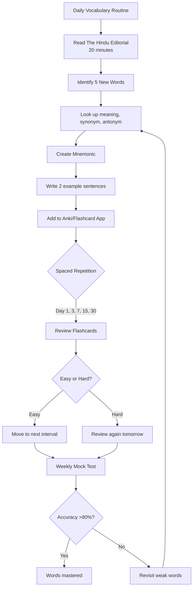
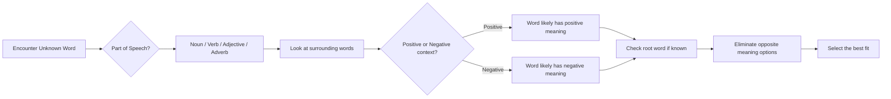

# Chapter 3: Vocabulary & Word Usage

## Learning Objectives

By the end of this chapter, you will be able to:
- Answer synonym and antonym questions with confidence
- Understand and use common idioms and phrases in context
- Master phrasal verbs frequently tested in IBPS exams
- Solve one-word substitution questions efficiently
- Use the correct word based on contextual clues in fillers and cloze tests

<!-- Image Gallery -->
<section class="lesson-visuals" aria-label="Visual learning resources">
  <header><span>VISUAL LEARNING</span><h2>See it. Review it. Remember it.</h2></header>
  <a class="lesson-visual-card" href="../../assets/images/lessons/english-language/03-vocabulary-word-usage/handwritten-notes.png" target="_blank" rel="noopener">
    
    <span><strong>Handwritten notes</strong>Condensed notes for deliberate review.</span>
  </a>
  <a class="lesson-visual-card" href="../../assets/images/lessons/english-language/03-vocabulary-word-usage/sticky-notes.png" target="_blank" rel="noopener">
    
    <span><strong>Sticky-note revision</strong>Fast recall prompts for revision.</span>
  </a>
  <a class="lesson-visual-card" href="../../assets/images/lessons/english-language/03-vocabulary-word-usage/visual-explanation.png" target="_blank" rel="noopener">
    
    <span><strong>Visual concept guide</strong>A connected explanation of the key ideas.</span>
  </a>
</section>
<!-- End Image Gallery -->

---

## Theory

### 3.1 Weightage and Exam Pattern

Vocabulary and word usage accounts for **4–5 questions** in IBPS SO IT Officer Prelims. The topic overlaps with Reading Comprehension (vocabulary-in-context questions) and Cloze Tests.

| Question Type | Frequency | Skill |
|---------------|-----------|-------|
| Synonyms | 1 question | Word meaning |
| Antonyms | 1 question | Opposite meaning |
| Idioms & Phrases | 1 question | Figurative language |
| Phrasal Verbs | 1 question | Verb + preposition combinations |
| One-Word Substitution | 1 question | Concise expression |
| Word Usage in Context | Cloze Test (embedded) | Contextual meaning |

### 3.2 How Vocabulary Is Tested in IBPS

Unlike academic vocabulary tests, IBPS SO English focuses on **functional vocabulary** — words you would encounter in banking, technology, finance, and governance contexts. The words are typically of moderate difficulty (high school to undergraduate level), but their usage in specific contexts is what differentiates correct from incorrect answers.

**Sources of vocabulary in IBPS exams:**
- The Hindu and Business Line editorials
- Banking and financial reports
- Government policy documents
- Technology and cybersecurity articles

### 3.3 Synonyms and Antonyms

**Synonyms** are words with similar meanings. **Antonyms** are words with opposite meanings.

#### High-Frequency Word List for IBPS SO

| Word | Synonym | Antonym |
|------|---------|---------|
| Abundant | Plentiful, copious, ample | Scarce, sparse, meagre |
| Alleviate | Reduce, ease, mitigate | Aggravate, worsen, intensify |
| Ambiguous | Vague, unclear, equivocal | Clear, explicit, definite |
| Benevolent | Kind, generous, charitable | Malevolent, cruel, harsh |
| Brevity | Conciseness, succinctness | Verbosity, prolixity |
| Comprehensive | Thorough, exhaustive, complete | Superficial, incomplete, partial |
| Curtail | Reduce, cut short, diminish | Extend, prolong, expand |
| Deteriorate | Decline, worsen, degenerate | Improve, enhance, ameliorate |
| Diligent | Industrious, assiduous, meticulous | Lazy, negligent, careless |
| Disseminate | Spread, distribute, circulate | Suppress, withhold, conceal |
| Elaborate | Detailed, intricate, complex | Simple, plain, concise |
| Ephemeral | Transient, fleeting, short-lived | Permanent, enduring, perpetual |
| Exacerbate | Worsen, aggravate, intensify | Alleviate, mitigate, soothe |
| Facilitate | Ease, enable, simplify | Hinder, impede, obstruct |
| Formidable | Daunting, intimidating, imposing | Weak, feeble, trivial |
| Genuine | Authentic, real, legitimate | Spurious, fake, counterfeit |
| Hinder | Obstruct, impede, hamper | Facilitate, assist, expedite |
| Imminent | Impending, forthcoming, upcoming | Distant, remote, unlikely |
| Indispensable | Essential, vital, crucial | Dispensable, unnecessary, optional |
| Lucrative | Profitable, remunerative, gainful | Unprofitable, loss-making |
| Meticulous | Thorough, precise, painstaking | Careless, sloppy, negligent |
| Negligible | Trivial, insignificant, minute | Significant, substantial, considerable |
| Obsolete | Outdated, antiquated, archaic | Contemporary, current, modern |
| Perspicacious | Perceptive, insightful, astute | Obtuse, dull, unperceptive |
| Prolific | Productive, fruitful, abundant | Barren, unproductive, scarce |
| Resilient | Flexible, tough, adaptable | Fragile, weak, vulnerable |
| Stringent | Strict, severe, rigorous | Lenient, flexible, relaxed |
| Tranquil | Calm, serene, peaceful | Turbulent, chaotic, agitated |
| Ubiquitous | Omnipresent, pervasive, universal | Rare, scarce, uncommon |
| Versatile | Adaptable, flexible, multi-skilled | Limited, restricted, narrow |

#### Strategy for Synonym/Antonym Questions

1. **Eliminate unfamiliar words first** — if you don't know a word, it is likely the correct answer or a clever distractor. Use elimination based on known words.
2. **Look at the part of speech** — a synonym must be the same part of speech as the given word.
3. **Positive vs Negative connotation** — if the original word is positive, the synonym is likely positive.
4. **Context matters** — the same word can have different synonyms in different contexts.

### 3.4 Idioms and Phrases

Idioms are fixed expressions whose meaning is not literal. IBPS exams typically test **5–6 commonly used idioms** per paper.

#### Must-Know Idioms for Government Exams

| Idiom | Meaning | Example |
|-------|---------|---------|
| A blessing in disguise | A good thing that seemed bad at first | *The project delay was a blessing in disguise — we got a better vendor.* |
| A dime a dozen | Very common | *Such certifications are a dime a dozen now.* |
| A piece of cake | Very easy | *The computer proficiency test was a piece of cake.* |
| Beat around the bush | Avoid the main topic | *Stop beating around the bush and tell us the real issue.* |
| Bite the bullet | Face a difficult situation | *We must bite the bullet and implement the new software.* |
| Break the ice | Start a conversation | *The manager cracked a joke to break the ice.* |
| Burn the midnight oil | Work late at night | *During audit season, the team burned the midnight oil.* |
| Call it a day | Stop working | *It's 9 PM, let's call it a day.* |
| Cut corners | Do something poorly to save money | *The contractor cut corners and the building collapsed.* |
| Devil's advocate | Argue an opposing view for discussion | *Let me play devil's advocate for a moment.* |
| Face the music | Accept consequences | *The executive had to face the music for the fraud.* |
| Hit the nail on the head | Be exactly right | *Your analysis hit the nail on the head.* |
| In a nutshell | Briefly, concisely | *In a nutshell, the project is on schedule.* |
| Let the cat out of the bag | Reveal a secret | *Someone let the cat out of the bag about the merger.* |
| Once in a blue moon | Very rarely | *He visits the branch once in a blue moon.* |
| Out of the blue | Unexpectedly | *The resignation came out of the blue.* |
| Pull someone's leg | Joke or tease | *Don't worry, I'm just pulling your leg.* |
| Ring a bell | Sound familiar | *That name rings a bell but I can't place him.* |
| Sit on the fence | Remain neutral | *You can't sit on the fence forever — decide.* |
| Steal someone's thunder | Take credit for someone's idea | *He stole my thunder by presenting my suggestion first.* |
| Take with a grain of salt | Be sceptical | *Take the projections with a grain of salt.* |
| The ball is in your court | It's your turn to act | *I've done my part — now the ball is in your court.* |
| Under the weather | Feeling ill | *The manager was under the weather so he worked from home.* |
| Up in the air | Uncertain | *The project timeline is still up in the air.* |
| When pigs fly | Never (impossible) | *The system will be upgraded when pigs fly.* |

#### Idiom Question Format

**Typical Question:** Choose the correct meaning of the given idiom/phrase.

*"To burn the midnight oil" means:*
a) To waste time on useless activities
b) To work very late into the night
c) To set fire to something accidentally
d) To work efficiently during the day

**Answer:** b

**Another Format:** Choose the most appropriate option to fill in the blank.

*Despite the losses, the CEO decided to _____ and implement the necessary reforms.*

a) cut corners
b) bite the bullet
c) beat around the bush
d) sit on the fence

**Answer:** b (bite the bullet = confront a difficult situation)

### 3.5 Phrasal Verbs

Phrasal verbs are combinations of a verb + one or more particles (prepositions/adverbs) that create a meaning different from the original verb.

#### High-Frequency Phrasal Verbs for Exams

| Phrasal Verb | Meaning | Example |
|--------------|---------|---------|
| Call off | Cancel | *The meeting was called off.* |
| Carry out | Execute, perform | *The audit was carried out by an external agency.* |
| Come across | Find by chance | *I came across an interesting article.* |
| Cut down on | Reduce | *We must cut down on unnecessary expenses.* |
| Figure out | Solve, understand | *The team figured out the bug.* |
| Get over | Recover from | *The bank got over the financial crisis.* |
| Give up | Quit, surrender | *Never give up on your goals.* |
| Look after | Take care of | *He looks after the IT infrastructure.* |
| Look into | Investigate | *The committee will look into the matter.* |
| Make up | Invent / Reconcile | *She made up a story. / They made up after the argument.* |
| Put off | Postpone | *Don't put off your preparation.* |
| Run out of | Exhaust supply | *The server ran out of storage space.* |
| Set up | Establish | *The company set up a new branch.* |
| Take over | Assume control | *The new CEO took over last month.* |
| Turn down | Reject | *His loan application was turned down.* |
| Work out | Solve / Exercise | *The numbers worked out perfectly.* |

#### Phrasal Verb Question Format

**Question:** Four alternatives are given. Choose the one that best expresses the meaning of the phrasal verb in **bold**.

*The bank decided to **call off** the merger due to regulatory concerns.*

a) Announce
b) Postpone
c) Cancel
d) Propose

**Answer:** c (call off = cancel)

### 3.6 One-Word Substitution

One-word substitution questions test your ability to express a phrase or idea in a single word.

#### Essential One-Word Substitutions

| Phrase | One Word |
|--------|----------|
| That which cannot be read | Illegible |
| That which cannot be believed | Incredible |
| That which cannot be conquered | Invincible |
| That which cannot be seen through | Opaque |
| That which cannot be heard | Inaudible |
| That which cannot be defeated | Invincible |
| That which cannot be corrected | Incorrigible |
| That which cannot be satisfied | Insatiable |
| That which cannot be avoided | Inevitable |
| That which can be easily broken | Fragile |
| That which can be easily carried | Portable |
| That which can be eaten | Edible |
| That which can be drunk | Potable |
| That which lasts for a very short time | Ephemeral |
| That which lasts for a long time | Perennial |
| The study of coins | Numismatics |
| The study of stamps | Philately |
| The study of birds | Ornithology |
| The study of the origin of words | Etymology |
| A person who knows many languages | Polyglot |
| A person who loves books | Bibliophile |
| A person who hates mankind | Misanthrope |
| A person who loves mankind | Philanthropist |
| A person who lives alone | Recluse / Hermit |
| A person who is indifferent to pain or pleasure | Stoic |
| A government by one person | Autocracy |
| A government by the people | Democracy |
| A government by the rich | Plutocracy |
| A government by a few | Oligarchy |
| A government by the nobility | Aristocracy |
| A place where birds are kept | Aviary |
| A place where bees are kept | Apiary |
| A place where weapons and ammunition are stored | Arsenal |
| A place where money is minted | Mint |
| A speech delivered without preparation | Extempore |
| A speech in favour of someone | Tribute / Eulogy |
| Writing or speech that is impossible to understand | Unintelligible |
| Something that is out of place in time | Anachronism |
| Something that is all-powerful | Omnipotent |
| Something that is all-knowing | Omniscient |
| Something that is present everywhere | Omnipresent |
| Killing of a human being | Homicide |
| Killing of oneself | Suicide |
| Killing of a brother | Fratricide |
| Killing of one's father | Patricide |
| Killing of one's mother | Matricide |
| First speech of a person | Maiden speech |
| Last speech of a person | Swan song |
| Handwriting that is difficult to read | Illegible |
| A handwriting expert | Graphologist |
| One who does not believe in God | Atheist |
| One who believes in the existence of God | Theist |
| One who doubts the existence of God | Agnostic |

### 3.7 Homophones and Commonly Confused Words

| Word | Meaning | Example |
|------|---------|---------|
| Accept | To receive | *I accept your proposal.* |
| Except | Excluding | *All except Ravi were present.* |
| Adverse | Unfavourable | *Adverse weather conditions.* |
| Averse | Having a dislike | *He is averse to hard work.* |
| Allusion | Indirect reference | *An allusion to Shakespeare.* |
| Illusion | False perception | *Optical illusion.* |
| Canvas | Cloth | *Oil painting on canvas.* |
| Canvass | To solicit votes | *Canvass for support.* |
| Censor | To remove offensive content | *The board censored the film.* |
| Censure | To criticize severely | *The minister was censured.* |
| Compliment | Praise | *She received compliments.* |
| Complement | That completes | *The wine complements the meal.* |
| Continual | Repeated (with breaks) | *Continual interruptions.* |
| Continuous | Without break | *Continuous rainfall.* |
| Desert | Arid land / To abandon | *The Sahara desert. / He deserted his post.* |
| Dessert | Sweet course | *Ice cream for dessert.* |
| Emigrate | To leave one's country | *He emigrated from India.* |
| Immigrate | To enter a new country | *He immigrated to Canada.* |
| Implicit | Implied (not stated) | *Implicit trust.* |
| Explicit | Clearly stated | *Explicit instructions.* |
| Ingenious | Clever, inventive | *An ingenious solution.* |
| Ingenuous | Innocent, naive | *An ingenuous child.* |
| Judicial | Related to the judiciary | *Judicial system.* |
| Judicious | Wise, prudent | *A judicious decision.* |
| Perpetrate | To commit (crime) | *Perpetrate a fraud.* |
| Perpetuate | To make continue | *Perpetuate the tradition.* |
| Prescribe | To recommend | *The doctor prescribed medicine.* |
| Proscribe | To forbid | *The law proscribes discrimination.* |
| Stationary | Not moving | *The car remained stationary.* |
| Stationery | Writing materials | *Office stationery.* |

### 3.8 Word Usage in Context (Cloze Test Integration)

In Cloze Tests, vocabulary is tested in context. The same word placed in different contexts may require different alternatives.

**Example Context-Based Question:**

*The _____ between the two departments led to project delays.*

a) conflict   b) collaboration   c) synergy   d) integration

**Answer:** a (conflict — negative consequence leads to delays)

*The _____ between the two departments resulted in an award-winning project.*

a) conflict   b) rivalry   c) friction   d) synergy

**Answer:** d (synergy — positive result)

### 3.9 Expanding Vocabulary for Exams

| Method | Description | Example |
|--------|-------------|---------|
| Root Words | Learn Latin/Greek roots | *Bene* (good): benefit, benevolent, beneficial |
| Mnemonics | Memory aids | "Station**ary** has an **a** for **a**rm — not moving" |
| Word Families | Learn related forms | *Mitigate* (v), *mitigation* (n), *mitigating* (adj) |
| Contextual Reading | Learn from editorials | Highlight 5 new words daily from The Hindu |
| Flashcards | Spaced repetition | Use Anki or physical cards |
| Previous Year Papers | Exam-specific vocabulary | Analyse last 5 years of papers |

---

## Examples with Solved Exercises

### Example 1: Synonym Question

**Question:** Choose the correct synonym of the word "AMELIORATE".

a) Worsen
b) Improve
c) Ignore
d) Destroy

**Explanation:**
"Ameniorate" means to make something better or improve. Option (b) is correct. Option (a) "worsen" is the antonym. "Ignore" and "destroy" are unrelated.

**Answer:** b

---

### Example 2: Antonym Question

**Question:** Choose the correct antonym of the word "OBFUSCATE".

a) Confuse
b) Clarify
c) Darken
d) Complicate

**Explanation:**
"Obfuscate" means to make unclear or confusing. Its antonym is "clarify" (to make clear). Options (a), (c), and (d) are all similar in meaning to "obfuscate", not opposite.

**Answer:** b

---

### Example 3: Idiom Question

**Question:** Choose the correct meaning of the idiom "TO STRAIN EVERY NERVE".

a) To become ill
b) To make a great effort
c) To become nervous
d) To relax completely

**Explanation:**
"To strain every nerve" means to make the utmost effort to achieve something. Option (b) is correct.

**Answer:** b

---

### Example 4: Phrasal Verb Question

**Question:** Select the most appropriate meaning of "BREAK DOWN" as used in the sentence: *The negotiations broke down due to disagreements.*

a) Started well
b) Collapsed / Failed
c) Continued smoothly
d) Were rescheduled

**Explanation:**
"Break down" in this context means to fail or collapse. The negotiations could not reach an agreement.

**Answer:** b

---

### Example 5: One-Word Substitution

**Question:** Select the one-word substitute for: "A speech delivered without any preparation".

a) Oration
b) Extempore
c) Lecture
d) Discourse

**Explanation:**
"Extempore" refers to a speech delivered without preparation. "Oration" is a formal speech, but not necessarily unprepared. "Lecture" and "discourse" imply preparation.

**Answer:** b

---

### Example 6: Contextual Vocabulary (Cloze Test)

**Passage:** The bank's new mobile application was designed to _____ financial inclusion by simplifying account opening procedures. However, the initial rollout was _____ by technical glitches. Customers reported that the app _____ frequently, causing frustration. The IT team worked _____ to resolve the issues and released an update within 48 hours.

**Blanks:**

(1) a) hinder  b) promote  c) prevent  d) restrict
(2) a) enhanced  b) smoothened  c) marred  d) improved
(3) a) functioned  b) crashed  c) operated  d) succeeded
(4) a) leisurely  b) reluctantly  c) diligently  d) carelessly

**Explanation:**
1. The app was designed to "promote" financial inclusion (positive purpose). Hinder/prevent/restrict are opposite.
2. "Marred by technical glitches" means spoiled by problems. Enhanced/smoothened/improved are opposite.
3. "Crashed frequently" — technical glitches cause apps to crash.
4. "Worked diligently" — the team worked hard and carefully.

**Answers:** 1-b, 2-c, 3-b, 4-c

---

## 📝 Solved Examples (20 MCQs)

### Section A: Synonyms (Q1-Q5)

**Q1.** Choose the synonym of "OBFUSCATE":

a) Clarify   b) Confuse   c) Simplify   d) Illuminate

<details>
<summary>Answer</summary>
b) Confuse. "Obfuscate" means to make something unclear, confusing, or difficult to understand. Option (a) clarify, (c) simplify, and (d) illuminate are all antonyms.
</details>

---

**Q2.** Choose the synonym of "PERSPICACIOUS":

a) Dull   b) Perceptive   c) Careless   d) Ignorant

<details>
<summary>Answer</summary>
b) Perceptive. "Perspicacious" means having a ready insight into things; mentally sharp. Options (a), (c), and (d) are all antonyms.
</details>

---

**Q3.** Choose the synonym of "PUGNACIOUS":

a) Peaceful   b) Aggressive   c) Timid   d) Gentle

<details>
<summary>Answer</summary>
b) Aggressive. "Pugnacious" means eager or quick to argue, quarrel, or fight. Options (a), (c), and (d) are all antonyms.
</details>

---

**Q4.** Choose the synonym of "RECONDITE":

a) Obvious   b) Simple   c) Obscure   d) Clear

<details>
<summary>Answer</summary>
c) Obscure. "Recondite" means little known, abstruse, or dealing with very profound subject matter. Options (a), (b), and (d) are all antonyms.
</details>

---

**Q5.** Choose the synonym of "LACONIC":

a) Verbose   b) Wordy   c) Brief   d) Lengthy

<details>
<summary>Answer</summary>
c) Brief. "Laconic" means using very few words; concise. Options (a), (b), and (d) are all antonyms.
</details>

---

### Section B: Antonyms (Q6-Q10)

**Q6.** Choose the antonym of "EXACERBATE":

a) Worsen   b) Aggravate   c) Alleviate   d) Intensify

<details>
<summary>Answer</summary>
c) Alleviate. "Exacerbate" means to make worse. "Alleviate" means to make less severe — opposite. Options (a), (b), and (d) are synonyms.
</details>

---

**Q7.** Choose the antonym of "PERNICIOUS":

a) Harmful   b) Destructive   c) Beneficial   d) Damaging

<details>
<summary>Answer</summary>
c) Beneficial. "Pernicious" means having a harmful effect, especially in a gradual or subtle way. "Beneficial" is the opposite. Options (a), (b), and (d) are synonyms.
</details>

---

**Q8.** Choose the antonym of "SERENDIPITY":

a) Fortune   b) Luck   c) Misfortune   d) Chance

<details>
<summary>Answer</summary>
c) Misfortune. "Serendipity" means the occurrence of events by chance in a happy or beneficial way. "Misfortune" means bad luck — opposite. Options (a), (b), and (d) are related to serendipity.
</details>

---

**Q9.** Choose the antonym of "TACITURN":

a) Reserved   b) Silent   c) Talkative   d) Reticent

<details>
<summary>Answer</summary>
c) Talkative. "Taciturn" means reserved or uncommunicative in speech. "Talkative" means fond of talking — opposite. Options (a), (b), and (d) are synonyms.
</details>

---

**Q10.** Choose the antonym of "MENDACIOUS":

a) Lying   b) Truthful   c) Deceitful   d) Dishonest

<details>
<summary>Answer</summary>
b) Truthful. "Mendacious" means not telling the truth; lying. "Truthful" is the direct opposite. Options (a), (c), and (d) are synonyms.
</details>

---

### Section C: Idioms & Phrases (Q11-Q15)

**Q11.** What is the meaning of "TO BEAT THE BUSH"?

a) To hunt for something   b) To avoid the main topic   c) To celebrate   d) To work hard

<details>
<summary>Answer</summary>
a) To hunt for something. "To beat the bush" originally referred to hunters beating bushes to flush out game; now means to search thoroughly. Note: "Beat around the bush" (b) is a different idiom meaning to avoid the topic. This question tests the distinction.
</details>

---

**Q12.** What is the meaning of "TO PLAY DEVIL'S ADVOCATE"?

a) To support an evil person   b) To argue an opposing view for discussion   c) To act as a lawyer for the devil   d) To defend the indefensible

<details>
<summary>Answer</summary>
b) To argue an opposing view for discussion. Playing devil's advocate means adopting a contrary position for the sake of debate, not because one actually holds that view.
</details>

---

**Q13.** Choose the correct idiom for the blank: *The new project failed because the team decided to _____ on quality checks.*

a) bite the bullet   b) cut corners   c) call it a day   d) sit on the fence

<details>
<summary>Answer</summary>
b) cut corners. "Cut corners" means to do something poorly or cheaply to save time or money. This led to the project's failure. "Bite the bullet" means face difficulty, "call it a day" means stop working, "sit on the fence" means remain neutral.
</details>

---

**Q14.** Choose the correct idiom: *Despite the losses, the CEO decided to _____ and implement the necessary reforms.*

a) spill the beans   b) bite the bullet   c) let the cat out of the bag   d) pull someone's leg

<details>
<summary>Answer</summary>
b) bite the bullet. "Bite the bullet" means to face a difficult or unpleasant situation with courage. The context (despite losses, implementing tough reforms) matches this meaning.
</details>

---

**Q15.** What is the meaning of "TO THROW IN THE TOWEL"?

a) To start something new   b) To give up or concede defeat   c) To clean up   d) To challenge someone

<details>
<summary>Answer</summary>
b) To give up or concede defeat. The idiom originates from boxing, where a towel thrown into the ring signals surrender. It means to accept that one cannot succeed and to stop trying.
</details>

---

### Section D: Phrasal Verbs (Q16-Q17)

**Q16.** Choose the correct phrasal verb: *The audit committee will _____ the allegations of fraud.*

a) look into   b) look after   c) look for   d) look up

<details>
<summary>Answer</summary>
a) look into. "Look into" means to investigate. "Look after" means to take care of. "Look for" means to search. "Look up" means to find information.
</details>

---

**Q17.** Choose the correct phrasal verb: *The old system was _____ by a modern ERP platform.*

a) taken over   b) taken up   c) taken in   d) taken off

<details>
<summary>Answer</summary>
a) taken over. "Taken over" means replaced or assumed control. "Taken up" means started a hobby/activity. "Taken in" means deceived or absorbed. "Taken off" means removed or departed.
</details>

---

### Section E: One-Word Substitution (Q18-Q20)

**Q18.** One-word substitute for: "A person who knows many languages":

a) Linguist   b) Polyglot   c) Orator   d) Philologist

<details>
<summary>Answer</summary>
b) Polyglot. "Polyglot" specifically means a person who knows and is able to use several languages. "Linguist" is a specialist in linguistics. "Orator" is a public speaker. "Philologist" studies language history.
</details>

---

**Q19.** One-word substitute for: "That which cannot be corrected":

a) Incorrigible   b) Inevitable   c) Invincible   d) Infallible

<details>
<summary>Answer</summary>
a) Incorrigible. "Incorrigible" means not able to be corrected, improved, or reformed. "Inevitable" means unavoidable. "Invincible" means unconquerable. "Infallible" means incapable of making mistakes.
</details>

---

**Q20.** One-word substitute for: "A government by the wealthy":

a) Democracy   b) Plutocracy   c) Aristocracy   d) Autocracy

<details>
<summary>Answer</summary>
b) Plutocracy. "Plutocracy" means government by the richest people. "Democracy" is by the people. "Aristocracy" is by the nobility. "Autocracy" is by a single person.
</details>

---

## TypeScript Example: Vocabulary Analyzer & Synonym Matcher

```typescript
interface VocabularyWord {
  word: string;
  synonym: string;
  antonym: string;
  mnemonics: string;
  partOfSpeech: string;
  usageExample: string;
}

interface QuizQuestion {
  type: "synonym" | "antonym" | "idiom" | "phrasal_verb" | "one_word";
  stem: string;
  options: string[];
  correctIndex: number;
  explanation: string;
}

class VocabularyBank {
  private words: Map&lt;string, VocabularyWord&gt; = new Map();

  addWord(entry: VocabularyWord): void {
    this.words.set(entry.word.toLowerCase(), entry);
  }

  getRandomWord(): VocabularyWord | undefined {
    const entries = Array.from(this.words.values());
    return entries[Math.floor(Math.random() * entries.length)];
  }

  generateSynonymQuiz(): QuizQuestion {
    const target = this.getRandomWord()!;
    const allSyns = Array.from(this.words.values())
      .filter(w => w.word !== target.word)
      .map(w => w.synonym);

    // Pick 3 distractors and shuffle with correct answer
    const distractors = this.shuffle(allSyns).slice(0, 3);
    const options = this.shuffle([target.synonym, ...distractors]);
    const correctIndex = options.indexOf(target.synonym);

    return {
      type: "synonym",
      stem: `Choose the synonym of "${target.word.toUpperCase()}":`,
      options,
      correctIndex,
      explanation: `"${target.word}" means "${target.synonym}". ${target.mnemonics}`,
    };
  }

  generateAntonymQuiz(): QuizQuestion {
    const target = this.getRandomWord()!;
    const allAnts = Array.from(this.words.values())
      .filter(w => w.word !== target.word)
      .map(w => w.antonym);

    const distractors = this.shuffle(allAnts).slice(0, 3);
    const options = this.shuffle([target.antonym, ...distractors]);
    const correctIndex = options.indexOf(target.antonym);

    return {
      type: "antonym",
      stem: `Choose the antonym of "${target.word.toUpperCase()}":`,
      options,
      correctIndex,
      explanation: `"${target.word}" means "${target.synonym}". Its opposite is "${target.antonym}".`,
    };
  }

  private shuffle&lt;T&gt;(arr: T[]): T[] {
    const result = [...arr];
    for (let i = result.length - 1; i > 0; i--) {
      const j = Math.floor(Math.random() * (i + 1));
      [result[i], result[j]] = [result[j], result[i]];
    }
    return result;
  }
}

// Build vocabulary bank for IBPS SO exam prep
const bank = new VocabularyBank();
const examWords: VocabularyWord[] = [
  { word: "ameliorate", synonym: "improve", antonym: "worsen", mnemonics: "A-MELIOR-ate: 'melior' is Latin for better", partOfSpeech: "verb", usageExample: "The new policy ameliorated the crisis." },
  { word: "comprehensive", synonym: "thorough", antonym: "superficial", mnemonics: "Comprehensive = 'com-' (completely) + 'prehendere' (to grasp)", partOfSpeech: "adjective", usageExample: "A comprehensive audit was conducted." },
  { word: "diligent", synonym: "hardworking", antonym: "lazy", mnemonics: "Diligent = 'di-ligent' → 'do it diligent(ly)'", partOfSpeech: "adjective", usageExample: "The diligent officer completed the task on time." },
  { word: "ephemeral", synonym: "fleeting", antonym: "permanent", mnemonics: "Ephemeral = 'E-phem-era-l' → 'E' (short) life", partOfSpeech: "adjective", usageExample: "The joy was ephemeral." },
  { word: "facilitate", synonym: "ease", antonym: "hinder", mnemonics: "Facilitate = 'facil' (easy) + 'itate' → make easy", partOfSpeech: "verb", usageExample: "Technology facilitates banking." },
  { word: "stringent", synonym: "strict", antonym: "lenient", mnemonics: "Stringent = 'string' + 'gent' → pulled tight like a string", partOfSpeech: "adjective", usageExample: "Stringent regulations were imposed." },
  { word: "ubiquitous", synonym: "omnipresent", antonym: "rare", mnemonics: "Ubiquitous = 'ubi' (where) + 'que' (and) → everywhere", partOfSpeech: "adjective", usageExample: "Smartphones are ubiquitous." },
  { word: "resilient", synonym: "adaptable", antonym: "fragile", mnemonics: "Resilient = 're-silent' → bounces back silently", partOfSpeech: "adjective", usageExample: "The resilient economy recovered quickly." },
];

for (const w of examWords) bank.addWord(w);

// Generate quiz questions
console.log("=== SYNONYM QUIZ ===");
console.log(bank.generateSynonymQuiz());
console.log("\n=== ANTONYM QUIZ ===");
console.log(bank.generateAntonymQuiz());
```

## Mermaid Flowchart: Vocabulary Learning Strategy



## Mermaid Flowchart: Contextual Meaning Detection



---

## 📖 Exercise Bank (30 Questions)

### Section A: Synonyms (Q1-Q5)

Choose the correct synonym:

1. **SERENDIPITY** — a) Misfortune  b) Chance  c) Planning  d) Disaster
2. **MALEVOLENT** — a) Kind  b) Spiteful  c) Generous  d) Benevolent
3. **LETHARGIC** — a) Energetic  b) Sluggish  c) Active  d) Alert
4. **VINDICATE** — a) Blame  b) Justify  c) Accuse  d) Punish
5. **AUSPICIOUS** — a) Unfavourable  b) Promising  c) Suspicious  d) Ominous

### Section B: Antonyms (Q6-Q10)

Choose the correct antonym:

6. **BENEVOLENT** — a) Charitable  b) Malevolent  c) Kind  d) Generous
7. **FRUGAL** — a) Economical  b) Thrifty  c) Extravagant  d) Modest
8. **HUBRIS** — a) Humility  b) Arrogance  c) Pride  d) Vanity
9. **EQUANIMITY** — a) Calmness  b) Agitation  c) Composure  d) Serenity
10. **SANGUINE** — a) Optimistic  b) Pessimistic  c) Hopeful  d) Confident

### Section C: Idioms (Q11-Q15)

Choose the correct meaning:

11. **TO HAVE AN AXE TO GRIND** — a) To be angry with someone  b) To have a hidden personal motive  c) To be very tired  d) To be very hungry
12. **TO STRAIN EVERY NERVE** — a) To become ill  b) To make a great effort  c) To become nervous  d) To relax completely
13. **TO FALL PREY TO** — a) To hunt for food  b) To deceive someone  c) To be victimised by  d) To escape danger
14. **TO TURN A DEAF EAR** — a) To listen carefully  b) To ignore deliberately  c) To hear a loud noise  d) To become deaf
15. **TO GO THE EXTRA MILE** — a) To travel farther  b) To make a special effort  c) To get lost  d) To give up

### Section D: Phrasal Verbs (Q16-Q20)

Replace the underlined phrase with the correct phrasal verb:

16. The government decided to **cancel** the subsidy programme. — a) call off  b) call in  c) call out  d) call for
17. The auditor will **investigate** the financial discrepancies. — a) look after  b) look into  c) look for  d) look up
18. The old system was **replaced** by a new one. — a) taken in  b) taken over  c) taken off  d) taken down
19. The proposal was **rejected** by the board. — a) turned up  b) turned down  c) turned in  d) turned out
20. The meeting was **postponed** until next week. — a) put off  b) put on  c) put out  d) put in

### Section E: One-Word Substitution (Q21-Q25)

21. A speech delivered without preparation — a) Oration  b) Extempore  c) Lecture  d) Discourse
22. That which cannot be seen through — a) Transparent  b) Opaque  c) Visible  d) Clear
23. A person who hates mankind — a) Philanthropist  b) Misanthrope  c) Polyglot  d) Bibliophile
24. The study of coins — a) Philately  b) Numismatics  c) Ornithology  d) Etymology
25. A place where bees are kept — a) Aviary  b) Apiary  c) Arsenal  d) Mint

### Section F: Contextual Usage (Q26-Q30)

Choose the most appropriate word for each blank:

26. *The _____ between the two departments led to project delays.* a) synergy  b) collaboration  c) conflict  d) cooperation
27. *The bank's _____ policies ensured minimal losses during the economic downturn.* a) reckless  b) imprudent  c) prudent  d) careless
28. *The speaker was asked to be _____ as the time was limited.* a) verbose  b) brief  c) lengthy  d) rambling
29. *The _____ of the new software was seamless.* a) elimination  b) removal  c) implementation  d) obstruction
30. *The manager's _____ remark left everyone confused.* a) clear  b) lucid  c) ambiguous  d) explicit

---

### Themed Word List (200+ Words with Mnemonics)

#### Banking & Finance Theme

| Word | Meaning | Mnemonic |
|------|---------|----------|
| Amortise | Gradually pay off debt | "A-mort-ise" → A mortgage payment plan |
| Collateral | Security pledged for loan | "Collateral" sounds like "collateral damage" — you lose it if you default |
| Defaulter | One who fails to repay | "De-fault-er" → fault in payment |
| Disbursement | Paying out money | "Dis-burse-ment" → Burse = purse; paying from purse |
| Equitable | Fair and just | "Equi-table" → equal table for all |
| Fiduciary | Involving trust | "Fiduci-ary" → 'fides' = faith/trust in Latin |
| Gratuitous | Unnecessary, free | "Gratis" = free; gratuitous = done without good reason |
| Hedging | Reducing financial risk | "Hedge" = a fence; hedging fences off risk |
| Insolvency | Inability to pay debts | "In-solvent" → not able to solve/settle |
| Leverage | Use of borrowed capital | "Lever-age" → using a lever to amplify force |
| Liquidity | Availability of cash | "Liquid" → flows easily like water |
| Moratorium | Temporary suspension | "Moratorium" → 'morari' = to delay (Latin) |
| Pecuniary | Relating to money | "Pecuniary" → 'pecunia' = money (Latin) |
| Prudent | Wise, cautious | "Prudent" → 'prudens' = 'providens' (foreseeing) |
| Remuneration | Payment, salary | "Re-muner-ation" → 'munus' = gift (Latin) |
| Solvent | Able to pay debts | "Solvent" → able to 'solve' financial obligations |
| Subvention | Grant, subsidy | "Sub-vention" → 'sub' (under) + 'venire' (come) — coming to help |
| Tenure | Term of holding | "Tenure" → 'tenere' = to hold (Latin) |
| Underwrite | Guarantee to buy | Under + write → signing at the bottom |
| Usury | Excess interest | "Usury" sounds like "use" + "ury" → using someone's need |

#### Technology & Cybersecurity Theme

| Word | Meaning | Mnemonic |
|------|---------|----------|
| Algorithm | Step-by-step procedure | "Algo-rithm" → 'Al-Khwarizmi' (Persian mathematician) |
| Bandwidth | Data transfer capacity | Band + width → width of a band (of frequencies) |
| Breach | Security violation | "Breach" = break — a break in security |
| Cryptography | Secure communication | "Crypto" = hidden, "graphy" = writing |
| Decryption | Converting encrypted data | "De-crypt" → reverse of encrypt |
| Encryption | Converting to code | "En-crypt" → put into a crypt (hidden) |
| Forensic | Related to investigation | "Forensic" → 'forum' (Latin) — where trials happen |
| Intrusion | Unauthorised entry | "In-trusion" → 'in' + 'trudere' (thrust) |
| Malware | Malicious software | "Mal" = bad + "ware" = software |
| Mitigation | Making less severe | "Mitigate" → 'mitis' (mild, soft) |
| Phishing | Fraudulent data theft | "Phishing" = password + fishing |
| Ransomware | Malware demanding payment | "Ransom" + "ware" — holds data hostage |
| Redundancy | Backup system | "Re-dundant" → flowing over (for backup) |
| Scalability | Ability to handle growth | "Scal(e)-ability" → ability to scale |
| Vulnerability | Weakness | "Vulnerability" → 'vulnus' = wound (Latin) |

#### Governance & Administration Theme

| Word | Meaning | Mnemonic |
|------|---------|----------|
| Adjudicate | Make a formal judgement | "Ad-judge-icate" → to act as a judge |
| Bureaucracy | Government administration | "Bureau" (desk) + "cracy" (rule) → rule by desk officers |
| Consensus | General agreement | "Con-sensus" → 'con' (together) + 'sentire' (feel) |
| Deliberation | Careful discussion | "De-liber-ation" → 'libera' (balance) — weighing options |
| Enfranchise | Give voting rights | "En-franchise" → 'franc' = free |
| Franchise | Right to vote | Same root: 'franc' = free |
| Grievance | Formal complaint | "Grief" + "ance" → grief expressed formally |
| Jurisdiction | Legal authority | "Juris" (law) + "dictio" (saying) |
| Legislation | Making laws | "Legis" (law) + "lation" → making laws |
| Mandate | Official order | "Mandate" → 'manus' (hand) + 'dare' (give) |
| Preamble | Introductory statement | "Pre-amble" → 'pre' (before) + 'ambulare' (walk) |
| Quorum | Minimum members needed | "Quorum" → 'qui' (who) — "of whom" a certain number |
| Ratify | Approve formally | "Rat-ify" → 'ratus' (reckoned/approved) |
| Suffrage | Right to vote | "Suffrage" → 'suffragium' (voting tablet) |
| Tribunal | Court of justice | "Tribunal" → 'tribus' (tribe) — tribal court |
| Veto | Reject a decision | "Veto" = "I forbid" (Latin) |
| Whip | Party enforcer | From hunting — whipping members into line |
| Zenith | Highest point | "Zenith" = Arabic 'samt' (path over head) |
| Zonal | Divided into zones | "Zona" = belt/girdle (Greek) |

#### Abstract & Philosophical Theme

| Word | Meaning | Mnemonic |
|------|---------|----------|
| Altruism | Selfless concern for others | "Altruism" → 'alter' (other) — thinking of others |
| Ambivalence | Mixed feelings | "Ambi" (both) + "valence" (strength) |
| Apathy | Lack of interest | "A" (without) + "pathos" (feeling) |
| Cacophony | Harsh mixture of sounds | "Caco" (bad) + "phony" (sound) |
| Catharsis | Emotional release | "Catharsis" → 'kathairein' (to cleanse, Greek) |
| Dichotomy | Division into two parts | "Dicho" (two) + "tomy" (cutting) |
| Dogma | Unquestionable belief | "Dogma" = opinion (Greek) — opinions that became rigid |
| Eclectic | Deriving from various sources | "Ek" (out) + "legein" (pick) |
| Elucidate | Make clear | "E-lucid-ate" → 'lux' (light) — bring to light |
| Emulate | Match or surpass | "Aemulus" = rival (Latin) |
| Enigma | Mysterious person/thing | "Enigma" → 'ainigma' (riddle, Greek) |
| Ephemeral | Short-lived | "Epi" (on) + "hemera" (day) — lasting only a day |
| Equivocal | Open to interpretation | "Equi" (equal) + "vox" (voice) — two equal meanings |
| Erudite | Having great knowledge | "E" (out) + "rudis" (rough) — polished from rough |
| Esoteric | Intended for few | "Eso" (inside) — understood only by insiders |
| Fastidious | Very attentive to detail | "Fastidium" (disgust) — tries to avoid anything imperfect |
| Gregarious | Fond of company | "Grex" (flock) — like a sheep in a flock |
| Iconoclast | Attacker of beliefs | "Eikon" (image) + "klastes" (breaker) |
| Ideology | System of ideas | "Idea" + "logos" (study/word) |
| Juxtapose | Place side by side | "Juxta" (next to) + "posere" (to place) |
| Morose | Sullen and gloomy | "Morose" sounds like "morbid" → gloomy |
| Nefarious | Wicked, criminal | "Ne" (not) + "fas" (divine law) |
| Nostalgia | Longing for the past | "Nostos" (return) + "algia" (pain) |
| Ominous | Giving evil sign | "Omen" — full of omens |
| Paradox | Self-contradictory statement | "Para" (contrary) + "doxa" (opinion) |
| Pedantic | Overly concerned with detail | "Pedant" = teacher who shows off learning |
| Pragmatic | Dealing with practical matters | "Pragma" (deed/action, Greek) |
| Quintessential | Perfect example | "Quinta essentia" — the fifth element (medieval philosophy) |
| Redundant | Not or no longer needed | "Re" (again) + "undare" (to surge) — surging back |
| Sceptical | Not easily convinced | "Skepsis" (inquiry, Greek) |
| Sophistry | Fallacious reasoning | From Sophists — ancient Greek teachers of rhetoric |
| Spurious | Not genuine, false | "Spurius" = illegitimate (Latin) |
| Subjective | Based on personal feelings | "Sub" (under) + "jacere" (throw) — thrown under |
| Succinct | Briefly expressed | "Succinctus" = tucked up (Latin) — short |
| Superfluous | Unnecessary, extra | "Super" (above) + "fluere" (to flow) |
| Sycophant | Person who flatters | "Sykon" (fig) + "phainein" (show) — fig-showers |
| Trivial | Of little importance | "Trivium" — the three basic arts (considered elementary) |
| Verbose | Using more words than needed | "Verbum" (word) — full of words |
| Vicarious | Experienced through others | "Vicarius" (substitute) |
| Whimsical | Playfully unusual | "Whim-wham" = fanciful object |
| Zealot | Extreme enthusiast | "Zelos" = zeal (Greek) |

**Answer Key:**

| Q | Answer | Q | Answer | Q | Answer | Q | Answer | Q | Answer |
|---|--------|---|--------|---|--------|---|--------|---|--------|
| 1 | b) Chance | 2 | b) Spiteful | 3 | b) Sluggish | 4 | b) Justify | 5 | b) Promising |
| 6 | b) Malevolent | 7 | c) Extravagant | 8 | a) Humility | 9 | b) Agitation | 10 | b) Pessimistic |
| 11 | b) Hidden personal motive | 12 | b) Make a great effort | 13 | c) Be victimised by | 14 | b) Ignore deliberately | 15 | b) Make a special effort |
| 16 | a) call off | 17 | b) look into | 18 | b) taken over | 19 | b) turned down | 20 | a) put off |
| 21 | b) Extempore | 22 | b) Opaque | 23 | b) Misanthrope | 24 | b) Numismatics | 25 | b) Apiary |
| 26 | c) conflict | 27 | c) prudent | 28 | b) brief | 29 | c) implementation | 30 | c) ambiguous |

---

## Summary

- Vocabulary carries **4–5 questions** in IBPS SO Prelims, plus embedded questions in RC and Cloze
- **Synonyms and Antonyms**: Know high-frequency word pairs; use part-of-speech and connotation cues
- **Idioms**: 25–30 common idioms are enough for all exams; learn their exact meanings
- **Phrasal Verbs**: Same verb can combine with different particles to create completely different meanings
- **One-Word Substitution**: Focus on "ible/able" words, government types, killing terms, and profession-related words
- **Contextual vocabulary**: The same word can have different meanings in different contexts
- Daily reading of The Hindu editorials with active vocabulary tracking is the most effective long-term strategy

---

## Practical Takeaways

| Strategy | Implementation |
|----------|----------------|
| Daily 20 words | Learn 20 new words daily — use a notebook or app |
| Editorial reading | Read one editorial daily and note 5 unfamiliar words |
| Previous year analysis | Collect all vocabulary words from last 5 years of your target exam |
| Flashcards | Use spaced repetition for long-term retention |
| Mock tests | After each mock, review ALL vocabulary questions (including the ones you got right) |
| Root words | Learn 15 common prefixes and suffixes to guess unfamiliar words |
| Theme grouping | Group words by theme (banking, technology, governance) for efficient learning |

---

## Chapter Quiz

**Q1.** Choose the synonym of "PROLIFERATE":

a) Decrease
b) Multiply
c) Stabilise
d) Control

<details>
<summary>Show Answer</summary>

**Answer:** b) Multiply

"Proliferate" means to increase rapidly in number. "Multiply" is the closest synonym.
</details>

---

**Q2.** Choose the antonym of "STRINGENT":

a) Strict
b) Severe
c) Lenient
d) Rigorous

<details>
<summary>Show Answer</summary>

**Answer:** c) Lenient

"Stringent" means strict or severe. "Lenient" (merciful or tolerant) is the opposite. All other options are synonyms.
</details>

---

**Q3.** What is the meaning of the idiom "TO TAKE WITH A GRAIN OF SALT"?

a) To accept something completely
b) To be sceptical about something
c) To add flavour to food
d) To make something salty

<details>
<summary>Show Answer</summary>

**Answer:** b) To be sceptical about something

"To take with a grain of salt" means to view something with scepticism, not accepting it as completely true.
</details>

---

**Q4.** Select the correct phrasal verb: *The government has decided to _____ a committee to investigate the matter.*

a) set up
b) set in
c) set out
d) set aside

<details>
<summary>Show Answer</summary>

**Answer:** a) set up

"Set up" means to establish or create. "Set in" means to begin and continue. "Set out" means to start a journey. "Set aside" means to reserve or ignore.
</details>

---

**Q5.** One-word substitution for: "That which cannot be read".

a) Illiterate
b) Illegible
c) Ineligible
d) Illegal

<details>
<summary>Show Answer</summary>

**Answer:** b) Illegible

"Illegible" refers to handwriting or text that cannot be read. "Illiterate" means unable to read. "Ineligible" means not qualified. "Illegal" means against the law.
</details>

---

## Exercises

### Exercise 1: Synonyms

Choose the correct synonym for each word:

1. **RECALCITRANT** — a) Obedient  b) Stubborn  c) Flexible  d) Cooperative
2. **AUSPICIOUS** — a) Unfavourable  b) Promising  c) Suspicious  d) Dangerous
3. **PERNICIOUS** — a) Harmful  b) Beneficial  c) Harmless  d) Pleasant
4. **TACITURN** — a) Talkative  b) Reserved  c) Emotional  d) Expressive
5. **VINDICATE** — a) Blame  b) Justify  c) Accuse  d) Punish

### Exercise 2: Antonyms

Choose the correct antonym for each word:

1. **AMICABLE** — a) Hostile  b) Friendly  c) Peaceful  d) Cordial
2. **FRUGAL** — a) Economical  b) Extravagant  c) Thrifty  d) Modest
3. **HUBRIS** — a) Arrogance  b) Humility  c) Pride  d) Vanity
4. **LETHARGIC** — a) Energetic  b) Sluggish  c) Tired  d) Lazy
5. **SERENE** — a) Calm  b) Turbulent  c) Peaceful  d) Tranquil

### Exercise 3: Idioms

Match the idiom with its correct meaning:

| Idiom | Meaning |
|-------|---------|
| 1. Spill the beans | a) To endure a difficult situation |
| 2. Bite off more than you can chew | b) To reveal a secret |
| 3. Through thick and thin | c) To attempt more than one can handle |
| 4. The last straw | d) In all circumstances, good and bad |
| 5. Bite the bullet | e) The final problem in a series |

### Exercise 4: Phrasal Verbs

Fill in the blanks with the correct phrasal verb:

1. The audit committee will _____ the allegations of fraud. (investigate)
2. The old system was _____ by a modern ERP platform. (replaced)
3. We need to _____ a contingency plan for emergencies. (create/establish)
4. The meeting was _____ because of the strike. (cancelled)
5. The employee decided to _____ the job offer from the competitor. (reject)

### Exercise 5: One-Word Substitution

Write the single word that substitutes each phrase:

1. A person who writes the life history of another person — __________
2. A place where dead bodies are kept for identification — __________
3. The practice of marrying one person at a time — __________
4. Animals that can live on land and in water — __________
5. A cure for all diseases — __________

---

*Proceed to Chapter 4 — Verbal Ability*
