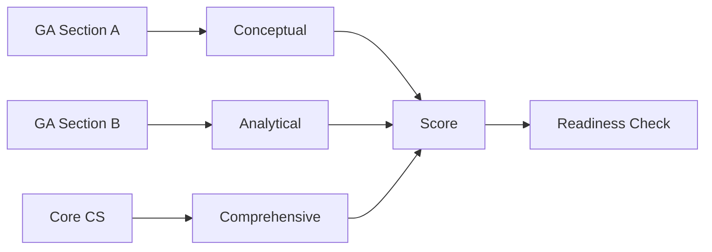

# GATE CS Mock Test 6 → Full-Length Practice Paper

## Chapter at a Glance

| Aspect | Details |
|--------|---------|
| Exam | GATE CS Full-Length Mock |
| Total Marks | 100 |
| Duration | 3 Hours |
| Sections | General Aptitude + Core CS |
| Purpose | Pre-final readiness |

## Roadmap

## Concept Comparison

| Concept | Key Insight | Practical Takeaway |
|--------|-------------|-------------------|

| Feature | Section A | Section B |
|--- |--- |--- |
| Type | MCQs | MCQs + NATs |
| Marks | 55 | 45 |
| Questions | 25 | 40 |
| Difficulty | High | Very High |
| Strategy | Secure easy marks first | Attempt partial solutions |

## Quick Reference

| Term | Definition |
|--- |--- |
| Pre-Final Assessment | Readiness check before actual exam |
| Difficulty Curve | Progression of question hardness |
| Stress Management | Maintaining composure during exam |
| Last-Minute Revision | Final review strategy |
| Time Allocation | Distribution of minutes across sections |

## Pro Tips & Reminders

> **Pro Tip:** With the actual exam approaching, focus more on revision than new topics. Consolidate what you already know.
>
> **Remember:** Your preparation level is higher than you think - trust your practice and stay confident.

## Exam Instructions

**Total Marks:** 100  
**Duration:** 3 Hours  
**Reading Time:** 10 minutes

**Marking Scheme:**

| Questions | Type | Marks | Negative Marking |
|-----------|------|-------|-----------------|
| Q1–Q10 (GA) | MCQ | 1 each | −1/3 |
| Q11–Q15 (GA) | MCQ | 2 each | −2/3 |
| Q16–Q20 (Math) | MCQ | 1 each | −1/3 |
| Q21–Q25 (Math) | MCQ | 2 each | −2/3 |
| Q26–Q45 (Technical) | MCQ | 1 each | −1/3 |
| Q46–Q55 (Technical) | MCQ | 2 each | −2/3 |

**Difficulty:** Moderate

---

## Section A: General Aptitude (Questions 1–15)

**Q1 (1 Mark):** Select the word that is OPPOSITE in meaning to "SANGUINE":

(A) Pessimistic
(B) Optimistic
(C) Confident
(D) Cheerful

---

**Q2 (1 Mark):** A man saves 15% of his monthly income. If his monthly expenditure is ₹42,500, what is his total monthly income?

(A) ₹48,000
(B) ₹50,000
(C) ₹52,000
(D) ₹55,000

---

**Q3 (1 Mark):** Identify the sentence with correct grammatical structure:

(A) He is more taller than his brother.
(B) He is taller than his brother.
(C) He is more tall than his brother.
(D) He is tallest than his brother.

---

**Q4 (1 Mark):** In a group of 150 students, 80 like cricket, 70 like football, and 30 like both. How many students like neither sport?

(A) 10
(B) 20
(C) 30
(D) 40

---

**Q5 (1 Mark):** Statement: All roses are flowers. Some flowers fade quickly.  
Conclusion I: Some roses fade quickly.  
Conclusion II: Some flowers are roses.  
Which conclusion(s) logically follow(s)?

(A) Only I
(B) Only II
(C) Both I and II
(D) Neither I nor II

---

**Q6 (1 Mark):** Find the next term in the sequence: 1, 9, 25, 49, 81, ?

(A) 100
(B) 121
(C) 144
(D) 169

---

**Q7 (1 Mark):** In a certain code, "TIGER" is written as "QFDBO". Using the same rule, how is "LION" coded?

(A) IFKK
(B) IFLK
(C) IGLK
(D) IFLJ

---

**Q8 (1 Mark):** A man walks 10 km east, then 6 km north, then 2 km west. How far is he from his starting point?

(A) 8 km
(B) 9 km
(C) 10 km
(D) 12 km

---

**Q9 (1 Mark):** In a code language, "all is well" = "to sa ne", "well done" = "ne ka", "do good" = "pa lo". What is the code for "done"?

(A) to
(B) ne
(C) ka
(D) sa

---

**Q10 (1 Mark):** What is the unit digit of 239 � 347 � 456 � 578?

(A) 0
(B) 2
(C) 4
(D) 6

---

**Q11 (2 Marks):** The ratio of the ages of a father and his son is 7 : 2. After 5 years the ratio becomes 8 : 3. What is the father's present age?

(A) 30 years
(B) 35 years
(C) 40 years
(D) 45 years

---

**Q12 (2 Marks):** A pipe fills a tank in 12 hours. A leak at the bottom empties it in 20 hours. If both are open, how long to fill the tank?

(A) 24 hours
(B) 28 hours
(C) 30 hours
(D) 32 hours

---

**Q13 (2 Marks):** How many numbers between 100 and 1000 (inclusive) are divisible by 7?

(A) 128
(B) 138
(C) 142
(D) 150

---

**Q14 (2 Marks):** A and B run a 200 m race. A gives B a 20 m head start and beats B by 5 seconds. If A runs at 8 m/s, what is B's speed?

(A) 5 m/s
(B) 6 m/s
(C) 7 m/s
(D) 7.5 m/s

---

**Q15 (2 Marks):** A shopkeeper bought 80 kg of rice at ₹40/kg and 40 kg at ₹55/kg. He mixed them and sold at ₹54/kg. Profit percentage?

(A) 12%
(B) 15%
(C) 18%
(D) 20%

---

## Section B: Engineering Mathematics (Questions 16–25)

**Q16 (1 Mark):** For matrix A = [[2, 1], [1, 2]], compute A².

(A) [[5, 4], [4, 5]]
(B) [[4, 2], [2, 4]]
(C) [[3, 2], [2, 3]]
(D) [[5, 3], [3, 5]]

---

**Q17 (1 Mark):** A complete graph with 10 vertices has how many edges?

(A) 36
(B) 45
(C) 55
(D) 90

---

**Q18 (1 Mark):** Evaluate lim_{x→0} (eË£ − 1 − x) / x².

(A) 0
(B) 1/2
(C) 1
(D) 2

---

**Q19 (1 Mark):** If P(A) = 0.6, P(B) = 0.3, and A and B are independent, find P(A ∩ B).

(A) 0.12
(B) 0.18
(C) 0.20
(D) 0.90

---

**Q20 (1 Mark):** The converse of "If it rains, then the ground is wet" is:

(A) If the ground is wet, then it rains.
(B) If it does not rain, the ground is not wet.
(C) If the ground is not wet, it did not rain.
(D) It rains and the ground is wet.

---

**Q21 (2 Marks):** How many 5-digit numbers can be formed from the digits {0, 1, 2, 3, 4, 5} without repetition that are divisible by 5?

(A) 120
(B) 180
(C) 216
(D) 240

---

**Q22 (2 Marks):** For matrix A = [[1, 2, 3], [0, 4, 5], [0, 0, 6]], the sum of its eigenvalues is:

(A) 6
(B) 10
(C) 11
(D) 15

---

**Q23 (2 Marks):** A bag contains 3 red, 4 blue, and 5 green marbles. Three marbles are drawn at random without replacement. The probability that all three are of different colors is:

(A) 3/11
(B) 4/11
(C) 5/11
(D) 6/11

---

**Q24 (2 Marks):** The number of distinct Hamiltonian cycles in an undirected complete graph K₇ is:

(A) 360
(B) 720
(C) 2520
(D) 5040

---

**Q25 (2 Marks):** Solve the recurrence T(n) = 3T(n/3) + n². The asymptotic complexity is:

(A) O(n²)
(B) O(n² log n)
(C) O(n log n)
(D) O(n³)

---

## Section C: Technical Subjects (Questions 26–55)

**Q26 (1 Mark) [DS&A]:** Which data structure is optimal for implementing a deque (double-ended queue)?

(A) Circular array
(B) Singly linked list
(C) Doubly linked list
(D) Stack

---

**Q27 (1 Mark) [OS]:** Which IPC mechanism allows multiple processes to access the same memory region directly?

(A) Message passing
(B) Pipes
(C) Shared memory segments
(D) Sockets

---

**Q28 (1 Mark) [CN]:** At which OSI layer does the Spanning Tree Protocol (STP) operate?

(A) Physical
(B) Data Link
(C) Network
(D) Transport

---

**Q29 (1 Mark) [DBMS]:** Which of the following is NOT a relational algebra operation?

(A) SELECT
(B) UNION
(C) GROUP BY
(D) CARTESIAN PRODUCT

---

**Q30 (1 Mark) [TOC]:** The language L = {a�b� | n > m ≥ 0} is:

(A) Regular
(B) Context-free but not regular
(C) Context-sensitive but not context-free
(D) Recursively enumerable but not context-sensitive

---

**Q31 (1 Mark) [CD]:** Which optimization technique specifically targets loops?

(A) Constant folding
(B) Common subexpression elimination
(C) Loop unrolling
(D) Dead code elimination

---

**Q32 (1 Mark) [DL]:** The Boolean expression (A + B)(A + C) simplifies to:

(A) A + BC
(B) AB + AC
(C) A + B + C
(D) A + ABC

---

**Q33 (1 Mark) [COA]:** What is the typical access time of SRAM?

(A) 1 ns
(B) 10 ns
(C) 100 ns
(D) 1 μs

---

**Q34 (1 Mark) [DS&A]:** Worst-case time complexity of inserting a node into an AVL tree is:

(A) O(log n)
(B) O(n)
(C) O(n log n)
(D) O(1)

---

**Q35 (1 Mark) [OS]:** Which of the following is a key overhead during context switching?

(A) TLB flush
(B) Page fault
(C) Segmentation fault
(D) Disk scheduling

---

**Q36 (1 Mark) [CN]:** In TCP, which field in the header identifies the application protocol?

(A) Socket
(B) Port number
(C) IP address
(D) Sequence number

---

**Q37 (1 Mark) [DBMS]:** The process of decomposing large tables into smaller ones to eliminate redundancy is called:

(A) Normalization
(B) Indexing
(C) Aggregation
(D) Generalization

---

**Q38 (1 Mark) [TOC]:** Which of the following problems is NP-complete?

(A) Sorting a list
(B) 3-SAT
(C) Primality testing
(D) Minimum spanning tree

---

**Q39 (1 Mark) [CD]:** A shift-reduce parser primarily uses which data structure?

(A) Heap
(B) Queue
(C) Stack
(D) Tree

---

**Q40 (1 Mark) [DL]:** How many flip-flops are required to build a 5-bit binary ripple counter?

(A) 3
(B) 4
(C) 5
(D) 10

---

**Q41 (1 Mark) [COA]:** Which bus transfers data between the CPU and main memory?

(A) System bus
(B) I/O bus
(C) Backplane bus
(D) PCI bus

---

**Q42 (1 Mark) [DS&A]:** Which divide-and-conquer sorting algorithm has O(n²) worst-case time complexity?

(A) Merge Sort
(B) Quick Sort
(C) Heap Sort
(D) Radix Sort

---

**Q43 (1 Mark) [OS]:** Thrashing occurs in a system when:

(A) The CPU is idle
(B) The system spends more time paging than executing
(C) A deadlock occurs
(D) A process enters an infinite loop

---

**Q44 (1 Mark) [DBMS]:** The ACID property that ensures a database remains consistent before and after a transaction is:

(A) Atomicity
(B) Consistency
(C) Isolation
(D) Durability

---

**Q45 (1 Mark) [CN]:** Which network device operates at Layer 3 and connects different network types?

(A) Hub
(B) Switch
(C) Router
(D) Repeater

---

**Q46 (2 Marks) [DS&A]:** What is the maximum number of nodes in a binary tree of height 5 (root at height 0)?

(A) 31
(B) 32
(C) 63
(D) 64

---

**Q47 (2 Marks) [OS]:** Consider a system with 4 processes and 3 resource types. Allocation: P0=(0,1,0), P1=(2,0,0), P2=(3,0,2), P3=(2,1,1). Max: P0=(7,5,3), P1=(3,2,2), P2=(9,0,2), P3=(2,2,2). Available=(3,3,2). Which is true?

(A) Safe state, sequence P1,P3,P0,P2
(B) Unsafe state
(C) Insufficient data to determine
(D) Only P1 and P3 can complete

---

**Q48 (2 Marks) [CN]:** If the generator polynomial is x³ + x + 1 and the dataword is 110101, what is the transmitted codeword in CRC?

(A) 110101011
(B) 110101100
(C) 110101001
(D) 110101010

---

**Q49 (2 Marks) [DBMS]:** R(A, B, C, D, E) with functional dependencies: AB → C, C → D, D → B, D → E. The candidate keys are:

(A) AB only
(B) AB and AC only
(C) AB, AC, and AD
(D) AB, AC, and D

---

**Q50 (2 Marks) [TOC]:** How many steps are needed in a leftmost derivation of the string "aabb" from grammar S → aSb | ε?

(A) 2
(B) 3
(C) 4
(D) 5

---

**Q51 (2 Marks) [CD]:** How many states are in the minimal DFA for the regular expression (a|b)*abb?

(A) 3
(B) 4
(C) 5
(D) 6

---

**Q52 (2 Marks) [DL]:** The 8-bit 2's complement representation of the decimal number −45 is:

(A) 11010011
(B) 10101101
(C) 11010010
(D) 10101100

---

**Q53 (2 Marks) [COA]:** A system has a 2-level cache: L1 access time = 1 ns (80% hit rate), L2 access time = 8 ns (85% hit rate on L1 misses), main memory access time = 80 ns. The average memory access time (AMAT) is:

(A) 3.0 ns
(B) 4.0 ns
(C) 5.0 ns
(D) 6.0 ns

---

**Q54 (2 Marks) [DS&A]:** The inorder traversal of a binary tree is D, B, E, A, F, C, G. The postorder traversal is D, E, B, F, G, C, A. What is the preorder traversal?

(A) A, B, D, E, C, F, G
(B) A, B, D, E, F, C, G
(C) A, B, D, E, C, G, F
(D) A, B, D, F, E, C, G

---

**Q55 (2 Marks) [OS]:** Consider the reference string: 7, 0, 1, 2, 0, 3, 0, 4, 2, 3, 0, 3, 2, 1, 2, 0, 1, 7, 0, 1. Using LRU page replacement with 3 frames, how many page faults occur?

(A) 10
(B) 11
(C) 12
(D) 13

---

## Answer Key

| Q | Ans | Q | Ans | Q | Ans | Q | Ans | Q | Ans |
|---|-----|---|-----|---|-----|---|-----|---|-----|
| 1 | A | 12 | C | 23 | A | 34 | A | 45 | C |
| 2 | B | 13 | A | 24 | A | 35 | A | 46 | C |
| 3 | B | 14 | B | 25 | A | 36 | B | 47 | A |
| 4 | C | 15 | D | 26 | C | 37 | A | 48 | C |
| 5 | B | 16 | A | 27 | C | 38 | B | 49 | C |
| 6 | B | 17 | B | 28 | B | 39 | C | 50 | B |
| 7 | B | 18 | B | 29 | C | 40 | C | 51 | B |
| 8 | C | 19 | B | 30 | B | 41 | A | 52 | A |
| 9 | C | 20 | A | 31 | C | 42 | B | 53 | C |
| 10 | C | 21 | C | 32 | A | 43 | B | 54 | A |
| 11 | B | 22 | C | 33 | B | 44 | B | 55 | C |

---

## Detailed Solutions

**Q1:** Sanguine means cheerfully optimistic. The word that means the opposite is pessimistic.

**Q2:** Let income = x. Expenditure = 85% of x = 0.85x = ₹42,500. Therefore x = 42,500/0.85 = ₹50,000.

**Q3:** "taller" is the correct comparative form of "tall". Using "more taller" is a double comparative, which is grammatically incorrect. The correct sentence is "He is taller than his brother."

**Q4:** Using set theory: |C ∪ F| = |C| + |F| − |C ∩ F| = 80 + 70 − 30 = 120. Number liking neither = 150 − 120 = 30.

**Q5:** All roses are flowers means the set of roses is a subset of flowers. Some flowers fade quickly does not guarantee that any rose is among those fading flowers (Conclusion I fails). However, since roses exist and all roses are flowers, it follows that some flowers are roses (Conclusion II follows). Only II follows.

**Q6:** The sequence consists of squares of consecutive odd numbers: 1² = 1, 3² = 9, 5² = 25, 7² = 49, 9² = 81, 11² = 121.

**Q7:** Each letter is shifted backward by 3 positions in the alphabet: T→Q, I→F, G→D, E→B, R→O (Caesar cipher with shift −3). Applying the same to LION: L→I, I→F, O→L, N→K, giving IFLK.

**Q8:** Net east-west displacement = 10 − 2 = 8 km east. North displacement = 6 km. Distance from start = √(8² + 6²) = √(64 + 36) = √100 = 10 km.

**Q9:** Comparing codes 1 and 2, "well" appears in both with code "ne". In code 2, "well done" = "ne ka", so "done" = "ka". Code 3 is a distractor.

**Q10:** Unit digits: 239→9, 347→7, 456→6, 578→8. 9Ã�7=63 (unit 3), 3Ã�6=18 (unit 8), 8Ã�8=64 (unit 4). The unit digit of the product is 4.

**Q11:** Let ages be 7x and 2x. After 5 years: (7x+5)/(2x+5) = 8/3. Cross-multiply: 3(7x+5) = 8(2x+5) → 21x+15 = 16x+40 → 5x = 25 → x = 5. Father's age = 7Ã�5 = 35 years.

**Q12:** Pipe fills at rate 1/12 per hour. Leak empties at rate 1/20 per hour. Net fill rate = 1/12 − 1/20 = (5−3)/60 = 2/60 = 1/30 per hour. Time to fill = 30 hours.

**Q13:** First 3-digit number divisible by 7: 105 = 15�7. Last: 994 = 142�7. Count = 142 − 15 + 1 = 128.

**Q14:** A runs 200 m at 8 m/s, taking 200/8 = 25 seconds. B has a 20 m head start (runs 180 m) and finishes 5 seconds after A, so B's time = 30 seconds. B's speed = 180/30 = 6 m/s.

**Q15:** Total cost = 80�40 + 40�55 = 3200 + 2200 = ₹5400. Total weight = 120 kg. Revenue = 120�54 = ₹6480. Profit = 6480 − 5400 = ₹1080. Profit percentage = 1080/5400 � 100 = 20%.

**Q16:** A² = [[2,1],[1,2]] � [[2,1],[1,2]] = [[2�2+1�1, 2�1+1�2], [1�2+2�1, 1�1+2�2]] = [[5,4],[4,5]].

**Q17:** Complete graph Kₙ has C(n,2) = n(n−1)/2 edges. For n=10: 10�9/2 = 45.

**Q18:** Apply L'Hôpital's rule twice. First derivative: lim (eˣ−1)/(2x). Still 0/0. Second derivative: lim eˣ/2 = 1/2.

**Q19:** For independent events, P(A∩B) = P(A)�P(B) = 0.6 � 0.3 = 0.18.

**Q20:** The converse of implication P→Q is Q→P. Given P = "it rains", Q = "ground is wet", the converse is "If the ground is wet, then it rains."

**Q21:** For divisibility by 5, last digit must be 0 or 5. Case 1 (last digit 0): arrange first 4 digits from {1,2,3,4,5} → 5Ã�4Ã�3Ã�2 = 120. Case 2 (last digit 5): first digit cannot be 0 → choices = 4Ã�4Ã�3Ã�2 = 96. Total = 120+96 = 216.

**Q22:** Matrix is upper triangular. Sum of eigenvalues = trace = 1+4+6 = 11.

**Q23:** Total marbles = 12. Total ways to choose 3 = C(12,3) = 220. Favorable ways = 1 red from 3 � 1 blue from 4 � 1 green from 5 = 3�4�5 = 60. Probability = 60/220 = 3/11.

**Q24:** Number of Hamiltonian cycles in Kₙ (undirected) = (n−1)!/2. For n = 7: 6!/2 = 720/2 = 360.

**Q25:** By the Master Theorem: a=3, b=3, f(n)=n². log_b a = 1. f(n) = n² = Ω(n^{1+ε}) for ε=1. Check regularity: af(n/b) = 3(n/3)² = n²/3 ≤ cn² for c=1/3 < 1. Case 3 applies, so T(n) = Θ(n²).

**Q26:** A doubly linked list allows O(1) insertion and deletion at both ends, making it ideal for deque implementation.

**Q27:** Shared memory segments (System V or POSIX) allow multiple processes to access and modify the same physical memory region.

**Q28:** STP is a Layer 2 protocol used by switches to prevent broadcast storms by creating a loop-free logical topology.

**Q29:** SELECT (�ƒ), UNION (∪), and CARTESIAN PRODUCT (Ã�) are relational algebra operators. GROUP BY is an SQL clause.

**Q30:** The language requires counting a's and comparing with b's. A PDA can push a's and pop for each b, accepting if stack has at least 1 a at end. This requires unbounded counting, so it is not regular but is context-free.

**Q31:** Loop unrolling (also called loop unwinding) is an optimization that replicates the loop body multiple times to reduce loop control overhead. The others are general optimizations not specific to loops.

**Q32:** (A+B)(A+C) = A·A + A·C + B·A + B·C = A + AC + AB + BC = A(1+C+B) + BC = A + BC.

**Q33:** SRAM typically has access time around 10 ns (much faster than DRAM at ~50-100 ns but slower than registers).

**Q34:** AVL tree insertion takes O(log n) for the search phase plus O(1) for at most two rotations, so total O(log n).

**Q35:** During a context switch, the TLB (Translation Lookaside Buffer) must be flushed because the new process has a different page table, causing subsequent TLB misses. This is a major source of overhead.

**Q36:** Port numbers (16-bit fields in the TCP header) identify the application-layer protocol or service.

**Q37:** Normalization systematically decomposes relations into smaller ones to eliminate data redundancy and update anomalies.

**Q38:** 3-SAT (satisfiability of conjunctive normal form with exactly 3 literals per clause) was the first problem proven NP-complete by Cook's theorem.

**Q39:** A shift-reduce parser maintains a stack of grammar symbols. It shifts input tokens onto the stack and reduces by applying productions when the stack top matches a production body.

**Q40:** Each flip-flop represents one bit of the binary count. A 5-bit counter requires 5 flip-flops.

**Q41:** The system bus consists of three sets of lines: data bus, address bus, and control bus, connecting CPU to memory and I/O.

**Q42:** Quick Sort has O(n²) worst-case time when the pivot consistently divides the array into very unequal partitions (e.g., already sorted array with first/last element as pivot).

**Q43:** Thrashing occurs when the degree of multiprogramming is so high that the system spends most of its time swapping pages between memory and disk rather than executing processes.

**Q44:** The Consistency property ensures that a transaction brings the database from one valid state to another, preserving all integrity constraints defined on the data.

**Q45:** A router operates at the Network layer (Layer 3) and forwards packets between different networks based on IP addresses.

**Q46:** A full binary tree with height h has all levels filled: 2�+2¹+...+2ʰ = 2^{h+1}−1 = 2�−1 = 63 nodes.

**Q47:** Need = Max − Allocation: P0=(7,4,3), P1=(1,2,2), P2=(6,0,0), P3=(0,1,0). With Avail=(3,3,2): P1 fits → P1 releases (2,0,0), Avail=(5,3,2). P3 fits → releases (2,1,1), Avail=(7,4,3). P0 fits → releases (0,1,0), Avail=(7,5,3). P2 fits. Safe sequence: P1, P3, P0, P2.

**Q48:** Generator polynomial x³+x+1 = 1011. Append 3 zeros to dataword: 110101000. Binary polynomial division: XOR remainder = 001. Codeword = 110101001.

**Q49:** ABâ�º = ABCDE (AB→C, C→D, D→B already present, D→E). ACâ�º = ACDEB (C→D, D→B, D→E). ADâ�º = ADBCE (D→B gives AB, then AB→C, then D→E). Since A alone gives A, B alone gives B, D alone gives DEAB but not C, the minimal superkeys are AB, AC, and AD.

**Q50:** S → aSb → aaSbb → aaεbb = aabb. The leftmost derivation takes exactly 3 steps.

**Q51:** The DFA has 4 states: q₀ (no match), q� (ends in "a"), q₂ (ends in "aa"), q₃ (accepting, ends in "abb"). Transitions: from q₃ on 'a' go to q�, on 'b' go to q₂.

**Q52:** +45 = 00101101. 1's complement: 11010010. 2's complement (add 1): 11010011.

**Q53:** L1 miss rate = 20%. L2 miss rate given L1 miss = 15%. AMAT = L1_time + L1_miss_rate � (L2_time + L2_miss_rate � miss_penalty) = 1 + 0.2 � (8 + 0.15 � 80) = 1 + 0.2 � (8 + 12) = 1 + 0.2 � 20 = 1 + 4 = 5.0 ns.

**Q54:** From postorder (last element A is root), split inorder into left (D,B,E) and right (F,C,G). From postorder, left subtree root is B (DEB), right subtree root is C (FGC). Recursively: A's left child B with inorder D,B,E gives D left of B, E right of B. A's right child C with inorder F,C,G gives F left of C, G right of C. Preorder: A,B,D,E,C,F,G.

**Q55:** LRU with 3 frames: 7(m→[7]),0(m→[7,0]),1(m→[7,0,1]),2(m→[0,1,2],evict7),0(hit),3(m→[1,2,3],evict1),0(hit→[2,3,0]),4(m→[3,0,4],evict2),2(m→[0,4,2],evict3),3(m→[4,2,3],evict0),0(m→[2,3,0],evict4),3(hit),2(hit),1(m→[3,2,1],evict0),2(hit),0(m→[2,1,0],evict3),1(hit),7(m→[1,0,7],evict2),0(hit),1(hit). Total = 12 faults.

## Summary

Mock Test 6 covers graph theory, cache memory hierarchy, compiler phases, and digital logic. Key takeaways:
- **Graph Theory**: Degree sequences, Eulerian/Hamiltonian paths, graph coloring, and minimum spanning trees (Kruskal/Prim) are frequently tested.
- **Cache Memory**: Average memory access time (AMAT) calculations with multi-level caches, block size tradeoffs, and write policies.
- **Compiler Phases**: Three-address code generation, DAG representation, basic blocks, and flow graphs are essential for compiler questions.
- **Digital Logic**: Flip-flop conversions (SR to JK, D to T), counter design, and combinational circuit minimization using K-maps.

Numerical problems on AMAT and clock cycle calculations need careful attention to miss rates and penalty hierarchies. Master LRU tracing for page replacement.

## TypeScript Implementations

The \WeakTopicAnalyzer\ class (enhanced) adds trend analysis across multiple tests and targeted study recommendations.

\\\	ypescript
/**
 * WeakTopicAnalyzer — Enhanced with cross-test trend
 * analysis, improvement tracking, and personalized study plans.
 */
interface TestRecord {
  testId: number;
  date: string;
  topicScores: Map<string, { correct: number; wrong: number; total: number }>;
}

class WeakTopicAnalyzer {
  private testHistory: TestRecord[] = [];

  /** Add a test record. */
  addTest(
    testId: number,
    date: string,
    scores: [string, number, number, number][] // [topic, correct, wrong, total]
  ): void {
    const topicScores = new Map<string, { correct: number; wrong: number; total: number }>();
    for (const [topic, correct, wrong, total] of scores) {
      topicScores.set(topic, { correct, wrong, total });
    }
    this.testHistory.push({ testId, date, topicScores });
  }

  /** Accuracy trend for a topic across tests. */
  topicTrend(topic: string): { testId: number; accuracy: number }[] {
    const trend: { testId: number; accuracy: number }[] = [];
    for (const test of this.testHistory) {
      const scores = test.topicScores.get(topic);
      if (scores && scores.total > 0) {
        trend.push({
          testId: test.testId,
          accuracy: Math.round((scores.correct / scores.total) * 10000) / 100,
        });
      }
    }
    return trend;
  }

  /** Identify topics with declining trend (accuracy dropping over tests). */
  decliningTopics(): string[] {
    const declining: string[] = [];
    const allTopics = new Set<string>();
    for (const test of this.testHistory) {
      for (const [topic] of test.topicScores) allTopics.add(topic);
    }
    for (const topic of allTopics) {
      const trend = this.topicTrend(topic);
      if (trend.length >= 2 && trend[trend.length - 1].accuracy < trend[0].accuracy) {
        declining.push(topic);
      }
    }
    return declining;
  }

  /** Study hour recommendation per topic based on weakness and GATE weightage. */
  studyPlan(gateWeightage: Map<string, number>, totalHours: number = 40): Map<string, number> {
    const plan = new Map<string, number>();
    let totalWeakness = 0;
    const weakness = new Map<string, number>();

    for (const [topic, weight] of gateWeightage) {
      const acc = this.averageAccuracy(topic);
      const w = weight * (1 - acc / 100); // weighted weakness
      weakness.set(topic, w);
      totalWeakness += w;
    }

    if (totalWeakness === 0) return plan;
    for (const [topic, w] of weakness) {
      plan.set(topic, Math.round((w / totalWeakness) * totalHours));
    }
    return plan;
  }

  private averageAccuracy(topic: string): number {
    let correct = 0, total = 0;
    for (const test of this.testHistory) {
      const s = test.topicScores.get(topic);
      if (s) { correct += s.correct; total += s.total; }
    }
    return total > 0 ? (correct / total) * 100 : 0;
  }

  /** Generate full diagnostic report. */
  diagnosticReport(): string {
    const lines: string[] = ['=== Weak Topic Diagnostic Report ==='];
    const declining = this.decliningTopics();
    if (declining.length > 0) {
      lines.push('? Declining topics: ' + declining.join(', '));
    } else {
      lines.push('? No declining topics — all improving or stable.');
    }
    const allTopics = new Set<string>();
    for (const test of this.testHistory) {
      for (const [topic] of test.topicScores) allTopics.add(topic);
    }
    for (const topic of allTopics) {
      const trend = this.topicTrend(topic);
      const avg = this.averageAccuracy(topic);
      const direction = trend.length >= 2 && trend[trend.length - 1].accuracy > trend[0].accuracy ? '?' : '?';
      lines.push(\\: Avg \% \\);
    }
    return lines.join('\n');
  }
}

// Example
const wa = new WeakTopicAnalyzer();
wa.addTest(1, '2026-06-01', [['Algo',8,2,10], ['OS',7,3,10], ['DBMS',5,5,10]]);
wa.addTest(2, '2026-06-15', [['Algo',9,1,10], ['OS',6,4,10], ['DBMS',6,4,10]]);
console.log(wa.diagnosticReport());
\\\

## Chapter Quiz

**Q1.** AMAT = L1_time + L1_miss_rate × (L2_time + L2_miss_rate × miss_penalty). L1=1ns, L1 miss=20%, L2=8ns, L2 miss=15% of L1 misses, penalty=80ns. AMAT = ?
- A) 3.0 ns  B) 4.0 ns  C) 5.0 ns  D) 6.0 ns

**Q2.** Number of three-address code temporaries for (a + b) * c - (d / e) * f:
- A) 3  B) 4  C) 5  D) 6

**Q3.** A 2's complement representation of -45 in 8 bits:
- A) 11010011  B) 10101101  C) 11010010  D) 00101101

**Q4.** LRU with 3 frames, reference 7,0,1,2,0,3,0,4,2,3,0,3,2,1,2,0,1,7,0,1 yields how many faults?
- A) 10  B) 11  C) 12  D) 13

**Q5.** Postorder D,E,B,F,G,C,A corresponds to which preorder traversal?
- A) A,B,D,E,C,F,G  B) A,B,D,E,F,G,C  C) A,B,C,D,E,F,G  D) D,E,B,F,G,C,A

**Answer Key**: 1-C, 2-C, 3-A, 4-C, 5-A

## Exercises

1. **Diagnostic Report**: Feed scores for 5 topics across 3 mock tests into \WeakTopicAnalyzer\. Generate a diagnostic report identifying declining topics and recommended study hours.

2. **Study Plan Generator**: Given GATE weightage {Algo:15%, OS:12%, DBMS:10%, Networks:10%, COA:12%, TOC:8%, Math:15%, Apt:15%, CD:3%} and topic accuracies, generate a 40-hour study plan.

3. **Trend Visualizer**: Extract topic accuracy trends and plot (in ASCII or array format) the week-over-week accuracy changes. Highlight topics needing immediate attention.

4. **Correlation Calculator**: Compute the correlation between topic accuracy and GATE weightage. Determine if students tend to be stronger in higher-weightage topics.

5. **Personalized Test Generator**: Using weak topics, generate a 10-question practice test weighted toward identified weak areas, with question difficulties based on accuracy levels.
