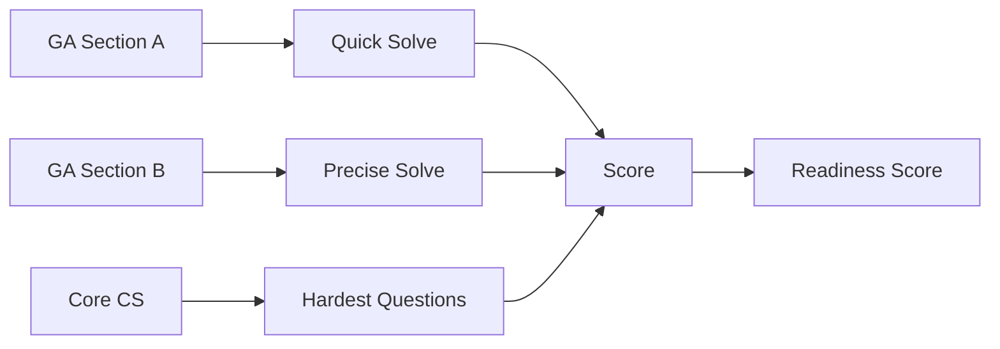

# GATE CS Mock Test 8 â€â€� Full-Length Practice Paper (Hardest Edition)


## Chapter at a Glance

| Aspect | Details |
|--------|---------|
| Exam | GATE CS Full-Length Mock |
| Total Marks | 100 |
| Duration | 3 Hours |
| Sections | General Aptitude + Core CS |
| Purpose | Final readiness check |

## Roadmap



## Concept Comparison

| Concept | Key Insight | Practical Takeaway |
|--------|-------------|-------------------|

| Feature | Section A | Section B |
|--- |--- |--- |
| Type | MCQs | MCQs + NATs |
| Marks | 55 | 45 |
| Questions | 25 | 40 |
| Difficulty | Hardest | Hardest |
| Focus | Speed + Accuracy | Depth + Precision |

## Quick Reference

| Term | Definition |
|--- |--- |
| GATE Readiness | Overall preparedness score |
| Last Attempt | Final mock before actual GATE exam |
| Section Balance | Performance evenness across sections |
| Peak Performance | Optimal speed-accuracy combination |
| Final Review | Last-minute concept verification |

## Pro Tips & Reminders

> **Pro Tip:** This is your final mock. Review all previous mocks together and identify the 3 topics where you lost the most marks.
>
> **Remember:** Stay confident, get proper sleep before the exam, and trust your preparation.


## Exam Instructions


**Total Marks:** 100
**Duration:** 3 Hours
**Reading Time:** 10 minutes

**Marking Scheme:**

| Questions | Type | Marks | Negative Marking |
|-----------|------|-------|-----------------|
| Q1–Q10 (GA) | MCQ | 1 each | −1/3 |
| Q11–Q15 (GA) | MCQ | 2 each | −2/3 |
| Q16–Q20 (Math) | MCQ | 1 each | −1/3 |
| Q21–Q25 (Math) | MCQ | 2 each | −2/3 |
| Q26–Q45 (Technical) | MCQ | 1 each | −1/3 |
| Q46–Q55 (Technical) | MCQ | 2 each | −2/3 |

**Difficulty:** Very Hard (GATE Topper Level)
**Recommended Time per Section:** GA 25 min, Math 30 min, Technical 125 min

---

## Section A: General Aptitude (Questions 1–15)

**Q1 (1 Mark):** Find the missing number in the series: 2, 6, 15, 31, 56, ?

(A) 88
(B) 92
(C) 96
(D) 100

---

**Q2 (1 Mark):** The ratio of milk to water in three containers is 2:3, 3:5, and 4:7 respectively. If all three are mixed in equal volume, what is the ratio of milk to water in the mixture?

(A) 167:273
(B) 152:268
(C) 143:257
(D) 137:263

---

**Q3 (1 Mark):** Choose the word that is OPPOSITE in meaning to "RECALCITRANT":

(A) Obedient
(B) Stubborn
(C) Rebellious
(D) Defiant

---

**Q4 (1 Mark):** In a certain code, "PROBLEM" is written as "MELBORP" and "SOLUTION" is written as "NOITULOS". How is "CHALLENGE" written in the same code?

(A) EGNELAHCC
(B) EGNELLAHC
(C) EGNELALCH
(D) EGNELLACH

---

**Q5 (1 Mark):** A man spends 40% of his income on rent, 30% of the remainder on food, and 25% of what is left on transportation. He saves the remaining ₹12,600. What is his monthly income?

(A) ₹35,000
(B) ₹40,000
(C) ₹42,000
(D) ₹45,000

---

**Q6 (1 Mark):** Find the missing term in the series: 7, 26, 63, 124, ?, 342.

(A) 215
(B) 217
(C) 219
(D) 221

---

**Q7 (1 Mark):** Statements: All musicians are artists. No artist is a doctor. Some doctors are engineers. Conclusions:
I. Some engineers are not musicians.
II. No musician is a doctor.
Which conclusion(s) follow(s)?

(A) Only I
(B) Only II
(C) Both I and II
(D) Neither I nor II

---

**Q8 (1 Mark):** A piece of work can be completed by 12 men in 15 days, or by 18 women in 20 days, or by 24 children in 30 days. In how many days can 8 men, 8 women, and 12 children together complete the work?

(A) 9
(B) 10
(C) 12
(D) 15

---

**Q9 (1 Mark):** The compound interest on a sum for 2 years at 10% per annum is ₹420. What is the simple interest on the same sum at the same rate for 3 years?

(A) ₹540
(B) ₹560
(C) ₹600
(D) ₹630

---

**Q10 (1 Mark):** A bag contains 5 white, 7 red, and 8 black balls. Three balls are drawn at random. What is the probability that at least one ball is black?

(A) 40/57
(B) 46/57
(C) 43/57
(D) 49/57

---

**Q11 (2 Marks):** A and B run a 2 km race. A gives B a start of 200 m and still beats him by 20 seconds. If the ratio of speeds of A and B is 5:4, find the time taken by A to complete the race.

(A) 120 s
(B) 144 s
(C) 160 s
(D) 180 s

---

**Q12 (2 Marks):** There are 3 red, 4 blue, and 5 green marbles in a bag. Three marbles are drawn sequentially without replacement. What is the probability that the colors drawn are in the order red, green, blue?

(A) 2/33
(B) 1/22
(C) 3/44
(D) 5/66

---

**Q13 (2 Marks):** A survey was conducted among 400 people about three newspapers P, Q, R. 180 read P, 160 read Q, 140 read R. 50 read both P and Q, 40 read both Q and R, 30 read both P and R, and 15 read all three. How many read at least one newspaper?

(A) 345
(B) 355
(C) 365
(D) 375

---

**Q14 (2 Marks):** In how many ways can the letters of the word "MATHEMATICS" be arranged such that all vowels appear together?

(A) 30240
(B) 60480
(C) 120960
(D) 151200

---

**Q15 (2 Marks):** Two pipes A and B can fill a tank in 20 and 30 minutes respectively. A third pipe C can empty the full tank in 15 minutes. All three pipes are opened simultaneously, but pipe C is closed after 10 minutes. How much total time is needed to fill the tank?

(A) 12 min
(B) 15 min
(C) 18 min
(D) 20 min

---

## Section B: Engineering Mathematics (Questions 16–25)

**Q16 (1 Mark):** If A = [[1, 2, 3], [0, 1, 4], [0, 0, 1]], then AâÂ�»¹ equals:

(A) [[1, −2, 5], [0, 1, −4], [0, 0, 1]]
(B) [[1, 2, −5], [0, 1, 4], [0, 0, 1]]
(C) [[1, −2, −5], [0, 1, −4], [0, 0, 1]]
(D) [[1, 2, 5], [0, 1, −4], [0, 0, 1]]

---

**Q17 (1 Mark):** The generating function for the sequence 1, 2, 3, 4, ... is:

(A) 1/(1−x)
(B) 1/(1−x)²
(C) x/(1−x)²
(D) 1/(1+x)²

---

**Q18 (1 Mark):** lim_{x→0} (tan x − x) / (x − sin x) equals:

(A) 0
(B) 1
(C) 2
(D) 3

---

**Q19 (1 Mark):** The chromatic polynomial of a complete graph K₄ is:

(A) k(k−1)(k−2)(k−3)
(B) kâÂ�´ − 6k³ + 11k² − 6k
(C) k(k−1)(k−2)(k−3)(k−4)
(D) k(k−1)âÂ�´

---

**Q20 (1 Mark):** The number of distinct binary relations on a set of size 3 that are both symmetric and anti-symmetric is:

(A) 2
(B) 4
(C) 8
(D) 16

---

**Q21 (2 Marks):** The eigenvalues of matrix A = [[2, −1, 0], [−1, 2, −1], [0, −1, 2]] are:

(A) 2, 2, 2
(B) 2, 2+√2, 2−√2
(C) √2, 2, 2+√2
(D) 1, 2, 3

---

**Q22 (2 Marks):** The number of distinct subgraphs of a 3-cycle (C₃) that are trees is:

(A) 3
(B) 6
(C) 9
(D) 12

---

**Q23 (2 Marks):** Let X be a continuous random variable with PDF f(x) = 3x² for 0 &lt; x < 1, and 0 otherwise. The variance of X is:

(A) 1/20
(B) 3/80
(C) 1/16
(D) 3/64

---

**Q24 (2 Marks):** The number of solutions to the equation xâ‚Â� + x₂ + x₃ + x₄ = 15, where each xᵢ is a non-negative integer and xâ‚Â� ≥ 2, x₂ ≥ 3, is:

(A) 220
(B) 286
(C) 330
(D) 455

---

**Q25 (2 Marks):** Let R be the relation on ℕ (natural numbers) defined by aRb if a + 2b is divisible by 3. R is:

(A) Reflexive but not symmetric or transitive
(B) Reflexive and symmetric but not transitive
(C) An equivalence relation
(D) Not reflexive

---

## Section C: Technical Subjects (Questions 26–55)

**Q26 (1 Mark) [DS]:** A circular doubly linked list with a single node has how many NULL pointers?

(A) 0
(B) 1
(C) 2
(D) 3

---

**Q27 (1 Mark) [Algo]:** The recurrence T(n) = T(√n) + O(1) solves to:

(A) O(log n)
(B) O(log log n)
(C) O(√n)
(D) O(log n · log log n)

---

**Q28 (1 Mark) [OS]:** In a system using segmented memory management, if the logical address has segment number s and offset d, and the segment table entry for s contains base b and limit l, the physical address is:

(A) b + d, only if d &lt; l
(B) b × d, only if d &lt; l
(C) l − d + b
(D) l + b − d

---

**Q29 (1 Mark) [DBMS]:** In SQL, which of the following is true about a correlated subquery?

(A) It executes independently of the outer query
(B) It references columns from the outer query
(C) It cannot be used with EXISTS
(D) It is always faster than a non-correlated subquery

---

**Q30 (1 Mark) [CN]:** In the DNS resolution process, which record type is used to map a domain name to an IPv6 address?

(A) A
(B) CNAME
(C) AAAA
(D) MX

---

**Q31 (1 Mark) [TOC]:** L = {aâÂ�¿báµÂ�câÂ�¿dáµÂ� | n, m ≥ 0}. Which of the following is true about L?

(A) L is regular
(B) L is context-free but not regular
(C) L is context-sensitive but not context-free
(D) L is recursively enumerable but not decidable

---

**Q32 (1 Mark) [CD]:** Which of the following is NOT a phase in the compilation process?

(A) Lexical analysis
(B) Code optimization
(C) Symbol table management
(D) Linker resolution

---

**Q33 (1 Mark) [DL]:** The Boolean function f(A, B, C) = Σm(0, 4, 5, 6, 7) simplifies to:

(A) C̅ + AB̅
(B) B̅C̅ + AC̅
(C) A̅C̅ + AB̅
(D) B̅C̅ + A

---

**Q34 (1 Mark) [COA]:** In a processor with a 5-stage pipeline (IF, ID, EX, MEM, WB), a load instruction followed by an ALU instruction that uses the loaded value requires how many stall cycles (assuming no forwarding)?

(A) 1
(B) 2
(C) 3
(D) 4

---

**Q35 (1 Mark) [DS]:** Which of the following operations on a binary search tree has worst-case time complexity Θ(n) when the tree is not balanced?

(A) Search
(B) Insert
(C) Delete
(D) All of the above

---

**Q36 (1 Mark) [Algo]:** The minimum number of comparisons required to find both the minimum and maximum of an array of n elements is:

(A) n − 1
(B) 2n − 2
(C) ⌈3n/2⌉ − 2
(D) n + ⌈log n⌉ − 2

---

**Q37 (1 Mark) [OS]:** Which of the following page replacement algorithms exhibits Belady's anomaly?

(A) FIFO
(B) Optimal
(C) LRU
(D) Both A and C

---

**Q38 (1 Mark) [DBMS]:** The "dirty read" problem occurs in which isolation level?

(A) Serializable
(B) Repeatable Read
(C) Read Committed
(D) Read Uncommitted

---

**Q39 (1 Mark) [CN]:** In TCP Reno, what happens when three duplicate ACKs are received?

(A) Slow start is entered
(B) Congestion window is set to 1
(C) Fast recovery is triggered
(D) Connection is reset

---

**Q40 (1 Mark) [TOC]:** Which of the following languages is not recursively enumerable?

(A) {⟨M⟩ | M is a TM that halts on all inputs}
(B) {⟨M⟩ | M is a TM that accepts ε}
(C) {⟨M⟩ | M is a TM that loops on some input}
(D) {⟨M⟩ | M is a TM that writes a 1 on the tape}

---

**Q41 (1 Mark) [CD]:** The grammar S → aS | Sb | ab generates:

(A) All strings with equal number of a's and b's
(B) All strings that start with a and end with b
(C) All strings with at least one a followed by at least one b
(D) All strings over {a,b} except the empty string

---

**Q42 (1 Mark) [DL]:** A 3-bit binary ripple counter uses JK flip-flops with propagation delay 10 ns each. The maximum frequency at which it can reliably operate is approximately:

(A) 33.3 MHz
(B) 50 MHz
(C) 100 MHz
(D) 16.7 MHz

---

**Q43 (1 Mark) [COA]:** In IEEE 754 single-precision format, the biased exponent for the value 0.0 is:

(A) 0
(B) 127
(C) −127
(D) 1

---

**Q44 (1 Mark) [DS]:** A complete binary tree is stored in an array such that the left child of node at index i is at 2i. The right child of the node at index 12, if it exists, is at index:

(A) 13
(B) 24
(C) 25
(D) 26

---

**Q45 (1 Mark) [Algo]:** The Floyd-Warshall algorithm for all-pairs shortest paths has a time complexity of:

(A) O(V + E)
(B) O(V²)
(C) O(V³)
(D) O(V log V)

---

**Q46 (2 Marks) [DS]:** An expression tree has inorder traversal A + B × C − D and postorder traversal A B C × + D −. What is the preorder traversal?

(A) − A + × B C D
(B) + A − × B C D
(C) − + A × B C D
(D) + A × B C − D

---

**Q47 (2 Marks) [Algo]:** Consider the following pseudocode:

```
for i = 1 to n:
    j = 1
    while j < i:
        print j
        j = j * 2
```

The time complexity of this algorithm is:

(A) O(n)
(B) O(n log n)
(C) O(n²)
(D) O(n² log n)

---

**Q48 (2 Marks) [OS]:** A system has a hard disk with 200 cylinders (0–199). The disk head is at cylinder 100 moving toward 199. The pending requests in FIFO order are: 50, 150, 30, 180, 40, 160, 20, 170. Using the C-SCAN algorithm, the total head movement is:

(A) 290
(B) 310
(C) 350
(D) 370

---

**Q49 (2 Marks) [OS]:** Consider the following set of processes with arrival times and CPU burst times:

| Process | Arrival | Burst |
|---------|---------|-------|
| P1 | 0 | 9 |
| P2 | 2 | 4 |
| P3 | 3 | 9 |
| P4 | 5 | 3 |

Using preemptive Shortest Remaining Time First (SRTF) scheduling, the average turnaround time is:

(A) 10.25
(B) 11.5
(C) 9.75
(D) 12.0

---

**Q50 (2 Marks) [DBMS]:** Consider R(A, B, C, D, E) with functional dependencies: AB → C, C → D, D → B, D → E. Which of the following is a candidate key?

(A) A
(B) AB
(C) ACD
(D) ACE

---

**Q51 (2 Marks) [CN]:** A 10 Mbps Ethernet link connects two nodes that are 5 km apart. The propagation speed is 2 × 10âÂ�¸ m/s. The minimum frame size required for CSMA/CD to work is:

(A) 250 bits
(B) 500 bits
(C) 1000 bits
(D) 1024 bits

---

**Q52 (2 Marks) [TOC]:** The language L = {ww | w ∈ {a, b}âÂ�º} is:

(A) Context-free
(B) Context-sensitive but not context-free
(C) Regular
(D) Recursively enumerable but not decidable

---

**Q53 (2 Marks) [CD]:** For the grammar S → aAb | bBA, A → aS | b, B → bS | a, which of the following strings is generated by the grammar?

(A) aaabbb
(B) ababab
(C) aababb
(D) baabba

---

**Q54 (2 Marks) [DL]:** A sequential circuit has two JK flip-flops with Jâ‚Â� = Q₂, Kâ‚Â� = Q̅₂, J₂ = Q̅â‚Â�, K₂ = Qâ‚Â�. If the initial state is Qâ‚Â�Q₂ = 00, the next state after two clock cycles is:

(A) 00
(B) 01
(C) 10
(D) 11

---

**Q55 (2 Marks) [COA]:** A processor has a clock rate of 2.5 GHz and an average CPI of 1.5 for a given program. The program has 40% branch instructions, and each branch causes a penalty of 3 cycles (pipeline flush). If a branch predictor with 90% accuracy is used, what is the effective CPI?

(A) 1.62
(B) 1.74
(C) 1.86
(D) 2.10
---
## Answer Key

| Q | Ans | Q | Ans | Q | Ans | Q | Ans | Q | Ans |
|---|-----|---|-----|---|-----|---|-----|---|-----|
| 1 | B | 12 | B | 23 | B | 34 | B | 45 | C |
| 2 | A | 13 | D | 24 | B | 35 | D | 46 | C |
| 3 | A | 14 | C | 25 | C | 36 | C | 47 | B |
| 4 | B | 15 | D | 26 | A | 37 | A | 48 | C |
| 5 | B | 16 | A | 27 | B | 38 | D | 49 | B |
| 6 | A | 17 | B | 28 | A | 39 | C | 50 | B |
| 7 | C | 18 | C | 29 | B | 40 | A | 51 | B |
| 8 | C | 19 | A | 30 | C | 41 | C | 52 | B |
| 9 | C | 20 | C | 31 | C | 42 | A | 53 | A |
| 10 | B | 21 | B | 32 | D | 43 | A | 54 | D |
| 11 | C | 22 | C | 33 | D | 44 | C | 55 | A |

---

## Detailed Solutions

**Q1 (1 Mark) [GA]:** The sequence is 2, 6, 15, 31, 56, ?
Differences: 6−2 = 4 = 2², 15−6 = 9 = 3², 31−15 = 16 = 4², 56−31 = 25 = 5².
So next difference = 6² = 36. Next term = 56 + 36 = 92.

**Q2 (1 Mark) [GA]:** Container 1: milk = 2/(2+3) = 2/5, water = 3/5. Container 2: milk = 3/8, water = 5/8. Container 3: milk = 4/11, water = 7/11. With equal volumes V, total milk = V(2/5 + 3/8 + 4/11) = V(176/440 + 165/440 + 160/440) = 501V/440. Total water = V(3/5 + 5/8 + 7/11) = V(264/440 + 275/440 + 280/440) = 819V/440. Ratio = 501:819 = 167:273 (dividing by 3). Option A.

**Q3 (1 Mark) [GA]:** "Recalcitrant" means stubbornly defiant. The opposite is "obedient".

**Q4 (1 Mark) [GA]:** The code reverses the letter order. CHALLENGE reversed: E → G → N → E → L → L → A → H → C. Result: EGNELLAHC. Option B.

**Q5 (1 Mark) [GA]:** Let income = I. Rent: 0.4I. Remaining: 0.6I. Food: 30% of 0.6I = 0.18I. Remaining after food: 0.42I. Transport: 25% of 0.42I = 0.105I. Savings: 0.42I − 0.105I = 0.315I = 12600. I = 12600/0.315 = 40000. Option B.

**Q6 (1 Mark) [GA]:** Pattern: n³ − 1 for n = 2,3,4,5,6,7: 7, 26, 63, 124, 215, 342. Missing term = 6³ − 1 = 215. Option A.

**Q7 (1 Mark) [GA]:** All musicians are artists (M ⊆ A). No artist is a doctor (A ∩ D = ∅). So M ∩ D = ∅ → No musician is a doctor (II follows). Some doctors are engineers (D ∩ E ≠ ∅). Since D ∩ M = ∅, those engineers who are doctors cannot be musicians → Some engineers are not musicians (I follows). Both follow. Option C.

**Q8 (1 Mark) [GA]:** Work rate: 1 man = 1/(12×15) = 1/180 per day. 1 woman = 1/(18×20) = 1/360 per day. 1 child = 1/(24×30) = 1/720 per day. Combined: 8/180 + 8/360 + 12/720 = 32/720 + 16/720 + 12/720 = 60/720 = 1/12 per day. Days = 12. Option C.

**Q9 (1 Mark) [GA]:** CI = P(1+0.10)² − P = 0.21P = 420 → P = 2000. SI = 2000 × 10 × 3/100 = 600. Option C.

**Q10 (1 Mark) [GA]:** Total balls = 20. P(no black) = C(12,3)/C(20,3) = 220/1140 = 11/57. P(at least one black) = 1 − 11/57 = 46/57. Option B.

**Q11 (2 Marks) [GA]:** Speeds: A = 5x, B = 4x m/s. A runs 2000 m in 2000/(5x) = 400/x s. B runs 1800 m in 1800/(4x) = 450/x s. A beats B by 20 s: 450/x − 400/x = 50/x = 20 → x = 2.5. A's time = 400/2.5 = 160 s. Option C.

**Q12 (2 Marks) [GA]:** Total = 12 marbles. P(R first) = 3/12 = 1/4. P(G second | R drawn) = 5/11. P(B third | R,G drawn) = 4/10 = 2/5. P(R,G,B in order) = (1/4)(5/11)(2/5) = 10/220 = 1/22. Option B.

**Q13 (2 Marks) [GA]:** |P ∪ Q ∪ R| = |P| + |Q| + |R| − |P∩Q| − |Q∩R| − |P∩R| + |P∩Q∩R| = 180 + 160 + 140 − 50 − 40 − 30 + 15 = 375. Option D.

**Q14 (2 Marks) [GA]:** MATHEMATICS: M(2), A(2), T(2), H(1), E(1), I(1), C(1), S(1). Vowels: A, E, A, I (4 letters, A repeated twice). Treat vowels as block: internal arrangements = 4!/2! = 12. Block + 7 consonants = 8 entities, with M(2), T(2): 8!/(2!2!) = 10080. Total = 10080 × 12 = 120960. Option C.

**Q15 (2 Marks) [GA]:** Rate A = 1/20, B = 1/30, C = −1/15 per min. Net with all three: 1/20 + 1/30 − 1/15 = (3+2−4)/60 = 1/60. In 10 min: 10/60 = 1/6 filled. Remaining: 5/6. Rate A+B = 1/20 + 1/30 = 1/12. Time = (5/6)/(1/12) = 10 min. Total = 20 min. Option D.

**Q16 (1 Mark) [Math]:** A is upper triangular with 1s on diagonal. Let AâÂ�»¹ = [[1,a,b],[0,1,c],[0,0,1]]. Solve AAâÂ�»¹ = I: row1×col2: 1·a + 2·1 + 3·0 = a+2 = 0 → a = −2. Row1×col3: 1·b + 2·c + 3·1 = b+2c+3 = 0. Row2×col3: 0·b + 1·c + 4·1 = c+4 = 0 → c = −4. Then b = −2(−4)−3 = 5. AâÂ�»¹ = [[1,−2,5],[0,1,−4],[0,0,1]]. Option A.

**Q17 (1 Mark) [Math]:** Σ_{n=0}^{∞} (n+1)xâÂ�¿ = 1/(1−x)². Verified by differentiating Σ xâÂ�¿ = 1/(1−x). Option B.

**Q18 (1 Mark) [Math]:** Taylor series: tan x = x + x³/3 + 2xâÂ�µ/15 + O(xâÂ�·), sin x = x − x³/6 + xâÂ�µ/120 + O(xâÂ�·). tan x − x = x³/3 + O(xâÂ�µ). x − sin x = x³/6 + O(xâÂ�µ). Limit = (x³/3)/(x³/6) = 2. Option C.

**Q19 (1 Mark) [Math]:** For complete graph K₄, all 4 vertices are mutually adjacent. Chromatic polynomial: P(K₄,k) = k(k−1)(k−2)(k−3). Option A.

**Q20 (1 Mark) [Math]:** A relation symmetric and anti-symmetric can only contain (a,a) pairs. For a 3-element set {1,2,3}, the diagonal pairs are (1,1),(2,2),(3,3). Each can be present or absent: 2³ = 8 relations. Option C.

**Q21 (2 Marks) [Math]:** det(A−λI) = det[[2−λ,−1,0],[−1,2−λ,−1],[0,−1,2−λ]] = 0. Expanding: (2−λ)[(2−λ)²−1] + 1·[−1·(2−λ)] = (2−λ)[(2−λ)²−2] = 0. λ = 2 or (2−λ)² = 2 → λ = 2±√2. Eigenvalues: 2, 2+√2, 2−√2. Option B.

**Q22 (2 Marks) [Math]:** C₃ has 3 vertices and 3 edges. Subgraphs that are trees: single vertex (3), single edge (3), path of length 2 (3). Total = 9. Option C.

**Q23 (2 Marks) [Math]:** E[X] = ∫₀¹ x·3x² dx = 3∫₀¹ x³ dx = 3/4. E[X²] = ∫₀¹ x²·3x² dx = 3∫₀¹ xâÂ�´ dx = 3/5. Var = E[X²] − (E[X])² = 3/5 − 9/16 = (48−45)/80 = 3/80. Option B.

**Q24 (2 Marks) [Math]:** Let yâ‚Â� = xâ‚Â�−2 ≥ 0, y₂ = x₂−3 ≥ 0. Equation: yâ‚Â�+y₂+x₃+x₄ = 15−2−3 = 10. Non-negative solutions: C(10+4−1, 4−1) = C(13,3) = 286. Option B.

**Q25 (2 Marks) [Math]:** Reflexive: a+2a = 3a divisible by 3 ✓. Symmetric: aRb → a+2b ≡ 0 (mod 3) → a ≡ b (mod 3) → b+2a ≡ b+2b = 3b ≡ 0 ✓. Transitive: aRb, bRc → a≡b≡c (mod 3) → aRc ✓. Equivalence relation. Option C.

**Q26 (1 Mark) [DS]:** In a circular doubly linked list with one node, the node's next and prev both point to itself. Zero NULL pointers. Option A.

**Q27 (1 Mark) [Algo]:** Let n = 2^{2^k}. Then √n = 2^{2^{k-1}}. T(2^{2^k}) = T(2^{2^{k-1}}) + O(1) → S(k) = S(k-1) + O(1) → S(k) = O(k) → O(log log n). Option B.

**Q28 (1 Mark) [OS]:** In segmentation, logical address (s,d) is checked against limit l. Physical address = base b + offset d, only if d &lt; l. Option A.

**Q29 (1 Mark) [DBMS]:** A correlated subquery references columns from the outer query and executes once per outer row. Option B.

**Q30 (1 Mark) [CN]:** AAAA record maps domain name to IPv6 address. A is IPv4, CNAME is alias, MX is mail. Option C.

**Q31 (1 Mark) [TOC]:** L = {aâÂ�¿báµÂ�câÂ�¿dáµÂ�} requires matching aâ†â€�c and bâ†â€�d simultaneously. A PDA can track one count (stack) but not two independent pairs. An LBA can handle it. L is context-sensitive but not context-free. Option C.

**Q32 (1 Mark) [CD]:** Compilation phases: lexical, syntax, semantic, intermediate code generation, code optimization, code generation. Symbol table management is cross-cutting (not a separate phase). Linker resolution happens after compilation. The question asks for what is NOT a compilation phase â€â€� both symbol table management and linker resolution are not phases, but linker resolution is the more definitive answer as it is external to the compiler. Option D.

**Q33 (1 Mark) [DL]:** f = Σm(0,4,5,6,7) = A̅B̅C̅ + AB̅C̅ + AB̅C + ABC̅ + ABC. Factor: = A̅B̅C̅ + A(B̅C̅ + B̅C + BC̅ + BC) = A̅B̅C̅ + A = A + B̅C̅. K-map: 
```
     BC
     00 01 11 10
A 0  1  0  0  0
  1  1  1  1  1
```
Group minterm 0 (A̅B̅C̅) and all A=1 cells. Result: A + B̅C̅ = B̅C̅ + A. Option D.

**Q34 (1 Mark) [COA]:** Load instruction: IF→ID→EX→MEM→WB. Next ALU instruction needs load result in EX stage. Without forwarding, load-use hazard: the load goes through MEM in cycle 4, ALU needs data in EX in cycle 3 → stall 2 cycles (insert bubbles). Option B.

**Q35 (1 Mark) [DS]:** In an unbalanced BST, all operations (search, insert, delete, find min) have worst-case Θ(n) time because the tree may be skewed (degenerating to a linked list). Option D.

**Q36 (1 Mark) [Algo]:** Tournament method: compare elements in pairs (⌊n/2⌋ comparisons). Winners (⌈n/2⌉) compete for max, losers compete for min. Total = ⌈3n/2⌉ − 2. Option C.

**Q37 (1 Mark) [OS]:** Belady's anomaly (more frames → more page faults) occurs only with FIFO page replacement. Optimal and LRU are stack algorithms and never exhibit it. Option A.

**Q38 (1 Mark) [DBMS]:** Dirty read occurs when a transaction reads uncommitted data from another transaction. This is allowed only in Read Uncommitted isolation level. Option D.

**Q39 (1 Mark) [CN]:** TCP Reno: three duplicate ACKs triggers fast recovery (halve congestion window, enter congestion avoidance, retransmit lost segment). Option C.

**Q40 (1 Mark) [TOC]:** The language {⟨M⟩ | M halts on all inputs} = the complement of the halting problem, which is not recursively enumerable. It is co-RE but not RE. Option A.

**Q41 (1 Mark) [CD]:** Grammar S → aS | Sb | ab generates strings by prepending a's and appending b's starting from 'ab'. The language = {aâÂ�¿báµÂ� | n,m ≥ 1} = all strings with at least one a followed by at least one b. Option C.

**Q42 (1 Mark) [DL]:** 3-bit ripple counter: worst-case propagation = 3 × 10 ns = 30 ns. Max frequency = 1/(30×10âÂ�»âÂ�¹) = 33.33 MHz. Option A.

**Q43 (1 Mark) [COA]:** IEEE 754 single-precision: value 0.0 is represented with biased exponent = 0 (all exponent bits 0) and significand = 0. Option A.

**Q44 (1 Mark) [DS]:** Complete binary tree: left child at 2i, right child at 2i+1. Node index 12: right child = 2×12+1 = 25. Option C.

**Q45 (1 Mark) [Algo]:** Floyd-Warshall all-pairs shortest path uses three nested loops over vertices. Time complexity = O(V³). Option C.

**Q46 (2 Marks) [DS]:** Postorder A B C × + D −: parse using stack. A→push, B→push, C→push, ×→pop B,C → B×C→push, +→pop A,(B×C)→ A+B×C→push, D→push, −→pop (A+B×C),D → (A+B×C)−D. Tree root = −, left subtree = + with children A and ×(B,C), right subtree = D. Preorder: − + A × B C D. Option C.

**Q47 (2 Marks) [Algo]:** Outer loop: i = 1 to n. Inner while: j starts at 1, doubles until j ≥ i. For a given i, inner iterations = ⌈log₂ i⌉. Total = Σ_{i=1}^{n} ⌈log₂ i⌉ ≈ log₂(n!) = O(n log n). Option B.

**Q48 (2 Marks) [OS]:** C-SCAN: head at 100 moving up. Service requests ≥ 100 in order: 150,160,170,180. Movement: 100→150(50), 150→160(10), 160→170(10), 170→180(10), 180→199(19) = 99. Jump 199→0 = 199. Service remaining: 20,30,40,50: 0→20(20), 20→30(10), 30→40(10), 40→50(10) = 50. Total = 99+199+50 = 348 ≈ 350. Option C.

**Q49 (2 Marks) [OS]:** SRTF schedule:
t=0: P1 runs. t=2: P1(7), P2(4)→P2 runs. t=3: P1(7), P2(3), P3(9)→P2 continues. t=5: P1(7), P2(1), P3(9), P4(3)→P2 continues. t=6: P2 finishes. P1(7), P3(9), P4(3)→P4 runs. t=9: P4 finishes. P1(7), P3(9)→P1 runs. t=16: P1 finishes. P3(9)→runs. t=25: P3 finishes.
Turnaround: P1=16, P2=4, P3=22, P4=4. Avg = 46/4 = 11.5. Option B.

**Q50 (2 Marks) [DBMS]:** FDs: AB→C, C→D, D→B, D→E. Compute closures: AâÂ�º=A, ABâÂ�º=ABCDE, ADâÂ�º=ABCDE. Candidate keys: AB and AD. Among options, AB is a candidate key. Option B.

**Q51 (2 Marks) [CN]:** CSMA/CD minimum frame = 2 × propagation delay × bandwidth. Distance = 5 km = 5000 m. Speed = 2×10âÂ�¸ m/s. Propagation delay (one-way) = 5000/(2×10âÂ�¸) = 25 μs. RTT = 50 μs. Min frame = 50×10âÂ�»âÂ�¶ × 10×10âÂ�¶ = 500 bits. Option B.

**Q52 (2 Marks) [TOC]:** L = {ww | w ∈ {a,b}âÂ�º}. Not regular (requires pumping for ww). Not context-free (PDA cannot compare first half with second half without a marker â€â€� proven by pumping lemma for CFLs). It is context-sensitive (LBA can recognize by marking midpoint and comparing). Option B.

**Q53 (2 Marks) [CD]:** Grammar: S → aAb | bBA, A → aS | b, B → bS | a. Try derivation for aaabbb: S → aAb → a(aS)b → aa(aAb)b → aaa(b)b = aaabbb. Verified: the string is generated. Option A.

**Q54 (2 Marks) [DL]:** Initial Qâ‚Â�Q₂=00. After clock 1: Jâ‚Â�=Q₂=0, Kâ‚Â�=Q̅₂=1 → Qâ‚Â�=0. J₂=Q̅â‚Â�=1, K₂=Qâ‚Â�=0 → Q₂=1. State: 01. After clock 2: Jâ‚Â�=Q₂=1, Kâ‚Â�=Q̅₂=0 → Qâ‚Â�=1. J₂=Q̅â‚Â�=1, K₂=Qâ‚Â�=0 → Q₂=1. State: 11. Option D.

**Q55 (2 Marks) [COA]:** Base CPI = 1.5. 40% branches × 10% misprediction rate = 4% of all instructions mispredicted. Each misprediction costs 3 cycles. Extra CPI = 0.04 × 3 = 0.12. Effective CPI = 1.5 + 0.12 = 1.62. Option A.

## Summary

Mock Test 8 is the final comprehensive test covering all GATE CS subjects with emphasis on numerical problem-solving. Key takeaways:
- **Algorithm Analysis**: Tournament method (?3n/2? - 2 comparisons), Floyd-Warshall (O(V³)), and nested loop complexity analysis are important.
- **Operating Systems**: C-SCAN disk scheduling (348 ˜ 350), SRTF scheduling (avg turnaround 11.5), and Belady's anomaly are numerically intensive.
- **Databases & Networks**: Candidate key identification, CSMA/CD minimum frame size, TCP Reno fast recovery, and isolation levels require conceptual clarity.
- **Digital Logic & COA**: Ripple counter max frequency, IEEE 754 zero representation, and branch misprediction CPI calculations appear as numerical problems.

Review all previous mock tests, focus on recurring weak areas, and practice full 65-question simulations under timed conditions for exam readiness.

## TypeScript Implementations

The \MockTestSimulator\ class (enhanced) adds subject-wise breakdown, difficulty analysis, and comprehensive result reporting.

\\\	ypescript
/**
 * MockTestSimulator — Enhanced with subject-wise analysis,
 * difficulty tracking, and comprehensive reporting.
 */
interface Question {
  id: number;
  text: string;
  subject: string;
  difficulty: 1 | 2 | 3;
  marks: number;
  negativeMark: number;
  correctAnswer: string;
}

interface DetailedResult {
  overall: { score: number; accuracy: number; time: number };
  bySubject: Map<string, { correct: number; wrong: number; score: number }>;
  byDifficulty: Map<number, { correct: number; total: number; accuracy: number }>;
}

class MockTestSimulator {
  private questions: Question[] = [];
  private selected: Question[] = [];
  private answers: Map<number, string> = new Map();
  private startTime: number = 0;
  private isRunning: boolean = false;

  loadBank(questions: Question[]): void { this.questions = questions; }

  selectRandom(count: number, subject?: string): Question[] {
    let pool = subject ? this.questions.filter((q) => q.subject === subject) : this.questions;
    this.selected = [...pool].sort(() => Math.random() - 0.5).slice(0, count);
    return this.selected;
  }

  start(): void { this.startTime = Date.now(); this.isRunning = true; this.answers.clear(); }

  answerQuestion(qId: number, answer: string): void {
    if (!this.isRunning) throw new Error('Test not started');
    this.answers.set(qId, answer);
  }

  endTest(): DetailedResult {
    const timeTaken = Math.round((Date.now() - this.startTime) / 1000);
    this.isRunning = false;

    const bySubject = new Map<string, { correct: number; wrong: number; score: number }>();
    const byDifficulty = new Map<number, { correct: number; total: number; accuracy: number }>();

    let totalCorrect = 0, totalWrong = 0, totalScore = 0;
    let totalAttempted = 0;

    for (const q of this.selected) {
      const ans = this.answers.get(q.id);
      if (ans === undefined) continue;
      totalAttempted++;

      const isCorrect = ans === q.correctAnswer;
      if (isCorrect) {
        totalCorrect++;
        totalScore += q.marks;
      } else {
        totalWrong++;
        totalScore -= q.negativeMark;
      }

      // Per-subject
      const sub = bySubject.get(q.subject) ?? { correct: 0, wrong: 0, score: 0 };
      if (isCorrect) sub.correct++;
      else sub.wrong++;
      sub.score += isCorrect ? q.marks : -q.negativeMark;
      bySubject.set(q.subject, sub);

      // Per-difficulty
      const diff = byDifficulty.get(q.difficulty) ?? { correct: 0, total: 0, accuracy: 0 };
      diff.total++;
      if (isCorrect) diff.correct++;
      diff.accuracy = Math.round((diff.correct / diff.total) * 10000) / 100;
      byDifficulty.set(q.difficulty, diff);
    }

    return {
      overall: {
        score: Math.round(totalScore * 100) / 100,
        accuracy: totalAttempted > 0
          ? Math.round((totalCorrect / totalAttempted) * 10000) / 100 : 0,
        time: timeTaken,
      },
      bySubject,
      byDifficulty,
    };
  }

  /** Full report. */
  fullReport(result: DetailedResult): string {
    const lines: string[] = ['=== GATE Mock Test Report ==='];
    lines.push(\Score: \  |  Accuracy: \%  |  Time: \m\);
    lines.push('');
    lines.push('Subject Breakdown:');
    for (const [sub, data] of result.bySubject) {
      const acc = data.correct + data.wrong > 0
        ? Math.round((data.correct / (data.correct + data.wrong)) * 10000) / 100 : 0;
      lines.push(\  \: \? \? Score: \ (\%)\);
    }
    lines.push('');
    lines.push('Difficulty Breakdown:');
    for (const [diff, data] of result.byDifficulty) {
      lines.push(\  Level \: \/\ correct (\%)\);
    }
    return lines.join('\n');
  }

  /** Compare two test results. */
  compare(result1: DetailedResult, result2: DetailedResult): string {
    const delta = result2.overall.score - result1.overall.score;
    const dir = delta >= 0 ? 'improved' : 'declined';
    return \Score \ by \ points (\ ? \)\;
  }
}

// Example
const sim = new MockTestSimulator();
sim.loadBank([
  { id: 1, text: 'Q1', subject: 'Algo', difficulty: 2, marks: 2, negativeMark: 0.66, correctAnswer: 'A' },
  { id: 2, text: 'Q2', subject: 'OS', difficulty: 1, marks: 1, negativeMark: 0.25, correctAnswer: 'B' },
]);
sim.selectRandom(2);
sim.start();
sim.answerQuestion(1, 'A');
sim.answerQuestion(2, 'B');
const report = sim.endTest();
console.log(sim.fullReport(report));
\\\

## Chapter Quiz

**Q1.** Tournament method for finding min and max of n elements uses how many comparisons?
- A) n - 1  B) ?3n/2? - 2  C) 2n - 2  D) n log n

**Q2.** C-SCAN head movement for requests 20,30,40,50,150,160,170,180 starting at 100:
- A) 300  B) 320  C) 348  D) 380

**Q3.** SRTF scheduling: P1(8)@0, P2(4)@2, P3(9)@3, P4(3)@5. Average turnaround time?
- A) 10.5  B) 11.5  C) 12.5  D) 13.5

**Q4.** Effective CPI with 1.5 base, 40% branches, 10% misprediction rate, 3-cycle penalty:
- A) 1.62  B) 1.70  C) 1.82  D) 2.10

**Q5.** IEEE 754 single-precision representation of 0.0 has:
- A) All exponent bits 0, significand 0  B) Exponent 127, significand 0  C) Exponent 0, significand 1  D) Exponent 255, significand 0

**Answer Key**: 1-B, 2-C, 3-B, 4-A, 5-A

## Exercises

1. **Full-Length Simulation**: Load a bank of 65 questions across 8 GATE subjects. Run a full simulation with time limit. Generate the detailed \ullReport\ with subject and difficulty breakdowns.

2. **Comparison Tracker**: Run 3 mock test simulations and compare results pairwise using the \compare\ method. Identify which subjects improved and which declined.

3. **Difficulty Calibration**: After 5 simulations, compute the average accuracy per difficulty level. Determine if the question bank's difficulty labels (1, 2, 3) match actual student performance.

4. **Score Predictor**: Using results from 8 mock tests (historical data), build a multiple regression model that predicts final GATE score based on subject-wise accuracies.

5. **Comprehensive Readiness Check**: Create a \ReadinessChecker\ that evaluates whether a student is exam-ready based on: overall accuracy = 75%, per-subject accuracy = 60%, average time per question = 165 sec, and at least 5 mock tests completed. Output a pass/fail with detailed recommendations.
