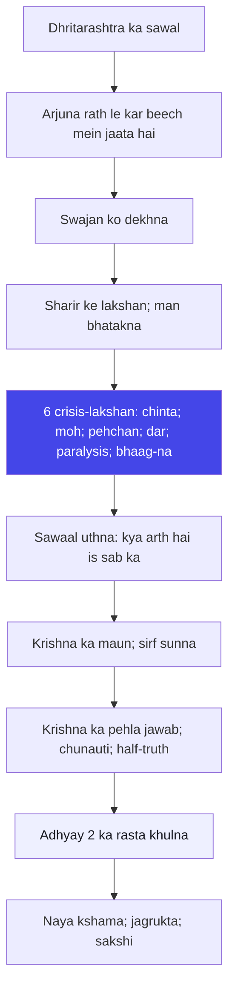
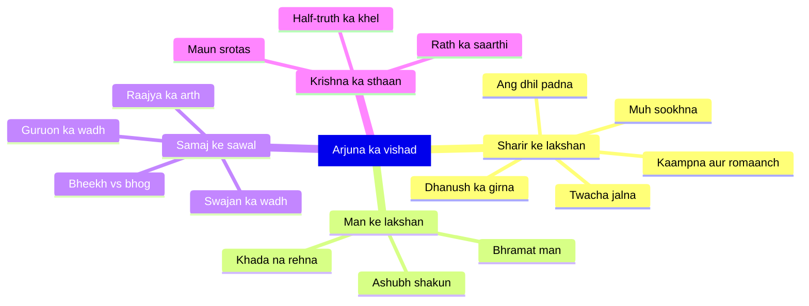

# अध्याय १: विषाद योग — Crisis hi darwaza hai

> **"Jab tak tum tuto nahin, tab tak tum banna shuru nahin hote. Vishad koi bimari nahin hai — vishad to prarambh hai."**
> — **ओशो**

---

Kurukshetra ka maidan. Dono senayen aamne-saamne. Shankh baj chuke hain, dhanush uth chuke hain — aur phir achanak Arjuna ke haath se GANDEEV gir jata hai. Arjuna — Mahabharata ka sabse bada yoddha, jo kal tak kisi se bhi nahi hara — abhi wahi apne rath mein baith kar ro raha hai. Dhritarashtra ne Sanjaya se poocha tha: "Kurukshetra mein mere aur Pandu ke beton ne kya kiya?" (1.1) — aur is sawal ka jawab hi poora Gita hai. Kyonki Sanjaya ka pehla jawab hai: Arjuna ka patan.

Osho is adhyaya ko bilkul alag tarah se padhte hain. Unki nazar mein Vishad Yoga koi "dukhad adhyay" nahin hai — yeh to Gita ka sabse bada adhyay hai. Kyon? Kyonki yahin se yatra shuru hoti hai. Osho kehte hain: jo aadmi kabhi nahi girta, uske liye Gita ka koi arth nahi. Girna hi darwaza hai. Arjuna ka vishad hi uska bachav hai — agar woh yudh ke maidan par chala jata bina kisi sawal ke, toh woh ek machine hota, ek robot hota, ek bahadur sipahi hota — lekin aadmi nahi hota. Sawal uthana hi aadmi hone ki nishani hai.

Osho ki drishti mein yeh adhyay ek inner revolution ki kahani hai. Bahar to Kurukshetra hai — andar ek aur bhi bada Kurukshetra hai: har insaan ke man mein. Arjuna ke andar kya gir raha hai — woh sena nahin gir rahi, uske andar ki pehchan gir rahi hai. Woh sochta tha ki "main ek kshatriya hoon, mera karm ladna hai" — aur ab woh pehchan toot gayi. Yahi to sankat hai: jab aadmi ki purani pehchan toot jati hai aur nayi abhi bani nahi. Isi sankat ko Osho "crisis" kehte hain — aur crisis hi transformation ka darwaza hai. Murda aadmi se koi sawal nahi uthata. Arjuna ke roone ka matlab hai ki woh zinda hai.

## Learning Objectives

Is chapter ko complete karne ke baad aap:

1. **Samajh payenge** — Vishad Yoga ka Mahabharata mein sthaan aur Arjuna ke vishad ka astitv-gaarh (existential) karan — sirf rishton ka nahi.
2. **Pehchan payenge** — Osho ki drishti mein crisis kyon transformation ka darwaza hai, aur "murda aadmi ke sawal nahin hote" ka matlab kya hai.
3. **Vishleshan kar payenge** — Arjuna ke vishad ke 6 lakshan (symptoms) — anxiety, attachment confusion, identity loss, fear of results, paralysis, bhaag-ne ki ichchha.
4. **Jaan payenge** — Krishna ka pehla jawab kyon "samajhana" nahin balki "chunauti" hai — Osho ke anusar Krishna ka ardh-satya (half-truth) khel.
5. **Prayog kar payenge** — TypeScript mein ek **Crisis Journal Analyzer** banana jo aapke apne journal entries ko Arjuna ke crisis-lakshanon par map karke Osho-style guidance deta hai.

---

## Vishad Yoga ka Parichay

### Mahabharata mein is adhyaya ka sthaan

Mahabharata ke 18 parv hain aur Gita unke beech — Bhishma Parv ke andar — ek 700-shlokon ka ratna hai. Gita ke 18 adhyay bhi usi 18 ka aaina hain: jaisa Mahabharata mein 18 divas ka yudh, waisa Gita mein 18 adhyayon ka inner yudh. Aur is inner yudh ka pehla din — pehla adhyay — hai Vishad Yoga.

Mahabharata ki kahani mein yeh adhyay us kshan par hai jab sab kuch taiyar hai. 18 akshauhini sena, saare dwarpati, saare hero — sab maidan par. Ek bhi chij adhuri nahin. Aur isi "sab kuch taiyar" ke kshan par — patan. Osho isko gayahb garha hua bahut badi baat: transformation kabhi bhi tab nahin hota jab tum kisi cheez se bhaag rahe ho; transformation tab hota hai jab tum poore ho, jab tumhara koi bahana nahin bachta. Arjuna ke paas ab koi bahana nahin tha — lena tha ya marna tha — aur isi total point par uska man toota.

### Arjuna kyon ro raha hai — parampara vs Osho

Parampara kehte hain: Arjuna ke roone ka karan tha moh — mamta. Uski apni sena, uske gurujan, uske bhai-bandhu samne the, aur "swajan" ko maar kar unke rajy par baithna usse asambhav laga. Yahi moh hi uska patan tha. Ved Vyas ne is adhyay ka naam hi "Vishad Yoga" rakha — aur parampara mein ise "Arjuna ki kamzori" ke roop mein padha jata hai — ek adhyay jise jaldi se paar karke asli Gita (adhyay 2 se) tak pahunchna hai.

Osho ise ulta padhte hain. Unki nazar mein Arjuna ka vishad moh nahin hai — woh ek honest aadmi ka total breakdown hai. Aur Osho kehte hain: yeh breakdown hi uski pahelhi sadgati hai. Arjuna ne apna sab kuch daav par laga diya tha — aur ab saamne yeh dikh raha hai ki "jeet" ka koi matlab hi nahin bachta. Woh Krishna se kehta hai ki is yudh mein jeet ke baad bhi kya milega? Vishad yeh nahin hai ki "main haar jaaunga" — vishad yeh hai ki "jeet ke baad bhi kya?" Yahi existential crisis hai — aur yahi sawal har insaan ke jeevan mein kabhi na kabhi aata hai.

### Traditional reading vs Osho's reading

| Aayaam | Traditional reading | Osho's reading |
|--------|---------------------|----------------|
| **Arjuna ka patan** | Kamzori, moh, kartavya se bhaag-na | Sabse honest response — ek zinda aadmi ka total breakdown |
| **Vishad ka arth** | Dukh jo door karna hai | Darwaza jo paar karna hai — crisis hi transformation hai |
| **Arjuna ka sawal** | Be-maine sawal — adhyay 2 se shuru hua asli Gita | Gita ka sabse behatarin sawal — Krishna ko jawab dene par majboor karta hai |
| **Krishna ka pehla pratirodh** | Shiksha ka aarambh — "ashochyan" | Ek chal — Arjuna ko jhunjhod kar jagane ki trick |
| **Kurukshetra** | Ek aitihasik yudh ka maidan | Har aadmi ka andar ka maidan — inner battlefield |
| **Moksha ka marg** | Kartavya ka palan karo, yudh karo | Pehle apne bheetar ke sangharsh ko dekho — wahi sadhana hai |

### Sub-sections: is adhyay ka structure

Is adhyay (47 shlokas) mein teen tarang hain:

1. **Sanjaya ka vruttant (1.1-1.19)** — Dhritarashtra ka sawal, dono senayon ka varnan, yoddhaon ki soochi. Yeh sirf bhoomika hai — magar Osho kehte hain: yeh bhoomika bhi ek aaina hai. Dhritarashtra andha hai — aur woh Sanjaya se pooch raha hai ki kya hua. Jo aadmi khud andha ho, uske liye doosre ki aankhen bhi kya kar sakti hain? Krishna ne andhe ko raajya wapas dene ki peshkash ki thi — Dhritarashtra ne mana kiya. Andha sirf aankhon se nahin hota — andha woh hota hai jo apna rajya, apna raaj, apna sab kuch khud nahin dekh sakta.

2. **Arjuna ka vishad (1.20-1.46)** — Arjuna ka rath le kar Krishna ko madhya mein le jaana, samne swajan ko dekhna, aur phir poora breakdown. Yahi adhyay ka dil hai. Arjuna ke 14 shlokon ka varnan — uske sharir ke lakshan (romaanch, kaapna, dhanush ka girna) — yeh sab psycho-somatic symptoms hain jo aaj ke psychology mein "anxiety attack" kehte hain. Osho ki drishti mein yeh 14 shlok kisi shikayat nahin hain — yeh ek poora man-shaastra (psychology of the inner man) hain. Har shloka ek naya lakshan deta hai, aur har lakshan ek naya darwaza.

3. **Arjuna ka nirnay: na ladunga (1.47)** — "मैं नहीं लडूंगा" — arjun uvacha ka samapan. Osho kehte hain: yeh "na ladunga" koi nirnay nahin hai — yeh vyatha ki aakhri cheekh hai. Jab aadmi "na karenge" kehta hai toh woh us kshan ka pehla kadam hai jahan woh sadak se hata hai. Par jab tak tum kisi cheez ko "na" nahin kehte, tum kisi cheez ko "haan" bhi nahin keh sakte. Arjuna ki "na" ne Krishna ka "haan" bulaya.

### Parampara ka pehla prashna: "Kurukshetra ko dharmakshetra kyon kaha gaya?"

Ek chhota sa sawal jo panditon ki parampara mein saalon se ghoomta raha hai: Dhritarashtra ko dharmakshetra kyon dikha? Osho ka jawab bilkul alag hai: Dhritarashtra ke liye bhi, Arjuna ke liye bhi, har aadmi ke liye — jab tak tumhe Kurukshetra "dharmakshetra" nahin dikhta, jab tak tum us jagah ko mahan nahin maante jahan tumhara patan hua — tab tak tum wahan se kuch nahin seekh sakte. Dharmakshetra woh jaga hai jahan "kya sahi hai" ka sawal uthta hai. Arjuna ko wahan "dharm" dikha — isliye woh sochne lag gaya. Yudh ke maidan par bhi agar tum sahi-galat ka sawal uthate ho, toh woh maidan dharmakshetra ban jata hai. Aur agar tum ghar baith kar bhi sirf jeet ki soch rahe ho, toh tumhara ghar bhi adharmakshetra hai.

### Vishad ke baad: Gita ka poora 18-adhyay ka structure

Osho kehte hain ki Gita ka poora structure Arjuna ke vishad se hi paida hua hai — isliye is adhyay ko samajhna hi Gita ko samajhna hai. Krishna Arjuna ko teen bhaag mein sikhaate hain:

| Bhaag | Adhyay | Osho ka frame |
|-------|--------|---------------|
| **Karm yog** | 1-6 | Pehle karm — kyonki bina karm ke koi jeevan nahin; lekin karm se asakti chhodo |
| **Bhakti yog** | 7-12 | Phir prem — jab karm se sab lagao chhuta, tab pyaar mein poora ho jao |
| **Gyan yog** | 13-18 | Ant mein gyan — jab karm aur prem dono poore hain, tab gyan khud utar aata hai |

Osho is teen-bhaag ko "teen seedhi" kehte hain — magar unka zor is baat par hai ki teenon ek saath hain. Jo aadmi karm karta hai woh pyaar mein bhi hota hai, aur jo pyaar mein hai woh gyan mein bhi hota hai. Yeh alag-alag raaste nahin — yeh ek hi raaste ke teen pehlu hain. Aur is raaste ka pehla paunvi is adhyay mein — vishad mein — gadi hui hai.

## Key Shlokas

### Shloka 1.1

> धृतराष्ट्र उवाच |
> धर्मक्षेत्रे कुरुक्षेत्रे समवेता युयुत्सवः |
> मामकाः पाण्डवाश्चैव किमकुर्वत सञ्जय ॥

**Transliteration:** dhṛitarāṣhṭra uvācha | dharmakṣhetre kurukṣhetre samavetā yuyutsavaḥ | māmakāḥ pāṇḍavāśhchaiva kimakurvata sañjaya ||

**Arth (Hinglish):** Dhritarashtra ne kaha — Sanjaya, dharmakshetra Kurukshetra mein yudh ki ichchha se ekatrit hue mere bete aur Pandu ke bete — unhonne kya kiya?

**Osho ka drishtikon:** Pehla hi shloka ek andhe ka sawal hai. Osho kehte hain: Dhritarashtra ke paas Sanjaya ki aankhen hain, phir bhi woh andha hai — kyonki uski apni aankhen andhi hain, uski lobh andhi hai. Woh jaanta hai ki uske bete galat hain — phir bhi woh sirf yudh ki khabar mangta hai, nyay ki nahin. Yeh shloka dikhata hai: aankhen hona aur dekhna alag cheezein hain. Dhritarashtra ka asli rog yeh hai ki woh apne beton ka moh chhod nahin sakta — aur yahi rog Arjuna mein bhi hai. Dono ke andar moh hai — magar dono ka moh alag hai: ek moh lobh se paida hua, doosra mamta se. Osho kehte hain: lobh ka moh chhodna aasan hai, mamta ka moh chhodna mushkil — aur yahi karan hai ki Krishna ko poore 18 adhyay bolne pade.

### Shloka 1.28-30 (Arjuna ka vishad — ek saath)

> अर्जुन उवाच |
> दृष्ट्वेमं स्वजनं कृष्ण युयुत्सुं समुपस्थितम् |
> सीदन्ति मम गात्राणि मुखं च परिशुष्यति ॥
> वेपथुश्च शरीरे मे रोमहर्षश्च जायते |
> गाण्डीवं स्रंसते हस्तात्त्वक्चैव परिदह्यते ॥
> न च शक्नोम्यवस्थातुं भ्रमतीव च मे मनः |
> निमित्तानि च पश्यामि विपरीतानि केशव ॥

**Transliteration:** arjuna uvācha | dṛiṣhṭvemaṁ svajanaṁ kṛiṣhṇa yuyutsuṁ samupasthitam | sīdanti mama gātrāṇi mukhaṁ cha pariśhuṣhyati || vepathuśhcha śharīre me romaharṣhaśhcha jāyate | gāṇḍīvaṁ sraṁsate hastāttvakchaiva paridahyate || na cha śhaknomyavasthātuṁ bhramatīva cha me manaḥ | nimittāni cha paśhyāmi viparītāni keśhava ||

**Arth (Hinglish):** Arjuna ne kaha — Krishna, yudh ki ichchha se khade hue in swajanon ko dekh kar mere ang dhil pad rahe hain, mera mukh sookh raha hai. Mere sharir mein kaampan hai aur romaanch khada ho raha hai. GANDEEV mera haath se gir raha hai aur twacha jal rahi hai. Main khada bhi nahin reh sakta, mera man bhatak raha hai — aur main ashubh shakun dekh raha hoon, Keshav.

**Osho ka drishtikon:** Osho kehte hain — yeh Gita ka sabse scientific adhyay hai, kyonki yahaan dukh ke saare physical lakshan hain. Aaj ka psychology ise "panic attack" kahta hai — aur woh bhi sach hai. Magar sach ka doosra pehlu bhi hai: Arjuna ka sharir woh kaam kar raha hai jo uske man ne kaha — arthat, uske andar ka swajan-hinsa uska pran aur prerana dono hain. Wo isliye kaampar nahin kyonki woh kamzoor hai — woh isliye kaampar kyonki uski atma abhichchha ka pratirodh kar rahi hai. Osho ka isharon: jab sharir ke saare symptoms ek saath uth jayen, toh woh chhoti baat nahin — woh bheetar ki koi baat tootne ka sanket hai. Arjuna ka man "bhramat" hai — aur bhram, jab jagrukta se dekha jaye, hi asli bhoomika hai.

### Shloka 1.46

> श्रेयो भोक्तुं भैक्ष्यमपीह लोके हत्वापि पुरुषर्षभ |
> हत्वार्थकामांस्तु गुरूनिहैव भुञ्जीय भोगान् रुधिरप्रदिग्धान् ॥

**Transliteration:** śhreyo bhoktuṁ bhaikṣhyamapīha loke hatvāpi puruṣharṣhabha | hatvārthakāmāṁstu gurūnihaiva bhuñjīya bhogān rudhira-pradigdhān ||

**Arth (Hinglish):** Is lok mein bheekh bhi kha lena behtar hai, Prabhu — parantu gurujanon ko maar kar is duniya ke rajy-bhogon ko, jo khoon se sanse hain, bhoga karna achchha nahin.

**Osho ka drishtikon:** Osho kehte hain — yeh Arjuna ki aakhri pukar hai. "Bheekh kha lunga" — ek yoddha ke muh se! Yeh wahi aadmi hai jise Bhishma aur Drona ne duniya ka sabse bada dhanurdhar banaya tha. Aur ab woh keh raha hai: bheekh bhi behtar hai is rajy se jo khoon se sanna hai. Osho ka drishtikon: jab tak yeh "na" nahin uthti, jab tak aadmi yeh nahin kehta ki "yeh sab mujhe nahin chahiye", tab tak woh Krishna ko sun nahin sakta. Krishna ne 18 adhyay isliye bolna shuru kiye kyonki Arjuna ne yeh kaha. Arjuna ka "bheekh" hi uske "param-samriddhi" ka dwara hai. Yahan gaur karne ki baat: Arjuna kisi sant ki tarah bheekh nahin maang raha — woh bheekh ko jeet se upar rakh raha hai. Yeh tyag nahin — yeh mulyon ka ulta ho jana hai. Aur yahi crisis hai.

---

## Crisis — Osho ki gahrai mein

### Crisis kyon zaroori hai: murda aadmi ke sawal nahin hote

Osho ka sabse bada prashna: transformation kab hoti hai? Jab aadmi sukh mein hoga — nahin. Sukh mein aadmi so jata hai. Dukh mein? Dukh mein bhi nahin — dukh mein aadmi rota hai, bhaagta hai. Transformation tab hoti hai jab dukh itna gahra ho jata hai ki aadmi na ro sakta hai, na bhaag sakta hai — tab woh dekhta hai. Arjuna us kshan par khada hai.

Osho kehte hain: tumhari har bigaRhi hui cheez — har vishad, har dukh, har na-umeedi — wohi tumhara darwaza hai. Tum jis cheez se bhaagte ho, wahi tumhara rasta hai. Crisis ek nibhag hai — jab tumhari saari bhagna-giyaan khatam ho jati hai aur tum pehli baar thehar ke dekhne ke liye majboor ho jate ho. Arjuna ke paas ab dhanush nahin hai, sena nahin hai, jawab nahin hai — sirf ek sawal hai. Aur Osho kehte hain: sawal hi kafi hai. Krishna baad mein aayega.

### Arjuna ke vishad ke 6 lakshan — aaj ke psychology se

Osho ne Arjuna ke vishad ko kisi ek rog nahin mana — usne ise ek poora spectrum bataya. Yahaan aaj ka psychology aur Gita ek saath khade hain:

| Lakshan | Arjuna mein (shloka) | Aaj ke jeevan mein |
|---------|----------------------|--------------------|
| **Anxiety (chinta)** | Sīdanti gātrāṇi — ang dhil, mukh sookhna (1.28) | Exam se pehle, interview se pehle, bade decision se pehle |
| **Attachment confusion** | Swajan ko maarna hai ya nahin (1.31-1.35) | Rishtedar vs career, dosti vs naukari |
| **Identity loss (pehchan ka tootna)** | "Kshatriya hoon" — ab kya hoon? (1.36-1.38) | Jo aadmi apni pehchan se toot jata hai jab woh job, shahar, ya role chhodta hai |
| **Fear of results (parinaam ka dar)** | Raajya jeet ke baad kya milega? (1.32-1.33) | Success ka dar — jeet ke baad ka khali pan |
| **Paralysis (stabdhahta)** | "Na shaknomyavasthatum" — khada nahin reh sakta (1.30) | Decision paralysis — na yeh na woh |
| **Bhaag-ne ki ichchha (flight)** | "Bheekh kha lunga" — sab chhod doon (1.46) | Quit karna, bhaag jana, sab chhod dena |

Osho kehte hain: yeh 6 lakshan koi bimari nahin hain — yeh 6 darwaze hain. Har lakshan ek poora aayam kholta hai. Jo aadmi anxiety ko dabata hai, woh uska darwaza band karta hai. Jo anxiety ko dekhta hai — woh uska arth samajhta hai. Crisis ka arth yeh nahin ki "kya galat ho gaya" — crisis ka arth yeh hai ki "kya toot raha hai jo tootna zaroori tha."

### Krishna ka pehla jawab: half-truth ka khel

Arjuna ke vishad ke baad Krishna ka pehla jawab aata hai — magar woh adhyay 2 mein aata hai. Is adhyay ka Krishna keval sunta hai. Osho is chup ko bahut mahatva dete hain: jab koi aadmi total crisis mein hota hai, toh pehli zaroorat koi jawab nahin — koi jo sune woh zaroori hai. Arjuna ko 17 shlokon mein ro diya — aur Krishna ne suna. Osho kehte hain: sune bina jawab dena ek bimari hai — aur sune bina suna dena bhi.

Aur adhyay 2 mein Krishna ka jo pehla jawab hai — "ashochyan anvashochastvam" — woh Osho ki nazar mein ek chal hai, ek half-truth. Krishna kehte hain: atma amar hai, isliye shok mat karo. Osho kehte hain: yeh sach hai magar yeh poora sach nahin hai. Arjuna ka vishad atma ke vishay mein nahin tha — woh jeevan ke arth ke vishay mein tha. Krishna pehle bhi yudh ka raasta soch rahe hain — aur Osho ise "Krishna ka khel" kehte hain: pehle aadmi ko jagao, phir dheere dheere samjhao. Isi liye Gita ke pehle 6 adhyay karm mein hain, beech ke 6 bhakti mein, aur aakhri 6 gyan mein.

### Vishad ek "total breakdown" kyon hai

Osho kehte hain — Arjuna ka vishad koi aadha vishad nahin hai. Woh "thoda roya, thoda socha" nahin kar raha. Uski saari chiz toot gayi: uska sharir (kaampan, sookha mukh), uski pehchan (kshatriya dharam), uska man (bhramat), uski karm-shakti (dhanush gir gaya), aur uski bhavishya-drishti (ashubh shakun). Jab yeh paanchon ek saath toote — woh "total breakdown" hai. Aur Osho ka sabse bada point yahi hai: partial breakdown se kuch nahin hota. Aadha toota hua aadmi phir se apni purani aadat mein chala jata hai. Total breakdown hi total transformation ki shart hai.

Isi liye Osho kehte hain ki Gita kisi sadharan kitaab se shuru nahin hoti. Gita ek "total" adhyay se shuru hoti hai — jahan ek yoddha ka poora jagat toot chuka hai. Aur isi total-ness mein hi uska bachav hai: ab woh Krishna ko "siksha" nahin de raha, woh Krishna ko apne samaksh khada kar raha hai. Jab tak tumhara saara jhooth nahin toota, tab tak tum sachai ko nahin dekh sakte. Arjuna ka jhooth toot gaya — ab woh Krishna ko dekh sakta hai.

### Aaj ke jeevan mein "Kurukshetra" kahan hai

Osho is adhyay ko "2400 saal purani kahani" nahin maante — woh kehte hain: yeh kahani aaj ke har insaan ke andar roz ghatit hoti hai. Kurukshetra koi maidan nahin hai — woh woh jaga hai jahan tumhare do parivaar aamne-saamne khade hain: ek jo "chahiye" kehta hai, ek jo "chahiye tha" kehta hai. Jab bhi tum ek bada faisla karne wale ho — naukri badlo, shaadi karo, apna kaam shuru karo — usse pehle ka raat bhar ki neend-gayi raat, woh tumhara Kurukshetra hai.

Aur is Kurukshetra mein ek Krishna bhi hota hai — magar woh bahar nahin, andar hota hai. Osho kehte hain: Krishna ek bahar ka bhagwan nahin hain; woh tumhare andar ki woh awaz hain jo kabhi nahin darti, kabhi nahin rooti — jo sirf dekhti hai. Arjuna andar ki woh awaz hai jo jude hue hain, darta hai, sochta hai. Dono ko aamne-saamne karne ke liye ek yudh ka maidan chahiye — aur woh maidan har insaan ke andar hai. Isi liye Osho kehte hain: Gita koi itihas nahin; Gita tumhari apni kahani hai — tumhara apna vishad, tumhara apna yudh, aur tumhara apna darwaza.

## Crisis ka chakra: ek drishti-diagram



## Arjuna ke man ka aaina: ek mindmap



## TypeScript Implementation — Crisis Journal Analyzer

```typescript
/*
 * Crisis Journal Analyzer
 * Vishad Yoga ke aadhar par: Arjuna ke 6 crisis-lakshan
 * aapke apne journal entries par map karta hai.
 * Osho ka drishtikon: crisis bimari nahin; darwaza hai.
 */

interface CrisisJournalEntry {
  date: string;
  text: string;
}

interface CrisisSymptom {
  key: 'anxiety' | 'attachmentConfusion' | 'identityLoss' | 'fearOfResults' | 'paralysis' | 'flightDesire';
  label: string;
  keywords: string[];
  arjunaRef: string;
}

interface CrisisDiagnosis {
  symptomKey: string;
  symptomLabel: string;
  hits: number;
  severity: number; // 0-10
  oshoGuidance: string;
}

interface CrisisReport {
  entriesAnalyzed: number;
  totalSignals: number;
  dominantSymptom: string;
  severity: number;
  isDoorway: boolean;
  diagnoses: CrisisDiagnosis[];
  oshoMessage: string;
}

class CrisisJournalAnalyzer {
  private symptoms: CrisisSymptom[] = [
    {
      key: 'anxiety',
      label: 'Chinta: ang dhil; sookha mukh',
      keywords: ['chinta', 'dar', 'tension', 'ghabrahat', 'panic', 'neend nahin', 'chain nahin'],
      arjunaRef: 'Shloka 1.28: seedanti gatraani'
    },
    {
      key: 'attachmentConfusion',
      label: 'Moh ka bhatkaav: swajan vs nirnay',
      keywords: ['moh', 'rishta', 'parivaar', 'maa', 'pitaji', 'bhai', 'apna aadmi', 'chhod kar'],
      arjunaRef: 'Shloka 1.31-35: swajan ke liye vishad'
    },
    {
      key: 'identityLoss',
      label: 'Pehchan ka tootna: main kaun hoon',
      keywords: ['kaun hoon', 'pehchan', 'role', 'kya banun', 'apna arth', 'jeevan ka matlab', 'bekaar'],
      arjunaRef: 'Shloka 1.36-38: kshatriya ka dharam toota'
    },
    {
      key: 'fearOfResults',
      label: 'Parinaam ka dar: jeet ke baad bhi kya',
      keywords: ['jeet ke baad', 'mil kya', 'fayda kya', 'kya hoga aage', 'success ke baad', 'khali pan'],
      arjunaRef: 'Shloka 1.32-33: raajya jeet ke baad kya'
    },
    {
      key: 'paralysis',
      label: 'Stabdhta: na kadam uthana',
      keywords: ['nahin ho raha', 'ruk gaya', 'na kar paun', 'faisla nahin', 'garda ghoom raha', 'atak gaya'],
      arjunaRef: 'Shloka 1.30: na shaknomyavasthatum'
    },
    {
      key: 'flightDesire',
      label: 'Bhaag-ne ki ichchha: sab chhod doon',
      keywords: ['chhod doon', 'bhaag jaun', 'quit', 'nahin ladunga', 'bheekh', 'door nikal', 'sab khatam'],
      arjunaRef: 'Shloka 1.46: bhaikshyam bhoktum'
    }
  ];

  private oshoGuidanceMap: Record<string, string> = {
    anxiety: 'Chinta ko dabaao mat; usse dekho. Chinta ek sanket hai ki tumhara man kuch alag keh raha hai.',
    attachmentConfusion: 'Moh ka matlab pyar nahin; moh ka matlab pakad hai. Pakad chhodo; pyar rahne do.',
    identityLoss: 'Purani pehchan tooti hai; iska matlab tum kuch khoya. Yeh matlab hai ki nayi pehchan ka darwaza khula.',
    fearOfResults: 'Parinaam ka dar isliye hai kyonki tum parinaam par khade ho. Karm par khade raho; parinaam Krishna par.',
    paralysis: 'Stabdhta bekaar nahin hai; jab paanv chalte nahin, tab aankhein kholti hain. Thehar; dekh; phir chal.',
    flightDesire: 'Bhaag-na koi jawab nahin; tum apne andar se bhaag nahin sakte. Ruk; sawaal utha; wahi rasta hai.'
  };

  analyze(entries: CrisisJournalEntry[]): CrisisReport {
    const diagnoses: CrisisDiagnosis[] = [];
    let totalSignals = 0;

    for (const symptom of this.symptoms) {
      let hits = 0;
      for (const entry of entries) {
        const lower = entry.text.toLowerCase();
        hits += symptom.keywords.filter(k => lower.includes(k.toLowerCase())).length;
      }
      const severity = Math.min(10, hits);
      totalSignals += hits;
      diagnoses.push({
        symptomKey: symptom.key,
        symptomLabel: symptom.label,
        hits,
        severity,
        oshoGuidance: this.oshoGuidanceMap[symptom.key]
      });
    }

    diagnoses.sort((a, b) => b.severity - a.severity);
    const dominant = diagnoses[0];
    const isDoorway = totalSignals >= 3;

    let oshoMessage = isDoorway
      ? 'Tumhara crisis koi bimari nahin hai; yeh tumhara darwaza hai. Murda aadmi ke sawal nahin hote; tumhara sawal utha hai.'
      : 'Tum abhi thehar ke nahin dekhe. Thoda aur gahra jao; kuch tootna zaroori hai taaki naya bane.';

    return {
      entriesAnalyzed: entries.length,
      totalSignals,
      dominantSymptom: dominant.symptomLabel,
      severity: dominant.severity,
      isDoorway,
      diagnoses,
      oshoMessage
    };
  }
}

function runDemo(): void {
  const analyzer = new CrisisJournalAnalyzer();
  const journal: CrisisJournalEntry[] = [
    { date: '2026-08-10', text: 'Interview ke baad se chinta hi chinta hai. Neend nahin aa rahi. Dar hai ki fail ho jaunga.' },
    { date: '2026-08-12', text: 'Maa keh rahi hain naukri mat chhodo. Par main woh kya hoon jisme khushi nahin. Kaun hoon main?' },
    { date: '2026-08-14', text: 'Rishta pakka ho gaya tha; ab bhai ke saamne kya jawab doon. Moh aur career ke beech atak gaya.' },
    { date: '2026-08-15', text: 'Koi faisla nahin ho raha. Garda ghoom raha hai. Aaj lag raha hai sab chhod doon; kisi gaon chala jaun.' }
  ];

  const report = analyzer.analyze(journal);
  console.log('=== Crisis Journal Analyzer ===');
  console.log(`Entries analyzed: ${report.entriesAnalyzed}`);
  console.log(`Total signals: ${report.totalSignals}`);
  console.log(`Dominant symptom: ${report.dominantSymptom}`);
  console.log(`Severity: ${report.severity}/10`);
  console.log(`Doorway status: ${report.isDoorway ? 'Crisis = darwaza' : 'Abhi rasta nahin khula'}`);
  console.log('\n--- Har lakshan ki diagnosis ---');
  for (const d of report.diagnoses) {
    console.log(`${d.symptomLabel} | hits: ${d.hits} | severity: ${d.severity}/10`);
    console.log(`   Osho: ${d.oshoGuidance}`);
  }
  console.log(`\n--- Osho ka sandesh ---`);
  console.log(report.oshoMessage);
}

runDemo();
```

## Summary

| Bindu | Saar |
|-------|------|
| **Vishad ka sthaan** | Gita ka pehla adhyay — Arjuna ka breakdown 47 shlokon mein |
| **Osho ka twist** | Crisis bimari nahin — transformation ka darwaza |
| **Arjuna ki honesty** | Sawaal uthana hi zinda hone ki nishani hai |
| **Krishna ka khel** | Maun se sunna; phir half-truth se jagana |
| **6 lakshan** | Anxiety, moh, identity loss, parinaam-dar, paralysis, bhaag-ne ki ichchha |

## Contradictions

- **Osho kehte hain Arjuna ka vishad moh nahin hai:** Traditional commentary Arjuna ke vishad ko mamta aur moh ka dosh maanti hai jise Krishna door karte hain. Osho ise Arjuna ki sabse badi jitt maante hain — pehli baar woh poore man se soch raha hai, machine ki tarah nahin.
- **Krishna ka "ashochyan" (2.11) ko Osho chal kehte hain:** Parampara ke anusar yeh Krishna ki pehli shiksha hai. Osho ke anusar yeh ek aadhi-sachchai (half-truth) hai — Arjuna ko yudh ke liye taiyar karne ki takneek, kyonki Krishna ka pehla priyority naitik jawab nahin, yudh ka parinaam hai.
- **Kurukshetra ka maidan:** Traditional reading ise ek aitihasik ghatna maanti hai. Osho kehte hain: chahe yeh hua ho ya na hua ho — asli Kurukshetra har insaan ke andar hai, har baar jab woh faisla karne ke kshan par khada hota hai.
- **"Na ladunga" (1.47):** Parampara ise kamzori ke roop mein dekhti hai. Osho kehte hain: "na" ke bina "haan" nahin aati — Arjuna ki inkaar hi Krishna ke gyan ka aarambh hai.
- **Bheekh ka shloka (1.46):** Traditional commentary ise moh ki parakashtha kehte hain. Osho kehte hain: yeh Arjuna ka pehla tyag hai — usne jeet se bada kuch chuna: bheekh mein bhi shanti.

## Open Questions

- Agar Arjuna ne sawaal na uthaya hota aur seedha yudh kiya hota, toh kya Gita hoti? Kya Krishna kisi aur ko 700 shlok bolete?
- Osho kehte hain crisis hi darwaza hai — par kya har crisis darwaza hai? Kya koi aisa vishad bhi hai jo sirf vinaash hai, transformation nahin?
- Arjuna ka vishad apne swajan ke liye tha — par yudh to shuru ho hi gaya tha. Kya moh ka ehsaas badi galti ke baad aana bekaar hai, ya woh bhi keemat rakhata hai?
- Dhritarashtra ne Sanjaya se poocha "kya hua" — par jab bataya gaya ki Arjuna ro raha hai, toh kya Dhritarashtra ne koi sawaal kiya? Kya andha hamesha unhi sawalon tak seemit rehta hai jo woh sunna chahta hai?

## Practical Takeaways

| Situation | Gita shloka | Osho's lens | Action |
|-----------|-------------|-------------|--------|
| Bade exam ya interview se pehle ghabrahat | 1.28-30 (seedanti gatraani) | Ghabrahat ko dabaao mat; uska arth dekho | 5-minute: aankhein band karo, ghabrahat ko ek gawah ki tarah dekho |
| Rishton aur career ke beech faisla | 1.31-35 (swajan ka vishad) | Moh pakad hai; pyar chhodna nahin | Dono ko ek kaagaz par likho; pakad aur pyar alag karo |
| "Main kya hoon" ka ehsaas | 1.36-38 (identity tootna) | Purani pehchan tootna hi nayi ka aarambh hai | Journal: "Main kaun tha, main kaun hoon, main kaun banna chahta hoon" |
| Sab chhod kar bhaag-ne ka man | 1.46 (bheekh kha lunga) | Bhaag-na jawab nahin; thehar ke sawaal uthao | 24 ghante koi faisla mat lo; sirf dekho aur likho |
| Faisla nahin ho raha (paralysis) | 1.30 (na shaknomyavasthatum) | Stabdhta mein hi jagrukta uthti hai | Paanch lambi saansein; har saans par "dekho" |

## Chapter Quiz

### Question 1
Gita ka pehla shloka kisne kaha tha?

a) Arjuna ne
b) Dhritarashtra ne
c) Sanjaya ne
d) Krishna ne

<details><summary>Answer</summary>b) Dhritarashtra ne — "Dhritarashtra uvacha: Dharmakshetre Kurukshetre..." (1.1)</details>

### Question 2
Osho ke anusar Arjuna ka vishad kya hai?

a) Ek bimari jo jaldi door karni chahiye
b) Ek kamzori jo kshatriya ko shobha nahin deti
c) Transformation ka darwaza
d) Sirf moh ka parinaam

<details><summary>Answer</summary>c) Transformation ka darwaza — Osho kehte hain crisis hi darwaza hai</details>

### Question 3
Arjuna ke vishad ke kitne lakshan (symptoms) is adhyay mein bataaye gaye hain?

a) 2
b) 6
c) 10
d) 47

<details><summary>Answer</summary>b) 6 — anxiety, attachment confusion, identity loss, fear of results, paralysis, flight desire</details>

### Question 4
"GANDEEV mera haath se gir raha hai" — yeh kis shloka ka hissa hai?

a) 1.1
b) 1.28-30
c) 1.46
d) 2.11

<details><summary>Answer</summary>b) 1.28-30 — Arjuna ke vishad ke sharirik lakshan</details>

### Question 5
Osho ke anusar "murda aadmi" ki kya nishani hai?

a) Woh jhagda nahin karta
b) Usse koi sawal nahin uthta
c) Woh sab kuch maaf kar deta hai
d) Woh kisi se baat nahin karta

<details><summary>Answer</summary>b) Usse koi sawal nahin uthta — sawal uthana hi zinda hone ki nishani hai</details>

### Question 6
Shloka 1.46 mein Arjuna kya kehta hai?

a) Main duniya chhod kar van chala jaunga
b) Is lok mein bheekh kha lena behtar hai bhog khane se jo khoon se sanna hai
c) Main Krishna ki sharan mein aata hoon
d) Main apne guru se shiksha maangta hoon

<details><summary>Answer</summary>b) Shreyo bhoktum bhaikshyam — bheekh bhi behtar hai khoon-se-sanne bhog se</details>

### Question 7
Osho Krishna ke "ashochyan anvashochastvam" (2.11) ko kya kehte hain?

a) Gita ka sabse gahra shloka
b) Ek half-truth — Arjuna ko yudh ke liye taiyar karne ki chal
c) Ek galti
d) Arjuna ki shiksha ka aarambh matra

<details><summary>Answer</summary>b) Half-truth — Osho kehte hain Krishna ka pehla jawab ek khel hai, Arjuna ko jagane ki takneek</details>

### Question 8
Dhritarashtra ke andhe hone ka Osho kya arth batate hain?

a) Woh sirf aankhon se andha tha
b) Uska lobh aur moh usse andha kar rahe the
c) Andhe raja ko yudh dekhna mana tha
d) Sanjaya hi uska asli raja tha

<details><summary>Answer</summary>b) Uska lobh usse andha karta hai — aankhen hona aur dekhna alag cheezein hain</details>

### Question 9
Vishad Yoga mein kitne shlok hain?

a) 18
b) 47
c) 72
d) 700

<details><summary>Answer</summary>b) 47 shlok</details>

### Question 10
Osho ke anusar Arjuna ke vishad ke baad Krishna ka kya karn karm tha?

a) Turant shiksha dena
b) Sirf sunna aur phir chunauti dena
c) Yudh band karwana
d) Sanjaya ko wapas bhejna

<details><summary>Answer</summary>b) Krishna ne maun se suna (is adhyay mein) aur adhyay 2 mein chunauti di</details>

## Exercises

1. **Crisis journal (7 din):** Roz raat ko 5 minute likho — aaj kya toota, kya bhatka, kya dar laga. Week ke ant mein apni entries ko Crisis Journal Analyzer mein daalo aur dekhlo kaunsa lakshan dominant hai.
2. **"Murda aadmi ka test":** Apni saari "kya karun" wali baaton ki list banao. Har ek ke saamne likho: yeh sawal kyon utha — kyunki main zinda hoon. Fir dekho kitne sawal darr se uth rahe hain, kitne jagrukta se.
3. **Sharir ka 5-minute scan:** Jab kabhi anxiety lage, 5 minute ke liye sirf sharir ke lakshan dekho — kaunsi jagah kaamp rahi hai, kahan garmi hai. Yehi Arjuna ne kiya — aur yahi jagrukta ka aarambh hai.
4. **"Bheekh ka faisla":** Ek kaagaz par likho — woh kaunsi cheez hai jise tum "jeet" kehta ho aur woh kaunsi jo tum "bheekh" kehte ho. Fir likho: kya is bheekh mein bhi shanti hai?
5. **Krishna ka maun (ek din):** Aaj kisi dost ka crisis suno bina koi jawab diye. Sirf suno. Dekho ki sunna bhi kitna kathin aur kitna gahra hai.
6. **Half-truth pahchano:** Is hafte kisi bade faisle par khud se poocho — main khud ko kya half-truth de raha hoon? Usse likho aur ek doosre theek-pehlu ko bhi dekho.

## Further Reading

- **Osho — "Gita Darshan" (Volume 1):** Vishad Yoga par 6 pravaachan — Woodlands, Bombay (1973-76) ki series ka pehla volume.
- **Shrimad Bhagavad Gita — Sadhak Sanjivani (Swami Ramsukhdas):** Traditional reading ki jhalak ke liye — taaki Osho ke twist samajh aayen.
- **Osho — "The Psychology of the Esoteric" (Vishad aur transformation par):** Osho ki modern psychological drishti ko samajhne ke liye.
- **Karl Jaspers — "The Question of Guilt" aur existential philosophy:** Arjuna ke existential crisis ko 20vi sadi ke frameware mein dekho.
- **Viktor Frankl — "Man's Search for Meaning":** Arjuna ki tarah ek aadmi ki crisis se meaning tak ki yatra — Osho ke "crisis hi darwaza hai" se milti-julti kahani.