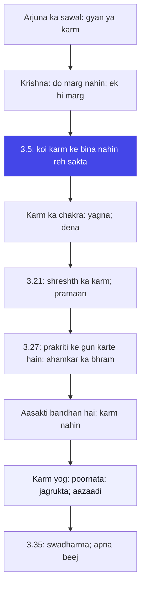

# अध्याय ३: कर्म योग — Karma revolution hai, duty nahin

> **"Nishkama karma ka matlab yeh nahin ki tum karm se door ho jao. Nishkama karma ka matlab hai: karm mein poore do, par andar se aazaad raho. Yahi sabse badi kranti hai."**
> — **ओशो**

---

Do adhyay ho gaye. Adhyay 1 mein Arjuna toota; adhyay 2 mein Krishna ne use atma ka gyan diya aur kaha ki tum karm se bhaag sakte ho nahin. Ab adhyay 3 mein Arjuna ka wahi purana sawal utha — magar ab woh aur teekha ho gaya hai. Arjuna poochta hai: "Krishna, tum khud kehte ho karm se gyan bada hai (2.49), phir mujhe karm mein kyon bhaje rahe ho? Yeh to uljhan hai — tum ek baar gyan ki badai karte ho, doosri baar karm ki. Dono mein se ek batao." (3.1-3.2) Aur isi sawal par Krishna KARMA YOG — teesra adhyay — shuru karte hain.

Karm Yog ke 43 shlokon mein Krishna ek ke baad ek karm ke rahasy kholte hain: "koi ek kshan bhi karm ke bina nahin reh sakta" (3.5), "karm hi tumhara dharma hai" (3.8), "jo shreshth karta hai, log wahi karte hain" (3.21), "prakriti ke gun karm kar rahe hain; ahamkar ki wajah se tum 'main karta hoon' kehte ho" (3.27), aur "swadharma vigunah bhi shreyan hai" (3.35). Yahi poora Karm Yog hai.

Osho is adhyay ko sabse krantikari maante hain — aur sabse galat samjha gaya adhyay bhi. Unki nazar mein "nishkama karma" ko 2400 saal mein sabse bada jhooth de diya gaya: isse sadhana nahin banaya gaya — isse hukm banaya gaya. Pujariyon aur rajnetayon ne kaha: "karm karo, phal ka adhikar tumhara nahin" — aur isse garib ka shoshan hua. Osho kehte hain: yeh Krishna ka sandesh nahin hai. Krishna ka sandesh hai — karm mein poornata, andar aazaadi. Yahi revolution hai: na bhaago, na bhogo — dekho. Yahi Karm Yog hai.

## Learning Objectives

Is chapter ko complete karne ke baad aap:

1. **Samajh payenge** — Karm Yog ka asli arth: "nishkama karma" karm se bhagna nahin, karm mein poornata aur andar aazaadi.
2. **Pehchan payenge** — Osho ka twist: "nishkama karma" ka upyog pujariyon aur rajnetayon ne shoshan ke liye kiya — kaise yeh shoshan hua aur Krishna ka asli sandesh kya tha.
3. **Vishleshan kar payenge** — Prakriti ke gun (3.27) aur ahamkar ka khel — "main karta hoon" ka bhram kaise banata hai.
4. **Jaan payenge** — Swadharma ka arth (3.35): doosron ka dharma achha lage bhi, toh bhi apna dharma behtar — aur Osho ise kaise padhte hain.
5. **Prayog kar payenge** — TypeScript mein **Action Attachment Analyzer** banana jo aapke actions ko 5 aayaamon par score karke batata hai ki woh "karma yoga" hai ya "bondage karma".

---

## Karm Yog ka Parichay

### Arjuna ka teesra sawal

Adhyay 3 ki shuruaat Arjuna ke ek bahut hi teekhe sawal se hoti hai: "Krishna, tum ek hi saans mein do baatein karte ho — pehle kehte ho gyan se karm bada hai, phir kehte ho karm karo. Yeh toh baba ka jhol hai! (3.1-3.2) Dono mein se ek batao." Osho is sawal ko bahut pasand karte hain — kyonki yeh sawal ek jaagte hue shishya ka sawal hai. Arjuna ab woh nahin jo ro kar gira tha; woh ab woh hai jo Krishna ko takleef mein daal raha hai. Aur Osho kehte hain: jab shishya guru ko sawal mein daal deta hai, tab hi guru apna best deta hai. Krishna ne is sawal par poora Karm Yog diya.

Krishna ka jawab (3.3-3.9): do marg hain — gyan-yog (jnana) aur karm-yog — lekin dono ka arth ek hai, kyonki "koi ek kshan bhi karm ke bina nahin reh sakta" (3.5). Tum bhaag nahin sakte — tumhare andar ki prakriti karm kar rahi hai, chaahe tum karana chaaho ya na. Toh asli sawal yeh nahin hai ki "karm karun ya na karun" — asli sawal hai "karm mein aasakti rakhun ya nahin". Yahi Karm Yog ka kendra hai.

### "Nishkama karma" ka sabse bada jhooth

Osho ka sabse bada aarop: "nishkama karma" (bina ichchha ke karm) ko is duniya mein sabse bada shoshan ka hathiyaar bana diya gaya. Kaise? Pujariyon ne kaha: "karm karo, phal ki chinta mat karo — phal to bhagwan dete hain." Rajnetayon ne kaha: "tumhara karm tumhara dharma hai — phal ki chinta karna paap hai." Aur is naam par: garib se garib kaam karwaya gaya, aur shoshan kiya gaya. Osho kehte hain: yeh Krishna nahin tha — yeh Krishna ka jhootha aaina tha. Krishna ne karm ko "revolution" ke liye kaha tha — usse "duty" nahin banaya gaya tha.

Karm yog asli mein kya hai? Osho kehte hain: karm mein poornata. Jab tum karm mein poore ho jaate ho — jaise ek chitrakar rang bharta hai, jaise ek maa bachche ko palta hai — tab phal ka sawal khud gayab ho jaata hai. Yeh "duty" nahin hai — "prem" hai. Duty mein "karna padta hai"; prem mein "karna hai". Duty bojh hai; prem utsav hai. Krishna ka karm yog duty nahin — utsav hai. Aur isi ko Osho "revolution" kehte hain: jab karm prem ban jaata hai, tab aadmi andar se aazaad ho jaata hai.

### Traditional reading vs Osho's reading

| Aayaam | Traditional reading | Osho's reading |
|--------|---------------------|----------------|
| **Nishkama karma** | Phal ki chinta chhod kar karm karo — kartavya | Karm mein poornata; andar aazaadi; prem ki tarah karm |
| **Karm ka arth** | Samajik kartavya — yudh, kaam, duty | Ek creative energy — har karm poornata ka avsar |
| **Phal ka tyag** | Phal bhagwan ko samarpit karna | Phal ka sawal hi khatam — poore karm mein phal khud chha jata hai |
| **Kartavya vs prem** | Kartavya hi dharma hai | Kartavya bojh hai; prem utsav hai; Krishna ka marg prem hai |
| **Shoshan ka khatra** | "Phal mat chaho" — garib ko samjhana | Isi shloka ka upyog pujariyon ne shoshan ke liye kiya |
| **Karm aur jagrukta** | Karm karo, gyan alag | Karm jagrukta se karo — wahi gyan hai |

### Is adhyay ka structure (43 shlok)

Osho Karm Yog ke 43 shlokon ko chaar tarang mein dekhte hain:

1. **Arjuna ka sawal aur Krishna ka prarambhik jawab (3.1-3.9)** — "Do marg nahin hain — ek hi marg hai" (3.3). Osho kehte hain: Krishna ka pehla kaam hai Arjuna ke "gyan vs karm" ke bhed ko todaana. Woh kehte hain: tum gyan mein bhaag rahe ho, magar prakriti tumse karm karwa rahi hai. Gyan ka arth karm se bhagna nahin — karm ko dekhna hai.

2. **Karm ka chakra aur yagna (3.10-3.20)** — "Devon ki pooja karo, unse labh lo, aur ek-doosre ko badhao" (3.11) — yagna ka chakra. Osho kehte hain: yagna ka matlab koi ritual nahin — yagna ka matlab hai "de-na" — har karm ek dena hai. Aur jab har karm dena ho jata hai, toh aasakti khud khatam ho jaati hai.

3. **Karm ka samaj (3.21-3.30)** — "Jo shreshth karta hai, wahi log karte hain" (3.21) — karm ka samajik pehlu. Aur 3.27: "prakriti ke gun karm kar rahe hain; ahamkar se tum karte ho." Osho kehte hain: yeh Gita ka sabse gahra psychology hai — tumhare "karta" hone ka bhram hi tumhara bandhan hai.

4. **Swadharma aur karm ke antim sawal (3.31-3.43)** — "Swadharma vigunah bhi shreyan" (3.35) — apna dharma achha nahin bhi ho, toh bhi behtar hai doosre ke achhe dharma se. Aur antim shlok (3.43): "atma ko buddhi se jaano" — yahin Karm Yog ka samapan aur adhyay 4 (gyan karm) ka aarambh. Osho kehte hain: yeh antim shlok Karm Yog ka nichod hai — karm karne wala, karm ka kartta, aur karm ka sakshi — teeno ko alag dekhna hi asli karm yog hai.

### Karm yog aur adhyay 4 ka pul

Gita ke kram ko Osho ek seedhi ki tarah dekhte hain: adhyay 1 vishad (girna), adhyay 2 sankhya (dekhna), adhyay 3 karm (karna) — aur adhyay 4 "Gyan Karm Sannyas Yog" (karm mein gyan aur tyag dono). Osho kehte hain: yeh seedhi isliye hai kyonki Gita koi "ek-liner" nahin hai — yeh ek kram hai. Pehle tum gire bina dek nahin sakte (1); phir tum dekhe bina kar nahin sakte (2); aur phir tum kare bina karm ke paar nahin ja sakte (3). Isliye Karm Yog ka antim sandesh hai: "karm se mat bhaago — karm se paar jao. Aur paar jane ka rasta karm se hi guzarta hai." Yahi adhyay 3 ka dwar hai.

## Key Shlokas

### Shloka 3.5

> न हि कश्चित्क्षणमपि जातु तिष्ठत्यकर्मकृत् |
> कार्यते ह्यवशः कर्म सर्वः प्रकृतिजैर्गुणैः ॥

**Transliteration:** na hi kaśhchit-kṣhaṇam-api jātu tiṣhṭhaty-akarma-kṛit | kāryate hy-avaśhaḥ karma sarvaḥ prakṛiti-jair guṇaiḥ ||

**Arth (Hinglish):** Koi bhi aadmi ek kshan ke liye bhi karm ke bina nahin reh sakta — kyonki prakriti se paida hue gunon ke karan har koi vivash hokar karm karne par majboor hai.

**Osho ka drishtikon:** Osho kehte hain — yeh Gita ka sabse bada "scientific" shloka hai. Krishna kehte hain: tum soch sakte ho ki "main karm nahin karunga" — lekin yeh sambhav hi nahin hai. Tumhara saans chal raha hai — woh karm hai. Tumhara dil dhak-dhak kar raha hai — woh karm hai. Tumhare andar ke gun — rajas, tamas, sattva — tumse karm karwa rahe hain. Isliye "karm se bhagna" koi marg nahin hai. Osho ka point: karm se bhagne ki ichchha khud ek karm hai — aur woh bhi sabse khatarnak karm, kyonki woh jhooth par khada hai. Asli sawal kabhi "karm karun ya na karun" nahin tha — asli sawal "karm ko dekhta hua karun ya andha hokar karun" hai.

### Shloka 3.8

> नियतं कुरु कर्म त्वं कर्म ज्यायो ह्यकर्मणः |
> शरीरयात्रापि च ते न प्रसिद्ध्येदकर्मणः ॥

**Transliteration:** niyataṁ kuru karma tvaṁ karma jyāyo hy-akarmaṇaḥ | śharīra-yātrāpi cha te na prasiddhyed-akarmaṇaḥ ||

**Arth (Hinglish):** Tum niyat (vidhi-anusar) karm karo — kyonki karm akarm se behtar hai. Aur akarm se toh tumhari sharir-yatra (sharir ka nirvah) bhi nahin ho sakti.

**Osho ka drishtikon:** Osho kehte hain — Krishna yahan Arjuna ko sirf "karm karo" nahin keh rahe — woh usse "niyat karm" keh rahe hain. Niyat karm kya hai? Osho ka jawab: woh karm jo tumhara apna hai — tumhari prakriti ke anusar — tumhare andar ke beej ke anusar. Osho ka twist: "niyat" ka matlab "hukm ka karm" nahin hai — "swabhaavik karm" hai. Jaise beej se paudha banata hai, waise tumhare andar se jo karm phootta hai — wohi tumhara niyat karm hai. Aur isi liye Osho kehte hain: Krishna ka karm yog koi "duty" nahin hai — woh "swabhaav ka vistara" hai. Jab tum woh karte ho jo tumhare andar se aata hai, tab woh karm koi bojh nahin hota — woh ek nrittya hota hai.

### Shloka 3.21

> यद्यदाचरति श्रेष्ठस्तत्तदेवेतरो जनः |
> स यत्प्रमाणं कुरुते लोकस्तदनुवर्तते ॥

**Transliteration:** yad-yad-ācharati śhreṣhṭhas-tat-tad-evetaro janaḥ | sa yat-pramāṇaṁ kurute lokas-tad-anuvartate ||

**Arth (Hinglish):** Jo kuch shreshth aadmi karta hai, wahi doosre log karte hain. Woh jo pramaan (adarsh) sthapit karta hai, lok usi ka anusaran karta hai.

**Osho ka drishtikon:** Osho kehte hain — yeh shloka samajhna Gita ka sabse kathin hissa hai, kyonki yeh "shreshth" ka sawal kholta hai. Shreshth kaun hai? Osho ka jawab: woh nahin jo pada hai, woh nahin jo ameer hai — woh woh hai jo jaagta hai. Aur jab woh jaagta hua aadmi karm karta hai, toh uske aas-paas ke log uski tareef nahin karte — woh uski "drishti" ke anusar chalte hain. Osho ka point: tumhare har karm ke piche ek poora samaaj khada hai — tumhara karm sirf tumhara nahin hai. Isliye tum karm se bhaag nahin sakte — tumhara bhaag-na bhi ek adarsh ban jaata hai. Aur Osho ka sabse bada point: isi shloka ko samajh kar Krishna khud karm se nahin bhagte — woh rajy ka kaam kar rahe hain, yudh ka nirnay kar rahe hain, aur phir bhi andar se aazaad hain. Yahi shreshth ka pramaan hai.

### Shloka 3.27

> प्रकृतेः क्रियमाणानि गुणैः कर्माणि सर्वशः |
> अहङ्कारविमूढात्मा कर्ताहमिति मन्यते ॥

**Transliteration:** prakṛiteḥ kriyamāṇāni guṇaiḥ karmāṇi sarvaśhaḥ | ahankāra-vimūḍhātmā kartāham-iti manyate ||

**Arth (Hinglish):** Saare karm prakriti ke gunon se kiye ja rahe hain — par ahamkar se bhramit hua aadmi sochta hai: "Main karta hoon."

**Osho ka drishtikon:** Osho kehte hain — yeh Gita ka sabse krantikari shloka hai, aur ise theek se samjha hi nahin gaya. Krishna kehte hain: tum sochte ho "main karta hoon" — lekin karta tum nahin ho. Tumhare andar ki prakriti — tumhari sanskriti, tumhari parvarish, tumhare sanskar, tumhare gun — woh sab karm kar rahe hain. "Karta" ka bhram ahamkar ka andha hai. Osho ka twist: iska matlab "karm karo hi mat" nahin hai — iska matlab hai "dekho: karm ho raha hai". Aur isi "ho raha hai" mein hi aazaadi hai. Osho kehte hain: jab tum kisi karm ko "ho raha hai" ke roop mein dekhte ho — na "main karta hoon" ka abhiman, na "main karunga" ka bojh — tab tum karm mein bhi aazaad ho. Yahi karm yog hai: karm karte hue kartta-pan ka bhram todna.

### Shloka 3.35

> श्रेयान्स्वधर्मो विगुणः परधर्मात्स्वनुष्ठितात् |
> स्वधर्मे निधनं श्रेयः परधर्मो भयावहः ॥

**Transliteration:** śhreyān swa-dharmo viguṇaḥ para-dharmāt swanuṣṭhitāt | swa-dharme nidhanaṁ śhreyaḥ para-dharmo bhayāvahaḥ ||

**Arth (Hinglish):** Apna dharma — chaahe woh dosh-purn ho — doosre ke achhe se achhe dharma se behtar hai. Apne dharma mein mrityu bhi shreya hai; doosre ka dharma bhayavah (khatarnak) hai.

**Osho ka drishtikon:** Osho kehte hain — yeh shloka Gita ka sabse gahra "individuality" ka sandesh hai. Parampara ise "jaati-dharma" (caste duty) ke roop mein padhti hai: "jis jaati mein paida hue, wahi karm karo." Osho ise bilkul ulta padhte hain: swadharma ka matlab hai "tumhara apna swabhaav" — woh raasta jo tumhare andar ke beej se phootta hai. Doosre ka dharma — chahe woh kitna hi achha kyon na lage — tumhara nahin hai; tum use achha kar bhi logey toh bhi woh jhootha rahega. Osho kehte hain: isi shloka ka upyog karke samaj ne logon ko unke swabhaav se alag kar diya — "tumhara jaati-dharma yeh hai" — aur yahi sabse bada apmaan hai is shloka ka. Krishna ka asli sandesh: tumhare andar jo sach hai, wohi tumhara dharma hai. Aur usmein marna bhi jeet hai.

---

## Karm ki gahrai — Osho ki drishti mein

### "Kartavya" ka sabse bada jhooth

Osho kehte hain: "duty" (kartavya) shabd hi Gita ka sabse bada apmaan hai. Duty ka matlab hai — "mujhe karna pad raha hai, isliye kar raha hoon." Aur "karna pad raha hai" mein kya hai? Aasakti nahin — ghrina hai. Osho kehte hain: jo aadmi duty se karm karta hai, woh karm mein nahin hai — woh karm mein andha hai. Uski aankhein ghadi mein hain — "kab khatam hoga" — aur woh ghadi hi uska bandhan hai.

Krishna ka karm yog duty nahin hai — woh "sampoornata" hai. Jab tum karm mein poore ho jaate ho — na kal ki chinta, na parson ka dar — tab wohi karm ek dhyan ban jaata hai. Osho ka example: ek maa apne bachche ko palati hai — woh "duty" se nahin palati, woh "prem" se palati hai. Aur prem mein ghadi nahin hoti. Prem mein phal ka sawal nahin hota. Yahi karm yog hai. Isliye Osho kehte hain: Krishna ka marg "kartavya" nahin — "prem ka karm" hai. Aur yeh antar hi Gita ka sabse bada twist hai.

### Karm aur aazaadi: kaise ek saath

Log sochte hain: karm bandhan hai, aazaadi karm se bhagne mein hai. Osho kehte hain: bilkul ulta. Karm bandhan nahin hai — aasakti bandhan hai. Aasakti kya hai? Phal ki chinta, abhiman, dar, "mera" ka bhaav. Jab yeh sab karm mein mil jaate hain, tab karm bandhan ban jaata hai. Aur jab karm jagrukta se hota hai — bina phal ki chinta, bina abhiman ke — tab wohi karm aazaadi hai.

| Pehlu | Bandhan karm (bondage) | Karm yog (freedom) |
|-------|------------------------|--------------------|
| **Phal ki chinta** | "Kya milega?" — har kadam par hisaab | "Kya ho raha hai?" — poornata mein rehna |
| **Ahamkar** | "Main kar raha hoon" — abhiman | "Ho raha hai" — sakshi drishti (3.27) |
| **Dar** | "Agar fail ho gaya" — karm mein dar | "Karunga poora" — dar ka sthaan hi nahin |
| **Pahchan (identification)** | Karm = main | Karm alag, main alag |
| **Aandharik majboori** | "Karna pad raha hai" — duty | "Karna hai" — prem; utsav |
| **Parinaam** | Thakaan; shoshan | Prasaad; shanti (3.30) |

Osho kehte hain: yeh do karm ek jaise nahin dikhte — lekin same karm ho sakte hain. Ek doctor duty se ilaaj karta hai — thak jaata hai. Wahi doctor prem se ilaaj karta hai — usse khushi milti hai. Karm wahi hai; antar drishti ka hai. Aur isi drishti ko badalna hi Karm Yog ki sadhana hai.

### Shoshan aur swadharma: Osho ka sabse teekha aarop

Osho kehte hain: 3.35 ("swadharma vigunah shreyan") ko samaj ne "jaati-dharma" ka hathiyaar banaya. "Tum garib paida hue — tumhara dharma seva hai. Tum kshatriya paida hue — tumhara dharma yudh hai." Aur is naam par — saalon tak — shoshan hota raha. Osho kehte hain: yahi Gita ka sabse bada apmaan hai — ki is shloka se "duty" banaya gaya, jabki shloka "freedom" ki baat kar raha tha.

Swadharma asli mein kya hai? Osho ka jawab: tumhara beej. Har aadmi ek beej le kar aata hai — koi geet ke liye, koi vigyan ke liye, koi vyapar ke liye, koi dhyaan ke liye. Jab tum apna beej pehchaante ho aur uske anusar karm karte ho — wohi swadharma hai. Aur doosre ka dharma — chahe woh kitna hi bada kyon na ho — tumhara nahin hai. Ek nadir jo hai woh Beethoven nahin ban sakta; ek Beethoven jo hai woh nadir nahin ban sakta. Dono apne swadharma mein mahan hain. Osho kehte hain: isi liye Krishna kehte hain "swadharme nidhanam shreyah" — apne swabhaav mein khatam hona bhi behtar hai doosre ke swabhaav mein jeene se. Kyonki doosre ka swabhaav bhayavah hai — usmein tum kabhi poore nahin honge.

### 3.30: samarpit karm — phal ka bojh Krishna par

Karm Yog ka sabse sundar shloka 3.30 hai: "mayi sarvani karmani sannyasya" — saare karm mujhe samarpit kar do. Osho ise "phir se theek kiya hua nishkama karma" kehte hain. Parampara mein ise "bhagwan ko karm de do" ke roop mein padha gaya. Osho ka twist: samarpit karne ka matlab hai — phal ka bojh utaar dena. Jab tum karm kar rahe ho, woh tumhara karm hai; jab woh pura ho gaya, uska phal tumhara nahin — woh samay ka, prakriti ka, Krishna ka hai. Isi liye Osho kehte hain: karm yog ka antim sutra hai — "karm mein poore raho, phal mein muft ho jao." Yahi "sannyasa" (tyag) hai — karm ka nahin, phal ka tyag.

Aur isi shloka par Osho ka ek aur gahra point hai: samarpit karm hi "prasaad" ban jaata hai. Prasaad kya hai? Woh cheez jo tumne banayi, aur phir use bhagwan ko de di. Jab tum karm ko prasaad ki tarah dekhte ho — na apni taareef ka sawal, na "mera hai" ka swaad — tab wohi karm tumhe jeeta nahin, woh tumhe khilata hai. Yahi to Gita ka "karm yog" hai: karm jeevan ka rasta hai, bandhan nahin. Aur isi prasaad-bhaav ko lekar hi Arjuna adhyay 4 (Gyan Karm Sannyas Yog) mein pravesh karta hai.

### Karm yog ka chakra: ek diagram



## TypeScript Implementation — Action Attachment Analyzer

```typescript
/*
 * Action Attachment Analyzer
 * Karm Yog ke aadhar par: har action ke 5 aayaam score karta hai
 * aur batata hai ki woh "karma yoga" hai ya "bondage karma".
 * Osho ka drishtikon: karm bandhan nahin; aasakti bandhan hai.
 */

type ActionType = 'work' | 'relationship' | 'study' | 'service' | 'creation';

interface Action {
  name: string;
  type: ActionType;
  scores: {
    resultExpectation: number; // 1-10: phal ki kitni chinta hai
    egoInvolvement: number;    // 1-10: "main kar raha hoon" ka kitna abhiman
    fearOfFailure: number;     // 1-10: fail hone ka kitna dar
    identification: number;    // 1-10: karm = main, kitna juda hua
    innerCompulsion: number;   // 1-10: kitna "karna pad raha hai" jaisa
  };
}

interface ActionAnalysis {
  name: string;
  type: ActionType;
  attachmentScore: number; // 5-50
  verdict: 'Karma Yoga' | 'Karma ka raasta' | 'Bandhan Karma';
  oshoComment: string;
  perDimension: { label: string; score: number; note: string }[];
}

interface AnalyzerReport {
  totalActions: number;
  averageAttachment: number;
  freeActions: number;
  bondageActions: number;
  weakestDimension: string;
  oshoMessage: string;
  analyses: ActionAnalysis[];
}

class ActionAttachmentAnalyzer {
  private dimensionLabels: Record<string, string> = {
    resultExpectation: 'Phal ki chinta',
    egoInvolvement: 'Ahamkar ka abhiman',
    fearOfFailure: 'Fail hone ka dar',
    identification: 'Karm se pehchan',
    innerCompulsion: 'Aandharik majboori'
  };

  private dimensionNotes: Record<string, string> = {
    resultExpectation: 'Phal ki chinta karm ko bekarar kar deti hai. Phal chhodo; karm poora karo.',
    egoInvolvement: '"Main kar raha hoon" ka abhiman hi bandhan hai. 3.27: prakriti ke gun karte hain.',
    fearOfFailure: 'Dar se karm sankuchit ho jaata hai. Dar ko dekh lo; woh ek lehar hai.',
    identification: 'Jab karm = main, tab karm ka girna tumhara girna hai. Karm alag; tum alag.',
    innerCompulsion: 'Duty se karm thakaata hai; prem se khilta hai. Bojh ko utsav banao.'
  };

  analyze(actions: Action[]): AnalyzerReport {
    const analyses: ActionAnalysis[] = [];

    for (const action of actions) {
      const s = action.scores;
      const attachmentScore = s.resultExpectation + s.egoInvolvement + s.fearOfFailure + s.identification + s.innerCompulsion;

      let verdict: ActionAnalysis['verdict'];
      if (attachmentScore <= 15) verdict = 'Karma Yoga';
      else if (attachmentScore <= 30) verdict = 'Karma ka raasta';
      else verdict = 'Bandhan Karma';

      const perDimension = (Object.keys(s) as (keyof typeof s)[]).map(key => ({
        label: this.dimensionLabels[key],
        score: s[key],
        note: this.dimensionNotes[key]
      }));

      analyses.push({
        name: action.name,
        type: action.type,
        attachmentScore,
        verdict,
        oshoComment: verdict === 'Karma Yoga'
          ? `"${action.name}" ek prem-jaise karm hai. Ismein aazaadi hai; ise aise hi rakho.`
          : verdict === 'Karma ka raasta'
            ? `"${action.name}" mein kuch aasakti hai. Sabse bada link dekho aur us par jagrukta lao.`
            : `"${action.name}" abhi bandhan hai. Iska matlab ise chhodna nahin; ise dekhthe hue karna hai.`
      });
    }

    const total = analyses.reduce((sum, a) => sum + a.attachmentScore, 0);
    const averageAttachment = Math.round(total / Math.max(1, analyses.length));
    const freeActions = analyses.filter(a => a.verdict === 'Karma Yoga').length;
    const bondageActions = analyses.filter(a => a.verdict === 'Bandhan Karma').length;

    const dimAverages: Record<string, number> = {
      resultExpectation: 0, egoInvolvement: 0, fearOfFailure: 0, identification: 0, innerCompulsion: 0
    };
    for (const a of actions) {
      for (const key of Object.keys(dimAverages)) {
        dimAverages[key] += a.scores[key as keyof Action['scores']];
      }
    }
    for (const key of Object.keys(dimAverages)) {
      dimAverages[key] = Math.round(dimAverages[key] / Math.max(1, actions.length));
    }
    const weakest = (Object.keys(dimAverages) as string[]).sort((x, y) => dimAverages[y] - dimAverages[x])[0];

    const oshoMessage = averageAttachment <= 20
      ? 'Tumhare karm ab prem ki tarah hain. Yahi karm yog hai. Ab ise aur gahra karo.'
      : 'Karm bandhan nahin hai; aasakti bandhan hai. Ek ek aayaam dekho; ek ek chain toda jaa sakta hai.';

    return {
      totalActions: actions.length,
      averageAttachment,
      freeActions,
      bondageActions,
      weakestDimension: this.dimensionLabels[weakest],
      oshoMessage,
      analyses
    };
  }
}

function runDemo(): void {
  const analyzer = new ActionAttachmentAnalyzer();
  const actions: Action[] = [
    {
      name: 'Naukri ka project submit karna',
      type: 'work',
      scores: { resultExpectation: 8, egoInvolvement: 7, fearOfFailure: 9, identification: 6, innerCompulsion: 5 }
    },
    {
      name: 'Dost ke liye khana banana',
      type: 'service',
      scores: { resultExpectation: 2, egoInvolvement: 1, fearOfFailure: 3, identification: 2, innerCompulsion: 1 }
    },
    {
      name: 'Exam ki taiyari',
      type: 'study',
      scores: { resultExpectation: 9, egoInvolvement: 6, fearOfFailure: 8, identification: 7, innerCompulsion: 7 }
    },
    {
      name: 'Bagh mein paudhe lagana',
      type: 'creation',
      scores: { resultExpectation: 3, egoInvolvement: 2, fearOfFailure: 2, identification: 3, innerCompulsion: 2 }
    }
  ];

  const report = analyzer.analyze(actions);
  console.log('=== Action Attachment Analyzer ===');
  console.log(`Total actions: ${report.totalActions}`);
  console.log(`Average attachment: ${report.averageAttachment}/50`);
  console.log(`Karma yoga actions: ${report.freeActions}`);
  console.log(`Bandhan karma actions: ${report.bondageActions}`);
  console.log(`Weakest dimension: ${report.weakestDimension}`);
  console.log('\n--- Har action ka nirnay ---');
  for (const a of report.analyses) {
    console.log(`${a.name} | attachment: ${a.attachmentScore}/50 | ${a.verdict}`);
    for (const d of a.perDimension) {
      console.log(`   ${d.label}: ${d.score}/10 — ${d.note}`);
    }
    console.log(`   Osho: ${a.oshoComment}`);
  }
  console.log(`\n--- Osho ka sandesh ---`);
  console.log(report.oshoMessage);
}

runDemo();
```

## Summary

| Bindu | Saar |
|-------|------|
| **Karm yog ka arth** | Karm se bhagna nahin; karm mein poornata aur andar aazaadi |
| **Nishkama karma ka jhooth** | "Phal mat chaho" ka upyog shoshan ke liye hua; asli sandesh prem-jaise karm ka hai |
| **Kartavya vs prem** | Duty bojh hai; prem utsav hai; Krishna ka marg prem hai |
| **Karta ka bhram** | 3.27: prakriti ke gun karte hain; ahamkar "main" kehta hai |
| **Swadharma** | 3.35: apna beej; doosre ka dharma bhayavah hai |

## Contradictions

- **Osho kehte hain "nishkama karma" ka shoshan hua:** Traditional reading "karm karo, phal mat chaho" ko ek swabhaavik kartavya-shiksha maanti hai. Osho kehte hain: isi shloka ko pakad kar pujariyon aur rajnetayon ne garibon ka shoshan kiya — "tumhara phal tumhara nahin, bhagwan ka hai." Krishna ka asli sandesh shoshan nahin — aazaadi hai.
- **"Swadharma" ka matlab jaati-dharma nahin:** Traditional reading 3.35 ko jaati ke anusar karm ke roop mein padhti hai. Osho kehte hain: swadharma tumhara swabhaav hai — tumhara beej — na ki tumhari jaati. Jaati-dharma ka naam de kar is shloka ko ulta kar diya gaya.
- **Osho kehte hain Krishna "duty" nahin "prem" sikhate hain:** Parampara mein karm yog ko kartavya-yog ke roop mein padha gaya. Osho kehte hain: kartavya (duty) mein ghrina hai; prem mein poornata hai. Krishna ka marg prem ka karm hai — "karna hai" na ki "karna padta hai".
- **"Karta" ka bhram — karm bandhan nahin:** Osho kehte hain: 3.27 (prakriti ke gun karte hain) ka matlab "karm karne ka koi matlab nahin" nahin hai. Iska matlab hai: karm dekhthe hue karo — karta-pan ka abhiman todo. Galt vyakhya se log karm se bhagne lage — aur yahi akarm-bhakti paida hui.
- **Yagna ka matlab ritual nahin:** Traditional reading 3.10-3.16 ko agnihotra jaise rituals se jodti hai. Osho kehte hain: yagna ka matlab "de-na" hai — har karm ek dena hai. Ritual to keval bahar ka roop hai.

## Open Questions

- Agar "nishkama karma" ka shoshan hua hai, toh kya is shloka ko fir se "theek" kar sakte hain? Kya Krishna ne khud iska anumaan kiya tha ki yeh galt samjha jayega?
- 3.27 kehte hain "prakriti ke gun karte hain" — toh kya karm mein "karta" ki koi jimmedari hi nahin? Agar nahin, toh karm ka naitik pehlu (ethics) kahan hai?
- Osho kehte hain swadharma = swabhaav ka beej. Par jab swabhaav aur samaj ka dharm takra jayen — jaise Arjuna ka swabhaav yuddh-se-ghrina ka tha — toh kaunsa sahi hai?
- Krishna khud karm se nahin bhagte — woh yudh karwate hain. Kya "prem ka karm" ek priviledge hai jo unke paas hai, ya koi bhi ise kar sakta hai?

## Practical Takeaways

| Situation | Gita shloka | Osho's lens | Action |
|-----------|-------------|-------------|--------|
| Kaam mein thakaan aur jalaav (burnout) | 3.8 (niyatam kuru karma) | Duty se karm bojh hai; prem se utsav | Kaam ko "dena" samjho — kisi ki madad ka avsar |
| "Kya milega" ki chinta har kaam mein | 3.5 (na hi kashchit kshanamapi) | Karm se bhaag nahin sakte; phal ki chinta chhodo | Roz ek kaam sirf "dena" ke liye karo — bina hisaab ke |
| Fail hone ka dar | 3.30 (mayi sarvani karmani) | Karm ko samarpit karo — phal ka bojh Krishna par | Dar aane par 3 saansein; "yeh dar hai" kaho |
| "Main hi sab kar raha hoon" ka abhiman | 3.27 (prakriteh kriyamanani) | Karta ka bhram tod do; "ho raha hai" dekho | Kaam karte waqt khud ko 3rd person mein dekho |
| Doosron ka kaam achha lagta hai, apna nahin | 3.35 (swadharmo vigunah) | Doosra dharma bhayavah hai; apna beej dhundo | "Mera beej kya hai" — 10 minute journal |
| Koi kaam "karna pad raha hai" jaisa | 3.21 (yadyad acharati shreshthah) | Tumhara karm adarsh banata hai — poore se karo | Is karm ko 100% jagrukta se karo — 10 minute |

## Chapter Quiz

### Question 1
Karm Yog mein kitne shlok hain?

a) 47
b) 72
c) 43
d) 18

<details><summary>Answer</summary>c) 43 shlok</details>

### Question 2
Osho ke anusar "nishkama karma" ka sabse bada apmaan kya hua?

a) Isse logon ne karm karna band kar diya
b) Pujariyon aur rajnetayon ne isse shoshan ke liye upyog kiya
c) Isse Krishna ka sandesh kho gaya
d) Isse karm ki badai badh gayi

<details><summary>Answer</summary>b) "Phal mat chaho" ke naam par garibon ka shoshan hua — asli sandesh aazaadi ka tha</details>

### Question 3
3.5 ke anusar koi aadmi karm ke bina kitne kshan reh sakta hai?

a) Ek ghanta
b) Ek din
c) Ek kshan bhi nahin
d) Jab tak so raha hai

<details><summary>Answer</summary>c) Ek kshan bhi nahin — prakriti ke gun hamesha karm karwa rahe hain</details>

### Question 4
"Kartavya" (duty) ke baare mein Osho kya kehte hain?

a) Kartavya hi Krishna ka marg hai
b) Kartavya bojh hai; prem utsav hai; Krishna ka marg prem hai
c) Kartavya sabse bada karm hai
d) Kartavya ka koi matlab nahin

<details><summary>Answer</summary>b) Duty mein "karna padta hai"; prem mein "karna hai" — Krishna ka marg prem ka karm hai</details>

### Question 5
3.27 ke anusar "main karta hoon" ka bhaav kahan se aata hai?

a) Atma se
b) Ahamkar ke bhram se
c) Prakriti se
d) Shastra se

<details><summary>Answer</summary>b) Ahamkar-vimudhatma — karm prakriti ke gun kar rahe hain; ahamkar "main karta hoon" kehta hai</details>

### Question 6
"Swadharma vigunah shreyan" (3.35) ka Osho kya arth batate hain?

a) Jaati ke anusar karm karo
b) Apna swabhaav hi tumhara dharma hai; doosre ka dharma bhayavah hai
c) Doosre ka dharma achha hai
d) Dharma ka koi matlab nahin

<details><summary>Answer</summary>b) Swadharma = tumhara beej (swabhaav); jaati-dharma banana is shloka ka apmaan hai</details>

### Question 7
3.21 ke anusar log kis ka anusaran karte hain?

a) Shastra ka
b) Shreshth aadmi ka
c) Raja ka
d) Purohit ka

<details><summary>Answer</summary>b) Jo shreshth karta hai, wahi lok karta hai — shreshth ka karm hi pramaan ban jaata hai</details>

### Question 8
Osho ke anusar karm bandhan kyon nahin hai?

a) Kyonki karm ka koi parinaam nahin
b) Kyonki aasakti bandhan hai, karm nahin
c) Kyonki karm se bhag sakte hain
d) Kyonki karm sirf sharir ka hai

<details><summary>Answer</summary>b) Aasakti — phal ki chinta, abhiman, dar, pehchan, majboori — bandhan hai; jagrukta se kiya karm aazaadi hai</details>

### Question 9
"Yagna" ka Osho kya arth batate hain?

a) Agnihotra ritual
b) Dena — har karm ek dena hai
c) Devtaon ki pooja
d) Tyag ka sanskar

<details><summary>Answer</summary>b) Yagna = dena; jab har karm dena ho, aasakti khud khatam ho jaati hai</details>

### Question 10
Karm Yog ka antim shlok (3.43) kya kehta hai?

a) Karm chhodo
b) Atma ko buddhi se jaano — karm aur atma ko alag dekho
c) Krishna ki bhakti karo
d) Yudh karo

<details><summary>Answer</summary>b) Atma ko buddhi se jaano — yahin karm yog ka samapan aur gyan karm (adhyay 4) ka aarambh hai</details>

## Exercises

1. **Action Attachment Analyzer (7 din):** Roz apne 3 kaam chuno (kaam, rishta, padhai) aur unhe 5 aayaamon par score karo. Hafta ke ant mein dekho: kaunsa aayaam sabse zyada hain — phal ki chinta, abhiman, dar, pehchan, ya majboori?
2. **"Dena" wala karm (5 din):** Har din ek aisa karm karo jiska koi hisaab na ho — kisi ki madad, koi chhoti si sewa — bina kisi ko bataye. Iska asar apne dil par dekho.
3. **Duty vs Prem test:** Ek kaam lo jo tum "duty" se karte ho (padhai, kaam). Usse 3 din "prem" ki tarah karo — jaise woh tumhara apna ho, kisi ke liye nahin. Farak journal mein likho.
4. **"Ho raha hai" practice:** Din mein 5 baar, jab koi kaam kar rahe ho, 3rd person mein dekho: "Yehi kaam ho raha hai." 3.27 ka abhyas — karta-pan ka abhiman girne do.
5. **Mera beej (30 minute journal):** Teen sawalon ke jawab likho: (a) Kaunse kaam mein main samay bhool jaata hoon? (b) Bachpan mein mujhe kya karna achha lagta tha? (c) Agar kal sab kuch band ho jaye, toh bhi main kya karta rahunga? Yahi tumhara swadharma hai.
6. **Shoshan-check:** Apni zindagi ke 3 "authority" figure yaad karo (guru, boss, neta) jinhone tumhe kuch "duty" bataya. Har duty ke peeche poochho: iska phal kise mil raha tha? Aur apna jawab likho.

## Further Reading

- **Osho — "Gita Darshan" (Volume 1):** Karm Yog par Osho ke 6 pravaachan — Bombay (1973-76), Woodlands apartment ki series.
- **Osho — "Krishna: The Man and His Philosophy":** Krishna ke "strategist" chehre aur karm ki gahrai par Osho ka vistrit drishtikon.
- **Swami Vivekananda — "Karma Yoga":** Nishkama karma ka ek alag (karm-parak) vachan — Osho ke virodh mein samajhne ke liye.
- **Shrimad Bhagavad Gita (Gita Press, Gorakhpur):** Karm Yog ke shlokon ka mool roop aur traditional vyakhya.
- **Albert Camus — "The Myth of Sisyphus":** Karm ka ek doosra (existentialist) roop — "karm karo bina phal ke" ka pashchatya bhaasha mein sandarbh.