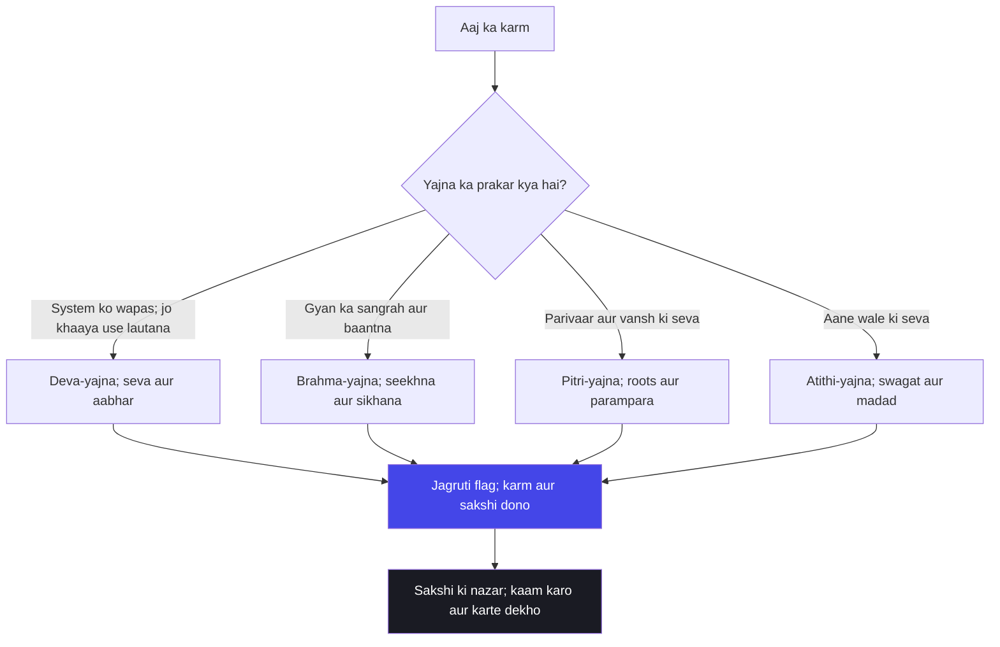

# अध्याय ४: ज्ञान कर्म संन्यास योग — Avatar koi aur nahin, tumhara jagruti ka pal hai

> **"Avatar koi kahani nahin hai, avatar ek law hai — jise tum har roz apne andar ghatate dekho. Krishna ka janm puraane itihaas mein hua, magar tumhari jagruti aaj, isi pal ho sakti hai. Yada yada ka matlab hai — jab bhi tum dharm se girte ho, chetna khud uthti hai."**
> — **ओशो**

---

Is adhyaya ke beech mein Mahabharat ka maidan aag ke paas khada hai. Do bade armies — do bade khandan — maarne-marne ke liye taiyar. Aur isi bheed ke beech, rath par, do vyakti baith hain: ek jo sawaal poochh raha hai, ek jo jawab de raha hai. Arjuna ne pehle teen adhyayon mein apna mann khola — uski vyatha, uski lalach, uska moh, uska bhram — sab kuch Krishna ke saamne rakha. Ab chautha adhyaya us mor par aata hai jahan Krishna apna raaz kholta hai. Arjuna poochhta hai: "Tum itne pracheen ho, aur tumhari janm-katha itni nayee hai? Yeh kaise sambhav hai?"

Krishna ka jawab Gita ka sabse mahan dhamaka hai: "Yada yada hi dharmasya glanirbhavati bharata — jab jab dharma kamzor hota hai, main apne aap ko srijit karta hoon." Sankalp ki roshni mein dekho to yeh do lineon ne Hindu sanskriti mein avatar-vada ka poora mandir khada kar diya. Magar Osho is mandir ke bahar khade hain — haath mein dastak de rahe hain, aur keh rahe hain: "Andar mat jaao bhai, yeh mandir tumhara hi darpan hai. Avatar koi door ka raja nahin hai — avatar tumhara hi agla pal hai, tumhari hi chetna ka uthna hai."

Osho ne Gita ko padha — Arjuna ki katha ke roop mein, seekhne wale ki katha ke roop mein, aur sabse bada, sawaal uthane wale ki katha ke roop mein. Unke liye Krishna koi bhagwan nahin, koi avtar nahin — woh ek guru, ek waktra, ek samarpit sakshi hai, jo Arjuna ko dikhata hai ki uski asli ladaai bahar ke kurukshetra mein nahin, andar ke mann ke kurukshetra mein hai. Is adhyaya ka asli sawaal yeh hai: tum action karoge ya bhaagoge? Tum jeevan ko tyaag ke bhag jaoge, ya jeevan ko samajh ke uske beech mein khade rahoge? Aur yeh adhyaya kahtaa hai — na bhagana, na latakna; yeh jaan lo ki kaam aur kaam ke beech jo poora khaali hai, wahi tumhara swaroop hai.

Adhyaya 4 mein Krishna jo pehli baat kholta hai, woh hai "sankalp ka vigyan". Arjuna samajh nahin paata ki Krishna kaun hai — kyunki Arjuna khud ko bhi nahin jaanta. Osho kahte hain — yahi Gita ka chakkar hai: jab tak tum khud ko nahin jaante, tab tak bhagwan bhi tumhare liye ek itihaas ki cheez hai, ek kahani hai. Lekin jis din tum apne andar ka sakshi jaante ho, usi din Krishna ka "main hoon" tumhare bheetar gunjta hai. Isliye adhyaya 4 ko padhne se pehle, apne aap se ek swar mein poocho: "Main kaun hoon?" — aur phir is adhyaya ko padho; jawab aayega, apne hi swar mein.

Aur ek baat jo Osho baar-baar dohraate hain: Krishna ka "sambhavami yuge yuge" bahut logon ne ek kahaani ke roop mein pakad liya — ek god jo kisi na kisi din aayega. Lekin Osho kehti hain, agar woh aane wala hai, to ab tak aa chuka hota; kyunki har yug mein dharma girti hai. Agar avatar janm leta hai, to woh har aadmi ka janm hai — kyunki har aadmi mein chetna uthti hai, jab woh sach ke paas khada hota hai. Avatar ki pooja karna band karo, avatar ko jeena shuru karo. Isi jeevan mein, isi pal mein.

## Learning Objectives

Is chapter ko complete karne ke baad aap:

1. Samajh payenge — Osho avatar-vada ko kaise todte hain: "yada yada" koi itihasik kamaal nahin, yeh chetna ka nityakaalik niyam hai.
2. Jaankar rahenge — chaturvarnya ka asli arth: janm par aadhaarit jaati nahin, balki guna aur karma ka vibhajan — Osho ki najar se.
3. Seekh payenge — "karmani akarma" ka rahasya: wah aankh jo kaam karte hue bhi andar se asakta rahe.
4. Parakh payenge — char yajna prakaron ko apne aaj ke jeevan mein: deva-yajna, brahma-yajna, pitri-yajna, atithi-yajna — modern roop mein.
5. Bana payenge — ek TypeScript "Yajna Action Classifier" jo roz ke actions ko classify kare aur jagruti ka flag uthaye.

---

## Adhyaya 4 ka Parichay

### Kahan khada hai yeh adhyaya?

Mahabharat ke kurukshetra mein pehle hi din, Arjuna ka dhanush haathon se gir chuka hai. Usne poora bhaavnaatmak patan dekha — aur phir Krishna ne use uthaya. Pehle adhyaya mein patan, doosre mein sankhya ka gyan, teesre mein karma ka gyan. Ab chautha adhyaya ek naye chehre ke saath aata hai: Krishna apne aap ko reveal karta hai. Arjuna poochhta hai:

> "Vivakshur munir vedi — tum pracheen vediyon se bhi puraane ho, phir tumne abhi janm kyun liya? Yeh rahasya samjhaao."

Krishna phir apni maala kholta hai — main anadi hoon, main har yug mein aata hoon, dharma ki raksha ke liye. Yehi wah moment hai jahan Gita mein "bhagwan ka apna parichay" aata hai — aur yahi woh moment hai jahan Osho ka swar bikharta hai.

### Osho ka lens: Krishna ki gyan ki baat

Osho kehti hain — Gita Darshan koi dharma-granth nahin padhne ke liye, yeh ek aaina hai dekhne ke liye. Krishna ka "main hoon" kaheen bahar ka nahin, kahin andar ka hai. Jab Krishna kehti hain "sambhavami yuge yuge", to iska matlab yeh nahin ki har 5000 saal mein ek bhagwan paida hota hai — iska matlab yeh hai ki har aadmi mein, har pal, ek naya janm sambhav hai. Jaise bachcha paida hota hai, waise hi chetna ka naya janm hota hai. Arjuna ke andar us din ek naya aadmi paida hua — jo bhaage nahin, jo aage badha.

Osho ke liye Krishna ek "strategist" bhi the — aur yahaan woh Osho ki aalochana ka nishana bante hain. Krishna ne Arjuna ko ladai ke liye taiyaar kiya — yeh Osho ko sahi nahin lagta tha, kyunki woh kehte the ki Krishna ki raajneeti ne ek manushya ko raajy ke liye istemaal kiya. Magar is adhyaya mein Krishna joh kehta hai — kaam ko karo, phal ki chinta mat karo, aur samay-samay par chetna utho — yeh baat Osho ke dil ke bahut kareeb hai. Yahan Krishna guru hai, yahan Krishna ki baat mein hinsa nahin, vigyan hai.

Ek aur nukta yahaan dekhne layak hai: adhyaya 4 mein Krishna kehti hain ki gyan "agni" hai — "jnanagni dagdha karmani" — sab karm jaan ki aag mein jal jaate hain. Osho is agni ka itihaasik anudaan nahin maante, woh ise chetna ki uttejna maante hain. Jis din tumhara bheetar ka dekhte hue ka gyan jagta hai, usi din puraana karm apna bojh khatam kar deta hai — jaise jalte hue beej ka naash hota hai. Magar dhyan rakho — Osho kahte hain yeh aag "doosron ko jalane" ki nahin hai; yeh aag khud ko jalane ki hai. Gyan se ego nahin badhta, ego jal jaata hai.

### Purani padhti aur Osho ki padhti

| Traditional reading | Osho's reading |
|--------------------|----------------|
| Krishna ek bhagwan hai jo yuge-yuge avatar leta hai | Avatar koi vyakti nahin — chetna ka kshanik uthna hai, har aadmi mein sambhav |
| Yada yada ka itihaasik arth: bhagwan ka janm, dharam raksha | Yada yada ka nityaarth: jab chetna dharm se girti hai, jagruti khud lautti hai |
| Avatar ka kamaal dekhna hai, pooja karna hai | Avatar ko ghatna hai, aapke andar ghatna hai — pooja nahin, pratyaksha |
| Chaturvarnya: janm se braahman, kshatriya, vaishya, shudra | Chaturvarnya: guna aur karma ka vibhajan — janm se nahin, karya se |
| Krishna ka jeevan katha mein pooja | Krishna ka updesh vyavahaar mein utaar do |
| Shastra mein gyan dhoondho | Apne anubhav mein gyan dhoondho — shastra to sirf ungli hai |

---

## Key Shlokas

### Shloka 4.7-8

> यदा यदा हि धर्मस्य ग्लानिर्भवति भारत।
> अभ्युत्थानमधर्मस्य तदात्मानं सृजाम्यहम्।।
> परित्राणाय साधूनां विनाशाय च दुष्कृताम्।
> धर्मसंस्थापनार्थाय सम्भवामि युगे युगे।।

**Transliteration:** Yada yada hi dharmasya glanirbhavati bharata; abhyutthanam adharmasya tadatmanam srijamyaham. Paritranaya sadhunam vinashaya cha dushkritam; dharma-sansthapanarthaya sambhavami yuge yuge.

**Arth (Hinglish):** Jab jab dharma ka patan hota hai aur adharma ki utti hoti hai, tab tab main apne aap ko srijit karta hoon. Sadhuon ki raksha, dushkriton ka vinash aur dharma ki sthapana ke liye main har yug mein aata hoon.

**Osho ka drishtikon:** Osho kehti hain — yeh do lineein avatar-vada ki sadkon nahin, chetna ke vigyan ka sootr hain. Jab bhi tum apne bheetar sach se girti ho, jab bhi tumhara bheetar ka aadmi maarta hai, usi pal ek naya chetna tumhare andar uthti hai — aur wohi tumhara avatar hai. Krishna kisi bahar ke itihaas mein nahin aata; woh tumhare andar aata hai, har baar, jab tum dharm ki paribhasha ko phir se jeevan mein laate ho. Bahar ke avatar ko dhoondhne ki jagah, andar ke us pal ko pehchano.

### Shloka 4.13

> चातुर्वर्ण्यं मया सृष्टं गुणकर्मविभागशः।
> तस्य कर्तारमपि मां विद्ध्यकर्तारमव्ययम्।।

**Transliteration:** Chaturvarnyam maya srishtam guna-karma-vibhagashah; tasya kartaram api mam viddhyakartaram avyayam.

**Arth (Hinglish):** Chaar varnon ko maine guno aur karmon ke vibhajan se srijit kiya hai. Iska karta hon ke baawajood main avinashi akarta hoon — is baat ko jaan lo.

**Osho ka drishtikon:** Osho is shloka ko apni pehchaan ka aina banate hain. Veh kehte hain — Krishna ne "guna-karma-vibhagashah" kaha hai, janm-vibhag nahi. Brahman wo nahin jo brahman ke ghar paida hua; brahman wo hai jiska guna gyan ho aur karma seva ho. Osho ne apne samaj mein is shloka ka itna zor se virodhi upyog dekha ki woh khud hi varna vyavastha ke khilaf khade ho gaye. Unka kehna hai — varna ek vijigishu vibhajan hai kaam ka, warg bhed ki saja nahin. Aaj ke engineer, doctor, kisan, aur seekhne wale — sab apne guna-karma se apni pehchaan banaate hain.

### Shloka 4.18

> कर्मण्यकर्म यः पश्येदकर्मणि च कर्म यः।
> स बुद्धिमान्मनुष्येषु स युक्तः कृत्स्नकर्मकृत्।।

**Transliteration:** Karmani akarma yah pashyed akarmani cha karma yah; sa buddhimaan manushyeshu sa yuktah kritsna-karma-krit.

**Arth (Hinglish):** Jo kaam mein akaam dekhta hai — aur akaam mein kaam — wahi manushyon mein buddhimaan hai, wahi yog mein sthit hai, aur wahi poore kaam ko karta hai.

**Osho ka drishtikon:** Osho kehti hain — yeh shloka Gita ka sabse gehra sootr hai. Kaam ke beech mein woh an-kaam, woh poora khaali, woh sakshi bhumi — jo karta hai bhi nahin aur kartaa bhi hai — wahi asli kusalta hai. Jaise ek pianist haathon se bajata hai magar andar se koi nahin bajata, kaam hota hai aur karta nahin dikhta — waise hi yogi ka jeevan ek khel ban jaata hai. Kaam se bhaag kar nahin, kaam ke beech mein khade ho kar — yeh adhyaya ka kendra bindu hai.

### Shloka 4.34

> तद्विद्धि प्रणिपातेन परिप्रश्नेन सेवया।
> उपदेक्ष्यन्ति ते ज्ञानं ज्ञानिनस्तत्त्वदर्शिनः।।

**Transliteration:** Tadviddhi pranipatena pariprashnena sevaya; upadekshyanti te gyanam gyaninas tattva-darshinah.

**Arth (Hinglish):** Is gyan ko pranipat (sampoorna samarpan), pariprashna (gahre sawaal) aur seva se jaano. Tattva-darshi gyaani tumhe woh gyan updesh denge.

**Osho ka drishtikon:** Osho is shloka ke "pariprashna" shabd ko pakadte hain. Veh kehte hain — bhakti andhi nahin hoti, bhakt ko sawaal poochhne ka adhikaar hai. Arjuna ne poocha, isliye use gyan mila. Osho ka guru-sisya rishta isi par aadhaarit hai — pranipat ka matlab apne ko khona nahin, apne ko kholna hai. Aur Osho kehti hain — asli guru woh hai jo tumhe apne pairon par khada kare, na ki hamesha aashirwad mein baandhe rakhe.

---

## Avatar, Varna aur Yajna — Osho ki gahrai mein

### Avatar: bahar ka superhero nahin, andar ki jagruti

Osho avatar-vada ko lekar sabse kathor hain. Unka kehna hai — Hindu mann ne avatar ko ek superhero ki kahani bana diya, jiski pooja karo aur jiska intzaar karo. Magar yeh poora raasta galat hai — pooja se chetna nahin uthti, so jaati hai. Jab tum kisi avatar ko bahar dhoondhte ho, tum andar ke uthta hua pal kho dete ho. Osho kehti hain — "yada yada" ka matlab hai — jab bhi tumhari chetna dharma se girti hai — aur dharma ka matlab yahan koi religious law nahin, tumhara apna swabhaav, tumhari honesty, tumhara sach — tab tumhare andar ek naya aadmi uthta hai. Yeh naya aadmi hi avatar hai. Krishna se bhi bada avatar wah pal hai jab Arjuna apne dhanush ko uthata hai.

Yahan Osho ek aur baat rakhte hain: Krishna ki avatar-katha mein "sambhavami yuge yuge" — agar ise kathaa ke roop mein pakdo to yeh dharam ki raksha ki kahani hai; magar agar ise vigyan ke roop mein dekho to yeh chetna ke cycles ka varnan hai. Jaise ritu badalti hain, jaise subah hoti hai, waise hi chetna mein utthaan ka pravah hai — aur isi pravah mein shamil hona hi sadhana hai.

### Varna: janm ki jaati nahin, guna-karma ka vibhajan

Krishna kehti hain "guna-karma-vibhagashah" — aur isi par Osho apna sabse bada dawa rakhte hain. Brahman, kshatriya, vaishya, shudra — yeh char categories janm se nahin, swabhaav se hain. Aaj ke jeevan mein dekho: ek scientist (brahman ki guna), ek engineer (kshatriya ki guna — jisne rishta banaya, challenge liya), ek businessman (vaishya ki guna — vyapaar, vikas), aur ek kaam karne wala, seva karne wala (shudra ki guna). Yeh charon har samaj mein hain, har gharon mein hain — aur kabhi koi janm se brahman nahin hota.

Osho ki aalochana yahaan bhi hai: jab varna janm-prajaati ban gayi, to woh ek atyaachaar ka sadhan ban gayi. Jab brahman sirf isliye brahman hai kyunki uska janm hua — aur shudra sirf isliye shudra hai kyunki uska janm hua — to Krishna ka "guna-karma-vibhagashah" apmaanit ho jaata hai. Osho kahte hain — is shloka ko shabd se mat, bhav se padho. Vibhajan ka asli matlab hai — har aadmi ko uska swabhaav jeene do; kisi ko bhi doosre ke swabhaav mein jeevan jina mat sikhao. Yeh hi adhyaya ka maanavta ka sootr hai.

### Yajna: char prakar ka karya-ras — aaj ke jeevan mein

Yajna shabd se puraana bhrama hai ki yajna ka matlab hai hawan, aag, aur ahuti. Osho kehti hain — Krishna ne "yajna" ka matlab hi badal diya hai. Adhyaya 3 mein Krishna kahte hain — karm hi yajna hai. Aur is adhyaya mein woh char yajna bataate hain: deva-yajna (devataon ki seva — pure kaam, shukra), brahma-yajna (brahma — gyan ki seva), pitri-yajna (pitro ki seva — poore vansh ki seva), atithi-yajna (atithi ki seva — aane wale ki seva). Osho kehti hain — yeh charon yajna aaj ke adhyaya ke 4 pillars hain: jahan bhi tum karm kar rahe ho, tum kisi na kisi yajna mein bhag le rahe ho.

In char yajnon ka vistrit roop aaj ke samay mein:

Ek aur baat Osho yahan jodte hain: yajna ka matlab "balidan" bhi hai. Jab tum kuch karte ho bina phal ki chinta — tum apni chinta ka balidan karte ho, apne "main" ka balidan karte ho. Yahi yajna ka rahasy hai — karm ka balidan, phal nahin. Yajna ki aag andar ki aag hai — us aag mein tumhara ego jal raha hai, tumhari chinta jal rahi hai. Isliye Krishna ne "yajna" ko itna badi jagah di hai — kyunki yajna hi ek aisa karm hai jo karm se pare le jaata hai.

| Yajna | Traditional arth | Modern arth (Osho ki drishti) | Aaj ka udaharan |
|-------|------------------|-------------------------------|-----------------|
| Deva-yajna | Devataon ke liye ahuti, swarg ke puja | System ka aabhar — jis duniya se tumne liya, use wapas do | Open-source code contribute karna, tree lagana, seva karna |
| Brahma-yajna | Ved-path, brahman ko bhojan | Gyan ka sangrah aur samprachar — padhna, seekhna, sikhana | Classes lena, blog likhna, gyaan baantna |
| Pitri-yajna | Pitron ki tarpan, shraddh | Vansh aur parampara ka sammaan — jo tumse pehle aaye, unka aabhar | Maa-baap ki seva, family roots, parampara ko aage badhana |
| Atithi-yajna | Atithi ko bhojan, abhyagat poojan | Mehmaan ki seva — jo tumhare paas aaye, use dil se swagat | Dost ki madad, alag aaye hue ki seva, naye aaye hue ka swagat |

### Gyan aur karma ka sangam: sankalp se sakshi tak

Krishna is adhyaya mein "gyan" aur "karma" dono ko ek saath rakh ke naam deta hai — isliye naam hai jnana-karma-sanyasa-yoga. Osho is naam ko hi swas ka sootr maante hain. Kaun sa bada hai — gyan ya karma? Yeh sawaal karodon sanskritik takraaron ka aadhaar raha hai. Kuch kehte hain — gyan hi mukti hai; kuch kehte hain — karma hi sab kuch hai. Osho kahte hain — dono galat hain, kyunki dono do alag cheez nahin hain. Gyan jab gehre hote hain, karma apne aap badalta hai; aur karma jab jagruti ke saath kiya jaaye, wahi gyan ka janm hota hai.

| Gyan-only marg | Karma-only marg | Osho ka marg |
|----------------|-----------------|--------------|
| Duniya se bhaag kar gyan dhoondho | Kaam mein doob jao, sochna band karo | Duniya ke beech mein khade raho, kaam karo, aur karte dekho |
| Gyan jadta ki tarah so jaata hai | Karma aag ki tarah jal jaata hai | Gyan aur karma — ek hi agni ke do phool |
| Tyag ka bhram — moh ke peeche chhupa | Ladai ka bhram — phal ki chinta mein | Karm karo, phal ki chinta chhodo, sakshi bano |
| Muni ka bhes, andar khaali | Karma ka bhes, andar thaaka | Yogi ka bhes nahin — yogi ka vyavahaar |

Osho kehti hain — adhyaya 4 mein Krishna "sanyasa" shabd bhi rakh deta hai, magar yeh sanyasa ghar chhodne ka nahin, "asakti chhodne" ka sanyasa hai. Tum office mein kaam karo, parivaar mein raho, duniya mein ghumein — aur andar se kisi cheez se chipe na raho. Yahi gyan-karma-sanyasa ka tika hai: gyan se dekho, karma se karo, sanyasa se asakta chhodo. Aur yeh teeno ek saath hi sambhav hain — alag-alag nahin.



Osho is mermaid ko dekh kar kehte — yeh classification koi jaati nahin banati, yeh roj ki parchhi banati hai: tumhare din ka har kaam kisi na kisi yajna ka hissa hai. Sirf poocha jaaye — kaun sa? Aur jab tum is sawaal ke saath kaam karte ho, kaam yajna ban jaata hai, maal nahin.

---

## TypeScript Implementation

```typescript
/**
 * Yajna Action Classifier
 * ----------------------
 * Adhyaya 4 ka TypeScript roop — Osho ki drishti mein yajna:
 * char prakar ke yajna — deva, brahma, pitri, atithi.
 * Roz ka har action kisi yajna ka hissa hai; bas dekhna seekho.
 * Awareness flag batata hai — tumne kaam kiya aur karte hue dekha bhi.
 * Osho kehti hain: "Yajna aag mein nahi, jagruti mein ghatta hai."
 */

type YajnaType = "deva" | "brahma" | "pitri" | "atithi" | "unknown";

interface ActionRecord {
  id: number;
  kaam: string;
  shreni: "seva" | "gyan" | "parivaar" | "atithi" | "vyaparik" | "vyaktigat";
  samay: Date;
}

interface ClassificationResult {
  record: ActionRecord;
  yajna: YajnaType;
  reason: string;
  awarenessFlag: boolean;
}

const SHRENI_TO_YAJNA: Record<ActionRecord["shreni"], YajnaType> = {
  seva: "deva",
  gyan: "brahma",
  parivaar: "pitri",
  atithi: "atithi",
  vyaparik: "unknown",
  vyaktigat: "unknown",
};

class YajnaActionClassifier {
  private results: ClassificationResult[] = [];
  private nextId = 1;

  registerAction(kaam: string, shreni: ActionRecord["shreni"]): ClassificationResult {
    const record: ActionRecord = { id: this.nextId++, kaam, shreni, samay: new Date() };
    const yajna = SHRENI_TO_YAJNA[shreni];
    const reason = this.buildReason(yajna, shreni);
    const result: ClassificationResult = { record, yajna, reason, awarenessFlag: true };
    this.results.push(result);
    return result;
  }

  private buildReason(yajna: YajnaType, shreni: ActionRecord["shreni"]): string {
    switch (yajna) {
      case "deva":
        return "System ko wapas; jo tumne duniya se liya, use lautaya";
      case "brahma":
        return "Gyan ka sangrah ya samprachar; seekhna ya sikhana";
      case "pitri":
        return "Parivaar aur parampara ki seva; roots ka sammaan";
      case "atithi":
        return "Aane wale ki seva; swagat aur madad";
      default:
        return "Koi spashth yajna nahin; bhaagi hui drishti se kaam karo ya dobara dekho";
    }
  }

  countByYajna(): Record<YajnaType, number> {
    const counts: Record<YajnaType, number> = { deva: 0, brahma: 0, pitri: 0, atithi: 0, unknown: 0 };
    for (const r of this.results) counts[r.yajna]++;
    return counts;
  }

  oshoCommentary(): string {
    const c = this.countByYajna();
    const total = this.results.length;
    if (total === 0) return "Koi action register nahin kiya; din ka har karm yajna hai, bas dekhna seekho.";
    const jagruti = this.results.filter((r) => r.awarenessFlag).length;
    return [
      "Osho kehti hain —",
      "Aaj ke ".concat(String(total), " actions mein se ").concat(String(jagruti), " jagruti ke saath kiye gaye."),
      "Deva: ".concat(String(c.deva), " | Brahma: ").concat(String(c.brahma)),
      "Pitri: ".concat(String(c.pitri), " | Atithi: ").concat(String(c.atithi)),
      "Unknown: ".concat(String(c.unknown), " — inko dobara jagruti se dekho."),
      "Yajna aag mein nahin, jagruti mein ghatta hai.",
    ].join("\n");
  }

  private markAwareness(id: number, aware: boolean): void {
    const r = this.results.find((x) => x.record.id === id);
    if (r) r.awarenessFlag = aware;
  }
}

function runDemo(): void {
  const classifier = new YajnaActionClassifier();
  const actions: Array<[string, ActionRecord["shreni"]]> = [
    ["Open-source repo mein pull request", "seva"],
    ["Dost ko DSA ka concept samjhana", "gyan"],
    ["Maa ko phone karke poocha kaisi hain", "parivaar"],
    ["Naye dost ka swagat; khana khilaya", "atithi"],
    ["Office ka boring report banaya", "vyaparik"],
  ];

  console.log("=== Yajna Action Classifier: Demo ===");
  for (const [kaam, shreni] of actions) {
    const res = classifier.registerAction(kaam, shreni);
    console.log(`[${res.yajna.toUpperCase()}] ${kaam} -> ${res.reason} | awareness: ${res.awarenessFlag}`);
  }
  console.log("\n" + classifier.oshoCommentary());
}

runDemo();
```

Yeh code sirf code nahin hai — yeh ek aaina hai. Isko chalao, apne actions ka hisaab dekho, aur Osho ka woh sawaal yaad rakho: "Aaj tumne kitne kaam kiye — aur kitne kaam tumhare bheetar kisi jagruti ke saath hue?" Jaise hi yahaan "awarenessFlag" uthta hai, waise hi adhyaya 4 ke avatar ka janm hota hai.

---

## Summary

| Bindu | Saar |
|-------|------|
| Avatar | Bahar ka superhero nahin — chetna ka nitya pal; "yada yada" har aadmi ke andar ghat sakta hai |
| Varna | Janm ki jaati nahin — guna aur karma ka vibhajan; har aadmi ka swabhaav uska varna |
| Karmani akarma | Kaam ke beech ka sakshi — jo karta hai aur phir bhi andar se akarta hai |
| Yajna | Char prakar ke karya-daan — deva, brahma, pitri, atithi — aaj ke jeevan mein seva, gyan, parivaar, swagat |
| Guru aur sawaal | Pranipat se guru se judo, magar pariprashna kabhi mat chhodo — sawaal hi gyan ka dwar hai |

---

## Contradictions

- **Avatar ki kathaa vs chetna ka niyam:** Traditional path Krishna ko itihaasik avatar maanta hai — ek vyakti jo yuge-yuge aata hai. Osho kehti hain — "yada yada" koi janm ki kahani nahin, chetna ka nitya niyam hai; avatar dhoondhne se tum bahar jaate ho, andar ki jagruti khota hai.
- **Varna vyavastha ki raksha vs guna-karma ka vibhajan:** Sadhu-sampraday varna ko janm-aadhaarit jaati ke roop mein sthapit karte hain. Osho is shloka ko padhte hain jaise Krishna khud jaati-vyavastha todte hain — guna-karma-vibhagashah, janm ka koi zikr nahin.
- **Krishna ki pooja vs Krishna ka anukaran:** Bhakti-marg Krishna ko poojta hai — magar Osho kahti hain pooja kaam nahin aayegi; Krishna ko apne andar jeevit karo, unka updesh vyavahaar banao.
- **Yajna ka shabdik arth vs karya-yajna:** Hajam-kundi aur agni-hotra ko hi yajna maana jaata hai. Osho ise palat dete hain — tumhara har kaam yajna hai, jab woh seva ke roop mein kiya jaye.
- **Krishna ki raajneeti vs guru ka prem:** Itihaasik Krishna yudh ke liye Arjuna ko taiyaar karta hai. Osho kahti hain — yahaan Krishna ka strategist roop aalochana ka paatra hai; lekin adhyaya 4 mein woh shikshak hai, aur wahi shikshak se seekhna hai.

---

## Open Questions

- Agar avatar har aadmi ke andar pal-pal uth sakta hai, to kya avatar-vada ki aavashyakta hi khatam nahin ho jaati? Osho ne "bahar ka god" aur "andar ka sakshi" — dono ka kya rishta rakha?
- Osho ne varna-vyavastha ki aalochana ki — magar "guna-karma vibhajan" bhi ek prakar ka class system hi to hai. Ek vyakti apna swabhaav kab tak badal sakta hai?
- Yajna ko aaj ke system-daan (deva-yajna) tak le jaana — kya yeh Krishna ke bhaavnaatmik yajna ko bahut pragatisheel bana raha hai?
- "Pranipat" (sampoorna samarpan) aur "pariprashna" (sawaal) ek saath kaise sambhav hain? Andha samarpan aur sawaal — Osho ka guru-rishta kis bhumi par khada hai?

---

## Practical Takeaways

| Situation | Gita shloka | Osho's lens | Action |
|-----------|-------------|-------------|--------|
| Tumhare andar baar-baar "main kya kar raha hoon" ka patan hota hai | 4.7-8 (yada yada) | Yehi patan hi avatar ka janm hai | Har patan ke baad ek naya sankalp lo; use pooja nahin, pal do |
| Office mein apna swabhaav zidd se lad raha hai | 4.13 (guna-karma) | Varna janm ka nahin, kaam ka hai | Apne kaam ke guna ko pehchano aur use poore mann se karo |
| Kaam karte-karte soch: "yeh sab kyun?" | 4.18 (karmani akarma) | Kaam ke beech ka khaali hi asli hai | 10 minute kaam ke beech, 1 minute sakshi bano |
| Kisi ne madad maangi, aalsi mann bola "baad mein" | 4.34 (atithi-yajna) | Seva yajna hai, swagat hi dharma hai | Aaj hi ek madad bina sawaal ke kar do |
| Guru ya mentor se sawaal poochhne mein darr | 4.34 (pariprashna) | Sawaal hi gyan ka dwar hai | Ek gahra sawaal likho aur apne mentor se poochho |

---

## Chapter Quiz

### Question 1

Osho ke anusaar "yada yada hi dharmasya" ka asli arth kya hai?

a) Krishna har 5000 saal mein avatar leta hai
b) Chetna ka nitya niyam — jab dharma girti hai, jagruti uthti hai
c) Dharam raksha ke liye yuddh karna hi dharm hai
d) Har janm mein naya shastra likhna padta hai

<details>
<summary>Answer</summary>
b) Osho kehti hain — avatar koi itihaasik kamaal nahin, chetna ka nitya pal hai.
</details>

### Question 2

Shloka 4.13 mein "chaturvarnyam maya srishtam" ke baad kaun si paribhasha aati hai?

a) Janma-vibhagashah
b) Guna-karma-vibhagashah
c) Kula-vibhagashah
d) Desh-vibhagashah

<details>
<summary>Answer</summary>
b) Guna-karma-vibhagashah — guno aur karmon ke vibhajan se, janm se nahin.
</details>

### Question 3

Osho kehti hain ki varna ka asli matlab kya hona chahiye?

a) Janm se bani jaati vyavastha
b) Har aadmi ka apna swabhaav aur kaam jeena
c) Brahmanon ki satta
d) Kshatriyon ka raajya

<details>
<summary>Answer</summary>
b) Varna guna-karma ka vibhajan hai — har aadmi ko uska swabhaav jeene do.
</details>

### Question 4

"Karmani akarma yah pashyet" — is shloka ka kya bhaav hai?

a) Kaam ko kabhi mat karo
b) Kaam ke beech ka sakshi bhumi — karta aur akarta dono
c) Kaam sirf raat ko karo
d) Kaam ko dhoop se chhupaao

<details>
<summary>Answer</summary>
b) Jo kaam mein akaam dekhta hai — wahi buddhimaan hai. Kaam ke beech ka khaali hi asli hai.
</details>

### Question 5

Shloka 4.34 mein gyan paane ke teen upaay kya hain?

a) Tap, tyaag, dhyan
b) Pranipat, pariprashna, seva
c) Pooja, bhajan, kirtan
d) Yuddh, yatra, vrat

<details>
<summary>Answer</summary>
b) Pranipat (samarpan), pariprashna (gahre sawaal), seva — teeno ka sangam.
</details>

### Question 6

Osho ke liye asli avatar kya hai?

a) Krishna ka itihaasik janm
b) Ek naya murti ki sthapana
c) Chetna ka jagruti pal — har aadmi ke andar
d) Ek naya mandir banna

<details>
<summary>Answer</summary>
c) Avatar koi bahar ka vyakti nahin — andar ka jagruti ka pal hai.
</details>

### Question 7

Deva-yajna ka modern roop Osho ki drishti mein kya hai?

a) Mandir mein hawan karna
b) System ko wapas — jo duniya se liya use lautana
c) Swarg ki pooja karna
d) Devataon se dhan maangna

<details>
<summary>Answer</summary>
b) Deva-yajna aabhar ka yajna hai — seva, open-source, duniya ko wapas dena.
</details>

### Question 8

Osho kehte hain ki pooja ki jagah avatar ke saath kya karna chahiye?

a) Unka intzaar karna
b) Unki murti banana
c) Unhe apne andar jeevit karna
d) Unke naam ka jaap karna

<details>
<summary>Answer</summary>
c) Pooja se chetna so jaati hai; avatar ko ghatna hai, andar ghatna hai.
</details>

### Question 9

Yajna Action Classifier mein "awarenessFlag" kya darshaata hai?

a) Kaam kitna lamba tha
b) Kaam jagruti ke saath kiya gaya ya nahin
c) Kaam kitna mushkil tha
d) Kaam kisne kiya

<details>
<summary>Answer</summary>
b) Awareness flag batata hai — karm ke saath sakshi tha ya nahin; yahi asli yajna hai.
</details>

### Question 10

Osho ka kehna hai ki "pariprashna" (sawaal) gyan ka dwar kyun hai?

a) Kyonki sawaal se gyaani dar jaate hain
b) Kyonki Arjuna ne sawaal poocha aur use gyan mila
c) Kyonki sawaal poochhna mushkil hai
d) Kyonki sawaal ka jawab shastra mein hota hai

<details>
<summary>Answer</summary>
b) Bhakti andhi nahin hoti — Arjuna ka sawaal hi gyan ka dwar bana. Sawaal uthao, gyan aayega.
</details>

---

## Exercises

1. **Avatar diary (5-min):** Aaj raat soote samay, din ka wo pal likho jab tum "dharm se gire" — jhooth bola, laalach kiya, apne aap ko dhoka diya. Uske baad ek line likho: usi pal ke aage "jagruti ka naya pal" kya ho sakta tha.

2. **Varna swa-parikshan (15-min):** Chaturvarnya ke char prakar — gyan, kamaal (kshatriya), vyapaar, seva — inmein se apni do sabse gehri qualities likho. Ab socho: tumhare din ka kaun sa kaam kis varna ka hai? Janm ka koi hisaab nahin, sirf guna-karma ka.

3. **Yajna action list (10-min):** Kal ke apne din ke 10 actions likho. Har action ke aage likho — kaun sa yajna: deva, brahma, pitri, atithi, ya koi nahin? Jo "kuch nahin" bache, unke liye Osho ka sawaal likho: "Kya iska koi yajna ho sakta hai?"

4. **TypeScript chalao:** `YajnaActionClassifier` ko copy karke apne machine par run karo. Ab apne khud ke 5 actions add karo — aur dekhो "unknown" kitne aaye. Osho kahein — "Jo unknown hai, use unknown mat chhodo; sawaal poochho."

5. **Ek sawaal ka abhyaas (roz):** Har subah utho aur ek aisa sawaal likho jo shastra se nahin, apne jeevan se aaya ho. Osho kehte hain — pranipat to guru ko hota hai, magar pariprashna tumhara apna adhikaar hai. Is sawaal ko din bhar apne saath rakho.

6. **Deva-yajna ka ek dam (5-min):** Aaj ek chhota sa kaam karo jiska koi fayda tumhe nahin milega — kisi ke liye kuch karo bina bataye. Osho kehte hain — yehi asli yajna hai: bina phal ki chinta ke kiya gaya karm.

---

## Further Reading

- **Osho, "Gita Darshan" (Volume 1-2)** — Bombay 1973 mein Woodlands apartment ki discourse series; adhyaya 4 ki vyakhya is series ke beech mein padhein.
- **Bhagavad Gita — "Gita Press" (Gorakhpur)** — shloka ka shuddh paath aur traditional bhashya; Osho ki tulna ke liye yeh aadhaar hai.
- **Osho, "The Book of Secrets"** — tantra par Osho ki vyakhya; sakshi ka vigyan is book mein aur gehre roop mein milta hai.
- **Osho, "Krishna: The Man and His Philosophy"** — is series mein Osho Krishna ki aalochana aur vyakhya dono karte hain.
- **Arvind Sharma, "The Hindu Gita"** — Gita ke anek paath aur vyakhyaon ka tulnaatmak adhyayan.
