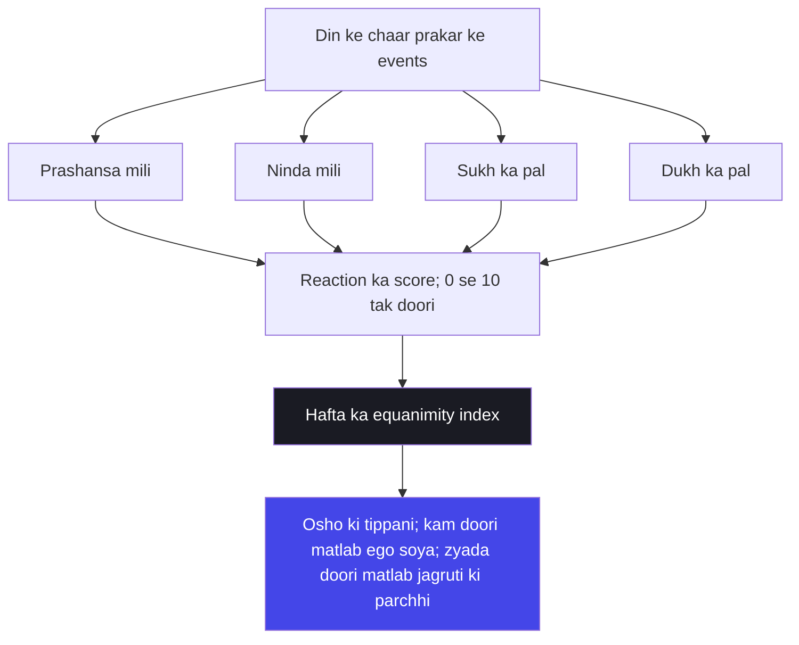

# अध्याय ५: कर्म संन्यास योग — Tyag nahin, samadrishti chahiye

> **"Tyag ka rog sabse gehri bimari hai — kyunki woh sant banne ke naam par jeevan se bhaagna sikhata hai. Krishna nahin chahte tum ghar chhodo; woh chahte hain tum ghar mein raho, parivaar mein raho, duniya mein raho — aur andar se kisi se chipe na raho. Tyag nahin, samadrishti chahiye."**
> — **ओशो**

---

Mahabharat ke kurukshetra mein arjun is waqt tak chaar adhyayon ka gyan sun chuka hai. Uski bheetar ki ladaai ka pahla hissa khatam hua — ab woh ek naya sawaal lekar khada hai, jo uske samay mein pura bharat puchh raha tha: "Krishna, tumne mujhe bataya karm karo, aur bataya gyan pao. Phir bhi do raaste hain — karm sanyasa, kaam chhodna, aur karm yoga, kaam ke beech rehna. In do mein se kaunsa behtar hai?" Krishna ka jawab is adhyaya mein hai — aur yeh jawab itna sookshma hai ki bharat ki poori sanskriti aaj tak ise theek se nahin samajh payi.

Krishna kehte hain — dono marg kathin hain, magar karm yoga sanyasa se bhi behtar hai. Magar phir woh ek aisi baat kehte hain jo sab kuch palat deti hai: "samadrishti" — brahman aur shwapaach (kutta-khaane wala) ko ek aankh se dekhna, sukh aur dukh ko ek taraju mein rakhna, prashansa aur ninda ko ek hi mana. Osho kehte hain — yeh adhyaya Gita ka sabse krantikari adhyaya hai, kyunki yeh tyag ke naatak ko todta hai. Sadhu ka bhes nahin chahiye, mandir nahin chahiye, sant ka padwi nahin chahiye — sirf ek chetna chahiye jo dekhe, par chip na jaaye.

Osho ki drishti mein adhyaya 5 ka asli naam hona chahiye tha — "samadrishti yoga", kyunki woh "karm sanyasa" ke naam ko hi jhooth maante hain. Sanyasa matlab ghar chhodna, bhes badalna — aur woh bhes ke saath ego ko pakadna hai. Osho kehti hain — tum duniya se bhaag ke jo sant bane, wohi sant duniya se darte hain. Asli tyag woh hai jo bheetar ghatta hai — jab tum samay ke saath chalti hui duniya mein khade rehte ho aur tumhara andar ka kendra nahin hilta. Yeh adhyaya usi kendra ki baat karta hai.

## Learning Objectives

Is chapter ko complete karne ke baad aap:

1. Samjhenge — Osho tyag aur sanyasa ki bhes-dhaari duniya ko kaise todte hain: asli tyag bahar ka nahin, bheetar ka hota hai.
2. Jaanege — "samadrishti" ka asli arth: yeh andha nirvikar bhaav nahin, gehri drishti hai jo sab mein ek hi aatma dekhti hai.
3. Seekhenge — karm sanyasa ka sookshm farq: kaam chhodna alag hai, kaam ke bheetar asakti chhodna alag.
4. Abhyas kar payenge — prashansa, ninda, sukh, dukh — in char parchhiyon ke saamne apni pratikaarya (reaction) ka doori-mapan.
5. Banayenge — TypeScript "Samadrishti Equanimity Tracker" jo weekly equanimity index nikale aur Osho ki tippani de.

---

## Adhyaya 5 ka Parichay

### Ek sawaal jo bharat ko baant deta hai

Arjuna ka sawaal sirf uska apna nahin tha — woh bharat ki aatma ka sawaal tha. Yeh raha woh sawaal: "Sanyasam karmanam krishna punar yogam cha shansasi — Krishna, tum ek taraf kehti ho karm sanyasa achha hai, aur doosri taraf karm yoga bhi achha hai. Ek hi kaam ke liye do raaste? Batao na, kaunsa nishchit behtar hai?" Yehi woh divid hai jo aaj tak bharat ke samaj mein hai — bhogwadi aur tyaagi, grihasthi aur sanyasi, karma-kand aur bhakti-marg. Krishna is sawaal ko solve nahin karta, woh is sawaal ko udha deta hai: dono mein se koi bhi sahi nahin, kyunki dono ek hi sooche se nikalte hain.

Osho is sawaal ko ek aur teesre angle se dekhate hain. Woh kehte hain — yeh sawaal ek hi jagah se uthta hai: insaan ko laga ki jeevan mein koi "position" leni hai — ya to poora karmi, ya to poora sanyasi. Magar Krishna kisi position ki baat nahin karta, woh chetna ki baat karta hai. Chetna na to karmi hoti hai, na sanyasi — chetna to sirf dekhne wali hoti hai. Aur jo dekhne wali hai, woh na to kaam mein doobti hai, na kaam se bhaagti hai. Osho kahte hain — Krishna ka uttar "tyag ya karma" nahin hai; Krishna ka uttar hai "tyag karma mein" — kaam ke bheetar se tyag.

### Osho ka lens: tyag ka rog

Osho ne apne jeevan mein hazaaron "sant" dekhe — jo duniya ko chhod kar gaye, aur phir bhi unka chhodna ek naatak tha. Woh jungle mein gyaan ki baat karte the, magar unka mann mandir mein tha; woh bhes badal lete the, magar ego nahin badalne dete the. Osho isi ko "tyag ka rog" kehte hain — ek aisi bimari jismein aadmi apne ghar, parivaar, duniya se door jaakar sochta hai ki woh mukta ho gaya, magar woh sirf bhag gaya hai. Bhagte hue aadmi ka dar bhaag ke saath-saath aata hai.

Osho ke anusaar asli sanyasi woh hai jisko sanyas hone ka ehsaas bhi nahin hota. Jaise ek insaan sachcha isliye hai kyunki usne jhooth bolna chhoda, na ki isliye kyunki use pata hai ki woh sachcha hai. Asli tyag bhee vit yahan hai: jisne tyag kiya hai, woh bata nahin sakta; jisne kiya nahin, woh sabko batata hai. Isi liye Osho kehti hain — adhyaya 5 ka "karm sanyasa" naam galat samjha gaya. Krishna ka matlab tha — kaam ko poore mann se karo, aur karte-karte apne ko "karta" hone ka bhram chhodo. Woh "karm sanyas" nahin hai, woh "karm mein yoga" hai.

Yahan ek aur gehrai hai, jo adhyaya 5 ko adhyaya 4 se jodti hai: pehle Krishna ne kaha — "karmani akarma pashyet" — kaam mein akaam dekho. Ab is adhyaya mein woh kehte hain — "sanyasa" wohi akaam hai, magar woh sanyasa bhaag ke nahin, beech mein khade ho kar dikhta hai. Dono adhyayon ka sootr ek hai — drishti badlo, toh kaam badal jaata hai; karm sanyasa bhes nahin, drishti ka parivartan hai. Osho isi sootr ko baar-baar dohraate hain: "Dekhna hi asli sadhana hai — kaam mein bhi, kaam ke bahar bhi."

Osho kehte hain — adhyaya 5 ko padhte waqt ek cheez hamesha yaad rakhna: Krishna kisi bhes ki baat nahin kar raha — na sadhu ka, na sant ka, na tyaagi ka. Woh tumhare aaj ke jeevan ki baat kar raha hai — tumhare office, tumhare parivaar, tumhare sabandhon ki. Yeh adhyaya isliye hai ki tum wahin khade ho kar — jahan ho — wohi sthiti tumhari sadhana ban jaaye. Tyag matlab bhaagna nahin; tyag matlab jahan ho, wahin poora hona.

### Purani padhti aur Osho ki padhti

Traditional vyakhyaen is adhyaya ko sanyasa ke paksh mein le jaati hain — kahin kahin to yah bhi samjhaya gaya ki Krishna ne pehle sanyasa ko behtar kaha, phir karm yoga ko. Magar shabd se shabd — Krishna ka uttar spasht hai: "karmayogo visishyate" — karm yoga shreshth hai. Isi ek shabd ne aage ke hazaaron varshon ke updesh bandh diye. Osho is par kehte hain — Krishna ko koi "position" nahin chahiye tha; woh chetna chahte the. Aur chetna ke liye na sanyasa ka maan chahiye, na karm ka maan — sirf samadrishti.

| Traditional reading | Osho's reading |
|--------------------|----------------|
| Karm sanyasa = ghar chhodna, bhes badalna, samaj se door hona | Karm sanyasa = bhes nahin, drishti; ghar mein raho, andar se door ho jao |
| Samadrishti = sukh-dukh mein koi farq nahin maanna, andha ho jaana | Samadrishti = gehri drishti jo sab mein ek hi jeevan dekhti hai |
| Brahman aur shwapaach mein samaan = social samaan nahin, sanyaas ka adhikaar | Brahman aur shwapaach mein samaan = yeh varna-jaati ka sabase bada dhamaka hai |
| Sanyasi ka marg uttam, grihasth ka marg nyoonyam | Sanyasi aur grihasth dono bhaag rahe hain — ek jungle mein, ek duniya mein |
| Gyan se mukti, karm se bandhan | Gyan aur karm dono ek hain — drishti badlo, dono mukti ke dwar hain |

---

## Key Shlokas

### Shloka 5.11

> कायेन मनसा बुद्ध्या केवलैरिन्द्रियैरपि।
> योगिनः कर्म कुर्वन्ति सङ्गं त्यक्त्वात्मशुद्धये।।

**Transliteration:** Kayena manasa buddhya kevalair indriyair api; yoginah karma kurvanti sangam tyaktvatma-shuddhaye.

**Arth (Hinglish):** Yogee shariir, mann, buddhi aur indriyon se kaam karte hain — magar "sang" (asakti) chhod ke, aatma ki shuddhi ke liye.

**Osho ka drishtikon:** Osho kehti hain — is shloka mein "kevalaih" shabd ka zor dekho: keval shariir se, keval mann se, keval buddhi se — jaise koee machine chal rahi hai, jaise haath chal rahe hain, magar andar koi "main kar raha hoon" nahin hai. Yeh wahi haldi ka khel hai — haath lagte hain, haldi nahin chipakti. Aasakti chhodne ka matlab karm chhodna nahin; karm karte hue, us "main" ko chhodna hai jo us karm ke peechhe chhupna chahta hai.

### Shloka 5.18

> विद्याविनयसम्पन्ने ब्राह्मणे गवि हस्तिनि।
> शुनि चैव श्वपाके च पण्डिताः समदर्शिनः।।

**Transliteration:** Vidya-vinaya-sampanne brahmane gavi hastini; shuni chaiva shvapake cha panditah sama-darshinah.

**Arth (Hinglish):** Vidya aur vinay se sampann brahman mein, gaay mein, haathi mein, kutte mein aur shvapaach mein — pandit sab mein samaan drishti rakhte hain.

**Osho ka drishtikon:** Osho kehti hain — yeh shloka Hindu sanskriti ke sabse bade dhamakon mein se ek hai, aur ise sabse zyada baar nazarandaaz kiya gaya. Brahman aur shvapaach — samaj ka sabse ooncha aur sabse neecha — dono mein ek hi aatma. Osho is shloka ko jaati-vyavastha ke khilaf sabse bada hataas-vaada maante hain. Samadrishti ka matlab yeh nahin ki sab bilkul ek jaise hain; iska matlab hai — saamne wala koi bhi ho, usme wohi jeevan, wohi chetna, wohi aatma hai. Jaati-vaad isi drishti ka vinash hai.

### Shloka 5.27-28

> स्पर्शान्कृत्वा बहिर्बाह्यांश्चक्षुश्चैवान्तरे भ्रुवोः।
> प्राणापानौ समौ कृत्वा नासाभ्यन्तरचारिणौ।।
> यतेन्द्रियमनोबुद्धिर्मुनिर्मोक्षपरायणः।
> विगतेच्छाभयक्रोधो यः सदा मुक्त एव सः।।

**Transliteration:** Sparshan kritva bahir bahyan chakshush chaivantare bhruvoh; pranapanau samau kritva nasabhyantara-charinau. Yatendriya-mano-buddhir munir moksha-parayanah; vigatechchha-bhaya-krodho yah sada mukt eva sah.

**Arth (Hinglish):** Bahar ke sparshon ko bahar hi chhod kar, drishti ko bhaunon ke beech le jaakar, pran aur apan ko naasika mein samaan kar — indriya, mann aur buddhi ko vas mein karne wala muni, jiski ichchha, bhay aur krodh khatam ho gaye hain, woh sada mukta hai.

**Osho ka drishtikon:** Osho is shloka ki vyakhya mein saavadhaan hain — woh kehte hain, yeh drishti-bindu (bhaunon ke beech) ki kriya ek technique ho sakti hai, magar yeh moksha ki guarantee nahin hai. Aankh band karke bhruvon ke beech dekhna — tumhe kuch samay ke liye shanti de sakta hai, magar asli mukti woh hai jab khuli aankhon se duniya mein dekho aur bheetar koi khalchal na ho. Yeh shloka ka aakhri hissa asli hai — "vigatechchha-bhaya-krodha" — ichchha, bhay, krodh ka door hona. Yeh dhyan mein nahin, jeevan mein ghatta hai.

---

## Samadrishti aur Tyag — Osho ki gahrai mein

### Samadrishti: andha nirvikar nahin, gehri drishti

Sabse badi galatfahmi jo samadrishti ke naam par faili hai, woh yeh hai — samadrishti ka matlab hai kisi bhi cheez mein farq na karna, har cheez ke prati andha ho jaana. Osho isi ke khilaf apni poori takat se ladte hain. Woh kehte hain — Krishna ne kaha "sama-darshinah" — sama drishti, magar drishti hi to hai. Andha hona drishti nahin hai. Jo aadmi sukh aur dukh ko ek jaane maanta hai kyunki woh sochta hai ki farq nahin padta — woh jeevan se bhaag raha hai, dekh nahin raha. Asli samadrishti woh hai jo sukh ko poora sukh ki tarah jaan le, dukh ko poora dukh ki tarah — aur phir bhi andar ka kendra na dole.

Osho ki upama yahan hai — ek taalab aur ek jal. Jal mein pathar do — taalab hilta hai, leher aati hai, phir shant. Asli yogi woh nahin jo pathar hi na phenke; asli yogi woh hai jiske bheetar itni gehrai hai ki pathar girne par bhi andar ka pani shant rahe. Samadrishti matlab hai — gehrai. Yehi gehraai dukh mein bhi ro deti hai aur sukh mein bhi hans deti hai — magar woh rote aur hanste hue bhi jaan leti hai ki royi aur hansi ka kendra wahin hai jo kabhi nahin badalta.

### Karm sanyasa: bheetar ka tyag

Krishna is adhyaya mein bar-bar "sanyasa" ka zikr karte hain, magar unka sanyasa "karm-sanyasa" hai — kaam ka sanyasa nahin, balki kaam se chipakne ka sanyasa. Osho ise ek simple sootr mein rakhte hain: tum jis cheez ko chhod ke bhagte ho, woh tumhara pichha karti hai; tum jis cheez ko samajh ke chhodte ho, woh tumse azaad ho jaati hai. Duniya se bhaagta hua sanyasi duniya ko apne kandhon par liye chalta hai; duniya ke beech rehkar tyagta hua grihasth duniya ko haath se khisakta hua dekhta hai.

| Bahar ka sanyasa | Bheetar ka sanyasa |
|------------------|--------------------|
| Ghar chhodna — sambandh todna | Sambandhon mein raho, magar unka bojh nahin uthao |
| Bhes badalna — oghra, padwi, asan | Bhes nahin — aankhein badalti hain, chehra wahi |
| Samaj se door — jangal, mandir, math | Samaj ke beech — office, parivaar, bazaar |
| Tyag ka dhyaan — "maine chhoda" ka ego | Tyag ka abhaav — chhodne ka ehsaas bhi na ho |
| Sukh ka bhram — shanti ki bhes mein aalsi | Sukh ka vigyan — gehrai mein sthir |

Osho kehti hain — is table ko padh kar apne aap se poocho: kya tumhara tyag bahar ka tha ya bheetar ka? Bahar ka tyag karne wala sanyasi bhi bheetar chhota hi rahega; bheetar ka tyag karne wala grihasth bhi sanyasi hai. Krishna ne hi isliye kaha — "na hi kashchin muhurtam api jatu tishthati akarmakrit" — ek pal bhi bina kaam ke koi nahin rah sakta. Toh phir kaam se bhaagna kaisa sanyasa? Asli sanyasa — kaam ke beech mein kendra mein khada rehna.

### Prashansa aur ninda: samadrishti ki parchhiya

Osho kahte hain — samadrishti koi bhaavnaatmak rog nahin hai, yeh ek vigyan hai, aur iska abhyas daily life mein hota hai. Jis din tumhe prashansa mile — "wah! kya kaam kiya!" — us din tumhara andar phoolta hai. Jis din ninda mile — "tumse na ho payega" — us din tumhara andar sikudta hai. Isi phoolne-sikudne ke beech tumhara asli swaroop chhupa hai: jo phoolta-sikudta hai, woh tum nahin ho — woh tumhara ego hai. Samadrishti ka abhyas hai — phoolte hue dekhna aur sikudte hue dekhna, dono ko ek hi drishti se dekhna.

Is abhyas ka ek vyavahaarik roop TypeScript mein banaya ja sakta hai — aur yeh koi mazaak nahin hai. Osho kehte the — dhyan ka abhyas baith ke hi nahin hota; zindagi ka har pal dhyan ki parchhi hai. Ek reaction logger banao — har din ke events: prashansa mili, ninda mili, sukh mila, dukh hua. Har event par apni reaction ki doori naapo — 0 se 10. Jis din average doori kam hai, samajh lo ego so raha hai; jis din doori zyada hai, samajh lo jagruti ki jagah ehsaas chal raha hai.

Aur ek aakhri baat — samadrishti ko kabhi bhi "sab kuch ek samaan hai" ke nahli (lazy) bhaav se mat jodo. Osho kehti hain — doosron ke saath samadrishti ka matlab hai unke prati prem aur sahanubhuti bhi; andha ho jaana nahin. Jisne samadrishti ke naam par duniya ko chhod diya, usne Krishna ka sabse bada sootr kho diya. Samadrishti woh darwaza hai jisse tum duniya ko gehre prem se dekhte ho — aur wohi prem tyag ki sabse badi shakti hai.



Is diagram ka har node ek sach hai — chaar events, ek score, ek index, aur ek tippani jo aise likhi jaati hai jaise Osho khud tumhare saamne baith kar bola ho. Aur iska sabse bada fayda yeh hai ki yeh kaagaz par nahin rukta — kal se tumhare din mein chalta hai.

Yeh diagram sirf ek code ka design nahin hai — yeh tumhare jeevan ka design hai. Har event ek parchhi hai; reaction us parchhi par tumhara halchal hai. Osho kehti hain — parchhiyon ko rokna nahin aata; lekin parchhi ko dekhne wala kendra sikh sakta hai. Samadrishti ka abhyas yahi hai — halchal ko dekhna, usse pehchan lena, aur phir bhi kendra mein sthir rehna.

---

## TypeScript Implementation

```typescript
/**
 * Samadrishti Equanimity Tracker
 * ------------------------------
 * Adhyaya 5 ka TypeScript roop — Osho ki drishti mein samadrishti:
 * prashansa, ninda, sukh, dukh — char parchhiyon par reaction naapo.
 * Reaction ki doori 0 se 10; doori zyada = ego ka halchal.
 * Weekly equanimity index = hafta bhar ki asli sthirta ka hisaab.
 * Osho kehti hain: "Samadrishti koi andha bhaav nahin — gehri drishti hai."
 */

type EventKind = "prashansa" | "ninda" | "sukh" | "dukh";

interface ReactionEvent {
  id: number;
  kind: EventKind;
  varnan: string;
  reactionDistance: number;
  date: string;
}

interface EquanimityReport {
  totalEvents: number;
  averageDistance: number;
  index: number;
  bestDay: string;
  commentary: string;
}

const EVENT_LABEL: Record<EventKind, string> = {
  prashansa: "Prashansa mili",
  ninda: "Ninda mili",
  sukh: "Sukh ka pal",
  dukh: "Dukh ka pal",
};

class SamadrishtiEquanimityTracker {
  private events: ReactionEvent[] = [];
  private nextId = 1;

  logReaction(kind: EventKind, varnan: string, reactionDistance: number): ReactionEvent {
    if (reactionDistance < 0 || reactionDistance > 10) {
      throw new Error("Reaction doori 0 se 10 ke beech honi chahiye");
    }
    const event: ReactionEvent = {
      id: this.nextId++,
      kind,
      varnan,
      reactionDistance,
      date: new Date().toISOString().slice(0, 10),
    };
    this.events.push(event);
    return event;
  }

  weeklyReport(): EquanimityReport {
    if (this.events.length === 0) {
      return {
        totalEvents: 0,
        averageDistance: 0,
        index: 100,
        bestDay: "koi data nahin",
        commentary: "Abhi koi reaction log nahin hua. Osho kehti hain: din ka har pal ek parchhi hai; log karna shuru karo.",
      };
    }
    const sum = this.events.reduce((acc, e) => acc + e.reactionDistance, 0);
    const average = sum / this.events.length;
    const index = Math.max(0, Math.round(100 - average * 10));
    const byDay = new Map<string, number>();
    for (const e of this.events) {
      byDay.set(e.date, (byDay.get(e.date) ?? 0) + e.reactionDistance);
    }
    let bestDay = "";
    let bestScore = Infinity;
    for (const [day, score] of byDay) {
      if (score < bestScore) {
        bestScore = score;
        bestDay = day;
      }
    }
    return {
      totalEvents: this.events.length,
      averageDistance: Number(average.toFixed(1)),
      index,
      bestDay,
      commentary: this.buildCommentary(index),
    };
  }

  private buildCommentary(index: number): string {
    if (index >= 90) {
      return "Osho kehti hain: doori bahut kam hai. Ego ne ek lambi neend li hai. Prashansa mein bhi, ninda mein bhi — kendra wahin khada hai. Isko mati se mat pakadna; yaad rakhna, yeh sirf abhi ka haal hai.";
    }
    if (index >= 70) {
      return "Osho kehti hain: theek theek. Halchal hui, magar uthi nahin. Kuch events ne chheda, kuch ne nahin. Abhi se dhyan rakhna — jahan doori zyada thi, wahan ego khada tha. Wahin dhyan lagaana hai.";
    }
    if (index >= 50) {
      return "Osho kehti hain: doori zyada hai. Prashansa phoola rahi hai, ninda sikud rahi hai. Yeh sanyasa ka naatak nahin hai; yeh abhyas ka maidan hai. Aaj ka har event — kal ka paath.";
    }
    return "Osho kehti hain: hafta bhar ki halchal bahut gehri rahi. Tumhara ego pura khel raha hai. Magar ghabraana mat — yahi toh maidan hai. Jo dekh raha hai woh halchal nahin; dekhne wala hi asli hai. Aur dekhna hi abhyas hai.";
  }

  private allEvents(): ReactionEvent[] {
    return [...this.events];
  }
}

function runDemo(): void {
  const tracker = new SamadrishtiEquanimityTracker();
  const week: Array<[EventKind, string, number]> = [
    ["prashansa", "Boss ne kahha: tumhara kaam best tha", 8],
    ["ninda", "Dost ne kahha: tumse yeh nahin hoga", 6],
    ["sukh", "Paisa mila; aacha deal close hua", 7],
    ["dukh", "Close dost ke saath jhagda ho gaya", 9],
    ["prashansa", "Parivaar ne mehmaan-nawaazi ki tareef ki", 3],
    ["ninda", "Online kisi ne meri post par bekaar comment kiya", 5],
    ["sukh", "Shaam ki chai, thand mein, akela", 2],
  ];

  console.log("=== Samadrishti Equanimity Tracker: Demo ===");
  for (const [kind, varnan, distance] of week) {
    tracker.logReaction(kind, varnan, distance);
    console.log(`${EVENT_LABEL[kind]}: ${varnan} | reaction doori: ${distance}`);
  }

  const report = tracker.weeklyReport();
  console.log("\n=== Weekly Report ===");
  console.log(`Total events: ${report.totalEvents}`);
  console.log(`Average reaction doori: ${report.averageDistance}`);
  console.log(`Equanimity index: ${report.index}/100`);
  console.log(`Sabse sthir din: ${report.bestDay}`);
  console.log("\n" + report.commentary);
}

runDemo();
```

Yeh code ek journal hai — parivaar ki diary ki tarah, jo number mein likhti hai woh baat jo shabdon mein sharm aati thi. Har reaction ek parchhi hai; aur index woh darpan hai jismein tum apni asli halchal dekh sakte ho. Osho kehti hain — yeh index koi jad (final) nahin hai; yeh ek ungli hai, jo tumhe tumhare kendra ki taraf dikhati hai. Aur yaad rakho — 100 ka index bhi ego hai; asli sthirta woh hai jahan tum index ko bhi jaan te ho, aur uske aage bhi khade rehte ho.

---

## Summary

| Bindu | Saar |
|-------|------|
| Tyag ka rog | Ghar chhodna sanyasa nahin — duniya se bhaagna ek naatak hai; asli tyag bheetar ghatta hai |
| Samadrishti | Andha nirvikar nahin — gehri drishti; sukh-dukh, prashansa-ninda sab ek taraju mein, magar dekh ke |
| Brahman aur shvapaach | 5.18 ka shloka jaati-vyavastha ka sabse bada dhamaka — sab mein ek hi aatma |
| Karm sanyasa | Kaam chhodna alag, kaam ke bheetar asakti chhodna alag — Krishna doosra chaahte hain |
| Reaction ki doori | Daily abhyas — har parchhi par apni halchal naapo; yehi samadrishti ka vigyan hai |

---

## Contradictions

- **Sanyasa ka maan vs karm ka maan:** Sadhu-sampraday sanyasa ko uttam maanti hai aur grihasth-ashram ko neecha. Krishna is adhyaya mein ulta kehte hain — karm yoga sanyasa se bhi behtar hai; Osho ise aur aage le jaate hain — dono bhaag rahe hain, ek jungle mein, ek duniya mein.
- **Achhoot-vyavastha vs shvapaach ke prati samadrishti:** Jaati-vyavastha ke samarthak is shloka ko nazarandaaz karte hain, kyunki shloka 5.18 brahman aur shvapaach ko ek hi drishti se dekhta hai. Osho is shloka ko jaati-vyavastha ka mool-ghaat maante hain.
- **"Tyag karo" ka updesh vs "phir bhi karm karo":** Traditional vyakhya karm sanyasa ko shabdi roop se le leti hai — kaam chhodna. Osho ise hi jhooth maante hain: Krishna "karm sanyasa" nahin, "sanyasa-karm" kehte hain.
- **Dhyan ki kriya vs jeevan ka vigyan:** 5.27 mein bhaunon ke beech drishti lagaana (dhyan technique) ko hi moksha ka maarg maana gaya. Osho kehti hain — yeh technique ek madad hai, magar asli mukti khuli aankhon se jeevan mein ghatti hai.
- **Bhakti ka rog vs gyan ka rog:** Sanyasi ka ego gyaan par, bhakta ka ego bhakti par khada hota hai. Osho kehti hain — dono ego hain; samadrishti dono se pare hai.

---

## Open Questions

- Agar samadrishti ka matlab sukh aur dukh mein koi farq na maanna hai, to phir dukh mein rahne wale ki madad kaise karein? Osho ka uttar kya ho sakta hai — "sirf dekhna" aur "action lena" ka sangam kahan hai?
- Krishna ne sanyasa ko nyoonyam aur karm yoga ko shreshth kaha — magar Krishna khud bhi to yudh mein the. Kya "sabse bada karmi" hi "sabse bada sanyasi" hai?
- Shloka 5.18 ka brahman-shvapaach samaan — agar ise sachche roop mein maan liya jaaye, to poora jaati-aanu-shasan (caste code) girti nahin dikhta. Osho ne is shloka ko bhaaratiya samaj mein kyun nahin phailaya?
- Reaction doori ka index — kya 0 ke kareeb hona sach mein sthirta hai, ya woh sirf aalsi mann ki sukhi neend hai? Kaise pata chalega ki sthirta aalsi hai ya gehri?

---

## Practical Takeaways

| Situation | Gita shloka | Osho's lens | Action |
|-----------|-------------|-------------|--------|
| Kisi ne prashansa ki — mann phool gaya, hafta ek trip par | 5.11 (sangam tyaktva) | Prashansa ek parchhi hai; phoolna ego ka khel hai | Prashansa suno, muskurao, aur usse apne kaam ki taraf lauta do |
| Kisi ne ninda ki — raat neend nahin aayi | 5.18 (samadarshinah) | Ninda ke peeche wohi aatma hai jo prashansa ke peeche thi | Ninda ko ek aaina banao: usmein sach ho toh sudharo, jhooth ho toh chhod do |
| Lag raha hai "sab chhod ke jangal jaun" | 5.11 (karm kurvanti) | Jangal jaana tyag nahin, bhaagna hai — tyag bheetar ghatta hai | Bhaag ne ki bajay 24 ghante duniya ke beech rehkar 1 ghanta sakshi ka abhyas karo |
| Sukh mila — "ab toh sab theek" ka bhram | 5.27-28 (vichagtechchha) | Sukh bhi parchhi hai; usmein bhi kendra mat hilna | Sukh ko poora jeeno, magar usse pakadna nahin — jaise haath se paani |
| Samaj mein jaati ke naam par bhed-bhaav dekha | 5.18 (brahmane gavi) | Yahi shloka jaati-vyavastha ka dhamaka hai | Aaj ek aisi jagah jao jahan log tumse "alag" hain, aur wahin ek hi aatma dekho |

---

## Chapter Quiz

### Question 1

Osho ke anusaar "tyag ka rog" kya hai?

a) Duniya ko chhod kar jungle jaana aur sochna ki mukti mil gayi
b) Khana chhod dena
c) Kaam se darr ke bhaag jaana
d) Bhes badal kar sanyasi banna

<details>
<summary>Answer</summary>
a) Tyag ka rog — bhaagta hua aadmi sochta hai ki mukta ho gaya, magar woh sirf bhaga hai; dar uske saath aata hai.
</details>

### Question 2

Krishna is adhyaya mein karm sanyasa aur karm yoga mein se kaunsa behtar kehte hain?

a) Karm sanyasa
b) Karm yoga
c) Dono barabar
d) Na yeh, na woh

<details>
<summary>Answer</summary>
b) Krishna kehte hain — karm yoga sanyasa se bhi shreshth hai; dono kathin hain magar karm yoga sachcha abhyas hai.
</details>

### Question 3

Shloka 5.11 mein yogi kaam karte hain — kiske saath?

a) Bheetar ki aasakti ke saath
b) Sanga (aasakti) chhod ke, aatma-shuddhi ke liye
c) Phal ki chinta ke saath
d) Naam-kamaane ke liye

<details>
<summary>Answer</summary>
b) "Sangam tyaktva aatma-shuddhaye" — aasakti chhod ke, aatma ki shuddhi ke liye.
</details>

### Question 4

Shloka 5.18 mein pandit kis prakar ki drishti rakhte hain?

a) Jaati ke hisaab se alag-alag
b) Brahman ko ooncha, shvapaach ko neecha
c) Sab mein samaan drishti
d) Sirf vidya ko maan

<details>
<summary>Answer</summary>
c) Sab mein samaan drishti — brahman, gaay, haathi, kutta, shvapaach — sab mein ek hi aatma.
</details>

### Question 5

Osho ke anusaar samadrishti ka asli matlab kya hai?

a) Kisi bhi cheez mein farq na maanna — andha ho jaana
b) Sukh-dukh mein gehri drishti — kendra sthir, lekin dekhna sachcha
c) Sirf dhyan mein baithna
d) Duniya se door rehna

<details>
<summary>Answer</summary>
b) Samadrishti andha bhaav nahin — gehri drishti hai; halchal ko dekhna, kendra mein sthir rehna.
</details>

### Question 6

Osho kehti hain ki asli sanyasa kya hai?

a) Ghar chhodna
b) Bhes badalna
c) Kaam ke bheetar se asakti chhodna
d) Jungle mein jaakar baithna

<details>
<summary>Answer</summary>
c) Asli sanyasa bheetar ghatta hai — kaam ke bheetar raho, andar se kisi se chipe na raho.
</details>

### Question 7

Samadrishti Equanimity Tracker mein reaction doori ka matlab kya hai?

a) Kisi se door rehne ka samay
b) Event par ego ka halchal kitna tha — 0 se 10 tak
c) Office ka distance
d) Dhyan ki lambai

<details>
<summary>Answer</summary>
b) Reaction doori event par halchal ka score hai — zyada matlab ego ka khel, kam matlab sthirta.
</details>

### Question 8

Shloka 5.27-28 mein muni ke moksha ke liye kaun si shart aakhri aur asli hai?

a) Bhaunon ke beech drishti lagaana
b) Naasika mein pran ka niyantran
c) Ichchha, bhay aur krodh ka door hona
d) Sirf chup rehna

<details>
<summary>Answer</summary>
c) "Vigatechchha-bhaya-krodha" — ichchha, bhay, krodh ka door hona hi asli mukti hai; baaki techniques madad hain.
</details>

### Question 9

Osho kehti hain ki prashansa aur ninda ke prati samadrishti kaise abhyas karna chahiye?

a) Dono ko sunna band kar do
b) Halchal ko dekhna aur kendra mein sthir rehna
c) Sirf prashansa ko yaad rakhna
d) Ninda ko kaan se udaa dena

<details>
<summary>Answer</summary>
b) Prashansa aur ninda dono parchhiya hain — halchal ko dekhna, phoolna-sikudna nahin — yehi abhyas hai.
</details>

### Question 10

Osho ke anusaar "bhaagte hue sanyasi" aur "duniya mein khade yogi" mein asli antar kya hai?

a) Sanyasi ke paas zyada samay hai
b) Yogi duniya ke beech rehkar bhee andar se azaad hai
c) Sanyasi zyada shanti mein hai
d) Yogi zyada paisa kamata hai

<details>
<summary>Answer</summary>
b) Duniya ke beech rehkar bheetar azaad rahna hi asli yog hai; jungle jaana sirf bhaag-ne ka naatak hai.
</details>

---

## Exercises

1. **Reaction diary (5-min):** Aaj din mein jo bhi prashansa ya ninda mile, use turant likho — ek line mein event, aur 0-10 ka reaction score. Raat ko dekho: kaun si parchhi ne tumhe sabse zyada hilaya?

2. **Weekly index (roz 3-min):** SamadrishtiEquanimityTracker ko apne machine par chalao — uske baad apne khud ke 7 din ke events daalo (prashansa, ninda, sukh, dukh). Hafta ke ant mein index dekho aur Osho ki tippani padho — woh tumhare liye kya kehti hai?

3. **Brahman aur shvapaach ka abhyas (15-min):** Aaj ek aise aadmi se baat karo jise samaj ne "neecha" ya "alag" maana ho — safai karmi, rikshawala, koi bhi. Osho ka sawaal yaad rakho: "Kya usmein wohi aatma nahin hai jo tumhare andar hai?" Baat ke baad apna anubhav likho.

4. **Duniya ke beech ka sanyasa (roz):** Yeh 7-din ka experiment: 7 din duniya se bhaagne ka koi bhi vikalp mat lo — koi bhag-nahin, koi bhaag-ne ka sapna nahin. Har roz 5 minute sirf baith ke dekho: duniya ke beech rehkar bhee kya andar ki shanti aati hai?

5. **Aaina dekhna (10-min):** Aaina saamne rakho, aankhon mein aankhein daalo aur 5 sawaal poochho: "Main prashansa se kitna hilta hoon? Ninda se kitna sikudta hoon? Sukh ko kitna pakadta hoon? Dukh ko kitna jhelta hoon? Aur yeh sab dekhte hue, main kaun hoon?" Jawab likho — bina filter ke.

6. **Ek din ka karm-yog (12 ghante):** Kal ka poora din "sanyasa se karm" ka test banao: har kaam karo, magar har kaam se pehle ek baar soch lo — "kya main iska phal chahta hoon?" Jis kaam mein phal nahin chahiye, usse poore mann se karo. Raat ko likho: us ek din mein kya badla?

---

## Further Reading

- **Osho, "Gita Darshan" (Volume 1-2)** — Bombay 1973 mein Woodlands apartment ki discourse series; adhyaya 5 ki samadrishti ki vyakhya isi series mein gahri hai.
- **Osho, "Dhyan: The Art of Meditation"** — samadrishti aur sakshi ke abhyas par Osho ki alag series.
- **Bhagavad Gita — "Gita Press" (Gorakhpur)** — 5.18 ke traditional bhashya ko Osho ke updesh se tulna karke padho.
- **Osho, "Krishna: The Man and His Philosophy"** — Krishna ke "tyag" aur "karm" ke prakriti-parak vichaar is book mein hain.
- **The Bhagavad Gita: A New Translation, Stephen Mitchell** — adhyaya 5 ki English anuvaad ke saath saath, apni hi drishti banao.
