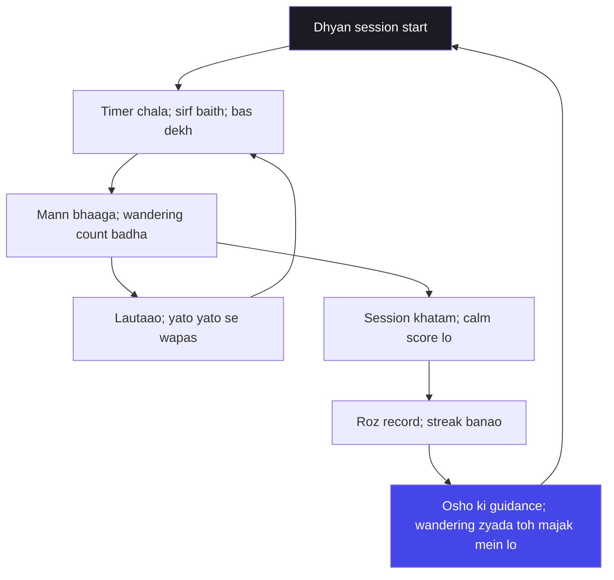

# अध्याय ६: ध्यान योग — Man ko harao mat, dekho

> **"Man ko harao mat — dekho. Yeh sabse gehri galatfahmi hai ki dhyan ka matlab mann ko dabana hai. Krishna kehti hain — chanchala mann ko haara nahin jaata, samjha jaata hai. Aur samajhne ka ek hi rasta hai — dekhte rehna, bina jaane-haye ke."**
> — **ओशो**

---

Kurukshetra ke maidan mein ab adhyaya 6 aata hai — aur is adhyaya mein Krishna ka poora gyan ek naye mod par palat jaata hai. Ab tak Krishna ne baat ki — karm, gyan, bhakti, tyag. Magar ab woh kehta hai — "yeh sab ke liye ek adhaar chahiye: dhyan." Arjuna, jo ab tak karm aur gyan ke vichar sun raha tha, ab woh sunta hai ki yogi kaun hai — woh jo apne mann ko ekta (dhyan) mein le jaata hai, woh jo apne bheetar ka dipak sthal mein rakh deta hai, jahan hawa nahin chalti. Adhyaya 6 Gita ka "sadhana adhyaya" hai — yahan Krishna darshan chhod kar abhyas ki baat karta hai.

Osho ke liye adhyaya 6 unka apna ghar hai — kyunki Osho ka samajhna hi tha ki dhyan koi religion nahin, koi updesh nahin — dhyan ek vigyan hai, ek technique hai, ek abhyas hai. Osho ne apna poora jeevan dhyan ki vidhiyaan banaane mein laga diya — aur unke liye Gita ka adhyaya 6 usी vigyan ka puraana varnan hai. Jab Krishna kehte hain "chanchalam hi manah" — mann chanchala hai, hawa se bhi mushkil hai pakadna — tab Osho apna swar jodte hain: yeh koi abhishaap nahin hai, yeh mann ki prakriti hai. Chanchala mann ko haraane ki koshish hi sabse bada dhokha hai.

Osho ki drishti mein is adhyaya ka kendra bindu yeh hai: dhyan = concentration (ekagrata) nahin hai. Concentrate karna mann ko ek jagah pakadna hai — aur chanchala mann ko pakadna usse aur zyada chanchala banata hai. Dhyan = awareness hai — mann ko kabhi pakdo nahin, bas dekho. Jaise gali mein se guzarta hua bheed — tum khidki se dekhte ho, bheed ko rokna nahin padta. Dekhna hi dhyan hai. Is adhyaya mein Krishna jo "dip" (lamp) ki upama deta hai — bina hawa ke sthal mein dipak — woh wahi bheetar ka environment hai jise Osho banane ke liye sadkon jeevan bhar keh rahe hain: bahar ki hawa roko nahin, andar ka sthal banao.

## Learning Objectives

Is chapter ko complete karne ke baad aap:

1. Samjhenge — dhyan ka asli arth: concentration nahin, awareness; mann ko dabana nahin, dekhna.
2. Jaanege — "uddhared aatmanaatmanam" ka rahasy: mann tumhara dost bhi hai, aur daushman bhi — yeh is baat par hai ki tum use jeeto ya usse jeeto jaao.
3. Seekhenge — yukta aahar-vihaar ka sootr: madhyastha (balance) — na zyada, na kam — khaane, sone, kaam mein.
4. Abhyas kar payenge — chanchala mann ko lautaane ki kriya: yato yato nishcharati — jahan jahan mann bhaage, wahan wahan se lautaana.
5. Banayenge — TypeScript "Dhyana Session Logger" — timer, session records, streak aur Osho-style guidance.

---

## Adhyaya 6 ka Parichay

### Kahan khada hai yeh adhyaya?

Gita ke pehle panch adhyayon mein Krishna ne Arjuna ko gyan ke raaste dikhaye — sankhya, karm, gyan-karm-sanyasa, samadrishti. Magar adhyaya 6 mein ek naya sawaal khada hota hai: yeh sab gyan ka abhyas kaise hota hai? Gyan sunna alag hai, gyan jeena alag. Isliye Krishna yahan "yoga" ka bada arth kholta hai — yoga matlab union (milna), aur sabse gehri union woh hai jo mann aur chetna ke beech hoti hai. Isi union ke liye dhyan chahiye. Arjuna phir bhi sanshay mein hai — aur is adhyaya ke aakhir mein woh Krishna se kehta hai: "Yeh mann to hawa se bhi mushkil hai pakadna!" — aur yeh wahi sawaal hai jo har seekhne wale ka hai.

Osho is aakhir wale Arjuna ke sawaal ko Gita ka sabse mahatvapoorn pal maante hain. Kyunki yahaan Arjuna koi chatur sawaal nahin poochh raha — woh apni asafalta (failure) ki baat kar raha hai. Aur Osho kehti hain — jis din seekhne wala apni asafalta ki baat karne lagta hai, usi din woh seekhna shuru karta hai. Arjuna ka "man ko pakad nahin paata" — yeh confession hi uske dhyan ka pehla kadam hai. Krishna ka jawab bhi isi liye aata hai: abhyas aur vairagya — abhyas se pakdo nahin, aur vairagya se chhod do — dono saath mein.

### Osho ka lens: dhyan Osho ka ghar hai

Osho ne dhyan par itna kuch kaha hai ki unki poori shiksha ka kendra hi dhyan hai. Unke liye adhyaya 6 ko padhna apne ghar lautna hai. Magar Osho ki dhyan ki vyakhya traditional vyakhya se alag hai. Traditional padhte hain — dhyan ekagrata hai, mann ko ek point par baandhna hai. Osho kehti hain — yeh galti hazaaron varshon se dohrai ja rahi hai. Mann ko ek point par baandhna usko aur zyada baaghi banata hai. Jaise chhote bachche ko "chup betho" kehne se woh aur zyada bhaagta hai, waise hi mann ko "ekagrata" kehne se woh aur zyada chanchala hota hai.

Osho ka dhyan ka marg: mann ko koi kaam do, koi khilona do, koi sankalp do — aur khud ek side ho jao. Shwaas ko dekho — mann ke liye koi kaam nahin, magar dekhte rehna ek kriya hai. Ya "dekhna" ko hi dhyan banao: shwaas aati hai, dekho; jaati hai, dekho. Mann bhaagta hai, dekho ki bhaag gaya. Yeh dekhna-dekhna khel hi dhyan hai. Aur isi khel mein ek din mann thaak jaata hai — kyunki bina pakde hue dekhte rehna bahut kaam ka khel hai — aur wahi din dhyan ka janm hota hai.

### Purani padhti aur Osho ki padhti

| Traditional reading | Osho's reading |
|--------------------|----------------|
| Dhyan = ekagrata (concentration) — mann ko ek point par baandhna | Dhyan = awareness — mann ko chhodo, dekho; ekagrata mann ko aur baaghi banati hai |
| Asana: kathor, ek hी position, lamba samay | Asana koi shart nahin — madhyastha aur aaraam se baithna; dhyan position nahin, chetna hai |
| Mann ko haraana hai — "mano jit" — sangharsh | Mann se dosti karo — dekho, samjho, haarao mat; sangharsh mann ko bal deta hai |
| Dhyan ghar chhod kar, mandir-jungle mein | Dhyan jahan bhi ho — office, parivaar, bazaar — saadhan andar hai |
| Abhyas ka matlab gantin (counting) — 21 din, 40 din | Abhyas ka matlab har roz — streak ka maan nahin, jagruti ka maan |
| Vairagya = duniya se ghrina | Vairagya = jeevan se prem, magar bina chipke — sama-poorna drishti |

---

## Key Shlokas

### Shloka 6.5

> उद्धरेदात्मनात्मानं नात्मानमवसादयेत्।
> आत्मैव ह्यात्मनो बन्धुरात्मैव रिपुरात्मनः।।

**Transliteration:** Uddhared aatmanaatmanam naatmanam avasadayet; aatmaiva hyaatmano bandhur aatmaiva ripur aatmanah.

**Arth (Hinglish):** Apne aap ko apne aap se uthao, apne aap ko apne aap se girao mat. Aatma hi aatma ka dost hai, aur aatma hi aatma ka shatru hai.

**Osho ka drishtikon:** Osho kehti hain — yeh shloka sabse gehri psychology hai. Tumhara mann dono hai — dost bhi aur shatru bhi. Jab tum mann ko samajhte ho, woh dost ban jaata hai; jab tum mann se ladte ho, woh shatru ban jaata hai. Jaise haath se jalti hui laakdi ko zyada kaskar pakdo toh jalte ho, dhile se pakdo toh kaam karti hai — waise hi mann ko pakadne ka tarika hi sab kuch hai. Uddhar — upar uthna — sangharsh se nahin, samajh se hota hai.

### Shloka 6.16-17

> नात्यश्नतस्तु योगोऽस्ति न चैकान्तमनश्नतः।
> न चातिस्वप्नशीलस्य जाग्रतो नैव चार्जुन।।
> युक्ताहारविहारस्य युक्तचेष्टस्य कर्मसु।
> युक्तस्वप्नावबोधस्य योगो भवति दुःखहा।।

**Transliteration:** Naatyashnatastu yogo'sti na chaikanta-manashnatah; na chaati-svapna-sheelasya jaagrato naiva chaarjuna. Yukta-aahara-vihaarasya yukta-chestasya karmasu; yukta-svapnaavabodhasya yogo bhavati dukhahaa.

**Arth (Hinglish):** Na zyada khane wale ka yoga hota hai, na bilkul na khane wale ka; na zyada sone wale ka, na zyada jaagne wale ka. Madhyastha (yukta) aahar, vihaar, kaam, neend aur jaagran — isi ke saath yoga hota hai, jo dukh ka naash karta hai.

**Osho ka drishtikon:** Osho kehti hain — yeh shloka Gita ka sabse "scientific" shloka hai. Krishna koi asceticism nahin sikhata — na upwas, na jaagran, na tapasya. Woh balance ki baat karta hai — yukta aahar, yukta vihaar. Aur Osho ise aage le jaate hain: yoga ka matlab sirf baithna nahin, poora jeevan yukta hona hai — khaana yukta, neend yukta, kaam yukta. Yahi asli madhyastha hai, aur yahi dukh ka ant hai. Extreme mein jaana aasan hai; balance mein rahna asli sadhana hai.

### Shloka 6.26

> यतो यतो निश्चरति मनश्चञ्चलमस्थिरम्।
> ततस्ततो नियम्यैतदात्मन्येव वशं नयेत्।।

**Transliteration:** Yato yato nishcharati manashchanchalam asthiram; tatastato niyamyaitad aatmanyeva vasham nayet.

**Arth (Hinglish):** Jahan jahan se yeh chanchal aur asthir mann bhaagta hai, wahan wahan se use lauta kar aatma mein hi vas mein laana chahiye.

**Osho ka drishtikon:** Osho kehti hain — is shloka mein "yato yato" — jahan jahan se — ka ek gahra matlab hai: mann bhaagega hi, yeh uski prakriti hai. Krishna yeh nahin kehte ki mann bhaag na paaye; woh kehte hain ki bhaagta hua mann jahan jahan se lautaaya jaaye. Aur yeh lautaana sangharsh se nahin, dekhne se hota hai — jaise bachha gali mein bhaag jaye aur maa use pyaar se bulaaye, phir woh bhaage aur phir bulaaye. Der se, magar ek din bachha maa ke paas khud aa jaata hai. Mann ke saath bhi yahi — lautaao, lautaao, lautaao.

### Shloka 6.34-35

> चञ्चलं हि मनः कृष्ण प्रमाथि बलवद्दृढम्।
> तस्याहं निग्रहं मन्ये वायोरिव सुदुष्करम्।।
> असंशयं महाबाहो मनो दुर्निग्रहं चलम्।
> अभ्यासेन तु कौन्तेय वैराग्येण च गृह्यते।।

**Transliteration:** Chanchalam hi manah krishna pramaathi balavad-dridham; tasyaaham nigraham manye vaayoriva sudushkaram. Asanshayam mahabaho mano durnigraham chalam; abhyaasena tu kaunteya vairaagyena cha grihyate.

**Arth (Hinglish):** Arjuna kehti hai — mann chanchal, pramaathi (ukhadane wala), balwaan aur dridh hai; usse rokna hawa ko rokne jaisa mushkil hai. Krishna jawab dete hain — haan, mann durnigrah aur chanchal hai, magar abhyas aur vairagya se woh pakda jaata hai.

**Osho ka drishtikon:** Osho is shloka ko do swaron mein sunate hain — pehla Arjuna ka, doosra Krishna ka. Arjuna ka swar sahi hai: mann ko rokna hawa ko rokne jaisa hai. Magar Krishna ka uttar — abhyas aur vairagya — ka asli arth Osho kehte hain: abhyas ka matlab mann ko dabana nahin, dekhte rehna hai; aur vairagya ka matlab ghrina nahin, madhyastha hai. Aur woh jodte hain — Krishna ka "pakda jaata hai" ka matlab yeh nahin ki mann khatam ho jaata hai; mann khatam nahin hota, mann se pehchaan khatam hoti hai — aur tab mann ek aujaar ban jaata hai, na ki maalik.

---

## Chanchala mann aur Dipak — Osho ki gahrai mein

### Mann se yudh band karo

Osho ki sabse gehri baat adhyaya 6 ke naam par yeh hai: mann se yudh mat karo. Jab tum mann se ladte ho, tum usse pehchaan dete ho — aur jo ladta hai, woh mann ki hi pehchaan mein hai. Krishn ne kaha "uddhared aatmanaatmanam" — apne aap ko apne aap se uthao — iska matlab kisi doosre se nahin, khud se. Magar kaise uthaya jaaye? Osho kehti hain — uthna lad kar nahin, dekh kar hota hai. Jaise do aadmi ki ladaai mein aap dono mein se kisi ke saath nahin hote, magar dono ko dekh rahe hote hain — waise hi mann ki ladaai mein bhi ek tatiya (third) position hai — dekhte hue ki stithi.

Osho ki ek aur upama hai — ghas aur bhains. Ghas ko pakadna mat, bhains ke saamne rakho — bhains khud kha jaati hai. Mann ka wahi haal hai — mann ko dabana mat, use kaam do — dekhna, shwaas dekhna, chalna dekhna, khaana dekhna — aur woh khud thaak jaata hai. Yeh "dekhna" ek aisa kaam hai jo mann nahin kar sakta — kyunki dekhne wala mann nahin hai, chetna hai. Aur jab mann dekhna seekh jaata hai, tab woh mann nahin rehta — woh drishti ban jaata hai.

### Dipak: bina hawa ka sthal

Krishn is adhyaya mein ek behtareen chitra deta hai: "yatha deepo nivaatastho nengate" — jaise bina hawa wale sthal mein dipak (diya) nahin hilta, waise hi yogi ka chitta sthir hai. Osho is chitra ko pakadte hain aur kahte hain — yahan Krishna hawa ko rokhne ki baat nahin kar rahe. Hawa bahar hai, duniya ka khel bahar hai, bazaar ka shor bahar hai. Tum hawa ko rokh nahin sakte — tum sthal bana sakte ho, jahan hawa ka asar na ho. Yeh sthal bahar ka room nahin hai — yeh bheetar ka maahaul hai.

| Hawa rokne ka marg | Stahl banane ka marg |
|--------------------|----------------------|
| Duniya se bhago — shor se bhaago | Shor ke beech mein hi sthir raho |
| Indriyon ko dabao — bandh karo | Indriyon ko kholo — dekho, magar chipko na |
| Bahar ko khatam karne ki koshish | Bheetar ka kendra banao — wahan hawa nahin pahunchti |
| Sangharsh, thaakan, haar | Khel, aaraam, jhuk jaana |

Osho kehti hain — yeh table padh kar tum samajh jaoge ki Krishna ka dipak kya hai: woh koi bahar ka kamra nahin, woh tumhari drishti hai. Jis din tumhari drishti sthir hai, usi din chitta sthir hai. Aur drishti ko sthir karne ka ek hī rasta hai — dekhte rehna. Bahar ka shor tumhara kuch nahin kar sakta jab tum dekhne laga ho — kyunki shor chetna ko chhoot nahin sakta, woh sirf mann ko chhootta hai.

### Dhyan ka vigyan: session, wandering, aur lautna

Osho dhyan ko vigyan maante hain — isliye unke liye session, repetition, aur data ka hisaab rakhna koi ashcharya nahin hai. Har dhyan session mein teen cheezein hoti hain: tum baithte ho, mann bhaagta hai, aur tum lautte ho. Yahi teena repetition hamesha hoga. Gandh na isliye ki mann bhaaga — yeh svabhaav hai; galti sirf tab hoti hai jab tum bhaage hue mann ko dekhte nahin, aur uske saath hi bhaag jaate ho. Dhyan ka asli abhyas yeh hai: bhaagte hue mann ko dekhna aur wapas lautaana — yato yato, baar-baar.

Is abhyas ko machine se track karna — duration, mind-wandering count, calm score — Osho ke liye koi virodhabhas nahin hai. Woh kehte the — dhyan duniya se bhagkar nahin hota; dhyan duniya ke beech mein, office mein, code likhte hue, session record karte hue bhi hota hai. Machine data de sakti hai — magar drishti data se nahin banti, drishti se banti hai. Machine sirf aaina hai — aaine mein dekhna alag, aaine se dhoka khaana alag.



Yeh loop dhyan ka poora vigyan hai: start, timer, wandering, lautaana, phir wandering, phir lautaana — aur is khel ke beech mein jo sthirta uthti hai, woh record mein dikhti hai. Osho kehti hain — yeh loop kabhi band nahin hota; yeh zindagi bhar chalta hai. Aur yeh hi loop ko band karne ki koshish karna — wahin se galti shuru hoti hai.

---

## TypeScript Implementation

```typescript
/**
 * Dhyana Session Logger
 * ----------------------
 * Adhyaya 6 ka TypeScript roop — Osho ki drishti mein dhyan:
 * mann ko haarao mat, dekho. Har session teen cheezein:
 * duration, mind-wandering count, calm score.
 * Streak = har roz baithne ka nirantar khel.
 * Osho kehti hain: "Wandering galti nahin; galti sirf bhaag jaana hai."
 */

interface MeditationSession {
  id: number;
  date: string;
  durationMinutes: number;
  wanderingCount: number;
  calmScore: number;
}

interface StreakInfo {
  currentStreak: number;
  bestStreak: number;
}

interface Guidance {
  message: string;
  tone: "majak" | "dheeraj" | "sthirta";
}

const CALM_MIN = 1;
const CALM_MAX = 10;

class DhyanaSessionLogger {
  private sessions: MeditationSession[] = [];
  private nextId = 1;

  recordSession(durationMinutes: number, wanderingCount: number, calmScore: number): MeditationSession {
    if (calmScore < CALM_MIN || calmScore > CALM_MAX) {
      throw new Error("Calm score 1 se 10 ke beech hona chahiye");
    }
    const session: MeditationSession = {
      id: this.nextId++,
      date: new Date().toISOString().slice(0, 10),
      durationMinutes,
      wanderingCount,
      calmScore,
    };
    this.sessions.push(session);
    return session;
  }

  currentStreak(): StreakInfo {
    const days = new Set(this.sessions.map((s) => s.date));
    let current = 0;
    const today = new Date();
    for (let i = 0; i < 365; i++) {
      const d = new Date(today);
      d.setDate(today.getDate() - i);
      const key = d.toISOString().slice(0, 10);
      if (days.has(key)) current++;
      else break;
    }
    let best = 0;
    let run = 0;
    let prev: string | null = null;
    const sorted = [...days].sort();
    for (const day of sorted) {
      if (prev && this.isNextDay(prev, day)) run++;
      else run = 1;
      if (run > best) best = run;
      prev = day;
    }
    return { currentStreak: current, bestStreak: best };
  }

  private isNextDay(prev: string, next: string): boolean {
    const a = new Date(prev);
    const b = new Date(next);
    const diff = (b.getTime() - a.getTime()) / 86400000;
    return diff === 1;
  }

  guidanceForLastSession(): Guidance {
    const last = this.sessions[this.sessions.length - 1];
    if (!last) {
      return { message: "Abhi koi session nahin. Aaj hi baitho — 5 minute bhi kaafi hain.", tone: "dheeraj" };
    }
    if (last.wanderingCount <= 3) {
      return {
        message: "Wandering bahut kam. Drishti sthir hone lagi hai. Magar iseh ego mat banao — kal phir dekho.",
        tone: "sthirta",
      };
    }
    if (last.wanderingCount <= 8) {
      return {
        message: "Wandering theek hai. Yaad rakhna — bhaagta hua mann lautaana hi abhyas hai. Yeh session sach mein hua.",
        tone: "dheeraj",
      };
    }
    return {
      message: "Wandering zyada hui? Badi baat nahin. Aaj ka session bhaagte hue mann ka theatre tha — tumne dekha, wahi dhyan hai.",
      tone: "majak",
    };
  }

  averageCalm(): number {
    if (this.sessions.length === 0) return 0;
    const sum = this.sessions.reduce((acc, s) => acc + s.calmScore, 0);
    return Number((sum / this.sessions.length).toFixed(1));
  }

  allSessions(): MeditationSession[] {
    return [...this.sessions];
  }
}

function runDemo(): void {
  const logger = new DhyanaSessionLogger();

  console.log("=== Dhyana Session Logger: Demo ===");
  logger.recordSession(5, 12, 4);
  logger.recordSession(8, 9, 5);
  logger.recordSession(10, 4, 7);
  logger.recordSession(15, 2, 9);

  for (const s of logger.allSessions()) {
    console.log(`Session ${s.id}: ${s.durationMinutes} min | wandering: ${s.wanderingCount} | calm: ${s.calmScore}/10`);
  }

  const streak = logger.currentStreak();
  console.log(`\nCurrent streak: ${streak.currentStreak} din`);
  console.log(`Best streak: ${streak.bestStreak} din`);
  console.log(`Average calm score: ${logger.averageCalm()}`);

  const guidance = logger.guidanceForLastSession();
  console.log(`\nOsho ki guidance [${guidance.tone}]: ${guidance.message}`);
}

runDemo();
```

Yeh code dhyan ka aaina hai — na isse mukti milti hai, na isse shanti; yeh sirf record rakhta hai. Magar Osho kehti hain — record bhi dhyan hai, kyunki record mein bhi drishti chahiye. Aur sabse gehri baat: wandering ginti koi sharm nahin hai. Osho kahte hain — jo session sabse zyada wandering ka tha, wohi asli session tha — kyunki usmein tumne sabse zyada baar lautaana kiya. Aur lautaana hi abhyas hai.

---

## Summary

| Bindu | Saar |
|-------|------|
| Dhyan kya hai | Concentration nahin, awareness — mann ko pakdo mat, dekho |
| Aatma bandhu aur ripu | Mann dono hai — samjho toh dost, lado toh shatru; samajh se utho, sangharsh se nahin |
| Yukta jeevan | Balance hi asli sadhana — na zyada khaana, na zyada sona; madhyastha mein yoga |
| Yato yato | Mann bhaagega — lautaana hi abhyas hai; bhaagte hue ko dekhna, saath nahin bhaagna |
| Dipak ki upama | Bahar ki hawa roko nahin — bheetar ka sthal banao; drishti sthir toh chitta sthir |

---

## Contradictions

- **Ekagrata vs awareness:** Traditional dhyan-shastra ekagrata (concentration) ko mool maanta hai. Osho ise mool dhokha kehte hain — mann ko dabana usse aur zyada chanchala banata hai; dhyan dekhna hai, pakadna nahin.
- **Asana ka prabhutva vs jeevan ka dhyan:** Kathor asana aur ghar chhod kar dhyan ko sadhana maana jaata hai. Osho kehti hain — dhyan jahan bhi ho sakta hai; asana position hai, chetna nahin.
- **Mann ka daaman vs mann ki dosti:** "Mann ko jeeto" — yudh ki bhasha — traditional hai. Osho ise palat te hain: mann se dosti karo; jis se ladte ho, uske jaise ban jaate ho.
- **Abhyas ki ginti vs jagruti ka khel:** 21 din ya 40 din ke abhyas ko sankalp maana gaya. Osho kehti hain — streak ka maan nahin, jagruti ka maan; ek hi baithak mein doosre saal ka abhyas ho sakta hai.
- **Vairagya = ghrina vs vairagya = prem:** Vairagya ko duniya se ghrina samjha gaya. Osho kehti hain — vairagya ghrina nahin, sama-drishti ka doosra naam hai: jeevan se prem, magar bina chipke.

---

## Open Questions

- Agar dhyan awareness hai aur ekagrata nahin, to Krishna ka "mano vasham" (mann ko vas mein lana) kis arth mein? Vas ka matlab dabana nahin, toh kya hai?
- Arjuna ka confession — "mann hawa se bhi mushkil hai" — aur Krishna ka "abhyas aur vairagya" — kya abhyas bhi ek prakar ki ladaai nahin hai, jab woh streak banna shuru kare?
- Dipak ko bina hawa ke sthal mein rakhna — kya yeh sthal bheetar ban sakta hai jabki bahar ka shor aur bhi badh raha ho? Kya "andar ka sthal" ka koi siima hai?
- Osho kahte hain wandering galti nahin hai — toh phir session ko judge kaise karein? Calm score ka kya arth hai jab drishti hi judge nahin karna chahti?

---

## Practical Takeaways

| Situation | Gita shloka | Osho's lens | Action |
|-----------|-------------|-------------|--------|
| Baithte hi mann 10 jagah bhaagta hai | 6.34-35 (chanchalam) | Bhaagna svabhaav hai — lautaana hi abhyas | Har bhaag par ek baar muskurana aur lautaana — ginti mat, dekho |
| Dhyan mein "concentrate" karne ki koshish se sar dard | 6.26 (yato yato) | Ekagrata sangharsh hai; awareness khel hai | Sirf shwaas dekho — aati jaati; aur dekhte rehna |
| Khaane mein zyada, neend mein zyada — mann sust | 6.16-17 (yukta aahar) | Balance hi yoga hai — extreme nahin | Aaj khaane mein thoda kam; 10 min pehle so jaana |
| "Mann mere saath saath hai" — office ke tension mein | 6.5 (bandhu/ripu) | Mann dost bhi hai, shatru bhi — samjho toh dost | Din mein 3 baar 2 min — andar dekho: mann kya kar raha hai |
| Dhyan karna hai magar samay nahin | 6.16 (yukta vihaar) | 5 minute bhi session hai — lambai nahin, jagruti | Aaj 5 min baitho, DhyanaSessionLogger mein record karo |

---

## Chapter Quiz

### Question 1

Osho ke anusaar dhyan ka asli matlab kya hai?

a) Mann ko ek point par baandhna
b) Awareness — mann ko dekhna, pakdna nahin
c) Lamba samay baithna
d) Aankh band karke so jaana

<details>
<summary>Answer</summary>
b) Dhyan concentration nahin, awareness hai — mann ko pakdo mat, dekho.
</details>

### Question 2

Shloka 6.5 ke anusaar aatma apne liye kya hai?

a) Sirf dost
b) Sirf shatru
c) Dono — dost aur shatru — is par nirbhar karta hai ki tum use samajhte ho ya ladte ho
d) Na dost na shatru

<details>
<summary>Answer</summary>
c) Aatma bandhu bhi hai aur ripu bhi — samjho toh dost, lado toh shatru.
</details>

### Question 3

Shloka 6.16-17 mein yoga kis ka hai?

a) Sirf upwas karne wale ka
b) Sirf raat bhar jaagne wale ka
c) Yukta aahar, vihaar, kaam, neend wale ka
d) Sirf padhne wale ka

<details>
<summary>Answer</summary>
c) Yukta (balance) aahar-vihaar-chesta-svapna — madhyastha hi dukh ka naash karta hai.
</details>

### Question 4

"Yato yato nishcharati" — mann bhaagta hai toh kya karna chahiye?

a) Usse dantna
b) Use rokne ke liye bhaagna
c) Jahan jahan se bhaage, wahan wahan se lautaana
d) Use chhod dena

<details>
<summary>Answer</summary>
c) Jahan jahan se bhaage — wahan wahan se lauta kar aatma mein vas mein laana; yeh abhyas hai.
</details>

### Question 5

Arjuna ke anusaar mann ko pakadna kis jaisa hai?

a) Pathar pakadne jaisa
b) Hawa ko rokne jaisa
c) Paani ko maapne jaisa
d) Agni ko baandhne jaisa

<details>
<summary>Answer</summary>
b) "Vayoriva sudushkaram" — hawa ko rokne jaisa kathin. Krishna ka jawab: abhyas aur vairagya se.
</details>

### Question 6

Krishna ke anusaar mann ko kaise pakda jaata hai?

a) Ekagrata se
b) Abhyas aur vairagya se
c) Upwas se
d) Duniya chhod kar

<details>
<summary>Answer</summary>
b) "Abhyasena tu kaunteya vairagyena cha grihyate" — abhyas aur vairagya, dono se.
</details>

### Question 7

Krishna ki "dipak" (lamp) ki upama mein asli baat kya hai?

a) Diya hamesha jalna chahiye
b) Bina hawa ke sthal mein diya sthir hai — bheetar ka maahaul banao
c) Diya sirf raat ko jalana chahiye
d) Diya bahar rakho toh sthir rehta hai

<details>
<summary>Answer</summary>
b) Bahar ki hawa roko nahin, bheetar ka sthal banao — wahan diya nahin hilta; drishti sthir, chitta sthir.
</details>

### Question 8

Osho ke anusaar mann se yudh karne par kya hota hai?

a) Mann hara jaata hai
b) Mann aur zyada balwaan ban jaata hai
c) Mann so jaata hai
d) Mann ghar chhod deta hai

<details>
<summary>Answer</summary>
b) Jis se ladte ho, usse shakti dete ho — mann se dosti karo, haarao mat; dekhna hi abhyas hai.
</details>

### Question 9

DhyanaSessionLogger mein "wandering count" kya darshaata hai?

a) Kitni baar mann bhaaga
b) Kitni baar session toota
c) Kitni baar shwaas aayi
d) Kitne din streak chhuti

<details>
<summary>Answer</summary>
a) Wandering count = mind-wandering ki ginti; Osho kehti hain — yeh galti nahin, abhyas ka hissa hai.
</details>

### Question 10

Osho ke anusaar sabse gehri dhyan ki galatfahmi kya hai?

a) Dhyan lamba hona chahiye
b) Dhyan sirf subah hona chahiye
c) Dhyan ka matlab mann ko dabana (concentration) hai
d) Dhyan mein aankh kholni chahiye

<details>
<summary>Answer</summary>
c) Dhyan = ekagrata, mann ko dabana — yehi sabse badi galatfahmi hai; dhyan dekhna hai.
</details>

---

## Exercises

1. **5-minute ka pehla session (aaj hi):** Timer set karo 5 minute. Aankh band karo. Shwaas dekho. Mann bhaage — lautaao. Baithne ke baad likho: kitni baar bhaaga, aur kitni baar lautaaya. Yeh pehla record DhyanaSessionLogger mein daalo.

2. **Wandering diary (3 din):** Tees din tak har session ke baad sirf ek cheez likho — wandering count aur calm score. Osho ka sawaal yaad rakho: "Kya wandering kam hone se calm badh raha hai, ya tum sirf ginti karke dhyan mein nahin baith rahe?" Teesre din analysis likho.

3. **Yukta din (12 ghante):** Adhyaya 6.16-17 ka experiment — aaj ek din "yukta" jeevo: na zyada khaana, na zyada sona, na zyada kaam. Khaane ke beech ka interval, neend ke beech ka jagran — balance rakho. Raat ko likho: balance ka dhyan par kya asar pada?

4. **Dipak ka kamra (15-min):** Ek kamre mein baitho jahan bahar ka shor aata ho — fan, gali ka awaaz, koi bhi. Aankh band karo aur 15 minute sirf dekho: shor mann ko chhoot raha hai, chetna ko nahin. Kya andar ka sthal bana?

5. **TypeScript streak (7 din):** DhyanaSessionLogger ko apne machine par chalao — uske baad 7 din lagatar apne sessions record karo. 7 din ke baad current streak aur best streak dekho. Osho kehti hain — streak todna koi baat nahin; todne ke baad phir se baithna hi asli abhyas hai.

6. **Arjuna ka sawaal (5-min):** Aaj Krishna se wahi sawaal karo jo Arjuna ne kiya: "Yeh mann hawa se bhi mushkil hai — main ise kaise pakdu?" Osho ki taraf se jawab likho apne shabdon mein. Aur jawab ke baad 2 minute chup baitho.

---

## Further Reading

- **Osho, "Gita Darshan" (Volume 1-2)** — Bombay 1973 mein Woodlands apartment ki discourse series; adhyaya 6 ki dhyan-vyakhya is series ka sabse gehri bhag hai.
- **Osho, "Meditation: The First and Last Freedom"** — Osho ki dhyan vidhiyon ka practical collection; adhyaya 6 ke abhyas ke liye perfect saathi.
- **Bhagavad Gita — "Gita Press" (Gorakhpur)** — 6.34-35 ka traditional bhashya — Arjuna ke sawaal ka puraana jawab padhne ke liye.
- **Osho, "The Book of Secrets"** — dhyan ke vigyan par Osho ki 112 vidhiyon ki vyakhya; adhyaya 6 ka sabse bada vistar.
- **Eknath Easwaran, "The Bhagavad Gita"** — adhyaya 6 ka English anuvaad aur commentary; Osho ki tulna ke liye ek alag drishti.
