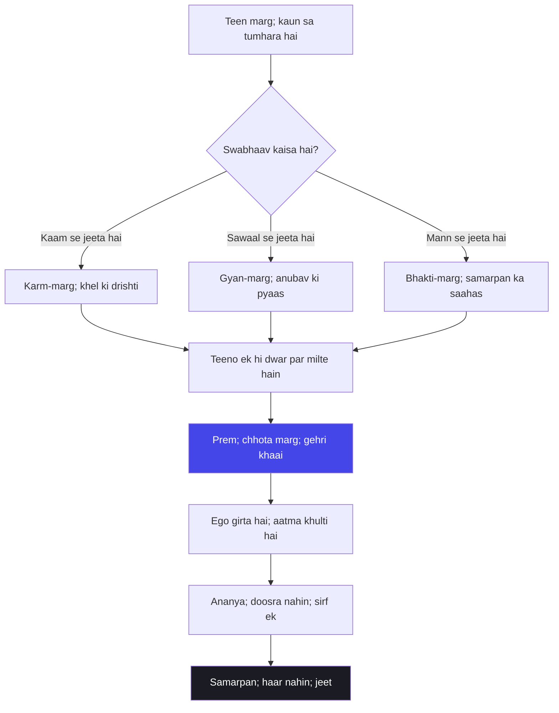

# अध्याय ९: राजविद्या राजगुह्य योग — Prem hi sabse bada raaz hai

> **"Prem sabse chhota raasta hai, magar sabse gehra khaai us par hai. Jo prem ko chunta hai, woh risk chunta hai — apna poora ego, apni saari pehchaan, sab kuch daav par lagata hai. Aur isi risk mein uska vinaash nahin, uska janm hota hai. Prem hi woh raaz hai jise Krishna ne is adhyaya mein khola hai — aur jise duniya ne sirf padha hai, jeeya nahin."**
> — **ओशो**

---

Kurukshetra ka maidan ab pooraa uljha hua hai — aath adhyayon ka gyan Arjuna ke saamne hai, magar ek baat abhi baaki hai. Gyan ki baat ho gayi, karm ki baat ho gayi, maya ki baat ho gayi, mrityu ki baat ho gayi. Ab nauwaan adhyaya mein Krishna ek aisi baat kholta hai jise woh khud "raajavidya" aur "raajaguhya" kehta hai — sab raajyon ka vidya aur sab raazyon ka raaz. Aur woh raaz kya hai? Bhakti. Prem. Ek aisi shraddha jo shastra nahin maangti, tapasya nahin maangti, bada daan nahin maangti — bas ek pura mann maangti hai.

Traditional padhti is adhyaya ko "bhakti-yoga" ke roop mein padhti hai — Krishna ki pooja, Krishna ka smaran, Krishna ke prati samarpan. Magar Osho is adhyaya ko aise padhte hain jaise Krishna khud apna sabse personal raaz bata raha hai. Osho kahte hain — is adhyaya mein Krishna koi religion nahin sikha raha; woh ek prem-kavita keh raha hai. "Ananyash chintayanto mam" — jo mujhe ananya bhaav se sochte hain — Osho ise aise samjhaate hain: prem mein koi doosra nahin hota, sirf ek hota hai. Aur "patram pushpam phalam toyam" — patta, phool, phal, paani — Osho ise aise samjhaate hain: bhagwaan ko bade mandir nahin chahiye, bade daan nahin chahiye; use ek pura mann chahiye — chahe woh ek phool ke saath hi kyun na ho.

Osho ne Gita ko hamesha Arjuna ki katha ke roop mein padha hai — ek sawaal uthane wale ki katha. Aur is adhyaya mein Arjuna ka sawaal chhota hai — "yeh raaz kya hai, yeh vidya kya hai" — magar Krishna ka jawab poora jeevan-darshan hai. Osho kahte hain — Arjuna ne poochha tha ki gyan aur bhakti mein kya fark hai; Krishna ne jawab mein poora raaz hi khol diya. Gyan se tum jaante ho, karm se tum karte ho, magar prem se tum "hote" ho. Aur yeh "hona" hi asli raaz hai. Is adhyaya ka asli sawaal yeh hai: tum apne jeevan ko kisi cheez ke prati samarpit kar sakte ho ya nahin? Aur samarpit hone ka matlab kuch khona nahin — sab kuch paana hai.

Aur yahaan Osho ki sabse gehri baat aati hai: prem ka raasta chhota hai, magar us par chalne ke liye ego ko chhodna padta hai — aur ego chhodna sabse bada darr hai. Krishna kehti hain "manmana bhava madbhaktah" — mann ko mujh mein laga, mera bhakt ban. Osho ise aise samjhaate hain: yahaan "mann lagaana" koi formula nahin hai; yeh apne poore jeevan ko ek hi baat ke prati samarpit karne ka dawa hai. Aur yehi dawa prem hai — baaki sab vyapar hai. Prem mein tum kisi se milte ho, vyapar mein kisi ka hisaab banate ho. Krishna is adhyaya mein kehte hain — hisaab chhodo, milan karo. Yeh raaz hai. Aur isi raaz ko Osho ne apni poori zindagi mein dohraaya — samarpan koi haar nahin hai, samarpan jeet hai.

## Learning Objectives

Is chapter ko complete karne ke baad aap:

1. Samajh payenge — Osho bhakti ko kaise dekhte hain: prem koi pooja-vidhi nahin, apne poore hone ka dawa hai.
2. Jaankar rahenge — "patram pushpam phalam toyam" ka gehra arth: chhota daan, pura mann — aur kyun Osho kehte hain ki bada mandir bekaar hai.
3. Seekh payenge — teen marg — karm, gyan, bhakti — ka apne swabhaav se mel: kaun sa marg tumhare liye asli hai.
4. Parakh payenge — samarpan aur risk ka rishta: surrender koi kamzori nahin, sabse bada saahas hai.
5. Bana payenge — ek TypeScript "Bhakti Path Recommender" jo teeno margon ko score kare aur tumhare swabhaav ke hisaab se daily practice sujhaaye.

---

## Adhyaya 9 ka Parichay

### Kahan khada hai yeh adhyaya?

Nau adhyaya ke is safar mein Arjuna ne ab tak gyan suna hai — karm ka, maya ka, mrityu ka. Magar is sab gyan ke beech ek anjaana sa ehsaas baaki hai: yeh sab jaanna theek hai, magar "mann" kahaan lage? Krishna is adhyaya ko isi sawaal se shuru karta hai — aur khatam bhi isi sawaal par karta hai. Is adhyaya mein Krishna koi naya shaastra nahin de raha; woh Arjuna ke mann ko samarpit karne ka rasta bata raha hai. "Raajavidya" — sabse uttam vidya — kyunki yeh sirf jaanna nahin, yeh hona hai. Aur "raajaguhya" — sabse gehri ghooth — kyunki yeh baat kehni aasaan hai, magar jeeni mushkil.

Is adhyaya mein Krishna Arjuna ko bhagwaan ka vistaar bataata hai — main kya hoon, kya nahin hoon, kahan hoon, kahan nahin. Aur phir us vistaar ke beech ek chhota sa phool rakh deta hai: "patram pushpam phalam toyam — jo mujhe prem se daane laga, main use prem se grahan karta hoon." Osho kahte hain — yehi adhyaya ka naksha hai. Bada bhagwaan, bada jagaat, bada gyan — aur un sabke beech ek chhota phool jo sab kuch badal deta hai. Kyonki bhagwaan ko bade daan nahin chahiye; bhagwaan ko chahiye bhaav. Aur bhaav woh cheez hai jise na gyan se kharida jaata hai, na karm se kamaya jaata hai — bhaav toh diya jaata hai.

### Osho ka lens: prem hi marg hai

Osho ke liye is adhyaya ka kendra ek hi shabd hai: prem. Woh kahte hain — Krishna ne teeno marg bataye hain — karm, gyan, bhakti — magar unmein bhakti ko sabse upar rakha hai. Osho ise aise samjhaate hain: karm ka marg lamba hai, kyunki usme phal ki chinta kaatni padti hai; gyan ka marg lamba hai, kyunki usme "main jaanta hoon" ka ghamand todna padta hai; magar prem ka marg chhota hai — kyunki usme kuch todna hi nahin hota. Prem mein tum sirf khulte ho. Aur jo cheez khul jaati hai, wohi mil jaati hai.

Osho ki drishti mein is adhyaya ka Krishna bhagwaan se zyada premika hai — woh Arjuna ko apne paas bulata hai, use smaran karta hai, use dhamki nahin deta. "Ananyash chintayanto mam" — Osho ise prem ki paribhasha kehte hain: ananya, matlab doosra nahin. Prem mein doosra kahan hai? Prem mein toh prem hi hai. Aur "yogakshemam vahamyaham" — main unka yog-kshem khud dhoonga — Osho ise aise samjhaate hain: jab tum kisi se poore mann se jud jaate ho, tab tumhara bhaar khud halka ho jaata hai. Prem bhaar nahin banata; prem bhaar utha leta hai.

### Purani padhti aur Osho ki padhti

| Traditional reading | Osho's reading |
|--------------------|----------------|
| Bhakti matlab Krishna ki pooja — murti, mantra, vrat | Bhakti koi vidhi nahin — apne poore hone ka dawa; prem ka swaroop |
| "Patram pushpam phalam toyam" — bhagwaan ko chhota daan bhi chalega | Chhota daan bekaar hai agar mann bada ho to; pura mann hi asli daan hai |
| Bhagwaan ka "yogakshem vahami" — bhagwaan bhakton ka palan karta hai | Prem ka niyam: jo poora jud jaata hai, uski chinta khud chal jaati hai |
| Bhakti tyaag hai — duniya ko chhod kar Krishna mein lage raho | Bhakti tyaag nahin — tyaag toh andar ka hota hai; duniya chhodo nahin, mann sudhaaro |
| Krishna ke prati samarpan — apne ko mita dena | Samarpan haar nahin — sabse bada saahas; ego girta hai, aatma khulti hai |
| Bhakti ka marg karm aur gyan se neecha hai — kyunki woh aasaan hai | Bhakti sabse kathin hai — kyunki woh risk maangti hai, aur risk se duniya darti hai |

---

## Key Shlokas

### Shloka 9.22

> अनन्याश्चिन्तयन्तो मां ये जनाः पर्युपासते।
> तेषां नित्याभियुक्तानां योगक्षेमं वहाम्यहम्।।

**Transliteration:** Ananyash chintayanto mam ye janah paryupasate; tesham nityabhiyuktanam yogakshemam vahamyaham.

**Arth (Hinglish):** Jo log ananya bhaav se mujhe sochte hue mera upaasan karte hain — un nitya-yukt janon ka yog (jo nahin mila, use lana) aur kshem (jo mila, use rakhna) — main khud dhoon leta hoon.

**Osho ka drishtikon:** Osho kehti hain — "yogakshemam vahamyaham" yeh koi bhagwaan ka business-contract nahin hai; yeh prem ka niyam hai. Jab tum kisi se poore mann se jud jaate ho, tab tumhari chinta tumhare upar nahin rehti — woh judaav mein hi hal ho jaati hai. Prem chinta nahin kam karta, prem chinta ko hi gira deta hai — kyunki chinta "main" ke liye hoti hai, aur prem mein "main" bachta hi nahin. Jo aadmi ananya hai — jiske mann mein doosra vichaar nahin hai — uske liye duniya ki chinta ek aur vichaar hi toh hai.

### Shloka 9.26

> पत्रं पुष्पं फलं तोयं यो मे भक्त्या प्रयच्छति।
> तदहं भक्त्युपहृतमश्नामि प्रयतात्मनः।।

**Transliteration:** Patram pushpam phalam toyam yo me bhaktya prayachchhati; tad aham bhaktyupahritam ashnami prayatatmanah.

**Arth (Hinglish):** Jo koi mujhe prem (bhakti) se patta, phool, phal ya paani daan karta hai — us shuddh chetna wale ke us bhakti-se-arpan ko main grahan karta hoon.

**Osho ka drishtikon:** Osho is shloka ko Gita ki sabse mahan kavita kehte hain. Krishna kehti hain — mujhe patta chahiye, phool chahiye, phal chahiye, paani chahiye. Bada mandir nahin, bada daan nahin, badi ritual nahin. Osho kahte hain — yeh adhyaya kehta hai ki bhagwaan ki bhukh chhoti hai, magar uski pyaas badi hai — woh bhaav ki pyaas hai. Aur bhaav ko na paise se kharida jaata hai, na shastra se banaya jaata hai. Bhaav toh bas "prayat-atman" — shuddh chetna — se aata hai. Prem ka asli daan woh hai jisme daan ki bhaavna hi na ho — sirf prem ho.

### Shloka 9.27

> यत्करोषि यदश्नासि यज्जुहोषि ददासि यत्।
> यत्तपस्यसि कौन्तेय तत्कुरुष्व मदर्पणम्।।

**Transliteration:** Yat karoshi yadashnasi yajjuhoshi dadasi yat; yat tapasyasi kaunteya tat kurushva madarpanam.

**Arth (Hinglish):** He Kaunteya, jo kuch tum karte ho, jo kuch khaate ho, jo kuch havan mein dete ho, jo kuch daan karte ho, jo kuch tap karte ho — woh sab mujhe arpan karke karo.

**Osho ka drishtikon:** Osho is shloka ko "jeevan ki chemistry" kehte hain. Krishna duniya ko chhodne ko nahin keh raha — woh duniya ko badalne ko keh raha hai. Jo karte ho wohi karo — magar uske saath ek arpan jodo. Khana khao, kaam karo, daan do — magar hisaab chhodo. Osho kahte hain — arpan koi bahar ki cheez nahin hai jo kaam ke saath jodni ho; arpan drishti hai. Wohi kaam jo "main" se kiya jaaye to bhaar hai, wohi kaam arpan se kiya jaaye to pooja hai. Kaam wahi hai — badla sirf karta hai.

### Shloka 9.34

> मन्मना भव मद्भक्तो मद्याजी मां नमस्कुरु।
> मामेवैष्यसि युक्त्वैवमात्मानं मत्परायणः।।

**Transliteration:** Manmana bhava madbhaktah madyaji mam namaskuru; mam evaishyasi yuktvaivam atmanam matparayanah.

**Arth (Hinglish):** Mann ko mujh mein laga, mera bhakt ban, meri pooja kar, mujhe pranam kar — is prakar apne aatma ko mujh mein laga kar, matparayan ho kar, tum mujh ko hi aaoge.

**Osho ka drishtikon:** Osho kehti hain — "manmana bhava" is adhyaya ka dil hai. Mann ko lagaana koi dhyan ka formula nahin hai; yeh apne poore jeevan ko ek hi baat ke prati samarpit karne ka dawa hai. Aur Osho kahte hain — yeh dawa darr lagta hai, kyunki isme ego girta hai. Magar wohi girna hi asli "mam evaishyasi" hai — tum mujhe aaoge, kyunki tumhare paas jaane ke liye koi aur jagah nahin bachegi. Prem ka antim arth yahi hai: jaana wohi hai, wohi wapas aana hai. Prem mein milan koi do cheezon ka nahin — woh ek ka hi milan hai.

---

## Raajvidya, Prem aur Samarpan — Osho ki gahrai mein

### Prem: chhota marg, gehri khaai

Osho kahte hain — Krishna ne teeno marg diye, magar unmein ek baat sahi hai ki bhakti ko upar rakha. Osho ise aise samjhaate hain: karm aur gyan ke marg par tum khud ko sambhal kar chalte ho — kadam dekh kar, hisaab rakh kar. Prem ke marg par tum sambhal hi nahin sakte — wahan toh girna hi hai. Aur girne ka darr sabse bada darr hai. Isliye Osho kehti hain — bhakti aasaan marg nahin hai; woh sabse kathin marg hai. Jo log sochte hain ki bhakti aasaan hai kyunki usme padhna nahin hota — woh galat hain. Bhakti mein toh apna sab kuch girana padta hai — aur woh padhne se bhi zyada kathin hai.

Aur yahin Osho ki ek gehri aalochana hai: duniya ne is marg ko saasta kar diya hai — ek mantra, ek murti, ek jaap — bas. Magar Osho kahte hain — yeh bhakti nahin hai, yeh beema ka dawa hai. Asli bhakti woh hai jisme tum apne mann ko kholte ho — pura kholte ho — bina kisi shart ke. Aur yeh kholna darr lagata hai kyunki khula mann kisi bhi tarah ka ho sakta hai — raksha nahin karta. Prem mein tum raksha nahin karte, tum khud ko saunp dete ho. Aur yahi is adhyaya ka "raajaguhya" — raaz — hai: jo saunp deta hai, wohi paata hai.

| Marg | Kya maangta hai | Sabse badi rukawat | Osho ka nuskha |
|------|-----------------|--------------------|----------------|
| Karm-marg | Phal ki chinta chhodna | "Kyun karoon" ka sawaal | Kaam ko khel banao — phal ka hisaab chhodo |
| Gyan-marg | "Main jaanta hoon" ka ghamand todna | "Mujhe pata hai" ka jhooth | Jaanna chhodo, anubav karo |
| Bhakti-marg | Ego ko poora girana | "Main" ko khone ka darr | Darr ko dekho — wohi tumhara ego hai; girne do |

### Patra, phool, phal, paani: chhota daan, pura mann

Krishna is adhyaya mein kehte hain — "patram pushpam phalam toyam". Osho is list ko pakad lete hain — yeh list hi poora adhyaya hai. Patra, phool, phal, paani — chaar chhoti cheezein. Bhagwaan ne na sona maanga, na mandir, na yagya, na ghar. Osho kahte hain — bhagwaan ne woh maanga hai jo koi bhi de sakta hai — ek kisan, ek bachcha, ek bhikhari. Magar ek shart hai: "bhaktya" — prem se. Yehi adhyaya ka asli sandesh hai: daan ka maap nahin, daan ka bhaav. Duniya maap se dekhti hai — kitna daan kiya. Bhagwaan bhaav se dekhta hai — kaise diya.

Aur Osho ise aaj ke jeevan se jodte hain: office mein kaam karo toh maap dekha jaata hai — kitne ghante, kitna output. Magar jab tum ghar mein maa ke liye chai banaate ho, toh koi maap nahin hota — wahan bhaav hota hai. Osho kahte hain — isi tarah bhagwaan ke saath bhi bhaav chahiye, maap nahin. Jo aadmi bade bade daan karta hai aur andar se khali hai — uska daan adhyaya ke hisaab se bekaar hai. Aur jo aadmi ek phool ke saath pura mann deta hai — woh "prayat-atma" hai. Prem ki kimmat bhaav se hoti hai, cheez se nahin.

### Samarpan: haar nahin, sabse bada saahas

"Manmana bhava madbhaktah" — mann laga, bhakt ban. Osho kehti hain — yeh line sun kar log sochte hain ki yeh andha samarpan hai — apni buddhi chhodo, sab Krishna par chhod do. Osho ise bilkul ulta padhte hain. Samarpan buddhi chhodna nahin hai; samarpan apne ego ko chhodna hai. Aur ego chhodna sabse buddhimaan ka kaam hai — kyunki ego hi sabse bada bhram hai. Osho kahte hain — jab tum kisi ko samarpit ho jaate ho, tab tum apna kuch nahin khote; tum apna sab kuch paate ho — kyunki wohi samarpit ho kar tumhare saath aata hai. Samarpan milan ka naam hai, haar ka nahin.

Aur Osho ek gehri baat aur kahte hain: duniya ko samarpan se darr lagta hai kyunki duniya ne use "kamzori" ka naam de diya hai. Magar woh ulta hai — samarpan sabse badi takat hai. Ek aadmi jo sab kuch daav par laga deta hai — woh duniya mein sabse nidar hai. Aur wohi "matparayanah" hai — jiska parayan (aadhaar) sirf ek hai. Krishna kehti hain "mam evaishyasi" — tum mujh ko aaoge. Osho ise aise samjhaate hain: jab tumhara aadhaar ek ho jaata hai, tab tumhara milan khud ho jaata hai. Doosre aadhaaron ka jalaav khatam, bas ek bachta hai — aur wohi milan hai.



Osho is chitr ko dekh kar kehte hain — teeno marg alag-alag dikhte hain, magar teeno ek hi dwar par khatam hote hain — prem ke dwar par. Karm poora ho kar prem ban jaata hai, gyan anubav ho kar prem ban jaata hai, aur bhakti toh shuru se prem hai. Isliye is adhyaya ko "raajvidya" kaha gaya hai — kyunki yeh teeno ki antim vidya hai. Chahe tum kaam se aao, chahe sawaal se, chahe bhakti se — ant mein ek hi baat bachi hai: poora hona, khulna, samarpit hona.

---

## TypeScript Implementation

```typescript
/**
 * Bhakti Path Recommender
 * -----------------------
 * Adhyaya 9 ka TypeScript roop — Osho ki drishti mein teen marg:
 * karm, gyan, bhakti.
 * Yeh class user ke swabhaav, darr ke patterns aur energy se
 * teeno margon ko score karti hai aur daily practice sujhaati hai.
 * Osho kehti hain: "Teeno marg ek hi dwar par milte hain;
 * bas tumhara raasta apna chuno."
 */

type Path = "karm" | "gyan" | "bhakti";

interface UserProfile {
  naam: string;
  temperament: "kaam" | "sawaal" | "mann";
  fearPattern: "kala" | "anjaan" | "khona" | "kamzori";
  energy: "shant" | "tez" | "dheema";
  bhaktiKita: boolean;
  gyanPyaas: boolean;
  karmPrem: boolean;
}

interface PathScore {
  path: Path;
  score: number;
  reason: string;
}

interface Recommendation {
  primary: Path;
  runnerUp: Path;
  dailyPractice: string;
  oshoNote: string;
}

const PATH_DETAILS: Record<Path, { practice: string; osho: string }> = {
  karm: {
    practice: "Roz ka ek kaam bina phal ki chinta ke karo; khel ki drishti rakho.",
    osho: "Osho kehti hain — kaam se aana sahi hai; bas hisaab chhodo, khel shuru karo.",
  },
  gyan: {
    practice: "Roz ek anubav karo; kisi cheez ko sirf jaanno mat, usme doob jaao.",
    osho: "Osho kehti hain — sawaal se aana sahi hai; bas jawab se zyada anubav ko pyaar karo.",
  },
  bhakti: {
    practice: "Roz ek chhota sa arpan karo — patta, phool, paani, ya ek pura mann.",
    osho: "Osho kehti hain — mann se aana sabse chhota marg hai; darr ko dekhna hi asli saahas hai.",
  },
};

class BhaktiPathRecommender {
  private profile: UserProfile;

  constructor(profile: UserProfile) {
    this.profile = profile;
  }

  private scoreFor(path: Path): PathScore {
    let score = 5;
    let reasons: string[] = [];
    const p = this.profile;

    if (path === "karm" && p.karmPrem) {
      score += 3;
      reasons.push("Kaam se prem hai");
    }
    if (path === "gyan" && p.gyanPyaas) {
      score += 3;
      reasons.push("Sawaal ki pyaas hai");
    }
    if (path === "bhakti" && p.bhaktiKita) {
      score += 3;
      reasons.push("Mann khulna jaanta hai");
    }
    if (path === "karm" && p.energy === "tez") {
      score += 2;
      reasons.push("Energy kaam mein uthti hai");
    }
    if (path === "gyan" && p.temperament === "sawaal") {
      score += 2;
      reasons.push("Swabhaav sawaal wala hai");
    }
    if (path === "bhakti" && p.temperament === "mann") {
      score += 2;
      reasons.push("Swabhaav bhaav wala hai");
    }
    if (path === "bhakti" && p.fearPattern === "khona") {
      score += 1;
      reasons.push("Khone ka darr prem mein khul sakta hai");
    }
    if (path === "karm" && p.fearPattern === "kamzori") {
      score += 1;
      reasons.push("Kaam kamzori ka ilaaj ho sakta hai");
    }
    if (path === "gyan" && p.fearPattern === "anjaan") {
      score += 1;
      reasons.push("Anjaan ka darr gyan se khulta hai");
    }

    return {
      path,
      score,
      reason: reasons.length > 0 ? reasons.join("; ") : "Koi gehra jhukaav nahin; seedha shuruaat karo",
    };
  }

  recommend(): Recommendation {
    const scores = [this.scoreFor("karm"), this.scoreFor("gyan"), this.scoreFor("bhakti")];
    scores.sort((a, b) => b.score - a.score);
    const primary = scores[0];
    const runnerUp = scores[1];
    const details = PATH_DETAILS[primary.path];
    return {
      primary: primary.path,
      runnerUp: runnerUp.path,
      dailyPractice: details.practice,
      oshoNote: details.osho,
    };
  }

  report(): string {
    const r = this.recommend();
    const all = ["karm", "gyan", "bhakti"]
      .map((path) => {
        const s = this.scoreFor(path as Path);
        return `${path}: ${s.score} — ${s.reason}`;
      })
      .join("\n");
    return [
      `Profile: ${this.profile.naam}`,
      "--- Scores ---",
      all,
      "--- Recommendation ---",
      `Primary: ${r.primary} | Runner-up: ${r.runnerUp}`,
      `Daily practice: ${r.dailyPractice}`,
      r.oshoNote,
    ].join("\n");
  }
}

function runDemo(): void {
  const recommender = new BhaktiPathRecommender({
    naam: "Aarav",
    temperament: "mann",
    fearPattern: "khona",
    energy: "shant",
    bhaktiKita: true,
    gyanPyaas: false,
    karmPrem: false,
  });

  console.log("=== Bhakti Path Recommender: Demo ===");
  console.log(recommender.report());
  console.log("\nOsho kehti hain — 'Yeh score tumhara faisla nahin hai;");
  console.log("yeh aaj ka naksha hai. Teeno marg ek hi dwar par milte hain.'");
}

runDemo();
```

Yeh code koi jaati nahin banata — yeh roj ka naksha banata hai. Tumhara swabhaav aaj kaam wala hai, kal sawaal wala, parso mann wala. Yeh recommender bas yeh batata hai ki aaj kis dwar se shuru karo. Osho kehti hain — teeno marg ek hi dwar par milte hain; bas pehla kadam apni jagah se uthao. Aur pehla kadam wohi hai jo tumhare swabhaav ke kareeb hai — kyunki door ka kadam hi girta hai, apna kadam nahin.

---

## Summary

| Bindu | Saar |
|-------|------|
| Raajvidya | Prem ki vidya sab raajyon ki vidya hai — kyunki woh jaanna nahin, hona hai |
| Ananya bhaav | Prem mein doosra nahin hota — ananya chintan hi yog-kshem ka raaz hai |
| Patra, phool, phal, paani | Chhota daan, pura mann — bhagwaan maap nahin, bhaav dekhta hai |
| Arpan | Kaam wahi hai, badla karta hai — arpan drishti hai, bahar ki cheez nahin |
| Samarpan | Haar nahin, sabse bada saahas — ego girta hai, aatma khulti hai |

---

## Contradictions

- **Bhakti ki vidhi vs prem ka swaroop:** Traditional padhti bhakti ko vidhi banati hai — mantra, murti, vrat, tithi. Osho kehti hain — bhakti koi vidhi nahin, apne poore hone ka dawa hai; vidhi bhakti ko mandir mein band kar deti hai, prem mandir tod deta hai.
- **Bada daan, bada punya vs chhota daan, pura mann:** Sampraday bade daan ko punya maanta hai. Osho is shloka ko aise padhte hain — bhagwaan ko patta bhi kaafi hai agar bhaav poora ho; bade daan ka maap duniya rakhti hai, bhaav ka maap bhagwaan rakhta hai.
- **Samarpan = kamzori vs samarpan = saahas:** Duniya ne samarpan ko haar aur kamzori ka naam diya. Osho ise ulta karte hain — sab kuch daav par laga dena sabse bada saahas hai; darr wohi jeeta hai jo khud ko samarpit nahin kar sakta.
- **Bhagwaan ka yog-kshem = business vs prem ka niyam:** "Yogakshemam vahamyaham" ko kai log bhagwaan ka palan-poksh ka vaada maante hain. Osho ise prem ka niyam kehte hain — jo poora jud jaata hai, uski chinta khud jal jaati hai.
- **Bhakti ko aasaan maanna vs bhakti ko kathin maanna:** Log sochte hain bhakti aasaan hai kyunki usme padhna nahin. Osho kehti hain — bhakti sabse kathin hai; usme ego poora girana padta hai, aur woh kisi shaastra se zyada kathin hai.

---

## Open Questions

- Agar prem ka marg chhota hai, to woh sabse kathin kyun hai? Kya chhota marg hamesha gehri khaai ke saath aata hai — aur kya khaai se bachne ka koi rasta hai?
- "Ananya" — jiske mann mein doosra nahin — kya yeh sambhav hai? Insaan ka mann toh aise hi banta hai ki doosra ho; ananya hone ka matlab kya hai — mann ka khatam hona?
- Samarpan ka dawa Krishna ke "mam evaishyasi" se milta hai — magar samarpan kis prakar ka ho? Kya samarpan kisi insaan se bhi ho sakta hai, ya woh sirf bhagwaan tak seemit hai?
- Teeno marg — karm, gyan, bhakti — ek dwar par milte hain, yeh baat Krishna kehti hain. Magar aaj ke jeevan mein in teeno ko kaise mix karein — kya ek roz teeno ho sakte hain, ya har ek ko apna poora din chahiye?

---

## Practical Takeaways

| Situation | Gita shloka | Osho's lens | Action |
|-----------|-------------|-------------|--------|
| "Kya karoon, kya na karoon" mein phansna | 9.27 (yat karoshi) | Kaam wahi hai — badla karta hai; arpan drishti hai | Aaj ek kaam ko poora arpan se karo — bina phal ke hisaab ke |
| Kisi ko bada daan karna ho — par mann saath nahin | 9.26 (patram pushpam) | Bada daan bekaar hai agar bhaav khali ho | Chhota sa kaam karo, pura mann se — ek glass paani kisi ko pila do |
| "Main sab sambhal sakta hoon" ka ego | 9.22 (yogakshemam) | Prem mein "main" girta hai, chinta gir jaati hai | Ek cheez kisi ko saunp do — kaam ya baat — aur dekho kya hota hai |
| Darr hai ki samarpit hua to apna sab khoyenge | 9.34 (manmana bhava) | Darr wohi jeeta hai jo khud ko nahin saunp sakta | Ek baat apne sabse kareeb se bina shart ke kaho |
| Prem ka mann hai, magar kaam ka bhaar bhi hai | 9.27 + 9.34 (arpan) | Kaam ko prem mein badlo — wohi kaam pooja ban jaata hai | Office ka sabse boring kaam aaj prem se karo |

---

## Chapter Quiz

### Question 1

Krishna is adhyaya ko "raajavidya" kyun kehte hain?

a) Kyunki yeh raajaon ke liye hai
b) Kyunki yeh jaanna nahin, hona hai — sab vidyaon ki uttam vidya
c) Kyunki yeh sabse purani vidya hai
d) Kyunki yeh sirf brahmanon ko milti hai

<details>
<summary>Answer</summary>
b) Raajavidya woh hai jo jaanna nahin, hona sikhati hai — aur prem ka marg sabse uttam hai.
</details>

### Question 2

"Ananyash chintayanto mam" ka kya arth hai?

a) Jo mujhe kabhi-kabhi yaad karte hain
b) Jo mujhe ananya bhaav se — bina doosre vichaar ke — sochte hain
c) Jo mere naam ka jaap karte hain
d) Jo mandir mein aate hain

<details>
<summary>Answer</summary>
b) Ananya — doosra nahin — ananya chintan hi prem ka swaroop hai.
</details>

### Question 3

"Patram pushpam phalam toyam" par Osho ka kya kehna hai?

a) Bhagwaan ko bade daan se hi khushi milti hai
b) Chhota daan bhi kaafi hai agar bhaav poora ho — maap nahin, bhaav maayne rakhta hai
c) Yehi chaar cheezein pooja mein chahiye
d) Bhagwaan ko khaana pasand hai

<details>
<summary>Answer</summary>
b) Bhagwaan maap se nahin, bhaav se dekhta hai — pura mann hi asli daan hai.
</details>

### Question 4

"Yogakshemam vahamyaham" ko Osho kaise samjhaate hain?

a) Bhagwaan ka business-contract — daan do, raksha lo
b) Prem ka niyam — jo poora jud jaata hai, uski chinta khud hal ho jaati hai
c) Bhagwaan ka palan-poksh ka vaada
d) Sirf poojariyon ke liye

<details>
<summary>Answer</summary>
b) Prem mein "main" nahin bachta — aur chinta "main" ke liye hoti hai; isliye chinta khud gir jaati hai.
</details>

### Question 5

Shloka 9.27 "yat karoshi yadashnasi" ka asli sandesh kya hai?

a) Khana band kar do
b) Kaam wahi karo, magar arpan ki drishti jodo
c) Sirf havan mein hi daan do
d) Tapasya hi sab kuch hai

<details>
<summary>Answer</summary>
b) Krishna duniya chhodne ko nahin keh raha — wohi kaam arpan se karo; karta badalta hai, kaam nahin.
</details>

### Question 6

Osho ke anusaar samarpan kya hai?

a) Kamzori aur haar
b) Sabse bada saahas — ego ko girana
c) Buddhi ko chhod dena
d) Sirf sanyasiyon ka kaam

<details>
<summary>Answer</summary>
b) Samarpan milan ka naam hai — ego girta hai, aatma khulti hai; woh sabse nidar ka kaam hai.
</details>

### Question 7

"Manmana bhava madbhaktah" mein "mann lagaana" kya hai?

a) Ek dhyan ka formula
b) Apne poore jeevan ko ek hi baat ke prati samarpit karne ka dawa
c) Krishna ka naam likhna
d) Office ka kaam chhod dena

<details>
<summary>Answer</summary>
b) Mann lagaana koi formula nahin — poore hone ka dawa hai; yahi prem hai.
</details>

### Question 8

Bhakti Path Recommender kya karta hai?

a) Bhakti ke liye aavedan bharata hai
b) Teeno margon ko score karta hai aur daily practice sujhaata hai
c) Mandir ka karyakram banata hai
d) Krishna ke naam ka hisaab rakhta hai

<details>
<summary>Answer</summary>
b) Yeh class swabhaav, darr aur energy se teeno margon ko score karti hai aur daily practice ka rasta dikhati hai.
</details>

### Question 9

Osho ke anusaar bhakti ka marg aasaan kyun nahin hai?

a) Kyunki usme bahut padhna padta hai
b) Kyunki usme ego poora girana padta hai — aur woh sabse kathin hai
c) Kyunki woh bahut mahanga hai
d) Kyunki woh sirf yogiyon ke liye hai

<details>
<summary>Answer</summary>
b) Jo log sochte hain bhakti aasaan hai woh galat hain — usme apna sab kuch girana padta hai, aur wohi sabse kathin hai.
</details>

### Question 10

"Matparayanah" ka kya arth hai?

a) Jiska aadhaar sirf ek hai
b) Jo kai aadhaaron par chalta hai
c) Jo ghar chhod deta hai
d) Jo sab kuch khud karta hai

<details>
<summary>Answer</summary>
a) Matparayan — jiska parayan (aadhaar) ek hai — usi ka milan khud ho jaata hai; doosre aadhaar jal jaate hain.
</details>

---

## Exercises

1. **Arpan ka test (5-min):** Aaj ek chhota sa kaam pura mann se karo — ek glass paani kisi ko pila do, ek chai bana do, ek madad kar do — bina kisi ko bataye. Osho kehti hain — asli arpan woh hai jisme daan ki bhaavna hi na ho.

2. **Patra-phool diary (10-min):** Roz raat likho — "Aaj maine kya daan kiya, aur kaise diya?" Pehla hissa cheez hai, doosra hissa bhaav hai. Osho kehti hain — doosre hisse ko dekho; wahi bhagwaan ka hisaab hai.

3. **Teen marg ka swa-parikshan (15-min):** Karm, gyan, bhakti — teeno ko ek-ek din do. Din 1: kaam ko khel banao. Din 2: ek sawaal ko gehraai se jiyo. Din 3: ek chhota arpan karo. Hafta khatam hone par poochho — kaun sa din mera apna tha?

4. **TypeScript chalao:** `BhaktiPathRecommender` ko run karo, apna swabhaav aur apna darr daalo. Dekho kaun sa marg score karta hai. Phir usi profile ko badal kar dekho — darr badalte hi marg kaise badalta hai. Osho kehti hain — darr hi tumhara asli map hai.

5. **Samarpan ka chhota dam (10-min):** Ek aisi baat chuno jo tumne kabhi kisi ko nahin batayi — aur use aaj kisi bharose wale se keh do. Osho kehti hain — samarpan ka abhyaas yahin se shuru hota hai: apne ko kholna, girne do.

6. **Ananya ka ek pal (5-min):** Din mein ek baar 3 minute ke liye sirf ek hi baat rakho — ek cheez, ek insaan, ek bhaav. Doosra vichaar aaye toh use dekho aur wapas laao. Osho kehti hain — yehi ananya ka chhota abhyaas hai; isse bada koi yog nahin.

---

## Further Reading

- **Osho, "Gita Darshan" (Volume 2-3)** — Bombay 1973-1976, Woodlands apartment ki discourse series; adhyaya 9 ki vyakhya is series mein prem aur bhakti ke prashn par sabse gehri hai.
- **Bhagavad Gita — "Gita Press" (Gorakhpur)** — shloka ka shuddh paath aur traditional bhashya; bhakti-marg ki traditional vyakhya ke liye aadhaar.
- **Osho, "Krishna: The Man and His Philosophy"** — is series mein Osho Krishna ke prem-chehra aur strategic-chehra dono ko alag-alag kholte hain.
- **Meera ke pad aur kavita** — prem-bhakti ka anubavik roop; Osho ne Meera ko prem-marg ki sabse bara misaal maana.
- **Osho, "The Path of Love"** — prem aur samarpan par Osho ki alag series; is adhyaya ke "raajaguhya" ko aur gehrayi mein jaane ke liye.