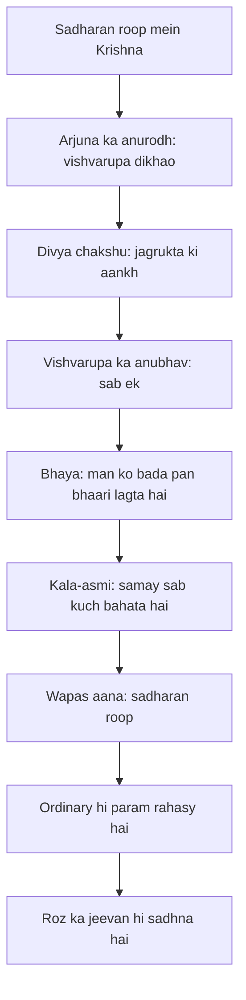

# अध्याय ११: विश्वरूप दर्शन योग — Ek jhalak — sab kuch ek ho gaya

> **"Vishvarupa koi chamatkaar nahin hai — woh anubhav hai. Har meditator ko ek din woh jhalak milti hai jab duniya alag-alag cheezon se nahin, ek jheel si lagti hai. Lekin yaad rakhna: vision ko pakadna mat — woh ek kheer jhadi hai jo nikal jana chahiye. Krishna wapas sadharan roop mein aa gaya — wahi aakhri rahasy hai."**
> — **ओशो**

---

Gita ki kahani mein ab sabse nautakiya mod aata hai. Arjuna ne vibhutiyon ki list sun li — lekin woh aur dekhna chahta hai. Woh Krishna se kehta hai: "Main tumhe asli roop mein dekhna chahta hoon — jo tumne bataya hai, use apni aankhon se dekhna chahta hoon" (11.3). Krishna pehle kehta hai — "Yeh tumhari aankhon se nahin dekha ja sakta; main tumhe divya chakshu deta hoon" (11.8). Aur phir woh dikhata hai — vishvarupa: hazaaron munh, agni, mrityu, samay ka samundar. Arjuna dar se kaanp uthta hai, maafi maangta hai, aur Krishna se wapas apne sadharan roop mein aane ki prarthna karta hai.

Osho is adhyaya ko kaise dekhte hain? Osho kehte hain — yeh koi theology nahin hai, yeh ek anubhav ka varnan hai. Har sachche dhyani ko kabhi na kabhi ek jhalak milti hai — jab alag-alag cheezein ghul kar ek ho jaati hain, jab dekhne wala aur drishya ek ho jaate hain. Wahi vishvarupa hai. Arjuna ne use dekha, aur woh dar gaya — kyunki man bade anubhav se darta hai. Man chhoti, aaramdayak cheezon mein ghoomta hai.

Osho ka twist yahan hai: vision sirf ek jhalak hai, thikana nahin. Krishna wapas apne sadharan roop mein aa jaata hai — dosti, saarthi, kaam, ladai. Osho kehte hain — yehi aakhri rahasy hai: ek baar anubhav ho jaaye, toh sadharan jeevan hi sadhna ban jaata hai. Jo log vision ko pakad kar usi mein atak jaate hain, woh bhool jaate hain ki Krishna ne khud wapas aana chuna. Ordinary hi param hai.

---

## Learning Objectives

Is chapter ko complete karne ke baad aap:

1. Vishvarupa darshana ko Osho ke nazaariye se samjhenge — yeh chamatkaar nahin, meditation ka anubhav hai
2. "Divya chakshu" ka asli arth jaanenge — koi supernatural boon nahin, jagrukta ki aankh
3. "Kala-asmi" (11.32) ke sandesh ko samajhenge — samay sab kuch nashtha karta hai, aur yehi azaadi hai
4. Osho ka twist samjhenge — vision ko chhod kar wapas sadharan mein aana hi aakhri sadhna hai
5. "Cosmic Glimpse Logger" TypeScript tool se apne oneness ke kshan ko log karna seekhenge

---

## Vishvarupa Darshana Yoga ka Parichay

### Kahani mein is adhyaya ka sthaan

Yeh adhyaya Gita ka emotional peak hai. Das adhyayon ke updesh ke baad Arjuna ke paas ab koi sawaal nahin bachta — sirf ek ichha bachti hai: dekhna. Osho kehte hain — yahi seekhne ka aakhri pairaana hai: sunna, samajhna, aur phir dekhna. Jab tak tum sirf sunte ho, knowledge tumhare bahar rehti hai. Jab dekhte ho, knowledge tumhara anubhav ban jaati hai. Arjuna ne suna tha ki Krishna sab kuch hai; ab woh dekhna chahta hai.

Aur Krishna dikhata hai. Gita ke 55 shlokon mein se 49 shlok is darshan mein jate hain — itna bada varnan. Arjuna aakash jaise muh dekhta hai, agni, mrityu, devta, aur samay — "kala-asmi" — jo sab kuch khata hai. Osho kehte hain — yeh varnan kisi poet ka imagination nahin hai; yeh ek meditator ke anubhav ka record hai. Gita ke lekhak ne use shabdon mein bandha hai jo suroor mein the.

### Arjuna ka anurodh aur Krishna ka "divya chakshu"

Arjuna ka anurodh (11.1-4) poore Gita ka sabse pakka anurodh hai. Woh kehta hai: "Tumne jo bataya, mujhe woh sab kuch dekhna hai." Aur Krishna ka jawab (11.8) behtar hai: "Tumhari sadharan aankhen isse nahin dekh sakti; main tumhe divya chakshu deta hoon." Osho yahan ruk jaate hain. Woh kehte hain — "divya chakshu" koi upahaar nahin hai jo doosra de de. Jagrukta de nahin ja sakti — woh jagti hai. Krishna keval Arjuna ko yaad dila raha hai ki usme woh aankh hai — dhyan ki aankh. Jis din tumhari sadharan aankhen band hoti hain aur andar ki aankh khulti hai — wahi divya chakshu hai.

Osho is shloka ko ek chhoti si ghatna se samjhaate hain: jab tum kisi ko ghor nindra se jaagaate ho, toh tum use nindra "de" nahin dete — tum use yaad dilaate ho ki woh pehle se jagruk hai. Krishna ke saath bhi yahi hai: Arjuna asli mein jagruk tha hi, woh bhool gaya tha. Divya chakshu ka matlab hai — woh bhool utarna. Aur Osho kehte hain — yehi dhyan ka sabse bada rahasy hai: tumhe kuch naya paana nahin hai; tumhe apna purana, bhoola hua jagrta pan yaad karna hai.

### Gita ka kavya — varnan ki shakti

Vishvarupa ka varnan Gita ke 11.9 se 11.31 tak phaila hai — aur yeh kisi philosopher ka varnan nahin, ek kavi ka varnan hai. Hazaar munh, agni ki jeehven, lokon ka nash, devta aur asur — Osho kehte hain — yeh sab shabd nahin hain, yeh anubhav ke chinh hain. Kisi ne dekha tha, aur usne shabdon mein bandh diya. Jab ek lambi tumhari bhi koi aisi raat thi — jab kisi bhare aakash ko dekha aur pura vishva khud mein mahsoos kiya — tab tum samajh paoge ki yeh varnan kyu itna lamba hai: kyunki anubhav shabdon mein nahin samata.

Aur isi liye Osho kehte hain — vishvarupa adhyaya ko padhna mat, use sunna. Gita Darshan mein Osho ne isi adhyaya ko apne pravachanon mein is tarah bola ki sunne wale wahi dar aur kaanpna anubhav karte hain jo Arjuna ne kiya. Varnan ka mool utsah hai — padh kar socho mat "yahi dikhta hai?" — socho "kya main us aankh ko dekh sakta hoon jisne yeh dekha?" Wahi aankh tumhari bhi hai.

### Osho ka twist — vision wapas chhod dena

Poora adhyaya is baat par khatam hota hai ki Arjuna, dar ke maare, Krishna se wapas sadharan roop mein aane ko kehta hai (11.46). Aur Krishna aa jaata hai. Osho kehte hain — yeh Gita ka sabse bada sandesh hai. Mystics har yug mein yahi kehte hain: peak se utar kar wapas roz ke jeevan mein aana — chop wood, carry water. Vision ek jhalak thi; jhalak yaad rahe, par jeevan yahin hai. Jo vision ko pakad lete hain woh sadhu ban jaate hain; jo vision ke baad bhi sadharan rah jaate hain — woh param ko jee lete hain.

### Arjuna ki prarthna — wapas aane ki pukar

Vishvarupa ka varnan Gita mein 11.9 se 11.31 tak phaila hai — aur phir Arjuna 11.45-46 mein prarthna karta hai: "Kshama karo, mujhe apna chau-bhuja roop dikhao, apne sadharan roop mein wapas aao — main ab dar se kaanp raha hoon." Osho kehte hain — yeh prarthna bada insaani moment hai. Kisi ne apni aankhon se woh sab dekh liya jo man ke pare hai — aur phir woh wapas apne chhote, jaanne-bujhe roop mein loutna chahta hai. Osho ismein koi kamzori nahin dekhte — yeh man ki prakriti hai. Man bade anubhav ko jhel nahin sakta; woh chhote-पैमाने ka jeev hai. Aur Osho ka twist: Krishna turant wapas aa jaata hai — koi narazgi nahin, koi "tum kabhi samjhe hi nahin" wali baat nahin. Yehi bhakti hai — woh roop jo tumhare liye uthaar hai, wahi tumhara roop hai. Sadharan se prem karo — wahi param hai.

Aur ek aur baat Osho yahan jaante hain: Arjuna ki prarthna ka matlab yeh nahin hai ki woh vision se bhaag gaya. Vision uske andar abhi bhi hai — woh use le kar hi wapas aaya hai. Prarthna sirf roop badalne ki hai, satya chhodne ki nahin. Osho kehte hain — jab tum apne anubhav ko le kar wapas sadharan mein aate ho, tab woh anubhav tumhara hona shuru hota hai. Vision ke saath wapas aana — yahi asli vishvarupa-dharan hai.

Aur isi "vision ko le kar wapas aana" ka ek chhota sa test Osho dete hain: kal jab tum kisi bade anubhav se wapas aaye — kya tum akele ho gaye? Kya woh anubhav tumhe duniya se door le gaya? Agar haan, toh woh anubhav tumhara nahin hua — woh tumhare paas sirf nazar aaya. Asli anubhav ke baad tum duniya se aur zyada jude hote ho — kyunki ab tumhe pata hai ki duniya hi woh hai. Osho kehte hain — Arjuna vision ke baad wapas apne dosto, apni sena, apni ladai mein aaya — aur yahi us vision ka phal hai.

| Pehlu | Traditional Reading | Osho ki Reading |
|-------|---------------------|-----------------|
| Vishvarupa | Bhagvan ki divine glory ka prakatikaran | Meditation ka anubhav — sab ek ho jaana |
| Divya chakshu | Krishna ka supernatural upahaar | Jagrukta ki aankh — jo har kisi ke andar hai |
| Arjuna ka dar | Bhagvan ke bhavya roop se shraddha-poorak bhaya | Man ka bade anubhav se dar — ego ka visarjan |
| Kala-asmi | Bhagvan ka nash shakti ka pradarshan | Samay ka satya — sab kuch behta hai, azaadi yahin hai |
| Wapas aana | Kripaya karke sadharan roop mein lauta jaana | Aakhri rahasy — ordinary hi param hai |

---

## Key Shlokas

### Shloka 11.8

> न तु मां शक्यसे द्रष्टुमनेनैव स्वचक्षुषा।
> दिव्यं ददामि ते चक्षुः पश्य मे योगमैश्वरम्॥

**Transliteration:** na tu māṁ śakyase draṣṭum anenaiva svacakṣuṣā; divyaṁ dadāmi te cakṣuḥ paśya me yogamaiśvaram

**Arth (Hinglish):** Lekin tum apni inhi aankhon se mujhe nahin dekh sakte. Main tumhe divya aankh deta hoon — mera aishvarya-yog dekh lo.

**Osho ka drishtikon:** Osho kehte hain — "divya chakshu" kisi bade upahaar ki tarah mat lo. Agar woh upahaar hota, toh Krishna use sirf Arjuna ko deta aur baaki sab andhe rehte. Nahi — divya chakshu har vyakti ke andar already maujood hai; woh dhyan ki aankh hai. Jab tum vicharon se hat kar dekhne lagte ho, jab tumhare andar koi "mein" nahin bachta — tab woh aankh khulti hai. Krishna sirf keh raha hai: dhyan se dekho. Baaki chamatkaar tumhare andar ka jagrta hua satya hai.

### Shloka 11.32

> कालोऽस्मि लोकक्षयकृत्प्रवृद्धो लोकान्समाहर्तुमिह प्रवृत्तः।
> ऋतेऽपि त्वां न भविष्यन्ति सर्वे येऽवस्थिताः प्रत्यनीकेषु योधाः॥

**Transliteration:** kālo'smi lokakṣayakṛt pravṛddho lokān samāhartumiha pravṛttaḥ; ṛte'pi tvāṁ na bhaviṣyanti sarve ye'vasthitāḥ pratyānīkeṣu yodhāḥ

**Arth (Hinglish):** Main samay hoon — lokon ka nash karne wala, ab sabko samaet karne ke liye pravrit hua. Tere bina bhi woh saare yoddha nahin bachenge jo viruddh senayon mein khade hain.

**Osho ka drishtikon:** "Kala-asmi" — main samay hoon. Osho ise Gita ka sabse gehara shloka maante hain. Samay sab kuch khata hai — woh sach hai, aur Osho kehte hain — yeh sach tumhe dara nahin, azaad karna chahiye. Jab tum samajh jaate ho ki sab kuch behta hai, tab chinta ka kya arth? Jis cheez ko khona hai woh pehle se hi bah rahi hai. Lekin Osho yahan ek twist dete hain: yeh fatalism nahin hai — "ho jaayega toh ho jaayega" wali susti nahin. Samay ka satya tumhe jaagrut karta hai: jo aaj hai, aaj hi jee lo — poore hone ke saath.

### Shloka 11.33

> तस्मात्त्वमुत्तिष्ठ यशो लभस्व जित्वा शत्रून् भुङ्क्ष्व राज्यं समृद्धम्।
> मयैवैते निहताः पूर्वमेव निमित्तमात्रं भव सव्यसाचिन्॥

**Transliteration:** tasmāt tvamuttiṣṭha yaśo labhasva jitvā śatrūn bhuṅkṣva rājyaṁ samṛddham; mayaivaite nihatāḥ pūrvameva nimittamātraṁ bhava savyasācin

**Arth (Hinglish):** Isliye uth, yash pa, shatruon ko jeet kar samriddh rajya bhog. Yeh saare pehle se hi mere dwara maare gaye hain — tum sirf ek nimitta (saadhan) ban jaao, Savyasachin.

**Osho ka drishtikon:** Yahan Osho ruk jaate hain — aur unhein khatka hota hai. "Nimitta-matra" — tum sirf ek instrument bano. Osho kehte hain — yahan Krishna ka strategist chehra khulta hai. Yuddh ko jeetne ke liye Arjuna ko khelna hai, aur "sab maare ja chuke hain" ka sach use manobhool se azaad karta hai. Lekin Osho ka sawaal uthata hai: kya kisi bhi vyakti ko kisi doosre ka nimitta banna chahiye? Osho ka jawab — nahin. Tum kisi ka nimitta nahin, apni jagrukta ka saadhan ho. Andar ka arth: jab tum jagruk hote ho, toh tumhare andar ke shatru — bhay, aalasy, ahankaar — pehle se hi mare hote hain. Toh aazaadi se kaam karo, dar se nahin.

### Shloka 11.55

> मत्कर्मकृन्मत्परमो मद्भक्तः सङ्गवर्जितः।
> निर्वैरः सर्वभूतेषु यः स मामेति पाण्डव॥

**Transliteration:** matkarmakṛn matparamo madbhaktaḥ saṅgavarjitaḥ; nirvairaḥ sarvabhūteṣu yaḥ sa māmeti pāṇḍava

**Arth (Hinglish):** Jo mere liye kaam karta hai, mujhe param maanta hai, mera bhakt hai, aasakti se mukta hai, aur sab praaniyon se nirvair hai — woh mujhe prapt hota hai, He Pāṇḍava.

**Osho ka drishtikon:** Is adhyaya ka aakhri shloka — aur Osho kehte hain — yahan vishvarupa ka vision khatam ho kar ek nirdesh ban jaata hai: kaam karo poore bhaav se, kisi cheez ke saath asakti mat rakho, aur kisi se vair mat rakho. "Nirvairah sarvabhuteshu" — Osho kehte hain — yeh Gita ka sabse sundar vakya hai. Dhyan se dekho: koi dushman nahin, koi darr nahin. Bhakti ka matlab yahan koi ritual nahin — kaam, param aur prem ka ek sangam. Vision dekh kar tumne jo anubhav kiya, ab use roz ke kaam mein jee lo — yahi matkarmakrit hai.

---

## Ek jhalak — Osho ki gahrai mein

### Vishvarupa — no-mind ki jhalak

Osho kehte hain — vishvarupa koi bahar ki gharna nahin hai; woh andar ki gharna hai. Jab tumhara man ruk jaata hai, jab vichar khatam ho jaate hain — tab pehli baar tum dekhne lagte ho ki cheezein alag nahin hain, sab ek hai. Ped tumse alag nahin hai; suryasta tumhare andar hota hai. Isi ko no-mind kehte hain, isi ko sakshi. Arjuna ko yeh jhalak mili — aur yeh koi credit nahin hai ki woh yogi tha; Osho kehte hain — har insaan ke andar yeh jagrta hua sach hai, use sirf dekho. Dhyan koi kathin tapasya nahin; dhyan is jhalak ko kabhi na kabhi pane ki aas hai.

Aur isliye Osho kehte hain — Arjuna ko "bada yogi" samajhna galat hai; woh ek aam insaan hai jo saamne khada tha. Yeh hi Gita ka kamaal hai: koi sadhu nahin, koi muni nahin — ek ladne wala yoddha jise vision milta hai. Osho ka sandesh: vision kisi vishesh vyakti ke liye nahin hai; vision har us aadmi ke liye hai jo jagruk hone ki himmat rakhta hai. Arjuna tum ho, aur vishvarupa tumhari bhi pratima hai.

Aur Osho yahan ek aur baat bataate hain: vision ke baad Arjuna wahi Arjuna nahin raha. Darr, prarthna, aur wapas aana — in teen kshanon mein uske andar kuch toot gaya jo phir jod nahin paaya: "main sab kuch samajh gaya hoon" wala abhiman. Osho kehte hain — jab tak tum kisi bade anubhav ke baad bhi wahi "main" ho jo pehle the, tab tak woh anubhav khaali tha. Asli vision woh hai jo tumhe badal de — aur badalna ka matlab hai wapas aate waqt pehle se halka hona.

Osho ek aur baat jaante hain jo is anubhav ko aur samajhdar banati hai: jab tak tum "main dekh raha hoon" keh sakte ho, tab tak vision aadha hai. Vishvarupa mein dekhne wala bhi ghul jaata hai — wahan sirf drishya bachta hai. Arjuna ne use dekh liya, lekin woh alag rah kar dekh sakta tha — isliye woh dar bhi sakta tha. Osho kehte hain — asli jhalak wahin se shuru hoti hai jahan dar khatam hota hai. Dhyan mein ek din tum khud drishya ban jaoge — tab na darr hoga, na sawaal, na "main".

### Bhaya — man ka bada anubhav se dar

Arjuna vishvarupa dekh kar darta hai. Osho is dar ko kya maante hain? Woh kehte hain — yeh dar jaanne wale ka nahin, khone wale ka hai. Jab ego ko lagta hai ki woh ghul raha hai, tab woh darta hai. Arjuna ke dar mein wahi baat hai jo har dhyani ko ek din aati hai: "agar main sab ho gaya, toh mera kya hoga?" Osho kehte hain — yeh dar aana hi hai, aur yeh dar hi aakhri dware ka sanket hai. Dar ke peeche wahi jhalak hai jise tum miss kar rahe ho. Isliye darr ko bhagao mat — darr ko dekho. Woh bhi vibhuti hai.

Osho yahan ek aur baat bataate hain — dar ke saath aata hai prarthna. Arjuna darta hai aur phir Krishna ki stuti karta hai (11.36-42): "tum aadi-dev ho, tum aadi-purush ho." Osho kehte hain — jab ego ghulta hai, tab pehli baar hriday khulta hai. Darr mein tum bhaagte ho; prarthna mein tum ruk jaate ho. Arjuna ka dar use rukaaya — aur ruk kar usne pehli baar Krishna ko dekha, naam se nahin, anubhav se. Isliye darr bura nahin hai; darr se bhaag na jaana bura hai. Darr ko jhelo — woh prarthna ban jaayega, aur prarthna hi dhyan ka pehla kadam hai.

### Kala-asmi aur azaadi

"Kala-asmi" ka traditional arth hai — bhagvan ka nash shakti ka pradarshan. Osho ise ulta padhte hain: samay sab kuch nashtha karta hai — aur yehi tumhari azaadi hai. Kisi chhoti si cheez ke liye chinta karna, kisi rishte ko pakad kar rota rehna, kisi shikayat ko saal bhar jee lena — samay in sabko baha chuka hai. Jab tum samay ko samajh lete ho, toh pakad nahin, bahav bachta hai. Aur Osho ka aakhri twist: samay sab kuch le jaata hai, par jo dekh raha hai — woh samay ka gawah hai — woh kabhi nahin jaata. Wahi tumhara asli roop hai.

Aur Osho yahan ek nadi ka drishtanta dete hain: samay ek behti nadi hai, aur tum kinare par khade ho. Nadi ke saath bahne se kam koi kinare par khade hone se dharma ho jaata hai — jab nadi ko dekhte ho, jisne use dekha woh nadi nahin hai. Isliye "kala-asmi" sun kar darr se kaanpne wala Arjuna, aur "kala-asmi" samajh kar shaant ho jaane wala Arjuna — dono mein fark hi sakshi hai. Samay ko dekhne wala samay se pare hai — aur wohi tumhari asli pehchaan hai.

Isi sandarbh mein 11.33 ka "uttishtha" bhi dekho — "uth jaao". Osho kehte hain — samay ka satya tumhe sust nahin banata, jagta banata hai. Jo samajh gaya ki samay kam hai, woh uth khada ho jaata hai — kyunki ab woh waqt barbaad nahin karna chahta. Fatalist sust hota hai; sakshi uth jaata hai. Arjuna utha, aur ladai jeetne ke liye nahin — khud ko jeetne ke liye. Isliye "kala-asmi" aur "uttishtha" saath saath aate hain: ek gehra satya, aur us satya se uthta hua karm.

### Vision ke baad ka khaali pan

Osho ek aur baat is adhyaya mein kehte hain jo bahut kam log samajhte hain: vision ke baad ka khaali pan. Arjuna ne vishvarupa dekha — aur phir woh wapas sadharan roop mein aa gaya. Ab woh kya kar sakta hai? Kisi ko bata sakta hai ki usne kya dekha? Osho kehte hain — vision aisa hai jaise kisi ne ek barf ki chadar par haath phira diya — ek jhalak, aur woh bhi chali gayi. Is khaali pan se darna nahin chahiye. Woh khaali pan hi sadhna ka darwaza hai — kyunki ab tumhe pata hai ki kuch hai, lekin woh shabdon se pare hai. Ab sirf ek hi kaam bacha hai: use dhyan se dhoondhna. Yahi Arjuna ki aakhri sthiti hai — aur yahi har dhyani ki sthiti hai.

Osho yahan ek aur nirdesh dete hain: is khaali pan ko jhooth nahin samajhna. Bahut se log anubhav ke baad sochte hain — "agar woh sach hota toh zyada der rehta". Osho kehte hain — jhalak isliye jhalak hai ki woh chhoti hai. Agar woh lambi hoti, toh tum use pakad kar atak jaate. Jo jaldi jaata hai woh isliye jaata hai ki tum use pakdo na — sirf yaad rakho. Yahi return-to-ordinary ka asli vigyan hai: anubhav ko yaad rakhna, aur pakadna nahin.

| Anubhav | Arjuna ka vishvarupa | Ek meditator ka glimpse |
|---------|----------------------|--------------------------|
| Kaise mila | Divya chakshu se — Krishna ke saamne | Dhyan mein — bina kisi ke saamne |
| Kaisa tha | Bhayankar, agni aur mrityu se bhara | Shant, ya roshni se bhara — alag-alag |
| Kya hua baad mein | Dar, prarthna, wapas sadharan roop | Khaali pan, aur wapas roz ke kaam |
| Gita ka sandesh | Vision nahin, wapas aana aakhri hai | Glimpse nahin, return-to-ordinary sadhna hai |
| Kya pakda gaya | Kuch bhi nahin — sirf yaad | Kuch bhi nahin — sirf yaad |

### Glimpse ke triggers — jahan jhalak milti hai

Osho kehte hain — vishvarupa dekhne ke liye kisi Krishna ki zaroorat nahin hai; jhalak ke triggers tumhare aas-paas har jagah hain. Jab nature mein beh jaate ho, jab sangeet mein, jab deep work mein, jab kisi ke saath maun mein — wahan ek pal aata hai jab alag hone ka bhaav ghat jaata hai. Osho kehte hain — in triggers ko pehchano, kyunki pehchanne se jhalak badhti hai. Cosmic Glimpse Logger isi liye bana hai — jhalak ko miss mat karo, use log karo. Aur dhyan rakho: trigger hi anubhav nahin hai — trigger sirf darwaza hai. Darwaze ko dekh kar darwaza mat maan lo; uske paar dekho.

| Trigger | Jhalak ka roop | Osho ka nirdesh |
|---------|----------------|-----------------|
| Nature — suryasta, pahaad, samundar | Wahan kaal aur desh ghul jaate hain | Use dekhna band mat karo — use jee lo |
| Sangeet | Swar aur maun ek ho jaate hain | Sangeet ke beech ka maun bhi suno |
| Deep work | "Main" kaam mein ghul jaata hai | Kaam ke beech 5 second: kaun kar raha hai? |
| Prem — kisi ke saath maun | Do akele ek ho jaate hain | Baat mat karo — ek saans saath lo |
| Dhyan — aankhein band | Vichar khud ko dekhne lagte hain | Dekhne wale ko dekho |
| Aashcharya — kisi bade drishya par | Kshan ke liye saans ruk jaati hai | Us ruki hui saans ko na bachao — na pakdo |

### Ek aur drishti — varnan kya nahin hai

Osho kehte hain — vishvarupa ka varnan padhte waqt ek baat yaad rakhna: yeh koi "what I saw" report nahin hai. Gita ke lekhak ne nahin socha tha ki ise bhautik (physical) roop mein parakhna hai. Varnan ek sanket hai — jaise choraha batane wala board hai, woh swarg nahin. Jis din tum varnan ko literal maan kar chhote-paimane ki ginti karte ho — kitne munh, kitni bhujaayein — usi din tum anubhav se door ho jaate ho. Osho kehte hain — varnan ko pooja karne se achha hai, varnan ko anubhav ke liye upyog karo: jab padho, tab ruko, aur usi pal ke liye saans ke saath jee lo.

### Vishvarupa se wapas sadharan mein — aakhri rahasy

Osho kehte hain — is adhyaya ka aakhri sandesh yahi hai: Krishna ne apni mahima dikhayi, aur phir use utha liya. Vision ek tarah ki visheshta thi; sadharan roop uski asli pehchaan. Aur Osho ka sawaal: kya tum bhi apne vision ko utha sakte ho? Kya tum apne anubhav ke garv ko chhod kar wapas chai banane ja sakte ho? Yahi test hai — aur yahi aakhri rahasy hai.



Is flow mein poora adhyaya ek chakra ban jaata hai: sadharan se anubhav tak, anubhav se bhay tak, bhay se wapas sadharan mein. Osho kehte hain — yahi Gita ka sabse bada design hai: woh tumhe kabhi bahar le jaata hai, par hamesha wapas yahin laata hai — kyunki tumhara jeevan yahin hai. Vision ek visit hai, ghar nahin. Isliye Cosmic Glimpse Logger jaisa tool bhi yahi karta hai — jhalak ko log karo, score karo, aur phir RETURN_TO_ORDINARY ke 11 kadam karo. Anubhav ko yaad rakhna aur roz ke jeevan mein wapas aana — yahi vishvarupa darshana ki poori sadhna hai.

---

## TypeScript Implementation

```typescript
/**
 * Geeta Darshan — Adhyaya 11: Vishvarupa Darshana Yoga
 * Cosmic Glimpse Logger: oneness ke un kshan jhonko
 * yaad rakhta hai jo aksar chale jaate hain.
 * Glimpse ko score karo, aur 11 kadmon mein
 * sadharan jeevan mein wapas aana seekho.
 * Shloka 11.55: matkarmakrin matparamah — kaam karo,
 * asanga raho, aur wapas aao.
 * Chalane ke liye: npx ts-node 11-cosmic-glimpse-logger.ts
 */

interface OnenessMoment {
  id: number;
  date: string;
  trigger: string;
  depth: number;
  oshoReflection: string;
}

interface ReturnStep {
  step: number;
  practice: string;
  oshoComment: string;
}

const RETURN_TO_ORDINARY: ReturnStep[] = [
  { step: 1, practice: 'Shwas par wapas aao', oshoComment: 'Krishna wapas sadharan roop mein aaye — tum bhi wapas aao.' },
  { step: 2, practice: 'Aankhein kholo aur ek cheez dekho', oshoComment: 'Ek phool hi kaafi hai — pura vishva usi mein hai.' },
  { step: 3, practice: 'Paani piyo — swad lo', oshoComment: 'Sadharan anubhav hi param anubhav hai.' },
  { step: 4, practice: 'Kisi se ek achhi baat karo', oshoComment: 'Sambandh hi sadhna hai.' },
  { step: 5, practice: 'Apne haathon ko dekho', oshoComment: 'Yahi haath kaam karte hain — yehi murti hai.' },
  { step: 6, practice: 'Chalte waqt zameen ko mahsoos karo', oshoComment: 'Zameen bhi vishvarupa ka hissa hai.' },
  { step: 7, practice: 'Kisi chhote kaam ko poore dhyan se karo', oshoComment: 'Kisi ka nimitta mat bano — poore ho jao.' },
  { step: 8, practice: 'Hanso — bina wajah', oshoComment: 'Hansi anubhav ka swadisht phal hai.' },
  { step: 9, practice: 'Ek roti kisi ko de do', oshoComment: 'Divine ko dekhna divine ko dena hai.' },
  { step: 10, practice: 'So jaane se pehle shukr karo', oshoComment: 'Kritagya hriday hi vishvarupa ka darpan hai.' },
  { step: 11, practice: 'Kal phir se shuru karo', oshoComment: 'Koi bhi anubhav aakhir nahin — yatra hi sadhna hai.' }
];

class CosmicGlimpseLogger {
  private moments: OnenessMoment[] = [];
  private nextId = 1;

  logGlimpse(date: string, trigger: string, depth: number, oshoReflection: string): OnenessMoment {
    const moment: OnenessMoment = {
      id: this.nextId++,
      date,
      trigger,
      depth: Math.min(10, Math.max(1, depth)),
      oshoReflection
    };
    this.moments.push(moment);
    return moment;
  }

  averageDepth(): number {
    if (this.moments.length === 0) return 0;
    const sum = this.moments.reduce((acc, m) => acc + m.depth, 0);
    return sum / this.moments.length;
  }

  deepest(): OnenessMoment | null {
    if (this.moments.length === 0) return null;
    return this.moments.reduce((a, b) => (a.depth >= b.depth ? a : b));
  }

  printReturnPractice(): void {
    for (const step of RETURN_TO_ORDINARY) {
      console.log(step.step + '. ' + step.practice + ' — ' + step.oshoComment);
    }
  }

  showLog(): void {
    for (const m of this.moments) {
      console.log('#' + m.id + ' | ' + m.date + ' | ' + m.trigger + ' | depth: ' + m.depth + '/10');
      console.log('   ' + m.oshoReflection);
    }
  }
}

function runDemo(): void {
  const logger = new CosmicGlimpseLogger();
  console.log('=== Cosmic Glimpse Logger — Adhyaya 11 ===');
  logger.logGlimpse('2026-08-19', 'Suryasta dekhna', 8, 'Kuch pal ke liye main suryasta hi tha — alag koi nahin tha.');
  logger.logGlimpse('2026-08-18', 'Music sunna', 6, 'Sangeet mein swar aur maun ek ho gaye.');
  logger.logGlimpse('2026-08-17', 'Deep work session', 7, 'Kaam mein itna dub gaya ki main khud hi nahin tha.');
  logger.showLog();
  console.log('');
  console.log('Average depth: ' + logger.averageDepth().toFixed(1) + '/10');
  const deepest = logger.deepest();
  if (deepest) {
    console.log('Sabse gehri jhalak: ' + deepest.trigger);
  }
  console.log('');
  console.log('=== 11 kadam: vishvarupa se wapas sadharan mein ===');
  logger.printReturnPractice();
  console.log('');
  console.log('Shloka 11.55: matkarmakrin matparamah — kaam karo, asanga raho, aur wapas aao.');
}

runDemo();
```

---

## Summary

| Bindu | Saar |
|-------|------|
| Vishvarupa kya hai | Meditation ka anubhav — jab sab alag cheezein ek ho jaati hain |
| Divya chakshu | Jagrukta ki aankh — upahaar nahin, har kisi ke andar maujood |
| Kala-asmi | Samay sab kuch bahata hai — aur yehi azaadi ka dwaar hai |
| Bhaya ka arth | Ego ka visarjan darr lagata hai — darr ko bhagao nahin, dekho |
| Aakhri rahasy | Vision chhod kar wapas sadharan mein aana — ordinary hi param hai |
| Gita ka design | Sadharan se anubhav tak, aur wapas sadharan mein — ghar yahin hai |

---

## Contradictions

- **Divya chakshu ek upahaar hai:** Traditional reading kehti hai Krishna ne Arjuna ko supernatural aankh di — Osho kehte hain jagrukta de nahin ja sakti, woh jagti hai; Krishna ne sirf yaad dilaya. Divya chakshu ka matlab hai apna bhoola hua jagrta pan yaad karna.
- **Vision ka uddeshya:** Traditional reading maanti hai vision bhagvan ki glory dikhane ke liye tha — Osho kehte hain woh Arjuna ke apne andar ka anubhav tha, Krishna ka pradarshan nahin.
- **Nimitta-matra:** Traditional reading ise "bhagvan ke haath ka saadhan bano" maanti hai — Osho kehte hain kisi ka nimitta banna dangerous hai; jagrukta ka saadhan bano, kisi vyakti ka nahin.
- **Kala-asmi ka arth:** Traditional reading ise nash shakti ka pradarshan maanti hai — Osho kehte hain samay ka satya chinta nahin, azaadi hai; jo behta hai use pakadna chhodo.
- **Vision ko pakadna:** Traditional parampara mein divine darshan ek sadhya hai — Osho kehte hain vision ko pakadna hi bandhan hai; Krishna khud wapas sadharan roop mein aaya — wahi aakhri shiksha hai.

---

## Open Questions

- Agar vishvarupa har meditator ka anubhav hai, toh us dar ka kya karna hai jo Arjuna ne mahsoos kiya — dar se bhaagna sahi hai ya use jhelna?
- Krishna ne vision kyun dikhaya — Arjuna ko jagaane ke liye ya uske man ko shaant karne ke liye? Kya yeh bhi strategist Krishna ka khel ho sakta hai?
- "Kala-asmi" sun kar Arjuna ladne ke liye taiyar ho gaya — kya samay ka satya humesha karm mein lagaata hai, ya kabhi susti mein bhi?
- Ordinary mein wapas aane ke baad bhi jhalak ko yaad rakhna — kya yeh yaad bhi ek asakti ban sakti hai?

---

## Practical Takeaways

| Situation | Gita shloka | Osho's lens | Action |
|-----------|-------------|-------------|--------|
| Dhyan mein gahrai ka kshan | 11.8 (divya chakshu) | Woh aankh tumhare andar hai — chamatkaar mat dhoondho | 2 minute aankhein band karke andar dekho |
| "Sab kuch nashvar hai" ka dar | 11.32 (kala-asmi) | Samay ka satya azaadi hai — chinta nahin | Kisi purani shikayat ko aaj chhod do |
| Kisi ka kaha hua kaam karne ka man | 11.33 (nimitta-matra) | Kisi ka nimitta mat bano — apni jagrukta ke saadhan bano | Kaam se pehle 10 second: "kya main jagruk hoon?" |
| Kisi anubhav ko pakadne ki ichha | 11.55 (matkarmakrin) | Kaam karo, asanga raho — anubhav bhi behta hai | Aaj ka anubhav likho aur use jaane do |
| Vision ke baad ka khaali pan | Return to ordinary | Wapas sadharan mein aana hi sadhna hai | 11 kadmon mein se koi ek aaj karo |
| Glimpse ko bhoolne ka dar | 11.8 (divya chakshu) | Jagrukta ko bhoola ja sakta hai, khoya nahin | Har subah 1 minute: andar ki aankh se dekho |
| Kisi ne mera anubhav nahin samjha | 11.33 (uttishtha) | Vision sabko samjhana zaroori nahin — kaam hi gawah hai | Apna anubhav batane se pehle 2 baar socho |

---

## Chapter Quiz

### Question 1

Osho ke nazaariye se vishvarupa darshana kya hai?

a) Bhagvan ka chamatkaarik pradarshan
b) Meditation ka anubhav — jab sab cheezein ek ho jaati hain
c) Ek dharmik khel
d) Arjuna ka sapna

<details><summary>Answer</summary>
**b) Meditation ka anubhav** — Osho kehte hain yeh theology nahin, anubhav hai; har dhyani ko kabhi na kabhi sab-ek wali jhalak milti hai. Arjuna ki oopar waali aankh wahi hai jo har meditator mein khulti hai.
</details>

### Question 2

"Divya chakshu" ka Osho kya arth maante hain?

a) Krishna ka supernatural upahaar jo sirf Arjuna ko mila
b) Jagrukta ki aankh — jo har vyakti ke andar already maujood hai
c) Ek jadui chashma
d) Sirf devtaon ko milne wali aankh

<details><summary>Answer</summary>
**b) Jagrukta ki aankh** — Osho kehte hain jagrukta de nahin ja sakti, woh jagti hai; Krishna ne sirf yaad dilaya. Divya chakshu ka matlab hai apna bhoola hua jagrta pan yaad karna.
</details>

### Question 3

11.32 mein "kala-asmi" ka Osho ke anusaar asli sandesh kya hai?

a) Bhagvan sabko nashtha karega — darr ke saath jeeo
b) Samay sab kuch bahata hai — aur yehi azaadi hai
c) Samay ko roko
d) Samay ka koi mahatva nahin

<details><summary>Answer</summary>
**b) Samay sab kuch bahata hai — aur yehi azaadi hai** — Osho kehte hain jo behta hai use pakadna chhodo; jo dekh raha hai woh kabhi nahin jaata. Samay ka satya fatalism nahin, jagrta pan hai.
</details>

### Question 4

Arjuna vishvarupa dekh kar kyun darta hai — Osho ki drishti mein?

a) Kyunki Krishna darawana hai
b) Kyunki ego ko lagta hai woh ghul raha hai — ego ka visarjan darr lagata hai
c) Kyunki woh kamzor hai
d) Kyunki vishvarupa jhutha hai

<details><summary>Answer</summary>
**b) Ego ka visarjan darr lagata hai** — Osho kehte hain yeh dar aana hi hai; darr ko bhagao nahin, use dekho. Darr jhelne par prarthna ban jaata hai.
</details>

### Question 5

"Nimitta-matra bhava" (11.33) par Osho ka kya rukh hai?

a) Poora samarthan — sabko nimitta banna chahiye
b) Khatka — kisi ka nimitta banna dangerous hai; jagrukta ke saadhan bano
c) Koi matlab nahin
d) Yeh sirf Krishna ke liye tha

<details><summary>Answer</summary>
**b) Khatka** — Osho kehte hain yahan strategist Krishna ka chehra khulta hai; tum kisi vyakti ke nimitta nahin, apni jagrukta ke saadhan ho. Andar ka arth: jagrukta se dekho toh shatru pehle se mare hain.
</details>

### Question 6

Osho ke anusaar vishvarupa ke baad Krishna wapas sadharan roop mein kyun aata hai?

a) Kyunki Arjuna ne force kiya
b) Kyunki vision ko pakadna bandhan hai — ordinary hi param rahasy hai
c) Kyunki vishvarupa aasan nahin tha
d) Kyunki Krishna ka mann badal gaya

<details><summary>Answer</summary>
**b) Vision ko pakadna bandhan hai** — Osho kehte hain jo vision ko pakad lete hain woh sadhu ban jaate hain; jo wapas aakar sadharan jee jate hain woh param ko jee lete hain. Krishna khud wapas sadharan roop mein aaya.
</details>

### Question 7

11.55 mein "nirvairah sarvabhuteshu" ka kya matlab hai?

a) Sabse ladna band kar do
b) Kisi bhi praani ke saath vair nahin — yeh Gita ka sabse sundar vakya hai
c) Sirf dushmano se prem karo
d) Vair karna hi dhyan hai

<details><summary>Answer</summary>
**b) Kisi bhi praani ke saath vair nahin** — Osho kehte hain dhyan se dekho: koi dushman nahin, koi darr nahin; kaam, param aur prem ka sangam hi bhakti hai. Yeh Gita ka sabse sundar vakya hai.
</details>

### Question 8

Cosmic Glimpse Logger ka "depth" score kya batata hai?

a) Glimpse kitna purana hai
b) Glimpse kitna gehrah tha — 1 se 10 tak
c) Log kitna lamba hai
d) Trigger kitna popular hai

<details><summary>Answer</summary>
**b) Glimpse kitna gehrah tha — 1 se 10 tak** — depth ko log karte hue tum apne oneness ke anubhavon ko tulna kar sakte ho. Depth sirf score nahin, dekhe jaane wale moment ka darpan hai.
</details>

### Question 9

"Return to Ordinary" practice ka pehla kadam kya hai?

a) Bhagne ki practice
b) Shwas par wapas aana — Krishna ki tarah wapas sadharan mein
c) Vision ko aur dekhna
d) Kisi ko phone karna

<details><summary>Answer</summary>
**b) Shwas par wapas aana** — Osho kehte hain Krishna wapas sadharan roop mein aaye; tum bhi wapas aao. Pehla kadam hamesha saans hi hota hai.
</details>

### Question 10

Osho ke anusaar dhyan kya hai?

a) Koi kathin tapasya
b) Vishvarupa jaisi jhalak ki aas — jab man ruk jaata hai, sab ek dikhta hai
c) Sirf mantra ka jaap
d) Kisi temple mein jaana

<details><summary>Answer</summary>
**b) Vishvarupa jaisi jhalak ki aas** — Osho kehte hain dhyan koi tapasya nahin; dhyan is jhalak ko kabhi na kabhi pane ki aas hai. Aas bhi nahin — thoda sa pyaar hi kaafi hai.
</details>

---

## Exercises

1. **Jhalak log practice (7 din):** Roz us kshan ko note karo jab tumhe "sab ek" jaisa laga — nature, music, deep work, kisi ke saath maujoodgi. Cosmic Glimpse Logger ke pattern par depth score do (1-10) aur ek oshoReflection likho. Hafta khatam hone par averageDepth nikaalo — aur dekho ki tumhara "sab ek" kitna badha.

2. **Divya chakshu meditation (10 min):** Aankhein band karo. Pehle 5 minute apne vicharon ko dekho — judge mat karo, sirf dekho. Phir 5 minute vicharon ke peeche ke khaali pan ko dekho. Osho kehte hain — wahi khaali pan divya chakshu hai. 10 minute poore hone par apne aap ko mat jaago — dhyan se nikalne ko bhi dhyan se karo.

3. **Kala-asmi practice (5 min):** Din mein ek baar socho — "10 saal pehle ki chinta aaj kahaan hai? 10 saal baad ki chinta aaj kyun?" Samay ke bahav ko jagrukta se dekho — aur dekho ki chinta kitni bekaar thi. Is practice ka mool 11.32 hai — samay ka satya chinta ko dekhna sikhata hai. Ek hafte baad wapas padho — chinta kitni badal gayi?

4. **Nimitta check (3 din):** Jab bhi koi tumse kaam karaaye — boss, dost, parivaar — puchho: "Main yahan jagruk hoon ya kisi ke pressure mein hoon?" Osho ke nirdesh ke saath: kisi ka nimitta mat bano, apni jagrukta ke saadhan bano. Har din ke aakhir mein 3 line likho — kitne kaam jagrukta se hue, kitne pressure se? Teesre din tulna karo.

5. **Return-to-ordinary (11 kadam):** Ek din chuno jab tumne koi gehri jhalak pai — usi din RETURN_TO_ORDINARY ke 11 kadam karo aur har kadam ke baad 2 line likho. Kadam 11 ka matlab bhi dhyan se dekho — yatra ka koi aakhir nahin hai.

6. **Vision ko jaane do (journaling):** Apne jeevan ka sabse bada "spiritual" anubhav likho — aur phir wahi likho ki uske baad tum wapas sadharan jeevan mein kaise aaye. Osho ka sawaal: kya tum us anubhav ko pakad kar atak gaye the? Agar haan, toh 11.55 ka sandesh likho — matkarmakrin matparamah — kaam karo, asanga raho.

---

## Further Reading

- Osho, *Gita Darshan* — Vol 4 (Vishvarupa Darshana par vyaakhya), Woodlands apartment ke pravachan, 1973-76 — is adhyaya ke 55 shlokon par unke sampoorn pravachan
- Osho, *Meditation: The First and Last Freedom* — dhyan ke anubhavon ki prakriti par; vision aur no-mind ke anubhav samajhne ke liye
- Bhagavad Gita (Gita Press, Gorakhpur) — Shlok 11.1 se 11.55 tak ka mool path; vishvarupa varnan ka mool kavya
- R. D. Ranade, *A Pathway to God in Hindi Literature* — darshan anubhavon ki parampara par; santon ke "darshan" anubhavon ka tulnaatmak adhyayan
- T. S. Eliot, *Four Quartets* — "ek jhalak" aur wapas ordinary mein aane ki kavita; gyan aur samay par bhi gahre sandarbh
