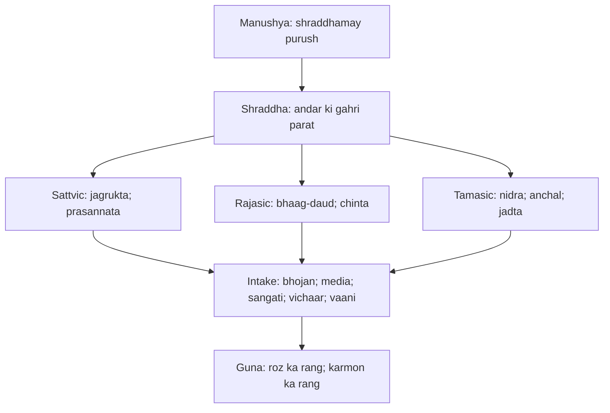
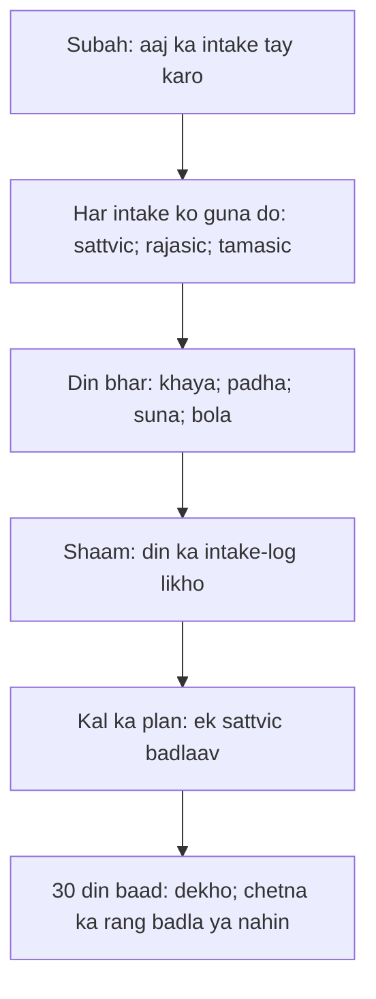

# अध्याय १७: श्रद्धात्रय विभाग योग — "Shraddha belief nahin, trust hai"

> **"Shraddha koi dogma nahin hai jo tumhe bahar se pakad kar diya gaya ho. Shraddha tumhare andar ki gahri hoti parat hai — us parat ka naam hi shraddha hai. Aur jo kuch tum khaate ho, sunte ho, sochte ho — woh usi parat mein jaa kar milta hai. Isliye dekho: tum apne andar kya daal rahe ho."**
> — **ओशो**

---

Gita ka satrahvan adhyay — solahvan adhyay ka sahi jawab. Krishna ne abhi-abhi Arjun ko bataya: devta aur danav do pravruttiyan hain, dono tumhare andar hain. Ab Arjun ka asli sawaal uthta hai: "Krishna, agar koi vyakti shraddha se koi cheez karta hai — bina shastra ke, apni samajh se — toh woh kaisa hai? Sattvik, rajasic ya tamasic?" (17.1). Arjun ko maafi nahin chahiye thi — woh seedha poochh raha hai ki jo insaan bina dande ke jeeta hai, uska kya? Osho kehte hain: yeh sawaal sirf Arjun ka nahin — yeh har us insaan ka sawaal hai jise shastra dara ke chalata hai. Krishna ka jawab shraddha hai.

Osho is adhyay ko Gita ke sabse "psychological" adhyayon mein ginते hain. Unke liye shraddha ka matlab "vishwas" nahin — kyunki vishwas hamesha "kisi cheez par" hota hai, aur "kisi cheez par vishwas" hamesha dar se hota hai. Shraddha ka matlab hai — bheetar ka bharosa, apne swabhav par, apne andar ke pravah par, jeewan par. Osho kehte hain: belief sir mein hota hai, shraddha hriday mein hoti hai. Belief kisi kitab se milti hai, shraddha kisi bheetar ke anubhav se. Aur isi adhyay mein Krishna yeh bhi batata hai — yeh shraddha teen gunon mein baanti jaati hai: sattvik, rajasic aur tamasic.

Is adhyay ka sabse aksar chhutne wala hissa — bhojan ke teen bhed (17.8-10) — Osho ke liye sabse gahra hai. Woh kehte hain: Krishna sirf khana nahin kaat raha — woh tumhe batana chahta hai ki jo kuch bhi tum "andar lete ho" — bhojan, vichaar, sangati, samachaar, bol, daan — woh tumhare shraddha-parat ko milkar banata hai. "Tum wahi bante ho jo tum khaate ho" — yeh Osho ka is adhyay ka core hai. Is chapter mein hum isi ko gahrai mein dekhenge.

## Learning Objectives

Is chapter ko complete karne ke baad aap:

1. Samjhenge — shraddha kisi belief-system ka naam nahin; woh tumhare chetna ka sabse gahra level hai — aur isi level se tumhare saare karm, khaana-pina, bolna aur daan pravaahit hote hain.
2. Pehchanenge — teen gunon (sattva, rajas, tamas) ka adhyay ke saare hisson par aaine ki tarah chadhna: shraddha, aahaar, tapas, daan — sab ek hi gun se rangte hain.
3. Janenge — Osho ki vyakhya mein shraddha ka belief se fark: belief = saboot ka dar, shraddha = anubhav ka bharosa.
4. Vyavahar mein utarenge — "tum wahi ho jo tum khaate ho" ko teen levels par utarna: bhojan, media-information, aur sangati — ek "awareness diet" banane ke liye.
5. Sikh jayenge — apne daily intake ko sattvic/rajasic/tamasic classify karna — ek TypeScript tool ke saath jo Osho ki tippani de kar tumhe aaina dikhata hai.

---

## Shraddhatray ka Parichay

### Arjun ka sawaal — Gita ka sabse vachał sawaal

Adhyay 17 ki shuruaat hi sawaal se hoti hai — Arjun poochhta hai (17.1): "जो शास्त्रविधिमुत्सृज्य — shastra ko chhod kar, apni shraddha se bhajan karta hai — woh sattvik hai, rajasic hai ya tamasic?" Is sawaal ki khoobsurti yeh hai — Arjun keh raha hai: "Krishna, pichhle adhyay mein tumne kaha shastra pramaan hai. Lekin agar koi shastra nahi jaanta, sirf dil se japta hai, toh uska kya?" Osho kehte hain: yeh sawaal hi siddh karta hai ki Arjun Gita ka sabse honest seeker hai — woh har baar sach jaan-na chahta hai, fatwe nahin.

Krishna ka jawab bhi utna hi gahra hai: "सत्त्वानुरूपा सर्वस्य श्रद्धा भवति भारत" — har vyakti ki shraddha uske swabhav ke anuroop hoti hai. Shraddha bahar se nahin aati — woh andar se nikalati hai. Aur phir woh yeh bhi kehta hai ki shraddha se hi vyakti banta hai: "श्रद्धामयोऽयं पुरुषः" — manushya shraddhamay hai; jo uski shraddha, wahi woh hai. Osho kehte hain — yeh ek line poori psychology ko badal deti hai: tum wahi ho jo tumhari gahri shraddha hai, na ki tumhare bade-vede vishwas.

### "Shraddha" shabd ki khoj — belief vs trust

| Aayam | Belief (vishwas) | Shraddha (trust) |
|-------|------------------|------------------|
| Kahan rehti hai | Sir mein — vichaaron mein | Hriday mein — bheetar ke anubhav mein |
| Kahan se aati hai | Bahar — kitab, guru, sanskar, dar | Andar — apne jeewan ke anubhav se |
| Kaise chalti hai | Proof par — "yeh sach hai kyunki likha hai" | Experience par — "yeh sach hai kyunki maine dekha" |
| Dar se sambandh | Dar ko shant karti hai (talisman) | Dar ko mitati hai (jagrukta) |
| Guna se sambandh | Rajasic aur tamasic mein rahti hai | Sattvic mein khilati hai |
| Ant | Pakadna — aur doosron ko pakadna | Chhodna — aur jeewan ko chalne dena |
| Osho ka fayda | Kabhi sukoon nahin deti | Sukoon hi uska swaroop hai |

Osho is table ko ek udaharan se samjhaate hain — ek aadmi ne suna ki ganga mein snan se paap dhul jaata hai. Woh har saal snan karta hai, par uske bheetar ka danav waise ka waisa rehta hai. Belief ne use dila diya ki "kuch ho raha hai" — par kuch nahi ho raha. Ab ek doosra aadmi — woh snan nahin karta, par apne andar ke aahaar aur vichaar ko dekhne lagta hai. Uski shraddha badee honi shuru ho jaati hai. Osho kehte hain: Gita ki shraddha tumhe paani nahin milati — tumhe aaina milata hai.

### Yeh adhyay Gita ke saath kaise chalta hai

Gita ke teen margon — karma, bhakti, gyan — ke beech mein satrahvan adhyay "gunon ka vigyaan" hai. Krishna kehta hai: jo bhi tum karte ho — bhojan, tapas, daan — woh teen gunon mein se kisi ek gun se ranga jaata hai. Toh adhyay 17 ek "quality-control" adhyay hai — tumhare saare karmon ki guna-check. Aur isi liye yeh moksha (adhyay 18) se theek pehle aata hai — kyunki moksha ke liye yeh jaanna zaroori hai ki tumhare saare karm kis gun ke aadhar par chale hain. Osho kehte hain: tum moksha ka sapna dekhte ho par apne bhojan ka hisaab nahin rakhte — yeh Krishna ke liye bhi ek badi vyatha rahi hogi.

---

## Key Shlokas

### Shloka 17.2-3

> श्रीभगवानुवाच |
> त्रिविधा भवति श्रद्धा देहिनां स्वभावजा |
> सात्त्विकी राजसी चैव तामसी चेति तां शृणु ॥ २ ॥
>
> सत्त्वानुरूपा सर्वस्य श्रद्धा भवति भारत |
> श्रद्धामयोऽयं पुरुषो यो यच्छ्रद्धः स एव सः ॥ ३ ॥

**Transliteration:** trividha bhavati shraddha dehinam svabhava-ja | sattviki rajasichaiva tamasicha-eti tam shrinu || sattvanurupa sarvasya shraddha bhavati bharata | shraddhamayo 'yam purusho yo yacchraddhah sa eva sah ||

**Arth (Hinglish):** Krishna kehta hai — dehdhariyon ki shraddha teen prakar ki hoti hai, jo unke swabhav se janmi hai: sattviki, rajasic aur tamasic — sun. Har vyakti ki shraddha uske sattva (andhar-rajya) ke anuroop hoti hai, he Bharat. Yeh purush shraddhamay hai — jo jaisi shraddha ka hai, waisa hi woh hai.

**Osho ka drishtikon:** Osho is shlok ko Gita ka "definition of man" kehte hain. Manushya kya hai? Sirf uska swaroop nahin, uska karm nahin — uski shraddha. Belief badalti rehti hai — aaj isi mein, kal usi mein. Par shraddha badalne ke liye poora vyakti badalna padta hai. Isliye Osho kahte hain: mat dekho ki aadmi kya bolta hai — dekho ki woh kisse jeeta hai, kisse darta hai, kisse prem karta hai. Uska andar ka taar yeh sab batadega. Aur jab tak tum apni shraddha ko nahin pehchanoge, tum kabhi jeewan mein siddh nahin ho sakte — kyunki shraddha hi teri dishayen tay karti hai.

### Shloka 17.8-10

> आयुःसत्त्वबलारोग्यसुखप्रीतिविवर्धनाः |
> रस्याः स्निग्धाः स्थिरा हृद्या आहाराः सात्त्विकप्रियाः ॥ ८ ॥
>
> कट्वम्ललवणात्युष्णतीक्ष्णरूक्षविदाहिनः |
> आहारा राजसस्येष्टा दुःखशोकामयप्रदाः ॥ ९ ॥
>
> यातयामं गतरसं पूति पर्युषितं च यत् |
> उच्छिष्टमपि चामेध्यं भोजनं तामसप्रियम् ॥ १० ॥

**Transliteration:** ayuh-sattva-balarogya-sukha-preeti-vivardhanah | rasyah snigdha sthira hridaya aharah sattvika-priyah || katu-amla-lavana-atyushna-teekshna-ruksha-vidahinah | aharah rajasasya-ishta duhkha-shokamaya-pradah || yata-yamam gata-rasam puti paryushitam cha yat | uchchhishtam-api cha medhyam bhojanam tamasa-priyam ||

**Arth (Hinglish):** Krishna kehta hai — jo aahaar aayu, sattva, bal, arogya, sukh aur preeti badhate hain; jo rasyukt, snigdha (chikna), sthir aur hriday ko sukh dene wale hain — woh sattvik vyakti ko priya hai. Jo kadwa, amla, namkeen, ati-ushna, teekshna, rookha aur jalaane wale hain — woh rajasic ko priya hain, aur duhkh-shok aur rog dete hain. Jo purana, bina rasa wala, durgandhit, beesi hui aur uchchhisht (doosron ka jutha) ho — woh tamasic bhojan hai.

**Osho ka drishtikon:** Osho kehte hain — yeh teen shlok sirf khane ki recipe nahin hain; yeh jeene ki recipe hain. Kyunki bhojan sirf pet nahin bharta — woh tumhare bheetar ke vyakti ko banata hai. Teekshna aur ati-ushna bhojan tumhare andar ki aag ko badhata hai; andar ki aag rajas hai. Beesaa hua bhojan tumhare andar nidra aur jadta bharta hai — tamas. Aur snigdha, rasyukt, sthir bhojan tumhare andar shanti ka sthaan bana deta hai — sattva. Osho ka add-on: yeh rule sirf khane par hi nahin — tum jo kitabein padhte ho, jo samachaar dekhte ho, jis sangati mein beth te ho — woh sab "aahaar" hai. Ek purani, gandi, beesi hui news bhi tamasic bhojan hai. Aur Osho kahte hain: yeh sabse kathin part hai — kyunki khane ka hisaab toh koi rakhta hai; vichaar ke bhojan ka hisaab koi nahin rakhta.

### Shloka 17.15

> अनुद्वेगकरं वाक्यं सत्यं प्रियहितं च यत् |
> स्वाध्यायाभ्यसनं चैव वाङ्मयं तप उच्यते ॥ १५ ॥

**Transliteration:** anudvega-karam vakyam satyam priya-hitam cha yat | svadhyaya-abhyasanam chaiva vangmayam tapa uchyate ||

**Arth (Hinglish):** Krishna kehta hai — jo vakya kisi ko udveg na de, jo satya ho, priya aur hit-kari ho — aur svadhyay ka abhyas — yeh vanmay (vaani ka) tapas hai.

**Osho ka drishtikon:** Osho kehte hain — tapas ka matlab sirf jalana aur nirjal vrat nahin. Vanmay tapas — vaani ka tapas — sabse kathin tapas hai. Kyunki haath ka tapas chhup sakta hai; vaani ka tapas roz pichhe padta hai. Ek baat kaun keh sakta hai jo satya bhi ho, priya bhi ho, hit-kari bhi ho, aur kisi ko udveg bhi na de? Chaaron ek saath? Osho kahte hain: yeh chaar cheezein ek saath kahenge toh woh shuddh vaani ho jayegi. Aur shuddh vaani se hi tumhare andar ka jhagda khatam hota hai. "Anudvega" — kisi ko na dhilana — yeh sabse kathin part hai: satya bolna aasaan hai, priya bolna aasaan hai, hit-kari bolna aasaan hai — chaaron ek saath bola jaana hi tapas hai.

### Shloka 17.20

> दातव्यमिति यद्दानं दीयतेऽनुपकारिणे |
> देशे काले च पात्रे च तद्दानं सात्त्विकं स्मृतम् ॥ २० ॥

**Transliteration:** datavyam-iti yad danam diyate anupakarine | deshe kale cha paatre cha tad danam sattvikam smritam ||

**Arth (Hinglish):** Krishna kehta hai — "dena hi hai" is bhaav se jo daan diya jaaye — upakaar ki aasha ke bina, sahi desh (sthaan), sahi kaal (samay) aur sahi paatra mein — woh daan sattvik hai.

**Osho ka drishtikon:** Osho kehte hain — daan ka asli parikshan yahi hai: "anupakarine" — jisse tumhe koi fayda nahin hoga. Aisa daan jo wapas aane ki umeed rakhta hai, woh daan nahin — woh udhaar hai. Aur udhaar mein sukh nahin, hisaab hota hai. Sahi daan woh hai jo kisi ko dekar tum bhool jaate ho — kyunki sattvik daan mein dekhne wala, dene wala aur liya jane wala sab ek ho jaate hain. Osho kehte hain: yeh "deshe kale paatre" — yeh teen hisaab — bahar ke dharmashastron ke updesh lagte hain, par andar ka hisaab yeh hai: sahi jagah (desh) = jahan zaroorat hai; sahi kaal = jahan koi aur na ho; sahi paatra = jisse badla na mil sake.

---

## Shraddha aur Aahaar — Osho ki gahrai mein

### "Tum wahi ho jo tum khaate ho" — teen levels ki awareness diet

Osho ka is adhyay par sabse bada yaugik yogdan — "intake-awareness". Woh kehte hain: Krishna ne bhojan ke teen bhed bataye (17.8-10) — lekin ek chhota sa insaan bhi samajh sakta hai ki khana kaisa hai. Asli Gita wahan shuru hoti hai jahan tum "khana" ko badha kar poora intake banate ho:

| Intake ka level | Sattvic | Rajasic | Tamasic |
|-----------------|---------|---------|---------|
| Bhojan | Rasyukt; snigdha; sthir; taza | Kadwa; teekshna; ati-ushna; jaldi-jaldi | Beesi; purana; uchchhisht; bina rasa |
| Media-information | Gahra; santulanit; naya jaana | Sensational; uthaas; jaldbaazi wala | Gossip; dar phailane wali news; purani baaten |
| Sangati (company) | Jahan maun ho sake; gahri baatein | Jahan bhaag-daud ho; bade-vede ka mahaul | Jahan ninda ho; aalochana ka mahaul; jamii hui cheezein |
| Vichaar | Swatantra; jagruk; khoj | Chinta; competition; raaj | Andha vishwas; rote-rote ke vichaar |
| Vaani | Satya; priya; hit; anudveg | Teekhi; chubhti; bade-vede | Ninda; jhooth; ganda-mem |

Osho kahte hain — jis aadmi ka media-intake beesi hai, uska andar ka bhojan bhi beesi ho jaata hai. Tum roz 3 baar khana khaate ho — lekin 50 baar "kuch aur" pachate ho: news, reels, vichaar, galiyaan. Krishna ki teen-shreni ka vidhaan un sab par lagu hota hai. Aur isi liye Osho is adhyay ko "awareness diet ka shastra" kehte hain.

### Shraddha ke teen rang — guna ka vigyaan

Krishna ne shraddha, aahaar, tapas aur daan — chaaron ke teen-teen bhed bataye. Osho kehte hain: yeh chaar alag-alag list nahin hain — yeh ek hi list hai, chaar baar. Jo vyakti sattvic hai, uski shraddha sattvic, uska bhojan sattvic, uska daan sattvic. Guna aadmi ke andar ek hi hota hai — woh sab cheezon mein darshaata hai. Toh 17.2-3 ka "sattvanurupa" sirf shraddha ke baare mein nahin — poore jeewan ke baare mein hai.

Osho ka yeh point — shraddha ka gunon se sambandh — paaramparik vyakhya se kitna alag hai? Parampra mein "sattvic shraddha" ka matlab hai devtaon mein shraddha, rajasic = yoniyon mein, tamasic = bhut-preta mein (18-19 ka arth). Osho ise nirode ka bhojan nahin mante. Unke liye guna ka matlab — chetna ki avastha: sattva = jagrukta aur prasannata; rajas = urja, bhaag-daud, chinta; tamas = nidra, jadta, anchal. Shraddha ka rang wahi hota hai jo chetna ka rang hota hai. Aur chetna ka rang badalta hai — isliye shraddha ka rang bhi badal sakta hai. Yeh Osho ki aasha ki baat hai: koi bhi tamasic shraddha se sattvic shraddha tak aa sakta hai — woh bhi jisne 50 saal andha vishwas kiya ho.

### "Shraddhamayo purushah" — Osho ki manushya-paribhasha

"श्रद्धामयोऽयं पुरुषो यो यच्छ्रद्धः स एव सः" — Osho is shlok ko bar-bar dohrate hain, kyunki yeh unki apni drishti ka core hai: manushya uske vichaar nahin, uske karm nahin, uski shraddha hai. Lekin yahan ek sawaal uthta hai — agar shraddha andar se aati hai, toh usse kaise badla jaaye? Osho ka jawab: shraddha ko badalne ke liye use pehchano — yeh main Krishna ke baad hi kehta hoon, tum khud dekh lo. Jab tum apni shraddha ko dekhna shuru karoge — ki main asli mein kisse bharosa karta hoon, kisse darta hoon — toh dekhna hi uski gahri parat tak pahunchta hai. Aur gahri parat tak pahunchte hi wahan chetna ka aaina hota hai.

Osho kehte hain — belief ka aaina nahin hota; shraddha ka aaina hota hai. Belief mein tum "sahi" hona chahte ho; shraddha mein tum "jagruk" hona chahte ho. Belief duniya ko banta hai; shraddha duniya ko dekhti hai. Belief dar se pakarta hai; shraddha prem se chhodti hai. Aur isi liye Gita ka yeh adhyay Osho ke liye sabse anandit adhyay hai — kyunki yahan Krishna sabko yeh batata hai ki tumhare bheetar hi tumhara pramaan hai.

---

## Awareness Diet ka Naksha

### Shraddha se jeewan tak ka flow



### Roz ki awareness diet ka hisaab



Osho kehte hain — yeh naksha koi diet-plan nahin jo tumhe patla banaye. Yeh naksha tumhe jagruk banata hai. Diet aadmi ko patla banati hai; awareness diet aadmi ko gahra banati hai. Aur 30 din ke baad tum khud dekho ge — tumhare bheetar ki nidra kam hui ya nahin; tumhari chinta kam hui ya nahin; tumhara maun thoda aur gahra hua ya nahin.

---

## TypeScript Implementation

```typescript
/**
 * ============================================================
 * Shraddha Food Classifier — Gita adhyay 17 ka intake-analyzer
 * ============================================================
 * Krishna kehte hain: sattvic; rajasic; tamasic — teen gunon mein
 * hi bhojan; shraddha; tapas aur daan bante hain. Osho kehte hain:
 * yeh rule bhojan tak seemit nahin; media; sangati; vichaar —
 * sab intake hai.
 *
 * Yeh tool roz ke intake ko classify karta hai, daily log banata
 * hai, aur ek "awareness diet" planner suggest karta hai — Osho
 * ki tippani ke saath.
 */

type IntakeCategory = 'food' | 'media' | 'conversation' | 'thought';
type Guna = 'sattvic' | 'rajasic' | 'tamasic';

interface IntakeItem {
  category: IntakeCategory;
  description: string;
  guna: Guna;
  oshoNote: string;
}

interface DailyLog {
  date: string;
  items: IntakeItem[];
  gunaTally: Record<Guna, number>;
}

interface DietPlan {
  forGuna: Guna;
  plan: string[];
  oshoCommentary: string;
}

const SATTVIC_KEYWORDS = ['taza', 'saadha', 'shant', 'maun', 'gahri', 'svadhyay', 'sangat', 'karuna', 'sach'];
const RAJASIC_KEYWORDS = ['jaldi', 'mumbai', 'competition', 'chinta', 'sensational', 'promotion', 'bhag-daud', 'gussa'];
const TAMASIC_KEYWORDS = ['beesi', 'gossip', 'ninda', 'dar', 'purani', 'raat-raat', 'aalsi', 'jhooth', 'udasi'];

class ShraddhaFoodClassifier {
  private logs: DailyLog[] = [];

  constructor(private oshoNotes: Record<string, string> = {}) {}

  classify(category: IntakeCategory, description: string): Guna {
    const text = description.toLowerCase();
    let score = { sattvic: 0, rajasic: 0, tamasic: 0 };
    SATTVIC_KEYWORDS.forEach(k => { if (text.includes(k)) score.sattvic++; });
    RAJASIC_KEYWORDS.forEach(k => { if (text.includes(k)) score.rajasic++; });
    TAMASIC_KEYWORDS.forEach(k => { if (text.includes(k)) score.tamasic++; });
    if (score.sattvic > score.rajasic && score.sattvic > score.tamasic) return 'sattvic';
    if (score.rajasic > score.tamasic) return 'rajasic';
    return 'tamasic';
  }

  logIntake(category: IntakeCategory, description: string): IntakeItem {
    const guna = this.classify(category, description);
    const item: IntakeItem = {
      category,
      description,
      guna,
      oshoNote: this.getOshoNote(guna, category),
    };
    const today = new Date().toISOString().slice(0, 10);
    let log = this.logs.find(l => l.date === today);
    if (!log) {
      log = { date: today, items: [], gunaTally: { sattvic: 0, rajasic: 0, tamasic: 0 } };
      this.logs.push(log);
    }
    log.items.push(item);
    log.gunaTally[guna]++;
    return item;
  }

  getTodayTally(): Record<Guna, number> | null {
    const today = new Date().toISOString().slice(0, 10);
    const log = this.logs.find(l => l.date === today);
    return log ? log.gunaTally : null;
  }

  getTodayItems(): IntakeItem[] {
    const today = new Date().toISOString().slice(0, 10);
    const log = this.logs.find(l => l.date === today);
    return log ? log.items : [];
  }

  getAwarenessDietPlan(): DietPlan[] {
    const plans: DietPlan[] = [
      {
        forGuna: 'sattvic',
        plan: ['Ek bhojan roz taza aur snigdha rakho', 'Subah 10 minute maun mein', 'Din mein ek gahri baat karo'],
        oshoCommentary: 'Sattva khilne do; tumhare andar ka devta apne aap bolne lagega.',
      },
      {
        forGuna: 'rajasic',
        plan: ['News ka time-limit 15 minute', 'Kisi ek kaam ko beech mein chhode mat', 'Shaam 30 minute jaldi se door'],
        oshoCommentary: 'Urja kathin hai; use dekhna hi use shant karega.',
      },
      {
        forGuna: 'tamasic',
        plan: ['Purana ya beesa intake aaj nahin', 'Ninda wali sangati se 2 din door', 'Ek sattvic intake zaroor; bhojan ho ya media'],
        oshoCommentary: 'Tamas nind hai; roshni se darta hai. Ek sattvic bindu hi kaafi hai.',
      },
    ];
    return plans.filter(p => p.plan.length > 0);
  }

  private getOshoNote(guna: Guna, category: IntakeCategory): string {
    const notes: Record<string, string> = {
      'sattvic:food': 'Sattvic bhojan tumhare andar shanti ka ghar banata hai.',
      'sattvic:media': 'Gahri baatein hi tumhara asli poshan hain.',
      'rajasic:food': 'Teekshna bhojan andar ki aag badhata hai; use dekhna.',
      'rajasic:media': 'Bhaag-daud wali khabar chinta ka bhojan hai.',
      'tamasic:food': 'Beesa hua bhojan nidra ka bhojan hai.',
      'tamasic:conversation': 'Ninda wali baat tumhare andar ka tamas khilati hai.',
    };
    return notes[`${guna}:${category}`] ?? 'Yeh intake tumhare shraddha-parat ka hissa hai.';
  }
}

function runDemo(): void {
  const classifier = new ShraddhaFoodClassifier();

  console.log('================================================');
  console.log('  Gita Adhyay 17: Shraddha Food Classifier');
  console.log('  Osho: "Tum wahi ho jo tum khaate ho."');
  console.log('================================================');
  console.log('');

  classifier.logIntake('food', 'Taza kheer; snigdha; aaram se khaayi');
  classifier.logIntake('media', 'Dar phailane wali beesi news; gossip');
  classifier.logIntake('conversation', 'Kisi ki ninda; purani baatein');
  classifier.logIntake('food', 'Jaldi mein teekshna momos');
  classifier.logIntake('thought', 'Svadhyay; gahri khoj; maun');
  classifier.logIntake('media', 'Ek gahri baat; interview; santulanit');

  const tally = classifier.getTodayTally();
  console.log('Aaj ka intake tally:');
  if (tally) {
    console.log(`  Sattvic: ${tally.sattvic}`);
    console.log(`  Rajasic: ${tally.rajasic}`);
    console.log(`  Tamasic: ${tally.tamasic}`);
  }
  console.log('');

  console.log('Osho ki tippani:');
  classifier.getTodayItems().forEach(item => {
    console.log(`  [${item.category}] ${item.description} => ${item.guna}`);
    console.log(`    "${item.oshoNote}"`);
  });
  console.log('');

  console.log('Awareness Diet Plan (30 din):');
  classifier.getAwarenessDietPlan().forEach(plan => {
    console.log(`  Guna: ${plan.forGuna}`);
    plan.plan.forEach((p, i) => console.log(`    ${i + 1}. ${p}`));
    console.log(`    Osho: "${plan.oshoCommentary}"`);
  });
}

runDemo();
```

---

## Summary

| Bindu | Saar |
|-------|------|
| **Shraddha ka mool** | Shraddha belief nahin; trust hai — belief dar se pakarti hai; shraddha anubhav se chhodti hai |
| **Sattvanurupa** | Har vyakti ki shraddha uske swabhav ke anuroop — aur wahi usko banati hai |
| **Teen gunon ka aaina** | Bhojan, shraddha, tapas, daan — chaaron ek hi gun se range hote hain |
| **Intake-awareness** | Tum wahi ho jo tum khaate ho — bhojan, media, sangati, vichaar, vaani |
| **Vanmay tapas** | Satya, priya, hit aur anudveg — chaaron ek saath hi asli vaani-tapas hai |

---

## Contradictions

- **Shraddha vs vishwas:** Parampra mein shraddha ka matlab aksar "veda-vidhi aur devtaon par vishwas" hai. Osho ise todte hain: vishwas dar hai, shraddha bharosa hai; vishwas saboot mangta hai, shraddha anubhav se milti hai. Do alag cheezein, do alag raaste.
- **Sattvic daan ka arth:** Paaramparik vyakhya "deshe kale paatre" ko dharmik vidhi ka niyam banati hai — sahi jagah, sahi kaal, sahi paatra. Osho kehte hain yeh bahar ka hisaab hai; andar ka hisaab yeh hai ki daan aisa ho jiski kisi ko khair na ho, jo badla na maange.
- **Vanmay tapas ki vyakhya:** Parampra mein 17.15 ke "svadhyaya" ka matlab ved-mantron ka path hai. Osho ise "apne jeewan ka adhyayan" kehte hain — apne karmon ka, apne intake ka path. Kitab ka path nahin, khud ka path.
- **Bhojan ke teen bhed ka vistar:** Parampra mein 17.8-10 sirf khane par lagu hota hai. Osho kehte hain — Krishna ka guna-sidhhant media, sangati aur vichaar par bhi chalta hai; kyunki yeh sab "aahaar" hai jo shraddha-parat banata hai.
- **Guna ka arth:** Sattva-rajas-tamas ko parampra mein prakriti ke bhoot (tatva) ke roop mein padha jaata hai. Osho inhe chetna ki avasthayein maante hain — jagrukta, bhaag-daud, nidra — aur isliye inhe badla ja sakta hai, woh bhi isi janam mein.

---

## Open Questions

- Agar shraddha swabhav se aati hai ("svabhava-ja"), aur swabhav gunon se, toh shraddha ka parivartan kaise sambhav hai? Kya guna badalne ka matlab swabhav badalna hai — aur kya swabhav badalna sambhav hai?
- Osho kahte hain "shraddha = trust, belief = dar". Lekin kya saare belief dar se aate hain? Kya koi belief ho sakta hai jo trust se aaye — jaise shastra par, guru par?
- "Tum wahi ho jo tum khaate ho" — agar yeh poora satya hota, toh intake badalne se chetna badal jaati. Lekin Osho kehte hain chetna pehle badalti hai, phir intake badalta hai. Toh pehle kya aata hai — chetna ya intake?
- 17.20 ka "anupakarine" — kya daan jo kisi kaam ka na ho, bina upayog ke, abhi bhi "daan" hai? Ya daan ka arth hi badal gaya hai aadhunik samaj mein?

---

## Practical Takeaways

| Situation | Gita shloka | Osho's lens | Action |
|-----------|------------|-------------|--------|
| Subah subah dar wali news | 17.10 (tamasic bhojan) | Beesi news bhi tamasic aahaar hai | Subah ke 15 minute news se door; shwas se shuruaat |
| Office mein gossip ka mahaul | 17.8 (sattvic priya) | Ninda wali sangati tamas khilati hai | Aaj ek baar gossip ko chhod kar maun raho |
| Jaldi mein bhojan; pakka swad | 17.9 (rajasic aahaar) | Teekshna bhojan andar ki aag hai | Ek bhojan ko 20 minute; aaram se khao |
| Kuch kehna hai; par kaisa kahun? | 17.15 (vanmay tapas) | Satya, priya, hit, anudveg — chaar ek saath | Socho: kya yeh chaaron ko ek saath kehta hai? |
| Daan karna hai; par fayda bhi chahiye | 17.20 (sattvic daan) | Badle wala daan udhaar hai | Aaj ek anjaan ki madad karo; naam mat batao |

---

## Chapter Quiz

### Question 1
Gita ke adhyay 17 ki shuruaat kis sawaal se hoti hai?

a) Yudh kab khatam hoga
b) Jo shastra chhod kar shraddha se bhajan kare, uska kya hai
c) Swarg kis prakar ka hai
d) Bhishma kaise bach sakta hai

<details>
<summary>Answer</summary>
b) Arjun poochhta hai — shastra-vidhi chhod kar shraddha se karm karne wale ka guna kya hai.
</details>

### Question 2
Osho ke anusar belief aur shraddha mein kya fark hai?

a) Belief hriday mein; shraddha sir mein
b) Belief dar se pakarta hai; shraddha anubhav se chhodti hai
c) Belief aur shraddha ek hi hain
d) Shraddha sirf puja mein hoti hai

<details>
<summary>Answer</summary>
b) Belief saboot aur dar se pakarta hai; shraddha anubhav ka bharosa hai.
</details>

### Question 3
"सत्त्वानुरूपा सर्वस्य श्रद्धा" ka arth kya hai?

a) Sabki shraddha ek jaisi hoti hai
b) Har vyakti ki shraddha uske swabhav ke anuroop hoti hai
c) Shraddha sirf sattvik logon ko milti hai
d) Shraddha bahar se aati hai

<details>
<summary>Answer</summary>
b) Har vyakti ki shraddha uske antah-swabhav ke anuroop hoti hai.
</details>

### Question 4
Shlok 17.8 ke anusar sattvic bhojan kaisa hota hai?

a) Kadwa aur teekshna
b) Rasyukt; snigdha; sthir; aayu badhane wala
c) Beesi hua aur uchchhisht
d) Ati-ushna aur rookha

<details>
<summary>Answer</summary>
b) Rasyukt, snigdha, sthir aur hriday ko sukh dene wala.
</details>

### Question 5
Shlok 17.10 ke anusar tamasic bhojan kaun sa hai?

a) Taza phal
b) Purana; beesa; uchchhisht; bina rasa wala
c) Snigdha kheer
d) Ghee wali roti

<details>
<summary>Answer</summary>
b) Yaata-yaam; gata-ras; puti; paryushit — purana, bina rasa, durgandhit, jutha.
</details>

### Question 6
Osho kahte hain ki Krishna ka guna-siddhant "bhojan" ke alawa aur kahan lagu hota hai?

a) Sirf daan par
b) Media; sangati; vichaar; vaani — sab intake par
c) Sirf puja par
d) Kahin nahin

<details>
<summary>Answer</summary>
b) Media, sangati, vichaar, vaani — sab "aahaar" hai jo shraddha-parat banata hai.
</details>

### Question 7
Shlok 17.15 mein vanmay tapas ke chaar gun kaun se hain?

a) Satya; priya; hit; anudveg
b) Maun; vrat; jal; daan
c) Uchcha; teekshna; jaldi; garv
d) Mitha; khatta; kadwa; namkeen

<details>
<summary>Answer</summary>
a) Satya, priya, hit aur kisi ko udveg na dena — chaaron ek saath.
</details>

### Question 8
Shlok 17.20 mein sattvic daan ka asli lakshan kya hai?

a) Badle ki aasha wala daan
b) "Dena hi hai" ke bhaav se; anupakarine ko diya daan
c) Sirf brahmanon ko daan
d) Bade-vede ka daan

<details>
<summary>Answer</summary>
b) "Dena hi hai" ke bhaav se, badle ki aasha ke bina, sahi desh-kaal-paatra mein.
</details>

### Question 9
Osho ke anusar "श्रद्धामयोऽयं पुरुषः" ka asli arth kya hai?

a) Manushya uske vichaaron se banta hai
b) Manushya uski shraddha se banta hai
c) Manushya uske karmon se banta hai
d) Manushya uske dharm se banta hai

<details>
<summary>Answer</summary>
b) Manushya uski gahri shraddha se banta hai — na ki uske vichaar, karm ya saboot se.
</details>

### Question 10
Osho ke anusar 30 din ki "awareness diet" ka asli parinaam kya hota hai?

a) Patla sharir
b) Chetna ka rang badalna — nidra kam; chinta kam; maun gahra
c) Zyada paisa
d) Zyada shastra ka gyan

<details>
<summary>Answer</summary>
b) Chetna ka rang badalna — tamas aur rajas kam; sattva khilna.
</details>

---

## Exercises

1. **24-ghante ka intake-log:** Ek poora din bhojan, media, baatein, vichaar — chaaron levels ka hisaab rakho (mob mein notes bana lo). Raat ko 5 minute ke liye har intake ko guna do — sattvic, rajasic, tamasic. 3 din baad pattern dekho.
2. **"Tum kisse bharosa karte ho" ki khoj:** Ek page par likho — meri 5 sabse gahri shraddhaayein kya hain? (Dharm ka vishwas nahin; bheetar ka bharosa). Osho kahte hain — yeh likhna hi pehla kathin aur pehla zaroori kaam hai.
3. **Vanmay tapas ka ek din:** Aaj poore din sirf wahi baat kaho jo chaaron test paas kare — satya, priya, hit, anudveg. Agar chaaron fail ho, toh chup raho. Shaam ko dekho: kitni baar chup rahna pada?
4. **5-minute sattvic bhojan:** Roz ek bhojan aisa khao jo snigdha ho, taza ho, aur 20 minute dheere-dheere khao. Kya andar ka maun gahra hota hai? Likho.
5. **Sangati ka hisaab:** 7 din tak roz note karo — kis sangati mein tum shant reh pate ho, kis mein chhidta ho. 7 din ke baad us sangati ko 2x karo jo sattvic lagi.

---

## Further Reading

- Osho, *Gita Darshan*, Vol 5 — adhyay 17 ke 1973-76 ke Bombay (Woodlands) ke pravachan.
- *Bhagavad Gita*, Geeta Press (Gorakhpur) — shlok 17.1-28 ka mool paath.
- Osho, *From Ignorance to Innocence* — shraddha aur chetna par Osho ki gahri vyakhya.
- Swami Sivananda, *Gita in a Nutshell* — 17.2-3 ki paaramparik vyakhya se tulana ke liye.
- Michael Pollan, *In Defense of Food* — "eat food, not too much, mostly plants" — aadhunik intake-awareness ka vigyaan.
