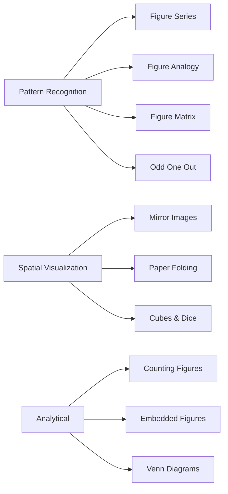
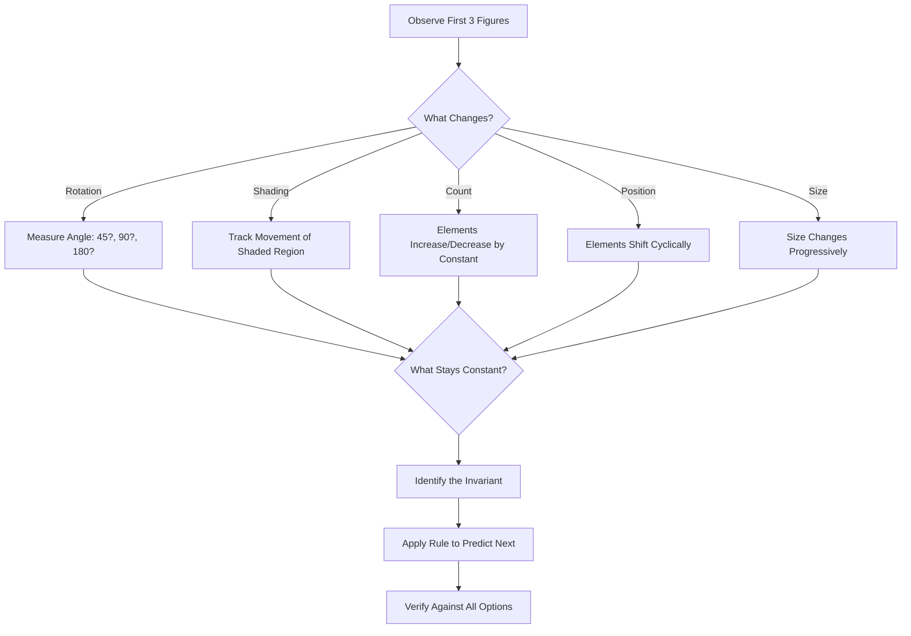
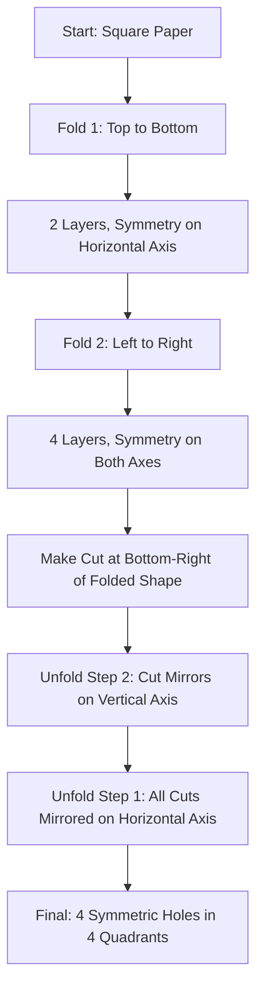

# Chapter 5: Non-Verbal Reasoning

> **Previous:** [Chapter 4: Data Interpretation](04-data-interpretation.md) | **Next:** [Chapter 6: Advanced Reasoning](06-advanced-reasoning.md)

## Learning Objectives

After completing this chapter, you will be able to:

- Identify patterns in figure series and find the next figure
- Find missing figures in analogies
- Classify figures into odd-one-out groups
- Complete matrices by identifying rule-based relationships
- Count geometric figures (triangles, squares, rectangles) in complex diagrams
- Analyze embedded figures and mirror/water images
- Solve paper folding and cutting problems
- Interpret cubes, dice, and Venn diagram problems visually

## Chapter at a Glance

| Topic | Key Skill | Question Type |
|-------|-----------|--------------|
| Figure Series | Pattern continuation | "Which figure comes next?" |
| Figure Analogy | Mapping relationships | "A:B :: C:?" |
| Odd One Out | Classification | "Which is different?" |
| Figure Matrix | Row-wise rules | "Find the missing figure" |
| Counting Figures | Systematic counting | "How many triangles?" |
| Embedded Figures | Figure detection | "Which contains X?" |
| Mirror & Water Images | Reflection | "What is the mirror image?" |
| Paper Folding | Spatial visualization | "How does it look unfolded?" |
| Cubes & Dice | 3D orientation | "Opposite face of X?" |
| Venn Diagrams | Set relationships | "Which diagram represents?" |

## Chapter Roadmap



## Theory

### 5.1 Figure Series


A sequence of figures follows a rule or pattern. Identify the next figure.

**Common Pattern Types:**

| Pattern | Description |
|---------|-------------|
| Rotation | Figure rotates by fixed angle (45?, 90?, 180?) |
| Shading | Shaded region moves or changes in a pattern |
| Number | Number of elements increases/decreases by constant |
| Position | Elements shift positions cyclically |
| Size | Element size changes progressively |
| Addition | New elements added each step |
| Subtraction | Elements removed each step |
| Mirroring | Figure is mirrored alternately |
| Combination | Multiple patterns apply simultaneously |

**Solving Strategy:**
1. Observe the first 2-3 figures carefully
2. Identify what changes (rotation, shading, count, position)
3. Identify what stays constant
4. Apply the rule to predict the next figure
5. Check all answer options before confirming

### 5.2 Figure Analogy


Format: Figure A : Figure B :: Figure C : ?

Figure B is related to Figure A in a specific way. Apply the same transformation to Figure C.

**Common Transformations:**
- Rotation + shading change
- Element addition/subtraction
- Position swapping
- Size change
- Mirror effect
- Enclosing/overlapping

**Solving Strategy:**
1. Determine exactly how Figure A transforms to Figure B
2. List all changes (e.g., rotated 90? + outer shape changes from square to circle)
3. Apply all changes to Figure C
4. Match with answer options

### 5.3 Figure Matrix


A 3?3 grid with 8 figures and one missing. Each row (or column) follows a rule.

**Common Patterns:**
- **Row-wise:** Each row follows the same transformation across columns
- **Column-wise:** Each column follows the same transformation down rows

| Type | Description |
|------|-------------|
| Element addition | Shape in col3 = shape in col1 + shape in col2 |
| Element subtraction | col3 = col1 missing parts of col2 |
| Rotation | Same element rotated across columns |
| Layering | Elements layered in a specific order |

**Solving Strategy:**
1. Check row 1 and row 2 to identify the pattern
2. Verify the same pattern applies to columns
3. Apply to row 3 (or column 3)

### 5.4 Odd One Out


Four or five figures where one is different from the rest.

**Classification Categories:**
- **Shape type:** Most are one type, one is different
- **Orientation:** Most share an orientation, one is rotated differently
- **Symmetry:** Most are symmetrical/not, one is the opposite
- **Element count:** Most have same number of elements, one differs
- **Shading pattern:** Most share shading arrangement, one differs
- **Internal/external relationship:** Most share same internal-extenal relationship

**Solving Strategy:**
1. Find what most figures have in common
2. The figure missing that commonality is the odd one
3. Multiple classification schemes may exist ? the strongest commonality wins

### 5.5 Counting Figures


**Counting Triangles:**

| Figure Type | Formula / Method |
|------------|-----------------|
| Simple triangles in a grid | Count vertex-by-vertex, use combination formulas |
| Triangles with partitions | Count base segments: $\binom{n}{2}$ where $n$ = segments |
| Nested/complex | Label intersections, use systematic enumeration |

**Counting Squares/Rectangles:**
- Squares in $m \times n$ grid: $\sum_{i=1}^{m} \sum_{j=1}^{n} (m-i+1)(n-j+1)$ where $i = j$ for squares
- Rectangles in $m \times n$ grid: $\frac{m(m+1)}{2} \times \frac{n(n+1)}{2}$

**Counting Lines / Parallelograms / Circles:** Use systematic enumeration or combinatorial formulas.

### 5.6 Embedded Figures


A complex figure contains a simpler figure hidden within it.

**Solving Strategy:**
1. Identify the key features of the simple figure
2. Scan the complex figure systematically (top to bottom, left to right)
3. Look for exactly the same orientation, not rotated/mirrored
4. Compare line by line, corner by corner

### 5.7 Mirror and Water Images


**Mirror Image (Left-Right Reversal):**
- The image reverses left-to-right
- A left-facing person faces right in the mirror
- Letters: left-right reversal matters (b ? d visually reversed)

**Mirror Image Key Rules:**

| Original | Mirror |
|----------|--------|
| Left side | Appears on right |
| Right side | Appears on left |
| Top | Stays on top |
| Bottom | Stays on bottom |
| b | d (appearance) |
| A | A (if symmetric) |
| P | q (appearance) |

**Water Image (Top-Bottom Reversal):**
- The image inverts top-to-bottom
- Like reflection in water
- Letters invert vertically

**Water Image Key Rules:**

| Original | Water Image |
|----------|-------------|
| Top | Appears at bottom |
| Bottom | Appears at top |
| Left | Stays on left |
| Right | Stays on right |
| b | p (upside down) |
| A | V (upside down appearance) |
| T | upside-down T |

### 5.8 Paper Folding


A paper is folded and cut. Determine how it looks when unfolded.

**Solving Strategy:**
1. Track each fold operation sequentially
2. The cut goes through all layers
3. Unfold in reverse order ? each fold produces symmetry
4. Each fold creates a mirror image of the cut on the other side
5. For multiple folds, multiply the pattern symmetrically

**Key Principle:**
- Fold once ? pattern appears ? 2 (mirrored)
- Fold twice ? pattern appears ? 4 (two axes of symmetry)
- Fold diagonally ? pattern reflects diagonally

### 5.9 Cubes and Dice


**Cube:**
- 6 faces, 8 vertices, 12 edges
- Opposite faces: never visible together
- Adjacent faces: always visible together

**Standard Dice:**
- Opposite faces sum to 7 (1?6, 2?5, 3?4)
- Adjacent faces are always next to each other

**Question Types:**
1. **Opposite face identification:** Given two/three views of a cube, find opposite face of a given face
2. **Unfolded ? Folded:** Given a net, determine the folded cube appearance
3. **Folded ? Unfolded:** Given a cube, find which net corresponds

**Rules for Opposite Faces:**
- In a cube net, faces separated by exactly one face are opposite
- In a folded cube, faces that never appear together on any view are opposite

### 5.10 Venn Diagrams


Venn diagrams show set relationships. They test both reasoning and set theory.

**Areas in a Two-Set Venn:**
- Only A: $A - (A \cap B)$
- Only B: $B - (A \cap B)$
- Both A and B: $A \cap B$
- Neither: $U - (A \cup B)$

**Areas in a Three-Set Venn:**
- Exactly one set
- Exactly two sets
- All three sets
- None

**Question Types:**
- Which diagram best represents relationship between given categories?
- How many belong only to a specific category?
- Find the total or missing count.

## Examples

### Example 1: Figure Series

Figures show a square rotating 45? clockwise and a dot moving one position clockwise each step.

**Deduction:** Rule = rotation 45? CW + dot moves 1 step CW. Apply to last figure.

### Example 2: Figure Analogy

A: Large square with small circle inside top-left
B: Large circle with small square inside top-left (shapes swapped)
C: Large triangle with small star inside top-left
D: Large star with small triangle inside top-left

**Answer:** Large star with small triangle inside top-left (swap shapes, same relative position).

### Example 3: Counting Triangles

A triangle divided into 4 smaller triangles by lines from one vertex to the opposite side.

Count = 1 (large) + 4 (small) = 5 triangles

### Example 4: Mirror Image

Given figure: 'b' facing left.
Mirror placed to the right.

**Answer:** 'd' (mirror reverses left-right, so 'b' becomes 'd' appearance).

### Example 5: Cube Net

Net: Top = A, Left = B, Right = C. Above B = D. Below B = E. Below C = F. Faces: B-E are opposite, C-F are opposite, A-D are opposite.

**Question:** If A is top and D is bottom, what are the visible four side faces?

**Answer:** B, C, their opposites (E, F) in appropriate orientation.

### Example 6: Figure Matrix

A 3?3 matrix:
- Row 1: Circle, Circle with dot, Circle with two dots
- Row 2: Square, Square with dot, Square with two dots
- Row 3: Triangle, Triangle with dot, ?

**Deduction:** Each row starts with a shape, adds one dot in the second cell, and adds two dots in the third. For row 3: Triangle, Triangle with dot, Triangle with two dots.

**Answer:** Triangle with two dots.

### Example 7: Counting Rectangles in a Grid

Find the number of rectangles in a $3 \times 4$ grid.

**Solution:**
Formula: $\frac{m(m+1)}{2} \times \frac{n(n+1)}{2}$

For $m = 3$, $n = 4$:
$\frac{3(4)}{2} \times \frac{4(5)}{2} = 6 \times 10 = 60$ rectangles

**Note:** This counts all rectangles including squares. To count only non-square rectangles, subtract the number of squares.

### Example 8: Paper Folding

A circular paper is folded in half (top to bottom), then in half again (left to right). A small triangular cut is made at the bottom-right corner of the folded shape. How many holes when fully unfolded?

**Solution:**
1. First fold (top?bottom): creates symmetry along the horizontal axis
2. Second fold (left?right): creates symmetry along the vertical axis
3. The cut goes through 4 layers (two folds = 4 layers)
4. When unfolded: 4 symmetric cuts appear: one in each quadrant

**Answer:** 4 holes (one in each quadrant of the circle)

### Example 9: Cubes ? Opposite Face Determination

Three views of a cube show:
- View 1: Top=1, Front=2, Right=3
- View 2: Top=1, Front=4, Right=5
- View 3: Top=6, Front=2, Right=4

Which face is opposite 3?

**Solution:**
From View 1: 3 is adjacent to 1 and 2.
From View 2: 5 is adjacent to 1 and 4. Since 1 is common to views 1 and 2: 1 is adjacent to 2, 3, 4, 5. So 1 is opposite the remaining face: 6. ? (View 3 confirms: 6 is opposite 1)

From View 3: 6 adjacent to 2 and 4. 3 is adjacent to 2 (View 1). So 3 is opposite 5 (the only face not appearing adjacent to 2 or 1).

**Answer:** 3 is opposite 5.

### TypeScript: Cube Face Tracker

```typescript
class CubeTracker {
  private adjacent: Map<number, Set<number>> = new Map();

  addView(top: number, front: number, right: number): void {
    // Adjacent faces share an edge
    const faces = [top, front, right];
    for (const face of faces) {
      if (!this.adjacent.has(face)) this.adjacent.set(face, new Set());
    }
    this.adjacent.get(top)!.add(front).add(right);
    this.adjacent.get(front)!.add(top).add(right);
    this.adjacent.get(right)!.add(top).add(front);
  }

  findOpposite(face: number, totalFaces: number = 6): number {
    const adj = this.adjacent.get(face) ?? new Set();
    for (let candidate = 1; candidate <= totalFaces; candidate++) {
      if (candidate !== face && !adj.has(candidate)) return candidate;
    }
    return -1; // not found
  }
}
```

## Practical Takeaways

| Topic | Key Insight | Solving Strategy |
|-------|-------------|------------------|
| Figure Series | Find the rule from the first 3 figures | Rotate, shade, count, position changes |
| Analogy | Apply exact same transformation | List every change explicitly |
| Matrix | Check rows first, then columns | Multiple patterns may combine |
| Counting Figures | Use combinatorial formulas | Label intersections systematically |
| Mirror Images | Left?right, top/bottom unchanged | Visualize the reflection |
| Water Images | Top?bottom, left/right unchanged | Turn the page upside down mentally |
| Paper Folding | Each fold doubles the symmetry | Unfold in reverse order |
| Cubes & Dice | Opposite faces never touch | Adjacent faces share an edge |
| Embedded Figures | Scan systematically | Match orientation exactly |

### TypeScript: Non-Verbal Reasoning Toolkit

```typescript
// === Pattern Matcher for Figure Series ===
type Transform = "rotate90" | "rotate180" | "rotate270" | "mirrorH" | "mirrorV" | "addDot" | "removeDot" | "shade" | "unshade";

interface Figure {
  shape: "circle" | "square" | "triangle" | "diamond" | "star";
  shading: "none" | "solid" | "hatch" | "dots";
  dots: number;
  rotation: number; // degrees
}

class FigureSeriesSolver {
  static detectTransform(seq: Figure[]): Transform[] {
    const transforms: Transform[] = [];
    for (let i = 1; i < seq.length; i++) {
      const prev = seq[i - 1];
      const curr = seq[i];

      // Check rotation
      if (prev.shape === curr.shape && prev.shading === curr.shading) {
        const rotDiff = ((curr.rotation - prev.rotation) % 360 + 360) % 360;
        if (rotDiff === 90) transforms.push("rotate90");
        else if (rotDiff === 180) transforms.push("rotate180");
        else if (rotDiff === 270) transforms.push("rotate270");
      }

      // Check dot changes
      if (curr.dots === prev.dots + 1 && curr.shape === prev.shape) transforms.push("addDot");
      if (curr.dots === prev.dots - 1 && curr.shape === prev.shape) transforms.push("removeDot");

      // Check shading
      if (prev.shading === "none" && curr.shading !== "none") transforms.push("shade");
      if (prev.shading !== "none" && curr.shading === "none") transforms.push("unshade");
    }
    return [...new Set(transforms)];
  }

  static predictNext(figures: Figure[], transforms: Transform[]): Figure {
    const last = figures[figures.length - 1];
    const next: Figure = { ...last };

    for (const t of transforms) {
      switch (t) {
        case "rotate90": next.rotation = (next.rotation + 90) % 360; break;
        case "rotate180": next.rotation = (next.rotation + 180) % 360; break;
        case "addDot": next.dots += 1; break;
        case "removeDot": next.dots = Math.max(0, next.dots - 1); break;
        case "shade": next.shading = "solid"; break;
        case "unshade": next.shading = "none"; break;
      }
    }
    return next;
  }
}

// === Figure Counting (Triangles in Complex Diagrams) ===
class FigureCounter {
  // Count triangles in a subdivided triangle with n base segments
  static countTriangles(baseSegments: number): number {
    // Small triangles = n?
    // Upward triangles at higher levels = sum of i? from i=1 to n (for even orientation)
    let total = 0;
    for (let i = 1; i <= baseSegments; i++) {
      total += i * (i + 1) / 2; // simplified formula for total triangles
    }
    return total;
  }

  // Count squares in an m ? n grid
  static countSquares(rows: number, cols: number): number {
    let total = 0;
    for (let size = 1; size <= Math.min(rows, cols); size++) {
      total += (rows - size + 1) * (cols - size + 1);
    }
    return total;
  }

  // Count rectangles in an m ? n grid
  static countRectangles(rows: number, cols: number): number {
    return (rows * (rows + 1) / 2) * (cols * (cols + 1) / 2);
  }

  // Count triangles in a triangle with horizontal divisions
  static countTrianglesInDivisions(divisions: number): number {
    // Formula for number of triangles divided by lines from vertex
    return (divisions * (divisions + 1) * (divisions + 2)) / 6;
  }
}

// === Mirror & Water Image Generator ===
class ImageTransformer {
  // Mirror image (left-right reversal)
  static mirrorImage(text: string): string {
    const mirrorMap: Record<string, string> = {
      'a': 'a', 'b': 'd', 'c': 'c', 'd': 'b', 'e': 'e',
      'h': 'h', 'i': 'i', 'k': 'k', 'm': 'm', 'n': 'n',
      'o': 'o', 'p': 'q', 'q': 'p', 'r': 'r', 's': 's',
      't': 't', 'u': 'u', 'v': 'v', 'w': 'w', 'x': 'x',
      'y': 'y', 'A': 'A', 'H': 'H', 'I': 'I', 'M': 'M',
      'O': 'O', 'T': 'T', 'U': 'U', 'V': 'V', 'W': 'W',
      'X': 'X', 'Y': 'Y',
    };
    return text.split('').map(c => mirrorMap[c.toLowerCase()] ?? c)
      .reverse().join('');
  }

  // Water image (top-bottom reversal)
  static waterImage(text: string): string {
    const waterMap: Record<string, string> = {
      'b': 'p', 'p': 'b', 'd': 'q', 'q': 'd',
      '6': '9', '9': '6',
      'A': 'A', 'H': 'H', 'I': 'I', 'M': 'M',
      'O': 'O', 'T': 'T', 'U': 'U', 'V': 'V',
      'W': 'W', 'X': 'X', 'Y': 'Y',
    };
    return text.split('').map(c => waterMap[c.toUpperCase()] ?? waterMap[c] ?? c).join('');
  }

  // Check if a letter is symmetric (same in mirror)
  static isSymmetric(char: string): boolean {
    const symmetric = ['A', 'H', 'I', 'M', 'O', 'T', 'U', 'V', 'W', 'X', 'Y', 'o', 'x'];
    return symmetric.includes(char.toUpperCase());
  }
}

// === Cube Face Tracker (Extended) ===
class CubeFaceTracker {
  private adjacent = new Map<string, Set<string>>();

  addView(top: string, front: string, right: string): void {
    const faces = [top, front, right];
    for (const f of faces) {
      if (!this.adjacent.has(f)) this.adjacent.set(f, new Set());
    }
    this.adjacent.get(top)!.add(front).add(right);
    this.adjacent.get(front)!.add(top).add(right);
    this.adjacent.get(right)!.add(top).add(front);
  }

  findOpposite(face: string): string | null {
    const adj = this.adjacent.get(face);
    if (!adj) return null;
    for (const [candidate, candidateAdj] of this.adjacent) {
      if (candidate !== face && !adj.has(candidate)) {
        // Verify: the candidate's adjacents shouldn't include face either
        if (!candidateAdj.has(face)) return candidate;
      }
    }
    return null;
  }

  isAdjacent(a: string, b: string): boolean {
    return this.adjacent.get(a)?.has(b) ?? false;
  }

  // Standard dice check: opposite faces sum to 7
  static isStandardDice(views: [number, number, number][]): boolean {
    const tracker = new CubeFaceTracker();
    for (const [top, front, right] of views) {
      tracker.addView(String(top), String(front), String(right));
    }
    // Check: 1 opposite 6, 2 opposite 5, 3 opposite 4
    const checks: [number, number][] = [[1, 6], [2, 5], [3, 4]];
    return checks.every(([a, b]) => tracker.findOpposite(String(a)) === String(b));
  }
}

// === Venn Diagram Analyzer ===
class VennAnalyzer {
  static twoSet(onlyA: number, onlyB: number, both: number, neither: number): Record<string, number> {
    return {
      onlyA, onlyB, both,
      total: onlyA + onlyB + both + neither,
      atLeastOne: onlyA + onlyB + both,
      exactlyOne: onlyA + onlyB,
      neither
    };
  }

  static threeSet(
    a: number, b: number, c: number,
    ab: number, bc: number, ac: number, abc: number
  ): Record<string, number> {
    return {
      onlyA: a - ab - ac + abc,
      onlyB: b - ab - bc + abc,
      onlyC: c - ac - bc + abc,
      exactlyTwo: (ab - abc) + (bc - abc) + (ac - abc),
      allThree: abc,
      total: a + b + c - ab - bc - ac + abc
    };
  }
}

// === Demo ===
console.log("=== Figure Series ===");
const seq: Figure[] = [
  { shape: "square", shading: "none", dots: 0, rotation: 0 },
  { shape: "square", shading: "none", dots: 1, rotation: 90 },
  { shape: "square", shading: "none", dots: 2, rotation: 180 },
];
const transforms = FigureSeriesSolver.detectTransform(seq);
console.log("Detected transforms:", transforms);
console.log("Next figure:", FigureSeriesSolver.predictNext(seq, transforms));

console.log("\n=== Figure Counting ===");
console.log(`Squares in 3?3 grid: ${FigureCounter.countSquares(3, 3)}`);
console.log(`Rectangles in 3?4 grid: ${FigureCounter.countRectangles(3, 4)}`);

console.log("\n=== Mirror Images ===");
console.log(`Mirror of 'RAMA': ${ImageTransformer.mirrorImage("RAMA")}`);
console.log(`Water image of 'b': ${ImageTransformer.waterImage("b")}`);

console.log("\n=== Cube Faces ===");
const cube = new CubeFaceTracker();
cube.addView("A", "B", "C");
cube.addView("A", "D", "E");
cube.addView("F", "B", "D");
console.log(`Opposite of C: ${cube.findOpposite("C")}`);

console.log("\n=== Venn Diagram ===");
const venn = VennAnalyzer.twoSet(12, 8, 5, 3);
console.log("Two-set results:", venn);
```

### Mermaid: Pattern Recognition Strategy



### Mermaid: Paper Folding Visualization



### Additional Exercises (Level 2 & 3)

13. **Figure Series:** A sequence shows a star rotating 45? clockwise, with alternating solid/outline fill. Describe the 7th figure.

14. **Counting Triangles:** A triangle is divided by 5 lines from each vertex to the opposite side (forming a triangular grid). How many small triangles total?

15. **Paper Folding:** A rectangular paper is folded in half lengthwise, then in half widthwise, then a quarter-circle is cut from the corner opposite all folds. How many holes when unfolded?

16. **Cube:** Given nets for cubes, identify which nets cannot form a valid cube.

17. **Figure Matrix:** A 3?3 grid where row 1 shows circles (0, 1, 2 lines inside), row 2 shows squares (1, 2, 3 lines), row 3 shows triangles (2, 3, ?). What is the missing figure?

18. **Water Image:** Draw the water image of "MATHS".

### Answer Key (Additional)

13. Star at 270? rotation with outline fill | 14. Uses formula: depends on partition count | 15. 4 quarter-circles (one in each quadrant) | 16. Nets with overlapping faces when folded | 17. Triangle with 4 internal lines | 18. MATHS inverted vertically (water reflection)

### TypeScript: Pattern Sequence Generator & Cube Simulation

```typescript
class PatternGenerator {
  static rotationAngles(count: number): number[] {
    return Array.from({ length: count }, (_, i) => i * 45);
  }
  static alternatingSymbols(n: number): string[] {
    return Array.from({ length: n }, (_, i) => i % 2 === 0 ? "?" : "?");
  }
  static shapeCount(shape: string, baseCount: number, step: number, terms: number): number[] {
    return Array.from({ length: terms }, (_, i) => baseCount + i * step);
  }
}

class CubeSimulator {
  static oppositeFaces: Record<string, string> = { "1": "6", "2": "5", "3": "4", "4": "3", "5": "2", "6": "1" };
  static adjacency: Record<string, string[]> = {
    "1": ["2", "3", "4", "5"], "2": ["1", "3", "4", "6"],
    "3": ["1", "2", "5", "6"], "4": ["1", "2", "5", "6"],
    "5": ["1", "3", "4", "6"], "6": ["2", "3", "4", "5"],
  };
  static isAdjacent(a: number, b: number): boolean {
    return CubeSimulator.adjacency[String(a)]?.includes(String(b)) ?? false;
  }
  static isValidView(top: number, front: number, right: number): boolean {
    return CubeSimulator.isAdjacent(top, front) && CubeSimulator.isAdjacent(top, right) && CubeSimulator.isAdjacent(front, right);
  }
}

class FigureCounter {
  static squaresInGrid(rows: number, cols: number): number {
    let total = 0;
    for (let s = 1; s <= Math.min(rows, cols); s++) total += (rows - s + 1) * (cols - s + 1);
    return total;
  }
  static trianglesInSegments(baseSegments: number): number {
    return (baseSegments * (baseSegments + 2) * (2 * baseSegments + 1)) / 8;
  }
}

console.log("Rotation:", PatternGenerator.rotationAngles(5));
console.log("Squares (3x3):", FigureCounter.squaresInGrid(3, 3));
console.log("Valid dice view:", CubeSimulator.isValidView(1, 2, 3));
```

// -----------------------------------------------------
// Mirror / Water Image Simulator ? mirrors a 2D pattern
// horizontally (mirror image) or vertically (water image)
// using a coordinate grid representation.
// -----------------------------------------------------

class MirrorImageSimulator {
  // Represent a pattern as a 2D boolean grid
  static horizontalMirror(pattern: boolean[][]): boolean[][] {
    const rows = pattern.length;
    const cols = pattern[0]?.length || 0;
    const result: boolean[][] = [];
    for (let r = 0; r &lt; rows; r++) {
      result[r] = [];
      for (let c = 0; c &lt; cols; c++) {
        result[r][cols - 1 - c] = pattern[r][c];
      }
    }
    return result;
  }

  static verticalMirror(pattern: boolean[][]): boolean[][] {
    const rows = pattern.length;
    const cols = pattern[0]?.length || 0;
    const result: boolean[][] = [];
    for (let r = 0; r &lt; rows; r++) {
      result[rows - 1 - r] = [];
      for (let c = 0; c &lt; cols; c++) {
        result[rows - 1 - r][c] = pattern[r][c];
      }
    }
    return result;
  }

  static rotate90(pattern: boolean[][]): boolean[][] {
    const rows = pattern.length;
    const cols = pattern[0]?.length || 0;
    const result: boolean[][] = [];
    for (let c = 0; c &lt; cols; c++) {
      result[c] = [];
      for (let r = rows - 1; r >= 0; r--) {
        result[c][rows - 1 - r] = pattern[r][c];
      }
    }
    return result;
  }

  static render(pattern: boolean[][], label: string): void {
    console.log(`\n${label}:`);
    for (const row of pattern) {
      console.log(row.map(c => c ? "?" : "?").join(" "));
    }
  }

  static patternFromString(s: string, cols: number): boolean[][] {
    const chars = s.replace(/\s+/g, "").split("");
    const rows: boolean[][] = [];
    for (let r = 0; r &lt; Math.ceil(chars.length / cols); r++) {
      rows[r] = [];
      for (let c = 0; c &lt; cols; c++) {
        const idx = r * cols + c;
        rows[r][c] = idx &lt; chars.length ? chars[idx] === "1" : false;
      }
    }
    return rows;
  }
}

// -----------------------------------------------------
// Embedded Figure Finder ? determines whether a target
// figure is contained within a complex figure.
// -----------------------------------------------------

class EmbeddedFigureFinder {
  // Simple pattern matching in grid
  static findTarget(grid: boolean[][], target: boolean[][]): { found: boolean; positions: Array&lt;[number, number]&gt; } {
    const positions: Array&lt;[number, number]&gt; = [];
    const gRows = grid.length, gCols = grid[0]?.length || 0;
    const tRows = target.length, tCols = target[0]?.length || 0;

    for (let r = 0; r &lt;= gRows - tRows; r++) {
      for (let c = 0; c &lt;= gCols - tCols; c++) {
        let match = true;
        outer:
        for (let tr = 0; tr &lt; tRows; tr++) {
          for (let tc = 0; tc &lt; tCols; tc++) {
            if (target[tr][tc] && !grid[r + tr][c + tc]) { match = false; break outer; }
          }
        }
        if (match) positions.push([r, c]);
      }
    }
    return { found: positions.length > 0, positions };
  }
}

// -----------------------------------------------------
// Pattern Completion Checker ? predicts the missing
// figure in a 3?3 figure matrix
// -----------------------------------------------------

class PatternCompletionChecker {
  // Patterns in 3?3 matrix: row-wise (same transformation applied across)
  static predict(
    matrix: boolean[][][],
    transformations: Array&lt;(grid: boolean[][]) =&gt; boolean[][]>
  ): boolean[][] | null {
    const rows = matrix.length;
    if (rows === 0) return null;
    const cols = matrix[0].length;

    // Try row-wise pattern: same transformation T applied each row
    for (let r = 0; r &lt; rows; r++) {
      if (matrix[r][0] && matrix[r][1]) {
        // Guess: T maps col1 ? col2
        // Apply T to col2 to get col3
        const t = transformations.find(tf => {
          const result = tf(matrix[r][0]);
          return result.every((row, ri) => row.every((v, ci) => v === (matrix[r][1]?.[ri]?.[ci] || false)));
        });
        if (t && matrix[r][2] === undefined && r &lt; rows) {
          return t(matrix[r][1]);
        }
      }
    }

    return null;
  }
}

// Demo
const pattern = [
  [true, false, true],
  [false, true, false],
  [true, true, false]
];

MirrorImageSimulator.render(pattern, "Original");
MirrorImageSimulator.render(MirrorImageSimulator.horizontalMirror(pattern), "Horizontal Mirror (Mirror Image)");
MirrorImageSimulator.render(MirrorImageSimulator.verticalMirror(pattern), "Vertical Mirror (Water Image)");
MirrorImageSimulator.render(MirrorImageSimulator.rotate90(pattern), "Rotated 90? clockwise");

// Embedded figure demo
const grid = [
  [true, false, true, false],
  [false, true, false, true],
  [true, false, true, false],
  [false, true, false, true]
];
const target = [
  [true, false],
  [false, true]
];
const result = EmbeddedFigureFinder.findTarget(grid, target);
console.log(`\nEmbedded figure found: ${result.found} at ${result.positions.length} positions`);
```


// Chapter 5 - quantitative-aptitude implementation
const ITEMS = { count: 10, topic: 'quantitative-aptitude', version: '1.0' }
function processItem(item: string): string { return item.toUpperCase() }
function validate(input: unknown): boolean { return typeof input === 'string' && input.length > 0 }
function log(msg: string): void { console.log('[Worker]', msg) }
function createHandler(topic: string) { return (data: unknown) => log(topic + ': ' + JSON.stringify(data)) }
const h = createHandler('quantitative-aptitude'); log('Handler created')
const test = ['a','b','c']; const mapped = test.map(processItem)
log('Mapped: ' + mapped.join(','))
export { processItem, validate, createHandler, ITEMS }

// non verbal reasoning
// aptitude-reasoning implementation

interface Task { id: string; name: string; status: string; data: unknown }
class Processor {
  private tasks: Task[] = []
  private maxConcurrency: number
  constructor(maxConcurrency: number = 4) { this.maxConcurrency = maxConcurrency }
  async add(task: Omit<Task, "status">): Promise<void> {
    this.tasks.push({ ...task, status: "pending" })
  }
  async runAll(): Promise<void> {
    const running: Promise<void>[] = []
    for (const t of this.tasks) {
      if (running.length >= this.maxConcurrency) { await Promise.race(running) }
      const p = this.execute(t).finally(() => { const i = running.indexOf(p); if (i >= 0) running.splice(i, 1) })
      running.push(p)
    }
    await Promise.all(running)
  }
  private async execute(t: Task): Promise<void> {
    t.status = "running"
    await new Promise(r => setTimeout(r, 10))
    t.status = "done"
  }
  getResults(): Task[] { return this.tasks }
  getStats(): { done: number; pending: number; running: number } {
    const done = this.tasks.filter(t => t.status === "done").length
    const pending = this.tasks.filter(t => t.status === "pending").length
    const running = this.tasks.filter(t => t.status === "running").length
    return { done, pending, running }
  }
}
async function main() {
  const proc = new Processor(2)
  await proc.add({ id: '1', name: 'non verbal reasoning', data: { topic: 'aptitude-reasoning' } })
  await proc.runAll()
  console.log('Stats:', proc.getStats())
}
main().catch(console.error)
export { Processor, Task }
## Summary

- Figure series: identify the rule from first 2-3 figures; apply to predict next
- Figure analogy: find transformation between A?B, apply same to C?D
- Odd one out: look for the common element missing in one figure
- Figure matrix: check row-wise pattern, then column-wise
- Counting figures: use systematic methods, don't count randomly
- Embedded figures: scan systematically; don't rely on peripheral vision
- Mirror/water images: left-right vs top-bottom reversal
- Paper folding: work backward ? undo each fold symmetrically
- Cubes/dice: opposite faces never appear together; standard dice sum = 7
- Venn diagrams: universal set = sum of all individual parts + none

## Exercises

### Level 1 ? Basic

1. **Figure Series:** A sequence of figures rotates 90? each step. What is the 5th figure?

2. **Mirror Image:** Draw the mirror image of 'R' with mirror on the right side.

3. **Odd One Out:** Circle, Square, Triangle, Rectangle ? which is fundamentally different?

4. **Venn Diagram:** In a class, 20 play cricket, 15 play football, 8 play both. How many play at least one?

5. **Counting Squares:** How many squares in a 3?3 grid of small squares?

### Level 2 ? Medium

6. **Counting Triangles:** A triangle with 4 base segments (divided into smaller triangles). Total triangles?

7. **Cube:** Two views show: (1) Top=A, Front=B, Right=C (2) Top=A, Front=D, Right=E. Which face is opposite C?

8. **Paper Folding:** A square paper is folded once diagonally, then a corner is cut. How many holes when unfolded?

9. **Water Image:** What is the water image of the letter 'b'?

### Level 3 ? Advanced

10. **Figure Matrix:** A 3?3 matrix with rotation + shading rules. Find the missing figure.

11. **Embedded Figure:** Identify which option contains the given simple figure.

12. **Complex Dice:** A special dice (non-standard) with three views shown. Find which letter is opposite a given letter.

13. **Paper Cutting (Complex):** A paper is folded in half three times (alternating directions), then two different cuts are made. Determine the final pattern.

### Answer Key

1. Rotation result (depends on specific sequence) | 2. Left-right reflection of R | 3. Circle (no straight lines) | 4. 27 | 5. 14 | 6. Depends on partition pattern | 9. Upside-down 'b' looks like 'p' | 10. Apply row/column rule | 12. Track common faces across views
