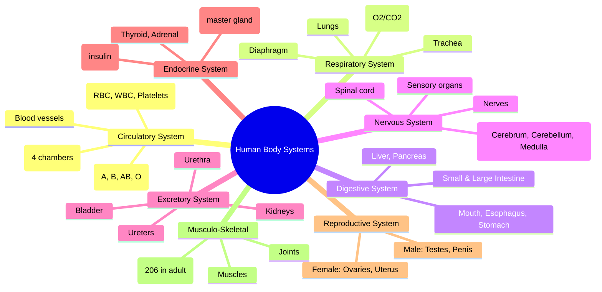

# Chapter 5: General Science & Technology

## Learning Objectives

By the end of this chapter, you will be able to:

<!-- Image Gallery -->
<section class="lesson-visuals" aria-label="Visual learning resources">
  <header><span>VISUAL LEARNING</span><h2>See it. Review it. Remember it.</h2></header>
  <a class="lesson-visual-card" href="../../assets/images/lessons/general-awareness/05-general-science/handwritten-notes.png" target="_blank" rel="noopener">
    
    <span><strong>Handwritten notes</strong>Condensed notes for deliberate review.</span>
  </a>
  <a class="lesson-visual-card" href="../../assets/images/lessons/general-awareness/05-general-science/sticky-notes.png" target="_blank" rel="noopener">
    
    <span><strong>Sticky-note revision</strong>Fast recall prompts for revision.</span>
  </a>
  <a class="lesson-visual-card" href="../../assets/images/lessons/general-awareness/05-general-science/visual-explanation.png" target="_blank" rel="noopener">
    
    <span><strong>Visual concept guide</strong>A connected explanation of the key ideas.</span>
  </a>
</section>
<!-- End Image Gallery -->

- Recall fundamental concepts in Physics: laws of motion, gravitation, thermodynamics, optics, nuclear physics
- Explain basic Chemistry: atomic structure, chemical bonding, organic compounds, polymers
- Describe the human body systems, nutrition, diseases, and vitamins
- Trace ISRO's major missions — Chandrayaan, Mangalyaan, Gaganyaan, Aditya-L1
- Identify India's defence systems, DRDO achievements, and nuclear programme
- Understand emerging technologies — AI, Blockchain, Cybersecurity, 5G/6G, Quantum Computing
- Solve exam-level MCQs on General Science and Technology

---

## Theory

### 5.1 Physics

#### 5.1.1 Laws of Motion (Newton)

| Law | Statement | Application |
|-----|-----------|-------------|
| First Law (Law of Inertia) | An object at rest stays at rest; an object in motion stays in motion unless acted upon by an external force | Car suddenly stopping — passengers lurch forward |
| Second Law (F = ma) | Force = mass × acceleration; the rate of change of momentum is proportional to applied force | Cricket fielder pulls hands back to reduce impact force |
| Third Law (Action-Reaction) | For every action, there is an equal and opposite reaction | Rocket propulsion, walking |

**Other Important Physics Concepts:**
- **Gravitation:** G = 6.67 × 10⁻¹¹ N·m²/kg²; g = 9.8 m/s² (acceleration due to gravity)
- **Escape Velocity (Earth):** 11.2 km/s (minimum speed to escape Earth's gravity)
- **Orbital Velocity:** ~7.8 km/s (speed required to orbit Earth in LEO)
- **Sound:** Speed in air = 343 m/s at 20°C; cannot travel in vacuum
- **Light:** Speed = 3 × 10⁸ m/s in vacuum; travels fastest in vacuum, slowest in diamond
- **Electromagnetic Spectrum:** Radio → Micro → IR → Visible → UV → X-ray → Gamma (increasing frequency/decreasing wavelength)

#### 5.1.2 Thermodynamics

| Law | Statement |
|-----|-----------|
| Zeroth Law | If two systems are in thermal equilibrium with a third, they are in equilibrium with each other |
| First Law | Energy cannot be created or destroyed (conservation of energy) |
| Second Law | Entropy of an isolated system always increases; heat cannot flow from cold to hot spontaneously |
| Third Law | As temperature approaches absolute zero (0 K), entropy approaches minimum |

#### 5.1.3 Optics & Modern Physics

| Topic | Key Points |
|-------|------------|
| Reflection | Angle of incidence = angle of reflection; mirror types: plane, concave, convex |
| Refraction | Bending of light when passing from one medium to another; Snell's Law: n₁ sinθ₁ = n₂ sinθ₂ |
| Lenses | Convex (converging), Concave (diverging); used in telescopes, microscopes, spectacles |
| Dispersion | White light splits into 7 colours (VIBGYOR) through a prism |
| Nuclear Fission | Splitting of heavy nucleus (U-235) → energy released (Atom bomb, nuclear reactors) |
| Nuclear Fusion | Joining of light nuclei (H → He) → massive energy (Sun, Hydrogen bomb) |

### 5.2 Chemistry

#### 5.2.1 Atomic Structure

| Particle | Charge | Mass | Location |
|----------|--------|------|----------|
| Proton (p⁺) | +1.6 × 10⁻¹⁹ C | 1.672 × 10⁻²⁷ kg | Nucleus |
| Neutron (n⁰) | 0 | 1.675 × 10⁻²⁷ kg | Nucleus |
| Electron (e⁻) | -1.6 × 10⁻¹⁹ C | 9.109 × 10⁻³¹ kg | Orbitals |

**Key Concepts:**
- **Atomic Number (Z):** Number of protons in the nucleus
- **Mass Number (A):** Number of protons + neutrons
- **Isotopes:** Same atomic number, different mass number (e.g., C-12, C-13, C-14)
- **Isobars:** Different atomic numbers, same mass number
- **Isotones:** Same number of neutrons, different protons

#### 5.2.2 Chemical Bonding

| Bond Type | Formation | Example | Properties |
|-----------|-----------|---------|------------|
| Ionic | Electron transfer between metal and non-metal | NaCl, KCl | High melting point, soluble in water |
| Covalent | Electron sharing between non-metals | H₂O, CO₂, CH₄ | Low melting point, poor conductors |
| Metallic | Electron sea model | Fe, Cu, Al | Malleable, ductile, conductors |
| Hydrogen Bond | Hydrogen between electronegative atoms | H₂O → H₂O | Responsible for water's high boiling point |

**pH Scale:** 0–14; 7 = neutral (pure water); &lt;7 = acidic; &gt;7 = alkaline/basic

#### 5.2.3 Organic Chemistry Basics

| Compound | Formula | Uses |
|----------|---------|------|
| Methane | CH₄ | Natural gas, fuel |
| Ethanol | C₂H₅OH | Alcoholic beverages, fuel |
| Acetic Acid | CH₃COOH | Vinegar |
| Glucose | C₆H₁₂O₆ | Energy source in body |
| Sucrose | C₁₂H₂₂O₁₁ | Table sugar |
| PVC | (C₂H₃Cl)ₙ | Pipes, cables, flooring |

#### 5.2.4 Polymers & Materials

| Polymer | Type | Uses |
|---------|------|------|
| Polyethylene (PE) | Thermoplastic | Bags, bottles |
| Polyvinyl Chloride (PVC) | Thermoplastic | Pipes, cables |
| Nylon | Synthetic fibre | Fabrics, ropes |
| Teflon (PTFE) | Fluoropolymer | Non-stick coatings |
| Kevlar | Aramid fibre | Bullet-proof vests |

### 5.3 Biology

#### 5.3.1 Human Body Systems



**Key Organs & Functions:**

| Organ | System | Key Facts |
|-------|--------|-----------|
| Heart | Circulatory | 4 chambers: 2 atria + 2 ventricles; beats ~72 times/min |
| Lungs | Respiratory | Right lung has 3 lobes; left has 2 lobes |
| Liver | Digestive | Largest internal organ; produces bile; detoxifies blood |
| Brain | Nervous | 3 parts: Cerebrum (thinking), Cerebellum (coordination), Medulla (automatic) |
| Kidneys | Excretory | Filter blood; produce urine; ~2 million nephrons each |
| Pancreas | Endocrine & Digestive | Produces insulin & glucagon (regulate blood sugar) |
| Bones | Skeletal | 206 bones; smallest = stapes (middle ear); longest = femur |

#### 5.3.2 Diseases & Nutrition

| Disease | Caused By | Type | Affected Organ/System |
|---------|-----------|------|----------------------|
| Malaria | Plasmodium (mosquito) | Parasitic | Blood, liver |
| Dengue | Dengue virus (Aedes mosquito) | Viral | Blood, immune system |
| Tuberculosis (TB) | Mycobacterium tuberculosis | Bacterial | Lungs |
| HIV/AIDS | Human Immunodeficiency Virus | Viral | Immune system (CD4 T-cells) |
| Diabetes | Insulin deficiency/resistance | Metabolic | Pancreas, blood glucose |
| Anaemia | Iron deficiency / RBC deficiency | Nutritional | Blood |
| Cancer | Uncontrolled cell division | Genetic | Various organs |
| Hepatitis | Hepatitis virus (A, B, C, D, E) | Viral | Liver |

**Vitamins & Deficiencies:**

| Vitamin | Chemical Name | Source | Deficiency Disease |
|---------|--------------|--------|-------------------|
| Vitamin A | Retinol | Carrots, milk, eggs | Night blindness, xerophthalmia |
| Vitamin B1 | Thiamine | Rice, wheat, nuts | Beriberi |
| Vitamin B2 | Riboflavin | Milk, eggs | Cheilosis, glossitis |
| Vitamin B3 | Niacin | Meat, fish | Pellagra (4 Ds: dermatitis, diarrhoea, dementia, death) |
| Vitamin B12 | Cobalamin | Meat, fish, dairy | Pernicious anaemia |
| Vitamin C | Ascorbic acid | Citrus fruits | Scurvy (bleeding gums) |
| Vitamin D | Calciferol | Sunlight, fish oil | Rickets (children), Osteomalacia (adults) |
| Vitamin E | Tocopherol | Nuts, seeds | Mild anaemia |
| Vitamin K | Phylloquinone | Leafy greens | Bleeding disorders |

#### 5.3.3 Genetics & Biotechnology

| Term | Definition |
|------|------------|
| DNA | Deoxyribonucleic acid — double helix (Watson & Crick, 1953) |
| Gene | Segment of DNA that codes for a protein |
| Chromosome | 23 pairs (46 total) in humans; 22 autosome + 1 sex chromosome |
| RNA | Ribonucleic acid — single strand; mRNA, tRNA, rRNA |
| Genetic Engineering | Direct manipulation of genes using recombinant DNA technology |
| CRISPR-Cas9 | Gene editing tool — "molecular scissors" |
| GMO | Genetically Modified Organism (e.g., Bt Cotton, Golden Rice) |

### 5.4 Indian Space Research Organisation (ISRO)

```mermaid
flowchart TD
    A[ISRO Timeline] --> B[1962 - INCOSPAR founded]
    B --> C[1969 - ISRO formalised]
    C --> D[1975 - Aryabhata - First Indian satellite]
    D --> E[1980 - SLV-3 - First indigenous launch]
    E --> F[2008 - Chandrayaan-1 - Moon discovery of water]
    F --> G[2014 - Mangalyaan (MOM) - Mars orbit]
    G --> H[2017 - PSLV-C37 - 104 satellites]
    H --> I[2019 - Chandrayaan-2 (partial success)]
    I --> J[2023 - Chandrayaan-3 - South Pole landing]
    J --> K[2023 - Aditya-L1 - Solar mission]
    K --> L[2025 - Gaganyaan (planned)]
    L --> M[Future - Bharatiya Antariksha Station]
```

**Key ISRO Missions:**

| Mission | Year | Achievement |
|---------|------|-------------|
| Aryabhata | 1975 | First Indian satellite (launched by Soviet Union) |
| SLV-3 | 1980 | First indigenous satellite launch vehicle (by APJ Abdul Kalam) |
| PSLV | 1994 | Polar Satellite Launch Vehicle — workhorse of ISRO |
| Chandrayaan-1 | 2008 | Discovered water molecules on the Moon |
| Mangalyaan (MOM) | 2014 | First Asian nation to reach Mars (first attempt success) |
| Chandrayaan-2 | 2019 | Orbiter + lander (Vikram crashed) + rover (Pragyan) |
| PSLV-C37 | 2017 | Launched 104 satellites in one mission (record) |
| Chandrayaan-3 | 2023 | First to land on Moon's South Pole; Vikram + Pragyan |
| Aditya-L1 | 2023 | India's first solar mission — halo orbit at L1 point |
| Gaganyaan | 2025+ | First crewed space mission (4 astronauts selected) |

**Launch Vehicles:**
- **SLV-3:** India's first experimental satellite launch vehicle (1980)
- **ASLV:** Augmented SLV (for heavier payloads)
- **PSLV:** Most reliable (polar launches, Moon/Mars missions)
- **GSLV:** Geo-synchronous Satellite Launch Vehicle (cryogenic engine — indigenous from GSLV-Mk III)
- **LVM3 (GSLV Mk III):** Heaviest launcher; used for Chandrayaan-3, crewed Gaganyaan

**ISRO Centres:**
- **VSSC:** Thiruvananthapuram (launch vehicle design)
- **URSC:** Bengaluru (satellite design)
- **SDSC-SHAR:** Sriharikota (launch site)
- **SAC:** Ahmedabad (space applications)
- **LPSC:** Valiamala (liquid propulsion)
- **ISTRAC:** Bengaluru (mission control)

### 5.5 Defence Technology

**India's Missile Systems (DRDO):**

| Missile | Type | Range | Features |
|---------|------|-------|----------|
| Agni-V | ICBM | 5,000+ km | Nuclear-capable, can reach most of Asia/Europe |
| Agni-IV | IRBM | 4,000 km | Canister-based mobile launcher |
| Agni-III | IRBM | 3,500 km | Two-stage solid propellant |
| Prithvi-II | SRBM | 350 km | Liquid propellant |
| BrahMos | Supersonic Cruise | 290–500 km | World's fastest supersonic cruise missile |
| Nirbhay | Subsonic Cruise | 1,000 km | India's first long-range cruise missile |
| Akash | Surface-to-Air | 25 km | Medium-range SAM |
| Nag | Anti-Tank | 4–7 km | Fire-and-forget (top-attack / direct) |
| Shaurya | Hypersonic | 750 km | Canister-launched |
| Astra | Air-to-Air BVR | 100 km | Beyond visual range (BVR) |

**Nuclear Triad:**
- India has a "No First Use" nuclear policy
- Triad: Aircraft-bombs (Air Force) + Land-based missiles (Army/DRDO) + Submarine-launched (Navy — INS Arihant class)
- Pokhran-I (1974): "Smiling Buddha" — first nuclear test
- Pokhran-II (1998): Operation Shakti — 5 nuclear tests (declared India a nuclear weapons state)

**Other Defence Systems:**
- **Tejas:** Indigenous Light Combat Aircraft (LCA) — 4.5 generation
- **Arjun MBT:** Main Battle Tank (by DRDO/CVRDE)
- **INS Vikrant:** Indigenous aircraft carrier (2022)
- **S-400 Triumf:** Air defence system (imported from Russia)
- **INS Arihant:** First indigenous nuclear-powered ballistic missile submarine

### 5.6 Information Technology

#### 5.6.1 Artificial Intelligence

| Technology | Description | Indian Applications |
|------------|-------------|---------------------|
| Machine Learning | Algorithms that improve through experience | UPI fraud detection, crop yield prediction |
| Deep Learning | Neural networks with many layers | Facial recognition, language translation |
| Natural Language Processing | Understanding human language | AI chatbots, Bhashini (language translation) |
| Computer Vision | Image and video analysis | Medical imaging, surveillance |
| Generative AI | Creating content (text, images, code) | ChatGPT, AI art, code assistants |

**India AI Mission (2024):**
- ₹10,372 crore allocation in Union Budget 2024-25
- India AI compute capacity: 10,000+ GPUs
- AI marketplace, datasets platform, and innovation centres

#### 5.6.2 Blockchain

- Distributed ledger technology — decentralised, immutable
- Applications: Cryptocurrency (Bitcoin, Ethereum), Smart contracts, Supply chain, CBDC
- **CBDC (Central Bank Digital Currency):** Digital Rupee (eRupee) — launched by RBI in 2022-23 pilot
- India's National Blockchain Framework (NBF) — developed by MeitY

#### 5.6.3 Cybersecurity

| Threat | Description | Prevention |
|--------|-------------|------------|
| Phishing | Fraudulent emails/sites to steal data | Verify URLs, 2FA |
| Ransomware | Malware encrypts files; demands ransom | Backups, security updates |
| DDoS | Distributed Denial of Service | Firewalls, CDN |
| SQL Injection | Malicious SQL code in input fields | Parameterised queries |
| Zero-day | Unknown exploit in software | Regular patching |

**India's Cybersecurity Landscape:**
- **CERT-In:** Indian Computer Emergency Response Team (under MeitY)
- **National Cyber Crime Portal:** For reporting cyber crimes (cybercrime.gov.in)
- **Cyber Surakshit Bharat:** Awareness programme
- **Personal Data Protection Bill:** Digital Personal Data Protection Act, 2023

#### 5.6.4 5G / 6G Technology

| Aspect | 5G | 6G (Expected) |
|--------|-----|----------------|
| Speed | 10 Gbps | 100 Gbps - 1 Tbps |
| Latency | 1 ms | 0.1 ms |
| Frequency | Sub-6 GHz + mmWave | Sub-THz (100 GHz–300 GHz) |
| Key Tech | MIMO, Beamforming | AI-native, Terahertz, Holographic |
| India Rollout | 2022 (launched by PM) | Expected 2028-2030 |

#### 5.6.5 Quantum Computing

- Uses qubits (superposition + entanglement) instead of classical bits
- Potential: Cryptography, drug discovery, climate modelling, optimisation
- **National Quantum Mission (2023):** ₹6,003 crore, 4 verticals — computing, communication, sensing, materials

---

## Examples with Solved Exercises

### Example 1: Science Quiz Simulator (TypeScript)

```typescript
// TypeScript science fact validator and quiz engine
interface ScienceFact {
  id: number;
  statement: string;
  truthValue: boolean;
  explanation: string;
}

interface ScienceQuestion {
  qtext: string;
  options: string[];
  correctIndex: number;
  explanation: string;
}

class ScienceQuizEngine {
  private facts: ScienceFact[] = [
    { id: 1, statement: 'Light travels fastest in vacuum.', truthValue: true, explanation: 'Light travels at 3×10⁸ m/s in vacuum; slower in any medium.' },
    { id: 2, statement: 'Sound can travel through a vacuum.', truthValue: false, explanation: 'Sound requires a medium (solid/liquid/gas) to travel; cannot travel through vacuum.' },
    { id: 3, statement: 'The escape velocity of Earth is 11.2 km/s.', truthValue: true, explanation: 'This is the minimum speed needed for an object to escape Earth\'s gravitational pull.' },
    { id: 4, statement: 'The atomic number of oxygen is 8.', truthValue: true, explanation: 'Oxygen has 8 protons, giving it atomic number 8 on the periodic table.' },
    { id: 5, statement: 'Vitamin C deficiency causes Rickets.', truthValue: false, explanation: 'Vitamin C deficiency causes Scurvy. Vitamin D deficiency causes Rickets.' },
    { id: 6, statement: 'The human heart has 4 chambers.', truthValue: true, explanation: 'The heart has two atria and two ventricles — right atrium, right ventricle, left atrium, left ventricle.' },
  ];

  getQuestions(): ScienceQuestion[] {
    return [
      {
        qtext: 'Which vitamin deficiency causes Pellagra?',
        options: ['Vitamin B1', 'Vitamin B3 (Niacin)', 'Vitamin C', 'Vitamin D'],
        correctIndex: 1,
        explanation: 'Pellagra (4 Ds: dermatitis, diarrhoea, dementia, death) is caused by deficiency of Vitamin B3 (Niacin).'
      },
      {
        qtext: 'The SI unit of force is:',
        options: ['Joule', 'Newton', 'Watt', 'Pascal'],
        correctIndex: 1,
        explanation: 'Newton (N) is the SI unit of force. Joule is energy, Watt is power, Pascal is pressure.'
      },
    ];
  }

  verifyFacts(userAnswers: boolean[]): { factId: number; correct: boolean; explanation: string }[] {
    return this.facts.map((fact, i) => ({
      factId: fact.id,
      correct: userAnswers[i] === fact.truthValue,
      explanation: fact.explanation
    }));
  }
}

// Demo
const sciEngine = new ScienceQuizEngine();
const verifications = sciEngine.verifyFacts([true, false, true, true, false, true]);
console.log('Fact verification results:');
verifications.forEach(v => {
  console.log(`Fact ${v.factId}: ${v.correct ? '✓' : '✗'} — ${v.explanation}`);
});
```

**Output:**
```
Fact 1: ✓ — Light travels at 3×10⁸ m/s in vacuum...
Fact 2: ✓ — Sound requires a medium...
Fact 3: ✓ — This is the minimum speed...
Fact 4: ✓ — Oxygen has 8 protons...
Fact 5: ✓ — Vitamin C deficiency causes Scurvy...
Fact 6: ✓ — The heart has two atria...
```

---

**Q1 (Exam Style):** Which of the following is NOT a vector-borne disease?

A) Malaria
B) Dengue
C) Tuberculosis (TB)
D) Chikungunya

<details>
<summary>Answer</summary>
**Answer: C) Tuberculosis (TB)**

TB is caused by bacteria (Mycobacterium tuberculosis) and spreads through airborne droplets when infected people cough or sneeze. Malaria (plasmodium via mosquito), Dengue (virus via Aedes mosquito), and Chikungunya (virus via Aedes mosquito) are all vector-borne.
</details>

---

**Q2:** The "Chandrayaan-3" mission successfully landed on the Moon's surface on:

A) 23 August 2022
B) 14 July 2023
C) 23 August 2023
D) 15 August 2023

<details>
<summary>Answer</summary>
**Answer: C) 23 August 2023**

Chandrayaan-3's lander (Vikram) and rover (Pragyan) successfully soft-landed near the Moon's South Pole on 23 August 2023. India became the first country to land on the lunar South Pole and the fourth country overall to land on the Moon.
</details>

---

**Q3:** The "pH" of pure water at 25°C is:

A) 0
B) 5
C) 7
D) 14

<details>
<summary>Answer</summary>
**Answer: C) 7**

Pure water at 25°C has a pH of exactly 7, which is neutral. Water dissociates equally into H⁺ and OH⁻ ions, giving it neutral pH. pH below 7 is acidic; above 7 is alkaline/basic.
</details>

---

**Q4:** Which of the following is the largest organ in the human body?

A) Liver
B) Heart
C) Brain
D) Skin

<details>
<summary>Answer</summary>
**Answer: D) Skin**

The skin is the largest organ of the human body, with a surface area of about 2 square metres and weighing about 15% of total body weight. It protects against germs, regulates temperature, and enables touch sensation.
</details>

---

**Q5:** The "BrahMos" missile is a joint venture between India and which country?

A) USA
B) Israel
C) Russia
D) France

<details>
<summary>Answer</summary>
**Answer: C) Russia**

BrahMos (named after Brahmaputra and Moskva rivers) is a supersonic cruise missile jointly developed by DRDO (India) and NPOM (Russia). It is the world's fastest supersonic cruise missile with speeds up to Mach 2.8.
</details>

---

**Q6:** DNA has a double helix structure. Who discovered this structure?

A) Gregor Mendel
B) Watson and Crick
C) Louis Pasteur
D) Robert Koch

<details>
<summary>Answer</summary>
**Answer: B) Watson and Crick**

James Watson and Francis Crick discovered the double helix structure of DNA in 1953 (Nobel Prize 1962). Rosalind Franklin's X-ray diffraction data (Photo 51) was crucial to the discovery.
</details>

---

**Q7:** The "SLV-3" was India's first:

A) Communication satellite
B) Indigenous satellite launch vehicle
C) Weather satellite
D) Moon mission

<details>
<summary>Answer</summary>
**Answer: B) Indigenous satellite launch vehicle**

The SLV-3 (Satellite Launch Vehicle-3) was India's first experimental satellite launch vehicle. Under the leadership of Dr. APJ Abdul Kalam, it successfully launched the Rohini satellite into orbit on 18 July 1980.
</details>

---

**Q8:** Which vitamin helps in blood clotting?

A) Vitamin A
B) Vitamin C
C) Vitamin E
D) Vitamin K

<details>
<summary>Answer</summary>
**Answer: D) Vitamin K**

Vitamin K is essential for blood clotting (coagulation). It helps in the synthesis of prothrombin and other clotting factors in the liver. Vitamin K deficiency leads to bleeding disorders.
</details>

---

**Q9:** The "Polar Satellite Launch Vehicle (PSLV)" was used to launch:

A) Chandrayaan-1
B) Mangalyaan
C) Both Chandrayaan-1 and Mangalyaan
D) Chandrayaan-3

<details>
<summary>Answer</summary>
**Answer: C) Both Chandrayaan-1 and Mangalyaan**

PSLV was the launch vehicle for both Chandrayaan-1 (2008) and Mangalyaan/Mars Orbiter Mission (2013). Chandrayaan-3 was launched using LVM3 (GSLV Mk III), which is a heavier launch vehicle.
</details>

---

**Q10:** The chemical symbol for Gold is:

A) Go
B) Gd
C) Au
D) Ag

<details>
<summary>Answer</summary>
**Answer: C) Au**

Gold's chemical symbol "Au" comes from the Latin word "Aurum" meaning shining dawn. Silver is "Ag" (Argentum). Gold has atomic number 79 and is a noble metal (does not corrode).
</details>

---

**Q11:** "CRISPR-Cas9" technology is used for:

A) Cancer treatment
B) Gene editing
C) Vaccine development
D) Antibiotic production

<details>
<summary>Answer</summary>
**Answer: B) Gene editing**

CRISPR-Cas9 is a gene-editing tool that allows scientists to cut and modify DNA sequences with precision. It has applications in genetic disease treatment, agriculture (crop improvement), and biomedical research. Emmanuelle Charpentier and Jennifer Doudna won the 2020 Nobel Prize for its discovery.
</details>

---

**Q12:** Which of the following is a "noble gas"?

A) Oxygen
B) Nitrogen
C) Helium
D) Chlorine

<details>
<summary>Answer</summary>
**Answer: C) Helium**

Noble gases (Group 18 of the periodic table) include Helium (He), Neon (Ne), Argon (Ar), Krypton (Kr), Xenon (Xe), and Radon (Rn). They are colourless, odourless, and have low chemical reactivity due to filled electron shells.
</details>

---

**Q13:** The Indian missile "Agni-V" has a range of:

A) 2,500 km
B) 3,500 km
C) 5,000+ km
D) 8,000 km

<details>
<summary>Answer</summary>
**Answer: C) 5,000+ km**

Agni-V is India's longest-range Inter-Continental Ballistic Missile (ICBM) with a range of over 5,000 km. It is capable of reaching targets across most of Asia, Europe, and Africa. It was successfully tested multiple times and is canister-launched.
</details>

---

**Q14:** The human brain consists of how many main parts?

A) 2
B) 3
C) 4
D) 5

<details>
<summary>Answer</summary>
**Answer: B) 3**

The human brain has three main parts: Cerebrum (largest part — thinking, memory, voluntary movement), Cerebellum (balance, coordination of movement), and Medulla Oblongata (automatic functions like breathing, heart rate).
</details>

---

**Q15:** The "Aditya-L1" mission is India's first:

A) Lunar mission
B) Solar mission
C) Mars mission
D) Venus mission

<details>
<summary>Answer</summary>
**Answer: B) Solar mission**

Aditya-L1 (launched 2 September 2023) is India's first solar observatory mission. It is placed in a halo orbit around the L1 Lagrange point (1.5 million km from Earth) to study the Sun's corona, solar wind, and magnetic field continuously.
</details>

---

**Q16:** Which type of mirror is used in vehicle rear-view mirrors?

A) Plane mirror
B) Concave mirror
C) Convex mirror
D) Spherical mirror

<details>
<summary>Answer</summary>
**Answer: C) Convex mirror**

Convex mirrors are used as rear-view mirrors in vehicles because they produce a smaller, erect, and diminished image with a wider field of view, allowing drivers to see more area behind them.
</details>

---

**Q17:** The process of "Nuclear Fission" is used in:

A) Sun
B) Atom bomb
C) Hydrogen bomb
D) Both B and C

<details>
<summary>Answer</summary>
**Answer: B) Atom bomb**

Nuclear fission (splitting of heavy nuclei like U-235 or Pu-239) is used in atom bombs and nuclear reactors. Nuclear fusion (combining light nuclei like hydrogen isotopes) powers the Sun and hydrogen bombs.
</details>

---

**Q18:** The "National Quantum Mission" was launched in which year?

A) 2021
B) 2022
C) 2023
D) 2024

<details>
<summary>Answer</summary>
**Answer: C) 2023**

The National Quantum Mission was approved by the Union Cabinet in April 2023 with a budget of ₹6,003 crore (2023–2031). It aims to develop quantum computing (50-100 qubits), quantum communication (satellite-based), and quantum sensing.
</details>

---

**Q19:** Which of the following diseases affects the liver?

A) Tuberculosis
B) Hepatitis
C) Diabetes
D) Arthritis

<details>
<summary>Answer</summary>
**Answer: B) Hepatitis**

Hepatitis refers to inflammation of the liver, caused by viruses (Hepatitis A, B, C, D, E), alcohol, or toxins. Hepatitis B and C can cause chronic infection leading to cirrhosis and liver cancer. A vaccine is available for Hepatitis B.
</details>

---

**Q20:** The "Tejas" aircraft is a:

A) Fighter jet
B) Transport aircraft
C) Helicopter
D) Unmanned aerial vehicle

<details>
<summary>Answer</summary>
**Answer: A) Fighter jet**

The HAL Tejas is an indigenous, single-engine, delta-wing, light combat aircraft (LCA) developed by HAL and ADA. It is a 4.5 generation fighter with advanced avionics, AESA radar, and beyond-visual-range missile capabilities.
</details>

---

### 5.8 Branches of Science — Complete Reference

| Branch | Study Of | Father/Founder |
|--------|----------|----------------|
| **Physics** | Matter, energy, forces | Galileo Galilei (Father of Modern Science) |
| **Chemistry** | Composition, structure, properties of matter | Antoine Lavoisier (Father of Modern Chemistry) |
| **Biology** | Living organisms | Aristotle (Father of Biology) |
| **Astronomy** | Celestial objects, universe | Copernicus |
| **Botany** | Plants | Theophrastus (Father of Botany) |
| **Zoology** | Animals | Aristotle (Father of Zoology) |
| **Geology** | Earth's structure, rocks, minerals | James Hutton (Father of Modern Geology) |
| **Meteorology** | Weather, atmosphere | Aristotle (Meteorologica) |
| **Oceanography** | Oceans | — |
| **Ecology** | Environment, ecosystems | Ernst Haeckel |
| **Genetics** | Genes, heredity | Gregor Mendel (Father of Genetics) |
| **Microbiology** | Microorganisms | Louis Pasteur, Robert Koch |
| **Biotechnology** | Tech using living organisms | — |
| **Paleontology** | Fossils, prehistoric life | Georges Cuvier |
| **Psychology** | Mind, behaviour | Wilhelm Wundt (Father of Experimental Psychology) |
| **Economics** | Production, distribution, consumption | Adam Smith (Father of Modern Economics) |
| **Sociology** | Society, social behaviour | Auguste Comte (Father of Sociology) |
| **Anthropology** | Human societies, cultures | — |
| **Immunology** | Immune system | Edward Jenner (Father of Immunology) |
| **Virology** | Viruses | Dmitri Ivanovsky |

### 5.9 Scientific Instruments and Their Uses

| Instrument | Measures/Uses |
|------------|---------------|
| Ammeter | Electric current |
| Voltmeter | Electrical potential difference |
| Thermometer | Temperature |
| Barometer | Atmospheric pressure |
| Hydrometer | Density or specific gravity of liquids |
| Hygrometer | Humidity in air |
| Lactometer | Purity of milk |
| Saccharimeter | Sugar content in solution |
| Seismograph | Earthquake intensity |
| Richter Scale | Earthquake magnitude |
| Anemometer | Wind speed |
| Rain Gauge | Rainfall amount |
| Wind Vane | Wind direction |
| Stethoscope | Heartbeat, breathing sounds |
| Sphygmomanometer | Blood pressure |
| Electrocardiograph (ECG) | Heart electrical activity |
| Electroencephalograph (EEG) | Brain electrical activity |
| Spirometer | Lung capacity |
| Periscope | Viewing from concealed position (submarines) |
| Microscope | Viewing tiny objects |
| Telescope | Viewing distant celestial objects |
| Spectroscope | Light spectrum analysis |
| Gyroscope | Orientation and angular velocity |
| Altimeter | Altitude |
| Odometer | Distance travelled by a vehicle |
| Speedometer | Speed of a vehicle |
| Chronometer | Precise time measurement (navigation) |
| Calorimeter | Heat measurements |
| Manometer | Gas/liquid pressure |
| Venturi Meter | Flow rate of fluids |

### 5.10 Important Scientific Laws and Principles

| Law | Field | Statement |
|-----|-------|-----------|
| Archimedes' Principle | Physics | Buoyant force = weight of displaced fluid |
| Boyle's Law | Physics | PV = constant (at constant temperature) |
| Charles's Law | Physics | V/T = constant (at constant pressure) |
| Pascal's Law | Physics | Pressure applied to fluid is transmitted equally in all directions |
| Bernoulli's Principle | Physics | In flowing fluid, pressure decreases when velocity increases |
| Newton's Laws of Motion | Physics | Inertia, F=ma, Action-Reaction |
| Coulomb's Law | Physics | F ∝ q₁q₂/r² (electrostatic force) |
| Ohm's Law | Physics | V = IR (voltage = current × resistance) |
| Faraday's Law | Physics | Changing magnetic field induces EMF |
| Hubble's Law | Astronomy | Galaxies move away proportional to distance (expanding universe) |
| Mendel's Laws | Genetics | Dominance, Segregation, Independent Assortment |
| Darwin's Theory | Biology | Natural selection; survival of the fittest |
| Heisenberg's Principle | Physics | Cannot know position and momentum simultaneously |
| Thermodynamics Laws | Physics | Energy conservation; entropy increases |
| Avogadro's Law | Chemistry | Equal volumes of gases have equal molecules at same T & P |

### 5.11 Important Chemicals and Their Uses

| Chemical | Formula | Common Name | Use |
|----------|---------|-------------|-----|
| NaCl | Sodium chloride | Common salt | Cooking, preservative |
| NaHCO₃ | Sodium bicarbonate | Baking soda | Cooking, antacid |
| Na₂CO₃ | Sodium carbonate | Washing soda | Cleaning, glass-making |
| NaOH | Sodium hydroxide | Caustic soda | Soap, paper, drain cleaner |
| CaO | Calcium oxide | Quicklime | Cement, whitewashing |
| Ca(OH)₂ | Calcium hydroxide | Slaked lime | Mortar, whitewashing |
| CaSO₄·½H₂O | Calcium sulphate hemihydrate | Plaster of Paris | Casts, sculptures |
| CaCO₃ | Calcium carbonate | Limestone/Chalk | Building material |
| MgSO₄ | Magnesium sulphate | Epsom salt | Bath salt, laxative |
| H₂SO₄ | Sulphuric acid | Oil of vitriol | Industrial chemical (most produced) |
| HNO₃ | Nitric acid | Aqua fortis | Fertilizers, explosives |
| HCl | Hydrochloric acid | Muriatic acid | Cleaning, metal processing |
| CH₃COOH | Acetic acid | Vinegar (5-8% solution) | Cooking, preservative |
| C₂H₅OH | Ethanol | Alcohol | Beverage, fuel, disinfectant |
| H₂O₂ | Hydrogen peroxide | — | Bleaching, disinfectant |
| NH₃ | Ammonia | — | Cleaning, fertilizer |
| KMnO₄ | Potassium permanganate | — | Disinfectant, water purification |
| C₆H₁₂O₆ | Glucose | Dextrose | Energy source |
| C₁₂H₂₂O₁₁ | Sucrose | Table sugar | Sweetener |
| C₆H₆ | Benzene | — | Chemical solvent |

### 5.12 Blood Groups and Diseases — Quick Reference

**Blood Groups:**
- **ABO System:** A, B, AB, O
- **Rh Factor:** Positive (+) or Negative (−)
- **Universal Donor:** O− (no antigens: safe for all)
- **Universal Recipient:** AB+ (no antibodies: can receive all)
- **Most Common:** O+ (~37% population)
- **Least Common:** AB− (~1%)
- **Blood Composition:** Plasma (55%) + Blood cells (45%: RBCs, WBCs, Platelets)
- **Function of RBC:** Oxygen transport (contain haemoglobin)
- **Function of WBC:** Immune defence
- **Function of Platelets:** Blood clotting

**Major Diseases and Pathogens:**

| Disease | Caused By | Type | Affected Body Part |
|---------|-----------|------|-------------------|
| Malaria | Plasmodium (protozoan) | Mosquito-borne (Anopheles) | Blood, liver |
| Dengue | Dengue virus (Flavivirus) | Mosquito-borne (Aedes) | Blood platelets |
| Chikungunya | Chikungunya virus | Mosquito-borne (Aedes) | Joints, muscles |
| Tuberculosis (TB) | Mycobacterium tuberculosis | Bacterial | Lungs (primarily) |
| COVID-19 | SARS-CoV-2 virus | Viral (respiratory) | Lungs, respiratory system |
| Diabetes Mellitus | Insulin deficiency/insensitivity | Metabolic | Pancreas, blood sugar |
| Anaemia | Iron/blood deficiency | Nutritional | Blood haemoglobin |
| Hepatitis A/B/C | Hepatitis virus | Viral | Liver |
| Typhoid | Salmonella typhi | Bacterial (contaminated food/water) | Intestine |
| Cholera | Vibrio cholerae | Bacterial (contaminated water) | Intestine |
| HIV/AIDS | HIV (Human Immunodeficiency Virus) | Viral (blood, sexual) | Immune system (T-cells) |
| Cancer | Uncontrolled cell division | Various | Any body part |
| Leprosy | Mycobacterium leprae | Bacterial | Skin, nerves |
| Polio | Poliovirus | Viral | Nervous system (paralysis) |

### 5.13 TypeScript: General Science Quiz Engine

```typescript
/**
 * General Science MCQ Quiz Engine
 * Covers physics, chemistry, biology for exam preparation
 */
interface ScienceQuestion {
  domain: 'physics' | 'chemistry' | 'biology' | 'space';
  question: string;
  options: string[];
  correctIndex: number;
  explanation: string;
}

class ScienceQuizEngine {
  private questions: ScienceQuestion[] = [];

  constructor() {
    this.initializeQuestions();
  }

  private initializeQuestions(): void {
    this.questions = [
      {
        domain: 'physics',
        question: 'What is the SI unit of electric current?',
        options: ['Volt', 'Ampere', 'Ohm', 'Watt'],
        correctIndex: 1,
        explanation: 'The ampere (A) is the SI unit of electric current. Volt is for potential difference, Ohm for resistance, Watt for power.'
      },
      {
        domain: 'chemistry',
        question: 'Which element has the highest electronegativity?',
        options: ['Oxygen', 'Chlorine', 'Fluorine', 'Nitrogen'],
        correctIndex: 2,
        explanation: 'Fluorine (F) has the highest electronegativity (4.0 on Pauling scale). It is the most reactive non-metal.'
      },
      {
        domain: 'biology',
        question: 'Which organ is responsible for detoxification in the human body?',
        options: ['Kidney', 'Liver', 'Lungs', 'Heart'],
        correctIndex: 1,
        explanation: 'The liver detoxifies harmful substances, produces bile, stores vitamins, and regulates metabolism.'
      },
      {
        domain: 'space',
        question: 'Which ISRO mission successfully landed on the Moon in 2023?',
        options: ['Chandrayaan-1', 'Chandrayaan-2', 'Chandrayaan-3', 'Mangalyaan'],
        correctIndex: 2,
        explanation: 'Chandrayaan-3 (23 Aug 2023) successfully soft-landed near the Moon\'s south pole, making India the 4th country to achieve this.'
      },
    ];
  }

  public getRandomQuestion(): ScienceQuestion {
    return this.questions[Math.floor(Math.random() * this.questions.length)];
  }

  public getQuestionsByDomain(domain: string): ScienceQuestion[] {
    return this.questions.filter(q => q.domain === domain);
  }

  public runFullQuiz(): void {
    console.log('=== General Science Quiz ===');
    let correct = 0;
    this.questions.forEach((q, i) => {
      console.log(`\nQ${i + 1} [${q.domain.toUpperCase()}]: ${q.question}`);
      q.options.forEach((opt, j) => console.log(`  ${String.fromCharCode(65 + j)}. ${opt}`));
    });
    console.log(`\nCheck your answers against the key below:`);
    this.questions.forEach((q, i) => {
      console.log(`Q${i + 1}: ${q.options[q.correctIndex]} — ${q.explanation}`);
    });
  }
}

const scienceQuiz = new ScienceQuizEngine();
scienceQuiz.runFullQuiz();
```

### 5.14 Additional Solved MCQs (Science & Technology)

**Q21:** Which vitamin is synthesized by the human body when exposed to sunlight?

A) Vitamin A
B) Vitamin B
C) Vitamin C
D) Vitamin D

<details>
<summary>Answer</summary>
**Answer: D) Vitamin D**

Vitamin D is synthesized in the skin when exposed to UV-B radiation from sunlight (7-dehydrocholesterol is converted to cholecalciferol). It helps in calcium absorption and bone health.
</details>

**Q22:** The chemical formula of "Methane" is:

A) CH₄
B) C₂H₆
C) C₃H₈
D) CO₂

<details>
<summary>Answer</summary>
**Answer: A) CH₄**

Methane is the simplest hydrocarbon (alkane). It is the primary component of natural gas and a potent greenhouse gas (25x more warming potential than CO₂). C₂H₆ = Ethane, C₃H₈ = Propane.
</details>

**Q23:** The "Bakra Dam" is built on which river?

A) Sutlej
B) Beas
C) Ravi
D) Chenab

<details>
<summary>Answer</summary>
**Answer: A) Sutlej**

Bakra Dam is built across the Sutlej River in Himachal Pradesh. It is the second-highest dam in India (226 m). The dam creates the Gobind Sagar reservoir.
</details>

**Q24:** Which of the following is a vector-borne disease?

A) Tuberculosis
B) Typhoid
C) Malaria
D) Tetanus

<details>
<summary>Answer</summary>
**Answer: C) Malaria**

Malaria is transmitted by the female Anopheles mosquito (vector). Vector-borne diseases are transmitted by arthropods/insects. Others: Dengue (Aedes mosquito), Chikungunya (Aedes), Japanese Encephalitis (Culex).
</details>

**Q25:** The "India's first satellite" was:

A) INSAT-1A
B) Bhaskara-I
C) Aryabhata
D) Rohini

<details>
<summary>Answer</summary>
**Answer: C) Aryabhata (19 April 1975)**

Aryabhata was India's first satellite, launched by the Soviet Union from Kapustin Yar. It was named after the 5th-century Indian astronomer-mathematician. Bhaskara-I (1979) was an experimental Earth observation satellite.
</details>

---

## Summary

- **Newton's Laws** form the basis of classical mechanics; **Gravitation** governs planetary motion and everyday objects.
- **Sound** travels at 343 m/s (air) and requires a medium; **Light** travels at 3×10⁸ m/s (vacuum) and can travel through vacuum.
- **Atomic structure:** Protons (+), Neutrons (neutral), Electrons (−). **Chemical bonding:** Ionic (electron transfer), Covalent (electron sharing).
- **Human body:** 11 organ systems, 206 bones, 3-part brain, 4-chamber heart, largest organ = skin.
- **Vitamins:** A (night blindness), B3 (pellagra), C (scurvy), D (rickets), K (blood clotting).
- **ISRO:** From Aryabhata (1975) to Chandrayaan-3 (2023) and Aditya-L1 (2023) — India's space journey.
- **DRDO:** Agni-V (ICBM), BrahMos (supersonic cruise), Tejas (LCA), INS Arihant (nuclear submarine).
- **Emerging Tech:** AI (India AI Mission ₹10,372 cr), Blockchain (CBDC eRupee), Quantum Computing (National Quantum Mission ₹6,003 cr), 5G/6G.

## Practical Takeaways

1. **For IBPS SO / SBI / RBI Exams:** Focus on ISRO missions, DRDO missiles, and vitamins/nutrition — these are the most frequently tested science topics in IT officer exams.
2. **ISRO Mnemonic:** "Aryabhata SLV PSLV Chandrayaan Mangalyaan" — trace the timeline in order.
3. **Vitamins Trick:** A-Night (A = Night blindness), B3-Pellagra (3 Ps), C-Scurvy (C = Citrus), D-Rickets (D = Deformed bones), K-Clotting (K = Koagulation).
4. **Missile Categories:** A (Agni = Strategic/Ballistic), B (BrahMos = Supersonic Cruise), C (Akash = SAM), D (Nag = Anti-tank), E (Nirbhay = Cruise), F (Prithvi = SRBM).
5. **Nuclear vs Fusion:** Fission = splitting (used in reactors and atom bombs); Fusion = joining (used in Sun and hydrogen bombs).
6. **Latest Updates:** ISRO and DRDO tests are current affairs — follow PIB and ISRO's official website for the latest mission updates.
7. **AI & Technology:** Expect 1-2 questions on emerging tech — memorise the India AI Mission budget (₹10,372 cr) and National Quantum Mission (₹6,003 cr).

## Chapter Quiz

**Q1:** The "PSLV-C37" mission is famous for:

A) Launching India's first satellite
B) Launching 104 satellites in one go
C) Landing on the Moon
D) Going to Mars

<details>
<summary>Answer</summary>
**Answer: B) Launching 104 satellites in one go**

PSLV-C37 (February 2017) launched a record 104 satellites — 3 Indian (including Cartosat-2D) and 101 foreign satellites — in a single mission. This broke the previous record of 37 satellites set by Russia.
</details>

**Q2:** Which of the following is a greenhouse gas?

A) Oxygen (O₂)
B) Nitrogen (N₂)
C) Methane (CH₄)
D) Hydrogen (H₂)

<details>
<summary>Answer</summary>
**Answer: C) Methane (CH₄)**

Greenhouse gases include CO₂, CH₄ (methane), N₂O, H₂O vapour, and fluorinated gases. Methane is 25 times more potent than CO₂ in trapping heat. It is released from agriculture (livestock, rice), landfills, and natural gas extraction.
</details>

**Q3:** The "INS Arihant" is India's:

A) First aircraft carrier
B) Nuclear-powered submarine
C) Destroyer ship
D) Coast guard vessel

<details>
<summary>Answer</summary>
**Answer: B) Nuclear-powered submarine**

INS Arihant (Sanskrit: "Slayer of Enemies") is India's first indigenously built nuclear-powered ballistic missile submarine. Commissioned in 2016, it completed India's nuclear triad — the ability to launch nuclear weapons from land, air, and sea.
</details>

**Q4:** The normal blood pressure for a healthy adult is:

A) 100/60 mmHg
B) 120/80 mmHg
C) 140/90 mmHg
D) 160/100 mmHg

<details>
<summary>Answer</summary>
**Answer: B) 120/80 mmHg**

Normal blood pressure is 120/80 mmHg (systolic/diastolic). 120 = pressure during heart contraction (systole); 80 = pressure during heart relaxation (diastole). 140/90 or higher is considered hypertension.
</details>

**Q5:** The chemical formula of Ozone is:

A) O₂
B) O₃
C) O₄
D) H₂O

<details>
<summary>Answer</summary>
**Answer: B) O₃**

Ozone (O₃) is a molecule consisting of three oxygen atoms. It is found in the stratosphere (ozone layer, 15-30 km altitude) where it absorbs harmful UV-B radiation. Ozone depletion is caused by CFCs (chlorofluorocarbons), regulated by the Montreal Protocol (1987).
</details>

---

## Exercises (30 Practice Questions)

### Section A: Multiple Choice Questions

**1.** The unit of electrical resistance is:
A) Volt
B) Ampere
C) Ohm
D) Watt

**2.** What is the boiling point of water at sea level?
A) 90°C
B) 100°C
C) 110°C
D) 120°C

**3.** Which planet is known as the "Red Planet"?
A) Venus
B) Jupiter
C) Mars
D) Saturn

**4.** The "Liquid Propulsion Systems Centre" of ISRO is located in:
A) Bengaluru
B) Thiruvananthapuram
C) Valiamala
D) Sriharikota

**5.** Which vaccine is given to prevent Tuberculosis (TB)?
A) DPT
B) BCG
C) Polio
D) MMR

**6.** The "Good Cholesterol" in the human body is called:
A) LDL
B) VLDL
C) HDL
D) Triglycerides

**7.** The chemical formula of common salt is:
A) KCl
B) NaCl
C) Na₂CO₃
D) NaOH

**8.** Which element is present in all organic compounds?
A) Oxygen
B) Hydrogen
C) Carbon
D) Nitrogen

**9.** The "Larynx" is commonly known as the:
A) Windpipe
B) Voice box
C) Food pipe
D) Chest cavity

**10.** "Chikungunya" is transmitted by which mosquito?
A) Anopheles
B) Culex
C) Aedes
D) Mansonia

### Section B: Fill in the Blanks

**11.** The acceleration due to gravity (g) is approximately __________ m/s².

**12.** The SI unit of frequency is the __________.

**13.** The chemical symbol for Iron is __________.

**14.** The normal human body temperature is __________ °C.

**15.** The __________ is the smallest bone in the human body.

**16.** The __________ is the largest satellite of Saturn.

**17.** The __________ mission was India's first interplanetary mission.

**18.** The __________ is India's first indigenous aircraft carrier.

**19.** The __________ is the most abundant gas in the Earth's atmosphere.

**20.** The __________ element is essential for the formation of hemoglobin.

### Section C: True/False

**21.** The universal gravitational constant (G) has the same value everywhere in the universe. (T/F)

**22.** Sound travels faster in water than in air. (T/F)

**23.** All bacteria are harmful to humans. (T/F)

**24.** The International Space Station (ISS) orbits Earth at an altitude of about 400 km. (T/F)

**25.** The quantum of light is called a proton. (T/F)

**26.** The liver can regenerate itself after damage. (T/F)

**27.** ISRO's first satellite was Aryabhata (1975). (T/F)

**28.** The "Agni-V" missile is a surface-to-air missile. (T/F)

**29.** Caffeine is a stimulant drug. (T/F)

**30.** The human body has 23 pairs of chromosomes. (T/F)

### Section D: Additional MCQs (Exam Focus — Science)

**31.** The "pH" of pure water at 25°C is:

A) 0
B) 7
C) 10
D) 14

**32.** Which of the following is NOT a greenhouse gas?

A) Carbon dioxide (CO₂)
B) Methane (CH₄)
C) Oxygen (O₂)
D) Nitrous oxide (N₂O)

**33.** The atomic number of Carbon is:

A) 4
B) 6
C) 8
D) 12

**34.** "ECG" measures the electrical activity of which organ?

A) Brain
B) Heart
C) Lungs
D) Muscles

**35.** Which planet has the maximum number of moons in our solar system?

A) Jupiter
B) Saturn
C) Uranus
D) Neptune

**36.** The "DNA" double helix structure was discovered by:

A) Gregor Mendel
B) Watson and Crick
C) Charles Darwin
D) Louis Pasteur

**37.** What is the normal haemoglobin level in adult males?

A) 10–12 g/dL
B) 13–17 g/dL
C) 18–22 g/dL
D) 23–25 g/dL

**38.** The "HAL Tejas" is an example of a:

A) Missile
B) Fighter aircraft
C) Helicopter
D) Warship

**39.** The "Raman Effect" was discovered by which Indian scientist?

A) Homi Bhabha
B) C.V. Raman
C) S. Chandrasekhar
D) Vikram Sarabhai

**40.** The SI unit of luminous intensity is:

A) Lux
B) Candela
C) Lumen
D) Watt

---

<details>
<summary>Answer Key</summary>

**Section A (1-10):**
1. C) Ohm
2. B) 100°C (212°F)
3. C) Mars
4. C) Valiamala (LPSC — Liquid Propulsion Systems Centre, Valiamala, Kerala)
5. B) BCG (Bacille Calmette-Guérin)
6. C) HDL (High-Density Lipoprotein) — "Happy" cholesterol; LDL is "bad" cholesterol
7. B) NaCl (Sodium chloride)
8. C) Carbon (organic compounds contain carbon as the essential element)
9. B) Voice box (contains vocal cords)
10. C) Aedes (same mosquito that transmits dengue and Zika)

**Section B (11-20):**
11. 9.8
12. Hertz (Hz)
13. Fe (from Latin "Ferrum")
14. 37 (approx. 98.6°F)
15. Stapes (in the middle ear)
16. Titan
17. Mangalyaan / Mars Orbiter Mission (2013)
18. INS Vikrant
19. Nitrogen (N₂, 78%)
20. Iron

**Section C (21-30):**
21. T (G is a universal constant: 6.67×10⁻¹¹ N·m²/kg²)
22. T (Sound travels faster in water ~1,500 m/s vs ~343 m/s in air)
23. F (Many bacteria are beneficial — gut bacteria, nitrogen-fixing bacteria, etc.)
24. T
25. F (The quantum of light is a photon; a proton is a subatomic particle in the nucleus)
26. T (The liver has remarkable regenerative capacity)
27. T
28. F (Agni-V is a surface-to-surface ballistic missile/ICBM)
29. T
30. T

**Section D (31-40):**
31. B) 7 (pure water is neutral; pH scale 0–14; 7 = neutral, <7 = acidic, >7 = alkaline)
32. C) O₂ (Oxygen is not a greenhouse gas; GHGs are CO₂, CH₄, N₂O, H₂O vapour, F-gases)
33. B) 6 (Carbon has atomic number 6; 6 protons, 6 electrons; symbol C)
34. B) Heart (Electrocardiogram; records electrical signals from the heart to check rhythm and function)
35. B) Saturn (146 known moons as of 2024; Jupiter has 95; Saturn recently overtook Jupiter)
36. B) Watson and Crick (1953; Nobel Prize 1962; based on X-ray data by Rosalind Franklin)
37. B) 13–17 g/dL (adult males; adult females: 12–15 g/dL; <12 usually indicates anaemia)
38. B) Fighter aircraft (Light Combat Aircraft; 4.5 generation; developed by HAL/ADA)
39. B) C.V. Raman (discovered in 1928; Nobel Prize in Physics 1930; first Asian to win a science Nobel)
40. B) Candela (cd; one of the 7 SI base units; Lux = lumen/m²; Lumen = candela·steradian)
</details>

---

*Proceed to Chapter 6 — Current Affairs 2024*
