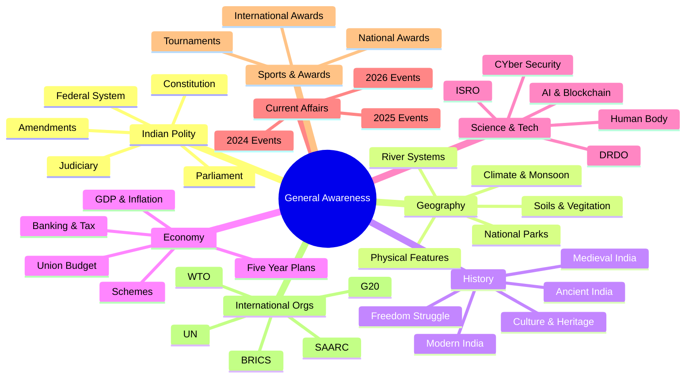

---
id: index
slug: /general-awareness
title: "General Awareness & Current Affairs"
sidebar_label: "General Awareness & Current Affairs"
sidebar_position: 9
---
# General Awareness & Current Affairs

> **Exam Weightage:** 25–40 Qs in IBPS SO Prelims/Mains, 35 Qs in SBI PO, 40 Qs in RBI Grade B Phase 1, 25 Qs in NIC Scientist & Insurance Exams
>
> **Difficulty:** Moderate (Static GK + Dynamic Current Affairs)
>
> **Focus Areas:** Indian Polity, Geography, History, Economy, Science & Tech, Current Affairs (2024–2026), Sports & Awards

---

## 📋 Syllabus Coverage

## Chapters

| # | Chapter | Static/Dynamic |
|---|---------|----------------|
| 1 | Indian Polity & Constitution | Static GK |
| 2 | Indian Geography & Environment | Static GK |
| 3 | Indian History & Culture | Static GK |
| 4 | Indian Economy & Planning | Static GK |
| 5 | General Science & Technology | Static GK |
| 6 | Current Affairs 2024 | Dynamic |
| 7 | Current Affairs 2025–2026 | Dynamic |
| 8 | Sports, Awards & International Organizations | Mixed |

---

## 🎯 Strategy

1. **Static GK (Chapters 1–5):** Read NCERT (Class 6–12) once, then revise from this course. Focus on facts, dates, and constitutional articles.
2. **Current Affairs (Chapters 6–7):** Follow *The Hindu*, *PIB*, *Economic Times* daily. Make monthly notes of key events.
3. **Sports & Awards (Chapter 8):** Revise from this chapter — most scoring section with predictable questions.
4. **Practice:** Attempt 50 MCQs daily. Use the TypeScript quiz simulators in each chapter for hands-on revision.
5. **Previous Year Papers:** Solve last 5 years of IBPS SO, SBI PO, RBI Grade B GK papers to identify repeated topics.

---

> Proceed to [Chapter 1 — Indian Polity & Constitution](01-indian-polity.md)
