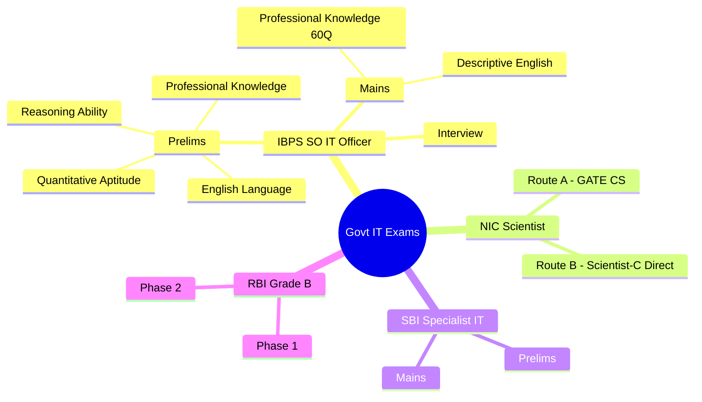
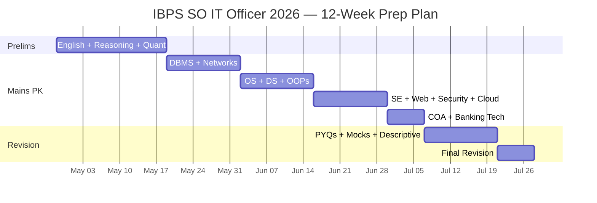

# Government Exams — Complete Preparation Hub

> **Mission:** Crack Indian government IT/CS officer exams with a structured, subject-wise preparation system.
>
> **Primary Target:** IBPS SO IT Officer Scale I (Prelims: ~~, Mains: ~~)
>
> **Secondary Targets:** NIC Scientist-B/C, SBI IT Officer, RBI Grade B (DEPR/DSIM), NIELIT Scientist, PSU IT Officers

---

## 📋 Exam Overview

---

## 🗺️ Subject-Wise Coverage

| # | Subject | Status | Course Link |
|---|---------|--------|-------------|
| 1 | **English Language** | ✅ New | [Start](../english-language/) |
| 2 | **Reasoning Ability** | ✅ New | [Start](../reasoning-ability/) |
| 3 | **Quantitative Aptitude** | ✅ New | [Start](../quantitative-aptitude/) |
| 4 | **Database Management Systems** | ✅ Existing | [Start](../database-management-systems/) |
| 5 | **Computer Networks** | ✅ Existing | [Start](../computer-networks/) |
| 6 | **Operating Systems** | ✅ Existing | [Start](../operating-systems/) |
| 7 | **Data Structures & Algorithms** | ✅ Existing | [Start](../data-structures/) |
| 8 | **OOPs (C++ / Java)** | ✅ Existing | [Start](../oop-cpp/) |
| 9 | **Software Engineering** | ✅ Existing | [Start](../software-engineering/) |
| 10 | **Web Technologies** | ✅ Existing | [Start](../web-development/) |
| 11 | **Information Security & Cryptography** | ✅ New | [Start](../information-security/) |
| 12 | **Cloud Computing** | ✅ Existing | [Start](../cloud-computing/) |
| 13 | **Computer Organisation & Architecture** | ✅ New | [Start](../computer-architecture/) |
| 14 | **Digital Logic** | ✅ Existing | [Start](../digital-logic/) |
| 15 | **Banking Technology & Digital Banking** | ✅ New | [Start](../banking-technology/) |
| 16 | **Professional Knowledge (PK) Recap** | ✅ New | [Start](../professional-knowledge/) |
| 17 | **General Awareness & Current Affairs** | ✅ New | [Start](../general-awareness/) |
| 18 | **Banking & Financial Awareness** | ✅ New | [Start](../banking-financial-awareness/) |
| 19 | **Hindi Language** | ✅ New | [Start](../hindi-language/) |
| 20 | **Marketing Aptitude** | ✅ New | [Start](../marketing-aptitude/) |
| 21 | **Data Analysis & Interpretation** | ✅ New | [Start](../data-analysis-interpretation/) |

---

## 🎯 IBPS SO IT Officer — Complete Roadmap

### Phase 1: Prelims Foundation (Weeks 1-3)

| Week | Focus | Daily Hours |
|------|-------|-------------|
| 1 | English + Reasoning basics + Quantitative | 6-8 hrs |
| 2 | English advanced + Puzzles + DI | 6-8 hrs |
| 3 | Full-length mocks + PK basics | 8-10 hrs |

### Phase 2: Mains Professional Knowledge (Weeks 4-7)

| Week | PK Modules | Hours |
|------|------------|-------|
| 4 | DBMS + Networks (highest weight) | 10-12 hrs |
| 5 | OS + DS + OOPs | 10-12 hrs |
| 6 | SE + Web Tech + Security | 8-10 hrs |
| 7 | COA + Cloud + Banking Tech | 8-10 hrs |

### Phase 3: Revision & Mocks (Weeks 8-12)

| Week | Activity |
|------|----------|
| 8 | Subject-wise PYQs |
| 9 | Full-length mocks (3x/week) |
| 10 | Weak area revision + Descriptive |
| 11 | Full mocks + Interview prep |
| 12 | Final revision + confidence |

---

## 🧪 NIC Scientist Route

### Route A: Scientist-B via GATE CS

The existing [GATE CS Preparation](../gate-cs-preparation/) course covers the full syllabus:

| Subject | GATE Weightage | Link |
|---------|----------------|------|
| Engineering Mathematics | 13-15% | [Go](../gate-cs-preparation/06-engineering-mathematics.md) |
| Digital Logic | 5-7% | [Go](../gate-cs-preparation/04-digital-logic.md) |
| COA | 8-10% | [Go](../gate-cs-preparation/11-computer-architecture.md) |
| DS & Algorithms | 12-15% | [Go](../gate-cs-preparation/10-data-structures-algorithms.md) |
| Theory of Computation | 8-10% | [Go](../gate-cs-preparation/02-theory-of-computation.md) |
| Compiler Design | 5-7% | [Go](../gate-cs-preparation/03-compiler-design.md) |
| Operating Systems | 8-10% | [Go](../gate-cs-preparation/07-operating-systems.md) |
| Databases | 8-10% | [Go](../gate-cs-preparation/08-database-management-systems.md) |
| Computer Networks | 8-10% | [Go](../gate-cs-preparation/09-computer-networks.md) |

### Route B: Scientist-C Direct

- **Experience-based** screening + interview
- Focus on system design, architecture decisions from your projects
- No fixed syllabus — prepare your existing work at systems level

---

## 📚 Recommended Resources

| Subject | Primary Book | Practice Source |
|---------|-------------|-----------------|
| English | SP Bakshi (Objective English) | Adda247, Testbook |
| Reasoning | MK Pandey (Analytical Reasoning) | Previous year papers |
| Quantitative | RS Aggarwal (Quantitative Aptitude) | Arun Sharma (for DI) |
| DBMS | Korth / Navathe | GATE Overflow |
| Networks | Forouzan / Kurose-Ross | Previous 8 yrs papers |
| OS | Galvin | Practice numericals |
| DS | Reema Thareja / standard MCQ books | Lucent Computer Awareness |
| OOPs | E Balagurusamy (C++/Java) | Simple MCQ revision |
| SE | Pressman (selected chapters) | Quick revision |
| Web Tech | Online resources + MDN | W3Schools + practice |
| Security | Cryptography & Network Security (Stallings) | Cybersecurity current news |
| Cloud | Any standard Cloud Computing book | AWS/Azure terminology |
| COA | Morris Mano | GATE-level numericals |
| Banking Tech | RBI website + banking awareness books | Current banking news |

---

## 📅 Important Dates

| Exam | Tentative Date | Days Remaining |
|------|---------------|----------------|
| IBPS SO Prelims 2026 | ~~ | ~~ |
| IBPS SO Mains 2026 | ~~ | ~~ |
| NIC Scientist Notification | ~~ | ~~ |
| GATE 2027 | ~~ | ~~ |

---

## 🏁 Quick Start

If you're short on time (IBPS SO deadline approaching):

1. Start with **[Professional Knowledge Recap](../professional-knowledge/)** — covers all 10 PK modules
2. Solve **English / Reasoning / Quant** basics daily
3. Take **1 full-length mock every 3 days** in the final month
4. Revise **Banking Technology** separately — unique to bank exams

> **Last updated:** July 2026. Syllabus/pattern reflects official IBPS CRP SPL-XVI notification. Always cross-check with [ibps.in](https://ibps.in).
