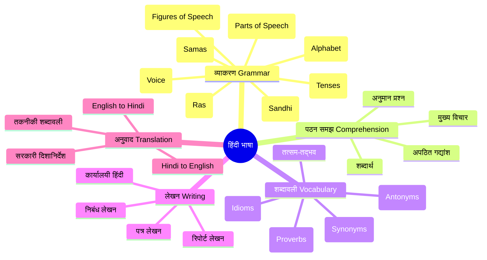

# हिंदी भाषा पाठ्यक्रम (Hindi Language Course)

> एक संपूर्ण हिंदी भाषा पाठ्यक्रम जो व्याकरण, समझ, शब्दावली, लेखन और अनुवाद को कवर करता है — सरकारी परीक्षाओं और दैनिक उपयोग के लिए।
> A comprehensive Hindi language course covering grammar, comprehension, vocabulary, writing, and translation — designed for government exams and everyday use.

## पाठ्यक्रम संरचना (Course Structure)

| अध्याय (Chapter) | विषय (Topic) | पृष्ठ (Pages) |
|---|---|---|
| 01 | हिंदी व्याकरण (Hindi Grammar) | — |
| 02 | अपठित गद्यांश (Unseen Passage Comprehension) | — |
| 03 | हिंदी शब्दावली (Hindi Vocabulary) | — |
| 04 | हिंदी लेखन (Hindi Writing) | — |
| 05 | अनुवाद (Translation) | — |

## उद्देश्य (Objectives)

इस पाठ्यक्रम को पूरा करने के बाद, आप यह कर सकेंगे:
After completing this course, you will be able to:

- हिंदी व्याकरण के सभी नियमों को समझ और लागू कर सकेंगे
- अपठित गद्यांश को पढ़कर प्रश्नों का उत्तर दे सकेंगे
- 1000+ हिंदी शब्दों का ज्ञान प्राप्त कर सकेंगे
- पत्र, निबंध, रिपोर्ट आदि लिख सकेंगे
- अंग्रेज़ी से हिंदी और हिंदी से अंग्रेज़ी में अनुवाद कर सकेंगे
- सरकारी परीक्षाओं (IBPS, SSC, UPSC, Railway) में हिंदी खंड को हल कर सकेंगे

> **लक्षित परीक्षाएँ (Target Exams):** IBPS PO/SO, SSC CGL/CHSL, UPSC Prelims, Railway NTPC, State PCS, CTET, UGC NET
