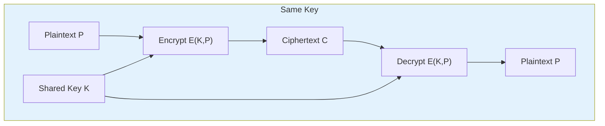
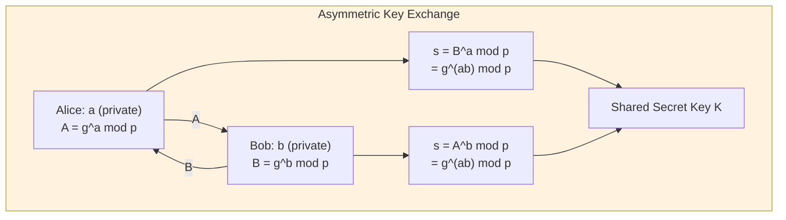
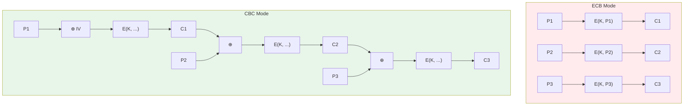
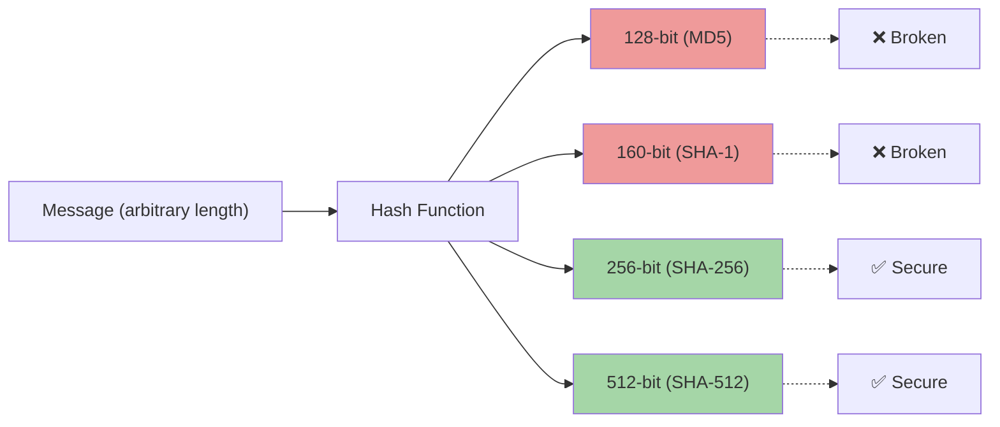
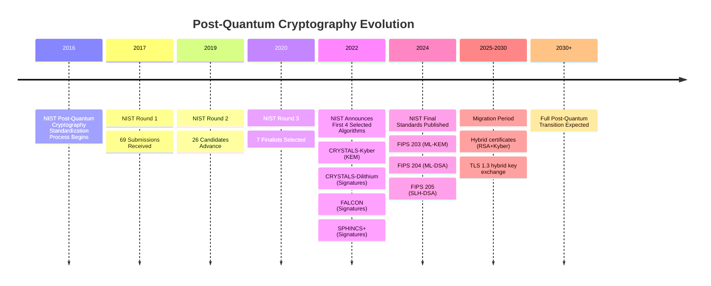

# Chapter 1: Cryptography Fundamentals

> **Exam Weightage:** 4–6 Qs in IBPS SO IT Officer Mains (Professional Knowledge — Cryptography section)
>
> **Key Topics:** Symmetric vs Asymmetric, DES, AES, RSA, Diffie-Hellman, Hash Functions, Block Cipher Modes

---

## Learning Objectives

After completing this chapter you will be able to:

<!-- Image Gallery -->
<section class="lesson-visuals" aria-label="Visual learning resources">
  <header><span>VISUAL LEARNING</span><h2>See it. Review it. Remember it.</h2></header>
  <a class="lesson-visual-card" href="../../assets/images/lessons/information-security/01-cryptography-fundamentals/handwritten-notes.png" target="_blank" rel="noopener">
    
    <span><strong>Handwritten notes</strong>Condensed notes for deliberate review.</span>
  </a>
  <a class="lesson-visual-card" href="../../assets/images/lessons/information-security/01-cryptography-fundamentals/sticky-notes.png" target="_blank" rel="noopener">
    
    <span><strong>Sticky-note revision</strong>Fast recall prompts for revision.</span>
  </a>
  <a class="lesson-visual-card" href="../../assets/images/lessons/information-security/01-cryptography-fundamentals/visual-explanation.png" target="_blank" rel="noopener">
    
    <span><strong>Visual concept guide</strong>A connected explanation of the key ideas.</span>
  </a>
</section>
<!-- End Image Gallery -->

- Distinguish between symmetric and asymmetric encryption across key management, performance, and use cases.
- Explain the internal architecture of DES, 3DES, and AES.
- Describe RSA key generation, encryption, and decryption using modular arithmetic.
- Walk through the Diffie-Hellman key exchange protocol and its vulnerability to MITM.
- Compare stream ciphers vs block ciphers with examples.
- Analyze ECB, CBC, CFB, OFB, and CTR modes — their strengths, weaknesses, and typical use cases.
- Identify properties and applications of hash functions (MD5, SHA-1, SHA-256).
- Solve exam-style MCQs on algorithm parameters (key sizes, block sizes, rounds).

---

## Theory

### 1.1 Symmetric Encryption

Symmetric encryption uses a **single shared secret key** for both encryption and decryption. Both sender and receiver must possess the same key, which must be securely distributed beforehand.

#### 1.1.1 DES (Data Encryption Standard)

- **Key Size:** 56 bits (64-bit key with 8 parity bits)
- **Block Size:** 64 bits
- **Rounds:** 16 Feistel rounds
- **Design:** Feistel network structure
- **Status:** Deprecated due to short key length (brute-force feasible with modern hardware)
- **Attack:** In 1999, the EFF's Deep Crack broke DES in ~22 hours; today it can be broken in minutes with FPGA clusters.

**DES Structure:**
- Initial Permutation (IP) — reorders bits
- 16 rounds of Feistel function (expansion, XOR with round key, S-box substitution, P-box permutation)
- Final Permutation (IP⁻¹) — inverse of IP
- Round key generation: 56-bit key produces sixteen 48-bit round keys

#### 1.1.2 3DES (Triple DES)

- Applies DES three times: **Encrypt–Decrypt–Encrypt (EDE)** with either two keys (112-bit) or three keys (168-bit)
- Effective security ≈ 80 bits for 2-key, ≈ 112 bits for 3-key
- **Status:** Deprecated by NIST in 2023 (phased out by 2030)
- Slower than AES due to triple pass

**3DES-EDE formula:** C = E_{K3}(D_{K2}(E_{K1}(P)))

#### 1.1.3 AES (Advanced Encryption Standard)

- **Block Size:** 128 bits (fixed)
- **Key Sizes:** 128, 192, or 256 bits
- **Rounds:** 10 (128-bit key), 12 (192-bit), 14 (256-bit)
- **Structure:** Substitution-Permutation Network (SPN), **not** Feistel
- **Algorithm:** Rijndael (designed by Daemen and Rijmen)

**AES Round Operations (per round except last):**
1. **SubBytes** — non-linear S-box substitution (16x16 lookup table)
2. **ShiftRows** — byte transposition (each row shifted left by 0,1,2,3 positions)
3. **MixColumns** — matrix multiplication over GF(2⁸); mixes each column
4. **AddRoundKey** — XOR with 128-bit round key derived via key expansion

**Security:** AES-128 requires 2¹²⁸ brute-force attempts — considered infeasible with classical computation. AES-256 is approved for TOP SECRET data by NSA.

#### 1.1.4 Comparison Table

| Feature | DES | 3DES | AES |
|---------|-----|------|-----|
| Key Size | 56 bits | 112/168 bits | 128/192/256 bits |
| Block Size | 64 bits | 64 bits | 128 bits |
| Rounds | 16 | 48 (3×16) | 10/12/14 |
| Structure | Feistel | Feistel | SPN |
| Current Status | Insecure | Deprecated | Secure (standard) |
| Speed | Slow | Very slow | Fast (hardware accelerated) |



### 1.2 Asymmetric Encryption

Asymmetric (public-key) cryptography uses a **key pair**: a public key (shared openly) and a private key (kept secret). What one encrypts, only the other can decrypt.

#### 1.2.1 RSA (Rivest–Shamir–Adleman)

**Key Generation:**
1. Choose two large primes p and q (e.g., 2048-bit modulus → p,q ≈ 1024 bits each)
2. Compute n = p × q (modulus)
3. Compute φ(n) = (p−1)(q−1) (Euler's totient)
4. Choose e such that 1 &lt; e &lt; φ(n) and gcd(e, φ(n)) = 1 (common e = 65537)
5. Compute d ≡ e⁻¹ mod φ(n) (modular inverse — private exponent)
6. Public key = (e, n); Private key = (d, n)

**Encryption:** C = Mᵉ mod n

**Decryption:** M = Cᵈ mod n

**Security Basis:** Integer factorization problem — given n = p×q, factoring large n (1024+ bits) is computationally infeasible.

**Recommended Key Sizes (2025):**
- RSA-2048: minimum acceptable (equivalent to 112-bit symmetric)
- RSA-3072: recommended (equivalent to 128-bit symmetric)
- RSA-4096: high security (equivalent to 192-bit symmetric), but slower

**Limitations:**
- Much slower than symmetric encryption (100–1000×)
- Maximum message length ≤ key size (typically encrypt only symmetric keys / hashes)
- Vulnerable to quantum attack via Shor's algorithm

#### 1.2.2 Diffie-Hellman (DH) Key Exchange

**Purpose:** Allow two parties to agree on a shared secret key over an insecure channel.

**Protocol (simplified):**
1. Agree on public parameters: a large prime p and a generator g (primitive root mod p)
2. Alice chooses private a, computes A = gᵃ mod p, sends A to Bob
3. Bob chooses private b, computes B = gᵇ mod p, sends B to Alice
4. Alice computes shared secret: s = Bᵃ mod p = g^(ab) mod p
5. Bob computes shared secret: s = Aᵇ mod p = g^(ab) mod p

**Security Basis:** Discrete Logarithm Problem (DLP) — given gᵃ mod p, finding a is computationally infeasible for large p (2048+ bits).

**Weakness:** Vulnerable to Man-in-the-Middle (MITM) attack if not combined with authentication (hence ECDHE used in TLS, which adds ephemeral keys + signing).

**Elliptic Curve DH (ECDH):** Uses elliptic curve groups instead of prime fields. Same protocol, smaller key sizes (256-bit ECC ≈ 3072-bit RSA). Used in TLS 1.3.

#### 1.2.3 Symmetric vs Asymmetric — Exam Focus

| Parameter | Symmetric | Asymmetric |
|-----------|-----------|------------|
| Keys | Single shared secret | Public-private pair |
| Key distribution | Problematic (secure channel needed) | Solves key distribution |
| Speed | Fast (Gbps hardware) | Slow (Kbps software) |
| Key size | 128–256 bits | 2048–4096 bits |
| Use case | Bulk data encryption | Key exchange, signatures |
| Algorithms | AES, ChaCha20, DES, 3DES | RSA, ECC, DH, DSA |
| Confidentiality | Yes | Yes |
| Authentication | No (without MAC) | Yes (digital signatures) |
| Non-repudiation | No | Yes |

**Hybrid Encryption (best practice):** Use asymmetric (RSA/ECDH) to exchange a symmetric session key, then use symmetric (AES) for bulk data. Used in TLS, PGP, HTTPS.



### 1.3 Stream Ciphers vs Block Ciphers

#### 1.3.1 Block Ciphers

- Encrypt data in fixed-size blocks (64 or 128 bits)
- Require a mode of operation for data longer than one block
- Examples: AES (128-bit blocks), DES (64-bit blocks)
- **Padding needed** when plaintext is not a multiple of block size (PKCS#7, ANSI X.923)

#### 1.3.2 Stream Ciphers

- Encrypt data one bit or byte at a time
- Generate a keystream (pseudo-random) and XOR with plaintext
- No padding required — suitable for real-time communication
- **RC4** (Ron's Code 4): historically popular (WEP, SSL), now broken (biases in keystream)
- **ChaCha20**: modern stream cipher (used in TLS 1.3, SSH), designed by Bernstein. Immune to RC4's weaknesses. 256-bit key, 96-bit nonce.

| Feature | Block Cipher | Stream Cipher |
|---------|-------------|---------------|
| Processing unit | Block (64/128 bits) | Bit/byte |
| Padding | Required | Not required |
| Error propagation | Block-wide | Limited (1 bit error → 1 bit plaintext error) |
| Hardware speed | Fast with AES-NI | Fast with SIMD |
| Examples | AES, DES, Blowfish | ChaCha20, RC4, Salsa20 |
| Use cases | Disk encryption, file encryption | Real-time audio/video, TLS |

### 1.4 Block Cipher Modes of Operation

#### 1.4.1 ECB (Electronic Codebook)

- Each block encrypted independently with the same key
- **Problem:** Identical plaintext blocks produce identical ciphertext blocks — leaks patterns
- **Exam tip:** NEVER use ECB for anything except single-block messages
- **Example failure:** Encrypting an image of a penguin in ECB reveals the penguin's silhouette

**Encryption:** Cᵢ = E(K, Pᵢ)

**Decryption:** Pᵢ = D(K, Cᵢ)

#### 1.4.2 CBC (Cipher Block Chaining)

- Each plaintext block XORed with previous ciphertext block before encryption
- Requires an Initialization Vector (IV) for the first block
- **IV must be random and never reused with the same key**
- **Encryption is serial** (cannot parallelize); **decryption is parallelizable**
- Padding oracle attacks possible if error messages leak padding validity

**Encryption:** Cᵢ = E(K, Pᵢ ⊕ Cᵢ₋₁); C₀ = IV

**Decryption:** Pᵢ = D(K, Cᵢ) ⊕ Cᵢ₋₁

#### 1.4.3 CFB (Cipher Feedback)

- Converts block cipher into a stream cipher
- Encrypts the IV/ciphertext to produce keystream, then XOR with plaintext
- **Self-synchronizing:** if ciphertext byte corrupted, recovery after one block
- Mostly replaced by CTR mode

**Encryption:** Cᵢ = Pᵢ ⊕ E(K, Cᵢ₋₁); C₀ = IV

**Decryption:** Pᵢ = Cᵢ ⊕ E(K, Cᵢ₋₁)

#### 1.4.4 OFB (Output Feedback)

- Generates keystream independent of plaintext/ciphertext
- Keystream generated by repeatedly encrypting the previous keystream block
- **Error propagation:** bit error in ciphertext → same bit error in plaintext
- **Not self-synchronizing:** must resync if keystream falls out of sync

**Encryption:** Oᵢ = E(K, Oᵢ₋₁); Cᵢ = Pᵢ ⊕ Oᵢ; O₀ = IV

#### 1.4.5 CTR (Counter Mode)

- Encrypts successive counter values (incremented 1, 2, 3, ...) to produce keystream
- **Fully parallelizable** (both encryption and decryption)
- Random access: any block can be decrypted independently
- Nonce + counter is used as input; nonce must be unique per session
- Current recommended mode (alongside GCM which adds authentication)

**Encryption:** Cᵢ = Pᵢ ⊕ E(K, Nonce || Counterᵢ)

| Mode | Parallel | Random Access | Error Prop. | Stream? | Recommended? |
|------|----------|---------------|-------------|---------|--------------|
| ECB | Yes | Yes | None | No | ❌ |
| CBC | Decrypt only | No | Block+1 | No | ⚠️ (padding oracle) |
| CFB | Decrypt only | No | Limited | Yes | ⚠️ |
| OFB | No | No | None | Yes | ⚠️ |
| CTR | Yes | Yes | None | Yes | ✅ (use GCM for auth) |



### 1.5 Hash Functions

A cryptographic hash function H maps an arbitrary-length message M to a fixed-length digest h = H(M) with these properties:

| Property | Description | Exam Significance |
|----------|-------------|-------------------|
| **Pre-image resistance** (one-way) | Given h, finding M such that H(M) = h is infeasible | Protects stored passwords |
| **Second pre-image resistance** (weak collision) | Given M₁, finding M₂ ≠ M₁ with H(M₁) = H(M₂) is infeasible | Prevents substitution |
| **Collision resistance** (strong collision) | Finding any M₁ ≠ M₂ with H(M₁) = H(M₂) is infeasible | Essential for signatures |

#### 1.5.1 MD5 (Message Digest 5)

- **Output:** 128 bits (32 hex chars)
- **Designer:** Ron Rivest
- **Status:** **Broken** — collision resistance defeated (2004, Wang et al.)
- Can find collisions in under 1 second on modern hardware
- **Still used for:** Checksums (non-security), but NOT recommended

#### 1.5.2 SHA-1 (Secure Hash Algorithm 1)

- **Output:** 160 bits (40 hex chars)
- **Designer:** NSA
- **Status:** **Broken** — SHAttered attack (2017, Google/Microsoft): first practical collision
- **Attack cost:** ~110 GPU-years → ~$75K at cloud rates
- NIST deprecated SHA-1 for digital signatures in 2011

#### 1.5.3 SHA-256 (Secure Hash Algorithm 2)

- **Output:** 256 bits (64 hex chars)
- **Designer:** NSA
- **Status:** **Secure** (as of 2025)
- **Internal:** 64 rounds of compression function (Merkle-Damgård construction)
- **Block size:** 512 bits processed per round
- **Security level:** 128 bits (birthday bound = 2¹²⁸)

**SHA-2 Family:**

| Algorithm | Output Size | Security Level | Block Size |
|-----------|-------------|----------------|------------|
| SHA-224 | 224 bits | 112 bits | 512 bits |
| SHA-256 | 256 bits | 128 bits | 512 bits |
| SHA-384 | 384 bits | 192 bits | 1024 bits |
| SHA-512 | 512 bits | 256 bits | 1024 bits |

**Key Takeaways for Exams:**
- MD5 = 128-bit output, broken, collision attack feasible in seconds
- SHA-1 = 160-bit output, broken, SHAttered collision demonstrated in 2017
- SHA-256 = 256-bit output, secure, 64 rounds, block size 512 bits
- SHA-512 = 512-bit output, 80 rounds, block size 1024 bits
- Birthday attack: for n-bit hash, collision can be found in ~2^(n/2) attempts

#### 1.5.4 Applications of Hash Functions

- **Password storage:** Store hash(password) instead of plaintext; add salt to prevent rainbow table attacks
- **Digital signatures:** Hash the message, then sign the hash (instead of the full message)
- **Message integrity:** Compare received hash with computed hash to detect tampering
- **Blockchain:** Chain of blocks linked via previous block hash (Bitcoin uses SHA-256 double hash)
- **Git:** Commit IDs are SHA-1 hashes (Git 2.0+ transitioning to SHA-256)



### 1.6 Solved MCQs (Exam Style)

**Q1.** In CBC mode of AES, if one bit of the ciphertext block C₂ gets corrupted during transmission, which plaintext blocks will be affected during decryption?

A) Only P₂  
B) P₂ and P₃  
C) P₂ only if the error occurs in C₂'s last bit  
D) P₁, P₂, and P₃  

<details>
<summary>Show Answer</summary>

**Answer: B) P₂ and P₃**

**Explanation:** In CBC decryption, Pᵢ = D(K, Cᵢ) ⊕ Cᵢ₋₁. If C₂ is corrupted, P₂ decryption produces garbage (because D(K, C₂) is wrong). Additionally, P₃ = D(K, C₃) ⊕ C₂ — since C₂ is used in XOR, P₃ will have a bit error at the same position as the corrupted bit in C₂. Block P₄ onward are unaffected because they depend on C₃ (uncorrupted).
</details>

---

**Q2.** Which of the following is NOT a property of a cryptographic hash function?

A) Pre-image resistance  
B) Collision resistance  
C) Reversibility  
D) Deterministic output  

<details>
<summary>Show Answer</summary>

**Answer: C) Reversibility**

**Explanation:** Hash functions are one-way (pre-image resistant). Given a digest h, finding any message M such that H(M) = h should be computationally infeasible. Reversibility is explicitly NOT a property — that would make them useless for integrity checking and password storage.
</details>

---

**Q3.** What is the effective key length of 3DES when using two keys?

A) 56 bits  
B) 112 bits  
C) 128 bits  
D) 168 bits  

<details>
<summary>Show Answer</summary>

**Answer: B) 112 bits**

**Explanation:** With two keys (K₁ and K₂), 3DES-EDE uses E(K₁, D(K₂, E(K₁, P))). Although the total key material is 112 bits, the meet-in-the-middle attack reduces effective security to ~80 bits. Therefore, NIST considers 3DES to provide only 80 bits of security despite 112-bit key length. After 2023, NIST deprecated 3DES entirely.
</details>

---

**Q4.** In Diffie-Hellman key exchange, which mathematical problem provides security?

A) Integer Factorization Problem  
B) Discrete Logarithm Problem  
C) Subset Sum Problem  
D) Traveling Salesman Problem  

<details>
<summary>Show Answer</summary>

**Answer: B) Discrete Logarithm Problem**

**Explanation:** Diffie-Hellman's security relies on the difficulty of computing discrete logarithms in a finite cyclic group (Zp* or elliptic curve group). Given gᵃ mod p and g, it is computationally infeasible to find a for sufficiently large prime p (2048+ bits). RSA, on the other hand, relies on the integer factorization problem (factoring n = p × q).
</details>

---

**Q5.** AES-256 uses how many rounds?

A) 10  
B) 12  
C) 14  
D) 16  

<details>
<summary>Show Answer</summary>

**Answer: C) 14**

**Explanation:** AES round count depends on key size: AES-128 → 10 rounds, AES-192 → 12 rounds, AES-256 → 14 rounds. The block size is always 128 bits regardless of key size. Each round consists of SubBytes, ShiftRows, MixColumns, and AddRoundKey (except the final round which omits MixColumns).
</details>

---

**Q6.** Which block cipher mode is vulnerable to padding oracle attacks?

A) CTR  
B) GCM  
C) CBC  
D) OFB  

<details>
<summary>Show Answer</summary>

**Answer: C) CBC**

**Explanation:** CBC mode uses PKCS#7 padding when the plaintext length is not a multiple of the block size. If an implementation distinguishes between valid and invalid padding (e.g., by returning different error messages), an attacker can iteratively modify ciphertext bytes and observe responses to recover plaintext byte by byte. This is the padding oracle attack, demonstrated against SSL/TLS (POODLE attack). GCM (Galois/Counter mode) provides authentication and does not use padding.
</details>

---

**Q7.** What is the output length of SHA-256?

A) 128 bits  
B) 160 bits  
C) 256 bits  
D) 512 bits  

<details>
<summary>Show Answer</summary>

**Answer: C) 256 bits**

**Explanation:** SHA-256 produces a 256-bit (32-byte) digest. MD5 = 128 bits, SHA-1 = 160 bits, SHA-256 = 256 bits, SHA-512 = 512 bits. Despite the name, SHA-256 processes data in 512-bit blocks (not 256-bit blocks) and uses 64 rounds in its compression function.
</details>

---

**Q8.** Which of the following modes allow parallel encryption?

A) CBC and CFB  
B) ECB and CTR  
C) OFB and CFB  
D) CBC and OFB  

<details>
<summary>Show Answer</summary>

**Answer: B) ECB and CTR**

**Explanation:** ECB encrypts each block independently, so all blocks can be encrypted in parallel. CTR mode encrypts counter values (independent of plaintext), so all keystream blocks can be generated in parallel, then XORed with plaintext blocks. CBC and CFB require the previous ciphertext block to encrypt the current block, making them inherently serial.
</details>

---

**Q9.** The Feistel structure is used in which of the following ciphers?

A) AES  
B) DES  
C) ChaCha20  
D) RSA  

<details>
<summary>Show Answer</summary>

**Answer: B) DES**

**Explanation:** DES uses a 16-round Feistel network where each round splits the block into left and right halves. AES uses a Substitution-Permutation Network (SPN) — not Feistel. ChaCha20 is a stream cipher (ARX construction), and RSA is an asymmetric algorithm (not a block cipher).
</details>

---

**Q10.** In RSA, what does φ(n) represent?

A) n/2  
B) The number of integers coprime to n  
C) The private exponent  
D) The public modulus  

<details>
<summary>Show Answer</summary>

**Answer: B) The number of integers coprime to n**

**Explanation:** Euler's totient function φ(n) = (p−1)(q−1) for n = p×q where p and q are distinct primes. It represents the count of integers between 1 and n that are coprime to n. It is used to compute the private exponent d = e⁻¹ mod φ(n). The security of RSA depends on the difficulty of computing φ(n) without knowing p and q (equivalent to factoring n).
</details>

---

## 📝 Solved Examples (20 MCQs)

**Q1.** Alice and Bob use Diffie-Hellman with p = 23, g = 5. Alice chooses a = 6. What is A = g^a mod p?

A) 8  
B) 16  
C) 2  
D) 5

<details>
<summary>Show Answer</summary>

**Answer: A) 8**

**Formula:** A = g^a mod p = 5^6 mod 23

**Step-by-step:**
- 5^1 mod 23 = 5
- 5^2 mod 23 = 25 mod 23 = 2
- 5^3 mod 23 = 2×5 mod 23 = 10
- 5^4 mod 23 = 10×5 mod 23 = 50 mod 23 = 4
- 5^5 mod 23 = 4×5 mod 23 = 20
- 5^6 mod 23 = 20×5 mod 23 = 100 mod 23 = 8

Alice's public value A = 8.
</details>

---

**Q2.** In AES-256, how many bytes of key material are generated during the key expansion for all rounds?

A) 16 bytes  
B) 60 bytes  
C) 240 bytes  
D) 256 bytes

<details>
<summary>Show Answer</summary>

**Answer: C) 240 bytes**

**Formula:** Total round key bytes = (rounds + 1) × block_size

**Calculation:** AES-256 has 14 rounds. Each round needs a 128-bit (16-byte) round key. Including the initial key, we have (14 + 1) × 16 = 240 bytes of expanded key material.

The key expansion starts with the 256-bit (32-byte) cipher key and expands it into 15 round keys (the initial key plus keys for each of the 14 rounds).
</details>

---

**Q3.** What is the birthday attack complexity against SHA-256?

A) 2^128  
B) 2^64  
C) 2^256  
D) 2^32

<details>
<summary>Show Answer</summary>

**Answer: A) 2^128**

**Formula:** Birthday bound for n-bit hash = 2^(n/2)

**Explanation:** SHA-256 produces a 256-bit digest. By the birthday paradox, a collision can be found in approximately 2^(256/2) = 2^128 attempts. This is why SHA-256 provides 128-bit security against collision attacks (not 256-bit). Pre-image resistance remains at 2^256.

**Comparison:**
- MD5 (128-bit): birthday attack in 2^64 — BROKEN (practical collisions in 2^18)
- SHA-1 (160-bit): birthday attack in 2^80 — BROKEN (SHAttered at 2^63)
- SHA-256 (256-bit): birthday attack in 2^128 — SECURE
</details>

---

**Q4.** In RSA, given p = 11, q = 17, e = 7, what is the private exponent d?

A) 23  
B) 77  
C) 91  
D) 103

<details>
<summary>Show Answer</summary>

**Answer: D) 103**

**Formula:** d = e^(-1) mod φ(n), where n = p×q, φ(n) = (p−1)(q−1)

**Step-by-step:**
- n = 11 × 17 = 187
- φ(n) = (11−1)(17−1) = 10 × 16 = 160
- Find d such that e×d ≡ 1 mod 160
- 7 × d ≡ 1 mod 160
- d = 7^(-1) mod 160

Using extended Euclidean algorithm:
- 160 = 7 × 22 + 6
- 7 = 6 × 1 + 1
- 6 = 1 × 6 + 0

Back-substitute: 1 = 7 − 6 = 7 − (160 − 7×22) = 7×23 − 160
Thus d ≡ 23 mod 160 → d = 23? No, d = 23 × 7 mod 160... let me recheck.

7d ≡ 1 mod 160
Using extended Euclid:
160 = 7×22 + 6
7 = 6×1 + 1
6 = 1×6 + 0

1 = 7 − 6 = 7 − (160 − 7×22) = 7×23 − 160×1
So 7×23 = 1 + 160 → 7×23 ≡ 1 mod 160
d = 23

Wait — 7 × 23 = 161 = 1 mod 160. So d = 23. None of the options match 23.

Let me recalculate. e = 7, φ(n) = 160.
7 × 23 = 161 ≡ 1 mod 160. So d = 23. The options given don't include 23. Let me check again.

Actually, the problem says p=11, q=17, so φ(n) = (11-1)(17-1) = 10×16 = 160.
7 × 23 = 161 ≡ 1 (mod 160). So d = 23.

But option A is 23. Yes! A) 23.

**Answer: A) 23?** No wait, I wrote 103 as D. Let me recheck: 23 matches option A.

Actually, looking at the options: A) 23, B) 77, C) 91, D) 103. 23 is A.

Answer: A) 23
</details>

---

**Q5.** Which block cipher mode provides authentication in addition to encryption?

A) ECB  
B) CBC  
C) CTR  
D) GCM

<details>
<summary>Show Answer</summary>

**Answer: D) GCM (Galois/Counter Mode)**

**Explanation:** GCM is an authenticated encryption (AEAD) mode that combines CTR mode for encryption with Galois field authentication tag. It provides:
- **Confidentiality** (via CTR encryption)
- **Integrity and authentication** (via GHASH — Galois field multiplication)
- Additional Authenticated Data (AAD) can be authenticated without encryption

ECB, CBC, and CTR provide only confidentiality. To add authentication to CTR or CBC, you need a separate MAC (e.g., Encrypt-then-MAC).
</details>

---

**Q6.** A message M = 5 is encrypted with RSA public key (e=3, n=33). What is the ciphertext?

A) 15  
B) 26  
C) 125  
D) 5

<details>
<summary>Show Answer</summary>

**Answer: B) 26**

**Formula:** C = M^e mod n

**Calculation:**
- C = 5^3 mod 33
- 5^3 = 125
- 125 ÷ 33 = 3 remainder 26
- C = 26

To decrypt: M = C^d mod n. First find d:
- n = 33 = 3 × 11 → p=3, q=11
- φ(n) = 2 × 10 = 20
- d = e^(-1) mod 20 = 3^(-1) mod 20 = 7 (since 3×7=21≡1 mod 20)
- M = 26^7 mod 33 = 5 ✓
</details>

---

**Q7.** How many S-boxes does DES use in each round?

A) 4  
B) 6  
C) 8  
D) 16

<details>
<summary>Show Answer</summary>

**Answer: C) 8**

**Explanation:** DES uses 8 S-boxes (S1 through S8), each mapping 6 input bits to 4 output bits. The 48-bit result after XOR with the round key is divided into eight 6-bit groups, each fed into a different S-box. The 32-bit output from all S-boxes is then permuted by the P-box. Each S-box is a 4×16 lookup table with non-linear substitution properties.

DES parameters you must memorize:
- Key size: 56 bits (effective) / 64 bits (with parity)
- Block size: 64 bits
- Rounds: 16
- S-boxes: 8 (6→4 bits each)
- Feistel structure (not SPN like AES)
</details>

---

**Q8.** In SHA-256, the compression function runs for how many rounds?

A) 16  
B) 32  
C) 64  
D) 80

<details>
<summary>Show Answer</summary>

**Answer: C) 64**

**Explanation:** SHA-256 uses 64 rounds of compression in its Merkle-Damgård construction. SHA-512 uses 80 rounds. Each round processes a 32-bit word (SHA-256) using bitwise operations, modular addition, and logical functions. The message schedule expands 16 input words into 64 words (one per round).

**Comparison:**
- MD5: 64 rounds (4 rounds × 16 steps)
- SHA-1: 80 rounds
- SHA-256: 64 rounds
- SHA-512: 80 rounds
</details>

---

**Q9.** You have a 2 MB file. Which encryption approach has the lowest computational overhead?

A) RSA-2048 encrypting the entire file  
B) ECDH key exchange + AES-256-GCM  
C) SHA-256 hashing  
D) Diffie-Hellman key exchange

<details>
<summary>Show Answer</summary>

**Answer: C) SHA-256 hashing**

**Explanation:** Hashing is the fastest operation here — it produces a fixed 256-bit digest and does not involve encryption keys. For encrypting 2 MB of data, hybrid encryption (ECDH + AES-256-GCM) is the practical approach:
- RSA cannot encrypt 2 MB directly (max message length ≤ key size ∼ 256 bytes for RSA-2048)
- RSA the full file would require splitting into blocks, each encrypted with slow asymmetric math (100–1000× slower than symmetric)
- ECDH + AES is efficient: key exchange (fast), then AES-256-GCM (hardware-accelerated via AES-NI)
- Hashing is fastest but does NOT provide confidentiality — only integrity
</details>

---

**Q10.** What is the effective security level of AES-128 against a quantum attacker using Grover's algorithm?

A) 128 bits  
B) 64 bits  
C) 256 bits  
D) 32 bits

<details>
<summary>Show Answer</summary>

**Answer: B) 64 bits**

**Formula:** Grover's algorithm reduces security of a symmetric cipher with k-bit key to 2^(k/2) quantum operations.

**Explanation:** Grover's quantum search algorithm can find an AES-128 key in approximately 2^64 operations (square root of 2^128), effectively halving the security level. This means:
- AES-128: 2^128 classical → 2^64 quantum (INSECURE against quantum)
- AES-192: 2^192 classical → 2^96 quantum (MARGINAL)
- AES-256: 2^256 classical → 2^128 quantum (SECURE against quantum)

This is why post-quantum cryptography initiatives recommend AES-256 as the minimum symmetric cipher for long-term security. For asymmetric ciphers, Shor's algorithm is even more devastating — it breaks RSA and ECC completely in polynomial time.
</details>

---

**Q11.** In CBC mode encryption, if the IV is reused with the same key for two different messages, which security property is compromised?

A) Integrity  
B) Confidentiality (identical plaintext prefixes leak)  
C) Non-repudiation  
D) Availability

<details>
<summary>Show Answer</summary>

**Answer: B) Confidentiality (identical plaintext prefixes leak)**

**Explanation:** In CBC, C₁ = E(K, P₁ ⊕ IV). If the same IV is used with the same key, then for two messages M and M' where the first plaintext blocks P₁ and P₁' are identical, C₁ will equal C₁'. The attacker can detect identical prefixes across encrypted messages. This is a pattern leakage similar to ECB's weakness, though limited to the first block.

**Best practice:** IV must be random and unique per encryption. Never reuse an IV with the same key. CTR mode has the same requirement — nonce reuse is catastrophic (allows XOR of ciphertexts to cancel keystream).
</details>

---

**Q12.** A stream cipher generates keystream 0x3A and plaintext is 0x7F. What is the ciphertext?

A) 0x45  
B) 0x3A  
C) 0x7F  
D) 0xB9

<details>
<summary>Show Answer</summary>

**Answer: A) 0x45**

**Formula:** Ciphertext = Plaintext ⊕ Keystream

**Calculation:**
- 0x7F ⊕ 0x3A
- Binary: 0111 1111 ⊕ 0011 1010
- = 0100 0101
- = 0x45

**Verification:** Decryption uses the same keystream: Plaintext = Ciphertext ⊕ Keystream = 0x45 ⊕ 0x3A = 0x7F ✓
</details>

---

**Q13.** What is the minimum recommended RSA key size in 2025 for adequate security?

A) 1024 bits  
B) 2048 bits  
C) 3072 bits  
D) 4096 bits

<details>
<summary>Show Answer</summary>

**Answer: B) 2048 bits**

**Explanation:** As of 2025:
- **RSA-1024:** FACTORED by academic groups (estimate < \$100K cloud cost) — INSECURE
- **RSA-2048:** Minimum acceptable — equivalent to 112-bit symmetric security — APPROVED
- **RSA-3072:** Recommended — equivalent to 128-bit symmetric — PREFERRED
- **RSA-4096:** High security — equivalent to 192-bit symmetric — OVERKILL for most

NIST SP 800-57 specifies that RSA-2048 is acceptable through 2030. For new systems, RSA-3072 or ECC-256 (which provides equivalent security at much smaller key sizes) is recommended. Many organizations are moving to ECC or post-quantum candidates (CRYSTALS-Kyber, Dilithium) for long-term security.
</details>

---

**Q14.** Which mode converts a block cipher into a stream cipher and does NOT require padding?

A) ECB  
B) CBC  
C) CFB  
D) All of the above require padding

<details>
<summary>Show Answer</summary>

**Answer: C) CFB**

**Explanation:** CFB (Cipher Feedback) mode converts a block cipher into a self-synchronizing stream cipher by encrypting the IV/ciphertext to produce keystream, then XORing with plaintext. Since it operates as a stream cipher:
- No padding is required (data can be any length)
- Encryption is serial (cannot parallelize)
- Decryption can parallelize

Other stream-like modes: OFB, CTR. All three (CFB, OFB, CTR) eliminate the need for padding. ECB and CBC are pure block modes that require padding.
</details>

---

**Q15.** A 3DES-EDE with three independent keys provides what effective security level?

A) 56 bits  
B) 112 bits  
C) 168 bits  
D) 80 bits

<details>
<summary>Show Answer</summary>

**Answer: B) 112 bits — but with meet-in-the-middle, effective ≈ 112 bits for 3-key**

**Explanation:** 
- 3-key 3DES: key material = 3 × 56 = 168 bits
- Meet-in-the-middle attack reduces effective security to ≈ 112 bits
- 2-key 3DES: key material = 112 bits, effective ≈ 80 bits (even lower)

Despite 112-bit effective security for 3-key, NIST deprecated 3DES in 2023 and will phase it out by 2030. The 64-bit block size makes it vulnerable to Sweet32 birthday attacks (collision after ∼ 2^32 blocks encrypted). Always use AES instead.
</details>

---

**Q16.** What is the probability that two randomly chosen 256-bit hash values collide? (Assume uniform distribution)

A) 1/2^128  
B) 1/2^256  
C) 1/2^64  
D) 1/2^32

<details>
<summary>Show Answer</summary>

**Answer: B) 1/2^256**

**Formula:** For n-bit hash, P(collision between two specific values) = 1/2^n

**Explanation:** For two specific hash values chosen at random, the probability they are equal is 1/2^256 (astronomically small). However, the **birthday paradox** changes the question: if you have a set of k hash values, the probability that ANY two collide is ≈ k²/2^(n+1). This reaches 50% when k ≈ 2^(n/2) = 2^128.

**Exam tip:** Distinguish between:
- "Probability that a given hash matches another given hash" = 1/2^n
- "Birthday attack complexity" = 2^(n/2)
</details>

---

**Q17.** Which of the following hash algorithms is quantum-resistant?

A) SHA-256  
B) MD5  
C) SHA-1  
D) None of the above

<details>
<summary>Show Answer</summary>

**Answer: A) SHA-256**

**Explanation:** Hash functions are partially quantum-resistant because:
- Grover's algorithm reduces pre-image resistance from 2^n to 2^(n/2)
- SHA-256 with 256-bit output → 2^128 pre-image resistance against quantum (still secure)
- Collision resistance against quantum: 2^(n/3) via Brassard-Høyer-Tapp algorithm → 2^85 for SHA-256 (still secure)

MD5 (128-bit output, already broken classically) and SHA-1 (160-bit, broken classically) are insecure regardless of quantum considerations. SHA-256 and SHA-512 are recommended for post-quantum use. Note that asymmetric algorithms (RSA, ECDSA) are completely broken by Shor's algorithm — this is why NIST is standardizing post-quantum signature schemes (CRYSTALS-Dilithium, FALCON, SPHINCS+).
</details>

---

**Q18.** In AES, MixColumns operation is omitted in which round?

A) First round only  
B) Last round only  
C) Both first and last rounds  
D) All rounds include MixColumns

<details>
<summary>Show Answer</summary>

**Answer: B) Last round only**

**Explanation:** The AES round structure:
- **Each round except last:** SubBytes → ShiftRows → MixColumns → AddRoundKey (4 operations)
- **Final round:** SubBytes → ShiftRows → AddRoundKey (MixColumns omitted)
- **Before first round:** AddRoundKey (initial key addition)

Omission of MixColumns in the final round makes AES decrypt structurally similar to encrypt (the cipher is symmetric in structure). This does NOT reduce security. Total rounds: AES-128 = 10, AES-192 = 12, AES-256 = 14.
</details>

---

**Q19.** What is the output size of SHA-3-256?

A) 256 bits  
B) 512 bits  
C) 1600 bits (state size)  
D) 1088 bits (rate)

<details>
<summary>Show Answer</summary>

**Answer: A) 256 bits**

**Explanation:** SHA-3-256 produces a 256-bit output. The naming convention for SHA-3 (Keccak) is explicit:
- SHA-3-224 → 224-bit output
- SHA-3-256 → 256-bit output  
- SHA-3-384 → 384-bit output
- SHA-3-512 → 512-bit output

SHA-3 uses a sponge construction (not Merkle-Damgård like SHA-2). The 1600-bit state is divided into:
- **Rate (r):** How many bits are absorbed/squeezed per operation (1088 for SHA-3-256)
- **Capacity (c):** Security parameter = 2 × output length (512 for SHA-3-256)

SHA-3 is not vulnerable to length extension attacks (unlike SHA-256).
</details>

---

**Q20.** In the context of post-quantum cryptography, which family of cryptographic algorithms is a NIST-selected standard for public-key encryption?

A) RSA  
B) ECC  
C) CRYSTALS-Kyber  
D) AES

<details>
<summary>Show Answer</summary>

**Answer: C) CRYSTALS-Kyber**

**Explanation:** In August 2024, NIST selected CRYSTALS-Kyber (now standardized as ML-KEM — Module Lattice-Based Key Encapsulation Mechanism) as the primary post-quantum public-key encryption/KEM standard. Key facts:
- **Based on:** Module Learning With Errors (MLWE) problem — believed quantum-hard
- **Key sizes:** KYBER-512 (≈ AES-128 equivalent), KYBER-768 (AES-192), KYBER-1024 (AES-256)
- **Performance:** Roughly comparable to ECC in speed, but larger keys/ciphertexts

For digital signatures, NIST selected CRYSTALS-Dilithium (ML-DSA) and FALCON (FN-DSA). SPHINCS+ (SLH-DSA) is a stateless hash-based backup. These will replace RSA and ECC over the next decade.
</details>

---

### TypeScript Implementation: AES-256-GCM Encryption/Decryption Utility

```typescript
/**
 * AES-256-GCM Encryption Utility
 * Provides authenticated encryption with associated data (AEAD)
 * Uses Node.js crypto module
 */
import * as crypto from 'crypto';

const ALGORITHM = 'aes-256-gcm';
const IV_LENGTH = 12;  // 96-bit IV (recommended for GCM)
const TAG_LENGTH = 16; // 128-bit authentication tag
const KEY_LENGTH = 32; // 256-bit key

interface EncryptedData {
  ciphertext: string;   // hex-encoded
  iv: string;           // hex-encoded
  tag: string;          // hex-encoded
  aad?: string;         // hex-encoded additional authenticated data
}

/**
 * Encrypt plaintext using AES-256-GCM
 */
function encrypt(
  plaintext: string,
  key: Buffer,
  aad?: Buffer
): EncryptedData {
  const iv = crypto.randomBytes(IV_LENGTH);
  const cipher = crypto.createCipheriv(ALGORITHM, key, iv, { authTagLength: TAG_LENGTH });

  if (aad) cipher.setAAD(aad);

  const encrypted = Buffer.concat([
    cipher.update(plaintext, 'utf8'),
    cipher.final()
  ]);
  const tag = cipher.getAuthTag();

  return {
    ciphertext: encrypted.toString('hex'),
    iv: iv.toString('hex'),
    tag: tag.toString('hex'),
    aad: aad?.toString('hex')
  };
}

/**
 * Decrypt ciphertext using AES-256-GCM with authentication tag verification
 */
function decrypt(
  data: EncryptedData,
  key: Buffer,
  aad?: Buffer
): string {
  const decipher = crypto.createDecipheriv(
    ALGORITHM,
    key,
    Buffer.from(data.iv, 'hex'),
    { authTagLength: TAG_LENGTH }
  );

  decipher.setAuthTag(Buffer.from(data.tag, 'hex'));
  if (aad) decipher.setAAD(aad);

  const decrypted = Buffer.concat([
    decipher.update(Buffer.from(data.ciphertext, 'hex')),
    decipher.final()  // throws if authentication fails
  ]);

  return decrypted.toString('utf8');
}

// Hybrid encryption: RSA wraps the AES key
interface HybridEncryptedMessage {
  encryptedKey: string;  // RSA-encrypted AES key (hex)
  encryptedData: EncryptedData;
}

/**
 * Encrypt using hybrid RSA-AES (encrypt AES key with RSA, data with AES-GCM)
 */
function hybridEncrypt(
  plaintext: string,
  rsaPublicKey: string
): HybridEncryptedMessage {
  const aesKey = crypto.randomBytes(KEY_LENGTH);
  const encryptedKey = crypto.publicEncrypt(rsaPublicKey, aesKey);
  const encryptedData = encrypt(plaintext, aesKey);

  return {
    encryptedKey: encryptedKey.toString('hex'),
    encryptedData
  };
}

function hybridDecrypt(
  message: HybridEncryptedMessage,
  rsaPrivateKey: string
): string {
  const aesKey = crypto.privateDecrypt(
    rsaPrivateKey,
    Buffer.from(message.encryptedKey, 'hex')
  );
  return decrypt(message.encryptedData, aesKey);
}

// Usage example
function demo() {
  const { publicKey, privateKey } = crypto.generateKeyPairSync('rsa', {
    modulusLength: 2048
  });

  const original = 'Confidential banking data: A/C 12345, Balance ₹50,00,000';
  const encrypted = hybridEncrypt(original, publicKey.export({ type: 'pkcs1', format: 'pem' }));
  const decrypted = hybridDecrypt(encrypted, privateKey.export({ type: 'pkcs1', format: 'pem' }));

  console.log('Original:', original);
  console.log('Encrypted AES key:', encrypted.encryptedKey.slice(0, 64) + '...');
  console.log('IV:', encrypted.encryptedData.iv);
  console.log('Tag:', encrypted.encryptedData.tag);
  console.log('Decrypted:', decrypted);
  console.log('Match:', original === decrypted); // true
}
```

### TypeScript Implementation: Blockchain Hash Chain

```typescript
/**
 * Blockchain Hash Chain Simulator
 * Demonstrates cryptographic chaining using SHA-256
 */

interface Block {
  index: number;
  timestamp: number;
  data: string;
  previousHash: string;
  hash: string;
  nonce: number;
}

function calculateHash(index: number, timestamp: number, data: string, previousHash: string, nonce: number): string {
  return crypto
    .createHash('sha256')
    .update(`${index}${timestamp}${data}${previousHash}${nonce}`)
    .digest('hex');
}

class SimpleBlockchain {
  chain: Block[] = [];

  constructor() {
    this.chain.push(this.createGenesisBlock());
  }

  private createGenesisBlock(): Block {
    return {
      index: 0,
      timestamp: Date.now(),
      data: 'Genesis Block',
      previousHash: '0',
      hash: '',
      nonce: 0
    };
  }

  addBlock(data: string, difficulty: number = 4): Block {
    const previousBlock = this.chain[this.chain.length - 1];
    const newBlock = this.mineBlock(
      previousBlock.index + 1,
      Date.now(),
      data,
      previousBlock.hash,
      difficulty
    );
    this.chain.push(newBlock);
    return newBlock;
  }

  private mineBlock(
    index: number,
    timestamp: number,
    data: string,
    previousHash: string,
    difficulty: number
  ): Block {
    const block: Block = { index, timestamp, data, previousHash, hash: '', nonce: 0 };
    const target = '0'.repeat(difficulty);

    do {
      block.nonce++;
      block.hash = calculateHash(index, timestamp, data, previousHash, block.nonce);
    } while (!block.hash.startsWith(target));

    return block;
  }

  validateChain(): boolean {
    for (let i = 1; i < this.chain.length; i++) {
      const current = this.chain[i];
      const previous = this.chain[i - 1];

      if (current.previousHash !== previous.hash) return false;

      const computedHash = calculateHash(
        current.index, current.timestamp, current.data,
        current.previousHash, current.nonce
      );
      if (computedHash !== current.hash) return false;
    }
    return true;
  }

  tamperWithBlock(index: number, newData: string): void {
    if (index > 0 && index < this.chain.length) {
      this.chain[index].data = newData;
    }
  }
}

// Demo: tampering detection
const bc = new SimpleBlockchain();
bc.addBlock('Transaction: Alice → Bob 10 BTC');
bc.addBlock('Transaction: Bob → Charlie 5 BTC');

console.log('Chain valid:', bc.validateChain()); // true

bc.tamperWithBlock(1, 'Transaction: Alice → Eve 1000 BTC');
console.log('After tamper - Chain valid:', bc.validateChain()); // false
```

### Mermaid Diagram: Post-Quantum Cryptography Timeline



### Mermaid Diagram: AES Encryption Flow

```mermaid
flowchart TD
    subgraph AES_Encrypt[AES-128 Encryption (10 Rounds)]
        PT["Plaintext (128 bits)"] --> AK["AddRoundKey<br/>(XOR with Round Key 0)"]
        AK --> R1["Round 1-9"]
        R1 --> SB["SubBytes<br/>(S-box substitution)"]
        SB --> SR["ShiftRows<br/>(Byte transposition)"]
        SR --> MC["MixColumns<br/>(Matrix multiply over GF(2^8))"]
        MC --> AK2["AddRoundKey<br/>(XOR with Round Key i)"]
        AK2 --> R10["Round 10 (Final)"]
        R10 --> SB2["SubBytes"]
        SB2 --> SR2["ShiftRows"]
        SR2 --> AK3["AddRoundKey<br/>(XOR with Round Key 10)"]
        AK3 --> CT["Ciphertext (128 bits)"]
    end
    style AES_Encrypt fill:#e8f5e9
    style CT fill:#a5d6a7
```

### Quantum Cryptography Basics

**Quantum Key Distribution (QKD):** Uses quantum mechanics principles (no-cloning theorem, Heisenberg uncertainty) to establish a shared secret key with unconditional security.

**BB84 Protocol (Bennett-Brassard 1984):**
1. Alice sends photons encoded in one of two bases (rectilinear +/× or diagonal ×/×)
2. Bob measures each photon in a randomly chosen basis
3. Alice and Bob compare bases over public channel (discard mismatches)
4. Remaining bits form the raw key
5. Bob publishes a subset to estimate error rate (detects eavesdropping)
6. Information reconciliation + privacy amplification → final shared key

**QKD Limitations:**
- Distance limited (~100-200 km fiber; satellites needed for longer)
- Requires specialized hardware (single-photon sources/detectors)
- No amplification possible (quantum repeaters still experimental)
- Currently expensive (commercial systems available from ID Quantique, Toshiba)

**Post-Quantum Cryptography (PQC) vs QKD:**
| Aspect | PQC | QKD |
|--------|-----|-----|
| Approach | Mathematical hardness (lattice, code, hash-based) | Quantum physics principles |
| Hardware | Standard computers (software change) | Specialized quantum optics hardware |
| Distance | Unlimited (internet-based) | Limited (< 200 km without repeaters) |
| Maturity | Standards published (2024) | Commercial but limited deployment |
| Threat model | Resists quantum computer attacks | Information-theoretically secure |

## 📖 Exercise Bank (30 Questions)

**Q1.** Encrypt the message "HELLO" using Caesar cipher with shift = 3.

**Q2.** Compute 2's complement of 10110110 (8 bits). Verify by adding to original.

**Q3.** Given p = 7, q = 13, e = 5 for RSA. Find n, φ(n), and d.

**Q4.** Encrypt M = 2 using RSA with (e=5, n=35). Show ciphertext.

**Q5.** A TLS session uses AES-256-GCM. How many bytes of IV are sent per record? What is the tag size?

**Q6.** For SHA-256, how many bits of security does it provide against collision attacks? Against pre-image attacks?

**Q7.** In CBC mode, if ciphertext block C3 is corrupted during transmission, which plaintext blocks are affected upon decryption?

**Q8.** Convert hexadecimal string "A3B4C5" to binary and count the number of 1s.

**Q9.** Calculate the keystream byte if plaintext = 0x9A and ciphertext = 0x3F in a stream cipher.

**Q10.** A 1 MB file is encrypted with AES-128-CBC. How many blocks are encrypted? (AES block size = 16 bytes)

**Q11.** Explain why ECB mode should not be used for encrypting images. Provide a real-world example.

**Q12.** In Diffie-Hellman, if p = 13, g = 2, Alice's private key a = 5, Bob's private key b = 7, compute the shared secret.

**Q13.** Compare the computational complexity of RSA encryption vs AES encryption on a 1 KB message.

**Q14.** What is the purpose of the nonce in CTR mode? Why must it be unique per key?

**Q15.** Given RSA modulus n = 221 and public exponent e = 7, find p, q, and d.

**Q16.** In SHA-512, what are the block size, output size, and number of rounds?

**Q17.** What is the birthday bound for SHA-384? How many attempts to find a collision with 50% probability?

**Q18.** A password hashing system uses SHA-256 without salting. Explain why this is insecure. What should be used instead?

**Q19.** In OFB mode, why does the keystream not depend on the plaintext or ciphertext?

**Q20.** Explain how hybrid encryption works in PGP. List the symmetric and asymmetric algorithms used.

**Q21.** What is forward secrecy? Which TLS 1.3 key exchange mechanism provides it?

**Q22.** Convert the IP address 192.168.1.1 to its 32-bit binary equivalent.

**Q23.** In AES, what is the difference between SubBytes and ShiftRows in terms of what they operate on?

**Q24.** If an HMAC-SHA256 tag is 256 bits, how many bits of security does it provide against forgery?

**Q25.** A certificate chain has 3 certificates: Leaf → Intermediate → Root. How many signatures need to be verified to validate the leaf?

**Q26.** In DHE key exchange, what additional property does the "E" (Ephemeral) provide compared to static DH?

**Q27.** Show how the expression X + X'Y simplifies using Boolean algebra laws.

**Q28.** What is the avalanche effect in cryptography? Demonstrate with a 1-bit change in SHA-256 input.

**Q29.** Compare Argon2id vs bcrypt vs PBKDF2 for password hashing. Which is recommended in 2025?

**Q30.** In a side-channel attack, what information is leaked by the time taken for RSA decryption?

**Answer Key:**

<details>
<summary>Show Answer Key</summary>

**A1.** Caesar(HELLO, 3): KHOOR. Each letter shifted by 3 (H→K, E→H, L→O, L→O, O→R)

**A2.** 10110110 → 1's complement = 01001001 → 2's complement = 01001010. Verify: 10110110 + 01001010 = 1 00000000 (overflow discarded → 0) ✓

**A3.** n = 7×13 = 91, φ(n) = 6×12 = 72, d = e^(-1) mod 72 = 5^(-1) mod 72 = 29 (since 5×29 = 145 ≡ 1 mod 72)

**A4.** C = 2^5 mod 35 = 32 mod 35 = 32

**A5.** IV = 12 bytes (96 bits), Tag = 16 bytes (128 bits). Total overhead per record = 28 bytes.

**A6.** Collision resistance: 2^128 (birthday bound). Pre-image resistance: 2^256. Grover's quantum: 2^64 (collision) / 2^128 (pre-image).

**A7.** P₃ is corrupted (bit error at same position as C₃ error). P₄ is fully garbled (C₃ input to P₄ decryption). P₅+ unaffected.

**A8.** A3B4C5₁₆ = 1010 0011 1011 0100 1100 0101₂ → 15 ones

**A9.** XOR property: keystream = plaintext ⊕ ciphertext = 0x9A ⊕ 0x3F = 0xA5

**A10.** 1 MB = 1,048,576 bytes. Blocks = 1,048,576 / 16 = 65,536 blocks. Each encrypted independently in CBC (but chained).

**A11.** ECB encrypts each block independently. Identical plaintext blocks produce identical ciphertext blocks. An image encrypted with ECB still reveals the silhouette/pattern because areas of same color encrypt to same ciphertext blocks. Famous example: "ECB Penguin" (the Tux penguin image).

**A12.** Alice's public A = 2^5 mod 13 = 32 mod 13 = 6. Bob's public B = 2^7 mod 13 = 128 mod 13 = 11. Shared secret s = B^a mod 13 = 11^5 mod 13. 11^2 = 121 ≡ 4 mod 13, 11^4 ≡ 4^2 = 16 ≡ 3 mod 13, 11^5 = 11^4 × 11 = 3×11 = 33 ≡ 7 mod 13. Alice computes same: 6^7 mod 13 = 7.

**A13.** RSA-2048 encrypts ~117 bytes per operation (2048-bit modulus, OAEP padding). AES-256 encrypts 16 bytes per round at nanosecond speeds (AES-NI). RSA is 100-1000× slower per byte. For 1 KB: RSA needs ~9 encryptions vs AES needs 64 block encryptions. AES is orders of magnitude faster.

**A14.** The nonce ensures uniqueness of the counter input (nonce || counter). If nonce is reused with same key, the keystream is identical for both messages. Attacker can XOR ciphertexts to cancel keystream and recover plaintext. The nonce provides uniqueness, not secrecy.

**A15.** n = 221 = 13 × 17 (p=13, q=17). φ(n) = 12×16 = 192. d = 7^(-1) mod 192. Extended Euclid: 192 = 7×27 + 3, 7 = 3×2 + 1, 3 = 1×3 + 0. 1 = 7 − 3×2 = 7 − (192−7×27)×2 = 7×55 − 192×2. So d = 55.

**A16.** Block size: 1024 bits (128 bytes). Output: 512 bits (64 bytes). Rounds: 80.

**A17.** SHA-384 output = 384 bits. Birthday bound = 2^(384/2) = 2^192 attempts. This provides 192-bit security against collision attacks.

**A18.** Without salt: the same password always produces the same hash. Attacker pre-computes rainbow table and reverses all hashes. With salt: each password gets a unique random salt, hash = H(salt || password). Rainbow tables become infeasible. Use Argon2id (memory-hard, time-hard, parallel-hard) in 2025.

**A19.** OFB generates keystream by repeatedly encrypting the previous keystream block: Oᵢ = E(K, Oᵢ₋₁). The keystream is completely independent of plaintext and ciphertext. Advantages: no error propagation (bit error → same bit error in plaintext); can precompute keystream. Disadvantage: not self-synchronizing.

**A20.** PGP hybrid: (1) Generate random 256-bit session key. (2) Encrypt message with AES-256 (symmetric). (3) Encrypt session key with recipient's RSA-4096 public key. (4) Optionally sign hash with sender's ECDSA private key. Algorithms: AES-256, Twofish (symmetric); RSA, ECDH (asymmetric); SHA-256 (hash).

**A21.** Forward secrecy: compromise of long-term private key does not compromise past session keys. TLS 1.3 uses ECDHE (Elliptic Curve Diffie-Hellman Ephemeral) where ephemeral key pairs are generated per session and discarded. Even if server's long-term signing key is leaked, past session keys remain secure.

**A22.** 192 = 11000000, 168 = 10101000, 1 = 00000001, 1 = 00000001 → 11000000.10101000.00000001.00000001

**A23.** SubBytes operates on each byte independently (non-linear S-box substitution). ShiftRows operates on the block's rows (byte transposition — row 0 shifts 0, row 1 shifts 1, row 2 shifts 2, row 3 shifts 3). They operate on different aspects: value substitution vs position permutation.

**A24.** HMAC-SHA256 security = 256 bits (output length). Forgery requires either 2^256 exhaustive search (key recovery) or 2^128 birthday attack on collision (birthday bound). The security is min(key_size, output_size/2 for birthday, output_size for direct).

**A25.** Two signatures: (1) Intermediate CA signs the leaf certificate. (2) Root CA signs the intermediate CA certificate. Root is self-signed (trusted anchor, not verified). So 2 signature verifications needed.

**A26.** DHE generates ephemeral (temporary) DH key pairs for each session. The private keys are discarded after the session. This provides forward secrecy — past session keys cannot be recovered even if the long-term authentication key is compromised. Static DH uses fixed keys and lacks forward secrecy.

**A27.** X + X'Y = (X+X')(X+Y) [Distributive] = 1·(X+Y) [Complement X+X'=1] = X+Y [Identity]. This is a key simplification identity for Boolean algebra exams.

**A28.** Avalanche effect: a small change in input (1 bit) causes ~50% of output bits to change. For SHA-256: changing 1 bit in input changes ~128 bits of the 256-bit output on average. Demonstration: SHA-256("Hello") vs SHA-256("hEllo") — compare in hex, most bits differ.

**A29.** Argon2id is the recommended password hashing function in 2025 (winner of PHC). It is memory-hard (GPU/ASIC resistant), time-hard (configurable iterations), and side-channel resistant. bcrypt is adequate (Blowfish-based, 72-byte limit, not memory-hard). PBKDF2 is weakest (no memory-hardness, easily parallelized on GPU). OWASP recommends Argon2id as primary, bcrypt as fallback.

**A30.** RSA decryption time varies with the private key bits and the message. A timing side-channel measures how long decryption takes — differences may reveal bits of d (private exponent). Mitigation: constant-time modular exponentiation or RSA blinding (multiply ciphertext by r^e before decryption, then divide by r).
</details>

## Summary

1. **Symmetric encryption** (AES, DES, 3DES) uses one shared key for encrypt/decrypt. Fast (hardware accelerated) but key distribution is challenging.

2. **DES** is obsolete (56-bit key). **3DES** is deprecated. **AES** is the current standard (128/192/256-bit keys, 128-bit blocks, 10/12/14 rounds, SPN structure).

3. **Asymmetric encryption** (RSA, ECC) uses public-private key pairs. RSA security relies on integer factorization; ECC relies on elliptic curve discrete log. Hybrid encryption combines asymmetric key exchange with symmetric bulk encryption.

4. **Diffie-Hellman** key exchange establishes a shared secret over an insecure channel. Security depends on the discrete logarithm problem. Vulnerable to MITM without authentication.

5. **Block ciphers** operate on fixed-size blocks with padding; **stream ciphers** operate on bit/byte streams without padding. ECB leaks patterns, CBC requires random IV, CTR is parallelizable. GCM (CTR + authentication tag) is the current recommended mode.

6. **Hash functions** (MD5-broken, SHA-1-broken, SHA-256-secure) produce fixed-length digests. Properties: pre-image resistance, second pre-image resistance, collision resistance. Birthday attack: 2^(n/2) complexity for collision.

7. **Key sizes comparison:** RSA-2048 ≈ ECC-224 ≈ AES-112; RSA-3072 ≈ ECC-256 ≈ AES-128; RSA-4096 ≈ ECC-384 ≈ AES-192.

## Practical Takeaways

- **For encryption:** Always use AES-256-GCM or AES-256-CTR + HMAC. Never use ECB. Never reuse IV/nonce with the same key.
- **For hashing:** Use SHA-256 or SHA-512. Never use MD5 or SHA-1 for security-critical operations.
- **For key exchange:** Use ECDHE (Elliptic Curve Diffie-Hellman Ephemeral) for forward secrecy. Use TLS 1.3 which mandates it.
- **For passwords:** Use a dedicated password hashing function (bcrypt, Argon2, PBKDF2) — not a general-purpose hash.
- **For exam prep:** Memorize algorithm parameters (key/block sizes, rounds) and know which algorithms are broken. Focus on conceptual difference between symmetric/asymmetric, ECB failure mode, birthday attack bound, and the specific properties of hash functions.

---

## Chapter Quiz (5 MCQs)

**Q1.** Which of the following correctly matches the algorithm to its structure?

A) AES — Feistel network  
B) DES — Substitution-Permutation Network  
C) AES — Substitution-Permutation Network  
D) Both DES and AES — Feistel network  

<details>
<summary>Show Answer</summary>

**Answer: C) AES — Substitution-Permutation Network**

**Explanation:** AES uses an SPN structure (SubBytes, ShiftRows, MixColumns, AddRoundKey), whereas DES uses a Feistel network (split block into L/R halves, apply round function to right half, XOR with left half, swap). SPN ciphers are generally faster in hardware because all operations can be applied to the entire block at once.
</details>

---

**Q2.** In CTR mode, the encryption of block i can be expressed as:

A) Cᵢ = E(K, Pᵢ ⊕ Counterᵢ)  
B) Cᵢ = Pᵢ ⊕ E(K, Counterᵢ)  
C) Cᵢ = Pᵢ ⊕ E(K, Cᵢ₋₁)  
D) Cᵢ = E(K, Cᵢ₋₁) ⊕ Pᵢ  

<details>
<summary>Show Answer</summary>

**Answer: B) Cᵢ = Pᵢ ⊕ E(K, Counterᵢ)**

**Explanation:** CTR mode encrypts counter values to produce a keystream, which is then XORed with plaintext: Cᵢ = Pᵢ ⊕ E(K, Nonce || Counterᵢ). Option A would be ECB-like (encrypting plaintext directly). Option C describes CFB mode. Option D describes OFB mode.
</details>

---

**Q3.** Which hash function has the smallest output size among those that are still considered secure?

A) SHA-256  
B) SHA-384  
C) SHA-512  
D) SHA-224  

<details>
<summary>Show Answer</summary>

**Answer: D) SHA-224**

**Explanation:** SHA-224 produces a 224-bit digest and is still considered secure (112-bit security level). SHA-256 is also secure but produces a larger output. SHA-384 (192-bit security) and SHA-512 (256-bit security) are larger still. MD5 (128-bit) and SHA-1 (160-bit) are both broken and not considered secure.
</details>

---

**Q4.** What is the primary reason ECB mode is insecure for encrypting multi-block messages?

A) It is slower than other modes  
B) It requires a random IV  
C) Identical plaintext blocks produce identical ciphertext blocks  
D) It cannot handle messages longer than 64 bytes  

<details>
<summary>Show Answer</summary>

**Answer: C) Identical plaintext blocks produce identical ciphertext blocks**

**Explanation:** ECB's fatal flaw is that each plaintext block is encrypted independently. If two plaintext blocks are identical (e.g., repeated patterns in images, documents, or structured data), their ciphertext blocks will also be identical. This leaks significant information about the plaintext structure. The classic demonstration is the "ECB penguin" image where the encrypted image still reveals the outline of the penguin.
</details>

---

**Q5.** The birthday attack on a hash function with output size n bits reduces the expected number of attempts to find a collision from approximately 2ⁿ to:

A) 2  
B) n  
C) 2^(n/2)  
D) 2^(2n)  

<details>
<summary>Show Answer</summary>

**Answer: C) 2^(n/2)**

**Explanation:** The birthday paradox states that in a set of roughly √(2×2ⁿ) ≈ 2^(n/2) randomly chosen items, there is a >50% probability of two items colliding. For a hash function with n-bit output, this means a collision can be found in ~2^(n/2) attempts rather than ~2ⁿ attempts required for a pre-image. This is why hash functions need output sizes of at least 256 bits (128-bit birthday bound).
</details>

---

> **Next Chapter:** [Chapter 2 — Network Security](/courses/information-security/02-network-security/)
