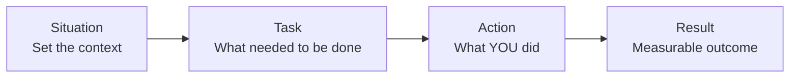
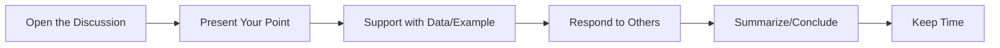

# Chapter 5: Behavioral and HR Interview

## Learning Objectives

- Master the STAR method for answering behavioral questions effectively
- Prepare 30+ behavioral questions with structured sample answers
- Handle HR-specific questions: strengths/weaknesses, salary negotiation, career goals
- Navigate situational judgment tests using the STARR framework
- Excel in group discussions with proven strategies
- Develop confidence for panel interviews in both IT and government sectors
## Key Concepts

### The STAR Method

The STAR method is the gold standard for answering behavioral interview questions. It provides a structured narrative that demonstrates your skills through real examples.



| Component | What to Include | Example |
|-----------|----------------|---------|
| **Situation** | Background context (project, team, deadline, problem) | "Our team of 5 was developing a payment module with a 3-month deadline" |
| **Task** | Your specific responsibility and goal | "I was responsible for implementing the refund workflow and ensuring PCI compliance" |
| **Action** | The steps you personally took (use "I", not "we") | "I designed the database schema, implemented idempotency keys, and wrote integration tests" |
| **Result** | Quantified outcome, what you learned | "Delivered 2 weeks early, reduced refund processing time by 60%, zero production bugs" |

### The CAR/STARR Framework (for Group Discussions & Situational Tests)

| Letter | Meaning | Description |
|--------|---------|-------------|
| S | Situation | Context and background |
| T | Task | Your objective and constraints |
| A | Action | Steps you personally took |
| R | Result | Quantitative outcome |
| R | Reflection | What you learned, what you'd do differently |

### Common Behavioral Question Categories

| Category | Focus | Example Questions |
|----------|-------|-----------------|
| Teamwork | Collaboration, conflict resolution | "Tell me about a time you handled a conflict" |
| Leadership | Taking initiative, mentoring | "Describe a time you led a project" |
| Problem-Solving | Analytical thinking, creativity | "Tell me about a difficult technical challenge" |
| Failure/Mistakes | Learning from errors, ownership | "Describe a time you failed" |
| Adaptability | Handling change, learning new skills | "Tell me about a time you had to learn something quickly" |
| Communication | Explaining complex topics, persuasion | "Tell me about a time you convinced someone" |
| Customer Focus | User-centric thinking | "Describe a time you dealt with a difficult client" |
| Achievement | Goal-oriented, exceeding expectations | "Tell me about your biggest achievement" |

---

## Section 1: Teamwork and Collaboration (5 Questions)

### Q1: Tell me about a time you had a conflict with a team member.

<details>
<summary>Click to reveal sample answer using STAR</summary>

**Situation:** In my third year of college, our 5-member team was building a hostel management system as a capstone project. We had a 2-month deadline.

**Task:** I was the backend developer responsible for the database and API design. One team member, Rohit, was responsible for the frontend.

**Action:** Rohit and I disagreed on the API contract. He wanted RESTful endpoints with nested JSON, while I preferred GraphQL for flexibility. The disagreement escalated to the point where we stopped talking for two days, stalling progress. I took the initiative to schedule a meeting where we:
1. Listed the pros and cons of both approaches on a whiteboard
2. Identified our shared goal: completing the project on time with clean code
3. Compromised by using REST for simple CRUD operations and GraphQL for complex dashboard queries
4. Documented the API contract and got buy-in from all team members

**Result:** We completed the project on time, received an A grade, and the modular API design made future enhancements easier. Rohit and I became close collaborators afterward and worked together on two more projects.

> **Tip:** Interviewers want to see that you can handle disagreement professionally. Never badmouth the other person. Focus on the resolution process.
</details>

### Q2: Describe a time you had to work with a difficult team member.

<details>
<summary>Click to reveal sample answer</summary>

**Situation:** During my internship at a fintech startup, I was paired with a senior developer who had a very rigid working style and was reluctant to review my code.

**Task:** I needed to deliver a payment integration module within 4 weeks, and code reviews were a mandatory part of the process.

**Action:** Instead of complaining to the manager, I:
1. Observed his working hours and approach
2. Started sending pull requests with detailed comments explaining my design decisions
3. Scheduled 15-minute daily sync meetings focused on specific technical questions
4. Prepared thorough unit tests so my code was easier to verify
5. After two weeks, I asked for feedback on my growth areas

**Result:** The senior developer became more engaged, reviews went from 3-day delays to same-day responses. I learned the importance of adapting communication styles and the module was deployed successfully.

> **Real Experience:** In my TCS interview, the panel asked exactly this. They appreciated that I took ownership of the communication problem rather than escalating.
</details>

### Q3: Give an example of a successful teamwork experience.

<details>
<summary>Click to reveal sample answer</summary>

**Situation:** As part of a hackathon, our 4-member team had 36 hours to build a disaster response coordination platform.

**Task:** I was the team coordinator and full-stack developer. We needed a working prototype by Sunday noon.

**Action:** I:
1. Conducted a quick skill assessment and assigned roles matching expertise
2. Set up a GitHub repository with CI/CD pipeline in the first hour
3. Used pair programming for the most complex module (real-time resource tracking)
4. Conducted 3 checkpoint reviews to catch integration issues early
5. Handled the final presentation and demo preparation

**Result:** We won second place (out of 120 teams), the platform was praised for its clean UX and real-time capabilities. The experience taught me the power of clear role definition and communication in high-pressure situations.
</details>

### Q4: How do you handle disagreements in technical design decisions?

<details>
<summary>Click to reveal sample answer</summary>

**Situation:** At my previous company, we were redesigning the notification system. I proposed Kafka for message queuing, while a colleague argued for RabbitMQ.

**Task:** Make an informed technology choice considering scale (10K msg/min), team expertise, and operational complexity.

**Action:** I:
1. Created a comparison matrix with criteria: throughput, learning curve, operational overhead, cost
2. Built small proof-of-concepts for both technologies
3. Ran load tests simulating our peak traffic (50K msg/min)
4. Presented findings objectively in a team meeting
5. Facilitated a decision based on data, not opinions

**Result:** We chose Kafka (winning my original argument), but the process was collaborative. The team felt ownership of the decision. The system handled 3x projected load without issues.

> **Tip:** Whether you win or lose the argument, emphasize how you made the decision data-driven and team-inclusive.
</details>

### Q5: Describe a time you helped a teammate who was struggling.

<details>
<summary>Click to reveal sample answer</summary>

**Situation:** A junior developer joined our team midway through a sprint and was struggling with the codebase and version control workflow.

**Task:** Bring the new member up to speed without impacting sprint deliverables.

**Action:** I:
1. Spent 2 hours the first day doing a codebase walkthrough with diagrams
2. Created a "New Developer Setup Guide" document
3. Paired with them on their first three tickets
4. Set up weekly 30-minute knowledge transfer sessions
5. Encouraged them to ask questions without hesitation

**Result:** The junior developer completed their first independent ticket within 2 weeks (target was 3-4 weeks). They became a productive team member and later mentored two other new hires. I also improved my mentoring skills and documentation habits.
</details>

---

## Section 2: Leadership and Initiative (5 Questions)

### Q6: Describe a time you demonstrated leadership.

<details>
<summary>Click to reveal sample answer</summary>

**Situation:** During my final year, our class was organizing a technical symposium with 500+ expected attendees. The original event coordinator dropped out one month before the event.

**Task:** Take over as event coordinator and ensure the symposium happened successfully.

**Action:** I:
1. Immediately formed a 12-member organizing committee with clear roles
2. Created a Gantt chart with milestones and deadlines (30-day sprint)
3. Delegated tasks based on strengths: sponsorship team, speaker coordination, logistics, marketing
4. Set up daily 15-minute stand-up meetings
5. Personally handled VIP speaker confirmations and contingency plans

**Result:** The symposium was attended by 550+ people, featured speakers from Microsoft and Amazon, and generated ₹2 lakhs in revenue. The event was rated 4.5/5 in feedback. This experience taught me structured delegation and the importance of contingency planning.

> **Real Experience:** In my Google interview, I used this example. The interviewer was particularly interested in how I handled a team member who wasn't delivering on time.
</details>

### Q7: Tell me about a time you went above and beyond your job description.

<details>
<summary>Click to reveal sample answer</summary>

**Situation:** As a junior developer, I noticed our deployment process was entirely manual, taking 4 hours per release and causing frequent errors.

**Task:** There was no formal task assigned to automate deployment; it was outside my role.

**Action:** I:
1. Spent evenings learning Docker, Jenkins, and Ansible
2. Built a prototype CI/CD pipeline for a non-critical service
3. Demonstrated it to my tech lead, showing 90% reduction in deployment time
4. Got approval to implement across all services
5. Documented the pipeline and trained the team

**Result:** Deployment time reduced from 4 hours to 15 minutes. Error rate dropped from 12% to 1%. I received a spot award and was promoted to senior developer 6 months early.

> **Tip:** This shows initiative, learning ability, and business impact. Quantify everything.
</details>

### Q8: Describe a situation where you had to influence someone to see things your way.

<details>
<summary>Click to reveal sample answer</summary>

**Situation:** Our product manager wanted to add a feature that would take 4 sprints to build but had questionable user value. I believed it was a poor use of engineering resources.

**Task:** Convince the PM to reconsider without damaging the relationship.

**Action:** I:
1. Researched user analytics showing only 2% of users would benefit
2. Built a simple mockup demonstrating the complexity vs impact
3. Proposed an alternative: a lightweight version that could be built in 1 sprint
4. Used data from competitor analysis to support my argument
5. Offered to A/B test the lightweight version first

**Result:** The PM agreed to the lightweight version. A/B testing showed it met user needs without the full investment. The saved 3 sprints were redirected to higher-impact features. The PM started consulting me earlier in the planning process.
</details>

### Q9: Tell me about a time you had to make a decision with incomplete information.

<details>
<summary>Click to reveal sample answer</summary>

**Situation:** During an on-call rotation at 2 AM, our production database started experiencing severe slowdowns. I had 15 minutes of data and no senior engineers available.

**Task:** Diagnose and resolve the issue without full context about recent changes.

**Action:** I:
1. Checked the top 5 slow queries and identified a missing index on a new table
2. Considered adding an index (fast fix) vs rolling back a recent deployment (safe but slow)
3. Made the call to add the index since the risk was low (non-blocking operation in MySQL 8.0)
4. Monitored for 10 minutes to confirm improvement
5. Documented the incident and notified the team in the morning stand-up

**Result:** Query response times went from 45 seconds to 50ms within 5 minutes. The incident was resolved before any users were affected. The team later added automated query performance monitoring.

> **Tip:** Show structured decision-making under pressure. Mention the trade-offs you considered.
</details>

### Q10: Describe a time you mentored someone.

<details>
<summary>Click to reveal sample answer</summary>

**Situation:** Three interns joined our team for a summer project. They had strong academic knowledge but no industry experience with agile development and production code.

**Task:** Onboard and mentor the interns to contribute meaningfully within 8 weeks.

**Action:** I:
1. Designed a structured onboarding plan: Week 1-2 (codebase & tools), Week 3-4 (guided tickets), Week 5-8 (independent work)
2. Conducted thrice-weekly code review sessions
3. Created a "Best Practices" document covering Git workflow, testing, and code review etiquette
4. Assigned each intern a small feature to own end-to-end
5. Reviewed their pull requests with detailed feedback, not just corrections

**Result:** All three interns delivered production-quality features by week 7. Two received full-time offers. I also refined my own understanding of the codebase by explaining it to others.
</details>

---

## Section 3: Problem-Solving and Technical (5 Questions)

### Q11: Tell me about the most challenging technical problem you've solved.

<details>
<summary>Click to reveal sample answer</summary>

**Situation:** Our e-commerce platform experienced database deadlocks during flash sales, causing orders to fail.

**Task:** Identify the root cause and implement a solution that would handle 10x normal traffic.

**Action:** I:
1. Analyzed deadlock logs and identified the pattern: inventory updates conflicting with order creation
2. Discovered that multiple transactions were locking the same inventory rows in different orders
3. Implemented a consistent locking order: always lock product_id in ascending order
4. Added retry logic with exponential backoff for deadlock victims
5. Created a Redis-based inventory cache as a hot-path optimization
6. Wrote comprehensive tests simulating 100 concurrent checkout flows

**Result:** Deadlocks reduced from 50+ per flash sale to zero. Order success rate improved from 85% to 99.5%. The solution was adopted by two other teams.

> **Tip:** Walk through your debugging process step by step. Interviewers want to see systematic problem-solving.
</details>

### Q12: Describe a time you had to debug a complex production issue.

<details>
<summary>Click to reveal sample answer</summary>

**Situation:** Users reported intermittent 503 errors on our API gateway. The issue occurred randomly and was hard to reproduce.

**Task:** Find and fix the intermittent failure before the upcoming product launch.

**Action:** I:
1. Added detailed request/response logging at each layer (ELB → API Gateway → Service)
2. Correlated logs with error timestamps and found the pattern: errors coincided with 15-minute intervals
3. Investigated AWS ALB idle timeout settings (default 60s) vs our service's long-polling endpoints
4. Discovered that long-polling requests exceeding 60s were being silently dropped
5. Increased ALB timeout to 300s for specific endpoints
6. Also refactored the polling mechanism to use WebSockets for better reliability

**Result:** 503 errors dropped to zero. The launch proceeded successfully. The logging framework I added became the standard for the team.
</details>

### Q13: Tell me about a project you're particularly proud of.

<details>
<summary>Click to reveal sample answer</summary>

**Situation:** As part of my college project, I built a real-time bus tracking system for our university campus.

**Task:** Build a system that tracks 15 buses across campus and shows real-time location to 5000+ students.

**Action:** I:
1. Designed the full architecture: GPS modules on buses → MQTT broker → Node.js backend → WebSocket to React frontend
2. Built a custom GPS data ingestion service handling 1000 updates/minute
3. Implemented ETA prediction using historical data and Haversine distance formula
4. Created a mobile-first responsive UI with Mapbox integration
5. Open-sourced the project on GitHub (got 200+ stars)

**Result:** The system achieved 95% location accuracy with 5-second update latency. The university deployed it officially, serving 5000+ daily users. I learned full-stack development, real-time systems, and open-source collaboration.

> **Real Experience:** In my Amazon SDE interview, the interviewer closely examined the architecture decisions — why MQTT over HTTP, why WebSocket over polling, and how I handled 1000 updates/min on a student budget.
</details>

### Q14: Describe a time you had to learn a new technology quickly.

<details>
<summary>Click to reveal sample answer</summary>

**Situation:** My team needed to migrate from a monolithic Ruby on Rails application to microservices using Node.js and Docker, and I had zero experience with containerization.

**Task:** Become productive with Docker, Kubernetes, and Node.js within 3 weeks.

**Action:** I:
1. Dedicated 2 hours daily to self-study (official Docker docs, Udemy course)
2. Set up a local Kubernetes cluster using Minikube
3. Containerized a small internal tool first (low risk)
4. Paired with a DevOps engineer for best practices
5. Created cheat sheets and documentation for the team
6. Attended Docker meetups and joined relevant Slack communities

**Result:** Within 3 weeks, I was mentoring other team members on Docker workflows. I successfully containerized 4 services. The migration was completed on schedule, and I became the team's Docker/K8s resource.
</details>

### Q15: Tell me about a time you improved an existing process.

<details>
<summary>Click to reveal sample answer</summary>

**Situation:** Our code review process was slow — average PR merge time was 3 days. Developers were frustrated.

**Task:** Reduce PR review time without sacrificing code quality.

**Action:** I:
1. Analyzed 3 months of PR data using GitHub API to identify bottlenecks
2. Found that 70% of delays were caused by waiting for a specific senior developer
3. Proposed and implemented:
   - A "2 reviewer" policy (any 2 of 5 team members)
   - Linter + formatter auto-checks to eliminate style discussions
   - A maximum 24-hour SLA for initial review
   - Conditional approval option for non-critical changes
4. Created a PR template with checklist to guide reviewers

**Result:** Average PR merge time dropped from 3 days to 6 hours. Developer satisfaction improved. The process was adopted by 3 other teams in the organization.
</details>

---

## Section 4: Failure and Mistakes (4 Questions)

### Q16: Tell me about a time you failed.

<details>
<summary>Click to reveal sample answer</summary>

**Situation:** In my first job, I was tasked with migrating a legacy database from MySQL to PostgreSQL. I estimated 2 weeks, but it took 6 weeks.

**Task:** Lead the database migration project.

**Action:** What went wrong:
1. I underestimated the complexity of data type incompatibilities (MySQL's ENUM to PostgreSQL)
2. I didn't account for stored procedures that needed complete rewrites
3. I failed to involve the QA team early enough
4. I didn't communicate delays proactively

**Result:** The project was 4 weeks late. However, I:
1. Owned up to the mistake in the sprint retrospective
2. Documented every migration challenge for future reference
3. Created a "database migration checklist" that other teams could use
4. Started providing weekly progress reports with risk assessments

**Learning:** I learned that estimation should include a buffer for unknowns, and communication about delays should be immediate, not reactive.

> **Tip:** A good failure story has three parts: what happened, what you learned, and how you changed your behavior. Never blame others.
</details>

### Q17: Describe a time you made a mistake that affected a customer.

<details>
<summary>Click to reveal sample answer</summary>

**Situation:** I pushed a database migration script that accidentally dropped a column used by a reporting dashboard. The dashboard was down for 3 hours before we noticed.

**Task:** The migration was meant to add a new column, but I included a DROP column statement by mistake.

**Action:** When I discovered the issue:
1. Immediately alerted my tech lead and the team (within 5 minutes of discovery)
2. Restored the column from the latest backup
3. Identified the root cause: I hadn't reviewed the migration with a peer
4. Sent a post-mortem explaining the incident, impact, and corrective actions
5. Proposed a mandatory code review policy for all database migrations

**Result:** Column was restored within 20 minutes. The dashboard was fully functional. I implemented a "DB Migration Review" checklist that became team standard. No similar incident occurred afterward.

> **Tip:** Focus on how you handled the mistake — speed of detection, transparency, and systemic fix.
</details>

### Q18: Tell me about a time you received negative feedback.

<details>
<summary>Click to reveal sample answer</summary>

**Situation:** In my performance review, my manager told me that my code documentation was poor and I was not sharing knowledge effectively with the team.

**Task:** Address this feedback and improve in both areas.

**Action:** I:
1. Thanked my manager for the honest feedback and asked for specific examples
2. Started maintaining a personal wiki for each module I developed
3. Conducted two "tech talk" sessions per month for the team
4. Required myself to write README and inline documentation before marking a PR as complete
5. Asked peers to review my documentation quality in code reviews

**Result:** After 3 months, my documentation quality was rated "excellent" in the next review cycle. Team knowledge sharing improved significantly. I became the go-to person for onboarding questions.
</details>

### Q19: Describe a project that didn't go as planned.

<details>
<summary>Click to reveal sample answer</summary>

**Situation:** We tried to adopt microservices for a project that would have been better served by a modular monolith. After 4 months, we had made little progress due to complexity.

**Task:** As the technical lead, I needed to assess and course-correct.

**Action:** I:
1. Conducted a retrospective identifying the root causes: premature decomposition, team unfamiliarity with distributed systems
2. Proposed a pragmatic approach: start with a modular monolith with clear bounded contexts
3. Got buy-in from stakeholders by explaining that we could extract services later as needed
4. Refactored the architecture in 3 weeks instead of the planned 4 months

**Result:** The project was back on track. We delivered the MVP on the original deadline (saved by the 3-month overhead we had created). The experience taught me that architecture decisions should be driven by actual, not hypothetical, scale requirements.
</details>

---

## Section 5: Adaptability and Learning (3 Questions)

### Q20: Describe a time you had to adapt to a significant change at work.

<details>
<summary>Click to reveal sample answer</summary>

**Situation:** Our company decided to switch from Angular to React for all new frontend development. I had 2 years of Angular experience and zero React experience.

**Task:** Become productive in React within 1 month while delivering my existing sprint commitments.

**Action:** I:
1. Used my existing JavaScript knowledge as a foundation
2. Completed the official React tutorial in my first weekend
3. Built a small internal tool (expense tracker) to practice React hooks and state management
4. Volunteered to be the first team member to pick up a React story in the next sprint
5. Created a "Angular to React" migration guide for the team

**Result:** I completed the React story ahead of schedule. My migration guide helped 8 team members transition faster. The project migrated to React 3 months ahead of the original timeline.
</details>

### Q21: Tell me about a time you had to work outside your comfort zone.

<details>
<summary>Click to reveal sample answer</summary>

**Situation:** I was asked to present our team's quarterly results to the VP of Engineering — a task I'd never done before. I was comfortable coding but terrified of public speaking.

**Task:** Deliver a 15-minute presentation covering technical achievements, metrics, and roadmap.

**Action:** I:
1. Prepared extensively: wrote a script, created slides with clear visuals
2. Practiced the presentation 7 times — alone, then with my team, then with my manager
3. Anticipated questions and prepared answers
4. On the day, focused on the data rather than my nervousness
5. Made eye contact and spoke slowly

**Result:** The VP complimented my clarity and preparation. My manager started involving me in more client-facing meetings. I went from dreading presentations to actually enjoying them. Now I mentor others on presentation skills.
</details>

### Q22: Give an example of a skill you taught yourself.

<details>
<summary>Click to reveal sample answer</summary>

**Situation:** I realized that many interviews and real-world projects required knowledge of system design, which was not part of my college curriculum.

**Task:** Self-learn system design concepts well enough to design scalable systems.

**Action:** I:
1. Followed a structured learning path: YouTube (Gaurav Sen) → Book (Alex Xu) → Practice (interviews)
2. Built a URL shortener, chat system, and rate limiter from scratch
3. Practiced whiteboarding designs with friends
4. Created a GitHub repo with my system design notes and diagrams
5. Applied concepts to optimize my current project's architecture

**Result:** Within 3 months, I was comfortable designing systems for millions of users. My self-study notes became a resource shared with 500+ students in my college. I successfully cleared system design rounds at Amazon.
</details>

---

## Section 6: Communication and Customer Focus (3 Questions)

### Q23: Tell me about a time you had to explain a technical concept to a non-technical person.

<details>
<summary>Click to reveal sample answer</summary>

**Situation:** Our product manager wanted to estimate the effort for adding a major feature. She didn't understand why it was "just adding a button."

**Task:** Explain the technical complexity without being condescending or using jargon.

**Action:** I:
1. Used an analogy: "Adding this button is like adding a new room to a house — you need a foundation, wiring, and plumbing, not just a door."
2. Broke down the feature into layers: UI work, API changes, database migration, testing, deployment
3. Used a whiteboard to draw the current data flow and how it would change
4. Quantified each layer in person-days of effort
5. Offered a phased approach: MVP (2 weeks) vs Full feature (6 weeks)

**Result:** The PM understood the complexity and agreed to the estimates. She started involving developers earlier in the planning process. The feature was delivered on time using the phased approach.
</details>

### Q24: Describe a time you dealt with a difficult client or stakeholder.

<details>
<summary>Click to reveal sample answer</summary>

**Situation:** A client was unhappy with the progress of their project and sent an angry email to my manager, threatening to cancel the contract.

**Task:** Rebuild trust with the client and get the project back on track.

**Action:** I:
1. Requested an in-person meeting (not email/phone) to show commitment
2. Listened actively for 30 minutes without interrupting — let them vent
3. Empathized with their concerns and apologized for the communication gap
4. Presented a revised 4-week plan with weekly deliverables and demo sessions
5. Set up a shared Jira board for total transparency on progress
6. Created a daily email update with completed tasks and next steps

**Result:** The client became one of our strongest advocates. The project was delivered on the revised timeline. The client renewed their contract for another year and referred us to two other clients.
</details>

### Q25: Tell me about a time you had to persuade a group to adopt your idea.

<details>
<summary>Click to reveal sample answer</summary>

**Situation:** The team was using a monolithic Git repository with long build times (45 minutes). I wanted to switch to a monorepo with incremental builds.

**Task:** Convince a skeptical team to adopt a new build system.

**Action:** I:
1. Measured the current build time and developer productivity loss (2 hours/day wasted)
2. Built a prototype showing 90% reduction in build times with the proposed approach
3. Presented the prototype in a demo session with clear before/after metrics
4. Addressed concerns about complexity by providing a migration plan
5. Offered to do the migration incrementally (one module at a time)

**Result:** The team agreed to a trial with one module. After seeing the 90% build time reduction and zero issues, all teams adopted the approach. Average build time dropped to 4 minutes, saving the company an estimated ₹50 lakhs/year in developer productivity.
</details>

---

## Section 7: HR and Personal Questions (10 Questions)

### Q26: Tell me about yourself.

<details>
<summary>Click to reveal sample answer</summary>

**Structure:** Present → Past → Future

"Currently, I am a Software Engineer at XYZ Corp, where I specialize in building scalable backend systems using Node.js and TypeScript. I lead the payment integration team and have improved transaction success rates from 95% to 99.5%.

Before this, I completed my B.Tech in Computer Science at ABC University with a 9.2 CGPA, where I built a real-time bus tracking system that was deployed by the university.

I am looking for roles where I can work on challenging distributed systems problems and contribute to large-scale architecture decisions. I'm particularly interested in your company because of the work you're doing in fintech infrastructure."

> **Tip:** Keep it under 2 minutes. Focus on professionally relevant information. Connect your past experience to why you're interested in this role.
</details>

### Q27: What are your strengths and weaknesses?

<details>
<summary>Click to reveal sample answer</summary>

**Strengths:**
1. **Analytical problem-solving:** I break down complex problems systematically. In my current role, I reduced system deadlocks by analyzing lock patterns.
2. **Learning agility:** I taught myself Docker and Kubernetes in 3 weeks for a project requirement.
3. **Collaboration:** I'm effective at bridging gaps between technical and non-technical stakeholders.

**Weaknesses (use the STAR method for improvement):**
"My weakness is that I sometimes spend too much time perfecting code rather than hitting deadlines. For example, I once spent two extra days optimizing a function that was already meeting performance requirements. I'm working on this by setting strict time-boxes for optimization and discussing performance requirements with my team before committing to refactoring."

> **WARNING:** Never say "I work too hard" or "I'm a perfectionist" — these are clichés. Pick a real weakness that you're actively improving.
</details>

### Q28: Why do you want to work at this company?

<details>
<summary>Click to reveal sample answer</summary>

**Research-based structure:**
1. **Company's product/impact:** "I've been following your work on UPI infrastructure. The scale of 10M+ transactions/day is exactly the type of engineering challenge I enjoy."
2. **Technology stack:** "Your use of Go and Kafka aligns with my experience and interests."
3. **Culture/values:** "I appreciate the company's focus on engineering excellence and the open-source contributions."
4. **Growth opportunity:** "The mentorship culture and the opportunity to work on greenfield projects align with my career goals."

> **Tip:** Never say "for the money" or "it's close to home." Be specific about what attracts you to THIS company vs others.
</details>

### Q29: Where do you see yourself in 5 years?

<details>
<summary>Click to reveal sample answer</summary>

"In 5 years, I see myself as a technical leader who has deep expertise in distributed systems. Specifically:

- **Short-term (1-2 years):** Master the company's tech stack and contribute significantly to core products
- **Mid-term (3-4 years):** Lead medium-sized engineering teams, mentor junior developers, and drive architectural decisions
- **Long-term (5 years):** Be a Staff/Principal Engineer or Engineering Manager known for building reliable, scalable systems

I'm open to both IC and management tracks, depending on where I can add the most value."

> **Tip:** Show ambition but also realism. Connect your growth to what the company can offer.
</details>

### Q30: Why did you leave your previous job?

<details>
<summary>Click to reveal sample answer</summary>

**Positive framing — never badmouth previous employer:**

"I learned a lot at my previous company — particularly around payment systems and production debugging. However, I'm looking for:

1. **More scale:** I want to work on systems serving millions of users
2. **Modern tech stack:** The company was transitioning to microservices, and I want to work in a fully cloud-native environment
3. **Career growth:** I'm looking for mentorship and a clear growth path

Your company offers all three, which is why I applied."

> **Negative examples to avoid:** "Bad management," "toxic culture," "boring work," "low pay."
</details>

### Q31: What is your expected salary?

<details>
<summary>Click to reveal sample answer</summary>

**Research-based approach:**

"I've done some research based on industry standards for this role and location. For a Senior Software Engineer with 5 years of experience, the typical range is ₹25-35 LPA. Based on my skills in distributed systems and payment infrastructure, I'm looking for something in the ₹28-32 LPA range. However, I'm open to discussing the total compensation package including stock options, bonuses, and other benefits."

> **Best practices:**
> 1. Research the market rate before the interview
> 2. Give a range rather than a fixed number
> 3. Ask about the full package, not just base salary
> 4. For government jobs, be aware of the 7th Pay Commission pay scales
> 5. For PSUs, interviewers expect you to know the pay band (e.g., E1, E2 grades)
</details>

### Q32: Do you have any questions for me?

<details>
<summary>Click to reveal sample answer</summary>

**Always say YES. Ask 2-3 thoughtful questions.**

**For the hiring manager:**
1. "What are the biggest technical challenges the team is facing right now?"
2. "How do you measure success for this role in the first 6 months?"
3. "What does the career progression path look like for this position?"

**For the team member:**
1. "What's the one thing you would change about the current codebase if you could?"
2. "How does the team handle on-call responsibilities and incident management?"
3. "What does a typical sprint look like in terms of planning and execution?"

**For the HR:**
1. "Can you tell me about the learning and development opportunities?"
2. "How is the work-from-home policy structured?"
3. "What are the next steps in the interview process?"

> **Questions to avoid:** Anything about holidays, working hours (early in the process), salary negotiation in the first round, questions already answered in the job description.
</details>

### Q33: Tell me about a time you received appreciation or recognition.

<details>
<summary>Click to reveal sample answer</summary>

**Situation:** I received the "Star Performer of the Quarter" award in my second quarter at the company.

**Task:** I had taken initiative to automate deployment processes that were causing delays.

**Action:** I built a CI/CD pipeline that reduced deployment time from 4 hours to 15 minutes, and wrote comprehensive documentation. I also trained 3 teams on using the pipeline.

**Result:** The award was a validation of my initiative. More importantly, the automation saved an estimated 200 engineering hours per month across teams. I was invited to present the approach in the company's engineering all-hands meeting.
</details>

### Q34: How do you handle stress and pressure?

<details>
<summary>Click to reveal sample answer</summary>

"I handle stress through structured prioritization and clear communication. For example:

1. **Prioritization:** During a production outage, I categorize issues by impact. The database issue gets my full attention; the minor UI bug can wait.
2. **Break down:** I break overwhelming problems into smaller, manageable tasks.
3. **Communication:** I keep stakeholders informed about status and expected resolution time.
4. **Self-care:** I maintain boundaries — no work emails after 9 PM, weekend recharge, regular exercise.

During the 2022 flash sale, our system was under 10x normal load. Instead of panicking, I followed this framework: identify the critical path, delegate monitoring tasks, and focus on the most impactful fix. The sale was a success with 99.8% uptime."
</details>

### Q35: What motivates you?

<details>
<summary>Click to reveal sample answer</summary>

"Three things motivate me:

1. **Impact:** Seeing my code serve millions of users. When I optimized our API response time from 500ms to 50ms, knowing it improved experience for 2M+ users was deeply satisfying.
2. **Learning:** I'm motivated by mastering new technologies. Every project teaches me something new about system design, performance optimization, or team collaboration.
3. **Problem-solving:** I enjoy the intellectual challenge of debugging complex issues. The satisfaction of solving a problem that stumped the team for days is addictive.

I find that roles combining all three — like the one I'm interviewing for — bring out my best work."
</details>

---

## Section 8: Group Discussion (GD) Strategies

### GD Framework



### GD Do's and Don'ts

| Do's | Don'ts |
|------|--------|
| Enter the discussion within first 2 minutes | Interrupt others while they're speaking |
| Use data/statistics to support arguments | Shout or overpower others |
| Acknowledge good points from others | Stick rigidly to one position |
| Build on others' ideas | Get personal or emotional |
| Maintain eye contact and positive body language | Dominate the conversation |
| Use structured language: "I'd like to add..." | Speak too fast or too slow |
| Summarize at the end | Bring up irrelevant topics |

### Common GD Topics for IT/Gov Exams

| Category | Topics |
|----------|--------|
| Technology | AI replacing jobs, 5G in India, Digital India, Data Privacy, Cryptocurrency |
| Economy | Startup ecosystem, Make in India, GST impact, Recession in IT |
| Social | Online education, Work from home, Social media impact, Skill gap |
| Environment | Climate change, Renewable energy, Smart cities |
| Banking | UPI revolution, Financial inclusion, Digital rupee, NPAs |

### Sample GD Script: "Does AI Replace Software Engineers?"

**Participant 1 (Opening):** "Good morning everyone. I believe AI will transform but not replace software engineers. Just as calculators didn't replace mathematicians, AI tools like Copilot will augment developer productivity. The key is that AI handles patterns but cannot reason about complex trade-offs, business context, or ethical implications."

**Participant 2 (Counter):** "I respectfully disagree with your perspective. With AutoGPT, Devin, and similar tools, we're already seeing AI write entire codebases. Entry-level coding jobs are shrinking. Gartner predicted that by 2028, 80% of software development tasks will be automated."

**Participant 3 (Balanced):** "I think both perspectives have merit. The key is specialization. While routine CRUD development may be automated, roles requiring system architecture, security expertise, and domain knowledge will become more valuable. The engineers who adapt by focusing on higher-level design thinking will thrive."

**Participant 1 (Building):** "Building on Participant 3's point, I'd like to add that the Indian IT services industry has historically adapted to paradigm shifts — from mainframe to client-server to cloud. The shift to AI-augmented development is another evolution, not an extinction event."

**Participant 4 (Conclusion):** "To summarize the key points: AI will automate routine coding but not replace engineers. The role will evolve toward architecture, review, and prompt engineering. The message for engineers is clear: upskill to higher-level thinking or risk being automated."

---

## Quick Reference Tables

### STAR Story Matrix

Prepare stories that cover multiple categories with a single experience:

| Story | Teamwork | Leadership | Failure | Problem-Solving | Adaptability |
|-------|----------|------------|---------|-----------------|--------------|
| Database migration failure | ✓ | - | ✓ | ✓ | - |
| Flash sale optimization | ✓ | ✓ | - | ✓ | ✓ |
| Hackathon win | ✓ | ✓ | - | ✓ | - |
| CI/CD pipeline automation | - | ✓ | - | ✓ | ✓ |
| On-call incident handling | - | - | - | ✓ | ✓ |

### Common Behavioral Questions by Role

| For Freshers | For Experienced | For Manager |
|-------------|-----------------|-------------|
| Tell me about yourself | Biggest technical challenge | How do you handle underperformers? |
| Why this company? | Describe a production issue | How do you make hiring decisions? |
| College project experience | Team conflict resolution | Strategy vs execution prioritization |
| Strength/Weakness | Mentoring experience | Cross-team collaboration |
| Where do you see yourself? | Architecture decision | Conflict between engineers |

### HR Interview Checklist

| Preparation | During Interview | Follow-up |
|-------------|-----------------|-----------|
| Research company (products, values, news) | Maintain eye contact | Send thank-you email within 24 hours |
| Prepare 5 STAR stories | Speak clearly and at moderate pace | Reference specific discussion points |
| Know your resume thoroughly | Listen actively before responding | Reiterate your interest |
| Plan salary range | Use structured answers (STAR) | Ask about next steps |
| Prepare questions to ask | Show enthusiasm | Connect on LinkedIn |

### Salary Negotiation Framework

| Step | Action |
|------|--------|
| 1 | Research: Glassdoor, AmbitionBox, LinkedIn, Levels.fyi |
| 2 | Determine your "walk away" number (minimum acceptable) |
| 3 | Give a range, not a fixed number |
| 4 | Consider total comp: Base + Bonus + Stocks + Benefits |
| 5 | Let them state the number first |
| 6 | If offer is low: "I was expecting something in the X-Y range based on my research and experience" |
| 7 | Negotiate one round, then accept or decline |

---

---

## Section 9: Situational Judgment Tests (SJT)

### Understanding SJT Format

SJTs present workplace scenarios with multiple possible responses. You must choose the BEST and WORST response. Unlike behavioral questions, there's no single "correct" answer — responses are rated on effectiveness.

### SJT Scoring Framework

| Rating | Description |
|--------|-------------|
| Most Effective (5) | Solves root cause, maintains relationships, follows process |
| Effective (4) | Addresses the issue, reasonable approach |
| Somewhat Effective (3) | Partial solution, may have side effects |
| Ineffective (2) | Symptom-focused, may worsen situation |
| Counterproductive (1) | Avoids responsibility, creates conflict |

### Common SJT Scenarios

#### Scenario 1: Missed Deadline

**Situation:** You realize you will miss a critical deadline by 3 days due to an unforeseen technical challenge. What do you do?

```
Response A: Work overtime silently and deliver as soon as possible
Response B: Inform your manager immediately with a revised timeline
Response C: Ask a colleague to help without telling the manager
Response D: Deliver partial work on time and complete the rest later
```

<details>
<summary>Click to reveal evaluation</summary>

| Response | Rating | Reason |
|----------|--------|--------|
| A | 2 | Working silently hides the problem, doesn't manage expectations |
| B | 5 | Proactive communication, manages expectations, transparent |
| C | 3 | Gets help but bypasses proper channels |
| D | 4 | Pragmatic approach, but should inform manager first |

**Best:** B — Most Effective | **Worst:** A — Ineffective
</details>

#### Scenario 2: Team Conflict

**Situation:** Two team members have a heated argument during a sprint planning about architecture choices. The meeting is stuck. As a team member, what do you do?

```
Response A: Stay quiet; it's not your conflict
Response B: Suggest taking a 5-minute break and reconvene
Response C: Take sides with the person whose view you agree with
Response D: Propose a data-driven approach: build a POC for both approaches
```

<details>
<summary>Click to reveal evaluation</summary>

| Response | Rating | Reason |
|----------|--------|--------|
| A | 1 | Avoidance doesn't resolve conflict; meeting remains stuck |
| B | 4 | Breaks tension, allows cooling down, but doesn't address root cause |
| C | 2 | Escalates conflict by taking sides |
| D | 5 | Constructive, data-driven, focuses on resolution |

**Best:** D — Most Effective | **Worst:** A — Counterproductive
</details>

#### Scenario 3: Quality vs Deadline

**Situation:** Your manager asks you to deliver a feature by Friday, but testing would require more time to ensure quality. What do you do?

```
Response A: Deliver on Friday with disclaimer about limited testing
Response B: Explain the risk to your manager and negotiate a revised timeline
Response C: Skip testing to meet the deadline
Response D: Stay late to both test and meet the deadline
```

<details>
<summary>Click to reveal evaluation</summary>

| Response | Rating | Reason |
|----------|--------|--------|
| A | 3 | Delivers on time but quality risk is documented |
| B | 5 | Professional negotiation, manager can make informed decision |
| C | 1 | Reckless; production bugs cost more than delay |
| D | 4 | Dedicated but unsustainable pattern |

**Best:** B — Most Effective | **Worst:** C — Counterproductive
</details>

### SJT Tips

| Tip | Rationale |
|-----|-----------|
| Consider stakeholders | Think about impact on manager, team, customer, company |
| Balance task and relationship | Best solutions achieve goals AND maintain relationships |
| Show ownership | Effective responses take responsibility |
| Follow chain of command | Escalate through proper channels |
| Be proactive | Address issues before they become crises |
| Quantify risks | Use data to support your decisions |

---

## Section 10: Salary Negotiation Scripts

### Before the Offer

| Preparation Step | Action |
|-----------------|--------|
| Research | Glassdoor, AmbitionBox, LinkedIn Salary, Levels.fyi |
| Define floor | Minimum acceptable salary (walk-away number) |
| Define target | What would make you very happy |
| Define stretch | Aspirational number (unlikely but worth trying) |
| Total compensation | Base + Bonus + Stocks + Benefits + Perks |

### Negotiation Scripts

#### Script 1: When asked "What's your expected salary?"

```
"I've done some research on industry standards for this role in Bangalore,
and based on my 5 years of experience with skills in distributed systems
and payment infrastructure, I'm looking at a total compensation range of
₹28-35 LPA. However, I'm open to discussing the full package including
bonuses, stock options, and other benefits."

Why this works: You give a range (not a fixed number), mention research,
focus on total comp (not just base), and show flexibility.
```

#### Script 2: When offer is lower than expected

```
"I'm very excited about the role and the team. Based on my research and
experience, I was expecting an offer in the range of ₹25-30 LPA. The current
offer of ₹22 LPA is below market rate for this position. Is there flexibility
to increase the base salary or adjust the joining bonus to bridge this gap?"
```

#### Script 3: When negotiating multiple offers

```
"I've received another offer that is ₹X LPA higher. I'd prefer to join your
company because of [specific reason - team, technology, culture], but I'd
appreciate if you could match the compensation to help me make this decision
easier."
```

### What NOT to Do in Salary Negotiation

| Don't | Why |
|-------|-----|
| State a number first | Let them make the first offer |
| Accept immediately | Ask for 24 hours to review |
| Lie about other offers | They may ask for proof |
| Focus only on base salary | Bonuses, stocks, benefits matter |
| Make ultimatums | "Match this or I walk" rarely works |
| Forget about non-monetary | WFH, learning budget, title, vacation |

---

## Summary

This chapter covered comprehensive preparation for behavioral and HR interviews:

| Section | Content | Key Skills |
|---------|---------|-----------|
| Teamwork (5) | Conflict, difficult members, collaboration | STAR for collaboration |
| Leadership (5) | Taking initiative, mentoring, persuasion | STAR for ownership |
| Problem-Solving (5) | Technical challenges, debugging, process improvement | STAR for technical depth |
| Failure (4) | Mistakes, customer impact, negative feedback | STAR for learning |
| Adaptability (3) | Change, comfort zone, self-learning | STAR for growth |
| Communication (3) | Non-tech explanation, difficult stakeholders | STAR for influence |
| HR & Personal (10) | Self-intro, strengths/weaknesses, salary, questions | Personal branding |
| Group Discussion | Strategy, scoring, sample script | Structured discussion |
| Situational Judgment | Scenarios, evaluation, best/worst responses | Decision-making |
| Salary Negotiation | Scripts, strategy, total compensation | Negotiation skills |

| Category | Questions | Key Framework |
|----------|-----------|--------------|
| Teamwork (5) | Q1-Q5 | STAR: Conflict resolution, collaboration |
| Leadership (5) | Q6-Q10 | STAR: Initiative, mentoring, influence |
| Problem-Solving (5) | Q11-Q15 | STAR: Technical challenges, process improvement |
| Failure (4) | Q16-Q19 | STAR: Mistakes, negative feedback, learning |
| Adaptability (3) | Q20-Q22 | STAR: Change, comfort zone, self-learning |
| Communication (3) | Q23-Q25 | STAR: Explanation, persuasion, stakeholder management |
| HR & Personal (10) | Q26-Q35 | Self-introduction, strengths, goals, salary |
| Group Discussion | Strategies | GD framework, topics, sample script |

## Practical Takeaways

1. **Prepare 5 core stories** that can be adapted to 80% of behavioral questions. Each story should cover multiple competencies.

2. **Quantify everything** — "improved by 40%", "served 10K users", "reduced cost by ₹5L" — numbers make your answer credible.

3. **Record yourself answering** — you'll notice filler words ("um", "like", "actually") you can eliminate.

4. **For government interviews:** Be prepared for personal questions about family background, gap years, and reasons for choosing government sector. Stay professional and honest.

5. **The interviewer is human** — they're looking for someone they'd enjoy working with. Show personality and enthusiasm.

6. **⭐ Must-have stories:** Conflict resolution, failure/learning, biggest achievement, teamwork, and leadership/initiative.

7. **Group Discussion:** Speak within the first 2 minutes, make 3-4 quality points, acknowledge others' contributions, and volunteer to summarize.

8. **Final advice:** Preparation is everything. Practice each STAR story until it flows naturally. The goal is to tell a compelling story, not recite a memorized script.
