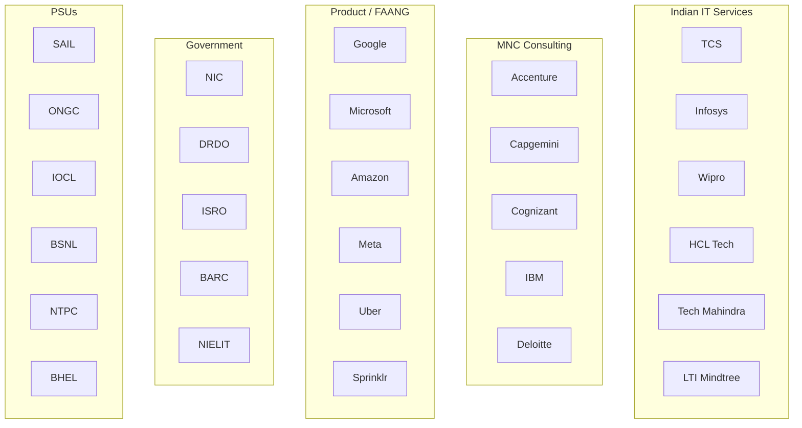
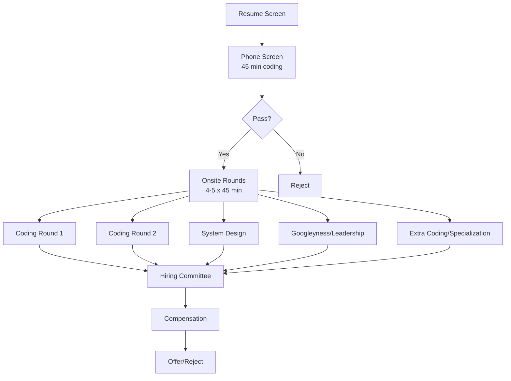
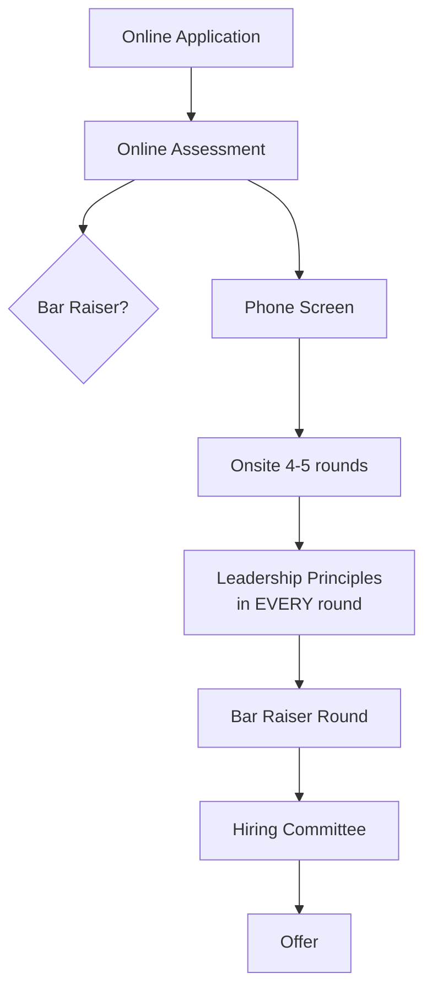

# Chapter 9: Company-Wise Preparation Strategy

## Learning Objectives

- Understand interview patterns for major IT service companies (TCS, Infosys, Wipro, HCL, Tech Mahindra)
- Master strategies for product-based companies (Google, Microsoft, Amazon, Uber, Meta)
- Prepare for Accenture, Capgemini, Cognizant and other MNC consulting firms
- Develop targeted preparation for government organizations (NIC, NIELIT, DRDO, ISRO, BARC)
- Learn preparation strategies for PSUs (SAIL, ONGC, IOCL, BSNL, NTPC, BHEL)
- Identify company-specific question patterns and focus areas

<!-- Image Gallery -->
<section class="lesson-visuals" aria-label="Visual learning resources">
  <header><span>VISUAL LEARNING</span><h2>See it. Review it. Remember it.</h2></header>
  <a class="lesson-visual-card" href="../../assets/images/lessons/interview-preparation/09-company-wise-preparation/handwritten-notes.png" target="_blank" rel="noopener">
    
    <span><strong>Handwritten notes</strong>Condensed notes for deliberate review.</span>
  </a>
  <a class="lesson-visual-card" href="../../assets/images/lessons/interview-preparation/09-company-wise-preparation/sticky-notes.png" target="_blank" rel="noopener">
    
    <span><strong>Sticky-note revision</strong>Fast recall prompts for revision.</span>
  </a>
  <a class="lesson-visual-card" href="../../assets/images/lessons/interview-preparation/09-company-wise-preparation/visual-explanation.png" target="_blank" rel="noopener">
    
    <span><strong>Visual concept guide</strong>A connected explanation of the key ideas.</span>
  </a>
</section>
<!-- End Image Gallery -->

## Company-Wise Interview Landscape



### Difficulty Spectrum

```
Easier ─────────────────────────────────────────────── Harder
    TCS, Wipro, HCL    Infosys, Accenture    Google, Microsoft, Amazon
    (Core CS basics)   (Moderate DSA)        (Advanced DSA + System Design)
```

---

## Section 1: TCS (Tata Consultancy Services)

### Company Profile

| Aspect | Details |
|--------|---------|
| Founded | 1968 |
| CEO | K Krithivasan (as of 2024) |
| Headquarters | Mumbai |
| Employees | 600,000+ |
| Revenue | ~$29 billion |
| Services | IT services, consulting, business solutions |
| Key Clients | Banking, retail, telecom, airlines |

### Interview Process

| Role | Rounds |
|------|--------|
| TCS Ninja (Fresher) | Aptitude + Email Writing + Technical + HR |
| TCS Digital (Fresher) | Advanced Aptitude + Coding + Technical + HR |
| TCS iON (Vocational) | Aptitude + Domain Knowledge |
| Experienced | Technical (2-3 rounds) + Managerial + HR |

### TCS Ninja vs TCS Digital

| Aspect | TCS Ninja | TCS Digital |
|--------|-----------|-------------|
| Who | All engineering graduates | Top performers (selected via NQT) |
| Salary | ₹3.36 - ₹3.6 LPA | ₹7 - ₹10 LPA |
| Role | Developer, Support | Digital roles (AI, Cloud, DevOps) |
| Training | Initial 3-month ILP | Initial training + specialization |
| Coding test | Basic | Advanced (Medium LeetCode) |

### TCS NQT (National Qualifier Test) Pattern

| Section | Questions | Duration |
|---------|-----------|----------|
| Numerical Ability | 26 | 40 min |
| Reasoning Ability | 24 | 35 min |
| Verbal Ability | 22 | 25 min |
| Programming Logic | 10 | 15 min |
| Coding (Digital only) | 1-2 | 30 min |

### Common TCS Technical Questions

<details>
<summary>Click to reveal</summary>

**Core Java:**
- OOPs concepts with examples
- Difference between abstract class and interface
- String vs StringBuilder vs StringBuffer
- Exception handling hierarchy
- Collection framework: List vs Set vs Map
- HashMap internal working
- Multithreading: Thread vs Runnable, synchronized keyword

**SQL:**
- JOINs — write queries using different JOINs
- GROUP BY with aggregate functions
- Subqueries and correlated subqueries
- Normalization (1NF to 3NF)
- Indexes and performance

**Web Technologies:**
- HTML5 semantic elements
- CSS box model, flexbox, grid
- JavaScript closures, callbacks, promises
- REST API principles

**General:**
- SDLC and Agile methodology
- Testing types
- Cloud basics (AWS/Azure)
- Version control (Git)
</details>

### TCS Interview Tips

| Tip | Why |
|-----|-----|
| Be thorough with resume projects | TCS panels ask detailed questions about project tech stack |
| Prepare for "Why TCS?" | They value loyalty and company alignment |
| Improve communication English | TCS has global clients; communication matters |
| Know TCS products | BaNCS (banking), Ignio (AI), Quartz (blockchain) |
| Be prepared for group discussion | TCS sometimes conducts GD for mass recruitment |

> **Real Experience:** In my TCS interview, they asked me to write a SQL query with INNER JOIN and LEFT JOIN difference. Then they asked about HashMap internal working in Java. The HR round was very straightforward — mostly about relocation flexibility.
</details>

---

## Section 2: Infosys

### Company Profile

| Aspect | Details |
|--------|---------|
| Founded | 1981 |
| Headquarters | Bangalore |
| Employees | 340,000+ |
| Revenue | ~$18.5 billion |
| Key Products | Finacle (CBS), Infosys Nia (AI), EdgeVerve |

### Interview Process

| Role | Rounds |
|------|--------|
| Systems Engineer (SE) | InfyTQ/Coding + Technical + HR |
| Power Programmer | Coding (Hard) + System Design + HR |
| Experienced | 2-3 Technical + Managerial + HR |

### Infosys InfyTQ

| Stage | Details |
|-------|---------|
| Qualifier Test | Online: Aptitude + Technical MCQs |
| Certification Exam | Coding (2 problems, 2 hours) |
| Interview | Technical + HR (15-20 min) |

### Infosys Coding Patterns

```typescript
// Infosys typically asks problems like:
// 1. Array manipulation
function rotateArray(arr: number[], k: number): number[] {
  // Rotate array by k positions
}

// 2. String processing
function removeDuplicates(s: string): string {
  // Remove adjacent duplicates
}

// 3. Matrix operations
function spiralOrder(matrix: number[][]): number[] {
  // Return elements in spiral order
}

// 4. Basic DP
function maxSubarraySum(arr: number[]): number {
  // Kadane's algorithm
}
```

### Common Infosys Interview Questions

<details>
<summary>Click to reveal</summary>

**Technical:**
1. Explain OOPs with real-world examples
2. Spring Boot vs Spring framework
3. REST API design principles
4. Microservices architecture patterns
5. Write SQL queries with joins and subqueries
6. Explain ACID properties
7. What is Docker? How is it different from VM?
8. Explain Agile vs Waterfall

**HR:**
1. Tell me about yourself (crisp 2-minute answer)
2. Why Infosys over TCS/Wipro?
3. Are you willing to relocate?
4. Where do you see yourself in 5 years?
5. What is your ideal work environment?

**Finacle-specific (for experienced):**
1. What is CBS? How does Finacle work?
2. Explain Finacle architecture (core, channels, integration)
3. How do you handle Finacle customization?
4. Database schema used in Finacle
</details>

> **Real Experience:** My Infosys Power Programmer interview had 3 coding problems in 1 hour. First was easy (reverse a linked list), second was medium (detect cycle in graph), third was hard (edit distance DP). The technical round focused heavily on my project architecture decisions.

---

## Section 3: Wipro, HCL, Tech Mahindra

### Wipro

| Aspect | Details |
|--------|---------|
| Founded | 1945 (IT: 1980) |
| Headquarters | Bangalore |
| Employees | 240,000+ |
| Revenue | ~$10.3 billion |
| Hiring | Wipro NLTH (National Talent Hunt) |

**Wipro NLTH Pattern:**
| Section | Questions | Duration |
|---------|-----------|----------|
| Quantitative Aptitude | 20 | 25 min |
| Logical Reasoning | 14 | 20 min |
| Verbal | 20 | 25 min |
| Coding | 1 | 30 min |
| Essay Writing | 1 | 20 min |

**Wipro Common Questions:**
<details>
<summary>Click to reveal</summary>

1. OOPs concepts — define with examples
2. Difference between C and Java
3. What is inheritance? Types?
4. SQL: GROUP BY, HAVING, ORDER BY differences
5. What is a pointer? (for C questions)
6. Palindrome check program
7. Fibonacci series
8. HTML form elements
</details>

### HCL Technologies

| Aspect | Details |
|--------|---------|
| Founded | 1976 |
| Headquarters | Noida |
| Employees | 220,000+ |
| Revenue | ~$12 billion |
| Unique | Strong focus on engineering & R&D |

**HCL Interview Focus:**
- Strong emphasis on core engineering concepts
- Networking and hardware questions for R&D roles
- Linux administration knowledge valued
- HCL's "Employees First" philosophy in HR questions
- Technical questions often touch on:
  - Network protocols (TCP/IP, HTTP, DNS)
  - Operating systems (process, threads, memory)
  - Database concepts (SQL, normalization)
  - Basic coding in Java/C++/Python

### Tech Mahindra

| Aspect | Details |
|--------|---------|
| Founded | 1986 |
| Headquarters | Pune |
| Employees | 150,000+ |
| Revenue | ~$6.4 billion |
| Focus | Telecom, digital transformation |

**Tech Mahindra Interview Focus:**
- Telecom domain knowledge (5G, IoT, network protocols)
- Digital technologies (AI/ML, Cloud, DevOps)
- Agile methodology experience
- Customer communication skills
- Design patterns and microservices

---

## Section 4: Accenture and Capgemini

### Accenture

| Aspect | Details |
|--------|---------|
| Founded | 1989 (Dublin) |
| India HQ | Bangalore |
| Employees (India) | 300,000+ |
| Revenue (Global) | ~$64 billion |
| Services | Strategy, Consulting, Digital, Technology, Operations |

**Accenture Interview Process:**
| Round | Type | Duration |
|-------|------|----------|
| Cognitive Assessment | Aptitude + Tech MCQs | 90 min |
| Coding Round | 2 problems | 45 min |
| Technical Interview | 1-2 rounds | 30-45 min |
| HR Interview | 1 round | 15-20 min |

**Accenture Technical Focus:**
<details>
<summary>Click to reveal</summary>

1. **Core Java:** Collections, multithreading, exception handling
2. **SQL:** Complex queries with multiple joins, subqueries
3. **Web services:** SOAP vs REST, how to design REST APIs
4. **Design patterns:** Singleton, Factory, MVC
5. **Cloud basics:** AWS/Azure services (EC2, S3, Lambda)
6. **Testing:** Unit testing (JUnit), integration testing
7. **Agile/Scrum:** Sprint structure, ceremonies
8. **Microservices:** Service discovery, API gateway, circuit breaker

**Expected coding problems:**
- Array rotation, two-pointer problems
- String manipulation
- Linked list reversal
- Basic tree traversal
</details>

### Capgemini

| Aspect | Details |
|--------|---------|
| Founded | 1967 (France) |
| India HQ | Mumbai |
| Employees (India) | 150,000+ |
| Revenue (Global) | ~€22 billion |
| Key Offerings | AI, Cloud, Digital Engineering |

**Capgemini Interview Process:**
| Round | Details |
|-------|---------|
| Online Test | Aptitude + Technical MCQs |
| Technical Round | Core CS + Domain knowledge |
| Managerial Round | Project experience, process knowledge |
| HR Round | Fitment, communication |

**Capgemini Focus Areas:**
- Java/Spring Boot/React full-stack skills
- Cloud certification (AWS/Azure) valued
- Strong bias toward domain expertise (banking, insurance, manufacturing)
- Technical communication — can you explain to non-tech stakeholders?
- Design thinking and innovation mindset

---

## Section 5: Google

### Company Profile

| Aspect | Details |
|--------|---------|
| Founded | 1998 |
| Headquarters | Mountain View, CA |
| Employees | 180,000+ |
| Revenue | ~$340 billion |
| Products | Search, Android, YouTube, Cloud, Maps |

### Google Interview Process



### Google Interview Focus Areas

| Round | Topics | Preparation |
|-------|--------|-------------|
| Coding | Arrays, Strings, Trees, Graphs, DP | LeetCode Hard+Medium |
| System Design | Scalable distributed systems | Case studies from Chapter 3 |
| Googleyness | Leadership, ambiguity, collaboration | STAR stories |
| Specialization | Your domain expertise (ML, Mobile, etc.) | Deep expertise in your area |

### Sample Google Coding Questions

<details>
<summary>Click to reveal</summary>

```typescript
// Problem 1: Minimum Window Substring
function minWindow(s: string, t: string): string {
  // Sliding window with character frequency map
}

// Problem 2: Serialize and Deserialize Binary Tree
function serialize(root: TreeNode | null): string { }
function deserialize(data: string): TreeNode | null { }

// Problem 3: Word Ladder II
function findLadders(beginWord: string, endWord: string, wordList: string[]): string[][] {
  // BFS + DFS to find all shortest transformation sequences
}

// Problem 4: Median of Two Sorted Arrays
function findMedianSortedArrays(nums1: number[], nums2: number[]): number {
  // Binary search approach O(log(min(m,n)))
}
```
</details>

### Google Interview Tips

| Tip | Description |
|-----|-------------|
| Think out loud | Google places high weight on problem-solving process |
| Start with brute force | Then optimize. Never jump to optimal directly |
| Handle edge cases | Empty input, single element, negative numbers |
| Test your code | Walk through an example after writing |
| Prepare for "what if" | Interviewer will change constraints mid-way |
| Be respectful | Interviewers are fellow engineers, not judges |
| **Star preferred** | Google Cloud Platform knowledge is a plus (not mandatory) |

> **Real Experience:** My Google interview had 1 phone screen (Medium array problem) and 5 onsite rounds. The system design round was "Design YouTube." They focused heavily on my thought process, not just the final solution. The Googleyness round asked about a time I had to lead without authority.

---

## Section 6: Microsoft

### Company Profile

| Aspect | Details |
|--------|---------|
| Founded | 1975 |
| Headquarters | Redmond, WA |
| Employees | 220,000+ |
| Revenue | ~$245 billion |
| Products | Azure, Office 365, Windows, LinkedIn, GitHub |

### Microsoft Interview Process

| Round | Type | Focus |
|-------|------|-------|
| Phone Screen | Coding + Culture | 1-2 problems + behavioral |
| Onsite Round 1 | Coding | Data structures and algorithms |
| Onsite Round 2 | Coding/System Design | Depending on role and level |
| Onsite Round 3 | Design/Architecture | LLD/HLD for senior roles |
| Onsite Round 4 | "Aspirations" | Culture, growth mindset, customer focus |

### Microsoft Core Values (Interviewed)

| Value | What They Look For |
|-------|--------------------|
| Growth Mindset | Learning from failures, seeking feedback |
| Customer Obsession | Understanding user needs, empathy |
| Diversity & Inclusion | Building inclusive products, teams |
| One Microsoft | Collaboration across orgs |
| Making a Difference | Impact-driven work |

### Microsoft Common Questions

<details>
<summary>Click to reveal</summary>

**Technical:**
1. Implement LRU Cache
2. Design a web crawler
3. Merge k sorted lists
4. Implement a Trie
5. Serialize and deserialize N-ary tree
6. Design a key-value store (like Azure Cosmos DB)
7. Implement sqrt(x) without built-in functions
8. Design a rate limiter

**Behavioral (Aspirations round):**
1. Tell me about a project you're proud of
2. Describe a time you had to learn something new quickly
3. How do you handle disagreements with your manager?
4. Tell me about a time you made a mistake
5. What would you do if a colleague was not contributing?
6. How do you stay current with technology?
7. Describe your ideal work environment
8. Why Microsoft over Google/Amazon?
</details>

### Microsoft Interview Tips

| Tip | Why |
|-----|-----|
| Understand .NET/Azure ecosystem | Even if you don't use them, know the ecosystem |
| Prepare for "fix my code" | Interviewer shares code with bugs — find and fix |
| Focus on customer impact | Microsoft values customer-centric thinking |
| Use "we" not "I" for project stories | Shows collaborative culture alignment |
| Prepare for pair programming | Some rounds involve coding together with interviewer |
| Ask about team culture | Shows interest beyond technology |

> **Real Experience:** The Microsoft interviewer shared a C# function with subtle null pointer bugs and asked me to identify and fix them. The "Aspirations" round was unique — they asked how I would design a feature to help differently-abled users. This tests customer obsession and inclusive design.

---

## Section 7: Amazon

### Company Profile

| Aspect | Details |
|--------|---------|
| Founded | 1994 |
| Headquarters | Seattle, WA |
| Employees | 1,500,000+ |
| Revenue | ~$608 billion |
| Products | AWS, E-commerce, Prime Video, Alexa |

### Amazon Interview Process



### Amazon Leadership Principles

| Principle | How to Apply in Interview |
|-----------|-------------------------|
| **Customer Obsession** | Start solutions with user needs, not technology |
| **Ownership** | Take responsibility, never say "it's not my job" |
| **Invent and Simplify** | Propose innovative but practical solutions |
| **Are Right, A Lot** | Demonstrate good judgment with examples |
| **Learn and Be Curious** | Show continuous learning mindset |
| **Hire and Develop the Best** | How you mentor and develop others |
| **Insist on the Highest Standards** | Examples of quality improvement |
| **Think Big** | Vision beyond the immediate task |
| **Bias for Action** | Speed matters, calculated risks |
| **Frugality** | Cost-efficient solutions |
| **Earn Trust** | Honest, transparent communication |
| **Dive Deep** | Get into details, don't stay at surface |
| **Have Backbone; Disagree and Commit** | Disagree respectfully, then commit |
| **Deliver Results** | Focus on outcomes, not just activity |

### Amazon Coding Common Problems

<details>
<summary>Click to reveal</summary>

```typescript
// Problem 1: Two Sum (Amazon loves this one)
function twoSum(nums: number[], target: number): number[]

// Problem 2: K Closest Points to Origin
function kClosest(points: number[][], k: number): number[][]

// Problem 3: LRU Cache
class LRUCache { }

// Problem 4: Number of Islands (classic Amazon)
function numIslands(grid: string[][]): number

// Problem 5: Amazon Product Review sentiment analysis
// (System design + ML knowledge)

// Problem 6: Design a library management system
// Focus on OOP design + low-level design
```
</details>

### Amazon STAR Interview Method

Amazon expects every behavioral answer to explicitly reference a Leadership Principle.

```
S: "Our team was implementing a new recommendation system..."
T: "I was responsible for the ML pipeline..."
A: "I chose to use XGBoost because of feature importance analysis..."
R: "Increased recommendation click-through by 23%..."
LP: "This demonstrates Customer Obsession (better recommendations)
     and Insist on Highest Standards (we rejected the first two models)"
```

**For Amazon, prepare 8-10 STAR stories** covering all 16 LPs. Every behavioral question will map to one or more LPs.

### Amazon Interview Tips

| Tip | Description |
|-----|-------------|
| Memoize 16 LPs | Every answer must connect to one or more |
| Prepare metrics | Amazon loves numbers — quantify everything |
| Bar Raiser round | This is the most important — they assess all LPs holistically |
| System design | Amazon systems are typically large-scale — think warehouse-scale |
| "Why Amazon?" | Connect to customer obsession, not just "good company" |
| Negotiate with other offers | Amazon values "competing offers" for better packages |

> **Real Experience:** My Amazon loop had 5 rounds. EVERY round started with "Tell me about a time..." and referenced leadership principles. The bar raiser asked 3 behavioral questions back-to-back and dug deep into metrics. The coding problem was deceptively simple but had edge cases.

---

## Section 8: Government Organizations (NIC, NIELIT, DRDO, ISRO, BARC)

### NIC (National Informatics Centre)

| Aspect | Details |
|--------|---------|
| Parent | Ministry of Electronics & IT (MeitY) |
| Role | Technology backbone of Government of India |
| Hiring | GATE-based + Interview |
| Position | Scientist-B |
| Pay | Level 10 (₹56,100 - ₹1,77,500) |

**NIC Interview Focus:**
| Area | Topics |
|------|--------|
| Core CS | DS, Algorithms, DBMS, Networks, OS, OOPs |
| e-Governance | DigiLocker, e-Office, UMANG, Aadhaar |
| Security | PKI, encryption, network security |
| Web Technologies | HTTP, REST, JavaScript, security |
| Project | Detailed defense of B.Tech/MCA project |

### NIELIT

| Aspect | Details |
|--------|---------|
| Parent | MeitY |
| Role | Computer literacy, certification, R&D |
| Hiring | Written + Interview |
| Position | Scientist-B / Technical Assistant |

**NIELIT Focus:** Core CS fundamentals, digital literacy programs, education technology.

### DRDO (Defence Research & Development Organisation)

| Aspect | Details |
|--------|---------|
| Parent | Ministry of Defence |
| Role | Defence technology development |
| Hiring | SET (DRDO Entry Test) + Interview |
| Position | Scientist-B |
| Pay | Level 10 |

**DRDO Interview Focus:**
| Area | Emphasis |
|------|----------|
| Computer Networks | Military communication, network security |
| Cryptography | Encryption algorithms, PKI, secure protocols |
| Real-time systems | Embedded systems, RTOS, defense applications |
| AI/ML | Autonomous systems, threat detection |
| Core CS | OS, DBMS, DS, Algorithms |

> **Real Experience:** DRDO interview focused heavily on network security and cryptography. They asked me about RSA algorithm, Diffie-Hellman key exchange, and how to secure military communications. They also asked how I'd design a secure messaging system for defense personnel.

### ISRO (Indian Space Research Organisation)

| Aspect | Details |
|--------|---------|
| Parent | Department of Space |
| Role | Space technology development |
| Hiring | Written + Interview |
| Position | Scientist/Engineer-SC |
| Focus | Embedded systems, DSP, satellite communication |

**ISRO Interview Focus:**
- Embedded C/C++ programming
- Real-time operating systems (VxWorks, RT-Linux)
- Digital signal processing
- Satellite communication protocols
- Telemetry and command systems
- Core CS: OS, networks, data structures

### BARC (Bhabha Atomic Research Centre)

| Aspect | Details |
|--------|---------|
| Parent | Department of Atomic Energy |
| Role | Nuclear science and technology |
| Hiring | BARC Written + Interview |
| Position | Scientific Officer-D |

**BARC Interview Focus:**
- System programming (C, Linux)
- Real-time systems
- Computer architecture
- Control systems
- Core CS fundamentals
- Safety-critical software standards

---

## Section 9: PSUs — SAIL, ONGC, IOCL, BSNL, NTPC, BHEL

### Common PSU Interview Pattern

| Stage | Details |
|-------|---------|
| Shortlisting | GATE score (usually 70-80% weight) |
| Interview | 20-30 minutes, 20-30% weight |
| Panel | 4-5 members (Tech + HR + Functional) |
| Focus | Core CS + PSU-specific domain + HR |

### SAIL (Steel Authority of India)

| Aspect | Details |
|--------|---------|
| Sector | Steel |
| Revenue | ~₹1.3 lakh crore |
| IT Focus | SAP, automation, industry 4.0 |
| Hiring | GATE + Interview |

**Key Topics:**
- ERP (SAP) implementation in steel plants
- SCADA, PLC, DCS in manufacturing
- IoT and Industry 4.0 in steel
- Supply chain management systems
- Core CS: DBMS, OS, Networks

### ONGC (Oil and Natural Gas Corporation)

| Aspect | Details |
|--------|---------|
| Sector | Oil & Gas |
| Revenue | ~₹6.5 lakh crore |
| IT Focus | Seismic data processing, SCADA |
| Hiring | GATE + Interview |

**Key Topics:**
- SCADA systems in oil fields
- Seismic data processing
- Digital oilfield concepts
- Pipeline monitoring systems
- ERP (SAP) in oil & gas
- Core CS: Data structures, algorithms

### IOCL (Indian Oil Corporation)

| Aspect | Details |
|--------|---------|
| Sector | Oil refining & marketing |
| Revenue | ~₹8.5 lakh crore |
| IT Focus | SAP, retail automation |
| Hiring | GATE + Interview |

**Key Topics:**
- Fuel automation systems at retail outlets
- Pipeline SCADA and leak detection
- Refinery process automation
- Core CS fundamentals
- Networking and security

### BSNL (Bharat Sanchar Nigam Limited)

| Aspect | Details |
|--------|---------|
| Sector | Telecom |
| Subscribers | ~90 million |
| IT Focus | Telecom OSS/BSS, network management |
| Hiring | Written + Interview |

**Key Topics:**
- Telecom networks (GSM, 4G, 5G)
- Network management systems (NMS)
- OSS/BSS architecture
- Broadband technologies (FTTH, DSL)
- Core CS: Networks, OS

### NTPC (National Thermal Power Corporation)

| Aspect | Details |
|--------|---------|
| Sector | Power |
| Revenue | ~₹1.5 lakh crore |
| IT Focus | SCADA, ERP, AI for predictive maintenance |
| Hiring | GATE + Interview |

**Key Topics:**
- Power plant automation
- SCADA/DCS for power generation
- Predictive maintenance using AI
- ERP (SAP/Oracle)
- Energy management systems

### BHEL (Bharat Heavy Electricals Limited)

| Aspect | Details |
|--------|---------|
| Sector | Power equipment manufacturing |
| Revenue | ~₹25,000 crore |
| IT Focus | PLM, CAD/CAM, ERP |
| Hiring | GATE + Interview |

**Key Topics:**
- Product Lifecycle Management (PLM)
- CAD/CAM systems
- Manufacturing Execution Systems (MES)
- Core CS fundamentals
- Design patterns and software architecture

---

## Section 10: Additional Companies Quick Reference

### Cognizant (CTS)

| Aspect | Details |
|--------|---------|
| Rounds | Online Test + Technical + HR |
| Salary | ~₹4 - ₹5 LPA (fresher) |
| Focus | Java, SQL, Mainframe, Cloud |
| Known for | Strong training program |

### LTI Mindtree

| Aspect | Details |
|--------|---------|
| Process | Online Test + Coding + Technical + HR |
| Focus | Java, .NET, React, Cloud |
| Salary | ~₹5 - ₹7 LPA |
| Known for | Product engineering |

### IBM India

| Aspect | Details |
|--------|---------|
| Rounds | Coding + Technical + Managerial + HR |
| Focus | Java, Python, Cloud, AI |
| Salary | ~₹6 - ₹12 LPA |
| Known for | Research, consulting, technology |

### Byju's / Unacademy (EdTech)

| Aspect | Details |
|--------|---------|
| Rounds | Coding (Medium-hard) + System Design + HR |
| Focus | Full-stack, scalability, personalization |
| Salary | ~₹12 - ₹25 LPA |
| Known for | Product-focused, startup culture |

### Paytm / Razorpay (Fintech)

| Aspect | Details |
|--------|---------|
| Rounds | Coding + System Design + Design + HR |
| Focus | Payment systems, distributed systems, scale |
| Salary | ~₹15 - ₹30 LPA |
| Known for | High-scale systems, real transaction flow |

### Sprinklr

| Aspect | Details |
|--------|---------|
| Rounds | Coding + System Design + Product + HR |
| Focus | Social media management, real-time analytics |
| Salary | ~₹12 - ₹25 LPA |
| Known for | Strong engineering culture, product company |

---

## Quick Reference: Company Focus Summary

| Company | Focus Area 1 | Focus Area 2 | Difficulty | Salary (Fresher) |
|---------|-------------|-------------|------------|------------------|
| TCS | Core CS basics | Communication | Easy | ₹3.36 - ₹10 LPA |
| Infosys | Java + SQL | Project depth | Easy-Med | ₹3.6 - ₹9 LPA |
| Wipro | C/Java basics | Aptitude | Easy | ₹3.5 - ₹5 LPA |
| HCL | Engineering core | Networks | Easy-Med | ₹3.5 - ₹5.5 LPA |
| Tech Mahindra | Telecom | Digital | Medium | ₹3.6 - ₹6 LPA |
| Accenture | Java + Full-stack | Communication | Medium | ₹4.5 - ₹8 LPA |
| Capgemini | Domain expertise | Cloud | Medium | ₹5 - ₹7 LPA |
| Cognizant | Java + SQL | Training | Easy-Med | ₹4 - ₹5 LPA |
| Google | DSA + System Design | Googleyness | Very Hard | ₹30 - ₹60 LPA |
| Microsoft | DSA + Design | Aspirations | Very Hard | ₹25 - ₹50 LPA |
| Amazon | DSA + LPs + System Design | Bar Raiser | Very Hard | ₹25 - ₹55 LPA |
| NIC | Core CS + Project | e-Governance | Medium | ₹8 - ₹10 LPA |
| DRDO | Networks + Security | Defense tech | Hard | ₹8 - ₹10 LPA |
| ONGC/IOCL | Core CS + Domain | SAP/SCADA | Medium | ₹8 - ₹12 LPA |
| BSNL | Telecom + Networks | OSS/BSS | Medium | ₹6 - ₹9 LPA |

---

---

## Section 11: Company-Specific Coding Patterns

### TCS Coding Patterns

<details>
<summary>Click to reveal TCS-specific problems</summary>

TCS typically asks easy-medium coding problems focusing on:

```typescript
// Pattern 1: Array manipulation
function findMissingNumber(arr: number[], n: number): number {
  const expectedSum = (n * (n + 1)) / 2;
  const actualSum = arr.reduce((a, b) => a + b, 0);
  return expectedSum - actualSum;
}

// Pattern 2: String processing
function countVowelsAndConsonants(s: string): { vowels: number; consonants: number } {
  const vowels = new Set(['a', 'e', 'i', 'o', 'u']);
  let vCount = 0, cCount = 0;
  for (const ch of s.toLowerCase()) {
    if (ch >= 'a' && ch <= 'z') {
      vowels.has(ch) ? vCount++ : cCount++;
    }
  }
  return { vowels: vCount, consonants: cCount };
}

// Pattern 3: Basic number problems
function isArmstrongNumber(n: number): boolean {
  const digits = String(n).split('').map(Number);
  const sum = digits.reduce((acc, d) => acc + Math.pow(d, digits.length), 0);
  return sum === n;
}
```
</details>

### Infosys Coding Patterns

<details>
<summary>Click to reveal Infosys-specific problems</summary>

Infosys Power Programmer and InfyTQ expect medium-level DSA:

```typescript
// Pattern 1: Sliding window
function maxSumSubarray(arr: number[], k: number): number {
  let maxSum = 0, windowSum = 0;
  for (let i = 0; i < arr.length; i++) {
    windowSum += arr[i];
    if (i >= k - 1) {
      maxSum = Math.max(maxSum, windowSum);
      windowSum -= arr[i - (k - 1)];
    }
  }
  return maxSum;
}

// Pattern 2: Matrix spiral
function spiralMatrix(matrix: number[][]): number[] {
  // Handle 4 boundaries (top, bottom, left, right)
  // Move right → down → left → up, shrink boundaries
}

// Pattern 3: Anagram groups
function groupAnagrams(strs: string[]): string[][] {
  const map = new Map<string, string[]>();
  for (const s of strs) {
    const key = s.split('').sort().join('');
    if (!map.has(key)) map.set(key, []);
    map.get(key)!.push(s);
  }
  return Array.from(map.values());
}
```
</details>

### Amazon Coding Patterns

<details>
<summary>Click to reveal Amazon-specific problems</summary>

Amazon focuses heavily on arrays, strings, trees, and hash maps:

```typescript
// Pattern 1: Two pointers
function twoSumSorted(arr: number[], target: number): number[] {
  let left = 0, right = arr.length - 1;
  while (left < right) {
    const sum = arr[left] + arr[right];
    if (sum === target) return [left, right];
    if (sum < target) left++;
    else right--;
  }
  return [];
}

// Pattern 2: Tree traversal
function levelOrder(root: TreeNode | null): number[][] {
  // BFS using queue
}

// Pattern 3: Graph DFS
function canFinishCourses(num: number, prereqs: number[][]): boolean {
  // Topological sort / cycle detection
}

// Pattern 4: LRU Cache
class LRUCache {
  // Doubly linked list + HashMap
  // get: O(1), put: O(1)
}
```
</details>

### Google Coding Patterns

<details>
<summary>Click to reveal Google-specific problems</summary>

Google asks harder problems, often combining multiple concepts:

```typescript
// Pattern 1: Hard DP
function minDistance(word1: string, word2: string): number {
  // Edit distance — classic Google problem
}

// Pattern 2: Complex graphs
function alienOrder(words: string[]): string {
  // Topological sort from character dependencies
}

// Pattern 3: Advanced trees
function serializeAndDeserialize(root: TreeNode | null): string {
  // Any format, must work for complex trees
}

// Pattern 4: Math + optimization
function nthUglyNumber(n: number): number {
  // DP with multiple pointers
}
```
</details>

---

## Section 12: Company-Specific HR Questions

### TCS HR Questions

| Question | Strategy |
|----------|----------|
| Why TCS? | Mention TCS's global presence, learning opportunities, domain diversity |
| Are you willing to relocate? | Say yes enthusiastically — TCS posts to any client location |
| Why should we hire you? | Connect your skills to TCS's client-facing needs |
| What do you know about TCS? | Research TCS products: BaNCS, Ignio, Quartz, TCS iON |
| Can you work in shifts? | TCS needs 24/7 support for global clients — say yes |

### Google HR Questions

| Question | Strategy |
|----------|----------|
| Why Google? | Mention specific products, engineering culture, impact at scale |
| Tell us about a challenge | Use Googleyness round — show leadership and collaboration |
| How do you handle ambiguity? | Google values comfort with unstructured problems |
| What would you change at Google? | Thoughtful, constructive suggestion — not criticism |
| Why leave current role? | Growth, impact, learning — never negative about current employer |

### Amazon HR Questions

| Question | LP | Strategy |
|----------|-----|----------|
| Tell me about a time you failed | Learn and Be Curious | Show vulnerability + learning |
| Describe a conflict | Have Backbone; Disagree and Commit | Disagree respectfully, then commit |
| Tell me about your biggest achievement | Deliver Results | Quantified impact at scale |
| How do you handle tight deadlines | Bias for Action | Speed without sacrificing quality |
| Describe a customer-focused decision | Customer Obsession | User research, data-driven choices |

### Government PSU HR Questions

| Question | Strategy |
|----------|----------|
| Why government sector? | Service to nation, job stability, meaningful work |
| Willing to relocate to remote location? | Yes — show flexibility and commitment |
| Have you applied to private companies? | Be honest, but emphasize preference for PSU |
| What if you don't like the posting? | Will work hard regardless, trust the system |
| What do you know about this PSU? | Research thoroughly — production, products, IT initiatives |

---

## Section 13: Preparation Timeline by Company

### Service Companies (TCS, Infosys, Wipro, HCL)

| Week | Activity |
|------|----------|
| 1 | Core Java, OOPs, SQL basics |
| 2 | Data structures (arrays, linked lists, trees) |
| 3 | Aptitude practice, communication skills |
| 4 | Project defense preparation, mock interviews |

### Product Companies (Google, Amazon, Microsoft)

| Week | Activity |
|------|----------|
| 1-2 | Arrays, strings, hash maps (100 problems) |
| 3-4 | Trees, graphs, recursion (80 problems) |
| 5-6 | DP, advanced algorithms (50 problems) |
| 7 | System design (8-10 case studies) |
| 8 | Behavioral + mock interviews |

### Government Exams (NIC, PSUs, DRDO)

| Week | Activity |
|------|----------|
| 1-2 | Core CS theory (DBMS, Networks, OS)
| 3 | DS + Algorithms (theory + basic coding)
| 4 | Current affairs, banking awareness, organization research
| 5 | Project defense + mock panel interview
| 6 | Final revision + document preparation |

---

## Quick Reference: Company Focus Summary

| Category | Companies Covered | Key Strategies |
|----------|-----------------|----------------|
| Indian IT Services (6) | TCS, Infosys, Wipro, HCL, Tech Mahindra, LTI | Core CS basics, good communication, project depth |
| MNC Consulting (4) | Accenture, Capgemini, Cognizant, IBM | Java/SQL, cloud knowledge, domain expertise |
| Product/FAANG (5) | Google, Microsoft, Amazon, Meta, Uber | Advanced DSA, system design, behavioral alignment |
| Government (5) | NIC, NIELIT, DRDO, ISRO, BARC | Core CS depth, project defense, public service motivation |
| PSUs (6) | SAIL, ONGC, IOCL, BSNL, NTPC, BHEL | Core CS + domain knowledge + GATE preparation |

## Practical Takeaways

1. **One size doesn't fit all:** Your preparation strategy for TCS (core CS basics, good communication) is completely different from Google (LeetCode Hard, system design, behavioral).

2. **For service companies:** Focus on Java, SQL, OOPs, and clear communication. Your project is important — they'll ask about it in detail.

3. **For product companies:** DSA is king. Solve 200+ LeetCode problems (Medium+). System design separates senior from junior roles.

4. **For government/PSUs:** Core CS fundamentals (theory) are most important. GATE preparation automatically covers this. Project defense is critical.

5. **Create a target company list:** Pick your top 5 companies and research their processes, question patterns, and timelines.

6. **Apply in batches:** Don't apply everywhere at once. Start with your "practice" companies (lower priority), then target your dream companies.

7. **⭐ Must-Know:** For EVERY company, prepare "Tell me about yourself," "Why this company," and have 3 strong project stories ready.

8. **Network with alumni:** Companies' alumni from your college can provide specific insights into their interview process and culture.

9. **Track applications:** Use a spreadsheet to track company, role, application date, status, and next steps.

10. **Final advice:** Preparation beats talent. A targeted preparation plan for each company multiplies your chances of success.
