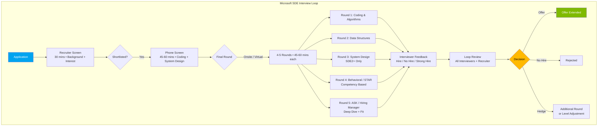
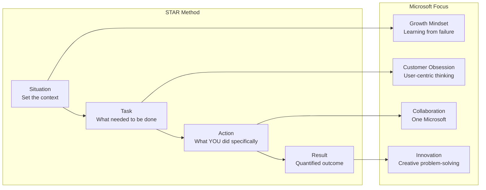
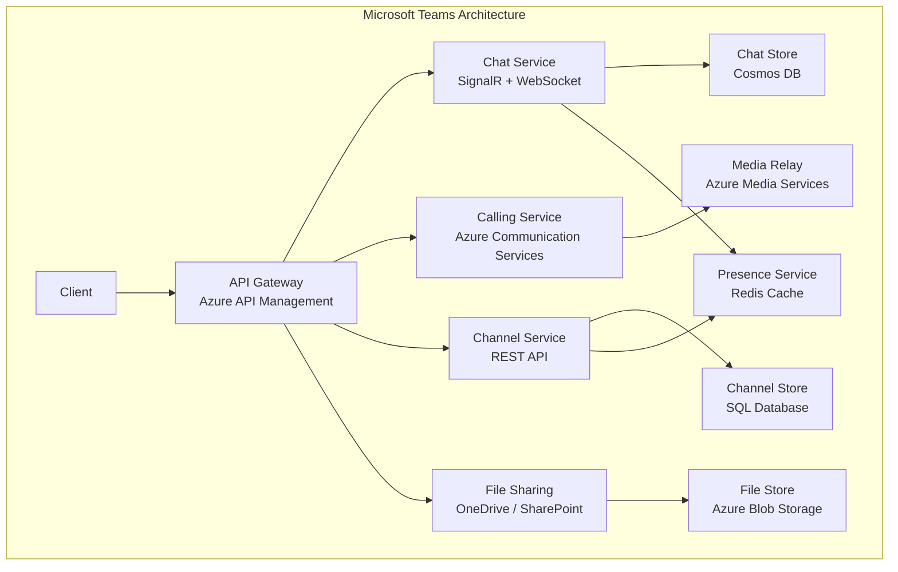
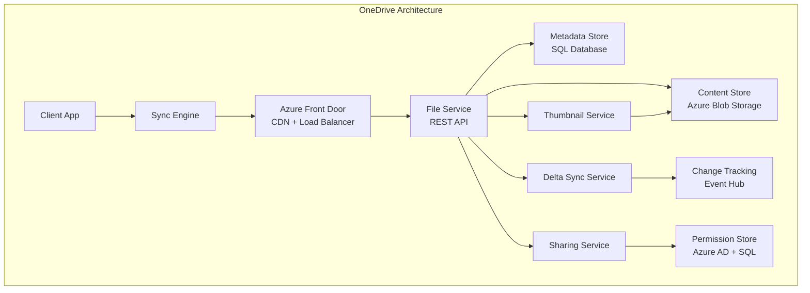

# Chapter 15: Microsoft SDE — Company-Specific Question Bank

## Learning Objectives

- Master 6 Microsoft-specific coding problems with TypeScript solutions (Trees, Arrays, Design)
- Design 2 Microsoft-scale systems: Teams and OneDrive
- Answer 15 computer fundamentals questions specific to Microsoft interviews
- Ace 10 behavioral questions using the Microsoft STAR framework
- Understand Microsoft interview rounds and the STAR response methodology

<!-- Image Gallery -->
<section class="lesson-visuals" aria-label="Visual learning resources">
  <header><span>VISUAL LEARNING</span><h2>See it. Review it. Remember it.</h2></header>
  <a class="lesson-visual-card" href="../../assets/images/lessons/interview-preparation/15-company-microsoft-sde/handwritten-notes.png" target="_blank" rel="noopener">
    
    <span><strong>Handwritten notes</strong>Condensed notes for deliberate review.</span>
  </a>
  <a class="lesson-visual-card" href="../../assets/images/lessons/interview-preparation/15-company-microsoft-sde/sticky-notes.png" target="_blank" rel="noopener">
    
    <span><strong>Sticky-note revision</strong>Fast recall prompts for revision.</span>
  </a>
  <a class="lesson-visual-card" href="../../assets/images/lessons/interview-preparation/15-company-microsoft-sde/visual-explanation.png" target="_blank" rel="noopener">
    
    <span><strong>Visual concept guide</strong>A connected explanation of the key ideas.</span>
  </a>
</section>
<!-- End Image Gallery -->

## Microsoft Interview Process



## Microsoft STAR Response Framework



---

## Section 1: Coding Problems — Microsoft Pattern (6 Problems)

### Problem 1: Lowest Common Ancestor of a Binary Tree

**Problem:** Given a binary tree and two node values, find their lowest common ancestor (LCA). The LCA is the deepest node that has both nodes as descendants.

**Microsoft Context:** Microsoft LOVES tree problems — LCA is asked in nearly every SDE interview loop.

**Example:**
```
Input: root = [3,5,1,6,2,0,8,null,null,7,4], p = 5, q = 1
Output: 3
Explanation: LCA of 5 and 1 is 3
```

<details>
<summary><b>Solution: Recursive DFS — O(n) time, O(n) space</b></summary>

```typescript
class TreeNode {
  val: number;
  left: TreeNode | null = null;
  right: TreeNode | null = null;
  constructor(val: number) { this.val = val; }
}

function lowestCommonAncestor(root: TreeNode | null, p: TreeNode, q: TreeNode): TreeNode | null {
  if (!root || root === p || root === q) return root;

  const left = lowestCommonAncestor(root.left, p, q);
  const right = lowestCommonAncestor(root.right, p, q);

  if (left && right) return root; // p and q are in different subtrees
  return left || right; // Both in same subtree
}
```

**Time:** O(n) — each node visited once
**Space:** O(n) — recursion stack in worst case (skewed tree)

**Why this works:** The LCA is the first node where p and q are found in different subtrees (or one is the node itself). The recursion propagates found nodes upward.

**Microsoft follow-up:** How would you do this iteratively? (Use parent pointers or path tracking.)
</details>

---

### Problem 2: Reverse Linked List II (Reverse between positions)

**Problem:** Reverse a linked list from position `left` to `right`. Do it in one pass and in-place.

**Microsoft Context:** Linked list manipulations with precise pointer handling — Microsoft tests attention to detail.

**Example:**
```
Input:  head = [1,2,3,4,5], left = 2, right = 4
Output: [1,4,3,2,5]
```

<details>
<summary><b>Solution: Iterative with Dummy Node — O(n) time, O(1) space</b></summary>

```typescript
class ListNode {
  val: number;
  next: ListNode | null = null;
  constructor(val: number) { this.val = val; }
}

function reverseBetween(head: ListNode | null, left: number, right: number): ListNode | null {
  const dummy = new ListNode(0);
  dummy.next = head;
  let prev = dummy;

  // Move prev to the node before 'left'
  for (let i = 0; i < left - 1; i++) {
    prev = prev.next!;
  }

  // Reverse from left to right
  const start = prev.next; // First node to reverse
  let next = start!.next;   // Node that will move

  // Example: 1 → 2 → 3 → 4 → 5, left=2, right=4
  // prev=1, start=2, next=3
  for (let i = 0; i < right - left; i++) {
    start!.next = next!.next;
    next!.next = prev.next;
    prev.next = next;
    next = start!.next;
  }

  return dummy.next;
}
```

**Time:** O(n) — single pass
**Space:** O(1) — in-place modification

**Key insight:** The three-pointer technique (prev, start, next) with the dummy node eliminates edge cases for head reversal. Each iteration moves one node from its position to right after `prev`.
</details>

---

### Problem 3: Find All Duplicates in an Array

**Problem:** Given an array of integers, 1 ≤ a[i] ≤ n (n = array size), some elements appear twice and others once. Find all elements that appear twice without using extra space.

**Microsoft Context:** Microsoft tests array manipulation with the "mark by negation" technique.

**Example:**
```
Input:  [4, 3, 2, 7, 8, 2, 3, 1]
Output: [2, 3]
```

<details>
<summary><b>Solution: Mark by Negation — O(n) time, O(1) space</b></summary>

```typescript
function findDuplicates(nums: number[]): number[] {
  const result: number[] = [];

  for (let i = 0; i < nums.length; i++) {
    const index = Math.abs(nums[i]) - 1;

    if (nums[index] < 0) {
      // Already visited — this is a duplicate
      result.push(Math.abs(nums[i]));
    } else {
      // Mark visited by negating
      nums[index] = -nums[index];
    }
  }

  return result;
}
```

**Time:** O(n) — single pass
**Space:** O(1) — excluding output array

**Why this works:** Since all values are in range [1, n], each value maps to a unique index. By negating the number at that index, we mark it as "seen." If we encounter a number whose mapped index is already negative, it's a duplicate.

**Edge case:** The array is modified in-place. Need to restore if required.
</details>

---

### Problem 4: Design a Stack with getMin() in O(1)

**Problem:** Design a stack that supports push, pop, top, and retrieving the minimum element in constant time.

**Microsoft Context:** Stack design problems test data structure composition — a Microsoft favorite.

<details>
<summary><b>Solution: Two-Stack Approach — O(1) time, O(n) space</b></summary>

```typescript
class MinStack {
  private stack: number[];
  private minStack: number[];

  constructor() {
    this.stack = [];
    this.minStack = [];
  }

  push(val: number): void {
    this.stack.push(val);
    if (this.minStack.length === 0 || val <= this.minStack[this.minStack.length - 1]) {
      this.minStack.push(val);
    }
  }

  pop(): void {
    const val = this.stack.pop();
    if (val === this.minStack[this.minStack.length - 1]) {
      this.minStack.pop();
    }
  }

  top(): number {
    return this.stack[this.stack.length - 1];
  }

  getMin(): number {
    return this.minStack[this.minStack.length - 1];
  }
}
```

<details>
<summary><b>Optimized: Single Stack with Pair — O(1) time, O(n) space</b></summary>

```typescript
class MinStackOptimized {
  private stack: { value: number; min: number }[];

  constructor() {
    this.stack = [];
  }

  push(val: number): void {
    const currentMin = this.stack.length === 0
      ? val
      : Math.min(val, this.stack[this.stack.length - 1].min);
    this.stack.push({ value: val, min: currentMin });
  }

  pop(): void { this.stack.pop(); }
  top(): number { return this.stack[this.stack.length - 1].value; }
  getMin(): number { return this.stack[this.stack.length - 1].min; }
}
```

**Time:** O(1) for all operations
**Space:** O(n) — auxiliary stack

**Microsoft discussion point:** The two-stack approach saves space when min values appear infrequently. The pair approach is simpler but stores redundant data.
</details>

---

### Problem 5: Binary Tree Zigzag Level Order Traversal

**Problem:** Return the zigzag level order traversal of a binary tree — left to right at even levels, right to left at odd levels.

**Microsoft Context:** Tree traversal variations are Microsoft staples — tests BFS mastery with a twist.

**Example:**
```
Input: [3,9,20,null,null,15,7]
Output: [[3], [20,9], [15,7]]
```

<details>
<summary><b>Solution: BFS with Level Flag — O(n) time, O(n) space</b></summary>

```typescript
function zigzagLevelOrder(root: TreeNode | null): number[][] {
  if (!root) return [];

  const result: number[][] = [];
  const queue: TreeNode[] = [root];
  let leftToRight = true;

  while (queue.length > 0) {
    const levelSize = queue.length;
    const levelValues: number[] = [];

    for (let i = 0; i < levelSize; i++) {
      const node = queue.shift()!;
      levelValues.push(node.val);

      if (node.left) queue.push(node.left);
      if (node.right) queue.push(node.right);
    }

    if (!leftToRight) {
      levelValues.reverse();
    }
    result.push(levelValues);
    leftToRight = !leftToRight;
  }

  return result;
}
```

<details>
<summary><b>Optimized: Deque to Avoid Reverse — O(n) time, O(n) space</b></summary>

```typescript
function zigzagLevelOrderOptimized(root: TreeNode | null): number[][] {
  if (!root) return [];

  const result: number[][] = [];
  const queue: TreeNode[] = [root];
  let leftToRight = true;

  while (queue.length > 0) {
    const levelSize = queue.length;
    const levelValues: number[] = new Array(levelSize);

    for (let i = 0; i < levelSize; i++) {
      const node = queue.shift()!;
      const index = leftToRight ? i : levelSize - 1 - i;
      levelValues[index] = node.val;

      if (node.left) queue.push(node.left);
      if (node.right) queue.push(node.right);
    }

    result.push(levelValues);
    leftToRight = !leftToRight;
  }

  return result;
}
```

**Time:** O(n) — each node processed once
**Space:** O(n) — queue stores widest level
</details>

---

### Problem 6: Kth Largest Element in an Array

**Problem:** Find the kth largest element in an unsorted array. Note that it is the kth largest in sorted order, not the kth distinct element.

**Microsoft Context:** Microsoft tests QuickSelect (partition-based selection) as an optimization over sorting.

**Example:**
```
Input:  [3,2,1,5,6,4], k = 2
Output: 5
```

<details>
<summary><b>Solution 1: Sorting — O(n log n) time, O(1) space</b></summary>

```typescript
function findKthLargestSort(nums: number[], k: number): number {
  nums.sort((a, b) => b - a);
  return nums[k - 1];
}
```

Simple, but Microsoft expects the QuickSelect optimization.
</details>

<details>
<summary><b>Solution 2: QuickSelect (Hoare's Selection) — O(n) avg, O(n²) worst</b></summary>

```typescript
function findKthLargest(nums: number[], k: number): number {
  const targetIndex = nums.length - k; // Convert to kth smallest index
  return quickSelect(nums, 0, nums.length - 1, targetIndex);
}

function quickSelect(nums: number[], left: number, right: number, k: number): number {
  if (left === right) return nums[left];

  const pivotIndex = partition(nums, left, right);

  if (k === pivotIndex) return nums[k];
  if (k < pivotIndex) return quickSelect(nums, left, pivotIndex - 1, k);
  return quickSelect(nums, pivotIndex + 1, right, k);
}

function partition(nums: number[], left: number, right: number): number {
  const pivot = nums[right];
  let i = left;

  for (let j = left; j < right; j++) {
    if (nums[j] <= pivot) {
      [nums[i], nums[j]] = [nums[j], nums[i]];
      i++;
    }
  }
  [nums[i], nums[right]] = [nums[right], nums[i]];
  return i;
}
```

**Time:** O(n) average, O(n²) worst-case (rare with random pivot selection)
**Space:** O(log n) — recursion stack

**Why QuickSelect:** Unlike sorting (O(n log n)), QuickSelect partially sorts only until the kth element is in place. Average O(n) makes it optimal for this problem.
</details>

---

## Section 2: System Design (2 Problems)

### Problem SD-1: Design Microsoft Teams

**Problem:** Design a real-time collaboration and communication platform like Microsoft Teams.

<details>
<summary><b>Solution</b></summary>



**Key Components:**

| Component | Technology | Purpose |
|-----------|------------|---------|
| **Real-time Chat** | SignalR (WebSocket) | Low-latency messaging, typing indicators |
| **Voice/Video** | Azure Communication Services | WebRTC-based, media relay for NAT traversal |
| **Presence** | Redis Cache | Online/offline/busy status with pub/sub |
| **Storage** | Cosmos DB (chat), SQL (channels), Blob (files) | Polyglot persistence |
| **Search** | Azure Cognitive Search | Message and file search |
| **Notification** | Azure Notification Hubs | Push notifications for mobile |

**Data Model:**
```
Message {
  messageId: GUID,
  chatId: string,
  senderId: string,
  content: string,
  contentType: TEXT | IMAGE | FILE | EMOJI,
  timestamp: DateTime,
  editedAt: DateTime?,
  deletedAt: DateTime?,
  repliesTo: GUID?,
  mentions: UserId[]
}

Chat {
  chatId: GUID,
  type: DIRECT | GROUP | CHANNEL,
  members: UserId[],
  messages: Message[] (bounded to last N),
  createdAt: DateTime,
  lastActivity: DateTime
}
```

**Scaling Strategy:**
- Chat is sharded by chatId across Cosmos DB partitions
- SignalR uses Azure SignalR Service for auto-scaling connections
- Media relay servers are geo-distributed for low latency
- Channel messages use fan-out pattern (write once, read from channel)

**Key Challenges:**
1. **Presence at scale:** Don't broadcast every status change to all users. Use interest-based subscription (only statuses of contacts/frequent collaborators).
2. **Message ordering:** Use server-side timestamps with Lamport clocks to ensure consistent ordering across devices.
3. **File sharing:** Integrate with OneDrive/SharePoint for version history, co-authoring, and permissions.
4. **Guest access:** Azure AD B2B for external collaboration.
</details>

---

### Problem SD-2: Design OneDrive (Cloud File Storage)

**Problem:** Design a cloud file storage and synchronization service like Microsoft OneDrive.

<details>
<summary><b>Solution</b></summary>



**Core Sync Flow:**
```
1. User creates/modifies file
2. Sync engine detects change (filesystem watcher)
3. Computes binary diff (chunk-level, not file-level)
4. Uploads only changed chunks to Azure Blob Storage
5. Updates metadata in SQL database
6. Event published to change tracking
7. Other devices receive notification via WebSocket
8. Each device downloads changed chunks
9. Local file reassembled from base + diffs
```

**Key Design Decisions:**

| Decision | Choice | Rationale |
|----------|--------|-----------|
| **Sync Unit** | File chunk (4MB) | Only upload changed chunks — saves bandwidth |
| **Conflict Resolution** | Keep both versions | When two edits conflict, save both with timestamps |
| **Versioning** | 30-day version history | Delete old versions after 30 days (or longer for paid) |
| **Delta encoding** | Binary diff (xdelta) | Efficient for small changes in large files |
| **Thumbnails** | Generated server-side | Offload processing from client |
| **Encryption** | AES-256 at rest, TLS in transit | Microsoft compliance requirements |

**API Design:**
```
GET    /files/{fileId}           → File metadata
GET    /files/{fileId}/content   → Download file
PUT    /files/{fileId}/content   → Upload new version
GET    /files/{fileId}/changes   → Delta sync (changes since token)
POST   /files/{fileId}/share     → Generate share link
DELETE /files/{fileId}           → Move to recycle bin
GET    /files/{fileId}/versions  → Version history
```

**Delta Sync Protocol:**
```typescript
interface DeltaRequest {
  syncToken: string;        // Token from last sync
  driveId: string;
}

interface DeltaResponse {
  newSyncToken: string;
  changes: FileChange[];
  deleted: string[];       // Files deleted since last sync
}

interface FileChange {
  fileId: string;
  name: string;
  size: number;
  lastModified: DateTime;
  chunks: ChunkInfo[];     // Only changed chunks
}
```

**Scaling:**
- File metadata in SQL with read replicas for listing
- File content in Azure Blob Storage (virtually unlimited)
- CDN (Azure Front Door) for popular/commonly shared files
- Geo-redundant storage (GRS) for disaster recovery
- Rate limiting per user (throttle excessive sync operations)

**Microsoft-specific:** OneDrive integrates deeply with Office 365 — co-authoring requires real-time sync of cursor positions, comments, and changes via Operational Transformation.
</details>

---

## Section 3: Computer Fundamentals (15 Questions)

### Operating Systems (5 Questions)

**Q1.** What is the difference between a process and a thread?

<details>
<summary><b>Answer</b></summary>

| Aspect | Process | Thread |
|--------|---------|--------|
| **Memory** | Separate address space | Shares address space with process |
| **Creation** | Heavyweight (new PCB, memory allocation) | Lightweight (shares memory) |
| **Communication** | IPC (pipes, sockets, shared memory) | Direct memory access |
| **Context switch** | Slow (TLB flush, page table switch) | Fast (same address space) |
| **Fault isolation** | Isolated — one crash doesn't affect others | One thread crash can crash the process |
| **Resources** | Owns resources (file handles, sockets) | Shares process resources |
</details>

**Q2.** Explain deadlock and the four necessary conditions.

<details>
<summary><b>Answer</b></summary>

A deadlock is a state where two or more processes are waiting indefinitely for resources held by others. The four necessary conditions (Coffman conditions):
1. **Mutual Exclusion:** At least one resource is held in a non-sharable mode
2. **Hold and Wait:** A process holds at least one resource and waits for additional resources held by others
3. **No Preemption:** Resources cannot be forcefully taken from a process
4. **Circular Wait:** A circular chain of processes exists where each waits for a resource held by the next

**Prevention:** Break any one condition. Most common: enforce a total order on resource acquisition (break circular wait).
</details>

**Q3.** What is virtual memory and how does paging work?

<details>
<summary><b>Answer</b></summary>

Virtual memory is a memory management technique that gives each process its own virtual address space, mapped to physical memory via page tables.

**Paging:**
- Virtual addresses are divided into fixed-size pages (typically 4KB)
- Physical memory is divided into page frames of the same size
- A page table maps virtual pages to physical frames
- When a process accesses an unmapped page → **page fault**
- OS loads the page from disk (swap) into a free frame
- Page replacement algorithms (LRU, Clock, NRU) decide which page to evict when memory is full

**Benefits:** Isolation between processes, illusion of contiguous memory, ability to run programs larger than physical RAM.
</details>

**Q4.** Explain the difference between preemptive and non-preemptive scheduling.

<details>
<summary><b>Answer</b></summary>

| Aspect | Preemptive | Non-Preemptive |
|--------|-----------|----------------|
| **Decision** | OS can interrupt a running process at any time | Process voluntarily gives up CPU |
| **Response time** | Better for time-sharing/real-time | Can be unpredictable |
| **Overhead** | Higher (context switches) | Lower |
| **Fairness** | More fair (time slices) | Can lead to starvation |
| **Examples** | Round Robin, SRTF, Priority (preemptive) | FCFS, SJF (non-preemptive), Priority (non-preemptive) |

**Microsoft asks:** Which does Windows use? (Preemptive with priority-based scheduling.)
</details>

**Q5.** What are the different states of a process?

<details>
<summary><b>Answer</b></summary>

```
New → Ready → Running → Terminated
         ↓        ↓
       Waiting   Waiting
         ↓        ↓
       Ready     Ready
```

1. **New:** Process is being created
2. **Ready:** In memory, waiting for CPU
3. **Running:** CPU is executing the process
4. **Waiting (Blocked):** Waiting for I/O or event completion
5. **Terminated:** Finished execution
6. **Suspended Ready:** Swapped out of memory, ready to run
7. **Suspended Waiting:** Swapped out, waiting for event
</details>

### Database Management Systems (5 Questions)

**Q6.** Explain normalization and the first three normal forms.

<details>
<summary><b>Answer</b></summary>

**Normalization** is the process of organizing data to reduce redundancy and dependency.

**1NF:** Each cell contains a single value (atomic). No repeating groups.
**2NF:** In 1NF + All non-key attributes are fully functionally dependent on the entire primary key (no partial dependency).
**3NF:** In 2NF + No transitive dependency (non-key attribute doesn't depend on another non-key attribute).

| Normal Form | Condition | Example Violation |
|-------------|-----------|-------------------|
| 1NF | Atomic values | Column "PhoneNumbers" storing "555-0100, 555-0200" |
| 2NF | Full FD on PK | Table {StudentID, CourseID, InstructorName} — InstructorName depends only on CourseID |
| 3NF | No transitive FD | Table {EmployeeID, DepartmentID, DepartmentHead} — DepartmentHead depends on DepartmentID |
</details>

**Q7.** What is an index? Explain B-tree vs hash indexes.

<details>
<summary><b>Answer</b></summary>

An index is a data structure that speeds up data retrieval at the cost of additional storage and write overhead.

| Aspect | B-Tree Index | Hash Index |
|--------|-------------|------------|
| **Structure** | Balanced tree, sorted keys | Hash table |
| **Lookup** | O(log n) — supports range queries | O(1) — equality only |
| **Range queries** | Yes (efficient with in-order traversal) | No |
| **Ordering** | Maintains sorted order | No ordering |
| **Use case** | General purpose, most common | Key-value lookups, exact match |
| **Storage** | Moderate | Moderate |

**Microsoft-specific:** SQL Server uses B+ trees for clustered and non-clustered indexes.
</details>

**Q8.** What is ACID? Explain each property.

<details>
<summary><b>Answer</b></summary>

ACID ensures reliable database transactions:
- **Atomicity:** Transaction completes fully or not at all (all-or-nothing)
- **Consistency:** Transaction brings database from one valid state to another (constraints maintained)
- **Isolation:** Concurrent transactions don't interfere with each other
- **Durability:** Once committed, changes survive system failures

**Microsoft asks:** How does SQL Server implement these? (Write-ahead logging for atomicity/durability, locking/MVCC for isolation, constraints/triggers for consistency.)
</details>

**Q9.** What is the difference between SQL and NoSQL databases?

<details>
<summary><b>Answer</b></summary>

| Aspect | SQL (RDBMS) | NoSQL |
|--------|-------------|-------|
| **Data model** | Tables with rows and columns | Document, key-value, graph, column-family |
| **Schema** | Fixed, rigid | Flexible, dynamic |
| **ACID** | Fully ACID | BASE (Basically Available, Soft state, Eventually consistent) |
| **Scaling** | Vertical (scale up) | Horizontal (scale out) |
| **Relationships** | Foreign keys, JOINs | Embedded or references |
| **Examples** | SQL Server, PostgreSQL, MySQL | Cosmos DB, MongoDB, Cassandra |

**When to use SQL:** Financial systems, inventory management, any system requiring strong consistency.
**When to use NoSQL:** Real-time analytics, IoT, content management, high-velocity data.
</details>

**Q10.** Explain database transactions and isolation levels.

<details>
<summary><b>Answer</b></summary>

Transaction isolation levels define how transaction changes are visible to others:

| Level | Dirty Read | Non-repeatable Read | Phantom Read | Performance |
|-------|-----------|---------------------|-------------|-------------|
| **Read Uncommitted** | Possible | Possible | Possible | Highest |
| **Read Committed** | Prevented | Possible | Possible | ↑ |
| **Repeatable Read** | Prevented | Prevented | Possible | ↓ |
| **Serializable** | Prevented | Prevented | Prevented | Lowest |

**Dirty Read:** Reading uncommitted data from another transaction.
**Non-repeatable Read:** Same row returns different values in the same transaction.
**Phantom Read:** Same query returns different rows (due to inserts/deletes).
</details>

### Computer Networks (5 Questions)

**Q11.** Explain the OSI model and its layers.

<details>
<summary><b>Answer</b></summary>

| Layer | Number | Function | Protocols |
|-------|--------|----------|-----------|
| **Application** | 7 | User-facing network services | HTTP, FTP, SMTP, DNS |
| **Presentation** | 6 | Data formatting, encryption, compression | SSL/TLS, JPEG, ASCII |
| **Session** | 5 | Session management, checkpoints | NetBIOS, RPC |
| **Transport** | 4 | End-to-end communication, reliability | TCP, UDP |
| **Network** | 3 | Routing, logical addressing | IP, ICMP, ARP |
| **Data Link** | 2 | Framing, MAC addressing | Ethernet, PPP, Wi-Fi |
| **Physical** | 1 | Raw bit transmission | Cables, radio signals |

**MS memory trick:** "Please Do Not Throw Sausage Pizza Away" (from bottom-up) or "All People Seem To Need Data Processing" (from top-down).
</details>

**Q12.** Explain TCP vs UDP.

<details>
<summary><b>Answer</b></summary>

| Aspect | TCP | UDP |
|--------|-----|-----|
| **Connection** | Connection-oriented (3-way handshake) | Connectionless |
| **Reliability** | Guaranteed delivery, retransmission | Best-effort delivery |
| **Ordering** | In-order delivery | No ordering guarantee |
| **Flow control** | Sliding window | None |
| **Congestion control** | Slow start, congestion avoidance | None |
| **Header size** | 20-60 bytes | 8 bytes |
| **Use cases** | Web (HTTP), email, file transfer | Streaming, DNS, VoIP, gaming |

**3-way handshake:** SYN → SYN-ACK → ACK
**4-way termination:** FIN → ACK → FIN → ACK
</details>

**Q13.** What is DNS and how does it work?

<details>
<summary><b>Answer</b></summary>

DNS (Domain Name System) translates human-readable domain names (google.com) to IP addresses (142.250.190.46).

**Resolution Process:**
1. Browser checks local DNS cache
2. If not found, queries configured DNS resolver (ISP or 8.8.8.8)
3. Resolver recursively queries: Root server → TLD server (.com) → Authoritative server
4. Response flows back with IP address
5. Browser establishes connection to the IP

**Record types:** A (IPv4), AAAA (IPv6), CNAME (alias), MX (mail exchange), NS (name server), TXT (text record).
</details>

**Q14.** Explain HTTP methods and status codes.

<details>
<summary><b>Answer</b></summary>

**Key HTTP Methods:**
| Method | Purpose | Idempotent? | Safe? |
|--------|---------|-------------|-------|
| GET | Retrieve resource | Yes | Yes |
| POST | Create resource | No | No |
| PUT | Full update/replace | Yes | No |
| PATCH | Partial update | No | No |
| DELETE | Remove resource | Yes | No |

**Common Status Codes:**
- **200 OK:** Success
- **201 Created:** Resource created (POST)
- **301/302:** Redirect
- **400 Bad Request:** Client error
- **401 Unauthorized:** Not authenticated
- **403 Forbidden:** Not authorized
- **404 Not Found:** Resource doesn't exist
- **429 Too Many Requests:** Rate limited
- **500 Internal Server Error:** Server error
- **503 Service Unavailable:** Temporarily unavailable
</details>

**Q15.** What happens when you type a URL in a browser?

<details>
<summary><b>Answer</b></summary>

1. **Browser parses URL** → identifies protocol (HTTPS), domain, path
2. **DNS lookup** → resolves domain to IP (checking browser cache → OS cache → router cache → ISP DNS → recursive resolution)
3. **TCP connection** → 3-way handshake with the IP on port 443 (HTTPS)
4. **TLS handshake** → certificate verification, session key exchange
5. **HTTP request** → GET /path with headers (User-Agent, Accept, Cookies)
6. **Server processes** → handles request, queries DB, generates response
7. **HTTP response** → 200 OK with HTML content in body
8. **Browser renders** → HTML parsed → DOM tree built → CSSOM built → Layout → Paint
9. **Additional resources** → CSS, JS, images fetched (cached where possible)
10. **JavaScript executes** → interactive features activated
</details>

---

## Section 4: Behavioral Questions — Microsoft STAR-Based (10 Questions)

### Q1: Tell me about a time you had to learn a new technology quickly. (Growth Mindset)

<details>
<summary><b>Sample STAR Response</b></summary>

**Situation:** My team needed to migrate from a monolithic ASP.NET application to a microservices architecture using Node.js and Docker — technologies I had never used.

**Task:** I needed to become productive in Node.js within 2 weeks while still meeting my sprint commitments.

**Action:** I spent 10 hours/week outside work on a personal project (a REST API with PostgreSQL). I followed Microsoft Learn modules on Node.js, Docker, and Azure Container Instances. I paired with a colleague who had Node.js experience for code reviews. I created a "cheat sheet" document comparing ASP.NET concepts to Node.js equivalents to accelerate team learning.

**Result:** I delivered my first microservice on schedule with zero production incidents. My cheat sheet was adopted by the entire 15-person team, reducing our onboarding time from 3 weeks to 1 week. I later presented a brown-bag session on the migration patterns I discovered.
</details>

### Q2: Describe a project that required collaboration across teams. (Collaboration / One Microsoft)

<details>
<summary><b>Strategy</b></summary>

Microsoft values cross-team collaboration. Show:
1. You worked with teams outside your own (different product groups, time zones)
2. Navigated different priorities and dependencies
3. Found alignment and delivered together
4. Give credit to other teams
</details>

### Q3: Tell me about a time you received critical feedback. How did you handle it? (Growth Mindset)

<details>
<summary><b>Strategy</b></summary>

Don't get defensive. Show you:
1. Listened without interrupting
2. Asked clarifying questions to understand the feedback
3. Made concrete changes based on the feedback
4. Followed up to show improvement
</details>

### Q4: Describe a time you went above and beyond for a customer or user. (Customer Obsession)

<details>
<summary><b>Strategy</b></summary>

Microsoft emphasizes "customer-obsessed" culture. Show you:
1. Identified a customer need they didn't explicitly express
2. Built something that addressed the root cause, not just the symptom
3. Measured the impact on customer satisfaction or success
</details>

### Q5: Tell me about a complex problem you solved. (Problem Solving)

<details>
<summary><b>Framework</b></summary>

1. **Define the problem clearly:** What was the observable symptom? What was the root cause?
2. **Decompose:** How did you break the problem into manageable pieces?
3. **Explore solutions:** What alternatives did you consider? Why did you choose the approach you did?
4. **Execute:** How did you implement the solution?
5. **Validate:** How did you know it was fixed?
</details>

### Q6: Describe a time you influenced a technical decision. (Technical Influence)

<details>
<summary><b>Strategy</b></summary>

Show you can lead technical direction without authority:
1. Researched alternatives thoroughly (with data, not opinions)
2. Built a proof of concept to demonstrate viability
3. Presented findings to stakeholders
4. Got buy-in from senior engineers and managers
</details>

### Q7: Tell me about a time a project didn't go as planned. (Resilience)

<details>
<summary><b>Strategy</b></summary>

Microsoft wants to see how you handle failure:
1. What went wrong? (Be specific, take responsibility)
2. How did you respond? (No blaming, focus on solutions)
3. What did you learn? (Show growth)
4. What would you do differently? (Concrete changes)
</details>

### Q8: How do you prioritize your work when you have multiple competing deadlines? (Prioritization)

<details>
<summary><b>Sample Response</b></summary>

"I use an impact-urgency matrix:
1. **Urgent + Impactful:** Do first (production issue)
2. **Not urgent + Impactful:** Schedule (feature work)
3. **Urgent + Less impactful:** Delegate or quick-fix
4. **Neither:** Deprioritize or eliminate

I communicate with my manager and stakeholders about trade-offs. If I feel I can't deliver everything, I raise the flag early with options and recommendations, not just problems."
</details>

### Q9: Describe your experience with code reviews — both giving and receiving. (Quality)

<details>
<summary><b>Strategy</b></summary>

**Giving reviews:** Focus on correctness, design, test coverage. Be specific and constructive. Use "I wonder if..." instead of "This is wrong."
**Receiving reviews:** Be grateful, not defensive. Ask for clarification if needed. Apply feedback quickly.

**Microsoft culture:** Code reviews are a core part of engineering culture. Every change goes through review. The expectation is thorough, respectful, and learning-focused reviews.
</details>

### Q10: Why Microsoft? Why this team/role? (Motivation)

<details>
<summary><b>Strategy</b></summary>

Be specific. Avoid generic "Microsoft is a great company" responses. Instead:
1. **Product passion:** "I've been using Azure DevOps since college and I want to work on the platform that millions of developers depend on."
2. **Impact:** "Microsoft's mission to empower every person and organization resonates with me because..."
3. **Technical alignment:** "My experience with distributed systems maps directly to the challenges Azure Cosmos DB faces at scale."
4. **Culture:** "I want to work where growth mindset isn't just a slogan but how engineering actually operates."

**Microsoft-specific research:** Learn about Microsoft's culture code, the "One Microsoft" philosophy, and their focus on AI-first strategy under Satya Nadella.
</details>

---

## Microsoft SDE Preparation Tips

### Coding Preparation

| Topic | Focus Areas | LeetCode Count |
|-------|-------------|----------------|
| **Trees** | LCA, level order, BST validation, path sum | 20 problems |
| **Linked Lists** | Reverse, merge, detect cycle | 10 problems |
| **Arrays** | Two pointers, sliding window, prefix sum | 30 problems |
| **Strings** | Pattern matching, anagrams, palindrome | 15 problems |
| **Design** | LRU cache, Min stack, Trie | 5 problems |

### Computer Fundamentals Coverage

| Topic | Key Concepts |
|-------|-------------|
| **OS** | Processes vs threads, deadlock, memory management, scheduling |
| **DBMS** | Normalization, indexing, ACID, SQL queries, transactions |
| **CN** | OSI model, TCP/UDP, DNS, HTTP, load balancing |

### Behavioral Preparation

| Microsoft Principle | Prepare 2 Stories About |
|--------------------|----------------------|
| **Growth Mindset** | Learning from failure, new skill acquisition |
| **Customer Obsession** | Going above and beyond for users |
| **Collaboration** | Cross-team projects, conflict resolution |
| **Innovation** | Creative solutions, process improvements |

---

## Summary

This chapter provided a comprehensive Microsoft SDE question bank covering all interview stages. The 6 coding problems focus on Microsoft's favorite patterns: tree traversal (LCA, zigzag), linked list manipulation, array tricks, and data structure design (Min Stack, Kth Largest). The 2 system design problems cover Teams and OneDrive — core Microsoft products you should be familiar with. The 15 computer fundamentals questions cover OS, DBMS, and CN at the depth Microsoft expects. The 10 behavioral questions follow Microsoft's STAR-based competency framework with Growth Mindset and Collaboration as key themes.

## Practical Takeaways

1. **Trees are everywhere at Microsoft.** Practice 20+ tree problems. If you can handle trees well, you'll ace the coding rounds.
2. **System design for SDE2+:** Be ready to whiteboard components, data flow, and trade-offs. Microsoft values pragmatic design over theoretical purity.
3. **STAR stories must be prepared.** For each story, write down: Situation (2 sentences), Task (1 sentence), Action (4-5 sentences), Result (2 sentences with numbers).
4. **Computer fundamentals matter.** Microsoft explicitly tests OS, DBMS, and CN knowledge in interviews. Review these topics thoroughly.
5. **⭐ Must-Know:** Lowest Common Ancestor, Reverse Linked List, Min Stack, Kth Largest Element — these appear consistently across Microsoft interview loops.
6. **ASK (Azreska-Shankar-Kemp) round:** The final round with a senior leader evaluates your engineering judgment, communication, and strategic thinking. Be ready for broader questions about technology and product decisions.

## Chapter Quiz

**Q1.** What is the time complexity of finding the Lowest Common Ancestor in a binary tree?
a) O(log n)  b) O(n)  c) O(n log n)  d) O(n²)

<details>
<summary>Answer: b) O(n)</summary>
DFS visits each node once in the worst case, making it O(n).
</details>

**Q2.** In the TCP 3-way handshake, what is the third packet sent?
a) SYN  b) SYN-ACK  c) ACK  d) FIN

<details>
<summary>Answer: c) ACK</summary>
SYN → SYN-ACK → ACK
</details>

**Q3.** Which normalization form eliminates transitive dependencies?
a) 1NF  b) 2NF  c) 3NF  d) BCNF

<details>
<summary>Answer: c) 3NF</summary>
3NF removes transitive dependencies (non-key attribute depending on another non-key attribute).
</details>

**Q4.** What does Microsoft's Growth Mindset principle primarily emphasize?
a) Working long hours  b) Learning from failure and continuous improvement  c) Following processes exactly  d) Individual achievement

<details>
<summary>Answer: b) Learning from failure and continuous improvement</summary>
Growth Mindset, championed by Satya Nadella, emphasizes that abilities can be developed through dedication and hard work, and that failures are learning opportunities.
</details>

**Q5.** In the Min Stack problem, what is the space complexity of the two-stack approach?
a) O(1)  b) O(log n)  c) O(n)  d) O(n²)

<details>
<summary>Answer: c) O(n)</summary>
The auxiliary min stack can store up to n elements in the worst case.
</details>

---

## Exercises

1. **Coding:** Solve "Binary Tree Maximum Path Sum" (LeetCode 124) — Microsoft favorite.
2. **Coding:** Implement "Serialize and Deserialize BST" (LeetCode 449).
3. **System Design:** Design Azure DevOps Pipelines (CI/CD system).
4. **Behavioral:** Write a full STAR response for a time you had to make a decision with incomplete information.
5. **Fundamentals:** Explain how a SQL query executes step-by-step (parser → optimizer → executor → storage engine).
</details>
