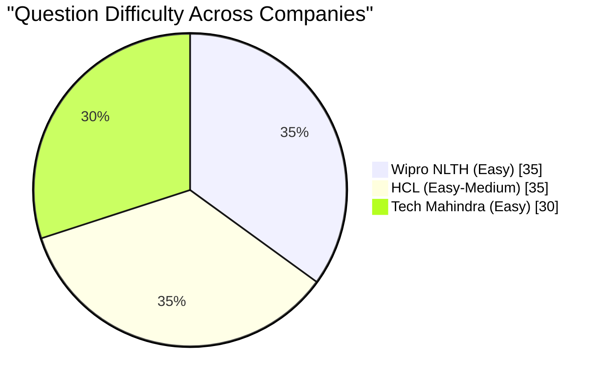

# Chapter 16: Wipro NLTH, HCL, Tech Mahindra — Company-Specific Question Bank

## Learning Objectives

- Solve 4 Wipro/HCL/ TechM-level coding problems with TypeScript solutions
- Master 20 quantitative aptitude questions covering basic arithmetic and DI
- Crack 15 reasoning problems including puzzles, seating arrangements, and syllogisms
- Ace 10 verbal ability questions with grammar and vocabulary focus
- Answer 10 domain-specific CS fundamentals questions
- Compare selection processes across Wipro, HCL, and Tech Mahindra

<!-- Image Gallery -->
<section class="lesson-visuals" aria-label="Visual learning resources">
  <header><span>VISUAL LEARNING</span><h2>See it. Review it. Remember it.</h2></header>
  <a class="lesson-visual-card" href="../../assets/images/lessons/interview-preparation/16-company-wipro-hcl-techm/handwritten-notes.png" target="_blank" rel="noopener">
    
    <span><strong>Handwritten notes</strong>Condensed notes for deliberate review.</span>
  </a>
  <a class="lesson-visual-card" href="../../assets/images/lessons/interview-preparation/16-company-wipro-hcl-techm/sticky-notes.png" target="_blank" rel="noopener">
    
    <span><strong>Sticky-note revision</strong>Fast recall prompts for revision.</span>
  </a>
  <a class="lesson-visual-card" href="../../assets/images/lessons/interview-preparation/16-company-wipro-hcl-techm/visual-explanation.png" target="_blank" rel="noopener">
    
    <span><strong>Visual concept guide</strong>A connected explanation of the key ideas.</span>
  </a>
</section>
<!-- End Image Gallery -->

## Selection Process Comparison


## Difficulty Comparison



---

## Section 1: Coding Problems (4 Problems)

### Problem 1: FizzBuzz Variant

**Problem:** Write a function that prints numbers from 1 to n. For multiples of 3, print "Fizz"; for multiples of 5, print "Buzz"; for multiples of both, print "FizzBuzz". Wipro adds a twist: if a number contains the digit 3, also print "Fizz" (in addition to the standard rules).

**Company Context:** Wipro NLTH coding rounds start with easy array/loop problems to test basic programming proficiency.

**Example:**
```
Input:  n = 16
Output: 1, 2, Fizz (3), 4, Buzz (5), Fizz (6), 7, 8, Fizz (9), Buzz (10),
        11, Fizz (12), Fizz (13), FizBuzz (14), 15→FizzBuzz (16→16 omitted for brevity)
        (13 contains digit 3 → Fizz; 15 is multiple of both 3 and 5 → FizzBuzz)
```

<details>
<summary><b>Solution: O(n) time, O(1) space</b></summary>

```typescript
function fizzBuzzVariant(n: number): string[] {
  const result: string[] = [];

  for (let i = 1; i <= n; i++) {
    let output = '';
    const containsThree = i.toString().includes('3');

    if (i % 3 === 0 || containsThree) output += 'Fizz';
    if (i % 5 === 0) output += 'Buzz';

    result.push(output || i.toString());
  }

  return result;
}

// Test
console.log(fizzBuzzVariant(16).join(', '));
// 1, 2, Fizz, 4, Buzz, Fizz, 7, 8, Fizz, Buzz, 11, Fizz, Fizz, 14, FizzBuzz, 16
```

**Time:** O(n) — single loop
**Space:** O(1) — excluding output array

**Key variation from standard FizzBuzz:** The "contains digit 3" condition is a common Wipro twist. Always read the problem statement carefully for such variations.
</details>

---

### Problem 2: Find the Second Largest Element

**Problem:** Given an array of integers, find the second largest distinct element. If there is no second largest, return -1.

**Company Context:** HCL frequently asks array manipulation problems to test basic problem-solving skills.

**Example:**
```
Input:  [10, 5, 8, 12, 12, 7]
Output: 10
```

<details>
<summary><b>Solution: Single Pass — O(n) time, O(1) space</b></summary>

```typescript
function findSecondLargest(nums: number[]): number {
  let first = -Infinity;
  let second = -Infinity;

  for (const num of nums) {
    if (num > first) {
      second = first;
      first = num;
    } else if (num > second && num < first) {
      second = num;
    }
  }

  return second === -Infinity ? -1 : second;
}
```

**Time:** O(n) — single pass
**Space:** O(1) — constant space

**Edge cases:**
- Array with all same elements → -1
- Array with one element → -1
- Negative numbers handled correctly
- Duplicates handled (only distinct values considered)

**Why this works:** Track the two largest distinct values. When a new max appears, the old max becomes second largest. When a value between first and second appears, update second.
</details>

---

### Problem 3: Palindrome Check (Ignore Non-Alphanumeric)

**Problem:** Given a string, determine if it's a palindrome considering only alphanumeric characters and ignoring case.

**Company Context:** Tech Mahindra frequently asks string problems testing character manipulation and two-pointer technique.

**Example:**
```
Input:  "A man, a plan, a canal: Panama"
Output: true

Input:  "race a car"
Output: false
```

<details>
<summary><b>Solution: Two Pointers — O(n) time, O(1) space</b></summary>

```typescript
function isPalindrome(s: string): boolean {
  let left = 0;
  let right = s.length - 1;

  while (left < right) {
    // Skip non-alphanumeric characters
    while (left < right && !isAlphanumeric(s[left])) left++;
    while (left < right && !isAlphanumeric(s[right])) right--;

    if (s[left].toLowerCase() !== s[right].toLowerCase()) {
      return false;
    }

    left++;
    right--;
  }

  return true;
}

function isAlphanumeric(char: string): boolean {
  const code = char.charCodeAt(0);
  return (
    (code >= 48 && code <= 57) ||     // 0-9
    (code >= 65 && code <= 90) ||     // A-Z
    (code >= 97 && code <= 122)       // a-z
  );
}
```

**Time:** O(n) — each character visited at most once
**Space:** O(1) — constant space

**Why two pointers?** Alphanumeric filtering is natural with two pointers approaching from both ends. We skip non-alphanumeric characters and compare valid ones.
</details>

---

### Problem 4: Move Zeroes to End

**Problem:** Given an array, move all zeros to the end while maintaining the relative order of non-zero elements. Do this in-place.

**Company Context:** Wipro, HCL, and TechM all ask array rearrangement problems to test in-place modification skills.

**Example:**
```
Input:  [0, 1, 0, 3, 12]
Output: [1, 3, 12, 0, 0]
```

<details>
<summary><b>Solution: Two Pointers — O(n) time, O(1) space</b></summary>

```typescript
function moveZeroes(nums: number[]): void {
  let insertPos = 0;

  // Move all non-zero elements to the front
  for (let i = 0; i < nums.length; i++) {
    if (nums[i] !== 0) {
      nums[insertPos] = nums[i];
      insertPos++;
    }
  }

  // Fill remaining positions with zeros
  while (insertPos < nums.length) {
    nums[insertPos] = 0;
    insertPos++;
  }
}
```

**Time:** O(n) — two passes (but each element moved at most once)
**Space:** O(1) — in-place modification

**Alternative (swap-based, single pass):**
```typescript
function moveZeroesSwap(nums: number[]): void {
  let nonZeroIdx = 0;
  for (let i = 0; i < nums.length; i++) {
    if (nums[i] !== 0) {
      [nums[i], nums[nonZeroIdx]] = [nums[nonZeroIdx], nums[i]];
      nonZeroIdx++;
    }
  }
}
```

**Edge cases:**
- Empty array → no change
- No zeros → no change
- All zeros → array unchanged (all zeros)
- Zeros at the beginning → moved to end
</details>

---

## Section 2: Quantitative Aptitude (20 Questions)

### Basic Arithmetic

**Q1.** Find the value of 125 × 96 × 4.

<details>
<summary><b>Solution</b></summary>

125 × 96 × 4 = (125 × 4) × 96 = 500 × 96 = 48,000

**Answer: 48,000**
</details>

**Q2.** What is 15% of 35% of 600?

<details>
<summary><b>Solution</b></summary>

35% of 600 = 600 × 35/100 = 210
15% of 210 = 210 × 15/100 = 31.5

**Answer: 31.5**
</details>

**Q3.** Simplify: 12 + 6 × 3 - 8 ÷ 4.

<details>
<summary><b>Solution</b></summary>

Using BODMAS: 12 + (6 × 3) - (8 ÷ 4) = 12 + 18 - 2 = 28

**Answer: 28**
</details>

**Q4.** A number when divided by 56 leaves a remainder 29. What remainder would it leave when divided by 7?

<details>
<summary><b>Solution</b></summary>

Let number = 56k + 29
When divided by 7: (56k + 29) / 7 = 8k + 4 + 1/7
Remainder = 29 mod 7 = 1

**Answer: 1**
</details>

**Q5.** Find the LCM of 24, 36, and 48.

<details>
<summary><b>Solution</b></summary>

Prime factorization:
24 = 2³ × 3
36 = 2² × 3²
48 = 2⁴ × 3
LCM = 2⁴ × 3² = 16 × 9 = 144

**Answer: 144**
</details>

### Percentages

**Q6.** If 40% of a number is 180, find 65% of the number.

<details>
<summary><b>Solution</b></summary>

Let number = x
0.4x = 180 → x = 450
65% of 450 = 0.65 × 450 = 292.5

**Answer: 292.5**
</details>

**Q7.** A person spends 25% of his income on food, 20% on rent, and 15% on education. He saves the remaining ₹12,000. Find his total income.

<details>
<summary><b>Solution</b></summary>

Total spent % = 25 + 20 + 15 = 60%
Saved % = 40% = ₹12,000
Total income = 12,000 × 100/40 = ₹30,000

**Answer: ₹30,000**
</details>

**Q8.** If the price of sugar increases by 20%, by what percentage should consumption be reduced to keep expenditure the same?

<details>
<summary><b>Solution</b></summary>

Let original price = P, consumption = C, expenditure = P × C
New price = 1.2P
For same expenditure: 1.2P × C' = P × C
C' = C / 1.2 = 0.833C
Reduction = (1 - 0.833) × 100 = 16.67%

**Answer: 16.67%**
</details>

### Profit and Loss

**Q9.** A shirt is bought for ₹400 and sold at ₹500. Find the profit percentage.

<details>
<summary><b>Solution</b></summary>

Profit = 500 - 400 = ₹100
Profit % = (100/400) × 100 = 25%

**Answer: 25%**
</details>

**Q10.** A shopkeeper sells an item at ₹1,200 and loses 20%. What was the cost price?

<details>
<summary><b>Solution</b></summary>

SP = CP × (100 - Loss%) / 100
1200 = CP × 80/100
CP = 1200 × 100/80 = ₹1,500

**Answer: ₹1,500**
</details>

### Time and Work

**Q11.** A can do a piece of work in 10 days. B is 25% more efficient than A. How many days will B take?

<details>
<summary><b>Solution</b></summary>

B is 25% more efficient → B's work rate = 1.25 × A's rate
A takes 10 days, so A's 1 day work = 1/10
B's 1 day work = 1.25 × 1/10 = 0.125 = 1/8
B takes 8 days.

**Answer: 8 days**
</details>

**Q12.** 12 men can complete a work in 9 days. How many additional men are needed to complete the work in 6 days?

<details>
<summary><b>Solution</b></summary>

Total work = 12 × 9 = 108 man-days
Men needed for 6 days = 108 / 6 = 18
Additional men = 18 - 12 = 6

**Answer: 6 additional men**
</details>

### Time, Speed, and Distance

**Q13.** A car travels 180 km in 3 hours. Find its speed in m/s.

<details>
<summary><b>Solution</b></summary>

Speed = 180/3 = 60 km/h = 60 × 5/18 = 16.67 m/s

**Answer: 16.67 m/s**
</details>

**Q14.** A man cycles at 12 km/h. How long will he take to cover 4.8 km?

<details>
<summary><b>Solution</b></summary>

Time = Distance / Speed = 4.8 / 12 = 0.4 hours = 24 minutes

**Answer: 24 minutes**
</details>

**Q15.** Walking at 3/4 of his usual speed, a person reaches office 15 minutes late. Find his usual time.

<details>
<summary><b>Solution</b></summary>

Let usual speed = s, usual time = t, distance = d
Usual: d = s × t
New speed = 0.75s, new time = t + 15
d = 0.75s × (t + 15)
Since distance is same: s × t = 0.75s × (t + 15)
t = 0.75t + 11.25
0.25t = 11.25
t = 45 minutes

**Answer: 45 minutes**
</details>

### Data Interpretation

**Q16-18.** Study the table and answer:

| City | Population (Lakhs) | Male % | Literate % | Graduate % |
|------|-------------------|--------|------------|------------|
| Delhi | 50 | 52 | 78 | 22 |
| Mumbai | 45 | 51 | 82 | 28 |
| Chennai | 35 | 49 | 85 | 25 |
| Kolkata | 40 | 48 | 76 | 20 |
| Bangalore | 30 | 53 | 88 | 35 |

**Q16.** Which city has the highest number of male population?

<details>
<summary><b>Solution</b></summary>

Delhi males = 50 × 0.52 = 26 Lakhs
Mumbai males = 45 × 0.51 = 22.95 Lakhs
Chennai males = 35 × 0.49 = 17.15 Lakhs
Kolkata males = 40 × 0.48 = 19.2 Lakhs
Bangalore males = 30 × 0.53 = 15.9 Lakhs

**Answer: Delhi (26 Lakhs)**
</details>

**Q17.** How many literate people are there in Bangalore?

<details>
<summary><b>Solution</b></summary>

Bangalore population = 30 Lakhs
Literate % = 88%
Literate = 30 × 0.88 = 26.4 Lakhs

**Answer: 26.4 Lakhs**
</details>

**Q18.** What is the ratio of graduates in Mumbai to those in Chennai?

<details>
<summary><b>Solution</b></summary>

Mumbai graduates = 45 × 0.28 = 12.6 Lakhs
Chennai graduates = 35 × 0.25 = 8.75 Lakhs
Ratio = 12.6 : 8.75 = 1260 : 875 = 252 : 175 = 36 : 25

**Answer: 36 : 25**
</details>

### Simple and Compound Interest

**Q19.** Find the simple interest on ₹8,000 at 6% per annum for 3 years.

<details>
<summary><b>Solution</b></summary>

SI = (P × R × T) / 100 = (8000 × 6 × 3) / 100 = ₹1,440

**Answer: ₹1,440**
</details>

**Q20.** A sum of money doubles itself in 8 years at SI. Find the rate of interest.

<details>
<summary><b>Solution</b></summary>

If sum doubles, SI = Principal = P
P = (P × R × 8) / 100
1 = 8R/100
R = 12.5%

**Answer: 12.5% p.a.**
</details>

---

## Section 3: Reasoning Ability (15 Questions)

### Puzzles

**Q1.** A man has 5 children. Half of them are boys. How is this possible?

<details>
<summary><b>Answer</b></summary>

"Half of them are boys" means 2.5 children are boys — which is impossible unless... wait. Let me re-read. If all 5 children are boys, then "half of them are boys" is false. If 3 are boys, half is 2.5, impossible. 

Actually, all 5 children are boys. "Half of them" means each child is a boy — the statement is "half OF THEM are boys" = each half is boys = all are boys.

No wait, the trick: All children are boys. "Half of them" in the sense of each individual child. The puzzle's common answer: All children are boys, so "half of them" (each individual child) is a boy. This is wordplay.

**Answer: All 5 children are boys. The phrase "half of them" is misleading — it means "each individual child" is a boy.**
</details>

**Q2.** If you have me, you want to share me. If you share me, you no longer have me. What am I?

<details>
<summary><b>Answer</b></summary>

**Answer: A secret**
</details>

**Q3.** Three friends — A, B, C — each have different professions: Doctor, Engineer, and Teacher. A is not the Doctor. B is not the Engineer. C is not the Doctor or Teacher. Who is what?

<details>
<summary><b>Solution</b></summary>

- C is not Doctor or Teacher → C is Engineer
- B is not Engineer → B is Doctor or Teacher
- A is not Doctor → A is Teacher (since Doctor is the only remaining for B)
- B is Doctor

**Answer: A = Teacher, B = Doctor, C = Engineer**
</details>

**Q4.** A clock shows 3:15. What is the angle between the hour and minute hands?

<details>
<summary><b>Solution</b></summary>

At 3:15, minute hand is at 3 (0°).
Hour hand is at 3 + (15/60) = 3.25 hours.
Hour hand moves 0.5° per minute (360° / 12 hours / 60 min).
Angle = (3.25 × 30°) - (15 × 6°) = 97.5° - 90° = 7.5°

**Answer: 7.5°**
</details>

**Q5.** I am an odd number. Take away one letter and I become even. What number am I?

<details>
<summary><b>Answer</b></summary>

**Answer: Seven** (take away 's' → "even")
</details>

### Seating Arrangement

**Q6-8.** Six people — P, Q, R, S, T, U — sit in a row facing north. P sits second to the left of R. Q sits third to the right of S. T is not adjacent to U. U sits at one of the ends.

**Q6.** Who sits at the extreme left end?

<details>
<summary><b>Solution</b></summary>

Let's arrange:
1. U at one end (say left end): U _ _ _ _ _
2. P is second to left of R: P _ R (three consecutive positions)
3. Q is third to right of S: S _ _ Q (four positions)
4. T not adjacent to U

Testing positions... If U at position 1 (left end):
Positions: 1 2 3 4 5 6
U? ? ? ? ? ?
P _ R and S _ _ Q must fit.
If P=2, R=4: U P _ R _ _
S _ _ Q must be S=3, Q=6: U P S R T Q — T not adjacent to U ✓
Wait, let me verify: U(1), P(2), S(3), R(4), T(5), Q(6)
- P 2nd left of R: P(2), R(4) → 2 positions left ✓
- Q 3rd right of S: S(3), Q(6) → 3 positions right ✓
- T not adjacent to U: T(5), U(1) ✓
- U at end ✓
Works!

**Answer: U sits at extreme left end**
</details>

**Q7.** Who sits between P and R?

<details>
<summary><b>Answer</b></summary>

From arrangement above: U, P, S, R, T, Q
Between P(2) and R(4) is S(3).

**Answer: S**
</details>

**Q8.** Who is the immediate neighbor of T?

<details>
<summary><b>Answer</b></summary>

T(5) has R(4) and Q(6) as neighbors.

**Answer: R and Q**
</details>

### Syllogisms

**Q9.** Statements: All pens are pencils. Some pencils are erasers.
Conclusions: I. Some pens are erasers. II. Some erasers are pencils.

<details>
<summary><b>Solution</b></summary>

Some pencils are erasers → Some erasers are pencils (Conclusion II valid)
All pens are pencils, but the "some pencils" that are erasers may or may not include pens.
Conclusion I is not necessarily true.

**Answer: Only II follows**
</details>

**Q10.** Statements: No cup is a plate. All plates are spoons.
Conclusions: I. Some spoons are not cups. II. No spoon is a cup.

<details>
<summary><b>Solution</b></summary>

All plates are spoons, and no plate is a cup → Those things that are plates are definitely spoons and not cups. So some spoons (the plates) are not cups → Conclusion I valid.
Conclusion II: "No spoon is a cup" is too extreme — there could be spoons that are cups (non-plate spoons).

**Answer: Only I follows**
</details>

**Q11.** Statements: All mangoes are fruits. All fruits are sweet.
Conclusions: I. All mangoes are sweet. II. Some sweets are mangoes.

<details>
<summary><b>Solution</b></summary>

All mangoes are fruits → All fruits are sweet → Therefore, all mangoes are sweet (Conclusion I valid).
If all mangoes are sweet, then "some sweets are mangoes" is also valid (Conclusion II valid).
Both follow.

**Answer: Both I and II follow**
</details>

### Coding-Decoding

**Q12.** In a code, MOBILE is written as 13152912135. How is LAPTOP written?

<details>
<summary><b>Solution</b></summary>

A=1, B=2, ..., Z=26
M=13, O=15, B=2, I=9, L=12, E=5 → 13152912135
L=12, A=1, P=16, T=20, O=15, P=16 → 12116201516

**Answer: 12116201516**
</details>

**Q13.** If "PINK" is coded as "QJOL", how is "BLUE" coded?

<details>
<summary><b>Solution</b></summary>

P→Q(+1), I→J(+1), N→O(+1), K→L(+1)
Each letter is shifted +1.
B→C, L→M, U→V, E→F
BLUE → CMVF

**Answer: CMVF**
</details>

### Blood Relations

**Q14.** A is the mother of B. C is the sister of A. D is the son of C. What is D to B?

<details>
<summary><b>Solution</b></summary>

A and C are sisters (siblings)
B is A's child
D is C's son
D and B are cousins (children of sisters)

**Answer: Cousin / Cousin brother**
</details>

**Q15.** Pointing to a man, a woman said, "He is the only son of my mother-in-law's only daughter." How is the man related to the woman?

<details>
<summary><b>Solution</b></summary>

"My mother-in-law" → Woman's husband's mother
"Mother-in-law's only daughter" → Woman's husband's sister (sister-in-law)
"Only son of that daughter" → Sister-in-law's son
So the man is the woman's nephew (by marriage).

**Answer: Nephew**
</details>

---

## Section 4: Verbal Ability (10 Questions)

### Grammar

**Q1.** Choose the correct form: Each of the students _____ submitted the assignment.
a) have  b) has  c) are  d) were

<details>
<summary><b>Answer: b) has</b></summary>
"Each" is singular, so it takes a singular verb "has."
</details>

**Q2.** Identify the correctly spelled word:
a) Accomodate  b) Acommodate  c) Accommodate  d) Acomodate

<details>
<summary><b>Answer: c) Accommodate</b></summary>
Correct spelling: Accommodate (double c, double m).
</details>

**Q3.** Choose the correct passive voice: Someone stole my wallet.
a) My wallet was stole.  b) My wallet was stolen.  c) My wallet is stolen.  d) My wallet were stolen.

<details>
<summary><b>Answer: b) My wallet was stolen.</b></summary>
Past tense passive: was/were + past participle. "Stolen" is the past participle of "steal."
</details>

**Q4.** Fill in the blank: He is very good _____ playing chess.
a) in  b) at  c) on  d) with

<details>
<summary><b>Answer: b) at</b></summary>
"Good at" is the correct collocation for skills/activities.
</details>

**Q5.** Choose the correct conditional: If I _____ you, I would accept the offer.
a) am  b) was  c) were  d) be

<details>
<summary><b>Answer: c) were</b></summary>
Second conditional (hypothetical situations) uses "if + were" for all subjects (subjunctive mood).
</details>

### Vocabulary

**Q6.** The word "BENEVOLENT" means:
a) Hostile  b) Generous  c) Quick  d) Strong

<details>
<summary><b>Answer: b) Generous</b></summary>
Benevolent means well-meaning, kindly, generous.
</details>

**Q7.** Antonym of "ABUNDANT":
a) Plentiful  b) Scarce  c) Sufficient  d) Ample

<details>
<summary><b>Answer: b) Scarce</b></summary>
Abundant means plentiful. Antonym is scarce.
</details>

### Sentence Correction

**Q8.** Identify the error: "The team are playing well today."
a) The team  b) are playing  c) well  d) today

<details>
<summary><b>Answer: b) are playing</b></summary>
In American English, collective nouns (team) take singular verbs → "The team IS playing well today."
(In British English, "are playing" is acceptable.)
</details>

**Q9.** Choose the best option: _____ receiving the award, she thanked her family.
a) On  b) In  c) At  d) Upon

<details>
<summary><b>Answer: d) Upon</b></summary>
"Upon + gerund" means immediately after an action. "Upon receiving" = immediately after receiving.
</details>

### Reading Comprehension

**Q10.** Read the passage and answer:

*"Cloud computing has revolutionized the IT industry by enabling on-demand access to computing resources. The three main service models are Infrastructure as a Service (IaaS), Platform as a Service (PaaS), and Software as a Service (SaaS). IaaS provides virtualized computing resources over the internet. PaaS provides a platform allowing customers to develop, run, and manage applications without the complexity of building and maintaining the infrastructure. SaaS delivers software applications over the internet on a subscription basis."*

**What does PaaS allow customers to do?**
a) Access virtualized hardware  b) Use software on subscription  c) Develop and manage applications without infrastructure complexity  d) Store data in the cloud

<details>
<summary><b>Answer: c) Develop and manage applications without infrastructure complexity</b></summary>
The passage states: "PaaS provides a platform allowing customers to develop, run, and manage applications without the complexity of building and maintaining the infrastructure."
</details>

---

## Section 5: Domain — CS Fundamentals (10 Questions)

**Q1.** What is the difference between a class and an object in OOP?

<details>
<summary><b>Answer</b></summary>

| Aspect | Class | Object |
|--------|-------|--------|
| **Definition** | Blueprint or template | Instance of a class |
| **Memory** | No memory allocation when defined | Allocates memory when created |
| **Existence** | Logical existence | Physical existence |
| **Number** | One class definition | Multiple objects can be created |
| **Example** | `class Car { }` | `const myCar = new Car();` |
</details>

**Q2.** What is SQL injection and how can it be prevented?

<details>
<summary><b>Answer</b></summary>

**SQL Injection** is a code injection technique where malicious SQL statements are inserted into an input field for execution.

**Example attack:** Input: `' OR '1'='1'` in a login form → `SELECT * FROM users WHERE username = '' OR '1'='1'`

**Prevention:**
1. **Parameterized queries / Prepared statements** (most effective)
2. **Input validation and sanitization**
3. **Stored procedures**
4. **Least privilege principle** for database accounts
5. **ORM frameworks** (TypeORM, Sequelize, Hibernate) handle escaping automatically
</details>

**Q3.** What is the primary key and foreign key in databases?

<details>
<summary><b>Answer</b></summary>

- **Primary Key:** A column (or set of columns) that uniquely identifies each row in a table. It must be unique and not null. Each table can have only one primary key.
- **Foreign Key:** A column in one table that references the primary key of another table. It establishes a relationship between the two tables and enforces referential integrity.

**Example:**
```sql
CREATE TABLE Departments (
  dept_id INT PRIMARY KEY,
  dept_name VARCHAR(50)
);

CREATE TABLE Employees (
  emp_id INT PRIMARY KEY,
  emp_name VARCHAR(50),
  dept_id INT,
  FOREIGN KEY (dept_id) REFERENCES Departments(dept_id)
);
```
</details>

**Q4.** Explain the four pillars of OOP.

<details>
<summary><b>Answer</b></summary>

1. **Encapsulation:** Bundling data and methods within a class, hiding internal state. Achieved through access modifiers (private, protected, public).
2. **Abstraction:** Hiding implementation complexity and exposing only essential features. Achieved through abstract classes and interfaces.
3. **Inheritance:** Creating new classes based on existing classes, reusing attributes and methods. Supports "is-a" relationships.
4. **Polymorphism:** The ability of objects of different types to respond to the same method call differently. Achieved through method overriding (runtime) and overloading (compile-time).
</details>

**Q5.** What is the difference between stack and heap memory?

<details>
<summary><b>Answer</b></summary>

| Aspect | Stack | Heap |
|--------|-------|------|
| **Storage** | Local variables, function call frames | Objects, dynamic allocations |
| **Access** | LIFO (Last In, First Out) | Random access |
| **Speed** | Fast (direct memory access) | Slower (allocation/deallocation overhead) |
| **Size** | Limited (typically ~1-8 MB per thread) | Large (can grow to GBs) |
| **Lifetime** | Automatic (scope-based) | Manual or GC-based |
| **Memory management** | Automatic (push/pop) | Manual or Garbage Collection |
</details>

**Q6.** What is REST API and its constraints?

<details>
<summary><b>Answer</b></summary>

REST (Representational State Transfer) is an architectural style for designing networked applications.

**Six Constraints:**
1. **Uniform Interface:** Consistent resource identification (URIs), self-descriptive messages
2. **Stateless:** Each request contains all information needed — no client context stored on server
3. **Cacheable:** Responses must define themselves as cacheable or not
4. **Client-Server:** Separation of concerns between client and server
5. **Layered System:** Client can't tell if it's talking to the end server or an intermediary
6. **Code on Demand (optional):** Server can extend client functionality via scripts

**HTTP methods:** GET (read), POST (create), PUT (update/replace), PATCH (partial update), DELETE (delete).
</details>

**Q7.** What is the difference between TCP and IP?

<details>
<summary><b>Answer</b></summary>

| Aspect | TCP (Transport) | IP (Network) |
|--------|----------------|--------------|
| **Layer** | Layer 4 (Transport) | Layer 3 (Network) |
| **Function** | Reliable end-to-end communication | Routing and addressing |
| **Unit** | Segment | Packet |
| **Responsibility** | Sequencing, error detection, retransmission | Addressing (IP addresses), fragmentation, routing |
| **Guarantee** | Guaranteed delivery | Best-effort delivery |

TCP uses IP as its underlying carrier. IP gets data to the right host; TCP gets it to the right application and ensures it arrives correctly.
</details>

**Q8.** What is a compiler vs interpreter?

<details>
<summary><b>Answer</b></summary>

| Aspect | Compiler | Interpreter |
|--------|----------|-------------|
| **Process** | Translates entire program at once | Translates line by line |
| **Output** | Produces machine code/executable | No separate output — executes directly |
| **Speed** | Faster execution (pre-compiled) | Slower execution (real-time translation) |
| **Error detection** | All errors at compile time | Stops at first error |
| **Examples** | C, C++, Rust, Go | Python, JavaScript, Ruby |
| **Use case** | Production deployment | Development, scripting |
</details>

**Q9.** What is the difference between HTTP and HTTPS?

<details>
<summary><b>Answer</b></summary>

| Aspect | HTTP | HTTPS |
|--------|------|-------|
| **Security** | No encryption | Encrypted via SSL/TLS |
| **Port** | 80 | 443 |
| **Protocol** | Plain text | Encrypted (TLS handshake) |
| **Certificate** | Not required | SSL certificate required |
| **Data integrity** | Not verified | Verified via MAC |
| **SEO ranking** | Lower | Preferred by search engines |
| **Performance** | Faster (no encryption overhead) | Slightly slower (encryption) |
</details>

**Q10.** What is Agile methodology?

<details>
<summary><b>Answer</b></summary>

Agile is an iterative approach to software development that emphasizes flexibility, collaboration, and customer feedback.

**Key Principles (Agile Manifesto):**
1. Individuals and interactions over processes and tools
2. Working software over comprehensive documentation
3. Customer collaboration over contract negotiation
4. Responding to change over following a plan

**Common Agile Frameworks:**
| Framework | Key Features |
|-----------|-------------|
| **Scrum** | Sprints (2-4 weeks), Daily standups, Sprint planning/review/retrospective |
| **Kanban** | Visual workflow, WIP limits, Continuous delivery |
| **XP (Extreme Programming)** | Pair programming, TDD, continuous integration |

**Key Roles:** Product Owner, Scrum Master, Development Team.
</details>

---

### Additional Coding Practice

**Practice Problem: Remove Duplicates from Sorted Array**

**Problem:** Given a sorted array, remove duplicates in-place such that each element appears only once. Return the new length.

<details>
<summary><b>Solution: Two Pointers — O(n) time, O(1) space</b></summary>

```typescript
function removeDuplicates(nums: number[]): number {
  if (nums.length === 0) return 0;

  let writeIndex = 1;

  for (let readIndex = 1; readIndex < nums.length; readIndex++) {
    if (nums[readIndex] !== nums[readIndex - 1]) {
      nums[writeIndex] = nums[readIndex];
      writeIndex++;
    }
  }

  return writeIndex;
}
```

**Time:** O(n) — single pass
**Space:** O(1) — in-place modification

This is a common Wipro/HCL coding problem testing the two-pointer technique for in-place array manipulation.
</details>

**Practice Problem: Find First Non-Repeating Character**

**Problem:** Given a string, find the first non-repeating character and return its index. If none exists, return -1.

<details>
<summary><b>Solution: Two Pass HashMap — O(n) time, O(1) space</b></summary>

```typescript
function firstUniqChar(s: string): number {
  const charCount = new Map<string, number>();

  // First pass: count frequencies
  for (const char of s) {
    charCount.set(char, (charCount.get(char) || 0) + 1);
  }

  // Second pass: find first with count 1
  for (let i = 0; i < s.length; i++) {
    if (charCount.get(s[i]) === 1) {
      return i;
    }
  }

  return -1;
}
```

**Time:** O(n), **Space:** O(1) — at most 26/52/256 unique characters
</details>

---

## Company-Specific Preparation Strategies

### Wipro NLTH

| Section | Topics | Tips |
|---------|--------|------|
| **Aptitude** | Arithmetic, percentages, time-speed-distance | Practice 10-15 questions daily with timing |
| **Reasoning** | Puzzles, coding-decoding, seating | Focus on puzzle variety |
| **Coding** | Easy level — loops, arrays, strings | One problem in 30 min — solve fully |
| **Technical Interview** | OOPs, DBMS basics, your project | Prepare a 2-minute project summary |
| **HR** | Willingness to relocate, work in shifts | Say yes to everything |

### HCL

| Section | Topics | Tips |
|---------|--------|------|
| **Aptitude** | Average difficulty — DI, profit-loss, ratios | Data interpretation is important |
| **Logical** | Syllogisms, blood relations, direction | Practice speed — timed sections |
| **Technical** | CS fundamentals, programming concepts | Study OS, DBMS, OOP — all basics |
| **Technical Interview** | Domain questions, project discussion | Be honest about what you know |
| **Managerial** | Teamwork, leadership, problem-solving | Have 2 situational stories ready |

### Tech Mahindra

| Section | Topics | Tips |
|---------|--------|------|
| **Aptitude** | Easy — basic math, percentages | Focus on accuracy, not speed |
| **Reasoning** | Syllogisms, analogies, series | Pattern recognition is key |
| **English** | Grammar, vocabulary, comprehension | Standard school-level English |
| **Technical Interview** | Very basics — what is OOP, what is DBMS | Core definitions, no depth expected |
| **HR** | Why TechM? General questions | Research TechM products and services |

---

## Summary

This chapter covered the three major Indian IT service companies — Wipro, HCL, and Tech Mahindra — with their specific question patterns. The 4 coding problems represent the easy-medium level these companies test. The 20 quant questions cover the breadth of topics appearing in their aptitude sections. The 15 reasoning questions span puzzles, seating, syllogisms, coding-decoding, and blood relations — all commonly tested. The 10 verbal questions focus on grammar, vocabulary, and comprehension at the expected difficulty. The 10 domain questions test CS fundamentals at a depth appropriate for entry-level interviews.

## Practical Takeaways

1. **Wipro NLTH is the easiest entry point:** Basic aptitude and one easy coding problem. Prepare project discussion thoroughly.
2. **HCL tests slightly deeper:** Expect some DSA basics and domain questions in the technical round.
3. **Tech Mahindra focuses on basics:** Core CS theory definitions and simple math. Communication skills matter.
4. **All three test communication:** Technical interviews evaluate your ability to explain concepts clearly. Practice explaining OOP, DBMS, and networking concepts out loud.
5. **⭐ Must-Know:** For all three companies — OOPs principles, basic SQL queries, your project (in detail), and willingness to relocate.
6. **Projects matter more than DSA:** Unlike FAANG, these companies spend significant interview time on your project. Prepare a strong, well-rehearsed 2-minute project pitch.

## Chapter Quiz

**Q1.** In Wipro NLTH coding round, how many problems are typically asked and for how long?
a) 3 problems, 60 mins  b) 1 problem, 30 mins  c) 2 problems, 45 mins  d) 1 problem, 60 mins

<details>
<summary>Answer: b) 1 problem, 30 mins</summary>
Wipro NLTH typically has 1 coding problem with 30 minutes. The problem is easy level.
</details>

**Q2.** A sum doubles in 8 years at SI. Find the rate.
a) 10%  b) 12.5%  c) 8%  d) 15%

<details>
<summary>Answer: b) 12.5%</summary>
R = (Interest × 100) / (P × T) = (P × 100) / (P × 8) = 12.5%
</details>

**Q3.** Statements: All cats are animals. Some animals are pets. Conclusions: I. Some cats are pets. II. Some pets are animals.
a) Only I follows  b) Only II follows  c) Both follow  d) Neither follows

<details>
<summary>Answer: b) Only II follows</summary>
"Some animals are pets" → "Some pets are animals" (conversion). But we can't say whether any specific animal (like cats) are pets.
</details>

**Q4.** What is the correct plural form of "child"?
a) Childs  b) Childes  c) Children  d) Childrens

<details>
<summary>Answer: c) Children</summary>
"Child" is an irregular noun. The plural is "children."
</details>

**Q5.** In OOP, what concept allows a subclass to inherit methods from a parent class?
a) Encapsulation  b) Polymorphism  c) Inheritance  d) Abstraction

<details>
<summary>Answer: c) Inheritance</summary>
Inheritance allows a class to inherit properties and methods from another class.
</details>

---

## Exercises

1. **Coding:** Solve "Find the Most Frequent Element in an Array" — common Wipro problem.
2. **Quant:** A shopkeeper marks goods 25% above CP and gives 10% discount. Find profit %.
3. **Reasoning:** Five friends are sitting in a circle. A is between B and C. D is to the immediate left of A. E is to the immediate right of C. Who is to the immediate right of B?
4. **Verbal:** Write a paragraph describing your college project in 100 words.
5. **Domain:** Write SQL queries to: (a) Create a student table, (b) Insert records, (c) Find students scoring above 80 marks.
</details>
