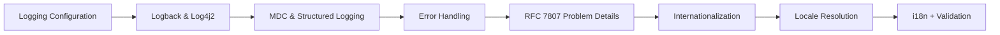

# Logging, Error Handling & Internationalization

> **Previous:** [Actuator, DevTools & Monitoring](./13-actuator-devtools.md) | **Next:** [REST API Development](./15-rest-api.md)

## Learning Objectives

After completing this chapter, you will be able to:

- Configure Logback with custom appenders, loggers, rolling policies, and MDC
- Configure Log4j2 as an alternative logging framework
- Use the SLF4J API with parameterized logging throughout your application
- Implement structured JSON logging for log aggregation systems
- Handle application errors globally with `@ControllerAdvice` and `@ExceptionHandler`
- Return structured error responses following RFC 7807 Problem Details
- Implement internationalization (i18n) with `MessageSource`
- Configure `LocaleResolver` strategies for multi-language applications
- Integrate i18n with Thymeleaf templates
- Internationalize validation error messages

## Chapter at a Glance

| Topic | Key Insight | Practical Takeaway |
|-------|-------------|--------------------|
| Logback | SLF4J facade + Logback implementation | MDC for contextual logging, rolling policies for log rotation |
| Structured Logging | JSON format for log aggregation | Use logstash-logback-encoder for ELK integration |
| Error Handling | @ControllerAdvice + @ExceptionHandler | Centralized, consistent error responses |
| RFC 7807 | Problem Details for HTTP API errors | Standard error format adopted by Spring Boot 3.x |
| i18n | MessageSource + LocaleResolver | Externalize messages in properties files per locale |

## Chapter Roadmap



> **Pro Tip:** Use parametrized logging (`log.info("user {} logged in", userId)`) instead of string concatenation — SLF4J evaluates the template only if the log level is enabled, saving CPU cycles.

---

## 1. Theory


### 1.1 The Java Logging Landscape


Spring Boot applications have access to a rich ecosystem of logging frameworks:

| Framework | Description |
|-----------|-------------|
| **SLF4J** | Simple Logging Facade for Java → the API facade |
| **Logback** | Native SLF4J implementation, Spring Boot's default |
| **Log4j2** | Apache Log4j 2 → asynchronous, high-performance alternative |
| **java.util.logging** | JDK built-in, rarely used directly in Spring Boot |

Spring Boot uses SLF4J + Logback by default. All internal Spring logging goes through SLF4J, and Logback is the default implementation.

### 1.2 SLF4J API Fundamentals


SLF4J is the API your code should depend on. Never depend directly on Logback or Log4j2 in your application code.

```java
import org.slf4j.Logger;
import org.slf4j.LoggerFactory;

public class OrderService {

    private static final Logger log = LoggerFactory.getLogger(OrderService.class);

    public void processOrder(Order order) {
        log.info("Processing order: {}", order.getId());
    }
}
```

**Important**: Use `LoggerFactory.getLogger()` at the class level with `static final` for performance. The logger instance is thread-safe.

#### 1.2.1 Logger Hierarchy

Loggers follow a hierarchical naming convention based on the dot-separated name:

```
Logger "com.example" is an ancestor of "com.example.service"
Logger "com.example.service" is an ancestor of "com.example.service.OrderService"
```

A logger inherits its level from its nearest ancestor that has a configured level. The root logger sits at the top:

```
ROOT
 └── com
      └── com.example
           └── com.example.service
                └── com.example.service.OrderService
```

#### 1.2.2 Log Levels (in order of severity)

| Level | SLF4J Method | Purpose |
|-------|--------------|---------|
| `ERROR` | `log.error(...)` | Application failure, data corruption, unrecoverable issues |
| `WARN` | `log.warn(...)` | Unexpected but recoverable, deprecated API usage |
| `INFO` | `log.info(...)` | Important business events, startup/shutdown, state changes |
| `DEBUG` | `log.debug(...)` | Detailed information for debugging during development |
| `TRACE` | `log.trace(...)` | Finest-grained details, request/request payload dumps |

#### 1.2.3 Parameterized Logging

SLF4J supports parameterized messages with `{}` placeholders:

```java
// Good → parameterized (avoids string concatenation when disabled)
log.info("User {} placed order {} worth ${}", userId, orderId, amount);

// Bad → string concatenation (evaluated even when level is disabled)
log.info("User " + userId + " placed order " + orderId);

// Multiple parameters
log.debug("Processing order {} for user {} with items {}",
        orderId, userId, itemCount);

// Exception (last parameter is special)
try {
    // risky operation
} catch (Exception e) {
    log.error("Failed to process order {}", orderId, e);
}
```

Parameterized logging is important because the `{}` placeholders are only evaluated if the log level is enabled. String concatenation with `+` always happens, even when the log line is suppressed.

#### 1.2.4 Checking Log Levels

For expensive message construction:

```java
if (log.isDebugEnabled()) {
    log.debug("Order details: {}", buildExpensiveDebugString(order));
}
```

For TRACE level, which is almost always disabled in production:

```java
if (log.isTraceEnabled()) {
    log.trace("Full request dump: {}", serializeFullRequest(request));
}
```

### 1.3 Logback Configuration


Logback is configured via `logback-spring.xml` in `src/main/resources/`. Spring Boot also supports `logback.xml`, but `logback-spring.xml` allows Spring-specific extensions.

#### 1.3.1 Basic Logback Configuration

```xml
<?xml version="1.0" encoding="UTF-8"?>
<configuration scan="true" scanPeriod="30 seconds">

    <!-- Property definitions -->
    <springProperty name="APP_NAME" source="spring.application.name" defaultValue="app"/>
    <springProperty name="LOG_PATH" source="logging.file.path" defaultValue="logs"/>

    <!-- Console Appender -->
    <appender name="CONSOLE" class="ch.qos.logback.core.ConsoleAppender">
        <encoder>
            <pattern>
                %d{yyyy-MM-dd HH:mm:ss.SSS} [%thread] %-5level %logger{36} [%X{traceId}] - %msg%n
            </pattern>
        </encoder>
    </appender>

    <!-- File Appender -->
    <appender name="FILE" class="ch.qos.logback.core.rolling.RollingFileAppender">
        <file>${LOG_PATH}/${APP_NAME}.log</file>
        <rollingPolicy class="ch.qos.logback.core.rolling.TimeBasedRollingPolicy">
            <fileNamePattern>${LOG_PATH}/${APP_NAME}.%d{yyyy-MM-dd}.%i.log</fileNamePattern>
            <maxHistory>30</maxHistory>
            <cleanHistoryOnStart>true</cleanHistoryOnStart>
            <totalSizeCap>3GB</totalSizeCap>
            <timeBasedFileNamingAndTriggeringPolicy class="ch.qos.logback.core.rolling.SizeAndTimeBasedFNATP">
                <maxFileSize>100MB</maxFileSize>
            </timeBasedFileNamingAndTriggeringPolicy>
        </rollingPolicy>
        <encoder>
            <pattern>%d{yyyy-MM-dd HH:mm:ss.SSS} [%thread] %-5level %logger{36} - %msg%n</pattern>
        </encoder>
    </appender>

    <!-- Error-specific File Appender -->
    <appender name="ERROR_FILE" class="ch.qos.logback.core.rolling.RollingFileAppender">
        <file>${LOG_PATH}/${APP_NAME}-error.log</file>
        <filter class="ch.qos.logback.classic.filter.ThresholdFilter">
            <level>ERROR</level>
        </filter>
        <rollingPolicy class="ch.qos.logback.core.rolling.TimeBasedRollingPolicy">
            <fileNamePattern>${LOG_PATH}/${APP_NAME}-error.%d{yyyy-MM-dd}.log</fileNamePattern>
            <maxHistory>90</maxHistory>
        </rollingPolicy>
        <encoder>
            <pattern>%d{yyyy-MM-dd HH:mm:ss.SSS} [%thread] %-5level %logger{36} - %msg%n</pattern>
        </encoder>
    </appender>

    <!-- Root Logger -->
    <root level="INFO">
        <appender-ref ref="CONSOLE"/>
        <appender-ref ref="FILE"/>
        <appender-ref ref="ERROR_FILE"/>
    </root>

    <!-- Package-specific log levels -->
    <logger name="com.example" level="DEBUG" additivity="false">
        <appender-ref ref="CONSOLE"/>
        <appender-ref ref="FILE"/>
    </logger>

    <logger name="org.springframework.web" level="DEBUG" additivity="false">
        <appender-ref ref="CONSOLE"/>
    </logger>

    <logger name="org.springframework.security" level="WARN"/>

    <logger name="org.hibernate.SQL" level="DEBUG" additivity="false">
        <appender-ref ref="CONSOLE"/>
    </logger>

    <logger name="org.hibernate.type.descriptor.sql.BasicBinder" level="TRACE">
        <appender-ref ref="CONSOLE"/>
    </logger>

</configuration>
```

#### 1.3.2 Pattern Layout Reference

The `%pattern` in the encoder supports many conversion words:

| Conversion | Description | Example |
|-----------|-------------|---------|
| `%d` | Date/time | `2026-06-12 14:30:00.123` |
| `%thread` | Thread name | `http-nio-8080-exec-3` |
| `%level` | Log level | `INFO` |
| `%-5level` | Left-padded to 5 chars | `INFO ` |
| `%logger{36}` | Logger name (abbreviated) | `c.e.service.OrderService` |
| `%msg` | Log message | `Order 42 processed` |
| `%n` | Newline | |
| `%X{key}` | MDC value | `%X{traceId}` |
| `%marker` | Marker name | `SECURITY` |
| `%caller{1}` | Caller info | `OrderService.java:42` |
| `%L` | Line number | `42` |
| `%M` | Method name | `processOrder` |
| `%replace(p){r,t}` | Regex replace | `%replace(%msg){'secret', '****'}` |
| `%highlight` | ANSI color | Levels colored in console |
| `%boldYellow` | ANSI bold yellow | Warnings in yellow |
| `%boldRed` | ANSI bold red | Errors in red |

Colored console pattern:

```xml
<appender name="CONSOLE" class="ch.qos.logback.core.ConsoleAppender">
    <encoder>
        <pattern>%d{HH:mm:ss.SSS} %highlight(%-5level) [%thread] %cyan(%logger{36}) - %msg%n</pattern>
    </encoder>
</appender>
```

#### 1.3.3 Rolling Policies

Logback supports several rolling policies:

**Time-based rolling**:

```xml
<rollingPolicy class="ch.qos.logback.core.rolling.TimeBasedRollingPolicy">
    <fileNamePattern>logs/app.%d{yyyy-MM-dd}.log</fileNamePolicy>
    <!-- More patterns:
         .%d{yyyy-MM-dd}           → daily
         .%d{yyyy-MM-dd_HH}        → hourly
         .%d{yyyy-ww}              → weekly
         .%d{yyyy-MM}              → monthly
    -->
    <maxHistory>30</maxHistory>
    <cleanHistoryOnStart>true</cleanHistoryOnStart>
</rollingPolicy>
```

**Size-based rolling**:

```xml
<rollingPolicy class="ch.qos.logback.core.rolling.SizeBasedTriggeringPolicy">
    <maxFileSize>100MB</maxFileSize>
</rollingPolicy>
```

**Size and time combined**:

```xml
<rollingPolicy class="ch.qos.logback.core.rolling.SizeAndTimeBasedRollingPolicy">
    <fileNamePattern>logs/app.%d{yyyy-MM-dd}.%i.log</fileNamePattern>
    <maxFileSize>100MB</maxFileSize>
    <maxHistory>30</maxHistory>
    <totalSizeCap>10GB</totalSizeCap>
</rollingPolicy>
```

#### 1.3.4 Logback Filters

Filters control which log events reach an appender.

**ThresholdFilter** → only events above a threshold:

```xml
<appender name="ERROR_FILE" class="ch.qos.logback.core.FileAppender">
    <filter class="ch.qos.logback.classic.filter.ThresholdFilter">
        <level>ERROR</level>
    </filter>
</appender>
```

**LevelFilter** → exact match:

```xml
<appender name="WARN_FILE" class="ch.qos.logback.core.FileAppender">
    <filter class="ch.qos.logback.classic.filter.LevelFilter">
        <level>WARN</level>
        <onMatch>ACCEPT</onMatch>
        <onMismatch>DENY</onMismatch>
    </filter>
</appender>
```

**EvaluatorFilter** → custom conditions:

```xml
<appender name="SLOW_SQL" class="ch.qos.logback.core.FileAppender">
    <filter class="ch.qos.logback.classic.boolex.JaninoEventEvaluator">
        <expression>
            return formattedMessage.contains("slow query")
                || formattedMessage.contains("> 1000ms");
        </expression>
    </filter>
</appender>
```

#### 1.3.5 MDC → Mapped Diagnostic Context

MDC allows you to add contextual information to log messages:

```java
import org.slf4j.MDC;

@Service
public class OrderService {

    private static final Logger log = LoggerFactory.getLogger(OrderService.class);

    public Order createOrder(OrderRequest request) {
        try {
            MDC.put("userId", request.getUserId());
            MDC.put("orderId", UUID.randomUUID().toString());
            MDC.put("traceId", TraceContext.getTraceId());

            log.info("Creating order for user");

            Order order = new Order(request);
            orderRepository.save(order);

            log.info("Order created successfully");

            return order;
        } finally {
            MDC.clear();  // ALWAYS clear in finally block
        }
    }
}
```

Using a filter to automatically populate MDC:

```java
package com.example.logging;

import jakarta.servlet.*;
import jakarta.servlet.http.HttpServletRequest;
import org.slf4j.MDC;
import org.springframework.core.Ordered;
import org.springframework.core.annotation.Order;
import org.springframework.stereotype.Component;

import java.io.IOException;
import java.util.UUID;

@Component
@Order(Ordered.HIGHEST_PRECEDENCE)
public class MDCFilter implements Filter {

    @Override
    public void doFilter(ServletRequest request, ServletResponse response,
                         FilterChain chain) throws IOException, ServletException {

        HttpServletRequest req = (HttpServletRequest) request;

        try {
            MDC.put("traceId", UUID.randomUUID().toString().substring(0, 8));
            MDC.put("requestUri", req.getRequestURI());
            MDC.put("method", req.getMethod());
            MDC.put("remoteAddr", req.getRemoteAddr());

            if (req.getUserPrincipal() != null) {
                MDC.put("user", req.getUserPrincipal().getName());
            }

            chain.doFilter(request, response);
        } finally {
            MDC.clear();
        }
    }
}
```

Include MDC values in log pattern:

```xml
<encoder>
    <pattern>%d{yyyy-MM-dd HH:mm:ss.SSS} [%thread] %-5level %logger{36} [trace=%X{traceId}, user=%X{user}] - %msg%n</pattern>
</encoder>
```

Output:

```
2026-06-12 14:30:00.123 [http-nio-8080-exec-3] INFO  c.e.service.OrderService [trace=a1b2c3d4, user=jdoe] - Order created successfully
```

### 1.4 Structured JSON Logging


For log aggregation systems like ELK, Datadog, Grafana Loki, or Splunk, structured JSON output is essential.

#### 1.4.1 Using Logstash Logback Encoder

```xml
<dependency>
    <groupId>net.logstash.logback</groupId>
    <artifactId>logstash-logback-encoder</artifactId>
    <version>7.4</version>
</dependency>
```

```xml
<!-- logback-spring.xml -->
<?xml version="1.0" encoding="UTF-8"?>
<configuration>
    <springProperty name="APP_NAME" source="spring.application.name" defaultValue="app"/>
    <springProperty name="ENV" source="spring.profiles.active" defaultValue="development"/>

    <!-- JSON Appender -->
    <appender name="JSON_FILE" class="ch.qos.logback.core.rolling.RollingFileAppender">
        <file>logs/${APP_NAME}.json</file>
        <rollingPolicy class="ch.qos.logback.core.rolling.SizeAndTimeBasedRollingPolicy">
            <fileNamePattern>logs/${APP_NAME}.%d{yyyy-MM-dd}.%i.json.gz</fileNamePattern>
            <maxFileSize>500MB</maxFileSize>
            <maxHistory>7</maxHistory>
            <totalSizeCap>10GB</totalSizeCap>
        </rollingPolicy>
        <encoder class="net.logstash.logback.encoder.LogstashEncoder">
            <!-- Custom fields -->
            <customFields>{"application":"${APP_NAME}","environment":"${ENV}"}</customFields>

            <!-- Include MDC -->
            <includeMdc>true</includeMdc>

            <!-- Exclude fields -->
            <excludeMdcKey>password</excludeMdcKey>
            <excludeMdcKey>secret</excludeMdcKey>

            <!-- Field names configuration -->
            <fieldNames>
                <timestamp>@timestamp</timestamp>
                <level>severity</level>
                <logger>logger_name</logger>
                <thread>thread_name</thread>
                <message>message</message>
                <mdc>context</mdc>
            </fieldNames>
        </encoder>
    </appender>

    <root level="INFO">
        <appender-ref ref="JSON_FILE"/>
        <appender-ref ref="CONSOLE"/>
    </root>
</configuration>
```

Example JSON output:

```json
{
  "@timestamp": "2026-06-12T14:30:00.123Z",
  "severity": "INFO",
  "logger_name": "com.example.service.OrderService",
  "thread_name": "http-nio-8080-exec-3",
  "message": "Order created successfully",
  "context": {
    "traceId": "a1b2c3d4",
    "userId": "user-42",
    "orderId": "ord-12345"
  },
  "application": "order-service",
  "environment": "production"
}
```

#### 1.4.2 Custom JSON Layout

```xml
<appender name="CUSTOM_JSON" class="ch.qos.logback.core.ConsoleAppender">
    <encoder class="ch.qos.logback.classic.encoder.JsonEncoder"/>
</appender>
```

#### 1.4.3 Programmatic Structured Logging

```java
package com.example.logging;

import net.logstash.logback.argument.StructuredArguments;
import org.slf4j.Logger;
import org.slf4j.LoggerFactory;

@Service
public class OrderLoggingService {

    private static final Logger log = LoggerFactory.getLogger(OrderLoggingService.class);

    public void logOrderCreation(Order order) {
        log.info("Order created",
                StructuredArguments.keyValue("orderId", order.getId()),
                StructuredArguments.keyValue("userId", order.getUserId()),
                StructuredArguments.keyValue("amount", order.getTotalAmount()),
                StructuredArguments.keyValue("currency", order.getCurrency()),
                StructuredArguments.keyValue("items", order.getItemCount()),
                StructuredArguments.keyValue("channel", order.getChannel())
        );
    }

    public void logPaymentFailure(String orderId, String errorCode, BigDecimal amount) {
        log.error("Payment failed",
                StructuredArguments.keyValue("orderId", orderId),
                StructuredArguments.keyValue("errorCode", errorCode),
                StructuredArguments.keyValue("amount", amount),
                StructuredArguments.keyValue("retryCount", 3)
        );
    }
}
```

JSON output:

```json
{
  "message": "Order created",
  "orderId": "ord-12345",
  "userId": "user-42",
  "amount": 299.99,
  "currency": "USD",
  "items": 3,
  "channel": "web"
}
```

#### 1.4.4 Logging Exceptions as Structured Data

```java
try {
    paymentGateway.charge(order);
} catch (PaymentException e) {
    log.error("Payment processing failed",
            StructuredArguments.keyValue("orderId", order.getId()),
            StructuredArguments.keyValue("gateway", "stripe"),
            StructuredArguments.keyValue("errorType", e.getErrorType()),
            StructuredArguments.keyValue("declineCode", e.getDeclineCode()),
            e  // stack trace
    );
}
```

### 1.5 Log4j2 Configuration


To use Log4j2 instead of Logback:

```xml
<dependency>
    <groupId>org.springframework.boot</groupId>
    <artifactId>spring-boot-starter-web</artifactId>
    <exclusions>
        <exclusion>
            <groupId>org.springframework.boot</groupId>
            <artifactId>spring-boot-starter-logging</artifactId>
        </exclusion>
    </exclusions>
</dependency>

<dependency>
    <groupId>org.springframework.boot</groupId>
    <artifactId>spring-boot-starter-log4j2</artifactId>
</dependency>
```

#### 1.5.1 log4j2-spring.xml

```xml
<?xml version="1.0" encoding="UTF-8"?>
<Configuration status="WARN" monitorInterval="30">

    <Properties>
        <Property name="APP_NAME">${spring:spring.application.name:-app}</Property>
        <Property name="LOG_PATH">${sys:logging.file.path:-logs}</Property>
        <Property name="LOG_PATTERN">
            %d{yyyy-MM-dd HH:mm:ss.SSS} [%t] %-5level %logger{36} - %msg%n
        </Property>
    </Properties>

    <Appenders>
        <Console name="CONSOLE" target="SYSTEM_OUT">
            <PatternLayout pattern="${LOG_PATTERN}"/>
        </Console>

        <RollingFile name="FILE" fileName="${LOG_PATH}/${APP_NAME}.log"
                     filePattern="${LOG_PATH}/${APP_NAME}.%d{yyyy-MM-dd}.%i.log.gz">
            <PatternLayout pattern="${LOG_PATTERN}"/>
            <Policies>
                <TimeBasedTriggeringPolicy interval="1" modulate="true"/>
                <SizeBasedTriggeringPolicy size="100 MB"/>
            </Policies>
            <DefaultRolloverStrategy max="30"/>
        </RollingFile>

        <RollingFile name="ERROR_FILE" fileName="${LOG_PATH}/${APP_NAME}-error.log"
                     filePattern="${LOG_PATH}/${APP_NAME}-error.%d{yyyy-MM-dd}.log.gz">
            <PatternLayout pattern="${LOG_PATTERN}"/>
            <ThresholdFilter level="ERROR" onMatch="ACCEPT" onMismatch="DENY"/>
            <Policies>
                <TimeBasedTriggeringPolicy interval="1" modulate="true"/>
            </Policies>
            <DefaultRolloverStrategy max="90"/>
        </RollingFile>

        <Routing name="ROUTING">
            <Routes pattern="$${ctx:userId}">
                <Route>
                    <RollingFile
                        fileName="${LOG_PATH}/users/${ctx:userId}.log"
                        filePattern="${LOG_PATH}/users/${ctx:userId}.%d{yyyy-MM-dd}.log.gz">
                        <PatternLayout pattern="${LOG_PATTERN}"/>
                        <Policies>
                            <TimeBasedTriggeringPolicy interval="1" modulate="true"/>
                        </Policies>
                    </RollingFile>
                </Route>
            </Routes>
        </Routing>

        <Console name="JSON_CONSOLE" target="SYSTEM_OUT">
            <JsonTemplateLayout eventTemplateUri="classpath:LogstashJsonEventLayoutV1.json"/>
        </Console>
    </Appenders>

    <Loggers>
        <!-- Async logger for performance -->
        <AsyncLogger name="com.example" level="DEBUG" additivity="false">
            <AppenderRef ref="CONSOLE"/>
            <AppenderRef ref="FILE"/>
            <AppenderRef ref="ERROR_FILE"/>
        </AsyncLogger>

        <Logger name="org.springframework.web" level="DEBUG"/>
        <Logger name="org.springframework.security" level="WARN"/>
        <Logger name="org.hibernate.SQL" level="DEBUG"/>

        <!-- Root logger -->
        <Root level="INFO">
            <AppenderRef ref="CONSOLE"/>
            <AppenderRef ref="FILE"/>
            <AppenderRef ref="ERROR_FILE"/>
        </Root>
    </Loggers>

</Configuration>
```

#### 1.5.2 Async Loggers in Log4j2

Log4j2's async loggers use LMAX Disruptor for extremely high throughput:

```xml
<dependency>
    <groupId>com.lmax</groupId>
    <artifactId>disruptor</artifactId>
    <version>3.4.4</version>
</dependency>
```

```xml
<Configuration>
    <Appenders>
        <RollingFile name="ASYNC_FILE" ...>
            <!-- ... -->
        </RollingFile>
    </Appenders>

    <Loggers>
        <AsyncRoot level="INFO">
            <AppenderRef ref="ASYNC_FILE"/>
        </AsyncRoot>

        <AsyncLogger name="com.example.highvolume" level="DEBUG">
            <AppenderRef ref="ASYNC_FILE"/>
        </AsyncLogger>
    </Loggers>
</Configuration>
```

### 1.6 Spring Boot Logging Configuration


Spring Boot allows configuring logging entirely through `application.yml`:

```yaml
logging:
  level:
    root: INFO
    com.example: DEBUG
    com.example.service.PaymentService: TRACE
    org.springframework.web: WARN
    org.springframework.security: ERROR
    org.hibernate.SQL: DEBUG
    org.hibernate.type.descriptor.sql.BasicBinder: TRACE

  pattern:
    console: "%d{yyyy-MM-dd HH:mm:ss.SSS} [%thread] %highlight(%-5level) %cyan(%logger{36}) - %msg%n"
    file: "%d{yyyy-MM-dd HH:mm:ss.SSS} [%thread] %-5level %logger{36} - %msg%n"
    dateformat: "yyyy-MM-dd HH:mm:ss.SSS"

  file:
    name: logs/application.log
    path: logs
    max-size: 100MB
    max-history: 30
    total-size-cap: 3GB

  logback:
    rollingpolicy:
      file-name-pattern: ${LOG_FILE}.%d{yyyy-MM-dd}.%i.gz
      max-file-size: 100MB
      max-history: 30
      total-size-cap: 3GB

  group:
    web: org.springframework.web, org.springframework.web.servlet
    sql: org.hibernate.SQL, org.hibernate.type

  register-shutdown-hook: true
```

Log groups let you set levels for multiple loggers at once:

```yaml
logging:
  group:
    web: org.springframework.web, org.springframework.web.servlet
    sql: org.hibernate.SQL, org.hibernate.type.descriptor.sql
    business: com.example.service, com.example.controller
  level:
    web: DEBUG
    sql: TRACE
    business: INFO
```

### 1.7 Global Error Handling with @ControllerAdvice


#### 1.7.1 Basic @ExceptionHandler

```java
package com.example.error;

import org.springframework.http.HttpStatus;
import org.springframework.http.ResponseEntity;
import org.springframework.web.bind.annotation.ExceptionHandler;
import org.springframework.web.bind.annotation.RestControllerAdvice;

import java.time.LocalDateTime;
import java.util.Map;

@RestControllerAdvice
public class GlobalExceptionHandler {

    @ExceptionHandler(ResourceNotFoundException.class)
    public ResponseEntity<Map<String, Object>> handleNotFound(ResourceNotFoundException ex) {
        return ResponseEntity.status(HttpStatus.NOT_FOUND).body(Map.of(
                "timestamp", LocalDateTime.now().toString(),
                "status", 404,
                "error", "Not Found",
                "message", ex.getMessage(),
                "path", ex.getPath()
        ));
    }

    @ExceptionHandler(InvalidRequestException.class)
    public ResponseEntity<Map<String, Object>> handleInvalidRequest(InvalidRequestException ex) {
        return ResponseEntity.status(HttpStatus.BAD_REQUEST).body(Map.of(
                "timestamp", LocalDateTime.now().toString(),
                "status", 400,
                "error", "Bad Request",
                "message", ex.getMessage(),
                "errors", ex.getErrors()
        ));
    }

    @ExceptionHandler(UnauthorizedException.class)
    public ResponseEntity<Map<String, Object>> handleUnauthorized(UnauthorizedException ex) {
        return ResponseEntity.status(HttpStatus.UNAUTHORIZED).body(Map.of(
                "timestamp", LocalDateTime.now().toString(),
                "status", 401,
                "error", "Unauthorized",
                "message", ex.getMessage()
        ));
    }

    @ExceptionHandler(ForbiddenException.class)
    public ResponseEntity<Map<String, Object>> handleForbidden(ForbiddenException ex) {
        return ResponseEntity.status(HttpStatus.FORBIDDEN).body(Map.of(
                "timestamp", LocalDateTime.now().toString(),
                "status", 403,
                "error", "Forbidden",
                "message", ex.getMessage()
        ));
    }

    @ExceptionHandler(DuplicateResourceException.class)
    public ResponseEntity<Map<String, Object>> handleDuplicate(DuplicateResourceException ex) {
        return ResponseEntity.status(HttpStatus.CONFLICT).body(Map.of(
                "timestamp", LocalDateTime.now().toString(),
                "status", 409,
                "error", "Conflict",
                "message", ex.getMessage()
        ));
    }

    @ExceptionHandler(Exception.class)
    public ResponseEntity<Map<String, Object>> handleGeneral(Exception ex) {
        return ResponseEntity.status(HttpStatus.INTERNAL_SERVER_ERROR).body(Map.of(
                "timestamp", LocalDateTime.now().toString(),
                "status", 500,
                "error", "Internal Server Error",
                "message", "An unexpected error occurred"
        ));
    }
}
```

#### 1.7.2 Custom Exception Classes

```java
package com.example.error;

public class ResourceNotFoundException extends RuntimeException {

    private final String resourceType;
    private final String resourceId;
    private final String path;

    public ResourceNotFoundException(String resourceType, String resourceId, String path) {
        super(String.format("%s with id '%s' not found", resourceType, resourceId));
        this.resourceType = resourceType;
        this.resourceId = resourceId;
        this.path = path;
    }

    public String getResourceType() {
        return resourceType;
    }

    public String getResourceId() {
        return resourceId;
    }

    public String getPath() {
        return path;
    }
}

public class InvalidRequestException extends RuntimeException {

    private final List<FieldError> errors;

    public InvalidRequestException(String message, List<FieldError> errors) {
        super(message);
        this.errors = errors;
    }

    public InvalidRequestException(String message) {
        this(message, List.of());
    }

    public List<FieldError> getErrors() {
        return errors;
    }

    public record FieldError(String field, String message, Object rejectedValue) {}
}

public class UnauthorizedException extends RuntimeException {
    public UnauthorizedException(String message) {
        super(message);
    }
}

public class ForbiddenException extends RuntimeException {
    public ForbiddenException(String message) {
        super(message);
    }
}

public class DuplicateResourceException extends RuntimeException {
    public DuplicateResourceException(String resourceType, String field, String value) {
        super(String.format("%s with %s '%s' already exists", resourceType, field, value));
    }
}

public class ServiceException extends RuntimeException {
    private final String errorCode;

    public ServiceException(String message, String errorCode) {
        super(message);
        this.errorCode = errorCode;
    }

    public ServiceException(String message, String errorCode, Throwable cause) {
        super(message, cause);
        this.errorCode = errorCode;
    }

    public String getErrorCode() {
        return errorCode;
    }
}
```

#### 1.7.3 Complete @RestControllerAdvice

```java
package com.example.error;

import jakarta.validation.ConstraintViolation;
import jakarta.validation.ConstraintViolationException;
import org.slf4j.Logger;
import org.slf4j.LoggerFactory;
import org.springframework.http.HttpHeaders;
import org.springframework.http.HttpStatus;
import org.springframework.http.HttpStatusCode;
import org.springframework.http.ResponseEntity;
import org.springframework.validation.FieldError;
import org.springframework.web.bind.MethodArgumentNotValidException;
import org.springframework.web.bind.MissingServletRequestParameterException;
import org.springframework.web.bind.annotation.ExceptionHandler;
import org.springframework.web.bind.annotation.RestControllerAdvice;
import org.springframework.web.context.request.WebRequest;
import org.springframework.web.method.annotation.MethodArgumentTypeMismatchException;
import org.springframework.web.servlet.mvc.method.annotation.ResponseEntityExceptionHandler;

import java.time.LocalDateTime;
import java.util.HashMap;
import java.util.List;
import java.util.Map;
import java.util.stream.Collectors;

@RestControllerAdvice
public class RestExceptionHandler extends ResponseEntityExceptionHandler {

    private static final Logger log = LoggerFactory.getLogger(RestExceptionHandler.class);

    @Override
    protected ResponseEntity<Object> handleMethodArgumentNotValid(
            MethodArgumentNotValidException ex,
            HttpHeaders headers,
            HttpStatusCode status,
            WebRequest request) {

        Map<String, Object> body = new HashMap<>();
        body.put("timestamp", LocalDateTime.now().toString());
        body.put("status", status.value());
        body.put("error", "Validation Failed");

        List<Map<String, Object>> errors = ex.getBindingResult()
                .getFieldErrors()
                .stream()
                .map(fieldError -> Map.<String, Object>of(
                        "field", fieldError.getField(),
                        "message", fieldError.getDefaultMessage(),
                        "rejectedValue", fieldError.getRejectedValue(),
                        "code", fieldError.getCode()
                ))
                .collect(Collectors.toList());

        body.put("errors", errors);

        return ResponseEntity.status(status).body(body);
    }

    @Override
    protected ResponseEntity<Object> handleMissingServletRequestParameter(
            MissingServletRequestParameterException ex,
            HttpHeaders headers,
            HttpStatusCode status,
            WebRequest request) {

        return ResponseEntity.status(HttpStatus.BAD_REQUEST).body(Map.of(
                "timestamp", LocalDateTime.now().toString(),
                "status", 400,
                "error", "Missing Parameter",
                "parameter", ex.getParameterName(),
                "parameterType", ex.getParameterType()
        ));
    }

    @ExceptionHandler(ConstraintViolationException.class)
    public ResponseEntity<Object> handleConstraintViolation(ConstraintViolationException ex) {
        Map<String, Object> errors = ex.getConstraintViolations()
                .stream()
                .collect(Collectors.toMap(
                        cv -> cv.getPropertyPath().toString(),
                        ConstraintViolation::getMessage,
                        (a, b) -> a + "; " + b
                ));

        return ResponseEntity.status(HttpStatus.BAD_REQUEST).body(Map.of(
                "timestamp", LocalDateTime.now().toString(),
                "status", 400,
                "error", "Validation Failed",
                "errors", errors
        ));
    }

    @ExceptionHandler(MethodArgumentTypeMismatchException.class)
    public ResponseEntity<Object> handleTypeMismatch(MethodArgumentTypeMismatchException ex) {
        return ResponseEntity.status(HttpStatus.BAD_REQUEST).body(Map.of(
                "timestamp", LocalDateTime.now().toString(),
                "status", 400,
                "error", "Type Mismatch",
                "parameter", ex.getName(),
                "expectedType", ex.getRequiredType() != null ? ex.getRequiredType().getSimpleName() : "unknown",
                "rejectedValue", ex.getValue()
        ));
    }

    @ExceptionHandler(ResourceNotFoundException.class)
    public ResponseEntity<Object> handleResourceNotFound(ResourceNotFoundException ex) {
        return ResponseEntity.status(HttpStatus.NOT_FOUND).body(Map.of(
                "timestamp", LocalDateTime.now().toString(),
                "status", 404,
                "error", "Not Found",
                "resourceType", ex.getResourceType(),
                "resourceId", ex.getResourceId(),
                "message", ex.getMessage()
        ));
    }

    @ExceptionHandler(DuplicateResourceException.class)
    public ResponseEntity<Object> handleDuplicate(DuplicateResourceException ex) {
        return ResponseEntity.status(HttpStatus.CONFLICT).body(Map.of(
                "timestamp", LocalDateTime.now().toString(),
                "status", 409,
                "error", "Conflict",
                "message", ex.getMessage()
        ));
    }

    @ExceptionHandler(InvalidRequestException.class)
    public ResponseEntity<Object> handleInvalidRequest(InvalidRequestException ex) {
        return ResponseEntity.status(HttpStatus.BAD_REQUEST).body(Map.of(
                "timestamp", LocalDateTime.now().toString(),
                "status", 400,
                "error", "Bad Request",
                "message", ex.getMessage(),
                "errors", ex.getErrors()
        ));
    }

    @ExceptionHandler(UnauthorizedException.class)
    public ResponseEntity<Object> handleUnauthorized(UnauthorizedException ex) {
        return ResponseEntity.status(HttpStatus.UNAUTHORIZED).body(Map.of(
                "timestamp", LocalDateTime.now().toString(),
                "status", 401,
                "error", "Unauthorized",
                "message", ex.getMessage()
        ));
    }

    @ExceptionHandler(ForbiddenException.class)
    public ResponseEntity<Object> handleForbidden(ForbiddenException ex) {
        return ResponseEntity.status(HttpStatus.FORBIDDEN).body(Map.of(
                "timestamp", LocalDateTime.now().toString(),
                "status", 403,
                "error", "Forbidden",
                "message", ex.getMessage()
        ));
    }

    @ExceptionHandler(ServiceException.class)
    public ResponseEntity<Object> handleServiceException(ServiceException ex) {
        log.error("Service error: code={}, message={}", ex.getErrorCode(), ex.getMessage(), ex);
        return ResponseEntity.status(HttpStatus.INTERNAL_SERVER_ERROR).body(Map.of(
                "timestamp", LocalDateTime.now().toString(),
                "status", 500,
                "error", "Service Error",
                "errorCode", ex.getErrorCode(),
                "message", ex.getMessage()
        ));
    }

    @ExceptionHandler(Exception.class)
    public ResponseEntity<Object> handleAllUncaught(Exception ex, WebRequest request) {
        log.error("Unhandled exception", ex);
        return ResponseEntity.status(HttpStatus.INTERNAL_SERVER_ERROR).body(Map.of(
                "timestamp", LocalDateTime.now().toString(),
                "status", 500,
                "error", "Internal Server Error",
                "message", "An unexpected error occurred. Please try again later.",
                "traceId", request.getHeader("X-Trace-Id")
        ));
    }
}
```

### 1.8 RFC 7807 Problem Details


RFC 7807 (Problem Details for HTTP APIs) provides a standard format for error responses. Spring Boot 3.x has built-in support.

#### 1.8.1 Enabling Problem Details

```yaml
spring:
  mvc:
    problemdetails:
      enabled: true
```

#### 1.8.2 Standard ProblemDetail Response

With problem details enabled, Spring Boot automatically returns RFC 7807 responses:

```json
{
  "type": "about:blank",
  "title": "Not Found",
  "status": 404,
  "detail": "Order with id '999' not found",
  "instance": "/api/orders/999",
  "timestamp": "2026-06-12T14:30:00.123Z"
}
```

#### 1.8.3 Custom ProblemDetail

```java
package com.example.error;

import org.springframework.http.HttpStatus;
import org.springframework.http.ProblemDetail;
import org.springframework.web.bind.annotation.ExceptionHandler;
import org.springframework.web.bind.annotation.RestControllerAdvice;

import java.net.URI;

@RestControllerAdvice
public class ProblemDetailExceptionHandler {

    @ExceptionHandler(ResourceNotFoundException.class)
    public ProblemDetail handleNotFound(ResourceNotFoundException ex) {
        ProblemDetail problem = ProblemDetail.forStatusAndDetail(
                HttpStatus.NOT_FOUND, ex.getMessage()
        );
        problem.setTitle("Resource Not Found");
        problem.setType(URI.create("https://api.example.com/errors/not-found"));
        problem.setInstance(URI.create(ex.getPath()));
        problem.setProperty("resourceType", ex.getResourceType());
        problem.setProperty("resourceId", ex.getResourceId());
        problem.setProperty("timestamp", java.time.Instant.now().toString());
        return problem;
    }

    @ExceptionHandler(InvalidRequestException.class)
    public ProblemDetail handleInvalidRequest(InvalidRequestException ex) {
        ProblemDetail problem = ProblemDetail.forStatusAndDetail(
                HttpStatus.BAD_REQUEST, ex.getMessage()
        );
        problem.setTitle("Invalid Request");
        problem.setType(URI.create("https://api.example.com/errors/invalid-request"));
        problem.setProperty("errors", ex.getErrors());
        problem.setProperty("timestamp", java.time.Instant.now().toString());
        return problem;
    }

    @ExceptionHandler(ServiceException.class)
    public ProblemDetail handleServiceError(ServiceException ex) {
        ProblemDetail problem = ProblemDetail.forStatusAndDetail(
                HttpStatus.INTERNAL_SERVER_ERROR, ex.getMessage()
        );
        problem.setTitle("Service Error");
        problem.setType(URI.create("https://api.example.com/errors/service-error"));
        problem.setProperty("errorCode", ex.getErrorCode());
        problem.setProperty("timestamp", java.time.Instant.now().toString());
        return problem;
    }
}
```

#### 1.8.4 Validation Errors with ProblemDetail

```java
@RestControllerAdvice
public class ValidationProblemDetailHandler extends ResponseEntityExceptionHandler {

    @Override
    protected ResponseEntity<Object> handleMethodArgumentNotValid(
            MethodArgumentNotValidException ex,
            HttpHeaders headers,
            HttpStatusCode status,
            WebRequest request) {

        ProblemDetail problem = ProblemDetail.forStatusAndDetail(
                status, "Validation failed for the request"
        );
        problem.setTitle("Validation Error");
        problem.setType(URI.create("https://api.example.com/errors/validation"));

        List<Map<String, Object>> errors = ex.getBindingResult()
                .getFieldErrors()
                .stream()
                .map(fe -> Map.<String, Object>of(
                        "field", fe.getField(),
                        "message", fe.getDefaultMessage(),
                        "rejectedValue", fe.getRejectedValue()
                ))
                .toList();

        problem.setProperty("errors", errors);
        problem.setProperty("timestamp", Instant.now().toString());

        return ResponseEntity.status(status).body(problem);
    }
}
```

### 1.9 Internationalization (i18n)


Spring Boot provides comprehensive i18n support through `MessageSource`, `LocaleResolver`, and Thymeleaf integration.

#### 1.9.1 MessageSource Configuration

```java
package com.example.i18n.config;

import org.springframework.context.MessageSource;
import org.springframework.context.annotation.Bean;
import org.springframework.context.annotation.Configuration;
import org.springframework.context.support.ReloadableResourceBundleMessageSource;
import org.springframework.web.servlet.LocaleResolver;
import org.springframework.web.servlet.i18n.AcceptHeaderLocaleResolver;
import org.springframework.web.servlet.i18n.CookieLocaleResolver;
import org.springframework.web.servlet.i18n.SessionLocaleResolver;

import java.time.Duration;
import java.util.Locale;

@Configuration
public class I18nConfig {

    @Bean
    public MessageSource messageSource() {
        ReloadableResourceBundleMessageSource messageSource =
                new ReloadableResourceBundleMessageSource();

        // Base names of message bundles (comma-separated)
        messageSource.setBasenames(
                "classpath:messages/messages",
                "classpath:messages/validation",
                "classpath:messages/emails",
                "classpath:messages/errors"
        );

        // UTF-8 encoding for full Unicode support
        messageSource.setDefaultEncoding("UTF-8");

        // Cache seconds for development (0 = always reload, production = 3600+)
        messageSource.setCacheSeconds(3600);

        // Fallback to system locale if no matching bundle found
        messageSource.setFallbackToSystemLocale(false);

        // Use the message code as the default message if not found
        messageSource.setUseCodeAsDefaultMessage(true);

        // Always use the message format (even for single-argument messages)
        messageSource.setAlwaysUseMessageFormat(false);

        return messageSource;
    }
}
```

#### 1.9.2 LocaleResolver Strategies

**AcceptHeaderLocaleResolver** → uses the `Accept-Language` HTTP header:

```java
@Bean
public LocaleResolver localeResolver() {
    AcceptHeaderLocaleResolver resolver = new AcceptHeaderLocaleResolver();
    resolver.setDefaultLocale(Locale.ENGLISH);
    resolver.setSupportedLocales(List.of(
            Locale.ENGLISH,
            Locale.FRENCH,
            Locale.GERMAN,
            Locale.JAPANESE,
            new Locale("es"),
            new Locale("pt", "BR"),
            new Locale("zh", "CN")
    ));
    return resolver;
}
```

**SessionLocaleResolver** → stores locale in the HTTP session:

```java
@Bean
public LocaleResolver localeResolver() {
    SessionLocaleResolver resolver = new SessionLocaleResolver();
    resolver.setDefaultLocale(Locale.ENGLISH);
    resolver.setSupportedLocales(List.of(Locale.ENGLISH, Locale.FRENCH, Locale.GERMAN));
    return resolver;
}
```

**CookieLocaleResolver** → stores locale in a cookie (persists across sessions):

```java
@Bean
public LocaleResolver localeResolver() {
    CookieLocaleResolver resolver = new CookieLocaleResolver();
    resolver.setDefaultLocale(Locale.ENGLISH);
    resolver.setCookieName("LANG");
    resolver.setCookieMaxAge(Duration.ofDays(365));
    resolver.setCookiePath("/");
    resolver.setCookieSecure(true);
    resolver.setCookieHttpOnly(true);
    resolver.setSupportedLocales(List.of(
            Locale.ENGLISH,
            Locale.FRENCH,
            Locale.GERMAN,
            Locale.SPANISH
    ));
    return resolver;
}
```

**Custom LocaleResolver** → for database-backed locale persistence:

```java
package com.example.i18n.config;

import jakarta.servlet.http.HttpServletRequest;
import jakarta.servlet.http.HttpServletResponse;
import org.springframework.web.servlet.i18n.AbstractLocaleResolver;

import java.util.Locale;

public class UserPreferenceLocaleResolver extends AbstractLocaleResolver {

    private final UserLocaleRepository userLocaleRepository;

    public UserPreferenceLocaleResolver(UserLocaleRepository userLocaleRepository) {
        this.userLocaleRepository = userLocaleRepository;
    }

    @Override
    public Locale resolveLocale(HttpServletRequest request) {
        String userId = request.getUserPrincipal() != null
                ? request.getUserPrincipal().getName()
                : null;

        if (userId != null) {
            return userLocaleRepository.findByUserId(userId)
                    .map(UserLocale::getLocale)
                    .orElse(getDefaultLocale());
        }

        String acceptLanguage = request.getHeader("Accept-Language");
        if (acceptLanguage != null) {
            return Locale.LanguageRange.parse(acceptLanguage).stream()
                    .map(range -> Locale.forLanguageTag(range.getRange()))
                    .filter(locale -> getSupportedLocales().contains(locale))
                    .findFirst()
                    .orElse(getDefaultLocale());
        }

        return getDefaultLocale();
    }

    @Override
    public void setLocale(HttpServletRequest request, HttpServletResponse response, Locale locale) {
        String userId = request.getUserPrincipal() != null
                ? request.getUserPrincipal().getName()
                : null;

        if (userId != null) {
            userLocaleRepository.save(new UserLocale(userId, locale));
        }
    }

    private List<Locale> getSupportedLocales() {
        return List.of(Locale.ENGLISH, Locale.FRENCH, Locale.GERMAN);
    }
}
```

#### 1.9.3 Message Bundles

**src/main/resources/messages/messages.properties** (default → English):

```properties
# General
app.title=My Application
app.description=Welcome to our e-commerce platform
app.footer.copyright=© 2026 My App Inc. All rights reserved.

# Navigation
nav.home=Home
nav.products=Products
nav.cart=Shopping Cart
nav.profile=My Profile
nav.logout=Logout
nav.login=Login
nav.register=Register

# Product
product.title=Products
product.search=Search products...
product.addToCart=Add to Cart
product.outOfStock=Out of Stock
product.price=Price
product.description=Description
product.reviews=Reviews
product.addReview=Write a Review

# Order
order.confirmation=Order Confirmation
order.number=Order Number
order.date=Order Date
order.status=Order Status
order.total=Total Amount
order.items=Order Items
order.shippingAddress=Shipping Address
order.placeOrder=Place Order
order.cancel=Cancel Order

# Cart
cart.empty=Your cart is empty
cart.total=Cart Total
cart.checkout=Proceed to Checkout
cart.continueShopping=Continue Shopping
cart.remove=Remove
cart.quantity=Quantity
cart.summary=Cart Summary

# User
user.welcome=Welcome, {0}
user.profile=My Profile
user.settings=Settings
user.orders=My Orders
user.addresses=My Addresses
user.paymentMethods=Payment Methods
```

**src/main/resources/messages/messages_fr.properties** (French):

```properties
# General
app.title=Mon Application
app.description=Bienvenue sur notre plateforme e-commerce
app.footer.copyright=© 2026 My App Inc. Tous droits réservés.

# Navigation
nav.home=Accueil
nav.products=Produits
nav.cart=Panier
nav.profile=Mon Profil
nav.logout=Déconnexion
nav.login=Connexion
nav.register=S'inscrire

# Product
product.title=Produits
product.search=Rechercher des produits...
product.addToCart=Ajouter au panier
product.outOfStock=Rupture de stock
product.price=Prix
product.description=Description
product.reviews=Avis
product.addReview=Donner votre avis

# Order
order.confirmation=Confirmation de commande
order.number=Numéro de commande
order.date=Date de commande
order.status=Statut de la commande
order.total=Montant total
order.items=Articles commandés
order.shippingAddress=Adresse de livraison
order.placeOrder=Passer la commande
order.cancel=Annuler la commande

# Cart
cart.empty=Votre panier est vide
cart.total=Total du panier
cart.checkout=Commander
cart.continueShopping=Continuer vos achats
cart.remove=Supprimer
cart.quantity=Quantité
cart.summary=Récapitulatif du panier

# User
user.welcome=Bienvenue, {0}
user.profile=Mon Profil
user.settings=Paramètres
user.orders=Mes commandes
user.addresses=Mes adresses
user.paymentMethods=Moyens de paiement
```

**src/main/resources/messages/messages_de.properties** (German):

```properties
# General
app.title=Meine Anwendung
app.description=Willkommen auf unserer E-Commerce-Plattform
app.footer.copyright=© 2026 My App Inc. Alle Rechte vorbehalten.

# Navigation
nav.home=Startseite
nav.products=Produkte
nav.cart=Warenkorb
nav.profile=Mein Profil
nav.logout=Abmelden
nav.login=Anmelden
nav.register=Registrieren

# Product
product.title=Produkte
product.search=Produkte suchen...
product.addToCart=In den Warenkorb
product.outOfStock=Ausverkauft
product.price=Preis
product.description=Beschreibung
product.reviews=Bewertungen
product.addReview=Bewertung schreiben

# Order
order.confirmation=Bestellbestätigung
order.number=Bestellnummer
order.date=Bestelldatum
order.status=Bestellstatus
order.total=Gesamtbetrag
order.items=Bestellte Artikel
order.shippingAddress=Lieferadresse
order.placeOrder=Bestellung aufgeben
order.cancel=Bestellung stornieren

# Cart
cart.empty=Ihr Warenkorb ist leer
cart.total=Warenkorbsumme
cart.checkout=Zur Kasse
cart.continueShopping=Einkauf fortsetzen
cart.remove=Entfernen
cart.quantity=Menge
cart.summary=Warenkorbübersicht

# User
user.welcome=Willkommen, {0}
user.profile=Mein Profil
user.settings=Einstellungen
user.orders=Meine Bestellungen
user.addresses=Meine Adressen
user.paymentMethods=Zahlungsmethoden
```

#### 1.9.4 Using MessageSource in Code

```java
package com.example.i18n.service;

import org.springframework.context.MessageSource;
import org.springframework.context.i18n.LocaleContextHolder;
import org.springframework.stereotype.Service;

import java.util.Locale;

@Service
public class LocalizedMessageService {

    private final MessageSource messageSource;

    public LocalizedMessageService(MessageSource messageSource) {
        this.messageSource = messageSource;
    }

    public String getMessage(String code) {
        return messageSource.getMessage(code, null, LocaleContextHolder.getLocale());
    }

    public String getMessage(String code, Object[] args) {
        return messageSource.getMessage(code, args, LocaleContextHolder.getLocale());
    }

    public String getMessage(String code, Object[] args, Locale locale) {
        return messageSource.getMessage(code, args, locale);
    }

    public String getWelcomeMessage(String username) {
        return messageSource.getMessage(
                "user.welcome",
                new Object[]{username},
                LocaleContextHolder.getLocale()
        );
    }

    public String getOrderConfirmation(String orderNumber, String date) {
        return messageSource.getMessage(
                "order.confirmation.detail",
                new Object[]{orderNumber, date},
                LocaleContextHolder.getLocale()
        );
    }

    public String getCartSummary(int itemCount, BigDecimal total) {
        return messageSource.getMessage(
                "cart.summary.detail",
                new Object[]{itemCount, total},
                LocaleContextHolder.getLocale()
        );
    }
}
```

#### 1.9.5 Locale Change Controller

```java
package com.example.i18n.controller;

import jakarta.servlet.http.HttpServletRequest;
import jakarta.servlet.http.HttpServletResponse;
import org.springframework.context.i18n.LocaleContextHolder;
import org.springframework.web.bind.annotation.*;
import org.springframework.web.servlet.LocaleResolver;

import java.util.Locale;

@RestController
@RequestMapping("/api/locale")
public class LocaleController {

    private final LocaleResolver localeResolver;

    public LocaleController(LocaleResolver localeResolver) {
        this.localeResolver = localeResolver;
    }

    @GetMapping("/current")
    public Map<String, Object> getCurrentLocale() {
        Locale current = LocaleContextHolder.getLocale();
        return Map.of(
                "language", current.getLanguage(),
                "displayLanguage", current.getDisplayLanguage(),
                "country", current.getCountry(),
                "displayName", current.getDisplayName(),
                "toLanguageTag", current.toLanguageTag()
        );
    }

    @PostMapping("/change")
    public Map<String, String> changeLocale(
            @RequestParam String lang,
            HttpServletRequest request,
            HttpServletResponse response) {

        Locale locale = Locale.forLanguageTag(lang);
        localeResolver.setLocale(request, response, locale);

        return Map.of(
                "message", "Locale changed to " + locale.getDisplayLanguage(),
                "locale", locale.toLanguageTag()
        );
    }

    @GetMapping("/supported")
    public List<Map<String, String>> getSupportedLocales() {
        return List.of(
                Map.of("code", "en", "name", "English"),
                Map.of("code", "fr", "name", "Français"),
                Map.of("code", "de", "name", "Deutsch"),
                Map.of("code", "es", "name", "Español"),
                Map.of("code", "ja", "name", "日本語"),
                Map.of("code", "zh-CN", "name", "中文"),
                Map.of("code", "pt-BR", "name", "Português (Brasil)")
        );
    }
}
```

### 1.10 Thymeleaf i18n Integration


For server-rendered views with Thymeleaf, i18n is built-in:

```html
<!DOCTYPE html>
<html xmlns:th="http://www.thymeleaf.org">
<head>
    <meta charset="UTF-8">
    <title th:text="#{app.title}">My Application</title>
</head>
<body>
    <header>
        <nav>
            <a th:href="@{/}" th:text="#{nav.home}">Home</a>
            <a th:href="@{/products}" th:text="#{nav.products}">Products</a>
            <a th:href="@{/cart}" th:text="#{nav.cart}">Cart</a>
            <a th:href="@{/profile}" th:text="#{nav.profile}">Profile</a>

            <div class="locale-selector">
                <a th:href="@{/api/locale/change(lang=en)}">EN</a>
                <a th:href="@{/api/locale/change(lang=fr)}">FR</a>
                <a th:href="@{/api/locale/change(lang=de)}">DE</a>
            </div>
        </nav>
    </header>

    <main>
        <h1 th:text="#{product.title}">Products</h1>

        <div class="welcome-message" th:text="#{user.welcome(${session.user.name})}">
            Welcome, Guest
        </div>

        <div class="product-grid" th:each="product : ${products}">
            <div class="product-card">
                <h3 th:text="${product.name}">Product Name</h3>
                <p class="price" th:text="#{product.price} + ': ' + ${product.price}">
                    Price: $0.00
                </p>
                <p class="stock" th:if="${product.inStock}"
                   th:text="#{product.addToCart}">
                    Add to Cart
                </p>
                <p class="stock out-of-stock" th:unless="${product.inStock}"
                   th:text="#{product.outOfStock}">
                    Out of Stock
                </p>
            </div>
        </div>
    </main>

    <footer>
        <p th:text="#{app.footer.copyright}">Copyright</p>
    </footer>
</body>
</html>
```

Thymeleaf message expression: `#{message.code}` resolves through `MessageSource`.

With parameters: `#{user.welcome(${user.name})}` maps `{0}` in the message bundle.

### 1.11 Validation Message Internationalization


#### 1.11.1 Validation Message Bundles

**src/main/resources/messages/validation.properties**:

```properties
# Field validation messages
NotBlank.orderRequest.customerName=Customer name is required
NotBlank.orderRequest.email=Email address is required
NotBlank.orderRequest.shippingAddress=Shipping address is required
Email.orderRequest.email=Please provide a valid email address
Positive.orderRequest.totalAmount=Total amount must be positive
Size.orderRequest.customerName=Customer name must be between {2} and {1} characters
Min.orderRequest.totalAmount=Minimum order amount is {1}
Max.orderRequest.totalAmount=Maximum order amount is {1}
Pattern.orderRequest.phone=Phone number must match the pattern {1}

# Global validation messages
jakarta.validation.constraints.NotBlank.message={field} is required
jakarta.validation.constraints.Email.message={field} must be a valid email
jakarta.validation.constraints.Positive.message={field} must be positive
jakarta.validation.constraints.Size.message={field} size must be between {min} and {max}
jakarta.validation.constraints.Min.message={field} must be at least {value}
jakarta.validation.constraints.Max.message={field} must be at most {value}
jakarta.validation.constraints.NotNull.message={field} is required
jakarta.validation.constraints.Pattern.message={field} has invalid format
org.hibernate.validator.constraints.Length.message={field} length must be between {min} and {max}
org.hibernate.validator.constraints.CreditCardNumber.message={field} is not a valid card number
```

**src/main/resources/messages/validation_fr.properties**:

```properties
# Field validation messages
NotBlank.orderRequest.customerName=Le nom du client est obligatoire
NotBlank.orderRequest.email=L'adresse e-mail est obligatoire
NotBlank.orderRequest.shippingAddress=L'adresse de livraison est obligatoire
Email.orderRequest.email=Veuillez fournir une adresse e-mail valide
Positive.orderRequest.totalAmount=Le montant total doit être positif
Size.orderRequest.customerName=Le nom doit contenir entre {2} et {1} caractères
Min.orderRequest.totalAmount=Le montant minimum est de {1}
Max.orderRequest.totalAmount=Le montant maximum est de {1}
Pattern.orderRequest.phone=Le numéro de téléphone doit correspondre au format {1}

# Global validation messages
jakarta.validation.constraints.NotBlank.message={field} est obligatoire
jakarta.validation.constraints.Email.message={field} doit être un e-mail valide
jakarta.validation.constraints.Positive.message={field} doit être positif
jakarta.validation.constraints.Size.message={field} doit contenir entre {min} et {max} caractères
jakarta.validation.constraints.Min.message={field} doit être au moins {value}
jakarta.validation.constraints.Max.message={field} doit être au plus {value}
jakarta.validation.constraints.NotNull.message={field} est obligatoire
jakarta.validation.constraints.Pattern.message={field} a un format invalide
```

#### 1.11.2 DTO with i18n Validation Messages

```java
package com.example.i18n.dto;

import jakarta.validation.constraints.*;
import java.math.BigDecimal;
import java.util.List;

public class OrderRequest {

    @NotBlank(message = "{NotBlank.orderRequest.customerName}")
    @Size(min = 2, max = 100, message = "{Size.orderRequest.customerName}")
    private String customerName;

    @NotBlank(message = "{NotBlank.orderRequest.email}")
    @Email(message = "{Email.orderRequest.email}")
    private String email;

    @NotBlank(message = "{NotBlank.orderRequest.shippingAddress}")
    private String shippingAddress;

    @Positive(message = "{Positive.orderRequest.totalAmount}")
    @Min(value = 1, message = "{Min.orderRequest.totalAmount}")
    @Max(value = 100000, message = "{Max.orderRequest.totalAmount}")
    private BigDecimal totalAmount;

    @Pattern(regexp = "\\+?[0-9]{7,15}", message = "{Pattern.orderRequest.phone}")
    private String phone;

    @NotEmpty
    private List<@NotBlank String> items;

    // getters and setters
}
```

#### 1.11.3 Custom Validator with i18n

```java
package com.example.i18n.validation;

import jakarta.validation.Constraint;
import jakarta.validation.Payload;
import java.lang.annotation.*;

@Target({ElementType.TYPE})
@Retention(RetentionPolicy.RUNTIME)
@Constraint(validatedBy = DateRangeValidator.class)
public @interface ValidDateRange {

    String message() default "{ValidDateRange.orderRequest}";
    Class<?>[] groups() default {};
    Class<? extends Payload>[] payload() default {};
}
```

```java
package com.example.i18n.validation;

import jakarta.validation.ConstraintValidator;
import jakarta.validation.ConstraintValidatorContext;

public class DateRangeValidator implements ConstraintValidator<ValidDateRange, DateRangeRequest> {

    @Override
    public boolean isValid(DateRangeRequest value, ConstraintValidatorContext context) {
        if (value.getStartDate() == null || value.getEndDate() == null) {
            return true; // @NotNull handles this
        }
        return value.getEndDate().isAfter(value.getStartDate());
    }
}
```

Message bundle entry:

```properties
ValidDateRange.orderRequest=End date must be after start date
```

French:

```properties
ValidDateRange.orderRequest=La date de fin doit être postérieure à la date de début
```

### 1.12 Programmatic Message Resolution in REST Controllers


```java
package com.example.i18n.controller;

import org.springframework.context.MessageSource;
import org.springframework.context.i18n.LocaleContextHolder;
import org.springframework.http.ResponseEntity;
import org.springframework.web.bind.annotation.*;

import java.util.Locale;
import java.util.Map;

@RestController
@RequestMapping("/api/messages")
public class LocalizedMessageController {

    private final MessageSource messageSource;

    public LocalizedMessageController(MessageSource messageSource) {
        this.messageSource = messageSource;
    }

    @GetMapping("/{code}")
    public ResponseEntity<Map<String, String>> getMessage(
            @PathVariable String code,
            @RequestParam(required = false) Locale locale) {

        Locale resolvedLocale = locale != null ? locale : LocaleContextHolder.getLocale();

        String message = messageSource.getMessage(
                code,
                null,
                "Message not found for: " + code,
                resolvedLocale
        );

        return ResponseEntity.ok(Map.of(
                "code", code,
                "message", message,
                "locale", resolvedLocale.toLanguageTag()
        ));
    }

    @PostMapping("/format")
    public ResponseEntity<Map<String, Object>> formatMessage(
            @RequestBody MessageFormatRequest request) {

        Locale locale = request.locale() != null
                ? request.locale()
                : LocaleContextHolder.getLocale();

        String formatted = messageSource.getMessage(
                request.code(),
                request.args() != null ? request.args().toArray() : null,
                locale
        );

        return ResponseEntity.ok(Map.of(
                "code", request.code(),
                "formatted", formatted,
                "locale", locale.toLanguageTag()
        ));
    }

    public record MessageFormatRequest(
            String code,
            List<String> args,
            Locale locale
    ) {}
}
```

### 1.13 Locale Interceptor


```java
package com.example.i18n.config;

import jakarta.servlet.http.HttpServletRequest;
import jakarta.servlet.http.HttpServletResponse;
import org.slf4j.MDC;
import org.springframework.web.servlet.HandlerInterceptor;
import org.springframework.web.servlet.LocaleResolver;

import java.util.Locale;

public class LocaleLoggingInterceptor implements HandlerInterceptor {

    private final LocaleResolver localeResolver;

    public LocaleLoggingInterceptor(LocaleResolver localeResolver) {
        this.localeResolver = localeResolver;
    }

    @Override
    public boolean preHandle(HttpServletRequest request, HttpServletResponse response,
                             Object handler) {
        Locale locale = localeResolver.resolveLocale(request);
        MDC.put("locale", locale.toLanguageTag());
        return true;
    }

    @Override
    public void afterCompletion(HttpServletRequest request, HttpServletResponse response,
                                Object handler, Exception ex) {
        MDC.remove("locale");
    }
}
```

Register the interceptor:

```java
@Configuration
public class WebConfig implements WebMvcConfigurer {

    private final LocaleResolver localeResolver;

    public WebConfig(LocaleResolver localeResolver) {
        this.localeResolver = localeResolver;
    }

    @Override
    public void addInterceptors(InterceptorRegistry registry) {
        registry.addInterceptor(new LocaleLoggingInterceptor(localeResolver));
        registry.addInterceptor(new LocaleChangeInterceptor());
    }

    @Bean
    public LocaleChangeInterceptor localeChangeInterceptor() {
        LocaleChangeInterceptor interceptor = new LocaleChangeInterceptor();
        interceptor.setParamName("lang");
        return interceptor;
    }
}
```

### 1.14 Date, Number, and Currency Formatting with i18n


```java
package com.example.i18n.service;

import org.springframework.context.i18n.LocaleContextHolder;
import org.springframework.stereotype.Service;

import java.math.BigDecimal;
import java.text.NumberFormat;
import java.time.LocalDate;
import java.time.LocalDateTime;
import java.time.format.DateTimeFormatter;
import java.time.format.FormatStyle;
import java.util.Locale;

@Service
public class LocalizedFormattingService {

    public String formatDate(LocalDate date) {
        Locale locale = LocaleContextHolder.getLocale();
        DateTimeFormatter formatter = DateTimeFormatter
                .ofLocalizedDate(FormatStyle.MEDIUM)
                .withLocale(locale);
        return date.format(formatter);
    }

    public String formatDateTime(LocalDateTime dateTime) {
        Locale locale = LocaleContextHolder.getLocale();
        DateTimeFormatter formatter = DateTimeFormatter
                .ofLocalizedDateTime(FormatStyle.MEDIUM, FormatStyle.SHORT)
                .withLocale(locale);
        return dateTime.format(formatter);
    }

    public String formatCurrency(BigDecimal amount) {
        Locale locale = LocaleContextHolder.getLocale();
        NumberFormat formatter = NumberFormat.getCurrencyInstance(locale);
        return formatter.format(amount);
    }

    public String formatNumber(BigDecimal number, int decimalPlaces) {
        Locale locale = LocaleContextHolder.getLocale();
        NumberFormat formatter = NumberFormat.getNumberInstance(locale);
        formatter.setMinimumFractionDigits(decimalPlaces);
        formatter.setMaximumFractionDigits(decimalPlaces);
        return formatter.format(number);
    }

    public String formatPercentage(double value) {
        Locale locale = LocaleContextHolder.getLocale();
        NumberFormat formatter = NumberFormat.getPercentInstance(locale);
        return formatter.format(value);
    }
}
```

### 1.15 Complete Error Handling Example with i18n


```java
package com.example.error;

import org.slf4j.Logger;
import org.slf4j.LoggerFactory;
import org.springframework.context.MessageSource;
import org.springframework.context.i18n.LocaleContextHolder;
import org.springframework.http.HttpStatus;
import org.springframework.http.ProblemDetail;
import org.springframework.web.bind.MethodArgumentNotValidException;
import org.springframework.web.bind.annotation.ExceptionHandler;
import org.springframework.web.bind.annotation.RestControllerAdvice;

import java.net.URI;
import java.time.Instant;
import java.util.List;
import java.util.Locale;

@RestControllerAdvice
public class I18nExceptionHandler {

    private static final Logger log = LoggerFactory.getLogger(I18nExceptionHandler.class);
    private final MessageSource messageSource;

    public I18nExceptionHandler(MessageSource messageSource) {
        this.messageSource = messageSource;
    }

    private String resolve(String code, Object... args) {
        Locale locale = LocaleContextHolder.getLocale();
        return messageSource.getMessage(code, args, code, locale);
    }

    @ExceptionHandler(ResourceNotFoundException.class)
    public ProblemDetail handleNotFound(ResourceNotFoundException ex) {
        ProblemDetail problem = ProblemDetail.forStatusAndDetail(
                HttpStatus.NOT_FOUND,
                resolve("error.notFound", ex.getResourceType(), ex.getResourceId())
        );
        problem.setTitle(resolve("error.notFound.title"));
        problem.setType(URI.create("https://api.example.com/errors/not-found"));
        problem.setProperty("timestamp", Instant.now().toString());
        problem.setProperty("resourceType", ex.getResourceType());
        problem.setProperty("resourceId", ex.getResourceId());
        return problem;
    }

    @ExceptionHandler(InvalidRequestException.class)
    public ProblemDetail handleInvalidRequest(InvalidRequestException ex) {
        ProblemDetail problem = ProblemDetail.forStatusAndDetail(
                HttpStatus.BAD_REQUEST,
                resolve("error.invalidRequest")
        );
        problem.setTitle(resolve("error.invalidRequest.title"));
        problem.setType(URI.create("https://api.example.com/errors/invalid-request"));
        problem.setProperty("timestamp", Instant.now().toString());
        return problem;
    }

    @ExceptionHandler(MethodArgumentNotValidException.class)
    public ProblemDetail handleValidation(MethodArgumentNotValidException ex) {
        Locale locale = LocaleContextHolder.getLocale();

        ProblemDetail problem = ProblemDetail.forStatusAndDetail(
                HttpStatus.BAD_REQUEST,
                resolve("error.validation")
        );
        problem.setTitle(resolve("error.validation.title"));
        problem.setType(URI.create("https://api.example.com/errors/validation"));
        problem.setProperty("timestamp", Instant.now().toString());

        List<LocalizedFieldError> errors = ex.getBindingResult()
                .getFieldErrors()
                .stream()
                .map(fe -> new LocalizedFieldError(
                        fe.getField(),
                        messageSource.getMessage(
                                fe.getDefaultMessage() != null && fe.getDefaultMessage().startsWith("{")
                                        ? fe.getDefaultMessage().substring(1, fe.getDefaultMessage().length() - 1)
                                        : fe.getDefaultMessage(),
                                null,
                                fe.getDefaultMessage(),
                                locale
                        ),
                        fe.getRejectedValue()
                ))
                .toList();

        problem.setProperty("errors", errors);
        return problem;
    }

    @ExceptionHandler(Exception.class)
    public ProblemDetail handleGeneral(Exception ex) {
        log.error("Unhandled exception", ex);
        ProblemDetail problem = ProblemDetail.forStatusAndDetail(
                HttpStatus.INTERNAL_SERVER_ERROR,
                resolve("error.internal")
        );
        problem.setTitle(resolve("error.internal.title"));
        problem.setType(URI.create("https://api.example.com/errors/internal"));
        problem.setProperty("timestamp", Instant.now().toString());
        return problem;
    }

    public record LocalizedFieldError(String field, String message, Object rejectedValue) {}
}
```

### 1.16 Creating a Logging Aspect for Business Operations


```java
package com.example.logging;

import org.aspectj.lang.ProceedingJoinPoint;
import org.aspectj.lang.annotation.Around;
import org.aspectj.lang.annotation.Aspect;
import org.aspectj.lang.reflect.MethodSignature;
import org.slf4j.Logger;
import org.slf4j.LoggerFactory;
import org.slf4j.MDC;
import org.springframework.stereotype.Component;

import java.util.Arrays;
import java.util.UUID;
import java.util.stream.Collectors;

@Aspect
@Component
public class LoggingAspect {

    @Around("execution(* com.example.service.*.*(..))")
    public Object logServiceMethod(ProceedingJoinPoint joinPoint) throws Throwable {
        MethodSignature signature = (MethodSignature) joinPoint.getSignature();
        Logger log = LoggerFactory.getLogger(signature.getDeclaringType());

        String className = signature.getDeclaringType().getSimpleName();
        String methodName = signature.getMethod().getName();
        Object[] args = joinPoint.getArgs();

        String correlationId = UUID.randomUUID().toString().substring(0, 8);

        try {
            MDC.put("correlationId", correlationId);
            MDC.put("class", className);
            MDC.put("method", methodName);

            log.info("→ {}.{}({})", className, methodName,
                    Arrays.stream(args)
                            .map(a -> a != null ? a.toString() : "null")
                            .collect(Collectors.joining(", ")));

            long start = System.currentTimeMillis();
            Object result = joinPoint.proceed();
            long duration = System.currentTimeMillis() - start;

            if (duration > 1000) {
                log.warn("← {}.{} completed in {}ms (SLOW)", className, methodName, duration);
            } else {
                log.info("← {}.{} completed in {}ms", className, methodName, duration);
            }

            return result;

        } catch (Exception e) {
            log.error("✗ {}.{} failed: {}", className, methodName, e.getMessage(), e);
            throw e;
        } finally {
            MDC.clear();
        }
    }
}
```

### 1.17 Complete Logging Configuration Example


Putting it all together:

```xml
<?xml version="1.0" encoding="UTF-8"?>
<configuration scan="true" scanPeriod="30 seconds">

    <springProperty name="APP_NAME" source="spring.application.name" defaultValue="app"/>
    <springProperty name="LOG_PATH" source="logging.file.path" defaultValue="logs"/>
    <springProperty name="ENV" source="spring.profiles.active" defaultValue="dev"/>

    <!-- Console Appender with Colors -->
    <appender name="CONSOLE" class="ch.qos.logback.core.ConsoleAppender">
        <encoder>
            <pattern>
                %d{HH:mm:ss.SSS} %highlight(%-5level) [%thread] %cyan(%logger{36}) %magenta([%X{traceId}]) - %msg%n
            </pattern>
        </encoder>
    </appender>

    <!-- JSON Appender for Log Aggregation -->
    <appender name="JSON_FILE" class="ch.qos.logback.core.rolling.RollingFileAppender">
        <file>${LOG_PATH}/${APP_NAME}.json</file>
        <rollingPolicy class="ch.qos.logback.core.rolling.SizeAndTimeBasedRollingPolicy">
            <fileNamePattern>${LOG_PATH}/${APP_NAME}.%d{yyyy-MM-dd}.%i.json.gz</fileNamePattern>
            <maxFileSize>500MB</maxFileSize>
            <maxHistory>7</maxHistory>
            <totalSizeCap>10GB</totalSizeCap>
        </rollingPolicy>
        <encoder class="net.logstash.logback.encoder.LogstashEncoder">
            <customFields>{"application":"${APP_NAME}","environment":"${ENV}"}</customFields>
            <includeMdc>true</includeMdc>
            <fieldNames>
                <timestamp>@timestamp</timestamp>
                <level>severity</level>
                <logger>logger</logger>
                <thread>thread</thread>
                <message>message</message>
                <mdc>context</mdc>
            </fieldNames>
        </encoder>
    </appender>

    <!-- Error Tracing Appender -->
    <appender name="ERROR_FILE" class="ch.qos.logback.core.rolling.RollingFileAppender">
        <file>${LOG_PATH}/${APP_NAME}-error.log</file>
        <filter class="ch.qos.logback.classic.filter.ThresholdFilter">
            <level>ERROR</level>
        </filter>
        <rollingPolicy class="ch.qos.logback.core.rolling.TimeBasedRollingPolicy">
            <fileNamePattern>${LOG_PATH}/${APP_NAME}-error.%d{yyyy-MM-dd}.log</fileNamePattern>
            <maxHistory>90</maxHistory>
        </rollingPolicy>
        <encoder>
            <pattern>%d{yyyy-MM-dd HH:mm:ss.SSS} [%thread] %-5level %logger{36} [%X{traceId}] - %msg%n</pattern>
        </encoder>
    </appender>

    <!-- Audit Log -->
    <appender name="AUDIT_FILE" class="ch.qos.logback.core.rolling.RollingFileAppender">
        <file>${LOG_PATH}/${APP_NAME}-audit.log</file>
        <rollingPolicy class="ch.qos.logback.core.rolling.TimeBasedRollingPolicy">
            <fileNamePattern>${LOG_PATH}/${APP_NAME}-audit.%d{yyyy-MM-dd}.log</fileNamePattern>
            <maxHistory>365</maxHistory>
        </rollingPolicy>
        <encoder>
            <pattern>%d{yyyy-MM-dd HH:mm:ss.SSS} | %msg%n</pattern>
        </encoder>
    </appender>

    <!-- Audit Logger -->
    <logger name="AUDIT" level="INFO" additivity="false">
        <appender-ref ref="AUDIT_FILE"/>
    </logger>

    <!-- Package-specific Logging -->
    <logger name="com.example" level="DEBUG" additivity="false">
        <appender-ref ref="CONSOLE"/>
        <appender-ref ref="JSON_FILE"/>
        <appender-ref ref="ERROR_FILE"/>
    </logger>

    <logger name="com.example.service" level="TRACE"/>

    <logger name="org.springframework.web" level="INFO"/>
    <logger name="org.springframework.security" level="WARN"/>
    <logger name="org.springframework.cache" level="TRACE"/>

    <logger name="org.hibernate.SQL" level="DEBUG">
        <appender-ref ref="CONSOLE"/>
    </logger>

    <!-- Root Logger -->
    <root level="INFO">
        <appender-ref ref="CONSOLE"/>
        <appender-ref ref="JSON_FILE"/>
        <appender-ref ref="ERROR_FILE"/>
    </root>

    <!-- Profile-specific configuration -->
    <springProfile name="dev">
        <logger name="com.example" level="DEBUG"/>
        <logger name="org.springframework.web" level="DEBUG"/>
        <root level="INFO">
            <appender-ref ref="CONSOLE"/>
        </root>
    </springProfile>

    <springProfile name="prod">
        <logger name="com.example" level="WARN"/>
        <root level="WARN">
            <appender-ref ref="JSON_FILE"/>
            <appender-ref ref="ERROR_FILE"/>
        </root>
    </springProfile>

</configuration>
```

### 1.18 Best Practices


1. **Always use SLF4J API** in application code, never Logback or Log4j2 directly.
2. **Use parameterized logging** with `{}` placeholders instead of string concatenation.
3. **Use MDC** for contextual information (trace IDs, user IDs, request IDs).
4. **Always clear MDC** in a `finally` block when using it in non-filter code.
5. **Use structured JSON logging** for production to feed log aggregators.
6. **Create separate appenders** for different severity levels and audit trails.
7. **Use `@ControllerAdvice` + `@ExceptionHandler`** for centralized error handling.
8. **Adopt RFC 7807 Problem Details** for standardized API error responses.
9. **Use `MessageSource` with `ReloadableResourceBundleMessageSource`** for i18n.
10. **Name message bundle keys systematically** (e.g., `error.code`, `validation.field.constraint`).
11. **Always provide a default message** in `messageSource.getMessage()` calls.
12. **Use `LocaleContextHolder`** to access the current locale in any layer.
13. **Internationalize validation messages** by using `{message.code}` in constraint annotations.
14. **Configure a `LocaleResolver`** appropriate for your deployment (AcceptHeader for APIs, Cookie for web apps).
15. **Handle uncaught exceptions** with a catch-all `@ExceptionHandler(Exception.class)`.
16. **Log exceptions at the right level**: `log.error` for application errors, `log.warn` for recoverable issues.

## Concept Comparison Table

| Concept | Definition | Key Distinction | Use Case |
|---------|-----------|-----------------|----------|
| Logback | Default SLF4J implementation | Flexible configuration, rolling file appenders | General purpose logging |
| Log4j2 | Alternative logging implementation | Async loggers, garbage-free mode | High-throughput systems |
| SLF4J | Logging facade | Decouples API from implementation | Library development |
| MDC | Mapped Diagnostic Context | Thread-local key-value pairs | Request tracing |
| Structured Logging | JSON-formatted log output | Machine-parseable, log aggregation friendly | ELK/EFK stack integration |

## Quick Reference

| Log Level | Use Case | Spring Boot Default |
|-----------|----------|-------------------|
| ERROR | Critical failures requiring immediate attention | Shown |
| WARN | Recoverable issues or unusual conditions | Shown |
| INFO | Normal application lifecycle events | Shown |
| DEBUG | Detailed diagnostic information | Hidden |
| TRACE | Very detailed execution trace | Hidden |

## Cross-Application Matrix

| Feature | Development | Staging | Production |
|---------|-------------|---------|------------|
| Log Level | DEBUG | INFO | WARN for app, INFO for framework |
| Format | Plain text | JSON | JSON |
| Appenders | Console | Console + File rolling | Console + File rolling + external |
| MDC Population | Request ID + user | Request ID + user + session | Request ID + user + session + tenant |

## Chapter Quiz

1. What is the recommended way to add contextual information to log entries in Spring Boot?
   - A) Thread name
   - B) Mapped Diagnostic Context (MDC)
   - C) System.out.println
   - D) Static fields

<details>
<summary>Answer&lt;/summary&gt;
**B) Mapped Diagnostic Context (MDC).** MDC allows adding request-specific information that gets included in all subsequent log entries from the same thread.
</details>

2. Which Spring annotation captures exception handling globally?
   - A) @ExceptionHandler
   - B) @ControllerAdvice
   - C) @RestController
   - D) @ResponseStatus

<details>
<summary>Answer&lt;/summary&gt;
**B) @ControllerAdvice.** @ControllerAdvice combined with @ExceptionHandler methods provides global, cross-controller exception handling.
</details>

3. How do you resolve locale-specific messages in Spring Boot?
   - A) Resource bundle properties files
   - B) JavaScript i18n library
   - C) Database translations
   - D) OS locale settings

<details>
<summary>Answer&lt;/summary&gt;
**A) Resource bundle properties files.** Spring Boot uses MessageSource backed by messages.properties files per locale, resolved via Accept-Language header.
</details>

---

## Summary

This chapter covered three critical pillars of production Spring Boot applications:

**Logging**:
- SLF4J as the universal API with parameterized logging
- Logback configuration with appenders, rolling policies, MDC, and structured JSON
- Log4j2 as an alternative with async loggers
- MDC for contextual tracing, logging aspects for AOP
- Spring Boot-level logging configuration with groups and profiles

**Error Handling**:
- `@ControllerAdvice` / `@RestControllerAdvice` with `@ExceptionHandler` for global error management
- `ResponseEntityExceptionHandler` for overriding Spring MVC error responses
- Custom exception classes mapping to appropriate HTTP status codes
- RFC 7807 Problem Details for standardized error payloads
- Structured, localized error responses

**Internationalization**:
- `MessageSource` with `ReloadableResourceBundleMessageSource` for dynamic reloading
- Multiple `LocaleResolver` strategies: AcceptHeader, Session, Cookie, custom
- Message bundles for UI text, validation errors, and domain-specific messages
- Thymeleaf integration with `#{}` expressions
- i18n of Bean Validation error messages
- Date, number, and currency formatting per locale

These three topics work together: errors should be logged with context, returned in the user's locale, and structured for easy consumption by both humans and machines.

---

## Exercises

### Exercise 1: Logback Configuration

Create a complete `logback-spring.xml` that:

1. Logs to console with colored output
2. Logs to a rolling file (daily, max 100MB per file, 30 day retention)
3. Logs ERROR level to a separate error file
4. Uses MDC values for trace ID and user ID
5. Has different levels per environment (dev=DEBUG, prod=WARN)
6. Uses `springProfile` tags for environment-specific configuration

Include all appender definitions, encoder patterns, and logger declarations.

### Exercise 2: Structured JSON Logging

Add the Logstash encoder and configure:

1. A JSON file appender with daily rotation and gzip compression
2. Custom fields for application name and environment
3. MDC inclusion in JSON output
4. Custom field name mappings (timestamp → @timestamp, level → severity)
5. Redaction of sensitive fields (password, secret, creditCard)

Write a test that logs an order creation event and verifies the JSON output structure.

### Exercise 3: MDC Filter

Create a `MDCFilter` that:

1. Generates a unique trace ID for each request
2. Captures the request URI, HTTP method, remote address
3. Captures the authenticated username if present
4. Adds all values to MDC before the request is processed
5. Clears MDC in a `finally` block after the response

Include the trace ID in all log messages. Verify with a test controller.

### Exercise 4: Global Error Handler

Build a `GlobalExceptionHandler` with `@RestControllerAdvice` that handles:

1. `MethodArgumentNotValidException` → returns field-level validation errors
2. `ConstraintViolationException` → returns constraint violation messages
3. `MissingServletRequestParameterException` → returns missing parameter info
4. `MethodArgumentTypeMismatchException` → returns type mismatch details
5. `HttpMessageNotReadableException` → returns malformed request body error
6. `AccessDeniedException` → returns 403 with a message
7. Any other `Exception` → returns 500 with a generic message

Format all responses as RFC 7807 Problem Details with timestamps and trace IDs.

### Exercise 5: Problem Details with RFC 7807

Enable problem details in Spring Boot 3.x and:

1. Configure `spring.mvc.problemdetails.enabled=true`
2. Write custom `ProblemDetail` responses for your domain exceptions
3. Set the `type` field to meaningful error documentation URLs
4. Add custom properties for error codes, field names, and timestamps
5. Override the `ResponseEntityExceptionHandler` methods for Spring's built-in exceptions

Test with curl and verify the JSON response structure matches RFC 7807.

### Exercise 6: MessageSource Configuration

Configure `ReloadableResourceBundleMessageSource` with:

1. Three base bundle names: `messages`, `validation`, `emails`
2. UTF-8 encoding
3. No fallback to system locale
4. Use code as default message (for development)
5. Cache for 1 hour in production, 0 in dev

Create bundles for English and French with at least 20 message keys each covering:
- UI navigation elements
- Form labels and buttons
- Success/error messages
- Email templates

### Exercise 7: LocaleResolver Implementation

Implement three different `LocaleResolver` strategies:

1. `AcceptHeaderLocaleResolver` → for REST API clients
2. `CookieLocaleResolver` → for web applications with persistence
3. `SessionLocaleResolver` → for session-based web apps

Add a `LocaleChangeInterceptor` and a controller endpoint that:
- Returns the current locale with language, country, and display name
- Changes locale via POST with a `lang` parameter
- Lists all supported locales

Test by sending different `Accept-Language` headers.

### Exercise 8: Internationalized Validation

Create a `UserRegistrationRequest` DTO with:

- `username`: @NotBlank, @Size(min=3, max=50)
- `email`: @NotBlank, @Email
- `password`: @NotBlank, @Size(min=8, max=100), @Pattern for strength
- `phone`: @Pattern for international format
- `age`: @Min(18), @Max(120)

All messages should use `{message.code}` notation referencing a `validation` bundle. Create messages in English and German. Write a test that verifies the correct localized error message is returned.

### Exercise 9: Thymeleaf i18n Integration

Create a Thymeleaf template that:

1. Uses `#{}` expressions for all user-facing text
2. Formats currency values according to locale
3. Formats dates according to locale
4. Has a language switcher that changes the locale via `LocaleChangeInterceptor`
5. Uses parameterized messages with `{0}`, `{1}` placeholders
6. Includes right-to-left (RTL) support for Arabic/Hebrew locales

### Exercise 10: Audit Logging System

Build an audit logging system with:

1. A custom `AUDIT` logger that writes to a separate audit file (365-day retention)
2. An `@Auditable` annotation for marking methods that need audit logging
3. An AOP aspect that captures method entry/exit with parameters and duration
4. Structured audit log entries with actor, action, resource, status, and timestamp
5. MDC context for correlation IDs across audit entries
6. A controller endpoint to query recent audit log entries

Write a test that verifies the audit log file contains expected entries after performing actions.
