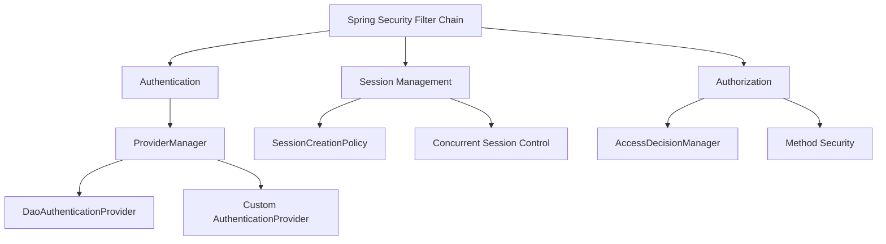

# Authentication & Authorization
> **Previous:** [Transactions](24-transactions.md) | **Next:** [JWT, OAuth2 & OIDC](26-jwt-oauth2.md)

Security is not a feature — it is a property of the entire system. In any non-trivial application you must answer two questions about every request: *who is this?* (authentication) and *are they allowed to do that?* (authorization). Spring Security provides a comprehensive, extensible framework that addresses both concerns from the Servlet stack up through reactive applications.

This chapter covers the full authentication and authorization architecture of Spring Security. You will learn how the filter chain works, how to authenticate users against databases, LDAP, or in-memory stores, how to encode and upgrade passwords safely, how to manage HTTP sessions, how to implement remember-me, and how Spring Security makes authorization decisions at the method and request level.

---

## Learning Objectives

By the end of this chapter you should be able to:

<!-- Image Gallery -->
<section class="lesson-visuals" aria-label="Visual learning resources">
  <header><span>VISUAL LEARNING</span><h2>See it. Review it. Remember it.</h2></header>
  <a class="lesson-visual-card" href="../../assets/images/lessons/java/25-auth-authz/handwritten-notes.png" target="_blank" rel="noopener">
    
    <span><strong>Handwritten notes</strong>Condensed notes for deliberate review.</span>
  </a>
  <a class="lesson-visual-card" href="../../assets/images/lessons/java/25-auth-authz/sticky-notes.png" target="_blank" rel="noopener">
    
    <span><strong>Sticky-note revision</strong>Fast recall prompts for revision.</span>
  </a>
  <a class="lesson-visual-card" href="../../assets/images/lessons/java/25-auth-authz/visual-explanation.png" target="_blank" rel="noopener">
    
    <span><strong>Visual concept guide</strong>A connected explanation of the key ideas.</span>
  </a>
</section>
<!-- End Image Gallery -->


- Configure `SecurityFilterChain` with `@EnableWebSecurity` and understand the auto-configuration that Spring Boot provides
- Add custom `Filter` implementations at specific positions in the filter chain
- Understand `ProviderManager`, `DaoAuthenticationProvider`, and how to write a custom `AuthenticationProvider`
- Implement `UserDetailsService` with in-memory, JDBC, and custom backends
- Choose and configure `PasswordEncoder` including `BCryptPasswordEncoder`, `Argon2PasswordEncoder`, and `DelegatingPasswordEncoder`
- Configure session creation policies, concurrent session control, and session fixation protection
- Implement remember-me authentication with both token-based and persistent strategies
- Understand `SecurityContextHolder` storage modes and the `@AuthenticationPrincipal` annotation
- Master the authorization architecture: `AccessDecisionManager`, voters, `FilterSecurityInterceptor`, and `ConfigAttribute`

---
## Chapter at a Glance

| Topic | Key Insight | Practical Takeaway |
|-------|------------|-------------------|
| Authentication → verifying identity via `SecurityFilterChain` and `AuthenticationProvider` | Use `DaoAuthenticationProvider` with `BCryptPasswordEncoder` for production DB auth |
| Authorization → deciding access via `AccessDecisionManager` and voters | Annotate endpoints with `hasRole()` and methods with `@PreAuthorize` |
| Session Management → policies, fixation, concurrent control | Set `sessionCreationPolicy = STATELESS` for REST APIs |

---
## Chapter Roadmap



---
## Concept Comparison Table

| Concept | Description | Key Difference |
|---------|-------------|----------------|
| `AuthenticationManager` | Interface for authentication | Parent of `ProviderManager` |
| `ProviderManager` | Delegates to `AuthenticationProvider` list | Can have parent managers |
| `DaoAuthenticationProvider` | Authenticates via `UserDetailsService` | Uses `PasswordEncoder` for matching |
| `SecurityContextHolder` | Stores current auth context | MODE_THREADLOCAL vs MODE_INHERITABLETHREADLOCAL |

---
## Quick Reference

| Element | Purpose | Example |
|---------|---------|---------|
| `SecurityFilterChain` | Maps request patterns to filter chains | `http.securityMatcher("/api/**")` |
| `PasswordEncoder` | Encodes and verifies passwords | `BCryptPasswordEncoder`, `Argon2PasswordEncoder` |
| `@PreAuthorize` | Method-level access control | `@PreAuthorize("hasRole('ADMIN')")` |
| `RememberMeServices` | Persistent login tokens | `TokenBasedRememberMeServices` |

---
## Cross-Application Matrix

| Domain | Application | Use Case |
|--------|-------------|----------|
| Enterprise Web App | Spring Security + LDAP | Authenticate employees via corporate directory |
| REST API | JWT with stateless session | Token-based auth with `SecurityContextHolder` |
| Microservices | Service-to-service auth | Client certificate or OAuth2 token relay |

---
## Chapter Quiz

1. What interface does `ProviderManager` use to find the correct authentication logic? **Answer:** `AuthenticationProvider`
2. Which `PasswordEncoder` is recommended for new development in Spring Security? **Answer:** `BCryptPasswordEncoder` or `Argon2PasswordEncoder`
3. What is the default session creation policy in Spring Security for a standard web app? **Answer:** `IF_REQUIRED`

---

## Security Filter Chain


Spring Security is filter-based. A chain of `Filter` instances wraps every HTTP request, each responsible for one concern: authentication, authorization, CSRF protection, session management, and so on. The order of filters matters — authentication filters run before authorization filters, for example.

### SecurityFilterChain


A `SecurityFilterChain` is a mapping from a request pattern to an ordered list of security filters. You register one or more chains; the first chain whose matcher matches handles the request.

```java
package com.course.security.config;

import org.springframework.context.annotation.Bean;
import org.springframework.context.annotation.Configuration;
import org.springframework.security.config.annotation.web.builders.HttpSecurity;
import org.springframework.security.config.annotation.web.configuration.EnableWebSecurity;
import org.springframework.security.web.SecurityFilterChain;
import org.springframework.security.web.authentication.UsernamePasswordAuthenticationFilter;
import org.springframework.security.web.csrf.CsrfTokenRepository;
import org.springframework.security.web.csrf.HttpSessionCsrfTokenRepository;

import com.course.security.filter.TenantFilter;

import static org.springframework.security.config.Customizer.withDefaults;

@Configuration
@EnableWebSecurity
public class SecurityConfig {

    @Bean
    public SecurityFilterChain apiFilterChain(HttpSecurity http) throws Exception {
        http
            .securityMatcher("/api/**")
            .authorizeHttpRequests(auth -> auth
                .requestMatchers("/api/public/**").permitAll()
                .requestMatchers("/api/admin/**").hasRole("ADMIN")
                .anyRequest().authenticated()
            )
            .httpBasic(withDefaults())
            .csrf(csrf -> csrf.disable());

        return http.build();
    }

    @Bean
    public SecurityFilterChain webFilterChain(HttpSecurity http) throws Exception {
        http
            .securityMatcher("/web/**", "/login", "/logout")
            .authorizeHttpRequests(auth -> auth
                .requestMatchers("/web/public/**", "/login", "/css/**", "/js/**").permitAll()
                .anyRequest().authenticated()
            )
            .formLogin(form -> form
                .loginPage("/login")
                .defaultSuccessUrl("/web/dashboard")
                .permitAll()
            )
            .logout(logout -> logout
                .logoutSuccessUrl("/login?logout")
                .permitAll()
            )
            .csrf(csrf -> csrf
                .csrfTokenRepository(csrfTokenRepository())
            );

        return http.build();
    }

    @Bean
    public SecurityFilterChain actuatorFilterChain(HttpSecurity http) throws Exception {
        http
            .securityMatcher("/actuator/**")
            .authorizeHttpRequests(auth -> auth
                .requestMatchers("/actuator/health").permitAll()
                .anyRequest().hasRole("ADMIN")
            )
            .httpBasic(withDefaults())
            .csrf(csrf -> csrf.disable());

        return http.build();
    }

    private CsrfTokenRepository csrfTokenRepository() {
        HttpSessionCsrfTokenRepository repo = new HttpSessionCsrfTokenRepository();
        repo.setHeaderName("X-CSRF-TOKEN");
        return repo;
    }
}
```

### @EnableWebSecurity


`@EnableWebSecurity` imports `WebSecurityConfiguration`, which registers the `FilterChainProxy` bean — the entry point that delegates to your `SecurityFilterChain` beans. Without it, Spring Security's default auto-configuration applies but custom chains are ignored.

```java
package com.course.security.config;

import org.springframework.context.annotation.Configuration;
import org.springframework.security.config.annotation.web.configuration.EnableWebSecurity;

@Configuration
@EnableWebSecurity
public class MinimalSecurityConfig {

    // @EnableWebSecurity is all you need to activate the DSL.
    // SecurityFilterChain beans are discovered automatically.
}
```

### SecurityFilterAutoConfiguration


Spring Boot's `SecurityFilterAutoConfiguration` automatically registers a `DelegatingFilterProxy` with the Servlet container. This single filter delegates to Spring's `FilterChainProxy`, which in turn dispatches to your `SecurityFilterChain` beans. The registration happens through the `SecurityFilterAutoConfigurationImportSelector`, which is triggered by `@EnableWebSecurity`.

You can tune it in `application.properties`:

```properties
# Disable the default security filter registration (e.g. for testing)
security.filter.enabled=false

# Change the filter order (default is -100)
security.filter.order=-50
```

### Filter Chain Order


When you define multiple `SecurityFilterChain` beans, the order of matching is determined by `@Order` or the `Ordered` interface. Spring Security matches the **first** chain whose `securityMatcher` matches. Subsequent chains are never checked.

```java
package com.course.security.config;

import org.springframework.context.annotation.Bean;
import org.springframework.context.annotation.Configuration;
import org.springframework.core.annotation.Order;
import org.springframework.security.config.annotation.web.builders.HttpSecurity;
import org.springframework.security.web.SecurityFilterChain;

@Configuration
public class OrderedChainConfig {

    @Bean
    @Order(1)
    public SecurityFilterChain apiChain(HttpSecurity http) throws Exception {
        http
            .securityMatcher("/api/**")
            .authorizeHttpRequests(auth -> auth
                .anyRequest().authenticated()
            );
        return http.build();
    }

    @Bean
    @Order(2)
    public SecurityFilterChain h2ConsoleChain(HttpSecurity http) throws Exception {
        http
            .securityMatcher("/h2-console/**")
            .authorizeHttpRequests(auth -> auth
                .anyRequest().permitAll()
            )
            .headers(headers -> headers.frameOptions(f -> f.sameOrigin()))
            .csrf(csrf -> csrf.disable());
        return http.build();
    }

    @Bean
    @Order(3)
    public SecurityFilterChain defaultChain(HttpSecurity http) throws Exception {
        http
            .authorizeHttpRequests(auth -> auth
                .anyRequest().authenticated()
            )
            .formLogin(withDefaults());
        return http.build();
    }
}
```

The filter chain itself has a well-defined internal order. Key filters in order:

| Position | Filter | Purpose |
|----------|--------|---------|
| 1 | `DisableEncodeUrlFilter` | Prevents session ID in URLs |
| 2 | `SecurityContextHolderFilter` | Loads `SecurityContext` early |
| 3 | `LogoutFilter` | Handles logout |
| 4 | `UsernamePasswordAuthenticationFilter` | Form login |
| 5 | `DefaultLoginPageGeneratingFilter` | Generates default login page |
| 6 | `BasicAuthenticationFilter` | HTTP Basic auth |
| 7 | `RequestCacheAwareFilter` | Caches requests for post-auth redirect |
| 8 | `SecurityContextHolderAwareRequestFilter` | Wraps request |
| 9 | `RememberMeAuthenticationFilter` | Remember-me |
| 10 | `AnonymousAuthenticationFilter` | Sets anonymous principal |
| 11 | `SessionManagementFilter` | Session fixation, concurrency |
| 12 | `ExceptionTranslationFilter` | Translates exceptions to HTTP responses |
| 13 | `FilterSecurityInterceptor` | Authorization decision |

### Adding Custom Filters


You insert custom filters at specific positions using the `HttpSecurity#addFilterBefore`, `addFilterAfter`, `addFilterAt` methods.

```java
package com.course.security.filter;

import java.io.IOException;

import jakarta.servlet.Filter;
import jakarta.servlet.FilterChain;
import jakarta.servlet.ServletException;
import jakarta.servlet.ServletRequest;
import jakarta.servlet.ServletResponse;
import jakarta.servlet.http.HttpServletRequest;

public class TenantFilter implements Filter {

    @Override
    public void doFilter(ServletRequest request, ServletResponse response,
                         FilterChain chain) throws IOException, ServletException {
        HttpServletRequest httpReq = (HttpServletRequest) request;
        String tenantId = httpReq.getHeader("X-Tenant-Id");

        if (tenantId != null && !tenantId.isBlank()) {
            TenantContext.setCurrentTenant(tenantId);
        }

        try {
            chain.doFilter(request, response);
        } finally {
            TenantContext.clear();
        }
    }
}
```

```java
package com.course.security.context;

public final class TenantContext {

    private static final ThreadLocal<String> CONTEXT = new ThreadLocal<>();

    public static void setCurrentTenant(String tenantId) {
        CONTEXT.set(tenantId);
    }

    public static String getCurrentTenant() {
        return CONTEXT.get();
    }

    public static void clear() {
        CONTEXT.remove();
    }

    private TenantContext() {}
}
```

Register the filter at a specific position in the chain:

```java
package com.course.security.config;

import org.springframework.context.annotation.Bean;
import org.springframework.context.annotation.Configuration;
import org.springframework.core.annotation.Order;
import org.springframework.security.config.annotation.web.builders.HttpSecurity;
import org.springframework.security.config.annotation.web.configuration.EnableWebSecurity;
import org.springframework.security.web.SecurityFilterChain;
import org.springframework.security.web.authentication.UsernamePasswordAuthenticationFilter;

import com.course.security.filter.TenantFilter;

@Configuration
@EnableWebSecurity
public class CustomFilterConfig {

    @Bean
    @Order(1)
    public SecurityFilterChain filterChain(HttpSecurity http) throws Exception {
        TenantFilter tenantFilter = new TenantFilter();

        http
            .authorizeHttpRequests(auth -> auth
                .anyRequest().authenticated()
            )
            .formLogin(withDefaults())
            .addFilterBefore(tenantFilter, UsernamePasswordAuthenticationFilter.class);

        return http.build();
    }
}
```

You can also implement `OncePerRequestFilter` for a filter guaranteed to execute once per request:

```java
package com.course.security.filter;

import java.io.IOException;

import org.springframework.lang.NonNull;
import org.springframework.web.filter.OncePerRequestFilter;

import jakarta.servlet.FilterChain;
import jakarta.servlet.ServletException;
import jakarta.servlet.http.HttpServletRequest;
import jakarta.servlet.http.HttpServletResponse;

public class RequestLoggingFilter extends OncePerRequestFilter {

    @Override
    protected void doFilterInternal(@NonNull HttpServletRequest request,
                                    @NonNull HttpServletResponse response,
                                    @NonNull FilterChain filterChain)
            throws ServletException, IOException {

        long start = System.currentTimeMillis();

        try {
            filterChain.doFilter(request, response);
        } finally {
            long elapsed = System.currentTimeMillis() - start;
            String principal = request.getUserPrincipal() != null
                ? request.getUserPrincipal().getName()
                : "anonymous";
            System.out.printf("[%s] %s %s (%dms) by %s%n",
                request.getMethod(),
                request.getRequestURI(),
                response.getStatus(),
                elapsed,
                principal);
        }
    }
}
```

```java
    // Registration in SecurityFilterChain
    @Bean
    public SecurityFilterChain loggedChain(HttpSecurity http) throws Exception {
        http
            .addFilterAfter(new RequestLoggingFilter(), UsernamePasswordAuthenticationFilter.class)
            .authorizeHttpRequests(auth -> auth.anyRequest().authenticated())
            .formLogin(withDefaults());
        return http.build();
    }
```

> [!TIP]
> Always order custom filters explicitly using `addFilterBefore` or `addFilterAfter` → never rely on bean ordering alone.

---

## AuthenticationProvider

Authentication in Spring Security follows the Provider Manager pattern. An `AuthenticationManager` (typically `ProviderManager`) holds a list of `AuthenticationProvider` instances. Each provider is asked to authenticate the request; the first one that returns a non-null `Authentication` wins.

### ProviderManager


`ProviderManager` is the default implementation of `AuthenticationManager`. It iterates over its list of providers and returns the first successful result.

```java
package com.course.security.auth;

import java.util.List;

import org.springframework.security.authentication.AuthenticationProvider;
import org.springframework.security.authentication.ProviderManager;

public class ProviderManagerExample {

    public static ProviderManager create(List<AuthenticationProvider> providers) {
        ProviderManager manager = new ProviderManager(providers);

        // If set to true, a parent AuthenticationManager is tried
        // when no provider succeeds (default false)
        manager.setEraseCredentialsAfterAuthentication(true);

        return manager;
    }
}
```

### DaoAuthenticationProvider


`DaoAuthenticationProvider` is the most common provider. It uses a `UserDetailsService` to load a user record and a `PasswordEncoder` to verify the password.

```java
package com.course.security.config;

import org.springframework.context.annotation.Bean;
import org.springframework.context.annotation.Configuration;
import org.springframework.security.authentication.dao.DaoAuthenticationProvider;
import org.springframework.security.core.userdetails.UserDetailsService;
import org.springframework.security.crypto.bcrypt.BCryptPasswordEncoder;
import org.springframework.security.crypto.password.PasswordEncoder;

@Configuration
public class DaoProviderConfig {

    @Bean
    public DaoAuthenticationProvider daoAuthenticationProvider(
            UserDetailsService userDetailsService,
            PasswordEncoder passwordEncoder) {

        DaoAuthenticationProvider provider = new DaoAuthenticationProvider();
        provider.setUserDetailsService(userDetailsService);

        // Always set the PasswordEncoder — without it, passwords
        // are compared as plain text (deprecated)
        provider.setPasswordEncoder(passwordEncoder);

        // Hide the "UserNotFound" exception — return BadCredentials
        // instead, preventing username enumeration
        provider.setHideUserNotFoundExceptions(true);

        // Optionally set a salt source for older password schemes
        // provider.setSaltSource(new ReflectionSaltSource());

        return provider;
    }

    @Bean
    public PasswordEncoder passwordEncoder() {
        return new BCryptPasswordEncoder();
    }
}
```

### AuthenticationManagerBuilder


`AuthenticationManagerBuilder` is a convenient builder that Spring Boot auto-configures. It wires `UserDetailsService`, `PasswordEncoder`, and `AuthenticationProvider` instances together.

```java
package com.course.security.config;

import org.springframework.context.annotation.Bean;
import org.springframework.context.annotation.Configuration;
import org.springframework.security.authentication.AuthenticationManager;
import org.springframework.security.config.annotation.authentication.builders.AuthenticationManagerBuilder;
import org.springframework.security.config.annotation.authentication.configuration.AuthenticationConfiguration;
import org.springframework.security.core.userdetails.UserDetailsService;
import org.springframework.security.crypto.password.PasswordEncoder;

@Configuration
public class AuthManagerConfig {

    private final UserDetailsService userDetailsService;
    private final PasswordEncoder passwordEncoder;

    public AuthManagerConfig(UserDetailsService userDetailsService,
                             PasswordEncoder passwordEncoder) {
        this.userDetailsService = userDetailsService;
        this.passwordEncoder = passwordEncoder;
    }

    @Bean
    public AuthenticationManager authenticationManager(
            AuthenticationConfiguration authConfig) throws Exception {
        return authConfig.getAuthenticationManager();
    }

    // Alternatively, inject into a SecurityFilterChain via HttpSecurity:
    // http.getSharedObject(AuthenticationManagerBuilder.class)
    //     .userDetailsService(userDetailsService)
    //     .passwordEncoder(passwordEncoder);
    // Then http.authenticationManager(...) to pass it in.
}
```

### Custom AuthenticationProvider


When authentication does not come from a username/password pair — such as OTP codes, hardware tokens, biometrics, or multi-factor challenges — you write a custom `AuthenticationProvider`.

```java
package com.course.security.auth;

import org.springframework.security.authentication.AuthenticationProvider;
import org.springframework.security.authentication.BadCredentialsException;
import org.springframework.security.authentication.UsernamePasswordAuthenticationToken;
import org.springframework.security.core.Authentication;
import org.springframework.security.core.AuthenticationException;
import org.springframework.security.core.userdetails.UserDetails;
import org.springframework.security.core.userdetails.UserDetailsService;
import org.springframework.security.crypto.password.PasswordEncoder;
import org.springframework.stereotype.Component;

@Component
public class CustomAuthenticationProvider implements AuthenticationProvider {

    private final UserDetailsService userDetailsService;
    private final PasswordEncoder passwordEncoder;
    private final OtpService otpService;

    public CustomAuthenticationProvider(UserDetailsService userDetailsService,
                                        PasswordEncoder passwordEncoder,
                                        OtpService otpService) {
        this.userDetailsService = userDetailsService;
        this.passwordEncoder = passwordEncoder;
        this.otpService = otpService;
    }

    @Override
    public Authentication authenticate(Authentication authentication)
            throws AuthenticationException {

        String username = authentication.getName();
        String password = (String) authentication.getCredentials();

        UserDetails user = userDetailsService.loadUserByUsername(username);

        if (!passwordEncoder.matches(password, user.getPassword())) {
            throw new BadCredentialsException("Invalid username or password");
        }

        // Additional check: one-time password
        if (authentication instanceof OtpAuthentication otpAuth) {
            if (!otpService.validateOtp(username, otpAuth.getOtpCode())) {
                throw new BadCredentialsException("Invalid OTP code");
            }
        }

        return new UsernamePasswordAuthenticationToken(
            user, password, user.getAuthorities());
    }

    @Override
    public boolean supports(Class<?> authentication) {
        // This provider handles both standard login and OTP login
        return UsernamePasswordAuthenticationToken.class.isAssignableFrom(authentication)
            || OtpAuthentication.class.isAssignableFrom(authentication);
    }
}
```

```java
package com.course.security.auth;

import java.util.Collection;

import org.springframework.security.authentication.AbstractAuthenticationToken;
import org.springframework.security.core.GrantedAuthority;

public class OtpAuthentication extends AbstractAuthenticationToken {

    private final String username;
    private final String password;
    private final String otpCode;

    public OtpAuthentication(String username, String password,
                             String otpCode,
                             Collection<? extends GrantedAuthority> authorities) {
        super(authorities);
        this.username = username;
        this.password = password;
        this.otpCode = otpCode;
        setAuthenticated(true);
    }

    @Override
    public Object getCredentials() {
        return password;
    }

    @Override
    public Object getPrincipal() {
        return username;
    }

    public String getOtpCode() {
        return otpCode;
    }
}
```

```java
package com.course.security.auth;

import org.springframework.stereotype.Service;

@Service
public class OtpService {

    public boolean validateOtp(String username, String code) {
        // In production, verify against a time-based one-time password
        // (TOTP) stored in the user's record or an authenticator app
        return "123456".equals(code);
    }
}
```

The `supports` method is critical — it tells `ProviderManager` whether this provider can handle a given `Authentication` type. Without it, the provider is never consulted.

```java
// Register custom provider in security config
package com.course.security.config;

import org.springframework.context.annotation.Bean;
import org.springframework.context.annotation.Configuration;
import org.springframework.security.authentication.AuthenticationProvider;
import org.springframework.security.config.annotation.authentication.builders.AuthenticationManagerBuilder;
import org.springframework.security.config.annotation.web.builders.HttpSecurity;
import org.springframework.security.config.annotation.web.configuration.EnableWebSecurity;
import org.springframework.security.web.SecurityFilterChain;

@Configuration
@EnableWebSecurity
public class CustomProviderConfig {

    private final AuthenticationProvider customAuthenticationProvider;

    public CustomProviderConfig(AuthenticationProvider customAuthenticationProvider) {
        this.customAuthenticationProvider = customAuthenticationProvider;
    }

    @Bean
    public SecurityFilterChain filterChain(HttpSecurity http) throws Exception {
        http
            .authenticationProvider(customAuthenticationProvider)
            .authorizeHttpRequests(auth -> auth
                .anyRequest().authenticated()
            )
            .formLogin(withDefaults());

        return http.build();
    }
}
```

---

## UserDetailsService

`UserDetailsService` is the core interface for loading user-specific data. Spring Security provides several implementations, and you can write your own.

### UserDetails — The Contract


Every authenticated user is represented by a `UserDetails` instance. You can implement this interface directly or use the built-in `User` class.

```java
package com.course.security.user;

import java.util.Collection;

import org.springframework.security.core.GrantedAuthority;
import org.springframework.security.core.userdetails.UserDetails;

public class CustomUserDetails implements UserDetails {

    private Long id;
    private String username;
    private String password;
    private String email;
    private String displayName;
    private boolean enabled;
    private boolean accountNonExpired;
    private boolean accountNonLocked;
    private boolean credentialsNonExpired;
    private Collection<? extends GrantedAuthority> authorities;

    public CustomUserDetails(Long id, String username, String password,
                             String email, String displayName,
                             boolean enabled,
                             Collection<? extends GrantedAuthority> authorities) {
        this.id = id;
        this.username = username;
        this.password = password;
        this.email = email;
        this.displayName = displayName;
        this.enabled = enabled;
        this.accountNonExpired = true;
        this.accountNonLocked = true;
        this.credentialsNonExpired = true;
        this.authorities = authorities;
    }

    @Override
    public Collection<? extends GrantedAuthority> getAuthorities() {
        return authorities;
    }

    @Override
    public String getPassword() {
        return password;
    }

    @Override
    public String getUsername() {
        return username;
    }

    @Override
    public boolean isAccountNonExpired() {
        return accountNonExpired;
    }

    @Override
    public boolean isAccountNonLocked() {
        return accountNonLocked;
    }

    @Override
    public boolean isCredentialsNonExpired() {
        return credentialsNonExpired;
    }

    @Override
    public boolean isEnabled() {
        return enabled;
    }

    // Domain-specific getters
    public Long getId() { return id; }
    public String getEmail() { return email; }
    public String getDisplayName() { return displayName; }

    public void setPassword(String password) {
        this.password = password;
    }

    public void setEnabled(boolean enabled) {
        this.enabled = enabled;
    }
}
```

### Built-in User Class


Spring Security provides a `User` class with a builder for convenience:

```java
package com.course.security.user;

import java.util.List;

import org.springframework.security.core.authority.SimpleGrantedAuthority;
import org.springframework.security.core.userdetails.User;

public class BuiltInUserExample {

    public static User createDefaultUser() {
        return User.withDefaultPasswordEncoder()
            .username("admin")
            .password("strong-password")
            .roles("ADMIN", "USER")
            .build();
    }

    public static User createCustomUser() {
        return User.builder()
            .username("jsmith")
            .password("$2a$10$...") // pre-encoded
            .passwordEncoder(pwd -> pwd) // skip encoding, password is already hashed
            .authorities(List.of(
                new SimpleGrantedAuthority("ROLE_USER"),
                new SimpleGrantedAuthority("SCOPE_read"),
                new SimpleGrantedAuthority("SCOPE_write")
            ))
            .disabled(false)
            .accountExpired(false)
            .accountLocked(false)
            .credentialsExpired(false)
            .build();
    }

    public static User createServiceAccount() {
        return User.builder()
            .username("service-api")
            .password("{bcrypt}$2a$10$...")
            .passwordEncoder(pwd -> pwd)
            .roles("SERVICE")
            .accountExpired(true)
            .build();
    }
}
```

### InMemoryUserDetailsManager


For development, testing, and small-scale apps:

```java
package com.course.security.config;

import org.springframework.context.annotation.Bean;
import org.springframework.context.annotation.Configuration;
import org.springframework.security.core.userdetails.User;
import org.springframework.security.core.userdetails.UserDetails;
import org.springframework.security.core.userdetails.UserDetailsService;
import org.springframework.security.provisioning.InMemoryUserDetailsManager;

@Configuration
public class InMemoryUserConfig {

    @Bean
    public UserDetailsService userDetailsService() {
        UserDetails admin = User.withDefaultPasswordEncoder()
            .username("admin")
            .password("admin123")
            .roles("ADMIN")
            .build();

        UserDetails user = User.withDefaultPasswordEncoder()
            .username("user")
            .password("user123")
            .roles("USER")
            .build();

        UserDetails moderator = User.builder()
            .username("mod")
            .password("{noop}mod123") // {noop} means no encoding
            .roles("MODERATOR", "USER")
            .build();

        return new InMemoryUserDetailsManager(admin, user, moderator);
    }
}
```

### JdbcDaoImpl


Uses a relational database to load users. Spring Boot auto-configures the `DataSource`, and `JdbcDaoImpl` executes queries against it.

```java
package com.course.security.config;

import javax.sql.DataSource;

import org.springframework.context.annotation.Bean;
import org.springframework.context.annotation.Configuration;
import org.springframework.security.core.userdetails.UserDetailsService;
import org.springframework.security.provisioning.JdbcUserDetailsManager;

@Configuration
public class JdbcUserConfig {

    @Bean
    public UserDetailsService userDetailsService(DataSource dataSource) {
        JdbcUserDetailsManager manager = new JdbcUserDetailsManager(dataSource);

        // Customize queries if the schema differs from the default
        manager.setUsersByUsernameQuery(
            "SELECT username, password, enabled FROM users WHERE username = ?");
        manager.setAuthoritiesByUsernameQuery(
            "SELECT u.username, r.name FROM users u " +
            "JOIN user_roles ur ON u.id = ur.user_id " +
            "JOIN roles r ON ur.role_id = r.id " +
            "WHERE u.username = ?");

        return manager;
    }
}
```

The default schema expected by `JdbcDaoImpl`:

```sql
CREATE TABLE users (
    username VARCHAR(50) NOT NULL PRIMARY KEY,
    password VARCHAR(500) NOT NULL,
    enabled  BOOLEAN NOT NULL
);

CREATE TABLE authorities (
    username  VARCHAR(50) NOT NULL,
    authority VARCHAR(50) NOT NULL,
    CONSTRAINT fk_authorities_users FOREIGN KEY (username) REFERENCES users(username)
);

CREATE UNIQUE INDEX ix_auth_username ON authorities(username, authority);
```

### Custom JDBC UserDetailsService


When the database schema differs significantly, implement `UserDetailsService` directly:

```java
package com.course.security.user;

import java.sql.ResultSet;
import java.sql.SQLException;
import java.util.ArrayList;
import java.util.Collection;
import java.util.List;

import javax.sql.DataSource;

import org.springframework.jdbc.core.JdbcTemplate;
import org.springframework.jdbc.core.RowMapper;
import org.springframework.security.core.GrantedAuthority;
import org.springframework.security.core.authority.SimpleGrantedAuthority;
import org.springframework.security.core.userdetails.User;
import org.springframework.security.core.userdetails.UserDetails;
import org.springframework.security.core.userdetails.UserDetailsService;
import org.springframework.security.core.userdetails.UsernameNotFoundException;
import org.springframework.stereotype.Service;

@Service
public class JdbcCustomUserDetailsService implements UserDetailsService {

    private final JdbcTemplate jdbcTemplate;

    public JdbcCustomUserDetailsService(DataSource dataSource) {
        this.jdbcTemplate = new JdbcTemplate(dataSource);
    }

    @Override
    public UserDetails loadUserByUsername(String username)
            throws UsernameNotFoundException {

        List<UserRecord> users = jdbcTemplate.query(
            "SELECT id, username, password_hash, email, active " +
            "FROM accounts WHERE username = ?",
            userRowMapper,
            username
        );

        if (users.isEmpty()) {
            throw new UsernameNotFoundException(
                "User not found: " + username);
        }

        UserRecord record = users.get(0);

        List<String> roles = jdbcTemplate.queryForList(
            "SELECT r.role_name FROM account_roles r " +
            "JOIN account_role_mapping m ON r.id = m.role_id " +
            "WHERE m.account_id = ?",
            String.class,
            record.id()
        );

        Collection<GrantedAuthority> authorities = new ArrayList<>();
        for (String role : roles) {
            authorities.add(new SimpleGrantedAuthority("ROLE_" + role));
        }

        return User.builder()
            .username(record.username())
            .password(record.passwordHash())
            .passwordEncoder(pwd -> pwd) // already hashed
            .disabled(!record.active())
            .accountExpired(false)
            .accountLocked(false)
            .credentialsExpired(false)
            .authorities(authorities)
            .build();
    }

    private final RowMapper<UserRecord> userRowMapper =
        new RowMapper<>() {
            @Override
            public UserRecord mapRow(ResultSet rs, int rowNum) throws SQLException {
                return new UserRecord(
                    rs.getLong("id"),
                    rs.getString("username"),
                    rs.getString("password_hash"),
                    rs.getString("email"),
                    rs.getBoolean("active")
                );
            }
        };

    private record UserRecord(Long id, String username,
                              String passwordHash, String email,
                              boolean active) {}
}
```

### Custom API UserDetailsService


When users are managed by an external identity service:

```java
package com.course.security.user;

import java.util.Collection;
import java.util.List;

import org.springframework.security.core.GrantedAuthority;
import org.springframework.security.core.authority.SimpleGrantedAuthority;
import org.springframework.security.core.userdetails.User;
import org.springframework.security.core.userdetails.UserDetails;
import org.springframework.security.core.userdetails.UserDetailsService;
import org.springframework.security.core.userdetails.UsernameNotFoundException;
import org.springframework.stereotype.Service;
import org.springframework.web.client.RestTemplate;

@Service
public class ApiUserDetailsService implements UserDetailsService {

    private final RestTemplate restTemplate;

    public ApiUserDetailsService(RestTemplate restTemplate) {
        this.restTemplate = restTemplate;
    }

    @Override
    public UserDetails loadUserByUsername(String username)
            throws UsernameNotFoundException {

        RemoteUser remoteUser = restTemplate.getForObject(
            "https://identity.example.com/api/users/{username}",
            RemoteUser.class,
            username
        );

        if (remoteUser == null) {
            throw new UsernameNotFoundException(
                "User not found: " + username);
        }

        if (!remoteUser.emailVerified()) {
            throw new UsernameNotFoundException(
                "Email not verified for: " + username);
        }

        Collection<GrantedAuthority> authorities =
            remoteUser.roles().stream()
                .map(r -> new SimpleGrantedAuthority("ROLE_" + r))
                .map(GrantedAuthority.class::cast)
                .toList();

        return User.builder()
            .username(remoteUser.username())
            .password("{noop}unused") // API manages auth
            .authorities(authorities)
            .disabled(!remoteUser.active())
            .build();
    }
}

record RemoteUser(String username, List<String> roles,
                  boolean active, boolean emailVerified) {}
```

---

## Password Encoding

Storing passwords in plain text is unacceptable. Spring Security's `PasswordEncoder` interface abstracts hashing algorithms behind a consistent API.

### PasswordEncoder Implementations


```java
package com.course.security.password;

import org.springframework.context.annotation.Bean;
import org.springframework.context.annotation.Configuration;
import org.springframework.security.crypto.argon2.Argon2PasswordEncoder;
import org.springframework.security.crypto.bcrypt.BCryptPasswordEncoder;
import org.springframework.security.crypto.password.PasswordEncoder;
import org.springframework.security.crypto.scrypt.SCryptPasswordEncoder;

@Configuration
public class PasswordEncoderConfig {

    @Bean
    public BCryptPasswordEncoder bCryptPasswordEncoder() {
        // strength = log rounds (4-31, default 10)
        // Higher = slower but more resistant to brute force
        return new BCryptPasswordEncoder(
            12 // 2^12 = 4096 iterations
        );
    }

    @Bean
    public SCryptPasswordEncoder sCryptPasswordEncoder() {
        return SCryptPasswordEncoder.defaultsForSpringSecurity_v5_8();
    }

    @Bean
    public Argon2PasswordEncoder argon2PasswordEncoder() {
        return Argon2PasswordEncoder.defaultsForSpringSecurity_v5_8();
    }
}
```

### BCryptPasswordEncoder


BCrypt is the most widely used choice. It includes a built-in salt and is deliberately slow.

```java
package com.course.security.password;

import org.springframework.security.crypto.bcrypt.BCryptPasswordEncoder;

public class BCryptDemo {

    public static void main(String[] args) {
        BCryptPasswordEncoder encoder = new BCryptPasswordEncoder(10);

        String rawPassword = "myStrongP@ssw0rd!";

        // Hash — each call produces a different result (random salt)
        String hash1 = encoder.encode(rawPassword);
        String hash2 = encoder.encode(rawPassword);

        System.out.println("Hash 1: " + hash1);
        System.out.println("Hash 2: " + hash2);
        System.out.println("Match 1: " + encoder.matches(rawPassword, hash1));
        System.out.println("Match 2: " + encoder.matches(rawPassword, hash2));
        System.out.println("Wrong: " + encoder.matches("wrong", hash1));

        // BCrypt output format: $2a${rounds}${salt}{hash}
        // Example: $2a$10$N9qo8uLOickgx2ZMRZoMyeIjZAgcfl7p92ldGxad68LJZdL17lhWy
        //          \__/ \_/ \______________________\_/
        //         algo rounds 22-char salt      31-char hash
    }
}
```

### SCryptPasswordEncoder


SCrypt is memory-hard — it requires a configurable amount of RAM, making GPU-based attacks much more expensive.

```java
package com.course.security.password;

import org.springframework.security.crypto.scrypt.SCryptPasswordEncoder;

public class SCryptDemo {

    public static void main(String[] args) {
        // cpuCost (N):    2^14 = 16384 (default)
        // memoryCost (r): 8 (default)
        // parallelization (p): 1 (default)
        // keyLength:       32
        // saltLength:      64
        SCryptPasswordEncoder encoder =
            SCryptPasswordEncoder.defaultsForSpringSecurity_v5_8();

        String hash = encoder.encode("password");
        System.out.println("SCrypt hash: " + hash);
        System.out.println("Valid: " + encoder.matches("password", hash));
    }
}
```

### Argon2PasswordEncoder


Argon2 is the winner of the 2015 Password Hashing Competition and is the most resistant to GPU/ASIC attacks. It is the recommended choice for new systems.

```java
package com.course.security.password;

import org.springframework.security.crypto.argon2.Argon2PasswordEncoder;

public class Argon2Demo {

    public static void main(String[] args) {
        Argon2PasswordEncoder encoder =
            Argon2PasswordEncoder.defaultsForSpringSecurity_v5_8();

        long start = System.nanoTime();
        String hash = encoder.encode("userPassword123");
        long elapsed = System.nanoTime() - start;

        System.out.println("Argon2 hash: " + hash);
        System.out.println("Took: " + (elapsed / 1_000_000) + "ms");
        System.out.println("Valid: " + encoder.matches("userPassword123", hash));

        // Argon2 output: $argon2id$v=19$m=19456,t=2,p=1$...
        // Parameters: version 19, 19456 KB memory, 2 iterations, 1 thread
    }
}
```

### Password Strength Validation


Spring Security does not enforce password strength, but you can integrate with the Passay library or write a custom validator:

```java
package com.course.security.password;

import org.springframework.security.crypto.password.PasswordEncoder;
import org.springframework.stereotype.Component;

@Component
public class PasswordStrengthEvaluator {

    private final PasswordEncoder passwordEncoder;

    public PasswordStrengthEvaluator(PasswordEncoder passwordEncoder) {
        this.passwordEncoder = passwordEncoder;
    }

    public ValidationResult validate(String rawPassword) {
        if (rawPassword == null || rawPassword.length() < 12) {
            return ValidationResult.WEAK;
        }

        boolean hasUpper = rawPassword.chars().anyMatch(Character::isUpperCase);
        boolean hasLower = rawPassword.chars().anyMatch(Character::isLowerCase);
        boolean hasDigit = rawPassword.chars().anyMatch(Character::isDigit);
        boolean hasSpecial = rawPassword.chars()
            .anyMatch(c -> !Character.isLetterOrDigit(c));

        if (!hasUpper || !hasLower) {
            return ValidationResult.WEAK;
        }

        if (!hasDigit) {
            return ValidationResult.MEDIUM;
        }

        if (!hasSpecial) {
            return ValidationResult.STRONG;
        }

        return ValidationResult.VERY_STRONG;
    }

    public String encodeIfValid(String rawPassword) {
        ValidationResult result = validate(rawPassword);
        if (result.ordinal() < ValidationResult.STRONG.ordinal()) {
            throw new IllegalArgumentException(
                "Password too weak: " + result);
        }
        return passwordEncoder.encode(rawPassword);
    }

    public enum ValidationResult {
        WEAK, MEDIUM, STRONG, VERY_STRONG
    }
}
```

### DelegatingPasswordEncoder


When you upgrade hashing algorithms — for example, migrating from plain text or MD5 to BCrypt — old hashes must continue to work while new passwords use the new algorithm. `DelegatingPasswordEncoder` makes this seamless.

```java
package com.course.security.password;

import java.util.HashMap;
import java.util.Map;

import org.springframework.context.annotation.Bean;
import org.springframework.context.annotation.Configuration;
import org.springframework.security.crypto.argon2.Argon2PasswordEncoder;
import org.springframework.security.crypto.bcrypt.BCryptPasswordEncoder;
import org.springframework.security.crypto.password.DelegatingPasswordEncoder;
import org.springframework.security.crypto.password.PasswordEncoder;
import org.springframework.security.crypto.password.Pbkdf2PasswordEncoder;
import org.springframework.security.crypto.scrypt.SCryptPasswordEncoder;

@Configuration
public class DelegatingPasswordEncoderConfig {

    @Bean
    public PasswordEncoder passwordEncoder() {
        String encodingId = "bcrypt";
        Map<String, PasswordEncoder> encoders = new HashMap<>();
        encoders.put("bcrypt", new BCryptPasswordEncoder());
        encoders.put("scrypt", SCryptPasswordEncoder.defaultsForSpringSecurity_v5_8());
        encoders.put("argon2", Argon2PasswordEncoder.defaultsForSpringSecurity_v5_8());
        encoders.put("pbkdf2", Pbkdf2PasswordEncoder.defaultsForSpringSecurity_v5_8());

        // {noop} = no encoding (plain text) — for migration only
        encoders.put("noop", org.springframework.security.crypto.password.NoOpPasswordEncoder.getInstance());

        DelegatingPasswordEncoder delegating =
            new DelegatingPasswordEncoder(encodingId, encoders);

        // If a password hash does NOT have a prefix (legacy data),
        // use this encoder
        delegating.setDefaultPasswordEncoderForMatches(
            new BCryptPasswordEncoder());

        return delegating;
    }
}
```

The stored password includes the algorithm ID as a prefix:

```
# BCrypt (current standard)
{bcrypt}$2a$10$N9qo8uLOickgx2ZMRZoMyeIjZAgcfl7p92ldGxad68LJZdL17lhWy

# SCrypt
{scrypt}$e0801$...

# Argon2
{argon2}$argon2id$v=19$m=19456,t=2,p=1$...

# Plain text (temporary, while migrating)
{noop}plaintextpassword
```

### Upgrading Password Encodings


When a user logs in with an old hash prefix, re-hash their password with the current algorithm on the fly:

```java
package com.course.security.password;

import org.springframework.security.authentication.UsernamePasswordAuthenticationToken;
import org.springframework.security.authentication.dao.DaoAuthenticationProvider;
import org.springframework.security.core.Authentication;
import org.springframework.security.core.userdetails.UserDetails;
import org.springframework.security.core.userdetails.UserDetailsPasswordService;
import org.springframework.security.core.userdetails.UserDetailsService;
import org.springframework.security.crypto.password.PasswordEncoder;
import org.springframework.stereotype.Component;

@Component
public class PasswordUpgradeProvider extends DaoAuthenticationProvider {

    private final UserDetailsPasswordService passwordService;

    public PasswordUpgradeProvider(UserDetailsService userDetailsService,
                                   PasswordEncoder passwordEncoder,
                                   UserDetailsPasswordService passwordService) {
        this.passwordService = passwordService;
        setUserDetailsService(userDetailsService);
        setPasswordEncoder(passwordEncoder);
        setHideUserNotFoundExceptions(true);
    }

    @Override
    protected Authentication createSuccessAuthentication(
            Object principal, Authentication authentication,
            UserDetails user) {

        String presentedPassword = (String) authentication.getCredentials();

        // Check whether the stored hash needs upgrading
        boolean upgrade = getPasswordEncoder().upgradeEncoding(user.getPassword());

        if (upgrade) {
            String newHash = getPasswordEncoder().encode(presentedPassword);
            user = passwordService.updatePassword(user, newHash);
        }

        return super.createSuccessAuthentication(
            principal, authentication, user);
    }
}
```

```java
package com.course.security.password;

import org.springframework.security.core.userdetails.User;
import org.springframework.security.core.userdetails.UserDetails;
import org.springframework.security.core.userdetails.UserDetailsPasswordService;
import org.springframework.security.core.userdetails.UserDetailsService;
import org.springframework.security.core.userdetails.UsernameNotFoundException;
import org.springframework.stereotype.Service;

@Service
public class UpgradingUserDetailsService
        implements UserDetailsService, UserDetailsPasswordService {

    private final UserRepository userRepository;

    public UpgradingUserDetailsService(UserRepository userRepository) {
        this.userRepository = userRepository;
    }

    @Override
    public UserDetails loadUserByUsername(String username)
            throws UsernameNotFoundException {
        UserEntity entity = userRepository.findByUsername(username)
            .orElseThrow(() -> new UsernameNotFoundException(username));

        return User.builder()
            .username(entity.getUsername())
            .password(entity.getPasswordHash())
            .roles(entity.getRoles().toArray(String[]::new))
            .build();
    }

    @Override
    public UserDetails updatePassword(UserDetails user, String newPassword) {
        UserEntity entity = userRepository.findByUsername(user.getUsername())
            .orElseThrow(() -> new IllegalStateException("User gone"));

        entity.setPasswordHash(newPassword);
        userRepository.save(entity);

        return User.builder()
            .username(entity.getUsername())
            .password(newPassword)
            .roles(entity.getRoles().toArray(String[]::new))
            .build();
    }
}
```

This ensures that every login gradually migrates old hashes to the current algorithm without any batch process.

> [!WARNING]
> Never store passwords as plaintext or use a plain `NoOpPasswordEncoder` in production. Always use a strong adaptive one-way hash.

---

## Session Management

HTTP sessions are the traditional mechanism for tracking authenticated users across requests. Spring Security provides fine-grained control over how sessions are created and managed.

### Session Creation Policy


Controls when a session is created:

```java
package com.course.security.config;

import org.springframework.context.annotation.Bean;
import org.springframework.context.annotation.Configuration;
import org.springframework.security.config.annotation.web.builders.HttpSecurity;
import org.springframework.security.config.http.SessionCreationPolicy;
import org.springframework.security.web.SecurityFilterChain;

@Configuration
public class SessionPolicyConfig {

    @Bean
    public SecurityFilterChain statelessApi(HttpSecurity http) throws Exception {
        http
            .securityMatcher("/api/**")
            .sessionManagement(session -> session
                .sessionCreationPolicy(SessionCreationPolicy.STATELESS)
            )
            .authorizeHttpRequests(auth -> auth
                .anyRequest().authenticated()
            )
            .httpBasic(withDefaults())
            .csrf(csrf -> csrf.disable());

        return http.build();
    }

    @Bean
    public SecurityFilterChain statefulWeb(HttpSecurity http) throws Exception {
        http
            .securityMatcher("/web/**")
            .sessionManagement(session -> session
                .sessionCreationPolicy(SessionCreationPolicy.IF_REQUIRED)
            )
            .authorizeHttpRequests(auth -> auth
                .anyRequest().authenticated()
            )
            .formLogin(withDefaults());

        return http.build();
    }

    private static final Customizer<HttpSecurity> withDefaults() {
        return http -> {};
    }
}
```

The four policies:

| Policy | Behavior |
|--------|----------|
| `ALWAYS` | Always create a session, even for unauthenticated users |
| `IF_REQUIRED` | Create a session only when needed (default) |
| `NEVER` | Never create a session, but use one if it exists |
| `STATELESS` | No session at all — every request must carry authentication |

### Concurrent Session Control


Limits how many simultaneous sessions a single user can have:

```java
package com.course.security.config;

import org.springframework.context.annotation.Bean;
import org.springframework.context.annotation.Configuration;
import org.springframework.security.config.annotation.web.builders.HttpSecurity;
import org.springframework.security.config.annotation.web.configuration.EnableWebSecurity;
import org.springframework.security.web.SecurityFilterChain;
import org.springframework.security.web.authentication.session.ConcurrentSessionControlAuthenticationStrategy;
import org.springframework.security.web.session.HttpSessionEventPublisher;

@Configuration
@EnableWebSecurity
public class ConcurrentSessionConfig {

    @Bean
    public SecurityFilterChain filterChain(HttpSecurity http) throws Exception {
        http
            .sessionManagement(session -> session
                .maximumSessions(1) // only one session per user
                .maxSessionsPreventsLogin(false) // false = kick oldest
                .expiredUrl("/login?expired")
            )
            .authorizeHttpRequests(auth -> auth
                .anyRequest().authenticated()
            )
            .formLogin(withDefaults());

        return http.build();
    }

    @Bean
    public HttpSessionEventPublisher httpSessionEventPublisher() {
        // Required for concurrent session control to work
        return new HttpSessionEventPublisher();
    }
}
```

When `maxSessionsPreventsLogin` is `false` (default), the oldest session is expired. When `true`, the new login is rejected.

### Session Fixation Protection


Session fixation attacks trick a user into using a session ID chosen by the attacker. Spring Security protects against this by changing the session ID after login:

```java
package com.course.security.config;

import org.springframework.context.annotation.Bean;
import org.springframework.context.annotation.Configuration;
import org.springframework.security.config.annotation.web.builders.HttpSecurity;
import org.springframework.security.web.SecurityFilterChain;

@Configuration
public class SessionFixationConfig {

    @Bean
    public SecurityFilterChain filterChain(HttpSecurity http) throws Exception {
        http
            .sessionManagement(session -> session
                // Options: none, newSession, migrateSession, changeSessionId
                .sessionFixation().migrateSession()
            )
            .authorizeHttpRequests(auth -> auth
                .anyRequest().authenticated()
            )
            .formLogin(withDefaults());

        return http.build();
    }
}
```

The four protection modes:

| Mode | Behavior |
|------|----------|
| `none` | No protection (not recommended) |
| `newSession` | Create a new empty session, do not migrate attributes |
| `migrateSession` | Create a new session, copy attributes over |
| `changeSessionId` | Change the session ID only (default, Servlet 3.1+) |

### Session Registry


You can inspect and manage active sessions programmatically:

```java
package com.course.security.admin;

import java.util.List;

import org.springframework.security.core.session.SessionInformation;
import org.springframework.security.core.session.SessionRegistry;
import org.springframework.stereotype.Service;

@Service
public class SessionAdminService {

    private final SessionRegistry sessionRegistry;

    public SessionAdminService(SessionRegistry sessionRegistry) {
        this.sessionRegistry = sessionRegistry;
    }

    public List<Object> getAllPrincipals() {
        return sessionRegistry.getAllPrincipals();
    }

    public List<SessionInformation> getSessionsForUser(Object principal) {
        return sessionRegistry.getAllSessions(principal, false);
    }

    public void expireSession(String sessionId) {
        SessionInformation info = sessionRegistry.getSessionInformation(sessionId);
        if (info != null) {
            info.expireNow();
        }
    }

    public int getActiveSessionCount() {
        return sessionRegistry.getAllPrincipals().stream()
            .mapToInt(p -> sessionRegistry.getAllSessions(p, false).size())
            .sum();
    }
}
```

> [!NOTE]
> For REST APIs, always set `sessionCreationPolicy(STATELESS)` → Spring Security will never create an `HttpSession` and will never use one to obtain the `SecurityContext`.

---

## Remember-Me

Remember-me allows users to be recognized across browser sessions without re-entering credentials. Spring Security supports two strategies.

### TokenBasedRememberMeServices


A hash-based token stored in a cookie:

```java
package com.course.security.config;

import org.springframework.context.annotation.Bean;
import org.springframework.context.annotation.Configuration;
import org.springframework.security.config.annotation.web.builders.HttpSecurity;
import org.springframework.security.config.annotation.web.configuration.EnableWebSecurity;
import org.springframework.security.web.SecurityFilterChain;
import org.springframework.security.web.authentication.rememberme.TokenBasedRememberMeServices;

@Configuration
@EnableWebSecurity
public class RememberMeConfig {

    @Bean
    public SecurityFilterChain filterChain(HttpSecurity http) throws Exception {
        http
            .rememberMe(remember -> remember
                .key("unique-and-secret-key") // must be secret
                .rememberMeParameter("remember-me")
                .rememberMeCookieName("my-remember-me")
                .tokenValiditySeconds(86400 * 14) // 14 days
                .alwaysRemember(false)
                .useSecureCookie(true)
            )
            .authorizeHttpRequests(auth -> auth
                .anyRequest().authenticated()
            )
            .formLogin(withDefaults());

        return http.build();
    }

    @Bean
    public TokenBasedRememberMeServices tokenBasedRememberMeServices() {
        TokenBasedRememberMeServices services =
            new TokenBasedRememberMeServices("unique-and-secret-key", userDetailsService());
        services.setTokenValiditySeconds(86400 * 14);
        services.setCookieName("remember-me");
        return services;
    }
}
```

### PersistentTokenBasedRememberMeServices


A more secure approach — the token is stored in a database. If a token is stolen, the legitimate user's token is invalidated:

```java
package com.course.security.config;

import javax.sql.DataSource;

import org.springframework.context.annotation.Bean;
import org.springframework.context.annotation.Configuration;
import org.springframework.security.config.annotation.web.builders.HttpSecurity;
import org.springframework.security.config.annotation.web.configuration.EnableWebSecurity;
import org.springframework.security.web.SecurityFilterChain;
import org.springframework.security.web.authentication.rememberme.JdbcTokenRepositoryImpl;
import org.springframework.security.web.authentication.rememberme.PersistentTokenRepository;

@Configuration
@EnableWebSecurity
public class PersistentRememberMeConfig {

    private final DataSource dataSource;
    private final UserDetailsService userDetailsService;

    public PersistentRememberMeConfig(DataSource dataSource,
                                       UserDetailsService userDetailsService) {
        this.dataSource = dataSource;
        this.userDetailsService = userDetailsService;
    }

    @Bean
    public SecurityFilterChain filterChain(HttpSecurity http) throws Exception {
        http
            .rememberMe(remember -> remember
                .key("persistent-secret-key")
                .tokenRepository(persistentTokenRepository())
                .userDetailsService(userDetailsService)
                .tokenValiditySeconds(86400 * 30) // 30 days
            )
            .authorizeHttpRequests(auth -> auth
                .anyRequest().authenticated()
            )
            .formLogin(withDefaults());

        return http.build();
    }

    @Bean
    public PersistentTokenRepository persistentTokenRepository() {
        JdbcTokenRepositoryImpl repo = new JdbcTokenRepositoryImpl();
        repo.setDataSource(dataSource);
        // Set to true only on first run to create the table
        // repo.setCreateTableOnStartup(true);
        return repo;
    }
}
```

The persistent token table:

```sql
CREATE TABLE persistent_logins (
    username  VARCHAR(64) NOT NULL,
    series    VARCHAR(64) PRIMARY KEY,
    token     VARCHAR(64) NOT NULL,
    last_used TIMESTAMP   NOT NULL
);
```

### RememberMeAuthenticationFilter


The `RememberMeAuthenticationFilter` checks for a remember-me cookie on every request. If no `SecurityContext` exists and the cookie is valid, it auto-authenticates the user:

```java
// This filter runs at position 9 in the filter chain,
// after UsernamePasswordAuthenticationFilter and
// before AnonymousAuthenticationFilter.

// Flow:
// 1. No SecurityContext found for this request
// 2. AutoLoginFilter (configured from remember-me config) extracts the cookie
// 3. TokenBasedRememberMeServices or PersistentTokenBasedRememberMeServices
//    validates the token
// 4. If valid, UserDetailsService.loadUserByUsername() is called
// 5. A new UsernamePasswordAuthenticationToken is created
// 6. The token is placed in the SecurityContext
```

### InMemoryTokenRepositoryImpl


For testing and development:

```java
package com.course.security.config;

import org.springframework.context.annotation.Bean;
import org.springframework.context.annotation.Configuration;
import org.springframework.security.web.authentication.rememberme.InMemoryTokenRepositoryImpl;
import org.springframework.security.web.authentication.rememberme.PersistentTokenRepository;

@Configuration
public class TestRememberMeConfig {

    @Bean
    public PersistentTokenRepository inMemoryTokenRepository() {
        return new InMemoryTokenRepositoryImpl();
    }
}
```

---

## SecurityContext

The `SecurityContext` holds the `Authentication` object for the current thread. How it is stored and accessed is controlled by `SecurityContextHolder`.

### SecurityContextHolder Modes


Three strategies control how the `SecurityContext` is propagated:

```java
package com.course.security.context;

import org.springframework.security.core.context.SecurityContext;
import org.springframework.security.core.context.SecurityContextHolder;
import org.springframework.security.core.context.SecurityContextHolderStrategy;
import org.springframework.security.core.context.SecurityContextHolder.Mode;

public class SecurityContextHolderDemo {

    public static void demonstrateModes() {
        // MODE_THREADLOCAL (default)
        // Each thread has its own SecurityContext. Child threads
        // do NOT inherit the parent's context.
        SecurityContextHolder.setStrategyName(
            SecurityContextHolder.MODE_THREADLOCAL);

        // MODE_INHERITABLETHREADLOCAL
        // Child threads inherit the parent's SecurityContext.
        // Useful when async tasks need authentication info.
        SecurityContextHolder.setStrategyName(
            SecurityContextHolder.MODE_INHERITABLETHREADLOCAL);

        // MODE_GLOBAL
        // A single SecurityContext is shared across all threads.
        // DANGEROUS in multi-user applications — use with extreme care.
        SecurityContextHolder.setStrategyName(
            SecurityContextHolder.MODE_GLOBAL);
    }

    public static void readWriteContext() {
        // Read current authentication
        SecurityContext context = SecurityContextHolder.getContext();
        var authentication = context.getAuthentication();

        if (authentication != null) {
            Object principal = authentication.getPrincipal();
            Object credentials = authentication.getCredentials();
            boolean authenticated = authentication.isAuthenticated();
        }

        // Write a new authentication (e.g., after custom authentication)
        SecurityContext newContext = SecurityContextHolder.createEmptyContext();
        newContext.setAuthentication(newAuthenticatedToken());
        SecurityContextHolder.setContext(newContext);
    }

    private static Authentication newAuthenticatedToken() {
        return new UsernamePasswordAuthenticationToken("user", null, List.of());
    }
}
```

### SecurityContextHolderStrategy


Implement a custom strategy if the standard three modes do not fit:

```java
package com.course.security.context;

import org.springframework.security.core.context.SecurityContext;
import org.springframework.security.core.context.SecurityContextHolderStrategy;
import org.springframework.security.core.context.SecurityContextImpl;
import org.springframework.util.Assert;

public class CustomSecurityContextHolderStrategy
        implements SecurityContextHolderStrategy {

    private static final ThreadLocal<SecurityContext> CONTEXT_HOLDER =
        new ThreadLocal<>();

    @Override
    public void clearContext() {
        CONTEXT_HOLDER.remove();
    }

    @Override
    public SecurityContext getContext() {
        SecurityContext ctx = CONTEXT_HOLDER.get();
        if (ctx == null) {
            ctx = createEmptyContext();
            CONTEXT_HOLDER.set(ctx);
        }
        return ctx;
    }

    @Override
    public void setContext(SecurityContext context) {
        Assert.notNull(context, "SecurityContext must not be null");
        CONTEXT_HOLDER.set(context);
    }

    @Override
    public SecurityContext createEmptyContext() {
        return new SecurityContextImpl();
    }
}
```

### SecurityContextPersistenceFilter (Legacy) / SecurityContextHolderFilter


Before Spring Security 6, `SecurityContextPersistenceFilter` loaded and saved the `SecurityContext` from an `HttpSession` on every request. In Spring Security 6+, `SecurityContextHolderFilter` uses a `SecurityContextRepository` to do the same job more cleanly:

```java
package com.course.security.config;

import org.springframework.context.annotation.Bean;
import org.springframework.context.annotation.Configuration;
import org.springframework.security.config.annotation.web.builders.HttpSecurity;
import org.springframework.security.web.SecurityFilterChain;
import org.springframework.security.web.context.DelegatingSecurityContextRepository;
import org.springframework.security.web.context.HttpSessionSecurityContextRepository;
import org.springframework.security.web.context.RequestAttributeSecurityContextRepository;
import org.springframework.security.web.context.SecurityContextRepository;

@Configuration
public class SecurityContextRepositoryConfig {

    @Bean
    public SecurityContextRepository securityContextRepository() {
        return new DelegatingSecurityContextRepository(
            new RequestAttributeSecurityContextRepository(),
            new HttpSessionSecurityContextRepository()
        );
    }

    @Bean
    public SecurityFilterChain filterChain(HttpSecurity http,
                                           SecurityContextRepository repo) throws Exception {
        http
            .securityContext(context -> context
                .securityContextRepository(repo)
                .requireExplicitSave(true)
            )
            .authorizeHttpRequests(auth -> auth
                .anyRequest().authenticated()
            );

        return http.build();
    }
}
```

### @AuthenticationPrincipal Annotation


The cleanest way to access the current user in a controller:

```java
package com.course.security.controller;

import org.springframework.security.core.annotation.AuthenticationPrincipal;
import org.springframework.security.core.userdetails.User;
import org.springframework.web.bind.annotation.GetMapping;
import org.springframework.web.bind.annotation.RestController;

import com.course.security.user.CustomUserDetails;

@RestController
public class ProfileController {

    @GetMapping("/api/profile")
    public ProfileResponse getProfile(
            @AuthenticationPrincipal CustomUserDetails user) {
        return new ProfileResponse(
            user.getId(),
            user.getUsername(),
            user.getEmail(),
            user.getDisplayName(),
            user.getAuthorities()
        );
    }

    @GetMapping("/api/profile/raw")
    public String getRawPrincipal(
            @AuthenticationPrincipal Object principal) {
        // Could be String "anonymousUser" or a UserDetails instance
        return "Principal: " + principal;
    }

    record ProfileResponse(Long id, String username,
                           String email, String displayName,
                           Collection<? extends GrantedAuthority> roles) {}
}
```

### Authentication.getPrincipal


The `getPrincipal()` method returns different types depending on the authentication state:

```java
package com.course.security.controller;

import org.springframework.security.core.Authentication;
import org.springframework.security.core.annotation.AuthenticationPrincipal;
import org.springframework.security.core.userdetails.UserDetails;
import org.springframework.web.bind.annotation.GetMapping;
import org.springframework.web.bind.annotation.RestController;

@RestController
public class PrincipalController {

    @GetMapping("/api/whoami")
    public WhoamiResponse whoami(Authentication authentication) {
        if (authentication == null) {
            return new WhoamiResponse("none", "NOT_AUTHENTICATED");
        }

        Object principal = authentication.getPrincipal();

        if (principal instanceof UserDetails userDetails) {
            return new WhoamiResponse(
                userDetails.getUsername(),
                authentication.isAuthenticated() ? "AUTHENTICATED" : "PARTIALLY"
            );
        }

        if (principal instanceof String str) {
            // "anonymousUser" when not logged in
            return new WhoamiResponse(str, "ANONYMOUS");
        }

        return new WhoamiResponse(
            principal.toString(),
            authentication.isAuthenticated() ? "AUTHENTICATED" : "UNKNOWN"
        );
    }

    record WhoamiResponse(String principal, String status) {}
}
```

---

## Authorization Architecture

Authentication answers *who you are*. Authorization answers *what you are allowed to do*. Spring Security's authorization framework is built on voters.

### AccessDecisionManager


The `AccessDecisionManager` is the central decision-making interface. It receives the `Authentication`, a secured object (e.g., a `FilterInvocation` for HTTP requests), and a collection of `ConfigAttribute` instances (e.g., `ROLE_ADMIN`, `hasAuthority('write')`). It decides whether access is granted.

There are three built-in implementations:

```java
package com.course.security.authorization;

import java.util.List;

import org.springframework.context.annotation.Bean;
import org.springframework.context.annotation.Configuration;
import org.springframework.security.access.AccessDecisionManager;
import org.springframework.security.access.AccessDecisionVoter;
import org.springframework.security.access.hierarchicalroles.RoleHierarchy;
import org.springframework.security.access.hierarchicalroles.RoleHierarchyImpl;
import org.springframework.security.access.vote.AffirmativeBased;
import org.springframework.security.access.vote.ConsensusBased;
import org.springframework.security.access.vote.RoleHierarchyVoter;
import org.springframework.security.access.vote.RoleVoter;
import org.springframework.security.access.vote.UnanimousBased;
import org.springframework.security.config.annotation.method.configuration.EnableMethodSecurity;
import org.springframework.security.config.annotation.web.builders.HttpSecurity;
import org.springframework.security.web.SecurityFilterChain;
import org.springframework.security.web.access.expression.WebExpressionVoter;

@Configuration
@EnableMethodSecurity
public class AuthorizationConfig {

    // AffirmativeBased — grant if ANY voter votes ACCESS_GRANTED
    @Bean
    public AccessDecisionManager affirmativeBased() {
        List<AccessDecisionVoter<?>> voters = List.of(
            new WebExpressionVoter(),
            new RoleVoter(),
            new AuthenticatedVoter()
        );
        return new AffirmativeBased(voters);
    }

    // ConsensusBased — grant if more ACCESS_GRANTED than ACCESS_DENIED
    @Bean
    public AccessDecisionManager consensusBased() {
        List<AccessDecisionVoter<?>> voters = List.of(
            new RoleVoter(),
            new WebExpressionVoter()
        );
        return new ConsensusBased(voters);
    }

    // UnanimousBased — grant ONLY if every voter votes ACCESS_GRANTED
    @Bean
    public AccessDecisionManager unanimousBased() {
        List<AccessDecisionVoter<?>> voters = List.of(
            new RoleVoter(),
            new WebExpressionVoter()
        );
        return new UnanimousBased(voters);
    }

    // Apply a custom AccessDecisionManager to the filter chain
    @Bean
    public SecurityFilterChain filterChain(HttpSecurity http) throws Exception {
        http
            .authorizeHttpRequests(auth -> auth
                .anyRequest().authenticated()
            )
            .formLogin(withDefaults());

        return http.build();
    }
}
```

### AccessDecisionVoter


A voter evaluates a single `ConfigAttribute` against the `Authentication` object. The three possible responses are:

- `ACCESS_GRANTED` (+1)
- `ACCESS_DENIED` (-1)
- `ACCESS_ABSTAIN` (0) — the voter has no opinion

```java
package com.course.security.authorization;

import java.util.Collection;

import org.springframework.security.access.AccessDecisionVoter;
import org.springframework.security.access.ConfigAttribute;
import org.springframework.security.core.Authentication;
import org.springframework.security.web.FilterInvocation;

public class IpWhitelistVoter implements AccessDecisionVoter<FilterInvocation> {

    private final Collection<String> allowedIpRanges;

    public IpWhitelistVoter(Collection<String> allowedIpRanges) {
        this.allowedIpRanges = allowedIpRanges;
    }

    @Override
    public boolean supports(ConfigAttribute attribute) {
        return attribute.getAttribute() != null;
    }

    @Override
    public boolean supports(Class<?> clazz) {
        return FilterInvocation.class.isAssignableFrom(clazz);
    }

    @Override
    public int vote(Authentication authentication,
                    FilterInvocation fi,
                    Collection<ConfigAttribute> attributes) {

        String remoteAddr = fi.getRequest().getRemoteAddr();

        if (isIpInRange(remoteAddr, allowedIpRanges)) {
            return ACCESS_GRANTED;
        }

        // Allow the request to proceed but log a warning
        // For stricter enforcement, return ACCESS_DENIED
        return ACCESS_ABSTAIN;
    }

    private boolean isIpInRange(String ip, Collection<String> ranges) {
        return ranges.stream().anyMatch(range ->
            ip.startsWith(range.replace(".*", "")));
    }
}
```

### Role Hierarchy


Instead of checking every role explicitly, you can define a hierarchy where higher roles inherit lower ones:

```java
package com.course.security.authorization;

import org.springframework.context.annotation.Bean;
import org.springframework.context.annotation.Configuration;
import org.springframework.security.access.hierarchicalroles.RoleHierarchy;
import org.springframework.security.access.hierarchicalroles.RoleHierarchyImpl;
import org.springframework.security.access.vote.RoleHierarchyVoter;
import org.springframework.security.web.access.expression.DefaultWebSecurityExpressionHandler;

@Configuration
public class RoleHierarchyConfig {

    @Bean
    public RoleHierarchy roleHierarchy() {
        RoleHierarchyImpl hierarchy = new RoleHierarchyImpl();
        hierarchy.setHierarchy("""
            ROLE_SUPER_ADMIN > ROLE_ADMIN
            ROLE_ADMIN > ROLE_MODERATOR
            ROLE_MODERATOR > ROLE_USER
            """);
        return hierarchy;
    }

    @Bean
    public RoleHierarchyVoter roleHierarchyVoter(RoleHierarchy hierarchy) {
        return new RoleHierarchyVoter(hierarchy);
    }

    @Bean
    public DefaultWebSecurityExpressionHandler webSecurityExpressionHandler(
            RoleHierarchy hierarchy) {
        DefaultWebSecurityExpressionHandler handler =
            new DefaultWebSecurityExpressionHandler();
        handler.setRoleHierarchy(hierarchy);
        return handler;
    }
}
```

### FilterSecurityInterceptor


`FilterSecurityInterceptor` is the final filter in the chain (position 13). It makes the authorization decision by calling the `AccessDecisionManager` and either allows the request to proceed or throws an `AccessDeniedException` / `AuthenticationException`.

```java
// FilterSecurityInterceptor is automatically registered when you use
// .authorizeHttpRequests() — you rarely need to configure it directly.
// However, you can customize its behavior:

package com.course.security.config;

import org.springframework.context.annotation.Bean;
import org.springframework.context.annotation.Configuration;
import org.springframework.security.access.AccessDecisionManager;
import org.springframework.security.config.annotation.method.configuration.EnableMethodSecurity;
import org.springframework.security.config.annotation.web.builders.HttpSecurity;
import org.springframework.security.web.SecurityFilterChain;
import org.springframework.security.web.access.intercept.FilterSecurityInterceptor;

@Configuration
@EnableMethodSecurity
public class FilterSecurityInterceptorConfig {

    @Bean
    public SecurityFilterChain filterChain(
            HttpSecurity http,
            AccessDecisionManager accessDecisionManager) throws Exception {

        // The FilterSecurityInterceptor is configured implicitly via
        // authorizeHttpRequests(). If you need a custom one:
        FilterSecurityInterceptor interceptor =
            new FilterSecurityInterceptor();
        interceptor.setAccessDecisionManager(accessDecisionManager);
        interceptor.setSecurityMetadataSource(urlSecurityMetadataSource());

        http
            .addFilterAt(interceptor, FilterSecurityInterceptor.class)
            .authorizeHttpRequests(auth -> auth
                .requestMatchers("/admin/**").hasRole("ADMIN")
                .requestMatchers("/user/**").hasRole("USER")
                .anyRequest().authenticated()
            );

        return http.build();
    }

    private SecurityMetadataSource urlSecurityMetadataSource() {
        // Maps URL patterns to ConfigAttribute collections
        LinkedHashMap<RequestMatcher, Collection<ConfigAttribute>> map =
            new LinkedHashMap<>();
        map.put(new AntPathRequestMatcher("/admin/**"),
                SecurityConfig.createList("ROLE_ADMIN"));
        map.put(new AntPathRequestMatcher("/api/**"),
                SecurityConfig.createList("ROLE_USER", "ROLE_ADMIN"));
        return new DefaultFilterInvocationSecurityMetadataSource(map);
    }
}
```

### ConfigAttribute


A `ConfigAttribute` is a string-based security configuration — typically a role name or a SpEL expression:

```java
package com.course.security.authorization;

import org.springframework.security.access.ConfigAttribute;
import org.springframework.security.access.SecurityConfig;

public class ConfigAttributeDemo {

    public static void demonstrate() {
        // Simple role-based attributes
        ConfigAttribute adminRole = new SecurityConfig("ROLE_ADMIN");
        ConfigAttribute userRole = new SecurityConfig("ROLE_USER");

        // SpEL expressions
        ConfigAttribute hasAuthority = new SecurityConfig(
            "hasAuthority('SCOPE_read')");
        ConfigAttribute customExpression = new SecurityConfig(
            "hasRole('ADMIN') and hasIpAddress('10.0.0.0/8')");

        Collection<ConfigAttribute> attributes =
            SecurityConfig.createList("ROLE_ADMIN", "ROLE_USER");

        for (ConfigAttribute attr : attributes) {
            System.out.println("Attribute: " + attr.getAttribute());
        }
    }
}
```

### SecurityMetadataSource


Maps secured objects (URLs, methods) to their `ConfigAttribute` collections:

```java
package com.course.security.authorization;

import java.util.Collection;
import java.util.LinkedHashMap;
import java.util.Map;

import org.springframework.security.access.ConfigAttribute;
import org.springframework.security.access.SecurityConfig;
import org.springframework.security.web.FilterInvocation;
import org.springframework.security.web.access.intercept.DefaultFilterInvocationSecurityMetadataSource;
import org.springframework.security.web.util.matcher.AntPathRequestMatcher;
import org.springframework.security.web.util.matcher.RequestMatcher;

public class DynamicSecurityMetadataSource
        extends DefaultFilterInvocationSecurityMetadataSource {

    private final Map<String, String> permissionMap;

    public DynamicSecurityMetadataSource(Map<String, String> permissionMap) {
        super(createMap(permissionMap));
        this.permissionMap = permissionMap;
    }

    private static LinkedHashMap<RequestMatcher, Collection<ConfigAttribute>>
            createMap(Map<String, String> source) {
        LinkedHashMap<RequestMatcher, Collection<ConfigAttribute>> map =
            new LinkedHashMap<>();
        source.forEach((pattern, roles) ->
            map.put(
                new AntPathRequestMatcher(pattern),
                SecurityConfig.createList(roles.split(","))
            )
        );
        return map;
    }

    @Override
    public Collection<ConfigAttribute> getAllConfigAttributes() {
        return permissionMap.values().stream()
            .flatMap(v -> SecurityConfig.createList(v.split(",")).stream())
            .toList();
    }
}
```

### Method-Level Security


With `@EnableMethodSecurity`, you can secure individual service methods:

```java
package com.course.security.service;

import org.springframework.security.access.prepost.PostAuthorize;
import org.springframework.security.access.prepost.PreAuthorize;
import org.springframework.security.core.Authentication;
import org.springframework.stereotype.Service;

@Service
public class SecureDocumentService {

    private final DocumentRepository documentRepository;

    public SecureDocumentService(DocumentRepository documentRepository) {
        this.documentRepository = documentRepository;
    }

    @PreAuthorize("hasRole('ADMIN')")
    public void deleteAllDocuments() {
        documentRepository.deleteAll();
    }

    @PreAuthorize("hasRole('USER') and #document.owner == authentication.name")
    public void updateDocument(Document document) {
        documentRepository.save(document);
    }

    @PostAuthorize("returnObject.owner == authentication.name")
    public Document getDocument(Long id) {
        return documentRepository.findById(id)
            .orElseThrow(() -> new DocumentNotFoundException(id));
    }

    @PreAuthorize("hasRole('ADMIN') or #document.owner == authentication.name")
    public void deleteDocument(Document document) {
        documentRepository.delete(document);
    }

    @PostFilter("filterObject.owner == authentication.name")
    public List<Document> getAllDocuments() {
        return documentRepository.findAll();
    }
}
```

### Custom Permission Evaluator


For complex authorization logic:

```java
package com.course.security.authorization;

import java.io.Serializable;

import org.springframework.security.access.PermissionEvaluator;
import org.springframework.security.core.Authentication;
import org.springframework.stereotype.Component;

@Component
public class DocumentPermissionEvaluator implements PermissionEvaluator {

    private final DocumentRepository documentRepository;

    public DocumentPermissionEvaluator(DocumentRepository documentRepository) {
        this.documentRepository = documentRepository;
    }

    @Override
    public boolean hasPermission(Authentication auth,
                                 Object targetDomainObject,
                                 Object permission) {
        if (!(targetDomainObject instanceof Document document)) {
            return false;
        }
        return evaluatePermission(auth, document, permission.toString());
    }

    @Override
    public boolean hasPermission(Authentication auth,
                                 Serializable targetId,
                                 String targetType,
                                 Object permission) {
        if (!"Document".equals(targetType)) {
            return false;
        }
        Document document = documentRepository.findById((Long) targetId)
            .orElse(null);
        if (document == null) {
            return false;
        }
        return evaluatePermission(auth, document, permission.toString());
    }

    private boolean evaluatePermission(Authentication auth,
                                       Document document,
                                       String permission) {
        String username = auth.getName();

        return switch (permission) {
            case "READ" ->
                document.isPublic() || document.getOwner().equals(username);
            case "WRITE" ->
                document.getOwner().equals(username);
            case "DELETE" ->
                document.getOwner().equals(username)
                    || auth.getAuthorities().stream()
                        .anyMatch(a -> a.getAuthority().equals("ROLE_ADMIN"));
            default -> false;
        };
    }
}
```

Enable it in the method security configuration:

```java
package com.course.security.config;

import org.springframework.context.annotation.Bean;
import org.springframework.context.annotation.Configuration;
import org.springframework.security.access.expression.method.DefaultMethodSecurityExpressionHandler;
import org.springframework.security.access.expression.method.MethodSecurityExpressionHandler;
import org.springframework.security.config.annotation.method.configuration.EnableMethodSecurity;

import com.course.security.authorization.DocumentPermissionEvaluator;

@Configuration
@EnableMethodSecurity
public class MethodSecurityConfig {

    @Bean
    public MethodSecurityExpressionHandler methodSecurityExpressionHandler(
            DocumentPermissionEvaluator evaluator) {
        DefaultMethodSecurityExpressionHandler handler =
            new DefaultMethodSecurityExpressionHandler();
        handler.setPermissionEvaluator(evaluator);
        return handler;
    }
}
```

Usage in a service:

```java
@PreAuthorize("hasPermission(#docId, 'Document', 'READ')")
public Document readDocument(Long docId) {
    return documentRepository.findById(docId).orElseThrow();
}

@PreAuthorize("hasPermission(#document, 'WRITE')")
public void updateDocument(Document document) {
    documentRepository.save(document);
}
```

---

## CSRF Protection

Cross-Site Request Forgery (CSRF) attacks trick an authenticated user into performing unintended actions. Spring Security enables CSRF protection by default for state-changing operations.

```java
package com.course.security.config;

import org.springframework.context.annotation.Bean;
import org.springframework.context.annotation.Configuration;
import org.springframework.security.config.annotation.web.builders.HttpSecurity;
import org.springframework.security.config.annotation.web.configuration.EnableWebSecurity;
import org.springframework.security.web.SecurityFilterChain;
import org.springframework.security.web.csrf.CookieCsrfTokenRepository;
import org.springframework.security.web.csrf.CsrfTokenRequestAttributeHandler;

@Configuration
@EnableWebSecurity
public class CsrfConfig {

    @Bean
    public SecurityFilterChain filterChain(HttpSecurity http) throws Exception {
        http
            .csrf(csrf -> csrf
                .csrfTokenRepository(CookieCsrfTokenRepository.withHttpOnlyFalse())
                .csrfTokenRequestHandler(new CsrfTokenRequestAttributeHandler())
            )
            .authorizeHttpRequests(auth -> auth
                .anyRequest().authenticated()
            )
            .formLogin(withDefaults());

        return http.build();
    }
}
```

For APIs consumed by SPAs, use `CookieCsrfTokenRepository.withHttpOnlyFalse()` so the JavaScript client can read the token from a cookie and send it back in a header.

---

## Complete Application

Here is a complete Spring Boot Security application tying everything together:

```java
package com.course.security;

import org.springframework.boot.SpringApplication;
import org.springframework.boot.autoconfigure.SpringBootApplication;

@SpringBootApplication
public class SecurityApplication {

    public static void main(String[] args) {
        SpringApplication.run(SecurityApplication.class, args);
    }
}
```

```java
package com.course.security.config;

import org.springframework.context.annotation.Bean;
import org.springframework.context.annotation.Configuration;
import org.springframework.core.annotation.Order;
import org.springframework.security.config.Customizer;
import org.springframework.security.config.annotation.web.builders.HttpSecurity;
import org.springframework.security.config.annotation.web.configuration.EnableWebSecurity;
import org.springframework.security.config.http.SessionCreationPolicy;
import org.springframework.security.crypto.bcrypt.BCryptPasswordEncoder;
import org.springframework.security.crypto.password.PasswordEncoder;
import org.springframework.security.web.SecurityFilterChain;
import org.springframework.security.web.authentication.UsernamePasswordAuthenticationFilter;
import org.springframework.security.web.csrf.CookieCsrfTokenRepository;

import com.course.security.filter.TenantFilter;

@Configuration
@EnableWebSecurity
public class CompleteSecurityConfig {

    @Bean
    public PasswordEncoder passwordEncoder() {
        return new BCryptPasswordEncoder(12);
    }

    @Bean
    @Order(1)
    public SecurityFilterChain apiFilterChain(HttpSecurity http) throws Exception {
        http
            .securityMatcher("/api/**")
            .addFilterBefore(new TenantFilter(), UsernamePasswordAuthenticationFilter.class)
            .authorizeHttpRequests(auth -> auth
                .requestMatchers("/api/public/**").permitAll()
                .requestMatchers("/api/admin/**").hasRole("ADMIN")
                .anyRequest().authenticated()
            )
            .sessionManagement(session -> session
                .sessionCreationPolicy(SessionCreationPolicy.STATELESS)
            )
            .httpBasic(Customizer.withDefaults())
            .csrf(csrf -> csrf.disable());

        return http.build();
    }

    @Bean
    @Order(2)
    public SecurityFilterChain webFilterChain(HttpSecurity http) throws Exception {
        http
            .securityMatcher("/web/**", "/login", "/logout")
            .authorizeHttpRequests(auth -> auth
                .requestMatchers("/web/public/**", "/login", "/css/**", "/js/**").permitAll()
                .anyRequest().authenticated()
            )
            .formLogin(form -> form
                .loginPage("/login")
                .defaultSuccessUrl("/web/dashboard")
                .permitAll()
            )
            .rememberMe(remember -> remember
                .key("web-remember-me-key")
                .tokenValiditySeconds(86400 * 14)
            )
            .sessionManagement(session -> session
                .sessionCreationPolicy(SessionCreationPolicy.IF_REQUIRED)
                .sessionFixation().migrateSession()
                .maximumSessions(1)
                .maxSessionsPreventsLogin(false)
                .expiredUrl("/login?expired")
            )
            .csrf(csrf -> csrf
                .csrfTokenRepository(CookieCsrfTokenRepository.withHttpOnlyFalse())
            );

        return http.build();
    }
}
```

```java
package com.course.security.controller;

import org.springframework.security.core.Authentication;
import org.springframework.security.core.annotation.AuthenticationPrincipal;
import org.springframework.security.core.userdetails.UserDetails;
import org.springframework.web.bind.annotation.GetMapping;
import org.springframework.web.bind.annotation.RestController;

@RestController
public class HomeController {

    @GetMapping("/api/public/health")
    public String health() {
        return "OK";
    }

    @GetMapping("/web/dashboard")
    public String dashboard(@AuthenticationPrincipal UserDetails user) {
        return "Welcome, " + user.getUsername();
    }

    @GetMapping("/api/admin/users")
    public String adminOnly(Authentication auth) {
        return "Admin access granted to " + auth.getName();
    }
}
```

---

## Summary

- `SecurityFilterChain` maps request patterns to ordered filter lists. Use `@Order` to control chain precedence and `addFilterBefore`/`addFilterAfter` to insert custom filters.
- `@EnableWebSecurity` imports `WebSecurityConfiguration` and activates the Spring Security DSL. Spring Boot's `SecurityFilterAutoConfiguration` registers the `DelegatingFilterProxy` with the Servlet container.
- `AuthenticationProvider` follows the Provider Manager pattern. `ProviderManager` iterates through providers; `DaoAuthenticationProvider` handles username/password. Implement `supports()` and `authenticate()` for custom providers.
- `UserDetailsService` returns a `UserDetails` object. Use `InMemoryUserDetailsManager` for dev, `JdbcUserDetailsManager` for standard schemas, or implement your own for custom backends. `User.withDefaultPasswordEncoder()` provides a quick builder.
- `PasswordEncoder` is mandatory for production. `BCryptPasswordEncoder` is the baseline; `Argon2PasswordEncoder` is the recommended choice for new systems. `DelegatingPasswordEncoder` enables smooth algorithm upgrades.
- Session management: `STATELESS` for REST APIs, `IF_REQUIRED` for web apps. `maximumSessions` controls concurrency. `sessionFixation().migrateSession()` protects against fixation attacks.
- Remember-me: `TokenBasedRememberMeServices` stores hash-based cookies; `PersistentTokenBasedRememberMeServices` stores tokens in a database for higher security.
- `SecurityContextHolder` stores the current authentication. Use `MODE_THREADLOCAL` (default), `MODE_INHERITABLETHREADLOCAL` (for async), or `MODE_GLOBAL` (rare). The `@AuthenticationPrincipal` annotation injects the principal into controller methods.
- Authorization: `AccessDecisionManager` delegates to voters (`AffirmativeBased`, `ConsensusBased`, `UnanimousBased`). `FilterSecurityInterceptor` is the enforcement point. `ConfigAttribute` and `SecurityMetadataSource` map resources to security rules.

---

## Exercises

1. **Filter Chain Debugging**: Write a `OncePerRequestFilter` that logs every request's URI, method, and the name of the authenticated principal (if any). Register it immediately before `FilterSecurityInterceptor`.

2. **Custom AuthenticationProvider**: Implement an `ApiKeyAuthenticationProvider` that reads an `X-API-Key` header from the request, looks up the key in a database, and authenticates the request without a password. Create a corresponding `ApiKeyAuthenticationToken`.

3. **UserDetailsService with REST**: Write a `UserDetailsService` that fetches user data from a remote REST API at `https://auth.example.com/api/users/{username}`. Handle timeouts and network failures gracefully. Cache results for 5 minutes using Spring's `@Cacheable`.

4. **DelegatingPasswordEncoder Migration**: Configure a `DelegatingPasswordEncoder` that uses `bcrypt` as the default, `scrypt` for older users, and `noop` for a legacy batch of plain-text passwords. Write the `UserDetailsPasswordService` that re-hashes old passwords on login.

5. **Session Dashboard**: Create a Spring Boot Actuator endpoint (`/actuator/sessions`) that exposes the current session count, a list of logged-in users, and the ability to expire a specific session via a `DELETE` request. Use `SessionRegistry`.

6. **Persistent Remember-Me**: Configure `PersistentTokenBasedRememberMeServices` with a custom `PersistentTokenRepository` backed by JPA (not `JdbcTokenRepositoryImpl`). Create the entity and repository classes.

7. **SecurityContextHolder Strategy**: Implement a custom `SecurityContextHolderStrategy` that stores the `SecurityContext` in a `MDC` (Mapped Diagnostic Context) for logging. Ensure every log entry includes the current username.

8. **Custom Voter**: Write a `TimeBasedVoter` that grants access to a resource only between 9:00 AM and 5:00 PM on weekdays. Register it in an `AffirmativeBased` `AccessDecisionManager` and apply it to a specific URL pattern.

9. **CSRF with SPA**: Configure CSRF protection for a single-page application that uses Angular or React. Use `CookieCsrfTokenRepository.withHttpOnlyFalse()` and demonstrate how the client reads the token and sends it back in the `X-XSRF-TOKEN` header.

10. **Method Security with Custom Permission**: Define a `@PreAuthorize` annotation on a service method that uses a custom `PermissionEvaluator` to check whether the current user is the owner of an `Order` entity. The evaluator should support `READ`, `WRITE`, and `DELETE` permissions.
