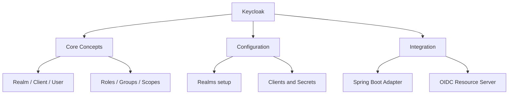

# Keycloak & Identity Federation
> **Previous:** [Method Security, CORS & CSRF](27-method-cors-csrf.md) | **Next:** [JUnit 5](29-junit5.md)

Keycloak is an open-source identity and access management (IAM) platform that provides authentication, authorization, single sign-on (SSO), social login, user federation, and identity brokering — all behind a unified administration console.

This chapter covers Keycloak from zero to production: setting up Keycloak with Docker, configuring realms and clients, securing Spring Boot applications, exchanging tokens between services, federating identities from external providers (Google, GitHub, LDAP), and implementing fine-grained authorization with resources, scopes, and policies.

---

## Learning Objectives

By the end of this chapter you should be able to:

<!-- Image Gallery -->
<section class="lesson-visuals" aria-label="Visual learning resources">
  <header><span>VISUAL LEARNING</span><h2>See it. Review it. Remember it.</h2></header>
  <a class="lesson-visual-card" href="../../assets/images/lessons/java/28-keycloak/handwritten-notes.png" target="_blank" rel="noopener">
    
    <span><strong>Handwritten notes</strong>Condensed notes for deliberate review.</span>
  </a>
  <a class="lesson-visual-card" href="../../assets/images/lessons/java/28-keycloak/sticky-notes.png" target="_blank" rel="noopener">
    
    <span><strong>Sticky-note revision</strong>Fast recall prompts for revision.</span>
  </a>
  <a class="lesson-visual-card" href="../../assets/images/lessons/java/28-keycloak/visual-explanation.png" target="_blank" rel="noopener">
    
    <span><strong>Visual concept guide</strong>A connected explanation of the key ideas.</span>
  </a>
</section>
<!-- End Image Gallery -->


- Set up Keycloak with Docker Compose and configure realms, clients, users, roles, and groups via the admin console
- Secure Spring Boot REST endpoints using the Keycloak Spring Boot adapter (legacy) and Spring Security OAuth2 resource server (modern)
- Implement token exchange between clients for service-to-service delegation
- Configure identity brokering with social login providers (Google, GitHub) and SAML identity providers
- Set up user federation with LDAP and Active Directory, including periodic sync and mappers
- Configure the first broker login flow for account linking
- Implement fine-grained authorization using Keycloak Authorization Services with resources, scopes, permissions, and policies
- Apply UMA 2.0 for user-managed resource access
- Evaluate permissions programmatically using the Keycloak Authorization API

---
## Chapter at a Glance

| Topic | Key Insight | Practical Takeaway |
|-------|------------|-------------------|
| Keycloak → open-source identity and access management | Self-hosted IdP with OAuth2/OIDC support |
| Realm, Client, User → core Keycloak data model | Each realm is a tenant isolation boundary |
| Spring Boot Adapter → secure apps via Keycloak integration | Use keycloak-spring-boot-starter or OIDC configuration |

---
## Chapter Roadmap



---
## Concept Comparison Table

| Concept | Description | Key Difference |
|---------|-------------|----------------|
| Keycloak Adapter | Proprietary Spring Boot integration | Simpler but tightly coupled |
| OIDC Resource Server | Standard Spring Security OIDC | Decoupled, portable across IdPs |
| Login Theme | Customizable Keycloak login pages | Built-in themes: base, keycloak, keycloak.v2 |
| User Federation | Syncs external users (LDAP, AD) | Built-in LDAP and Kerberos federation |

---
## Quick Reference

| Element | Purpose | Example |
|---------|---------|---------|
| `KeycloakAuthenticationToken` | Represents authenticated user | Contains token, roles, principal |
| `KeycloakWebSecurityConfigurerAdapter` | Legacy Spring Security adapter | Deprecated in Keycloak 19+ |
| `spring.security.oauth2.client` | Standard OIDC client properties | `provider.keycloak.issuer-uri` |
| `KeycloakAdminClient` | Admin REST API client | Manage realms, users, roles programmatically |

---
## Cross-Application Matrix

| Domain | Application | Use Case |
|--------|-------------|----------|
| Enterprise SSO | Keycloak as central IdP | All internal apps authenticate via Keycloak |
| Multi-Tenant SaaS | Keycloak realms per customer | Isolate user stores per tenant |
| B2B Integration | Broker external IdPs | SAML/OIDC identity federation with partners |

---
## Chapter Quiz

1. What is the tenant isolation unit in Keycloak? **Answer:** Realm
2. Which annotation maps roles from Keycloak to Spring Security authorities? **Answer:** `@KeycloakConfiguration` handles role mapping automatically
3. Is the Keycloak Spring Boot adapter recommended for new projects? **Answer:** No → use the standard OIDC resource server configuration

---

## 1. Keycloak Setup


### 1.1 Docker Compose


The fastest way to get Keycloak running is with Docker Compose:

```yaml
# docker-compose.yml
version: '3.8'

services:
  postgres:
    image: postgres:16
    container_name: keycloak-db
    environment:
      POSTGRES_DB: keycloak
      POSTGRES_USER: keycloak
      POSTGRES_PASSWORD: keycloak_secret
    volumes:
      - postgres_data:/var/lib/postgresql/data
    networks:
      - keycloak-network
    healthcheck:
      test: ["CMD-SHELL", "pg_isready -U keycloak"]
      interval: 5s
      timeout: 5s
      retries: 5

  keycloak:
    image: quay.io/keycloak/keycloak:25.0
    container_name: keycloak-server
    environment:
      KC_HOSTNAME: localhost
      KC_HOSTNAME_PORT: 8443
      KC_HTTP_PORT: 8080
      KC_HTTPS_PORT: 8443
      KC_DB: postgres
      KC_DB_URL: jdbc:postgresql://postgres:5432/keycloak
      KC_DB_USERNAME: keycloak
      KC_DB_PASSWORD: keycloak_secret
      KC_BOOTSTRAP_ADMIN_USERNAME: admin
      KC_BOOTSTRAP_ADMIN_PASSWORD: admin123
      KC_HTTP_RELATIVE_PATH: /
      KC_HTTP_ENABLED: "true"
      KC_PROXY: edge
    command: ["start-dev", "--import-realm"]
    ports:
      - "8080:8080"
      - "8443:8443"
    volumes:
      - ./keycloak-data/realms:/opt/keycloak/data/import
    depends_on:
      postgres:
        condition: service_healthy
    networks:
      - keycloak-network

networks:
  keycloak-network:
    driver: bridge

volumes:
  postgres_data:
```

Start the services:

```bash
docker compose up -d
```

Keycloak will be available at `http://localhost:8080`. Log in to the admin console at `http://localhost:8080/admin/` with `admin` / `admin123`.

### 1.2 Realm Configuration


A **realm** is the Keycloak equivalent of a tenant. It manages a set of users, credentials, roles, and groups.

#### Creating a Realm via Admin Console

1. Navigate to `http://localhost:8080/admin/`
2. Hover over "master" realm → Click "Create Realm"
3. Enter realm name: `demo-engineering`
4. Click "Create"

#### Creating a Realm via JSON Import

```json
{
  "realm": "demo-engineering",
  "enabled": true,
  "displayName": "Demo Engineering",
  "loginTheme": "keycloak",
  "accountTheme": "keycloak",
  "accessTokenLifespan": 300,
  "refreshTokenLifespan": 1800,
  "ssoSessionMaxLifespan": 36000,
  "bruteForceProtected": true,
  "failureFactor": 3,
  "waitIncrementSeconds": 60,
  "quickLoginCheckMilliSeconds": 1000,
  "minimumQuickLoginWaitSeconds": 60,
  "defaultRoles": ["default-roles-demo-engineering", "offline_access", "uma_authorization"]
}
```

Save as `keycloak-data/realms/demo-engineering-realm.json` for auto-import on startup.

### 1.3 Client Configuration


A **client** represents an application or service that requests authentication.

#### Creating a Confidential Client (Backend Service)

```json
{
  "clientId": "spring-backend",
  "enabled": true,
  "protocol": "openid-connect",
  "clientAuthenticatorType": "client-secret",
  "secret": "spring-backend-secret",
  "publicClient": false,
  "standardFlowEnabled": true,
  "serviceAccountsEnabled": true,
  "directAccessGrantsEnabled": true,
  "authorizationServicesEnabled": true,
  "redirectUris": ["http://localhost:8081/*"],
  "webOrigins": ["http://localhost:8081"],
  "protocolMappers": [
    {
      "name": "groups",
      "protocol": "openid-connect",
      "protocolMapper": "oidc-group-membership-mapper",
      "config": {
        "full.path": "false",
        "id.token.claim": "true",
        "access.token.claim": "true",
        "claim.name": "groups",
        "userinfo.token.claim": "true"
      }
    },
    {
      "name": "roles",
      "protocol": "openid-connect",
      "protocolMapper": "oidc-usermodel-realm-role-mapper",
      "config": {
        "user.attribute": "foo",
        "id.token.claim": "true",
        "access.token.claim": "true",
        "claim.name": "roles",
        "jsonType.label": "String",
        "multivalued": "true"
      }
    }
  ]
}
```

#### Creating a Public Client (SPA / React)

```json
{
  "clientId": "spa-frontend",
  "enabled": true,
  "protocol": "openid-connect",
  "publicClient": true,
  "standardFlowEnabled": true,
  "redirectUris": ["http://localhost:3000/*"],
  "webOrigins": ["http://localhost:3000"],
  "attributes": {
    "pkce.code.challenge.method": "S256",
    "post.logout.redirect.uris": "http://localhost:3000/*"
  }
}
```

### 1.4 Users, Roles, and Groups


#### Creating Roles

```
Realm Roles:
├── admin          (composite: engineer + viewer)
├── engineer       (composite: viewer)
├── viewer
└── offline_access (built-in)
```

#### Role JSON

```json
{
  "roles": {
    "realm": [
      {
        "name": "admin",
        "description": "Administrator with full access",
        "composite": true,
        "composites": {
          "realm": ["engineer", "viewer"]
        }
      },
      {
        "name": "engineer",
        "description": "Engineer with write access",
        "composite": true,
        "composites": {
          "realm": ["viewer"]
        }
      },
      {
        "name": "viewer",
        "description": "Read-only access"
      }
    ]
  }
}
```

#### Creating Users

```json
{
  "users": [
    {
      "username": "alice",
      "enabled": true,
      "email": "alice@example.com",
      "firstName": "Alice",
      "lastName": "Admin",
      "emailVerified": true,
      "credentials": [
        {
          "type": "password",
          "value": "alice123",
          "temporary": false
        }
      ],
      "realmRoles": ["admin"],
      "groups": ["engineering-leads"]
    },
    {
      "username": "bob",
      "enabled": true,
      "email": "bob@example.com",
      "firstName": "Bob",
      "lastName": "Engineer",
      "emailVerified": true,
      "credentials": [
        {
          "type": "password",
          "value": "bob123",
          "temporary": false
        }
      ],
      "realmRoles": ["engineer"],
      "groups": ["engineering"]
    },
    {
      "username": "charlie",
      "enabled": true,
      "email": "charlie@example.com",
      "firstName": "Charlie",
      "lastName": "Viewer",
      "emailVerified": true,
      "credentials": [
        {
          "type": "password",
          "value": "charlie123",
          "temporary": false
        }
      ],
      "realmRoles": ["viewer"],
      "groups": ["viewers"]
    }
  ]
}
```

### 1.5 Groups


```json
{
  "groups": [
    {
      "name": "engineering-leads",
      "attributes": {
        "access_level": ["10"]
      }
    },
    {
      "name": "engineering",
      "attributes": {
        "access_level": ["7"]
      }
    },
    {
      "name": "viewers",
      "attributes": {
        "access_level": ["1"]
      }
    }
  ]
}
```

### 1.6 Keycloak Admin REST API


Programmatic realm configuration:

```java
package com.course.keycloak.admin;

import com.fasterxml.jackson.databind.JsonNode;
import com.fasterxml.jackson.databind.ObjectMapper;
import com.fasterxml.jackson.databind.node.ArrayNode;
import com.fasterxml.jackson.databind.node.ObjectNode;

import java.net.URI;
import java.net.http.HttpClient;
import java.net.http.HttpRequest;
import java.net.http.HttpResponse;

/**
 * Programmatic Keycloak admin operations.
 * In production, use the Keycloak Admin Client library instead.
 */
public class KeycloakAdminClient {

    private static final String KEYCLOAK_URL = "http://localhost:8080";
    private static final String REALM = "demo-engineering";
    private static final String ADMIN_USER = "admin";
    private static final String ADMIN_PASS = "admin123";

    private final HttpClient httpClient;
    private final ObjectMapper objectMapper;

    public KeycloakAdminClient() {
        this.httpClient = HttpClient.newHttpClient();
        this.objectMapper = new ObjectMapper();
    }

    public String getAdminToken() throws Exception {
        String payload = """
            client_id=admin-cli&username=%s&password=%s&grant_type=password
            """.formatted(ADMIN_USER, ADMIN_PASS);

        HttpRequest request = HttpRequest.newBuilder()
            .uri(URI.create("%s/realms/master/protocol/openid-connect/token".formatted(KEYCLOAK_URL)))
            .header("Content-Type", "application/x-www-form-urlencoded")
            .POST(HttpRequest.BodyPublishers.ofString(payload))
            .build();

        HttpResponse<String> response = httpClient.send(request,
            HttpResponse.BodyHandlers.ofString());

        JsonNode json = objectMapper.readTree(response.body());
        return json.get("access_token").asText();
    }

    public void createUser(String token, String username, String email,
                            String firstName, String lastName, String password,
                            String role) throws Exception {
        ObjectNode user = objectMapper.createObjectNode();
        user.put("username", username);
        user.put("email", email);
        user.put("firstName", firstName);
        user.put("lastName", lastName);
        user.put("enabled", true);
        user.put("emailVerified", true);

        ArrayNode credentials = user.putArray("credentials");
        ObjectNode credential = credentials.addObject();
        credential.put("type", "password");
        credential.put("value", password);
        credential.put("temporary", false);

        ArrayNode realmRoles = user.putArray("realmRoles");
        realmRoles.add(role);

        HttpRequest request = HttpRequest.newBuilder()
            .uri(URI.create("%s/admin/realms/%s/users".formatted(KEYCLOAK_URL, REALM)))
            .header("Content-Type", "application/json")
            .header("Authorization", "Bearer " + token)
            .POST(HttpRequest.BodyPublishers.ofString(
                objectMapper.writerWithDefaultPrettyPrinter().writeValueAsString(user)))
            .build();

        HttpResponse<String> response = httpClient.send(request,
            HttpResponse.BodyHandlers.ofString());

        if (response.statusCode() == 201) {
            System.out.println("User created: " + username);
        } else {
            System.err.println("Failed to create user: " + response.body());
        }
    }

    public void createRealmRole(String token, String roleName,
                                 String description) throws Exception {
        ObjectNode role = objectMapper.createObjectNode();
        role.put("name", roleName);
        role.put("description", description);

        HttpRequest request = HttpRequest.newBuilder()
            .uri(URI.create("%s/admin/realms/%s/roles".formatted(KEYCLOAK_URL, REALM)))
            .header("Content-Type", "application/json")
            .header("Authorization", "Bearer " + token)
            .POST(HttpRequest.BodyPublishers.ofString(
                objectMapper.writerWithDefaultPrettyPrinter().writeValueAsString(role)))
            .build();

        HttpResponse<String> response = httpClient.send(request,
            HttpResponse.BodyHandlers.ofString());

        if (response.statusCode() == 201) {
            System.out.println("Role created: " + roleName);
        }
    }

    public void assignRoleToUser(String token, String userId,
                                  String roleName) throws Exception {
        // Get role representation
        HttpRequest getRoleReq = HttpRequest.newBuilder()
            .uri(URI.create("%s/admin/realms/%s/roles/%s".formatted(
                KEYCLOAK_URL, REALM, roleName)))
            .header("Authorization", "Bearer " + token)
            .GET()
            .build();

        HttpResponse<String> roleResponse = httpClient.send(getRoleReq,
            HttpResponse.BodyHandlers.ofString());
        JsonNode roleJson = objectMapper.readTree(roleResponse.body());

        ArrayNode roles = objectMapper.createArrayNode();
        roles.add(roleJson);

        HttpRequest request = HttpRequest.newBuilder()
            .uri(URI.create("%s/admin/realms/%s/users/%s/role-mappings/realm"
                .formatted(KEYCLOAK_URL, REALM, userId)))
            .header("Content-Type", "application/json")
            .header("Authorization", "Bearer " + token)
            .POST(HttpRequest.BodyPublishers.ofString(
                objectMapper.writerWithDefaultPrettyPrinter().writeValueAsString(roles)))
            .build();

        HttpResponse<String> response = httpClient.send(request,
            HttpResponse.BodyHandlers.ofString());

        if (response.statusCode() == 204) {
            System.out.println("Role " + roleName + " assigned to user " + userId);
        }
    }

    public static void main(String[] args) throws Exception {
        KeycloakAdminClient client = new KeycloakAdminClient();
        String token = client.getAdminToken();
        client.createRealmRole(token, "supervisor", "Can supervise projects");
        client.createUser(token, "diana", "diana@example.com",
            "Diana", "Supervisor", "diana123", "supervisor");
    }
}
```

> [!TIP]
> For new projects, prefer the standard Spring Security OIDC configuration over the Keycloak adapter → it is more portable and actively maintained.

> [!WARNING]
> Never commit Keycloak client secrets to version control. Use environment variables or a secret manager.

---

## 2. Spring Boot Adapter (Traditional)

Keycloak provides a dedicated Spring Boot adapter. Note: the adapter is deprecated in favor of Spring Security's native OAuth2/OIDC support (Section 3), but many production systems still use it.

### 2.1 Maven Dependencies


```xml
<!-- pom.xml — Keycloak Spring Boot Adapter (Legacy) -->
<properties>
    <keycloak.version>25.0.0</keycloak.version>
</properties>

<dependencyManagement>
    <dependencies>
        <dependency>
            <groupId>org.keycloak.bom</groupId>
            <artifactId>keycloak-adapter-bom</artifactId>
            <version>${keycloak.version}</version>
            <type>pom</type>
            <scope>import</scope>
        </dependency>
    </dependencies>
</dependencyManagement>

<dependencies>
    <dependency>
        <groupId>org.springframework.boot</groupId>
        <artifactId>spring-boot-starter-security</artifactId>
    </dependency>
    <dependency>
        <groupId>org.springframework.boot</groupId>
        <artifactId>spring-boot-starter-web</artifactId>
    </dependency>
    <dependency>
        <groupId>org.keycloak</groupId>
        <artifactId>keycloak-spring-boot-starter</artifactId>
    </dependency>
</dependencies>
```

### 2.2 Application Properties


```properties
# src/main/resources/application.yml
server:
  port: 8081

keycloak:
  auth-server-url: http://localhost:8080
  realm: demo-engineering
  resource: spring-backend
  credentials:
    secret: spring-backend-secret
  public-client: false
  ssl-required: external
  use-resource-role-mappings: false
  principal-attribute: preferred_username
  bearer-only: false

  # Token settings
  token-minimum-time-to-live: 60
  min-time-between-jwks-requests: 60

  # CORS
  cors: true
  cors-allowed-methods: GET,POST,PUT,DELETE,OPTIONS
  cors-allowed-headers: Authorization,Content-Type

  # Policies
  policy-enforcer-config:
    enforcement-mode: ENFORCING
    on-deny-redirect-to: /access-denied
```

### 2.3 KeycloakWebSecurityConfigurerAdapter (Deprecated)


The legacy approach extends `KeycloakWebSecurityConfigurerAdapter`:

```java
package com.course.keycloak.config;

import org.keycloak.adapters.KeycloakConfigResolver;
import org.keycloak.adapters.springboot.KeycloakSpringBootConfigResolver;
import org.keycloak.adapters.springsecurity.KeycloakConfiguration;
import org.keycloak.adapters.springsecurity.authentication.KeycloakAuthenticationProvider;
import org.keycloak.adapters.springsecurity.config.KeycloakWebSecurityConfigurerAdapter;
import org.springframework.beans.factory.annotation.Autowired;
import org.springframework.context.annotation.Bean;
import org.springframework.security.config.annotation.authentication.builders.AuthenticationManagerBuilder;
import org.springframework.security.config.annotation.web.builders.HttpSecurity;
import org.springframework.security.core.authority.mapping.SimpleAuthorityMapper;
import org.springframework.security.web.authentication.session.NullAuthenticatedSessionStrategy;
import org.springframework.security.web.authentication.session.SessionAuthenticationStrategy;

@KeycloakConfiguration
public class LegacySecurityConfig extends KeycloakWebSecurityConfigurerAdapter {

    @Autowired
    public void configureGlobal(AuthenticationManagerBuilder auth) {
        KeycloakAuthenticationProvider provider = keycloakAuthenticationProvider();
        provider.setGrantedAuthoritiesMapper(new SimpleAuthorityMapper());
        auth.authenticationProvider(provider);
    }

    @Bean
    @Override
    protected SessionAuthenticationStrategy sessionAuthenticationStrategy() {
        // Use NullAuthenticatedSessionStrategy for bearer-only (stateless)
        // Use RegisterSessionAuthenticationStrategy for confidential (session)
        return new NullAuthenticatedSessionStrategy();
    }

    @Bean
    public KeycloakConfigResolver keycloakConfigResolver() {
        return new KeycloakSpringBootConfigResolver();
    }

    @Override
    protected void configure(HttpSecurity http) throws Exception {
        super.configure(http);
        http
            .authorizeHttpRequests(auth -> auth
                .requestMatchers("/api/public/**").permitAll()
                .requestMatchers("/api/admin/**").hasRole("ADMIN")
                .requestMatchers("/api/engineer/**").hasAnyRole("ADMIN", "ENGINEER")
                .anyRequest().authenticated()
            )
            .csrf(csrf -> csrf.disable());
    }
}
```

### 2.4 Modern Security Config (Spring Security OAuth2 Resource Server)


The recommended approach for Keycloak 25+ uses Spring Security's native OAuth2 support:

```java
package com.course.keycloak.config;

import org.springframework.context.annotation.Bean;
import org.springframework.context.annotation.Configuration;
import org.springframework.core.convert.converter.Converter;
import org.springframework.security.config.annotation.method.configuration.EnableMethodSecurity;
import org.springframework.security.config.annotation.web.builders.HttpSecurity;
import org.springframework.security.config.annotation.web.configuration.EnableWebSecurity;
import org.springframework.security.config.http.SessionCreationPolicy;
import org.springframework.security.core.GrantedAuthority;
import org.springframework.security.core.authority.SimpleGrantedAuthority;
import org.springframework.security.oauth2.jwt.Jwt;
import org.springframework.security.oauth2.server.resource.authentication.JwtAuthenticationConverter;
import org.springframework.security.web.SecurityFilterChain;

import java.util.Collection;
import java.util.List;
import java.util.Map;
import java.util.stream.Collectors;

@Configuration
@EnableWebSecurity
@EnableMethodSecurity
public class OAuth2ResourceServerConfig {

    @Bean
    public SecurityFilterChain filterChain(HttpSecurity http) throws Exception {
        http
            .authorizeHttpRequests(auth -> auth
                .requestMatchers("/api/public/**").permitAll()
                .requestMatchers("/api/admin/**").hasRole("ADMIN")
                .anyRequest().authenticated()
            )
            .sessionManagement(session ->
                session.sessionCreationPolicy(SessionCreationPolicy.STATELESS))
            .csrf(csrf -> csrf.disable())
            .oauth2ResourceServer(oauth2 -> oauth2
                .jwt(jwt -> jwt
                    .jwtAuthenticationConverter(jwtAuthenticationConverter())
                )
            );

        return http.build();
    }

    @Bean
    public JwtAuthenticationConverter jwtAuthenticationConverter() {
        JwtAuthenticationConverter converter = new JwtAuthenticationConverter();
        converter.setJwtGrantedAuthoritiesConverter(new KeycloakRoleConverter());
        return converter;
    }

    static class KeycloakRoleConverter
            implements Converter<Jwt, Collection<GrantedAuthority>> {

        @Override
        public Collection<GrantedAuthority> convert(Jwt jwt) {
            // Extract realm roles
            Map<String, Object> realmAccess = jwt.getClaimAsMap("realm_access");
            if (realmAccess == null || realmAccess.isEmpty()) {
                return List.of();
            }

            @SuppressWarnings("unchecked")
            List<String> roles = (List<String>) realmAccess.get("roles");

            return roles.stream()
                .map(role -> new SimpleGrantedAuthority("ROLE_" + role.toUpperCase()))
                .collect(Collectors.toList());
        }
    }
}
```

### 2.5 Application Properties for OAuth2 Resource Server


```properties
# application.yml — OAuth2 Resource Server
spring:
  security:
    oauth2:
      resourceserver:
        jwt:
          issuer-uri: http://localhost:8080/realms/demo-engineering
          jwk-set-uri: http://localhost:8080/realms/demo-engineering/protocol/openid-connect/certs

server:
  port: 8081
```

### 2.6 Securing REST Endpoints


```java
package com.course.keycloak.controller;

import jakarta.annotation.security.RolesAllowed;
import org.springframework.security.access.annotation.Secured;
import org.springframework.security.access.prepost.PreAuthorize;
import org.springframework.security.core.annotation.AuthenticationPrincipal;
import org.springframework.security.oauth2.jwt.Jwt;
import org.springframework.web.bind.annotation.*;

import java.util.Map;

@RestController
@RequestMapping("/api")
public class KeycloakSecuredController {

    // Public endpoint
    @GetMapping("/public/health")
    public Map<String, String> health() {
        return Map.of("status", "UP", "realm", "demo-engineering");
    }

    // Any authenticated user
    @GetMapping("/profile")
    public Map<String, Object> profile(@AuthenticationPrincipal Jwt jwt) {
        return Map.of(
            "username", jwt.getClaimAsString("preferred_username"),
            "email", jwt.getClaimAsString("email"),
            "roles", jwt.getClaimAsMap("realm_access"),
            "subject", jwt.getSubject()
        );
    }

    // Role-based — SpEL
    @GetMapping("/admin/dashboard")
    @PreAuthorize("hasRole('ADMIN')")
    public Map<String, String> adminDashboard() {
        return Map.of("message", "Welcome, Administrator");
    }

    @GetMapping("/admin/users")
    @PreAuthorize("hasRole('ADMIN')")
    public Map<String, Object> listUsers() {
        return Map.of("users", List.of("alice", "bob", "charlie"));
    }

    // Role-based — @Secured
    @PostMapping("/engineer/projects")
    @Secured("ROLE_ENGINEER")
    public Map<String, String> createProject(@RequestBody Map<String, String> project) {
        return Map.of("status", "created", "name", project.get("name"));
    }

    // Role-based — @RolesAllowed (JSR-250)
    @PutMapping("/engineer/projects/{id}")
    @RolesAllowed({"admin", "engineer"})
    public Map<String, String> updateProject(
            @PathVariable String id,
            @RequestBody Map<String, String> updates) {
        return Map.of("status", "updated", "id", id);
    }

    // Hierarchical role check— admin inherits engineer rights
    @GetMapping("/engineer/tasks")
    @PreAuthorize("hasAnyRole('ENGINEER', 'ADMIN')")
    public Map<String, Object> getTasks() {
        return Map.of("tasks", List.of("Task 1", "Task 2", "Task 3"));
    }

    // Custom SpEL — check specific claim
    @GetMapping("/sensitive")
    @PreAuthorize("authentication.token.claims['email_verified'] == true")
    public Map<String, String> sensitiveData() {
        return Map.of("data", "Email-verified users only");
    }

    // Group-based claim check
    @GetMapping("/leads")
    @PreAuthorize("hasRole('ADMIN') or " +
        "authentication.token.claims['groups'].contains('engineering-leads')")
    public Map<String, String> leadsArea() {
        return Map.of("data", "Engineering leads area");
    }
}
```

---

## 3. Token Exchange

Token exchange allows one client or user to exchange a token for another token targeting a different service. This enables delegation and impersonation patterns.

### 3.1 Token Exchange Overview


```
┌──────────┐         ┌──────────┐         ┌──────────┐
│  Client A │───JWT──▶│ Keycloak │â→€â”€â”€JWT───│  Client B │
│(Frontend) │         │          │         │ (Backend) │
└──────────┘         └────┬─────┘         └──────────┘
                          │
                    Token Exchange
                          │
                          â–¼
                   ┌──────────────┐
                   │   Target     │
                   │   Service    │
                   └──────────────┘
```

### 3.2 Token Exchange Between Clients


```java
package com.course.keycloak.service;

import com.fasterxml.jackson.databind.JsonNode;
import com.fasterxml.jackson.databind.ObjectMapper;

import java.net.URI;
import java.net.URLEncoder;
import java.net.http.HttpClient;
import java.net.http.HttpRequest;
import java.net.http.HttpResponse;
import java.nio.charset.StandardCharsets;
import java.util.StringJoiner;

@Service
public class TokenExchangeService {

    private static final String KEYCLOAK_TOKEN_URL =
        "http://localhost:8080/realms/demo-engineering/protocol/openid-connect/token";

    private final HttpClient httpClient;
    private final ObjectMapper objectMapper;

    public TokenExchangeService() {
        this.httpClient = HttpClient.newHttpClient();
        this.objectMapper = new ObjectMapper();
    }

    /**
     * Exchange a token issued to one client for a token targeting another client.
     * This is the Internal Token Exchange flow.
     */
    public TokenExchangeResponse exchangeToken(
            String currentToken,
            String targetClientId,
            String targetClientSecret) throws Exception {

        StringJoiner params = new StringJoiner("&");
        params.add("client_id=" + urlEncode("spring-backend"));
        params.add("client_secret=" + urlEncode("spring-backend-secret"));
        params.add("grant_type=" + urlEncode("urn:ietf:params:oauth:grant-type:token-exchange"));
        params.add("subject_token=" + urlEncode(currentToken));
        params.add("audience=" + urlEncode(targetClientId));
        params.add("requested_token_type=" + urlEncode(
            "urn:ietf:params:oauth:token-type:access_token"));

        HttpRequest request = HttpRequest.newBuilder()
            .uri(URI.create(KEYCLOAK_TOKEN_URL))
            .header("Content-Type", "application/x-www-form-urlencoded")
            .POST(HttpRequest.BodyPublishers.ofString(params.toString()))
            .build();

        HttpResponse<String> response = httpClient.send(request,
            HttpResponse.BodyHandlers.ofString());

        if (response.statusCode() != 200) {
            throw new RuntimeException("Token exchange failed: " + response.body());
        }

        JsonNode json = objectMapper.readTree(response.body());
        return new TokenExchangeResponse(
            json.get("access_token").asText(),
            json.has("refresh_token") ? json.get("refresh_token").asText() : null,
            json.get("expires_in").asInt(),
            json.has("token_type") ? json.get("token_type").asText() : "Bearer"
        );
    }

    /**
     * Impersonate another user via token exchange.
     * Requires the impersonation role in Keycloak.
     */
    public TokenExchangeResponse impersonateUser(
            String adminToken,
            String usernameToImpersonate) throws Exception {

        StringJoiner params = new StringJoiner("&");
        params.add("client_id=" + urlEncode("spring-backend"));
        params.add("client_secret=" + urlEncode("spring-backend-secret"));
        params.add("grant_type=" + urlEncode(
            "urn:ietf:params:oauth:grant-type:token-exchange"));
        params.add("subject_token=" + urlEncode(adminToken));
        params.add("requested_subject=" + urlEncode(usernameToImpersonate));

        HttpRequest request = HttpRequest.newBuilder()
            .uri(URI.create(KEYCLOAK_TOKEN_URL))
            .header("Content-Type", "application/x-www-form-urlencoded")
            .POST(HttpRequest.BodyPublishers.ofString(params.toString()))
            .build();

        HttpResponse<String> response = httpClient.send(request,
            HttpResponse.BodyHandlers.ofString());

        if (response.statusCode() != 200) {
            throw new RuntimeException("Impersonation failed: " + response.body());
        }

        JsonNode json = objectMapper.readTree(response.body());
        return new TokenExchangeResponse(
            json.get("access_token").asText(),
            json.get("refresh_token").asText(),
            json.get("expires_in").asInt(),
            json.get("token_type").asText()
        );
    }

    /**
     * Exchange an external token (e.g., Google, Facebook) for a Keycloak token.
     * This is the External Token Exchange flow.
     */
    public TokenExchangeResponse exchangeExternalToken(
            String externalToken,
            String externalProvider,
            String externalTokenType) throws Exception {

        StringJoiner params = new StringJoiner("&");
        params.add("client_id=" + urlEncode("spring-backend"));
        params.add("client_secret=" + urlEncode("spring-backend-secret"));
        params.add("grant_type=" + urlEncode(
            "urn:ietf:params:oauth:grant-type:token-exchange"));
        params.add("subject_token=" + urlEncode(externalToken));
        params.add("subject_token_type=" + urlEncode(externalTokenType));
        params.add("subject_issuer=" + urlEncode(externalProvider));

        HttpRequest request = HttpRequest.newBuilder()
            .uri(URI.create(KEYCLOAK_TOKEN_URL))
            .header("Content-Type", "application/x-www-form-urlencoded")
            .POST(HttpRequest.BodyPublishers.ofString(params.toString()))
            .build();

        HttpResponse<String> response = httpClient.send(request,
            HttpResponse.BodyHandlers.ofString());

        if (response.statusCode() != 200) {
            throw new RuntimeException(
                "External token exchange failed: " + response.body());
        }

        JsonNode json = objectMapper.readTree(response.body());
        return new TokenExchangeResponse(
            json.get("access_token").asText(),
            json.has("refresh_token") ? json.get("refresh_token").asText() : null,
            json.get("expires_in").asInt(),
            json.get("token_type").asText()
        );
    }

    /**
     * Token refresh
     */
    public TokenExchangeResponse refreshToken(String refreshToken) throws Exception {
        StringJoiner params = new StringJoiner("&");
        params.add("client_id=" + urlEncode("spring-backend"));
        params.add("client_secret=" + urlEncode("spring-backend-secret"));
        params.add("grant_type=" + urlEncode("refresh_token"));
        params.add("refresh_token=" + urlEncode(refreshToken));

        HttpRequest request = HttpRequest.newBuilder()
            .uri(URI.create(KEYCLOAK_TOKEN_URL))
            .header("Content-Type", "application/x-www-form-urlencoded")
            .POST(HttpRequest.BodyPublishers.ofString(params.toString()))
            .build();

        HttpResponse<String> response = httpClient.send(request,
            HttpResponse.BodyHandlers.ofString());

        if (response.statusCode() != 200) {
            throw new RuntimeException("Token refresh failed: " + response.body());
        }

        JsonNode json = objectMapper.readTree(response.body());
        return new TokenExchangeResponse(
            json.get("access_token").asText(),
            json.get("refresh_token").asText(),
            json.get("expires_in").asInt(),
            json.get("token_type").asText()
        );
    }

    private String urlEncode(String value) {
        return URLEncoder.encode(value, StandardCharsets.UTF_8);
    }

    public record TokenExchangeResponse(
        String accessToken,
        String refreshToken,
        int expiresIn,
        String tokenType
    ) {}
}
```

### 3.3 Delegation Pattern with Token Exchange


A service that needs to call another service on behalf of the user:

```java
package com.course.keycloak.service;

import org.springframework.stereotype.Service;
import org.springframework.web.client.RestClient;

@Service
public class DelegationService {

    private final TokenExchangeService tokenExchangeService;
    private final RestClient restClient;

    public DelegationService(TokenExchangeService tokenExchangeService) {
        this.tokenExchangeService = tokenExchangeService;
        this.restClient = RestClient.create();
    }

    /**
     * Fetches user data from the user-service by exchanging the current
     * JWT for one targeting the user-service audience.
     */
    public String getUserDataFromService(
            String userJwt,
            String userId) {

        try {
            // Exchange the current token for a token targeting user-service
            TokenExchangeService.TokenExchangeResponse exchanged =
                tokenExchangeService.exchangeToken(
                    userJwt,
                    "user-service",
                    "user-service-secret"
                );

            // Call the downstream service with the exchanged token
            return restClient.get()
                .uri("http://user-service/api/users/{id}", userId)
                .header("Authorization",
                    "Bearer " + exchanged.accessToken())
                .retrieve()
                .body(String.class);

        } catch (Exception e) {
            throw new RuntimeException("Delegation failed", e);
        }
    }

    /**
     * Impersonate a user for admin operations
     */
    public String performAdminAction(
            String adminJwt,
            String targetUsername,
            String action) {

        try {
            TokenExchangeService.TokenExchangeResponse impersonated =
                tokenExchangeService.impersonateUser(
                    adminJwt, targetUsername);

            // Perform action as the impersonated user
            return restClient.post()
                .uri("http://audit-service/api/actions")
                .header("Authorization",
                    "Bearer " + impersonated.accessToken())
                .body(new AuditAction(targetUsername, action))
                .retrieve()
                .body(String.class);

        } catch (Exception e) {
            throw new RuntimeException("Admin action failed", e);
        }
    }

    private record AuditAction(String username, String action) {}
}
```

### 3.4 Enabling Token Exchange in Keycloak


To enable impersonation, assign the `impersonation` role to the client:

```java
// Keycloak Admin API — grant impersonation to client
// 1. Go to Clients → spring-backend → Service Account Roles
// 2. Add "impersonation" from realm roles
// 3. For user impersonation, also assign "realm-admin" or:
//    Clients → spring-backend → Roles → Add "impersonation"

// Programmatic approach:
public void grantImpersonationToClient(String token) throws Exception {
    StringJoiner params = new StringJoiner("&");
    params.add("client_id=" + urlEncode("spring-backend"));
    params.add("client_secret=" + urlEncode("spring-backend-secret"));
    params.add("grant_type=" + urlEncode("client_credentials"));

    HttpRequest request = HttpRequest.newBuilder()
        .uri(URI.create("http://localhost:8080/realms/demo-engineering/protocol/openid-connect/token"))
        .header("Content-Type", "application/x-www-form-urlencoded")
        .POST(HttpRequest.BodyPublishers.ofString(params.toString()))
        .build();
}
```

---

## 4. Identity Brokering

Identity brokering allows Keycloak to delegate authentication to external identity providers (IdPs) and federate users from different sources.

### 4.1 Social Login — Google


#### Step 1: Google Cloud Console Setup

1. Go to https://console.cloud.google.com/apis/credentials
2. Create a new OAuth 2.0 Client ID (Web Application)
3. Set Authorized Redirect URIs:
   `http://localhost:8080/realms/demo-engineering/broker/google/endpoint`
4. Copy Client ID and Client Secret

#### Step 2: Keycloak IdP Configuration

```java
package com.course.keycloak.config;

import org.keycloak.representations.idm.IdentityProviderRepresentation;
import org.keycloak.representations.idm.IdentityProviderMapperRepresentation;
import org.springframework.stereotype.Service;

import java.util.HashMap;
import java.util.List;
import java.util.Map;

/**
 * Represents the identity provider configuration.
 * In practice, this is done through the Keycloak admin console
 * or imported via JSON.
 */
@Service
public class IdentityProviderConfig {

    public IdentityProviderRepresentation createGoogleIdp() {
        IdentityProviderRepresentation google = new IdentityProviderRepresentation();
        google.setAlias("google");
        google.setDisplayName("Google");
        google.setProviderId("google");
        google.setEnabled(true);
        google.setTrustEmail(true);
        google.setStoreToken(true);
        google.setAddReadTokenRoleOnCreate(true);
        google.setAuthenticateByDefault(false);
        google.setLinkOnly(false);

        Map<String, String> config = new HashMap<>();
        config.put("clientId", "YOUR_GOOGLE_CLIENT_ID");
        config.put("clientSecret", "YOUR_GOOGLE_CLIENT_SECRET");
        config.put("useJwksUrl", "true");
        config.put("tokenUrl", "https://oauth2.googleapis.com/token");
        config.put("authorizationUrl", "https://accounts.google.com/o/oauth2/v2/auth");
        config.put("userInfoUrl", "https://openidconnect.googleapis.com/v1/userinfo");
        config.put("defaultScope", "openid profile email");
        config.put("syncMode", "IMPORT");
        config.put("backchannelSupported", "true");
        google.setConfig(config);

        return google;
    }

    public IdentityProviderMapperRepresentation createGoogleUserMapper() {
        IdentityProviderMapperRepresentation mapper =
            new IdentityProviderMapperRepresentation();
        mapper.setName("google-user-mapper");
        mapper.setIdentityProviderAlias("google");
        mapper.setIdentityProviderMapper(
            "oidc-user-attribute-idp-mapper");
        mapper.setPriority(0);

        Map<String, String> config = new HashMap<>();
        config.put("syncMode", "IMPORT");
        config.put("claim", "email");
        config.put("user.attribute", "email");
        mapper.setConfig(config);

        return mapper;
    }
}
```

### 4.2 Social Login — GitHub


```json
{
  "alias": "github",
  "displayName": "GitHub",
  "providerId": "github",
  "enabled": true,
  "storeToken": true,
  "addReadTokenRoleOnCreate": true,
  "config": {
    "clientId": "YOUR_GITHUB_CLIENT_ID",
    "clientSecret": "YOUR_GITHUB_CLIENT_SECRET",
    "defaultScope": "user:email,read:user",
    "syncMode": "IMPORT",
    "useJwksUrl": "true"
  }
}
```

### 4.3 Social Login — Facebook


```java
public IdentityProviderRepresentation createFacebookIdp() {
    IdentityProviderRepresentation facebook = new IdentityProviderRepresentation();
    facebook.setAlias("facebook");
    facebook.setDisplayName("Facebook");
    facebook.setProviderId("facebook");
    facebook.setEnabled(true);
    facebook.setStoreToken(true);
    facebook.setAddReadTokenRoleOnCreate(true);

    Map<String, String> config = new HashMap<>();
    config.put("clientId", "YOUR_FACEBOOK_APP_ID");
    config.put("clientSecret", "YOUR_FACEBOOK_APP_SECRET");
    config.put("defaultScope", "email,public_profile");
    config.put("syncMode", "IMPORT");
    config.put("userInfoUrl",
        "https://graph.facebook.com/me?fields=id,name,email,first_name,last_name");
    config.put("tokenUrl",
        "https://graph.facebook.com/v19.0/oauth/access_token");
    config.put("authorizationUrl",
        "https://www.facebook.com/v19.0/dialog/oauth");
    facebook.setConfig(config);

    return facebook;
}
```

### 4.4 SAML Identity Provider


Keycloak can act as a SAML service provider or identity provider.

```json
{
  "alias": "saml-corporate-idp",
  "displayName": "Corporate SAML IdP",
  "providerId": "saml",
  "enabled": true,
  "config": {
    "singleSignOnServiceUrl": "https://corporate.example.com/saml/sso",
    "singleLogoutServiceUrl": "https://corporate.example.com/saml/slo",
    "nameIDPolicyFormat": "urn:oasis:names:tc:SAML:1.1:nameid-format:emailAddress",
    "principalType": "Attribute [Name identifier(s)]",
    "principalAttribute": "email",
    "signatureAlgorithm": "RSA_SHA256",
    "xmlSigKeyInfoKeyNameTransformer": "KEY_ID",
    "syncMode": "IMPORT",
    "useJwksUrl": "false",
    "wantAuthnRequestsSigned": "true",
    "validateSignature": "true",
    "signingCertificate": "MIIC... (base64 SAML cert)",
    "backchannelSupported": "false"
  }
}
```

### 4.5 Custom Identity Provider SPI


For custom identity providers, implement the Keycloak SPI:

```java
package com.course.keycloak.spi;

import org.keycloak.broker.provider.AbstractIdentityProviderFactory;
import org.keycloak.broker.provider.IdentityProvider;
import org.keycloak.broker.provider.IdentityProviderFactory;
import org.keycloak.broker.social.SocialIdentityProvider;
import org.keycloak.models.IdentityProviderModel;
import org.keycloak.models.KeycloakSession;
import org.keycloak.provider.ProviderConfigProperty;
import org.keycloak.provider.ProviderConfigurationBuilder;

import java.util.List;

/**
 * Custom identity provider SPI implementation.
 * Deploy as a JAR to the Keycloak providers directory.
 */
public class CustomIdentityProviderFactory
        extends AbstractIdentityProviderFactory<CustomIdentityProvider>
        implements IdentityProviderFactory<CustomIdentityProvider> {

    public static final String PROVIDER_ID = "custom-oauth2-idp";

    @Override
    public String getName() {
        return "Custom OAuth2 Identity Provider";
    }

    @Override
    public String getId() {
        return PROVIDER_ID;
    }

    @Override
    public List<ProviderConfigProperty> getConfigProperties() {
        return ProviderConfigurationBuilder.create()
            .property()
                .name("authorizationUrl")
                .label("Authorization URL")
                .type(ProviderConfigProperty.STRING_TYPE)
                .helpText("OAuth2 authorization endpoint URL")
                .add()
            .property()
                .name("tokenUrl")
                .label("Token URL")
                .type(ProviderConfigProperty.STRING_TYPE)
                .helpText("OAuth2 token endpoint URL")
                .add()
            .property()
                .name("userInfoUrl")
                .label("User Info URL")
                .type(ProviderConfigProperty.STRING_TYPE)
                .add()
            .property()
                .name("clientId")
                .label("Client ID")
                .type(ProviderConfigProperty.STRING_TYPE)
                .add()
            .property()
                .name("clientSecret")
                .label("Client Secret")
                .type(ProviderConfigProperty.PASSWORD)
                .add()
            .property()
                .name("defaultScope")
                .label("Default Scopes")
                .type(ProviderConfigProperty.STRING_TYPE)
                .add()
            .build();
    }

    @Override
    public CustomIdentityProvider create(KeycloakSession session,
                                          IdentityProviderModel model) {
        return new CustomIdentityProvider(session, model);
    }
}

public class CustomIdentityProvider implements SocialIdentityProvider<CustomIdentityProvider> {

    private final KeycloakSession session;
    private final IdentityProviderModel model;

    public CustomIdentityProvider(KeycloakSession session, IdentityProviderModel model) {
        this.session = session;
        this.model = model;
    }

    @Override
    public String getDisplayName() {
        return "Custom OAuth2 Provider";
    }
}
```

### 4.6 First Broker Login Flow


The first broker login flow handles what happens when a user logs in through an identity provider for the first time. Common actions include:

1. **Create user if not exists** (default)
2. **Link to existing account** (prompt user to link with an existing Keycloak account)
3. **Detect existing account** (automatically link by matching email)
4. **Review profile** (prompt user to review/update profile data)

```json
{
  "firstBrokerLoginFlowAlias": "first broker login",
  "postBrokerLoginFlowAlias": "post broker login",
  "config": {
    "updateProfileOnFirstLogin": "missing",
    "syncMode": "IMPORT"
  }
}
```

#### Custom First Broker Login Listener

```java
package com.course.keycloak.listener;

import org.keycloak.events.Event;
import org.keycloak.events.EventListenerProvider;
import org.keycloak.events.admin.AdminEvent;
import org.keycloak.models.KeycloakSession;
import org.keycloak.models.UserModel;

import java.util.logging.Logger;

/**
 * Listens for identity provider link events.
 */
public class BrokerLoginEventListener implements EventListenerProvider {

    private static final Logger LOG =
        Logger.getLogger(BrokerLoginEventListener.class.getName());

    private final KeycloakSession session;

    public BrokerLoginEventListener(KeycloakSession session) {
        this.session = session;
    }

    @Override
    public void onEvent(Event event) {
        if ("IDENTITY_PROVIDER_FIRST_LOGIN".equals(event.getType().toString())) {
            String userId = event.getUserId();
            String providerAlias = event.getDetails().get("identity_provider");
            String providerUserId = event.getDetails().get("identity_provider_user_id");

            UserModel user = session.users().getUserById(
                session.getContext().getRealm(), userId);

            LOG.info("First login via " + providerAlias + " for user: "
                + user.getEmail());

            // Assign default role
            user.grantRole(session.roles().getRealmRole(
                session.getContext().getRealm(), "viewer"));

            // Set custom attribute
            user.setSingleAttribute("identity_provider", providerAlias);
        }
    }

    @Override
    public void onEvent(AdminEvent adminEvent, boolean b) {
        // Not used
    }

    @Override
    public void close() {
        // No cleanup needed
    }
}
```

---

## 5. User Federation

User federation allows Keycloak to integrate with external user stores such as LDAP, Active Directory, and Kerberos without duplicating user data.

### 5.1 LDAP Federation Provider


#### Keycloak Admin Console Configuration

1. Navigate to User Federation → Add provider → ldap
2. Configure the connection:

```
General:
  Console Display Name: Corporate LDAP
  Import Users: ON
  Edit Mode: READ_ONLY
  Sync Registrations: OFF
  Vendor: Active Directory (or Other)

Connection and Authentication:
  Connection URL: ldap://ad.example.com:389
  Users DN: CN=Users,DC=example,DC=com
  Bind DN: CN=keycloak-bind,CN=Users,DC=example,DC=com
  Bind Credential: **********
  Search Scope: Subtree
  Use Truststore SPI: Always
  Use Kerberos Authentication: OFF
  Connection Pooling: ON
  Connection Pooling Initial Size: 5
  Connection Pooling Max Size: 20

LDAP Searching and Updating:
  Read Timeout: 5000ms
  Pagination: ON
  Page Size: 1000

Kerberos Integration:
  Allow Kerberos Authentication: OFF
  Use Kerberos For Password Authentication: OFF
```

#### Programmatic LDAP Configuration

```java
package com.course.keycloak.config;

import org.keycloak.representations.idm.ComponentRepresentation;
import org.keycloak.representations.idm.UserFederationMapperRepresentation;

import java.util.HashMap;
import java.util.Map;

public class LdapFederationConfig {

    public ComponentRepresentation createLdapProvider() {
        ComponentRepresentation ldap = new ComponentRepresentation();
        ldap.setName("Corporate LDAP");
        ldap.setProviderId("ldap");
        ldap.setProviderType("org.keycloak.storage.UserStorageProvider");

        Map<String, String> config = new HashMap<>();
        config.put("priority", "0");
        config.put("syncRegistrations", "false");
        config.put("vendor", "active_directory");
        config.put("usernameLDAPAttribute", "sAMAccountName");
        config.put("rdnLDAPAttribute", "cn");
        config.put("uuidLDAPAttribute", "objectGUID");
        config.put("userObjectClasses", "person, organizationalPerson, user");
        config.put("connectionUrl", "ldap://ad.example.com:389");
        config.put("bindDn", "CN=keycloak-bind,CN=Users,DC=example,DC=com");
        config.put("bindCredential", "secret123");
        config.put("searchScope", "1");
        config.put("useTruststoreSpi", "always");
        config.put("connectionPooling", "true");
        config.put("connectionPoolingInitialSize", "5");
        config.put("connectionPoolingMaxSize", "20");
        config.put("pagination", "true");
        config.put("batchSizeForSync", "1000");
        config.put("editMode", "READ_ONLY");
        config.put("importEnabled", "true");
        config.put("usersDn", "CN=Users,DC=example,DC=com");
        config.put("authType", "simple");
        config.put("searchScope", "1");
        config.put("customUserSearchFilter", "(objectClass=user)");
        config.put("validatePasswordPolicy", "false");
        config.put("useKerberosForPasswordAuthentication", "false");
        config.put("allowKerberosAuthentication", "false");
        config.put("trustEmail", "false");
        config.put("cachePolicy", "NO_CACHE");
        config.put("syncMode", "FORCE");
        config.put("changedSyncPeriod", "-1");
        config.put("fullSyncPeriod", "86400");
        ldap.setConfig(config);

        return ldap;
    }

    public UserFederationMapperRepresentation createLdapMapper() {
        UserFederationMapperRepresentation mapper =
            new UserFederationMapperRepresentation();
        mapper.setName("ldap-user-attribute-mapper");
        mapper.setFederationProviderDisplayName("Corporate LDAP");
        mapper.setFederationMapperType(
            "user-attribute-ldap-mapper");

        Map<String, String> config = new HashMap<>();
        config.put("user.model.attribute", "email");
        config.put("ldap.attribute", "mail");
        config.put("read.only", "true");
        config.put("always.read.value.from.ldap", "true");
        config.put("is.mandatory.in.ldap", "true");
        mapper.setConfig(config);

        return mapper;
    }
}
```

### 5.2 LDAP Mappers


Mappers define how LDAP attributes map to Keycloak user attributes and vice versa.

| Mapper Type | Description | LDAP Attribute | User Attribute |
|-------------|-------------|----------------|----------------|
| User Attribute | Map LDAP attr to user attr | `mail` → `email` |
| Full Name | Concatenates first + last name | `givenName` + `sn` → `fullName` |
| Groups | LDAP groups → Keycloak groups | `memberOf` → group membership |
| Role | LDAP attr → Keycloak role | `department` → role |
| Certificate | LDAP certificate mapping | `userCertificate` → certificate |
| Kerberos Principal | Map Kerberos principal | `krb5PrincipalName` → principal |

```java
public UserFederationMapperRepresentation createGroupMapper() {
    UserFederationMapperRepresentation mapper =
        new UserFederationMapperRepresentation();
    mapper.setName("ldap-group-mapper");
    mapper.setFederationProviderDisplayName("Corporate LDAP");
    mapper.setFederationMapperType("group-ldap-mapper");

    Map<String, String> config = new HashMap<>();
    config.put("groups.dn", "CN=Groups,DC=example,DC=com");
    config.put("group.name.ldap.attribute", "cn");
    config.put("group.object.classes", "group");
    config.put("group.object.filter", "(objectClass=group)");
    config.put("membership.ldap.attribute", "member");
    config.put("membership.attribute.type", "DN");
    config.put("membership.user.ldap.attribute", "cn");
    config.put("groups.ldap.filter", "");
    config.put("mode", "LDAP_ONLY");
    config.put("user.roles.retrieve.strategy", "LOAD_GROUPS_BY_MEMBER_ATTRIBUTE");
    config.put("memberof.ldap.attribute", "memberOf");
    config.put("mapped.group.attributes", "");
    config.put("drop.non.existing.groups.during.sync", "true");
    mapper.setConfig(config);

    return mapper;
}
```

### 5.3 Periodic Sync


```java
package com.course.keycloak.service;

import org.springframework.scheduling.annotation.Scheduled;
import org.springframework.stereotype.Service;

import java.net.URI;
import java.net.http.HttpRequest;
import java.net.http.HttpResponse;

@Service
public class LdapSyncScheduler {

    private static final String KEYCLOAK_ADMIN_URL =
        "http://localhost:8080/admin/realms/demo-engineering";

    private final KeycloakAdminClient adminClient;

    public LdapSyncScheduler(KeycloakAdminClient adminClient) {
        this.adminClient = adminClient;
    }

    /**
     * Trigger a full LDAP sync every 24 hours.
     */
    @Scheduled(fixedRate = 86400000)
    public void triggerFullSync() {
        try {
            String token = adminClient.getAdminToken();

            // Get the LDAP provider component ID
            String componentId = getLdapComponentId(token);

            // Trigger full sync
            HttpRequest request = HttpRequest.newBuilder()
                .uri(URI.create("%s/components/%s/sync?action=triggerFullSync"
                    .formatted(KEYCLOAK_ADMIN_URL, componentId)))
                .header("Authorization", "Bearer " + token)
                .POST(HttpRequest.BodyPublishers.noBody())
                .build();

            HttpResponse<String> response = adminClient.getHttpClient()
                .send(request, HttpResponse.BodyHandlers.ofString());

            if (response.statusCode() == 204) {
                System.out.println("Full LDAP sync triggered successfully");
            } else {
                System.err.println("LDAP sync failed: " + response.body());
            }

        } catch (Exception e) {
            System.err.println("Failed to trigger LDAP sync: " + e.getMessage());
        }
    }

    /**
     * Trigger a changed-users sync every hour.
     */
    @Scheduled(fixedRate = 3600000)
    public void triggerChangedSync() {
        try {
            String token = adminClient.getAdminToken();
            String componentId = getLdapComponentId(token);

            HttpRequest request = HttpRequest.newBuilder()
                .uri(URI.create("%s/components/%s/sync?action=triggerChangedUsersSync"
                    .formatted(KEYCLOAK_ADMIN_URL, componentId)))
                .header("Authorization", "Bearer " + token)
                .POST(HttpRequest.BodyPublishers.noBody())
                .build();

            adminClient.getHttpClient()
                .send(request, HttpResponse.BodyHandlers.ofString());

        } catch (Exception e) {
            System.err.println("Changed LDAP sync failed: " + e.getMessage());
        }
    }

    private String getLdapComponentId(String token) throws Exception {
        HttpRequest request = HttpRequest.newBuilder()
            .uri(URI.create("%s/components?parent=admin-demo&type="
                + "org.keycloak.storage.UserStorageProvider"
                .formatted(KEYCLOAK_ADMIN_URL)))
            .header("Authorization", "Bearer " + token)
            .GET()
            .build();

        HttpResponse<String> response = adminClient.getHttpClient()
            .send(request, HttpResponse.BodyHandlers.ofString());

        // Parse response to find the LDAP component
        // In production, use a proper JSON path library
        return "component-id-from-response";
    }
}
```

### 5.4 Kerberos Authentication


```java
package com.course.keycloak.config;

import org.keycloak.representations.idm.ComponentRepresentation;

import java.util.HashMap;
import java.util.Map;

public class KerberosConfig {

    public ComponentRepresentation createKerberosProvider() {
        ComponentRepresentation kerberos = new ComponentRepresentation();
        kerberos.setName("Kerberos Authentication");
        kerberos.setProviderId("kerberos");
        kerberos.setProviderType("org.keycloak.storage.UserStorageProvider");

        Map<String, String> config = new HashMap<>();
        config.put("priority", "1");
        config.put("kerberosRealm", "EXAMPLE.COM");
        config.put("serverPrincipal", "HTTP/keycloak.example.com@EXAMPLE.COM");
        config.put("keyTab", "/etc/keycloak/krb5.keytab");
        config.put("debug", "true");
        config.put("allowPasswordAuthentication", "true");
        config.put("useKerberosForPasswordAuthentication", "true");
        config.put("updateProfileFirstLogin", "missing");
        config.put("cachePolicy", "NO_CACHE");
        config.put("editMode", "READ_ONLY");
        config.put("importEnabled", "true");
        kerberos.setConfig(config);

        return kerberos;
    }
}
```

### 5.5 User Storage SPI (Custom Federation Provider)


For non-LDAP user stores, implement the User Storage SPI:

```java
package com.course.keycloak.spi;

import org.keycloak.component.ComponentModel;
import org.keycloak.credential.CredentialInput;
import org.keycloak.credential.CredentialInputValidator;
import org.keycloak.models.*;
import org.keycloak.models.credential.PasswordCredentialModel;
import org.keycloak.storage.StorageId;
import org.keycloak.storage.UserStorageProvider;
import org.keycloak.storage.user.UserLookupProvider;
import org.keycloak.storage.user.UserQueryProvider;
import org.keycloak.storage.user.UserRegistrationProvider;

import java.util.List;
import java.util.Map;
import java.util.stream.Collectors;
import java.util.stream.Stream;

/**
 * Custom user storage provider that reads from a REST API or database.
 * Deploy as a JAR to Keycloak's providers/ directory.
 */
public class CustomUserStorageProvider implements
        UserStorageProvider,
        UserLookupProvider,
        UserQueryProvider,
        UserRegistrationProvider,
        CredentialInputValidator {

    private final KeycloakSession session;
    private final ComponentModel model;
    private final ExternalUserService externalUserService;

    public CustomUserStorageProvider(
            KeycloakSession session,
            ComponentModel model,
            ExternalUserService externalUserService) {
        this.session = session;
        this.model = model;
        this.externalUserService = externalUserService;
    }

    @Override
    public UserModel getUserById(KeycloakSession session, String id) {
        String externalId = StorageId.externalId(id);
        ExternalUser externalUser = externalUserService.findById(externalId);
        if (externalUser == null) return null;
        return createUserModel(externalUser);
    }

    @Override
    public UserModel getUserByUsername(KeycloakSession session, String username) {
        ExternalUser externalUser = externalUserService.findByUsername(username);
        if (externalUser == null) return null;
        return createUserModel(externalUser);
    }

    @Override
    public UserModel getUserByEmail(KeycloakSession session, String email) {
        ExternalUser externalUser = externalUserService.findByEmail(email);
        if (externalUser == null) return null;
        return createUserModel(externalUser);
    }

    @Override
    public Stream<UserModel> searchForUserByUserAttributeStream(
            KeycloakSession session, String attrName, String attrValue) {
        // Delegate to the external service
        return Stream.empty();
    }

    @Override
    public int getUsersCount() {
        return externalUserService.count();
    }

    @Override
    public Stream<UserModel> searchForUserStream(
            KeycloakSession session, String search, Integer first, Integer max) {
        return externalUserService.search(search, first, max)
            .stream()
            .map(this::createUserModel);
    }

    @Override
    public Stream<UserModel> getGroupMembersStream(
            KeycloakSession session, GroupModel group, Integer first, Integer max) {
        return Stream.empty();
    }

    @Override
    public Stream<UserModel> searchForUserByUserAttributeStream(
            KeycloakSession session, String attrName, String attrValue, Integer first, Integer max) {
        return Stream.empty();
    }

    @Override
    public UserModel addUser(KeycloakSession session, String username) {
        // Registration: create user in external store
        ExternalUser newUser = externalUserService.create(username);
        return createUserModel(newUser);
    }

    @Override
    public boolean removeUser(KeycloakSession session, UserModel user) {
        String externalId = StorageId.externalId(user.getId());
        return externalUserService.delete(externalId);
    }

    @Override
    public boolean supportsCredentialType(String credentialType) {
        return PasswordCredentialModel.TYPE.equals(credentialType);
    }

    @Override
    public boolean isConfiguredFor(
            RealmModel realm, UserModel user, String credentialType) {
        return supportsCredentialType(credentialType);
    }

    @Override
    public boolean isValid(
            RealmModel realm, UserModel user, CredentialInput input) {
        if (!(input instanceof UserCredentialModel credential)) return false;
        if (!PasswordCredentialModel.TYPE.equals(credential.getType())) return false;

        String externalId = StorageId.externalId(user.getId());
        return externalUserService.validatePassword(
            externalId, credential.getValue());
    }

    @Override
    public void close() {
        // No cleanup needed
    }

    private UserModel createUserModel(ExternalUser externalUser) {
        // Create a UserModel delegate backed by the external data
        return new ExternalUserModelDelegate(session, model, externalUser);
    }

    // External user representation
    public record ExternalUser(
        String id,
        String username,
        String email,
        String firstName,
        String lastName,
        boolean enabled,
        String passwordHash
    ) {}

    // External user service (stub — would call the actual user store)
    public static class ExternalUserService {
        private final Map<String, ExternalUser> store = new java.util.concurrent.ConcurrentHashMap<>();

        public ExternalUser findById(String id) {
            return store.get(id);
        }

        public ExternalUser findByUsername(String username) {
            return store.values().stream()
                .filter(u -> u.username().equals(username))
                .findFirst().orElse(null);
        }

        public ExternalUser findByEmail(String email) {
            return store.values().stream()
                .filter(u -> u.email().equals(email))
                .findFirst().orElse(null);
        }

        public ExternalUser create(String username) {
            String id = java.util.UUID.randomUUID().toString();
            ExternalUser user = new ExternalUser(
                id, username, username + "@external.com",
                "", "", true, "");
            store.put(id, user);
            return user;
        }

        public boolean delete(String id) {
            return store.remove(id) != null;
        }

        public boolean validatePassword(String id, String password) {
            return "password".equals(password); // Simplified
        }

        public int count() {
            return store.size();
        }

        public List<ExternalUser> search(String search, int first, int max) {
            return store.values().stream()
                .filter(u -> u.username().contains(search)
                    || u.email().contains(search))
                .skip(first).limit(max)
                .collect(Collectors.toList());
        }
    }
}
```

---

## 6. Fine-Grained Authorization

Keycloak Authorization Services provides resource-based, scope-based, and policy-based authorization beyond simple role checks.

### 6.1 Authorization Concepts


```
Resource Server (Keycloak)
├── Resources — Protected assets (e.g., /api/documents/{id})
├── Scopes — Actions on resources (read, write, delete, share)
├── Permissions — Resource + Scope + Policy
├── Policies — Conditions that evaluate to true/false
│   ├── Role Policy — Checks if user has a specific role
│   ├── User Policy — Checks if user is in a list
│   ├── Client Policy — Checks if client matches
│   ├── Time Policy — Checks time constraints
│   ├── Aggregate Policy — Combines multiple policies (AND/OR)
│   ├── JS Policy — Custom JavaScript condition
│   └── Rule Policy — Custom JBoss Drools rule
└── Policy Enforcer — Intercepts requests and enforces permissions
```

### 6.2 Enabling Authorization Services


1. Go to Clients → spring-backend
2. Enable "Authorization Services" (already enabled in our client config)
3. Navigate to the "Authorization" tab

### 6.3 Defining Resources


```json
{
  "resources": [
    {
      "name": "Document Resource",
      "displayName": "Documents",
      "type": "urn:demo-engineering:resources:document",
      "uris": ["/api/documents/*"],
      "icon_uri": "/resources/document.svg",
      "ownerManagedAccess": true,
      "attributes": {
        "classification": ["internal"]
      },
      "scopes": [
        {
          "name": "document:read"
        },
        {
          "name": "document:write"
        },
        {
          "name": "document:delete"
        },
        {
          "name": "document:share"
        }
      ]
    },
    {
      "name": "Project Resource",
      "type": "urn:demo-engineering:resources:project",
      "uris": ["/api/projects/*"],
      "ownerManagedAccess": false,
      "scopes": [
        {"name": "project:view"},
        {"name": "project:edit"},
        {"name": "project:admin"}
      ]
    }
  ]
}
```

### 6.4 Defining Policies


#### Role Policy

```json
{
  "name": "Admin Policy",
  "description": "Only administrators",
  "type": "role",
  "config": {
    "roles": "[{\"id\":\"admin\",\"required\":true}]"
  }
}

{
  "name": "Any Engineering Role",
  "description": "Must have engineer or admin role",
  "type": "role",
  "config": {
    "roles": "[{\"id\":\"engineer\",\"required\":false},{\"id\":\"admin\",\"required\":false}]"
  }
}
```

#### User Policy

```json
{
  "name": "Specific Users",
  "type": "user",
  "config": {
    "users": "[\"alice\",\"bob\"]"
  }
}
```

#### Time Policy

```json
{
  "name": "Business Hours",
  "type": "time",
  "config": {
    "dayMonth": "",
    "dayMonthEnd": "",
    "month": "",
    "monthEnd": "",
    "year": "",
    "yearEnd": "",
    "hour": "9",
    "hourEnd": "17",
    "minute": "0",
    "minuteEnd": "0",
    "notBefore": "",
    "notOnOrAfter": ""
  }
}
```

#### JS Policy

```javascript
// JavaScript policy evaluated in Keycloak's Nashorn engine
var identity = $evaluation.getContext().getIdentity();
var resource = $evaluation.getResourceAttribute('classification');

if (resource === 'confidential' && !identity.hasRealmRole('admin')) {
    $evaluation.deny();
} else {
    $evaluation.grant();
}
```

#### Aggregate Policy

```json
{
  "name": "Admin During Business Hours",
  "type": "aggregate",
  "config": {
    "applyPolicy": "[\"Admin Policy\",\"Business Hours\"]",
    "decisionStrategy": "AFFIRMATIVE"
  }
}
```

### 6.5 Defining Permissions


#### Resource-Based Permission

```json
{
  "name": "Document Read Permission",
  "type": "resource",
  "resources": ["Document Resource"],
  "scopes": ["document:read"],
  "policies": ["Any Engineering Role"],
  "decisionStrategy": "UNANIMOUS"
}

{
  "name": "Document Write Permission",
  "type": "resource",
  "resources": ["Document Resource"],
  "scopes": ["document:write", "document:delete"],
  "policies": ["Admin Policy"],
  "decisionStrategy": "UNANIMOUS"
}
```

#### Scope-Based Permission

```json
{
  "name": "Project View Permission",
  "type": "scope",
  "resources": ["Project Resource"],
  "scopes": ["project:view"],
  "policies": ["Any Engineering Role"],
  "decisionStrategy": "AFFIRMATIVE"
}
```

### 6.6 Resource Server Configuration (Policy Enforcer)


The policy enforcer intercepts requests matching protected resources and evaluates them against the authorization policies.

```java
package com.course.keycloak.config;

import org.keycloak.adapters.authorization.PolicyEnforcer;
import org.keycloak.adapters.authorization.PolicyEnforcerFilter;
import org.keycloak.adapters.authorization.config.ConfigurationResolver;
import org.keycloak.representations.adapters.config.PolicyEnforcerConfig;
import org.keycloak.representations.adapters.config.PolicyEnforcerConfig.PathCacheConfig;
import org.springframework.context.annotation.Bean;
import org.springframework.context.annotation.Configuration;

import java.util.List;

@Configuration
public class PolicyEnforcerConfig {

    @Bean
    public PolicyEnforcerConfig policyEnforcerConfig() {
        PolicyEnforcerConfig config = new PolicyEnforcerConfig();
        config.setLazyLoadPaths(true);
        config.setEnforcementMode(PolicyEnforcerConfig.EnforcementMode.ENFORCING);
        config.setOnDenyRedirectTo("/access-denied");

        PathCacheConfig cache = new PathCacheConfig();
        cache.setMaxEntries(100);
        cache.setLifespan(300);
        config.setPathCache(cache);

        // Define paths that require authorization
        PathConfig documentsPath = new PathConfig();
        documentsPath.setPath("/api/documents/*");
        documentsPath.setEnforcementMode(PolicyEnforcerConfig.EnforcementMode.ENFORCING);

        PathConfig projectsPath = new PathConfig();
        projectsPath.setPath("/api/projects/*");
        projectsPath.setEnforcementMode(PolicyEnforcerConfig.EnforcementMode.ENFORCING);

        PathConfig publicPath = new PathConfig();
        publicPath.setPath("/api/public/*");
        publicPath.setEnforcementMode(PolicyEnforcerConfig.EnforcementMode.DISABLED);

        config.setPaths(List.of(documentsPath, projectsPath, publicPath));

        return config;
    }

    @Bean
    public PolicyEnforcerFilter policyEnforcerFilter(
            ConfigurationResolver configurationResolver) {
        PolicyEnforcer enforcer = new PolicyEnforcer(
            configurationResolver, null, null);
        return new PolicyEnforcerFilter(enforcer);
    }

    static class PathConfig {
        private String path;
        private PolicyEnforcerConfig.EnforcementMode enforcementMode;

        public String getPath() { return path; }
        public void setPath(String path) { this.path = path; }
        public PolicyEnforcerConfig.EnforcementMode getEnforcementMode() { return enforcementMode; }
        public void setEnforcementMode(PolicyEnforcerConfig.EnforcementMode enforcementMode) {
            this.enforcementMode = enforcementMode;
        }
    }
}
```

### 6.7 UMA 2.0 — User-Managed Access


UMA 2.0 allows resource owners to delegate access to other users.

```java
package com.course.keycloak.service;

import com.fasterxml.jackson.databind.JsonNode;
import com.fasterxml.jackson.databind.ObjectMapper;
import com.fasterxml.jackson.databind.node.ArrayNode;
import com.fasterxml.jackson.databind.node.ObjectNode;

import java.net.URI;
import java.net.http.HttpClient;
import java.net.http.HttpRequest;
import java.net.http.HttpResponse;
import java.util.List;

/**
 * UMA 2.0 (User-Managed Access) allows resource owners
 * to share access with other users.
 */
@Service
public class UmaService {

    private static final String AUTHZ_URL =
        "http://localhost:8080/realms/demo-engineering/authz/protection";

    private static final String TOKEN_URL =
        "http://localhost:8080/realms/demo-engineering/protocol/openid-connect/token";

    private final HttpClient httpClient;
    private final ObjectMapper objectMapper;

    public UmaService() {
        this.httpClient = HttpClient.newHttpClient();
        this.objectMapper = new ObjectMapper();
    }

    /**
     * Get a protection API token (PAT) for managing UMA resources.
     */
    public String getProtectionApiToken() throws Exception {
        String payload = """
            client_id=spring-backend&client_secret=spring-backend-secret&grant_type=client_credentials&scope=uma_protection
            """;

        HttpRequest request = HttpRequest.newBuilder()
            .uri(URI.create(TOKEN_URL))
            .header("Content-Type", "application/x-www-form-urlencoded")
            .POST(HttpRequest.BodyPublishers.ofString(payload))
            .build();

        HttpResponse<String> response = httpClient.send(request,
            HttpResponse.BodyHandlers.ofString());
        JsonNode json = objectMapper.readTree(response.body());
        return json.get("access_token").asText();
    }

    /**
     * Register a resource for UMA protection.
     */
    public UmaResource registerResource(
            String patToken,
            String resourceName,
            String resourceType,
            String ownerId,
            List<String> scopes) throws Exception {

        ObjectNode resource = objectMapper.createObjectNode();
        resource.put("name", resourceName);
        resource.put("type", resourceType);
        resource.put("owner", ownerId);
        resource.put("ownerManagedAccess", true);

        ArrayNode scopeArray = resource.putArray("resource_scopes");
        for (String scope : scopes) {
            scopeArray.add(scope);
        }

        // Resource attributes
        ObjectNode attributes = resource.putObject("attributes");
        ArrayNode classification = attributes.putArray("classification");
        classification.add("user-managed");

        HttpRequest request = HttpRequest.newBuilder()
            .uri(URI.create(AUTHZ_URL + "/resource_set"))
            .header("Content-Type", "application/json")
            .header("Authorization", "Bearer " + patToken)
            .POST(HttpRequest.BodyPublishers.ofString(
                objectMapper.writerWithDefaultPrettyPrinter()
                    .writeValueAsString(resource)))
            .build();

        HttpResponse<String> response = httpClient.send(request,
            HttpResponse.BodyHandlers.ofString());

        if (response.statusCode() == 201) {
            JsonNode result = objectMapper.readTree(response.body());
            return new UmaResource(
                result.get("_id").asText(),
                resourceName,
                ownerId,
                scopes
            );
        }

        throw new RuntimeException("Failed to register resource: "
            + response.body());
    }

    /**
     * Share a resource with another user (create permission ticket).
     */
    public UmaPermission shareResource(
            String patToken,
            String resourceId,
            String scope,
            String sharedWithUserId) throws Exception {

        ObjectNode permission = objectMapper.createObjectNode();
        permission.put("resource", resourceId);
        permission.put("resource", resourceId);

        ArrayNode scopes = permission.putArray("scopes");
        scopes.add(scope);

        ArrayNode users = permission.putArray("users");
        users.add(sharedWithUserId);

        HttpRequest request = HttpRequest.newBuilder()
            .uri(URI.create(AUTHZ_URL + "/permission"))
            .header("Content-Type", "application/json")
            .header("Authorization", "Bearer " + patToken)
            .POST(HttpRequest.BodyPublishers.ofString(
                objectMapper.writerWithDefaultPrettyPrinter()
                    .writeValueAsString(permission)))
            .build();

        HttpResponse<String> response = httpClient.send(request,
            HttpResponse.BodyHandlers.ofString());

        if (response.statusCode() == 201) {
            JsonNode result = objectMapper.readTree(response.body());
            return new UmaPermission(
                result.get("id").asText(),
                resourceId,
                scope,
                sharedWithUserId
            );
        }

        throw new RuntimeException("Failed to share resource: "
            + response.body());
    }

    /**
     * Request a permission ticket (RPT) to access a resource.
     */
    public String requestPermissionTicket(
            String userToken,
            String resourceId,
            List<String> scopes) throws Exception {

        StringJoiner params = new StringJoiner("&");
        params.add("grant_type=urn:ietf:params:oauth:grant-type:uma-ticket");
        params.add("audience=spring-backend");
        params.add("response_mode=permissions");

        for (String scope : scopes) {
            params.add("scope=" + scope);
        }

        HttpRequest request = HttpRequest.newBuilder()
            .uri(URI.create(TOKEN_URL))
            .header("Content-Type", "application/x-www-form-urlencoded")
            .header("Authorization", "Bearer " + userToken)
            .POST(HttpRequest.BodyPublishers.ofString(params.toString()))
            .build();

        HttpResponse<String> response = httpClient.send(request,
            HttpResponse.BodyHandlers.ofString());

        if (response.statusCode() == 200) {
            JsonNode json = objectMapper.readTree(response.body());
            return json.get("access_token").asText();
        }

        throw new RuntimeException("Failed to get permission ticket: "
            + response.body());
    }

    public record UmaResource(
        String id, String name, String ownerId, List<String> scopes
    ) {}

    public record UmaPermission(
        String id, String resourceId, String scope, String userId
    ) {}

    private static class StringJoiner {
        private final StringBuilder sb = new StringBuilder();

        public StringJoiner(String delimiter) {
            // placeholder — in real code use java.util.StringJoiner
        }

        public void add(String param) {
            // placeholder
        }

        public String toString() {
            return sb.toString();
        }
    }
}
```

### 6.8 Evaluating Permissions with Authorization API


```java
package com.course.keycloak.controller;

import com.fasterxml.jackson.databind.JsonNode;
import com.fasterxml.jackson.databind.ObjectMapper;
import com.fasterxml.jackson.databind.node.ArrayNode;
import com.fasterxml.jackson.databind.node.ObjectNode;
import org.springframework.http.*;
import org.springframework.security.core.annotation.AuthenticationPrincipal;
import org.springframework.security.oauth2.jwt.Jwt;
import org.springframework.web.bind.annotation.*;
import org.springframework.web.client.RestClient;

import java.util.List;
import java.util.Map;

@RestController
@RequestMapping("/api/authz")
public class AuthorizationApiController {

    private static final String KEYCLOAK_AUTHZ_URL =
        "http://localhost:8080/realms/demo-engineering/authz/protection";

    private final RestClient restClient;
    private final ObjectMapper objectMapper;

    public AuthorizationApiController() {
        this.restClient = RestClient.create();
        this.objectMapper = new ObjectMapper();
    }

    /**
     * Evaluate whether the current user has a specific permission.
     */
    @PostMapping("/evaluate")
    public ResponseEntity<Map<String, Object>> evaluatePermission(
            @AuthenticationPrincipal Jwt jwt,
            @RequestBody PermissionRequest request) {

        try {
            // Build the evaluation request
            ObjectNode evaluationRequest = objectMapper.createObjectNode();
            ArrayNode permissions = evaluationRequest.putArray("permissions");
            ObjectNode permission = permissions.addObject();
            permission.put("resource_id", request.resourceId());

            if (request.scopes() != null && !request.scopes().isEmpty()) {
                ArrayNode scopes = permission.putArray("scopes");
                for (String scope : request.scopes()) {
                    scopes.add(scope);
                }
            }

            evaluationRequest.put("context", objectMapper.createObjectNode());

            // Call Keycloak's Authorization API
            String result = restClient.post()
                .uri(KEYCLOAK_AUTHZ_URL + "/permission/evaluate")
                .header("Authorization", "Bearer " + jwt.getTokenValue())
                .contentType(MediaType.APPLICATION_JSON)
                .body(evaluationRequest.toString())
                .retrieve()
                .body(String.class);

            JsonNode resultJson = objectMapper.readTree(result);
            boolean authorized = resultJson.has("results")
                && resultJson.get("results").size() > 0;

            return ResponseEntity.ok(Map.of(
                "authorized", authorized,
                "resource", request.resourceId(),
                "scopes", request.scopes()
            ));

        } catch (Exception e) {
            return ResponseEntity.status(HttpStatus.INTERNAL_SERVER_ERROR)
                .body(Map.of(
                    "error", "Evaluation failed",
                    "message", e.getMessage()
                ));
        }
    }

    /**
     * Get all resources the current user can access.
     */
    @GetMapping("/resources")
    public ResponseEntity<List<ResourceInfo>> getAccessibleResources(
            @AuthenticationPrincipal Jwt jwt) {

        try {
            // Use the RPT to discover resources
            String tokenResponse = restClient.post()
                .uri("http://localhost:8080/realms/demo-engineering/protocol/openid-connect/token")
                .header("Content-Type", "application/x-www-form-urlencoded")
                .body("grant_type=urn:ietf:params:oauth:grant-type:uma-ticket" +
                    "&audience=spring-backend" +
                    "&response_include_resource_name=true")
                .header("Authorization", "Bearer " + jwt.getTokenValue())
                .retrieve()
                .body(String.class);

            JsonNode json = objectMapper.readTree(tokenResponse);

            return ResponseEntity.ok(List.of(
                new ResourceInfo("doc-1", "Document 1", List.of("document:read"))
            ));

        } catch (Exception e) {
            return ResponseEntity.status(HttpStatus.INTERNAL_SERVER_ERROR)
                .body(List.of());
        }
    }

    /**
     * Asks Keycloak: Does user X have permission to do action Y on resource Z?
     */
    @GetMapping("/check")
    public ResponseEntity<Map<String, Object>> checkPermission(
            @AuthenticationPrincipal Jwt jwt,
            @RequestParam String resource,
            @RequestParam String scope) {

        ObjectNode request = objectMapper.createObjectNode();
        ArrayNode permissions = request.putArray("permissions");
        ObjectNode perm = permissions.addObject();
        perm.put("resource_id", resource);
        ArrayNode scopes = perm.putArray("scopes");
        scopes.add(scope);

        String result = restClient.post()
            .uri(KEYCLOAK_AUTHZ_URL + "/permission/evaluate")
            .header("Authorization", "Bearer " + jwt.getTokenValue())
            .contentType(MediaType.APPLICATION_JSON)
            .body(request.toString())
            .retrieve()
            .body(String.class);

        try {
            JsonNode resultJson = objectMapper.readTree(result);
            boolean hasPermission = resultJson.has("results")
                && resultJson.get("results").size() > 0
                && resultJson.get("results").get(0).get("status").asText().equals("PERMIT");

            return ResponseEntity.ok(Map.of(
                "resource", resource,
                "scope", scope,
                "permitted", hasPermission
            ));

        } catch (Exception e) {
            return ResponseEntity.ok(Map.of(
                "resource", resource,
                "scope", scope,
                "permitted", false,
                "error", e.getMessage()
            ));
        }
    }

    public record PermissionRequest(
        String resourceId,
        List<String> scopes
    ) {}

    public record ResourceInfo(
        String id, String name, List<String> scopes
    ) {}
}
```

### 6.9 UMA-Protected Resource Server


A complete resource server with UMA protection:

```java
package com.course.keycloak.controller;

import com.course.keycloak.service.UmaService;
import org.springframework.http.HttpStatus;
import org.springframework.http.ResponseEntity;
import org.springframework.security.core.annotation.AuthenticationPrincipal;
import org.springframework.security.oauth2.jwt.Jwt;
import org.springframework.web.bind.annotation.*;

import java.util.List;
import java.util.Map;
import java.util.concurrent.ConcurrentHashMap;

/**
 * A document management API with UMA 2.0 protection.
 * Users own documents and can share them with other users.
 */
@RestController
@RequestMapping("/api/uma")
public class UmaDocumentController {

    private final UmaService umaService;
    private final Map<String, Document> documentStore = new ConcurrentHashMap<>();

    public UmaDocumentController(UmaService umaService) {
        this.umaService = umaService;
    }

    @PostMapping("/documents")
    public ResponseEntity<Map<String, Object>> createDocument(
            @AuthenticationPrincipal Jwt jwt,
            @RequestBody CreateDocumentRequest request) {

        String documentId = java.util.UUID.randomUUID().toString();
        String owner = jwt.getClaimAsString("preferred_username");

        Document doc = new Document(
            documentId,
            request.title(),
            request.content(),
            owner,
            List.of("document:read", "document:write", "document:share")
        );

        documentStore.put(documentId, doc);

        // Register with Keycloak UMA
        try {
            String pat = umaService.getProtectionApiToken();
            umaService.registerResource(
                pat,
                doc.title(),
                "urn:demo-engineering:resources:document",
                jwt.getSubject(),
                doc.scopes()
            );
        } catch (Exception e) {
            // Log but continue — document is created locally
            System.err.println("UMA registration failed: " + e.getMessage());
        }

        return ResponseEntity.status(HttpStatus.CREATED).body(Map.of(
            "id", documentId,
            "title", doc.title(),
            "owner", doc.owner()
        ));
    }

    @GetMapping("/documents/{id}")
    public ResponseEntity<Document> getDocument(
            @AuthenticationPrincipal Jwt jwt,
            @PathVariable String id) {

        Document doc = documentStore.get(id);
        if (doc == null) {
            return ResponseEntity.notFound().build();
        }

        // Permission check via UMA ticket
        try {
            String rpt = umaService.requestPermissionTicket(
                jwt.getTokenValue(), id, List.of("document:read"));
            // If we get here, permission is granted
            return ResponseEntity.ok(doc);
        } catch (Exception e) {
            return ResponseEntity.status(HttpStatus.FORBIDDEN).build();
        }
    }

    @PostMapping("/documents/{id}/share")
    public ResponseEntity<Map<String, Object>> shareDocument(
            @AuthenticationPrincipal Jwt jwt,
            @PathVariable String id,
            @RequestBody ShareRequest request) {

        Document doc = documentStore.get(id);
        if (doc == null) {
            return ResponseEntity.notFound().build();
        }

        String currentUser = jwt.getClaimAsString("preferred_username");
        if (!doc.owner().equals(currentUser)) {
            return ResponseEntity.status(HttpStatus.FORBIDDEN)
                .body(Map.of("error", "Only the owner can share"));
        }

        try {
            String pat = umaService.getProtectionApiToken();
            umaService.shareResource(
                pat, id, request.scope(), request.targetUserId());

            return ResponseEntity.ok(Map.of(
                "status", "shared",
                "resource", id,
                "with", request.targetUserId(),
                "scope", request.scope()
            ));
        } catch (Exception e) {
            return ResponseEntity.status(HttpStatus.INTERNAL_SERVER_ERROR)
                .body(Map.of("error", "Share failed"));
        }
    }

    public record Document(
        String id, String title, String content,
        String owner, List<String> scopes
    ) {}

    public record CreateDocumentRequest(String title, String content) {}

    public record ShareRequest(
        String targetUserId, String scope
    ) {}
}
```

> [!NOTE]
> Each realm is fully isolated → users, roles, and clients in one realm cannot access another realm without explicit federation.

---

## 7. Complete Integration Example

A full Spring Boot application with Keycloak OAuth2 resource server, identity brokering, and fine-grained authorization:

### 7.1 Application Entry Point


```java
package com.course.keycloak;

import org.springframework.boot.SpringApplication;
import org.springframework.boot.autoconfigure.SpringBootApplication;
import org.springframework.scheduling.annotation.EnableScheduling;

@SpringBootApplication
@EnableScheduling
public class KeycloakApplication {

    public static void main(String[] args) {
        SpringApplication.run(KeycloakApplication.class, args);
    }
}
```

### 7.2 Full Security Configuration


```java
package com.course.keycloak.config;

import org.springframework.context.annotation.Bean;
import org.springframework.context.annotation.Configuration;
import org.springframework.core.convert.converter.Converter;
import org.springframework.security.config.annotation.method.configuration.EnableMethodSecurity;
import org.springframework.security.config.annotation.web.builders.HttpSecurity;
import org.springframework.security.config.annotation.web.configuration.EnableWebSecurity;
import org.springframework.security.config.http.SessionCreationPolicy;
import org.springframework.security.core.GrantedAuthority;
import org.springframework.security.core.authority.SimpleGrantedAuthority;
import org.springframework.security.oauth2.jwt.Jwt;
import org.springframework.security.oauth2.server.resource.authentication.JwtAuthenticationConverter;
import org.springframework.security.web.SecurityFilterChain;

import java.util.*;
import java.util.stream.Collectors;

@Configuration
@EnableWebSecurity
@EnableMethodSecurity(securedEnabled = true, jsr250Enabled = true)
public class FullSecurityConfig {

    @Bean
    public SecurityFilterChain filterChain(HttpSecurity http) throws Exception {
        http
            .authorizeHttpRequests(auth -> auth
                .requestMatchers("/api/public/**").permitAll()
                .requestMatchers("/api/admin/**").hasRole("ADMIN")
                .anyRequest().authenticated()
            )
            .sessionManagement(session ->
                session.sessionCreationPolicy(SessionCreationPolicy.STATELESS))
            .csrf(csrf -> csrf.disable())
            .oauth2ResourceServer(oauth2 -> oauth2
                .jwt(jwt -> jwt
                    .jwtAuthenticationConverter(multiSourceJwtConverter())
                )
            )
            .oauth2Login(oauth2 -> oauth2
                .loginPage("/oauth2/authorization/keycloak")
            );

        return http.build();
    }

    @Bean
    public JwtAuthenticationConverter multiSourceJwtConverter() {
        JwtAuthenticationConverter converter = new JwtAuthenticationConverter();
        converter.setJwtGrantedAuthoritiesConverter(
            new MultiSourceAuthorityConverter());
        return converter;
    }

    /**
     * Extracts roles from both realm_access and resource_access claims.
     */
    static class MultiSourceAuthorityConverter
            implements Converter<Jwt, Collection<GrantedAuthority>> {

        private static final String REALM_ACCESS = "realm_access";
        private static final String RESOURCE_ACCESS = "resource_access";
        private static final String ROLES = "roles";

        @Override
        public Collection<GrantedAuthority> convert(Jwt jwt) {
            Set<GrantedAuthority> authorities = new HashSet<>();

            // Extract realm roles
            Map<String, Object> realmAccess = jwt.getClaimAsMap(REALM_ACCESS);
            if (realmAccess != null) {
                @SuppressWarnings("unchecked")
                List<String> roles = (List<String>) realmAccess.get(ROLES);
                if (roles != null) {
                    roles.stream()
                        .map(r -> new SimpleGrantedAuthority("ROLE_" + r.toUpperCase()))
                        .forEach(authorities::add);
                }
            }

            // Extract client-level roles
            Map<String, Object> resourceAccess = jwt.getClaimAsMap(RESOURCE_ACCESS);
            if (resourceAccess != null) {
                for (Map.Entry<String, Object> entry : resourceAccess.entrySet()) {
                    @SuppressWarnings("unchecked")
                    Map<String, Object> clientAccess =
                        (Map<String, Object>) entry.getValue();
                    if (clientAccess != null) {
                        @SuppressWarnings("unchecked")
                        List<String> clientRoles =
                            (List<String>) clientAccess.get(ROLES);
                        if (clientRoles != null) {
                            clientRoles.stream()
                                .map(r -> new SimpleGrantedAuthority(
                                    "CLIENT_" + entry.getKey() + "_" + r))
                                .forEach(authorities::add);
                        }
                    }
                }
            }

            // Extract groups claim
            List<String> groups = jwt.getClaimAsStringList("groups");
            if (groups != null) {
                groups.stream()
                    .map(g -> new SimpleGrantedAuthority("GROUP_" + g.toUpperCase()))
                    .forEach(authorities::add);
            }

            return authorities;
        }
    }
}
```

### 7.3 Service Layer with Authorization


```java
package com.course.keycloak.service;

import org.springframework.security.access.prepost.PostAuthorize;
import org.springframework.security.access.prepost.PostFilter;
import org.springframework.security.access.prepost.PreAuthorize;
import org.springframework.stereotype.Service;

import java.util.List;
import java.util.Map;
import java.util.concurrent.ConcurrentHashMap;

@Service
public class DocumentService {

    private final Map<String, Document> documentStore = new ConcurrentHashMap<>();

    @PostFilter("hasRole('ADMIN') or " +
        "filterObject.owner == authentication.name")
    public List<Document> listDocuments() {
        return List.copyOf(documentStore.values());
    }

    @PostAuthorize("hasRole('ADMIN') or " +
        "returnObject.owner == authentication.name")
    public Document getDocument(String id) {
        return documentStore.get(id);
    }

    @PreAuthorize("isAuthenticated()")
    public Document createDocument(String title, String content, String owner) {
        String id = java.util.UUID.randomUUID().toString();
        Document doc = new Document(id, title, content, owner);
        documentStore.put(id, doc);
        return doc;
    }

    @PreAuthorize("#id == authentication.name or " +
        "hasRole('ADMIN')")
    public Document updateDocument(String id, String content) {
        Document doc = documentStore.get(id);
        if (doc != null) {
            doc = new Document(doc.id(), doc.title(), content, doc.owner());
            documentStore.put(id, doc);
        }
        return doc;
    }

    @PreAuthorize("hasRole('ADMIN')")
    public void deleteDocument(String id) {
        documentStore.remove(id);
    }

    public record Document(
        String id, String title, String content, String owner
    ) {}
}
```

---

## Summary

- Keycloak provides identity and access management with realms (tenants), clients (applications), users, roles, and groups
- Docker Compose with PostgreSQL is the recommended production-grade setup for Keycloak
- The legacy `KeycloakWebSecurityConfigurerAdapter` is deprecated; use Spring Security's OAuth2 resource server with `oauth2ResourceServer().jwt()` for Keycloak 25+
- Token exchange (`urn:ietf:params:oauth:grant-type:token-exchange`) enables delegation, service-to-service calls, and impersonation
- Identity brokering allows Keycloak to delegate authentication to external providers (Google, GitHub, Facebook, SAML)
- The first broker login flow handles account linking for users who authenticate through external providers
- User federation with LDAP/Active Directory synchronizes users from external directories without duplication
- Periodic sync (full and changed) keeps federated user data up to date
- Keycloak Authorization Services provide resource-based, scope-based, and policy-based authorization beyond simple role checks
- UMA 2.0 allows resource owners to manage access permissions for other users
- The Authorization API enables programmatic permission evaluation using permission tickets (RPT)

---

## Exercises

1. **Setup**: Start Keycloak with Docker Compose. Create a realm `university`, a client `student-portal`, and two users: `professor` (role: `faculty`) and `student` (role: `student`). Verify login at the Keycloak account console.

2. **Spring Boot integration**: Create a Spring Boot application with OAuth2 resource server configuration pointing to your local Keycloak. Secure endpoints so `/api/grades/**` requires the `faculty` role and `/api/courses/**` requires any authenticated user.

3. **Token exchange**: Set up two clients — `user-service` and `reporting-service`. Implement a REST endpoint in `user-service` that exchanges its JWT for a token targeting `reporting-service` and fetches a report on the user's behalf.

4. **Social login**: Configure Google as an identity provider in Keycloak. Set up the first broker login flow to link new Google users to existing Keycloak accounts by email.

5. **LDAP federation**: Install OpenLDAP (via Docker) and configure Keycloak user federation to import users. Create an LDAP mapper that maps the `mail` attribute to Keycloak's `email` attribute.

6. **Authorization Services**: Define a resource `Lecture Notes` with scopes `read`, `write`, and `download`. Create a role policy that allows `faculty` to write and `student` to read. Test with both users.

7. **UMA sharing**: Implement a UMA-protected document API where users can create documents and share them with other users. Use the protection API token (PAT) to register resources and create permissions.

8. **Custom user federation**: Implement the `UserStorageProvider` SPI for a REST-based user store. Support `getUserByUsername`, `getUserByEmail`, and password validation.

9. **Authorization API evaluation**: Write a `@RestController` that accepts a resource ID and scope, calls Keycloak's Authorization API evaluate endpoint, and returns whether the current user has permission.

10. **Multi-tenancy**: Configure two realms (`dev` and `prod`). Create a Spring Boot application that determines which realm to use based on a request header (`X-Realm`). Implement a custom `JwtIssuerAuthenticationManagerResolver` for dynamic issuer resolution.
