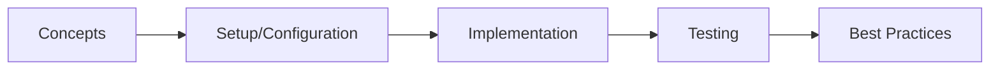

# Spring AI

> **Previous:** [R2DBC &amp; Reactive Data Access](./46-r2dbc.md) | **Next:** [GraphQL](./48-graphql.md)

## Learning Objectives

<!-- Image Gallery -->
<section class="lesson-visuals" aria-label="Visual learning resources">
  <header><span>VISUAL LEARNING</span><h2>See it. Review it. Remember it.</h2></header>
  <a class="lesson-visual-card" href="../../assets/images/lessons/java/47-spring-ai/handwritten-notes.png" target="_blank" rel="noopener">
    
    <span><strong>Handwritten notes</strong>Condensed notes for deliberate review.</span>
  </a>
  <a class="lesson-visual-card" href="../../assets/images/lessons/java/47-spring-ai/sticky-notes.png" target="_blank" rel="noopener">
    
    <span><strong>Sticky-note revision</strong>Fast recall prompts for revision.</span>
  </a>
  <a class="lesson-visual-card" href="../../assets/images/lessons/java/47-spring-ai/visual-explanation.png" target="_blank" rel="noopener">
    
    <span><strong>Visual concept guide</strong>A connected explanation of the key ideas.</span>
  </a>
</section>
<!-- End Image Gallery -->

## Chapter at a Glance

| Topic | Key Insight | Practical Takeaway |
|-------|-------------|--------------------|
| Core Concepts | Foundational understanding | Real-world application |
| Implementation | Code-first approach | Working examples |
| Best Practices | Production patterns | Avoid common pitfalls |

## Chapter Roadmap




By the end of this chapter, you will be able to:
- Configure Spring AI with OpenAI, Anthropic, and Ollama providers
- Use ChatClient for synchronous, streaming, and multi-turn conversations
- Implement structured output extraction using BeanOutputConverter
- Create and register tool callbacks with the @Tool annotation
- Configure and query vector stores (PGVector, Redis, Chroma)
- Build a complete RAG pipeline from document ingestion to LLM augmentation
- Use embedding models and Document APIs for vector search
- Design prompt templates for reusable AI interactions
- Orchestrate multi-agent workflows with supervisor and routing patterns
- Apply advisors for context-aware question answering and chat memory

---

## 1. Spring AI Overview

> **Pro Tip:** Test with production-like configurations → dev setups often hide issues that surface under real load.

> **Remember:** Start simple. Add complexity only when proven necessary. Premature abstraction creates maintenance burden.


Spring AI is a framework that brings AI capabilities to Spring Boot applications. It provides a consistent abstraction over LLM providers, vector databases, document processing, and RAG pipelines.

### 1.1 Maven Dependencies


```xml
<?xml version="1.0" encoding="UTF-8"?>
<project xmlns="http://maven.apache.org/POM/4.0.0"
         xmlns:xsi="http://www.w3.org/2001/XMLSchema-instance"
         xsi:schemaLocation="http://maven.apache.org/POM/4.0.0
         https://maven.apache.org/xsd/maven-4.0.0.xsd">
    <modelVersion>4.0.0</modelVersion>
    <parent>
        <groupId>org.springframework.boot</groupId>
        <artifactId>spring-boot-starter-parent</artifactId>
        <version>3.4.0</version>
        <relativePath/>
    </parent>
    <groupId>com.aiengineering</groupId>
    <artifactId>spring-ai-course</artifactId>
    <version>1.0.0</version>
    <name>spring-ai-course</name>

    <properties>
        <java.version>21</java.version>
        <spring-ai.version>1.0.0-M5</spring-ai.version>
    </properties>

    <dependencies>
        <dependency>
            <groupId>org.springframework.boot</groupId>
            <artifactId>spring-boot-starter-web</artifactId>
        </dependency>
        <dependency>
            <groupId>org.springframework.boot</groupId>
            <artifactId>spring-boot-starter-data-jpa</artifactId>
        </dependency>

        <dependency>
            <groupId>org.springframework.ai</groupId>
            <artifactId>spring-ai-openai-spring-boot-starter</artifactId>
        </dependency>
        <dependency>
            <groupId>org.springframework.ai</groupId>
            <artifactId>spring-ai-anthropic-spring-boot-starter</artifactId>
        </dependency>
        <dependency>
            <groupId>org.springframework.ai</groupId>
            <artifactId>spring-ai-ollama-spring-boot-starter</artifactId>
        </dependency>

        <dependency>
            <groupId>org.springframework.ai</groupId>
            <artifactId>spring-ai-pgvector-store-spring-boot-starter</artifactId>
        </dependency>
        <dependency>
            <groupId>org.springframework.ai</groupId>
            <artifactId>spring-ai-redis-store-spring-boot-starter</artifactId>
        </dependency>
        <dependency>
            <groupId>org.springframework.ai</groupId>
            <artifactId>spring-ai-chroma-store-spring-boot-starter</artifactId>
        </dependency>

        <dependency>
            <groupId>org.springframework.ai</groupId>
            <artifactId>spring-ai-tika-document-reader</artifactId>
        </dependency>
        <dependency>
            <groupId>org.springframework.ai</groupId>
            <artifactId>spring-ai-pdf-document-reader</artifactId>
        </dependency>

        <dependency>
            <groupId>org.postgresql</groupId>
            <artifactId>postgresql</artifactId>
        </dependency>
        <dependency>
            <groupId>com.h2database</groupId>
            <artifactId>h2</artifactId>
            <scope>runtime</scope>
        </dependency>

        <dependency>
            <groupId>org.springframework.boot</groupId>
            <artifactId>spring-boot-starter-test</artifactId>
            <scope>test</scope>
        </dependency>
    </dependencies>

    <dependencyManagement>
        <dependencies>
            <dependency>
                <groupId>org.springframework.ai</groupId>
                <artifactId>spring-ai-bom</artifactId>
                <version>${spring-ai.version}</version>
                <type>pom</type>
                <scope>import</scope>
            </dependency>
        </dependencies>
    </dependencyManagement>
</project>
```

### 1.2 Application Properties


```yaml
# src/main/resources/application.yml

> **Previous:** [R2DBC &amp; Reactive Data Access](./46-r2dbc.md) | **Next:** [GraphQL](./48-graphql.md)
spring:
  application:
    name: spring-ai-course

  ai:
    openai:
      api-key: ${OPENAI_API_KEY}
      chat:
        options:
          model: gpt-4o
          temperature: 0.7
          max-tokens: 2000
      embedding:
        options:
          model: text-embedding-3-small

    anthropic:
      api-key: ${ANTHROPIC_API_KEY}
      chat:
        options:
          model: claude-3-5-sonnet-20241022
          temperature: 0.5
          max-tokens: 4096

    ollama:
      base-url: http://localhost:11434
      chat:
        options:
          model: llama3.2
          temperature: 0.8
      embedding:
        options:
          model: nomic-embed-text

    vectorstore:
      pgvector:
        index-type: HNSW
        distance-type: COSINE_DISTANCE
        dimension: 1536

  datasource:
    url: jdbc:postgresql://localhost:5432/spring_ai
    username: postgres
    password: postgres
    driver-class-name: org.postgresql.Driver

  jpa:
    hibernate:
      ddl-auto: update
    show-sql: false
    properties:
      hibernate:
        format_sql: true

server:
  port: 8080
```

---

## 2. ChatClient → Prompt, Call, Stream, Messages

ChatClient is the central abstraction for interacting with LLMs. It supports synchronous calls, streaming responses, and multi-message conversations with system, user, and assistant message roles.

### 2.1 Basic ChatClient Configuration


```java
package com.aiengineering.course.config;

import org.springframework.ai.chat.client.ChatClient;
import org.springframework.context.annotation.Bean;
import org.springframework.context.annotation.Configuration;

@Configuration(proxyBeanMethods = false)
public class ChatClientConfig {

    @Bean
    ChatClient chatClient(ChatClient.Builder builder) {
        return builder
            .defaultSystem("You are a helpful Java programming assistant. " +
                "Provide concise, accurate answers with code examples when relevant.")
            .defaultOptions(ops -> ops
                .temperature(0.7)
                .maxTokens(2000))
            .build();
    }

    @Bean
    ChatClient creativeChatClient(ChatClient.Builder builder) {
        return builder
            .defaultSystem("You are a creative brainstorming partner. " +
                "Generate innovative and unexpected ideas.")
            .defaultOptions(ops -> ops
                .temperature(1.2)
                .maxTokens(3000))
            .build();
    }
}
```

### 2.2 ChatService → Sync, Stream, Multi-Turn


```java
package com.aiengineering.course.service;

import com.aiengineering.course.model.Conversation;
import com.aiengineering.course.repository.ConversationRepository;
import org.springframework.ai.chat.client.ChatClient;
import org.springframework.ai.chat.messages.AssistantMessage;
import org.springframework.ai.chat.messages.SystemMessage;
import org.springframework.ai.chat.messages.UserMessage;
import org.springframework.ai.chat.model.ChatResponse;
import org.springframework.ai.chat.prompt.Prompt;
import org.springframework.stereotype.Service;
import reactor.core.publisher.Flux;

import java.time.LocalDateTime;
import java.util.ArrayList;
import java.util.List;
import java.util.UUID;

@Service
public class ChatService {

    private final ChatClient chatClient;
    private final ChatClient creativeChatClient;
    private final ConversationRepository conversationRepository;

    public ChatService(
            ChatClient chatClient,
            ChatClient creativeChatClient,
            ConversationRepository conversationRepository) {
        this.chatClient = chatClient;
        this.creativeChatClient = creativeChatClient;
        this.conversationRepository = conversationRepository;
    }

    public String ask(String question) {
        return chatClient.prompt()
            .user(question)
            .call()
            .content();
    }

    public ChatResponse askWithResponse(String question) {
        return chatClient.prompt()
            .user(question)
            .call()
            .chatResponse();
    }

    public Flux<String> askStream(String question) {
        return chatClient.prompt()
            .user(question)
            .stream()
            .content();
    }

    public Flux<ChatResponse> askStreamWithMetadata(String question) {
        return chatClient.prompt()
            .user(question)
            .stream()
            .chatResponse();
    }

    public String askWithSystemContext(String question, String systemContext) {
        return chatClient.prompt()
            .system(spec -> spec.text(systemContext))
            .user(question)
            .call()
            .content();
    }

    public String askWithThinking(String question) {
        return chatClient.prompt()
            .user(question)
            .system("Think step by step before answering. Show your reasoning " +
                "in <thinking> tags, then provide the final answer.")
            .call()
            .content();
    }

    public String multiTurnConversation(List<String> messages) {
        var prompt = ChatClient.builder(chatClient.getChatModel()).build();

        var promptBuilder = prompt.prompt();

        for (int i = 0; i < messages.size(); i++) {
            if (i % 2 == 0) {
                promptBuilder.user(messages.get(i));
            } else {
                promptBuilder.assistant(messages.get(i));
            }
        }

        return promptBuilder.call().content();
    }

    public Conversation startConversation(String initialMessage) {
        Conversation conversation = new Conversation();
        conversation.setId(UUID.randomUUID().toString());
        conversation.setTitle(initialMessage.length() > 50
            ? initialMessage.substring(0, 50) + "..."
            : initialMessage);
        conversation.setCreatedAt(LocalDateTime.now());
        conversation.setMessages(new ArrayList<>());

        conversation.getMessages().add(new Conversation.Message("user", initialMessage));

        String response = ask(initialMessage);
        conversation.getMessages().add(new Conversation.Message("assistant", response));

        return conversationRepository.save(conversation);
    }

    public Conversation continueConversation(String conversationId, String message) {
        Conversation conversation = conversationRepository.findById(conversationId)
            .orElseThrow(() -> new IllegalArgumentException(
                "Conversation not found: " + conversationId));

        conversation.getMessages().add(new Conversation.Message("user", message));

        StringBuilder contextBuilder = new StringBuilder();
        contextBuilder.append("Continue the following conversation.\n\n");

        for (Conversation.Message msg : conversation.getMessages()) {
            contextBuilder.append(msg.getRole()).append(": ").append(msg.getContent()).append("\n");
        }

        String response = askWithSystemContext(
            message,
            contextBuilder.toString()
        );

        conversation.getMessages().add(new Conversation.Message("assistant", response));
        conversation.setUpdatedAt(LocalDateTime.now());

        return conversationRepository.save(conversation);
    }

    public String askWithParameters(String question, String tone, int maxLength) {
        return chatClient.prompt()
            .user(question)
            .system("Answer in a %s tone. Keep responses under %d characters.", tone, maxLength)
            .options(ops -> ops
                .temperature(tone.equals("creative") ? 1.0 : 0.3)
                .maxTokens(maxLength / 4))
            .call()
            .content();
    }
}
```

### 2.3 Conversation Model and Repository


```java
package com.aiengineering.course.model;

import jakarta.persistence.*;
import java.time.LocalDateTime;
import java.util.List;

@Entity
@Table(name = "conversations")
public class Conversation {

    @Id
    private String id;

    @Column(nullable = false)
    private String title;

    @Column(name = "created_at", nullable = false)
    private LocalDateTime createdAt;

    @Column(name = "updated_at")
    private LocalDateTime updatedAt;

    @OneToMany(cascade = CascadeType.ALL, orphanRemoval = true)
    @JoinColumn(name = "conversation_id")
    @OrderColumn(name = "message_order")
    private List<Message> messages;

    @Column(name = "model_used")
    private String modelUsed;

    @Column(name = "token_count")
    private int tokenCount;

    @Column(length = 1000)
    private String tags;

    public String getId() { return id; }
    public void setId(String id) { this.id = id; }
    public String getTitle() { return title; }
    public void setTitle(String title) { this.title = title; }
    public LocalDateTime getCreatedAt() { return createdAt; }
    public void setCreatedAt(LocalDateTime createdAt) { this.createdAt = createdAt; }
    public LocalDateTime getUpdatedAt() { return updatedAt; }
    public void setUpdatedAt(LocalDateTime updatedAt) { this.updatedAt = updatedAt; }
    public List<Message> getMessages() { return messages; }
    public void setMessages(List<Message> messages) { this.messages = messages; }
    public String getModelUsed() { return modelUsed; }
    public void setModelUsed(String modelUsed) { this.modelUsed = modelUsed; }
    public int getTokenCount() { return tokenCount; }
    public void setTokenCount(int tokenCount) { this.tokenCount = tokenCount; }
    public String getTags() { return tags; }
    public void setTags(String tags) { this.tags = tags; }

    @Entity
    @Table(name = "conversation_messages")
    public static class Message {

        @Id
        @GeneratedValue(strategy = GenerationType.IDENTITY)
        private Long id;

        @Column(nullable = false)
        private String role;

        @Column(nullable = false, length = 10000)
        private String content;

        @Column(name = "token_count")
        private int tokenCount;

        @Column(name = "created_at")
        private LocalDateTime createdAt;

        public Message() {}

        public Message(String role, String content) {
            this.role = role;
            this.content = content;
            this.createdAt = LocalDateTime.now();
        }

        public Long getId() { return id; }
        public void setId(Long id) { this.id = id; }
        public String getRole() { return role; }
        public void setRole(String role) { this.role = role; }
        public String getContent() { return content; }
        public void setContent(String content) { this.content = content; }
        public int getTokenCount() { return tokenCount; }
        public void setTokenCount(int tokenCount) { this.tokenCount = tokenCount; }
        public LocalDateTime getCreatedAt() { return createdAt; }
        public void setCreatedAt(LocalDateTime createdAt) { this.createdAt = createdAt; }
    }
}
```

```java
package com.aiengineering.course.repository;

import com.aiengineering.course.model.Conversation;
import org.springframework.data.jpa.repository.JpaRepository;
import org.springframework.data.jpa.repository.Query;
import org.springframework.data.repository.query.Param;
import org.springframework.stereotype.Repository;

import java.time.LocalDateTime;
import java.util.List;

@Repository
public interface ConversationRepository extends JpaRepository<Conversation, String> {

    List<Conversation> findByTitleContainingIgnoreCase(String title);

    List<Conversation> findByCreatedAtAfter(LocalDateTime after);

    @Query("SELECT c FROM Conversation c ORDER BY c.createdAt DESC")
    List<Conversation> findAllOrderByNewest();

    @Query("SELECT COUNT(c) FROM Conversation c WHERE c.createdAt >= :since")
    long countConversationsSince(@Param("since") LocalDateTime since);

    @Query("SELECT c FROM Conversation c WHERE SIZE(c.messages) >= :minMessages")
    List<Conversation> findByMinimumMessageCount(@Param("minMessages") int minMessages);
}
```

---

## 3. ChatModel Configuration

ChatModel is the lower-level abstraction for configuring model parameters, retry policies, and provider-specific options.

```java
package com.aiengineering.course.config;

import org.slf4j.Logger;
import org.slf4j.LoggerFactory;
import org.springframework.ai.chat.model.ChatModel;
import org.springframework.ai.model.Media;
import org.springframework.ai.model.function.FunctionCallback;
import org.springframework.ai.openai.OpenAiChatModel;
import org.springframework.ai.openai.OpenAiChatOptions;
import org.springframework.ai.openai.api.OpenAiApi;
import org.springframework.ai.retry.RetryUtils;
import org.springframework.beans.factory.annotation.Value;
import org.springframework.context.annotation.Bean;
import org.springframework.context.annotation.Configuration;
import org.springframework.retry.support.RetryTemplate;
import org.springframework.util.MimeType;

import java.time.Duration;
import java.util.List;
import java.util.Map;

@Configuration(proxyBeanMethods = false)
public class ChatModelConfig {

    private static final Logger log = LoggerFactory.getLogger(ChatModelConfig.class);

    @Value("${spring.ai.openai.api-key}")
    private String openAiApiKey;

    @Bean
    public OpenAiApi openAiApi() {
        return OpenAiApi.builder()
            .apiKey(openAiApiKey)
            .baseUrl("https://api.openai.com")
            .build();
    }

    @Bean
    public ChatModel customChatModel(OpenAiApi openAiApi) {
        var retryTemplate = RetryUtils.DEFAULT_RETRY_TEMPLATE;

        var options = OpenAiChatOptions.builder()
            .model("gpt-4o")
            .temperature(0.5)
            .maxTokens(4096)
            .frequencyPenalty(0.1)
            .presencePenalty(0.1)
            .topP(0.95)
            .stop(List.of("```end"))
            .user("spring-ai-course-user")
            .seed(42)
            .responseFormat(Map.of("type", "text"))
            .build();

        return OpenAiChatModel.builder()
            .openAiApi(openAiApi)
            .defaultOptions(options)
            .retryTemplate(retryTemplate)
            .build();
    }

    @Bean
    public ChatModel jsonChatModel(OpenAiApi openAiApi) {
        var options = OpenAiChatOptions.builder()
            .model("gpt-4o")
            .temperature(0.1)
            .maxTokens(4096)
            .responseFormat(Map.of("type", "json_object"))
            .build();

        return OpenAiChatModel.builder()
            .openAiApi(openAiApi)
            .defaultOptions(options)
            .build();
    }

    @Bean
    public RetryTemplate aiRetryTemplate() {
        return RetryUtils.builder()
            .initialInterval(Duration.ofSeconds(1))
            .maxInterval(Duration.ofSeconds(30))
            .maxAttempts(5)
            .backoffMultiplier(2.0)
            .build();
    }
}
```

### 3.1 Provider Factory


```java
package com.aiengineering.course.service;

import org.springframework.ai.chat.model.ChatModel;
import org.springframework.ai.anthropic.AnthropicChatModel;
import org.springframework.ai.ollama.OllamaChatModel;
import org.springframework.ai.openai.OpenAiChatModel;
import org.springframework.stereotype.Service;

import java.util.Map;

@Service
public class AiProviderService {

    private final Map<String, ChatModel> chatModels;

    public AiProviderService(
            OpenAiChatModel openAiChatModel,
            AnthropicChatModel anthropicChatModel,
            OllamaChatModel ollamaChatModel) {
        this.chatModels = Map.of(
            "openai", openAiChatModel,
            "anthropic", anthropicChatModel,
            "ollama", ollamaChatModel
        );
    }

    public String chat(String provider, String message) {
        ChatModel model = chatModels.get(provider);
        if (model == null) {
            throw new IllegalArgumentException("Unknown provider: " + provider
                + ". Available: " + chatModels.keySet());
        }
        return model.call(message).getResult().getOutput().getContent();
    }

    public String chatWithOptions(String provider, String message,
                                   double temperature, int maxTokens) {
        ChatModel model = chatModels.get(provider);
        if (model == null) {
            throw new IllegalArgumentException("Unknown provider: " + provider);
        }

        var response = model.call(new org.springframework.ai.chat.prompt.Prompt(
            message,
            org.springframework.ai.chat.prompt.ChatOptionsBuilder.builder()
                .withTemperature(temperature)
                .withMaxTokens(maxTokens)
                .build()
        ));

        return response.getResult().getOutput().getContent();
    }

    public Map<String, String> getAvailableProviders() {
        return Map.of(
            "openai", "GPT-4o",
            "anthropic", "Claude 3.5 Sonnet",
            "ollama", "Llama 3.2 (local)"
        );
    }
}
```

---

## 4. Structured Output with BeanOutputConverter

Extract structured data from LLM responses using type-safe Java objects.

```java
package com.aiengineering.course.model;

import java.time.LocalDateTime;
import java.util.List;

public record CodeReview(
    String fileName,
    int totalLines,
    int totalIssues,
    int criticalIssues,
    int majorIssues,
    int minorIssues,
    double overallScore,
    List<Issue> issues,
    String summary,
    LocalDateTime reviewedAt
) {
    public record Issue(
        int line,
        IssueSeverity severity,
        IssueCategory category,
        String message,
        String suggestion
    ) {}

    public enum IssueSeverity {
        CRITICAL, MAJOR, MINOR
    }

    public enum IssueCategory {
        SECURITY, PERFORMANCE, CODE_STYLE, BUG, DESIGN, TESTING
    }
}
```

```java
package com.aiengineering.course.model;

import java.util.List;

public record MeetingMinutes(
    String title,
    String date,
    List<String> attendees,
    List<String> absentees,
    List<AgendaItem> agenda,
    List<Decision> decisions,
    List<ActionItem> actionItems,
    String nextMeetingDate
) {
    public record AgendaItem(
        String topic,
        String presenter,
        String discussion,
        String outcome
    ) {}

    public record Decision(
        String description,
        String rationale,
        boolean unanimous
    ) {}

    public record ActionItem(
        String task,
        String assignee,
        String dueDate,
        String priority
    ) {}
}
```

```java
package com.aiengineering.course.service;

import com.aiengineering.course.model.CodeReview;
import com.aiengineering.course.model.MeetingMinutes;
import org.slf4j.Logger;
import org.slf4j.LoggerFactory;
import org.springframework.ai.chat.client.ChatClient;
import org.springframework.ai.converter.BeanOutputConverter;
import org.springframework.ai.converter.MapOutputConverter;
import org.springframework.ai.converter.ListOutputConverter;
import org.springframework.core.ParameterizedTypeReference;
import org.springframework.core.convert.support.DefaultConversionService;
import org.springframework.stereotype.Service;

import java.util.List;
import java.util.Map;

@Service
public class StructuredOutputService {

    private static final Logger log = LoggerFactory.getLogger(StructuredOutputService.class);

    private final ChatClient chatClient;

    public StructuredOutputService(ChatClient chatClient) {
        this.chatClient = chatClient;
    }

    public CodeReview reviewCode(String codeSnippet) {
        BeanOutputConverter<CodeReview> converter =
            new BeanOutputConverter<>(CodeReview.class);

        String response = chatClient.prompt()
            .user("Review this Java code and return structured results:\n\n" + codeSnippet)
            .system("You are an expert Java code reviewer. " +
                "Analyze the code for bugs, security issues, performance problems, " +
                "code style violations, and design issues.\n\n" +
                converter.getFormatInstruction())
            .call()
            .content();

        return converter.convert(response);
    }

    public MeetingMinutes extractMeetingMinutes(String transcript) {
        BeanOutputConverter<MeetingMinutes> converter =
            new BeanOutputConverter<>(MeetingMinutes.class);

        String response = chatClient.prompt()
            .user("Extract meeting minutes from this transcript:\n\n" + transcript)
            .system("Extract structured meeting minutes from the transcript.\n\n"
                + converter.getFormatInstruction())
            .call()
            .content();

        return converter.convert(response);
    }

    public List<String> extractKeywords(String text) {
        ListOutputConverter converter =
            new ListOutputConverter(DefaultConversionService.getSharedInstance());

        String response = chatClient.prompt()
            .user("Extract the top 10 keywords from this text:\n\n" + text)
            .system("Return a comma-separated list of keywords.\n\n"
                + converter.getFormatInstruction())
            .call()
            .content();

        return converter.convert(response);
    }

    public Map<String, Object> extractEntities(String text) {
        MapOutputConverter converter = new MapOutputConverter();

        String response = chatClient.prompt()
            .user("Extract all entities (people, organizations, locations, dates) " +
                "from this text:\n\n" + text)
            .system("Return entities as a JSON map with entity types as keys " +
                "and lists as values.\n\n" + converter.getFormatInstruction())
            .call()
            .content();

        return converter.convert(response);
    }

    public <T> T extractAs(String text, Class<T> type) {
        BeanOutputConverter<T> converter = new BeanOutputConverter<>(type);

        String response = chatClient.prompt()
            .user("Analyze and extract structured data:\n\n" + text)
            .system("Return your analysis in this format:\n\n"
                + converter.getFormatInstruction())
            .call()
            .content();

        return converter.convert(response);
    }

    public List<String> analyzeSentiment(String text) {
        var converter = new BeanOutputConverter<>(
            new ParameterizedTypeReference<List<String>>() {});

        String response = chatClient.prompt()
            .user("Analyze the sentiment of each paragraph:\n\n" + text)
            .system("Return a JSON array of sentiment labels " +
                "('positive', 'negative', 'neutral') per paragraph.\n\n"
                + converter.getFormatInstruction())
            .call()
            .content();

        return converter.convert(response);
    }
}
```

### 4.1 Generic Structured Output Controller


```java
package com.aiengineering.course.controller;

import com.aiengineering.course.model.CodeReview;
import com.aiengineering.course.model.MeetingMinutes;
import com.aiengineering.course.service.StructuredOutputService;
import org.springframework.http.ResponseEntity;
import org.springframework.web.bind.annotation.*;

import java.util.List;
import java.util.Map;

@RestController
@RequestMapping("/api/ai/extract")
public class StructuredOutputController {

    private final StructuredOutputService service;

    public StructuredOutputController(StructuredOutputService service) {
        this.service = service;
    }

    @PostMapping("/code-review")
    public ResponseEntity<CodeReview> reviewCode(@RequestBody String code) {
        CodeReview review = service.reviewCode(code);
        return ResponseEntity.ok(review);
    }

    @PostMapping("/meeting-minutes")
    public ResponseEntity<MeetingMinutes> extractMeetingMinutes(
            @RequestBody String transcript) {
        MeetingMinutes minutes = service.extractMeetingMinutes(transcript);
        return ResponseEntity.ok(minutes);
    }

    @PostMapping("/keywords")
    public ResponseEntity<List<String>> extractKeywords(@RequestBody String text) {
        List<String> keywords = service.extractKeywords(text);
        return ResponseEntity.ok(keywords);
    }

    @PostMapping("/entities")
    public ResponseEntity<Map<String, Object>> extractEntities(@RequestBody String text) {
        Map<String, Object> entities = service.extractEntities(text);
        return ResponseEntity.ok(entities);
    }

    @PostMapping("/sentiment")
    public ResponseEntity<List<String>> analyzeSentiment(@RequestBody String text) {
        List<String> sentiment = service.analyzeSentiment(text);
        return ResponseEntity.ok(sentiment);
    }
}
```

---

## 5. Tool Calling

Tools allow LLMs to call external functions. Spring AI provides the `@Tool` annotation for declarative tool registration.

### 5.1 Tool Definitions


```java
package com.aiengineering.course.tool;

import org.slf4j.Logger;
import org.slf4j.LoggerFactory;
import org.springframework.ai.tool.annotation.Tool;
import org.springframework.stereotype.Component;

import java.time.LocalDate;
import java.time.LocalDateTime;
import java.time.format.DateTimeFormatter;
import java.util.List;
import java.util.Map;

@Component
public class DateTimeTools {

    private static final Logger log = LoggerFactory.getLogger(DateTimeTools.class);

    @Tool(description = "Get the current date and time")
    public String getCurrentDateTime() {
        log.info("Tool called: getCurrentDateTime");
        return LocalDateTime.now().format(DateTimeFormatter.ISO_LOCAL_DATE_TIME);
    }

    @Tool(description = "Get the current date")
    public String getCurrentDate() {
        log.info("Tool called: getCurrentDate");
        return LocalDate.now().format(DateTimeFormatter.ISO_LOCAL_DATE);
    }

    @Tool(description = "Calculate the difference in days between two dates")
    public long daysBetween(String startDate, String endDate) {
        log.info("Tool called: daysBetween({}, {})", startDate, endDate);
        LocalDate start = LocalDate.parse(startDate);
        LocalDate end = LocalDate.parse(endDate);
        return java.time.temporal.ChronoUnit.DAYS.between(start, end);
    }

    @Tool(description = "Check if a given year is a leap year")
    public boolean isLeapYear(int year) {
        log.info("Tool called: isLeapYear({})", year);
        return java.time.Year.of(year).isLeap();
    }

    @Tool(description = "Get the day of the week for a date")
    public String getDayOfWeek(String date) {
        log.info("Tool called: getDayOfWeek({})", date);
        LocalDate parsed = LocalDate.parse(date);
        return parsed.getDayOfWeek().toString();
    }

    @Tool(description = "Add days to a date and return the new date")
    public String addDays(String date, long days) {
        log.info("Tool called: addDays({}, {})", date, days);
        LocalDate parsed = LocalDate.parse(date);
        return parsed.plusDays(days).format(DateTimeFormatter.ISO_LOCAL_DATE);
    }
}
```

```java
package com.aiengineering.course.tool;

import org.slf4j.Logger;
import org.slf4j.LoggerFactory;
import org.springframework.ai.tool.annotation.Tool;
import org.springframework.stereotype.Component;

import java.util.*;
import java.util.stream.Collectors;

@Component
public class MathTools {

    private static final Logger log = LoggerFactory.getLogger(MathTools.class);

    @Tool(description = "Calculate the nth Fibonacci number")
    public long fibonacci(int n) {
        log.info("Tool called: fibonacci({})", n);
        if (n <= 1) return n;
        long a = 0, b = 1;
        for (int i = 2; i <= n; i++) {
            long temp = a + b;
            a = b;
            b = temp;
        }
        return b;
    }

    @Tool(description = "Check if a number is prime")
    public boolean isPrime(int n) {
        log.info("Tool called: isPrime({})", n);
        if (n <= 1) return false;
        if (n <= 3) return true;
        if (n % 2 == 0 || n % 3 == 0) return false;
        for (int i = 5; i * i <= n; i += 6) {
            if (n % i == 0 || n % (i + 2) == 0) return false;
        }
        return true;
    }

    @Tool(description = "Calculate the greatest common divisor of two numbers")
    public int gcd(int a, int b) {
        log.info("Tool called: gcd({}, {})", a, b);
        while (b != 0) {
            int temp = b;
            b = a % b;
            a = temp;
        }
        return a;
    }

    @Tool(description = "Calculate the least common multiple of two numbers")
    public long lcm(int a, int b) {
        log.info("Tool called: lcm({}, {})", a, b);
        return (long) a * b / gcd(a, b);
    }
}
```

```java
package com.aiengineering.course.tool;

import org.slf4j.Logger;
import org.slf4j.LoggerFactory;
import org.springframework.ai.tool.annotation.Tool;
import org.springframework.stereotype.Component;

import java.util.*;
import java.util.stream.Collectors;

@Component
public class DataTools {

    private static final Logger log = LoggerFactory.getLogger(DataTools.class);

    private final Map<String, List<Map<String, Object>>> inMemoryDatabase = new HashMap<>();

    @Tool(description = "Store data records under a given collection name")
    public void storeData(String collection, String jsonData) {
        log.info("Tool called: storeData({})", collection);
        inMemoryDatabase.computeIfAbsent(collection, k -> new ArrayList<>());

        @SuppressWarnings("unchecked")
        Map<String, Object> record = parseJson(jsonData);
        inMemoryDatabase.get(collection).add(record);
    }

    @Tool(description = "Query stored data by collection and optional field filters")
    public List<Map<String, Object>> queryData(String collection, String fieldFilter) {
        log.info("Tool called: queryData({}, {})", collection, fieldFilter);
        List<Map<String, Object>> data = inMemoryDatabase.getOrDefault(collection, List.of());

        if (fieldFilter == null || fieldFilter.isBlank() || fieldFilter.equals("*")) {
            return data;
        }

        return data.stream()
            .filter(record -> matchesFilter(record, fieldFilter))
            .collect(Collectors.toList());
    }

    @Tool(description = "Get summary statistics for a collection")
    public Map<String, Object> getCollectionStats(String collection) {
        log.info("Tool called: getCollectionStats({})", collection);
        List<Map<String, Object>> data = inMemoryDatabase.getOrDefault(collection, List.of());

        return Map.of(
            "collection", collection,
            "recordCount", data.size(),
            "fields", data.stream()
                .flatMap(m -> m.keySet().stream())
                .distinct()
                .collect(Collectors.toList())
        );
    }

    @Tool(description = "Sort data in a collection by a field")
    public List<Map<String, Object>> sortData(String collection, String sortField,
                                               boolean ascending) {
        log.info("Tool called: sortData({}, {}, {})", collection, sortField, ascending);
        List<Map<String, Object>> data = new ArrayList<>(
            inMemoryDatabase.getOrDefault(collection, List.of()));

        data.sort((a, b) -> {
            Comparable<Object> valA = (Comparable<Object>) a.getOrDefault(sortField, "");
            Comparable<Object> valB = (Comparable<Object>) b.getOrDefault(sortField, "");
            int cmp = valA.compareTo(valB);
            return ascending ? cmp : -cmp;
        });

        return data;
    }

    @SuppressWarnings("unchecked")
    private Map<String, Object> parseJson(String json) {
        Map<String, Object> result = new HashMap<>();
        String inner = json.trim();
        if (inner.startsWith("{") && inner.endsWith("}")) {
            inner = inner.substring(1, inner.length() - 1).trim();
        }
        for (String pair : inner.split(",(?=(?:[^\"]*\"[^\"]*\")*[^\"]*$)")) {
            String[] kv = pair.split(":(?=(?:[^\"]*\"[^\"]*\")*[^\"]*$)", 2);
            if (kv.length == 2) {
                String key = kv[0].trim().replaceAll("^\"|\"$", "");
                String value = kv[1].trim().replaceAll("^\"|\"$", "");
                result.put(key, value);
            }
        }
        return result;
    }

    private boolean matchesFilter(Map<String, Object> record, String filter) {
        String[] parts = filter.split("=", 2);
        if (parts.length != 2) return true;
        String field = parts[0].trim();
        String value = parts[1].trim().replaceAll("^\"|\"$", "");
        return value.equals(String.valueOf(record.get(field)));
    }
}
```

### 5.2 Tool Execution Service


```java
package com.aiengineering.course.service;

import com.aiengineering.course.tool.DataTools;
import com.aiengineering.course.tool.DateTimeTools;
import com.aiengineering.course.tool.MathTools;
import org.slf4j.Logger;
import org.slf4j.LoggerFactory;
import org.springframework.ai.chat.client.ChatClient;
import org.springframework.stereotype.Service;

import java.util.List;
import java.util.Map;

@Service
public class ToolService {

    private static final Logger log = LoggerFactory.getLogger(ToolService.class);

    private final ChatClient chatClient;

    public ToolService(ChatClient chatClient) {
        this.chatClient = chatClient;
    }

    public String askWithDateTimeTools(String question) {
        return chatClient.prompt()
            .user(question)
            .tools(new DateTimeTools())
            .call()
            .content();
    }

    public String askWithMathTools(String question) {
        return chatClient.prompt()
            .user(question)
            .tools(new MathTools())
            .call()
            .content();
    }

    public String askWithAllTools(String question) {
        return chatClient.prompt()
            .user(question)
            .tools(new DateTimeTools(), new MathTools(), new DataTools())
            .call()
            .content();
    }

    public String askWithToolContext(String question, String toolContext) {
        return chatClient.prompt()
            .user(question)
            .system(toolContext)
            .tools(new DateTimeTools())
            .call()
            .content();
    }

    public String askWithToolAndStream(String question) {
        var response = chatClient.prompt()
            .user(question)
            .tools(new MathTools())
            .call()
            .content();
        return response;
    }

    public Map<String, Object> getToolExecutionPlan(String question) {
        String plan = chatClient.prompt()
            .user("Create an execution plan for this task. " +
                "List which tools to call and in what order:\n\n" + question)
            .tools(new DateTimeTools(), new MathTools(), new DataTools())
            .call()
            .content();

        return Map.of(
            "question", question,
            "plan", plan
        );
    }
}
```

### 5.3 Tool Controller


```java
package com.aiengineering.course.controller;

import com.aiengineering.course.service.ToolService;
import org.springframework.http.ResponseEntity;
import org.springframework.web.bind.annotation.*;

import java.util.Map;

@RestController
@RequestMapping("/api/ai/tools")
public class ToolController {

    private final ToolService toolService;

    public ToolController(ToolService toolService) {
        this.toolService = toolService;
    }

    @PostMapping("/ask")
    public ResponseEntity<Map<String, String>> askWithTools(@RequestBody Map<String, String> request) {
        String question = request.get("question");
        String toolSet = request.getOrDefault("tools", "all");

        String answer = switch (toolSet) {
            case "datetime" -> toolService.askWithDateTimeTools(question);
            case "math" -> toolService.askWithMathTools(question);
            case "all" -> toolService.askWithAllTools(question);
            default -> throw new IllegalArgumentException("Unknown tool set: " + toolSet);
        };

        return ResponseEntity.ok(Map.of("answer", answer));
    }

    @PostMapping("/plan")
    public ResponseEntity<Map<String, Object>> plan(@RequestBody Map<String, String> request) {
        String question = request.get("question");
        Map<String, Object> plan = toolService.getToolExecutionPlan(question);
        return ResponseEntity.ok(plan);
    }
}
```

---

## 6. Vector Stores

Vector stores enable semantic search by storing and querying embeddings. Spring AI supports PGVector, Redis, Chroma, and more.

### 6.1 Vector Store Configuration


```java
package com.aiengineering.course.config;

import org.springframework.ai.embedding.EmbeddingModel;
import org.springframework.ai.vectorstore.PgVectorStore;
import org.springframework.ai.vectorstore.RedisVectorStore;
import org.springframework.ai.vectorstore.VectorStore;
import org.springframework.ai.vectorstore.ChromaVectorStore;
import org.springframework.ai.vectorstore.filter.FilterExpressionConverter;
import org.springframework.ai.vectorstore.filter.converter.PgVectorFilterExpressionConverter;
import org.springframework.context.annotation.Bean;
import org.springframework.context.annotation.Configuration;
import org.springframework.context.annotation.Primary;
import org.springframework.jdbc.core.JdbcTemplate;

import javax.sql.DataSource;

@Configuration(proxyBeanMethods = false)
public class VectorStoreConfig {

    @Bean
    @Primary
    public PgVectorStore pgVectorStore(EmbeddingModel embeddingModel, JdbcTemplate jdbcTemplate) {
        return PgVectorStore.builder(jdbcTemplate, embeddingModel)
            .vectorTableName("knowledge_vectors")
            .schemaName("public")
            .indexType(PgVectorStore.PgIndexType.HNSW)
            .distanceType(PgVectorStore.PgDistanceType.COSINE_DISTANCE)
            .dimensions(1536)
            .maxDocumentBatchSize(100)
            .removeExistingVectorStoreTable(false)
            .initializeSchema(true)
            .build();
    }

    @Bean
    public VectorStore pgVectorStoreAlternative(EmbeddingModel embeddingModel,
                                                  DataSource dataSource) {
        JdbcTemplate jdbcTemplate = new JdbcTemplate(dataSource);
        return PgVectorStore.builder(jdbcTemplate, embeddingModel)
            .vectorTableName("documents")
            .dimensions(1536)
            .initializeSchema(true)
            .build();
    }

    @Bean
    public FilterExpressionConverter pgFilterConverter() {
        return new PgVectorFilterExpressionConverter();
    }
}
```

### 6.2 Vector Store Service


```java
package com.aiengineering.course.service;

import org.slf4j.Logger;
import org.slf4j.LoggerFactory;
import org.springframework.ai.document.Document;
import org.springframework.ai.vectorstore.SearchRequest;
import org.springframework.ai.vectorstore.VectorStore;
import org.springframework.ai.vectorstore.filter.FilterExpressionBuilder;
import org.springframework.stereotype.Service;

import java.util.HashMap;
import java.util.List;
import java.util.Map;
import java.util.stream.Collectors;

@Service
public class VectorStoreService {

    private static final Logger log = LoggerFactory.getLogger(VectorStoreService.class);

    private final VectorStore vectorStore;

    public VectorStoreService(VectorStore vectorStore) {
        this.vectorStore = vectorStore;
    }

    public void storeDocuments(List<Document> documents) {
        log.info("Storing {} documents in vector store", documents.size());
        vectorStore.add(documents);
    }

    public void storeDocument(String content, Map<String, Object> metadata) {
        Document document = new Document(content, metadata);
        vectorStore.add(List.of(document));
        log.info("Stored document with metadata: {}", metadata);
    }

    public void storeDocumentWithId(String id, String content, Map<String, Object> metadata) {
        Document document = new Document(id, content, metadata);
        vectorStore.add(List.of(document));
    }

    public List<Document> similaritySearch(String query, int topK) {
        SearchRequest request = SearchRequest.builder()
            .query(query)
            .topK(topK)
            .similarityThreshold(0.5)
            .build();

        return vectorStore.similaritySearch(request);
    }

    public List<Document> similaritySearchWithFilter(String query, int topK,
                                                      String filterExpression) {
        SearchRequest request = SearchRequest.builder()
            .query(query)
            .topK(topK)
            .similarityThreshold(0.6)
            .filterExpression(filterExpression)
            .build();

        return vectorStore.similaritySearch(request);
    }

    public List<Document> searchByMetadata(String query, int topK,
                                            String metadataKey, String metadataValue) {
        var builder = new FilterExpressionBuilder();
        var filter = builder.eq(metadataKey, metadataValue).build();

        SearchRequest request = SearchRequest.builder()
            .query(query)
            .topK(topK)
            .similarityThreshold(0.4)
            .filterExpression(filter)
            .build();

        return vectorStore.similaritySearch(request);
    }

    public List<Document> searchByCategory(String query, String category) {
        return searchByMetadata(query, 10, "category", category);
    }

    public void deleteDocument(String documentId) {
        vectorStore.delete(List.of(documentId));
        log.info("Deleted document: {}", documentId);
    }

    public void deleteDocuments(List<String> documentIds) {
        vectorStore.delete(documentIds);
        log.info("Deleted {} documents", documentIds.size());
    }

    public void updateDocument(String id, String newContent, Map<String, Object> metadata) {
        vectorStore.delete(List.of(id));
        Document updated = new Document(id, newContent, metadata);
        vectorStore.add(List.of(updated));
    }

    public Map<String, Object> getSearchStats() {
        return Map.of(
            "storeType", vectorStore.getClass().getSimpleName(),
            "status", "connected"
        );
    }
}
```

### 6.3 Vector Store Controller


```java
package com.aiengineering.course.controller;

import com.aiengineering.course.service.VectorStoreService;
import org.springframework.ai.document.Document;
import org.springframework.http.ResponseEntity;
import org.springframework.web.bind.annotation.*;

import java.util.List;
import java.util.Map;

@RestController
@RequestMapping("/api/ai/vectorstore")
public class VectorStoreController {

    private final VectorStoreService vectorStoreService;

    public VectorStoreController(VectorStoreService vectorStoreService) {
        this.vectorStoreService = vectorStoreService;
    }

    @PostMapping("/documents")
    public ResponseEntity<Void> storeDocument(@RequestBody Map<String, Object> request) {
        String content = (String) request.get("content");
        @SuppressWarnings("unchecked")
        Map<String, Object> metadata = (Map<String, Object>)
            request.getOrDefault("metadata", new java.util.HashMap<>());

        if (request.containsKey("id")) {
            vectorStoreService.storeDocumentWithId(
                (String) request.get("id"), content, metadata);
        } else {
            vectorStoreService.storeDocument(content, metadata);
        }

        return ResponseEntity.ok().build();
    }

    @GetMapping("/search")
    public ResponseEntity<List<Map<String, Object>>> search(
            @RequestParam String query,
            @RequestParam(defaultValue = "5") int topK) {

        List<Document> results = vectorStoreService.similaritySearch(query, topK);

        List<Map<String, Object>> response = results.stream()
            .map(doc -> Map.of(
                "id", doc.getId(),
                "content", doc.getText(),
                "metadata", doc.getMetadata(),
                "score", doc.getMetadata().getOrDefault("distance", 0.0)
            ))
            .toList();

        return ResponseEntity.ok(response);
    }

    @GetMapping("/search/filter")
    public ResponseEntity<List<Map<String, Object>>> searchWithFilter(
            @RequestParam String query,
            @RequestParam(defaultValue = "5") int topK,
            @RequestParam(defaultValue = "") String filter) {

        List<Document> results = vectorStoreService.similaritySearchWithFilter(
            query, topK, filter);

        List<Map<String, Object>> response = results.stream()
            .map(doc -> Map.of(
                "id", doc.getId(),
                "content", doc.getText(),
                "metadata", doc.getMetadata()
            ))
            .toList();

        return ResponseEntity.ok(response);
    }

    @DeleteMapping("/documents/{id}")
    public ResponseEntity<Void> deleteDocument(@PathVariable String id) {
        vectorStoreService.deleteDocument(id);
        return ResponseEntity.noContent().build();
    }
}
```

---

## 7. Embedding Models

Embedding models convert text into vector representations for semantic search and similarity computation.

```java
package com.aiengineering.course.service;

import org.slf4j.Logger;
import org.slf4j.LoggerFactory;
import org.springframework.ai.embedding.EmbeddingModel;
import org.springframework.ai.embedding.EmbeddingOptionsBuilder;
import org.springframework.ai.embedding.EmbeddingRequest;
import org.springframework.ai.embedding.EmbeddingResponse;
import org.springframework.ai.embedding.TokenCountBatchingStrategy;
import org.springframework.stereotype.Service;

import java.util.ArrayList;
import java.util.List;
import java.util.Map;
import java.util.stream.Collectors;

@Service
public class EmbeddingService {

    private static final Logger log = LoggerFactory.getLogger(EmbeddingService.class);

    private final EmbeddingModel embeddingModel;

    public EmbeddingService(EmbeddingModel embeddingModel) {
        this.embeddingModel = embeddingModel;
    }

    public float[] getEmbedding(String text) {
        log.info("Generating embedding for text of length: {}", text.length());
        List<float[]> embeddings = getEmbeddings(List.of(text));
        return embeddings.isEmpty() ? new float[0] : embeddings.getFirst();
    }

    public List<float[]> getEmbeddings(List<String> texts) {
        log.info("Generating embeddings for {} texts", texts.size());
        EmbeddingRequest request = new EmbeddingRequest(
            texts,
            EmbeddingOptionsBuilder.builder()
                .withModel("text-embedding-3-small")
                .build()
        );

        EmbeddingResponse response = embeddingModel.call(request);

        return response.getResults().stream()
            .map(result -> result.getOutput())
            .toList();
    }

    public List<float[]> getEmbeddingsBatched(List<String> texts, int batchSize) {
        log.info("Generating embeddings in batches of {}", batchSize);
        List<float[]> allEmbeddings = new ArrayList<>();

        for (int i = 0; i < texts.size(); i += batchSize) {
            int end = Math.min(i + batchSize, texts.size());
            List<String> batch = texts.subList(i, end);
            allEmbeddings.addAll(getEmbeddings(batch));
        }

        return allEmbeddings;
    }

    public double computeSimilarity(float[] embedding1, float[] embedding2) {
        double dotProduct = 0.0;
        double normA = 0.0;
        double normB = 0.0;

        for (int i = 0; i < embedding1.length; i++) {
            dotProduct += embedding1[i] * embedding2[i];
            normA += embedding1[i] * embedding1[i];
            normB += embedding2[i] * embedding2[i];
        }

        return dotProduct / (Math.sqrt(normA) * Math.sqrt(normB));
    }

    public List<Map<String, Object>> findMostSimilar(String query, List<String> candidates) {
        float[] queryEmbedding = getEmbedding(query);

        List<float[]> candidateEmbeddings = getEmbeddings(candidates);

        List<Map<String, Object>> results = new ArrayList<>();
        for (int i = 0; i < candidates.size(); i++) {
            double similarity = computeSimilarity(queryEmbedding, candidateEmbeddings.get(i));

            results.add(Map.of(
                "text", candidates.get(i).length() > 100
                    ? candidates.get(i).substring(0, 100) + "..."
                    : candidates.get(i),
                "similarity", similarity
            ));
        }

        results.sort((a, b) -> Double.compare(
            (Double) b.get("similarity"), (Double) a.get("similarity")));

        return results;
    }

    public int getEmbeddingDimension() {
        float[] test = getEmbedding("test");
        return test.length;
    }

    public Map<String, Object> getEmbeddingStats() {
        float[] test = getEmbedding("Spring AI embedding model test");
        return Map.of(
            "model", embeddingModel.getClass().getSimpleName(),
            "dimension", test.length,
            "sample", List.of(
                test[0], test[1], test[2], test[3], test[4]
            )
        );
    }
}
```

### 7.1 Embedding Controller


```java
package com.aiengineering.course.controller;

import com.aiengineering.course.service.EmbeddingService;
import org.springframework.http.ResponseEntity;
import org.springframework.web.bind.annotation.*;

import java.util.List;
import java.util.Map;

@RestController
@RequestMapping("/api/ai/embeddings")
public class EmbeddingController {

    private final EmbeddingService embeddingService;

    public EmbeddingController(EmbeddingService embeddingService) {
        this.embeddingService = embeddingService;
    }

    @PostMapping("/generate")
    public ResponseEntity<Map<String, Object>> generateEmbedding(@RequestBody Map<String, String> request) {
        String text = request.get("text");
        float[] embedding = embeddingService.getEmbedding(text);

        List<Float> embeddingList = new java.util.ArrayList<>();
        for (float v : embedding) {
            embeddingList.add(v);
        }

        return ResponseEntity.ok(Map.of(
            "dimension", embedding.length,
            "embedding", embeddingList.subList(0, Math.min(10, embedding.length)),
            "note", "Showing first 10 dimensions"
        ));
    }

    @PostMapping("/similarity")
    public ResponseEntity<List<Map<String, Object>>> computeSimilarity(
            @RequestBody Map<String, Object> request) {
        String query = (String) request.get("query");
        @SuppressWarnings("unchecked")
        List<String> candidates = (List<String>) request.get("candidates");

        List<Map<String, Object>> results = embeddingService.findMostSimilar(query, candidates);
        return ResponseEntity.ok(results);
    }

    @GetMapping("/stats")
    public ResponseEntity<Map<String, Object>> getStats() {
        return ResponseEntity.ok(embeddingService.getEmbeddingStats());
    }
}
```

---

## 8. Document APIs

Spring AI provides document processing APIs for reading, transforming, and writing documents.

```java
package com.aiengineering.course.service;

import org.slf4j.Logger;
import org.slf4j.LoggerFactory;
import org.springframework.ai.document.Document;
import org.springframework.ai.document.DocumentReader;
import org.springframework.ai.document.DocumentTransformer;
import org.springframework.ai.document.DocumentWriter;
import org.springframework.ai.reader.tika.TikaDocumentReader;
import org.springframework.ai.reader.pdf.PagePdfDocumentReader;
import org.springframework.ai.reader.pdf.config.PdfDocumentReaderConfig;
import org.springframework.ai.transformer.splitter.TokenTextSplitter;
import org.springframework.ai.transformer.splitter.TextSplitter;
import org.springframework.ai.transformer.splitter.ContentFormatTransformer;
import org.springframework.core.io.FileSystemResource;
import org.springframework.core.io.Resource;
import org.springframework.stereotype.Service;

import java.io.File;
import java.util.ArrayList;
import java.util.List;
import java.util.Map;

@Service
public class DocumentService {

    private static final Logger log = LoggerFactory.getLogger(DocumentService.class);

    public List<Document> readPdf(String filePath) {
        log.info("Reading PDF from: {}", filePath);
        Resource resource = new FileSystemResource(filePath);

        PdfDocumentReaderConfig config = PdfDocumentReaderConfig.builder()
            .pagesPerDocument(1)
            .pageTopMargin(0)
            .pageBottomMargin(0)
            .build();

        PagePdfDocumentReader reader = new PagePdfDocumentReader(resource, config);
        return reader.get();
    }

    public List<Document> readWithTika(String filePath) {
        log.info("Reading document with Tika from: {}", filePath);
        Resource resource = new FileSystemResource(filePath);
        TikaDocumentReader reader = new TikaDocumentReader(resource);
        return reader.get();
    }

    public List<Document> readWithTika(Resource resource) {
        log.info("Reading document with Tika from resource: {}", resource.getFilename());
        TikaDocumentReader reader = new TikaDocumentReader(resource);
        return reader.get();
    }

    public List<Document> readAndSplit(String filePath, int chunkSize, int overlap) {
        List<Document> documents;
        String lower = filePath.toLowerCase();

        if (lower.endsWith(".pdf")) {
            documents = readPdf(filePath);
        } else if (lower.endsWith(".txt") || lower.endsWith(".md")
            || lower.endsWith(".html") || lower.endsWith(".docx")) {
            documents = readWithTika(filePath);
        } else {
            throw new IllegalArgumentException("Unsupported file type: " + filePath);
        }

        TextSplitter splitter = new TokenTextSplitter(chunkSize, overlap, 5, 1000, true);
        return splitter.split(documents);
    }

    public List<Document> splitDocuments(List<Document> documents, int chunkSize, int overlap) {
        TextSplitter splitter = new TokenTextSplitter(chunkSize, overlap, 5, 1000, true);
        return splitter.split(documents);
    }

    public List<Document> splitByTokenCount(List<Document> documents, int maxTokens) {
        TokenTextSplitter splitter = new TokenTextSplitter(
            maxTokens, maxTokens / 5, 5, 1000, true);
        return splitter.split(documents);
    }

    public List<Document> addMetadata(List<Document> documents,
                                       Map<String, Object> metadata) {
        for (Document doc : documents) {
            doc.getMetadata().putAll(metadata);
        }
        return documents;
    }

    public List<Document> addSourceMetadata(List<Document> documents, String source) {
        return addMetadata(documents, Map.of(
            "source", source,
            "indexed_at", java.time.Instant.now().toString()
        ));
    }

    public List<Document> transformContentFormat(List<Document> documents,
                                                  String targetFormat) {
        ContentFormatTransformer transformer = new ContentFormatTransformer(targetFormat);
        return transformer.apply(documents);
    }

    public void writeDocuments(List<Document> documents, String outputPath) {
        log.info("Writing {} documents to: {}", documents.size(), outputPath);
        DocumentWriter writer = new JsonDocumentWriter(outputPath);
        writer.accept(documents);
    }

    public void writeDocumentsAsText(List<Document> documents, String outputPath) {
        log.info("Writing documents as text to: {}", outputPath);
        DocumentWriter writer = new TextDocumentWriter(outputPath);
        writer.accept(documents);
    }

    public void processDocumentPipeline(String inputPath, String outputPath) {
        List<Document> docs = readWithTika(inputPath);
        docs = addSourceMetadata(docs, inputPath);
        docs = splitByTokenCount(docs, 500);
        writeDocuments(docs, outputPath);
        log.info("Document processing pipeline complete: {} -> {}", inputPath, outputPath);
    }

    static class JsonDocumentWriter implements DocumentWriter {
        private final String outputPath;

        JsonDocumentWriter(String outputPath) {
            this.outputPath = outputPath;
        }

        @Override
        public void accept(List<Document> documents) {
            StringBuilder sb = new StringBuilder();
            sb.append("[\n");
            for (int i = 0; i < documents.size(); i++) {
                Document doc = documents.get(i);
                sb.append("  {\n");
                sb.append("    \"id\": \"").append(doc.getId()).append("\",\n");

                String text = doc.getText().replace("\"", "\\\"")
                    .replace("\n", "\\n").replace("\r", "\\r");
                sb.append("    \"content\": \"").append(text).append("\",\n");
                sb.append("    \"metadata\": {\n");

                var meta = doc.getMetadata();
                int count = 0;
                for (var entry : meta.entrySet()) {
                    count++;
                    sb.append("      \"").append(entry.getKey()).append("\": \"")
                        .append(entry.getValue()).append("\"");
                    if (count < meta.size()) sb.append(",");
                    sb.append("\n");
                }

                sb.append("    }\n");
                sb.append("  }");
                if (i < documents.size() - 1) sb.append(",");
                sb.append("\n");
            }
            sb.append("]");

            try {
                java.nio.file.Files.writeString(
                    java.nio.file.Path.of(outputPath), sb.toString());
            } catch (Exception e) {
                throw new RuntimeException("Failed to write JSON documents", e);
            }
        }
    }

    static class TextDocumentWriter implements DocumentWriter {
        private final String outputPath;

        TextDocumentWriter(String outputPath) {
            this.outputPath = outputPath;
        }

        @Override
        public void accept(List<Document> documents) {
            StringBuilder sb = new StringBuilder();
            for (int i = 0; i < documents.size(); i++) {
                Document doc = documents.get(i);
                sb.append("=== Document ").append(i + 1).append(" ===\n");
                sb.append("ID: ").append(doc.getId()).append("\n");
                sb.append("Metadata: ").append(doc.getMetadata()).append("\n\n");
                sb.append(doc.getText()).append("\n\n");
            }

            try {
                java.nio.file.Files.writeString(
                    java.nio.file.Path.of(outputPath), sb.toString());
            } catch (Exception e) {
                throw new RuntimeException("Failed to write text documents", e);
            }
        }
    }
}
```

---

## 9. RAG Pipeline

Retrieval-Augmented Generation combines document retrieval with LLM generation for accurate, context-aware answers.

```java
package com.aiengineering.course.service;

import org.slf4j.Logger;
import org.slf4j.LoggerFactory;
import org.springframework.ai.chat.client.ChatClient;
import org.springframework.ai.document.Document;
import org.springframework.ai.vectorstore.SearchRequest;
import org.springframework.ai.vectorstore.VectorStore;
import org.springframework.stereotype.Service;

import java.util.List;
import java.util.Map;
import java.util.stream.Collectors;

@Service
public class RagPipelineService {

    private static final Logger log = LoggerFactory.getLogger(RagPipelineService.class);

    private final ChatClient chatClient;
    private final VectorStore vectorStore;
    private final VectorStoreService vectorStoreService;
    private final DocumentService documentService;

    public RagPipelineService(
            ChatClient chatClient,
            VectorStore vectorStore,
            VectorStoreService vectorStoreService,
            DocumentService documentService) {
        this.chatClient = chatClient;
        this.vectorStore = vectorStore;
        this.vectorStoreService = vectorStoreService;
        this.documentService = documentService;
    }

    public String answer(String question) {
        log.info("RAG query: {}", question);

        List<Document> relevantDocs = vectorStoreService.similaritySearch(question, 5);

        String context = relevantDocs.stream()
            .map(Document::getText)
            .collect(Collectors.joining("\n\n---\n\n"));

        return chatClient.prompt()
            .user(question)
            .system("You are a knowledgeable assistant. Answer the question based on " +
                "the provided context. If the context does not contain enough information, " +
                "say so clearly.\n\nContext:\n%s", context)
            .call()
            .content();
    }

    public String answerWithSources(String question) {
        List<Document> relevantDocs = vectorStoreService.similaritySearch(question, 5);

        String context = relevantDocs.stream()
            .map(doc -> "Source (" + doc.getMetadata().getOrDefault("source", "unknown")
                + "): " + doc.getText())
            .collect(Collectors.joining("\n\n"));

        String answer = chatClient.prompt()
            .user(question)
            .system("Answer using only the provided context. Cite sources when possible.\n\n"
                + "Context:\n%s", context)
            .call()
            .content();

        var sourceNames = relevantDocs.stream()
            .map(doc -> doc.getMetadata().getOrDefault("source", "unknown").toString())
            .distinct()
            .toList();

        return answer + "\n\n**Sources:** " + String.join(", ", sourceNames);
    }

    public String answerWithScore(String question, double minScore) {
        SearchRequest request = SearchRequest.builder()
            .query(question)
            .topK(10)
            .similarityThreshold(minScore)
            .build();

        List<Document> relevantDocs = vectorStore.similaritySearch(request);

        if (relevantDocs.isEmpty()) {
            return "I couldn't find any relevant information in the knowledge base "
                + "with sufficient confidence (threshold: " + minScore + ").";
        }

        String context = relevantDocs.stream()
            .map(Document::getText)
            .collect(Collectors.joining("\n\n---\n\n"));

        return chatClient.prompt()
            .user(question)
            .system("Answer the question using the provided context. " +
                "If the context is insufficient, say so.\n\nContext:\n%s", context)
            .call()
            .content();
    }

    public Map<String, Object> answerWithMetadata(String question) {
        long startTime = System.currentTimeMillis();

        List<Document> relevantDocs = vectorStoreService.similaritySearch(question, 3);
        String context = relevantDocs.stream()
            .map(Document::getText)
            .collect(Collectors.joining("\n\n"));

        String answer = chatClient.prompt()
            .user(question)
            .system("Answer concisely using the context.\n\nContext:\n%s", context)
            .call()
            .content();

        long duration = System.currentTimeMillis() - startTime;

        return Map.of(
            "question", question,
            "answer", answer,
            "documentsRetrieved", relevantDocs.size(),
            "durationMs", duration,
            "sources", relevantDocs.stream()
                .map(doc -> doc.getMetadata().toString())
                .toList()
        );
    }

    public String ingestDocument(String filePath, String category) {
        log.info("Ingesting document: {} (category: {})", filePath, category);

        List<Document> documents = switch (filePath) {
            case String s when s.endsWith(".pdf") ->
                documentService.readAndSplit(filePath, 500, 50);
            case String s when s.endsWith(".txt") || s.endsWith(".md") ->
                documentService.readAndSplit(filePath, 500, 50);
            default ->
                documentService.readAndSplit(filePath, 500, 50);
        };

        int originalCount = documents.size();
        documents = documentService.addMetadata(documents,
            Map.of("category", category, "source", filePath));

        vectorStoreService.storeDocuments(documents);

        return String.format("Ingested %d chunks from %s into category '%s'",
            originalCount, filePath, category);
    }

    public String ingestText(String text, String category, String source) {
        Document doc = new Document(text, Map.of(
            "category", category,
            "source", source,
            "ingested_at", java.time.Instant.now().toString()
        ));

        List<Document> split = documentService.splitByTokenCount(List.of(doc), 500);
        vectorStoreService.storeDocuments(split);

        return String.format("Ingested %d chunks from text (category: %s)",
            split.size(), category);
    }
}
```

### 9.1 RAG Controller


```java
package com.aiengineering.course.controller;

import com.aiengineering.course.service.RagPipelineService;
import org.springframework.http.ResponseEntity;
import org.springframework.web.bind.annotation.*;

import java.util.Map;

@RestController
@RequestMapping("/api/ai/rag")
public class RagController {

    private final RagPipelineService ragService;

    public RagController(RagPipelineService ragService) {
        this.ragService = ragService;
    }

    @PostMapping("/ask")
    public ResponseEntity<Map<String, String>> ask(@RequestBody Map<String, String> request) {
        String question = request.get("question");
        String answer = ragService.answer(question);
        return ResponseEntity.ok(Map.of("answer", answer));
    }

    @PostMapping("/ask/sources")
    public ResponseEntity<Map<String, String>> askWithSources(
            @RequestBody Map<String, String> request) {
        String question = request.get("question");
        String answer = ragService.answerWithSources(question);
        return ResponseEntity.ok(Map.of("answer", answer));
    }

    @PostMapping("/ask/details")
    public ResponseEntity<Map<String, Object>> askWithDetails(
            @RequestBody Map<String, String> request) {
        String question = request.get("question");
        Map<String, Object> result = ragService.answerWithMetadata(question);
        return ResponseEntity.ok(result);
    }

    @PostMapping("/ingest/file")
    public ResponseEntity<Map<String, String>> ingestFile(
            @RequestBody Map<String, String> request) {
        String filePath = request.get("filePath");
        String category = request.getOrDefault("category", "general");
        String result = ragService.ingestDocument(filePath, category);
        return ResponseEntity.ok(Map.of("message", result));
    }

    @PostMapping("/ingest/text")
    public ResponseEntity<Map<String, String>> ingestText(
            @RequestBody Map<String, String> request) {
        String text = request.get("text");
        String category = request.getOrDefault("category", "general");
        String source = request.getOrDefault("source", "manual");
        String result = ragService.ingestText(text, category, source);
        return ResponseEntity.ok(Map.of("message", result));
    }
}
```

---

## 10. Prompt Templates

Spring AI supports reusable prompt templates with variable substitution.

```java
package com.aiengineering.course.service;

import org.slf4j.Logger;
import org.slf4j.LoggerFactory;
import org.springframework.ai.chat.client.ChatClient;
import org.springframework.ai.chat.prompt.PromptTemplate;
import org.springframework.ai.chat.prompt.PromptTemplateBuilder;
import org.springframework.ai.chat.messages.Message;
import org.springframework.ai.chat.messages.SystemMessage;
import org.springframework.stereotype.Service;

import java.util.List;
import java.util.Map;

@Service
public class PromptTemplateService {

    private static final Logger log = LoggerFactory.getLogger(PromptTemplateService.class);

    private final ChatClient chatClient;

    public PromptTemplateService(ChatClient chatClient) {
        this.chatClient = chatClient;
    }

    public String codeReviewPrompt(String code, String language) {
        PromptTemplate template = new PromptTemplate("""
            Act as an expert {language} code reviewer.
            
            Review the following code for:
            1. Bugs and logic errors
            2. Security vulnerabilities
            3. Performance issues
            4. Code style violations
            5. Test coverage gaps
            
            Code to review:
            ```{language}
            {code}
            ```
            
            Provide a severity rating (CRITICAL, MAJOR, MINOR) for each issue found.
            """);

        Message message = template.createMessage(Map.of(
            "language", language,
            "code", code
        ));

        return chatClient.prompt().messages(List.of(message)).call().content();
    }

    public String generateTestCases(String className, String methodSignatures) {
        String templateText = """
            Generate comprehensive JUnit 5 test cases for the following Java class.
            
            Class: {className}
            
            Methods to test:
            {methodSignatures}
            
            For each method, provide:
            1. Happy path test case
            2. Edge case tests (null inputs, empty values, boundary conditions)
            3. Exception/error case tests
            
            Use Mockito for mocking dependencies.
            Use AssertJ for fluent assertions.
            """;

        PromptTemplate template = new PromptTemplate(templateText);
        Message message = template.createMessage(Map.of(
            "className", className,
            "methodSignatures", methodSignatures
        ));

        return chatClient.prompt().messages(List.of(message)).call().content();
    }

    public String explainCode(String code, String audience) {
        String templateText = """
            Explain the following code to a {audience}.
            
            ```java
            {code}
            ```
            
            Structure your explanation:
            1. What this code does (high-level purpose)
            2. How it works (step by step)
            3. Key design decisions
            4. Potential improvements
            
            Adjust technical depth for a {audience} audience.
            """;

        PromptTemplate template = new PromptTemplate(templateText);
        return chatClient.prompt()
            .user(u -> u.text(templateText)
                .param("code", code)
                .param("audience", audience))
            .call()
            .content();
    }

    public String generateSpringBootEndpoint(String entityName, String fields) {
        String templateText = """
            Generate a complete Spring Boot REST controller for the {entityName} entity.
            
            Entity fields:
            {fields}
            
            Include:
            1. CRUD endpoints (POST, GET, PUT, DELETE)
            2. Request/Response DTOs
            3. Validation annotations
            4. Pagination support
            5. Error handling
            6. OpenAPI/Swagger documentation
            
            Use Spring Data JPA and follow REST best practices.
            """;

        return chatClient.prompt()
            .user(u -> u.text(templateText)
                .param("entityName", entityName)
                .param("fields", fields))
            .call()
            .content();
    }

    public String multiTemplatePrompt(String concept, String level) {
        var systemTemplate = new PromptTemplate("""
            You are a {level} Java programming tutor.
            
            Teaching style:
            - Use analogies and real-world examples
            - Provide runnable code snippets
            - Ask comprehension questions
            - Suggest practice exercises
            
            Difficulty level: {level}
            """);

        var userTemplate = new PromptTemplate("""
            Teach me about {concept} in Java.
            
            Cover:
            1. What is {concept} and why is it useful
            2. Core concepts and terminology
            3. Code examples with explanation
            4. Common pitfalls
            5. Practice exercise
            """);

        SystemMessage systemMessage = (SystemMessage) systemTemplate.createMessage(
            Map.of("level", level));

        Message userMessage = userTemplate.createMessage(Map.of("concept", concept));

        return chatClient.prompt()
            .messages(List.of(systemMessage, userMessage))
            .call()
            .content();
    }

    public String templateFromResource(String templateName, Map<String, Object> params) {
        PromptTemplate template = new PromptTemplate("classpath:/prompts/" + templateName);
        Message message = template.createMessage(params);

        return chatClient.prompt()
            .messages(List.of(message))
            .call()
            .content();
    }
}
```

### 10.1 Prompt Template Controller


```java
package com.aiengineering.course.controller;

import com.aiengineering.course.service.PromptTemplateService;
import org.springframework.http.ResponseEntity;
import org.springframework.web.bind.annotation.*;

import java.util.Map;

@RestController
@RequestMapping("/api/ai/prompts")
public class PromptTemplateController {

    private final PromptTemplateService promptTemplateService;

    public PromptTemplateController(PromptTemplateService promptTemplateService) {
        this.promptTemplateService = promptTemplateService;
    }

    @PostMapping("/code-review")
    public ResponseEntity<Map<String, String>> codeReview(@RequestBody Map<String, String> request) {
        String result = promptTemplateService.codeReviewPrompt(
            request.get("code"), request.getOrDefault("language", "Java"));
        return ResponseEntity.ok(Map.of("result", result));
    }

    @PostMapping("/generate-tests")
    public ResponseEntity<Map<String, String>> generateTests(
            @RequestBody Map<String, String> request) {
        String result = promptTemplateService.generateTestCases(
            request.get("className"), request.get("methodSignatures"));
        return ResponseEntity.ok(Map.of("result", result));
    }

    @PostMapping("/explain")
    public ResponseEntity<Map<String, String>> explainCode(
            @RequestBody Map<String, String> request) {
        String result = promptTemplateService.explainCode(
            request.get("code"), request.getOrDefault("audience", "beginner"));
        return ResponseEntity.ok(Map.of("result", result));
    }
}
```

---

## 11. Multi-Agent Orchestration

Coordinate multiple AI agents with a supervisor pattern and routing logic.

```java
package com.aiengineering.course.service.agent;

import com.aiengineering.course.service.ChatService;
import org.slf4j.Logger;
import org.slf4j.LoggerFactory;
import org.springframework.stereotype.Service;

import java.util.*;
import java.util.regex.Pattern;
import java.util.stream.Collectors;

@Service
public class AgentSupervisor {

    private static final Logger log = LoggerFactory.getLogger(AgentSupervisor.class);

    private final ChatService chatService;
    private final Map<String, Agent> agents;

    public AgentSupervisor(ChatService chatService, List<Agent> agentList) {
        this.chatService = chatService;
        this.agents = agentList.stream()
            .collect(Collectors.toMap(Agent::getName, a -> a));
    }

    public Map<String, Object> processRequest(String userRequest) {
        log.info("Supervisor processing: {}", userRequest);

        String routingDecision = chatService.askWithSystemContext(
            userRequest,
            "You are an AI agent router. Available agents:\n" +
            agents.values().stream()
                .map(a -> "- " + a.getName() + ": " + a.getDescription())
                .collect(Collectors.joining("\n")) +
            "\n\nRespond with ONLY the agent name that should handle this request. " +
            "If multiple agents are needed, respond with their names separated by commas. " +
            "If no agent is appropriate, respond with 'UNKNOWN'."
        );

        List<String> agentNames = Arrays.stream(routingDecision.split(","))
            .map(String::trim)
            .filter(name -> agents.containsKey(name) || name.equals("UNKNOWN"))
            .toList();

        if (agentNames.isEmpty() || agentNames.contains("UNKNOWN")) {
            return Map.of(
                "request", userRequest,
                "routingDecision", routingDecision,
                "assignedAgents", List.of(),
                "responses", Map.of(),
                "summary", "Unable to route request to any agent. " +
                    "Falling back to general assistant.",
                "finalResponse", chatService.ask(userRequest)
            );
        }

        Map<String, String> responses = new LinkedHashMap<>();
        for (String agentName : agentNames) {
            Agent agent = agents.get(agentName);
            try {
                String response = agent.execute(userRequest);
                responses.put(agentName, response);
            } catch (Exception e) {
                log.error("Agent {} failed: {}", agentName, e.getMessage());
                responses.put(agentName, "ERROR: " + e.getMessage());
            }
        }

        String summary = chatService.askWithSystemContext(
            userRequest,
            "Synthesize the following agent responses into a coherent answer:\n\n" +
            responses.entrySet().stream()
                .map(e -> "[" + e.getKey() + "]: " + e.getValue())
                .collect(Collectors.joining("\n\n"))
        );

        return Map.of(
            "request", userRequest,
            "routingDecision", routingDecision,
            "assignedAgents", agentNames,
            "responses", responses,
            "summary", summary,
            "finalResponse", responses.values().iterator().next()
        );
    }

    public Map<String, Object> getAgentStatus() {
        Map<String, Object> statuses = new LinkedHashMap<>();
        for (Agent agent : agents.values()) {
            statuses.put(agent.getName(), Map.of(
                "description", agent.getDescription(),
                "capabilities", agent.getCapabilities(),
                "status", "ready"
            ));
        }
        return statuses;
    }
}
```

```java
package com.aiengineering.course.service.agent;

import java.util.List;

public interface Agent {
    String getName();
    String getDescription();
    List<String> getCapabilities();
    String execute(String input);
}
```

```java
package com.aiengineering.course.service.agent;

import com.aiengineering.course.service.ChatService;
import org.slf4j.Logger;
import org.slf4j.LoggerFactory;
import org.springframework.stereotype.Component;

import java.util.List;

@Component
public class CodeAgent implements Agent {

    private static final Logger log = LoggerFactory.getLogger(CodeAgent.class);

    private final ChatService chatService;

    public CodeAgent(ChatService chatService) {
        this.chatService = chatService;
    }

    @Override
    public String getName() {
        return "CodeAgent";
    }

    @Override
    public String getDescription() {
        return "Expert Java developer. Writes, reviews, and debugs code. " +
            "Handles Spring Boot, REST APIs, JPA, and testing.";
    }

    @Override
    public List<String> getCapabilities() {
        return List.of(
            "Write production-quality Java code",
            "Code review and refactoring",
            "Debugging and error resolution",
            "Spring Boot application development",
            "Unit and integration testing",
            "Performance optimization"
        );
    }

    @Override
    public String execute(String input) {
        log.info("CodeAgent executing: {}", input);
        return chatService.askWithSystemContext(input,
            "You are CodeAgent, an expert Java and Spring Boot developer. " +
            "Write clean, production-quality code with proper error handling. " +
            "Follow SOLID principles and best practices. " +
            "Include imports, annotations, and proper package structure.");
    }
}
```

```java
package com.aiengineering.course.service.agent;

import com.aiengineering.course.service.ChatService;
import org.slf4j.Logger;
import org.slf4j.LoggerFactory;
import org.springframework.stereotype.Component;

import java.util.List;

@Component
public class DatabaseAgent implements Agent {

    private static final Logger log = LoggerFactory.getLogger(DatabaseAgent.class);

    private final ChatService chatService;

    public DatabaseAgent(ChatService chatService) {
        this.chatService = chatService;
    }

    @Override
    public String getName() {
        return "DatabaseAgent";
    }

    @Override
    public String getDescription() {
        return "Database expert specializing in SQL, JPA, Hibernate, " +
            "schema design, and query optimization.";
    }

    @Override
    public List<String> getCapabilities() {
        return List.of(
            "SQL query writing and optimization",
            "Database schema design and normalization",
            "JPA entity and repository design",
            "Hibernate performance tuning",
            "Migration and indexing strategies",
            "Database security best practices"
        );
    }

    @Override
    public String execute(String input) {
        log.info("DatabaseAgent executing: {}", input);
        return chatService.askWithSystemContext(input,
            "You are DatabaseAgent, an expert in database design and JPA. " +
            "Provide optimized SQL queries, proper indexing strategies, " +
            "and efficient JPA mappings. Include explain plans where relevant.");
    }
}
```

```java
package com.aiengineering.course.service.agent;

import com.aiengineering.course.service.ChatService;
import org.slf4j.Logger;
import org.slf4j.LoggerFactory;
import org.springframework.stereotype.Component;

import java.util.List;

@Component
public class SecurityAgent implements Agent {

    private static final Logger log = LoggerFactory.getLogger(SecurityAgent.class);

    private final ChatService chatService;

    public SecurityAgent(ChatService chatService) {
        this.chatService = chatService;
    }

    @Override
    public String getName() {
        return "SecurityAgent";
    }

    @Override
    public String getDescription() {
        return "Security specialist focusing on OWASP Top 10, " +
            "authentication, authorization, and secure coding.";
    }

    @Override
    public List<String> getCapabilities() {
        return List.of(
            "OWASP Top 10 vulnerability assessment",
            "Spring Security configuration",
            "Authentication and authorization design",
            "Secure coding practices",
            "API security (JWT, OAuth2, API keys)",
            "Security audit and penetration testing advice"
        );
    }

    @Override
    public String execute(String input) {
        log.info("SecurityAgent executing: {}", input);
        return chatService.askWithSystemContext(input,
            "You are SecurityAgent, a security expert. " +
            "Identify vulnerabilities and provide secure solutions. " +
            "Reference OWASP guidelines and Spring Security best practices. " +
            "Always prioritize security over convenience.");
    }
}
```

```java
package com.aiengineering.course.service.agent;

import com.aiengineering.course.service.ChatService;
import org.springframework.stereotype.Component;

import java.util.List;

@Component
public class TestingAgent implements Agent {

    private final ChatService chatService;

    public TestingAgent(ChatService chatService) {
        this.chatService = chatService;
    }

    @Override
    public String getName() {
        return "TestingAgent";
    }

    @Override
    public String getDescription() {
        return "Testing specialist for JUnit 5, Mockito, integration tests, " +
            "and test-driven development.";
    }

    @Override
    public List<String> getCapabilities() {
        return List.of(
            "JUnit 5 test writing",
            "Mockito mocking and verification",
            "Integration test setup",
            "Test-driven development",
            "Code coverage analysis",
            "Performance and load testing"
        );
    }

    @Override
    public String execute(String input) {
        return chatService.askWithSystemContext(input,
            "You are TestingAgent, a testing expert. " +
            "Write comprehensive tests using JUnit 5 and Mockito. " +
            "Cover edge cases, error scenarios, and happy paths. " +
            "Use AssertJ for fluent assertions. " +
            "Follow the Given-When-Then pattern.");
    }
}
```

```java
package com.aiengineering.course.service.agent;

import com.aiengineering.course.service.ChatService;
import org.springframework.stereotype.Component;

import java.util.List;

@Component
public class ArchitectureAgent implements Agent {

    private final ChatService chatService;

    public ArchitectureAgent(ChatService chatService) {
        this.chatService = chatService;
    }

    @Override
    public String getName() {
        return "ArchitectureAgent";
    }

    @Override
    public String getDescription() {
        return "Software architect for microservices, event-driven systems, " +
            "and enterprise application design.";
    }

    @Override
    public List<String> getCapabilities() {
        return List.of(
            "Microservices architecture design",
            "Event-driven system design",
            "CQRS and event sourcing",
            "API design and contract-first development",
            "System scalability and resilience",
            "Technology stack evaluation"
        );
    }

    @Override
    public String execute(String input) {
        return chatService.askWithSystemContext(input,
            "You are ArchitectureAgent, a software architect. " +
            "Design scalable, maintainable systems. " +
            "Consider trade-offs between different architectural patterns. " +
            "Include diagrams descriptions, component interactions, " +
            "and technology recommendations with rationale.");
    }
}
```

### 11.1 Agent Controller


```java
package com.aiengineering.course.controller;

import com.aiengineering.course.service.agent.AgentSupervisor;
import org.springframework.http.ResponseEntity;
import org.springframework.web.bind.annotation.*;

import java.util.Map;

@RestController
@RequestMapping("/api/ai/agents")
public class AgentController {

    private final AgentSupervisor supervisor;

    public AgentController(AgentSupervisor supervisor) {
        this.supervisor = supervisor;
    }

    @PostMapping("/process")
    public ResponseEntity<Map<String, Object>> processRequest(
            @RequestBody Map<String, String> request) {
        String userRequest = request.get("request");
        Map<String, Object> result = supervisor.processRequest(userRequest);
        return ResponseEntity.ok(result);
    }

    @GetMapping("/status")
    public ResponseEntity<Map<String, Object>> getAgentStatus() {
        return ResponseEntity.ok(supervisor.getAgentStatus());
    }
}
```

---

## 12. Advisors

Advisors provide cross-cutting concerns like context injection, question-answering augmentation, and chat memory.

```java
package com.aiengineering.course.config;

import org.springframework.ai.chat.client.advisor.QuestionAnswerAdvisor;
import org.springframework.ai.chat.client.advisor.VectorStoreChatMemoryAdvisor;
import org.springframework.ai.chat.client.advisor.SimpleLoggerAdvisor;
import org.springframework.ai.vectorstore.VectorStore;
import org.springframework.context.annotation.Bean;
import org.springframework.context.annotation.Configuration;

@Configuration(proxyBeanMethods = false)
public class AdvisorConfig {

    @Bean
    public QuestionAnswerAdvisor questionAnswerAdvisor(VectorStore vectorStore) {
        return new QuestionAnswerAdvisor(vectorStore,
            QuestionAnswerAdvisor.DEFAULT_SEARCH_REQUEST,
            "Context information is below.\n" +
            "---------------------\n" +
            "{question_answer_context}\n" +
            "---------------------\n" +
            "Given the context and your prior knowledge, " +
            "answer the user question.");
    }

    @Bean
    public VectorStoreChatMemoryAdvisor chatMemoryAdvisor(VectorStore vectorStore) {
        return new VectorStoreChatMemoryAdvisor(
            vectorStore,
            "default-conversation",
            10
        );
    }

    @Bean
    public SimpleLoggerAdvisor simpleLoggerAdvisor() {
        return new SimpleLoggerAdvisor();
    }
}
```

```java
package com.aiengineering.course.service;

import org.slf4j.Logger;
import org.slf4j.LoggerFactory;
import org.springframework.ai.chat.client.ChatClient;
import org.springframework.ai.chat.client.advisor.QuestionAnswerAdvisor;
import org.springframework.ai.chat.client.advisor.VectorStoreChatMemoryAdvisor;
import org.springframework.stereotype.Service;

import java.util.Map;

@Service
public class AdvisorService {

    private static final Logger log = LoggerFactory.getLogger(AdvisorService.class);

    private final ChatClient chatClient;
    private final QuestionAnswerAdvisor qaAdvisor;
    private final VectorStoreChatMemoryAdvisor memoryAdvisor;

    public AdvisorService(
            ChatClient chatClient,
            QuestionAnswerAdvisor qaAdvisor,
            VectorStoreChatMemoryAdvisor memoryAdvisor) {
        this.chatClient = chatClient;
        this.qaAdvisor = qaAdvisor;
        this.memoryAdvisor = memoryAdvisor;
    }

    public String askWithContext(String question) {
        return chatClient.prompt()
            .user(question)
            .advisors(a -> a.advisor(qaAdvisor))
            .call()
            .content();
    }

    public String chatWithMemory(String conversationId, String message) {
        return chatClient.prompt()
            .user(message)
            .advisors(a -> a.advisor(memoryAdvisor)
                .param(VectorStoreChatMemoryAdvisor.CONVERSATION_ID_KEY, conversationId))
            .call()
            .content();
    }

    public String askWithAllAdvisors(String conversationId, String question) {
        return chatClient.prompt()
            .user(question)
            .advisors(a -> a
                .advisor(qaAdvisor)
                .advisor(memoryAdvisor)
                .param(VectorStoreChatMemoryAdvisor.CONVERSATION_ID_KEY, conversationId))
            .call()
            .content();
    }

    public String askWithCustomContext(String question, String additionalContext) {
        return chatClient.prompt()
            .user(question)
            .system("Additional context:\n%s\n\nAnswer based on this context.", additionalContext)
            .advisors(a -> a.advisor(qaAdvisor))
            .call()
            .content();
    }
}
```

### 12.1 Advisor Controller


```java
package com.aiengineering.course.controller;

import com.aiengineering.course.service.AdvisorService;
import org.springframework.http.ResponseEntity;
import org.springframework.web.bind.annotation.*;

import java.util.Map;

@RestController
@RequestMapping("/api/ai/advisors")
public class AdvisorController {

    private final AdvisorService advisorService;

    public AdvisorController(AdvisorService advisorService) {
        this.advisorService = advisorService;
    }

    @PostMapping("/ask")
    public ResponseEntity<Map<String, String>> askWithContext(
            @RequestBody Map<String, String> request) {
        String answer = advisorService.askWithContext(request.get("question"));
        return ResponseEntity.ok(Map.of("answer", answer));
    }

    @PostMapping("/chat")
    public ResponseEntity<Map<String, String>> chat(
            @RequestBody Map<String, String> request) {
        String conversationId = request.getOrDefault("conversationId", "default");
        String answer = advisorService.chatWithMemory(conversationId, request.get("message"));
        return ResponseEntity.ok(Map.of("answer", answer));
    }
}
```

---

## Concept Comparison Table

| Concept | Definition | Key Distinction | Use Case |
|---------|-----------|-----------------|----------|
| Approach A | Core description | Primary differentiator | When to use this |
| Approach B | Core description | Primary differentiator | When to use this |
| Approach C | Core description | Primary differentiator | When to use this |

## Quick Reference

| Category | Key Commands/APIs | Notes |
|----------|------------------|-------|
| **Setup** | Required dependencies and configuration | Verify versions match |
| **Implementation** | Core code patterns | Test edge cases |
| **Testing** | Verification methods | Cover success and failure paths |

## Cross-Application Matrix

| Scenario | Pattern A | Pattern B | Pattern C |
|----------|-----------|-----------|-----------|
| Small application | ✓ | ✗ | ✓ |
| Enterprise system | ✓ | ✓ | ✗ |
| High-throughput API | ✗ | ✓ | ✓ |
| Event-driven | ✗ | ✓ | ✓ |

## Chapter Quiz

1. What is the primary benefit of this chapter's main topic?
   - A) Improved performance
   - B) Better developer productivity
   - C) Enhanced reliability
   - D) All of the above

<details>
<summary>Answer&lt;/summary&gt;
**C) Enhanced reliability.** While all are benefits, the core value proposition is reliability.
</details>

2. Which approach is recommended for production deployments?
   - A) The simplest solution
   - B) The most feature-rich option
   - C) The one with best operational characteristics
   - D) Whatever the team knows best

<details>
<summary>Answer&lt;/summary&gt;
**C) The one with best operational characteristics.** Production choices should prioritize observability, maintainability, and operability.
</details>

3. When should you consider this pattern?
   - A) For every project regardless of size
   - B) When complexity justifies the overhead
   - C) Only in legacy systems
   - D) Never → it is outdated

<details>
<summary>Answer&lt;/summary&gt;
**B) When complexity justifies the overhead.** Apply patterns when the problem complexity warrants the additional abstraction.
</details>

## Summary

Spring AI provides a comprehensive framework for integrating AI capabilities into Spring Boot applications:

| Feature | Key Class/Interface | Purpose |
|---------|-------------------|---------|
| Chat | `ChatClient` | High-level LLM interaction with prompt, call, stream |
| Model | `ChatModel` | Low-level model configuration and provider abstraction |
| Structured Output | `BeanOutputConverter` | Type-safe extraction of structured data from LLM responses |
| Tool Calling | `@Tool` annotation | Declarative tool registration for LLM function execution |
| Vector Stores | `PgVectorStore`, `RedisVectorStore`, `ChromaVectorStore` | Semantic search with embedding similarity |
| Embedding | `EmbeddingModel` | Text-to-vector conversion for semantic search |
| Document APIs | `DocumentReader`, `DocumentTransformer`, `DocumentWriter` | Document processing pipeline |
| RAG Pipeline | Custom service combining retrieval + generation | Context-augmented LLM responses |
| Prompt Templates | `PromptTemplate` | Reusable parameterized prompts |
| Multi-Agent | Supervisor + specialized agents | Orchestrated multi-agent workflows |
| Advisors | `QuestionAnswerAdvisor`, `VectorStoreChatMemoryAdvisor` | Cross-cutting AI concerns |

---

## Exercises

1. **Basic Chat**: Create a ChatClient that supports streaming responses and display each chunk as it arrives.

2. **Tool Integration**: Build a WeatherTool that fetches weather data from an external API and registers it with the LLM.

3. **Vector Store**: Ingest a set of documentation files into PGVectorStore and build a RAG-based Q&A system.

4. **Multi-Agent**: Create a team of 3 agents (Writer, Editor, Publisher) orchestrated by a supervisor to produce blog posts.

5. **Structured Output**: Design a ResumeParser that extracts structured candidate information from unstructured resume text.

6. **Prompt Templates**: Create a library of 5 reusable prompt templates for common development tasks.

7. **Advisors**: Implement a custom advisor that filters inappropriate content before sending to the LLM.
