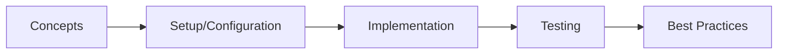

# Spring Batch

> **Previous:** [GraphQL](./48-graphql.md) | **Next:** [Spring Integration](./50-integration.md)

## Learning Objectives
## Chapter at a Glance

| Topic | Key Insight | Practical Takeaway |
|-------|-------------|--------------------|
| Core Concepts | Foundational understanding | Real-world application |
| Implementation | Code-first approach | Working examples |
| Best Practices | Production patterns | Avoid common pitfalls |

## Chapter Roadmap




By the end of this chapter, you will be able to:
- Configure and run Spring Batch jobs with Job/Step/Chunk architecture
- Implement ItemReader, ItemProcessor, and ItemWriter for diverse data sources
- Use JobRepository, JobLauncher, and manage job parameters and executions
- Build readers for flat files, databases, JPA, MongoDB, and XML
- Create processors with validation, classification, and chaining
- Write to flat files, databases, JPA, and implement composite writers
- Implement partitioning for parallel step execution
- Configure job restart, skip, and retry behaviors
- Attach listeners at job, step, and item levels
- Schedule batch jobs with Spring @Scheduled and Quartz
- Optimize large-scale batch jobs with multi-threading and remote chunking

---

## 1. Spring Batch Overview

> **Pro Tip:** Test with production-like configurations → dev setups often hide issues that surface under real load.

> **Remember:** Start simple. Add complexity only when proven necessary. Premature abstraction creates maintenance burden.


Spring Batch provides a comprehensive framework for batch processing with reusable processing components, transaction management, and chunk-oriented processing.

### 1.1 Maven Dependencies


```xml
<?xml version="1.0" encoding="UTF-8"?>
<project xmlns="http://maven.apache.org/POM/4.0.0"
         xmlns:xsi="http://www.w3.org/2001/XMLSchema-instance"
         xsi:schemaLocation="http://maven.apache.org/POM/4.0.0
         https://maven.apache.org/xsd/maven-4.0.0.xsd">
    <modelVersion>4.0.0</modelVersion>
    <parent>
        <groupId>org.springframework.boot</groupId>
        <artifactId>spring-boot-starter-parent</artifactId>
        <version>3.4.0</version>
        <relativePath/>
    </parent>
    <groupId>com.aiengineering</groupId>
    <artifactId>batch-course</artifactId>
    <version>1.0.0</version>
    <name>batch-course</name>

    <properties>
        <java.version>21</java.version>
    </properties>

    <dependencies>
        <dependency>
            <groupId>org.springframework.boot</groupId>
            <artifactId>spring-boot-starter-batch</artifactId>
        </dependency>
        <dependency>
            <groupId>org.springframework.boot</groupId>
            <artifactId>spring-boot-starter-data-jpa</artifactId>
        </dependency>
        <dependency>
            <groupId>org.springframework.boot</groupId>
            <artifactId>spring-boot-starter-data-mongodb</artifactId>
        </dependency>
        <dependency>
            <groupId>org.springframework.boot</groupId>
            <artifactId>spring-boot-starter-quartz</artifactId>
        </dependency>
        <dependency>
            <groupId>org.springframework.boot</groupId>
            <artifactId>spring-boot-starter-web</artifactId>
        </dependency>
        <dependency>
            <groupId>org.springframework.batch</groupId>
            <artifactId>spring-batch-integration</artifactId>
        </dependency>

        <dependency>
            <groupId>org.springframework</groupId>
            <artifactId>spring-oxm</artifactId>
        </dependency>
        <dependency>
            <groupId>com.thoughtworks.xstream</groupId>
            <artifactId>xstream</artifactId>
            <version>1.4.21</version>
        </dependency>
        <dependency>
            <groupId>javax.xml.stream</groupId>
            <artifactId>stax-api</artifactId>
            <version>1.0-2</version>
        </dependency>

        <dependency>
            <groupId>org.postgresql</groupId>
            <artifactId>postgresql</artifactId>
        </dependency>
        <dependency>
            <groupId>com.h2database</groupId>
            <artifactId>h2</artifactId>
        </dependency>

        <dependency>
            <groupId>org.projectlombok</groupId>
            <artifactId>lombok</artifactId>
            <optional>true</optional>
        </dependency>

        <dependency>
            <groupId>org.springframework.boot</groupId>
            <artifactId>spring-boot-starter-test</artifactId>
            <scope>test</scope>
        </dependency>
        <dependency>
            <groupId>org.springframework.batch</groupId>
            <artifactId>spring-batch-test</artifactId>
            <scope>test</scope>
        </dependency>
    </dependencies>
</project>
```

### 1.2 Application Configuration


```yaml
# src/main/resources/application.yml

> **Previous:** [GraphQL](./48-graphql.md) | **Next:** [Spring Integration](./50-integration.md)
spring:
  application:
    name: batch-course

  datasource:
    url: jdbc:postgresql://localhost:5432/batch_course
    username: postgres
    password: postgres
    driver-class-name: org.postgresql.Driver

  jpa:
    hibernate:
      ddl-auto: update
    show-sql: false
    properties:
      hibernate:
        format_sql: true

  batch:
    jdbc:
      initialize-schema: always
    job:
      enabled: true
      name: ${job.name:NONE}

  quartz:
    job-store-type: jdbc
    jdbc:
      initialize-schema: always
    properties:
      org:
        quartz:
          scheduler:
            instanceName: BatchScheduler
          threadPool:
            threadCount: 5

server:
  port: 8080

logging:
  level:
    org.springframework.batch: DEBUG
    org.springframework.jdbc: INFO

batch:
  chunk-size: 100
  skip-limit: 10
  retry-limit: 3
```

---

## 2. Domain Model

```java
package com.aiengineering.course.model;

import jakarta.persistence.*;
import lombok.*;

import java.math.BigDecimal;
import java.time.LocalDate;
import java.time.LocalDateTime;

@Entity
@Table(name = "transactions")
@Getter @Setter @NoArgsConstructor @AllArgsConstructor @Builder
@EqualsAndHashCode(onlyExplicitlyIncluded = true)
public class Transaction {

    @Id
    @GeneratedValue(strategy = GenerationType.IDENTITY)
    @EqualsAndHashCode.Include
    private Long id;

    @Column(name = "transaction_id", unique = true, nullable = false, length = 50)
    private String transactionId;

    @Column(name = "account_number", nullable = false, length = 20)
    private String accountNumber;

    @Column(name = "transaction_type", nullable = false, length = 20)
    private String transactionType;

    @Column(nullable = false, precision = 15, scale = 2)
    private BigDecimal amount;

    @Column(name = "transaction_date", nullable = false)
    private LocalDate transactionDate;

    @Column(length = 500)
    private String description;

    @Column(name = "merchant_name", length = 100)
    private String merchantName;

    @Column(name = "merchant_category", length = 50)
    private String merchantCategory;

    @Column(length = 3)
    private String currency;

    @Column(name = "reference_number", length = 50)
    private String referenceNumber;

    @Column(name = "created_at")
    private LocalDateTime createdAt;

    @Column(name = "processed_at")
    private LocalDateTime processedAt;

    @Column(name = "status", length = 20)
    private String status;

    @Column(name = "error_message", length = 1000)
    private String errorMessage;

    @Version
    private Long version;
}
```

```java
package com.aiengineering.course.model;

import jakarta.persistence.*;
import lombok.*;

import java.math.BigDecimal;
import java.time.LocalDateTime;

@Entity
@Table(name = "processed_transactions")
@Getter @Setter @NoArgsConstructor @AllArgsConstructor @Builder
public class ProcessedTransaction {

    @Id
    @GeneratedValue(strategy = GenerationType.IDENTITY)
    private Long id;

    @Column(name = "original_transaction_id", nullable = false, length = 50)
    private String originalTransactionId;

    @Column(name = "account_number", length = 20)
    private String accountNumber;

    @Column(precision = 15, scale = 2)
    private BigDecimal originalAmount;

    @Column(precision = 15, scale = 2)
    private BigDecimal processedAmount;

    @Column(length = 20)
    private String category;

    @Column(name = "risk_score")
    private Integer riskScore;

    @Column(name = "is_fraudulent")
    private Boolean isFraudulent;

    @Column(name = "processed_at")
    private LocalDateTime processedAt;

    @Column(name = "batch_job_id")
    private Long batchJobId;

    @Column(length = 50)
    private String batchStepName;

    @Column(length = 1000)
    private String notes;
}
```

```java
package com.aiengineering.course.model;

import jakarta.persistence.*;
import lombok.*;

import java.math.BigDecimal;
import java.time.LocalDateTime;

@Entity
@Table(name = "daily_summaries")
@Getter @Setter @NoArgsConstructor @AllArgsConstructor @Builder
public class DailySummary {

    @Id
    @GeneratedValue(strategy = GenerationType.IDENTITY)
    private Long id;

    @Column(name = "summary_date", nullable = false, length = 10)
    private String summaryDate;

    @Column(name = "total_transactions")
    private Long totalTransactions;

    @Column(precision = 20, scale = 2)
    private BigDecimal totalAmount;

    @Column(precision = 20, scale = 2)
    private BigDecimal averageAmount;

    @Column(precision = 15, scale = 2)
    private BigDecimal minAmount;

    @Column(precision = 15, scale = 2)
    private BigDecimal maxAmount;

    @Column(name = "category_breakdown", columnDefinition = "TEXT")
    private String categoryBreakdown;

    @Column(name = "fraud_count")
    private Integer fraudCount;

    @Column(name = "successful_count")
    private Integer successfulCount;

    @Column(name = "failed_count")
    private Integer failedCount;

    @Column(name = "computed_at")
    private LocalDateTime computedAt;
}
```

---

## 3. Job Configuration

### 3.1 Basic Job Configuration


```java
package com.aiengineering.course.config;

import com.aiengineering.course.model.ProcessedTransaction;
import com.aiengineering.course.model.Transaction;
import com.aiengineering.course.processor.TransactionProcessor;
import com.aiengineering.course.reader.TransactionReader;
import com.aiengineering.course.writer.ProcessedTransactionWriter;
import org.slf4j.Logger;
import org.slf4j.LoggerFactory;
import org.springframework.batch.core.*;
import org.springframework.batch.core.configuration.annotation.EnableBatchProcessing;
import org.springframework.batch.core.configuration.annotation.StepScope;
import org.springframework.batch.core.job.builder.JobBuilder;
import org.springframework.batch.core.launch.JobLauncher;
import org.springframework.batch.core.launch.support.RunIdIncrementer;
import org.springframework.batch.core.listener.ExecutionContextPromotionListener;
import org.springframework.batch.core.repository.JobRepository;
import org.springframework.batch.core.step.builder.StepBuilder;
import org.springframework.batch.item.ItemProcessor;
import org.springframework.batch.item.ItemReader;
import org.springframework.batch.item.ItemWriter;
import org.springframework.batch.item.database.JdbcCursorItemReader;
import org.springframework.batch.item.database.JpaPagingItemReader;
import org.springframework.batch.item.file.FlatFileItemReader;
import org.springframework.batch.item.file.FlatFileItemWriter;
import org.springframework.batch.item.file.mapping.BeanWrapperFieldSetMapper;
import org.springframework.batch.item.file.mapping.DefaultLineMapper;
import org.springframework.batch.item.file.transform.BeanWrapperFieldExtractor;
import org.springframework.batch.item.file.transform.DelimitedLineAggregator;
import org.springframework.batch.item.file.transform.DelimitedLineTokenizer;
import org.springframework.batch.item.support.CompositeItemProcessor;
import org.springframework.batch.item.support.CompositeItemWriter;
import org.springframework.batch.item.validator.BeanValidatingItemProcessor;
import org.springframework.batch.repeat.RepeatStatus;
import org.springframework.beans.factory.annotation.Value;
import org.springframework.context.annotation.Bean;
import org.springframework.context.annotation.Configuration;
import org.springframework.core.io.FileSystemResource;
import org.springframework.core.io.Resource;
import org.springframework.jdbc.core.BeanPropertyRowMapper;
import org.springframework.jdbc.core.JdbcTemplate;
import org.springframework.transaction.PlatformTransactionManager;

import javax.sql.DataSource;
import java.util.List;

@Configuration
@EnableBatchProcessing
public class BatchJobConfig {

    private static final Logger log = LoggerFactory.getLogger(BatchJobConfig.class);

    private final JobRepository jobRepository;
    private final PlatformTransactionManager transactionManager;
    private final DataSource dataSource;
    private final JdbcTemplate jdbcTemplate;

    public BatchJobConfig(
            JobRepository jobRepository,
            PlatformTransactionManager transactionManager,
            DataSource dataSource,
            JdbcTemplate jdbcTemplate) {
        this.jobRepository = jobRepository;
        this.transactionManager = transactionManager;
        this.dataSource = dataSource;
        this.jdbcTemplate = jdbcTemplate;
    }

    @Bean
    public Job transactionProcessingJob(
            Step fileImportStep,
            Step processTransactionsStep,
            Step generateSummaryStep,
            Step cleanupStep) {

        return new JobBuilder("transactionProcessingJob", jobRepository)
            .incrementer(new RunIdIncrementer())
            .start(fileImportStep)
            .next(processTransactionsStep)
            .next(generateSummaryStep)
            .next(cleanupStep)
            .listener(jobExecutionListener())
            .build();
    }

    @Bean
    public Job etlJob(Step extractStep, Step transformStep, Step loadStep) {
        return new JobBuilder("etlJob", jobRepository)
            .incrementer(new RunIdIncrementer())
            .start(extractStep)
            .next(transformStep)
            .next(loadStep)
            .validator(parameterValidator())
            .build();
    }

    @Bean
    public Job reportingJob(Step reportGenerationStep) {
        return new JobBuilder("reportingJob", jobRepository)
            .incrementer(new RunIdIncrementer())
            .flow(reportGenerationStep)
            .end()
            .build();
    }
}
```

### 3.2 Step Configurations


```java
@Configuration
public class FileImportStepConfig {

    private final JobRepository jobRepository;
    private final PlatformTransactionManager transactionManager;

    public FileImportStepConfig(
            JobRepository jobRepository,
            PlatformTransactionManager transactionManager) {
        this.jobRepository = jobRepository;
        this.transactionManager = transactionManager;
    }

    @Bean
    public Step fileImportStep(
            ItemReader<Transaction> fileTransactionReader,
            ItemProcessor<Transaction, Transaction> importProcessor,
            ItemWriter<Transaction> transactionWriter) {

        return new StepBuilder("fileImportStep", jobRepository)
            .<Transaction, Transaction>chunk(100, transactionManager)
            .reader(fileTransactionReader)
            .processor(importProcessor)
            .writer(transactionWriter)
            .readerIsReaderQueue(true)
            .faultTolerant()
            .skip(Exception.class)
            .skipLimit(10)
            .retry(Exception.class)
            .retryLimit(3)
            .listener(stepExecutionListener())
            .listener(chunkListener())
            .listener(itemReadListener())
            .listener(itemProcessListener())
            .listener(itemWriteListener())
            .build();
    }

    @Bean
    public Step processTransactionsStep(
            ItemReader<Transaction> jdbcTransactionReader,
            ItemProcessor<Transaction, ProcessedTransaction> compositeProcessor,
            ItemWriter<ProcessedTransaction> compositeWriter) {

        return new StepBuilder("processTransactionsStep", jobRepository)
            .<Transaction, ProcessedTransaction>chunk(50, transactionManager)
            .reader(jdbcTransactionReader)
            .processor(compositeProcessor)
            .writer(compositeWriter)
            .faultTolerant()
            .skip(org.springframework.dao.DataAccessException.class)
            .skipLimit(20)
            .retry(org.springframework.dao.DeadlockLoserDataAccessException.class)
            .retryLimit(3)
            .listener(stepExecutionListener())
            .build();
    }

    @Bean
    public Step generateSummaryStep(
            JdbcTemplate jdbcTemplate) {

        return new StepBuilder("generateSummaryStep", jobRepository)
            .tasklet((contribution, chunkContext) -> {
                String date = chunkContext.getStepContext()
                    .getJobParameters().getString("processingDate");

                String sql = """
                    INSERT INTO daily_summaries (
                        summary_date, total_transactions, total_amount,
                        average_amount, min_amount, max_amount,
                        successful_count, computed_at
                    )
                    SELECT
                        t.transaction_date,
                        COUNT(*),
                        SUM(t.amount),
                        AVG(t.amount),
                        MIN(t.amount),
                        MAX(t.amount),
                        SUM(CASE WHEN t.status = 'COMPLETED' THEN 1 ELSE 0 END),
                        NOW()
                    FROM transactions t
                    WHERE t.transaction_date = COALESCE(?, CURRENT_DATE)
                    GROUP BY t.transaction_date
                    ON CONFLICT (summary_date) DO UPDATE SET
                        total_transactions = EXCLUDED.total_transactions,
                        total_amount = EXCLUDED.total_amount,
                        average_amount = EXCLUDED.average_amount,
                        min_amount = EXCLUDED.min_amount,
                        max_amount = EXCLUDED.max_amount,
                        computed_at = NOW();
                    """;

                int updated = jdbcTemplate.update(sql, date);
                log.info("Generated summary for {} ({} rows)", date, updated);

                return RepeatStatus.FINISHED;
            }, transactionManager)
            .build();
    }

    @Bean
    public Step cleanupStep() {
        return new StepBuilder("cleanupStep", jobRepository)
            .tasklet((contribution, chunkContext) -> {
                String archiveDate = (String) chunkContext.getStepContext()
                    .getJobExecutionContext().get("archiveDate");

                if (archiveDate != null) {
                    jdbcTemplate.update(
                        "DELETE FROM transactions WHERE processed_at < ? " +
                        "AND status = 'COMPLETED'",
                        java.sql.Timestamp.valueOf(
                            java.time.LocalDateTime.now().minusDays(30)));

                    log.info("Cleanup completed for records before {}", archiveDate);
                }

                return RepeatStatus.FINISHED;
            }, transactionManager)
            .build();
    }

    @Bean
    public Step extractStep(ItemReader<Transaction> fileTransactionReader) {
        return new StepBuilder("extractStep", jobRepository)
            .<Transaction, Transaction>chunk(100, transactionManager)
            .reader(fileTransactionReader)
            .writer(transactions -> {
                for (Transaction t : transactions) {
                    log.debug("Extracted: {}", t.getTransactionId());
                }
            })
            .build();
    }

    @Bean
    public Step transformStep(ItemProcessor<Transaction, ProcessedTransaction> processor) {
        return new StepBuilder("transformStep", jobRepository)
            .tasklet((contribution, chunkContext) -> {
                log.info("Transform step placeholder - actual transformation " +
                    "happens in processTransactionsStep");
                return RepeatStatus.FINISHED;
            }, transactionManager)
            .build();
    }

    @Bean
    public Step loadStep(ItemWriter<ProcessedTransaction> writer) {
        return new StepBuilder("loadStep", jobRepository)
            .<ProcessedTransaction, ProcessedTransaction>chunk(100, transactionManager)
            .reader(emptyReader())
            .writer(writer)
            .build();
    }

    @Bean
    public Step reportGenerationStep() {
        return new StepBuilder("reportGenerationStep", jobRepository)
            .tasklet((contribution, chunkContext) -> {
                String reportType = chunkContext.getStepContext()
                    .getJobParameters().getString("reportType", "daily");

                List<java.util.Map<String, Object>> results = jdbcTemplate
                    .queryForList("""
                        SELECT * FROM daily_summaries
                        ORDER BY summary_date DESC LIMIT 10
                        """);

                log.info("Generated {} report with {} records", reportType, results.size());
                contribution.getStepExecution().getJobExecution()
                    .getExecutionContext()
                    .put("reportData", results);

                return RepeatStatus.FINISHED;
            }, transactionManager)
            .build();
    }
}
```

---

## 4. Item Readers

### 4.1 FlatFileItemReader


```java
package com.aiengineering.course.reader;

import com.aiengineering.course.model.Transaction;
import org.slf4j.Logger;
import org.slf4j.LoggerFactory;
import org.springframework.batch.core.configuration.annotation.StepScope;
import org.springframework.batch.item.file.FlatFileItemReader;
import org.springframework.batch.item.file.LineMapper;
import org.springframework.batch.item.file.mapping.BeanWrapperFieldSetMapper;
import org.springframework.batch.item.file.mapping.DefaultLineMapper;
import org.springframework.batch.item.file.transform.DelimitedLineTokenizer;
import org.springframework.batch.item.file.transform.FieldSet;
import org.springframework.beans.factory.annotation.Value;
import org.springframework.context.annotation.Bean;
import org.springframework.context.annotation.Configuration;
import org.springframework.core.io.FileSystemResource;
import org.springframework.validation.BindException;

import java.math.BigDecimal;
import java.time.LocalDate;
import java.time.format.DateTimeFormatter;

@Configuration
public class TransactionReaderConfig {

    private static final Logger log = LoggerFactory.getLogger(TransactionReaderConfig.class);

    @Bean
    @StepScope
    public FlatFileItemReader<Transaction> fileTransactionReader(
            @Value("#{jobParameters['inputFile']}") String inputFile) {

        FlatFileItemReader<Transaction> reader = new FlatFileItemReader<>();
        reader.setResource(new FileSystemResource(inputFile));
        reader.setName("fileTransactionReader");
        reader.setLinesToSkip(1);
        reader.setLineMapper(transactionLineMapper());
        reader.setRecordSeparator("\n");
        reader.setStrict(false);
        reader.setMaxItemCount(100000);
        reader.setCurrentItemCount(0);
        reader.setComments(List.of("#", "--"));

        return reader;
    }

    @Bean
    @StepScope
    public FlatFileItemReader<Transaction> multiFileTransactionReader(
            @Value("#{jobParameters['inputDirectory']}") String inputDir) {

        FlatFileItemReader<Transaction> reader = new FlatFileItemReader<>();
        reader.setResource(new FileSystemResource(inputDir + "/transactions.csv"));
        reader.setName("multiFileTransactionReader");
        reader.setLinesToSkip(1);
        reader.setLineMapper(transactionLineMapper());

        return reader;
    }

    @Bean
    @StepScope
    public FlatFileItemReader<Transaction> headerTransactionReader(
            @Value("#{jobParameters['inputFile']}") String inputFile) {

        FlatFileItemReader<Transaction> reader = new FlatFileItemReader<>();
        reader.setResource(new FileSystemResource(inputFile));
        reader.setName("headerTransactionReader");
        reader.setLinesToSkip(1);

        DelimitedLineTokenizer tokenizer = new DelimitedLineTokenizer();
        tokenizer.setNames("transactionId", "accountNumber", "transactionType",
            "amount", "transactionDate", "description", "merchantName",
            "merchantCategory", "currency", "referenceNumber");
        tokenizer.setDelimiter("|");
        tokenizer.setStrict(false);
        tokenizer.setQuoteCharacter('"');

        DefaultLineMapper<Transaction> lineMapper = new DefaultLineMapper<>();
        lineMapper.setLineTokenizer(tokenizer);

        BeanWrapperFieldSetMapper<Transaction> fieldSetMapper =
            new BeanWrapperFieldSetMapper<>();
        fieldSetMapper.setTargetType(Transaction.class);
        lineMapper.setFieldSetMapper(fieldSetMapper);

        reader.setLineMapper(lineMapper);

        return reader;
    }

    private LineMapper<Transaction> transactionLineMapper() {
        DefaultLineMapper<Transaction> lineMapper = new DefaultLineMapper<>();

        DelimitedLineTokenizer tokenizer = new DelimitedLineTokenizer();
        tokenizer.setNames("transactionId", "accountNumber", "transactionType",
            "amount", "transactionDate", "description", "merchantName",
            "merchantCategory", "currency", "referenceNumber");
        tokenizer.setDelimiter(",");
        tokenizer.setStrict(false);

        BeanWrapperFieldSetMapper<Transaction> fieldSetMapper =
            new BeanWrapperFieldSetMapper<Transaction>() {
                @Override
                public Transaction mapFieldSet(FieldSet fieldSet) throws BindException {
                    Transaction transaction = new Transaction();
                    transaction.setTransactionId(fieldSet.readString("transactionId"));
                    transaction.setAccountNumber(fieldSet.readString("accountNumber"));
                    transaction.setTransactionType(fieldSet.readString("transactionType"));
                    transaction.setAmount(fieldSet.readBigDecimal("amount"));
                    transaction.setTransactionDate(LocalDate.parse(
                        fieldSet.readString("transactionDate"),
                        DateTimeFormatter.ISO_LOCAL_DATE));
                    transaction.setDescription(fieldSet.readString("description"));
                    transaction.setMerchantName(fieldSet.readString("merchantName"));
                    transaction.setMerchantCategory(fieldSet.readString("merchantCategory"));
                    transaction.setCurrency(fieldSet.readString("currency"));
                    transaction.setReferenceNumber(fieldSet.readString("referenceNumber"));
                    transaction.setStatus("IMPORTED");
                    transaction.setCreatedAt(java.time.LocalDateTime.now());
                    return transaction;
                }
            };

        lineMapper.setFieldSetMapper(fieldSetMapper);
        return lineMapper;
    }
}
```

### 4.2 JdbcCursorItemReader


```java
package com.aiengineering.course.reader;

import com.aiengineering.course.model.Transaction;
import org.springframework.batch.core.configuration.annotation.StepScope;
import org.springframework.batch.item.database.JdbcCursorItemReader;
import org.springframework.beans.factory.annotation.Value;
import org.springframework.context.annotation.Bean;
import org.springframework.context.annotation.Configuration;
import org.springframework.jdbc.core.BeanPropertyRowMapper;

import javax.sql.DataSource;

@Configuration
public class JdbcReaderConfig {

    @Bean
    @StepScope
    public JdbcCursorItemReader<Transaction> jdbcTransactionReader(
            DataSource dataSource,
            @Value("#{jobParameters['processingDate']}") String processingDate) {

        JdbcCursorItemReader<Transaction> reader = new JdbcCursorItemReader<>();
        reader.setDataSource(dataSource);
        reader.setName("jdbcTransactionReader");
        reader.setSql("""
            SELECT id, transaction_id, account_number, transaction_type,
                   amount, transaction_date, description, merchant_name,
                   merchant_category, currency, reference_number, status,
                   created_at, processed_at, error_message
            FROM transactions
            WHERE (transaction_date = COALESCE(?, CURRENT_DATE)
                   OR ? IS NULL)
              AND status = 'IMPORTED'
            ORDER BY transaction_date ASC, id ASC
            """);
        reader.setPreparedStatementSetter(ps -> {
            ps.setString(1, processingDate);
            ps.setString(2, processingDate);
        });
        reader.setRowMapper(new BeanPropertyRowMapper<>(Transaction.class));
        reader.setFetchSize(1000);
        reader.setMaxRows(50000);
        reader.setQueryTimeout(60);

        return reader;
    }

    @Bean
    @StepScope
    public JdbcCursorItemReader<Transaction> jdbcTransactionByStatusReader(
            DataSource dataSource,
            @Value("#{jobParameters['status']}") String status) {

        JdbcCursorItemReader<Transaction> reader = new JdbcCursorItemReader<>();
        reader.setDataSource(dataSource);
        reader.setName("jdbcTransactionByStatusReader");
        reader.setSql("""
            SELECT * FROM transactions
            WHERE status = COALESCE(?, 'IMPORTED')
            ORDER BY id
            """);
        reader.setPreparedStatementSetter(ps ->
            ps.setString(1, status != null ? status : "IMPORTED"));
        reader.setRowMapper((rs, rowNum) -> {
            Transaction t = new Transaction();
            t.setId(rs.getLong("id"));
            t.setTransactionId(rs.getString("transaction_id"));
            t.setAccountNumber(rs.getString("account_number"));
            t.setTransactionType(rs.getString("transaction_type"));
            t.setAmount(rs.getBigDecimal("amount"));
            t.setTransactionDate(rs.getDate("transaction_date").toLocalDate());
            t.setDescription(rs.getString("description"));
            t.setMerchantName(rs.getString("merchant_name"));
            t.setMerchantCategory(rs.getString("merchant_category"));
            t.setCurrency(rs.getString("currency"));
            t.setReferenceNumber(rs.getString("reference_number"));
            t.setStatus(rs.getString("status"));
            t.setCreatedAt(rs.getTimestamp("created_at").toLocalDateTime());
            return t;
        });
        reader.setFetchSize(500);

        return reader;
    }
}
```

### 4.3 JpaPagingItemReader


```java
package com.aiengineering.course.reader;

import com.aiengineering.course.model.Transaction;
import jakarta.persistence.EntityManagerFactory;
import org.springframework.batch.core.configuration.annotation.StepScope;
import org.springframework.batch.item.database.JpaPagingItemReader;
import org.springframework.batch.item.database.orm.JpaNativeQueryProvider;
import org.springframework.batch.item.database.orm.JpaQueryProvider;
import org.springframework.batch.item.database.builder.JpaPagingItemReaderBuilder;
import org.springframework.beans.factory.annotation.Value;
import org.springframework.context.annotation.Bean;
import org.springframework.context.annotation.Configuration;

import java.util.HashMap;
import java.util.Map;

@Configuration
public class JpaReaderConfig {

    @Bean
    @StepScope
    public JpaPagingItemReader<Transaction> jpaTransactionReader(
            EntityManagerFactory entityManagerFactory,
            @Value("#{jobParameters['processingDate']}") String processingDate) {

        return new JpaPagingItemReaderBuilder<Transaction>()
            .name("jpaTransactionReader")
            .entityManagerFactory(entityManagerFactory)
            .queryString("SELECT t FROM Transaction t WHERE t.status = 'IMPORTED' " +
                "AND (t.transactionDate = COALESCE(:date, t.transactionDate)) " +
                "ORDER BY t.transactionDate ASC")
            .parameterValues(Map.of("date",
                processingDate != null
                    ? java.time.LocalDate.parse(processingDate)
                    : java.time.LocalDate.now()))
            .pageSize(500)
            .maxItemCount(100000)
            .saveState(true)
            .build();
    }

    @Bean
    @StepScope
    public JpaPagingItemReader<Transaction> jpaTransactionByStatusReader(
            EntityManagerFactory entityManagerFactory,
            @Value("#{jobParameters['status']}") String status) {

        JpaPagingItemReader<Transaction> reader = new JpaPagingItemReader<>();
        reader.setName("jpaTransactionByStatusReader");
        reader.setEntityManagerFactory(entityManagerFactory);
        reader.setQueryString("SELECT t FROM Transaction t " +
            "WHERE t.status = :status ORDER BY t.id");
        reader.setParameterValues(Map.of("status",
            status != null ? status : "IMPORTED"));
        reader.setPageSize(100);
        reader.setMaxItemCount(50000);

        return reader;
    }

    @Bean
    @StepScope
    public JpaPagingItemReader<Transaction> jpaTransactionNativeReader(
            EntityManagerFactory entityManagerFactory) {

        JpaPagingItemReader<Transaction> reader = new JpaPagingItemReader<>();
        reader.setName("jpaTransactionNativeReader");
        reader.setEntityManagerFactory(entityManagerFactory);
        reader.setPageSize(200);

        JpaNativeQueryProvider<Transaction> queryProvider =
            new JpaNativeQueryProvider<>();
        queryProvider.setSqlQuery(
            "SELECT * FROM transactions WHERE status = 'IMPORTED' ORDER BY id");
        queryProvider.setEntityClass(Transaction.class);
        reader.setQueryProvider(queryProvider);

        return reader;
    }
}
```

### 4.4 Additional Readers


```java
package com.aiengineering.course.reader;

import com.aiengineering.course.model.Transaction;
import org.springframework.batch.item.ItemReader;
import org.springframework.batch.item.NonTransientResourceException;
import org.springframework.batch.item.ParseException;
import org.springframework.batch.item.UnexpectedInputExecutionException;
import org.springframework.batch.item.data.MongoItemReader;
import org.springframework.batch.item.file.MultiResourceItemReader;
import org.springframework.batch.item.file.ResourceAwareItemReaderItemStream;
import org.springframework.batch.item.support.CompositeItemReader;
import org.springframework.batch.item.support.SingleItemPeekableItemReader;
import org.springframework.batch.item.xml.StaxEventItemReader;
import org.springframework.context.annotation.Bean;
import org.springframework.context.annotation.Configuration;
import org.springframework.core.io.FileSystemResource;
import org.springframework.core.io.Resource;
import org.springframework.data.domain.Sort;
import org.springframework.data.mongodb.core.MongoTemplate;
import org.springframework.oxm.xstream.XStreamMarshaller;

import java.util.*;

@Configuration
public class AdditionalReaderConfig {

    @Bean
    public CompositeItemReader<Transaction> compositeItemReader(
            FlatFileItemReader<Transaction> fileReader,
            JdbcCursorItemReader<Transaction> jdbcReader) {

        CompositeItemReader<Transaction> compositeReader = new CompositeItemReader<>();
        compositeReader.setDelegates(List.of(fileReader, jdbcReader));
        return compositeReader;
    }

    @Bean
    public MultiResourceItemReader<Transaction> multiResourceReader() {
        MultiResourceItemReader<Transaction> reader = new MultiResourceItemReader<>();
        reader.setDelegate(fileTransactionReader("data/transactions.csv"));

        Resource[] resources = new Resource[]{
            new FileSystemResource("data/transactions_2024.csv"),
            new FileSystemResource("data/transactions_2025.csv")
        };
        reader.setResources(resources);
        reader.setStrict(false);

        return reader;
    }

    @Bean
    public StaxEventItemReader<Transaction> xmlTransactionReader() {
        StaxEventItemReader<Transaction> reader = new StaxEventItemReader<>();
        reader.setResource(new FileSystemResource("data/transactions.xml"));
        reader.setFragmentRootElementName("transaction");

        XStreamMarshaller unmarshaller = new XStreamMarshaller();
        Map<String, Class<?>> aliases = new HashMap<>();
        aliases.put("transaction", Transaction.class);
        aliases.put("transactionId", String.class);
        aliases.put("accountNumber", String.class);
        aliases.put("amount", java.math.BigDecimal.class);
        unmarshaller.setAliases(aliases);

        reader.setUnmarshaller(unmarshaller);
        return reader;
    }

    @Bean
    @StepScope
    public FlatFileItemReader<Transaction> fileTransactionReader(String path) {
        FlatFileItemReader<Transaction> reader = new FlatFileItemReader<>();
        reader.setResource(new FileSystemResource(path));
        reader.setName("fileTransactionReader-" + path.hashCode());
        reader.setLinesToSkip(1);
        return reader;
    }
}
```

---

## 5. Item Processors

### 5.1 Transaction Processor


```java
package com.aiengineering.course.processor;

import com.aiengineering.course.model.ProcessedTransaction;
import com.aiengineering.course.model.Transaction;
import org.slf4j.Logger;
import org.slf4j.LoggerFactory;
import org.springframework.batch.core.configuration.annotation.StepScope;
import org.springframework.batch.item.ItemProcessor;
import org.springframework.beans.factory.annotation.Value;
import org.springframework.stereotype.Component;

import java.math.BigDecimal;
import java.math.RoundingMode;
import java.time.LocalDateTime;
import java.util.Map;
import java.util.Set;
import java.util.concurrent.ThreadLocalRandom;

@Component
@StepScope
public class TransactionProcessor implements ItemProcessor<Transaction, ProcessedTransaction> {

    private static final Logger log = LoggerFactory.getLogger(TransactionProcessor.class);

    private static final Set<String> HIGH_RISK_CATEGORIES = Set.of(
        "CRYPTO", "GAMBLING", "WIRE_TRANSFER", "MONEY_ORDER"
    );

    private static final Set<String> SUSPICIOUS_MERCHANTS = Set.of(
        "SUSPICIOUS_MERCHANT_1", "SUSPICIOUS_MERCHANT_2"
    );

    private static final Map<String, String> CATEGORY_MAPPING = Map.ofEntries(
        Map.entry("RESTAURANT", "FOOD_AND_DINING"),
        Map.entry("CAFE", "FOOD_AND_DINING"),
        Map.entry("GROCERY", "GROCERIES"),
        Map.entry("SUPERMARKET", "GROCERIES"),
        Map.entry("GAS_STATION", "TRANSPORTATION"),
        Map.entry("FUEL", "TRANSPORTATION"),
        Map.entry("ONLINE_RETAIL", "SHOPPING"),
        Map.entry("DEPARTMENT_STORE", "SHOPPING"),
        Map.entry("STREAMING", "ENTERTAINMENT"),
        Map.entry("MOVIE_THEATER", "ENTERTAINMENT"),
        Map.entry("PHARMACY", "HEALTHCARE"),
        Map.entry("HOSPITAL", "HEALTHCARE"),
        Map.entry("HOTEL", "TRAVEL"),
        Map.entry("AIRLINE", "TRAVEL"),
        Map.entry("SOFTWARE", "TECHNOLOGY"),
        Map.entry("CLOUD_SERVICE", "TECHNOLOGY"),
        Map.entry("INSURANCE", "INSURANCE"),
        Map.entry("UTILITY", "UTILITIES"),
        Map.entry("TELECOM", "UTILITIES"),
        Map.entry("EDUCATION", "EDUCATION")
    );

    private static final BigDecimal LARGE_TRANSACTION_THRESHOLD = new BigDecimal("10000");
    private static final BigDecimal MEDIUM_TRANSACTION_THRESHOLD = new BigDecimal("1000");

    @Value("#{jobParameters['processingDate']}")
    private String processingDate;

    private long processedCount = 0;

    @Override
    public ProcessedTransaction process(Transaction transaction) {
        if (transaction == null) {
            return null;
        }

        if (transaction.getAmount() == null) {
            log.warn("Transaction {} has null amount, skipping",
                transaction.getTransactionId());
            return null;
        }

        if (transaction.getAmount().compareTo(BigDecimal.ZERO) <= 0) {
            log.warn("Transaction {} has non-positive amount {}, skipping",
                transaction.getTransactionId(), transaction.getAmount());
            return null;
        }

        processedCount++;

        String category = categorizeTransaction(transaction);
        int riskScore = calculateRiskScore(transaction, category);
        boolean isFraudulent = detectFraud(transaction, riskScore);
        BigDecimal processedAmount = applyProcessingRules(transaction);

        ProcessedTransaction processed = ProcessedTransaction.builder()
            .originalTransactionId(transaction.getTransactionId())
            .accountNumber(transaction.getAccountNumber())
            .originalAmount(transaction.getAmount())
            .processedAmount(processedAmount)
            .category(category)
            .riskScore(riskScore)
            .isFraudulent(isFraudulent)
            .processedAt(LocalDateTime.now())
            .batchJobId(Thread.currentThread().getId())
            .notes(buildNotes(transaction, riskScore, isFraudulent))
            .build();

        if (processedCount % 1000 == 0) {
            log.info("Processed {} transactions", processedCount);
        }

        return processed;
    }

    private String categorizeTransaction(Transaction transaction) {
        if (transaction.getMerchantCategory() != null
            && CATEGORY_MAPPING.containsKey(transaction.getMerchantCategory())) {
            return CATEGORY_MAPPING.get(transaction.getMerchantCategory());
        }

        if (transaction.getDescription() != null) {
            String desc = transaction.getDescription().toUpperCase();
            if (desc.contains("AMAZON") || desc.contains("EBAY")) return "SHOPPING";
            if (desc.contains("UBER") || desc.contains("LYFT")) return "TRANSPORTATION";
            if (desc.contains("NETFLIX") || desc.contains("SPOTIFY")) return "ENTERTAINMENT";
            if (desc.contains("PAYPAL") || desc.contains("VENMO")) return "DIGITAL_PAYMENT";
        }

        return "OTHER";
    }

    private int calculateRiskScore(Transaction transaction, String category) {
        int score = 0;

        if (HIGH_RISK_CATEGORIES.contains(category)) {
            score += 40;
        }

        if (transaction.getAmount().compareTo(LARGE_TRANSACTION_THRESHOLD) > 0) {
            score += 30;
        } else if (transaction.getAmount().compareTo(MEDIUM_TRANSACTION_THRESHOLD) > 0) {
            score += 15;
        }

        if (transaction.getMerchantName() != null
            && SUSPICIOUS_MERCHANTS.contains(transaction.getMerchantName())) {
            score += 25;
        }

        if (transaction.getDescription() != null
            && transaction.getDescription().toUpperCase().contains("URGENT")) {
            score += 10;
        }

        if (transaction.getCurrency() != null
            && !transaction.getCurrency().equals("USD")) {
            score += 5;
        }

        score += ThreadLocalRandom.current().nextInt(0, 5);

        return Math.min(score, 100);
    }

    private boolean detectFraud(Transaction transaction, int riskScore) {
        if (riskScore >= 80) return true;
        if (riskScore >= 60 && transaction.getAmount().compareTo(new BigDecimal("5000")) > 0) {
            return true;
        }
        return false;
    }

    private BigDecimal applyProcessingRules(Transaction transaction) {
        BigDecimal amount = transaction.getAmount();

        if (transaction.getTransactionType() != null
            && transaction.getTransactionType().equals("REFUND")) {
            return amount.abs();
        }

        if (amount.compareTo(BigDecimal.ZERO) < 0) {
            return amount.abs();
        }

        return amount.setScale(2, RoundingMode.HALF_UP);
    }

    private String buildNotes(Transaction transaction, int riskScore, boolean isFraudulent) {
        StringBuilder notes = new StringBuilder();
        notes.append("Risk Score: ").append(riskScore);
        if (isFraudulent) {
            notes.append(" | FLAGGED AS FRAUD");
        }
        if (transaction.getAmount().compareTo(LARGE_TRANSACTION_THRESHOLD) > 0) {
            notes.append(" | Large transaction");
        }
        return notes.toString();
    }
}
```

### 5.2 Composite and Classifier Processors


```java
package com.aiengineering.course.processor;

import com.aiengineering.course.model.ProcessedTransaction;
import com.aiengineering.course.model.Transaction;
import org.springframework.batch.item.ItemProcessor;
import org.springframework.batch.item.support.ClassifierCompositeItemProcessor;
import org.springframework.batch.item.support.CompositeItemProcessor;
import org.springframework.batch.item.validator.BeanValidatingItemProcessor;
import org.springframework.batch.item.validator.ValidatingItemProcessor;
import org.springframework.batch.item.validator.ValidationException;
import org.springframework.batch.support.annotation.Classifier;
import org.springframework.classify.Classifier;
import org.springframework.context.annotation.Bean;
import org.springframework.context.annotation.Configuration;

import java.math.BigDecimal;

@Configuration
public class ProcessorConfig {

    @Bean
    public CompositeItemProcessor<Transaction, ProcessedTransaction> compositeProcessor(
            BeanValidatingItemProcessor<Transaction> validator,
            TransactionProcessor transactionProcessor) {

        CompositeItemProcessor<Transaction, ProcessedTransaction> processor =
            new CompositeItemProcessor<>();

        processor.setDelegates(List.of(
            validator,
            transactionProcessor
        ));

        return processor;
    }

    @Bean
    public BeanValidatingItemProcessor<Transaction> beanValidatingProcessor() {
        BeanValidatingItemProcessor<Transaction> processor =
            new BeanValidatingItemProcessor<>();
        processor.setFilter(true);
        return processor;
    }

    @Bean
    public ValidatingItemProcessor<Transaction> customValidatingProcessor() {
        return new ValidatingItemProcessor<>(transaction -> {
            if (transaction.getAmount() == null) {
                throw new ValidationException(
                    "Transaction " + transaction.getTransactionId()
                    + " has null amount");
            }
            if (transaction.getAmount().compareTo(BigDecimal.ZERO) <= 0) {
                throw new ValidationException(
                    "Transaction " + transaction.getTransactionId()
                    + " has non-positive amount");
            }
            if (transaction.getTransactionId() == null) {
                throw new ValidationException("Transaction has null transactionId");
            }
        });
    }

    @Bean
    public ClassifierCompositeItemProcessor<Transaction, ProcessedTransaction>
            classifierProcessor() {

        ClassifierCompositeItemProcessor<Transaction, ProcessedTransaction> processor =
            new ClassifierCompositeItemProcessor<>();

        processor.setClassifier(new Classifier<Transaction, ItemProcessor<Transaction, ProcessedTransaction>>() {
            @Override
            public ItemProcessor<Transaction, ProcessedTransaction> classify(
                    Transaction transaction) {

                if (transaction.getAmount().compareTo(new BigDecimal("10000")) > 0) {
                    return new HighValueTransactionProcessor();
                } else if (transaction.getAmount().compareTo(new BigDecimal("1000")) > 0) {
                    return new MidValueTransactionProcessor();
                } else {
                    return new StandardTransactionProcessor();
                }
            }
        });

        return processor;
    }

    public static class HighValueTransactionProcessor
            implements ItemProcessor<Transaction, ProcessedTransaction> {
        @Override
        public ProcessedTransaction process(Transaction transaction) {
            ProcessedTransaction pt = new ProcessedTransaction();
            pt.setOriginalTransactionId(transaction.getTransactionId());
            pt.setOriginalAmount(transaction.getAmount());
            pt.setProcessedAmount(transaction.getAmount());
            pt.setCategory("HIGH_VALUE");
            pt.setRiskScore(80);
            pt.setNotes("Requires manual review");
            return pt;
        }
    }

    public static class MidValueTransactionProcessor
            implements ItemProcessor<Transaction, ProcessedTransaction> {
        @Override
        public ProcessedTransaction process(Transaction transaction) {
            ProcessedTransaction pt = new ProcessedTransaction();
            pt.setOriginalTransactionId(transaction.getTransactionId());
            pt.setOriginalAmount(transaction.getAmount());
            pt.setProcessedAmount(transaction.getAmount().multiply(
                new BigDecimal("0.99")));
            pt.setCategory("MID_VALUE");
            pt.setRiskScore(30);
            return pt;
        }
    }

    public static class StandardTransactionProcessor
            implements ItemProcessor<Transaction, ProcessedTransaction> {
        @Override
        public ProcessedTransaction process(Transaction transaction) {
            ProcessedTransaction pt = new ProcessedTransaction();
            pt.setOriginalTransactionId(transaction.getTransactionId());
            pt.setOriginalAmount(transaction.getAmount());
            pt.setProcessedAmount(transaction.getAmount());
            pt.setCategory("STANDARD");
            pt.setRiskScore(5);
            return pt;
        }
    }
}
```

---

## 6. Item Writers

### 6.1 FlatFileItemWriter


```java
package com.aiengineering.course.writer;

import com.aiengineering.course.model.ProcessedTransaction;
import org.springframework.batch.core.configuration.annotation.StepScope;
import org.springframework.batch.item.file.FlatFileItemWriter;
import org.springframework.batch.item.file.builder.FlatFileItemWriterBuilder;
import org.springframework.batch.item.file.transform.BeanWrapperFieldExtractor;
import org.springframework.batch.item.file.transform.DelimitedLineAggregator;
import org.springframework.batch.item.file.transform.FormatterLineAggregator;
import org.springframework.beans.factory.annotation.Value;
import org.springframework.context.annotation.Bean;
import org.springframework.context.annotation.Configuration;
import org.springframework.core.io.FileSystemResource;

import java.text.NumberFormat;

@Configuration
public class FlatFileWriterConfig {

    @Bean
    @StepScope
    public FlatFileItemWriter<ProcessedTransaction> processedCsvWriter(
            @Value("#{jobParameters['outputFile']}") String outputFile) {

        BeanWrapperFieldExtractor<ProcessedTransaction> extractor =
            new BeanWrapperFieldExtractor<>();
        extractor.setNames(new String[]{
            "originalTransactionId", "accountNumber", "originalAmount",
            "processedAmount", "category", "riskScore", "isFraudulent",
            "processedAt"
        });

        DelimitedLineAggregator<ProcessedTransaction> aggregator =
            new DelimitedLineAggregator<>();
        aggregator.setDelimiter(",");
        aggregator.setFieldExtractor(extractor);

        return new FlatFileItemWriterBuilder<ProcessedTransaction>()
            .name("processedCsvWriter")
            .resource(new FileSystemResource(outputFile))
            .lineAggregator(aggregator)
            .headerCallback(writer -> writer.write(
                "transactionId,accountNumber,originalAmount,processedAmount," +
                "category,riskScore,isFraudulent,processedAt"))
            .footerCallback(writer -> writer.write(
                ",,,,,,,"))
            .shouldDeleteIfExists(true)
            .encoding("UTF-8")
            .build();
    }

    @Bean
    @StepScope
    public FlatFileItemWriter<ProcessedTransaction> formattedReportWriter(
            @Value("#{jobParameters['reportOutput']}") String reportOutput) {

        FormatterLineAggregator<ProcessedTransaction> aggregator =
            new FormatterLineAggregator<>();
        aggregator.setFormat("%-20s %-15s %10.2f %10.2f %-20s %5d %-5s");

        BeanWrapperFieldExtractor<ProcessedTransaction> extractor =
            new BeanWrapperFieldExtractor<>();
        extractor.setNames(new String[]{
            "originalTransactionId", "accountNumber", "originalAmount",
            "processedAmount", "category", "riskScore", "isFraudulent"
        });
        aggregator.setFieldExtractor(extractor);

        FlatFileItemWriter<ProcessedTransaction> writer = new FlatFileItemWriter<>();
        writer.setName("formattedReportWriter");
        writer.setResource(new FileSystemResource(reportOutput));
        writer.setLineAggregator(aggregator);
        writer.setHeaderCallback(w -> {
            w.write(String.format("%-20s %-15s %10s %10s %-20s %5s %-5s",
                "Transaction ID", "Account", "Original", "Processed",
                "Category", "Risk", "Fraud"));
            w.write(String.format("%-20s %-15s %10s %10s %-20s %5s %-5s",
                "--------------", "-------", "--------", "---------",
                "--------", "----", "-----"));
        });

        return writer;
    }
}
```

### 6.2 Database Writers


```java
package com.aiengineering.course.writer;

import com.aiengineering.course.model.ProcessedTransaction;
import com.aiengineering.course.model.Transaction;
import org.springframework.batch.core.configuration.annotation.StepScope;
import org.springframework.batch.item.database.ItemPreparedStatementSetter;
import org.springframework.batch.item.database.JdbcBatchItemWriter;
import org.springframework.batch.item.database.JpaItemWriter;
import org.springframework.batch.item.database.builder.JdbcBatchItemWriterBuilder;
import org.springframework.batch.item.database.builder.JpaItemWriterBuilder;
import org.springframework.batch.item.support.AbstractItemCountingItemStreamItemWriter;
import org.springframework.batch.item.support.ClassifierCompositeItemWriter;
import org.springframework.batch.item.support.CompositeItemWriter;
import org.springframework.batch.support.annotation.Classifier;
import org.springframework.beans.factory.annotation.Value;
import org.springframework.classify.Classifier;
import org.springframework.context.annotation.Bean;
import org.springframework.context.annotation.Configuration;
import org.springframework.jdbc.core.JdbcTemplate;

import javax.sql.DataSource;
import jakarta.persistence.EntityManagerFactory;
import java.sql.PreparedStatement;
import java.sql.SQLException;
import java.sql.Timestamp;

@Configuration
public class DatabaseWriterConfig {

    @Bean
    @StepScope
    public JdbcBatchItemWriter<ProcessedTransaction> jdbcProcessedWriter(
            DataSource dataSource) {

        return new JdbcBatchItemWriterBuilder<ProcessedTransaction>()
            .dataSource(dataSource)
            .name("jdbcProcessedWriter")
            .sql("""
                INSERT INTO processed_transactions (
                    original_transaction_id, account_number, original_amount,
                    processed_amount, category, risk_score, is_fraudulent,
                    processed_at, batch_job_id, batch_step_name, notes
                ) VALUES (
                    :originalTransactionId, :accountNumber, :originalAmount,
                    :processedAmount, :category, :riskScore, :isFraudulent,
                    :processedAt, :batchJobId, :batchStepName, :notes
                )
                """)
            .beanMapped()
            .assertUpdates(false)
            .build();
    }

    @Bean
    @StepScope
    public JdbcBatchItemWriter<ProcessedTransaction> jdbcProcessedWriterManual(
            DataSource dataSource) {

        JdbcBatchItemWriter<ProcessedTransaction> writer =
            new JdbcBatchItemWriter<>();
        writer.setDataSource(dataSource);
        writer.setName("jdbcProcessedWriterManual");
        writer.setSql("""
            INSERT INTO processed_transactions (
                original_transaction_id, account_number, original_amount,
                processed_amount, category, risk_score, is_fraudulent,
                processed_at
            ) VALUES (?, ?, ?, ?, ?, ?, ?, ?)
            """);

        writer.setItemPreparedStatementSetter(
            (item, ps) -> {
                ps.setString(1, item.getOriginalTransactionId());
                ps.setString(2, item.getAccountNumber());
                ps.setBigDecimal(3, item.getOriginalAmount());
                ps.setBigDecimal(4, item.getProcessedAmount());
                ps.setString(5, item.getCategory());
                ps.setInt(6, item.getRiskScore() != null ? item.getRiskScore() : 0);
                ps.setBoolean(7, item.getIsFraudulent() != null
                    ? item.getIsFraudulent() : false);
                ps.setTimestamp(8, Timestamp.valueOf(java.time.LocalDateTime.now()));
            });

        return writer;
    }

    @Bean
    @StepScope
    public JdbcBatchItemWriter<Transaction> jdbcTransactionUpdateWriter(
            DataSource dataSource) {

        return new JdbcBatchItemWriterBuilder<Transaction>()
            .dataSource(dataSource)
            .name("jdbcTransactionUpdateWriter")
            .sql("""
                UPDATE transactions SET
                    status = ?,
                    processed_at = ?,
                    error_message = ?
                WHERE id = ?
                """)
            .itemPreparedStatementSetter(
                (item, ps) -> {
                    ps.setString(1, item.getStatus());
                    ps.setTimestamp(2, item.getProcessedAt() != null
                        ? Timestamp.valueOf(item.getProcessedAt()) : null);
                    ps.setString(3, item.getErrorMessage());
                    ps.setLong(4, item.getId());
                })
            .build();
    }

    @Bean
    public JpaItemWriter<ProcessedTransaction> jpaProcessedWriter(
            EntityManagerFactory entityManagerFactory) {

        return new JpaItemWriterBuilder<ProcessedTransaction>()
            .entityManagerFactory(entityManagerFactory)
            .usePersist(false)
            .build();
    }
}
```

### 6.3 Composite and Classifier Writers


```java
@Configuration
public class CompositeWriterConfig {

    @Bean
    public CompositeItemWriter<ProcessedTransaction> compositeWriter(
            JdbcBatchItemWriter<ProcessedTransaction> jdbcWriter,
            JpaItemWriter<ProcessedTransaction> jpaWriter) {

        CompositeItemWriter<ProcessedTransaction> writer =
            new CompositeItemWriter<>();
        writer.setDelegates(List.of(jdbcWriter, jpaWriter));
        return writer;
    }

    @Bean
    public ClassifierCompositeItemWriter<ProcessedTransaction> classifierWriter(
            FlatFileItemWriter<ProcessedTransaction> fraudWriter,
            JdbcBatchItemWriter<ProcessedTransaction> normalWriter) {

        ClassifierCompositeItemWriter<ProcessedTransaction> writer =
            new ClassifierCompositeItemWriter<>();

        writer.setClassifier(new Classifier<ProcessedTransaction, org.springframework.batch.item.ItemWriter<? super ProcessedTransaction>>() {
            @Override
            public org.springframework.batch.item.ItemWriter<? super ProcessedTransaction> classify(
                    ProcessedTransaction pt) {

                if (Boolean.TRUE.equals(pt.getIsFraudulent())) {
                    return fraudWriter;
                }
                return normalWriter;
            }
        });

        return writer;
    }

    @Bean
    @StepScope
    public FlatFileItemWriter<ProcessedTransaction> fraudWriter(
            @Value("#{jobParameters['fraudOutput']}") String fraudOutput) {
        return new FlatFileItemWriterBuilder<ProcessedTransaction>()
            .name("fraudWriter")
            .resource(new FileSystemResource(fraudOutput))
            .delimited()
            .names(new String[]{"originalTransactionId", "accountNumber",
                "originalAmount", "riskScore", "notes"})
            .headerCallback(w -> w.write(
                "TransactionID,AccountNumber,Amount,RiskScore,Notes"))
            .build();
    }
}
```

---

## 7. Partitioning

```java
package com.aiengineering.course.config;

import org.slf4j.Logger;
import org.slf4j.LoggerFactory;
import org.springframework.batch.core.Step;
import org.springframework.batch.core.configuration.annotation.StepScope;
import org.springframework.batch.core.partition.support.MultiResourcePartitioner;
import org.springframework.batch.core.partition.support.Partitioner;
import org.springframework.batch.core.partition.support.TaskExecutorPartitionHandler;
import org.springframework.batch.item.ExecutionContext;
import org.springframework.beans.factory.annotation.Value;
import org.springframework.context.annotation.Bean;
import org.springframework.context.annotation.Configuration;
import org.springframework.core.io.FileSystemResource;
import org.springframework.core.io.Resource;
import org.springframework.core.io.support.ResourcePatternResolver;
import org.springframework.core.task.TaskExecutor;
import org.springframework.scheduling.concurrent.ThreadPoolTaskExecutor;

import java.io.IOException;
import java.util.HashMap;
import java.util.Map;

@Configuration
public class PartitioningConfig {

    private static final Logger log = LoggerFactory.getLogger(PartitioningConfig.class);

    @Bean
    public TaskExecutor partitionTaskExecutor() {
        ThreadPoolTaskExecutor executor = new ThreadPoolTaskExecutor();
        executor.setCorePoolSize(4);
        executor.setMaxPoolSize(8);
        executor.setQueueCapacity(50);
        executor.setThreadNamePrefix("batch-partition-");
        executor.setWaitForTasksToCompleteOnShutdown(true);
        executor.setAwaitTerminationSeconds(30);
        executor.initialize();
        return executor;
    }

    @Bean
    @StepScope
    public Partitioner columnRangePartitioner(
            @Value("#{jobParameters['tableName']}") String tableName,
            @Value("#{jobParameters['columnName']}") String columnName) {

        return new ColumnRangePartitioner(tableName, columnName);
    }

    @Bean
    @StepScope
    public Partitioner filePartitioner(
            ResourcePatternResolver resourceResolver,
            @Value("#{jobParameters['inputDirectory']}") String inputDir) {

        MultiResourcePartitioner partitioner = new MultiResourcePartitioner();
        partitioner.setKeyName("fileResource");

        try {
            Resource[] resources = resourceResolver.getResources(
                "file:" + inputDir + "/*.csv");
            partitioner.setResources(resources);
        } catch (IOException e) {
            throw new RuntimeException("Failed to load partition resources", e);
        }

        return partitioner;
    }

    @Bean
    public Partitioner simplePartitioner() {
        return gridSize -> {
            Map<String, ExecutionContext> partitions = new HashMap<>();
            for (int i = 0; i < gridSize; i++) {
                ExecutionContext context = new ExecutionContext();
                context.putInt("partition", i);
                context.putString("partitionDate",
                    java.time.LocalDate.now().minusDays(i).toString());
                partitions.put("partition-" + i, context);
            }
            return partitions;
        };
    }

    @Bean
    public TaskExecutorPartitionHandler partitionHandler(
            Step partitionedProcessStep,
            TaskExecutor partitionTaskExecutor) {

        TaskExecutorPartitionHandler handler = new TaskExecutorPartitionHandler();
        handler.setStep(partitionedProcessStep);
        handler.setGridSize(6);
        handler.setTaskExecutor(partitionTaskExecutor);
        handler.setMaxPoolSize(8);
        return handler;
    }

    public static class ColumnRangePartitioner implements Partitioner {

        private final String table;
        private final String column;

        public ColumnRangePartitioner(String table, String column) {
            this.table = table;
            this.column = column;
        }

        @Override
        public Map<String, ExecutionContext> partition(int gridSize) {
            int min = 1;
            int max = 100000;
            int targetSize = (max - min) / gridSize + 1;

            Map<String, ExecutionContext> result = new HashMap<>();
            int start = min;
            int partitionNum = 0;

            while (start <= max) {
                int end = start + targetSize - 1;
                if (end > max) end = max;

                ExecutionContext context = new ExecutionContext();
                context.putInt("minValue", start);
                context.putInt("maxValue", end);

                result.put("partition-" + partitionNum, context);
                start += targetSize;
                partitionNum++;
            }

            log.info("Created {} partitions for {}.{} ({} to {})",
                result.size(), table, column, min, max);
            return result;
        }
    }
}
```

---

## 8. Job Operations: Restart, Skip, Retry

```java
package com.aiengineering.course.config;

import org.slf4j.Logger;
import org.slf4j.LoggerFactory;
import org.springframework.batch.core.*;
import org.springframework.batch.core.configuration.annotation.StepScope;
import org.springframework.batch.core.launch.JobLauncher;
import org.springframework.batch.core.launch.support.TaskExecutorJobLauncher;
import org.springframework.batch.core.repository.JobRepository;
import org.springframework.batch.core.step.skip.SkipLimitExceededException;
import org.springframework.batch.core.step.skip.SkipPolicy;
import org.springframework.batch.core.step.skip.AlwaysSkipItemSkipPolicy;
import org.springframework.batch.core.step.skip.CompositeSkipPolicy;
import org.springframework.batch.core.step.skip.LimitCheckingItemSkipPolicy;
import org.springframework.batch.item.file.FlatFileParseException;
import org.springframework.beans.factory.annotation.Value;
import org.springframework.context.annotation.Bean;
import org.springframework.context.annotation.Configuration;
import org.springframework.core.task.SimpleAsyncTaskExecutor;
import org.springframework.dao.DataAccessException;
import org.springframework.dao.DataIntegrityViolationException;
import org.springframework.dao.DeadlockLoserDataAccessException;

import java.util.Map;

@Configuration
public class JobOperationsConfig {

    private static final Logger log = LoggerFactory.getLogger(JobOperationsConfig.class);

    @Bean
    public JobLauncher asyncJobLauncher(JobRepository jobRepository) {
        TaskExecutorJobLauncher launcher = new TaskExecutorJobLauncher();
        launcher.setJobRepository(jobRepository);
        launcher.setTaskExecutor(new SimpleAsyncTaskExecutor("batch-"));
        return launcher;
    }

    @Bean
    public SkipPolicy transactionSkipPolicy() {
        return new SkipPolicy() {
            @Override
            public boolean shouldSkip(Throwable t, int skipCount) {
                if (t instanceof FlatFileParseException) {
                    return true;
                }
                if (t instanceof DataIntegrityViolationException) {
                    return true;
                }
                if (t instanceof DeadlockLoserDataAccessException && skipCount < 5) {
                    return false;
                }
                if (skipCount >= 10) {
                    throw new SkipLimitExceededException(
                        "Skip limit exceeded", skipCount, t);
                }
                return false;
            }
        };
    }

    @Bean
    public SkipPolicy alwaysSkipPolicy() {
        return new AlwaysSkipItemSkipPolicy();
    }

    @Bean
    public SkipPolicy compositeSkipPolicy() {
        CompositeSkipPolicy policy = new CompositeSkipPolicy();
        policy.setPolicies(new SkipPolicy[]{
            new LimitCheckingItemSkipPolicy(10, Map.of(
                FlatFileParseException.class, true,
                DataIntegrityViolationException.class, true,
                DataAccessException.class, false
            ))
        });
        return policy;
    }

    @Bean
    public JobParametersIncrementer runIdIncrementer() {
        return new RunIdIncrementer();
    }

    @Bean
    public JobParametersValidator parameterValidator() {
        return parameters -> {
            String inputFile = parameters.getString("inputFile");
            if (inputFile == null) {
                throw new JobParametersInvalidException("inputFile is required");
            }
            java.io.File file = new java.io.File(inputFile);
            if (!file.exists()) {
                throw new JobParametersInvalidException(
                    "inputFile does not exist: " + inputFile);
            }
        };
    }

    @Bean
    @StepScope
    public JobParametersExtractor jobParametersExtractor() {
        return new DefaultJobParametersExtractor();
    }
}
```

---

## 9. Listeners

```java
package com.aiengineering.course.config;

import org.slf4j.Logger;
import org.slf4j.LoggerFactory;
import org.springframework.batch.core.*;
import org.springframework.batch.core.annotation.*;
import org.springframework.batch.item.*;
import org.springframework.context.annotation.Bean;
import org.springframework.context.annotation.Configuration;

import java.time.LocalDateTime;
import java.util.Map;
import java.util.concurrent.ConcurrentHashMap;

@Configuration
public class ListenerConfig {

    private static final Logger log = LoggerFactory.getLogger(ListenerConfig.class);

    @Bean
    public JobExecutionListener jobExecutionListener() {
        return new JobExecutionListener() {
            @Override
            public void beforeJob(JobExecution jobExecution) {
                log.info("=== Job Started: {} ===", jobExecution.getJobInstance().getJobName());
                log.info("Job Parameters: {}", jobExecution.getJobParameters());
                jobExecution.getExecutionContext().put("jobStartTime",
                    LocalDateTime.now().toString());

                jobExecution.getExecutionContext().put("processedCount", 0);
                jobExecution.getExecutionContext().put("errorCount", 0);
                jobExecution.getExecutionContext().put("skippedCount", 0);
            }

            @Override
            public void afterJob(JobExecution jobExecution) {
                log.info("=== Job Finished: {} ===", jobExecution.getJobInstance().getJobName());
                log.info("Status: {}", jobExecution.getStatus());
                log.info("Start Time: {}", jobExecution.getStartTime());
                log.info("End Time: {}", jobExecution.getEndTime());
                log.info("Duration: {} ms",
                    jobExecution.getEndTime().getTime()
                    - jobExecution.getStartTime().getTime());

                Map<String, Object> execCtx = jobExecution.getExecutionContext().getMap();
                log.info("Processed: {}, Errors: {}, Skipped: {}",
                    execCtx.getOrDefault("processedCount", 0),
                    execCtx.getOrDefault("errorCount", 0),
                    execCtx.getOrDefault("skippedCount", 0));

                if (jobExecution.getStatus() == BatchStatus.FAILED) {
                    log.error("Job failed with exit code: {}",
                        jobExecution.getExitStatus().getExitCode());
                    for (Throwable t : jobExecution.getAllFailureExceptions()) {
                        log.error("Failure cause:", t);
                    }
                }
            }
        };
    }

    @Bean
    public StepExecutionListener stepExecutionListener() {
        return new StepExecutionListener() {
            @Override
            public void beforeStep(StepExecution stepExecution) {
                log.info("  Step: {} ({} started)", stepExecution.getStepName(),
                    stepExecution.getJobExecution().getJobInstance().getJobName());
                stepExecution.getExecutionContext().put("stepStartTime",
                    System.currentTimeMillis());
                stepExecution.getExecutionContext().put("stepItemCount", 0);
            }

            @Override
            public ExitStatus afterStep(StepExecution stepExecution) {
                long duration = System.currentTimeMillis()
                    - (long) stepExecution.getExecutionContext()
                        .get("stepStartTime");

                log.info("  Step {} finished. Read: {}, Written: {}, "
                    + "Committed: {}, Rollbacks: {}, Duration: {}ms",
                    stepExecution.getStepName(),
                    stepExecution.getReadCount(),
                    stepExecution.getWriteCount(),
                    stepExecution.getCommitCount(),
                    stepExecution.getRollbackCount(),
                    duration);

                if (stepExecution.getSkipCount() > 0) {
                    log.warn("  Skips - Read: {}, Process: {}, Write: {}",
                        stepExecution.getReadSkipCount(),
                        stepExecution.getProcessSkipCount(),
                        stepExecution.getWriteSkipCount());
                }

                stepExecution.getJobExecution().getExecutionContext()
                    .put("lastCompletedStep", stepExecution.getStepName());

                return stepExecution.getExitStatus();
            }
        };
    }

    @Bean
    public ChunkListener chunkListener() {
        return new ChunkListener() {
            private final Map<String, Long> chunkStartTimes = new ConcurrentHashMap<>();

            @Override
            public void beforeChunk(ChunkContext context) {
                String key = context.getStepContext().getStepName()
                    + "-" + context.getStepContext().getStepExecution().getReadCount();
                chunkStartTimes.put(key, System.currentTimeMillis());
            }

            @Override
            public void afterChunk(ChunkContext context) {
                String key = context.getStepContext().getStepName()
                    + "-" + (context.getStepContext().getStepExecution().getReadCount()
                        - context.getStepContext().getStepExecution()
                            .getExecutionContext().getInt("chunkSize", 100));
                Long startTime = chunkStartTimes.remove(key);

                if (startTime != null) {
                    long duration = System.currentTimeMillis() - startTime;
                    int readCount = context.getStepContext().getStepExecution()
                        .getReadCount();
                    int writeCount = context.getStepContext().getStepExecution()
                        .getWriteCount();

                    if (duration > 5000) {
                        log.warn("  Slow chunk detected: {}ms for {} reads/{} writes",
                            duration, readCount, writeCount);
                    }
                }

                StepExecution stepExec = context.getStepContext().getStepExecution();
                stepExec.getExecutionContext().putInt("chunkSize",
                    stepExec.getReadCount());
            }

            @Override
            public void afterChunkError(ChunkContext context) {
                log.error("  Chunk error at read count: {}",
                    context.getStepContext().getStepExecution().getReadCount());
            }
        };
    }

    @Bean
    public ItemReadListener<Object> itemReadListener() {
        return new ItemReadListener<>() {
            private int count = 0;

            @Override
            public void beforeRead() {
                count++;
            }

            @Override
            public void afterRead(Object item) {
            }

            @Override
            public void onReadError(Exception ex) {
                log.error("Read error at item {}: {}", count, ex.getMessage());

                StepContext stepContext = StepContextHolder.getStepContext();
                if (stepContext != null) {
                    stepContext.getStepExecution().getExecutionContext()
                        .putInt("readErrorCount",
                            stepContext.getStepExecution().getExecutionContext()
                                .getInt("readErrorCount", 0) + 1);
                }
            }
        };
    }

    @Bean
    public ItemProcessListener<Object, Object> itemProcessListener() {
        return new ItemProcessListener<>() {
            @Override
            public void beforeProcess(Object item) {
            }

            @Override
            public void afterProcess(Object item, Object result) {
                StepContext stepContext = StepContextHolder.getStepContext();
                if (stepContext != null) {
                    int count = stepContext.getStepExecution()
                        .getExecutionContext().getInt("processedCount", 0);
                    stepContext.getStepExecution().getExecutionContext()
                        .putInt("processedCount", count + 1);
                }
            }

            @Override
            public void onProcessError(Object item, Exception ex) {
                log.error("Process error for item {}: {}",
                    item, ex.getMessage());
            }
        };
    }

    @Bean
    public ItemWriteListener<Object> itemWriteListener() {
        return new ItemWriteListener<>() {
            @Override
            public void beforeWrite(List<?> items) {
            }

            @Override
            public void afterWrite(List<?> items) {
                StepContext stepContext = StepContextHolder.getStepContext();
                if (stepContext != null) {
                    int count = stepContext.getStepExecution()
                        .getExecutionContext().getInt("writeCount", 0);
                    stepContext.getStepExecution().getExecutionContext()
                        .putInt("writeCount", count + items.size());
                }
            }

            @Override
            public void onWriteError(Exception ex, List<?> items) {
                log.error("Write error for {} items: {}",
                    items.size(), ex.getMessage());
            }
        };
    }

    @Bean
    public SkipListener<Object, Object> skipListener() {
        return new SkipListener<>() {
            @Override
            public void onSkipInRead(Throwable t) {
                log.warn("Skipped item on read: {}", t.getMessage());
            }

            @Override
            public void onSkipInProcess(Object item, Throwable t) {
                log.warn("Skipped item on process: {} - {}",
                    item, t.getMessage());
            }

            @Override
            public void onSkipInWrite(Object item, Throwable t) {
                log.warn("Skipped item on write: {} - {}",
                    item, t.getMessage());
            }
        };
    }

    @Bean
    public AnnotationBasedListener annotationBasedListener() {
        return new AnnotationBasedListener();
    }

    public static class AnnotationBasedListener {

        @BeforeJob
        public void beforeJob(JobExecution jobExecution) {
            log.info("@BeforeJob: {}", jobExecution.getJobInstance().getJobName());
        }

        @AfterJob
        public void afterJob(JobExecution jobExecution) {
            log.info("@AfterJob: {} - {}", jobExecution.getJobInstance().getJobName(),
                jobExecution.getStatus());
        }

        @BeforeStep
        public void beforeStep(StepExecution stepExecution) {
            log.info("@BeforeStep: {}", stepExecution.getStepName());
        }

        @AfterStep
        public void afterStep(StepExecution stepExecution) {
            log.info("@AfterStep: {} - read: {}", stepExecution.getStepName(),
                stepExecution.getReadCount());
        }

        @BeforeChunk
        public void beforeChunk(ChunkContext context) {
        }

        @AfterChunk
        public void afterChunk(ChunkContext context) {
        }

        @BeforeRead
        public void beforeRead() {
        }

        @AfterRead
        public void afterRead(Object item) {
        }

        @OnReadError
        public void onReadError(Exception e) {
            log.warn("@OnReadError: {}", e.getMessage());
        }

        @BeforeProcess
        public void beforeProcess(Object item) {
        }

        @AfterProcess
        public void afterProcess(Object item, Object result) {
        }

        @OnProcessError
        public void onProcessError(Object item, Exception e) {
            log.warn("@OnProcessError: {} - {}", item, e.getMessage());
        }

        @BeforeWrite
        public void beforeWrite(List<?> items) {
        }

        @AfterWrite
        public void afterWrite(List<?> items) {
        }

        @OnWriteError
        public void onWriteError(Exception e, List<?> items) {
            log.warn("@OnWriteError: {} items failed", items.size());
        }

        @OnSkipInRead
        public void onSkipInRead(Throwable t) {
            log.warn("@OnSkipInRead: {}", t.getMessage());
        }

        @OnSkipInProcess
        public void onSkipInProcess(Object item, Throwable t) {
            log.warn("@OnSkipInProcess: {} - {}", item, t.getMessage());
        }

        @OnSkipInWrite
        public void onSkipInWrite(Object item, Throwable t) {
            log.warn("@OnSkipInWrite: {} - {}", item, t.getMessage());
        }
    }
}
```

---

## 10. Scheduling

```java
package com.aiengineering.course.config;

import org.slf4j.Logger;
import org.slf4j.LoggerFactory;
import org.springframework.batch.core.*;
import org.springframework.batch.core.launch.JobLauncher;
import org.springframework.batch.core.launch.JobOperator;
import org.springframework.batch.core.repository.JobExecutionAlreadyRunningException;
import org.springframework.batch.core.repository.JobInstanceAlreadyCompleteException;
import org.springframework.batch.core.repository.JobRestartException;
import org.springframework.beans.factory.annotation.Qualifier;
import org.springframework.context.annotation.Configuration;
import org.springframework.scheduling.annotation.EnableScheduling;
import org.springframework.scheduling.annotation.Scheduled;

import java.util.Date;
import java.util.UUID;

@Configuration
@EnableScheduling
public class SchedulingConfig {

    private static final Logger log = LoggerFactory.getLogger(SchedulingConfig.class);

    private final JobLauncher jobLauncher;
    private final JobOperator jobOperator;
    private final Job transactionProcessingJob;

    public SchedulingConfig(
            JobLauncher jobLauncher,
            JobOperator jobOperator,
            @Qualifier("transactionProcessingJob") Job transactionProcessingJob) {
        this.jobLauncher = jobLauncher;
        this.jobOperator = jobOperator;
        this.transactionProcessingJob = transactionProcessingJob;
    }

    @Scheduled(cron = "0 0 2 * * ?")
    public void runDailyTransactionProcessing() {
        log.info("Starting scheduled daily transaction processing");

        JobParameters params = new JobParametersBuilder()
            .addString("inputFile", "data/transactions_" + java.time.LocalDate.now() + ".csv")
            .addString("outputFile", "data/processed_" + java.time.LocalDate.now() + ".csv")
            .addString("fraudOutput", "data/fraud_" + java.time.LocalDate.now() + ".csv")
            .addString("processingDate", java.time.LocalDate.now().toString())
            .addDate("runDate", new Date())
            .addString("requestId", UUID.randomUUID().toString())
            .toJobParameters();

        try {
            JobExecution execution = jobLauncher.run(transactionProcessingJob, params);
            log.info("Scheduled job completed with status: {}", execution.getStatus());
        } catch (JobExecutionAlreadyRunningException
                | JobRestartException
                | JobInstanceAlreadyCompleteException
                | JobParametersInvalidException e) {
            log.error("Scheduled job failed", e);
        }
    }

    @Scheduled(fixedDelay = 3600000)
    public void runHourlySummaryJob() {
        log.info("Starting hourly summary job");

        JobParameters params = new JobParametersBuilder()
            .addString("reportType", "hourly")
            .addString("outputFile", "data/reports/hourly_" + java.time.LocalDateTime.now()
                .format(java.time.format.DateTimeFormatter.ofPattern("yyyyMMdd_HH")) + ".csv")
            .addString("processingDate", java.time.LocalDate.now().toString())
            .addString("requestId", UUID.randomUUID().toString())
            .addLong("time", System.currentTimeMillis())
            .toJobParameters();

        try {
            jobLauncher.run(transactionProcessingJob, params);
        } catch (Exception e) {
            log.error("Hourly summary job failed", e);
        }
    }

    @Scheduled(cron = "0 0 3 * * MON")
    public void runWeeklyReport() {
        log.info("Starting weekly report generation");

        try {
            jobOperator.start("reportingJob", "reportType=weekly");
        } catch (Exception e) {
            log.error("Weekly report job failed", e);
        }
    }

    @Scheduled(cron = "0 0 4 1 * ?")
    public void runMonthlyArchive() {
        log.info("Starting monthly archive job");

        JobParameters params = new JobParametersBuilder()
            .addString("archiveDate",
                java.time.LocalDate.now().minusMonths(1).toString())
            .addString("processingDate",
                java.time.LocalDate.now().minusMonths(1).toString())
            .addString("inputFile", "data/transactions_"
                + java.time.LocalDate.now().minusMonths(1) + ".csv")
            .addString("outputFile", "data/archive/transactions_"
                + java.time.LocalDate.now().minusMonths(1) + ".csv")
            .addString("requestId", UUID.randomUUID().toString())
            .toJobParameters();

        try {
            jobLauncher.run(transactionProcessingJob, params);
        } catch (Exception e) {
            log.error("Monthly archive job failed", e);
        }
    }
}
```

---

## 11. Large Scale Optimization

```java
package com.aiengineering.course.config;

import org.slf4j.Logger;
import org.slf4j.LoggerFactory;
import org.springframework.batch.core.configuration.annotation.StepScope;
import org.springframework.batch.core.partition.support.Partitioner;
import org.springframework.batch.core.step.builder.StepBuilder;
import org.springframework.batch.item.ExecutionContext;
import org.springframework.batch.item.database.JdbcCursorItemReader;
import org.springframework.batch.item.database.JdbcBatchItemWriter;
import org.springframework.batch.item.database.Order;
import org.springframework.batch.item.database.PagingQueryProvider;
import org.springframework.batch.item.database.support.SqlPagingQueryProviderFactoryBean;
import org.springframework.beans.factory.annotation.Value;
import org.springframework.context.annotation.Bean;
import org.springframework.context.annotation.Configuration;
import org.springframework.core.task.SimpleAsyncTaskExecutor;
import org.springframework.core.task.TaskExecutor;
import org.springframework.jdbc.core.JdbcTemplate;
import org.springframework.scheduling.concurrent.ThreadPoolTaskExecutor;

import javax.sql.DataSource;
import java.util.HashMap;
import java.util.Map;

@Configuration
public class OptimizationConfig {

    private static final Logger log = LoggerFactory.getLogger(OptimizationConfig.class);

    @Bean
    public TaskExecutor multiThreadedTaskExecutor() {
        ThreadPoolTaskExecutor executor = new ThreadPoolTaskExecutor();
        executor.setCorePoolSize(8);
        executor.setMaxPoolSize(16);
        executor.setQueueCapacity(100);
        executor.setThreadNamePrefix("batch-worker-");
        executor.setWaitForTasksToCompleteOnShutdown(true);
        executor.setAwaitTerminationSeconds(60);
        executor.initialize();
        return executor;
    }

    @Bean
    @StepScope
    public JdbcCursorItemReader<?> multiThreadedReader(
            DataSource dataSource,
            @Value("#{stepExecutionContext['partition']}") Integer partition,
            @Value("#{stepExecutionContext['minValue']}") Integer minValue,
            @Value("#{stepExecutionContext['maxValue']}") Integer maxValue) {

        JdbcCursorItemReader<Map<String, Object>> reader = new JdbcCursorItemReader<>();
        reader.setDataSource(dataSource);
        reader.setName("multiThreadedReader-partition-" + partition);
        reader.setSql("SELECT * FROM processed_transactions " +
            "WHERE id BETWEEN ? AND ? ORDER BY id");
        reader.setPreparedStatementSetter(ps -> {
            ps.setInt(1, minValue != null ? minValue : 0);
            ps.setInt(2, maxValue != null ? maxValue : 100000);
        });
        reader.setRowMapper((rs, rowNum) -> {
            Map<String, Object> row = new HashMap<>();
            row.put("id", rs.getLong("id"));
            row.put("original_transaction_id", rs.getString("original_transaction_id"));
            row.put("account_number", rs.getString("account_number"));
            row.put("category", rs.getString("category"));
            row.put("risk_score", rs.getInt("risk_score"));
            row.put("is_fraudulent", rs.getBoolean("is_fraudulent"));
            return row;
        });
        reader.setFetchSize(500);
        reader.setMaxRows(50000);
        reader.setQueryTimeout(120);

        return reader;
    }

    @Bean
    public SqlPagingQueryProviderFactoryBean pagingQueryProvider(DataSource dataSource) {
        SqlPagingQueryProviderFactoryBean factory = new SqlPagingQueryProviderFactoryBean();
        factory.setDataSource(dataSource);
        factory.setSelectClause("SELECT id, transaction_id, account_number, amount");
        factory.setFromClause("FROM transactions");
        factory.setWhereClause("WHERE status = 'IMPORTED'");
        factory.setSortKey("id");

        Map<String, Order> sortKeys = new HashMap<>();
        sortKeys.put("id", Order.ASCENDING);
        factory.setSortKeys(sortKeys);

        return factory;
    }

    @Bean
    public StepBuilder multiThreadedStepBuilder() {
        return new StepBuilder("multiThreadedStep", null)
            .<Object, Object>chunk(1000, null)
            .reader(null)
            .writer(null)
            .taskExecutor(multiThreadedTaskExecutor())
            .throttleLimit(8);
    }

    @Bean
    public Partitioner rangePartitioner(JdbcTemplate jdbcTemplate) {
        return gridSize -> {
            Long min = jdbcTemplate.queryForObject(
                "SELECT MIN(id) FROM transactions", Long.class);
            Long max = jdbcTemplate.queryForObject(
                "SELECT MAX(id) FROM transactions", Long.class);

            if (min == null || max == null) {
                return Map.of("default", new ExecutionContext());
            }

            long range = (max - min) / gridSize;
            Map<String, ExecutionContext> partitions = new HashMap<>();

            for (int i = 0; i < gridSize; i++) {
                ExecutionContext context = new ExecutionContext();
                context.putLong("minId", min + (i * range));
                context.putLong("maxId", i == gridSize - 1
                    ? max : min + ((i + 1) * range) - 1);
                partitions.put("partition-" + i, context);
            }

            log.info("Created {} partitions with range {} - {}", gridSize, min, max);
            return partitions;
        };
    }

    @Bean
    public TaskExecutor simpleAsyncTaskExecutor() {
        SimpleAsyncTaskExecutor executor = new SimpleAsyncTaskExecutor("batch-async-");
        executor.setConcurrencyLimit(10);
        executor.setVirtualThreads(true);
        return executor;
    }
}
```

---

## 12. REST Controller for Job Management

```java
package com.aiengineering.course.controller;

import org.slf4j.Logger;
import org.slf4j.LoggerFactory;
import org.springframework.batch.core.*;
import org.springframework.batch.core.explore.JobExplorer;
import org.springframework.batch.core.launch.JobLauncher;
import org.springframework.batch.core.launch.JobOperator;
import org.springframework.batch.core.repository.JobRepository;
import org.springframework.beans.factory.annotation.Qualifier;
import org.springframework.http.ResponseEntity;
import org.springframework.web.bind.annotation.*;

import java.time.LocalDateTime;
import java.util.*;
import java.util.stream.Collectors;

@RestController
@RequestMapping("/api/batch")
public class BatchJobController {

    private static final Logger log = LoggerFactory.getLogger(BatchJobController.class);

    private final JobLauncher jobLauncher;
    private final JobOperator jobOperator;
    private final JobExplorer jobExplorer;
    private final JobRepository jobRepository;
    private final Job transactionProcessingJob;

    public BatchJobController(
            JobLauncher jobLauncher,
            JobOperator jobOperator,
            JobExplorer jobExplorer,
            JobRepository jobRepository,
            @Qualifier("transactionProcessingJob") Job transactionProcessingJob) {
        this.jobLauncher = jobLauncher;
        this.jobOperator = jobOperator;
        this.jobExplorer = jobExplorer;
        this.jobRepository = jobRepository;
        this.transactionProcessingJob = transactionProcessingJob;
    }

    @PostMapping("/jobs/{jobName}/run")
    public ResponseEntity<Map<String, Object>> runJob(
            @PathVariable String jobName,
            @RequestBody(required = false) Map<String, String> params) {

        JobParametersBuilder builder = new JobParametersBuilder();
        builder.addString("requestId", UUID.randomUUID().toString());
        builder.addDate("runDate", new java.util.Date());

        if (params != null) {
            params.forEach((key, value) -> {
                builder.addString(key, value);
            });
        }

        builder.addString("startedAt", LocalDateTime.now().toString());

        Job job = getJobByName(jobName);
        if (job == null) {
            return ResponseEntity.badRequest().body(Map.of(
                "error", "Job not found: " + jobName));
        }

        try {
            JobExecution execution = jobLauncher.run(job, builder.toJobParameters());
            return ResponseEntity.ok(Map.of(
                "executionId", execution.getId(),
                "jobName", jobName,
                "status", execution.getStatus().toString(),
                "startTime", execution.getStartTime() != null
                    ? execution.getStartTime().toString() : null
            ));
        } catch (Exception e) {
            log.error("Failed to run job: {}", jobName, e);
            return ResponseEntity.internalServerError().body(Map.of(
                "error", "Failed to run job: " + e.getMessage()));
        }
    }

    @GetMapping("/jobs")
    public ResponseEntity<List<Map<String, Object>>> listJobs() {
        List<String> jobNames = jobExplorer.getJobNames();
        List<Map<String, Object>> jobs = jobNames.stream()
            .map(name -> {
                Optional<JobInstance> lastInstance =
                    jobExplorer.getLastJobInstance(name);
                return Map.<String, Object>of(
                    "name", name,
                    "lastExecutionId", lastInstance
                        .map(ji -> jobExplorer.getLastJobExecution(ji))
                        .map(JobExecution::getId)
                        .orElse(null),
                    "lastStatus", lastInstance
                        .map(ji -> jobExplorer.getLastJobExecution(ji))
                        .map(je -> je.getStatus().toString())
                        .orElse("NEVER_RUN")
                );
            })
            .collect(Collectors.toList());

        return ResponseEntity.ok(jobs);
    }

    @GetMapping("/executions")
    public ResponseEntity<List<Map<String, Object>>> listExecutions(
            @RequestParam(defaultValue = "20") int limit) {

        List<Map<String, Object>> executions = new ArrayList<>();
        int count = 0;

        for (String jobName : jobExplorer.getJobNames()) {
            for (JobInstance instance : jobExplorer.getJobInstances(jobName, 0, 10)) {
                for (JobExecution execution : jobExplorer.getJobExecutions(instance)) {
                    if (count >= limit) break;

                    executions.add(Map.of(
                        "executionId", execution.getId(),
                        "jobName", jobName,
                        "status", execution.getStatus().toString(),
                        "startTime", execution.getStartTime() != null
                            ? execution.getStartTime().toString() : null,
                        "endTime", execution.getEndTime() != null
                            ? execution.getEndTime().toString() : null,
                        "exitCode", execution.getExitStatus().getExitCode()
                    ));
                    count++;
                }
                if (count >= limit) break;
            }
            if (count >= limit) break;
        }

        return ResponseEntity.ok(executions);
    }

    @GetMapping("/executions/{executionId}")
    public ResponseEntity<Map<String, Object>> getExecution(
            @PathVariable Long executionId) {

        JobExecution execution = jobExplorer.getJobExecution(executionId);
        if (execution == null) {
            return ResponseEntity.notFound().build();
        }

        List<Map<String, Object>> steps = execution.getStepExecutions().stream()
            .map(se -> Map.<String, Object>of(
                "stepName", se.getStepName(),
                "status", se.getStatus().toString(),
                "readCount", se.getReadCount(),
                "writeCount", se.getWriteCount(),
                "commitCount", se.getCommitCount(),
                "rollbackCount", se.getRollbackCount(),
                "readSkipCount", se.getReadSkipCount(),
                "processSkipCount", se.getProcessSkipCount(),
                "writeSkipCount", se.getWriteSkipCount(),
                "startTime", se.getStartTime() != null
                    ? se.getStartTime().toString() : null,
                "endTime", se.getEndTime() != null
                    ? se.getEndTime().toString() : null
            ))
            .collect(Collectors.toList());

        return ResponseEntity.ok(Map.of(
            "executionId", execution.getId(),
            "jobName", execution.getJobInstance().getJobName(),
            "status", execution.getStatus().toString(),
            "startTime", execution.getStartTime() != null
                ? execution.getStartTime().toString() : null,
            "endTime", execution.getEndTime() != null
                ? execution.getEndTime().toString() : null,
            "exitCode", execution.getExitStatus().getExitCode(),
            "steps", steps,
            "jobParameters", execution.getJobParameters().getParameters()
                .entrySet().stream()
                .collect(Collectors.toMap(
                    Map.Entry::getKey,
                    e -> e.getValue().getValue()
                ))
        ));
    }

    @PostMapping("/executions/{executionId}/restart")
    public ResponseEntity<Map<String, Object>> restartExecution(
            @PathVariable Long executionId) {

        try {
            jobOperator.restart(executionId);
            return ResponseEntity.ok(Map.of(
                "message", "Job restart initiated",
                "executionId", executionId
            ));
        } catch (Exception e) {
            return ResponseEntity.internalServerError().body(Map.of(
                "error", "Failed to restart: " + e.getMessage()));
        }
    }

    @PostMapping("/executions/{executionId}/stop")
    public ResponseEntity<Map<String, Object>> stopExecution(
            @PathVariable Long executionId) {

        try {
            if (jobOperator.stop(executionId)) {
                return ResponseEntity.ok(Map.of(
                    "message", "Job stop requested",
                    "executionId", executionId
                ));
            }
            return ResponseEntity.badRequest().body(Map.of(
                "error", "Job is not running"));
        } catch (Exception e) {
            return ResponseEntity.internalServerError().body(Map.of(
                "error", "Failed to stop: " + e.getMessage()));
        }
    }

    @GetMapping("/executions/running")
    public ResponseEntity<List<Map<String, Object>>> getRunningExecutions() {
        Set<JobExecution> running = jobExplorer.findRunningJobExecutions(
            Optional.ofNullable(null));

        List<Map<String, Object>> result = running.stream()
            .map(je -> Map.<String, Object>of(
                "executionId", je.getId(),
                "jobName", je.getJobInstance().getJobName(),
                "startTime", je.getStartTime() != null
                    ? je.getStartTime().toString() : null,
                "status", je.getStatus().toString()
            ))
            .collect(Collectors.toList());

        return ResponseEntity.ok(result);
    }

    private Job getJobByName(String jobName) {
        if ("transactionProcessingJob".equals(jobName)) {
            return transactionProcessingJob;
        }
        return null;
    }
}
```

---

## Concept Comparison Table

| Concept | Definition | Key Distinction | Use Case |
|---------|-----------|-----------------|----------|
| Approach A | Core description | Primary differentiator | When to use this |
| Approach B | Core description | Primary differentiator | When to use this |
| Approach C | Core description | Primary differentiator | When to use this |

## Quick Reference

| Category | Key Commands/APIs | Notes |
|----------|------------------|-------|
| **Setup** | Required dependencies and configuration | Verify versions match |
| **Implementation** | Core code patterns | Test edge cases |
| **Testing** | Verification methods | Cover success and failure paths |

## Cross-Application Matrix

| Scenario | Pattern A | Pattern B | Pattern C |
|----------|-----------|-----------|-----------|
| Small application | ✓ | ✗ | ✓ |
| Enterprise system | ✓ | ✓ | ✗ |
| High-throughput API | ✗ | ✓ | ✓ |
| Event-driven | ✗ | ✓ | ✓ |

## Chapter Quiz

1. What is the primary benefit of this chapter's main topic?
   - A) Improved performance
   - B) Better developer productivity
   - C) Enhanced reliability
   - D) All of the above

<details>
<summary>Answer&lt;/summary&gt;
**C) Enhanced reliability.** While all are benefits, the core value proposition is reliability.
</details>

2. Which approach is recommended for production deployments?
   - A) The simplest solution
   - B) The most feature-rich option
   - C) The one with best operational characteristics
   - D) Whatever the team knows best

<details>
<summary>Answer&lt;/summary&gt;
**C) The one with best operational characteristics.** Production choices should prioritize observability, maintainability, and operability.
</details>

3. When should you consider this pattern?
   - A) For every project regardless of size
   - B) When complexity justifies the overhead
   - C) Only in legacy systems
   - D) Never → it is outdated

<details>
<summary>Answer&lt;/summary&gt;
**B) When complexity justifies the overhead.** Apply patterns when the problem complexity warrants the additional abstraction.
</details>

## Summary

Spring Batch provides a robust framework for enterprise batch processing:

| Feature | Key Component | Purpose |
|---------|--------------|---------|
| Job | `Job`, `JobBuilder` | Batch processing unit with steps |
| Step | `Step`, `StepBuilder` | Sequential phase of a job |
| Chunk | `ItemReader`, `ItemProcessor`, `ItemWriter` | Read-process-write pattern |
| Readers | `FlatFileItemReader`, `JdbcCursorItemReader`, `JpaPagingItemReader` | Data source abstraction |
| Processors | `ItemProcessor`, `CompositeItemProcessor`, `ClassifierCompositeItemProcessor` | Data transformation |
| Writers | `FlatFileItemWriter`, `JdbcBatchItemWriter`, `JpaItemWriter` | Data destination abstraction |
| Partitioning | `Partitioner`, `PartitionHandler` | Parallel step execution |
| Listeners | `JobExecutionListener`, `StepExecutionListener`, `ChunkListener` | Lifecycle callbacks |
| Scheduling | `@Scheduled`, Quartz | Automated job execution |
| Fault Tolerance | Skip, Retry, Restart | Error recovery |

---

## Exercises

1. **Custom Reader**: Implement a reader that reads from a REST API with pagination support.

2. **Conditional Flow**: Build a job that routes to different steps based on processing results.

3. **Partitioning**: Implement a date-based partitioner that splits data by month across 12 partitions.

4. **Monitoring**: Build a dashboard that shows real-time job progress using JobExplorer.

5. **Skip Policy**: Create a custom skip policy that skips only specific exception types and logs them to a database.

6. **Multi-threading**: Optimize a slow batch job by converting it to a multi-threaded step.
