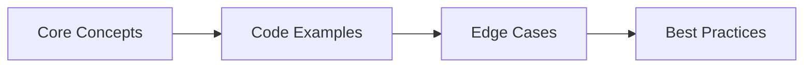

# Spring & Spring Boot Interview Q&A

> **Previous:** [Java Core Interview Q&amp;A](./56-interview-java.md) | **Next:** [REST API Interview Q&amp;A](./58-interview-rest-api.md)

This chapter covers 35+ essential Spring and Spring Boot interview questions from DI/IoC and bean lifecycle through auto-configuration, MVC, data access, security, transactions, and testing. Each answer includes complete, compilable code examples targeting senior-level backend interviews.


<!-- Image Gallery -->
<section class="lesson-visuals" aria-label="Visual learning resources">
  <header><span>VISUAL LEARNING</span><h2>See it. Review it. Remember it.</h2></header>
  <a class="lesson-visual-card" href="../../assets/images/lessons/java/57-interview-spring/handwritten-notes.png" target="_blank" rel="noopener">
    
    <span><strong>Handwritten notes</strong>Condensed notes for deliberate review.</span>
  </a>
  <a class="lesson-visual-card" href="../../assets/images/lessons/java/57-interview-spring/sticky-notes.png" target="_blank" rel="noopener">
    
    <span><strong>Sticky-note revision</strong>Fast recall prompts for revision.</span>
  </a>
  <a class="lesson-visual-card" href="../../assets/images/lessons/java/57-interview-spring/visual-explanation.png" target="_blank" rel="noopener">
    
    <span><strong>Visual concept guide</strong>A connected explanation of the key ideas.</span>
  </a>
</section>
<!-- End Image Gallery -->

## Chapter at a Glance

| Topic | Key Focus | Key Questions |
|-------|----------|--------------|
| Core Concepts | Foundational understanding | Definitions, contrasts, trade-offs |
| Code Examples | Compilable, runnable solutions | Real interview scenarios |
| Best Practices | Production-ready patterns | Pitfalls to avoid |

## Chapter Roadmap



### Q1: What types of dependency injection does Spring support?


> **Pro Tip:** In interviews, always start with the "why" before the "how." Explaining the reasoning behind a design choice is more valuable than reciting syntax.

> **Remember:** Code readability matters in interviews. Write clean, well-structured code with meaningful variable names.


**Answer:** Spring supports three DI types: constructor injection (recommended), setter injection, and field injection. Constructor injection ensures required dependencies are present at creation and enables immutable fields. Setter injection for optional dependencies. Field injection is discouraged due to testability issues and hidden dependencies.

```java
import org.springframework.stereotype.Service;
import org.springframework.beans.factory.annotation.Autowired;
import org.springframework.context.annotation.*;

// === Constructor injection (recommended) ===
@Service
class UserService {
    private final UserRepository userRepository;
    private final EmailService emailService;

    // No @Autowired needed for single constructor (Spring auto-wires)
    public UserService(UserRepository userRepository, EmailService emailService) {
        this.userRepository = userRepository;
        this.emailService = emailService;
    }
}

// === Setter injection ===
@Service
class NotificationService {
    private MessageSender messageSender;

    @Autowired
    public void setMessageSender(MessageSender messageSender) {
        this.messageSender = messageSender;
    }
}

// === Field injection (discouraged) ===
@Service
class OrderService {
    @Autowired
    private OrderRepository orderRepository; // Can't make final, hard to test
}

// === Configuration class with @Bean ===
@Configuration
class AppConfig {
    @Bean
    public PaymentGateway paymentGateway() {
        return new StripePaymentGateway("api-key");
    }

    @Bean
    public CheckoutService checkoutService(PaymentGateway paymentGateway) {
        return new CheckoutService(paymentGateway); // constructor injection
    }
}

// === Qualifier for multiple beans ===
@Service
class ReportService {
    private final DataSource primaryDataSource;

    public ReportService(@Qualifier("readOnlyDataSource") DataSource dataSource) {
        this.primaryDataSource = dataSource;
    }
}

// === Primary bean ===
@Configuration
class DataSourceConfig {
    @Bean @Primary
    public DataSource primaryDataSource() { return new HikariDataSource(); }

    @Bean
    public DataSource secondaryDataSource() { return new HikariDataSource(); }
}

interface UserRepository {}
interface EmailService {}
interface MessageSender {}
interface OrderRepository {}
interface PaymentGateway {}
class StripePaymentGateway implements PaymentGateway {
    StripePaymentGateway(String key) {}
}
class CheckoutService { CheckoutService(PaymentGateway pg) {} }
interface DataSource {}
class HikariDataSource implements DataSource {}
class OrderRepositoryImpl implements OrderRepository {}
```

Constructor injection: required deps, immutable fields, no null checks. Setter: optional deps, mutable. Field: hides deps, breaks testing (need reflection for DI). Spring favors constructor injection since 4.x.

### Q2: How does @Autowired work? What if there are multiple matching beans?


**Answer:** @Autowired performs by-type injection. If multiple beans match, it narrows by @Qualifier, then by @Primary, then by parameter/field name (last resort). If still ambiguous, throws NoUniqueBeanDefinitionException.

```java
import org.springframework.beans.factory.annotation.*;
import org.springframework.stereotype.*;

// === Multiple matching beans ===
interface PaymentProcessor {
    void process(double amount);
}

@Component
class CreditCardProcessor implements PaymentProcessor {
    public void process(double amount) { System.out.println("CC: "+amount); }
}

@Component
class PayPalProcessor implements PaymentProcessor {
    public void process(double amount) { System.out.println("PayPal: "+amount); }
}

// === Solution 1: @Primary ===
@Component @Primary
class DefaultPaymentProcessor implements PaymentProcessor {
    public void process(double amount) { System.out.println("Default: "+amount); }
}

// === Solution 2: @Qualifier ===
@Service
class OrderService {
    private final PaymentProcessor processor;

    public OrderService(@Qualifier("payPalProcessor") PaymentProcessor processor) {
        this.processor = processor;
    }
}

// === Solution 3: Inject all beans ===
@Service
class PaymentRouter {
    private final List<PaymentProcessor> processors;

    public PaymentRouter(List<PaymentProcessor> processors) {
        this.processors = processors; // All PaymentProcessor beans injected
    }

    public void route(double amount, String type) {
        for(var p : processors) {
            if(p.getClass().getSimpleName().toLowerCase().contains(type)) {
                p.process(amount);
            }
        }
    }
}

// === Solution 4: Map with bean names ===
@Service
class PaymentGateway {
    private final Map<String, PaymentProcessor> processorMap;

    public PaymentGateway(Map<String, PaymentProcessor> processorMap) {
        this.processorMap = processorMap; // key=bean name
    }

    public void pay(String method, double amount) {
        processorMap.get(method).process(amount);
    }
}

// === @Autowired(required = false) ===
@Service
class OptionalService {
    private final AuditService auditService;

    public OptionalService(@Autowired(required = false) AuditService auditService) {
        this.auditService = auditService; // null if no AuditService bean
    }
}

interface AuditService {}
```

@Autowired resolution: byType -> @Qualifier -> @Primary -> field name. Inject List/Map to get all beans of a type. @Autowired(required=false) for optional dependencies (prefer Optional or ObjectProvider).

### Q3: Circular dependencies → how does Spring handle them?


**Answer:** Spring resolves circular dependencies through three-level singleton cache (early exposure). For prototype-scoped beans, circular deps cannot be resolved and throw BeanCurrentlyInCreationException.

```java
import org.springframework.stereotype.*;
import org.springframework.beans.factory.annotation.*;
import org.springframework.context.annotation.*;

// === Circular dependency (self-referencing) ===
// A depends on B, B depends on A

@Component
class ServiceA {
    private final ServiceB serviceB;

    public ServiceA(ServiceB serviceB) { this.serviceB = serviceB; }

    public String doA() { return "A" + serviceB.doB(); }
}

@Component
class ServiceB {
    private final ServiceA serviceA;

    public ServiceB(ServiceA serviceA) { this.serviceA = serviceA; }

    public String doB() { return "B" + serviceA.doA(); } // infinite recursion!
}

// === Fix 1: Setter injection (allows early proxy exposure) ===
@Component
class ServiceAFixed {
    private ServiceBFixed serviceB;

    @Autowired
    public void setServiceB(ServiceBFixed serviceB) { this.serviceB = serviceB; }

    public String doA() { return "A" + serviceB.doB(); }
}

@Component
class ServiceBFixed {
    private ServiceAFixed serviceA;

    @Autowired
    public void setServiceA(ServiceAFixed serviceA) { this.serviceA = serviceA; }

    public String doB() { return "B"; } // Avoids circular call
}

// === Fix 2: @Lazy on one dependency ===
@Component
class ServiceALazy {
    private final ServiceB serviceB;

    public ServiceALazy(@Lazy ServiceB serviceB) { this.serviceB = serviceB; }

    public String doA() { return "A" + serviceB.doB(); }
}

// === Fix 3: Refactor → extract shared interface ===
interface DataStore {
    String getData();
}

@Component
class SharedStore implements DataStore {
    public String getData() { return "shared"; }
}

@Component
class ServiceARefactored {
    private final DataStore store;
    public ServiceARefactored(DataStore store) { this.store = store; }
}

@Component
class ServiceBRefactored {
    private final DataStore store;
    public ServiceBRefactored(DataStore store) { this.store = store; }
}
```

Spring singleton cache: singletonObjects (fully created) -> earlySingletonObjects (exposed but not fully initialized) -> singletonFactories (raw object before post-processing). Constructor injection + circular deps fails → use setter or @Lazy. Best fix: redesign to eliminate circular deps.

### Q4: Bean lifecycle → from creation to destruction.


**Answer:** Spring bean lifecycle: instantiation -> populate properties -> set bean name/classloader -> post-process before init (postProcessBeforeInitialization) -> @PostConstruct/InitializingBean/init-method -> post-process after init (postProcessAfterInitialization) -> ready -> @PreDestroy/DisposableBean/destroy-method.

```java
import org.springframework.beans.factory.*;
import org.springframework.beans.factory.config.*;
import org.springframework.stereotype.*;
import jakarta.annotation.*;

// === Bean demonstrating lifecycle hooks ===
@Component
class LifecycleBean implements InitializingBean, DisposableBean, BeanNameAware, BeanFactoryAware {

    public LifecycleBean() {
        System.out.println("1. Instantiation: constructor called");
    }

    private String name;

    @Autowired
    public void setName(String name) {
        this.name = name;
        System.out.println("2. Dependency injection: properties set");
    }

    @Override
    public void setBeanName(String name) {
        System.out.println("3. BeanNameAware: " + name);
    }

    @Override
    public void setBeanFactory(BeanFactory bf) {
        System.out.println("4. BeanFactoryAware: context set");
    }

    @PostConstruct
    public void init() {
        System.out.println("6. @PostConstruct: initialization callback");
    }

    @Override
    public void afterPropertiesSet() {
        System.out.println("7. InitializingBean.afterPropertiesSet()");
    }

    @PreDestroy
    public void cleanup() {
        System.out.println("11. @PreDestroy: cleanup before shutdown");
    }

    @Override
    public void destroy() {
        System.out.println("12. DisposableBean.destroy()");
    }
}

// === BeanPostProcessor: intercepts all beans ===
@Component
class CustomBeanPostProcessor implements BeanPostProcessor {
    @Override
    public Object postProcessBeforeInitialization(Object bean, String beanName) {
        if (bean instanceof LifecycleBean) {
            System.out.println("5. postProcessBeforeInitialization: " + beanName);
        }
        return bean;
    }

    @Override
    public Object postProcessAfterInitialization(Object bean, String beanName) {
        if (bean instanceof LifecycleBean) {
            System.out.println("8. postProcessAfterInitialization: " + beanName);
        }
        return bean;
    }
}

// === Init/destroy method via @Bean ===
class CustomBean {
    public void startup() { System.out.println("Custom init"); }
    public void shutdown() { System.out.println("Custom destroy"); }
}

@Configuration
class BeanConfig {
    @Bean(initMethod = "startup", destroyMethod = "shutdown")
    public CustomBean customBean() { return new CustomBean(); }
}

// === If ApplicationContextAware ===
@Component
class ContextAwareBean implements ApplicationContextAware {
    private ApplicationContext ctx;

    @Override
    public void setApplicationContext(ApplicationContext ctx) {
        this.ctx = ctx;
        System.out.println("ApplicationContextAware set");
    }
}
```

Full order: constructor -> DI -> *Aware interfaces -> postProcessBeforeInit -> @PostConstruct -> afterPropertiesSet -> init-method -> postProcessAfterInit -> bean ready -> ... -> @PreDestroy -> destroy -> destroy-method.

### Q5: Bean scopes in Spring.


**Answer:** Six scopes: singleton (default, one per IoC container), prototype (new instance per injection/getBean), request (one per HTTP request), session (one per HTTP session), application (one per ServletContext), websocket (one per WebSocket session).

```java
import org.springframework.context.annotation.*;
import org.springframework.web.context.annotation.*;
import org.springframework.stereotype.*;

// === Singleton (default) ===
@Component
class AppCache {
    private final java.util.Map<String, Object> store = new java.util.concurrent.ConcurrentHashMap<>();
    // Same instance for entire application
}

// === Prototype ===
@Component
@Scope("prototype")
class ShoppingCart {
    private final java.util.List<String> items = new java.util.ArrayList<>();
    // New instance every time injected or requested
    public void addItem(String item) { items.add(item); }
    public java.util.List<String> getItems() { return items; }
}

// === Request scope ===
@Component
@RequestScope // or @Scope(value = "request", proxyMode = ScopedProxyMode.TARGET_CLASS)
class RequestContext {
    private String requestId;
    private String userId;
    // New instance per HTTP request
}

// === Session scope ===
@Component
@SessionScope
class UserSession {
    private String sessionId;
    private boolean authenticated;
    // Same instance per HTTP session
}

// === Application scope ===
@Component
@ApplicationScope
class AppConfig {
    private final java.util.Properties config = new java.util.Properties();
    // Same instance per ServletContext (wider than singleton in web-aware context)
}

// === Configuration with prototypes ===
@Configuration
class ScopeConfig {
    @Bean
    @Scope("prototype")
    public ShoppingCart cart() { return new ShoppingCart(); }
}

// === Scoped proxy (for injecting shorter-lived beans into longer-lived ones) ===
@Component
@Scope(value = "request", proxyMode = ScopedProxyMode.INTERFACES)
class RequestIdHolder {
    private String id;

    public String getId() {
        if (id == null) id = java.util.UUID.randomUUID().toString();
        return id;
    }
}

@Service
class RequestScopedService {
    private final RequestIdHolder requestIdHolder;

    public RequestScopedService(RequestIdHolder requestIdHolder) {
        this.requestIdHolder = requestIdHolder; // proxy injected, not actual bean
    }
}
```

Singleton: shared, thread-safe consideration. Prototype: full lifecycle not managed by Spring (destroy callbacks not invoked). Request/Session: require web-aware ApplicationContext, need proxyMode for injection into singletons. ScopedProxy creates AOP proxy that delegates to the real scoped instance.

### Q6: Spring Boot auto-configuration.


**Answer:** @EnableAutoConfiguration activates auto-configuration based on classpath dependencies, existing beans, and property settings. Conditionals (@ConditionalOnClass, @ConditionalOnMissingBean, etc.) gate auto-configuration classes loaded via spring.factories.

```java
import org.springframework.boot.autoconfigure.*;
import org.springframework.boot.autoconfigure.condition.*;
import org.springframework.context.annotation.*;
import org.springframework.core.io.Resource;
import java.util.*;

// === Custom auto-configuration ===
@Configuration
@ConditionalOnClass(name = "com.zaxxer.hikari.HikariDataSource")
@ConditionalOnProperty(name = "app.datasource.enabled", havingValue = "true", matchIfMissing = true)
@AutoConfigureBefore(name = "org.springframework.boot.autoconfigure.jdbc.DataSourceAutoConfiguration")
public class CustomDataSourceAutoConfiguration {

    @Bean
    @ConditionalOnMissingBean
    public DataSourceConfigurer dataSourceConfigurer() {
        return new DataSourceConfigurer();
    }

    @Configuration
    @ConditionalOnProperty(name = "app.datasource.read-replica.enabled")
    @ConditionalOnMissingBean(name = "readReplicaDataSource")
    public static class ReadReplicaConfig {
        @Bean
        public javax.sql.DataSource readReplicaDataSource() {
            return new com.zaxxer.hikari.HikariDataSource();
        }
    }
}

class DataSourceConfigurer {
    public void configure() { System.out.println("Configuring datasource"); }
}

// === spring.factories (META-INF/spring/org.springframework.boot.autoconfigure.AutoConfiguration.imports) ===
// com.example.CustomDataSourceAutoConfiguration

// === Auto-configuration conditionals ===
@Configuration
@ConditionalOnClass(name = "org.springframework.data.redis.core.RedisTemplate")
@ConditionalOnMissingBean(name = "redisTemplate")
class RedisAutoConfig {
    @Bean
    public org.springframework.data.redis.core.RedisTemplate<String, String> redisTemplate() {
        return new org.springframework.data.redis.core.RedisTemplate<>();
    }
}

// === Conditional examples ===
@Configuration
class ConditionalDemo {
    // Only if class is on classpath
    @Bean @ConditionalOnClass(name = "org.apache.kafka.clients.producer.KafkaProducer")
    public KafkaProducerConfig kafkaConfig() { return new KafkaProducerConfig(); }

    // Only if property has specific value
    @Bean @ConditionalOnProperty(name = "cache.type", havingValue = "redis")
    public RedisCacheManager redisCacheManager() { return new RedisCacheManager(); }

    // Only if bean is missing (default behavior)
    @Bean @ConditionalOnMissingBean
    public ObjectMapper objectMapper() { return new ObjectMapper(); }

    // Only if expression evaluates true
    @Bean @ConditionalOnExpression("${app.features.advanced:false}")
    public AdvancedFeature advancedFeature() { return new AdvancedFeature(); }

    // Only in specific environment
    @Bean @Profile("dev")
    public DevConsole devConsole() { return new DevConsole(); }
}

class KafkaProducerConfig {}
class RedisCacheManager {}
class ObjectMapper {}
class AdvancedFeature {}
class DevConsole {}
```

Auto-configuration triggers: @SpringBootApplication (which includes @EnableAutoConfiguration). Conditionals are evaluated at startup. Debug mode: spring.boot.autoconfigure.LoggingAutoConfigurationDebug=true or --debug flag. Auto-configuration ordering via @AutoConfigureBefore, @AutoConfigureAfter, @AutoConfigureOrder.

### Q7: How does DispatcherServlet work in Spring MVC?


**Answer:** DispatcherServlet is the front controller in Spring MVC. It receives all HTTP requests and delegates to specialized components via a chain: HandlerMapping -> HandlerAdapter -> Interceptors -> Controller -> HandlerExceptionResolver -> ViewResolver.

```java
import org.springframework.web.bind.annotation.*;
import org.springframework.web.servlet.*;
import org.springframework.web.servlet.config.annotation.*;
import org.springframework.web.servlet.mvc.method.annotation.*;
import org.springframework.http.*;
import jakarta.servlet.http.*;
import java.util.*;

// === DispatcherServlet flow ===
/*
 * HTTP Request
 *    |
 *    v
 * DispatcherServlet.doDispatch()
 *    |
 *    v
 * HandlerMapping.getHandler(request)
 *    |  - @RequestMapping: RequestMappingHandlerMapping
 *    |  - Controller implements Controller: BeanNameUrlHandlerMapping
 *    |  - XML/annotations: SimpleUrlHandlerMapping
 *    v
 * HandlerExecutionChain (handler + interceptors)
 *    |
 *    v
 * preHandle() interceptors
 *    |
 *    v
 * HandlerAdapter.handle(request, response, handler)
 *    |  - @RequestMapping methods: RequestMappingHandlerAdapter
 *    |  - Invokes controller method with argument resolvers
 *    |  - Argument resolvers: @RequestParam, @PathVariable, @RequestBody, etc.
 *    v
 * Controller method executes
 *    |  - Returns ModelAndView (legacy) or @ResponseBody (REST)
 *    v
 * postHandle() interceptors
 *    |
 *    v
 * ViewResolver.resolveViewName(viewName, locale)
 *    |  - InternalResourceViewResolver (JSP), Thymeleaf, FreeMarker
 *    v
 * View.render(model, request, response)
 *    |
 *    v
 * afterCompletion() interceptors
 */

@RestController
class UserController {
    @GetMapping("/users/{id}")
    public ResponseEntity<User> getUser(@PathVariable Long id, @RequestParam(defaultValue = "false") boolean details) {
        User user = new User(id, "Alice", "alice@x.com");
        return ResponseEntity.ok(user);
    }

    @PostMapping("/users")
    @ResponseStatus(HttpStatus.CREATED)
    public User createUser(@RequestBody @Valid CreateUserRequest request) {
        return new User(1L, request.name(), request.email());
    }
}

// === Custom argument resolver ===
@Component
class CurrentUserArgumentResolver implements HandlerMethodArgumentResolver {
    @Override
    public boolean supportsParameter(MethodParameter param) {
        return param.getParameterType().equals(CurrentUser.class);
    }

    @Override
    public Object resolveArgument(MethodParameter param, ModelAndViewContainer mav,
                                  NativeWebRequest req, WebDataBinderFactory binder) {
        HttpServletRequest request = (HttpServletRequest) req.getNativeRequest();
        String userId = request.getHeader("X-User-Id");
        return userId != null ? new CurrentUser(Long.parseLong(userId)) : null;
    }
}

// === Custom interceptor ===
@Component
class RequestLoggingInterceptor implements HandlerInterceptor {
    @Override
    public boolean preHandle(HttpServletRequest request, HttpServletResponse response, Object handler) {
        System.out.println("Request: " + request.getMethod() + " " + request.getRequestURI());
        return true; // continue processing
    }

    @Override
    public void postHandle(HttpServletRequest request, HttpServletResponse response,
                           Object handler, ModelAndView modelAndView) {
        System.out.println("Response status: " + response.getStatus());
    }

    @Override
    public void afterCompletion(HttpServletRequest request, HttpServletResponse response,
                                Object handler, Exception ex) {
        System.out.println("Request completed");
    }
}

// === Register interceptors ===
@Configuration
class WebConfig implements WebMvcConfigurer {
    @Override
    public void addInterceptors(InterceptorRegistry registry) {
        registry.addInterceptor(new RequestLoggingInterceptor())
                .addPathPatterns("/api/**")
                .excludePathPatterns("/api/public/**");
    }

    @Override
    public void addArgumentResolvers(List<HandlerMethodArgumentResolver> resolvers) {
        resolvers.add(new CurrentUserArgumentResolver());
    }
}

// === @ControllerAdvice for global handling ===
@ControllerAdvice
class GlobalExceptionHandler {
    @ExceptionHandler(ResourceNotFoundException.class)
    @ResponseStatus(HttpStatus.NOT_FOUND)
    public ErrorResponse handleNotFound(ResourceNotFoundException ex) {
        return new ErrorResponse("NOT_FOUND", ex.getMessage());
    }

    @ExceptionHandler(MethodArgumentNotValidException.class)
    @ResponseStatus(HttpStatus.BAD_REQUEST)
    public ErrorResponse handleValidation(MethodArgumentNotValidException ex) {
        String msg = ex.getBindingResult().getFieldErrors().stream()
            .map(e -> e.getField() + ": " + e.getDefaultMessage())
            .reduce((a,b) -> a + "; " + b)
            .orElse("Validation failed");
        return new ErrorResponse("VALIDATION_ERROR", msg);
    }
}

record User(Long id, String name, String email) {}
record CreateUserRequest(String name, String email) {}
record CurrentUser(Long id) {}
record ErrorResponse(String code, String message) {}
class ResourceNotFoundException extends RuntimeException {
    ResourceNotFoundException(String msg) { super(msg); }
}
```

Key interfaces: HandlerMapping (URL->handler mapping), HandlerAdapter (invokes handler), HandlerInterceptor (pre/post/after), HandlerExceptionResolver (exception handling), ViewResolver (view name->View), MessageConverter (Java&lt;->JSON/XML).

### Q8: N+1 query problem in Spring Data JPA.


**Answer:** N+1 occurs when fetching an entity loads its associations lazily, then iterating over N entities triggers N additional queries. Solutions: JOIN FETCH, EntityGraph, @BatchSize, fetch join in @Query.

```java
import jakarta.persistence.*;
import org.springframework.data.jpa.repository.*;
import org.springframework.stereotype.*;
import java.util.*;

// === Domain entities ===
@Entity
class Author {
    @Id @GeneratedValue Long id;
    String name;

    @OneToMany(mappedBy = "author", fetch = FetchType.LAZY)
    List<Book> books = new ArrayList<>();
}

@Entity
class Book {
    @Id @GeneratedValue Long id;
    String title;

    @ManyToOne(fetch = FetchType.LAZY)
    @JoinColumn(name = "author_id")
    Author author;
}

// === N+1 problem ===
// List<Author> authors = authorRepository.findAll();
// for(Author a : authors) {
//     a.getBooks().size(); // triggers N additional queries
// }
// Total: 1 + N queries

// === Solution 1: JOIN FETCH ===
interface AuthorRepository extends JpaRepository<Author, Long> {
    @Query("SELECT a FROM Author a LEFT JOIN FETCH a.books")
    List<Author> findAllWithBooks();

    @Query("SELECT a FROM Author a LEFT JOIN FETCH a.books WHERE a.id = :id")
    Optional<Author> findByIdWithBooks(@Param("id") Long id);
}

// === Solution 2: @EntityGraph ===
interface AuthorRepositoryWithGraph extends JpaRepository<Author, Long> {
    @EntityGraph(attributePaths = "books")
    @Override
    List<Author> findAll();

    @EntityGraph(attributePaths = "books")
    Optional<Author> findByName(String name);
}

// === Solution 3: @BatchSize ===
@Entity
class AuthorWithBatch {
    @Id @GeneratedValue Long id;
    String name;

    @OneToMany(mappedBy = "author")
    @org.hibernate.annotations.BatchSize(size = 20)
    List<Book> books = new ArrayList<>();
    // Loads books for up to 20 authors in a single query
}

// === Solution 4: FetchMode.SUBSELECT ===
@Entity
class AuthorWithSubselect {
    @Id @GeneratedValue Long id;
    String name;

    @OneToMany(mappedBy = "author")
    @org.hibernate.annotations.Fetch(org.hibernate.annotations.FetchMode.SUBSELECT)
    List<Book> books = new ArrayList<>();
    // Loads all books for all fetched authors in a second query
}

// === Solution 5: DTO projection ===
record AuthorBookCountDto(String name, long bookCount) {}

interface AuthorReportRepository extends JpaRepository<Author, Long> {
    @Query("SELECT new com.example.AuthorBookCountDto(a.name, COUNT(b)) " +
           "FROM Author a LEFT JOIN a.books b GROUP BY a.name")
    List<AuthorBookCountDto> getAuthorBookCounts();
}
```

N+1 detection: enable SQL logging (spring.jpa.show-sql=true), use datasource-proxy appender. JOIN FETCH may cause cartesian product for multiple collections (use Set instead of List, or multiple queries). EntityGraph is declarative alternative to JOIN FETCH.

### Q9: Fetch strategies → EAGER vs LAZY.


**Answer:** EAGER loads the association immediately (join query or second select). LAZY loads on first access (proxy or bytecode enhancement). LAZY is default for @OneToMany/@ManyToMany. EAGER is default for @ManyToOne/@OneToOne.

```java
import jakarta.persistence.*;
import java.util.*;

@Entity
class Customer {
    @Id @GeneratedValue Long id;

    // Default: LAZY for collections
    @OneToMany(mappedBy = "customer", fetch = FetchType.LAZY)
    List<Order> orders = new ArrayList<>();

    // Default: EAGER for single associations
    @ManyToOne(fetch = FetchType.EAGER)
    @JoinColumn(name = "address_id")
    Address address;

    // LAZY single association (override default)
    @OneToOne(fetch = FetchType.LAZY)
    @JoinColumn(name = "profile_id")
    Profile profile;
}

// === LAZY loading mechanics ===
// Hibernate creates a proxy object (subclass generated by bytecode enhancement)
// When a method is called on the proxy, it initializes with a DB query
// Requires active Hibernate session (lazy-initialization-exception otherwise)

// === LAZY loading outside transaction ===
@Service
class CustomerService {
    @PersistenceContext
    private EntityManager em;

    @Transactional(readOnly = true)
    public Customer findWithSession(Long id) {
        return em.find(Customer.class, id);
    }

    public void demoLazyException(Long id) {
        Customer c = findWithSession(id); // Session closed on return
        // c.getOrders().size(); // LazyInitializationException!
    }
}

// === Fix: JOIN FETCH in query ===
interface CustomerRepo extends JpaRepository<Customer, Long> {
    @Query("SELECT c FROM Customer c LEFT JOIN FETCH c.orders WHERE c.id = :id")
    Optional<Customer> findByIdWithOrders(@Param("id") Long id);
}

// === Fix: Open Session in View (OSIV, not recommended) ===
// spring.jpa.open-in-view=true (default)
// Keeps session open through the entire request
// Problems: long-running tx, accidental N+1, connection pool exhaustion

// === Fix: DTO projection (no lazy loading needed) ===
record OrderSummary(Long orderId, String status, BigDecimal total) {}

interface OrderRepo extends JpaRepository<Order, Long> {
    @Query("SELECT new com.example.OrderSummary(o.id, o.status, o.total) " +
           "FROM Order o WHERE o.customer.id = :customerId")
    List<OrderSummary> findByCustomerId(@Param("customerId") Long customerId);
}

// === Performance comparison ===
class FetchStrategyComparison {
    // EAGER: always loads even if not needed -> wasted queries
    // LAZY: loads on access -> potential N+1, but avoids unnecessary joins

    // Best practices:
    // 1. Default to LAZY
    // 2. Use JOIN FETCH / EntityGraph when you know you need the association
    // 3. Use DTO projections for read-only queries
    // 4. Disable OSIV (spring.jpa.open-in-view=false)
    // 5. @BatchSize as safety net for lazy loading
}
```

EAGER is dangerous in practice: it forces unnecessary joins, causes cartesian products with multiple collections, and can lead to loading entire databases. Always default to LAZY and explicitly fetch what you need.

### Q10: Cascade types in JPA.


**Answer:** Cascades propagate entity state changes from parent to child. Types: PERSIST, MERGE, REMOVE, REFRESH, DETACH, ALL. Operations cascade on EntityManager calls (persist(), merge(), remove(), etc.).

```java
import jakarta.persistence.*;
import java.util.*;

@Entity
class BlogPost {
    @Id @GeneratedValue Long id;
    String title;

    @OneToMany(mappedBy = "post", cascade = CascadeType.ALL, orphanRemoval = true)
    List<Comment> comments = new ArrayList<>();

    @OneToOne(cascade = CascadeType.PERSIST)
    @JoinColumn(name = "metadata_id")
    PostMetadata metadata;

    @ManyToMany(cascade = {CascadeType.PERSIST, CascadeType.MERGE})
    @JoinTable(name = "post_tags")
    Set<Tag> tags = new HashSet<>();
}

@Entity
class Comment {
    @Id @GeneratedValue Long id;
    String text;

    @ManyToOne(fetch = FetchType.LAZY)
    @JoinColumn(name = "post_id")
    BlogPost post;
}

@Entity
class PostMetadata {
    @Id @GeneratedValue Long id;
    int viewCount;
}

@Entity
class Tag {
    @Id @GeneratedValue Long id;
    String name;
}

// === Cascade behavior ===
@Service
class BlogService {
    @PersistenceContext private EntityManager em;

    @Transactional
    public void createPost() {
        BlogPost post = new BlogPost();
        post.title = "Cascade Demo";

        // Cascade PERSIST: comment persisted automatically
        Comment c1 = new Comment();
        c1.text = "Great post!";
        post.comments.add(c1);
        c1.post = post; // maintain both sides

        // Cascade PERSIST: metadata persisted automatically
        PostMetadata meta = new PostMetadata();
        meta.viewCount = 0;
        post.metadata = meta;

        em.persist(post); // cascades to comments and metadata
        // Post, 2 Comments, PostMetadata all inserted
    }

    @Transactional
    public void removePost(Long id) {
        BlogPost post = em.find(BlogPost.class, id);
        em.remove(post); // cascades REMOVE to all comments (orphanRemoval also works)
        // Cascade ALL includes REMOVE
    }

    @Transactional
    public void orphanRemoval() {
        BlogPost post = em.find(BlogPost.class, 1L);
        post.comments.remove(0); // orphanRemoval=true -> DELETE for removed comment
    }

    @Transactional
    public void mergeAndCascade() {
        // When merging a detached entity, CascadeType.MERGE
        // propagates merge() to associated entities
        BlogPost detached = em.find(BlogPost.class, 1L);
        em.detach(detached);
        em.clear();

        detached.title = "Updated Title";
        Tag tag = new Tag();
        tag.name = "java";
        detached.tags.add(tag);

        em.merge(detached); // cascades MERGE to tags
    }
}
```

CascadeType.ALL: convenience for all operations. orphanRemoval: deletes children removed from the collection (requires a collection association). CascadeType.REMOVE without orphanRemoval: deletes children only when parent is explicitly removed. Best practice: use cascade sparingly. CascadeType.ALL on @OneToMany is common for parent-owned associations. Never cascade REMOVE across many-to-many.

### Q11: Transaction management → @Transactional propagation.


**Answer:** @Transactional defines transaction boundaries with seven propagation behaviors: REQUIRED (default), REQUIRES_NEW, NESTED, SUPPORTS, NOT_SUPPORTED, MANDATORY, NEVER.

```java
import org.springframework.transaction.annotation.*;
import org.springframework.stereotype.*;
import org.springframework.transaction.*;
import org.springframework.transaction.support.*;

@Service
class PaymentService {

    @Transactional
    public void processPayment(Long orderId, BigDecimal amount) {
        // REQUIRED (default): join existing transaction or create new
        // All operations in same transaction
        deductBalance(amount);
        recordTransaction(orderId, amount);
    }

    // === Propagation types ===
    @Transactional(propagation = Propagation.REQUIRED)
    public void required() {
        // Default. Uses current tx, creates if none.
    }

    @Transactional(propagation = Propagation.REQUIRES_NEW)
    public void requiresNew() {
        // Suspends current tx, creates new independent tx.
        // New tx commits/rolls back independently of outer.
    }

    @Transactional(propagation = Propagation.NESTED)
    public void nested() {
        // JDBC savepoint-based. Inner can rollback independently.
        // Only works with JDBC DataSourceTransactionManager.
    }

    @Transactional(propagation = Propagation.SUPPORTS)
    public void supports() {
        // Uses current tx if exists, runs non-transactional if not.
    }

    @Transactional(propagation = Propagation.MANDATORY)
    public void mandatory() {
        // Requires existing tx. Throws if none exists.
    }

    @Transactional(propagation = Propagation.NOT_SUPPORTED)
    public void notSupported() {
        // Suspends current tx, runs non-transactional.
    }

    @Transactional(propagation = Propagation.NEVER)
    public void never() {
        // Must NOT run in a transaction. Throws if one exists.
    }

    @Transactional(propagation = Propagation.REQUIRES_NEW)
    public void auditLog(String action) {
        // Always commits independently of caller's rollback
    }
}

// === REQUIRES_NEW pattern ===
@Service
class OrderService {
    private final PaymentService paymentService;
    private final AuditService auditService;

    OrderService(PaymentService paymentService, AuditService auditService) {
        this.paymentService = paymentService;
        this.auditService = auditService;
    }

    @Transactional
    public void placeOrder(Long orderId) {
        try {
            paymentService.processPayment(orderId, BigDecimal.valueOf(100));
        } catch (Exception e) {
            // Order fails, but audit is still saved
            System.err.println("Payment failed: " + e.getMessage());
            throw e; // Rollback order transaction
        }
    }

    @Transactional
    public void processWithAudit(Long orderId) {
        // This outer tx rolls back on failure
        paymentService.deductBalance(BigDecimal.valueOf(100));
        // auditLog uses REQUIRES_NEW → commits regardless of outer rollback
        paymentService.auditLog("Order " + orderId + " processed");
        throw new RuntimeException("Simulated failure");
        // Outer rolls back, but auditLog already committed!
    }
}

// === Isolation levels ===
@Service
class IsolationService {
    @Transactional(isolation = Isolation.READ_COMMITTED) // Default
    public void readCommitted() { }

    @Transactional(isolation = Isolation.REPEATABLE_READ)
    public void repeatableRead() { }

    @Transactional(isolation = Isolation.SERIALIZABLE)
    public void serializable() { }

    @Transactional(isolation = Isolation.READ_UNCOMMITTED)
    public void readUncommitted() { }

    @Transactional(isolation = Isolation.DEFAULT)
    public void useDefault() { }
}

// === Rollback rules ===
@Service
class RollbackService {
    @Transactional(rollbackFor = Exception.class, noRollbackFor = BusinessException.class)
    public void process() {
        // Rollback on Exception and its subclasses (not just RuntimeException)
        // But BusinessException won't trigger rollback
    }

    @Transactional
    public void defaultRollback() {
        // Default: rollback on RuntimeException and Error
        // Checked exceptions do NOT trigger rollback
    }
}
```

Propagation comparison: REQUIRES_NEW each gets independent connection (connection pool pressure). Nested uses savepoints (no separate connection, but limited to JDBC). Self-invocation pitfall: @Transactional only works on external calls through proxy (solve with self-injection or TransactionTemplate).

### Q12: Transaction isolation levels and read phenomena.


**Answer:** Isolation levels define how transaction changes are visible to other transactions. Four ANSI levels with three read phenomena.

```java
import org.springframework.transaction.annotation.Isolation;
import org.springframework.transaction.annotation.Transactional;
import jakarta.persistence.*;

@Entity
class Account {
    @Id @GeneratedValue Long id;
    String owner;
    BigDecimal balance;
}

// === Read phenomena ===
/*
 * Dirty read: read uncommitted changes from another transaction
 * Non-repeatable read: same row read twice, different values (row updated between)
 * Phantom read: same query returns different rows (rows inserted/deleted between)
 */

// === Isolation levels vs phenomena ===
/*
 *                     Dirty Read  Non-repeatable  Phantom
 * READ_UNCOMMITTED    Possible    Possible        Possible
 * READ_COMMITTED      Safe        Possible        Possible
 * REPEATABLE_READ     Safe        Safe            Possible
 * SERIALIZABLE        Safe        Safe            Safe
 */

@Service
class IsolationDemo {

    @PersistenceContext
    EntityManager em;

    // READ_COMMITTED (PostgreSQL/MySQL default)
    // Prevents dirty reads. Non-repeatable reads possible.
    @Transactional(isolation = Isolation.READ_COMMITTED)
    public BigDecimal getBalance(Long accountId) {
        Account a = em.find(Account.class, accountId);
        return a.balance; // If another tx updates and commits between two calls, returns different value
    }

    // REPEATABLE_READ: snapshot isolation (PostgreSQL/InnoDB)
    // Guarantees same row read consistently within transaction
    @Transactional(isolation = Isolation.REPEATABLE_READ)
    public void generateReport() {
        // First read
        List<Account> all = em.createQuery("SELECT a FROM Account a", Account.class).getResultList();
        BigDecimal sum1 = all.stream().map(a -> a.balance).reduce(BigDecimal.ZERO, BigDecimal::add);

        // Another transaction could INSERT new accounts here (phantom)
        // But existing accounts won't change

        // Second read
        List<Account> all2 = em.createQuery("SELECT a FROM Account a", Account.class).getResultList();
        BigDecimal sum2 = all2.stream().map(a -> a.balance).reduce(BigDecimal.ZERO, BigDecimal::add);

        // sum1 == sum2 (repeatable read guarantee for existing rows)
        // size may differ (phantom insert)
    }

    // SERIALIZABLE: highest isolation
    // All transactions execute as if serialized
    // Lowest concurrency, potential serialization failures
    @Transactional(isolation = Isolation.SERIALIZABLE)
    public void transfer(Long fromId, Long toId, BigDecimal amount) {
        Account from = em.find(Account.class, fromId, LockModeType.PESSIMISTIC_WRITE);
        Account to = em.find(Account.class, toId, LockModeType.PESSIMISTIC_WRITE);
        from.balance = from.balance.subtract(amount);
        to.balance = to.balance.add(amount);
    }
}

// === MVCC (Multi-Version Concurrency Control) ===
// PostgreSQL, MySQL InnoDB use MVCC instead of locking for read consistency
// Each transaction sees a snapshot of data at its start time
// Readers never block writers, writers never block readers
// REPEATABLE READ = snapshot isolation (NOT ANSI repeatable read exactly)

// === Oracle isolation ===
// Oracle only supports READ_COMMITTED and SERIALIZABLE
// No Dirty Reads (undo segment provides consistent reads)
```

MVCC details: each row has visibility information (transaction ID, commit timestamp in PostgreSQL). Update creates a new row version. Old versions are cleaned by vacuum (PostgreSQL) or undo cleanup (Oracle/MySQL).

### Q13: Optimistic vs Pessimistic locking.


**Answer:** Optimistic locking assumes conflicts are rare → checks at commit time using version column. Pessimistic locking locks the row at read time and holds until transaction completes.

```java
import jakarta.persistence.*;
import org.springframework.stereotype.*;
import org.springframework.transaction.annotation.*;
import org.springframework.dao.OptimisticLockingFailureException;

// === Optimistic locking ===
@Entity
class Product {
    @Id @GeneratedValue Long id;
    String name;
    Integer quantity;

    @Version
    private Long version; // Hibernate checks on update

    // On update: "UPDATE product SET quantity=?, version=? WHERE id=? AND version=?"
    // If version doesn't match: OptimisticLockException
}

@Service
class InventoryService {
    @PersistenceContext
    EntityManager em;

    @Transactional
    public void decreaseStock(Long productId, int amount) {
        Product p = em.find(Product.class, productId);
        // At this point, p.version is say 5

        if (p.quantity < amount) throw new RuntimeException("Insufficient stock");

        p.quantity -= amount;
        // Flush/commit generates:
        // UPDATE product SET quantity=?, version=6 WHERE id=? AND version=5
        // If another thread already updated: rows affected = 0 -> OptimisticLockException
    }

    @Transactional
    public void retryOnFailure(Long productId, int amount) {
        int retries = 3;
        while (retries > 0) {
            try {
                decreaseStock(productId, amount);
                return; // success
            } catch (OptimisticLockingFailureException e) {
                retries--;
                if (retries == 0) throw e;
                // Reload and retry
            }
        }
    }
}

// === Pessimistic locking ===
@Service
class PortalService {
    @PersistenceContext
    EntityManager em;

    @Transactional
    public void bookSeat(Long seatId, String userId) {
        Seat seat = em.find(Seat.class, seatId, LockModeType.PESSIMISTIC_WRITE);
        // SELECT ... FOR UPDATE → row locked until tx commits
        // Other transactions trying to read this seat with PESSIMISTIC_WRITE will wait

        if (seat.booked) throw new RuntimeException("Already booked");
        seat.booked = true;
        seat.bookedBy = userId;
    }

    @Transactional
    public void checkAndBook(Long seatId, String userId) {
        // PESSIMISTIC_READ: shared lock, others can read but not write
        Seat seat = em.find(Seat.class, seatId, LockModeType.PESSIMISTIC_READ);

        // PESSIMISTIC_FORCE_INCREMENT: pessimistic lock + force version increment
        // Avoids phantom updates on versioned entities
    }
}

@Entity
class Seat {
    @Id @GeneratedValue Long id;
    boolean booked;
    String bookedBy;

    @Version Long version;
}

// === Pessimistic lock types ===
/*
 * PESSIMISTIC_READ: shared lock (SELECT ... FOR SHARE)
 *   - Others can read with PESSIMISTIC_READ
 *   - No one can write (PESSIMISTIC_WRITE) or upgrade to write
 *
 * PESSIMISTIC_WRITE: exclusive lock (SELECT ... FOR UPDATE)
 *   - No one can read with any pessimistic lock or write
 *   - Non-locking reads still work (MVCC)
 *
 * PESSIMISTIC_FORCE_INCREMENT: like WRITE + increment @Version
 *   - Prevents phantom updates even without @Version
 */

// === Lock timeout ===
@Service
class LockTimeoutExample {
    @PersistenceContext
    EntityManager em;

    @Transactional
    public void tryLock(Long id) {
        Map<String, Object> props = new HashMap<>();
        props.put("jakarta.persistence.lock.timeout", 5000); // 5s timeout
        Account a = em.find(Account.class, id, LockModeType.PESSIMISTIC_WRITE, props);
        // LockTimeoutException if lock not acquired within 5s
    }
}
```

Optimistic: good for low contention, high performance, no connection held. Pessimistic: good for high contention, critical resources, shorter transactions. Version cannot be null on first persist (set @ColumnDefault("0") or initialize field).

### Q14: @Transactional → readOnly flag.


**Answer:** readOnly=true optimizes read-only transactions. Hibernate skips dirty checking, flushes only if explicitly requested. Some databases optimize read-only transactions. Spring also configures FlushMode to MANUAL.

```java
import org.springframework.transaction.annotation.Transactional;
import org.springframework.stereotype.*;
import jakarta.persistence.*;
import java.util.*;

@Service
class ReadOnlyDemo {

    @PersistenceContext
    EntityManager em;

    @Transactional(readOnly = true)
    public List<Product> searchProducts(String query) {
        // Hibernate FlushMode = MANUAL (no auto-flush)
        // Dirty checking disabled (no snapshot creation for managed entities)
        // Better performance for pure reads

        TypedQuery<Product> q = em.createQuery(
            "SELECT p FROM Product p WHERE p.name LIKE :query", Product.class);
        q.setParameter("query", "%" + query + "%");
        return q.getResultList();
    }

    @Transactional(readOnly = true)
    public ProductReport generateReport(Long productId) {
        Product p = em.find(Product.class, productId);

        // Even though we're modifying (bad practice in read-only tx):
        p.name = "Modified"; // Hibernate won't flush this dirty state
        // If we explicitly flush: still works (commit won't write)
        // em.flush(); // writes to DB (read-only is a hint, not strict)

        return new ProductReport(p.id, p.name, p.quantity);
    }

    @Transactional(readOnly = true)
    public long countProducts() {
        // Spring manages transaction lifecycle, sets read-only hint
        // On PostgreSQL: SET TRANSACTION READ ONLY
        // On MySQL: tx_read_only hint
        TypedQuery<Long> q = em.createQuery("SELECT COUNT(p) FROM Product p", Long.class);
        return q.getSingleResult();
    }

    @Transactional // read-write (default)
    public void updateProduct(Long id, String newName) {
        Product p = em.find(Product.class, id);
        p.name = newName; // Dirty: Hibernate will flush at commit
    }
}

record ProductReport(Long id, String name, Integer quantity) {}

// === Behind the scenes ===
@Service
class TransactionBoundaryDemo {
    private final EntityManager em;
    TransactionBoundaryDemo(EntityManager em) { this.em = em; }

    @Transactional
    public void write() {
        // EntityManager joined to transaction
        // FlushMode.AUTO (default)
        // On commit: flush -> commit DB transaction
    }

    @Transactional(readOnly = true)
    public void read() {
        // FlushMode.MANUAL
        // Dirty checking optimized away
        // Some DBs: SET TRANSACTION READ ONLY
    }
}
```

readOnly at service layer vs query level: service @Transactional(readOnly=true) covers all repository operations. Can still write programmatically (via flush()) → readOnly is a hint, not enforced. Forced by some databases (PostgreSQL throws error on write in read-only tx).

### Q15: Spring Data JPA → custom queries and projections.


**Answer:** Spring Data JPA supports derived queries (method name parsing), @Query (JPQL/native), projections (interface/record/DTO), and specifications for dynamic queries.

```java
import org.springframework.data.jpa.repository.*;
import org.springframework.data.repository.query.Param;
import jakarta.persistence.*;
import java.util.*;

// === Entity ===
@Entity
class Employee {
    @Id @GeneratedValue Long id;
    String name;
    String department;
    BigDecimal salary;
    @Temporal(TemporalType.DATE) Date hireDate;
}

// === Repository with custom queries ===
interface EmployeeRepository extends JpaRepository<Employee, Long> {

    // Derived query: parses method name
    List<Employee> findByDepartment(String department);

    List<Employee> findBySalaryGreaterThanEqual(BigDecimal minSalary);

    List<Employee> findByDepartmentAndSalaryBetween(String dept, BigDecimal min, BigDecimal max);

    // JPQL query
    @Query("SELECT e FROM Employee e WHERE e.department = :dept ORDER BY e.salary DESC")
    List<Employee> findTopInDepartment(@Param("dept") String department, Pageable pageable);

    @Query("SELECT AVG(e.salary) FROM Employee e WHERE e.department = :dept")
    BigDecimal averageSalaryByDepartment(@Param("dept") String department);

    // Native query
    @Query(value = "SELECT * FROM employee WHERE YEAR(hire_date) = :year", nativeQuery = true)
    List<Employee> findByHireYear(@Param("year") int year);

    // DTO projection with JPQL
    @Query("SELECT new com.example.EmployeeSummary(e.name, e.department, e.salary) " +
           "FROM Employee e WHERE e.salary > :min")
    List<EmployeeSummary> findSummaryByMinSalary(@Param("min") BigDecimal minSalary);

    // Dynamic sorting
    @Query("SELECT e FROM Employee e WHERE e.department = :dept")
    List<Employee> findByDepartmentSorted(@Param("dept") String dept, Sort sort);

    // Pagination
    @Query("SELECT e FROM Employee e WHERE e.department = :dept")
    Page<Employee> findByDepartmentPaginated(@Param("dept") String dept, Pageable pageable);
}

// === DTO projection (read-only, no persistence) ===
record EmployeeSummary(String name, String department, BigDecimal salary) {}

// === Interface-based projection ===
interface EmployeeNameOnly {
    String getName();
    String getDepartment();
    default String getDisplay() { return getName() + " (" + getDepartment() + ")"; }
}

interface EmployeeRepositoryWithProjection extends JpaRepository<Employee, Long> {
    // Interface projection (closed: only mapped properties)
    List<EmployeeNameOnly> findByDepartment(String department);

    // Dynamic projection via class parameter
    <T> List<T> findByDepartment(String department, Class<T> type);
}

// === Specifications (dynamic queries) ===
class EmployeeSpecifications {
    public static Specification<Employee> hasDepartment(String dept) {
        return (root, query, cb) -> dept == null ? null : cb.equal(root.get("department"), dept);
    }

    public static Specification<Employee> salaryGreaterThan(BigDecimal min) {
        return (root, query, cb) -> min == null ? null : cb.greaterThanOrEqualTo(root.get("salary"), min);
    }

    public static Specification<Employee> hiredAfter(Date date) {
        return (root, query, cb) -> date == null ? null : cb.greaterThan(root.get("hireDate"), date);
    }
}

interface EmployeeSpecRepository extends JpaRepository<Employee, Long>, JpaSpecificationExecutor<Employee> {}

@Service
class EmployeeService {
    private final EmployeeSpecRepository repo;

    EmployeeService(EmployeeSpecRepository repo) { this.repo = repo; }

    public List<Employee> search(String dept, BigDecimal minSalary, Date after) {
        return repo.findAll(Specification
            .where(EmployeeSpecifications.hasDepartment(dept))
            .and(EmployeeSpecifications.salaryGreaterThan(minSalary))
            .and(EmployeeSpecifications.hiredAfter(after)));
    }
}
```

Derived query keywords: And, Or, Between, LessThan, GreaterThan, Like, In, IgnoreCase, OrderBy, NotNull, IsNull. @Modifying for UPDATE/DELETE queries (requires @Transactional). @QueryHints for query-level hints (e.g., cacheable).

### Q16: Spring Security → SecurityFilterChain.


**Answer:** SecurityFilterChain defines the filter chain for securing requests. It replaces the old WebSecurityConfigurerAdapter approach. Each chain matches a pattern and applies configured filters.

```java
import org.springframework.context.annotation.*;
import org.springframework.security.config.annotation.web.builders.*;
import org.springframework.security.config.annotation.web.configuration.*;
import org.springframework.security.config.http.*;
import org.springframework.security.web.*;
import org.springframework.security.web.authentication.*;
import org.springframework.security.web.csrf.*;
import org.springframework.security.crypto.bcrypt.*;
import org.springframework.security.crypto.password.*;
import org.springframework.security.authentication.*;
import org.springframework.security.core.userdetails.*;
import jakarta.servlet.http.*;
import java.util.*;

// === Modern SecurityFilterChain configuration (Spring Security 6+) ===
@Configuration
@EnableWebSecurity
class SecurityConfig {

    @Bean
    public SecurityFilterChain filterChain(HttpSecurity http) throws Exception {
        http
            // 1. Authorization rules
            .authorizeHttpRequests(authz -> authz
                .requestMatchers("/api/public/**", "/actuator/health").permitAll()
                .requestMatchers("/api/admin/**").hasRole("ADMIN")
                .requestMatchers("/api/users/**").hasAnyRole("USER", "ADMIN")
                .anyRequest().authenticated()
            )

            // 2. Form login
            .formLogin(form -> form
                .loginPage("/login")
                .defaultSuccessUrl("/dashboard")
                .failureUrl("/login?error")
                .permitAll()
            )

            // 3. Logout
            .logout(logout -> logout
                .logoutUrl("/logout")
                .logoutSuccessUrl("/login?logged-out")
                .invalidateHttpSession(true)
                .deleteCookies("JSESSIONID")
            )

            // 4. CSRF
            .csrf(csrf -> csrf
                .ignoringRequestMatchers("/api/**") // Disable for REST APIs
            )

            // 5. Session management
            .sessionManagement(session -> session
                .sessionCreationPolicy(SessionCreationPolicy.IF_REQUIRED)
                .maximumSessions(1)
                .maxSessionsPreventsLogin(false)
            )

            // 6. Exception handling
            .exceptionHandling(exc -> exc
                .accessDeniedPage("/403")
                .authenticationEntryPoint((request, response, authException) -> {
                    response.setContentType("application/json");
                    response.setStatus(HttpServletResponse.SC_UNAUTHORIZED);
                    response.getWriter().write("{\"error\":\"Unauthorized\"}");
                })
            );

        return http.build();
    }

    @Bean
    public PasswordEncoder passwordEncoder() {
        return new BCryptPasswordEncoder();
    }

    // === Multiple filter chains for different paths ===
    @Bean
    @Order(1)
    public SecurityFilterChain apiFilterChain(HttpSecurity http) throws Exception {
        http
            .securityMatcher("/api/**")
            .authorizeHttpRequests(authz -> authz
                .anyRequest().authenticated()
            )
            .httpBasic(Customizer.withDefaults())
            .csrf(csrf -> csrf.disable())
            .sessionManagement(session ->
                session.sessionCreationPolicy(SessionCreationPolicy.STATELESS)
            );
        return http.build();
    }

    @Bean
    @Order(2)
    public SecurityFilterChain h2ConsoleChain(HttpSecurity http) throws Exception {
        http
            .securityMatcher("/h2-console/**")
            .authorizeHttpRequests(authz -> authz.anyRequest().permitAll())
            .csrf(csrf -> csrf.disable())
            .headers(headers -> headers.frameOptions(fo -> fo.disable()));
        return http.build();
    }
}

// === UserDetailsService ===
@Service
class CustomUserDetailsService implements UserDetailsService {
    private final UserRepository userRepository;

    CustomUserDetailsService(UserRepository userRepository) {
        this.userRepository = userRepository;
    }

    @Override
    public UserDetails loadUserByUsername(String username) throws UsernameNotFoundException {
        return userRepository.findByEmail(username)
            .map(user -> org.springframework.security.core.userdetails.User.builder()
                .username(user.email())
                .password(user.password())
                .roles(user.role())
                .accountLocked(user.locked())
                .build())
            .orElseThrow(() -> new UsernameNotFoundException("User not found: " + username));
    }
}

// === In-memory authentication ===
@Configuration
class InMemoryAuthConfig {
    @Bean
    public UserDetailsManager users(PasswordEncoder encoder) {
        UserDetails user = org.springframework.security.core.userdetails.User.builder()
            .username("user")
            .password(encoder.encode("password"))
            .roles("USER")
            .build();
        UserDetails admin = org.springframework.security.core.userdetails.User.builder()
            .username("admin")
            .password(encoder.encode("admin"))
            .roles("ADMIN", "USER")
            .build();
        return new InMemoryUserDetailsManager(user, admin);
    }
}

interface UserRepository {
    Optional<UserRecord> findByEmail(String email);
}
record UserRecord(String email, String password, String role, boolean locked) {}
```

SecurityFilterChain replaced WebSecurityConfigurerAdapter in Spring Security 5.7+. Each chain has a securityMatcher pattern. Order matters → first matching chain wins. Stateless (JWT) APIs: disable CSRF, set STATELESS session policy.

### Q17: Spring Security → OAuth2 client and resource server.


**Answer:** Spring Security supports OAuth2 client (login via Google/GitHub) and resource server (JWT validation for APIs). JWT decoder validates token signature, expiration, and claims.

```java
import org.springframework.context.annotation.*;
import org.springframework.security.config.annotation.web.builders.*;
import org.springframework.security.config.http.*;
import org.springframework.security.oauth2.client.*;
import org.springframework.security.oauth2.client.registration.*;
import org.springframework.security.oauth2.core.*;
import org.springframework.security.oauth2.server.resource.authentication.*;
import org.springframework.security.oauth2.jwt.*;
import org.springframework.security.web.*;
import org.springframework.security.web.authentication.*;
import org.springframework.web.bind.annotation.*;
import java.util.*;

// === OAuth2 Client (social login) ===
// application.yml:
// spring:
//   security:
//     oauth2:
//       client:
//         registration:
//           google:
//             client-id: ${GOOGLE_CLIENT_ID}
//             client-secret: ${GOOGLE_CLIENT_SECRET}
//           github:
//             client-id: ${GITHUB_CLIENT_ID}
//             client-secret: ${GITHUB_CLIENT_SECRET}
//         provider:
//           keycloak:
//             issuer-uri: http://localhost:8080/realms/my-realm

@Configuration
@EnableWebSecurity
class OAuth2SecurityConfig {

    @Bean
    public SecurityFilterChain oauth2Chain(HttpSecurity http) throws Exception {
        http
            .oauth2Login(oauth2 -> oauth2
                .loginPage("/oauth2/authorization/google")
                .defaultSuccessUrl("/dashboard")
                .failureUrl("/login?error")
                .userInfoEndpoint(userInfo -> userInfo
                    .userService(customOAuth2UserService())
                )
            )
            .authorizeHttpRequests(authz -> authz
                .requestMatchers("/", "/login").permitAll()
                .anyRequest().authenticated()
            );
        return http.build();
    }

    private OAuth2UserService<OAuth2UserRequest, OAuth2User> customOAuth2UserService() {
        return userRequest -> {
            String registrationId = userRequest.getClientRegistration().getRegistrationId();
            var delegate = new DefaultOAuth2UserService();
            OAuth2User oauth2User = delegate.loadUser(userRequest);

            // Extract user info from provider-specific attributes
            Map<String, Object> attrs = oauth2User.getAttributes();
            String email = (String) attrs.get("email");
            String name = (String) attrs.get("name");

            // Create or update user in local DB
            // Return authenticated principal
            return oauth2User;
        };
    }

    @Bean
    public SecurityFilterChain resourceServerChain(HttpSecurity http) throws Exception {
        http
            .securityMatcher("/api/**")
            .authorizeHttpRequests(authz -> authz
                .requestMatchers("/api/public/**").permitAll()
                .requestMatchers("/api/admin/**").hasAuthority("SCOPE_admin")
                .anyRequest().authenticated()
            )
            .oauth2ResourceServer(oauth2 -> oauth2
                .jwt(jwt -> jwt
                    .jwtAuthenticationConverter(jwtAuthConverter())
                )
            )
            .sessionManagement(session ->
                session.sessionCreationPolicy(SessionCreationPolicy.STATELESS)
            )
            .csrf(csrf -> csrf.disable());
        return http.build();
    }

    // Convert JWT claims to GrantedAuthority
    private JwtAuthenticationConverter jwtAuthConverter() {
        JwtGrantedAuthoritiesConverter granted = new JwtGrantedAuthoritiesConverter();
        granted.setAuthorityPrefix("SCOPE_");
        granted.setAuthoritiesClaimName("scp"); // or "scope"

        JwtAuthenticationConverter converter = new JwtAuthenticationConverter();
        converter.setJwtGrantedAuthoritiesConverter(granted);

        // Alternatively, extract roles from custom claim
        converter.setJwtGrantedAuthoritiesConverter(jwt -> {
            Collection<GrantedAuthority> authorities = new ArrayList<>();
            // Add scope-based
            var scopeGranted = new JwtGrantedAuthoritiesConverter();
            scopeGranted.setAuthorityPrefix("SCOPE_");
            authorities.addAll(scopeGranted.convert(jwt));

            // Add role-based from custom claim
            List<String> roles = jwt.getClaimAsStringList("roles");
            if (roles != null) {
                roles.forEach(role -> authorities.add(
                    new SimpleGrantedAuthority("ROLE_" + role.toUpperCase())
                ));
            }
            return authorities;
        });

        return converter;
    }
}

// === Resource server configuration ===
// application.yml:
// spring:
//   security:
//     oauth2:
//       resourceserver:
//         jwt:
//           issuer-uri: http://localhost:8080/realms/my-realm
//           jwk-set-uri: http://localhost:8080/realms/my-realm/protocol/openid-connect/certs

// === Custom JWT decoder ===
@Configuration
class JwtConfig {
    @Bean
    public JwtDecoder jwtDecoder() {
        // Using Nimbus JWT
        return NimbusJwtDecoder
            .withJwkSetUri("http://localhost:8080/realms/my-realm/protocol/openid-connect/certs")
            .jwsAlgorithm(SignatureAlgorithm.RS256)
            .build();
    }
}

// === Protecting endpoints with annotations ===
@RestController
@RequestMapping("/api")
class UserApiController {

    @GetMapping("/public/info")
    public String publicInfo() { return "public"; }

    @GetMapping("/profile")
    public String profile(@AuthenticationPrincipal Jwt jwt) {
        String sub = jwt.getSubject();
        String email = jwt.getClaimAsString("email");
        return "User: " + sub + " email: " + email;
    }

    @GetMapping("/admin/users")
    @PreAuthorize("hasAuthority('SCOPE_admin')")
    public List<String> listUsers() { return List.of("user1", "user2"); }
}
```

OAuth2 client handles authorization code flow. Resource server validates JWT signatures using JWK set. Token introspection for opaque tokens (check_token endpoint). Custom claim extraction via JwtAuthenticationConverter.

### Q18: @ControllerAdvice and exception handling.


**Answer:** @ControllerAdvice handles exceptions globally across controllers. @ExceptionHandler maps exceptions to responses. ResponseEntityExceptionHandler provides base for REST error handling with Problem Details (RFC 7807).

```java
import org.springframework.http.*;
import org.springframework.web.bind.*;
import org.springframework.web.bind.annotation.*;
import org.springframework.web.context.request.*;
import org.springframework.web.servlet.mvc.method.annotation.*;
import jakarta.validation.*;
import java.time.*;
import java.util.*;

// === Global exception handler with Problem Details ===
@ControllerAdvice
class GlobalExceptionHandler extends ResponseEntityExceptionHandler {

    // Handle specific exceptions
    @ExceptionHandler(ResourceNotFoundException.class)
    public ProblemDetail handleNotFound(ResourceNotFoundException ex) {
        ProblemDetail pd = ProblemDetail.forStatusAndDetail(
            HttpStatus.NOT_FOUND, ex.getMessage());
        pd.setTitle("Resource Not Found");
        pd.setProperty("timestamp", Instant.now());
        pd.setProperty("errorCode", "RESOURCE_NOT_FOUND");
        return pd;
    }

    @ExceptionHandler(InvalidOperationException.class)
    public ProblemDetail handleInvalidOp(InvalidOperationException ex) {
        ProblemDetail pd = ProblemDetail.forStatusAndDetail(
            HttpStatus.BAD_REQUEST, ex.getMessage());
        pd.setTitle("Invalid Operation");
        pd.setProperty("errorCode", "INVALID_OPERATION");
        pd.setProperty("details", ex.getDetails());
        return pd;
    }

    @ExceptionHandler(MethodArgumentNotValidException.class)
    public ProblemDetail handleValidation(MethodArgumentNotValidException ex) {
        ProblemDetail pd = ProblemDetail.forStatus(HttpStatus.BAD_REQUEST);
        pd.setTitle("Validation Failed");
        pd.setProperty("errors", ex.getBindingResult().getFieldErrors().stream()
            .map(e -> Map.of("field", e.getField(), "message", e.getDefaultMessage()))
            .toList());
        return pd;
    }

    @ExceptionHandler(AccessDeniedException.class)
    public ProblemDetail handleAccessDenied(AccessDeniedException ex) {
        ProblemDetail pd = ProblemDetail.forStatus(HttpStatus.FORBIDDEN);
        pd.setTitle("Access Denied");
        pd.setDetail("You don't have permission to perform this action");
        return pd;
    }

    @ExceptionHandler(Exception.class)
    public ProblemDetail handleGeneric(Exception ex) {
        ProblemDetail pd = ProblemDetail.forStatus(HttpStatus.INTERNAL_SERVER_ERROR);
        pd.setTitle("Internal Server Error");
        pd.setDetail("An unexpected error occurred");
        // Log the actual error with stack trace
        return pd;
    }

    // === Override ResponseEntityExceptionHandler methods ===
    @Override
    protected ResponseEntity<Object> handleMethodArgumentNotValid(
            MethodArgumentNotValidException ex, HttpHeaders headers,
            HttpStatusCode status, WebRequest request) {
        ProblemDetail pd = handleValidation(ex);
        return ResponseEntity.status(HttpStatus.BAD_REQUEST).body(pd);
    }

    @Override
    protected ResponseEntity<Object> handleHttpMessageNotReadable(
            HttpMessageNotReadableException ex, HttpHeaders headers,
            HttpStatusCode status, WebRequest request) {
        ProblemDetail pd = ProblemDetail.forStatus(HttpStatus.BAD_REQUEST);
        pd.setTitle("Malformed Request");
        pd.setDetail("Request body is not readable: " + ex.getMessage());
        return ResponseEntity.status(HttpStatus.BAD_REQUEST).body(pd);
    }
}

// === Custom exception classes ===
class ResourceNotFoundException extends RuntimeException {
    public ResourceNotFoundException(String resource, Object id) {
        super(resource + " not found with id: " + id);
    }
}

class InvalidOperationException extends RuntimeException {
    private final List<String> details;

    public InvalidOperationException(String message, List<String> details) {
        super(message);
        this.details = details;
    }

    public List<String> getDetails() {
        return details;
    }
}

// === Controller using exceptions ===
@RestController
@RequestMapping("/api/products")
class ProductController {
    @GetMapping("/{id}")
    public Product getProduct(@PathVariable Long id) {
        throw new ResourceNotFoundException("Product", id);
    }

    @PostMapping
    public Product createProduct(@Valid @RequestBody CreateProductRequest req) {
        throw new InvalidOperationException("Cannot create product",
            List.of("Category is disabled", "Maximum products reached"));
    }
}

record Product(Long id, String name) {}
record CreateProductRequest(String name, String category) {}
```

Problem Details (RFC 7807): standardized error response format. Spring 6+ provides ProblemDetail class. Use @ControllerAdvice for global handling, per-controller @ExceptionHandler for specific cases. Override handleXxx from ResponseEntityExceptionHandler for default Spring exceptions.

### Q19: Testing → @WebMvcTest, @DataJpaTest, @SpringBootTest.


**Answer:** Spring Boot provides slice tests that load only relevant beans. @WebMvcTest loads only web layer (controllers, filters). @DataJpaTest loads JPA repositories. @SpringBootTest loads full context.

```java
import org.junit.jupiter.api.Test;
import org.springframework.beans.factory.annotation.Autowired;
import org.springframework.boot.test.autoconfigure.web.servlet.*;
import org.springframework.boot.test.autoconfigure.orm.jpa.*;
import org.springframework.boot.test.context.*;
import org.springframework.boot.test.mock.bean.*;
import org.springframework.test.web.servlet.*;
import org.springframework.http.*;
import static org.mockito.Mockito.*;
import static org.springframework.test.web.servlet.request.MockMvcRequestBuilders.*;
import static org.springframework.test.web.servlet.result.MockMvcResultMatchers.*;

// === Web layer test ===
@WebMvcTest(UserController.class) // Only UserController beans loaded
class UserControllerTest {

    @Autowired
    private MockMvc mockMvc;

    @MockBean
    private UserService userService;

    @Test
    void shouldReturnUser() throws Exception {
        User user = new User(1L, "Alice", "alice@x.com");
        when(userService.findById(1L)).thenReturn(Optional.of(user));

        mockMvc.perform(get("/api/users/1")
                .accept(MediaType.APPLICATION_JSON))
            .andExpect(status().isOk())
            .andExpect(jsonPath("$.name").value("Alice"))
            .andExpect(jsonPath("$.email").value("alice@x.com"));

        verify(userService).findById(1L);
    }

    @Test
    void shouldReturn404() throws Exception {
        when(userService.findById(99L)).thenReturn(Optional.empty());

        mockMvc.perform(get("/api/users/99"))
            .andExpect(status().isNotFound());
    }
}

// === Data layer test ===
@DataJpaTest
@AutoConfigureTestDatabase(replace = AutoConfigureTestDatabase.Replace.ANY) // Use H2
class UserRepositoryTest {

    @Autowired
    private UserRepository userRepository;

    @Autowired
    private TestEntityManager entityManager;

    @Test
    void shouldSaveAndFindUser() {
        User user = new User(null, "Bob", "bob@x.com");
        User saved = userRepository.save(user);
        assertThat(saved.getId()).isNotNull();

        Optional<User> found = userRepository.findById(saved.getId());
        assertThat(found).isPresent();
        assertThat(found.get().getName()).isEqualTo("Bob");
    }

    @Test
    void shouldFindByEmail() {
        entityManager.persist(new User(null, "Charlie", "charlie@x.com"));

        Optional<User> found = userRepository.findByEmail("charlie@x.com");
        assertThat(found).isPresent();
    }

    @Test
    void shouldRollbackAfterTest() {
        // Each @DataJpaTest rolls back automatically
        userRepository.save(new User(null, "Temp", "temp@x.com"));
    }
}

// === Full integration test ===
@SpringBootTest(webEnvironment = SpringBootTest.WebEnvironment.RANDOM_PORT)
class UserIntegrationTest {

    @Autowired
    private TestRestTemplate restTemplate;

    @Autowired
    private UserRepository userRepository;

    @BeforeEach
    void setUp() {
        userRepository.deleteAll();
        userRepository.save(new User(null, "Integration", "int@x.com"));
    }

    @Test
    void shouldFindUser() {
        ResponseEntity<User> response = restTemplate.getForEntity(
            "/api/users/1", User.class);
        assertThat(response.getStatusCode()).isEqualTo(HttpStatus.OK);
        assertThat(response.getBody().getName()).isNotNull();
    }
}

// === Testcontainers (PostgreSQL) ===
@Testcontainers
@SpringBootTest
class UserRepositoryContainerTest {

    @Container
    static PostgreSQLContainer<?> postgres = new PostgreSQLContainer<>("postgres:16")
        .withDatabaseName("testdb")
        .withUsername("test")
        .withPassword("test");

    @DynamicPropertySource
    static void configureProperties(DynamicPropertyRegistry registry) {
        registry.add("spring.datasource.url", postgres::getJdbcUrl);
        registry.add("spring.datasource.username", postgres::getUsername);
        registry.add("spring.datasource.password", postgres::getPassword);
    }

    @Autowired
    private UserRepository userRepository;

    @Test
    void shouldPersistToPostgreSQL() {
        User user = new User(null, "Testcontainers", "tc@x.com");
        User saved = userRepository.save(user);
        assertThat(saved.getId()).isNotNull();

        List<User> all = userRepository.findAll();
        assertThat(all).hasSize(1);
    }
}

// === WebTestClient for reactive-style tests ===
@SpringBootTest(webEnvironment = SpringBootTest.WebEnvironment.RANDOM_PORT)
class UserWebClientTest {

    @Autowired
    private WebTestClient webTestClient;

    @Test
    void shouldFindUserWebClient() {
        webTestClient.get().uri("/api/users/1")
            .exchange()
            .expectStatus().isOk()
            .expectBody()
            .jsonPath("$.name").isEqualTo("Alice");
    }
}

record User(Long id, String name, String email) {}
interface UserRepository extends org.springframework.data.jpa.repository.JpaRepository<User, Long> {
    Optional<User> findByEmail(String email);
}
class UserService {
    Optional<User> findById(Long id) { return Optional.empty(); }
}
```

@WebMvcTest auto-configures MockMvc. @DataJpaTest auto-configures TestEntityManager, repositories. @SpringBootTest loads full context → use for integration tests. @MockBean replaces beans with Mockito mocks. Testcontainers for real database testing.
### Q20: What is AOP in Spring and how does it work?


**Answer:** AOP (Aspect-Oriented Programming) separates cross-cutting concerns from business logic. Spring AOP uses proxy-based weaving at runtime. Core concepts: Aspect (module), JoinPoint (execution point), Pointcut (matching expression), Advice (action at join point), and Weaving (linking aspects with objects).

```java
import org.aspectj.lang.ProceedingJoinPoint;
import org.aspectj.lang.annotation.*;
import org.springframework.stereotype.*;
import org.springframework.context.annotation.*;
import java.util.*;

// === Aspect definition ===
@Aspect
@Component
class LoggingAspect {

    // Before advice: executes before method execution
    @Before("execution(* com.example.service.*.*(..))")
    public void logBefore() {
        System.out.println("[AOP] Method execution started at " + new Date());
    }

    // After advice: executes after method completes (finally)
    @After("execution(* com.example.service.*.*(..))")
    public void logAfter() {
        System.out.println("[AOP] Method execution finished");
    }

    // AfterReturning: executes on successful return
    @AfterReturning(value = "execution(* com.example.service.*.*(..))", returning = "result")
    public void logReturn(Object result) {
        System.out.println("[AOP] Method returned: " + result);
    }

    // AfterThrowing: executes on exception
    @AfterThrowing(value = "execution(* com.example.service.*.*(..))", throwing = "ex")
    public void logException(Exception ex) {
        System.err.println("[AOP] Exception: " + ex.getMessage());
    }

    // Around: wraps method execution
    @Around("@annotation(com.example.Timed)")
    public Object measureTime(ProceedingJoinPoint pjp) throws Throwable {
        long start = System.nanoTime();
        try {
            return pjp.proceed();
        } finally {
            long duration = (System.nanoTime() - start) / 1_000_000;
            System.out.println("[AOP] " + pjp.getSignature() + " took " + duration + "ms");
        }
    }
}

// === Custom annotation for pointcut ===
@Target(ElementType.METHOD)
@Retention(RetentionPolicy.RUNTIME)
@interface Timed {}

// === Service using AOP ===
@Service
class PaymentServiceImpl {
    public String processPayment(double amount) {
        System.out.println("Processing payment: $" + amount);
        return "SUCCESS";
    }

    @Timed
    public void refund(String transactionId) {
        System.out.println("Refunding: " + transactionId);
    }
}

// === Pointcut expression patterns ===
// execution(modifiers-pattern? return-type-pattern declaring-type-pattern? method-name-pattern(param-pattern) throws-pattern?)
// Examples:
// execution(* com.example.service.*.*(..))      → all methods in service package
// execution(public * com.example..*.*(..))       → all public methods in com.example and subpackages
// execution(* set*(*))                           → all setters with single param
// execution(* com.example.dao.*.find*(Long, ..)) → methods starting with find, first param Long
// @annotation(com.example.Timed)                → methods annotated with @Timed
// within(com.example.service.*)                 → all methods in service package
// this(com.example.SomeInterface)               → proxy implements SomeInterface
// target(com.example.SomeImpl)                   → target object is SomeImpl
// args(String, Long, ..)                        → methods with String and Long as first two params
// @args(com.example.Validated)                  → methods whose runtime params have @Validated
// @within(org.springframework.stereotype.Service) → classes annotated with @Service
// @target(org.springframework.transaction.annotation.Transactional) → target class has @Transactional

// === Combining pointcuts ===
public class PointcutCombinations {
    @Pointcut("execution(* com.example.service.*.*(..))")
    public void serviceLayer() {}

    @Pointcut("execution(* com.example.repository.*.*(..))")
    public void repositoryLayer() {}

    @Pointcut("execution(* com.example..*.*(..) && @annotation(Timed)")
    public void timedOperations() {}

    // Combined: service OR repository, but NOT timed
    @Before("serviceLayer() || repositoryLayer() && !timedOperations()")
    public void combinedAdvice() {
        System.out.println("Service or repository method (not timed)");
    }
}

// === Performance monitoring aspect ===
@Aspect
@Component
class PerformanceMonitor {
    private final Map<String, List<Long>> metrics = new ConcurrentHashMap<>();

    @Around("execution(* com.example..*.*(..)) && !within(com.example.aspect..*)")
    public Object monitor(ProceedingJoinPoint pjp) throws Throwable {
        long start = System.nanoTime();
        Object result = pjp.proceed();
        long elapsed = System.nanoTime() - start;

        String method = pjp.getSignature().toShortString();
        metrics.computeIfAbsent(method, k -> new ArrayList<>()).add(elapsed);

        return result;
    }

    public Map<String, Double> getAverageTimes() {
        Map<String, Double> averages = new HashMap<>();
        metrics.forEach((method, times) -> {
            double avg = times.stream().mapToLong(Long::longValue).average().orElse(0);
            averages.put(method, avg / 1_000_000); // Convert to ms
        });
        return averages;
    }
}

// === Proxy mode: JDK vs CGLIB ===
@Configuration
@EnableAspectJAutoProxy(proxyTargetClass = true) // true = CGLIB, false = JDK dynamic proxy
class AspectConfig {
    // JDK proxy: target implements at least one interface
    // CGLIB proxy: subclassing (no interface needed)
    // Since Spring 4.x: CGLIB used by default for classes without interfaces
}

interface Auditable {
    void performAudit(String action);
}

@Service
class AuditServiceImpl implements Auditable {
    @Override
    public void performAudit(String action) {
        System.out.println("Audit: " + action);
    }
}
```

AOP guide: `@EnableAspectJAutoProxy` enables annotation-driven AOP. JDK dynamic proxy requires interface; CGLIB proxies concrete classes. Only public methods can be proxied. Self-invocation bypasses proxy (no AOP for internal calls). Spring AOP is method-level only → AspectJ provides field/constructor interception with compile-time weaving.

### Q21: Spring Boot Actuator → endpoints and metrics.


**Answer:** Actuator provides production-ready endpoints for monitoring and managing applications. Exposes health, metrics, info, env, loggers, and more via HTTP or JMX.

```java
import org.springframework.boot.actuate.health.*;
import org.springframework.boot.actuate.info.*;
import org.springframework.boot.actuate.metrics.*;
import org.springframework.context.annotation.*;
import org.springframework.stereotype.*;
import java.util.*;

// === Enable endpoints ===
// application.yml:
// management:
//   endpoints:
//     web:
//       exposure:
//         include: health,info,metrics,env,loggers,threaddump,heapdump,health,shutdown
//       exclude: shutdown
//   endpoint:
//     health:
//       show-details: always
//     shutdown:
//       enabled: false
//   info:
//     env:
//       enabled: true
//   metrics:
//     export:
//       prometheus:
//         enabled: true
//     tags:
//       application: ${spring.application.name}
//   server:
//     port: 8081
//     base-path: /internal

// === Custom health indicator ===
@Component
class DatabaseHealthIndicator implements HealthIndicator {
    @Override
    public Health health() {
        try {
            // Check database connectivity
            boolean dbUp = checkDatabase();
            if (dbUp) {
                return Health.up()
                    .withDetail("database", "PostgreSQL 16")
                    .withDetail("latency", "2ms")
                    .withDetail("connections", 5)
                    .build();
            }
            return Health.down()
                .withDetail("database", "PostgreSQL 16")
                .withDetail("error", "Connection refused")
                .build();
        } catch (Exception e) {
            return Health.down(e).build();
        }
    }

    private boolean checkDatabase() {
        // Simulate DB check
        return true;
    }
}

// === Composite health ===
@Component
class SystemHealthAggregator {
    private final List<HealthIndicator> indicators;

    SystemHealthAggregator(List<HealthIndicator> indicators) {
        this.indicators = indicators;
    }

    public Map<String, Object> aggregate() {
        Map<String, Object> result = new LinkedHashMap<>();
        result.put("status", "UP");

        for (HealthIndicator ind : indicators) {
            String name = ind.getClass().getSimpleName();
            result.put(name, ind.health());
        }
        return result;
    }
}

// === Custom info contributor ===
@Component
class ApplicationInfoContributor implements InfoContributor {
    @Override
    public void contribute(Info.Builder builder) {
        builder
            .withDetail("application", Map.of(
                "name", "payment-service",
                "version", "2.1.0",
                "java", Runtime.version().toString()
            ))
            .withDetail("build", Map.of(
                "time", "2026-01-15T10:30:00Z",
                "commit", "a1b2c3d4",
                "branch", "main"
            ))
            .withDetail("team", Map.of(
                "name", "Platform",
                "contact", "platform@company.com"
            ));
    }
}

// === Custom metrics ===
@Component
class OrderMetrics {
    private final MeterRegistry meterRegistry;

    OrderMetrics(MeterRegistry meterRegistry) {
        this.meterRegistry = meterRegistry;

        // Counter: increments
        meterRegistry.counter("orders.created", "status", "new");

        // Gauge: current value
        meterRegistry.gauge("orders.queue.size", new AtomicInteger(0));

        // Timer: duration tracking
        meterRegistry.timer("orders.processing.time");
    }

    public void recordOrder(String status) {
        meterRegistry.counter("orders.created", "status", status).increment();
    }

    public void recordProcessingTime(long millis) {
        meterRegistry.timer("orders.processing.time")
            .record(Duration.ofMillis(millis));
    }

    public void updateQueueSize(int size) {
        // Gauge updates automatically if backed by Number
        meterRegistry.gauge("orders.queue.size", new AtomicInteger(size));
    }
}

// === Custom actuator endpoint ===
@Component
@Endpoint(id = "features")
class FeaturesEndpoint {

    @ReadOperation
    public Map<String, Object> features() {
        return Map.of(
            "featureA", Map.of("enabled", true, "version", 2),
            "featureB", Map.of("enabled", false, "rollout", 0.5),
            "featureC", Map.of("enabled", true, "version", 1, "deprecated", true)
        );
    }

    @ReadOperation
    public Map<String, Object> feature(@Selector String name) {
        return Map.of(
            "name", name,
            "enabled", true,
            "version", 1
        );
    }

    @WriteOperation
    public void toggleFeature(@Selector String name, boolean enabled) {
        System.out.println("Toggling feature: " + name + " -> " + enabled);
    }
}

// === Key actuator endpoints ===
/*
GET  /actuator          → List all enabled endpoints
GET  /actuator/health   → Application health (cascading)
GET  /actuator/info     → Application info
GET  /actuator/metrics  → Available metric names
GET  /actuator/metrics/{name} → Metric details
GET  /actuator/env      → Environment properties
GET  /actuator/env/{name} → Specific property
GET  /actuator/loggers  → Logger levels
POST /actuator/loggers/{name} → Change log level at runtime
GET  /actuator/threaddump → Thread dump
GET  /actuator/heapdump   → Heap dump (triggers download)
GET  /actuator/beans      → All Spring beans
GET  /actuator/configprops → Configuration properties
GET  /actuator/mappings   → Request mapping details
POST /actuator/shutdown   → Graceful shutdown (disabled by default)
GET  /actuator/prometheus → Prometheus-format metrics (if micrometer-registry-prometheus)
*/

// === Health group ===
// management.endpoint.health.group.custom.include=*
// management.endpoint.health.group.custom.show-details=always
// GET /actuator/health/custom

// === Readiness and liveness probes (Kubernetes) ===
// management.endpoint.health.probes.enabled=true
// GET /actuator/health/readiness  → app ready to serve traffic
// GET /actuator/health/liveness   → app is alive
```

Actuator endpoints can be exposed over JMX (default) and HTTP. Use `management.endpoints.web.exposure.include` and `exclude` for fine-grained control. Always secure actuator endpoints in production (separate port, internal network, RBAC).

### Q22: Caching with Spring → @Cacheable, @CacheEvict, @CachePut.


**Answer:** Spring's Cache abstraction delegates to a cache provider (Redis, Caffeine, EhCache, Hazelcast) through CacheManager. Annotations control caching behavior declaratively.

```java
import org.springframework.cache.annotation.*;
import org.springframework.cache.*;
import org.springframework.cache.concurrent.*;
import org.springframework.cache.interceptor.*;
import org.springframework.context.annotation.*;
import org.springframework.stereotype.*;
import org.springframework.cache.CacheManager;
import java.util.concurrent.*;

// === Enable caching ===
@Configuration
@EnableCaching
class CacheConfig {

    // Simple concurrent map cache
    @Bean
    public CacheManager cacheManager() {
        return new ConcurrentMapCacheManager("products", "users", "orders");
    }

    // Custom TTL with Caffeine
    @Bean
    public CacheManager caffeineCacheManager() {
        CaffeineCacheManager manager = new CaffeineCacheManager("products", "users");
        manager.setCaffeine(Caffeine.newBuilder()
            .expireAfterWrite(10, TimeUnit.MINUTES)
            .maximumSize(10_000)
            .recordStats());
        return manager;
    }
}

// === Service with caching ===
@Service
class ProductService {
    private final ProductRepository repository;

    ProductService(ProductRepository repository) {
        this.repository = repository;
    }

    // Cache result by product ID
    @Cacheable(value = "products", key = "#id")
    public Product findById(Long id) {
        slowQuery();
        return repository.findById(id).orElseThrow();
    }

    // Cache by multiple parameters
    @Cacheable(value = "products", key = "#category + '-' + #pageable.pageNumber")
    public List<Product> findByCategory(String category, Pageable pageable) {
        slowQuery();
        return repository.findByCategory(category);
    }

    // Conditional caching
    @Cacheable(value = "products", condition = "#id > 100", unless = "#result.stock < 10")
    public Product findWithConditions(Long id) {
        slowQuery();
        return repository.findById(id).orElseThrow();
    }

    // Update cache without evicting
    @CachePut(value = "products", key = "#product.id")
    public Product update(Product product) {
        return repository.save(product);
    }

    // Remove single entry from cache
    @CacheEvict(value = "products", key = "#id")
    public void delete(Long id) {
        repository.deleteById(id);
    }

    // Clear entire cache
    @CacheEvict(value = "products", allEntries = true)
    public void clearCache() {
        System.out.println("Product cache cleared");
    }

    // Remove multiple caches
    @Caching(evict = {
        @CacheEvict(value = "products", key = "#product.id"),
        @CacheEvict(value = "categories", key = "#product.category", condition = "#product.stock == 0")
    })
    public Product updateWithCacheEviction(Product product) {
        return repository.save(product);
    }

    // Combine cacheable and evict
    @Caching(
        cacheable = @Cacheable("products"),
        evict = { @CacheEvict("categories") }
    )
    public List<Product> findAll() {
        return repository.findAll();
    }

    private void slowQuery() {
        try { Thread.sleep(1000); } catch (InterruptedException e) {}
    }
}

// === CacheManager customization ===
@Configuration
class RedisCacheConfig {

    @Bean
    public CacheManager redisCacheManager(RedisConnectionFactory cf) {
        RedisCacheConfiguration config = RedisCacheConfiguration.defaultCacheConfig()
            .entryTtl(Duration.ofMinutes(30))
            .disableCachingNullValues()
            .serializeKeysWith(RedisSerializationContext.SerializationPair
                .fromSerializer(new StringRedisSerializer()))
            .serializeValuesWith(RedisSerializationContext.SerializationPair
                .fromSerializer(new GenericJackson2JsonRedisSerializer()));

        return RedisCacheManager.builder(cf)
            .cacheDefaults(config)
            .withCacheConfiguration("products",
                RedisCacheConfiguration.defaultCacheConfig().entryTtl(Duration.ofHours(1)))
            .withCacheConfiguration("users",
                RedisCacheConfiguration.defaultCacheConfig().entryTtl(Duration.ofMinutes(5)))
            .transactionAware()
            .build();
    }
}

// === Cache resolver ===
@Component
class CustomCacheResolver implements CacheResolver {
    private final CacheManager cacheManager;

    CustomCacheResolver(CacheManager cacheManager) {
        this.cacheManager = cacheManager;
    }

    @Override
    public Collection<? extends Cache> resolveCaches(CacheOperationInvocationContext<?> context) {
        String cacheName = context.getMethod().getName().startsWith("find") ? "reads" : "writes";
        return List.of(cacheManager.getCache(cacheName));
    }
}

@Service
class ReportService {
    @Cacheable(cacheResolver = "customCacheResolver")
    public String generateReport(String type) {
        System.out.println("Generating report: " + type);
        return "Report: " + type;
    }
}

// === Cache statistics ===
@Service
class CacheMonitor {
    private final CacheManager cacheManager;

    CacheMonitor(CacheManager cacheManager) {
        this.cacheManager = cacheManager;
    }

    public void printStats() {
        ConcurrentMapCache cache = (ConcurrentMapCache) cacheManager.getCache("products");
        if (cache != null) {
            Object nativeCache = cache.getNativeCache();
            if (nativeCache instanceof com.github.benmanes.caffeine.cache.Cache) {
                var stats = ((com.github.benmanes.caffeine.cache.Cache<?, ?>) nativeCache).stats();
                System.out.println("Cache stats:");
                System.out.println("  Hit rate: " + stats.hitRate());
                System.out.println("  Hits: " + stats.hitCount());
                System.out.println("  Misses: " + stats.missCount());
                System.out.println("  Evictions: " + stats.evictionCount());
                System.out.println("  Load time: " + stats.totalLoadTime() + "ns");
            }
        }
    }
}

// === Key generation strategies ===
// Default: SimpleKeyGenerator based on method parameters
// Custom key generator:

@Component
class CustomKeyGenerator implements KeyGenerator {
    @Override
    public Object generate(Object target, Method method, Object... params) {
        return target.getClass().getSimpleName() + "::" + method.getName()
            + "::" + StringUtils.arrayToDelimitedString(params, "_");
    }
}

@Configuration
@EnableCaching
class CustomKeyConfig extends CachingConfigurerSupport {
    @Override
    @Bean
    public KeyGenerator keyGenerator() {
        return new CustomKeyGenerator();
    }
}

// === Sync for concurrent access ===
@Service
class ConcurrentAccessService {
    @Cacheable(value = "expensive", sync = true) // Guava-style locking
    public String expensiveComputation(String input) {
        System.out.println("Computing for: " + input);
        return "Result: " + input.toUpperCase();
    }
}

interface ProductRepository extends org.springframework.data.jpa.repository.JpaRepository<Product, Long> {
    List<Product> findByCategory(String category);
}

record Product(Long id, String name, int stock, String category) {}
class Pageable {}
class StringUtils {
    static String arrayToDelimitedString(Object[] arr, String delim) {
        return String.join(delim, java.util.Arrays.stream(arr).map(Object::toString).toArray(String[]::new));
    }
}
```

@Cacheable: checks cache first, executes method on miss. @CachePut: always executes, updates cache. @CacheEvict: removes entries. @Caching: groups multiple cache annotations. `sync=true` prevents concurrent cache misses (method-level locking). Redis, Caffeine, EhCache are production-ready providers.

### Q23: Spring Scheduling → @Scheduled and @Async.


**Answer:** @Scheduled triggers methods on a cron/fixed-delay/fixed-rate schedule. @Async executes methods asynchronously on a thread pool. Both require @EnableScheduling and @EnableAsync respectively.

```java
import org.springframework.scheduling.annotation.*;
import org.springframework.scheduling.config.*;
import org.springframework.scheduling.support.*;
import org.springframework.stereotype.*;
import org.springframework.context.annotation.*;
import org.springframework.core.task.*;
import java.util.concurrent.*;

// === Enable scheduling and async ===
@Configuration
@EnableScheduling
@EnableAsync
class SchedulingConfig {

    // Custom thread pool for @Async
    @Bean(name = "taskExecutor")
    public Executor taskExecutor() {
        ThreadPoolTaskExecutor executor = new ThreadPoolTaskExecutor();
        executor.setCorePoolSize(4);
        executor.setMaxPoolSize(10);
        executor.setQueueCapacity(50);
        executor.setThreadNamePrefix("async-");
        executor.setRejectedExecutionHandler(new ThreadPoolExecutor.CallerRunsPolicy());
        executor.setWaitForTasksToCompleteOnShutdown(true);
        executor.setAwaitTerminationSeconds(30);
        executor.initialize();
        return executor;
    }

    // Scheduler thread pool
    @Bean
    public TaskScheduler taskScheduler() {
        ThreadPoolTaskScheduler scheduler = new ThreadPoolTaskScheduler();
        scheduler.setPoolSize(5);
        scheduler.setThreadNamePrefix("scheduled-");
        scheduler.setWaitForTasksToCompleteOnShutdown(true);
        scheduler.setAwaitTerminationSeconds(30);
        return scheduler;
    }
}

// === Scheduled tasks ===
@Component
class ScheduledTasks {

    private static final java.util.logging.Logger log =
        java.util.logging.Logger.getLogger(ScheduledTasks.class.getName());

    // Fixed delay: runs after previous execution completes + delay
    @Scheduled(fixedDelay = 5000)
    public void reportCurrentTime() {
        System.out.println("Fixed delay task: " + new java.util.Date());
    }

    // Fixed rate: runs at fixed interval regardless of execution time
    @Scheduled(fixedRate = 10000, initialDelay = 1000)
    public void processQueue() {
        System.out.println("Fixed rate task: processing queue");
    }

    // Cron expression: second minute hour day month weekday
    @Scheduled(cron = "0 0 3 * * ?") // Every day at 3:00 AM
    public void dailyCleanup() {
        System.out.println("Daily cleanup running");
    }

    @Scheduled(cron = "0 */5 * * * *") // Every 5 minutes
    public void healthCheck() {
        System.out.println("Health check running");
    }

    // Cron with zone
    @Scheduled(cron = "0 0 9 * * MON-FRI", zone = "America/New_York")
    public void marketOpen() {
        System.out.println("Market open in NY");
    }

    // Using duration strings
    @Scheduled(fixedDelayString = "${tasks.cleanup.delay:5000}")
    public void configurableDelay() {
        System.out.println("Configurable delay task");
    }
}

// === Async methods ===
@Service
class AsyncService {

    @Async
    public CompletableFuture<String> processOrder(Long orderId) {
        System.out.println("Processing order " + orderId + " on thread: "
            + Thread.currentThread().getName());
        try { Thread.sleep(2000); } catch (InterruptedException e) {}
        return CompletableFuture.completedFuture("Order " + orderId + " processed");
    }

    @Async("taskExecutor")
    public void sendEmail(String to, String subject, String body) {
        System.out.println("Sending email to " + to + " on: " + Thread.currentThread().getName());
        // Simulate email sending
        try { Thread.sleep(500); } catch (InterruptedException e) {}
        System.out.println("Email sent to " + to);
    }

    @Async
    public Future<String> generateReport(String type) {
        System.out.println("Generating " + type + " report");
        try { Thread.sleep(3000); } catch (InterruptedException e) {}
        return new AsyncResult<>(type + " report generated");
    }

    // Exception handling: caller gets ExecutionException wrapping the actual exception
    @Async
    public CompletableFuture<String> failingOperation() {
        throw new RuntimeException("Simulated async failure");
    }
}

// === Calling async methods ===
@Service
class OrderFacade {
    private final AsyncService asyncService;

    OrderFacade(AsyncService asyncService) {
        this.asyncService = asyncService;
    }

    public void placeOrder(Long orderId) {
        System.out.println("Placing order " + orderId);

        // Fire and forget
        CompletableFuture<String> future = asyncService.processOrder(orderId);

        // Do other work while order processes
        System.out.println("Continuing with other work...");

        // Wait for result
        future.thenAccept(result -> System.out.println("Result: " + result));

        // Combine multiple async results
        CompletableFuture<String> email = asyncService.processOrder(orderId);
        CompletableFuture<String> report = asyncService.generateReport("daily");

        email.thenCombine(report, (e, r) -> e + " | " + r)
            .thenAccept(System.out::println);
    }

    // Error handling
    public void handleAsyncErrors() {
        asyncService.failingOperation()
            .exceptionally(ex -> {
                System.err.println("Async operation failed: " + ex.getMessage());
                return "FALLBACK_RESULT";
            })
            .thenAccept(System.out::println);
    }
}

// === Programmatic scheduling ===
@Component
class DynamicScheduler {
    private final TaskScheduler taskScheduler;
    private ScheduledFuture<?> scheduledTask;

    DynamicScheduler(TaskScheduler taskScheduler) {
        this.taskScheduler = taskScheduler;
    }

    public void startReporting(String cronExpression) {
        CronTrigger trigger = new CronTrigger(cronExpression);
        scheduledTask = taskScheduler.schedule(() -> {
            System.out.println("Dynamic scheduled task at: " + new java.util.Date());
        }, trigger);
    }

    public void stopReporting() {
        if (scheduledTask != null && !scheduledTask.isCancelled()) {
            scheduledTask.cancel(false);
            System.out.println("Dynamic task cancelled");
        }
    }
}

// === Distribured lock for scheduled tasks (ShedLock) ===
// @Component
// class DistributedScheduledTasks {
//     @Scheduled(cron = "0 0 * * * *")
//     @SchedulerLock(name = "hourlyCleanup", lockAtMostFor = "30m", lockAtLeastFor = "5m")
//     public void hourlyCleanup() {
//         System.out.println("Distributed cleanup running");
//     }
// }

// === Conditional async with custom executor per type ===
@Configuration
class ExecutorConfig {
    @Bean("emailExecutor")
    public Executor emailExecutor() {
        ThreadPoolTaskExecutor ex = new ThreadPoolTaskExecutor();
        ex.setCorePoolSize(2);
        ex.setMaxPoolSize(5);
        ex.setThreadNamePrefix("email-");
        return ex;
    }

    @Bean("reportExecutor")
    public Executor reportExecutor() {
        ThreadPoolTaskExecutor ex = new ThreadPoolTaskExecutor();
        ex.setCorePoolSize(1);
        ex.setMaxPoolSize(2);
        ex.setThreadNamePrefix("report-");
        return ex;
    }
}

// === Cron expression reference ===
/*
 ┌───────── second (0-59)
 │ ┌───────── minute (0-59)
 │ │ ┌───────── hour (0-23)
 │ │ │ ┌───────── day of month (1-31)
 │ │ │ │ ┌───────── month (1-12 or JAN-DEC)
 │ │ │ │ │ ┌───────── day of week (0-7 or SUN-SAT, 0 and 7 = SUN)
 │ │ │ │ │ │
 * * * * * *
 0 0 * * * *     → every hour
 0 */5 * * * *   → every 5 minutes
 0 0 8-17 * * MON-FRI → every hour 8AM-5PM weekdays
 0 0 0 1 * *     → midnight on first day of month
 0 0 0 ? * MON   → midnight every Monday
 0 0 0 1 JAN *   → midnight on January 1st
*/

// === Important notes ===
/*
- @Async methods must be called from another bean (self-invocation bypasses proxy)
- @Async methods must return void, Future, CompletableFuture, or ListenableFuture
- @Scheduled should avoid taking longer than the interval (use fixedDelay)
- Use @Async on top of @Scheduled to prevent scheduling thread blocking
- Thread pool exhaustion: monitor async queue depth
- Distributed environments: use ShedLock or Quartz for once-per-cluster execution
*/
```

Cron triggers use system timezone by default. fixedRate tasks pile up if they take longer than the interval. @Async with CompletableFuture provides non-blocking composition. ShedLock prevents duplicate execution in multi-instance deployments.

### Q24: @ConfigurationProperties and type-safe configuration.


**Answer:** @ConfigurationProperties binds external properties to typed Java objects, providing validation, IDE support, and hierarchical structure. Activated with @EnableConfigurationProperties or @ConfigurationPropertiesScan.

```java
import org.springframework.boot.context.properties.*;
import org.springframework.validation.annotation.*;
import org.springframework.context.annotation.*;
import org.springframework.stereotype.*;
import org.springframework.core.env.*;
import jakarta.validation.*;
import jakarta.validation.constraints.*;
import java.util.*;
import java.net.*;
import java.time.*;

// === Type-safe configuration ===
@ConfigurationProperties(prefix = "app")
@Validated
class AppProperties {
    @NotEmpty
    private String name;

    @NotBlank
    private String version;

    private Duration timeout = Duration.ofSeconds(30);

    private final Datasource datasource = new Datasource();
    private final Cache cache = new Cache();
    private final Security security = new Security();
    private final List<String> allowedOrigins = new ArrayList<>();
    private final Map<String, String> customHeaders = new HashMap<>();
    private final FeatureFlags features = new FeatureFlags();
    private Contact contact;

    // Getters and setters...

    public String getName() { return name; }
    public void setName(String name) { this.name = name; }
    public String getVersion() { return version; }
    public void setVersion(String version) { this.version = version; }
    public Duration getTimeout() { return timeout; }
    public void setTimeout(Duration timeout) { this.timeout = timeout; }
    public Datasource getDatasource() { return datasource; }
    public Cache getCache() { return cache; }
    public Security getSecurity() { return security; }
    public List<String> getAllowedOrigins() { return allowedOrigins; }
    public Map<String, String> getCustomHeaders() { return customHeaders; }
    public FeatureFlags getFeatures() { return features; }
    public Contact getContact() { return contact; }
    public void setContact(Contact contact) { this.contact = contact; }

    // Nested classes
    public static class Datasource {
        @NotEmpty
        private String url;

        @NotEmpty
        private String username;

        private String password;

        @Min(1) @Max(100)
        private int maxPoolSize = 10;

        private boolean autoCommit = true;
        private Duration connectionTimeout = Duration.ofSeconds(5);

        // Getters and setters
        public String getUrl() { return url; }
        public void setUrl(String url) { this.url = url; }
        public String getUsername() { return username; }
        public void setUsername(String username) { this.username = username; }
        public String getPassword() { return password; }
        public void setPassword(String password) { this.password = password; }
        public int getMaxPoolSize() { return maxPoolSize; }
        public void setMaxPoolSize(int maxPoolSize) { this.maxPoolSize = maxPoolSize; }
        public boolean isAutoCommit() { return autoCommit; }
        public void setAutoCommit(boolean autoCommit) { this.autoCommit = autoCommit; }
        public Duration getConnectionTimeout() { return connectionTimeout; }
        public void setConnectionTimeout(Duration connectionTimeout) { this.connectionTimeout = connectionTimeout; }
    }

    public static class Cache {
        private Duration ttl = Duration.ofMinutes(10);
        private long maxSize = 1000;
        private String provider = "caffeine";

        public Duration getTtl() { return ttl; }
        public void setTtl(Duration ttl) { this.ttl = ttl; }
        public long getMaxSize() { return maxSize; }
        public void setMaxSize(long maxSize) { this.maxSize = maxSize; }
        public String getProvider() { return provider; }
        public void setProvider(String provider) { this.provider = provider; }
    }

    public static class Security {
        private String jwtSecret;
        private long jwtExpiration = Duration.ofHours(1).toMillis();
        private List<String> permittedPaths = new ArrayList<>();

        public String getJwtSecret() { return jwtSecret; }
        public void setJwtSecret(String jwtSecret) { this.jwtSecret = jwtSecret; }
        public long getJwtExpiration() { return jwtExpiration; }
        public void setJwtExpiration(long jwtExpiration) { this.jwtExpiration = jwtExpiration; }
        public List<String> getPermittedPaths() { return permittedPaths; }
        public void setPermittedPaths(List<String> permittedPaths) { this.permittedPaths = permittedPaths; }
    }

    public static class FeatureFlags {
        private boolean newCheckout = false;
        private boolean darkMode = true;
        private boolean aiRecommendations = false;

        public boolean isNewCheckout() { return newCheckout; }
        public void setNewCheckout(boolean newCheckout) { this.newCheckout = newCheckout; }
        public boolean isDarkMode() { return darkMode; }
        public void setDarkMode(boolean darkMode) { this.darkMode = darkMode; }
        public boolean isAiRecommendations() { return aiRecommendations; }
        public void setAiRecommendations(boolean aiRecommendations) { this.aiRecommendations = aiRecommendations; }
    }

    public static class Contact {
        @Email
        private String email;
        private String phone;

        public String getEmail() { return email; }
        public void setEmail(String email) { this.email = email; }
        public String getPhone() { return phone; }
        public void setPhone(String phone) { this.phone = phone; }
    }
}

// === Configuration class using properties ===
@Configuration
@EnableConfigurationProperties(AppProperties.class)
class AppConfig {
    private final AppProperties props;

    AppConfig(AppProperties props) {
        this.props = props;
    }

    @Bean
    public DataSource dataSource() {
        AppProperties.Datasource ds = props.getDatasource();
        HikariConfig config = new HikariConfig();
        config.setJdbcUrl(ds.getUrl());
        config.setUsername(ds.getUsername());
        config.setPassword(ds.getPassword());
        config.setMaximumPoolSize(ds.getMaxPoolSize());
        config.setConnectionTimeout(ds.getConnectionTimeout().toMillis());
        return new HikariDataSource(config);
    }
}

// === Using @ConfigurationProperties on @Bean ===
@Configuration
class BeanLevelProperties {

    @Bean
    @ConfigurationProperties(prefix = "app.datasource")
    public HikariConfig hikariConfig() {
        return new HikariConfig();
    }
}

// === Property binding with records (Spring Boot 3+) ===
@ConfigurationProperties(prefix = "app.mail")
record MailProperties(
    @NotEmpty String host,
    @Min(1) @Max(65535) int port,
    @NotEmpty String username,
    String password,
    boolean tls,
    Duration timeout
) {}

@Configuration
@EnableConfigurationProperties(MailProperties.class)
class MailConfig {
    private final MailProperties props;

    MailConfig(MailProperties props) {
        this.props = props;
    }

    @Bean
    public JavaMailSender mailSender() {
        JavaMailSenderImpl sender = new JavaMailSenderImpl();
        sender.setHost(props.host());
        sender.setPort(props.port());
        sender.setUsername(props.username());
        sender.setPassword(props.password());
        return sender;
    }
}

// === application.yml mapping ===
/*
app:
  name: payment-service
  version: 2.1.0
  timeout: 30s
  allowed-origins:
    - https://app.mycompany.com
    - https://admin.mycompany.com
  custom-headers:
    X-Request-Id: req-${random.uuid}
    X-Client: ${app.name}
  datasource:
    url: jdbc:postgresql://localhost:5432/payments
    username: app_user
    password: ${DATASOURCE_PASSWORD}
    max-pool-size: 25
    connection-timeout: 5s
  cache:
    ttl: 30m
    max-size: 5000
    provider: redis
  security:
    jwt-secret: ${JWT_SECRET}
    jwt-expiration: 3600000
    permitted-paths:
      - /api/public/**
      - /actuator/health
  features:
    new-checkout: true
    dark-mode: false
    ai-recommendations: ${AI_FEATURES_ENABLED:false}
  contact:
    email: dev-team@company.com
    phone: "+1-555-0123"
  mail:
    host: smtp.company.com
    port: 587
    username: no-reply
    password: ${MAIL_PASSWORD}
    tls: true
    timeout: 10s
*/

// === Property validation ===
// @Validated triggers validation at startup. Validation errors prevent app from starting.
// Use @Valid on nested properties to cascade validation.

// === Relaxed binding ===
/*
app.datasource.url           → kebab case
app.datasource.url           → camel case
app.datasource.url           → underscore notation
APP_DATASOURCE_URL            → uppercase (environment variable)
app.datasource.url            → lowercase
*/

// === 3rd-party configuration ===
// @ConfigurationProperties on Spring-managed beans from libraries:
// // META-INF/additional-spring-configuration-metadata.json provides IDE autocompletion

// === Property sources precedence ===
/*
1. Devtools global settings (~/.spring-boot-devtools.properties)
2. @TestPropertySource on tests
3. @SpringBootTest properties
4. Command line arguments (--app.name=myapp)
5. SPRING_APPLICATION_JSON (environment variable or system property)
6. ServletConfig init parameters
7. ServletContext init parameters
8. JNDI attributes (java:comp/env)
9. System properties (System.getProperties())
10. OS environment variables
11. RandomValuePropertySource (random.*)
12. Profile-specific application-{profile}.properties
13. Application properties (application.yml/properties) → last loaded wins
14. @PropertySource on @Configuration classes
*/
```

@ConfigurationProperties is the preferred way over @Value for structured config groups. Provides IDE autocompletion with spring-boot-configuration-processor. Supports relaxed binding, validation, and hierarchical structures. @Value is better for single, simple values.

### Q25: Spring Profiles → environment-specific configuration.


**Answer:** Profiles activate different beans, properties, and configurations per environment. Use @Profile annotation, profile-specific files (application-dev.yml), or programmatic activation.

```java
import org.springframework.context.annotation.*;
import org.springframework.stereotype.*;
import org.springframework.boot.SpringApplication;
import org.springframework.boot.autoconfigure.SpringBootApplication;
import org.springframework.core.env.*;
import java.util.*;

// === Profile-specific beans ===
@Configuration
class DataSourceConfig {

    @Bean
    @Profile("dev")
    public DataSource devDataSource() {
        System.out.println("Creating DEV datasource (H2 in-memory)");
        return new EmbeddedDataSource();
    }

    @Bean
    @Profile("staging")
    public DataSource stagingDataSource() {
        System.out.println("Creating STAGING datasource (PostgreSQL replica)");
        return new CloudDataSource();
    }

    @Bean
    @Profile("prod")
    public DataSource prodDataSource() {
        System.out.println("Creating PROD datasource (RDS with connection pooling)");
        return new ProductionDataSource();
    }

    @Bean
    @Profile("!prod") // Active for all profiles EXCEPT prod
    public DevConsole devConsole() {
        return new DevConsole();
    }

    @Bean
    @Profile({"dev", "staging"}) // Active for dev OR staging
    public MockPaymentGateway mockPayments() {
        return new MockPaymentGateway();
    }
}

// === Profile on component ===
@Service
@Profile("dev")
class DevOnlyService {
    public void seedData() {
        System.out.println("Seeding development data");
    }
}

@Service
@Profile("prod")
class ProdOnlyService {
    public void initializeProductionMonitoring() {
        System.out.println("Initializing production monitoring");
    }
}

@Service
@Profile({"dev", "staging"})
class DataLoaderService {
    public void loadSampleData() {
        System.out.println("Loading sample data for development");
    }
}

// === Default profile ===
@Service
@Profile("default") // Only active when NO other profile is set
class DefaultProfileService {
    public String getGreeting() {
        return "Running with default profile (no active profile)";
    }
}

// === Profile in configuration properties ===
@Configuration
@Profile("prod")
@PropertySource("classpath:prod-config.properties")
class ProdSpecificConfig {
    // Production-specific beans
}

// === Profile expression (since Spring 5.1) ===
@Service
@Profile("dev | staging") // OR condition
class DevOrStagingService {}

@Service
@Profile("dev & cloud") // AND condition → both must be active
class DevCloudService {}

@Service
@Profile("!cloud") // NOT condition
class OnPremService {}

// === Activating profiles ===
// 1. application.yml:
// spring:
//   profiles:
//     active: dev
//     include: cloud,caching
//     group:
//       staging: staging,cloud,caching
//       prod: prod,cloud,metrics,audit

// 2. Command line:
// java -jar app.jar --spring.profiles.active=prod,cloud

// 3. Environment variable:
// SPRING_PROFILES_ACTIVE=prod,cloud

// 4. Via SpringApplication:
@SpringBootApplication
class PaymentApplication {
    public static void main(String[] args) {
        SpringApplication app = new SpringApplication(PaymentApplication.class);
        app.setAdditionalProfiles("dev");
        app.run(args);
    }
}

// 5. WebApplicationInitializer (traditional WAR)
// public class AppInitializer implements WebApplicationInitializer {
//     @Override
//     public void onStartup(ServletContext ctx) {
//         ctx.setInitParameter("spring.profiles.active", "prod");
//     }
// }

// === Profile-specific properties files ===
// application.yml           → shared across all profiles
// application-dev.yml       → development overrides
// application-staging.yml   → staging overrides
// application-prod.yml      → production overrides
// application-cloud.yml     → cloud-specific (included via spring.profiles.include)

// === @Profile on @Configuration classes ===
@Configuration
@Profile("prod")
class ProductionConfig {
    @Bean
    public HealthIndicator customHealth() {
        return () -> Health.up()
            .withDetail("env", "production")
            .withDetail("region", System.getenv("REGION"))
            .build();
    }
}

@Configuration
@Profile("dev")
class DevConfig {
    @Bean
    public HealthIndicator devHealth() {
        return () -> Health.up()
            .withDetail("env", "development")
            .withDetail("debug", true)
            .build();
    }
}

// === Active profile in code ===
@Service
class ProfileAwareService {
    private final Environment env;

    ProfileAwareService(Environment env) {
        this.env = env;
    }

    public boolean isDevelopment() {
        return Arrays.asList(env.getActiveProfiles()).contains("dev");
    }

    public boolean isProduction() {
        return Arrays.asList(env.getActiveProfiles()).contains("prod");
    }

    public String[] getActiveProfiles() {
        return env.getActiveProfiles();
    }

    public boolean isProfileActive(String profile) {
        return env.acceptsProfiles(Profiles.of(profile));
    }

    public void logProfileInfo() {
        System.out.println("Active profiles: " + Arrays.toString(env.getActiveProfiles()));
        System.out.println("Default profiles: " + Arrays.toString(env.getDefaultProfiles()));
    }
}

// === Conditional on profile ===
@Component
@ConditionalOnExpression("${app.features.premium:false} and '${spring.profiles.active}' != 'dev'")
class PremiumFeatureService {
    public void premiumOnly() {
        System.out.println("Premium feature → not available in dev");
    }
}

// === Profile groups (Spring Boot 2.4+) ===
// application.yml:
// spring:
//   profiles:
//     group:
//       "staging": "staging,cloud,verbose-logging"
//       "prod": "prod,cloud,metrics,audit"
// Running --spring.profiles.active=staging activates staging+cloud+verbose-logging

// === Testing with profiles ===
@SpringBootTest(properties = "spring.profiles.active=test")
class ProfileTest {}

// @ActiveProfiles annotation:
@SpringBootTest
@ActiveProfiles("test")
class ActiveProfileTest {}

// === Config file priorities ===
/*
Highest to lowest within same profile:
1. application-{profile}.properties in /config subdirectory
2. application-{profile}.properties in current directory
3. application-{profile}.properties in classpath /config
4. application-{profile}.properties in classpath root
5. Base application.properties (same locations as above)
*/

class EmbeddedDataSource implements DataSource {}
class CloudDataSource implements DataSource {}
class ProductionDataSource implements DataSource {}
class DevConsole {}
class MockPaymentGateway {}
interface DataSource {}
interface HealthIndicator {
    Health health();
}
class Health {
    static Health up() { return new Health(); }
    Health withDetail(String k, Object v) { return this; }
    static Health down() { return new Health(); }
    Health withDetail(String k, String v) { return this; }
}
class HikariConfig {}
class HikariDataSource implements DataSource {
    HikariDataSource(HikariConfig c) {}
}
class JavaMailSenderImpl implements JavaMailSender {}
interface JavaMailSender {}
```

Profile groups simplify multi-profile environments. Use `spring.profiles.include` for cross-cutting profiles (monitoring, audit). Never hardcode prod credentials in profile config → use environment variables or vault secrets. @Profile("!prod") for dev-only tools.

### Q26: Spring Events → ApplicationEventPublisher.


**Answer:** Spring's event mechanism enables loose coupling between components. ApplicationEventPublisher publishes events synchronously (default) or asynchronously (@Async on @EventListener). Events can be any Object (since Spring 4.2).

```java
import org.springframework.context.*;
import org.springframework.context.event.*;
import org.springframework.stereotype.*;
import org.springframework.scheduling.annotation.*;
import org.springframework.transaction.event.*;
import org.springframework.transaction.annotation.*;
import java.util.*;

// === Event class (simple POJO) ===
class OrderCreatedEvent {
    private final Long orderId;
    private final String customerEmail;
    private final BigDecimal total;
    private final Instant timestamp;

    public OrderCreatedEvent(Long orderId, String customerEmail, BigDecimal total) {
        this.orderId = orderId;
        this.customerEmail = customerEmail;
        this.total = total;
        this.timestamp = Instant.now();
    }

    public Long getOrderId() { return orderId; }
    public String getCustomerEmail() { return customerEmail; }
    public BigDecimal getTotal() { return total; }
    public Instant getTimestamp() { return timestamp; }
}

class PaymentReceivedEvent {
    private final Long orderId;
    private final String transactionId;

    public PaymentReceivedEvent(Long orderId, String transactionId) {
        this.orderId = orderId;
        this.transactionId = transactionId;
    }

    public Long getOrderId() { return orderId; }
    public String getTransactionId() { return transactionId; }
}

// === Publisher ===
@Service
class OrderService {
    private final ApplicationEventPublisher publisher;

    OrderService(ApplicationEventPublisher publisher) {
        this.publisher = publisher;
    }

    @Transactional
    public void placeOrder(Long orderId, String email, BigDecimal total) {
        // Core business logic
        System.out.println("Order placed: " + orderId);

        // Publish event
        publisher.publishEvent(new OrderCreatedEvent(orderId, email, total));

        // Can also publish with "what" (payload) and "routing key"
        // publisher.publishEvent("order.created", new OrderCreatedEvent(orderId, email, total));
    }
}

// === Listener (decoupled handler) ===
@Component
class EmailNotificationListener {

    @EventListener
    public void handleOrderCreated(OrderCreatedEvent event) {
        System.out.println("[Email] Sending order confirmation to " + event.getCustomerEmail()
            + " for order " + event.getOrderId());
        // Simulate email sending
    }

    @EventListener
    public void handlePaymentReceived(PaymentReceivedEvent event) {
        System.out.println("[Email] Sending payment receipt for transaction "
            + event.getTransactionId());
    }
}

// === Multiple listeners ===
@Component
class InventoryListener {

    @EventListener
    public void handleOrderCreated(OrderCreatedEvent event) {
        System.out.println("[Inventory] Reserving stock for order " + event.getOrderId());
        // Reserve inventory items
    }
}

@Component
class AnalyticsListener {

    @EventListener
    public void handleOrderCreated(OrderCreatedEvent event) {
        System.out.println("[Analytics] Recording order " + event.getOrderId()
            + " total: $" + event.getTotal());
        // Send to analytics pipeline
    }
}

@Component
class AuditListener {

    @EventListener
    public void handleOrderCreated(OrderCreatedEvent event) {
        System.out.println("[Audit] Logging order creation: " + event.getOrderId()
            + " at " + event.getTimestamp());
        // Create audit log entry
    }
}

// === Conditional listener ===
@Component
class PremiumListener {

    @EventListener(condition = "#event.total > 1000")
    public void handleHighValueOrder(OrderCreatedEvent event) {
        System.out.println("[Premium] High-value order detected: " + event.getOrderId()
            + " $" + event.getTotal());
        // Trigger special handling for orders > $1000
    }
}

// === Async event listener ===
@Component
class SlowProcessListener {

    @Async
    @EventListener
    public void handleOrderCreated(OrderCreatedEvent event) {
        System.out.println("[Reporting] Generating invoice for order " + event.getOrderId()
            + " on thread: " + Thread.currentThread().getName());
        try { Thread.sleep(2000); } catch (InterruptedException e) {}
        System.out.println("[Reporting] Invoice generated for order " + event.getOrderId());
    }
}

// === Transaction-bound events ===
@Component
class TransactionalEventListenerDemo {

    // Only fires AFTER the transaction commits successfully
    @TransactionalEventListener(phase = TransactionPhase.AFTER_COMMIT)
    public void handleAfterCommit(OrderCreatedEvent event) {
        System.out.println("[AfterCommit] Order " + event.getOrderId() + " committed to DB");
    }

    // Fires AFTER_ROLLBACK (transaction rolled back)
    @TransactionalEventListener(phase = TransactionPhase.AFTER_ROLLBACK)
    public void handleAfterRollback(OrderCreatedEvent event) {
        System.err.println("[AfterRollback] Order " + event.getOrderId() + " was rolled back");
    }

    // Fires AFTER_COMPLETION (commit or rollback)
    @TransactionalEventListener(phase = TransactionPhase.AFTER_COMPLETION)
    public void handleAfterCompletion(OrderCreatedEvent event) {
        System.out.println("[AfterCompletion] Transaction completed for order "
            + event.getOrderId());
    }

    // BEFORE_COMMIT: fires before transaction commit
    @TransactionalEventListener(phase = TransactionPhase.BEFORE_COMMIT)
    public void handleBeforeCommit(OrderCreatedEvent event) {
        System.out.println("[BeforeCommit] About to commit order " + event.getOrderId());
    }
}

// === Event propagation ===
/*
Synchronous: publisher thread blocks until all listeners complete
- Pros: guaranteed processing, exception propagation (can rollback tx)
- Cons: slow listeners delay the publisher

Asynchronous (@Async): listener runs on separate thread
- Pros: publisher not blocked
- Cons: errors in listener not propagated to publisher

Transaction-bound (@TransactionalEventListener):
- AFTER_COMMIT: listener runs only after successful DB commit
- AFTER_ROLLBACK: listener runs only after rollback
- Guarantees listener executes only when DB state is as expected
*/

// === Prioritized listeners ===
@Component
class PriorityListeners {

    @EventListener
    @Order(1) // Runs first
    public void firstHandler(OrderCreatedEvent e) {
        System.out.println("First handler");
    }

    @EventListener
    @Order(2)
    public void secondHandler(OrderCreatedEvent e) {
        System.out.println("Second handler");
    }

    @EventListener
    @Order(3)
    public void thirdHandler(OrderCreatedEvent e) {
        System.out.println("Third handler");
    }
}

// === Generic events ===
@Service
class GenericEventPublisher {
    private final ApplicationEventPublisher publisher;

    GenericEventPublisher(ApplicationEventPublisher publisher) {
        this.publisher = publisher;
    }

    public <T> void publish(String type, T data) {
        publisher.publishEvent(new GenericEvent<>(type, data));
    }
}

class GenericEvent<T> {
    private final String type;
    private final T data;

    GenericEvent(String type, T data) {
        this.type = type;
        this.data = data;
    }

    public String getType() { return type; }
    public T getData() { return data; }
}

@Component
class GenericEventListener {

    @EventListener(condition = "#event.type == 'user.login'")
    public void handleUserLogin(GenericEvent<Map<String, Object>> event) {
        Map<String, Object> data = event.getData();
        System.out.println("User login: " + data.get("userId"));
    }
}

// === Standalone event test ===
@SpringBootTest
class EventTest {
    @Autowired
    private ApplicationEventPublisher publisher;

    @Test
    void testPublishEvent() {
        publisher.publishEvent(new OrderCreatedEvent(1L, "test@x.com", BigDecimal.valueOf(100)));
        // Listeners execute synchronously
    }
}

// === Spring built-in events ===
/*
ApplicationStartingEvent         → before context refresh
ApplicationEnvironmentPreparedEvent → after env is available
ApplicationContextInitializedEvent
ApplicationPreparedEvent
ApplicationStartedEvent           → context refreshed, app started
AvailabilityChangeEvent           → readiness/liveness state
ApplicationReadyEvent             → application is ready to serve
ApplicationFailedEvent            → on startup failure
ContextRefreshedEvent             → context refreshed
ContextClosedEvent                → context closed
RequestHandledEvent               → web request handled
*/

// === Payload application event ===
// Can publish any object:
// publisher.publishEvent("direct string payload");
// publisher.publishEvent(42);
// publisher.publishEvent(Map.of("key", "value"));

@Component
class DirectPayloadListener {
    @EventListener
    public void handleString(String payload) {
        System.out.println("Received string payload: " + payload);
    }
}
```

Events decouple publishers from listeners. Transactional events prevent sending notifications when DB operations fail. @Async on listeners prevents blocking the publisher. @Order controls listener execution sequence. Generic events enable typed payloads.

### Q27: Spring Boot validation → @Valid, @Validated, and custom validators.


**Answer:** Bean Validation (Jakarta Validation) with Hibernate Validator enforces constraints on request bodies, method parameters, and fields. @Valid triggers validation. @Validated enables validation groups and method-level validation.

```java
import jakarta.validation.*;
import jakarta.validation.constraints.*;
import org.springframework.stereotype.*;
import org.springframework.validation.annotation.*;
import org.springframework.web.bind.annotation.*;
import org.springframework.http.*;
import org.springframework.context.annotation.*;
import java.time.*;
import java.util.*;

// === Request DTO with validation ===
class CreateUserRequest {
    @NotBlank(message = "Name is required")
    @Size(min = 2, max = 100, message = "Name must be 2-100 characters")
    private String name;

    @NotBlank
    @Email(message = "Invalid email format")
    private String email;

    @NotBlank
    @Pattern(regexp = "^(?=.*[A-Za-z])(?=.*\\d).{8,}$", message = "Password must be 8+ chars with letters and numbers")
    private String password;

    @Min(18) @Max(150)
    private Integer age;

    @Past(message = "Birth date must be in the past")
    private LocalDate birthDate;

    @NotNull
    private Boolean acceptedTerms;

    // Getters and setters
    public String getName() { return name; }
    public void setName(String name) { this.name = name; }
    public String getEmail() { return email; }
    public void setEmail(String email) { this.email = email; }
    public String getPassword() { return password; }
    public void setPassword(String password) { this.password = password; }
    public Integer getAge() { return age; }
    public void setAge(Integer age) { this.age = age; }
    public LocalDate getBirthDate() { return birthDate; }
    public void setBirthDate(LocalDate birthDate) { this.birthDate = birthDate; }
    public Boolean getAcceptedTerms() { return acceptedTerms; }
    public void setAcceptedTerms(Boolean acceptedTerms) { this.acceptedTerms = acceptedTerms; }
}

// === Validation on controller ===
@RestController
@RequestMapping("/api/users")
@Validated // For method-level validation
class UserController {

    @PostMapping
    public ResponseEntity<User> createUser(
            @Valid @RequestBody CreateUserRequest request) {
        // request is already validated
        User user = new User(request.getName(), request.getEmail());
        return ResponseEntity.status(HttpStatus.CREATED).body(user);
    }

    @GetMapping("/{id}")
    public ResponseEntity<User> getUser(
            @PathVariable @Positive(message = "ID must be positive") Long id) {
        // @Positive validated by @Validated on class
        return ResponseEntity.ok(new User("Test", "test@x.com"));
    }

    // Query params validation
    @GetMapping
    public ResponseEntity<List<User>> searchUsers(
            @RequestParam @NotBlank String query,
            @RequestParam(defaultValue = "10") @Min(1) @Max(100) int limit) {
        return ResponseEntity.ok(List.of());
    }
}

// === Nested validation ===
class OrderRequest {
    @Valid // Cascade validation to nested object
    @NotNull
    private CustomerInfo customer;

    @NotEmpty(message = "At least one item required")
    @Valid
    private List<@Valid OrderItem> items;

    public CustomerInfo getCustomer() { return customer; }
    public void setCustomer(CustomerInfo customer) { this.customer = customer; }
    public List<OrderItem> getItems() { return items; }
    public void setItems(List<OrderItem> items) { this.items = items; }

    // Element-level constraint on collection
    // private List<@NotBlank String> tags;
}

class CustomerInfo {
    @NotBlank
    private String name;

    @Email
    private String email;

    @Valid
    private Address address;

    public String getName() { return name; }
    public void setName(String name) { this.name = name; }
    public String getEmail() { return email; }
    public void setEmail(String email) { this.email = email; }
    public Address getAddress() { return address; }
    public void setAddress(Address address) { this.address = address; }
}

class Address {
    @NotBlank
    private String street;

    @NotBlank
    private String city;

    @Pattern(regexp = "\\d{5}(-\\d{4})?")
    private String zipCode;

    public String getStreet() { return street; }
    public void setStreet(String street) { this.street = street; }
    public String getCity() { return city; }
    public void setCity(String city) { this.city = city; }
    public String getZipCode() { return zipCode; }
    public void setZipCode(String zipCode) { this.zipCode = zipCode; }
}

class OrderItem {
    @NotBlank
    private String productId;

    @Min(1) @Max(100)
    private int quantity;

    @Positive
    private BigDecimal price;

    public String getProductId() { return productId; }
    public void setProductId(String productId) { this.productId = productId; }
    public int getQuantity() { return quantity; }
    public void setQuantity(int quantity) { this.quantity = quantity; }
    public BigDecimal getPrice() { return price; }
    public void setPrice(BigDecimal price) { this.price = price; }
}

// === Custom validator ===
@Target(ElementType.TYPE)
@Retention(RetentionPolicy.RUNTIME)
@Constraint(validatedBy = PasswordMatchValidator.class)
@interface PasswordsMatch {
    String message() default "Passwords do not match";
    Class<?>[] groups() default {};
    Class<? extends Payload>[] payload() default {};
}

class PasswordMatchValidator implements ConstraintValidator<PasswordsMatch, ChangePasswordRequest> {
    @Override
    public boolean isValid(ChangePasswordRequest request, ConstraintValidatorContext ctx) {
        if (request.getNewPassword() == null || request.getConfirmPassword() == null) {
            return true; // @NotNull handles null check
        }
        return request.getNewPassword().equals(request.getConfirmPassword());
    }
}

class ChangePasswordRequest {
    @NotBlank
    @Size(min = 8)
    private String newPassword;

    @NotBlank
    private String confirmPassword;

    public String getNewPassword() { return newPassword; }
    public void setNewPassword(String newPassword) { this.newPassword = newPassword; }
    public String getConfirmPassword() { return confirmPassword; }
    public void setConfirmPassword(String confirmPassword) { this.confirmPassword = confirmPassword; }
}

// === Custom field validator ===
@Target(ElementType.FIELD)
@Retention(RetentionPolicy.RUNTIME)
@Constraint(validatedBy = StrongPasswordValidator.class)
@interface StrongPassword {
    String message() default "Password is not strong enough";
    Class<?>[] groups() default {};
    Class<? extends Payload>[] payload() default {};
}

class StrongPasswordValidator implements ConstraintValidator<StrongPassword, String> {
    @Override
    public boolean isValid(String value, ConstraintValidatorContext ctx) {
        if (value == null) return true;
        return value.length() >= 10
            && value.matches(".*[A-Z].*")
            && value.matches(".*[a-z].*")
            && value.matches(".*\\d.*")
            && value.matches(".*[!@#$%^&*()].*");
    }
}

// === Validation groups ===
interface CreateGroup {}
interface UpdateGroup {}

class ProductRequest {
    @Null(groups = CreateGroup.class) // ID must be null on create
    @NotNull(groups = UpdateGroup.class) // ID must be present on update
    private Long id;

    @NotBlank(groups = {CreateGroup.class, UpdateGroup.class})
    @Size(min = 3, max = 255)
    private String name;

    @Positive(groups = CreateGroup.class)
    private BigDecimal price;

    public Long getId() { return id; }
    public void setId(Long id) { this.id = id; }
    public String getName() { return name; }
    public void setName(String name) { this.name = name; }
    public BigDecimal getPrice() { return price; }
    public void setPrice(BigDecimal price) { this.price = price; }
}

@RestController
@RequestMapping("/api/products")
@Validated
class ProductController {

    @PostMapping
    public ResponseEntity<Product> createProduct(
            @Validated(CreateGroup.class) @RequestBody ProductRequest request) {
        return ResponseEntity.ok(new Product("test", 10.0));
    }

    @PutMapping("/{id}")
    public ResponseEntity<Product> updateProduct(
            @Validated(UpdateGroup.class) @RequestBody ProductRequest request) {
        return ResponseEntity.ok(new Product("test", 10.0));
    }
}

// === Programmatic validation ===
@Service
class ValidationService {
    private final Validator validator;

    ValidationService(Validator validator) {
        this.validator = validator;
    }

    public <T> void validate(T object) {
        Set<ConstraintViolation<T>> violations = validator.validate(object);
        if (!violations.isEmpty()) {
            StringBuilder sb = new StringBuilder("Validation failed: ");
            for (ConstraintViolation<T> v : violations) {
                sb.append(v.getPropertyPath()).append(": ").append(v.getMessage()).append("; ");
            }
            throw new ConstraintViolationException(violations);
        }
    }

    public <T> void validateWithGroup(T object, Class<?> group) {
        Set<ConstraintViolation<T>> violations = validator.validate(object, group);
        if (!violations.isEmpty()) {
            throw new ConstraintViolationException(violations);
        }
    }
}

// === Spring's @Validated on service layer ===
@Service
@Validated
class UserService {

    public User createUser(@Valid CreateUserRequest request) {
        // Method-level validation
        return new User(request.getName(), request.getEmail());
    }

    // @Validated triggers validation of annotated parameters
    public void updateUser(@Positive Long id, @Valid CreateUserRequest request) {
        System.out.println("Updating user: " + id);
    }
}

// === Message interpolation ===
// Custom messages in ValidationMessages.properties:
// user.name.required=Name is mandatory
// user.email.invalid=Email format is incorrect

// Usage:
// @NotBlank(message = "{user.name.required}")
// @Email(message = "{user.email.invalid}")

// === Common built-in constraints ===
/*
@NotNull       → value is not null
@Null          → value is null
@NotBlank      → string not null and trimmed length > 0
@NotEmpty      → collection/map/array not empty
@Size          → size between min/max (String, Collection, Map, Array)
@Min / @Max    → numeric min/max
@Positive      → positive number (> 0)
@PositiveOrZero → >= 0
@Negative      → < 0
@Past          → date in the past
@PastOrPresent → date in past or now
@Future        → date in the future
@Email         → email format
@Pattern       → regex match
@Digits        → integer and fraction digit count
@AssertTrue    → must be true
@AssertFalse   → must be false
*/
```

Validation groups enable different rules per operation (create vs update). @Valid cascades to nested objects. Custom constraints for complex business logic. @Validated on class enables method-level parameter validation. Use ValidationMessages.properties for internationalized messages.

### Q28: CORS configuration in Spring Boot.


**Answer:** CORS (Cross-Origin Resource Sharing) controls which origins can access your API. Configure globally via WebMvcConfigurer or per-controller with @CrossOrigin.

```java
import org.springframework.context.annotation.*;
import org.springframework.web.servlet.config.annotation.*;
import org.springframework.web.bind.annotation.*;
import org.springframework.http.*;
import java.util.*;

// === Global CORS configuration ===
@Configuration
class GlobalCorsConfig implements WebMvcConfigurer {

    @Override
    public void addCorsMappings(CorsRegistry registry) {
        registry.addMapping("/api/**")
            .allowedOrigins(
                "https://app.mycompany.com",
                "https://admin.mycompany.com",
                "http://localhost:3000",
                "http://localhost:5173"
            )
            .allowedMethods("GET", "POST", "PUT", "DELETE", "PATCH", "OPTIONS")
            .allowedHeaders("Authorization", "Content-Type", "X-Request-Id", "X-CSRF-Token")
            .exposedHeaders("X-Total-Count", "X-Rate-Limit-Remaining")
            .allowCredentials(true)
            .maxAge(3600); // Preflight cache duration (seconds)
    }
}

// === Per-controller CORS ===
@RestController
@RequestMapping("/api/public")
@CrossOrigin(origins = "*", maxAge = 3600)
class PublicApiController {

    @GetMapping("/info")
    public String info() {
        return "Public info → open to all origins";
    }

    // Override class-level CORS
    @CrossOrigin(origins = "https://trusted.partner.com")
    @GetMapping("/partner-data")
    public String partnerData() {
        return "Sensitive data → only trusted partner";
    }

    @CrossOrigin(origins = {"https://admin.mycompany.com", "https://dashboard.mycompany.com"})
    @PostMapping("/webhook")
    public ResponseEntity<String> webhook() {
        return ResponseEntity.ok("Webhook received");
    }
}

// === CORS with properties ===
// application.yml:
// cors:
//   allowed-origins:
//     - https://app.mycompany.com
//     - http://localhost:3000
//   allowed-methods: GET,POST,PUT,DELETE
//   max-age: 3600

@Configuration
@ConfigurationProperties(prefix = "cors")
class CorsProperties {
    private List<String> allowedOrigins = List.of("*");
    private List<String> allowedMethods = List.of("GET", "POST");
    private long maxAge = 1800;

    public List<String> getAllowedOrigins() { return allowedOrigins; }
    public void setAllowedOrigins(List<String> allowedOrigins) { this.allowedOrigins = allowedOrigins; }
    public List<String> getAllowedMethods() { return allowedMethods; }
    public void setAllowedMethods(List<String> allowedMethods) { this.allowedMethods = allowedMethods; }
    public long getMaxAge() { return maxAge; }
    public void setMaxAge(long maxAge) { this.maxAge = maxAge; }
}

// === CORS with Spring Security ===
@Configuration
@EnableWebSecurity
class SecurityCorsConfig {

    @Bean
    public SecurityFilterChain filterChain(HttpSecurity http) throws Exception {
        http
            // Must be before authorizeHttpRequests
            .cors(cors -> cors.configurationSource(corsConfigurationSource()))
            .authorizeHttpRequests(authz -> authz
                .requestMatchers("/api/public/**").permitAll()
                .anyRequest().authenticated()
            );
        return http.build();
    }

    @Bean
    public CorsConfigurationSource corsConfigurationSource() {
        CorsConfiguration config = new CorsConfiguration();
        config.setAllowedOrigins(List.of(
            "https://app.mycompany.com",
            "http://localhost:3000"
        ));
        config.setAllowedMethods(List.of("GET", "POST", "PUT", "DELETE", "OPTIONS"));
        config.setAllowedHeaders(List.of("*"));
        config.setAllowCredentials(true);
        config.setMaxAge(3600L);

        UrlBasedCorsConfigurationSource source = new UrlBasedCorsConfigurationSource();
        source.registerCorsConfiguration("/api/**", config);
        return source;
    }
}

// === CORS filter (low-level alternative) ===
@Component
@Order(Ordered.HIGHEST_PRECEDENCE)
class CorsFilter implements Filter {

    @Override
    public void doFilter(ServletRequest req, ServletResponse res, FilterChain chain)
            throws IOException, ServletException {
        HttpServletResponse response = (HttpServletResponse) res;
        HttpServletRequest request = (HttpServletRequest) req;

        response.setHeader("Access-Control-Allow-Origin", request.getHeader("Origin"));
        response.setHeader("Access-Control-Allow-Methods", "GET,POST,PUT,DELETE,OPTIONS");
        response.setHeader("Access-Control-Allow-Headers", "Authorization, Content-Type");
        response.setHeader("Access-Control-Allow-Credentials", "true");
        response.setHeader("Access-Control-Max-Age", "3600");

        if ("OPTIONS".equalsIgnoreCase(request.getMethod())) {
            response.setStatus(HttpServletResponse.SC_OK);
        } else {
            chain.doFilter(req, res);
        }
    }
}

// === CORS preflight handling ===
/*
Browser sends OPTIONS request before actual cross-origin request:
- Request headers: Origin, Access-Control-Request-Method, Access-Control-Request-Headers
- Response headers: Access-Control-Allow-Origin, Access-Control-Allow-Methods, Access-Control-Allow-Headers
- Preflight is cached based on Access-Control-Max-Age

Simple requests (no preflight): GET, HEAD, POST with Content-Type: application/x-www-form-urlencoded, multipart/form-data, or text/plain
Preflighted: PUT, DELETE, PATCH, custom headers, non-simple Content-Type
*/

// === CORS debugging ===
/*
Common issues:
1. No Access-Control-Allow-Origin in response → check CORS config
2. Credentials not allowed with wildcard origin → specify exact origins
3. Missing Access-Control-Allow-Headers → check allowed headers
4. Preflight cache too short → increase maxAge
5. Spring Security blocks before CORS → ensure .cors() is configured
*/

// === Test endpoints for CORS debugging ===
@RestController
@RequestMapping("/api/cors-test")
class CorsDebugController {

    @GetMapping("/simple")
    public Map<String, String> simple() {
        return Map.of("message", "CORS test successful");
    }

    @PostMapping("/with-headers")
    public ResponseEntity<Map<String, String>> withHeaders(
            @RequestHeader("X-Custom-Header") Optional<String> custom) {
        return ResponseEntity.ok(Map.of(
            "received", custom.orElse("none"),
            "message", "CORS with custom header works"
        ));
    }
}
```

CORS config in Spring Security must precede authorization rules. Use exact origins (not `*`) with `allowCredentials(true)`. Per-controller @CrossOrigin can override global config. Preflight OPTIONS requests are handled automatically but consume resources → cache with maxAge.

### Q29: WebSocket support in Spring Boot.


**Answer:** Spring Boot supports WebSocket with STOMP for real-time bidirectional communication. Uses a message broker (simple in-memory or external like RabbitMQ/ActiveMQ) with @MessageMapping for server-side handling.

```java
import org.springframework.context.annotation.*;
import org.springframework.messaging.handler.annotation.*;
import org.springframework.messaging.simp.config.*;
import org.springframework.web.socket.config.annotation.*;
import org.springframework.web.socket.*;
import org.springframework.web.socket.handler.*;
import org.springframework.stereotype.*;
import org.springframework.messaging.*;
import java.util.*;

// === WebSocket configuration ===
@Configuration
@EnableWebSocketMessageBroker
class WebSocketConfig implements WebSocketMessageBrokerConfigurer {

    @Override
    public void configureMessageBroker(MessageBrokerRegistry config) {
        // Enable simple in-memory broker for topic and queue destinations
        config.enableSimpleBroker("/topic", "/queue");

        // Application destination prefix (messages from client)
        config.setApplicationDestinationPrefixes("/app");

        // User destination prefix for person-to-person messages
        config.setUserDestinationPrefix("/user");
    }

    @Override
    public void registerStompEndpoints(StompEndpointRegistry registry) {
        // WebSocket endpoint for clients to connect
        registry.addEndpoint("/ws")
            .setAllowedOriginPatterns("*")
            .withSockJS(); // Fallback for browsers without WebSocket support
    }
}

// === STOMP message handler ===
@Controller
class NotificationController {

    // SimpMessagingTemplate for sending messages
    private final SimpMessagingTemplate messagingTemplate;

    NotificationController(SimpMessagingTemplate messagingTemplate) {
        this.messagingTemplate = messagingTemplate;
    }

    // Handle message from client
    @MessageMapping("/notify")
    @SendTo("/topic/notifications")
    public NotificationMessage handleNotification(NotificationMessage message) {
        System.out.println("Received: " + message.getContent());
        return new NotificationMessage("Server received: " + message.getContent());
    }

    // Send to specific user
    @MessageMapping("/private")
    public void handlePrivateMessage(PrivateMessage message, Principal principal) {
        System.out.println("Private message from " + principal.getName());
        messagingTemplate.convertAndSendToUser(
            message.getTargetUserId(),
            "/queue/private",
            new NotificationMessage("Message from " + principal.getName())
        );
    }

    // Server-initiated notification
    public void sendNotificationToAll(String content) {
        messagingTemplate.convertAndSend(
            "/topic/notifications",
            new NotificationMessage(content)
        );
    }

    // Send to specific session
    public void sendToUser(String userId, String content) {
        messagingTemplate.convertAndSendToUser(
            userId,
            "/queue/notifications",
            new NotificationMessage(content)
        );
    }
}

// === Message models ===
class NotificationMessage {
    private String content;
    private Instant timestamp;

    public NotificationMessage() {}

    public NotificationMessage(String content) {
        this.content = content;
        this.timestamp = Instant.now();
    }

    public String getContent() { return content; }
    public void setContent(String content) { this.content = content; }
    public Instant getTimestamp() { return timestamp; }
    public void setTimestamp(Instant timestamp) { this.timestamp = timestamp; }
}

class PrivateMessage {
    private String targetUserId;
    private String content;

    public String getTargetUserId() { return targetUserId; }
    public void setTargetUserId(String targetUserId) { this.targetUserId = targetUserId; }
    public String getContent() { return content; }
    public void setContent(String content) { this.content = content; }
}

// === WebSocket lifecycle interceptor ===
@Component
class PresenceInterceptor implements ChannelInterceptor {

    private final Set<String> connectedUsers = ConcurrentHashMap.newKeySet();

    @Override
    public Message<?> preSend(Message<?> message, MessageChannel channel) {
        StompHeaderAccessor accessor = StompHeaderAccessor.wrap(message);

        if (StompCommand.CONNECT.equals(accessor.getCommand())) {
            String user = accessor.getUser() != null ? accessor.getUser().getName() : "anonymous";
            connectedUsers.add(user);
            System.out.println("User connected: " + user + " (total: " + connectedUsers.size() + ")");
        }

        if (StompCommand.DISCONNECT.equals(accessor.getCommand())) {
            String user = accessor.getUser() != null ? accessor.getUser().getName() : "anonymous";
            connectedUsers.remove(user);
            System.out.println("User disconnected: " + user + " (total: " + connectedUsers.size() + ")");
        }

        return message;
    }

    public Set<String> getConnectedUsers() {
        return Collections.unmodifiableSet(connectedUsers);
    }

    public int getActiveUserCount() {
        return connectedUsers.size();
    }
}

// === WebSocket handler (low-level, no STOMP) ===
@Component
class RawWebSocketHandler extends TextWebSocketHandler {

    private final Set<WebSocketSession> sessions = ConcurrentHashMap.newKeySet();

    @Override
    public void afterConnectionEstablished(WebSocketSession session) {
        sessions.add(session);
        System.out.println("Raw WebSocket connected: " + session.getId());
    }

    @Override
    protected void handleTextMessage(WebSocketSession session, TextMessage message) throws Exception {
        String payload = message.getPayload();
        System.out.println("Received: " + payload);

        // Echo back
        session.sendMessage(new TextMessage("Echo: " + payload));

        // Broadcast to all sessions
        for (WebSocketSession s : sessions) {
            if (s.isOpen()) {
                s.sendMessage(new TextMessage("Broadcast: " + payload));
            }
        }
    }

    @Override
    public void afterConnectionClosed(WebSocketSession session, CloseStatus status) {
        sessions.remove(session);
        System.out.println("Raw WebSocket disconnected: " + session.getId());
    }
}

// === Low-level WebSocket config ===
@Configuration
@EnableWebSocket
class RawWebSocketConfig implements WebSocketConfigurer {

    private final RawWebSocketHandler handler;

    RawWebSocketConfig(RawWebSocketHandler handler) {
        this.handler = handler;
    }

    @Override
    public void registerWebSocketHandlers(WebSocketHandlerRegistry registry) {
        registry.addHandler(handler, "/raw-ws")
            .setAllowedOriginPatterns("*");
    }
}

// === Scheduled broadcast ===
@Component
class ScheduledBroadcaster {
    private final SimpMessagingTemplate messaging;

    ScheduledBroadcaster(SimpMessagingTemplate messaging) {
        this.messaging = messaging;
    }

    @Scheduled(fixedRate = 30000)
    public void broadcastHeartbeat() {
        messaging.convertAndSend("/topic/heartbeat", Map.of(
            "timestamp", Instant.now().toString(),
            "activeUsers", 42
        ));
    }
}

// === application.yml for WebSocket ===
// server:
//   servlet:
//     session:
//       timeout: 30m

// === JavaScript client (for reference) ===
/*
let socket = new SockJS('/ws');
let stompClient = Stomp.over(socket);

stompClient.connect({}, function(frame) {
    console.log('Connected: ' + frame);

    // Subscribe to topic
    stompClient.subscribe('/topic/notifications', function(message) {
        console.log('Notification:', JSON.parse(message.body));
    });

    // Subscribe to private messages
    stompClient.subscribe('/user/queue/private', function(message) {
        console.log('Private message:', JSON.parse(message.body));
    });

    // Send message
    stompClient.send('/app/notify', {}, JSON.stringify({
        content: 'Hello from client'
    }));
});
*/

// === WebSocket security ===
@Configuration
@EnableWebSecurity
class WebSocketSecurityConfig {

    @Bean
    public SecurityFilterChain filterChain(HttpSecurity http) throws Exception {
        http
            .authorizeHttpRequests(authz -> authz
                .requestMatchers("/ws/**").permitAll() // WebSocket endpoint
                .anyRequest().authenticated()
            );
        return http.build();
    }

    // For STOMP-level security, use spring-security-messaging:
    // @Configuration
    // class StompSecurityConfig implements WebSocketMessageBrokerConfigurer {
    //     @Override
    //     public void configureClientInboundChannel(ChannelRegistration registration) {
    //         registration.interceptors(new ChannelInterceptor() {
    //             @Override
    //             public Message<?> preSend(Message<?> message, MessageChannel channel) {
    //                 // Authenticate messages here
    //                 return message;
    //             }
    //         });
    //     }
    // }
}
```

WebSocket with STOMP provides pub/sub messaging on top of raw WebSocket. Simple broker is fine for single-instance. Multi-instance needs external broker (RabbitMQ, ActiveMQ). SockJS fallback for browsers without WebSocket support. @MessageMapping handles incoming STOMP messages.

### Q30: Spring Boot embedded container customization.


**Answer:** Spring Boot embeds Tomcat (default), Jetty, or Undertow. Customize via properties, WebServerFactoryCustomizer, or programmatic configuration.

```java
import org.springframework.boot.web.embedded.tomcat.*;
import org.springframework.boot.web.server.*;
import org.springframework.boot.web.servlet.server.*;
import org.springframework.boot.web.servlet.*;
import org.springframework.context.annotation.*;
import org.springframework.stereotype.*;
import jakarta.servlet.*;
import java.util.*;
import java.util.concurrent.*;

// === Server properties (application.yml) ===
// server:
//   port: 8443
//   address: 0.0.0.0
//   compression:
//     enabled: true
//     mime-types: application/json,application/xml,text/html,text/css
//     min-response-size: 2048
//   http2:
//     enabled: true
//   servlet:
//     context-path: /api
//     session:
//       timeout: 30m
//       persistent: false
//       tracking-modes: cookie
//     encoding:
//       charset: UTF-8
//       enabled: true
//   tomcat:
//     max-connections: 10000
//     max-threads: 200
//     min-spare-threads: 20
//     accept-count: 100
//     connection-timeout: 5000
//     keep-alive-timeout: 20000
//     max-keep-alive-requests: 100
//     accesslog:
//       enabled: true
//       directory: logs
//       pattern: "%h %l %u %t \"%r\" %s %b %D"
//     threads:
//       max: 200
//       min-spare: 20
//     remoteip:
//       protocol-header: X-Forwarded-Proto
//       remote-ip-header: X-Forwarded-For
//   shutdown: graceful
//   undertow:
//     threads:
//       io: 4
//       worker: 200

// === Customizer for Tomcat ===
@Component
class TomcatCustomizer implements WebServerFactoryCustomizer<TomcatServletWebServerFactory> {

    @Override
    public void customize(TomcatServletWebServerFactory factory) {
        // Custom error page
        factory.addErrorPages(new ErrorPage(HttpStatus.NOT_FOUND, "/error/404.html"));
        factory.addErrorPages(new ErrorPage(HttpStatus.INTERNAL_SERVER_ERROR, "/error/500.html"));

        // Add custom Tomcat valves
        factory.addContextValves(new RequestFilterValve());

        // Customize connector
        factory.addConnectorCustomizers(connector -> {
            connector.setProperty("compression", "on");
            connector.setProperty("compressableMimeType", "application/json,application/xml");
            connector.setURIEncoding("UTF-8");
        });

        // Set custom base directory for temp files
        factory.setBaseDirectory(new java.io.File("./tomcat-temp"));

        // Customize protocol
        factory.setProtocol("org.apache.coyote.http11.Http11Nio2Protocol");
    }
}

// === Request filter valve ===
class RequestFilterValve extends org.apache.catalina.valves.ValveBase {
    @Override
    public void invoke(org.apache.catalina.connector.Request request,
                       org.apache.catalina.connector.Response response) throws IOException, ServletException {
        String requestId = request.getHeader("X-Request-Id");
        if (requestId == null) {
            requestId = UUID.randomUUID().toString();
        }
        response.setHeader("X-Request-Id", requestId);
        getNext().invoke(request, response);
    }
}

// === Jetty customizer ===
// @Component
// class JettyCustomizer implements WebServerFactoryCustomizer<JettyServletWebServerFactory> {
//     @Override
//     public void customize(JettyServletWebServerFactory factory) {
//         factory.addServerCustomizers(server -> {
//             // Custom Jetty configuration
//             QueuedThreadPool pool = new QueuedThreadPool(200, 20);
//             pool.setName("jetty-");
//             server.setThreadPool(pool);
//         });
//     }
// }

// === Undertow customizer ===
// @Component
// class UndertowCustomizer implements WebServerFactoryCustomizer<UndertowServletWebServerFactory> {
//     @Override
//     public void customize(UndertowServletWebServerFactory factory) {
//         factory.addBuilderCustomizers(builder -> {
//             builder.setServerOption(UndertowOptions.ENABLE_HTTP2, true);
//             builder.setServerOption(UndertowOptions.RECORD_REQUEST_START_TIME, true);
//         });
//     }
// }

// === SSL configuration (application.yml) ===
// server:
//   ssl:
//     enabled: true
//     key-store: classpath:keystore.p12
//     key-store-password: ${SSL_KEYSTORE_PASSWORD}
//     key-store-type: PKCS12
//     key-alias: tomcat
//     protocol: TLS
//     enabled-protocols: TLSv1.3,TLSv1.2
//     ciphers: TLS_AES_256_GCM_SHA384,TLS_CHACHA20_POLY1305_SHA256

// === Graceful shutdown ===
// server.shutdown: graceful
// spring.lifecycle.timeout-per-shutdown-phase: 30s

@Component
class GracefulShutdownHandler {
    @PreDestroy
    public void onShutdown() {
        System.out.println("Graceful shutdown initiated");
        // Drain active connections, cancel pending tasks
        try { Thread.sleep(5000); } catch (InterruptedException e) {}
        System.out.println("Cleanup complete");
    }
}

// === Programmatic server configuration ===
@Configuration
class ProgrammaticServerConfig {

    @Bean
    public TomcatServletWebServerFactory servletContainer() {
        TomcatServletWebServerFactory factory = new TomcatServletWebServerFactory();

        // Customize connector
        factory.addConnectorCustomizers(connector -> {
            Http11NioProtocol protocol = (Http11NioProtocol) connector.getProtocolHandler();
            protocol.setMaxConnections(500);
            protocol.setMaxThreads(100);
            protocol.setConnectionTimeout(10000);
        });

        // Add lifecycle listeners
        factory.addContextCustomizers(context -> {
            context.addLifecycleListener(event -> {
                if (event.getType().equals(Lifecycle.START_EVENT)) {
                    System.out.println("Tomcat started");
                }
            });
        });

        return factory;
    }
}

// === Servlet, Filter, Listener as beans ===
@Component
class CustomFilter implements Filter {
    @Override
    public void doFilter(ServletRequest request, ServletResponse response, FilterChain chain)
            throws IOException, ServletException {
        HttpServletRequest req = (HttpServletRequest) request;
        long start = System.currentTimeMillis();
        chain.doFilter(request, response);
        long duration = System.currentTimeMillis() - start;
        System.out.println(req.getMethod() + " " + req.getRequestURI() + " took " + duration + "ms");
    }
}

@Component
class CustomServlet extends HttpServlet {
    @Override
    protected void doGet(HttpServletRequest req, HttpServletResponse resp) throws IOException {
        resp.setContentType("application/json");
        resp.getWriter().write("{\"message\":\"Custom servlet\"}");
    }
}

// === Servlet component registration ===
@Configuration
class ServletRegistrationConfig {

    @Bean
    public ServletRegistrationBean<CustomServlet> customServletRegistration() {
        ServletRegistrationBean<CustomServlet> bean = new ServletRegistrationBean<>(
            new CustomServlet(), "/admin/status/*");
        bean.setLoadOnStartup(1);
        bean.setAsyncSupported(true);
        bean.setInitParameters(Map.of("config", "value"));
        return bean;
    }

    @Bean
    public FilterRegistrationBean<CustomFilter> customFilterRegistration() {
        FilterRegistrationBean<CustomFilter> bean = new FilterRegistrationBean<>(new CustomFilter());
        bean.addUrlPatterns("/api/*");
        bean.setOrder(1);
        return bean;
    }
}

// === Multipart configuration ===
// spring.servlet.multipart:
//   enabled: true
//   max-file-size: 50MB
//   max-request-size: 100MB
//   file-size-threshold: 2KB
//   location: ./uploads

// === Error page customization ===
@Configuration
class ErrorPageConfig implements WebServerFactoryCustomizer<ConfigurableServletWebServerFactory> {
    @Override
    public void customize(ConfigurableServletWebServerFactory factory) {
        factory.addErrorPages(
            new ErrorPage(HttpStatus.NOT_FOUND, "/error/not-found"),
            new ErrorPage(HttpStatus.FORBIDDEN, "/error/forbidden"),
            new ErrorPage(HttpStatus.INTERNAL_SERVER_ERROR, "/error/server-error")
        );
    }
}
```

Embedded container choice affects memory, startup time, and throughput. Tomcat: most compatible. Jetty: lighter, faster startup. Undertow: async, lower memory. Graceful shutdown allows in-flight requests to complete. Compression reduces bandwidth at CPU cost.

### Q31: Spring Boot DevTools → restarts, LiveReload, and remote debugging.


**Answer:** DevTools improves development experience with automatic restarts, LiveReload, remote debugging, and H2 console. Disabled in production by default. Restart is faster than cold start thanks to classloader splitting.

```java
import org.springframework.stereotype.*;
import org.springframework.boot.devtools.restart.*;
import org.springframework.boot.devtools.remote.server.*;
import org.springframework.boot.devtools.autoconfigure.*;
import org.springframework.context.annotation.*;
import java.util.*;

// === DevTools features ===
/*
1. Automatic restart: restarts app when files change (excluding static resources, views)
2. LiveReload: embedded LiveReload server (port 35729) triggers browser auto-refresh
3. Remote applications: secure remote restart via HTTP (not for production)
4. Property defaults: template caching disabled, H2 console enabled
5. Condition evaluation: shows conditional evaluation delta on restart
*/

// === application.yml for DevTools ===
// spring:
//   devtools:
//     restart:
//       enabled: true
//       additional-paths: src/main/java
//       exclude: static/**,public/**,templates/**
//       poll-interval: 1s
//       quiet-period: 400ms
//       trigger-file: .trigger  # Only restart when this file changes
//     livereload:
//       enabled: true
//       port: 35729
//     remote:
//       secret: ${DEVTOOLS_REMOTE_SECRET}
//       context-path: /.devtools
//       port: 8080
//     restart:
//       log-condition-evaluation-delta: true

// === Conditional restart (DevTools active) ===
@Component
@ConditionalOnInitializedRestarter
class DevOnlyComponent {
    public String info() {
        return "This bean only exists when DevTools restart is active";
    }
}

// === DevTools condition evaluation report on restart ===
/*
By default, DevTools logs positive and negative condition matches that changed
since the last restart. Enable with:
spring.devtools.restart.log-condition-evaluation-delta: true
*/

// === Custom restart condition ===
@Component
class RestartChecker {
    private final RestartInitializer restartInitializer;

    RestartChecker(RestartInitializer restartInitializer) {
        this.restartInitializer = restartInitializer;
    }

    public boolean isRestartActive() {
        return restartInitializer != null;
    }
}

// === DevTools exclude patterns (classpath) ===
// These files trigger restart when changed:
// META-INF/MANIFEST.MF
// *.properties, *.yml, *.yaml, *.xml
// - Change to custom classes triggers restart

// These files do NOT trigger restart:
// /static/**
// /public/**
// /resources/**
// /META-INF/resources/**
// /templates/**

// === Remote debug tunnel ===
/*
1. Run remotely: java -jar app.jar --spring.devtools.remote.secret=mysecret
2. Connect locally: add Remote Spring Application run configuration
3. Restart remote app from IDE

Security: always use strong secret, never in production
*/

// === DevTools dual classloader ===
/*
Restart ClassLoader: application classes (restarts on change)
Base ClassLoader: third-party JARs (does not restart)

This makes restarts ~10x faster than cold start because:
1. Base classloader is reused
2. Only application classes are reloaded
3. Spring context is recreated, but JVM is not restarted
*/

// === Programmatic restart trigger ===
@Component
class ManualRestartTrigger {

    public void triggerRestart() {
        Restarter restarter = Restarter.getInstance();
        if (restarter != null) {
            restarter.restart(failure -> {
                System.err.println("Restart failed: " + failure.getMessage());
            });
        }
    }
}

// === LiveReload integration ===
// Browser extension required: LiveReload (Chrome, Firefox, Safari)
// Works with template engines (Thymeleaf, FreeMarker) when caching is off
// Disabled by default: server.livereload.enabled=true

// === DevTools in tests ===
// DevTools is automatically disabled in @SpringBootTest tests
// Use TestRestTemplate or WebTestClient instead of restart for tests

// === Properties set by DevTools automatically ===
/*
spring.freemarker.cache=false
spring.thymeleaf.cache=false
spring.groovy.template.cache=false
spring.mustache.cache=false
spring.web.resources.chain.cache=false
spring.h2.console.enabled=true
*/
```

DevTools restart relies on classloader splitting → application code changes trigger context restart, while library JARs stay loaded, making restarts fast. Use trigger-file for explicit restart control. Never enable in production (auto-deactivates via packaging detection).

### Q32: Content negotiation in Spring MVC.


**Answer:** Content negotiation determines how to represent a resource based on client preferences. Strategies: Accept header (default), URL suffix (.json, .xml), URL parameter (?format=json), or fixed content type.

```java
import org.springframework.http.*;
import org.springframework.web.bind.annotation.*;
import org.springframework.web.accept.*;
import org.springframework.web.servlet.config.annotation.*;
import org.springframework.context.annotation.*;
import org.springframework.http.converter.*;
import java.util.*;

// === Content negotiation configuration ===
@Configuration
class ContentNegotiationConfig implements WebMvcConfigurer {

    @Override
    public void configureContentNegotiation(ContentNegotiationConfigurer configurer) {
        configurer
            // 1. Prefer Accept header (default)
            .favorParameter(true)
            .parameterName("format")

            // 2. Support URL path extension
            .favorPathExtension(true)

            // 3. Ignore Accept header if format param is present
            .ignoreAcceptHeader(false)

            // 4. Default content type if none specified
            .defaultContentType(MediaType.APPLICATION_JSON)

            // 5. Media type mappings
            .mediaType("json", MediaType.APPLICATION_JSON)
            .mediaType("xml", MediaType.APPLICATION_XML)
            .mediaType("yaml", MediaType.valueOf("application/x-yaml"))
            .mediaType("csv", MediaType.valueOf("text/csv"));
    }

    // Register custom HttpMessageConverter
    @Override
    public void extendMessageConverters(List<HttpMessageConverter<?>> converters) {
        converters.add(new YamlMessageConverter());
        converters.add(new CsvMessageConverter());
    }
}

// === Controller supporting multiple formats ===
@RestController
@RequestMapping("/api/products")
class ProductContentNegotiationController {

    // Returns format based on Accept header or ?format= parameter
    @GetMapping
    public List<Product> getProducts(
            @RequestParam(defaultValue = "json") String format) {
        return List.of(
            new Product(1L, "Laptop", 999.99),
            new Product(2L, "Phone", 599.99)
        );
    }

    // Force JSON regardless of client preference
    @GetMapping(value = "/{id}", produces = MediaType.APPLICATION_JSON_VALUE)
    public Product getProductJson(@PathVariable Long id) {
        return new Product(id, "Laptop", 999.99);
    }

    // Force XML
    @GetMapping(value = "/{id}/xml", produces = MediaType.APPLICATION_XML_VALUE)
    public Product getProductXml(@PathVariable Long id) {
        return new Product(id, "Laptop", 999.99);
    }

    // Dynamic response based on Accept header
    @GetMapping(value = "/search", produces = {
        "application/json",
        "application/xml",
        "text/csv"
    })
    public List<Product> searchProducts(@RequestParam String q) {
        return List.of(new Product(1L, q, 100.0));
    }

    // Content type from parameter
    // GET /api/products/export?format=csv
    @GetMapping("/export")
    public List<Product> export(@RequestParam(defaultValue = "json") String format) {
        return List.of(new Product(1L, "Export", 1.0));
    }
}

// === Custom YAML message converter ===
class YamlMessageConverter extends AbstractHttpMessageConverter<Object> {

    YamlMessageConverter() {
        super(MediaType.valueOf("application/x-yaml"));
    }

    @Override
    protected boolean supports(Class<?> clazz) {
        return true; // Supports all types
    }

    @Override
    protected Object readInternal(Class<?> clazz, HttpInputMessage inputMessage)
            throws IOException, HttpMessageNotReadableException {
        // Parse YAML from input
        return new Object(); // Placeholder
    }

    @Override
    protected void writeInternal(Object object, HttpOutputMessage outputMessage)
            throws IOException, HttpMessageNotWritableException {
        // Convert to YAML string and write
        String yaml = "---\n" + object.toString() + "\n";
        outputMessage.getBody().write(yaml.getBytes());
    }
}

// === Custom CSV message converter ===
class CsvMessageConverter extends AbstractHttpMessageConverter<List<Product>> {

    CsvMessageConverter() {
        super(MediaType.valueOf("text/csv"));
    }

    @Override
    protected boolean supports(Class<?> clazz) {
        return List.class.isAssignableFrom(clazz);
    }

    @Override
    protected List<Product> readInternal(Class<? extends List<Product>> clazz,
                                          HttpInputMessage inputMessage) {
        return List.of(); // Placeholder
    }

    @Override
    protected void writeInternal(List<Product> products, HttpOutputMessage outputMessage)
            throws IOException {
        StringBuilder csv = new StringBuilder("ID,Name,Price\n");
        for (Product p : products) {
            csv.append(p.id()).append(",")
               .append(p.name()).append(",")
               .append(p.price()).append("\n");
        }
        outputMessage.getBody().write(csv.toString().getBytes());
    }
}

// === Consumes and produces at method level ===
@RestController
@RequestMapping("/api/negotiation")
class ConsumesProducesController {

    // Only accepts JSON input
    @PostMapping(consumes = MediaType.APPLICATION_JSON_VALUE)
    public ResponseEntity<String> createJson(@RequestBody String body) {
        return ResponseEntity.ok("Created from JSON");
    }

    // Only accepts XML input
    @PostMapping(consumes = MediaType.APPLICATION_XML_VALUE)
    public ResponseEntity<String> createXml(@RequestBody String body) {
        return ResponseEntity.ok("Created from XML");
    }

    // Only produces JSON
    @GetMapping(value = "/data", produces = "application/json")
    public Map<String, Object> getJson() {
        return Map.of("format", "json", "timestamp", Instant.now());
    }

    // Only produces XML
    @GetMapping(value = "/data", produces = "application/xml")
    public Map<String, Object> getXml() {
        return Map.of("format", "xml", "timestamp", Instant.now());
    }
}

// === Accept header strategy ===
/*
Request flow:
1. Client sends GET /api/products with Accept: application/xml
2. ContentNegotiationStrategy checks Accept header
3. RequestMappingHandlerMapping finds matching method (produces=application/xml or any)
4. HttpMessageConverter matching application/xml serializes response
5. Response with Content-Type: application/xml

Priority (configurable):
a) URL parameter (?format=json)
b) Path extension (.json, .xml)
c) Accept header
d) Default content type
*/

// === StrategyStack example ===
// @Bean
// public ContentNegotiationManager contentNegotiationManager() {
//     List<ContentNegotiationStrategy> strategies = new ArrayList<>();
//     strategies.add(new ParameterContentNegotiationStrategy(Map.of(
//         "json", MediaType.APPLICATION_JSON,
//         "xml", MediaType.APPLICATION_XML
//     )));
//     strategies.add(new HeaderContentNegotiationStrategy());
//     
//     return new ContentNegotiationManager(strategies);
// }

// === Accept header mock for testing ===
@SpringBootTest
@AutoConfigureMockMvc
class ContentNegotiationTest {
    @Autowired
    private MockMvc mockMvc;

    @Test
    void testJsonResponse() throws Exception {
        mockMvc.perform(get("/api/products")
                .accept(MediaType.APPLICATION_JSON))
            .andExpect(status().isOk())
            .andExpect(header().string("Content-Type", containsString("application/json")));
    }

    @Test
    void testXmlResponse() throws Exception {
        mockMvc.perform(get("/api/products/1/xml"))
            .andExpect(status().isOk())
            .andExpect(header().string("Content-Type", containsString("application/xml")));
    }

    @Test
    void testFormatParameter() throws Exception {
        mockMvc.perform(get("/api/products?format=xml"))
            .andExpect(status().isOk())
            .andExpect(header().string("Content-Type", containsString("application/xml")));
    }
}

// === Content type priorities ===
/*
Built-in HttpMessageConverters (order):
1. ByteArrayHttpMessageConverter
2. StringHttpMessageConverter
3. ResourceHttpMessageConverter
4. ResourceRegionHttpMessageConverter
5. SourceHttpMessageConverter
6. AllEncompassingFormHttpMessageConverter
7. MappingJackson2HttpMessageConverter (JSON)
8. MappingJackson2XmlHttpMessageConverter (XML → if Jackson XML extension on classpath)
9. Jaxb2RootElementHttpMessageConverter (XML → if JAXB on classpath)
10. ProtobufHttpMessageConverter
11. GsonHttpMessageConverter
12. JsonbHttpMessageConverter
*/

record Product(Long id, String name, Double price) {}
```

Content negotiation enables REST API versioning through Accept header (vnd.myapp.v1+json). Use produces/consumes for fine-grained control. Custom message converters for non-standard formats (YAML, CSV, Protobuf). Extension-based negotiation is discouraged (removed in Spring MVC default config in recent versions).

### Q33: Spring Boot externalized configuration → Environment, @PropertySource, and property binding.


**Answer:** Spring Boot's Environment abstraction provides unified access to property sources with ordered precedence. @PropertySource adds custom property files. Relaxed binding maps environment variables to @ConfigurationProperties.

```java
import org.springframework.core.env.*;
import org.springframework.context.annotation.*;
import org.springframework.stereotype.*;
import org.springframework.core.io.*;
import java.util.*;

// === Accessing Environment ===
@Service
class EnvironmentInspector {
    private final Environment env;

    EnvironmentInspector(Environment env) {
        this.env = env;
    }

    public String getRequiredProperty(String key) {
        // Throws IllegalStateException if missing
        return env.getRequiredProperty(key);
    }

    public String getPropertyWithDefault(String key, String defaultValue) {
        return env.getProperty(key, defaultValue);
    }

    public <T> T getTypedProperty(String key, Class<T> targetType) {
        return env.getProperty(key, targetType);
    }

    public <T> T getTypedWithDefault(String key, Class<T> targetType, T defaultValue) {
        return env.getProperty(key, targetType, defaultValue);
    }

    public boolean containsProperty(String key) {
        return env.containsProperty(key);
    }

    public String[] getActiveProfiles() {
        return env.getActiveProfiles();
    }

    public void inspectAllProperties() {
        // Environment provides all property sources
        System.out.println("Active profiles: " + Arrays.toString(env.getActiveProfiles()));
        System.out.println("Default profiles: " + Arrays.toString(env.getDefaultProfiles()));

        // Check if we're running with certain config
        String dbUrl = env.getProperty("spring.datasource.url");
        System.out.println("Database URL: " + dbUrl);
    }

    // Resolve placeholders in strings
    public String resolvePlaceholders(String text) {
        return env.resolveRequiredPlaceholders(text);
    }
}

// === Custom @PropertySource ===
@Configuration
@PropertySource(
    name = "custom-config",
    value = {
        "classpath:config/default.properties",
        "file:${app.home}/config/override.properties"
    },
    ignoreResourceNotFound = true,
    encoding = "UTF-8"
)
class CustomPropertyConfig {

    // Access properties from custom files
    @Value("${app.feature.x:default}")
    private String featureX;
}

// === Multiple property sources ===
@Configuration
@PropertySources({
    @PropertySource("classpath:config/database.properties"),
    @PropertySource("classpath:config/queue.properties"),
    @PropertySource(value = "file:./secrets.properties", ignoreResourceNotFound = true)
})
class MultiPropertySourceConfig {}

// === Random values ===
@Service
class RandomValueService {
    @Value("${random.value}")
    private String randomValue;

    @Value("${random.int}")
    private int randomInt;

    @Value("${random.int(100, 1000)}")
    private int randomRange;

    @Value("${random.long}")
    private long randomLong;

    @Value("${random.uuid}")
    private String randomUuid;

    @Value("${random.int(100)}")
    private int randomMax;

    public void printRandomValues() {
        System.out.println("Random value: " + randomValue);
        System.out.println("Random int: " + randomInt);
        System.out.println("Random range (100-1000): " + randomRange);
        System.out.println("Random UUID: " + randomUuid);
    }
}

// === Property source ordering ===
/*
Highest priority:
1. Command line arguments (--server.port=8082)
2. JNDI attributes (java:comp/env)
3. System properties (-Dserver.port=8083)
4. OS environment variables (SERVER_PORT=8084)
5. RandomValuePropertySource (random.*)
6. Profile-specific application-{profile}.properties
7. Application-level application.properties/yml
8. @PropertySource on @Configuration classes
9. Default properties (SpringApplication.setDefaultProperties)
Lowest priority:
*/

// === YAML multi-document ===
// application.yml:
// spring:
//   config:
//     activate:
//       on-profile: dev
// ---
// server:
//   port: 8081
// ---
// spring:
//   config:
//     activate:
//       on-profile: prod
// ---
// server:
//   port: 8080
//   ssl:
//     enabled: true

// === Relaxed binding examples ===
/*
Property source         Binds to @ConfigurationProperties(prefix="app.datasource")
app.datasource.url      ✓ kebab case
app.datasource.url      ✓ camel case (same)
app.datasource.url      ✓ underscore
APP_DATASOURCE_URL       ✓ uppercase (env variable)
app.datasource.url      ✓ lowercase
*/

// === Using @Value ===
@Service
class ValueAnnotationDemo {
    @Value("${app.name}")
    private String appName;

    @Value("${app.version:1.0.0}")
    private String version;

    @Value("${app.timeout:5000}")
    private long timeoutMs;

    @Value("#{systemProperties['user.home']}")
    private String userHome;

    @Value("#{T(java.lang.Math).random() * 100}")
    private double random;

    @Value("#{systemProperties['java.version']}")
    private String javaVersion;

    @Value("${app.servers:localhost:8080,localhost:8081}")
    private List<String> servers;

    @Value("${app.headers:{}}")
    private Map<String, String> headers;
}

// === Type-safe conversion ===
// Spring Boot automatically converts property values:
// String -> int, long, boolean, double, float, Duration, DataSize, Class, etc.
// application.yml:
// app:
//   timeout: 30s           → Duration
//   max-size: 10MB         → DataSize
//   active: true           → boolean
//   threshold: 0.95        → double
//   role: ADMIN            → Enum
//   emails: a@x.com,b@x.com → String[]

// === Custom PropertySourceFactory ===
class YamlPropertySourceFactory extends DefaultPropertySourceFactory {
    @Override
    public PropertySource<?> createPropertySource(String name, EncodedResource resource)
            throws IOException {
        if (resource.getResource().getFilename() != null &&
            resource.getResource().getFilename().endsWith(".yml")) {
            return new YamlPropertySourceLoader()
                .load(resource.getResource().getFilename(), resource.getResource())
                .get(0);
        }
        return super.createPropertySource(name, resource);
    }
}

@Configuration
@PropertySource(value = "classpath:custom-config.yml", factory = YamlPropertySourceFactory.class)
class YamlPropertySourceConfig {}

// === Property source from database ===
// Can be implemented with a custom PropertySource:
// class DatabasePropertySource extends PropertySource<DataSource> {
//     DatabasePropertySource(DataSource source) {
//         super("database", source);
//     }
//     
//     @Override
//     public Object getProperty(String name) {
//         // Query database for property value
//         return null;
//     }
// }
// 
// @Component
// class DatabasePropertySourceConfig implements EnvironmentPostProcessor {
//     @Override
//     public void postProcessEnvironment(ConfigurableEnvironment env, SpringApplication app) {
//         env.getPropertySources().addFirst(new DatabasePropertySource(dataSource()));
//     }
// }
```

Use @Value for simple properties, @ConfigurationProperties for structured groups. Environment is available anywhere Spring-managed. PropertySource ordering is critical for override behavior. Relaxed binding handles naming convention differences between property files and environment variables.

### Q34: Spring Boot data access → JdbcTemplate vs JPA vs Spring Data JDBC.


**Answer:** Three approaches for data access: JdbcTemplate (full control, SQL), JPA/Hibernate (ORM, automatic schema management), Spring Data JDBC (aggregate-oriented, no lazy loading, simpler than JPA). Choose based on complexity and requirements.

```java
import org.springframework.jdbc.core.*;
import org.springframework.jdbc.support.*;
import org.springframework.stereotype.*;
import org.springframework.data.jdbc.repository.query.*;
import org.springframework.data.repository.*;
import org.springframework.transaction.annotation.*;
import java.sql.*;
import java.util.*;

// === JdbcTemplate ===
@Repository
class ProductJdbcDao {
    private final JdbcTemplate jdbc;
    private final NamedParameterJdbcTemplate namedJdbc;

    ProductJdbcDao(JdbcTemplate jdbc, NamedParameterJdbcTemplate namedJdbc) {
        this.jdbc = jdbc;
        this.namedJdbc = namedJdbc;
    }

    // Query for single object
    public Optional<Product> findById(Long id) {
        try {
            Product product = jdbc.queryForObject(
                "SELECT id, name, price, stock FROM products WHERE id = ?",
                new BeanPropertyRowMapper<>(Product.class),
                id);
            return Optional.ofNullable(product);
        } catch (EmptyResultDataAccessException e) {
            return Optional.empty();
        }
    }

    // Query for list
    public List<Product> findByCategory(String category) {
        return jdbc.query(
            "SELECT id, name, price, stock FROM products WHERE category = ?",
            new BeanPropertyRowMapper<>(Product.class),
            category);
    }

    // Named parameters
    public List<Product> search(String name, Double minPrice, Double maxPrice) {
        MapSqlParameterSource params = new MapSqlParameterSource();
        params.addValue("name", "%" + name + "%");
        params.addValue("minPrice", minPrice);
        params.addValue("maxPrice", maxPrice);

        return namedJdbc.query(
            "SELECT * FROM products WHERE name LIKE :name " +
            "AND price BETWEEN :minPrice AND :maxPrice",
            params,
            new BeanPropertyRowMapper<>(Product.class));
    }

    // Insert with generated key
    public Long insert(Product product) {
        KeyHolder keyHolder = new GeneratedKeyHolder();
        jdbc.update(connection -> {
            PreparedStatement ps = connection.prepareStatement(
                "INSERT INTO products (name, price, stock, category) VALUES (?, ?, ?, ?)",
                Statement.RETURN_GENERATED_KEYS);
            ps.setString(1, product.name());
            ps.setDouble(2, product.price());
            ps.setInt(3, product.stock());
            ps.setString(4, product.category());
            return ps;
        }, keyHolder);
        return keyHolder.getKey().longValue();
    }

    // Batch insert
    public int[] batchInsert(List<Product> products) {
        return jdbc.batchUpdate(
            "INSERT INTO products (name, price, stock, category) VALUES (?, ?, ?, ?)",
            products,
            100,
            (ps, product) -> {
                ps.setString(1, product.name());
                ps.setDouble(2, product.price());
                ps.setInt(3, product.stock());
                ps.setString(4, product.category());
            });
    }

    // Update
    public int updatePrice(Long id, double newPrice) {
        return jdbc.update(
            "UPDATE products SET price = ? WHERE id = ?",
            newPrice, id);
    }

    // Call stored procedure
    public void updateStockProcedure(Long productId, int quantity) {
        jdbc.update("CALL update_stock(?, ?)", productId, quantity);
    }

    // Map row manually
    public ProductRow findProductWithDetails(Long id) {
        String sql = """
            SELECT p.id, p.name, p.price, p.stock, c.name as category_name,
                   COALESCE(AVG(r.rating), 0) as avg_rating
            FROM products p
            JOIN categories c ON p.category_id = c.id
            LEFT JOIN reviews r ON r.product_id = p.id
            WHERE p.id = ?
            GROUP BY p.id, p.name, p.price, p.stock, c.name
            """;
        return jdbc.queryForObject(sql, (rs, rowNum) -> new ProductRow(
            rs.getLong("id"),
            rs.getString("name"),
            rs.getDouble("price"),
            rs.getInt("stock"),
            rs.getString("category_name"),
            rs.getDouble("avg_rating")
        ), id);
    }
}

record ProductRow(Long id, String name, Double price, int stock, String category, Double avgRating) {}

// === Spring Data JPA ===
@Entity
@Table(name = "products")
class JpaProduct {
    @Id @GeneratedValue(strategy = GenerationType.IDENTITY)
    private Long id;

    @Column(nullable = false)
    private String name;

    @Column(nullable = false)
    private Double price;

    @Column(nullable = false)
    private Integer stock;

    @ManyToOne(fetch = FetchType.LAZY)
    @JoinColumn(name = "category_id")
    private JpaCategory category;

    @OneToMany(mappedBy = "product", cascade = CascadeType.ALL)
    private List<JpaReview> reviews = new ArrayList<>();

    @Version
    private Long version;

    // Constructors, getters, setters...
    public JpaProduct() {}
    public JpaProduct(String name, Double price) {
        this.name = name;
        this.price = price;
        this.stock = 0;
    }
    public Long getId() { return id; }
    public String getName() { return name; }
    public Double getPrice() { return price; }
    public Integer getStock() { return stock; }
    public JpaCategory getCategory() { return category; }
    public List<JpaReview> getReviews() { return reviews; }
}

interface JpaProductRepository extends JpaRepository<JpaProduct, Long> {
    List<JpaProduct> findByCategoryName(String categoryName);

    @Query("SELECT p FROM JpaProduct p LEFT JOIN FETCH p.reviews WHERE p.price BETWEEN :min AND :max")
    List<JpaProduct> findWithReviewsByPriceRange(@Param("min") Double min, @Param("max") Double max);

    @Modifying
    @Query("UPDATE JpaProduct p SET p.stock = p.stock + :delta WHERE p.id = :id")
    int adjustStock(@Param("id") Long id, @Param("delta") int delta);
}

// === Spring Data JDBC (simpler, no lazy loading, aggregate-oriented) ===
@Table("products")
record JdbcProduct(
    @Id Long id,
    String name,
    @Column("PRICE") Double price,
    Integer stock,
    Long categoryId,
    @MappedCollection(idColumn = "product_id")
    List<JdbcReview> reviews
) {}

@Table("product_reviews")
record JdbcReview(
    @Id Long id,
    Integer rating,
    String comment
) {}

interface JdbcProductRepository extends CrudRepository<JdbcProduct, Long> {
    List<JdbcProduct> findByCategoryId(Long categoryId);

    @Query("SELECT * FROM products WHERE price > :minPrice ORDER BY price ASC")
    List<JdbcProduct> findCheaperThan(@Param("minPrice") Double minPrice);
}

// === Comparison ===
@Service
class DataAccessComparison {
    /*
     * JdbcTemplate:
     * - Full SQL control
     * - Minimal overhead
     * - Manual result mapping
     * - Best for complex queries, reporting
     *
     * JPA/Hibernate:
     * - Object-relational mapping
     * - Lazy loading, cascading, caching
     * - Schema generation
     * - Best for complex domain models with relationships
     *
     * Spring Data JDBC:
     * - Aggregate-oriented (loads root + related in single query)
     * - No lazy loading, no session, no caching
     * - Simpler than JPA
     * - Best for aggregate roots, microservices
     */
}

// === JdbcTemplate with streaming ===
@Repository
class StreamingProductDao {
    private final JdbcTemplate jdbc;

    StreamingProductDao(JdbcTemplate jdbc) {
        this.jdbc = jdbc;
    }

    public void processAllProducts(Consumer<Product> consumer) {
        jdbc.query(
            "SELECT * FROM products",
            rs -> {
                while (rs.next()) {
                    Product product = new Product(
                        rs.getLong("id"),
                        rs.getString("name"),
                        rs.getDouble("price"),
                        rs.getInt("stock"),
                        rs.getString("category")
                    );
                    consumer.accept(product);
                }
            }
        );
    }
}

// === NamedParameterJdbcTemplate for complex queries ===
@Repository
class AdvancedQueryDao {
    private final NamedParameterJdbcTemplate namedJdbc;

    AdvancedQueryDao(NamedParameterJdbcTemplate namedJdbc) {
        this.namedJdbc = namedJdbc;
    }

    public List<Map<String, Object>> aggregateSales(String startDate, String endDate,
                                                     List<String> categories) {
        String sql = """
            SELECT c.name as category,
                   COUNT(o.id) as order_count,
                   SUM(oi.quantity * oi.price) as total_revenue,
                   AVG(oi.price) as avg_price
            FROM orders o
            JOIN order_items oi ON oi.order_id = o.id
            JOIN products p ON p.id = oi.product_id
            JOIN categories c ON c.id = p.category_id
            WHERE o.created_at BETWEEN :startDate AND :endDate
            AND c.name IN (:categories)
            GROUP BY c.name
            ORDER BY total_revenue DESC
            """;

        MapSqlParameterSource params = new MapSqlParameterSource()
            .addValue("startDate", startDate)
            .addValue("endDate", endDate)
            .addValue("categories", categories);

        return namedJdbc.queryForList(sql, params);
    }

    // Dynamic query building
    public List<Product> searchProducts(String name, Double minPrice,
                                         Double maxPrice, String category,
                                         String sortBy, boolean ascending) {
        StringBuilder sql = new StringBuilder("SELECT * FROM products WHERE 1=1");
        MapSqlParameterSource params = new MapSqlParameterSource();

        if (name != null && !name.isEmpty()) {
            sql.append(" AND name LIKE :name");
            params.addValue("name", "%" + name + "%");
        }
        if (minPrice != null) {
            sql.append(" AND price >= :minPrice");
            params.addValue("minPrice", minPrice);
        }
        if (maxPrice != null) {
            sql.append(" AND price <= :maxPrice");
            params.addValue("maxPrice", maxPrice);
        }
        if (category != null) {
            sql.append(" AND category = :category");
            params.addValue("category", category);
        }

        // Sort
        if (sortBy != null) {
            sql.append(" ORDER BY ").append(sortBy);
            sql.append(ascending ? " ASC" : " DESC");
        }

        return namedJdbc.query(sql.toString(), params,
            new BeanPropertyRowMapper<>(Product.class));
    }
}

// === Transactional JdbcTemplate ===
@Service
class ProductTxService {
    private final ProductJdbcDao dao;

    ProductTxService(ProductJdbcDao dao) {
        this.dao = dao;
    }

    @Transactional
    public void transferStock(Long fromProductId, Long toProductId, int quantity) {
        Product from = dao.findById(fromProductId).orElseThrow();
        Product to = dao.findById(toProductId).orElseThrow();

        if (from.stock() < quantity) throw new RuntimeException("Insufficient stock");

        dao.updateStock(fromProductId, from.stock() - quantity);
        dao.updateStock(toProductId, to.stock() + quantity);
        // Both operations in the same transaction
    }

    // Helper for stub - doesn't exist on dao but demonstrates
    private void updateStock(Long id, int newStock) {
        // Placeholder for updateStock operation
    }
}

// === RowMapper reusage ===
@Component
class ProductRowMapper implements RowMapper<Product> {
    @Override
    public Product mapRow(ResultSet rs, int rowNum) throws SQLException {
        return new Product(
            rs.getLong("id"),
            rs.getString("name"),
            rs.getDouble("price"),
            rs.getInt("stock"),
            rs.getString("category")
        );
    }
}

@Repository
class EfficientProductDao {
    private final JdbcTemplate jdbc;
    private final ProductRowMapper mapper;

    EfficientProductDao(JdbcTemplate jdbc, ProductRowMapper mapper) {
        this.jdbc = jdbc;
        this.mapper = mapper;
    }

    public List<Product> findAll() {
        return jdbc.query("SELECT * FROM products", mapper);
    }

    public Optional<Product> findById(Long id) {
        try {
            return Optional.ofNullable(
                jdbc.queryForObject("SELECT * FROM products WHERE id = ?", mapper, id));
        } catch (EmptyResultDataAccessException e) {
            return Optional.empty();
        }
    }
}

// === Simple insert using SimpleJdbcInsert ===
@Repository
class SimpleInsertDao {
    private final SimpleJdbcInsert insert;

    SimpleInsertDao(DataSource ds) {
        this.insert = new SimpleJdbcInsert(ds)
            .withTableName("products")
            .usingGeneratedKeyColumns("id");
    }

    public long addProduct(String name, double price) {
        Map<String, Object> params = new HashMap<>();
        params.put("name", name);
        params.put("price", price);
        params.put("stock", 0);
        params.put("created_at", new java.sql.Timestamp(System.currentTimeMillis()));

        Number key = insert.executeAndReturnKey(new MapSqlParameterSource(params));
        return key.longValue();
    }
}

record Product(Long id, String name, Double price, int stock, String category) {
    Product(Long id, String name, Double price) {
        this(id, name, price, 0, "uncategorized");
    }
}
```

JdbcTemplate: explicit SQL, manual mapping, best for complex queries. JPA: automatic mapping, lazy loading, caching, best for rich domain models. Spring Data JDBC: aggregate-focused, no lazy loading, simpler SQL generation. Many projects use JPA for writes and JdbcTemplate for complex reads.

### Q35: Spring Boot logging configuration.


**Answer:** Spring Boot uses Logback by default with Log4j2 and Java Util Logging as alternatives. Configuration via application.yml/properties or logback-spring.xml. Logging levels can be changed at runtime via Actuator.

```java
import org.slf4j.*;
import org.springframework.boot.logging.*;
import org.springframework.boot.logging.logback.*;
import org.springframework.context.annotation.*;
import org.springframework.stereotype.*;
import java.util.*;

// === Logger usage ===
@Service
class OrderLogger {
    // SLF4J logger (standard)
    private static final Logger log = LoggerFactory.getLogger(OrderLogger.class);

    public void processOrder(Long orderId) {
        log.debug("Starting order processing: {}", orderId);

        if (log.isTraceEnabled()) {
            log.trace("Detailed order payload: id={}", orderId);
        }

        try {
            // Business logic
            log.info("Order {} processed successfully", orderId);
        } catch (Exception e) {
            log.error("Failed to process order {}: {}", orderId, e.getMessage(), e);
            throw e;
        }

        // Parameterized logging (avoid string concatenation)
        log.info("Order {} by user {} total ${}", orderId, "user123", 99.99);
    }

    public void logWithMDC(String userId) {
        // MDC (Mapped Diagnostic Context) for contextual logging
        MDC.put("userId", userId);
        MDC.put("requestId", UUID.randomUUID().toString());

        log.info("Processing with MDC context");

        // MDC is thread-local → must clear in async scenarios
        MDC.clear();
    }
}

// === application.yml logging configuration ===
// logging:
//   level:
//     root: INFO
//     com.example: DEBUG
//     org.springframework.web: WARN
//     org.hibernate.SQL: DEBUG
//     org.hibernate.type.descriptor.sql.BasicBinder: TRACE
//   pattern:
//     console: "%d{yyyy-MM-dd HH:mm:ss.SSS} [%thread] %-5level %logger{36} - %msg%n"
//     file: "%d{yyyy-MM-dd HH:mm:ss.SSS} [%thread] %-5level %logger{36} - %msg%n"
//   file:
//     name: logs/application.log
//     max-size: 10MB
//     max-history: 30
//     total-size-cap: 1GB
//   logback:
//     rolling-policy:
//       max-history: 30
//       max-file-size: 10MB
//   include-application-name: true

// === Color coding (console) ===
// %highlight(%-5level) → colors levels: ERROR=red, WARN=yellow, INFO=cyan, DEBUG=green, TRACE=gray

// === Conditional logging with properties ===
@Service
class FeatureFlaggedLogging {
    private static final Logger log = LoggerFactory.getLogger(FeatureFlaggedLogging.class);

    @Value("${app.logging.sql-params:false}")
    private boolean logSqlParams;

    public void executeQuery(String sql, Object... params) {
        log.debug("Executing SQL: {}", sql);
        if (logSqlParams && log.isDebugEnabled()) {
            log.debug("SQL params: {}", Arrays.toString(params));
        }
    }
}

// === Custom Logback configuration (logback-spring.xml) ===
/*
<?xml version="1.0" encoding="UTF-8"?>
<configuration>
    <include resource="org/springframework/boot/logging/logback/defaults.xml"/>
    
    <property name="LOG_PATTERN" value="%d{yyyy-MM-dd HH:mm:ss} [%thread] %-5level %logger{36} - %msg%n"/>
    <property name="LOG_FILE" value="${LOG_FILE:-logs/app.log}"/>
    
    <springProperty name="appName" source="spring.application.name" defaultValue="unknown"/>
    
    <appender name="CONSOLE" class="ch.qos.logback.core.ConsoleAppender">
        <encoder>
            <pattern>%d{ISO8601} ${appName} [%thread] %highlight(%-5level) %logger{36} - %msg%n</pattern>
        </encoder>
    </appender>
    
    <appender name="FILE" class="ch.qos.logback.core.rolling.RollingFileAppender">
        <file>${LOG_FILE}</file>
        <rollingPolicy class="ch.qos.logback.core.rolling.SizeAndTimeBasedRollingPolicy">
            <fileNamePattern>${LOG_FILE}.%d{yyyy-MM-dd}.%i.gz</fileNamePattern>
            <maxFileSize>10MB</maxFileSize>
            <maxHistory>30</maxHistory>
            <totalSizeCap>1GB</totalSizeCap>
        </rollingPolicy>
        <encoder>
            <pattern>${LOG_PATTERN}</pattern>
        </encoder>
    </appender>
    
    <appender name="JSON" class="ch.qos.logback.core.rolling.RollingFileAppender">
        <file>logs/json/application.json</file>
        <encoder class="net.logstash.logback.encoder.LogstashEncoder"/>
    </appender>
    
    <!-- Profile-specific appenders -->
    <springProfile name="dev">
        <logger name="com.example" level="DEBUG"/>
        <root level="INFO">
            <appender-ref ref="CONSOLE"/>
        </root>
    </springProfile>
    
    <springProfile name="prod">
        <root level="WARN">
            <appender-ref ref="FILE"/>
            <appender-ref ref="JSON"/>
        </root>
    </springProfile>
    
    <springProfile name="!prod">
        <root level="INFO">
            <appender-ref ref="CONSOLE"/>
            <appender-ref ref="FILE"/>
        </root>
    </springProfile>
</configuration>
*/

// === Programmatic logger level change ===
@Service
class LoggerConfigurationService {

    public void setLogLevel(String packageName, String level) {
        LogLevel logLevel = LogLevel.valueOf(level.toUpperCase());
        LoggingSystem system = LoggingSystem.get(ClassUtils.getDefaultClassLoader());
        system.setLogLevel(packageName, logLevel);
    }

    public Map<String, String> getLoggerLevels() {
        // Requires actuator dependency
        return Map.of("root", "INFO", "com.example", "DEBUG");
    }
}

// === Logging groups ===
// logging.group:
//   web: org.springframework.web,org.springframework.security
//   sql: org.hibernate.SQL,org.hibernate.type,org.springframework.jdbc
//   app: com.example.service,com.example.controller,com.example.repository
//
// logging.level:
//   web: WARN
//   sql: DEBUG

// === Structured logging ===
// Use Logstash encoder for JSON logs (logstash-logback-encoder dependency):
// <encoder class="net.logstash.logback.encoder.LogstashEncoder">
//     <providers>
//         <timestamp/>
//         <version/>
//         <message/>
//         <loggerName/>
//         <threadName/>
//         <logLevel/>
//         <mdc/>
//         <stackTrace/>
//         <callerData/>
//     </providers>
// </encoder>

// === Async logging ===
/*
<appender name="ASYNC" class="ch.qos.logback.classic.AsyncAppender">
    <queueSize>1024</queueSize>
    <discardingThreshold>0</discardingThreshold>
    <neverBlock>true</neverBlock>
    <appender-ref ref="FILE"/>
</appender>

Use for high-throughput production logging.
Never lose logs: set discardingThreshold=0
Blocking: set neverBlock=true to drop log events instead of blocking application
*/

// === MDC filter for request tracking ===
@Component
class MdcFilter implements Filter {
    private static final String[] MDC_KEYS = {"requestId", "userId", "clientIp", "sessionId"};

    @Override
    public void doFilter(ServletRequest request, ServletResponse response, FilterChain chain)
            throws IOException, ServletException {
        HttpServletRequest req = (HttpServletRequest) request;

        try {
            MDC.put("requestId", UUID.randomUUID().toString());
            MDC.put("clientIp", req.getRemoteAddr());

            if (req.getUserPrincipal() != null) {
                MDC.put("userId", req.getUserPrincipal().getName());
            }

            chain.doFilter(request, response);
        } finally {
            // Always clear MDC to prevent memory leaks
            for (String key : MDC_KEYS) {
                MDC.remove(key);
            }
        }
    }
}

// === Logging performance considerations ===
/*
1. Use parameterized logging: log.info("value: {}", x) not log.info("value: " + x)
2. Guard expensive computations: if (log.isDebugEnabled()) { log.debug("computed: {}", expensive()); }
3. Avoid logging in hot loops
4. Use async appender for high throughput
5. Configure appropriate log levels per environment
6. Use MDC for request-scoped context (avoids passing context objects through method calls)
*/

// === Useful log patterns ===
/*
%d{ISO8601}          - ISO8601 date
%thread              - thread name
%-5level             - log level (left-aligned, 5 chars)
%logger{36}          - logger name (abbreviated to 36 chars)
%msg                 - log message
%n                   - line separator
%X{key}              - MDC value by key
%mdc                 - all MDC values
%marker              - SLF4J marker
%caller{1}           - caller class/method/line
%replace(%msg){'pattern','replacement'} - regex replacement
%highlight           - color by level
%boldYellow, %boldRed - colored text
*/

// === Log level hierarchy ===
/*
TRACE → Most detailed, development only
DEBUG → Detailed info for debugging
INFO  → Important business events (startup, shutdown, major operations)
WARN  → Potentially harmful situations (deprecated API, unusual conditions)
ERROR → Errors that don't prevent app from running
FATAL → Severe errors causing termination (usually mapped to ERROR in Spring Boot)
OFF  → No logging
*/

// === Changing log level at runtime (Actuator) ===
// POST /actuator/loggers/com.example
// {"configuredLevel": "DEBUG"}
// GET /actuator/loggers → list all loggers with current levels
```

Logback is default and sufficient for most applications. MDC provides contextual logging without passing state through method calls. Use structured logging (JSON) for log aggregation systems (ELK, Datadog, Splunk). Async appender prevents logging I/O from blocking application threads.
### Q36: What is Spring Cloud and how does it enable microservice communication?


**Answer:** Spring Cloud provides tools for distributed system patterns: service discovery (Eureka), configuration management (Config Server), API gateways (Gateway), circuit breakers (Resilience4j), and distributed tracing (Sleuth/Micrometer). It builds on Spring Boot auto-configuration to make these patterns easy to set up with minimal boilerplate.

```java
// === pom.xml dependencies ===
/*
<dependencyManagement>
    <dependencies>
        <dependency>
            <groupId>org.springframework.cloud</groupId>
            <artifactId>spring-cloud-dependencies</artifactId>
            <version>2023.0.1</version>
            <type>pom</type>
            <scope>import</scope>
        </dependency>
    </dependencies>
</dependencyManagement>

<dependencies>
    <dependency>
        <groupId>org.springframework.cloud</groupId>
        <artifactId>spring-cloud-starter-netflix-eureka-client</artifactId>
    </dependency>
    <dependency>
        <groupId>org.springframework.cloud</groupId>
        <artifactId>spring-cloud-starter-config</artifactId>
    </dependency>
</dependencies>
*/

// === application.yml for a cloud-enabled service ===
/*
spring:
  application:
    name: order-service
  cloud:
    config:
      uri: http://config-server:8888
      fail-fast: true
      retry:
        initial-interval: 1000
        max-attempts: 5
        multiplier: 1.5

eureka:
  client:
    service-url:
      defaultZone: http://eureka-server:8761/eureka/
  instance:
    prefer-ip-address: true
    lease-renewal-interval-in-seconds: 10
*/

// === Bootstrap class with @EnableDiscoveryClient ===
import org.springframework.boot.SpringApplication;
import org.springframework.boot.autoconfigure.SpringBootApplication;
import org.springframework.cloud.client.discovery.EnableDiscoveryClient;
import org.springframework.cloud.client.loadbalancer.LoadBalanced;
import org.springframework.context.annotation.Bean;
import org.springframework.web.client.RestTemplate;

@SpringBootApplication
@EnableDiscoveryClient
class OrderServiceApplication {

    @Bean
    @LoadBalanced
    public RestTemplate restTemplate() {
        return new RestTemplate();
    }

    public static void main(String[] args) {
        SpringApplication.run(OrderServiceApplication.class, args);
    }
}

// === Service-to-service communication via discovery ===
import org.springframework.stereotype.Service;
import org.springframework.web.client.RestTemplate;

@Service
class OrderService {
    private final RestTemplate restTemplate;

    public OrderService(RestTemplate restTemplate) {
        this.restTemplate = restTemplate;
    }

    public String getInventoryStatus(String sku) {
        return restTemplate.getForObject(
            "http://inventory-service/api/inventory/{sku}",
            String.class,
            sku
        );
    }

    public String createOrder(String orderData) {
        String user = restTemplate.getForObject(
            "http://user-service/api/users/current",
            String.class
        );
        String payment = restTemplate.postForObject(
            "http://payment-service/api/payments",
            orderData,
            String.class
        );
        return "Order created: " + payment;
    }
}
```

Spring Cloud abstracts distributed system complexity. The 2023.0.x release aligns with Spring Boot 3.x and Jakarta EE. Micrometer Tracing replaces the deprecated Sleuth project.
### Q37: How do you implement service discovery with Eureka?


**Answer:** Eureka is a Netflix service discovery tool. Services register themselves with the Eureka server on startup and periodically send heartbeats. Clients discover service instances by querying Eureka by logical service name, enabling dynamic load balancing and failover without hardcoded URLs.

```java
// === Eureka Server ===
import org.springframework.boot.SpringApplication;
import org.springframework.boot.autoconfigure.SpringBootApplication;
import org.springframework.cloud.netflix.eureka.server.EnableEurekaServer;

@SpringBootApplication
@EnableEurekaServer
class EurekaServerApplication {
    public static void main(String[] args) {
        SpringApplication.run(EurekaServerApplication.class, args);
    }
}

// === application.yml for Eureka server ===
/*
server:
  port: 8761

eureka:
  instance:
    hostname: localhost
  client:
    register-with-eureka: false
    fetch-registry: false
  server:
    enable-self-preservation: false
    eviction-interval-timer-in-ms: 5000
*/

// === Eureka Client ===
import org.springframework.boot.SpringApplication;
import org.springframework.boot.autoconfigure.SpringBootApplication;
import org.springframework.cloud.client.discovery.EnableDiscoveryClient;

@SpringBootApplication
@EnableDiscoveryClient
class PaymentServiceApplication {
    public static void main(String[] args) {
        SpringApplication.run(PaymentServiceApplication.class, args);
    }
}

// === Client application.yml ===
/*
spring:
  application:
    name: payment-service

eureka:
  client:
    service-url:
      defaultZone: http://localhost:8761/eureka/
    healthcheck:
      enabled: true
  instance:
    lease-renewal-interval-in-seconds: 10
    lease-expiration-duration-in-seconds: 30
*/

// === DiscoveryClient API for manual lookup ===
import org.springframework.cloud.client.discovery.DiscoveryClient;
import org.springframework.stereotype.Service;
import java.util.List;

@Service
class ServiceInspector {
    private final DiscoveryClient discoveryClient;

    public ServiceInspector(DiscoveryClient discoveryClient) {
        this.discoveryClient = discoveryClient;
    }

    public void inspectService(String serviceId) {
        List<String> services = discoveryClient.getServices();
        System.out.println("Registered services: " + services);

        discoveryClient.getInstances(serviceId).forEach(instance -> {
            System.out.println("Instance: " + instance.getHost() + ":" +
                instance.getPort() + " | URI: " + instance.getUri());
        });
    }
}

// === Service mesh comparison ===
/*
Feature          Eureka            Kubernetes          Consul
────────────────────────────────────────────────────────────────
Registration     Auto via client   Pod registration    Agent-based
Health check     Configurable      Liveness/Readiness   Script/TTL
Self-healing     Client eviction   Pod restart         Deregister
Consistency      AP (eventual)     Strong (etcd)       CP (Raft)

Eureka trades consistency for availability (AP in CAP theorem).
Preferred when running outside Kubernetes.
*/
```

Eureka provides client-side service discovery. Self-preservation mode prevents cascade evictions during network partitions. For Kubernetes deployments, consider spring-cloud-kubernetes instead.
### Q38: How does Spring Cloud Config manage external configuration?


**Answer:** Spring Cloud Config externalizes configuration to a Git-backed server. The Config Server serves property sources by application name and profile. Clients fetch config on startup and optionally refresh at runtime via Actuator or Spring Cloud Bus. This centralizes config management across all services without redeployment.

```java
// === Config Server ===
import org.springframework.boot.SpringApplication;
import org.springframework.boot.autoconfigure.SpringBootApplication;
import org.springframework.cloud.config.server.EnableConfigServer;

@SpringBootApplication
@EnableConfigServer
class ConfigServerApplication {
    public static void main(String[] args) {
        SpringApplication.run(ConfigServerApplication.class, args);
    }
}

// === Config Server application.yml ===
/*
server:
  port: 8888

spring:
  cloud:
    config:
      server:
        git:
          uri: https://github.com/company/config-repo
          search-paths: '{application}'
          default-label: main
          clone-on-start: true

# Repository structure:

> **Previous:** [Java Core Interview Q&amp;A](./56-interview-java.md) | **Next:** [REST API Interview Q&amp;A](./58-interview-rest-api.md)
# config-repo/

> **Previous:** [Java Core Interview Q&amp;A](./56-interview-java.md) | **Next:** [REST API Interview Q&amp;A](./58-interview-rest-api.md)
#   application.yml              (shared across all services)

> **Previous:** [Java Core Interview Q&amp;A](./56-interview-java.md) | **Next:** [REST API Interview Q&amp;A](./58-interview-rest-api.md)
#   order-service.yml            (order-service defaults)

> **Previous:** [Java Core Interview Q&amp;A](./56-interview-java.md) | **Next:** [REST API Interview Q&amp;A](./58-interview-rest-api.md)
#   order-service-dev.yml        (order-service dev profile)

> **Previous:** [Java Core Interview Q&amp;A](./56-interview-java.md) | **Next:** [REST API Interview Q&amp;A](./58-interview-rest-api.md)
#   payment-service-prod.yml     (payment-service prod profile)

> **Previous:** [Java Core Interview Q&amp;A](./56-interview-java.md) | **Next:** [REST API Interview Q&amp;A](./58-interview-rest-api.md)
*/

// === Example config files in Git ===
/*
# config-repo/application.yml (shared)

> **Previous:** [Java Core Interview Q&amp;A](./56-interview-java.md) | **Next:** [REST API Interview Q&amp;A](./58-interview-rest-api.md)
app:
  timezone: UTC
  max-retries: 3

# config-repo/order-service.yml

> **Previous:** [Java Core Interview Q&amp;A](./56-interview-java.md) | **Next:** [REST API Interview Q&amp;A](./58-interview-rest-api.md)
server:
  port: 8081
order:
  batch-size: 100
  payment-timeout-ms: 5000

# config-repo/order-service-dev.yml

> **Previous:** [Java Core Interview Q&amp;A](./56-interview-java.md) | **Next:** [REST API Interview Q&amp;A](./58-interview-rest-api.md)
order:
  batch-size: 10
  payment-timeout-ms: 30000
logging:
  level:
    com.example: DEBUG
*/

// === Config Client ===
import org.springframework.beans.factory.annotation.Value;
import org.springframework.boot.SpringApplication;
import org.springframework.boot.autoconfigure.SpringBootApplication;
import org.springframework.cloud.context.config.annotation.RefreshScope;
import org.springframework.web.bind.annotation.GetMapping;
import org.springframework.web.bind.annotation.RestController;

@SpringBootApplication
class OrderServiceApplication {
    public static void main(String[] args) {
        SpringApplication.run(OrderServiceApplication.class, args);
    }
}

// === Client bootstrap.yml ===
/*
spring:
  application:
    name: order-service
  cloud:
    config:
      uri: http://localhost:8888
      fail-fast: true
      retry:
        initial-interval: 1000
        max-attempts: 3
*/

@RestController
@RefreshScope
class OrderConfigController {
    @Value("${order.batch-size:50}")
    private int batchSize;

    @GetMapping("/api/config")
    public String getConfig() {
        return "Batch size: " + batchSize;
    }
}

// === Refreshing config at runtime ===
/*
curl -X POST http://localhost:8081/actuator/refresh

# With Spring Cloud Bus (broadcast to all instances):

> **Previous:** [Java Core Interview Q&amp;A](./56-interview-java.md) | **Next:** [REST API Interview Q&amp;A](./58-interview-rest-api.md)
curl -X POST http://config-server:8888/monitor -H "X-Github-Event: push"
*/

// === Encryption support ===
/*
encrypt:
  key: my-secret-key

curl -X POST http://localhost:8888/encrypt -d 'db-password'

# Store in Git:

> **Previous:** [Java Core Interview Q&amp;A](./56-interview-java.md) | **Next:** [REST API Interview Q&amp;A](./58-interview-rest-api.md)
# spring.datasource.password: '{cipher}AQA...encrypted_value...'

> **Previous:** [Java Core Interview Q&amp;A](./56-interview-java.md) | **Next:** [REST API Interview Q&amp;A](./58-interview-rest-api.md)
*/
```

Spring Cloud Config centralizes configuration with environment-specific property sources. Use @RefreshScope combined with /actuator/refresh for dynamic updates without restart. Secure the Config Server with Spring Security and HTTPS in production.
### Q39: How do you implement API Gateway with Spring Cloud Gateway?


**Answer:** Spring Cloud Gateway provides a non-blocking API gateway built on Spring WebFlux and Reactor. It routes requests based on predicates (path, header, query param, host) and applies filters (authentication, rate limiting, header transformation, circuit breaking) before forwarding to downstream services. Unlike Zuul, it uses Netty (not Tomcat) for reactive non-blocking I/O.

```java
// === Gateway Application ===
import org.springframework.boot.SpringApplication;
import org.springframework.boot.autoconfigure.SpringBootApplication;

@SpringBootApplication
class GatewayApplication {
    public static void main(String[] args) {
        SpringApplication.run(GatewayApplication.class, args);
    }
}

// === Route configuration with Java DSL ===
import org.springframework.cloud.gateway.route.RouteLocator;
import org.springframework.cloud.gateway.route.builder.RouteLocatorBuilder;
import org.springframework.context.annotation.Bean;
import org.springframework.context.annotation.Configuration;

@Configuration
class GatewayRoutingConfig {

    @Bean
    public RouteLocator customRoutes(RouteLocatorBuilder builder) {
        return builder.routes()
            // Route 1: Path-based routing
            .route("order-service", r -> r
                .path("/api/orders/**")
                .filters(f -> f
                    .stripPrefix(1)
                    .circuitBreaker(config -> config
                        .setName("orderCircuitBreaker")
                        .setFallbackUri("forward:/fallback/orders"))
                    .retry(3)
                )
                .uri("lb://order-service")
            )
            // Route 2: Header-based routing
            .route("payment-service", r -> r
                .header("X-API-Version", "v2")
                .and().path("/api/payments/**")
                .filters(f -> f
                    .addRequestHeader("X-Gateway", "spring-cloud")
                )
                .uri("lb://payment-service")
            )
            // Route 3: Weighted routing (canary)
            .route("order-service-v2-canary", r -> r
                .weight("order-service", 10)
                .path("/api/orders/**")
                .filters(f -> f.addRequestHeader("X-Canary", "true"))
                .uri("lb://order-service-v2")
            )
            .route("order-service-v1-main", r -> r
                .weight("order-service", 90)
                .path("/api/orders/**")
                .uri("lb://order-service")
            )
            .build();
    }
}

// === Custom filter factory ===
import org.springframework.cloud.gateway.filter.GatewayFilter;
import org.springframework.cloud.gateway.filter.factory.AbstractGatewayFilterFactory;
import org.springframework.stereotype.Component;
import reactor.core.publisher.Mono;
import java.util.concurrent.TimeUnit;

@Component
class RequestTimingGatewayFilterFactory
        extends AbstractGatewayFilterFactory<RequestTimingGatewayFilterFactory.Config> {

    public RequestTimingGatewayFilterFactory() {
        super(Config.class);
    }

    @Override
    public GatewayFilter apply(Config config) {
        return (exchange, chain) -> {
            long startTime = System.nanoTime();

            return chain.filter(exchange).then(Mono.fromRunnable(() -> {
                long duration = TimeUnit.NANOSECONDS.toMillis(
                    System.nanoTime() - startTime);
                System.out.println("[Gateway] " +
                    exchange.getRequest().getMethod() + " " +
                    exchange.getRequest().getURI().getPath() +
                    " took " + duration + "ms");
            }));
        };
    }

    static class Config {
        private boolean addResponseHeader = true;
        public boolean isAddResponseHeader() { return addResponseHeader; }
        public void setAddResponseHeader(boolean v) { addResponseHeader = v; }
    }
}

// === Global filter ===
import org.springframework.cloud.gateway.filter.GatewayFilterChain;
import org.springframework.cloud.gateway.filter.GlobalFilter;
import org.springframework.core.Ordered;
import org.springframework.stereotype.Component;
import org.springframework.web.server.ServerWebExchange;
import reactor.core.publisher.Mono;

@Component
class LoggingGlobalFilter implements GlobalFilter, Ordered {

    @Override
    public Mono<Void> filter(ServerWebExchange exchange, GatewayFilterChain chain) {
        System.out.println("[Gateway] Global filter: " +
            exchange.getRequest().getURI().getPath());

        return chain.filter(exchange).then(Mono.fromRunnable(() ->
            System.out.println("[Gateway] Response status: " +
                exchange.getResponse().getStatusCode())));
    }

    @Override
    public int getOrder() {
        return -1;
    }
}

// === Fallback controller ===
import org.springframework.web.bind.annotation.GetMapping;
import org.springframework.web.bind.annotation.RestController;
import reactor.core.publisher.Mono;

@RestController
class FallbackController {

    @GetMapping("/fallback/orders")
    public Mono<String> orderFallback() {
        return Mono.just("Order service is temporarily unavailable.");
    }

    @GetMapping("/fallback/inventory")
    public Mono<String> inventoryFallback() {
        return Mono.just("Inventory service is down. Showing cached data.");
    }
}
```

Spring Cloud Gateway is non-blocking end-to-end (Netty runtime). Key advantages over Zuul: no blocking I/O, WebFlux-native, better performance under high concurrency, built-in rate limiting with Redis, and seamless WebSocket proxying. Use the Java DSL for type safety over YAML.
### Q40: How do you use Resilience4j for fault tolerance?


**Answer:** Resilience4j is a lightweight fault-tolerance library for Spring Boot that replaces the deprecated Hystrix. It provides CircuitBreaker, RateLimiter, Retry, Bulkhead, TimeLimiter, and Cache modules. Each module works independently, and they can be composed → for example, retry wrapping a circuit breaker wrapping a rate limiter.

```java
// === Dependencies ===
/*
implementation 'org.springframework.boot:spring-boot-starter-aop'
implementation 'io.github.resilience4j:resilience4j-spring-boot3:2.2.0'
*/

// === application.yml configuration ===
/*
resilience4j:
  circuitbreaker:
    configs:
      default:
        sliding-window-size: 10
        minimum-number-of-calls: 5
        permitted-number-of-calls-in-half-open-state: 3
        failure-rate-threshold: 50
        wait-duration-in-open-state: 10s
        slow-call-duration-threshold: 2s
        slow-call-rate-threshold: 50
    instances:
      paymentService:
        base-config: default

  retry:
    configs:
      default:
        max-attempts: 3
        wait-duration: 500ms
        retry-exceptions:
          - org.springframework.web.client.HttpServerErrorException
          - java.net.ConnectException

  ratelimiter:
    configs:
      default:
        limit-for-period: 10
        limit-refresh-period: 1s
        timeout-duration: 500ms

  bulkhead:
    configs:
      default:
        max-concurrent-calls: 25
        max-wait-duration: 500ms

  timelimiter:
    configs:
      default:
        timeout-duration: 3s
        cancel-running-future: true
*/

// === CircuitBreaker example ===
import io.github.resilience4j.circuitbreaker.annotation.CircuitBreaker;
import org.springframework.stereotype.Service;
import org.springframework.web.client.RestTemplate;

@Service
class PaymentService {
    private final RestTemplate restTemplate;

    public PaymentService(RestTemplate restTemplate) {
        this.restTemplate = restTemplate;
    }

    @CircuitBreaker(name = "paymentService", fallbackMethod = "paymentFallback")
    public String processPayment(String paymentData) {
        return restTemplate.postForObject(
            "http://payment-provider/api/charge", paymentData, String.class);
    }

    public String paymentFallback(String paymentData, Throwable t) {
        System.err.println("[Fallback] Payment failed: " + t.getMessage());
        return "PAYMENT_QUEUED";
    }
}

// === Retry + CircuitBreaker composition ===
import io.github.resilience4j.circuitbreaker.annotation.CircuitBreaker;
import io.github.resilience4j.retry.annotation.Retry;

@Service
class InventoryService {
    private final RestTemplate restTemplate;

    public InventoryService(RestTemplate restTemplate) {
        this.restTemplate = restTemplate;
    }

    @Retry(name = "inventoryRetry")
    @CircuitBreaker(name = "inventoryCB", fallbackMethod = "inventoryFallback")
    public String checkStock(String sku) {
        return restTemplate.getForObject(
            "http://inventory-service/api/stock/{sku}", String.class, sku);
    }

    public String inventoryFallback(String sku, Throwable t) {
        return "STOCK_UNKNOWN";
    }
}

// === RateLimiter example ===
import io.github.resilience4j.ratelimiter.annotation.RateLimiter;

@Service
class NotificationService {

    @RateLimiter(name = "notificationRateLimiter", fallbackMethod = "rateLimitFallback")
    public String sendSMS(String phone, String message) {
        System.out.println("Sending SMS to " + phone);
        return "SENT";
    }

    public String rateLimitFallback(String phone, String message, Throwable t) {
        return "QUEUED";
    }
}

// === Bulkhead (thread pool isolation) ===
import io.github.resilience4j.bulkhead.annotation.Bulkhead;

@Service
class ReportService {

    @Bulkhead(name = "reportGenerator", type = Bulkhead.Type.THREADPOOL)
    public String generateReport(String reportId) {
        try {
            Thread.sleep(5000);
        } catch (InterruptedException e) {
            Thread.currentThread().interrupt();
        }
        return "Report: " + reportId;
    }
}

// === TimeLimiter (timeout) ===
import io.github.resilience4j.timelimiter.annotation.TimeLimiter;
import java.util.concurrent.CompletableFuture;

@Service
class ExternalApiService {

    @TimeLimiter(name = "externalApi")
    public CompletableFuture<String> callExternalApi() {
        return CompletableFuture.supplyAsync(() -> {
            try {
                Thread.sleep(5000);
            } catch (InterruptedException e) {
                Thread.currentThread().interrupt();
            }
            return "API_RESPONSE";
        });
    }
}

// === Events / monitoring ===
import io.github.resilience4j.circuitbreaker.CircuitBreaker;
import io.github.resilience4j.circuitbreaker.CircuitBreakerRegistry;
import jakarta.annotation.PostConstruct;
import org.springframework.stereotype.Component;

@Component
class CircuitBreakerLogger {
    private final CircuitBreakerRegistry registry;

    public CircuitBreakerLogger(CircuitBreakerRegistry registry) {
        this.registry = registry;
    }

    @PostConstruct
    public void registerListeners() {
        registry.getEventPublisher()
            .onEntryAdded(event -> {
                CircuitBreaker cb = event.getAddedEntry();
                cb.getEventPublisher()
                    .onStateTransition(e ->
                        System.out.println("[CB] " + cb.getName() + " " +
                            e.getStateTransition()))
                    .onCallNotPermitted(e ->
                        System.out.println("[CB] Call not permitted: " +
                            cb.getName()));
            });
    }
}
```

Resilience4j follows the decorator pattern. Modules are composable (RateLimiter → CircuitBreaker → Retry). Use Micrometer integration for Prometheus/Grafana dashboards. Always test circuit breaker transitions in integration tests by simulating failures.
### Q41: How does WebClient differ from RestTemplate?


**Answer:** WebClient is the reactive, non-blocking HTTP client introduced in Spring WebFlux. Unlike RestTemplate (which blocks the calling thread per request), WebClient uses Reactor's event loop model to handle many concurrent requests with few threads. RestTemplate is deprecated in Spring Boot 3.x and will be removed in a future version.

```java
// === RestTemplate (blocking → deprecated) ===
import org.springframework.http.ResponseEntity;
import org.springframework.web.client.RestTemplate;

class RestTemplateExample {
    private final RestTemplate restTemplate;

    public RestTemplateExample(RestTemplate restTemplate) {
        this.restTemplate = restTemplate;
    }

    public String getOrderSync(String orderId) {
        ResponseEntity<String> response = restTemplate.getForEntity(
            "http://order-service/api/orders/{id}",
            String.class, orderId);
        return response.getBody();
    }

    public String createOrderSync(String orderData) {
        return restTemplate.postForObject(
            "http://order-service/api/orders",
            orderData, String.class);
    }

    // Blocking → each call uses one thread
    public void sequentialCalls() {
        long start = System.currentTimeMillis();
        String order = getOrderSync("123");
        String payment = getOrderSync("456");
        String inventory = getOrderSync("789");
        long elapsed = System.currentTimeMillis() - start;
        // Total time = sum of all 3 call durations
    }
}

// === WebClient (reactive → non-blocking) ===
import org.springframework.web.reactive.function.client.WebClient;
import reactor.core.publisher.Flux;
import reactor.core.publisher.Mono;
import java.time.Duration;

class WebClientExample {
    private final WebClient webClient;

    public WebClientExample(WebClient.Builder builder) {
        this.webClient = builder
            .baseUrl("http://order-service")
            .defaultHeader("Content-Type", "application/json")
            .build();
    }

    public Mono<String> getOrderReactive(String orderId) {
        return webClient.get()
            .uri("/api/orders/{id}", orderId)
            .retrieve()
            .bodyToMono(String.class);
    }

    public Mono<String> createOrderReactive(String orderData) {
        return webClient.post()
            .uri("/api/orders")
            .bodyValue(orderData)
            .retrieve()
            .bodyToMono(String.class);
    }

    // Parallel calls → all 3 execute concurrently
    public Mono<Long> parallelCalls() {
        long start = System.currentTimeMillis();
        Mono<String> order = getOrderReactive("123");
        Mono<String> payment = getOrderReactive("456");
        Mono<String> inventory = getOrderReactive("789");

        return Mono.zip(order, payment, inventory)
            .map(tuple3 -> System.currentTimeMillis() - start);
            // Total time ~ max of all 3, not sum
    }

    // Streaming response
    public Flux<String> streamOrders() {
        return webClient.get()
            .uri("/api/orders/stream")
            .retrieve()
            .bodyToFlux(String.class)
            .timeout(Duration.ofSeconds(10));
    }

    // Error handling
    public Mono<String> getOrderWithFallback(String orderId) {
        return webClient.get()
            .uri("/api/orders/{id}", orderId)
            .retrieve()
            .onStatus(
                status -> status.is5xxServerError(),
                response -> Mono.just("FALLBACK_ORDER"))
            .bodyToMono(String.class)
            .onErrorResume(e -> Mono.just("FALLBACK_ORDER"));
    }
}

// === WebClient configuration ===
import io.netty.channel.ChannelOption;
import io.netty.handler.timeout.ReadTimeoutHandler;
import io.netty.handler.timeout.WriteTimeoutHandler;
import org.springframework.context.annotation.Bean;
import org.springframework.context.annotation.Configuration;
import org.springframework.http.client.reactive.ReactorClientHttpConnector;
import reactor.netty.http.client.HttpClient;
import java.util.concurrent.TimeUnit;

@Configuration
class WebClientConfig {

    @Bean
    public WebClient.Builder webClientBuilder() {
        HttpClient httpClient = HttpClient.create()
            .option(ChannelOption.CONNECT_TIMEOUT_MILLIS, 3000)
            .responseTimeout(Duration.ofSeconds(5))
            .doOnConnected(conn -> conn
                .addHandlerLast(new ReadTimeoutHandler(5, TimeUnit.SECONDS))
                .addHandlerLast(new WriteTimeoutHandler(5, TimeUnit.SECONDS)));

        return WebClient.builder()
            .clientConnector(new ReactorClientHttpConnector(httpClient))
            .defaultHeader("Content-Type", "application/json");
    }
}

// === Migration guide ===
/*
Concept              RestTemplate                WebClient
────────────────────────────────────────────────────────────────────
Request method       getForObject()              .get().retrieve()
POST body            postForObject()             .post().bodyValue()
URI params           Object... args              uri(..., args)
Response extraction  .getBody()                  .bodyToMono()
Error handling       try/catch                   .onStatus()
Blocking?            Yes                         No
Result type          T                           Mono<T> / Flux<T>
Backpressure         No                          Yes
Streaming            Difficult                   Built-in
Timeouts             setConnectTimeout           HttpClient config
*/
```

Use WebClient for all new development. For existing RestTemplate code, migrate incrementally → the reactive API can be adapted to blocking with `.block()` when necessary. WebClient works equally well in both WebFlux and traditional Spring MVC applications.
### Q42: What is Spring Batch and how does it work?


**Answer:** Spring Batch provides a robust framework for batch processing → reading large datasets, transforming them, and writing results. Core concepts: Job (containing steps), Step (chunk-oriented: ItemReader → ItemProcessor → ItemWriter), JobRepository (metadata persistence), and JobLauncher (execution trigger). It supports restart, skip, retry, partitioning, and multi-threaded steps.

```java
// === Dependencies ===
/*
implementation 'org.springframework.boot:spring-boot-starter-batch'
implementation 'org.springframework.boot:spring-boot-starter-data-jpa'
runtimeOnly 'com.h2database:h2'
*/

// === Batch configuration ===
import org.springframework.batch.core.Job;
import org.springframework.batch.core.Step;
import org.springframework.batch.core.job.builder.JobBuilder;
import org.springframework.batch.core.repository.JobRepository;
import org.springframework.batch.core.step.builder.StepBuilder;
import org.springframework.batch.item.ItemProcessor;
import org.springframework.batch.item.ItemReader;
import org.springframework.batch.item.ItemWriter;
import org.springframework.batch.item.file.FlatFileItemReader;
import org.springframework.batch.item.file.builder.FlatFileItemReaderBuilder;
import org.springframework.batch.item.json.JsonFileItemWriter;
import org.springframework.batch.item.json.builder.JsonFileItemWriterBuilder;
import org.springframework.batch.item.json.JacksonJsonObjectMarshaller;
import org.springframework.context.annotation.Bean;
import org.springframework.context.annotation.Configuration;
import org.springframework.core.io.FileSystemResource;
import org.springframework.transaction.PlatformTransactionManager;

@Configuration
class BatchConfig {

    @Bean
    public Job processOrdersJob(
            JobRepository jobRepository,
            Step importOrdersStep,
            Step generateReportStep) {
        return new JobBuilder("processOrders", jobRepository)
            .start(importOrdersStep)
            .next(generateReportStep)
            .build();
    }

    @Bean
    public Step importOrdersStep(
            JobRepository jobRepository,
            PlatformTransactionManager transactionManager,
            FlatFileItemReader<Order> orderReader,
            ItemProcessor<Order, ValidatedOrder> orderValidator,
            JsonFileItemWriter<ValidatedOrder> orderWriter) {
        return new StepBuilder("importOrders", jobRepository)
            .<Order, ValidatedOrder>chunk(100, transactionManager)
            .reader(orderReader)
            .processor(orderValidator)
            .writer(orderWriter)
            .faultTolerant()
            .skipLimit(10)
            .skip(RuntimeException.class)
            .retryLimit(3)
            .retry(org.springframework.dao.DataAccessException.class)
            .build();
    }

    @Bean
    public FlatFileItemReader<Order> orderReader() {
        return new FlatFileItemReaderBuilder<Order>()
            .name("orderCsvReader")
            .resource(new FileSystemResource("input/orders.csv"))
            .delimited()
            .names("id", "customerName", "total", "date", "status")
            .targetType(Order.class)
            .linesToSkip(1)
            .build();
    }

    @Bean
    public ItemProcessor<Order, ValidatedOrder> orderValidator() {
        return order -> {
            if (order.getTotal() < 0) {
                throw new RuntimeException("Negative total: " + order.getTotal());
            }
            ValidatedOrder vo = new ValidatedOrder();
            vo.setOriginalId(order.getId());
            vo.setCustomerName(order.getCustomerName());
            vo.setTotal(order.getTotal());
            vo.setValid(true);
            vo.setProcessedDate(java.time.LocalDate.now().toString());
            return vo;
        };
    }

    @Bean
    public JsonFileItemWriter<ValidatedOrder> orderWriter() {
        return new JsonFileItemWriterBuilder<ValidatedOrder>()
            .name("validatedOrderWriter")
            .resource(new FileSystemResource("output/validated-orders.json"))
            .jsonObjectMarshaller(new JacksonJsonObjectMarshaller<>())
            .build();
    }
}

// === Domain classes ===
class Order {
    private Long id;
    private String customerName;
    private Double total;
    private String date;
    private String status;
    public Long getId() { return id; }
    public void setId(Long id) { this.id = id; }
    public String getCustomerName() { return customerName; }
    public void setCustomerName(String n) { customerName = n; }
    public Double getTotal() { return total; }
    public void setTotal(Double t) { total = t; }
    public String getDate() { return date; }
    public void setDate(String d) { date = d; }
    public String getStatus() { return status; }
    public void setStatus(String s) { status = s; }
}

class ValidatedOrder {
    private Long originalId;
    private String customerName;
    private Double total;
    private boolean valid;
    private String processedDate;
    public Long getOriginalId() { return originalId; }
    public void setOriginalId(Long id) { originalId = id; }
    public String getCustomerName() { return customerName; }
    public void setCustomerName(String n) { customerName = n; }
    public Double getTotal() { return total; }
    public void setTotal(Double t) { total = t; }
    public boolean isValid() { return valid; }
    public void setValid(boolean v) { valid = v; }
    public String getProcessedDate() { return processedDate; }
    public void setProcessedDate(String d) { processedDate = d; }
}

// === Job launcher (scheduled) ===
import org.springframework.batch.core.Job;
import org.springframework.batch.core.JobParameters;
import org.springframework.batch.core.JobParametersBuilder;
import org.springframework.batch.core.launch.JobLauncher;
import org.springframework.beans.factory.annotation.Qualifier;
import org.springframework.scheduling.annotation.Scheduled;
import org.springframework.stereotype.Component;

@Component
class BatchJobScheduler {
    private final JobLauncher jobLauncher;
    private final Job processOrdersJob;

    public BatchJobScheduler(
            JobLauncher jobLauncher,
            @Qualifier("processOrdersJob") Job processOrdersJob) {
        this.jobLauncher = jobLauncher;
        this.processOrdersJob = processOrdersJob;
    }

    @Scheduled(cron = "0 0 2 * * ?")
    public void runDailyBatch() throws Exception {
        JobParameters params = new JobParametersBuilder()
            .addString("jobId", java.util.UUID.randomUUID().toString())
            .addLong("timestamp", System.currentTimeMillis())
            .toJobParameters();
        jobLauncher.run(processOrdersJob, params);
    }
}

// === application.yml ===
/*
spring:
  batch:
    job:
      enabled: false
    jdbc:
      initialize-schema: always
  datasource:
    url: jdbc:h2:file:./data/batch-db;DB_CLOSE_DELAY=-1
*/

// === Batch metadata tables ===
/*
BATCH_JOB_INSTANCE       → Job identity (job name + job key)
BATCH_JOB_EXECUTION      → Job execution with status
BATCH_JOB_EXECUTION_PARAMS → Parameters used for execution
BATCH_STEP_EXECUTION     → Step-level execution details
*/
```

Spring Batch excels at high-volume, scheduled data processing. Chunk-oriented processing prevents memory exhaustion, metadata tables enable restart from failure points, and partitioning allows horizontal scaling. Use with Spring Cloud Task for short-lived batch jobs in cloud environments.
### Q43: How do you implement data caching with Redis in Spring Boot?


**Answer:** Spring Boot provides declarative caching with @Cacheable, @CacheEvict, @CachePut, and @Caching annotations. Redis is a popular cache implementation backed by Spring Data Redis. The cache abstraction automatically manages TTL, serialization, and cache key generation. Redis supports advanced features like atomic operations, pub/sub, and distributed locks.

```java
// === Dependencies ===
/*
implementation 'org.springframework.boot:spring-boot-starter-cache'
implementation 'org.springframework.boot:spring-boot-starter-data-redis'
implementation 'org.apache.commons:commons-pool2'
*/

// === Redis configuration ===
import org.springframework.boot.autoconfigure.data.redis.RedisProperties;
import org.springframework.cache.CacheManager;
import org.springframework.cache.annotation.EnableCaching;
import org.springframework.context.annotation.Bean;
import org.springframework.context.annotation.Configuration;
import org.springframework.data.redis.cache.RedisCacheConfiguration;
import org.springframework.data.redis.cache.RedisCacheManager;
import org.springframework.data.redis.connection.RedisConnectionFactory;
import org.springframework.data.redis.connection.lettuce.LettuceConnectionFactory;
import org.springframework.data.redis.serializer.*;
import java.time.Duration;
import java.util.HashMap;
import java.util.Map;

@Configuration
@EnableCaching
class RedisCacheConfig {

    @Bean
    public CacheManager cacheManager(RedisConnectionFactory connectionFactory) {
        RedisCacheConfiguration defaultConfig = RedisCacheConfiguration
            .defaultCacheConfig()
            .disableCachingNullValues()
            .entryTtl(Duration.ofMinutes(10))
            .serializeKeysWith(
                RedisSerializationContext.SerializationPair
                    .fromSerializer(new StringRedisSerializer()))
            .serializeValuesWith(
                RedisSerializationContext.SerializationPair
                    .fromSerializer(new GenericJackson2JsonRedisSerializer()));

        Map<String, RedisCacheConfiguration> cacheConfigs = new HashMap<>();
        cacheConfigs.put("products", defaultConfig.entryTtl(Duration.ofMinutes(5)));
        cacheConfigs.put("userSessions",
            defaultConfig.entryTtl(Duration.ofHours(24)));
        cacheConfigs.put("rateLimits",
            defaultConfig.entryTtl(Duration.ofSeconds(1)));

        return RedisCacheManager.builder(connectionFactory)
            .cacheDefaults(defaultConfig)
            .withInitialCacheConfigurations(cacheConfigs)
            .transactionAware()
            .build();
    }
}

// === application.yml ===
/*
spring:
  cache:
    type: redis
  redis:
    host: localhost
    port: 6379
    timeout: 2000ms
    lettuce:
      pool:
        max-active: 16
        max-idle: 8
        min-idle: 4
*/

// === Service with caching ===
import org.springframework.cache.annotation.CacheEvict;
import org.springframework.cache.annotation.CachePut;
import org.springframework.cache.annotation.Cacheable;
import org.springframework.cache.annotation.Caching;
import org.springframework.stereotype.Service;
import java.util.concurrent.TimeUnit;

@Service
class ProductService {

    @Cacheable("products")
    public Product getProduct(Long id) {
        simulateSlowMethod();
        return findProductFromDb(id);
    }

    @Cacheable(value = "products", condition = "#id > 100")
    public Product getPremiumProduct(Long id) {
        simulateSlowMethod();
        return findProductFromDb(id);
    }

    @CachePut(value = "products", key = "#product.id")
    public Product updateProduct(Product product) {
        return saveProductToDb(product);
    }

    @CacheEvict(value = "products", key = "#id")
    public void deleteProduct(Long id) {
        deleteProductFromDb(id);
    }

    @Caching(
        put = @CachePut(value = "products", key = "#result.id"),
        evict = @CacheEvict(value = "productCategories", allEntries = true)
    )
    public Product createProduct(Product product) {
        return saveProductToDb(product);
    }

    @CacheEvict(value = "products", allEntries = true)
    public void refreshProductCache() {}

    private Product findProductFromDb(Long id) {
        return new Product(id, "Product-" + id, 19.99);
    }

    private Product saveProductToDb(Product p) { return p; }
    private void deleteProductFromDb(Long id) {}

    private void simulateSlowMethod() {
        try { TimeUnit.MILLISECONDS.sleep(500); }
        catch (InterruptedException e) { Thread.currentThread().interrupt(); }
    }
}

class Product {
    private Long id;
    private String name;
    private Double price;
    public Product() {}
    public Product(Long id, String name, Double price) {
        this.id = id; this.name = name; this.price = price;
    }
    public Long getId() { return id; }
    public void setId(Long id) { this.id = id; }
    public String getName() { return name; }
    public void setName(String n) { name = n; }
    public Double getPrice() { return price; }
    public void setPrice(Double p) { price = p; }
}

// === Direct Redis operations ===
import org.springframework.data.redis.core.RedisTemplate;
import org.springframework.stereotype.Component;
import java.time.Duration;

@Component
class RedisDirectOperations {
    private final RedisTemplate<String, Object> redisTemplate;

    public RedisDirectOperations(RedisTemplate<String, Object> template) {
        this.redisTemplate = template;
    }

    public boolean acquireLock(String lockKey, long ttlMs) {
        Boolean acquired = redisTemplate.opsForValue()
            .setIfAbsent("lock:" + lockKey, "locked",
                Duration.ofMillis(ttlMs));
        return Boolean.TRUE.equals(acquired);
    }

    public void releaseLock(String lockKey) {
        redisTemplate.delete("lock:" + lockKey);
    }

    public long incrementAndGet(String key) {
        return redisTemplate.opsForValue().increment(key);
    }
}

// === Cache stampede protection ===
/*
@Cacheable(value = "products", sync = true)  // Locks per key

Feature           Redis            Caffeine         Hazelcast
───────────────────────────────────────────────────────────────
Architecture      External server  In-process        Distributed
Speed             1-5ms (network)  <1ms              <1ms (local)
Persistence       Yes              No                Yes
Data structures   Rich             Map only          Map, queue
Pub/Sub           Yes              No                Yes
Distributed       Yes              No                Yes (clustered)
*/
```

Use @Cacheable(sync=true) for hot keys to prevent cache stampede. Monitor cache hit ratios via Actuator metrics → ratios below 80% indicate poor cache configuration. For production, configure Redis Sentinel or Cluster for high availability.
### Q44: How do you use MongoDB with Spring Data?


**Answer:** Spring Data MongoDB provides a repository abstraction for MongoDB optimized for document-oriented storage. It supports GeoJSON queries, aggregation pipelines, text search, and transactions (replica sets only). Key differences from JPA: no joins (embedded/referenced documents), schema flexibility via @Document, and native JSON query methods.

```java
// === Dependencies ===
/*
implementation 'org.springframework.boot:spring-boot-starter-data-mongodb'
*/

// === application.yml ===
/*
spring:
  data:
    mongodb:
      host: localhost
      port: 27017
      database: orderdb
      auto-index-creation: true
*/

// === Document model ===
import org.springframework.data.annotation.Id;
import org.springframework.data.mongodb.core.index.*;
import org.springframework.data.mongodb.core.mapping.*;
import java.time.LocalDateTime;
import java.util.List;

@Document(collection = "orders")
@CompoundIndex(def = "{'customerId': 1, 'status': 1}")
class OrderDocument {

    @Id
    private String id;

    @Field("customer_id")
    @Indexed
    private Long customerId;

    @Field("order_date")
    private LocalDateTime orderDate;

    @Field("status")
    private String status;

    @Field("items")
    private List<OrderItem> items;

    @Field("total")
    private Double total;

    @Field("version")
    @Version
    private Long version;

    public String getId() { return id; }
    public void setId(String id) { this.id = id; }
    public Long getCustomerId() { return customerId; }
    public void setCustomerId(Long v) { customerId = v; }
    public LocalDateTime getOrderDate() { return orderDate; }
    public void setOrderDate(LocalDateTime v) { orderDate = v; }
    public String getStatus() { return status; }
    public void setStatus(String v) { status = v; }
    public List<OrderItem> getItems() { return items; }
    public void setItems(List<OrderItem> v) { items = v; }
    public Double getTotal() { return total; }
    public void setTotal(Double v) { total = v; }
    public Long getVersion() { return version; }
    public void setVersion(Long v) { version = v; }
}

class OrderItem {
    @Field("product_id") private Long productId;
    @Field("product_name") private String productName;
    @Field("quantity") private Integer quantity;
    @Field("unit_price") private Double unitPrice;

    public Long getProductId() { return productId; }
    public void setProductId(Long v) { productId = v; }
    public String getProductName() { return productName; }
    public void setProductName(String v) { productName = v; }
    public Integer getQuantity() { return quantity; }
    public void setQuantity(Integer v) { quantity = v; }
    public Double getUnitPrice() { return unitPrice; }
    public void setUnitPrice(Double v) { unitPrice = v; }
}

// === Repository interface ===
import org.springframework.data.mongodb.repository.*;
import org.springframework.data.domain.*;
import java.time.LocalDateTime;
import java.util.List;

interface OrderRepository extends MongoRepository<OrderDocument, String> {

    List<OrderDocument> findByCustomerId(Long customerId);
    List<OrderDocument> findByStatusOrderByOrderDateDesc(String status);
    List<OrderDocument> findByOrderDateBetween(LocalDateTime start, LocalDateTime end);
    List<OrderDocument> findByTotalGreaterThanEqual(Double minTotal);
    long countByCustomerId(Long customerId);
    Page<OrderDocument> findByCustomerId(Long customerId, Pageable pageable);

    @Query("{'customerId': ?0, 'status': ?1}")
    List<OrderDocument> findOrdersByCustomerAndStatus(Long customerId, String status);

    @Aggregation(pipeline = {
        "{'$match': {'status': ?0}}",
        "{'$group': {'_id': '$customerId', 'totalSpent': {'$sum': '$total'}}}",
        "{'$sort': {'totalSpent': -1}}",
        "{'$limit': ?1}"
    })
    List<CustomerSpending> getTopCustomersBySpending(String status, int limit);
}

class CustomerSpending {
    private Long customerId;
    private Double totalSpent;
    public Long getCustomerId() { return customerId; }
    public void setCustomerId(Long v) { customerId = v; }
    public Double getTotalSpent() { return totalSpent; }
    public void setTotalSpent(Double v) { totalSpent = v; }
}

// === Service with MongoTemplate ===
import org.springframework.data.mongodb.core.MongoTemplate;
import org.springframework.data.mongodb.core.query.Criteria;
import org.springframework.data.mongodb.core.query.Query;
import org.springframework.data.mongodb.core.query.Update;
import org.springframework.stereotype.Service;
import java.util.List;

@Service
class OrderService {
    private final OrderRepository repository;
    private final MongoTemplate mongoTemplate;

    public OrderService(OrderRepository repository, MongoTemplate mongoTemplate) {
        this.repository = repository;
        this.mongoTemplate = mongoTemplate;
    }

    public OrderDocument createOrder(OrderDocument order) {
        return repository.save(order);
    }

    public void updateOrderStatus(String orderId, String newStatus) {
        Query query = new Query(Criteria.where("id").is(orderId));
        Update update = new Update().set("status", newStatus);
        mongoTemplate.updateFirst(query, update, OrderDocument.class);
    }
}

// === MongoDB vs RDBMS ===
/*
Concept         RDBMS               MongoDB
────────────────────────────────────────────
Table           table               collection
Row             row                 document
Column          column              field
Join            SQL JOIN            $lookup (rarely used)
Schema          fixed               flexible
Transactions    ACID                multi-doc (replica set)
Aggregation     GROUP BY            $group pipeline
*/
```

Design documents around query patterns, not normalization rules. Use embedded documents for bounded, frequently-read subcollections. Reference unbounded collections like audit logs. Always create indexes for query patterns before production.
### Q45: How do you use Docker with Spring Boot applications?


**Answer:** Docker containers package Spring Boot apps with their runtime environment. Spring Boot supports multiple Docker image-building strategies: layered JARs (efficient caching), Cloud Native Buildpacks (no Dockerfile needed), and multi-stage Dockerfiles. Layered JARs separate application code from dependencies, enabling faster rebuilds by caching unchanged layers.

```java
// === 1. Layered JAR (Spring Boot 2.3+ → best for Docker) ===
/*
# pom.xml

> **Previous:** [Java Core Interview Q&amp;A](./56-interview-java.md) | **Next:** [REST API Interview Q&amp;A](./58-interview-rest-api.md)
<plugin>
    <groupId>org.springframework.boot</groupId>
    <artifactId>spring-boot-maven-plugin</artifactId>
    <configuration>
        <layers><enabled>true</enabled></layers>
    </configuration>
</plugin>
*/

// === Dockerfile: Layered JAR ===
/*
FROM eclipse-temurin:21-jre AS builder
WORKDIR /app
COPY target/*.jar app.jar
RUN java -Djarmode=layertools -jar app.jar extract

FROM eclipse-temurin:21-jre
WORKDIR /app
COPY --from=builder app/dependencies/ ./
COPY --from=builder app/spring-boot-loader/ ./
COPY --from=builder app/snapshot-dependencies/ ./
COPY --from=builder app/application/ ./

EXPOSE 8080
ENV SPRING_PROFILES_ACTIVE=prod
HEALTHCHECK --interval=30s --timeout=3s --retries=3 \
  CMD curl -f http://localhost:8080/actuator/health || exit 1

RUN groupadd -r appuser && useradd -r -g appuser appuser
USER appuser

ENTRYPOINT ["java", "org.springframework.boot.loader.launch.JarLauncher"]
*/

// === 2. Dockerfile: Multi-stage build ===
/*
FROM maven:3.9-eclipse-temurin-21 AS build
WORKDIR /app
COPY pom.xml .
RUN mvn dependency:go-offline -B
COPY src ./src
RUN mvn package -DskipTests

FROM eclipse-temurin:21-jre
WORKDIR /app
COPY --from=build /app/target/*.jar app.jar
EXPOSE 8080
ENTRYPOINT ["java", "-jar", "app.jar"]
*/

// === 3. Cloud Native Buildpacks (no Dockerfile) ===
/*
mvn spring-boot:build-image \
  -Dspring-boot.build-image.imageName=myapp:1.0

# Configuration:

> **Previous:** [Java Core Interview Q&amp;A](./56-interview-java.md) | **Next:** [REST API Interview Q&amp;A](./58-interview-rest-api.md)
<plugin>
    <groupId>org.springframework.boot</groupId>
    <artifactId>spring-boot-maven-plugin</artifactId>
    <configuration>
        <image>
            <name>docker.io/mycompany/${project.artifactId}:${project.version}</name>
            <env>
                <BP_JVM_VERSION>21</BP_JVM_VERSION>
            </env>
        </image>
    </configuration>
</plugin>
*/

// === 4. Docker Compose for development ===
/*
version: '3.8'
services:
  app:
    build: .
    ports:
      - "8080:8080"
    environment:
      - SPRING_PROFILES_ACTIVE=dev
      - SPRING_DATASOURCE_URL=jdbc:postgresql://db:5432/orderdb
      - SPRING_REDIS_HOST=redis
    depends_on:
      db:
        condition: service_healthy
    networks:
      - app-network

  db:
    image: postgres:16-alpine
    environment:
      POSTGRES_DB: orderdb
      POSTGRES_USER: app
      POSTGRES_PASSWORD: ${DB_PASSWORD}
    ports:
      - "5432:5432"
    volumes:
      - postgres-data:/var/lib/postgresql/data
    healthcheck:
      test: ["CMD-SHELL", "pg_isready -U app -d orderdb"]
      interval: 10s
      timeout: 5s
      retries: 5
    networks:
      - app-network

  redis:
    image: redis:7-alpine
    ports:
      - "6379:6379"
    volumes:
      - redis-data:/data
    networks:
      - app-network

volumes:
  postgres-data:
  redis-data:

networks:
  app-network:
    driver: bridge
*/

// === 5. Profile for Docker ===
// application-docker.yml
/*
server:
  address: 0.0.0.0

spring:
  datasource:
    url: jdbc:postgresql://${DB_HOST:db}:${DB_PORT:5432}/${DB_NAME:orderdb}
    username: ${DB_USERNAME:app}
    password: ${DB_PASSWORD}
*/

// === 6. JVM tuning for containers ===
/*
ENTRYPOINT ["java", \
  "-XX:+UseContainerSupport", \
  "-XX:MaxRAMPercentage=75.0", \
  "-XX:+UseZGC", \
  "-Djava.security.egd=file:/dev/./urandom", \
  "-jar", "app.jar"]

# Memory: container limit 512m → 384m heap (75%), 128m for native

> **Previous:** [Java Core Interview Q&amp;A](./56-interview-java.md) | **Next:** [REST API Interview Q&amp;A](./58-interview-rest-api.md)
*/

// === 7. .dockerignore ===
/*
target/
*.log
.git/
.gitignore
.idea/
*/

// === 8. Image optimization ===
/*
1. Use slim JRE images: eclipse-temurin:21-jre (~110MB)
2. Layer caching → copy pom.xml before source
3. .dockerignore to reduce Docker context
4. DOCKER_BUILDKIT=1 for parallel builds
5. Distroless: gcr.io/distroless/java21 (~90MB)
*/
```

Docker containerizes apps for consistent environments. Layered JAR is most efficient for iterative development → dependency layers cached, only app code changes. Buildpacks offer zero-config images. For production: health checks, non-root user, proper JVM memory settings.
### Q46: What are custom Actuator endpoints and health indicators?


**Answer:** Spring Boot Actuator allows custom endpoints for exposing application-specific operational data. Custom health indicators let you integrate external service health into the /actuator/health response. You can create read/write endpoints with custom HTTP methods. Actuator automatically aggregates all HealthIndicator beans into the health response.

```java
// === Custom HealthIndicator ===
import org.springframework.boot.actuate.health.Health;
import org.springframework.boot.actuate.health.HealthIndicator;
import org.springframework.stereotype.Component;
import org.springframework.web.client.RestTemplate;

@Component("paymentService")
class PaymentServiceHealthIndicator implements HealthIndicator {
    private final RestTemplate restTemplate;

    public PaymentServiceHealthIndicator(RestTemplate restTemplate) {
        this.restTemplate = restTemplate;
    }

    @Override
    public Health health() {
        try {
            String response = restTemplate.getForObject(
                "http://payment-provider/actuator/health", String.class);
            if (response != null && response.contains("UP")) {
                return Health.up()
                    .withDetail("paymentProvider", "reachable")
                    .build();
            } else {
                return Health.down()
                    .withDetail("paymentProvider", "unexpected response")
                    .build();
            }
        } catch (Exception e) {
            return Health.down(e)
                .withDetail("paymentProvider", "unreachable")
                .build();
        }
    }
}

// === application.yml for health indicators ===
/*
management:
  health:
    payment-service:
      enabled: true
  endpoint:
    health:
      show-details: when-authorized
*/

// === Custom @Endpoint (read + write) ===
import org.springframework.boot.actuate.endpoint.annotation.*;
import org.springframework.stereotype.Component;
import java.util.Map;
import java.util.concurrent.ConcurrentHashMap;

@Component
@Endpoint(id = "featureFlags")
class FeatureFlagsEndpoint {
    private final Map<String, Boolean> flags = new ConcurrentHashMap<>();

    public FeatureFlagsEndpoint() {
        flags.put("newCheckoutFlow", false);
        flags.put("darkMode", true);
    }

    @ReadOperation
    public Map<String, Boolean> getAllFlags() {
        return Map.copyOf(flags);
    }

    @ReadOperation
    public Boolean getFlag(@Selector String name) {
        return flags.get(name);
    }

    @WriteOperation
    public void setFlag(@Selector String name, boolean enabled) {
        flags.put(name, enabled);
    }

    @DeleteOperation
    public void deleteFlag(@Selector String name) {
        flags.remove(name);
    }
}

// === Custom @WebEndpoint ===
import org.springframework.boot.actuate.endpoint.web.annotation.WebEndpoint;
import org.springframework.http.ResponseEntity;
import java.time.LocalDateTime;

@Component
@WebEndpoint(id = "cacheStats")
class CacheStatsEndpoint {
    private final Map<String, CacheStat> cacheStats = new ConcurrentHashMap<>();

    @ReadOperation
    public Map<String, CacheStat> getCacheStats() {
        return Map.copyOf(cacheStats);
    }

    @ReadOperation
    public ResponseEntity<?> getCacheStat(@Selector String cacheName) {
        CacheStat stat = cacheStats.get(cacheName);
        if (stat == null) return ResponseEntity.notFound().build();
        return ResponseEntity.ok(stat);
    }

    @WriteOperation
    public void recordHit(@Selector String cacheName) {
        cacheStats.computeIfAbsent(cacheName, k -> new CacheStat()).incrementHits();
    }

    static class CacheStat {
        private long hits;
        private long misses;
        private LocalDateTime lastAccess;

        public synchronized void incrementHits() { hits++; lastAccess = LocalDateTime.now(); }
        public long getHits() { return hits; }
        public double getHitRatio() {
            long total = hits + misses;
            return total == 0 ? 0.0 : (double)hits / total;
        }
        public LocalDateTime getLastAccess() { return lastAccess; }
    }
}

// === Custom metrics (Micrometer) ===
import io.micrometer.core.instrument.Counter;
import io.micrometer.core.instrument.MeterRegistry;
import io.micrometer.core.instrument.Timer;
import org.springframework.stereotype.Component;

@Component
class CustomMetrics {
    private final Counter orderCreatedCounter;
    private final Timer orderProcessingTimer;

    public CustomMetrics(MeterRegistry registry) {
        this.orderCreatedCounter = Counter.builder("orders.created.total")
            .description("Total number of orders created")
            .register(registry);
        this.orderProcessingTimer = Timer.builder("orders.processing.time")
            .description("Time taken to process an order")
            .publishPercentiles(0.5, 0.95, 0.99)
            .register(registry);
    }

    public void recordOrderCreated() { orderCreatedCounter.increment(); }
    public Timer.Sample startOrderProcessing() { return Timer.start(); }
    public void stopOrderProcessing(Timer.Sample sample) { sample.stop(orderProcessingTimer); }
}

// === Enable endpoints in application.yml ===
/*
management:
  endpoints:
    web:
      exposure:
        include: health,info,featureFlags,cacheStats,metrics
*/

// === Built-in endpoints ===
/*
Endpoint         ID              Exposed  Description
────────────────────────────────────────────────────────
Health           health          Yes      App + dependency health
Info             info            Yes      App metadata
Metrics          metrics         Yes      Micrometer metrics
Env              env             No       Environment properties
Beans            beans           No       All Spring beans
Loggers          loggers         No       Log level control
Threaddump       threaddump      No       Thread state dump
Heapdump         heapdump        No       JVM heap dump
*/
```

Health indicators should implement lightweight, fast checks → never make heavy computation in a health check. Use custom endpoints for administrative operations (feature flags, cache warming) that don't belong in the main API surface.
### Q47: Filter vs Interceptor vs AOP → when to use which?


**Answer:** Spring provides three layers for cross-cutting behavior: Filters (Servlet level), Interceptors (Handler/MVC level), and AOP (Method level). Filters operate on raw HTTP request/response before any Spring processing. Interceptors work after HandlerMapping but before/after controller execution. AOP applies to Spring beans at the method execution level. Filters lack Spring context awareness; AOP provides the finest granularity.

```java
// === 1. Filter (Servlet level) ===
import jakarta.servlet.*;
import jakarta.servlet.http.*;
import org.springframework.core.annotation.Order;
import org.springframework.stereotype.Component;
import java.io.IOException;
import java.time.Duration;
import java.time.Instant;

@Component
@Order(1)
class RequestTimingFilter implements Filter {

    @Override
    public void doFilter(ServletRequest request, ServletResponse response,
                         FilterChain chain) throws IOException, ServletException {
        HttpServletRequest httpRequest = (HttpServletRequest) request;
        Instant start = Instant.now();
        try {
            chain.doFilter(request, response);
        } finally {
            HttpServletResponse httpResponse = (HttpServletResponse) response;
            Duration elapsed = Duration.between(start, Instant.now());
            System.out.println("[Filter] " + httpRequest.getMethod() + " " +
                httpRequest.getRequestURI() + " → " +
                httpResponse.getStatus() + " (" + elapsed.toMillis() + "ms)");
        }
    }
}

// === Filter: Security headers ===
@Component
@Order(2)
class SecurityHeadersFilter implements Filter {

    @Override
    public void doFilter(ServletRequest request, ServletResponse response,
                         FilterChain chain) throws IOException, ServletException {
        HttpServletResponse httpResponse = (HttpServletResponse) response;
        httpResponse.setHeader("X-Content-Type-Options", "nosniff");
        httpResponse.setHeader("X-Frame-Options", "DENY");
        httpResponse.setHeader("Strict-Transport-Security",
            "max-age=31536000; includeSubDomains");
        chain.doFilter(request, response);
    }
}

// === 2. HandlerInterceptor (MVC level) ===
import org.springframework.stereotype.Component;
import org.springframework.web.servlet.HandlerInterceptor;
import org.springframework.web.servlet.ModelAndView;

@Component
class LoggingInterceptor implements HandlerInterceptor {

    @Override
    public boolean preHandle(HttpServletRequest request,
                             HttpServletResponse response,
                             Object handler) {
        System.out.println("[Interceptor] preHandle: " +
            request.getMethod() + " " + request.getRequestURI());
        return true;
    }

    @Override
    public void postHandle(HttpServletRequest request,
                           HttpServletResponse response,
                           Object handler,
                           ModelAndView modelAndView) {
        System.out.println("[Interceptor] postHandle: " + response.getStatus());
    }

    @Override
    public void afterCompletion(HttpServletRequest request,
                                HttpServletResponse response,
                                Object handler,
                                Exception ex) {
        System.out.println("[Interceptor] afterCompletion: " + response.getStatus());
    }
}

// === Register interceptors ===
import org.springframework.context.annotation.Configuration;
import org.springframework.web.servlet.config.annotation.InterceptorRegistry;
import org.springframework.web.servlet.config.annotation.WebMvcConfigurer;

@Configuration
class InterceptorConfig implements WebMvcConfigurer {
    private final LoggingInterceptor loggingInterceptor;

    public InterceptorConfig(LoggingInterceptor loggingInterceptor) {
        this.loggingInterceptor = loggingInterceptor;
    }

    @Override
    public void addInterceptors(InterceptorRegistry registry) {
        registry.addInterceptor(loggingInterceptor)
            .addPathPatterns("/api/**")
            .excludePathPatterns("/api/public/**");
    }
}

// === 3. AOP Aspect (method level) ===
import org.aspectj.lang.ProceedingJoinPoint;
import org.aspectj.lang.annotation.*;
import org.springframework.stereotype.Component;

@Aspect
@Component
class MethodLoggingAspect {

    @Around("@annotation(org.springframework.web.bind.annotation.GetMapping)")
    public Object logGetMapping(ProceedingJoinPoint pjp) throws Throwable {
        System.out.println("[AOP] " + pjp.getSignature().toShortString());
        long start = System.nanoTime();
        try { return pjp.proceed(); }
        finally {
            long ms = (System.nanoTime() - start) / 1_000_000;
            System.out.println("[AOP] Completed (" + ms + "ms)");
        }
    }
}

// === Comparison ===
/*
Feature         Filter            Interceptor          AOP
────────────────────────────────────────────────────────────
Level           Servlet           Spring MVC           Method (bean)
Access to       Request/Response  Request/Response +   Method params,
                                    Handler + Model      annotations
Spring context  No                Yes                  Yes
Granularity     URL pattern       URL pattern +        Pointcut expressions
                                     HTTP method
Break request   Return from       Return false         Throw exception
                   doFilter

Use cases:
- Filter:  HTTP-level (CORS, security headers, compression, encoding)
- Interceptor: MVC-level (auth check, model enrichment, rate limiting)
- AOP: Method-level (@Transactional, @Cacheable, auditing, metrics)
*/

// === Spring Boot auto-configured filters ===
/*
Filter                  Class                    Purpose
────────────────────────────────────────────────────────
CharacterEncodingFilter CharacterEncodingFilter  Request encoding
HiddenHttpMethodFilter  HiddenHttpMethodFilter   _method override
FormContentFilter       FormContentFilter        PUT/DELETE form data
*/
```

Choose the right layer: Filters for HTTP, Interceptors for MVC, AOP for method-level concerns. Overusing AOP makes code harder to debug. Filter if no handler needed, Interceptor if handler needed, AOP if method internals needed.
### Q48: Spring Boot 3.x migration → key changes and considerations?


**Answer:** Spring Boot 3.x migrates from Java EE to Jakarta EE (javax.* → jakarta.*), requires Java 17+, and introduces AOT (Ahead-of-Time) compilation for GraalVM native images. Key changes include Micrometer Observation API, ProblemDetails (RFC 7807) for errors, and removal of deprecated classes. Migration requires updating all imports, upgrading dependencies, and testing native image compatibility.

```java
// === 1. Jakarta EE migration (javax.* → jakarta.*) ===
// Before (SB 2.x):             After (SB 3.x):
// import javax.persistence.*;  import jakarta.persistence.*;
// import javax.validation.*;   import jakarta.validation.*;
// import javax.servlet.*;      import jakarta.servlet.*;

// === 2. Java 17 baseline ===
// Java 17 minimum (21 recommended)
// Features unlocked: Records, sealed classes, pattern matching, text blocks

record CreateOrderRequest(Long customerId, Double amount) {}

// === 3. OpenRewrite migration command ===
/*
<plugin>
    <groupId>org.openrewrite.maven</groupId>
    <artifactId>rewrite-maven-plugin</artifactId>
    <version>5.40.0</version>
    <configuration>
        <activeRecipes>
            <recipe>org.openrewrite.java.spring.boot3.UpgradeSpringBoot_3_2</recipe>
            <recipe>org.openrewrite.java.migrate.jakarta.JavaxMigrationToJakarta</recipe>
        </activeRecipes>
    </configuration>
</plugin>

# mvn rewrite:dry-run   # Preview

> **Previous:** [Java Core Interview Q&amp;A](./56-interview-java.md) | **Next:** [REST API Interview Q&amp;A](./58-interview-rest-api.md)
# mvn rewrite:run       # Apply

> **Previous:** [Java Core Interview Q&amp;A](./56-interview-java.md) | **Next:** [REST API Interview Q&amp;A](./58-interview-rest-api.md)
*/

// === 4. Removed / deprecated in SB 3.x ===
/*
Removed:
- spring.factories (use AutoConfiguration.imports)
- Hibernate 5 (now Hibernate 6)
- Spring Security OAuth2 (use native OAuth2 support)

Deprecated:
- RestTemplate (use WebClient)
*/

// === 5. GraalVM native image ===
/*
<plugin>
    <groupId>org.graalvm.buildtools</groupId>
    <artifactId>native-maven-plugin</artifactId>
</plugin>

# mvn -Pnative native:compile

> **Previous:** [Java Core Interview Q&amp;A](./56-interview-java.md) | **Next:** [REST API Interview Q&amp;A](./58-interview-rest-api.md)
# ./target/myapp  → starts in <100ms

> **Previous:** [Java Core Interview Q&amp;A](./56-interview-java.md) | **Next:** [REST API Interview Q&amp;A](./58-interview-rest-api.md)
*/

// === 6. Micrometer Observation API ===
import io.micrometer.observation.Observation;
import io.micrometer.observation.ObservationRegistry;
import io.micrometer.observation.annotation.Observed;
import org.springframework.stereotype.Service;

@Service
class OrderProcessingService {
    private final ObservationRegistry observationRegistry;

    public OrderProcessingService(ObservationRegistry observationRegistry) {
        this.observationRegistry = observationRegistry;
    }

    @Observed(name = "order.process", contextualName = "process-order")
    public String processOrder(String orderId) {
        return "Processed: " + orderId;
    }

    public String processOrderWithObservation(String orderId) {
        return Observation.createNotStarted("order.process.detailed",
                observationRegistry)
            .lowCardinalityKeyValue("orderId", orderId)
            .observe(() -> "Processed: " + orderId);
    }
}

// === 7. ProblemDetails (RFC 7807) ===
import org.springframework.http.HttpStatus;
import org.springframework.http.ProblemDetail;
import org.springframework.web.bind.annotation.ExceptionHandler;
import org.springframework.web.bind.annotation.RestControllerAdvice;

@RestControllerAdvice
class ProblemDetailsExceptionHandler {

    @ExceptionHandler(ResourceNotFoundException.class)
    public ProblemDetail handleNotFound(ResourceNotFoundException ex) {
        ProblemDetail pd = ProblemDetail.forStatusAndDetail(
            HttpStatus.NOT_FOUND, ex.getMessage());
        pd.setTitle("Resource Not Found");
        pd.setProperty("resourceId", ex.getResourceId());
        return pd;
    }
}

// === 8. Dependency versions ===
/*
Dependency         SB 2.7.x        SB 3.2.x
────────────────────────────────────────────
Java               8/11/17         17
Spring Framework   5.3.x           6.1.x
Jakarta EE         8 (javax.*)     10 (jakarta.*)
Hibernate          5.6.x           6.4.x
Tomcat             9.x             10.x
Jackson            2.13.x          2.16.x
JUnit              5.8.x           5.10.x
*/

// === 9. Migration checklist ===
/*
[ ] Java 17+
[ ] Update Spring Boot version
[ ] Run OpenRewrite (javax.* → jakarta.*)
[ ] Update dependencies for Jakarta compatibility
[ ] Replace deprecated APIs (RestTemplate → WebClient)
[ ] Update auto-configuration to new .imports format
[ ] Update Docker base images
[ ] Run full test suite
[ ] Test in staging with production traffic
*/
```

Use OpenRewrite to automate the javax→jakarta migration. AOT/native compilation is optional but provides dramatic startup improvements (100ms vs 3-5s). ProblemDetail standardizes error responses. Plan 2-4 weeks migration for enterprise apps.
### Q49: BeanFactory vs ApplicationContext → what's the difference?


**Answer:** ApplicationContext is a superset of BeanFactory. BeanFactory provides basic IoC (lazy initialization, dependency injection). ApplicationContext adds enterprise features: AOP integration, internationalization (MessageSource), event publishing (ApplicationEventPublisher), and annotation-based configuration. In Spring Boot, ApplicationContext is always used.

```java
// === BeanFactory (basic IoC container) ===
import org.springframework.beans.factory.BeanFactory;

class BeanFactoryExample {

    public void basicExample() {
        // BeanFactory features:
        // - Lazy initialization (beans created on first getBean() call)
        // - Basic DI and bean lifecycle
        // - Scopes: singleton, prototype
        // - Does NOT support annotations (@Autowired, @PostConstruct)

        BeanFactory factory = new org.springframework.beans.factory.xml.XmlBeanFactory(
            new org.springframework.core.io.ClassPathResource("beans.xml"));

        MyService service = factory.getBean(MyService.class);
        service.doSomething();
    }
}

// === ApplicationContext (full enterprise container) ===
import org.springframework.context.ApplicationContext;
import org.springframework.context.annotation.AnnotationConfigApplicationContext;

class ApplicationContextExample {

    public void contextTypes() {
        // 1. Annotation-based (most common in Spring Boot)
        ApplicationContext ctx = new AnnotationConfigApplicationContext(
            AppConfig.class);

        // 2. XML-based (legacy)
        // ApplicationContext xmlCtx = new ClassPathXmlApplicationContext(
        //     "applicationContext.xml");

        MyService service = ctx.getBean(MyService.class);
    }

    // Internationalization
    public void i18nExample(ApplicationContext ctx) {
        String greeting = ctx.getMessage("welcome.message",
            new Object[]{"John"}, java.util.Locale.US);
        System.out.println(greeting);
    }

    // Event publishing
    public void eventExample(ApplicationContext ctx) {
        ctx.publishEvent(new OrderCreatedEvent(this, "ORDER-123", 299.99));
    }

    // Resource loading
    public void resourceExample(ApplicationContext ctx) throws Exception {
        org.springframework.core.io.Resource resource =
            ctx.getResource("classpath:data/orders.csv");
        System.out.println("Exists: " + resource.exists());
    }
}

// === Event classes ===
import org.springframework.context.ApplicationEvent;

class OrderCreatedEvent extends ApplicationEvent {
    private final String orderId;
    private final double amount;

    public OrderCreatedEvent(Object source, String orderId, double amount) {
        super(source);
        this.orderId = orderId;
        this.amount = amount;
    }
    public String getOrderId() { return orderId; }
    public double getAmount() { return amount; }
}

import org.springframework.context.event.EventListener;
import org.springframework.stereotype.Component;

@Component
class OrderEventListener {
    @EventListener
    public void handleOrderCreated(OrderCreatedEvent event) {
        System.out.println("Order created: " + event.getOrderId());
    }
}

// === ConfigurableApplicationContext ===
import org.springframework.context.ConfigurableApplicationContext;
import org.springframework.context.annotation.AnnotationConfigApplicationContext;

class ConfigurableContextExample {

    public void advancedControl() {
        ConfigurableApplicationContext ctx =
            new AnnotationConfigApplicationContext();

        ctx.getEnvironment().setActiveProfiles("production");
        ctx.registerShutdownHook();
        ctx.refresh();

        MyService service = ctx.getBean(MyService.class);
    }
}

// === Comparison ===
/*
Feature              BeanFactory                        ApplicationContext
─────────────────────────────────────────────────────────────────────────────
Initialization       Lazy (on getBean)                  Eager (on refresh)
Annotation support   No                                 Yes (@Autowired, etc.)
AOP support          No                                 Yes (auto-proxying)
MessageSource        No                                 Yes (i18n)
Event publishing     No                                 Yes
Environment          No                                 Yes (profiles)
ResourceLoader       No                                 Yes
BeanPostProcessor    Manual                             Auto-detected
Memory footprint     Lighter                            Heavier
Startup time         Faster                             Slower

When to use BeanFactory:
- Embedded systems with limited memory
- Very simple DI scenarios
- When lazy init is critical

Always use ApplicationContext in:
- Spring Boot apps
- Web applications
- Apps needing AOP, events, or i18n
*/

// === How Spring Boot creates ApplicationContext ===
import org.springframework.boot.SpringApplication;
import org.springframework.boot.autoconfigure.SpringBootApplication;
import org.springframework.context.ConfigurableApplicationContext;

@SpringBootApplication
class Application {
    public static void main(String[] args) {
        ConfigurableApplicationContext ctx =
            SpringApplication.run(Application.class, args);

        System.out.println("Context: " + ctx.getClass().getSimpleName());
        System.out.println("Beans: " + ctx.getBeanDefinitionCount());
    }
}

// === Lifecycle comparison ===
/*
BeanFactory lifecycle:
1. Instantiate bean
2. Set properties (DI)
3. BeanNameAware
4. BeanFactoryAware
5. BeanPostProcessor beforeInit
6. InitializingBean.afterPropertiesSet
7. init-method
8. BeanPostProcessor afterInit

ApplicationContext adds:
- ApplicationContextAware
- MessageSourceAware
- ApplicationEventPublisherAware
- @PostConstruct / @PreDestroy support
- ApplicationListener registration
- Internationalization resolution
*/
```

ApplicationContext is the container you should always use. BeanFactory is an implementation detail → Spring Boot never exposes it directly. The lazy vs eager distinction affects startup time, but ApplicationContext's features (AOP, events, @Autowired) are essential for any non-trivial application.
### Q50: Spring ecosystem comparison → Spring MVC vs WebFlux vs WebMvc.fn?


**Answer:** Spring MVC (annotation-based, blocking I/O) is the standard for traditional web apps. Spring WebFlux (functional, reactive, non-blocking) excels at high concurrency and streaming. WebMvc.fn (functional DSL for MVC) provides a concise alternative to annotations within the blocking stack. Choose based on your concurrency model, data layer, and team familiarity.

```java
// === 1. Spring MVC (annotation-based, blocking) ===
import org.springframework.http.ResponseEntity;
import org.springframework.web.bind.annotation.*;
import jakarta.validation.Valid;
import java.util.List;

@RestController
@RequestMapping("/api/orders")
class OrderController {
    private final OrderService orderService;

    public OrderController(OrderService orderService) {
        this.orderService = orderService;
    }

    @GetMapping
    public List<Order> getAllOrders(
            @RequestParam(defaultValue = "0") int page,
            @RequestParam(defaultValue = "20") int size) {
        return orderService.findAll(page, size);
    }

    @GetMapping("/{id}")
    public ResponseEntity<Order> getOrder(@PathVariable Long id) {
        return ResponseEntity.of(orderService.findById(id));
    }

    @PostMapping
    @ResponseStatus(HttpStatus.CREATED)
    public Order createOrder(@Valid @RequestBody Order order) {
        return orderService.save(order);
    }

    @PutMapping("/{id}")
    public Order updateOrder(@PathVariable Long id,
                             @Valid @RequestBody Order order) {
        return orderService.update(id, order);
    }

    @DeleteMapping("/{id}")
    @ResponseStatus(HttpStatus.NO_CONTENT)
    public void deleteOrder(@PathVariable Long id) {
        orderService.delete(id);
    }
}

// === MVC Service (blocking JPA) ===
@Service
class OrderService {
    private final OrderRepository repository;

    public OrderService(OrderRepository repository) {
        this.repository = repository;
    }

    public List<Order> findAll(int page, int size) {
        return repository.findAll(
            org.springframework.data.domain.PageRequest.of(page, size)
        ).getContent();
    }

    public java.util.Optional<Order> findById(Long id) {
        return repository.findById(id);
    }

    public Order save(Order order) { return repository.save(order); }

    public Order update(Long id, Order order) {
        return repository.findById(id)
            .map(existing -> {
                existing.setCustomerName(order.getCustomerName());
                return repository.save(existing);
            })
            .orElseThrow(() -> new RuntimeException("Not found: " + id));
    }

    public void delete(Long id) { repository.deleteById(id); }
}

// === 2. Spring WebFlux (reactive, non-blocking) ===
import org.springframework.http.MediaType;
import org.springframework.web.bind.annotation.*;
import reactor.core.publisher.Flux;
import reactor.core.publisher.Mono;

@RestController
@RequestMapping("/api/orders")
class ReactiveOrderController {
    private final ReactiveOrderService orderService;

    public ReactiveOrderController(ReactiveOrderService orderService) {
        this.orderService = orderService;
    }

    @GetMapping("/{id}")
    public Mono<Order> getOrder(@PathVariable String id) {
        return orderService.findById(id);
    }

    @GetMapping
    public Flux<Order> getAllOrders(
            @RequestParam(defaultValue = "0") int page,
            @RequestParam(defaultValue = "20") int size) {
        return orderService.findAll(page, size);
    }

    @GetMapping(value = "/stream", produces = MediaType.TEXT_EVENT_STREAM_VALUE)
    public Flux<Order> streamOrders() {
        return orderService.findAll(0, 1000)
            .delayElements(java.time.Duration.ofMillis(100));
    }

    @PostMapping
    public Mono<Order> createOrder(@RequestBody Order order) {
        return orderService.save(order);
    }
}

// === 3. WebMvc.fn (functional DSL for MVC) ===
import org.springframework.context.annotation.Bean;
import org.springframework.context.annotation.Configuration;
import org.springframework.web.servlet.function.*;

import static org.springframework.web.servlet.function.RequestPredicates.*;
import static org.springframework.web.servlet.function.RouterFunctions.route;

@Configuration
class OrderFunctionalRoutes {

    @Bean
    public RouterFunction<ServerResponse> orderRoutes(OrderHandler handler) {
        return route()
            .GET("/api/orders", handler::getAllOrders)
            .GET("/api/orders/{id}", handler::getOrder)
            .POST("/api/orders", handler::createOrder,
                accept(org.springframework.http.MediaType.APPLICATION_JSON))
            .PUT("/api/orders/{id}", handler::updateOrder)
            .DELETE("/api/orders/{id}", handler::deleteOrder)
            .build();
    }
}

import org.springframework.stereotype.Component;
import java.net.URI;
import java.util.List;
import java.util.Optional;

@Component
class OrderHandler {
    private final OrderService orderService;

    public OrderHandler(OrderService orderService) {
        this.orderService = orderService;
    }

    public ServerResponse getAllOrders(ServerRequest request) {
        int page = request.param("page").map(Integer::parseInt).orElse(0);
        int size = request.param("size").map(Integer::parseInt).orElse(20);
        List<Order> orders = orderService.findAll(page, size);
        return ServerResponse.ok().body(orders);
    }

    public ServerResponse getOrder(ServerRequest request) {
        Long id = Long.parseLong(request.pathVariable("id"));
        return orderService.findById(id)
            .map(order -> ServerResponse.ok().body(order))
            .orElse(ServerResponse.notFound().build());
    }

    public ServerResponse createOrder(ServerRequest request) throws Exception {
        Order order = request.body(Order.class);
        Order saved = orderService.save(order);
        return ServerResponse.created(
            URI.create("/api/orders/" + saved.getId())).body(saved);
    }

    public ServerResponse updateOrder(ServerRequest request) throws Exception {
        Long id = Long.parseLong(request.pathVariable("id"));
        Order order = request.body(Order.class);
        return ServerResponse.ok().body(orderService.update(id, order));
    }

    public ServerResponse deleteOrder(ServerRequest request) {
        Long id = Long.parseLong(request.pathVariable("id"));
        orderService.delete(id);
        return ServerResponse.noContent().build();
    }
}

// === Comparison ===
/*
Feature         Spring MVC          WebFlux              WebMvc.fn
─────────────────────────────────────────────────────────────────────
I/O model       Blocking            Non-blocking         Blocking
Thread model    Thread-per-request  Event loop           Thread-per-request
Server          Tomcat/Jetty        Netty                Tomcat/Jetty
Data layer      JPA (blocking)      R2DBC/Mongo reactive JPA (blocking)
Style           Annotations         Annotations/func     Functional DSL
Streaming       SSE (difficult)     Built-in (Flux)      SSE (via MVC)
Concurrency     Thread pool size    Event loop threads   Thread pool size
Learning curve  Low                 Medium-High          Medium

When to choose:
- Spring MVC: Most projects, familiar devs, JPA/blocking data layer
- WebFlux: High concurrency (10K+ connections), streaming, WebSockets
- WebMvc.fn: MVC benefits + functional style (testable, composable)

Do NOT choose WebFlux just for "better performance" → it's only beneficial
when your data layer is also reactive. Pairing WebFlux with blocking JPA
gives the worst of both worlds.
*/
```

Spring MVC is the right choice for most applications. WebFlux excels at high concurrency (10K+ connections) and streaming → but requires a reactive data layer (R2DBC, MongoDB Reactive). WebMvc.fn offers functional composition within the familiar MVC stack. Don't mix WebFlux with blocking JPA.

## Concept Comparison Table

| Concept | Definition | Key Distinction | Use Case |
|---------|-----------|-----------------|----------|
| Interface | Contract without state | Multiple inheritance of type | API contracts |
| Abstract Class | Partial implementation | Single inheritance, shared state | Template method pattern |
| Record | Transparent data carrier | Auto-generated methods | DTOs, value objects |

## Quick Reference

| Topic | Key Points | Interview Frequency |
|-------|-----------|-------------------|
| **OOP** | Encapsulation, Inheritance, Polymorphism, Abstraction | Every interview |
| **Collections** | List, Set, Map, Queue, Deque | 9/10 interviews |
| **Concurrency** | synchronized, volatile, Locks, CompletableFuture | 7/10 senior interviews |
| **Java 8+** | Lambdas, Streams, Optional, CompletableFuture | 8/10 interviews |

## Cross-Application Matrix

| Skill | Junior (0-2yr) | Mid (3-5yr) | Senior (6-9yr) | Staff (10+) |
|-------|---------------|-------------|----------------|-------------|
| OOP & Design Patterns | Define and identify | Apply and combine | Evaluate and refactor | Create and teach |
| Collections | Basic usage | Performance trade-offs | Concurrent collections | Custom implementations |
| Concurrency | Syntax knowledge | Write thread-safe code | Debug deadlocks | Design concurrent systems |

## Chapter Quiz

1. What is the difference between equals() and == in Java?
   - A) They are identical
   - B) equals() compares values, == compares references
   - C) == compares values, equals() compares references
   - D) equals() is for primitives, == is for objects

<details>
<summary>Answer&lt;/summary&gt;
**B) equals() compares logical equality (overridable), == compares reference equality.**
</details>

2. Which collection guarantees insertion order?
   - A) HashMap
   - B) TreeMap
   - C) LinkedHashMap
   - D) HashSet

<details>
<summary>Answer&lt;/summary&gt;
**C) LinkedHashMap.** LinkedHashMap maintains a doubly-linked list of entries to preserve insertion order.
</details>

3. What keyword prevents a method from being overridden?
   - A) static
   - B) final
   - C) private
   - D) abstract

<details>
<summary>Answer&lt;/summary&gt;
**B) final.** A final method cannot be overridden by subclasses.
</details>
