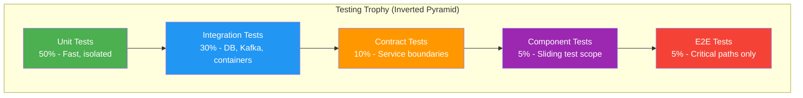

<!-- Image Gallery -->
<section class="lesson-visuals" aria-label="Visual learning resources">
  <header><span>VISUAL LEARNING</span><h2>See it. Review it. Remember it.</h2></header>
  <a class="lesson-visual-card" href="../../assets/images/lessons/java/60-interview-microservices-c/handwritten-notes.png" target="_blank" rel="noopener">
    
    <span><strong>Handwritten notes</strong>Condensed notes for deliberate review.</span>
  </a>
  <a class="lesson-visual-card" href="../../assets/images/lessons/java/60-interview-microservices-c/sticky-notes.png" target="_blank" rel="noopener">
    
    <span><strong>Sticky-note revision</strong>Fast recall prompts for revision.</span>
  </a>
  <a class="lesson-visual-card" href="../../assets/images/lessons/java/60-interview-microservices-c/visual-explanation.png" target="_blank" rel="noopener">
    
    <span><strong>Visual concept guide</strong>A connected explanation of the key ideas.</span>
  </a>
</section>
<!-- End Image Gallery -->

## Chapter at a Glance

| Topic | Key Focus | Key Questions |
|-------|----------|--------------|
| Core Concepts | Foundational understanding | Definitions, contrasts, trade-offs |
| Code Examples | Compilable, runnable solutions | Real interview scenarios |
| Best Practices | Production-ready patterns | Pitfalls to avoid |

## Chapter Roadmap


### Q14: How do you deploy microservices on Kubernetes?


> **Pro Tip:** In interviews, always start with the "why" before the "how." Explaining the reasoning behind a design choice is more valuable than reciting syntax.

> **Remember:** Code readability matters in interviews. Write clean, well-structured code with meaningful variable names.


**Answer:**

Kubernetes orchestrates containerized microservices with deployments, services, config maps, and ingress controllers.

```yaml
# ── Deployment for a microservice ──

> **Previous:** [Microservices Interview Q&amp;A (cont.)](./60-interview-microservices-b.md) | **Next:** [Microservices Interview Q&amp;A (cont.)](./60-interview-microservices-d.md)
apiVersion: apps/v1
kind: Deployment
metadata:
  name: order-service
  labels:
    app: order-service
spec:
  replicas: 3  # Run 3 instances for high availability
  selector:
    matchLabels:
      app: order-service
  template:
    metadata:
      labels:
        app: order-service
    spec:
      containers:
        - name: order-service
          image: raushan666/order-service:1.0.0
          imagePullPolicy: Always
          ports:
            - containerPort: 8080
          env:
            - name: SPRING_PROFILES_ACTIVE
              value: "k8s"
            - name: DB_URL
              valueFrom:
                secretKeyRef:
                  name: db-credentials
                  key: url
            - name: DB_USERNAME
              valueFrom:
                secretKeyRef:
                  name: db-credentials
                  key: username
            - name: DB_PASSWORD
              valueFrom:
                secretKeyRef:
                  name: db-credentials
                  key: password
          livenessProbe:
            httpGet:
              path: /actuator/health/liveness
              port: 8080
            initialDelaySeconds: 30
            periodSeconds: 10
          readinessProbe:
            httpGet:
              path: /actuator/health/readiness
              port: 8080
            initialDelaySeconds: 20
            periodSeconds: 5
          resources:
            requests:
              memory: "256Mi"
              cpu: "250m"
            limits:
              memory: "512Mi"
              cpu: "500m"
---
# ── Service (stable network endpoint) ──

> **Previous:** [Microservices Interview Q&amp;A (cont.)](./60-interview-microservices-b.md) | **Next:** [Microservices Interview Q&amp;A (cont.)](./60-interview-microservices-d.md)
apiVersion: v1
kind: Service
metadata:
  name: order-service
spec:
  selector:
    app: order-service
  ports:
    - port: 80
      targetPort: 8080
  type: ClusterIP  # Internal → only accessible within the cluster
---
# ── ConfigMap for non-sensitive config ──

> **Previous:** [Microservices Interview Q&amp;A (cont.)](./60-interview-microservices-b.md) | **Next:** [Microservices Interview Q&amp;A (cont.)](./60-interview-microservices-d.md)
apiVersion: v1
kind: ConfigMap
metadata:
  name: order-service-config
data:
  application.yml: |
    order-service:
      order-timeout: 30s
      max-batch-size: 100
---
# ── HPA (auto-scaling) ──

> **Previous:** [Microservices Interview Q&amp;A (cont.)](./60-interview-microservices-b.md) | **Next:** [Microservices Interview Q&amp;A (cont.)](./60-interview-microservices-d.md)
apiVersion: autoscaling/v2
kind: HorizontalPodAutoscaler
metadata:
  name: order-service-hpa
spec:
  scaleTargetRef:
    apiVersion: apps/v1
    kind: Deployment
    name: order-service
  minReplicas: 2
  maxReplicas: 10
  metrics:
    - type: Resource
      resource:
        name: cpu
        target:
          type: Utilization
          averageUtilization: 70
---
# ── Ingress (external traffic routing) ──

> **Previous:** [Microservices Interview Q&amp;A (cont.)](./60-interview-microservices-b.md) | **Next:** [Microservices Interview Q&amp;A (cont.)](./60-interview-microservices-d.md)
apiVersion: networking.k8s.io/v1
kind: Ingress
metadata:
  name: api-ingress
  annotations:
    kubernetes.io/ingress.class: nginx
    nginx.ingress.kubernetes.io/rewrite-target: /$2
spec:
  rules:
    - host: api.example.com
      http:
        paths:
          - path: /users(/|$)(.*)
            pathType: Prefix
            backend:
              service:
                name: user-service
                port:
                  number: 80
          - path: /orders(/|$)(.*)
            pathType: Prefix
            backend:
              service:
                name: order-service
                port:
                  number: 80
```

Spring Boot Kubernetes-friendly configuration:
```yaml
# application-k8s.yml

> **Previous:** [Microservices Interview Q&amp;A (cont.)](./60-interview-microservices-b.md) | **Next:** [Microservices Interview Q&amp;A (cont.)](./60-interview-microservices-d.md)
spring:
  cloud:
    kubernetes:
      discovery:
        enabled: true   # Use Kubernetes DNS instead of Eureka
      config:
        enabled: true   # Read ConfigMap as configuration source
      secrets:
        enabled: true   # Read Secrets as configuration source
  config:
    import: configmap:order-service-config

management:
  endpoints:
    web:
      exposure:
        include: health,info,metrics,prometheus
  health:
    livenessstate:
      enabled: true
    readinessstate:
      enabled: true
```

Deploy a new version:
```bash
kubectl set image deployment/order-service order-service=raushan666/order-service:1.1.0
kubectl rollout status deployment/order-service
```

Kubernetes replaces Eureka for service discovery (DNS resolution), replaces Config Server (ConfigMaps + Secrets), and provides health checks (liveness/readiness probes) instead of Eureka heartbeats. Use Spring Cloud Kubernetes for seamless integration.

---

### Q15: Compare deployment strategies: rolling, blue/green, and canary


**Answer:**

```java
// ── Rolling update (Kubernetes default) ──
// Updates pods gradually → old pods keep serving until new ones are healthy
apiVersion: apps/v1
kind: Deployment
spec:
  strategy:
    type: RollingUpdate
    rollingUpdate:
      maxSurge: 1        // One extra pod during update
      maxUnavailable: 0  // Zero downtime: only create new pods before removing old ones

// ── Blue/Green deployment ──
// Two identical environments: Blue (current), Green (new)
apiVersion: apps/v1
kind: Service
metadata:
  name: order-service
spec:
  selector:
    app: order-service
    version: green   # ← Flip this from "blue" to "green" to switch traffic
---
# Deploy green:

> **Previous:** [Microservices Interview Q&amp;A (cont.)](./60-interview-microservices-b.md) | **Next:** [Microservices Interview Q&amp;A (cont.)](./60-interview-microservices-d.md)
# kubectl apply -f deployment-green.yml

> **Previous:** [Microservices Interview Q&amp;A (cont.)](./60-interview-microservices-b.md) | **Next:** [Microservices Interview Q&amp;A (cont.)](./60-interview-microservices-d.md)
# Wait for all green pods to pass readiness probes

> **Previous:** [Microservices Interview Q&amp;A (cont.)](./60-interview-microservices-b.md) | **Next:** [Microservices Interview Q&amp;A (cont.)](./60-interview-microservices-d.md)
# Then switch traffic:

> **Previous:** [Microservices Interview Q&amp;A (cont.)](./60-interview-microservices-b.md) | **Next:** [Microservices Interview Q&amp;A (cont.)](./60-interview-microservices-d.md)
# kubectl patch service order-service -p '{"spec":{"selector":{"version":"green"}}}'

> **Previous:** [Microservices Interview Q&amp;A (cont.)](./60-interview-microservices-b.md) | **Next:** [Microservices Interview Q&amp;A (cont.)](./60-interview-microservices-d.md)
# When confirmed, delete blue:

> **Previous:** [Microservices Interview Q&amp;A (cont.)](./60-interview-microservices-b.md) | **Next:** [Microservices Interview Q&amp;A (cont.)](./60-interview-microservices-d.md)
# kubectl delete -f deployment-blue.yml

> **Previous:** [Microservices Interview Q&amp;A (cont.)](./60-interview-microservices-b.md) | **Next:** [Microservices Interview Q&amp;A (cont.)](./60-interview-microservices-d.md)

// ── Canary deployment (traffic splitting) ──
// Route 5% of traffic to the new version, monitor, then gradually increase
apiVersion: networking.istio.io/v1beta1
kind: VirtualService
metadata:
  name: order-service
spec:
  hosts:
    - order-service
  http:
    - match:
        - headers:
            canary:
              exact: "true"      # Route internal testers to canary
      route:
        - destination:
            host: order-service
            subset: canary
          weight: 100
    - route:
        - destination:
            host: order-service
            subset: stable
          weight: 95            # 95% traffic to stable
        - destination:
            host: order-service
            subset: canary
          weight: 5             # 5% to canary
---
apiVersion: networking.istio.io/v1beta1
kind: DestinationRule
metadata:
  name: order-service
spec:
  host: order-service
  subsets:
    - name: stable
      labels:
        version: v1
    - name: canary
      labels:
        version: v2
```

| Strategy | Downtime | Risk | Rollback Speed | Traffic Control | Complexity |
|----------|----------|------|---------------|-----------------|-----------|
| Rolling | None | Moderate (gradual exposure) | Slow | Limited (per-pod) | Low |
| Blue/Green | Switch moment (seconds) | Low (all traffic at once) | Instant (flip back) | None | Medium |
| Canary | None | Lowest (small % first) | Instant (cut traffic) | Fine-grained (1-99%) | High (Service Mesh) |

Start with rolling (built into Kubernetes, zero configuration). Move to blue/green when you need instant rollback. Use canary only when you have a service mesh (Istio, Linkerd) and need to test new versions on real traffic.

---

### Q16: How do you monitor microservices with Prometheus and Grafana?


**Answer:**

Spring Boot Actuator exposes metrics in Prometheus format. Prometheus scrapes them. Grafana visualizes dashboards.

```java
// ── Dependencies ──
// implementation 'org.springframework.boot:spring-boot-starter-actuator'
// implementation 'io.micrometer:micrometer-registry-prometheus'

// ── Configuration ──
// application.yml:
// management:
//   endpoints:
//     web:
//       exposure:
//         include: health,info,metrics,prometheus
//   metrics:
//     tags:
//       application: ${spring.application.name}
//     export:
//       prometheus:
//         enabled: true

// ── Custom metrics ──
@Service
public class OrderMetricsService {
    private final Counter orderCounter;
    private final Timer orderTimer;
    private final DistributionSummary orderValueSummary;

    public OrderMetricsService(MeterRegistry registry) {
        orderCounter = Counter.builder("orders.created.total")
            .description("Total orders created")
            .tag("service", "order-service")
            .register(registry);

        orderTimer = Timer.builder("orders.processing.time")
            .description("Time taken to process an order")
            .publishPercentiles(0.5, 0.95, 0.99)
            .register(registry);

        orderValueSummary = DistributionSummary.builder("orders.value")
            .description("Order value distribution")
            .baseUnit("USD")
            .publishPercentiles(0.5, 0.95, 0.99)
            .register(registry);
    }

    public void recordOrder(BigDecimal value) {
        orderCounter.increment();
        orderValueSummary.record(value.doubleValue());
    }

    public <T> T measureOrderProcessing(Supplier<T> op) {
        return orderTimer.record(op);
    }
}

// ── Micrometer annotations ──
@Component
public class PaymentProcessor {
    @Timed(value = "payment.processing", percentiles = {0.5, 0.95, 0.99})
    public PaymentResult processPayment(PaymentRequest req) {
        // Method execution time is automatically recorded
    }

    @Counted(value = "payment.retries", description = "Payment retry count")
    public void retryPayment(Long orderId) { }
}
```

```yaml
# ── Prometheus config (prometheus.yml) ──

> **Previous:** [Microservices Interview Q&amp;A (cont.)](./60-interview-microservices-b.md) | **Next:** [Microservices Interview Q&amp;A (cont.)](./60-interview-microservices-d.md)
scrape_configs:
  - job_name: 'spring-boot-apps'
    metrics_path: '/actuator/prometheus'
    static_configs:
      - targets:
        - 'user-service:8080'
        - 'order-service:8080'
        - 'payment-service:8080'

  - job_name: 'kubernetes-pods'
    kubernetes_sd_configs:
      - role: pod
    relabel_configs:
      - source_labels: [__meta_kubernetes_pod_annotation_prometheus_io_scrape]
        action: keep
        regex: true
```

```yaml
# ── Kubernetes PodMonitor (operator-based scraping) ──

> **Previous:** [Microservices Interview Q&amp;A (cont.)](./60-interview-microservices-b.md) | **Next:** [Microservices Interview Q&amp;A (cont.)](./60-interview-microservices-d.md)
apiVersion: monitoring.coreos.com/v1
kind: PodMonitor
metadata:
  name: spring-boot-monitor
spec:
  selector:
    matchLabels:
      app: order-service
  podMetricsEndpoints:
    - port: http
      path: /actuator/prometheus
```

Grafana dashboard panels to create:
- Request rate (requests/sec by endpoint)
- Error rate (5xx / total requests)
- Latency (p50, p95, p99 in ms)
- JVM metrics (heap usage, GC pause time, thread count)
- Database connection pool (active/idle/waiting)
- Circuit breaker state (CLOSED/OPEN/HALF_OPEN)
- System metrics (CPU, memory, disk)

Alert on: p99 latency > 1s, error rate > 1%, circuit breaker OPEN, heap usage > 80%, connection pool exhaustion.

---

### Q17: How do you implement contract testing with Spring Cloud Contract?


**Answer:**

Contract testing verifies that a producer's API matches what the consumer expects, without end-to-end integration tests. Spring Cloud Contract generates tests and stubs from Groovy or YAML contracts.

```groovy
// ── Producer contract (user-service) ──
// File: contracts/shouldReturnUser.groovy
Contract.make {
    description "should return user by ID"
    request {
        method GET()
        url "/users/1"
        headers {
            accept(applicationJson())
        }
    }
    response {
        status OK()
        headers {
            contentType(applicationJson())
        }
        body([
            id: 1,
            name: "Raushan",
            email: "raushan@example.com"
        ])
    }
}
```

```java
// ── Producer-side base test (Spring Cloud Contract generates tests) ──
// File: src/test/java/.../BaseContractTest.java
@SpringBootTest(webEnvironment = SpringBootTest.WebEnvironment.MOCK)
@AutoConfigureMockMvc
public abstract class BaseContractTest {
    @Autowired
    private MockMvc mockMvc;

    // Spring Cloud Contract auto-creates a test class that extends this
    // and verifies the controller matches the contract
}
```

```bash
# Generate contract tests + publish stubs:

> **Previous:** [Microservices Interview Q&amp;A (cont.)](./60-interview-microservices-b.md) | **Next:** [Microservices Interview Q&amp;A (cont.)](./60-interview-microservices-d.md)
./mvnw verifystubs:8080
```

```java
// ── Consumer-side (order-service uses stubs to test its client) ──
@SpringBootTest
@AutoConfigureStubRunner(
    stubsMode = StubRunnerProperties.StubsMode.LOCAL,
    ids = "com.company:user-service:+:stubs:8080"
)
class UserServiceClientTest {
    @Autowired
    private UserServiceClient userClient;

    @Test
    void shouldReturnUser() {
        UserDto user = userClient.getUser(1L);
        assertThat(user.id()).isEqualTo(1L);
        assertThat(user.name()).isEqualTo("Raushan");
        assertThat(user.email()).isEqualTo("raushan@example.com");
    }
}
```

Spring Cloud Contract automatically verifies that the consumer's client code works against the producer's contract. If the producer changes a response field, the consumer build breaks before deployment → not in production.

Contract testing replaces brittle end-to-end tests for cross-service integration. Combined with consumer-driven contracts, it prevents breaking changes from reaching production.

---

### Q18: How do you handle database-per-service with shared data concerns?


**Answer:**

Each microservice owns its database → no other service accesses it directly. Data that spans services is shared through events or API calls.

```java
// ── Anti-pattern: direct database access ──
// order-service calls user-service's database directly → WRONG
@Repository
public interface UserRepository extends JpaRepository<User, Long> {
    // order-service should NOT have this → it violates service boundaries
}

// ── Correct: API-based data sharing ──
// order-service calls user-service's REST API
@FeignClient(name = "user-service")
public interface UserServiceClient {
    @GetMapping("/users/{id}/shipping-address")
    AddressDto getShippingAddress(@PathVariable Long id);
}

// ── Correct: Event-based data sharing ──
// When user changes their shipping address, user-service publishes an event
@Service
public class UserService {
    @Transactional
    public void updateShippingAddress(Long userId, Address newAddress) {
        userRepo.updateAddress(userId, newAddress);
        // Publish event → order-service consumes and updates its local cache
        eventPublisher.publish(new AddressChangedEvent(userId, newAddress));
    }
}

// order-service caches only the shipping address it needs
@Service
public class OrderAddressService {
    @Autowired private OrderAddressCacheRepository addressCache;

    @Transactional
    @KafkaListener(topics = "user.address-changed")
    public void handleAddressChanged(AddressChangedEvent event) {
        orderAddressCache.save(
            new OrderAddressCache(event.userId(), event.newAddress()));
    }
}

@Entity
public class OrderAddressCache {
    @Id private Long userId;            // Same ID as user-service
    private String street;
    private String city;
    private String zipCode;
    // Only the fields order-service needs
}
```

Strategies for cross-service data:
1. **API calls**: Best for real-time data (get user details when creating an order)
2. **Event replication**: Best for reference data (cache user address locally, update via events)
3. **API composition**: Best for complex read models (API gateway aggregates responses)
4. **Shared kernel**: Rare → share only extremely stable data (country codes, tax rates) as a library

Never share databases between services. If two services need the same table, they are not independent → merge them into one service.

---

### Q19: What are common microservices anti-patterns and how do you avoid them?


**Answer:**

```java
// ── Anti-pattern 1: Distributed Monolith ──
// Services are split but share a database and cannot deploy independently
@Entity
@Table(name = "orders")
public class Order {
    @ManyToOne
    @JoinColumn(name = "user_id")
    private User user;  // ← Order-service needs User entity from user-service's DB
}
// Fix: Each service owns its data. Order-service stores only user_id as a value.

// ── Anti-pattern 2: Chatty Communication ──
// Multiple API calls to complete one operation
@Service
public class OrderService {
    public Order createOrder(OrderRequest req) {
        UserDto user = userClient.getUser(req.userId());          // call 1
        AddressDto address = userClient.getAddress(req.userId()); // call 2
        PaymentMethodDto pm = userClient.getPaymentMethod(req.userId()); // call 3
        // Prefer bulk API: userClient.getUserWithDetails(req.userId())
    }
}

// ── Anti-pattern 3: Shared Libraries for Domain Logic ──
// A shared JAR that contains business logic used by multiple services
public class OrderValidationUtils {
    // Any change to this requires rebuilding ALL services
    // Fix: duplicate validation logic per service or make it a separate microservice
}

// ── Anti-pattern 4: Golden Hammer (everything must be a microservice) ──
@SpringBootApplication
public class EmailSendingService { }  // Could be a simple function + queue
// Fix: Use serverless functions for simple tasks. Not everything needs a full service.

// ── Anti-pattern 5: No Monitoring or Observability ──
// Services communicate without tracing, logging correlation, or metrics
// Fix: Always include distributed tracing (Micrometer + Zipkin),
// structured logging (trace ID in every log), and Prometheus metrics.

// ── Anti-pattern 6: Leaky Abstractions ──
// Internal implementation details leak through service boundaries
@FeignClient(name = "user-service")
public interface UserServiceClient {
    @GetMapping("/users/{id}/raw")
    String getRawUserData();  // Returns internal DB representation
}
// Fix: Each service has its own API contract with DTOs, not exposed entities.

// ── Anti-pattern 7: Orchestration in the API Gateway ──
@RestController
public class ApiGatewayController {
    @GetMapping("/order-details/{orderId}")
    public OrderDetailsDto getOrderDetails(@PathVariable Long orderId) {
        OrderDto order = orderClient.getOrder(orderId);
        UserDto user = userClient.getUser(order.userId());
        ProductDto product = productClient.getProduct(order.productId());
        // Gateway is now doing orchestration → it should just route
    }
}
// Fix: Create a dedicated order-aggregation-service for API composition.
```

Golden rule: If splitting a service doesn't give you independent deployability, independent scalability, or independent team ownership, don't split it.

---

### Q20: How do you test microservices end-to-end?


**Answer:**

Testing microservices uses a pyramid: unit tests (many) → integration tests (fewer) → contract tests (per pair) → end-to-end tests (few).

```java
// ── Layer 1: Unit tests (fast, isolated, mock external calls) ──
@ExtendWith(MockitoExtension.class)
class OrderServiceUnitTest {
    @Mock private OrderRepository orderRepo;
    @Mock private UserServiceClient userClient;
    @InjectMocks private OrderService orderService;

    @Test
    void shouldCreateOrder() {
        when(userClient.getUser(1L)).thenReturn(new UserDto(1L, "Raushan"));
        OrderRequest req = new OrderRequest(1L, 100L, 2, new BigDecimal("50.00"));

        Order result = orderService.createOrder(req);

        assertThat(result.getStatus()).isEqualTo("PENDING");
        verify(orderRepo).save(any(Order.class));
    }
}

// ── Layer 2: Integration tests with TestContainers ──
@SpringBootTest
@Testcontainers
class OrderServiceIntegrationTest {
    @Container
    static PostgreSQLContainer<?> postgres = new PostgreSQLContainer<>("postgres:16");

    @Container
    static KafkaContainer kafka = new KafkaContainer(DockerImageName.parse("confluentinc/cp-kafka:7.6.0"));

    @DynamicPropertySource
    static void configureProperties(DynamicPropertyRegistry reg) {
        reg.add("spring.datasource.url", postgres::getJdbcUrl);
        reg.add("spring.kafka.bootstrap-servers", kafka::getBootstrapServers);
    }

    @Autowired private OrderService orderService;
    @Autowired private OrderRepository orderRepo;

    @Test
    void shouldPersistOrder() {
        OrderRequest req = new OrderRequest(1L, 100L, 2, new BigDecimal("50.00"));

        Order result = orderService.createOrder(req);

        assertThat(orderRepo.findById(result.getId())).isPresent();
        assertThat(result.getTotal()).isEqualByComparingTo(new BigDecimal("100.00"));
    }
}

// ── Layer 3: Contract tests (Spring Cloud Contract or Pact) ──
@SpringBootTest
@AutoConfigureStubRunner(
    stubsMode = StubRunnerProperties.StubsMode.LOCAL,
    ids = "com.company:user-service:+:stubs:8080")
class OrderServiceContractTest {
    @Autowired
    private UserServiceClient userClient;

    @Test
    void shouldGetUser() {
        UserDto user = userClient.getUser(1L);
        assertThat(user.name()).isEqualTo("Raushan");
    }
}

// ── Layer 4: End-to-end tests (few, smoke-test critical paths) ──
@SpringBootTest(webEnvironment = SpringBootTest.WebEnvironment.RANDOM_PORT)
@Testcontainers
class OrderE2ETest {
    @Container
    static PostgreSQLContainer<?> postgres = new PostgreSQLContainer<>("postgres:16");

    @Container
    static KafkaContainer kafka = new KafkaContainer(
        DockerImageName.parse("confluentinc/cp-kafka:7.6.0"));

    @LocalServerPort
    private int port;

    private WebTestClient client;

    @BeforeEach
    void setUp() {
        client = WebTestClient.bindToServer()
            .baseUrl("http://localhost:" + port)
            .build();
    }

    @Test
    void fullOrderFlow() {
        // Create order via REST
        client.post().uri("/orders")
            .bodyValue(new OrderRequest(1L, 100L, 2, new BigDecimal("50.00")))
            .exchange()
            .expectStatus().isOk()
            .expectBody()
            .jsonPath("$.status").isEqualTo("PENDING")
            .jsonPath("$.total").isEqualTo(100.00);

        // Verify Kafka event was published
        // (consume the event from the test container and assert)
    }
}

// ── WireMock for external service simulation ──
@SpringBootTest
@WireMockTest(httpPort = 9090)
class OrderServiceWireMockTest {
    @Test
    void shouldHandleUserServiceTimeout() {
        // Simulate slow user-service response
        stubFor(get(urlEqualTo("/users/1"))
            .willReturn(aResponse()
                .withFixedDelay(5000)
                .withStatus(200)));

        // Circuit breaker should trigger fallback
        OrderRequest req = new OrderRequest(1L, 100L, 2, new BigDecimal("50.00"));
        assertThrows(CircuitBreakerOpenException.class,
            () -> orderService.createOrder(req));
    }
}
```

End-to-end tests are slow and flaky. Keep them to 3-5 critical paths per service. Rely on contract tests for cross-service integration and unit tests for business logic.

---

### Q17: How do you implement feature flags for continuous deployment?


**Answer:**

Feature flags (toggles) allow deploying code to production without activating it. This enables trunk-based development, canary releases, and instant rollbacks.

```java
// ── Feature flag service ──
@Service
public class FeatureFlagService {

    private final Map<String, Boolean> flags = new ConcurrentHashMap<>();

    public FeatureFlagService() {
        // Load from config server, database, or external service
        flags.put("new-checkout-flow", false);
        flags.put("recommendation-engine-v2", true);
        flags.put("dark-mode", false);
    }

    public boolean isEnabled(String feature, String userId) {
        Boolean globalEnabled = flags.get(feature);
        if (globalEnabled == null) return false;

        // Gradual rollout: enable for a percentage of users
        if (feature.equals("recommendation-engine-v2")) {
            return userId != null && Math.abs(userId.hashCode()) % 100 < 10;
        }

        return globalEnabled;
    }

    public void setFlag(String feature, boolean enabled) {
        flags.put(feature, enabled);
    }
}

// ── Usage in service layer ──
@Service
public class CheckoutService {

    private final FeatureFlagService featureFlags;
    private final CheckoutServiceV1 v1;
    private final CheckoutServiceV2 v2;

    public CheckoutResult checkout(OrderRequest request, String userId) {
        if (featureFlags.isEnabled("new-checkout-flow", userId)) {
            return v2.checkout(request);  // New implementation
        }
        return v1.checkout(request);  // Old implementation
    }
}
```

**Feature flag best practices:**
- Use a centralized store (Spring Cloud Config, LaunchDarkly, Unleash) — not hardcoded maps
- Name flags clearly: `checkout.v2.enabled`, `payment.new-processor`
- Remove flags once the feature is stable — don't accumulate dead flags
- Use gradual rollouts: 1% → 10% → 50% → 100%
- Monitor flag usage — if a flag hasn't been accessed in 30 days, schedule removal

---

### Q18: How do you handle API versioning in microservices?


**Answer:**

There are four main API versioning strategies, each with tradeoffs:

**1. URI path versioning (most common):**
```java
@RestController
@RequestMapping("/api/v1/orders")
public class OrderControllerV1 { /* ... */ }

@RestController
@RequestMapping("/api/v2/orders")
public class OrderControllerV2 { /* ... */ }
```
- Pros: Clear, cacheable, easy to route
- Cons: URL pollution, requires backward-compatible routing

**2. Request header versioning (Accept header or custom header):**
```java
@GetMapping(value = "/orders", headers = "API-Version=1")
public List<Order> getOrdersV1() { /* ... */ }

@GetMapping(value = "/orders", headers = "API-Version=2")
public List<Order> getOrdersV2() { /* ... */ }
```
- Pros: Clean URLs, no URL pollution
- Cons: Harder to test from browser, cache keys must include headers

**3. Query parameter versioning:**
```java
@GetMapping("/orders")
public List<Order> getOrders(
        @RequestParam(defaultValue = "1") int version) {
    if (version == 1) return orderService.getAllV1();
    return orderService.getAllV2();
}
```
- Pros: Easy to implement, visible in URLs
- Cons: URL pollution, cache fragmentation

**4. Content negotiation (Accept header with custom media type):**
```java
@GetMapping(value = "/orders", produces = "application/vnd.company.v1+json")
public List<Order> getOrdersV1() { /* ... */ }

@GetMapping(value = "/orders", produces = "application/vnd.company.v2+json")
public List<Order> getOrdersV2() { /* ... */ }
```
- Pros: RESTful, clean URLs, clear version contract
- Cons: Complex client setup, harder debugging

| Strategy | URL clarity | Caching | Client complexity | Ease of deprecation |
|----------|-------------|---------|-------------------|-------------------|
| URI path | Excellent | Excellent | Low | Easy |
| Header | Good | Moderate | High | Moderate |
| Query param | Moderate | Low | Low | Hard |
| Content negotiation | Excellent | Excellent | High | Easy |

**Versioning philosophy:** Minimize breaking changes. Add fields instead of modifying them. Deprecate endpoints with `Sunset` and `Deprecation` HTTP headers. Support old versions for a defined period (e.g., 6 months) and return 410 Gone after.

---

## Common Mistakes in Microservices Testing (GFG-Style)

### Mistake 1: Only writing unit tests, no contract or integration tests

```java
// ❌ WRONG: Unit test passes, but service fails in production
// because the actual user-service returns a different response shape

// ✅ CORRECT: Add contract test with Spring Cloud Contract or Pact
@SpringBootTest
@AutoConfigureStubRunner(ids = "com.example:user-service:+:stubs:8080")
class OrderServiceContractTest {
    @Autowired private OrderService orderService;

    @Test
    void shouldGetUserFromStub() {
        UserDto user = orderService.getUser(1L);
        assertThat(user.name()).isNotBlank();
    }
}
```

### Mistake 2: Flaky E2E tests blocking the pipeline

```yaml
# ❌ WRONG 10+ E2E tests that fail randomly
# Pipeline fails 3 times a day → team starts ignoring failures

# ✅ CORRECT: Keep E2E smoke tests minimal, treat flaky tests as bugs
# - 3-5 critical E2E paths only
# - Quarantine flaky tests automatically
# - Run integration tests in parallel, not sequentially
```

### Mistake 3: Not testing failure scenarios

```java
// ❌ WRONG: Only testing the happy path
@Test
void shouldCreateOrder() { /* ... */ }

// ✅ CORRECT: Test timeouts, circuit breakers, and fallbacks
@Test
void shouldFallbackWhenPaymentServiceIsDown() {
    // Simulate timeout from payment-service
    stubFor(post(urlEqualTo("/payments"))
        .willReturn(aResponse().withFixedDelay(10000)));

    assertThrows(CircuitBreakerOpenException.class,
        () -> orderService.createOrder(testRequest()));
}
```

### Mistake 4: Shared test databases between developers

```java
// ❌ WRONG: All developers use the same shared PostgreSQL instance
// Tests collide → "someone deleted my test data!"

// ✅ CORRECT: TestContainers for isolated databases
@Container
static PostgreSQLContainer<?> postgres = new PostgreSQLContainer<>("postgres:16");
// Every developer, every CI run gets a fresh, isolated database
```

## Testing Strategy Comparison Table

| Test Type | Speed | Reliability | Scope | Cost to Write | Debugging Ease |
|-----------|-------|-------------|-------|---------------|----------------|
| Unit test | Milliseconds | High | Single class | Low | Excellent |
| Integration test | Seconds | Medium | Service + DB | Medium | Good |
| Contract test | Seconds | Medium | API contract | Medium | Good |
| Component test | Seconds | Medium | Multiple services | Medium | Moderate |
| End-to-end test | Minutes | Low | Full system | High | Poor |
| Smoke test | Seconds | High | Critical paths | Low | Good |

**Recommended distribution:** 50% unit, 30% integration, 10% contract, 5% component, 5% E2E. Known as the "testing trophy" — invert the traditional pyramid for microservices.

## Mermaid: Microservices Testing Strategy



## Chapter Quiz — Microservices Testing

4. Which test type is best for verifying that your service correctly handles the API contract of a downstream dependency?
    - A) Unit test
    - B) Contract test (Pact/Spring Cloud Contract)
    - C) End-to-end test
    - D) Load test

<details>
<summary>Answer</summary>
**B) Contract test.** Contract tests verify that the interaction between two services matches the agreed contract. They run faster than E2E tests and catch contract breakage early.
</details>

5. What is the recommended percentage of unit tests in a microservices testing strategy?
    - A) 10%
    - B) 25%
    - C) 50%
    - D) 80%

<details>
<summary>Answer</summary>
**C) 50%.** Unit tests should form the largest category (50%) — they are fast, reliable, and catch logic errors. Integration, contract, component, and E2E tests fill the remaining 50%.
</details>

6. Which API versioning strategy is most cache-friendly?
    - A) Query parameter
    - B) URI path
    - C) Custom header
    - D) Body parameter

<details>
<summary>Answer</summary>
**B) URI path** (and also content negotiation). URI path versioning creates unique URLs for each version, making them independently cacheable. Header-based versioning requires cache keys to account for header values.
</details>

## Concept Comparison Table

| Topic | Key Points | Interview Frequency |
|-------|-----------|-------------------|
| **OOP** | Encapsulation, Inheritance, Polymorphism, Abstraction | Every interview |
| **Collections** | List, Set, Map, Queue, Deque | 9/10 interviews |
| **Concurrency** | synchronized, volatile, Locks, CompletableFuture | 7/10 senior interviews |
| **Java 8+** | Lambdas, Streams, Optional, CompletableFuture | 8/10 interviews |

## Cross-Application Matrix

| Skill | Junior (0-2yr) | Mid (3-5yr) | Senior (6-9yr) | Staff (10+) |
|-------|---------------|-------------|----------------|-------------|
| OOP & Design Patterns | Define and identify | Apply and combine | Evaluate and refactor | Create and teach |
| Collections | Basic usage | Performance trade-offs | Concurrent collections | Custom implementations |
| Concurrency | Syntax knowledge | Write thread-safe code | Debug deadlocks | Design concurrent systems |

## Chapter Quiz

1. What is the difference between equals() and == in Java?
   - A) They are identical
   - B) equals() compares values, == compares references
   - C) == compares values, equals() compares references
   - D) equals() is for primitives, == is for objects

<details>
<summary>Answer&lt;/summary&gt;
**B) equals() compares logical equality (overridable), == compares reference equality.**
</details>

2. Which collection guarantees insertion order?
   - A) HashMap
   - B) TreeMap
   - C) LinkedHashMap
   - D) HashSet

<details>
<summary>Answer&lt;/summary&gt;
**C) LinkedHashMap.** LinkedHashMap maintains a doubly-linked list of entries to preserve insertion order.
</details>

3. What keyword prevents a method from being overridden?
   - A) static
   - B) final
   - C) private
   - D) abstract

<details>
<summary>Answer&lt;/summary&gt;
**B) final.** A final method cannot be overridden by subclasses.
</details>
