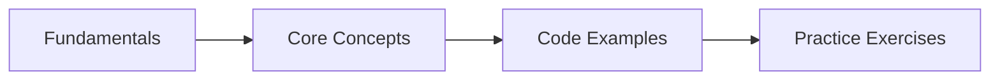

# Java Syntax & Fundamentals

## Learning Objectives
## Chapter at a Glance

| Topic | Key Insight | Practical Takeaway |
|-------|-------------|--------------------|
| Core Concepts | Foundational understanding for Java development | Master these before Spring |
| Code Examples | Runnable, compilable examples | Type, compile, run, refactor |
| Practice Exercises | Hands-on skill building | Apply what you learn |

## Chapter Roadmap




By the end of this chapter, you will be able to:

- Explain the history of Java, the role of the JVM, and the differences between JDK, JRE, and JVM across LTS releases
- Declare and use all eight primitive types, perform type conversions, and explain autoboxing and unboxing
- Apply arithmetic, relational, logical, bitwise, ternary, and instanceof operators correctly in expressions
- Write structured control flow using if/else, switch expressions (arrow syntax with yield), loops (for, while, do-while), and labeled break/continue
- Create and manipulate single- and multi-dimensional arrays using the java.util.Arrays utility class
- Work with String immutability, the string pool, StringBuilder/StringBuffer, text blocks, and essential String methods
- Declare local variables with var, define records with compact constructors and custom methods, and use switch expressions with exhaustive cases, arrow syntax, yield, and null-case handling
- Apply pattern matching techniques including instanceof pattern matching, switch pattern matching, guarded patterns, and record patterns

## Table of Contents


1. [A Brief History of Java](#1-a-brief-history-of-java)
2. [Primitive Types & Type Conversion](#2-primitive-types--type-conversion)
3. [Operators](#3-operators)
4. [Control Flow](#4-control-flow)
5. [Arrays](#5-arrays)
6. [Strings](#6-strings)
7. [The var Keyword](#7-the-var-keyword)
8. [Records](#8-records)
9. [Switch Expressions](#9-switch-expressions)
10. [Pattern Matching](#10-pattern-matching)
11. [Text Blocks](#11-text-blocks)
12. [Main Method Evolution](#12-main-method-evolution)

---

## 1. A Brief History of Java

Java was created by **James Gosling**, Mike Sheridan, and Patrick Naughton at Sun Microsystems in the early 1990s. The project, initially called *Oak*, was designed for set-top boxes and embedded systems. Sun released the first public version, Java 1.0, in **1996** with the slogan **"Write Once, Run Anywhere"** (WORA). Oracle Corporation acquired Sun Microsystems in **2010** and has stewarded the language ever since.

### 1.1 Key LTS Releases


Java follows a strict time-based release cadence (every six months) with a **Long-Term Support (LTS)** release every two to three years. The major LTS versions are:

| Release | Year | Key Features |
|---------|------|-------------|
| Java 8 (LTS) | 2014 | Lambda expressions, Streams API, Optional, new Date/Time API, default methods |
| Java 11 (LTS) | 2018 | HTTP Client (standard), local-variable syntax for lambda parameters, Flight Recorder |
| Java 17 (LTS) | 2021 | Sealed classes, pattern matching for instanceof, records, text blocks (standardized) |
| Java 21 (LTS) | 2023 | Pattern matching for switch, record patterns, virtual threads, sequenced collections, string templates (preview) |

### 1.2 JDK vs JRE vs JVM


These three acronyms are often confused. Here is the exact hierarchy:

```
JDK (Java Development Kit)
 ├── JRE (Java Runtime Environment)
 │    └── JVM (Java Virtual Machine)
 └── Development Tools (javac, jar, javadoc, etc.)
```

- **JVM (Java Virtual Machine)** → The abstract machine that executes Java bytecode. Each operating system has its own JVM implementation. The JVM loads `.class` files, verifies bytecode, interprets and JIT-compiles it to native code, and manages memory via garbage collection.
- **JRE (Java Runtime Environment)** → Contains the JVM plus the core class libraries (`rt.jar`, `charsets.jar`, etc.). End users need the JRE to run Java applications, but they cannot compile new programs with it.
- **JDK (Java Development Kit)** → Contains the JRE plus development tools: the Java compiler (`javac`), the archiver (`jar`), the documentation generator (`javadoc`), and the module system tools (`jlink`, `jmod`). Developers always download the JDK.

> **Note:** Since Java 9, Oracle no longer ships a separate JRE. The `jlink` tool creates custom runtime images that contain only the modules your application needs.

### 1.3 The Compilation, Deployment, and Execution Pipeline


Every Java program goes through the following lifecycle:

```java
// Step 1: Write source code  →  HelloWorld.java
// Step 2: Compile            →  javac HelloWorld.java → HelloWorld.class (bytecode)
// Step 3: Execute            →  java HelloWorld       → JVM interprets/runs bytecode

public class HelloWorld {
    public static void main(String[] args) {
        System.out.println("Hello from Java 21!");
    }
}
```

```text
Compile time:  javac HelloWorld.java       produces HelloWorld.class (bytecode)
Run time:      java HelloWorld              JVM loads, verifies, executes bytecode
```

The JVM's **Just-In-Time (JIT) compiler** identifies hot methods (executed frequently) and compiles them to native machine code at runtime, giving Java near-native performance.

### 1.4 Compiling and Running → Command-Line Reference


```bash
# Compile a single source file
javac HelloWorld.java

# Run the compiled class (no .class extension)
java HelloWorld

# Compile and run in one step (Java 11+)
java HelloWorld.java

# Package into a JAR
jar cf hello.jar HelloWorld.class

# Run a JAR
java -jar hello.jar

# Create a custom runtime image (Java 9+) containing only required modules
jlink --module-path $JAVA_HOME/jmods --add-modules java.base --output mini-jre
```

---

## 2. Primitive Types & Type Conversion

Java has **eight primitive types**. Everything else in Java is an object (reference type). Primitives are stored directly on the stack (or inline in objects), making them memory-efficient and fast.

### 2.1 The Eight Primitive Types


| Type | Size | Min | Max | Default | Example |
|------|------|-----|-----|---------|---------|
| `byte` | 8-bit | -128 | 127 | 0 | `byte b = 100;` |
| `short` | 16-bit | -32,768 | 32,767 | 0 | `short s = 30_000;` |
| `int` | 32-bit | -2³¹ | 2³¹-1 | 0 | `int i = 2_000_000_000;` |
| `long` | 64-bit | -2⁶³ | 2⁶³-1 | 0L | `long l = 100_000_000_000L;` |
| `float` | 32-bit | ±1.4e-45 | ±3.4e+38 | 0.0f | `float f = 3.14f;` |
| `double` | 64-bit | ±4.9e-324 | ±1.8e+308 | 0.0d | `double d = 3.14159265358979;` |
| `char` | 16-bit | 0 | 65,535 (Unicode) | '\u0000' | `char c = 'A';` |
| `boolean` | JVM-dependent | → | → | false | `boolean flag = true;` |

```java
public class PrimitiveTypesDemo {
    public static void main(String[] args) {
        // --- Integer types ---
        byte  b = 127;                     // 8-bit, max value
        short s = 32_767;                  // 16-bit, underscores for readability
        int   i = 2_000_000_000;           // 32-bit, most common integer type
        long  l = 9_000_000_000_000L;      // 64-bit, requires L suffix

        System.out.println("byte:   " + b);
        System.out.println("short:  " + s);
        System.out.println("int:    " + i);
        System.out.println("long:   " + l);

        // --- Floating-point types ---
        float  f = 3.141592653589793f;     // 32-bit, ~7 decimal digits precision, requires f suffix
        double d = 3.141592653589793;      // 64-bit, ~15 decimal digits precision

        System.out.println("float:  " + f);  // prints 3.1415927 (precision lost)
        System.out.println("double: " + d);  // prints 3.141592653589793

        // --- Character type ---
        char c1 = 'A';                     // single 16-bit Unicode character
        char c2 = 65;                      // ASCII value of 'A'
        char c3 = '\u0041';                // Unicode escape for 'A'

        System.out.println("char c1: " + c1);
        System.out.println("char c2: " + c2);
        System.out.println("char c3: " + c3);

        // --- Boolean type ---
        boolean bool1 = true;
        boolean bool2 = false;

        System.out.println("boolean: " + bool1 + " and " + bool2);

        // --- Literal formats ---
        int hex      = 0xFF;               // 255, hexadecimal literal
        int binary   = 0b1100;             // 12, binary literal (Java 7+)
        int octal    = 077;                // 63, octal literal (rarely used)
        double sci   = 1.23e4;             // 12300.0, scientific notation

        System.out.println("hex 0xFF:     " + hex);
        System.out.println("binary 0b1100: " + binary);
        System.out.println("octal 077:    " + octal);
        System.out.println("sci 1.23e4:   " + sci);
    }
}
```

### 2.2 Type Conversion


Java supports both **widening** (implicit, automatic) and **narrowing** (explicit, requires cast) conversions.

**Widening conversion path** (no data loss):
```
byte → short → int → long → float → double
                 ↑
                char
```

```java
public class TypeConversionDemo {
    public static void main(String[] args) {
        // --- Widening (implicit) conversions ---
        byte   b = 42;
        short  s = b;      // byte → short: OK
        int    i = s;      // short → int: OK
        long   l = i;      // int → long: OK
        float  f = l;      // long → float: possible precision loss, but no cast required
        double d = f;      // float → double: OK

        // char can widen to int
        char   c = 'Z';
        int    charToInt = c;   // 90 (Unicode value of 'Z')

        System.out.println("byte " + b + " → short " + s + " → int " + i
                         + " → long " + l + " → float " + f + " → double " + d);
        System.out.println("char '" + c + "' widens to int " + charToInt);

        // --- Narrowing (explicit) conversions ---
        double pi = 3.14159;
        int truncated = (int) pi;          // truncates fractional part → 3
        byte narrowed = (byte) truncated;  // int to byte, safe here

        int large = 300;
        byte overflow = (byte) large;      // 300 % 256 = 44

        System.out.println("(int) 3.14159 = " + truncated);
        System.out.println("(byte) 300 = " + overflow);  // 44

        // --- Overflow in arithmetic ---
        int maxInt = Integer.MAX_VALUE;    // 2_147_483_647
        int overflowed = maxInt + 1;       // wraps to -2_147_483_648
        System.out.println("MAX_VALUE + 1 = " + overflowed);  // Integer.MIN_VALUE

        // Use Math.addExact() to detect overflow at runtime
        try {
            int safe = Math.addExact(maxInt, 1);
        } catch (ArithmeticException e) {
            System.out.println("Overflow detected via addExact: " + e.getMessage());
        }

        // --- Compound assignment gotcha ---
        int total = 0;
        total = total + 5;                 // works
        total += 5;                        // works, equivalent
        // total = total + 5L;             // compile error: long + int → long, can't assign to int
        total += 5L;                       // OK! compound assignments include implicit cast
        System.out.println("total after compound ops: " + total);
    }
}
```

### 2.3 Autoboxing and Unboxing


**Autoboxing** is the automatic conversion of a primitive to its corresponding wrapper class. **Unboxing** is the reverse. This feature bridges the gap between primitives and the collections framework, which only works with objects.

| Primitive | Wrapper Class |
|-----------|--------------|
| `byte` | `Byte` |
| `short` | `Short` |
| `int` | `Integer` |
| `long` | `Long` |
| `float` | `Float` |
| `double` | `Double` |
| `char` | `Character` |
| `boolean` | `Boolean` |

```java
import java.util.ArrayList;
import java.util.List;

public class AutoboxingDemo {
    public static void main(String[] args) {
        // --- Autoboxing: primitive → wrapper ---
        Integer boxed = 42;                // autoboxing: int → Integer
        Double  dBox  = 3.14;              // autoboxing: double → Double
        Boolean bBox  = true;              // autoboxing: boolean → Boolean
        Character cBox = 'X';              // autoboxing: char → Character

        System.out.println("Boxed Integer: " + boxed);
        System.out.println("Boxed Double:  " + dBox);
        System.out.println("Boxed Boolean: " + bBox);
        System.out.println("Boxed Char:    " + cBox);

        // --- Unboxing: wrapper → primitive ---
        Integer wrapped = Integer.valueOf(100);
        int    value    = wrapped;          // unboxing: Integer → int

        System.out.println("Unboxed value: " + value);

        // --- Autoboxing in collections ---
        List<Integer> numbers = new ArrayList<>();
        numbers.add(10);                    // autoboxing: int → Integer
        numbers.add(20);
        numbers.add(30);
        int first = numbers.get(0);         // unboxing: Integer → int
        System.out.println("First in list: " + first);

        // --- Pitfall: null unboxing ---
        Integer nullable = null;
        try {
            int danger = nullable;          // throws NullPointerException
        } catch (NullPointerException e) {
            System.out.println("Cannot unbox null: " + e.getMessage());
        }

        // --- Pitfall: == with boxed values ---
        Integer a = 127;
        Integer b = 127;
        Integer c = 128;
        Integer d = 128;

        System.out.println("127 == 127:        " + (a == b));     // true (cached by IntegerCache)
        System.out.println("128 == 128:        " + (c == d));     // false (outside cache range)
        System.out.println("128.equals(128):   " + c.equals(d));  // true (always use equals())

        // --- Performance cost: autoboxing in loops ---
        long start = System.nanoTime();
        Long sum = 0L;                      // boxed Long, NOT primitive long
        for (int idx = 0; idx < 10_000; idx++) {
            sum += idx;                     // autoboxing + unboxing every iteration
        }
        long end = System.nanoTime();
        System.out.println("Boxed sum: " + sum + " (took " + (end - start) / 1_000_000 + " ms)");
        // Always use primitive long in performance-sensitive loops
    }
}
```

---

## 3. Operators

Java provides a rich set of operators organized into several categories.

### 3.1 Arithmetic Operators


```java
public class ArithmeticOperatorsDemo {
    public static void main(String[] args) {
        int a = 20;
        int b = 7;

        int sum       = a + b;    // 27
        int diff      = a - b;    // 13
        int product   = a * b;    // 140
        int quotient  = a / b;    // 2  (integer division truncates)
        int remainder = a % b;    // 6  (modulo)

        System.out.println(a + " + " + b + " = " + sum);
        System.out.println(a + " - " + b + " = " + diff);
        System.out.println(a + " * " + b + " = " + product);
        System.out.println(a + " / " + b + " = " + quotient);
        System.out.println(a + " % " + b + " = " + remainder);

        // --- Precision with floating-point ---
        double x = 20.0;
        double y = 7.0;
        System.out.println("20.0 / 7.0 = " + (x / y));  // 2.857142857142857

        // --- Unary operators ---
        int value = 10;
        System.out.println("++value: " + (++value));      // pre-increment:  11
        System.out.println("value++: " + (value++));      // post-increment: 11 (then becomes 12)
        System.out.println("after post: " + value);       // 12
        System.out.println("--value: " + (--value));      // pre-decrement:  11
        System.out.println("-value:  " + (-value));       // unary negation: -11

        // --- Division by zero ---
        try {
            int bad = 10 / 0;               // throws ArithmeticException
        } catch (ArithmeticException e) {
            System.out.println("Integer / by zero: " + e.getMessage());
        }

        double inf = 10.0 / 0.0;            // Infinity (no exception for floating-point)
        double nan = 0.0 / 0.0;             // NaN (Not a Number)
        System.out.println("10.0 / 0.0 = " + inf);
        System.out.println("0.0 / 0.0  = " + nan);
    }
}
```

### 3.2 Relational Operators


```java
public class RelationalOperatorsDemo {
    public static void main(String[] args) {
        int x = 10;
        int y = 20;

        System.out.println("x = " + x + ", y = " + y);
        System.out.println("x == y: " + (x == y));    // false
        System.out.println("x != y: " + (x != y));    // true
        System.out.println("x < y:  " + (x < y));     // true
        System.out.println("x > y:  " + (x > y));     // false
        System.out.println("x <= y: " + (x <= y));    // true
        System.out.println("x >= y: " + (x >= y));    // false

        // --- String comparison: ALWAYS use .equals(), never == ---
        String s1 = new String("hello");
        String s2 = new String("hello");
        System.out.println("s1 == s2:           " + (s1 == s2));       // false (reference equality)
        System.out.println("s1.equals(s2):      " + s1.equals(s2));    // true (value equality)

        // --- Comparing floating-point: use epsilon ---
        double a = 0.1 + 0.2;
        double b = 0.3;
        System.out.println("0.1 + 0.2 == 0.3:   " + (a == b));        // false (rounding error)
        double epsilon = 1e-10;
        System.out.println("Math.abs(a-b) < eps: " + (Math.abs(a - b) < epsilon));  // true
    }
}
```

### 3.3 Logical Operators


```java
public class LogicalOperatorsDemo {
    public static void main(String[] args) {
        boolean t = true;
        boolean f = false;

        System.out.println("true  && false: " + (t && f));   // false (short-circuit AND)
        System.out.println("true  || false: " + (t || f));   // true  (short-circuit OR)
        System.out.println("!true:          " + (!t));       // false (logical NOT)
        System.out.println("true  ^ false:  " + (t ^ f));    // true  (XOR)

        // --- Short-circuit evaluation ---
        String name = null;
        // name.length() would throw NullPointerException, but && short-circuits
        boolean valid = name != null && name.length() > 5;
        System.out.println("Short-circuit result: " + valid);  // false, no NPE

        // Non-short-circuit & and | (rarely used)
        boolean result = f & t;     // evaluates both sides (no short circuit)
        System.out.println("Non-SC &: " + result);
    }
}
```

### 3.4 Bitwise Operators


Bitwise operators operate on the individual bits of integer types.

```java
public class BitwiseOperatorsDemo {
    public static void main(String[] args) {
        int a = 0b1100;   // 12 in binary
        int b = 0b1010;   // 10 in binary

        System.out.println("a = 0b" + Integer.toBinaryString(a) + " (" + a + ")");
        System.out.println("b = 0b" + Integer.toBinaryString(b) + " (" + b + ")");

        int and = a & b;    // 0b1000 = 8   (both bits 1)
        int or  = a | b;    // 0b1110 = 14  (at least one bit 1)
        int xor = a ^ b;    // 0b0110 = 6   (bits differ)
        int not = ~a;       // inverts all bits

        System.out.println("a & b = " + and + " (" + Integer.toBinaryString(and) + ")");
        System.out.println("a | b = " + or  + " (" + Integer.toBinaryString(or)  + ")");
        System.out.println("a ^ b = " + xor + " (" + Integer.toBinaryString(xor) + ")");
        System.out.println("~a    = " + not + " (" + Integer.toBinaryString(not) + ")");

        // --- Shift operators ---
        int value = 0b0001_0000;  // 16

        int leftShift  = value << 2;   // 0b0100_0000 = 64  (multiply by 2^n)
        int rightShift = value >> 2;   // 0b0000_0100 = 4   (divide by 2^n)
        int unsignedRS = value >>> 2;  // same as >> for positive numbers

        System.out.println(value + " << 2 = " + leftShift);
        System.out.println(value + " >> 2 = " + rightShift);
        System.out.println(value + " >>> 2 = " + unsignedRS);

        // --- Difference between >> and >>> ---
        int negative = -16;
        System.out.println("\nNegative shift:");
        System.out.println("-16       = " + Integer.toBinaryString(negative));
        System.out.println("-16 >> 2  = " + Integer.toBinaryString(negative >> 2)   + " = " + (negative >> 2));
        System.out.println("-16 >>> 2 = " + Integer.toBinaryString(negative >>> 2)  + " = " + (negative >>> 2));
        // >> preserves sign bit (fills with 1s for negatives)
        // >>> fills with 0s regardless of sign

        // --- Practical use: flag bitmasks ---
        int READ    = 1 << 0;  // 001
        int WRITE   = 1 << 1;  // 010
        int EXECUTE = 1 << 2;  // 100

        int permissions = READ | WRITE;                  // 011
        System.out.println("\nBitmask demo:");
        System.out.println("Has read?    " + ((permissions & READ)    != 0));  // true
        System.out.println("Has write?   " + ((permissions & WRITE)   != 0));  // true
        System.out.println("Has execute? " + ((permissions & EXECUTE) != 0));  // false
    }
}
```

### 3.5 instanceof and Ternary Operator


```java
public class InstanceofTernaryDemo {
    public static void main(String[] args) {
        // --- instanceof operator ---
        Object obj = "Hello, Java!";

        boolean isString = obj instanceof String;
        System.out.println("obj instanceof String: " + isString);  // true
        System.out.println("obj instanceof Integer: " + (obj instanceof Integer));  // false
        System.out.println("obj instanceof Object:  " + (obj instanceof Object));   // true
        System.out.println("obj instanceof CharSequence: " + (obj instanceof CharSequence));  // true

        // null instanceof anything → false
        Object nothing = null;
        System.out.println("null instanceof String: " + (nothing instanceof String));  // false

        // --- Ternary operator ( ? : ) ---
        int age = 20;
        String status = age >= 18 ? "Adult" : "Minor";
        System.out.println("Age " + age + " → " + status);

        // Nested ternary (use sparingly → readability matters)
        int score = 85;
        String grade = score >= 90 ? "A"
                     : score >= 80 ? "B"
                     : score >= 70 ? "C"
                     : score >= 60 ? "D"
                     : "F";
        System.out.println("Score " + score + " → Grade " + grade);

        // Ternary with method calls
        int x = 5;
        int y = 10;
        int max = x > y ? x : y;
        System.out.println("max(" + x + ", " + y + ") = " + max);
    }
}
```

---

## 4. Control Flow

### 4.1 if/else Statement


```java
public class IfElseDemo {
    public static void main(String[] args) {
        int temperature = 30;

        if (temperature > 35) {
            System.out.println("Extreme heat warning!");
        } else if (temperature >= 25) {
            System.out.println("Warm day.");
        } else if (temperature >= 15) {
            System.out.println("Pleasant day.");
        } else if (temperature >= 5) {
            System.out.println("Cool day.");
        } else {
            System.out.println("Freezing conditions.");
        }

        // Ternary equivalent for simple branches
        int number = 7;
        String parity = number % 2 == 0 ? "even" : "odd";
        System.out.println(number + " is " + parity);

        // Guard clause pattern
        public static String classifyNumber(int n) {
            if (n < 0) {
                return "negative";
            }
            if (n == 0) {
                return "zero";
            }
            // n > 0 guaranteed here
            return n % 2 == 0 ? "positive even" : "positive odd";
        }

        System.out.println(classifyNumber(-5));
        System.out.println(classifyNumber(0));
        System.out.println(classifyNumber(42));
    }
}
```

### 4.2 Switch Expressions (Traditional vs Arrow Syntax)


```java
public class SwitchExpressionDemo {
    public static void main(String[] args) {
        // --- Traditional switch (statement, fall-through) ---
        String dayName = "TUESDAY";
        String type;

        switch (dayName) {
            case "MONDAY":
            case "TUESDAY":
            case "WEDNESDAY":
            case "THURSDAY":
            case "FRIDAY":
                type = "Weekday";
                break;
            case "SATURDAY":
            case "SUNDAY":
                type = "Weekend";
                break;
            default:
                type = "Invalid day";
        }
        System.out.println(dayName + " is a " + type);

        // --- Switch expression with arrow syntax (Java 14+) ---
        String season = switch (dayName) {
            case "DECEMBER", "JANUARY", "FEBRUARY" -> "Winter";
            case "MARCH", "APRIL", "MAY"           -> "Spring";
            case "JUNE", "JULY", "AUGUST"          -> "Summer";
            case "SEPTEMBER", "OCTOBER", "NOVEMBER" -> "Autumn";
            default                                 -> "Unknown";
        };
        System.out.println(dayName + " is in " + season);

        // --- Switch expression with yield (for multi-line blocks) ---
        int score = 85;
        String letterGrade = switch (score / 10) {
            case 10, 9 -> "A";
            case 8 -> {
                System.out.println("  B order: close to A!");
                yield "B";
            }
            case 7 -> "C";
            case 6 -> "D";
            default -> {
                System.out.println("  Failing grade");
                yield "F";
            }
        };
        System.out.println("Score " + score + " → Letter grade: " + letterGrade);

        // --- Switch with enum (exhaustive, no default needed) ---
        enum Day { MONDAY, TUESDAY, WEDNESDAY, THURSDAY, FRIDAY, SATURDAY, SUNDAY }

        Day today = Day.WEDNESDAY;
        boolean isWeekend = switch (today) {
            case SATURDAY, SUNDAY -> true;
            case MONDAY, TUESDAY, WEDNESDAY, THURSDAY, FRIDAY -> false;
        };
        System.out.println(today + " is weekend? " + isWeekend);

        // --- null-case in switch (Java 21+) ---
        String input = null;
        String result = switch (input) {
            case null    -> "Received null input";
            case "hello" -> "Greeting received";
            default      -> "Unknown: " + input;
        };
        System.out.println("null switch result: " + result);

        // --- Exhaustive switch with sealed types ---
        sealed interface Shape permits Circle, Rectangle {}
        record Circle(double radius) implements Shape {}
        record Rectangle(double w, double h) implements Shape {}

        Shape shape = new Circle(5.0);
        String description = switch (shape) {
            case Circle c    -> "Circle with radius " + c.radius();
            case Rectangle r -> "Rectangle " + r.w() + " x " + r.h();
        };
        System.out.println(description);
    }
}
```

### 4.3 Loops: for, while, do-while


```java
import java.util.Arrays;

public class LoopDemo {
    public static void main(String[] args) {
        // --- Traditional for loop ---
        System.out.println("Traditional for:");
        for (int i = 0; i < 5; i++) {
            System.out.print(i + " ");
        }
        System.out.println();

        // --- For loop with multiple variables ---
        for (int i = 0, j = 10; i < j; i++, j--) {
            System.out.println("i=" + i + ", j=" + j);
        }

        // --- Enhanced for-each loop ---
        int[] numbers = {10, 20, 30, 40, 50};
        int sum = 0;
        for (int n : numbers) {
            sum += n;
        }
        System.out.println("Sum via for-each: " + sum);

        // --- While loop ---
        int count = 0;
        while (count < 5) {
            System.out.print("while:" + count + " ");
            count++;
        }
        System.out.println();

        // --- Do-while loop (executes at least once) ---
        int value = 0;
        do {
            System.out.print("do-while:" + value + " ");
            value++;
        } while (value < 3);
        System.out.println();

        // --- Infinite loops → be careful ---
        // for (;;) { ... }         // infinite for loop
        // while (true) { ... }     // infinite while loop

        // --- Iterating over a 2D array ---
        int[][] matrix = {
            {1, 2, 3},
            {4, 5, 6},
            {7, 8, 9}
        };

        System.out.println("Matrix:");
        for (int[] row : matrix) {
            for (int cell : row) {
                System.out.print(cell + " ");
            }
            System.out.println();
        }
    }
}
```

### 4.4 Break/Continue with Labels


Labels allow you to break out of or continue **outer** loops from within nested loops.

```java
public class BreakContinueLabelsDemo {
    public static void main(String[] args) {
        // --- Labeled break ---
        System.out.println("Labeled break - find first pair summing to 10:");
        outer:
        for (int i = 1; i <= 5; i++) {
            for (int j = 1; j <= 5; j++) {
                if (i + j == 10) {
                    System.out.println("Found: " + i + " + " + j + " = 10");
                    break outer;   // exits BOTH loops
                }
                System.out.print("(" + i + "," + j + ") ");
            }
            System.out.println();
        }
        System.out.println("\nExited outer loop via labeled break.");

        // --- Labeled continue ---
        System.out.println("\nLabeled continue - skip outer loop when i == j:");
        outer:
        for (int i = 1; i <= 3; i++) {
            for (int j = 1; j <= 3; j++) {
                if (i == j) {
                    System.out.print("skip(" + i + "," + j + ") ");
                    continue outer;  // skips to next outer iteration
                }
                System.out.print("(" + i + "," + j + ") ");
            }
            System.out.println();
        }
        System.out.println();

        // --- Practical: searching in a 2D array ---
        int[][] grid = {
            {1, 2, 3},
            {4, 5, 6},
            {7, 8, 9}
        };
        int target = 5;
        boolean found = false;
        int[] position = {-1, -1};

        search:
        for (int row = 0; row < grid.length; row++) {
            for (int col = 0; col < grid[row].length; col++) {
                if (grid[row][col] == target) {
                    found = true;
                    position = new int[]{row, col};
                    break search;
                }
            }
        }

        if (found) {
            System.out.println("Found " + target + " at grid[" + position[0] + "][" + position[1] + "]");
        } else {
            System.out.println(target + " not found in grid.");
        }

        // --- Unlabeled continue in a while loop ---
        int num = 0;
        while (num < 10) {
            num++;
            if (num % 2 == 0) {
                continue;  // skip even numbers
            }
            System.out.print(num + " ");  // prints odd numbers only
        }
        System.out.println();
    }
}
```

---

## 5. Arrays

Arrays are fixed-length, zero-indexed containers for elements of the same type. They are **objects** on the heap, even when holding primitives.

### 5.1 Declaration, Initialization, and Access


```java
import java.util.Arrays;

public class ArraysDemo {
    public static void main(String[] args) {
        // --- Declaration and initialization ---

        // Method 1: literal initialization
        int[] primes = {2, 3, 5, 7, 11, 13};

        // Method 2: explicit size, then assign
        int[] squares = new int[5];           // all elements default to 0
        squares[0] = 1;
        squares[1] = 4;
        squares[2] = 9;
        squares[3] = 16;
        squares[4] = 25;

        // Method 3: declare, then allocate with new
        int[] cubes;
        cubes = new int[]{1, 8, 27, 64, 125};

        System.out.println("Primes:  " + Arrays.toString(primes));
        System.out.println("Squares: " + Arrays.toString(squares));
        System.out.println("Cubes:   " + Arrays.toString(cubes));

        // --- Accessing elements ---
        System.out.println("First prime:     " + primes[0]);       // 2
        System.out.println("Last prime:      " + primes[primes.length - 1]);  // 13

        // --- Array length ---
        System.out.println("Number of primes: " + primes.length);

        // --- Out of bounds ---
        try {
            int bad = primes[100];
        } catch (ArrayIndexOutOfBoundsException e) {
            System.out.println("Array index out of bounds: " + e.getMessage());
        }

        // --- Iterating ---
        System.out.print("All primes: ");
        for (int i = 0; i < primes.length; i++) {
            System.out.print(primes[i] + " ");
        }
        System.out.println();

        System.out.print("All squares (for-each): ");
        for (int s : squares) {
            System.out.print(s + " ");
        }
        System.out.println();
    }
}
```

### 5.2 Multidimensional Arrays


```java
import java.util.Arrays;

public class MultiDimArrayDemo {
    public static void main(String[] args) {
        // --- Rectangular 2D array ---
        int[][] matrix = new int[3][4];

        // Fill with values
        for (int row = 0; row < matrix.length; row++) {
            for (int col = 0; col < matrix[row].length; col++) {
                matrix[row][col] = row * 4 + col + 1;
            }
        }

        System.out.println("Rectangular 3x4 matrix:");
        printMatrix(matrix);

        // --- Ragged (jagged) array → each row can have different length ---
        int[][] triangle = new int[5][];
        for (int row = 0; row < triangle.length; row++) {
            triangle[row] = new int[row + 1];
            for (int col = 0; col < triangle[row].length; col++) {
                triangle[row][col] = col + 1;
            }
        }

        System.out.println("Pascal-like triangle (jagged array):");
        printMatrix(triangle);

        // --- Literal 2D initialization ---
        int[][] identity = {
            {1, 0, 0},
            {0, 1, 0},
            {0, 0, 1}
        };
        System.out.println("3x3 identity matrix:");
        printMatrix(identity);

        // --- 3D array (rare, but valid) ---
        int[][][] threeD = {
            { {1, 2}, {3, 4} },
            { {5, 6}, {7, 8} }
        };
        System.out.println("3D array [0][1][0]: " + threeD[0][1][0]);  // 3

        // --- deepEquals and deepToString ---
        int[][] a = {{1, 2}, {3, 4}};
        int[][] b = {{1, 2}, {3, 4}};
        System.out.println("Arrays.deepEquals(a, b): " + Arrays.deepEquals(a, b));
        System.out.println("Arrays.deepToString(a):  " + Arrays.deepToString(a));
    }

    private static void printMatrix(int[][] matrix) {
        for (int[] row : matrix) {
            System.out.println("  " + Arrays.toString(row));
        }
    }
}
```

### 5.3 Utility Methods (java.util.Arrays)


```java
import java.util.Arrays;
import java.util.Comparator;

public class ArraysUtilityDemo {
    public static void main(String[] args) {
        int[] numbers = {42, 7, 19, 3, 88, 56, 12};

        // --- sort() ---
        int[] sorted = numbers.clone();
        Arrays.sort(sorted);
        System.out.println("Original: " + Arrays.toString(numbers));
        System.out.println("Sorted:   " + Arrays.toString(sorted));

        // --- binarySearch() → array MUST be sorted first ---
        int index = Arrays.binarySearch(sorted, 19);
        System.out.println("Index of 19 in sorted array: " + index);  // 2
        System.out.println("Index of 99 (not found):     " + Arrays.binarySearch(sorted, 99));  // negative

        // --- fill() ---
        int[] zeros = new int[5];
        Arrays.fill(zeros, 42);
        System.out.println("After fill(42): " + Arrays.toString(zeros));

        // --- copyOf() and copyOfRange() ---
        int[] original = {1, 2, 3, 4, 5};
        int[] copy = Arrays.copyOf(original, 7);    // extra elements are zero-filled
        System.out.println("copyOf(original, 7): " + Arrays.toString(copy));

        int[] range = Arrays.copyOfRange(original, 1, 4);  // {2, 3, 4}
        System.out.println("copyOfRange(1, 4): " + Arrays.toString(range));

        // --- equals() and deepEquals() ---
        int[] arr1 = {1, 2, 3};
        int[] arr2 = {1, 2, 3};
        int[] arr3 = {1, 2, 4};
        System.out.println("arr1.equals(arr2): " + Arrays.equals(arr1, arr2));  // true
        System.out.println("arr1.equals(arr3): " + Arrays.equals(arr1, arr3));  // false

        // --- compare() and mismatch() (Java 9+) ---
        int[] a = {1, 2, 3, 4};
        int[] b = {1, 2, 5, 4};
        System.out.println("compare(a, b): " + Arrays.compare(a, b));   // negative (3 < 5 at index 2)
        System.out.println("mismatch(a, b): " + Arrays.mismatch(a, b)); // 2 (first differing index)

        // --- parallelSort() → uses ForkJoinPool for large arrays ---
        int[] large = new int[10_000];
        for (int i = 0; i < large.length; i++) {
            large[i] = (int) (Math.random() * 100_000);
        }
        long start = System.nanoTime();
        Arrays.parallelSort(large);
        long end = System.nanoTime();
        System.out.println("Parallel sort of 10k elements: " + (end - start) / 1_000_000 + " ms");

        // --- setAll() and parallelSetAll() (Java 8+) ---
        int[] squares = new int[10];
        Arrays.setAll(squares, i -> i * i);
        System.out.println("setAll squares: " + Arrays.toString(squares));

        // --- Sorting with comparator (object arrays only) ---
        String[] names = {"Charlie", "Alice", "Bob", "Dave"};
        Arrays.sort(names);
        System.out.println("Sorted names: " + Arrays.toString(names));

        // Sort in reverse order
        Arrays.sort(names, Comparator.reverseOrder());
        System.out.println("Reverse sorted: " + Arrays.toString(names));

        // --- toArray on collections ---
        // Not directly in Arrays, but related:
        String[] fromList = java.util.List.of("x", "y", "z").toArray(new String[0]);
        System.out.println("Collection to array: " + Arrays.toString(fromList));
    }
}
```

---

## 6. Strings

Strings in Java are **immutable** → once created, their internal character array cannot be modified. All methods that appear to modify a String actually return a **new** String object.

### 6.1 String Immutability and the String Pool


```java
public class StringBasicsDemo {
    public static void main(String[] args) {
        // --- String immutability ---
        String s = "Hello";
        String upper = s.toUpperCase();  // creates a NEW string "HELLO"
        System.out.println("Original: " + s);     // "Hello" (unchanged!)
        System.out.println("Upper:    " + upper); // "HELLO"

        // --- String pool ---
        String a = "hello";          // string literal → goes into the pool
        String b = "hello";          // reuses the same pool entry
        String c = new String("hello");  // explicitly creates a NEW object on the heap

        System.out.println("a == b:        " + (a == b));   // true (same reference, same pool entry)
        System.out.println("a == c:        " + (a == c));   // false (c is a distinct object)
        System.out.println("a.equals(c):   " + a.equals(c)); // true (same value)

        // --- intern() → manually add to pool ---
        String d = c.intern();        // returns the pooled version
        System.out.println("a == d:        " + (a == d));   // true (both pointing to pool)

        // --- Concatenation ---
        String s1 = "Java";
        String s2 = "Spring";
        String combined = s1 + " " + s2;          // creates a new String
        String formatted = String.format("%s %s", s1, s2);
        String joined = String.join(" ", s1, s2);

        System.out.println("+ operator:    " + combined);
        System.out.println("format:        " + formatted);
        System.out.println("String.join:   " + joined);
    }
}
```

### 6.2 StringBuilder and StringBuffer


`StringBuilder` (non-synchronized, faster) and `StringBuffer` (synchronized, thread-safe) are **mutable** sequences of characters. Use them when you need to build or modify strings in a loop.

```java
public class StringBuilderDemo {
    public static void main(String[] args) {
        // --- Why StringBuilder matters ---
        String result = "";
        for (int i = 0; i < 10_000; i++) {
            result += i;            // BAD: creates 10,000 intermediate String objects
        }
        // This is extremely slow and memory-intensive.

        // --- StringBuilder (preferred) ---
        StringBuilder sb = new StringBuilder();
        for (int i = 0; i < 10_000; i++) {
            sb.append(i);           // mutates internal buffer, no new objects
        }
        String efficient = sb.toString();
        System.out.println("StringBuilder length: " + efficient.length());
        System.out.println("StringBuilder (first 50 chars): " + efficient.substring(0, 50));

        // --- Common StringBuilder operations ---
        StringBuilder builder = new StringBuilder("Hello");

        builder.append(", World!");                // append
        builder.insert(5, " there");               // insert at index 5
        builder.replace(0, 5, "Hi");               // replace range
        builder.delete(9, 14);                     // delete range
        builder.reverse();                         // reverse the entire sequence

        System.out.println("After various ops: " + builder.toString());

        // --- StringBuilder capacities ---
        StringBuilder sb2 = new StringBuilder();                 // default capacity 16
        StringBuilder sb3 = new StringBuilder(1000);   // pre-allocate for known size
        System.out.println("Default capacity: " + sb2.capacity() + ", custom: " + sb3.capacity());

        // --- StringBuffer (thread-safe version) ---
        StringBuffer buffer = new StringBuffer("Thread-safe");
        buffer.append(" StringBuffer");
        System.out.println("StringBuffer: " + buffer.toString());

        // --- Performance comparison ---
        long start, end;

        start = System.nanoTime();
        String slow = "";
        for (int i = 0; i < 50_000; i++) {
            slow += "x";
        }
        end = System.nanoTime();
        System.out.println("String +=  (50k): " + (end - start) / 1_000_000 + " ms");

        start = System.nanoTime();
        StringBuilder fast = new StringBuilder(50_000);
        for (int i = 0; i < 50_000; i++) {
            fast.append("x");
        }
        end = System.nanoTime();
        System.out.println("StringBuilder (50k): " + (end - start) / 1_000_000 + " ms");
    }
}
```

### 6.3 Essential String Methods


```java
public class StringMethodsDemo {
    public static void main(String[] args) {
        String text = "  Hello, Java World!  ";

        // --- Inspection ---
        System.out.println("length():         " + text.length());           // 22
        System.out.println("isEmpty():        " + text.isEmpty());          // false
        System.out.println("isBlank():        " + text.isBlank());          // false (Java 11+)

        // --- Character access ---
        System.out.println("charAt(1):        " + text.charAt(1));          // ' '
        System.out.println("chars().count():  " + text.chars().count());    // 22
        System.out.println("codePointAt(0):   " + text.codePointAt(0));     // 32 (space)

        // --- Comparison ---
        String a = "Java";
        String b = "java";
        System.out.println("equals():         " + a.equals(b));             // false
        System.out.println("equalsIgnoreCase():" + a.equalsIgnoreCase(b));  // true
        System.out.println("compareTo():      " + a.compareTo(b));          // negative ('J' < 'j')
        System.out.println("compareToIgnore:  " + a.compareToIgnoreCase(b));// 0

        // --- Searching ---
        System.out.println("contains('Java'): " + text.contains("Java"));   // true
        System.out.println("indexOf('J'):     " + text.indexOf('J'));       // 9
        System.out.println("indexOf('a', 10): " + text.indexOf('a', 10));   // 12
        System.out.println("lastIndexOf('!'): " + text.lastIndexOf('!'));   // 19
        System.out.println("startsWith('  '): " + text.startsWith("  "));   // true
        System.out.println("endsWith('!  '):  " + text.endsWith("!  "));    // true

        // --- Substrings ---
        System.out.println("substring(9):     '" + text.substring(9) + "'");
        System.out.println("substring(9, 13): '" + text.substring(9, 13) + "'");

        // --- Transformation ---
        System.out.println("trim():            '" + text.trim() + "'");
        System.out.println("strip():           '" + text.strip() + "'");      // Java 11+, handles Unicode
        System.out.println("stripLeading():   '" + text.stripLeading() + "'");
        System.out.println("stripTrailing():  '" + text.stripTrailing() + "'");
        System.out.println("toLowerCase():    " + text.toLowerCase());
        System.out.println("toUpperCase():    " + text.toUpperCase());

        // --- Replacement ---
        System.out.println("replace('a','X'): " + text.replace('a', 'X'));
        System.out.println("replace('Java','Kotlin'): " + text.replace("Java", "Kotlin"));
        System.out.println("replaceAll(\\\\s):    " + text.replaceAll("\\s+", "_"));
        System.out.println("replaceFirst(\\\\s):  " + text.replaceFirst("\\s+", "_"));

        // --- Splitting ---
        String csv = "apple,banana,cherry,date";
        String[] fruits = csv.split(",");
        System.out.println("split result: " + java.util.Arrays.toString(fruits));

        // split with limit
        String[] limited = csv.split(",", 2);
        System.out.println("split(, 2): " + java.util.Arrays.toString(limited));

        // --- Joining ---
        String joined = String.join(" | ", fruits);
        System.out.println("String.join: " + joined);

        // --- repeat (Java 11+) ---
        System.out.println("'Ha'.repeat(3): " + "Ha".repeat(3));  // HaHaHa

        // --- Lines (Java 11+) ---
        String multiline = "line1\nline2\nline3";
        multiline.lines().forEach(line -> System.out.println("  line: " + line));

        // --- Transform (Java 12+) ---
        String transformed = "42".transform(s -> String.valueOf(Integer.parseInt(s) * 2));
        System.out.println("transform double: " + transformed);  // "84"

        // --- indent (Java 12+) ---
        String indented = "Hello".indent(4);
        System.out.println("indented: '" + indented + "'");

        // --- formatted (Java 15+) / String.formatted ---
        String formatted = "%s scored %d points".formatted("Alice", 95);
        System.out.println("formatted: " + formatted);
    }
}
```

### 6.4 Text Blocks


Text blocks provide a clean way to write multi-line string literals. They are delimited by three double quotes `"""`.

```java
public class TextBlockDemo {
    public static void main(String[] args) {
        // --- Basic text block ---
        String json = """
            {
                "name": "Java 21",
                "type": "LTS",
                "year": 2023,
                "features": ["Pattern Matching", "Virtual Threads", "Record Patterns"]
            }
            """;

        System.out.println("JSON text block:");
        System.out.println(json);

        // --- HTML in a text block ---
        String html = """
            <html>
                <body>
                    <h1>Hello, Java!</h1>
                    <p>This is a text block example.</p>
                </body>
            </html>
            """;

        System.out.println("HTML text block:");
        System.out.println(html);

        // --- SQL query ---
        String query = """
            SELECT u.name, u.email, o.total
            FROM users u
            JOIN orders o ON u.id = o.user_id
            WHERE o.status = 'COMPLETED'
              AND o.total > 100.0
            ORDER BY o.total DESC
            LIMIT 10
            """;

        System.out.println("SQL query:");
        System.out.println(query);

        // --- Indentation control ---
        // The closing """ determines the common indentation
        String noIndent = """
            first line
            second line
            third line
        """;

        System.out.println("No indent: '" + noIndent + "'");

        // --- stripIndent() and translateEscapes() (Java 14+) ---
        String code = """
            class Example {
                public static void main(String[] args) {
                    System.out.println("Hello");
                }
            }
            """.stripIndent();
        System.out.println("Stripped code block:");
        System.out.println(code);

        // --- Escape sequences in text blocks ---
        String escapes = """
            Line 1: "Double quotes" are fine inside text blocks.
            Line 2: \\\"Three double quotes\\\" need escaping.
            Line 3: Tab\\there.
            Line 4: Newline\\ninside (literal \\n vs actual newline).
            """;
        System.out.println("Escapes demo:");
        System.out.println(escapes);

        // --- Trailing spaces (visible with \s, Java 14+) ---
        String aligned = """
            left   \s
            center \s
            right  \s
            """;
        System.out.println("Aligned with \\s:");
        for (String line : aligned.split("\n")) {
            System.out.println("  '" + line + "'");
        }

        // --- Avoiding trailing newline (terminating \ with newline) ---
        String noTrailing = """
            Hello, \
            World! \
            """;
        System.out.println("No trailing newline: '" + noTrailing.replace("\n", "\\n") + "'");
    }
}
```

---

## 7. The var Keyword

Introduced in **Java 10** (JEP 286), `var` enables **local variable type inference**. The compiler infers the type from the initializer. It reduces boilerplate without sacrificing type safety.

### 7.1 Rules and Restrictions


```java
import java.util.*;
import java.util.function.Predicate;
import java.util.stream.*;

public class VarKeywordDemo {
    public static void main(String[] args) {
        // --- Valid uses of var ---

        // Clear inference from literal
        var name = "Java 21";               // inferred as String
        var count = 42;                     // inferred as int
        var price = 29.99;                  // inferred as double
        var active = true;                  // inferred as boolean

        // Generic types
        var list = new ArrayList<String>();      // inferred as ArrayList<String>
        var map = new HashMap<String, Integer>(); // inferred as HashMap<String, Integer>

        // With collections
        list.add("Hello");
        list.add("World");
        System.out.println("var list: " + list);

        // With streams
        var stream = list.stream()
            .filter(s -> s.startsWith("H"))
            .map(String::toUpperCase);
        stream.forEach(System.out::println);

        // With complex generic types
        var complex = new HashMap<String, List<Map<Integer, String>>>();
        System.out.println("Complex type: " + complex.getClass().getName());

        // Loop variables
        for (var i = 0; i < 5; i++) {
            System.out.print("var index: " + i + ", ");
        }
        System.out.println();

        var numbers = List.of(10, 20, 30, 40, 50);
        for (var n : numbers) {
            System.out.print(n + " ");
        }
        System.out.println();

        // With anonymous classes
        var runnable = new Runnable() {
            @Override
            public void run() {
                System.out.println("Anonymous class via var");
            }
        };
        runnable.run();

        // With ternary expression
        var result = count > 0 ? "positive" : "non-positive";
        System.out.println("Result from var: " + result);

        // --- Invalid uses of var (all compile errors, shown as comments) ---

        // var without initializer:
        // var x;                           // ERROR: cannot infer type for local variable

        // var initialized to null:
        // var y = null;                    // ERROR: variable initializer is null

        // var for fields:
        // class Foo { var field = 42; }    // ERROR: 'var' is not allowed here

        // var for method parameters:
        // void method(var param) {}        // ERROR: 'var' is not allowed here

        // var for method return type:
        // var method() { return 42; }      // ERROR: 'var' is not allowed here

        // var in lambda expressions:
        // Predicate<String> p = (var a, var b) -> true;   // ERROR: lambda needs explicit types for all params
        // BUT: var is allowed in lambdas with explicit types (Java 11+):
        // Predicate<String> p = (var a) -> a.isEmpty();   // OK (Java 11+)

        // var with array literal:
        // var arr = {1, 2, 3};             // ERROR: array initializer needs explicit type

        // --- When to use var ---
        // DO use var when the right-hand side clearly indicates the type:
        var reader = new java.io.BufferedReader(new java.io.InputStreamReader(System.in));

        // DON'T use var when it hurts readability:
        // var x = someMethod();            // Unclear what type someMethod() returns
        // Prefer: SomeType x = someMethod();
    }
}
```

---

## 8. Records

**Records** (Java 16+, JEP 395) are transparent carriers for immutable data. A record is a class whose state is entirely described by its components. The compiler automatically generates the constructor, accessor methods, `equals()`, `hashCode()`, and `toString()`.

### 8.1 Basic Records


```java
// A simple record → the entire class in one line
record Point(int x, int y) {}

// A record with multiple components
record Person(String name, int age, String email) {}

public class BasicRecordDemo {
    public static void main(String[] args) {
        // --- Creating records ---
        Point p1 = new Point(3, 4);
        Point p2 = new Point(3, 4);
        Point p3 = new Point(5, 6);

        // --- Auto-generated accessors ---
        System.out.println("p1.x(): " + p1.x());
        System.out.println("p1.y(): " + p1.y());

        // --- Auto-generated toString() ---
        System.out.println("p1: " + p1);   // Point[x=3, y=4]

        // --- Auto-generated equals() and hashCode() ---
        System.out.println("p1.equals(p2): " + p1.equals(p2));  // true
        System.out.println("p1.equals(p3): " + p1.equals(p3));  // false
        System.out.println("p1.hashCode(): " + p1.hashCode());
        System.out.println("p2.hashCode(): " + p2.hashCode());  // same as p1

        // --- Records work with collections ---
        var people = new java.util.ArrayList<Person>();
        people.add(new Person("Alice", 30, "alice@example.com"));
        people.add(new Person("Bob", 25, "bob@example.com"));
        System.out.println("People: " + people);

        // --- Records are immutable ---
        // p1.x = 5;   // COMPILE ERROR: cannot assign to final field

        // --- Pattern matching with records ---
        Object obj = new Point(10, 20);
        if (obj instanceof Point(int x, int y)) {
            System.out.println("Destructured Point: x=" + x + ", y=" + y);
        }
    }
}
```

### 8.2 Records with Custom Constructors and Methods


```java
record Range(int start, int end) {

    // --- Compact constructor (no parameter list → components are implicitly available) ---
    public Range {
        if (start > end) {
            throw new IllegalArgumentException("Start (" + start + ") must be <= end (" + end + ")");
        }
        // The compiler assigns this.start = start; this.end = end; automatically
    }

    // --- Canonical constructor (explicit parameter list → must assign all fields) ---
    // public Range(int start, int end) {
    //     if (start > end) throw new IllegalArgumentException(...);
    //     this.start = start;
    //     this.end = end;
    // }

    // --- Custom instance methods ---
    public int length() {
        return end - start;
    }

    public boolean contains(int value) {
        return value >= start && value <= end;
    }

    public boolean overlapsWith(Range other) {
        return this.start <= other.end && other.start <= this.end;
    }

    // --- Static factory method ---
    public static Range of(int start, int end) {
        return new Range(start, end);
    }

    // --- Static constant ---
    public static final Range EMPTY = new Range(0, 0);
}

public class CustomRecordDemo {
    public static void main(String[] args) {
        var r1 = new Range(10, 20);
        var r2 = Range.of(15, 25);
        var r3 = new Range(30, 40);

        System.out.println("r1: " + r1);
        System.out.println("r1.length(): " + r1.length());         // 10
        System.out.println("r1.contains(15): " + r1.contains(15));  // true
        System.out.println("r1.contains(5): " + r1.contains(5));    // false
        System.out.println("r1.overlapsWith(r2): " + r1.overlapsWith(r2));  // true
        System.out.println("r1.overlapsWith(r3): " + r1.overlapsWith(r3));  // false

        // Validation
        try {
            var invalid = new Range(10, 5);
        } catch (IllegalArgumentException e) {
            System.out.println("Validation caught: " + e.getMessage());
        }

        System.out.println("EMPTY range: " + Range.EMPTY);
    }
}
```

### 8.3 Records with Generics


```java
record Pair<A, B>(A first, B second) {

    // Compact constructor → can add validation
    public Pair {
        if (first == null || second == null) {
            throw new IllegalArgumentException("Neither component may be null");
        }
    }

    // Custom method
    public Pair<B, A> swap() {
        return new Pair<>(this.second, this.first);
    }
}

public class GenericRecordDemo {
    public static void main(String[] args) {
        var nameAge = new Pair<>("Alice", 30);
        System.out.println("Pair: " + nameAge);
        System.out.println("First: " + nameAge.first());
        System.out.println("Second: " + nameAge.second());

        var swapped = nameAge.swap();
        System.out.println("Swapped: " + swapped);

        // Nested records
        record Coordinate(double lat, double lon) {}

        var location = new Pair<>("Home", new Coordinate(40.7128, -74.0060));
        System.out.println("Location: " + location);
        System.out.println("Lat: " + location.second().lat());
    }
}
```

### 8.4 Records with Annotations and Serialization


```java
import java.io.*;

// Records work naturally with serialization
record Config(String host, int port, boolean secure) implements Serializable {}

// Annotations on components
record User(
    @jakarta.validation.constraints.NotBlank String username,
    @jakarta.validation.constraints.Email String email
) {}

public class RecordAdvancedDemo {
    public static void main(String[] args) throws Exception {
        // --- Serialization ---
        var config = new Config("localhost", 8080, true);

        // Serialize
        try (var out = new ObjectOutputStream(new FileOutputStream("config.ser"))) {
            out.writeObject(config);
        }

        // Deserialize
        try (var in = new ObjectInputStream(new FileInputStream("config.ser"))) {
            var loaded = (Config) in.readObject();
            System.out.println("Deserialized: " + loaded);
            System.out.println("Equals original: " + config.equals(loaded));
        }

        // Clean up
        new java.io.File("config.ser").delete();
    }
}
```

---

## 9. Switch Expressions

Switch **expressions** (as opposed to switch **statements**) were standardized in **Java 14** (JEP 361). They introduce arrow syntax, yield, and exhaustiveness checking.

### 9.1 Arrow Syntax and Yield


```java
public class SwitchExpressionsFullDemo {
    public static void main(String[] args) {
        // --- Arrow syntax (single expression per case) ---
        enum Day { MONDAY, TUESDAY, WEDNESDAY, THURSDAY, FRIDAY, SATURDAY, SUNDAY }

        Day day = Day.WEDNESDAY;

        String type = switch (day) {
            case MONDAY, TUESDAY, WEDNESDAY, THURSDAY, FRIDAY -> "Weekday";
            case SATURDAY, SUNDAY -> "Weekend";
        };
        System.out.println(day + " is a " + type);

        // --- yield for multi-line blocks ---
        int hour = 14;
        String greeting = switch (hour / 6) {
            case 0 -> "Good night";           // 0-5
            case 1 -> "Good morning";         // 6-11
            case 2 -> "Good afternoon";       // 12-17
            case 3 -> "Good evening";         // 18-23
            default -> {
                // Multi-line block with yield
                var msg = "Hour " + hour + " is out of range";
                System.err.println(msg);
                yield msg;
            }
        };
        System.out.println(greeting);

        // --- Exhaustiveness: compiler enforces all cases covered ---
        // For enums, every constant must be matched OR a default must be provided.

        // --- null-case (Java 21) ---
        String input = null;
        String safe = switch (input) {
            case null -> "null input detected";
            case "hello" -> "Hi there!";
            case "bye" -> "See you!";
            default -> "Unknown: " + input;
        };
        System.out.println("null case result: " + safe);

        // --- switch with sealed types ---
        sealed interface Animal permits Dog, Cat {}
        record Dog(String breed) implements Animal {}
        record Cat(boolean indoor) implements Animal {}

        Animal pet = new Dog("Labrador");
        String sound = switch (pet) {
            case Dog d  -> d.breed() + " barks";
            case Cat c  -> c.indoor() ? "Purrs" : "Hisses";
        };
        System.out.println(sound);

        // --- switch with pattern matching ---
        Object value = 42;
        String classified = switch (value) {
            case Integer i && i > 0 -> "Positive integer: " + i;
            case Integer i          -> "Non-positive integer: " + i;
            case String s           -> "String of length " + s.length();
            case null               -> "Null value";
            default                 -> "Unknown type: " + value.getClass().getSimpleName();
        };
        System.out.println("Classified: " + classified);
    }
}
```

### 9.2 Exhaustive Switch Expressions


```java
public class ExhaustiveSwitchDemo {
    public static void main(String[] args) {
        // --- Exhaustiveness with sealed hierarchy ---
        sealed interface Tree permits Leaf, Node {}
        record Leaf(int value) implements Tree {}
        record Node(Tree left, Tree right) implements Tree {}

        Tree tree = new Node(new Leaf(1), new Leaf(2));

        int sum = switch (tree) {
            case Leaf(int v) -> v;
            case Node(var l, var r) -> {
                // Recursive evaluation (simplified)
                yield evaluate(l) + evaluate(r);
            }
        };
        System.out.println("Tree sum: " + sum);

        // --- Enum exhaustiveness ---
        enum Status { PENDING, ACTIVE, SUSPENDED, CLOSED }

        Status status = Status.ACTIVE;

        String label = switch (status) {
            case PENDING   -> "Awaiting activation";
            case ACTIVE    -> "Account is active";
            case SUSPENDED -> "Account suspended";
            case CLOSED    -> "Account closed";
            // No default needed → all cases covered
        };
        System.out.println("Status: " + label);
    }

    static int evaluate(Tree t) {
        return switch (t) {
            case Leaf(int v) -> v;
            case Node(var l, var r) -> evaluate(l) + evaluate(r);
        };
    }
}
```

### 9.3 Switch Expressions in Depth


```java
import java.time.DayOfWeek;
import java.time.LocalDate;

public class SwitchEverywhereDemo {
    public static void main(String[] args) {
        // --- Switch as a method return ---
        DayOfWeek today = LocalDate.now().getDayOfWeek();
        System.out.println("Today is " + today + " → " + businessImpact(today));
        System.out.println("Work hours: " + workHours(today));
    }

    static String businessImpact(DayOfWeek day) {
        return switch (day) {
            case SATURDAY, SUNDAY -> "Weekend → reduced operations";
            case FRIDAY           -> "End of week → deployments discouraged";
            case MONDAY           -> "Start of week → high traffic expected";
            case TUESDAY, WEDNESDAY, THURSDAY -> "Standard business day";
        };
    }

    static String workHours(DayOfWeek day) {
        return switch (day) {
            case SATURDAY -> "10:00 - 16:00";
            case SUNDAY   -> "Closed";
            case MONDAY, TUESDAY, WEDNESDAY, THURSDAY, FRIDAY -> {
                if (day == DayOfWeek.FRIDAY) {
                    yield "08:00 - 15:00 (early close)";
                }
                yield "08:00 - 18:00";
            }
        };
    }
}
```

---

## 10. Pattern Matching

Pattern matching allows you to test whether a value has a certain structure and extract its components in a single operation.

### 10.1 instanceof Pattern Matching


Standardized in **Java 16** (JEP 394).

```java
public class InstanceofPatternDemo {
    public static void main(String[] args) {
        // --- Before pattern matching (Java 15 and earlier) ---
        Object obj = "Hello, Java";
        if (obj instanceof String) {
            String s = (String) obj;        // explicit cast required
            System.out.println("Old way: " + s.toUpperCase());
        }

        // --- With pattern matching (Java 16+) ---
        if (obj instanceof String s) {
            // s is automatically in scope and already cast
            System.out.println("Pattern matching: " + s.toUpperCase());
        }

        // --- Combined with boolean operators ---
        Object value = "Hello";

        if (value instanceof String s && s.length() > 3) {
            System.out.println("Long string: " + s);
        }

        // Scope of the pattern variable
        // s is in scope in the true block of the if AND in any following && conditions

        // --- Practical example: simplified equals() ---
        record Name(String first, String last) {}

        var name1 = new Name("Alice", "Smith");
        var name2 = new Name("Alice", "Smith");

        System.out.println("Names equal: " + name1.equals(name2));

        // --- Nested pattern matching ---
        Object data = java.util.List.of("hello", 42, 3.14);

        for (Object item : (java.util.List<?>) data) {
            if (item instanceof String s) {
                System.out.println("String: " + s + " (length " + s.length() + ")");
            } else if (item instanceof Integer i) {
                System.out.println("Integer: " + i + " (squared: " + (i * i) + ")");
            } else if (item instanceof Double d) {
                System.out.println("Double: " + d);
            } else {
                System.out.println("Unknown type: " + item);
            }
        }
    }
}
```

### 10.2 Switch Pattern Matching


Standardized in **Java 21** (JEP 441).

```java
public class SwitchPatternMatchingDemo {
    public static void main(String[] args) {
        System.out.println(classify(42));
        System.out.println(classify("Hello, World!"));
        System.out.println(classify(3.14159));
        System.out.println(classify(java.util.List.of(1, 2, 3)));
        System.out.println(classify(null));
        System.out.println(classify(new int[]{1, 2, 3}));
    }

    static String classify(Object obj) {
        return switch (obj) {
            case null              -> "null value";
            case Integer i         -> "Integer: " + i + " (parity: " + (i % 2 == 0 ? "even" : "odd") + ")";
            case String s          -> "String: \"" + s + "\" (length: " + s.length() + ")";
            case Double d          -> "Double: " + d;
            case Float f           -> "Float: " + f;
            case Boolean b         -> "Boolean: " + b;
            case java.util.List<?> list -> "List with " + list.size() + " elements";
            case int[] arr         -> "int array of length " + arr.length;
            default                -> "Unknown type: " + obj.getClass().getSimpleName();
        };
    }
}
```

### 10.3 Guarded Patterns


```java
public class GuardedPatternsDemo {
    public static void main(String[] args) {
        System.out.println(describe(5));
        System.out.println(describe(-3));
        System.out.println(describe(0));
        System.out.println(describe("Hello"));
        System.out.println(describe(""));
        System.out.println(describe(java.util.List.of(1, 2, 3)));
        System.out.println(describe(java.util.List.of()));
        System.out.println(describe(null));
        System.out.println(describe(new java.util.HashMap<String, Integer>()));
    }

    static String describe(Object obj) {
        return switch (obj) {
            case null                          -> "Null value";
            case String s && s.isEmpty()       -> "Empty string";
            case String s && s.length() > 10   -> "Long string: \"" + s + "\"";
            case String s                      -> "Short string: \"" + s + "\"";
            case Integer i && i > 0            -> "Positive number: " + i;
            case Integer i && i == 0           -> "Zero";
            case Integer i                     -> "Negative number: " + i;
            case java.util.Collection<?> c && c.isEmpty() -> "Empty collection";
            case java.util.Collection<?> c && c.size() > 5 -> "Large collection (" + c.size() + " elements)";
            case java.util.Collection<?> c     -> "Collection with " + c.size() + " elements";
            case int[] arr && arr.length == 0  -> "Empty array";
            case int[] arr                     -> "Array with " + arr.length + " elements";
            default                            -> "Other: " + obj.getClass().getSimpleName();
        };
    }
}
```

### 10.4 Record Patterns


Standardized in **Java 21** (JEP 440).

```java
public class RecordPatternsDemo {
    public static void main(String[] args) {
        // --- Simple record pattern ---
        record Point(int x, int y) {}

        Object obj = new Point(10, 20);

        if (obj instanceof Point(int x, int y)) {
            System.out.println("Point at (" + x + ", " + y + ")");
        }

        // --- Nested record patterns ---
        record Line(Point start, Point end) {}

        var line = new Line(new Point(0, 0), new Point(10, 10));

        if (line instanceof Line(Point(int x1, int y1), Point(int x2, int y2))) {
            double distance = Math.sqrt(Math.pow(x2 - x1, 2) + Math.pow(y2 - y1, 2));
            System.out.println("Line from (" + x1 + "," + y1 + ") to (" + x2 + "," + y2 + ")");
            System.out.println("Distance: " + distance);
        }

        // --- Record patterns in switch ---
        sealed interface Shape permits Circle, Rectangle, Triangle {}
        record Circle(double radius) implements Shape {}
        record Rectangle(double width, double height) implements Shape {}
        record Triangle(double base, double height) implements Shape {}

        Shape[] shapes = {
            new Circle(5.0),
            new Rectangle(4.0, 6.0),
            new Triangle(3.0, 8.0)
        };

        for (Shape shape : shapes) {
            double area = switch (shape) {
                case Circle(double r)            -> Math.PI * r * r;
                case Rectangle(double w, double h) -> w * h;
                case Triangle(double b, double h)  -> 0.5 * b * h;
            };
            System.out.printf("%s area: %.2f%n", shape.getClass().getSimpleName(), area);
        }

        // --- Generic record patterns ---
        record Box<T>(T content) {}

        var stringBox = new Box<>("Hello");
        var intBox = new Box<>(42);

        if (stringBox instanceof Box(String content)) {
            System.out.println("String box contains: " + content);
        }
        if (intBox instanceof Box(Integer content)) {
            System.out.println("Integer box contains: " + content);
        }

        // --- Record patterns with guards ---
        Object shape = new Circle(0.0);
        String result = switch (shape) {
            case Circle(double r) && r == 0      -> "Degenerate circle (point)";
            case Circle(double r) && r < 0       -> "Invalid circle";
            case Circle(double r)                -> "Circle with radius " + r;
            case Rectangle(double w, double h) && w == h -> "Square " + w + " x " + h;
            case Rectangle(double w, double h)   -> "Rectangle " + w + " x " + h";
            default                              -> "Unknown shape";
        };
        System.out.println("Shape result: " + result);
    }
}
```

### 10.5 Practical Pattern Matching Examples


```java
import java.util.*;

public class PatternMatchingInPractice {
    public static void main(String[] args) {
        // --- JSON-like tree evaluation ---
        sealed interface JsonNode permits JsonObject, JsonArray, JsonString, JsonNumber, JsonNull {}

        record JsonObject(Map<String, JsonNode> fields) implements JsonNode {}
        record JsonArray(List<JsonNode> elements) implements JsonNode {}
        record JsonString(String value) implements JsonNode {}
        record JsonNumber(double value) implements JsonNode {}
        record JsonNull() implements JsonNode {}

        JsonNode data = new JsonObject(new LinkedHashMap<>(Map.of(
            "name", new JsonString("Alice"),
            "age", new JsonNumber(30),
            "active", new JsonNull(),
            "tags", new JsonArray(List.of(new JsonString("admin"), new JsonString("user")))
        )));

        System.out.println("JSON tree evaluation:");
        printJson(data, 0);

        // --- Expression evaluator ---
        sealed interface Expr permits Const, Add, Multiply {}
        record Const(int value) implements Expr {}
        record Add(Expr left, Expr right) implements Expr {}
        record Multiply(Expr left, Expr right) implements Expr {}

        // Build expression: (3 + 4) * 5
        Expr expr = new Multiply(new Add(new Const(3), new Const(4)), new Const(5));
        System.out.println("\nExpression (3+4)*5 = " + evaluate(expr));

        // --- Optional unwrapping with pattern matching ---
        Optional<String> maybeName = Optional.of("Alice");
        if (maybeName instanceof Optional<String> opt && opt.isPresent()) {
            System.out.println("Name present: " + opt.get());
        }

        // --- Map destructuring ---
        var config = Map.of(
            "host", "localhost",
            "port", 8080,
            "debug", true
        );

        // Without pattern matching (since Map.Entry doesn't support record patterns)
        for (var entry : config.entrySet()) {
            System.out.println("  " + entry.getKey() + " = " + entry.getValue());
        }
    }

    static void printJson(JsonNode node, int indent) {
        String prefix = "  ".repeat(indent);
        switch (node) {
            case JsonObject(var fields) -> {
                System.out.println(prefix + "{");
                for (var entry : fields.entrySet()) {
                    System.out.print(prefix + "  \"" + entry.getKey() + "\": ");
                    printJson(entry.getValue(), indent + 1);
                }
                System.out.println(prefix + "}");
            }
            case JsonArray(var elements) -> {
                System.out.println(prefix + "[");
                for (var elem : elements) {
                    System.out.print(prefix + "  ");
                    printJson(elem, indent + 1);
                }
                System.out.println(prefix + "]");
            }
            case JsonString(var v) -> System.out.println("\"" + v + "\"");
            case JsonNumber(var v) -> System.out.println(v);
            case JsonNull() -> System.out.println("null");
        }
    }

    static int evaluate(Expr expr) {
        return switch (expr) {
            case Const(var v)                  -> v;
            case Add(var l, var r)             -> evaluate(l) + evaluate(r);
            case Multiply(var l, var r)        -> evaluate(l) * evaluate(r);
        };
    }
}
```

---

## 11. Text Blocks

Text blocks were introduced as a preview in **Java 13** and standardized in **Java 15** (JEP 378). They allow multi-line string literals without the clutter of escaped newlines and concatenation.

### 11.1 Indentation Algorithm


```java
public class TextBlockIndentationDemo {
    public static void main(String[] args) {
        // The closing """ determines the common indentation.
        // Java strips the common leading whitespace from all lines.

        String example = """
                Line 1: indented 16 spaces
                    Line 2: indented 20 spaces
                Line 3: back to 16 spaces
            """;  // closing """ at 12 spaces → common indent is 12

        for (String line : example.split("\n")) {
            System.out.println("'" + line + "'");
        }
        System.out.println("---");

        // --- stripIndent() ---
        String raw = "    Hello\n    World\n";
        String stripped = raw.stripIndent();  // removes common leading whitespace
        System.out.println("stripIndent: '" + stripped.replace("\n", "\\n") + "'");

        // --- translateEscapes() ---
        String raw2 = "Hello\\nWorld\\tTab";
        String translated = raw2.translateEscapes();  // \n becomes newline, \t becomes tab
        System.out.println("translateEscapes: " + translated);

        // --- formatted() with text blocks ---
        String template = """
            Dear %s,
            
            Your order #%d has been %s.
            
            Thank you for your business.
            """;

        String email = template.formatted("Alice", 12345, "shipped");
        System.out.println(email);
    }
}
```

### 11.2 Text Block Usage Patterns


```java
public class TextBlockPatternsDemo {
    public static void main(String[] args) {
        // --- SQL with parameters ---
        String baseQuery = """
            SELECT id, name, email, created_at
            FROM users
            WHERE status = '%s'
              AND created_at >= '%s'
            ORDER BY created_at DESC
            LIMIT %d
            """;

        String query = baseQuery.formatted("ACTIVE", "2024-01-01", 100);
        System.out.println("SQL query:");
        System.out.println(query);

        // --- XML/HTML generation ---
        String html = """
            <!DOCTYPE html>
            <html lang="en">
            <head>
                <meta charset="UTF-8">
                <title>%s</title>
            </head>
            <body>
                <h1>%s</h1>
                <p>%s</p>
            </body>
            </html>
            """.formatted("Java Text Blocks", "Hello!", "This is generated with a text block.");

        System.out.println("HTML:");
        System.out.println(html);

        // --- YAML or properties ---
        String yaml = """
            server:
              port: %d
              host: "%s"
            database:
              url: "%s"
              pool:
                min: %d
                max: %d
            """.formatted(8080, "localhost", "jdbc:postgresql://localhost/db", 2, 10);

        System.out.println("YAML config:");
        System.out.println(yaml);

        // --- Regex patterns (no double escaping needed) ---
        String regex = """
            ^                # start of line
            [A-Za-z0-9._%%+-]+  # username
            @                # literal @
            [A-Za-z0-9.-]+  # domain name
            \\.[A-Za-z]{2,}  # TLD
            $                # end of line
            """;
        System.out.println("Regex pattern:");
        System.out.println(regex);
    }
}
```

---

## 12. Main Method Evolution

The traditional `public static void main(String[] args)` signature has been a hallmark of Java since version 1.0. **Java 21** introduces a simplified main method as a preview feature (JEP 445).

### 12.1 The Traditional Main Method


```java
public class TraditionalMain {
    // The standard signature since Java 1.0
    public static void main(String[] args) {
        System.out.println("Traditional main method:");
        System.out.println("  Number of arguments: " + args.length);

        if (args.length > 0) {
            System.out.println("  First argument: " + args[0]);
        }

        // --- Anatomy of the signature ---
        // public:  JVM needs to call this method from outside the class
        // static:  no instance exists yet when the JVM starts
        // void:    the JVM does not expect a return value
        // main:    the JVM looks for this exact method name
        // String[] args: command-line arguments passed by the OS/JVM

        System.out.println("Hello from Java " + Runtime.version());
    }
}
```

### 12.2 The Modern Main Method (Java 21 Preview)


Java 21 introduces **unnamed classes** and **instance main methods**, allowing a much simpler entry point.

```java
// --- This is an UNNAMED CLASS (no class declaration needed) ---
// Save this in a file called HelloModern.java and compile with:
//   javac --release 21 --enable-preview HelloModern.java
//   java --enable-preview HelloModern

// Unnamed class → no explicit class declaration

void main() {
    System.out.println("Hello from the modern main method!");
    System.out.println("No 'public static void' boilerplate needed.");
    System.out.println("Java version: " + Runtime.version());
}

// --- Equivalent traditional form ---
// The compiler implicitly wraps the above in:
//
// final class HelloModern {
//     void main() {
//         System.out.println("...");
//     }
// }
```

### 12.3 Multiple Main Method Styles


```java
// Demonstrating all valid main method signatures
// (In real code, only use one per class)

public class MainStyles {
    // --- Traditional ---
    public static void main(String[] args) {
        System.out.println("Hello from Java " + Runtime.version());

        // --- Varargs instead of array (equivalent to String[]) ---
        // public static void main(String... args) is also valid

        // --- Modern equivalent (Java 21 preview) ---
        // void main() { ... }                    // no args
        // void main(String[] args) { ... }       // with args (instance method)
        // void main(String... args) { ... }      // with varargs

        // --- The three pillars of the modern main ---
        System.out.println("""
            The three changes (JEP 445):
            1. Instance main → no 'static' required
            2. Simplified signature → no 'public' required
            3. Unnamed classes → no enclosing class declaration
            """);
    }

    // --- Passing arguments example ---
    public static void demonstrateArgs(String[] args) {
        if (args.length == 0) {
            System.out.println("No arguments provided.");
            return;
        }

        System.out.println("Arguments received:");
        for (int i = 0; i < args.length; i++) {
            System.out.println("  [" + i + "]: " + args[i]);
        }
    }
}
```

### 12.4 Running Java Programs


```java
public class RunningJavaDemo {
    public static void main(String[] args) {
        System.out.println("=== Running Java Programs ===");
        System.out.println("Compile:       javac MyFile.java");
        System.out.println("Run:           java MyFile");
        System.out.println("With args:     java MyFile arg1 arg2 arg3");
        System.out.println("Single step:   java MyFile.java (Java 11+)");
        System.out.println("Enable preview: java --enable-preview MyFile");
        System.out.println("Version:       java --version");
        System.out.println();

        // Demonstrate argument handling
        System.out.println("This program was started with " + args.length + " argument(s).");
        for (int i = 0; i < args.length; i++) {
            System.out.println("  args[" + i + "] = \"" + args[i] + "\"");
        }
    }
}
```

---

## Summary

This chapter covered the foundational syntax and features of Java 21 that every developer must master before working with Spring Boot:

- **Java Platform**: Java was created by James Gosling at Sun Microsystems. The JDK contains the JRE plus development tools. The JVM executes bytecode with JIT compilation. Major LTS releases are Java 8, 11, 17, and 21.
- **Primitive Types**: Eight types (`byte` through `boolean`) with widening (implicit) and narrowing (explicit) conversions. Autoboxing/unboxing bridges primitives and their wrapper classes, but introduces null-safety and performance pitfalls.
- **Operators**: Arithmetic, relational, logical, bitwise, instanceof, and ternary operators. Bitwise operators work on integer bits; instanceof checks type compatibility.
- **Control Flow**: if/else, switch expressions (arrow syntax with `->` and `yield`), for, while, do-while, and labeled break/continue for nested loop control.
- **Arrays**: Fixed-length containers with literal and explicit initialization syntax. The `java.util.Arrays` utility provides sorting, searching, copying, and filling operations. Multidimensional arrays can be rectangular or ragged.
- **Strings**: Immutable objects backed by a string pool for efficient sharing. `StringBuilder` (non-synchronized, fast) and `StringBuffer` (thread-safe) provide mutable alternatives for string construction.
- **var Keyword**: Local variable type inference (Java 10+) reduces boilerplate. Restricted to local variables with non-null initializers.
- **Records**: Immutable data carriers with automatically generated constructor, accessors, `equals()`, `hashCode()`, and `toString()`. Support compact constructors, custom methods, generics, and serialization.
- **Switch Expressions**: Arrow syntax with `yield` for multi-line blocks. Compiler-enforced exhaustiveness for enums and sealed types. Null-case support in Java 21.
- **Pattern Matching**: `instanceof` pattern matching (Java 16+) eliminates explicit casts. Switch pattern matching (Java 21+) allows type dispatch with patterns. Guarded patterns add conditional filtering. Record patterns destructure record components, including nested patterns.
- **Text Blocks**: Multi-line string literals delimited by `"""`. Automatic indentation stripping via `stripIndent()`. `formatted()` provides parameterized templates.
- **Main Method Evolution**: The traditional `public static void main(String[])` can be simplified to a plain `void main()` instance method in unnamed classes (Java 21 preview).

---

> **Pro Tip:** Type every code example yourself → muscle memory for Java syntax is built through active practice, not passive reading.

> **Remember:** Understanding the "why" behind Java language features is more important than memorizing syntax.

## Concept Comparison Table

| Concept | Definition | Key Distinction | Use Case |
|---------|-----------|-----------------|----------|
| Primitives | Value types stored on stack | Fixed size, pass by value | Performance-critical code |
| Reference Types | Object instances on heap | Variable size, pass by reference | Complex data structures |
| Immutable | Cannot change after creation | Thread-safe, cacheable | DTOs, keys, configuration |

## Quick Reference

| Category | Key Points | Common Pitfalls |
|----------|-----------|----------------|
| **Syntax** | Java is case-sensitive, class-based, statically typed | Missing semicolons, case errors |
| **Types** | 8 primitives, object wrappers, String | Autoboxing overhead in loops |
| **Control Flow** | if/else, switch (arrow/yield), loops, break/continue | Switch fall-through without break |

## Cross-Application Matrix

| Feature | Web Apps | Microservices | Batch | Mobile |
|---------|----------|---------------|-------|--------|
| Records | DTOs | API contracts | Data pipelines | Data classes |
| Pattern Matching | Type-safe visitors | Request routing | Event classification | State handling |
| Switch Expressions | Request dispatch | Error code mapping | Status transitions | Navigation |

## Chapter Quiz

1. Which is NOT a valid Java primitive type?
   - A) int
   - B) boolean
   - C) string
   - D) char

<details>
<summary>Answer&lt;/summary&gt;
**C) string.** String is a reference type (java.lang.String), not a primitive.
</details>

2. What is the default value of a boolean field in a class?
   - A) true
   - B) false
   - C) null
   - D) undefined

<details>
<summary>Answer&lt;/summary&gt;
**B) false.** Class fields are initialized to default values.
</details>

3. Which keyword prevents a method from being overridden?
   - A) static
   - B) final
   - C) private
   - D) abstract

<details>
<summary>Answer&lt;/summary&gt;
**B) final.** A final method cannot be overridden by subclasses.
</details>

## Exercises

### Review Questions

1. What is the difference between the JDK, JRE, and JVM? Why did Oracle stop shipping a separate JRE after Java 9?

2. Describe the widening and narrowing conversion paths. Why does `(int) 3.14` truncate instead of rounding?

3. What is the output of `10 / 3` in Java? What is the output of `10.0 / 3`? Explain why they differ.

4. Explain the difference between `&&` and `&` in Java. When would you use each?

5. Why does `new String("hello") == new String("hello")` return `false`, but `"hello" == "hello"` returns `true`?

6. When should you use `StringBuilder` instead of String concatenation with `+`? Provide a concrete example where the difference matters.

7. What are the restrictions on the `var` keyword? Why can't it be used for fields, method parameters, or without an initializer?

8. In a switch expression, what is the difference between `->` (arrow) and `:` (colon) syntax? When must you use `yield`?

9. What is a guarded pattern in the context of pattern matching for switch? How does the order of cases affect the result?

10. A record automatically generates which methods? Can a record have additional methods or validation logic?

### Application Problems

1. **Temperature Converter**: Write a program that converts temperatures between Celsius, Fahrenheit, and Kelvin. Use a record `Temperature(double value, String scale)` to represent temperatures. Implement `convertTo(String targetScale)` using a switch expression. Handle absolute-zero constraints with a compact constructor.

2. **Matrix Operations**: Create a program that:
   - Generates a 4x4 matrix of random integers between 1 and 100
   - Prints the matrix in grid format
   - Computes and prints the sum of each row and each column
   - Sorts each row in ascending order using `Arrays.sort()`
   - Finds the maximum value in the entire matrix using nested loops with labeled break
   - All operations must be implemented as static methods

3. **String Analyzer**: Write a program that:
   - Accepts a string input (hard-coded or via command-line args)
   - Counts vowels, consonants, digits, and whitespace characters
   - Reverses the string using StringBuilder
   - Checks if the string is a palindrome (ignoring case and non-alphanumeric characters)
   - Converts the string to title case (first letter of each word capitalized)
   - All methods must use complete, compilable code with proper error handling

4. **Shape Classifier**: Implement a sealed interface `Shape` with records `Circle`, `Rectangle`, `Triangle`, and `Square` (where Square extends Rectangle). Write a method that uses switch pattern matching with guards to:
   - Calculate the area of each shape
   - Identify squares (equal width and height in a Rectangle)
   - Detect degenerate shapes (zero or negative dimensions via compact constructors)
   - Use record patterns to destructure and compute

5. **Student Gradebook**: Define a record `Student(String name, int id, List<Integer> grades)`. Implement:
   - A compact constructor that validates grades are between 0 and 100 and id is positive
   - Methods to compute average, minimum, and maximum grade
   - A method that returns a letter grade based on the average using a switch expression
   - A method that uses a text block to format a grade report string
   - Store multiple students in an array and print formatted reports

### Challenge Problems

1. **JSON Query Engine**: Build a mini JSON query engine using records and pattern matching.

   Requirements:
   - Define a `JsonNode` sealed interface with implementations for object, array, string, number, boolean, and null
   - `JsonObject` should store fields as a `Map<String, JsonNode>`
   - `JsonArray` should store elements as a `List<JsonNode>`
   - Implement a method `query(String path)` that traverses the tree using a dot-separated path (e.g., `"users.0.name"`)
   - Use a switch expression with pattern matching in the query method
   - The path parser must handle array indices (e.g., `.0.`, `.1.`)
   - Provide a `prettyPrint()` method using text blocks or StringBuilder
   - Test with a nested JSON structure representing a university course catalog

   Example input structure:
   ```json
   {
     "course": {
       "title": "Java & Spring Boot",
       "students": [
         {"name": "Alice", "grade": 92},
         {"name": "Bob", "grade": 78}
       ]
     }
   }
   ```

   Expected query behavior:
   - `"course.title"` → `JsonString("Java & Spring Boot")`
   - `"course.students.0.name"` → `JsonString("Alice")`
   - `"course.students.1.grade"` → `JsonNumber(78.0)`

2. **Expression Evaluator with Variables**: Extend the expression evaluator from the chapter to support variables and simplification.

   Requirements:
   - Define a `sealed interface Expr` with at least: `Const`, `Variable`, `Add`, `Subtract`, `Multiply`, `Divide`, and `Negate`
   - `Variable` stores a `String name`
   - Implement `evaluate(Expr expr, Map<String, Integer> vars)` that resolves variables from the map
   - Implement `simplify(Expr expr)` that applies constant folding:
     - `Add(Const(3), Const(4))` → `Const(7)`
     - `Multiply(Const(1), x)` → `x`
     - `Add(Const(0), x)` → `x`
     - `Multiply(Const(0), x)` → `Const(0)`
   - Implement `toPrettyString(Expr expr)` returning human-readable form
   - Implement `derivative(Expr expr, String variable)` returning the derivative as a new expression
   - Use pattern matching with switch expressions throughout
   - Test with expressions like `3*x + 5*x^2` (use Multiply for powers)

3. **Generic Record Graph**: Build a generic graph data structure using records, generics, and pattern matching.

   Requirements:
   - Define `record Graph<T>(Set<Node<T>> nodes, Set<Edge<T>> edges)`
   - Define `record Node<T>(T value)` that implements `Comparable` based on `toString()` for sorting
   - Define `record Edge<T>(Node<T> source, Node<T> target, int weight)`
   - Implement methods:
     - `addNode(T value)` → adds a node, returns it
     - `addEdge(T from, T to, int weight)` → adds a weighted edge
     - `List<Node<T>> shortestPath(T from, T to)` → Dijkstra's algorithm
     - `boolean hasCycle()` → cycle detection in directed graph
     - `Graph<T> subgraph(Set<T> keepValues)` → filter to a subset of nodes
     - `String toDOT()` → export to Graphviz DOT format using a text block template
   - Use records with compact constructors for validation (no negative weights)
   - Use pattern matching in any conditional logic
   - The `shortestPath` method must use a `record DistAndPath(int distance, List<Node<T>> path)` as an intermediate structure
   - Test with a graph of cities (String values) and roads (integer distances)
