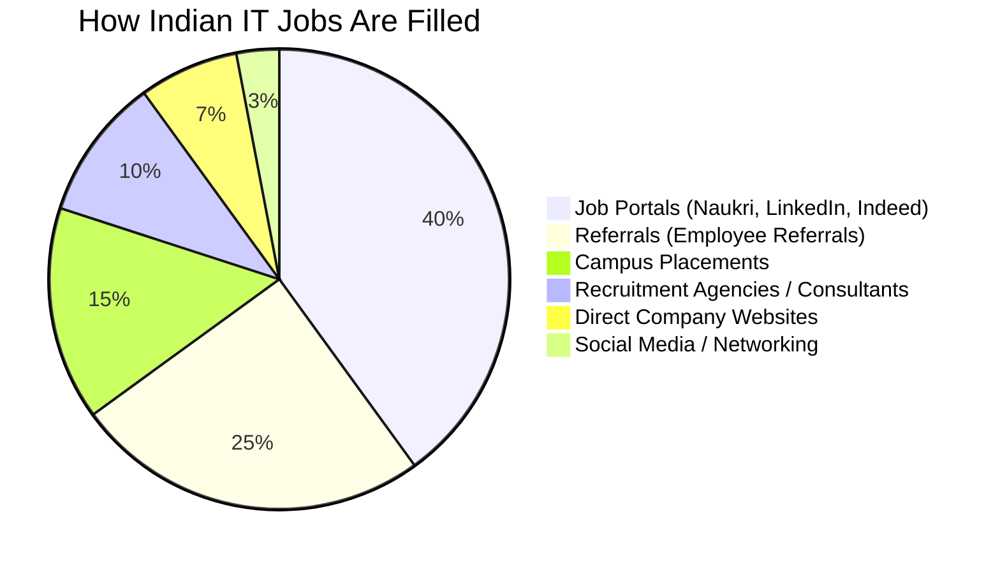
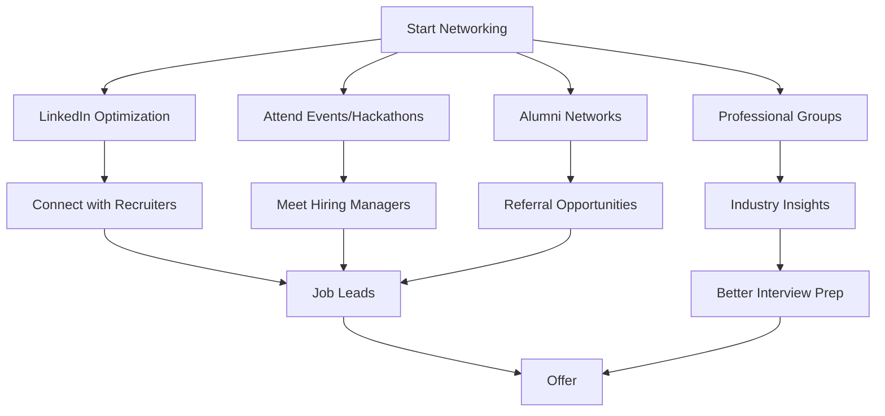
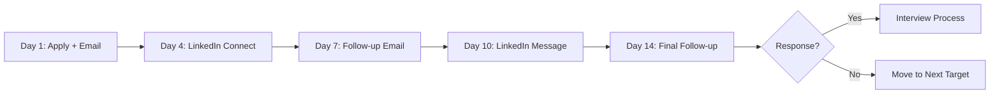
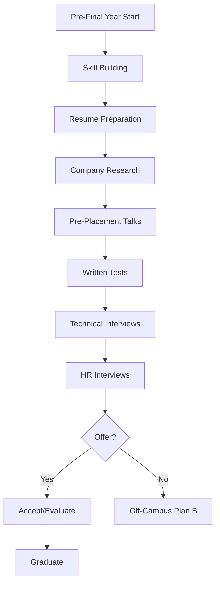

# Job Search Strategy for Indian IT Professionals

## Learning Objectives

By the end of this chapter, you will be able to:

<!-- Image Gallery -->
<section class="lesson-visuals" aria-label="Visual learning resources">
  <header><span>VISUAL LEARNING</span><h2>See it. Review it. Remember it.</h2></header>
  <a class="lesson-visual-card" href="../../assets/images/lessons/job-preparation/02-job-search-strategy/handwritten-notes.png" target="_blank" rel="noopener">
    
    <span><strong>Handwritten notes</strong>Condensed notes for deliberate review.</span>
  </a>
  <a class="lesson-visual-card" href="../../assets/images/lessons/job-preparation/02-job-search-strategy/sticky-notes.png" target="_blank" rel="noopener">
    
    <span><strong>Sticky-note revision</strong>Fast recall prompts for revision.</span>
  </a>
  <a class="lesson-visual-card" href="../../assets/images/lessons/job-preparation/02-job-search-strategy/visual-explanation.png" target="_blank" rel="noopener">
    
    <span><strong>Visual concept guide</strong>A connected explanation of the key ideas.</span>
  </a>
</section>
<!-- End Image Gallery -->

- Design a multi-channel job search strategy covering all major Indian portals
- Leverage networking and referrals to access the hidden job market
- Write effective cold emails and LinkedIn messages that get responses
- Navigate the campus placement process with a winning strategy
- Build and maintain a government job notification tracking system
- Engage with recruitment agencies effectively
- Manage your application pipeline with structured tracking
- Balance active and passive job search techniques for maximum results

## Understanding the Indian IT Job Market Channels

### How Jobs Are Filled



### Key Insight: The Hidden Job Market

Approximately 60% of jobs in the Indian IT industry are never publicly advertised. They are filled through:
- **Internal referrals** from existing employees
- **Internal promotions** or transfers
- **Talent pipelines** maintained by recruiters
- **Previous applicants** revisited for new roles
- **Direct approaches** via LinkedIn or GitHub

This means relying solely on job portals will limit you to only 40% of available opportunities. A comprehensive strategy must include networking, referrals, and direct outreach.

## Job Portals: Detailed Comparison

### Primary Portals

| Portal | Monthly Active Users (India) | Best For | Free Tier | Premium Features | ATS Integration |
|--------|----------------------------|----------|-----------|------------------|-----------------|
| Naukri.com | 70M+ | All IT roles, mass applications | Unlimited applies, resume visible | Naukri FastForward (profile boost, resume writing) | High |
| LinkedIn | 90M+ (India) | Networking, GCCs, MNCs | Limited InMail | Premium (InMail, profile insights, learning) | Very High |
| Indeed | 50M+ | Mass applications, entry-level | Unlimited applies | Employer branding | High |
| Hirist | 5M+ | Tech startups, mid-senior | Limited applies | Profile verification | Medium |
| Cutshort | 3M+ | Product companies, startups | Limited matches | Priority applications | Medium |
| Wellfound (AngelList) | 2M+ | Startup jobs | Unlimited | None needed | Low |
| Monster India | 20M+ | Mid-senior roles | Unlimited | Resume writing, career advice | Medium |
| TimesJobs | 15M+ | Managerial, senior roles | Unlimited | Priority listing | Medium |

### Government Job Notification Sites

| Site | Coverage | Update Frequency | Reliability |
|------|----------|-----------------|-------------|
| SarkariResult.com | All central/state govt jobs | Daily | Very High |
| FreeAlerts.in | All govt/PSU jobs | Daily | High |
| ExamRace.com | Govt exams and results | Daily | High |
| IBPS.in | Banking jobs (PO, SO, Clerk) | Exam season | Official |
| SSC.nic.in | SSC exams | Exam season | Official |
| UPSC.gov.in | UPSC exams | Exam season | Official |
| NIC.in | NIC specific | As advertised | Official |
| AllGovernmentJobs.com | All govt jobs | Daily | High |
| GovernmentJobs.in | State + central jobs | Daily | High |
| PSU Recruitment Cells | Individual PSU sites | As advertised | Official |

### Portal Strategy by Career Stage

| Stage | Primary Portal | Secondary | Approach |
|-------|---------------|-----------|----------|
| Fresher (Campus) | College placement portal | Naukri, LinkedIn | Mass apply (100+ companies) |
| Fresher (Off-Campus) | Naukri, Indeed | Hirist, LinkedIn | Apply to 200+ companies |
| 2-5 Years | LinkedIn, Naukri | Hirist, Cutshort | 30% referrals, 50% portals, 20% direct |
| 5-10 Years | LinkedIn (primary) | Naukri, Wellfound | 50% referrals, 30% recruiter outreach, 20% direct |
| 10+ Years | LinkedIn, Executive Search | Naukri (senior) | 70% network/referral, 20% direct, 10% recruiters |
| Govt/PSU | Official portals, SarkariResult | FreeAlerts | Apply as soon as notification releases |

### Daily Portal Routine

| Time | Activity | Duration |
|------|----------|----------|
| 8:00 AM | Check new job postings on LinkedIn (Saved searches) | 10 min |
| 8:15 AM | Check Naukri.com for new matches | 10 min |
| 8:30 AM | Apply to top 5-10 new jobs | 20 min |
| 1:00 PM | Check government notification sites | 10 min |
| 6:00 PM | Follow up on previous applications | 10 min |
| 8:00 PM | LinkedIn networking (connect, comment, message) | 20 min |
| 9:00 PM | Update application tracker | 10 min |

## Networking Strategies

### The Power of Networking in Indian IT



### LinkedIn Networking Blueprint

#### Phase 1: Profile Optimization (Days 1-3)
- Complete profile to "All-Star" rating
- Add relevant keywords to headline and about section
- Get minimum 50 connections (batch + alumni + colleagues)

#### Phase 2: Building Your Network (Days 4-14)
- Connect with 20 new people per day (target: HR, recruiters, peers)
- Join 10+ relevant groups (industry-specific, technology-specific)
- Follow target companies (50+ companies)

#### Phase 3: Engagement (Days 15-30)
- Comment on 5 posts per day from target companies/people
- Share 3-5 relevant articles or posts per week
- Send personalized connection requests (not default messages)

#### Phase 4: Active Outreach (Days 31+)
- Request informational interviews with 5 people per week
- Ask for referrals for specific positions
- Share your job search status (subtly) through posts

### Connection Request Templates

**Template 1: Alumni Connection**
```
Hi [Name],

I noticed you're also from [College Name] and working at
[Company] as a [Role]. I'm currently exploring opportunities
in [Domain] and would love to connect and learn from your
journey at [Company].

Best,
[Your Name]
```

**Template 2: Same Company Target**
```
Hi [Name],

I've been following [Company Name]'s work in [Domain/Area]
and was impressed by [specific achievement]. I'm a [Role]
with experience in [Skill 1] and [Skill 2], currently
looking to contribute to a team like [Company].

Would love to connect and learn more.

Regards,
[Your Name]
```

**Template 3: Recruiter Connect**
```
Hi [Name],

I see you recruit for [Role Type] roles at [Company]. I'm a
[Current Role] with experience in [Skill 1], [Skill 2], and
[Skill 3]. I'd love to connect and be on your radar for
future opportunities.

Thanks,
[Your Name]
```

**Template 4: Mutual Interest / Group**
```
Hi [Name],

I saw your post about [Topic] in [Group Name] and found
your insights very valuable. I share a similar interest in
[Topic/Technology]. Would love to connect.

Best,
[Your Name]
```

## Referral Strategies

### Why Referrals Matter

| Metric | Portal Application | Referral Application |
|--------|-------------------|---------------------|
| Response Rate | 2-5% | 30-60% |
| Interview Chances | 1-3% | 20-40% |
| Offer Rate (if interviewed) | 15-20% | 30-50% |
| Time to First Response | 1-4 weeks | 2-7 days |
| Salary Negotiation Power | Low | Medium |

### How to Ask for a Referral

#### Step 1: Do Your Homework
- Find the exact job opening on the company's career page
- Note the job ID, title, and requirements
- Find 2-3 people in the company who could refer you

#### Step 2: Build Context (if not already connected)
- Connect on LinkedIn with a personalized message
- Engage with their content for a few days
- Build familiarity before asking

#### Step 3: Make the Ask

**Low-Effort Referral Request (for close connections):**
```
Subject: Referral for [Position] at [Company]

Hi [Name],

Hope you're doing well! I'm very interested in the [Position]
role at [Company] (Job ID: [ID]). I believe my experience in
[Skill 1] and [Skill 2] aligns well with the requirements.

Would you be comfortable referring me? I've attached my resume
for your reference. Happy to answer any questions.

Thanks so much!
[Your Name]
```

**High-Effort Referral Request (for new connections):**
```
Subject: Seeking referral - [Position] at [Company]

Hi [Name],

I came across your profile through [mutual connection / alumni
network] and was impressed by your work at [Company].

I'm applying for the [Position] role (Job ID: [ID]). Based on
the job description, my experience in [Skill A] and [Skill B]
seems like a strong fit. Specifically:

1. [Relevant achievement 1]
2. [Relevant achievement 2]
3. [Relevant achievement 3]

Would you be open to reviewing my resume and possibly
referring me if you think I'm a match? I deeply appreciate
any help.

Best regards,
[Your Name]
[Phone Number]
[LinkedIn URL]
```

### Referral Follow-Up Best Practices

| Action | Timing | Message |
|--------|--------|---------|
| Thank immediately | Within 1 hour | "Thank you so much for the referral! Really appreciate your help." |
| Update on progress | After application | "Just applied through your referral link. Will keep you posted!" |
| Share interview update | After each round | "Had my first round today. It went well, thanks to your referral!" |
| Thank again after offer | After accepting | "I accepted the offer! Can't thank you enough for the referral. Coffee is on me!" |

## Cold Email Templates

### Cold Email to Hiring Manager

```
Subject: [Role] Application - [Your Name] - [X] years experience

Dear [Hiring Manager Name],

I hope this email finds you well. I am writing to express my
interest in the [Role] position at [Company]. With [X] years
of experience in [Domain], I believe I can contribute
significantly to your team.

My key achievements:
- [Achievement 1 with metric]
- [Achievement 2 with metric]
- [Achievement 3 with metric]

I have been following [Company]'s work in [Specific Area] and
am particularly impressed by [Specific Product/Initiative]. I
would love the opportunity to bring my expertise in [Skill Area]
to help [Company] achieve its goals.

My resume is attached for your reference. I would welcome the
chance to discuss how my background aligns with [Company]'s
needs.

Thank you for your time and consideration.

Best regards,
[Your Name]
[Phone]
[LinkedIn]
[GitHub/Portfolio]
```

### Cold Email to Startup Founder / CTO

```
Subject: Excited about [Company Name] - [Your Background]

Hi [Name],

I've been following [Company Name] and I'm genuinely impressed
by [specific product/mission].

I'm a [Role] with experience in [Skill 1] and [Skill 2]. I
recently built [Project] which solved [Problem], and I think
similar approaches could apply to [Company's Challenge].

Some highlights:
- [Achievement 1]
- [Achievement 2]
- [Achievement 3]

I'd love to contribute to [Company Name]'s growth. Are you
hiring for [Role]? I'm open to discussing how I can help.

My portfolio: [URL]

Thanks for your time,
[Your Name]
```

### Follow-Up Email (After No Response)

```
Subject: Re: [Role] Application - [Your Name]

Hi [Name],

I wanted to follow up on my application for the [Role]
position. I remain very interested in joining [Company Name]
and contributing to [Specific Goal].

If you're busy, I completely understand. Just wanted to ensure
my application was received. Happy to provide any additional
information.

Best regards,
[Your Name]
```

### Sequence Strategy: Multi-Touch Approach



## Recruitment Agency Engagement

### Types of Recruitment Agencies in India

| Agency Type | Examples | Roles They Fill | Fee Structure |
|-------------|----------|-----------------|---------------|
| IT Staffing | TeamLease, Randstad, Adecco | Contract, contract-to-hire | 8-15% of annual CTC |
| Executive Search | Heidrick & Struggles, Korn Ferry | C-suite, VP, Director | 25-33% of first-year comp |
| Niche IT | JobsForHer, Divergence | Diversity hiring, specific skills | 10-20% of CTC |
| Overseas Placement | Visapro, Y-Axis | Abroad jobs | Fixed fee (50K-2L) |
| Mass Recruiting | IMS, ABC Consultants | Mid-level bulk hiring | 8-12% of CTC |
| PSU Placement Cells | PSU own HR | Direct recruitment | No fee (direct) |

### How to Work with Recruiters

| Do | Don't |
|----|-------|
| Be honest about your experience and expectations | Exaggerate skills or salary |
| Respond promptly to calls/emails | Ghost recruiters (they have long memories) |
| Keep your profile updated on portals | Apply to same job via multiple agencies |
| Share your resume in ATS-friendly format | Send vague requirements ("any job will do") |
| Ask about the company and role before interview | Accept every interview without vetting |
| Provide feedback after interviews | Badmouth previous employers |
| Maintain professional relationship after placement | Expect immediate responses 24/7 |

### Red Flags in Recruitment Agencies

| Red Flag | Why It's Dangerous |
|----------|-------------------|
| Ask for money upfront | Legitimate agencies charge employers, not candidates |
| Promise guaranteed placement | No one can guarantee a job |
| Vague job description | Could be a different role than expected |
| Pressure to accept quickly | May be a low-quality position |
| No company name before interview | Could be fake or misrepresented |
| Request personal documents unnecessarily | Risk of identity theft |
| Unprofessional communication | Reflects poorly on the agency |

## Campus Placement vs Off-Campus Strategy

### Campus Placement Strategy



#### Campus Placement Timeline (Typical B.Tech)

| Semester | Activity | Deliverables |
|----------|----------|-------------|
| 3rd Sem (2nd Year) | Start DSA practice | 50 problems solved |
| 4th Sem | Build projects, learn web dev | 2-3 projects |
| 5th Sem | Apply for internships | 1 internship secured |
| 6th Sem | Complete internship, update resume | Updated resume |
| 7th Sem (Start) | Company research, aptitude prep | Target list of 50 companies |
| 7th Sem (Mid) | Attend PPTs, apply, give tests | 20+ companies applied |
| 7th Sem (End) | Interview season | Offers in hand |
| 8th Sem | Evaluate offers, graduate | Decision made |

#### Top Campus Recruiters (2026)

| Company Type | Companies | Avg Package | Selection Process |
|-------------|-----------|-------------|-------------------|
| Super Dream (25L+) | Google, Microsoft, Amazon, Atlassian | 25-50 LPA | 4-5 rounds (DSA + System Design + HR) |
| Dream (12-25L) | Zoho, Freshworks, Nutanix, VMware | 12-25 LPA | 3-4 rounds (DSA + Project + HR) |
| Dream (8-12L) | ServiceNow, SAP Labs, Qualcomm | 8-12 LPA | 3 rounds (Technical + Managerial) |
| Mass Recruiter (3-6L) | TCS, Infosys, Wipro, Accenture | 3.5-6 LPA | Aptitude + Technical + HR |
| PSU (7-10L) | ONGC, IOCL, NTPC (through GATE) | 7-10 LPA | GATE Score + Interview |

#### Tips for Campus Placement Success

1. **Start Early**: Begin DSA in 3rd semester, not 7th
2. **Build Projects**: 3 quality projects > 10 trivial ones
3. **Network with Seniors**: Get referrals from placed seniors
4. **Attend Every PPT**: Show interest, ask smart questions
5. **Group Preparation**: Mock interviews with friends
6. **Track Deadlines**: Create a spreadsheet with company schedules
7. **Don't Burn Bridges**: Maintain relationships with TPO
8. **Have a Backup**: Prepare off-campus alongside campus

### Off-Campus Strategy

#### Fresher Off-Campus Challenges

| Challenge | Solution |
|-----------|----------|
| No experience filter | Highlight projects, internships, certifications |
| High competition | Apply to 200+ companies, not just top 10 |
| ATS filtering | Optimize resume with keywords |
| No campus placement support | Use LinkedIn, alumni network, referrals |
| Unknown assessment pattern | Research on Glassdoor, AmbitionBox |
| Ghosting by companies | Follow up systematically |

#### Fresher Off-Campus Weekly Plan

| Day | Activity |
|-----|----------|
| Monday | Apply to 20 new companies on Naukri + LinkedIn |
| Tuesday | DSA practice (3 problems) + 5 company research |
| Wednesday | Apply to 20 new companies + follow up 10 old |
| Thursday | Mock interviews with friends + system design prep |
| Friday | Apply to 20 new companies + update tracker |
| Saturday | Attend any scheduled tests/interviews |
| Sunday | Review week, plan next week, rest |

#### Experienced Professional Off-Campus Strategy

| Experience | Strategy | Platforms |
|------------|----------|-----------|
| 1-2 Years | Apply widely, take calls, compare offers | Naukri, LinkedIn, Hirist |
| 3-5 Years | Referral-based, targeted applications | LinkedIn, referrals, recruiters |
| 5-8 Years | Premium platforms, executive search | LinkedIn, Naukri Premium, headhunters |
| 8+ Years | Network-driven, direct outreach | LinkedIn, industry events, referrals |

## Government Job Notification Tracking System

### Why You Need a Tracking System

Government vacancies are published at unpredictable times across dozens of portals. Missing a 3-day application window can cost you a year. A structured tracking system ensures you never miss an opportunity.

### Tracking Spreadsheet Template

Create a spreadsheet with the following columns:

| Column | Description | Example |
|--------|-------------|---------|
| S.No | Serial number | 1 |
| Exam Name | Official name | SSC CGL 2026 |
| Organization | Conducting body | SSC |
| Post Name | Specific position | Assistant Audit Officer |
| Notification Date | When it was released | 15-Mar-2026 |
| Application Start | When applications open | 20-Mar-2026 |
| Application End | Last date | 20-Apr-2026 |
| Exam Date (Tentative) | Expected test date | 15-Jun-2026 |
| Eligibility | Qualification required | Graduate |
| Age Limit | Age as on cutoff | 18-30 years |
| Application Fee | Fee + concession | 100/- (Gen), 0/- (SC/ST) |
| Application Link | Direct URL | [link] |
| Status | Applied/Not Applied/Admit/Result | Applied |
| Admit Card Date | When admit card released | 01-Jun-2026 |
| Result Date | When result expected | 15-Jul-2026 |
| Syllabus Link | Detailed syllabus | [link] |
| Notes | Additional info | 3 vacancies reserved for PwD |

### TypeScript Example: Government Job Notification Tracker

```typescript
interface GovtJobNotification {
  id: string;
  examName: string;
  organization: string;
  postName: string;
  notificationDate: Date;
  applicationStartDate: Date;
  applicationEndDate: Date;
  examDate: Date | null;
  eligibility: string;
  ageLimitMin: number;
  ageLimitMax: number;
  applicationFeeGeneral: number;
  applicationFeeReserved: number;
  applicationUrl: string;
  status: 'not_applied' | 'applied' | 'admit_received' | 'exam_taken' | 'result_awaited' | 'selected' | 'rejected';
  admitCardDate: Date | null;
  resultDate: Date | null;
  category: 'central_government' | 'state_government' | 'psu' | 'defense' | 'banking' | 'teaching';
}

interface ApplicationReminder {
  notificationId: string;
  daysBeforeDeadline: number;
  reminderType: 'email' | 'sms' | 'notification';
  sent: boolean;
}

class GovJobTracker {
  private notifications: GovtJobNotification[] = [];
  private reminders: ApplicationReminder[] = [];

  addNotification(job: GovtJobNotification): void {
    this.notifications.push(job);
    this.setupDefaultReminders(job);
  }

  private setupDefaultReminders(job: GovtJobNotification): void {
    const reminderDays = [30, 14, 7, 3, 1];
    for (const days of reminderDays) {
      this.reminders.push({
        notificationId: job.id,
        daysBeforeDeadline: days,
        reminderType: 'notification',
        sent: false,
      });
    }
  }

  getUpcomingDeadlines(daysAhead: number = 30): GovtJobNotification[] {
    const now = new Date();
    const futureDate = new Date(now.getTime() + daysAhead * 24 * 60 * 60 * 1000);

    return this.notifications
      .filter(
        (job) =>
          job.applicationEndDate >= now &&
          job.applicationEndDate <= futureDate &&
          job.status === 'not_applied'
      )
      .sort(
        (a, b) => a.applicationEndDate.getTime() - b.applicationEndDate.getTime()
      );
  }

  getDueReminders(): Array<{ job: GovtJobNotification; daysLeft: number }> {
    const now = new Date();
    const due: Array<{ job: GovtJobNotification; daysLeft: number }> = [];

    for (const reminder of this.reminders) {
      if (reminder.sent) continue;

      const job = this.notifications.find(
        (n) => n.id === reminder.notificationId
      );
      if (!job) continue;

      const msPerDay = 24 * 60 * 60 * 1000;
      const daysLeft = Math.ceil(
        (job.applicationEndDate.getTime() - now.getTime()) / msPerDay
      );

      if (daysLeft <= reminder.daysBeforeDeadline && daysLeft >= 0 && job.status === 'not_applied') {
        due.push({ job, daysLeft });
        reminder.sent = true;
      }
    }

    return due;
  }

  getExamCalendar(month: number, year: number): GovtJobNotification[] {
    return this.notifications.filter((job) => {
      if (!job.examDate) return false;
      return (
        job.examDate.getMonth() === month &&
        job.examDate.getFullYear() === year &&
        job.status !== 'rejected'
      );
    });
  }

  getStatusSummary(): Record<string, number> {
    const summary: Record<string, number> = {};

    for (const job of this.notifications) {
      summary[job.status] = (summary[job.status] || 0) + 1;
    }

    return summary;
  }

  getNotificationsByCategory(): Record<string, GovtJobNotification[]> {
    const grouped: Record<string, GovtJobNotification[]> = {};

    for (const job of this.notifications) {
      const cat = job.category;
      if (!grouped[cat]) grouped[cat] = [];
      grouped[cat].push(job);
    }

    return grouped;
  }

  applyForJob(jobId: string): void {
    const job = this.notifications.find((n) => n.id === jobId);
    if (job) {
      job.status = 'applied';
    }
  }

  updateStatus(jobId: string, status: GovtJobNotification['status']): void {
    const job = this.notifications.find((n) => n.id === jobId);
    if (job) {
      job.status = status;
    }
  }

  generateMonthlyReport(): string {
    const now = new Date();
    const monthNames = [
      'January', 'February', 'March', 'April', 'May', 'June',
      'July', 'August', 'September', 'October', 'November', 'December',
    ];
    const month = monthNames[now.getMonth()];
    const year = now.getFullYear();

    const exams = this.getExamCalendar(now.getMonth(), now.getFullYear());
    const deadlines = this.getUpcomingDeadlines(30);

    return `
=== Monthly Report: ${month} ${year} ===

Exams This Month: ${exams.length}
${exams.map((e) => `- ${e.examName} (${e.postName})`).join('\n')}

Upcoming Deadlines (30 days): ${deadlines.length}
${deadlines.map((d) => `- ${d.examName}: ${d.applicationEndDate.toLocaleDateString()}`).join('\n')}

Status Summary:
${Object.entries(this.getStatusSummary())
  .map(([k, v]) => `- ${k}: ${v}`)
  .join('\n')}

Total Notifications Tracked: ${this.notifications.length}
    `.trim();
  }
}

const tracker = new GovJobTracker();

tracker.addNotification({
  id: 'SSC-CGL-2026-01',
  examName: 'SSC CGL 2026',
  organization: 'Staff Selection Commission',
  postName: 'Assistant Audit Officer',
  notificationDate: new Date('2026-03-15'),
  applicationStartDate: new Date('2026-03-20'),
  applicationEndDate: new Date('2026-04-20'),
  examDate: new Date('2026-06-15'),
  eligibility: 'Graduate in any discipline',
  ageLimitMin: 18,
  ageLimitMax: 30,
  applicationFeeGeneral: 100,
  applicationFeeReserved: 0,
  applicationUrl: 'https://ssc.nic.in',
  status: 'not_applied',
  admitCardDate: new Date('2026-06-01'),
  resultDate: new Date('2026-07-15'),
  category: 'central_government',
});

tracker.addNotification({
  id: 'IBPS-SO-2026-01',
  examName: 'IBPS SO 2026 (IT)',
  organization: 'IBPS',
  postName: 'Specialist Officer (IT)',
  notificationDate: new Date('2026-08-01'),
  applicationStartDate: new Date('2026-08-05'),
  applicationEndDate: new Date('2026-08-25'),
  examDate: new Date('2026-12-10'),
  eligibility: 'B.Tech/B.E. in CS/IT/MCA',
  ageLimitMin: 20,
  ageLimitMax: 30,
  applicationFeeGeneral: 850,
  applicationFeeReserved: 175,
  applicationUrl: 'https://ibps.in',
  status: 'not_applied',
  admitCardDate: null,
  resultDate: null,
  category: 'banking',
});

tracker.addNotification({
  id: 'GATE-2027-01',
  examName: 'GATE 2027',
  organization: 'IITs',
  postName: 'GATE Score (CS)',
  notificationDate: new Date('2026-09-01'),
  applicationStartDate: new Date('2026-09-05'),
  applicationEndDate: new Date('2026-10-05'),
  examDate: new Date('2027-02-05'),
  eligibility: 'B.Tech/B.E./M.Tech/MCA',
  ageLimitMin: 0,
  ageLimitMax: 100,
  applicationFeeGeneral: 1500,
  applicationFeeReserved: 750,
  applicationUrl: 'https://gate.iit.ac.in',
  status: 'not_applied',
  admitCardDate: null,
  resultDate: null,
  category: 'central_government',
});

console.log('Upcoming deadlines (30 days):', tracker.getUpcomingDeadlines(30).length);
console.log('Due reminders:', tracker.getDueReminders());
console.log('Monthly report:');
console.log(tracker.generateMonthlyReport());
```

### Government Notification Calendar Template

Create an annual calendar view to track when each exam typically occurs:

| Month | Expected Notifications | Typical Exams |
|-------|----------------------|---------------|
| January | UPSC notifications | UPSC Engineering Services prelims |
| February | Various PSUs (GATE-based) | GATE exam |
| March | SSC notifications | NIC Scientist, UPSC CSE prelims |
| April | IBPS notifications | SSC CGL Tier 1 |
| May | Various PSUs | ISRO, BSNL JTO |
| June | SBI notifications | SSC CGL Tier 2, DRDO CEPTAM |
| July | RBI notifications | BSNL JTO exam |
| August | SSC second notification | IBPS PO/MT, SBI IT Officer |
| September | UPSC notifications | RBI Grade B, NIC Scientist exam |
| October | Various PSUs | IBPS PO exam |
| November | SSC notification | Various PSU interviews |
| December | Next year planning | IBPS SO, SSC CGL Tier 3 |

## Application Tracking System (ATS) for Your Own Use

### Sample Application Tracker Spreadsheet

| Date Applied | Company | Role | Platform | Referral? | Status | Interview Rounds | Notes | Follow-Up Date |
|-------------|---------|-----|----------|-----------|--------|-----------------|-------|----------------|
| 01-Jan-2026 | Google | SDE 2 | LinkedIn | Yes (John) | Applied | - | Referred on 01-Jan | 08-Jan-2026 |
| 02-Jan-2026 | Stripe | Backend | Careers | No | Screening | 1 (HR call) | Good fit | 05-Jan-2026 |
| 03-Jan-2026 | TCS | Systems Eng | Naukri | No | Test | Online test | Digital profile | 10-Jan-2026 |
| 04-Jan-2026 | NIC | Scientist-B | Official | No | Applied | - | Govt exam | 01-Feb-2026 |

### TypeScript Application Tracker

```typescript
type ApplicationStatus =
  | 'saved'
  | 'applied'
  | 'resume_reviewed'
  | 'phone_screen'
  | 'technical_round'
  | 'manager_round'
  | 'hr_round'
  | 'offer_received'
  | 'offer_accepted'
  | 'rejected'
  | 'ghosted';

interface JobApplication {
  id: string;
  company: string;
  role: string;
  location: string;
  applicationDate: Date;
  source: 'linkedin' | 'naukri' | 'indeed' | 'referral' | 'careers_page' | 'recruiter' | 'campus' | 'other';
  referralPerson?: string;
  status: ApplicationStatus;
  interviewRounds: InterviewRound[];
  salaryOffered?: number;
  notes: string;
  nextFollowUp: Date | null;
  jobUrl: string;
}

interface InterviewRound {
  roundNumber: number;
  roundType: 'phone_screen' | 'technical' | 'dsa' | 'system_design' | 'managerial' | 'hr' | 'group_discussion' | 'case_study';
  interviewerName: string;
  date: Date;
  duration: number; // minutes
  feedback: 'positive' | 'neutral' | 'negative' | 'pending';
  topicsCovered: string[];
  notes: string;
}

class JobApplicationTracker {
  private applications: Map<string, JobApplication> = new Map();

  addApplication(app: JobApplication): void {
    this.applications.set(app.id, app);
  }

  updateStatus(appId: string, newStatus: ApplicationStatus): void {
    const app = this.applications.get(appId);
    if (app) {
      app.status = newStatus;
    }
  }

  addInterviewRound(appId: string, round: InterviewRound): void {
    const app = this.applications.get(appId);
    if (app) {
      app.interviewRounds.push(round);
    }
  }

  getApplicationsByStatus(status: ApplicationStatus): JobApplication[] {
    return Array.from(this.applications.values()).filter(
      (app) => app.status === status
    );
  }

  getApplicationsBySource(source: string): JobApplication[] {
    return Array.from(this.applications.values()).filter(
      (app) => app.source === source
    );
  }

  getSuccessRate(): { total: number; offers: number; rate: number } {
    const all = Array.from(this.applications.values());
    const offers = all.filter(
      (a) =>
        a.status === 'offer_received' || a.status === 'offer_accepted'
    ).length;
    return {
      total: all.length,
      offers,
      rate: all.length > 0 ? (offers / all.length) * 100 : 0,
    };
  }

  getSourceEffectiveness(): Map<string, { applied: number; offers: number }> {
    const effectiveness = new Map<
      string,
      { applied: number; offers: number }
    >();

    for (const app of this.applications.values()) {
      const source = app.source;
      const current = effectiveness.get(source) || {
        applied: 0,
        offers: 0,
      };
      current.applied++;
      if (
        app.status === 'offer_received' ||
        app.status === 'offer_accepted'
      ) {
        current.offers++;
      }
      effectiveness.set(source, current);
    }

    return effectiveness;
  }

  getNeedsFollowUp(daysThreshold: number = 7): JobApplication[] {
    const now = new Date();
    return Array.from(this.applications.values()).filter((app) => {
      if (!app.nextFollowUp) return false;
      const msDiff = app.nextFollowUp.getTime() - now.getTime();
      const daysDiff = msDiff / (1000 * 60 * 60 * 24);
      return daysDiff <= daysThreshold && daysDiff >= 0;
    });
  }

  generateWeeklyReport(): string {
    const now = new Date();
    const oneWeekAgo = new Date(now.getTime() - 7 * 24 * 60 * 60 * 1000);

    const thisWeek = Array.from(this.applications.values()).filter(
      (a) => a.applicationDate >= oneWeekAgo
    );

    const followUps = this.getNeedsFollowUp(3);

    return `
=== Weekly Job Search Report (${now.toLocaleDateString()}) ===

Applications This Week: ${thisWeek.length}
New Offers: ${thisWeek.filter((a) => a.status === 'offer_received').length}
Rejections: ${thisWeek.filter((a) => a.status === 'rejected').length}
Pending Follow-ups: ${followUps.length}

Success Rate: ${this.getSuccessRate().rate.toFixed(1)}% (${this.getSuccessRate().offers} offers from ${this.getSuccessRate().total} apps)

Source Effectiveness:
${Array.from(this.getSourceEffectiveness().entries())
  .map(([source, data]) => `- ${source}: ${data.offers}/${data.applied} offers`)
  .join('\n')}

Current Pipeline:
- Applied: ${this.getApplicationsByStatus('applied').length}
- In Interview: ${this.getApplicationsByStatus('phone_screen').length + this.getApplicationsByStatus('technical_round').length}
- Offer Stage: ${this.getApplicationsByStatus('offer_received').length}
    `.trim();
  }
}

const myTracker = new JobApplicationTracker();

myTracker.addApplication({
  id: 'APP-001',
  company: 'Google',
  role: 'Software Engineer II',
  location: 'Bangalore',
  applicationDate: new Date('2026-01-01'),
  source: 'referral',
  referralPerson: 'John Doe',
  status: 'technical_round',
  interviewRounds: [
    {
      roundNumber: 1,
      roundType: 'phone_screen',
      interviewerName: 'Alice',
      date: new Date('2026-01-10'),
      duration: 45,
      feedback: 'positive',
      topicsCovered: ['DSA', 'System Design basics'],
      notes: 'Good discussion on distributed systems',
    },
    {
      roundNumber: 2,
      roundType: 'technical',
      interviewerName: 'Bob',
      date: new Date('2026-01-15'),
      duration: 60,
      feedback: 'pending',
      topicsCovered: ['Trees', 'Graphs', 'Dynamic Programming'],
      notes: 'Solved 2/3 problems optimally',
    },
  ],
  notes: 'Strong referral, good cultural fit expected',
  nextFollowUp: new Date('2026-01-20'),
  jobUrl: 'https://google.com/careers/...',
});

myTracker.addApplication({
  id: 'APP-002',
  company: 'Stripe',
  role: 'Backend Engineer',
  location: 'Remote',
  applicationDate: new Date('2026-01-02'),
  source: 'linkedin',
  status: 'rejected',
  interviewRounds: [
    {
      roundNumber: 1,
      roundType: 'phone_screen',
      interviewerName: 'Carol',
      date: new Date('2026-01-05'),
      duration: 30,
      feedback: 'negative',
      topicsCovered: ['Experience', 'System Design'],
      notes: 'Not enough experience in payment systems',
    },
  ],
  notes: 'Rejected after phone screen',
  nextFollowUp: null,
  jobUrl: 'https://stripe.com/jobs/...',
});

myTracker.addApplication({
  id: 'APP-003',
  company: 'Microsoft',
  role: 'SDE 2',
  location: 'Hyderabad',
  applicationDate: new Date('2026-01-03'),
  source: 'linkedin',
  status: 'offer_received',
  interviewRounds: [
    {
      roundNumber: 1,
      roundType: 'phone_screen',
      interviewerName: 'Dave',
      date: new Date('2026-01-08'),
      duration: 45,
      feedback: 'positive',
      topicsCovered: ['Coding', 'Design'],
      notes: 'Good performance',
    },
    {
      roundNumber: 2,
      roundType: 'technical',
      interviewerName: 'Eve',
      date: new Date('2026-01-12'),
      duration: 60,
      feedback: 'positive',
      topicsCovered: ['Arrays', 'Strings', 'OOP'],
      notes: 'Solved all problems',
    },
  ],
  salaryOffered: 2800000,
  notes: 'Offer received, negotiating',
  nextFollowUp: new Date('2026-01-25'),
  jobUrl: 'https://microsoft.com/careers/...',
});

console.log(myTracker.generateWeeklyReport());
console.log('Source effectiveness:', myTracker.getSourceEffectiveness());
```

## Salary Negotiation Preparation Through Search Strategy

### Information Gathering Before Salary Discussion

| Information | Source | What to Look For |
|-------------|--------|------------------|
| Company salary range | Glassdoor, AmbitionBox | Band for your role and level |
| Competitor offers | Multiple applications | Leverage competing offers |
| Market rate for your skills | LinkedIn Salary, Naukri | 25th/50th/75th percentile |
| Company benefits | Company career page | Stock, bonus, insurance details |
| Typical hike percentages | Industry reports | 20-40% for switches |
| Budget cycle | Recruiter conversations | When is their hiring budget refreshed |

### Strategic Application Timing

| Time Period | Advantage | Disadvantage |
|-------------|-----------|--------------|
| Q1 (Jan-Mar) | Fresh budgets, high hiring | High competition (everyone resigned after bonus) |
| Q2 (Apr-Jun) | Stable hiring, less competition | Mid-year budget constraints |
| Q3 (Jul-Sep) | Campus season mostly over | Companies may wait for campus hires |
| Q4 (Oct-Dec) | Year-end urgency to fill roles | Budgets may be exhausted |

## Quick Reference

### Job Search KPIs to Track

| Metric | Fresher Target | Experienced Target |
|--------|---------------|-------------------|
| Applications per week | 30-50 | 10-20 |
| Response rate | 2-5% | 10-25% |
| Interview-to-Offer ratio | 1:15 | 1:5 |
| Time to first interview | 2-4 weeks | 1-2 weeks |
| Time to offer | 2-4 months | 1-3 months |
| Active job search channels | 3-4 | 4-5 |
| LinkedIn connections | 500+ | 1000+ |
| Referral requests per week | 5-10 | 3-5 |
| Follow-up messages | 70% of apps | 50% of apps |

### Response Rate Optimization

| Action | Expected Improvement in Response Rate |
|--------|--------------------------------------|
| Customize resume for each job | +20% |
| Apply within 48 hours of posting | +30% |
| Use referral | +300% |
| Follow up after 5-7 days | +40% |
| Connect with recruiter on LinkedIn | +50% |
| Complete LinkedIn profile (All-Star) | +35% |
| Apply on company website (not just portal) | +25% |

### Tools for Job Search Automation

| Tool | Purpose | Cost |
|------|---------|------|
| LinkedIn Job Alerts | Instant notifications for saved searches | Free |
| Naukri Recruiter Connection | Direct messaging to recruiters | Premium feature |
| Indeed Resume Forwarding | Resume sent to matching employers | Free |
| Huntr (app.huntr.co) | Application tracking system | Free tier |
| Notion / Excel | Custom application tracker | Free |
| Google Alerts | Company-specific notifications | Free |
| Telegram Job Alert Groups | Real-time govt job notifications | Free |
| Zapier | Connect job alerts to email/tracker | Free tier |

## Summary

A successful job search in the Indian IT landscape requires a multi-channel approach combining job portals, networking, referrals, and direct outreach. For private sector roles, LinkedIn and Naukri should be your primary platforms, supplemented by referrals for the hidden job market. For government positions, maintain a rigorous notification tracking system and apply the moment vacancies are announced. Campus placement drives should be complemented with off-campus preparation as a backup. Track everything — applications, interviews, follow-ups — using the TypeScript tracker provided or a spreadsheet. The key metric is not just the number of applications, but the response rate, which improves dramatically with referrals, customization, and timely follow-ups.

## Practical Takeaways

1. Register on all 8 major job portals in your first week and configure saved searches with daily email alerts
2. Spend 70% of your job search time on networking and referrals, 30% on portal applications
3. Create and maintain a government job notification tracker (use the TypeScript tool provided)
4. Send at least 5 personalized LinkedIn messages per day to recruiters and hiring managers at target companies
5. Apply within 24-48 hours of job posting — early applicants get 3x more responses
6. Maintain a 70% follow-up rate — most candidates give up after one email
7. Never accept a referral request without first researching the company and role thoroughly
8. Balance campus placement preparation with off-campus applications to avoid dependence on one channel
9. Use the application tracker to measure source effectiveness and double down on what works
10. Government job applications require patience — set up alerts and check notifications daily without fail
