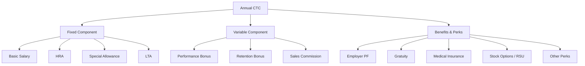
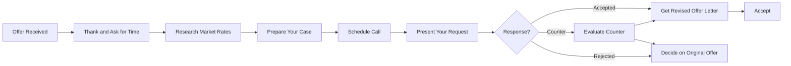
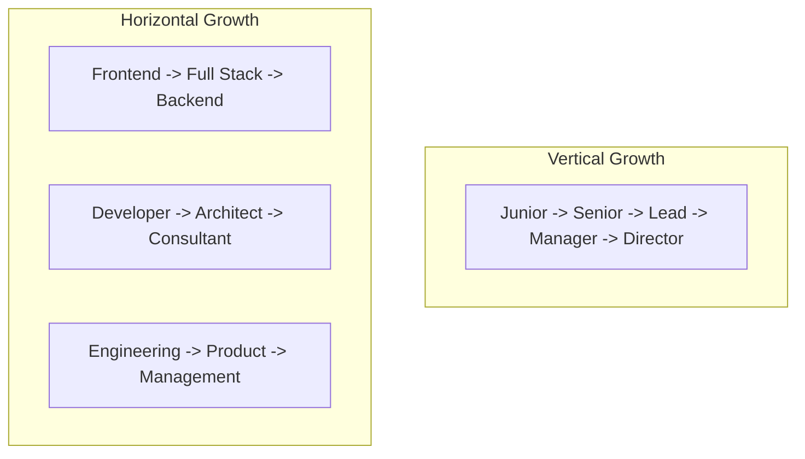
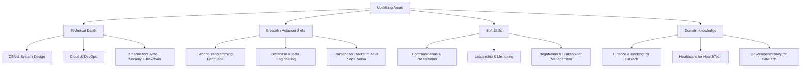

# Offer Negotiation and Career Growth Planning

## Learning Objectives

By the end of this chapter, you will be able to:
- Understand and analyze the complete CTC structure for private sector and government offers
- Negotiate salary effectively using proven scripts and strategies
- Decode government pay scales (7th Pay Commission, PSU pay structures)
- Plan your career progression with horizontal and vertical growth paths
- Build a continuous upskilling roadmap aligned with industry demands
- Navigate promotion paths in both private and government sectors
- Handle multiple offers to maximize your total compensation
- Understand tax implications of different salary components
- Make informed decisions between private sector and government job offers

## Understanding Compensation Structures

### Private Sector CTC Components



### Breaking Down a 12 LPA Private Sector Offer

| Component | Amount (Annual) | Taxable? | Explanation |
|-----------|----------------|----------|-------------|
| Basic Salary | 4,80,000 (40%) | Yes | 40% of fixed, PF calculation base |
| HRA | 2,40,000 (20%) | Partially | 50% of basic if metro, 40% if non-metro exempt up to actual rent - 10% of basic |
| Special Allowance | 2,10,000 (17.5%) | Yes | Balancing figure, fully taxable |
| LTA | 30,000 (2.5%) | Partially | Exempt for 2 journeys in a block of 4 years |
| Employer PF | 57,600 (4.8%) | No | 12% of basic (employer contribution) |
| Gratuity | 23,040 (1.9%) | No | 4.81% of basic, payable after 5 years |
| Performance Bonus | 1,20,000 (10%) | Yes | Variable, at company discretion |
| Medical Insurance | 15,000 (1.3%) | No | Group insurance premium |
| Stock Options | 24,360 (2%) | At exercise | RSUs vest over 4 years typically |
| **Total CTC** | **12,00,000** | | |

### Monthly In-Hand Calculation

| Item | Metro City | Non-Metro |
|------|-----------|-----------|
| Basic (monthly) | 40,000 | 40,000 |
| HRA | 20,000 | 20,000 |
| Special Allowance | 17,500 | 17,500 |
| LTA (monthly) | 2,500 | 2,500 |
| **Gross Monthly** | **80,000** | **80,000** |
| Employee PF | -4,800 | -4,800 |
| Professional Tax | -200 | -150 |
| Income Tax (est.) | -3,500 | -3,500 |
| **In-Hand (approx)** | **71,500** | **71,550** |

**Note**: HRA exemption reduces tax. If you live in a metro and pay rent of Rs. 15,000/month, your HRA exemption = min(actual HRA received, actual rent paid - 10% of basic, 50% of basic).

### Government Compensation Structure

#### 7th Pay Commission Matrix

| Pay Level | Entry Pay | Index | Example Posts |
|-----------|-----------|-------|---------------|
| Level 1 | 18,000 | 1 | Peon, Daftry |
| Level 2 | 19,900 | 1.11 | Lower Division Clerk |
| Level 3 | 21,700 | 1.21 | Upper Division Clerk |
| Level 4 | 25,500 | 1.42 | Stenographer, Tax Assistant |
| Level 5 | 29,200 | 1.62 | Assistant |
| Level 6 | 35,400 | 1.97 | Inspector, Assistant Section Officer |
| Level 7 | 44,900 | 2.49 | Income Tax Inspector, Programmer |
| Level 8 | 47,600 | 2.64 | Assistant Manager (PSU entry) |
| Level 9 | 53,100 | 2.95 | Senior Programmer |
| Level 10 | 56,100 | 3.12 | Assistant Secretary, Scientist-B |
| Level 11 | 67,700 | 3.76 | Deputy Secretary |
| Level 12 | 78,800 | 4.38 | Director |
| Level 13 | 1,23,100 | 6.84 | Joint Secretary |
| Level 14 | 1,44,200 | 8.01 | Additional Secretary |

#### Government Employee Monthly Salary Example (Level 7)

| Component | Amount | Notes |
|-----------|--------|-------|
| Basic Pay | 44,900 | As per Level 7 |
| DA (53% of basic) | 23,797 | Dearness Allowance, revised quarterly |
| HRA (27% for X city) | 12,123 | 27% for X, 18% for Y, 9% for Z cities |
| TA (Transport Allowance) | 3,600 + DA on TA | Higher for X cities |
| **Gross Pay** | **84,420** | |
| NPS Deduction (10%) | -6,870 | 10% of (Basic + DA) |
| CGHS Contribution | -1,000 | Medical scheme |
| Income Tax | -1,500 | Approximate |
| **In-Hand** | **~75,050** | |

### PSU Salary Structure (E0 / Entry Level)

| PSU | Basic Pay | Grade | Total Monthly (approx) |
|-----|-----------|-------|----------------------|
| ONGC | 60,000 | E0(A) | 85,000 - 95,000 |
| IOCL | 50,000 | E0 | 78,000 - 88,000 |
| NTPC | 50,000 | E0 | 80,000 - 90,000 |
| BHEL | 50,000 | E0 | 75,000 - 85,000 |
| GAIL | 60,000 | E0 | 82,000 - 92,000 |
| HPCL | 60,000 | E0 | 82,000 - 92,000 |
| SAIL | 50,000 | E0 | 78,000 - 88,000 |
| Coal India | 50,000 | E0 | 75,000 - 85,000 |
| NLC India | 50,000 | E0 | 78,000 - 85,000 |
| PGCIL | 50,000 | E0 | 80,000 - 88,000 |

### PSU Additional Benefits

| Benefit | Value (Annual) | Notes |
|---------|---------------|-------|
| HRA / Company Accommodation | 1,20,000 - 2,40,000 | Or free/ subsidized housing |
| Medical Benefits | 50,000 - 1,00,000 | Reimbursement + CGHS |
| Children Education Allowance | 30,000 per child | Max 2 children |
| LTC | 50,000 - 1,00,000 | Leave Travel Concession |
| Bonus / Ex-gratia | 30,000 - 1,00,000 | Production-linked bonus |
| PF + NPS | 1,20,000 + | Employer + Employee contribution |
| Gratuity | As per rules | After 5 years |
| Newspaper / Phone | 10,000 - 25,000 | Allowances |
| Conveyance | 10,000 - 30,000 | Or vehicle + driver for higher grades |

## Salary Negotiation Strategies

### When Can You Negotiate?

| Situation | Negotiation Leverage | Strategy |
|-----------|---------------------|----------|
| Campus placement | Low-Medium | Limited room, negotiate on joining bonus and perks |
| Job switch (1-3 years experience) | Medium | Current salary + 30-40% hike is standard |
| Job switch (3-8 years experience) | High | Multiple offers, strong leverage |
| Job switch (8+ years) | Very High | Executive-level negotiation |
| Internal promotion | Low-Medium | Use external offers as leverage |
| Govt/PSU offer | None | Fixed pay scale, no negotiation |
| Counter-offer | High | Current employer may match or exceed |

### Negotiation Timeline



### Negotiation Scripts

#### Script 1: Asking for Time to Decide

```
"Thank you so much for the offer! I'm really excited about
the opportunity to join [Company Name]. I would like a few
days to carefully review the offer details before I respond.
Could I have until [specific date, 3-5 days from now] to
get back to you?"

[HR will usually give 3-7 days — use this time wisely]
```

#### Script 2: Negotiating Salary (You Have Another Offer)

```
"I'm very excited about this role at [Company Name] and
believe I would be a great addition to the team. The offer
is competitive, and I do have another offer from [Other
Company] for [Amount]. However, [Company Name] is my
preferred choice. Would it be possible to revise the offer
to [Target Amount] to help me make this decision?"

[This shows genuine interest while using leverage]
```

#### Script 3: Negotiating Without Another Offer

```
"I've had a chance to review the offer, and I'm thrilled
about the opportunity. Based on my experience in [Skill
Area] and the market research I've done for similar roles
in [City], I was hoping we could discuss the compensation.
Specifically, I was targeting a range of [Lower - Upper]
given my background in [Achievement 1] and [Achievement 2].
Is there flexibility in the budget to consider [Amount]?"

[Use market data, not personal needs]
```

#### Script 4: Negotiating Perks When Salary is Fixed (Govt/PSU)

```
"I understand the salary structure is fixed, and I respect
that. I was wondering if there are any other components we
could discuss, such as:
1. A joining bonus to offset my notice period pay
2. Relocation assistance
3. Professional development budget
4. Additional vacation days (for private sector)

I'm very keen on joining and want to ensure a smooth transition."
```

#### Script 5: Counter-Offer from Current Employer

```
"I appreciate the counter-offer from [Current Company].
However, my decision to explore external opportunities was
based on [growth/career development/challenge], not just
compensation. While I value [Current Company], I've decided
to accept the offer from [New Company] as it aligns better
with my long-term career goals."

[Generally, accepting counter-offers is risky — 70% leave
within 6 months anyway]
```

### Negotiation Do's and Don'ts

| Do | Don't |
|----|-------|
| Be professional and courteous | Make ultimatums or threats |
| Use market data to justify | Say "I need X amount" without reason |
| Negotiate face-to-face or on call | Negotiate over email (too formal) |
| Express genuine enthusiasm | Show disinterest or play hard to get |
| Be specific about your ask | Be vague ("I want more money") |
| Consider total package, not just salary | Focus only on base pay |
| Know your BATNA (Best Alternative) | Accept the first offer always |
| Time your negotiation properly | Negotiate after accepting the offer |
| Be willing to walk away | Accept a lowball offer out of desperation |

### Negotiation Leverage Points

| Leverage Point | How to Build It | Impact |
|----------------|-----------------|--------|
| Multiple offers | Apply to 3-5 companies simultaneously | High |
| In-demand skills | AI/ML, Cloud, Cybersecurity specialists | High |
| Strong interview performance | Ace all rounds, get positive feedback | Medium |
| Current salary | High current salary sets a floor | Medium |
| Unique experience | Domain expertise, patents, open source | Medium |
| Counter-offer | Current employer willing to match | Medium |
| Timing (quarter-end) | Teams need to fill roles before deadline | Low-Medium |

## Salary Negotiation — Negotiable vs Non-Negotiable

### Private Sector Negotiable Components

| Component | Negotiable? | Typical Range |
|-----------|------------|---------------|
| Base Salary | Yes | 10-30% above initial offer |
| Joining Bonus | Yes | Up to 1-2 months salary |
| Stock Options / RSUs | Yes | 10-50% more (based on level) |
| Sign-on Bonus | Yes | Rs. 1-5 lakhs common |
| Relocation Assistance | Yes | Rs. 50K - 2 lakhs |
| Performance Bonus Target | Sometimes | 5-15% of CTC |
| Annual Bonus Target | Sometimes | 10-30% of base |
| Notice Period Buyout | Yes | Reimburse notice period salary |
| Vacation Days | Sometimes | 1-5 extra days |
| Flexible Work Hours | Yes | Usually flexible |

### Government/PSU Non-Negotiable Components

| Component | Negotiable? | Reason |
|-----------|------------|--------|
| Basic Pay | No | Fixed pay scale, matrix-based |
| DA | No | Fixed percentage across all employees |
| HRA | No | City category-based percentage |
| Grade | No | Based on entry qualification |
| Promotion Timeline | No | Fixed seniority + exam based |
| Pension/NPS Contribution | No | Government regulation |
| Transfer Policy | No | Organization-dependent, not negotiable |

### Private Sector Fixed Components (Rarely Negotiable)

| Component | Reason |
|-----------|--------|
| Employer PF | Government mandated (12% of basic) |
| Gratuity | Payment of Gratuity Act requirement |
| Medical Insurance | Group policy, same for all employees |
| Standard benefits | Same across all employees (cab, food, etc.) |

## TypeScript: Offer Comparison Calculator

```typescript
interface OfferDetails {
  company: string;
  sector: 'private' | 'government' | 'psu';
  baseSalary: number;
  variablePay: number;
  joiningBonus: number;
  totalCTC: number;
  location: 'X' | 'Y' | 'Z'; // City category for HRA
  stockOptionsAnnual: number;
  relocationSupport: number;
  otherBenefits: number;
  pensionContribution: number;
  noticePeriodDays: number;
  probationMonths: number;
}

interface OfferComparison {
  offerA: OfferDetails;
  offerB: OfferDetails;
  fiveYearProjection: {
    offerA: number[];
    offerB: number[];
  };
  recommendation: string;
  breakEvenYear: number;
}

class OfferComparator {
  private taxSlabs: Array<{ min: number; max: number; rate: number }> = [
    { min: 0, max: 300000, rate: 0 },
    { min: 300000, max: 600000, rate: 0.05 },
    { min: 600000, max: 900000, rate: 0.10 },
    { min: 900000, max: 1200000, rate: 0.15 },
    { min: 1200000, max: 1500000, rate: 0.20 },
    { min: 1500000, max: Infinity, rate: 0.30 },
  ];

  calculateTakeHome(offer: OfferDetails): {
    monthlyGross: number;
    monthlyDeductions: number;
    monthlyTakeHome: number;
    annualTakeHome: number;
  } {
    const monthlyBasic = offer.baseSalary / 12;
    const monthlyVariable = offer.variablePay / 12;
    const hraPercentage = offer.location === 'X' ? 0.50 : 0.40;
    const monthlyHRA = monthlyBasic * hraPercentage;
    const monthlyGross = monthlyBasic + monthlyHRA + monthlyVariable;

    const employeePF = monthlyBasic * 0.12;
    const professionalTax = offer.location === 'X' ? 200 : 150;

    let taxableAnnual = 0;
    const nonTaxableHRA = Math.min(monthlyHRA, 0.5 * monthlyBasic);
    taxableAnnual =
      (monthlyGross - nonTaxableHRA - employeePF - professionalTax) * 12;

    let totalTax = 0;
    for (const slab of this.taxSlabs) {
      if (taxableAnnual > slab.min) {
        const taxableInSlab = Math.min(taxableAnnual, slab.max) - slab.min;
        totalTax += taxableInSlab * slab.rate;
      }
    }

    const monthlyTax = totalTax / 12;
    const monthlyDeductions = employeePF + professionalTax + monthlyTax;
    const monthlyTakeHome = monthlyGross - monthlyDeductions;
    const annualTakeHome = monthlyTakeHome * 12 + offer.joiningBonus;

    return { monthlyGross, monthlyDeductions, monthlyTakeHome, annualTakeHome };
  }

  compareOffers(offerA: OfferDetails, offerB: OfferDetails): OfferComparison {
    const takeHomeA = this.calculateTakeHome(offerA);
    const takeHomeB = this.calculateTakeHome(offerB);

    const growthA = this.projectGrowth(offerA, 10);
    const growthB = this.projectGrowth(offerB, 10);

    let breakEvenYear = -1;
    let totalA = 0;
    let totalB = 0;

    for (let year = 0; year < growthA.length; year++) {
      totalA += growthA[year];
      totalB += growthB[year];
      if (totalB > totalA && breakEvenYear === -1) {
        breakEvenYear = year + 1;
      }
    }

    let recommendation: string;
    const diff5Year =
      growthA.slice(0, 5).reduce((a, b) => a + b, 0) -
      growthB.slice(0, 5).reduce((a, b) => a + b, 0);

    if (Math.abs(diff5Year) < 500000) {
      recommendation =
        'Offers are financially similar. Consider non-monetary factors: work-life balance, learning opportunities, job security, brand value, and career growth.';
    } else if (diff5Year > 0) {
      recommendation = `${offerA.company} offers Rs. ${diff5Year.toLocaleString()} more over 5 years. Consider if the difference aligns with your priorities.`;
    } else {
      recommendation = `${offerB.company} offers Rs. ${Math.abs(diff5Year).toLocaleString()} more over 5 years. Consider if the difference aligns with your priorities.`;
    }

    return {
      offerA,
      offerB,
      fiveYearProjection: {
        offerA: growthA.slice(0, 5),
        offerB: growthB.slice(0, 5),
      },
      recommendation,
      breakEvenYear,
    };
  }

  private projectGrowth(
    offer: OfferDetails,
    years: number
  ): number[] {
    const projections: number[] = [];
    let currentBase = offer.totalCTC;

    for (let year = 0; year < years; year++) {
      let growthRate: number;

      switch (offer.sector) {
        case 'private':
          growthRate = 0.12;
          break;
        case 'government':
          growthRate = 0.06; // DA increments + promotions
          break;
        case 'psu':
          growthRate = 0.08; // Annual increments + periodic promotions
          break;
      }

      currentBase = currentBase * (1 + growthRate);
      projections.push(Math.round(currentBase));
    }

    return projections;
  }

  displayComparison(comparison: OfferComparison): string {
    const a = comparison.offerA;
    const b = comparison.offerB;

    return `
=== Offer Comparison ===

${a.company} vs ${b.company}

Take-Home Analysis:
${a.company}: Rs. ${this.calculateTakeHome(a).annualTakeHome.toLocaleString()}/year (Rs. ${(this.calculateTakeHome(a).monthlyTakeHome).toFixed(0)}/month)
${b.company}: Rs. ${this.calculateTakeHome(b).annualTakeHome.toLocaleString()}/year (Rs. ${(this.calculateTakeHome(b).monthlyTakeHome).toFixed(0)}/month)

5-Year Projection:
${a.company}: ${comparison.fiveYearProjection.offerA.map((v) => "Rs. " + v.toLocaleString()).join(' -> ')}
${b.company}: ${comparison.fiveYearProjection.offerB.map((v) => "Rs. " + v.toLocaleString()).join(' -> ')}

Recommendation:
${comparison.recommendation}
    `.trim();
  }
}

const comparator = new OfferComparator();

const privateOffer: OfferDetails = {
  company: 'TechCorp',
  sector: 'private',
  baseSalary: 1200000,
  variablePay: 120000,
  joiningBonus: 100000,
  totalCTC: 1440000,
  location: 'X',
  stockOptionsAnnual: 50000,
  relocationSupport: 50000,
  otherBenefits: 30000,
  pensionContribution: 57600,
  noticePeriodDays: 60,
  probationMonths: 6,
};

const psuOffer: OfferDetails = {
  company: 'ONGC',
  sector: 'psu',
  baseSalary: 720000,
  variablePay: 80000,
  joiningBonus: 0,
  totalCTC: 1100000,
  location: 'Y',
  stockOptionsAnnual: 0,
  relocationSupport: 0,
  otherBenefits: 200000, // subsidized housing, medical, etc.
  pensionContribution: 120000,
  noticePeriodDays: 90,
  probationMonths: 12,
};

const governmentOffer: OfferDetails = {
  company: 'NIC',
  sector: 'government',
  baseSalary: 538800,
  variablePay: 0,
  joiningBonus: 0,
  totalCTC: 850000,
  location: 'X',
  stockOptionsAnnual: 0,
  relocationSupport: 0,
  otherBenefits: 100000,
  pensionContribution: 70000,
  noticePeriodDays: 90,
  probationMonths: 24,
};

console.log('Private vs PSU Comparison:');
const compare1 = comparator.compareOffers(privateOffer, psuOffer);
console.log(comparator.displayComparison(compare1));

console.log('\n\nPrivate vs Government Comparison:');
const compare2 = comparator.compareOffers(privateOffer, governmentOffer);
console.log(comparator.displayComparison(compare2));
```

## Career Progression Paths

### Private Sector Career Ladder

```mermaid
flowchart TD
    subgraph Engineering Track
        A1[Junior Engineer 0-2 yrs] --> A2[Software Engineer 2-4 yrs]
        A2 --> A3[Senior Engineer 4-7 yrs]
        A3 --> A4[Staff Engineer 7-10 yrs]
        A4 --> A5[Principal Engineer 10-13 yrs]
        A5 --> A6[Distinguished Engineer 13+ yrs]
        A6 --> A7[Fellow]
    end

    subgraph Management Track
        B1[Tech Lead 3-5 yrs] --> B2[Engineering Manager 5-8 yrs]
        B2 --> B3[Senior Manager 8-12 yrs]
        B3 --> B4[Director 12-15 yrs]
        B4 --> B5[VP Engineering 15+ yrs]
        B5 --> B6[CTO]
    end
```



### Salary Progression — Private Sector (by Level)

| Level | Years Exp | Base Salary (LPA) | Total CTC (LPA) |
|-------|-----------|-------------------|-----------------|
| Software Engineer I | 0-2 | 4-12 | 5-16 |
| Software Engineer II | 2-4 | 10-20 | 14-28 |
| Senior Engineer | 4-7 | 18-35 | 25-48 |
| Staff Engineer | 7-10 | 30-50 | 42-70 |
| Principal Engineer | 10-13 | 45-75 | 60-100 |
| Engineering Manager | 6-10 | 35-55 | 48-75 |
| Senior Manager | 10-15 | 50-80 | 70-110 |
| Director | 12-18 | 70-120 | 100-160 |

### PSU Career Progression

```mermaid
flowchart TD
    E0[E0: Engineer Trainee] --> E1[E1: Senior Engineer - 3-4 yrs]
    E1 --> E2[E2: Assistant Manager - 6-8 yrs]
    E2 --> E3[E3: Deputy Manager - 10-12 yrs]
    E3 --> E4[E4: Manager - 14-16 yrs]
    E4 --> E5[E5: Senior Manager - 18-20 yrs]
    E5 --> E6[E6: Chief Manager - 22-25 yrs]
    E6 --> E7[E7: General Manager - 25+ yrs]
    E7 --> E8[E8: Executive Director]
    E8 --> E9[E9: Director (Board Level)]
```

### PSU Salary — Pay Scales by Grade

| Grade | Approx Years to Reach | Basic Pay (Rs.) | Total Monthly (Rs.) |
|-------|----------------------|-----------------|-------------------|
| E0 | Entry | 50,000 - 60,000 | 75,000 - 95,000 |
| E1 | 3-4 years | 60,000 - 75,000 | 95,000 - 1,15,000 |
| E2 | 6-8 years | 75,000 - 90,000 | 1,15,000 - 1,35,000 |
| E3 | 10-12 years | 90,000 - 1,10,000 | 1,35,000 - 1,60,000 |
| E4 | 14-16 years | 1,10,000 - 1,30,000 | 1,60,000 - 1,85,000 |
| E5 | 18-20 years | 1,30,000 - 1,50,000 | 1,85,000 - 2,15,000 |
| E6 | 22-25 years | 1,50,000 - 1,80,000 | 2,15,000 - 2,50,000 |
| E7 | 25-28 years | 1,80,000 - 2,20,000 | 2,50,000 - 3,00,000 |

### Government (7th CPC) — Career Progression

| Level | Years to Reach | Basic Pay | In-Hand (approx) |
|-------|---------------|-----------|-----------------|
| Level 7 (Scientist-B) | Entry (0 yrs) | 44,900 | 70,000 |
| Level 8 (Senior Scientist) | 3-5 yrs | 47,600 | 75,000 |
| Level 9 | 5-8 yrs | 53,100 | 82,000 |
| Level 10 | 8-12 yrs | 56,100 | 88,000 |
| Level 11 (Scientist-E) | 12-15 yrs | 67,700 | 1,05,000 |
| Level 12 (Scientist-F) | 15-20 yrs | 78,800 | 1,20,000 |
| Level 13 (Scientist-G) | 20-25 yrs | 1,23,100 | 1,75,000 |
| Level 14 (Outstanding Scientist) | 25-30 yrs | 1,44,200 | 2,00,000 |
| Level 15 (Distinguished Scientist) | 30+ yrs | 1,82,200 | 2,50,000 |

### Horizontal vs Vertical Growth



#### When to Choose Vertical Growth

| Situation | Action |
|-----------|--------|
| You want management responsibility | Move to Tech Lead → EM track |
| You enjoy mentoring and team building | Pursue people management |
| You want maximum salary growth | Management track pays 15-25% more at senior levels |
| You are in government/PSU | Only vertical growth possible (seniority-based) |

#### When to Choose Horizontal Growth

| Situation | Action |
|-----------|--------|
| You want to broaden your skills | Switch domains (frontend → backend → DevOps) |
| You're in a specialized field (AI/ML, Security) | Deepen expertise in the same domain across contexts |
| You want to transition to a different function | Move from engineering to product/consulting |
| Your current domain is shrinking | Pivot to a growing domain proactively |
| You want startup experience | Move from large company to startup (horizontal + vertical) |

## Upskilling Roadmap

### Skill Categories for Career Growth



### Phase-Wise Upskilling Timeline

| Phase | Duration | Focus | For Private Sector | For Government/PSU |
|-------|----------|-------|-------------------|-------------------|
| Foundation | 0-2 years | Core skills mastery | DSA, one language/framework deeply | CS fundamentals, aptitude |
| Growth | 2-5 years | Expand breadth | Second language, cloud, system design | Study for GATE/govt exams, domain knowledge |
| Specialization | 5-8 years | Deep expertise | Cloud (AWS/Azure/GCP cert), architecture | Technical certifications, publications |
| Leadership | 8-12 years | People & strategy | Management skills, business acumen | Senior role training, policy understanding |
| Mastery | 12+ years | Industry influence | Consulting, speaking, open source | Technical advisory, board roles |

### Certifications for Career Growth (2026)

#### Private Sector Certifications

| Certification | Cost (Rs.) | Time to Prepare | Salary Impact |
|--------------|-----------|-----------------|---------------|
| AWS Solutions Architect | 15,000 | 3-4 months | +15-25% |
| Google Cloud Architect | 15,000 | 3-4 months | +15-25% |
| Azure Solutions Architect | 12,000 | 3-4 months | +15-25% |
| Kubernetes (CKA) | 30,000 | 2-3 months | +10-20% |
| CISSP (Security) | 50,000 | 4-6 months | +20-30% |
| PMP (Project Management) | 40,000 | 3-4 months | +10-15% |
| TOGAF (Architecture) | 50,000 | 3-4 months | +10-20% |
| Scrum Master (CSM) | 25,000 | 1-2 months | +5-10% |
| TensorFlow Developer | 7,000 | 2-3 months | +15-25% |
| Tableau / Power BI | 20,000 | 1-2 months | +10-15% |

#### Government/PSU Relevant Certifications

| Certification | Relevance | Notes |
|--------------|-----------|-------|
| GATE (High Score) | Critical for PSU entry | Direct entry to ONGC, IOCL, NTPC, etc. |
| DOEACC 'B' Level | Government IT positions | Equivalent to MCA for govt roles |
| CISSP | Defense/Cybersecurity roles | Critical for DRDO, CERT-In |
| AWS/GCP Cloud | Useful for NIC, e-governance | Cloud migration projects |
| Information Security | Banking/PSU IT roles | RBI, SBI, IBPS IT roles |
| Project Management | Government project roles | Useful for senior government IT roles |

### Industry-Specific Upskilling

| Industry Sector | Technical Skills Needed | Domain Knowledge |
|----------------|----------------------|-----------------|
| FinTech | Security, Payment APIs, Regulatory Tech | Banking regulations, UPI, Payment systems |
| HealthTech | HIPAA compliance, Health data standards | Medical terminology, Hospital workflows |
| EdTech | Video streaming, ML for adaptive learning | Pedagogy, Curriculum design |
| E-commerce | Cache optimization, Recommendation engines | Supply chain, Inventory management |
| GovTech | Large-scale systems, Data integration | Government processes, e-Governance standards |
| Cybersecurity | Threat detection, Incident response | Compliance (ISO 27001), Cyber laws |
| AI/ML | Deep Learning, NLP, Computer Vision | Domain-specific ML applications |

## Making the Final Decision

### Decision Framework: Private vs Government vs PSU

| Factor | Private Sector | PSU | Government |
|--------|---------------|-----|------------|
| Starting Salary | 4-25 LPA | 8-12 LPA | 5-9 LPA |
| 10-Year Salary | 25-80 LPA | 18-25 LPA | 12-18 LPA |
| Growth Rate | Fast, merit-based | Steady, seniority-based | Slow, seniority-based |
| Job Security | Low-Medium | Very High | Extremely High |
| Work Pressure | High | Moderate | Low-Moderate |
| Learning | Excellent | Good | Adequate |
| Innovation | High | Low-Medium | Low |
| Work Location | Metros | Tier 2/3 cities | All India |
| Exit Options | Many | Limited (within PSUs) | Very limited |
| Brand Value | Company-specific | High in government circles | Very high societal respect |
| Work-Life Balance | Variable | Good | Excellent |
| Perks | Stock options, bonuses | Housing, medical, pension | Allowances, pension |
| Promotions | Merit-based, fast | Seniority + exam | Seniority + exam |
| Retirement Benefits | PF only | PF + Pension | Full government pension |
| Social Impact | Indirect | Direct (nation-building) | Direct (public service) |

### Decision Matrix Template

| Criterion | Weight (1-10) | Private Score (1-10) | Weighted | PSU Score (1-10) | Weighted | Govt Score (1-10) | Weighted |
|-----------|--------------|---------------------|----------|-----------------|----------|-----------------|----------|
| Financial (0-5 yrs) | | | | | | | |
| Financial (5-15 yrs) | | | | | | | |
| Job Security | | | | | | | |
| Learning & Growth | | | | | | | |
| Work-Life Balance | | | | | | | |
| Location Preference | | | | | | | |
| Passion / Interest | | | | | | | |
| Exit Options | | | | | | | |
| Social Status | | | | | | | |
| **Total** | | | | | | | |

**Decision Rule**: Add weighted scores. The highest total suggests the best fit for your priorities.

## Quick Reference

### Tax Planning for Salary Components

| Component | Tax Treatment | Optimization Strategy |
|-----------|---------------|---------------------|
| Basic Salary | Fully taxable | Keep at 40-50% of CTC (standard) |
| HRA | Partially exempt | Pay rent, claim exemption up to 50/40% of basic |
| LTA | Exempt (2 journeys in 4 years) | Plan trips to claim exemption |
| PF | Exempt on contribution, taxable on withdrawal | Maximize voluntary PF (up to 12% of basic) |
| NPS | Additional deduction under 80CCD(1B) | Invest up to Rs. 50,000 for extra deduction |
| Standard Deduction | Rs. 50,000 flat deduction | Automatically applied |
| 80C Investments | Up to Rs. 1.5 lakh deduction | ELSS, PPF, EPF, Life Insurance, Tuition fees |
| Medical Insurance (80D) | Up to Rs. 25,000 (Rs. 50,000 for seniors) | Premium for self + family |
| Home Loan Interest (24B) | Up to Rs. 2 lakh deduction | Interest paid on home loan |
| Education Loan (80E) | Full interest deduction | No upper limit |

### Annual CTC Reconciliation

```
Annual CTC = 
  + Basic Salary (40-50% of fixed)
  + HRA (40-50% of basic)
  + Special Allowance (balancing figure)
  + LTA (2-3% of fixed)
  + Performance Bonus (0-30% of fixed)
  + Employer PF Contribution (12% of basic)
  + Gratuity (4.81% of basic)
  + Medical Insurance Premium
  + Stock Options / RSU (annualized)
  + Other Perks (relocation, car, phone, etc.)

In-Hand = Gross Monthly - PF - Professional Tax - Income Tax

Effective Tax Rate ≈ (Total Tax / Total CTC) × 100
```

### Negotiation Cheat Sheet

| Scenario | What to Say |
|----------|------------|
| Need time | "Can I have until [date] to review?" |
| Want higher base | "Based on market research for this role in [city], I was expecting [amount]." |
| Want joining bonus | "I'd love to join if we can include a joining bonus of [amount]." |
| Multiple offers | "I have an offer from [company] for [amount]. Can you match?" |
| Stock negotiation | "I'd like to discuss the equity component. Can we increase the RSU grant?" |
| Remote work | "I'm excited about the role. Would remote/hybrid be an option?" |
| Notice period | "My current notice period is [X] days. Can you accommodate or buy it out?" |
| Relocation | "Is there relocation assistance available for this role?" |

### Promotion Preparation Checklist

| Stage | Action Items |
|-------|-------------|
| 6 months before | Discuss promotion criteria with manager, document achievements |
| 3 months before | Quantify all contributions (revenue impact, efficiency gains, team growth) |
| 1 month before | Prepare promotion document, get peer feedback/recommendations |
| Day of review | Present clearly, focus on impact, mention future plans |
| After decision | Accept feedback, create growth plan regardless of outcome |

## Summary

Salary negotiation and career growth planning require a strategic approach. For private sector offers, negotiate on base salary, joining bonus, and stock options using market data and competing offers. For government and PSU positions, understand that salary is largely fixed but evaluate the complete value proposition including pension, job security, work-life balance, and social benefits. Career progression in private sector offers faster growth but less security; government offers slower but steady growth with excellent job security. The key is to know your priorities, do your research, and make an informed decision. Use the TypeScript offer comparison tool to quantitatively compare offers and project growth over 5-10 years.

## Practical Takeaways

1. Always negotiate your first private sector offer — 85% of companies have room for 10-30% improvement
2. When comparing offers, calculate in-hand salary rather than CTC — the difference can be significant
3. Use the offer comparison tool to project 5-year earnings before making a decision
4. For government/PSU jobs, factor in the pension value (typically 20-30% of last drawn salary for life)
5. Build your negotiation case with market data, not personal needs — use Glassdoor, AmbitionBox, LinkedIn Salary
6. Never accept a counter-offer without understanding why you wanted to leave in the first place
7. Plan your career in 3-5 year blocks: own your growth, don't expect the company to manage it for you
8. Invest in certifications strategically — AWS/Azure certs for private, GATE for PSU, CISSP for security roles
9. Maintain an up-to-date resume and LinkedIn even when not looking — opportunities come unexpectedly
10. The best time to negotiate is when you have leverage (multiple offers, unique skills, strong performance)
## Detailed CTC Component Analysis

### Understanding Each Component

#### Basic Salary
- Typically 40-50% of fixed CTC
- Used as base for PF (12%), Gratuity (4.81%), and other calculations
- Higher basic = higher PF contribution (good for long-term savings)
- Fully taxable under income tax
- Lower basic = lower HRA exemption eligibility

#### House Rent Allowance (HRA)
- 40-50% of basic salary (metro vs non-metro)
- Partially exempt from tax if living in rented accommodation
- Exemption = minimum of: actual HRA received, rent paid - 10% of basic, 50/40% of basic
- If not paying rent, full HRA is taxable
- Can claim for family home in different city even if living with parents

#### Special Allowance
- Balancing figure to make up the fixed CTC
- Fully taxable with no exemptions
- Should be minimized in salary structuring
- Higher special allowance = less tax-efficient structure

#### Leave Travel Allowance (LTA)
- 2-3% of fixed CTC typically
- Exempt for 2 journeys in a block of 4 calendar years
- Current block: 2022-2025, Next block: 2026-2029
- Can claim for domestic travel only (air, train, or bus)
- Must actually travel to claim exemption

#### Performance Bonus
- Variable component, typically 10-30% of fixed
- Paid based on individual and company performance
- May have maximum cap (e.g., 100% of target bonus)
- Fully taxable in the year of receipt
- Some companies guarantee first year bonus as retention tool

#### Employer PF Contribution
- 12% of basic salary (mandatory under EPF Act)
- Employee also contributes 12% of basic
- Employer 12% split: 3.67% EPF, 8.33% EPS, 0.5% EDLI
- Employee can voluntarily contribute more (VPF)
- Interest rate ~8-8.5% per annum (tax-free)

#### Gratuity
- 4.81% of basic salary
- Payable after 5 years of continuous service
- Tax-free up to Rs. 20 lakhs
- Calculated as: (Basic x 15/26) x years of service

#### Stock Options / RSUs
- Typically 4-year vesting with 1-year cliff
- Types: ESOPs, RSUs, SARs
- Taxable at exercise (perquisite value = FMV - exercise price)
- Capital gains tax on sale (LTCG if held 12+ months)

#### Medical Insurance
- Group health insurance for employee + family
- Cover amount typically 3-10 lakhs
- May include parents (additional premium)
- Top-up plans available for additional coverage

### Tax Optimization Strategies

#### Section 80C (Up to Rs. 1,50,000)
| Investment | Limit | Lock-in | Return |
|-----------|-------|---------|--------|
| PPF | 1.5 lakh/year | 15 years | 7-8% |
| ELSS | Any amount within 80C | 3 years | Market-linked |
| EPF/VPF | 12-100% of basic | Retirement | 8-8.5% |
| NSC | Any amount within 80C | 5 years | 7-8% |
| Tax-saving FD | Any amount within 80C | 5 years | 6-7% |
| Life Insurance | Premium up to 10% | Policy term | Varies |
| Tuition fees | 2 children | N/A | N/A |

#### Section 80D (Medical Insurance)
| Category | Max Deduction |
|----------|--------------|
| Self + Family | Rs. 25,000 |
| Parents (below 60) | Rs. 25,000 |
| Parents (above 60) | Rs. 50,000 |
| Self (above 60) | Rs. 50,000 |
| Total maximum | Rs. 1,00,000 |

#### Other Deductions
| Section | Purpose | Limit |
|---------|---------|-------|
| 80E | Education loan interest | No limit |
| 80G | Donations | 50-100% |
| 80TTA | Savings account interest | Rs. 10,000 |
| 80CCD(1B) | NPS additional | Rs. 50,000 |
| 24(b) | Home loan interest | Rs. 2,00,000 |

## Detailed Negotiation Scenarios

### Scenario 1: Fresher Campus Offer (4.5 LPA from TCS)

Situation: Standard offer, no competing offers
Leverage: Low
Strategy: Negotiate joining bonus or training location preference
Script: I am very excited to join TCS. Is there any joining bonus or relocation support available for toppers?
Expected outcome: Likely no change in base salary. Maybe Rs. 25,000-50,000 joining bonus.

### Scenario 2: Experienced Switch (Current 8 LPA, New Offer 12 LPA)

Situation: 3 years experience. Target company offered 12 LPA.
Leverage: Medium (good market for skilled developers)
Strategy: Ask for 14-15 LPA citing skills and market rate
Script: Based on my experience with my tech stack and market rates, I was expecting 14-15 LPA. Is there flexibility?
Expected outcome: Likely settle at 13-13.5 LPA

### Scenario 3: Multiple Competing Offers

Situation: Company A offered 20 LPA, Company B offered 22 LPA. Target Company C at 18 LPA.
Leverage: Very High
Strategy: Use offers A and B as leverage with C
Script: I have received offers of 20 and 22 LPA. I prefer your company. Can we match at 22 LPA?
Expected outcome: Likely 20-22 LPA from C

### Scenario 4: Government Employee Getting Private Offer

Situation: NIC Scientist at Level 7 (~9 LPA). Private offer at 18 LPA.
Leverage: Low flexibility in govt. High leverage in private.
Strategy: Decide based on priorities. If moving, negotiate hard on base.
Expected outcome: 18-22 LPA depending on skills and performance

### Scenario 5: Internal Promotion Without Adequate Raise

Situation: Promoted from Senior to Lead Engineer but offered only 10% hike.
Leverage: Medium
Strategy: Interview externally, get offer, present to current employer
Expected outcome: 15-25% hike or decision to leave

## Long-Term Financial Planning

### Investment Strategy by Career Stage

| Stage | Salary Range | Suggested Allocation |
|-------|-------------|---------------------|
| Early (0-3 yrs) | 4-12 LPA | 60% expenses, 20% savings, 10% skill dev, 10% emergency |
| Mid (3-8 yrs) | 12-30 LPA | 50% expenses, 30% savings, 10% skill dev, 10% insurance |
| Senior (8-15 yrs) | 25-60 LPA | 40% expenses, 35% investments, 10% real estate, 10% insurance, 5% charity |
| Leadership (15+) | 50+ LPA | 30% expenses, 40% investments, 15% real estate, 10% insurance, 5% charity |

## PSU Promotion and Transfer Policy

### Promotion Criteria in PSUs

1. Time-bound promotions up to E3 level typically
2. Merit-cum-seniority based promotions for higher levels
3. Internal exams and interviews for grade advancements
4. Performance appraisal ratings influence promotion speed
5. Deputation to other PSUs or government departments possible

### Transfer Policy

1. Rotational transfers every 3-5 years for PSU officers
2. Family accommodation provided at new location
3. Children education allowance continues
4. Transfer based on organizational requirements
5. Hardship postings may come with additional allowances

## Resignation and Notice Period Management

### Notice Period Norms by Sector

| Sector | Typical Notice Period | Buyout Possible? |
|--------|----------------------|------------------|
| Service Companies | 90 days | Yes (at cost) |
| Product Companies | 30-60 days | Sometimes |
| GCCs | 30-60 days | Usually |
| Startups | 15-30 days | Often waived |
| Government | 90 days (NOC needed) | Rarely |
| PSUs | 90 days | Rarely (bond) |

### Resignation Best Practices

1. Give written notice on official email + HR portal
2. Submit formal resignation letter to reporting manager
3. Serve notice period diligently (dont coast)
4. Complete knowledge transfer documentation
5. Return all company property on last day
6. Obtain experience letter and relieving letter
7. Get full settlement within 30-45 days
8. Maintain professional relationships for references

## Networking for Career Growth

### Internal Networking Strategy

| Level | Network Size | Key People |
|-------|-------------|------------|
| Junior (0-3 yrs) | 20-50 | Peers, seniors, skip-level manager |
| Mid (3-8 yrs) | 50-100 | Cross-functional teams, mentors, HR |
| Senior (8-15 yrs) | 100-200 | Directors, VPs, industry peers |
| Leadership (15+) | 200+ | C-Suite, board members, industry leaders |

### External Networking Plan

1. Attend 2 conferences per year (present at one)
2. Join 3 professional groups (LinkedIn, Slack, WhatsApp)
3. Connect with 5 new people per week in your domain
4. Share knowledge through blogs, talks, or mentoring
5. Maintain monthly catch-ups with 10 key contacts
6. Build personal brand through social media presence
7. Participate in hackathons and open-source projects

## Quick Reference Tables

### Salary Hike Expectations (Job Switch)

| Current LPA | Min Hike | Normal Hike | Max Hike |
|------------|----------|-------------|----------|
| 3-5 | 40% | 50-70% | 100%+ |
| 5-10 | 30% | 40-50% | 80%+ |
| 10-20 | 20% | 25-35% | 50%+ |
| 20-40 | 15% | 20-30% | 40%+ |
| 40+ | 10% | 15-25% | 30%+ |

### TypeScript: Tax Liability Estimator

```typescript
function estimateTax(income: number): number {
  const slabs = [
    { min: 0, max: 300000, rate: 0 },
    { min: 300000, max: 600000, rate: 0.05 },
    { min: 600000, max: 900000, rate: 0.1 },
    { min: 900000, max: 1200000, rate: 0.15 },
    { min: 1200000, max: 1500000, rate: 0.2 },
    { min: 1500000, max: Infinity, rate: 0.3 },
  ];
  let tax = 0;
  for (const slab of slabs) {
    if (income > slab.min) {
      const inSlab = Math.min(income, slab.max) - slab.min;
      tax += inSlab * slab.rate;
    }
  }
  const cess = tax * 0.04;
  return Math.round(tax + cess);
}

console.log('Tax on 12 LPA:', estimateTax(1200000));
console.log('Tax on 25 LPA:', estimateTax(2500000));
console.log('Tax on 50 LPA:', estimateTax(5000000));
```
