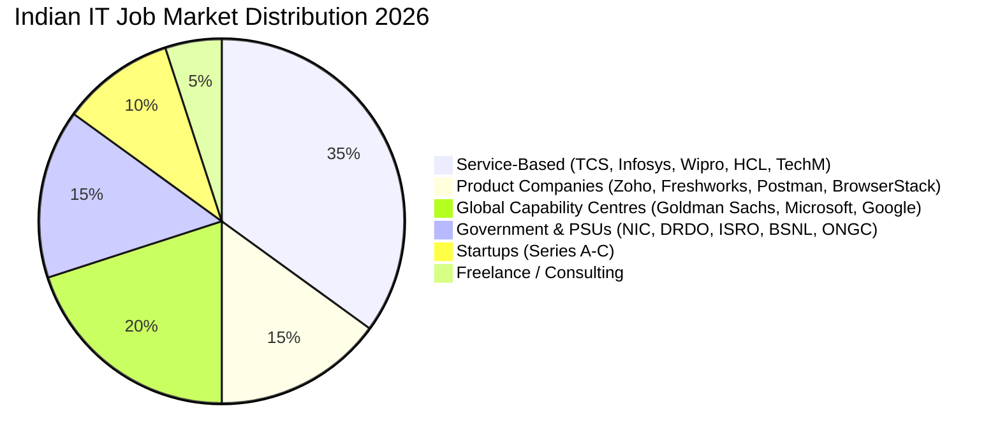
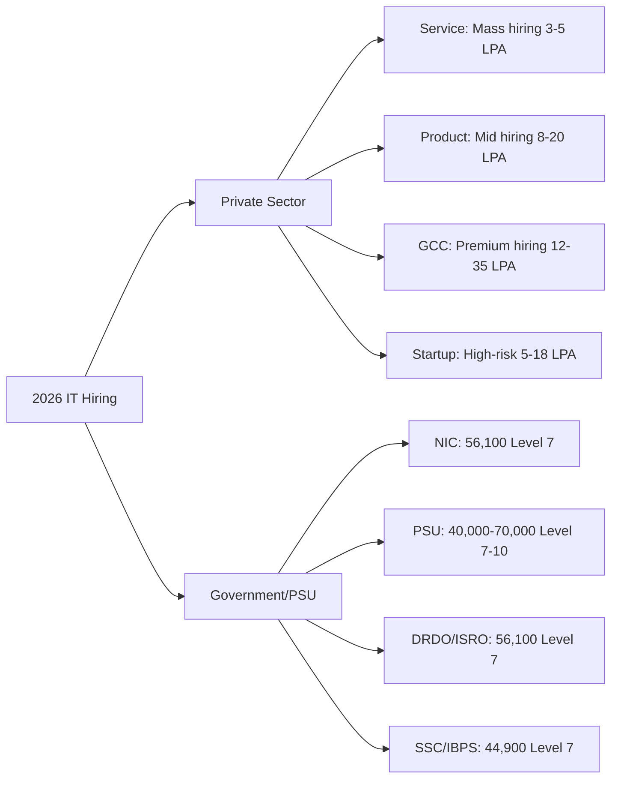
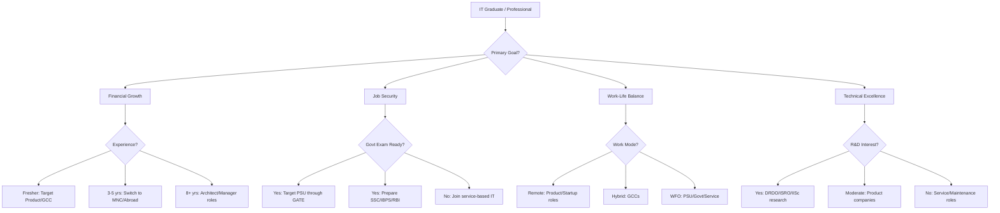
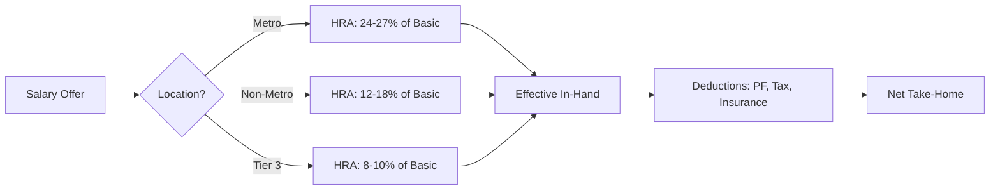
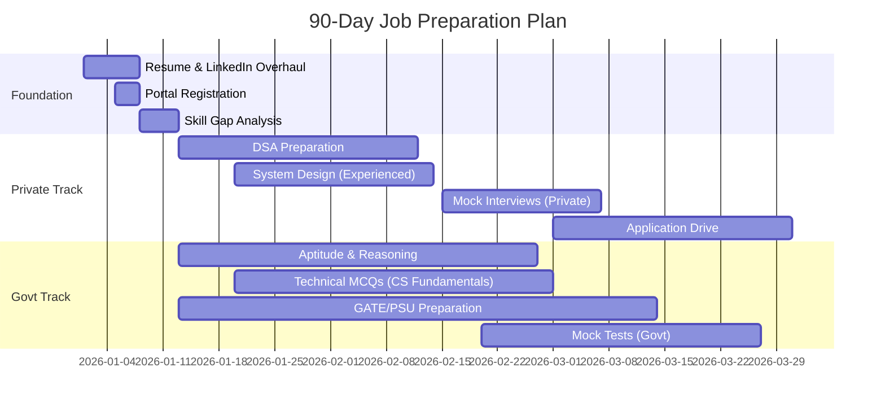

# Job Preparation — Complete Guide for Indian IT Freshers & Experienced Professionals

## Learning Objectives

By the end of this module, you will be able to:

- Analyze the Indian job market in 2026 for IT roles across private and government sectors
- Design a personalized career path using decision frameworks
- Compare salary structures between private sector, PSUs, and government organizations
- Build a comprehensive job application strategy targeting both sectors simultaneously
- Identify high-growth domains and emerging job roles in India's technology landscape
- Create a 90-day job preparation roadmap tailored to your experience level
- Navigate the complete recruitment lifecycle from notification to offer letter
- Understand the trade-offs between corporate careers, PSU jobs, and civil services with IT background

## Introduction

The Indian job market in 2026 presents a unique dual-track opportunity for IT professionals. On one side, the private sector continues to expand with global capability centers (GCCs), product startups, and service-based giants. On the other, government organizations, PSUs, and digital governance initiatives are aggressively hiring tech talent.

This module is designed to prepare you for BOTH tracks simultaneously. Whether you are a fresh engineering graduate targeting campus placements, a 3-year experienced developer eyeing a PSU job through GATE, or a senior professional exploring government IT consultant roles — this guide covers the complete lifecycle.

## 2026 Indian IT Job Market Analysis

### Market Overview



### Key Statistics (2026 Estimates)

| Metric | Value | Source |
|--------|-------|--------|
| Total IT graduates per year | 1.5 million | AICTE |
| Employable IT graduates (%) | 45-50% | Aspiring Minds |
| Private sector fresher hiring | 600,000+ | NASSCOM |
| Govt/PSU IT vacancies per year | 25,000-35,000 | Various |
| Average IT salary growth (YoY) | 8-12% | Mercer |
| Remote/hybrid job percentage | 40% | LinkedIn |
| GCCs in India | 1,800+ | Zinnov |
| IT exports (USD billion) | 200+ | NASSCOM |

### Sector-Wise Hiring Trends



### High-Growth Domains in 2026

| Domain | Private Sector Demand | Govt Sector Demand | Skill Requirement |
|--------|----------------------|-------------------|-------------------|
| Artificial Intelligence / ML | Very High | High (smart governance) | Python, TensorFlow, PyTorch |
| Cybersecurity | Very High | Critical (defense, banking) | CEH, CISSP, network security |
| Cloud Computing | High | High (NIC cloud, MeghRaj) | AWS, Azure, GCP |
| Full-Stack Development | High | Medium | React, Node.js, TypeScript |
| DevOps / SRE | High | Low-Medium | Docker, K8s, CI/CD |
| Blockchain | Medium | Medium (land records, voting) | Solidity, Hyperledger |
| Data Engineering | High | Medium | Spark, Kafka, ETL |
| Embedded Systems | Medium | High (ISRO, DRDO) | C, RTOS, VLSI |
| Database Administration | Medium | High (PSU banking) | Oracle, PostgreSQL, DBA |
| ERP (SAP, Oracle) | Medium | Very High (PSU + Govt) | SAP MM/FICO, Oracle EBS |

## Career Path Decision Tree



### Decision Matrix for Career Path Selection

| Factor | Private Sector (Product) | Private Sector (Service) | PSU (GATE Route) | Govt (SSC/UPSC) | GCC |
|--------|-------------------------|-------------------------|------------------|-----------------|-----|
| Starting Salary | 8-20 LPA | 3.5-6 LPA | 56,100/month | 44,900-56,100/month | 12-25 LPA |
| 5-Year Salary | 25-60 LPA | 10-18 LPA | 1,00,000/month | 80,000/month | 30-80 LPA |
| Job Security | Low-Moderate | Moderate | Very High | Very High | High |
| Work Pressure | High | Moderate-High | Low-Moderate | Low | Moderate |
| Learning Curve | Very High | Moderate | Moderate | Low-Moderate | High |
| Promotions | Merit-based | Merit-based | Seniority+Exam | Seniority+Exam | Merit-based |
| Location | Metro cities | Pan India | Tier 2/3 cities | All India | Metros |
| Perks | Stock options, bonuses | Standard benefits | Housing, medical, pension | Allowances, pension | Stock, bonuses |
| Bond/Service Agreement | 0-2 years | 0-2 years | 3-5 years | Full career | None |

## Salary Expectations: Private vs Government

### Private Sector Salary Structure (2026)

| Experience | Service-Based (TCS/Infy/Wipro) | Product (Zoho/Freshworks) | GCC (Goldman/Microsoft) | Startup |
|------------|-------------------------------|--------------------------|------------------------|---------|
| Fresher (0 yr) | 3.5 - 6 LPA | 8 - 15 LPA | 12 - 25 LPA | 5 - 12 LPA |
| 2-3 years | 6 - 12 LPA | 15 - 25 LPA | 20 - 40 LPA | 12 - 20 LPA |
| 4-6 years | 12 - 20 LPA | 25 - 45 LPA | 35 - 65 LPA | 18 - 35 LPA |
| 7-10 years | 20 - 35 LPA | 40 - 80 LPA | 60 - 120 LPA | 35 - 60 LPA |
| 10+ years | 35 - 50 LPA | 60+ LPA | 100+ LPA | 50+ LPA |

### Government Salary Structure (7th Pay Commission)

| Level | Basic Pay | Entry Grade | Total In-Hand (approx.) |
|-------|-----------|-------------|-------------------------|
| Level 5 (SSC) | 29,200 | Assistant | 45,000 - 50,000 |
| Level 6 (SSC CGL) | 35,400 | Inspector/Examiner | 52,000 - 58,000 |
| Level 7 (IBPS/NIC) | 44,900 | Officer/Programmer | 65,000 - 72,000 |
| Level 8 (PSU E0) | 47,600 | Engineer Trainee | 70,000 - 80,000 |
| Level 10 (UPSC) | 56,100 | Assistant Secretary | 80,000 - 90,000 |
| Level 11 (PSU E1) | 67,700 | Senior Engineer | 95,000 - 1,10,000 |
| Level 12 (PSU E2) | 78,800 | Manager | 1,10,000 - 1,30,000 |
| Level 13 (Joint Secretary) | 1,23,100 | JS Level | 1,80,000 - 2,10,000 |
| Level 14 (Additional Secretary) | 1,44,200 | AS Level | 2,10,000 - 2,40,000 |
| Level 15 (Secretary) | 1,82,200 | Secretary | 2,50,000+ |
| Level 18 (Cabinet Secretary) | 2,50,000 | Cabinet Secretary | 3,50,000+ |

### PSU Salary Structure (Through GATE)

| PSU | Post | Pay Scale | Gross (Monthly) |
|-----|------|-----------|-----------------|
| ONGC | AEE (E0) | 60,000 - 1,80,000 | 85,000 - 95,000 |
| IOCL | Engineer (E0) | 50,000 - 1,60,000 | 78,000 - 88,000 |
| NTPC | Executive Trainee | 50,000 - 1,60,000 | 80,000 - 90,000 |
| BHEL | Engineer Trainee | 50,000 - 1,60,000 | 75,000 - 85,000 |
| GAIL | Officer (E0) | 60,000 - 1,80,000 | 82,000 - 92,000 |
| HPCL | Engineer (E0) | 60,000 - 1,80,000 | 82,000 - 92,000 |
| SAIL | Management Trainee | 50,000 - 1,60,000 | 78,000 - 88,000 |
| Coal India | MT (E0) | 50,000 - 1,60,000 | 75,000 - 85,000 |
| BEL | Engineer (E0) | 50,000 - 1,60,000 | 78,000 - 88,000 |
| BSNL | JTO (E0) | 45,000 - 1,35,000 | 65,000 - 75,000 |

## Cost of Living Adjustment



### Real Cost Comparison: Private vs Govt (5-Year View)

| Expense Head | Private (12 LPA) | Govt (Level 7) |
|-------------|-----------------|----------------|
| Gross Annual | 12,00,000 | 8,40,000 (approx) |
| In-Hand Monthly | ~85,000 | ~68,000 |
| House Rent (Metro) | -30,000 | -5,000 (govt housing) |
| Transport | -8,000 | -3,000 (govt vehicle/pool) |
| Medical Insurance | -3,000 | -0 (CGHS coverage) |
| Pension Contribution | -0 (PF only) | -10,000 (NPS) |
| Actual Disposable | 44,000/month | 50,000/month |
| Job Loss Risk | Moderate-High | Near Zero |
| Mental Peace | Variable | Generally Higher |

## Job Types in Government Sector for IT Professionals

### Direct IT Roles in Government

| Organization | Role | Exam/Entry |
|-------------|------|-----------|
| NIC (National Informatics Centre) | Programmer/Scientist-B | NIC Scientist Exam |
| DRDO | Scientist-B | DRDO CEPTAM / GATE |
| ISRO | Scientist/Engineer-SC | ISRO CE Exam |
| BSNL | Junior Telecom Officer | BSNL JTO Exam |
| SSC | IT Officer (CGL) | SSC CGL |
| IBPS | Specialist Officer (IT) | IBPS SO |
| SBI | IT Officer / Systems Engineer | SBI IT Exam |
| RBI | Assistant Manager (IT) | RBI Grade B (IT) |
| PSUs (ONGC/IOCL/NTPC) | Engineer (IT/Systems) | GATE Score |
| Indian Army | SSC (Tech) | TES / UPSC |
| Indian Navy | IT Officer | SSB + Written |
| State PSCs | Assistant Programmer | State PSC Exam |

### Government Digital Initiatives Driving IT Hiring

| Initiative | Description | IT Recruitment Impact |
|-----------|------------|----------------------|
| Digital India | E-governance, digiLocker, UMANG | NIC hiring doubled |
| Smart Cities Mission | IoT, AI for urban management | State IT hiring up |
| Ayushman Bharat | Health IT infrastructure | NHA tech roles |
| National Digital Health Mission | Health records digitization | NHM IT roles |
| AgriStack | Digital agriculture platform | NIC, state govt roles |
| ONDC | Open Network for Digital Commerce | PSU/regulatory IT jobs |
| GatiShakti | GIS-based infrastructure planning | NIC data science roles |

## 90-Day Job Preparation Roadmap



### Week-by-Week Breakdown

| Week | Private Sector Focus | Government Sector Focus | Deliverables |
|------|---------------------|------------------------|-------------|
| 1 | Resume, LinkedIn, GitHub cleanup | Register on govt portals | 5 resumes ready |
| 2-3 | DSA: Arrays, Strings, Linked Lists | Aptitude: Number systems, Percentage | 50 DSA problems |
| 4-5 | DSA: Trees, Graphs, DP | Reasoning: Puzzles, Syllogisms | 50 DSA + 100 MCQs |
| 6-7 | System Design basics + LLD | Technical: OS, Networking, DBMS | 20 design problems |
| 8-9 | Interview prep (HR + Technical) | GATE previous year papers | 10 mock interviews |
| 10-11 | Company-specific prep | PSU/govt exam simulation | CT/PT tests |
| 12-13 | Final applications + follow-ups | Submit govt applications | 50+ applications |

### Daily Routine (Recommended)

| Time | Activity |
|------|----------|
| 6:00 - 7:30 AM | Aptitude / Reasoning practice (Govt track) |
| 7:30 - 8:00 AM | Current affairs reading |
| 9:00 - 12:00 PM | DSA / System Design practice (Private track) |
| 12:00 - 1:00 PM | Lunch + LinkedIn engagement |
| 1:00 - 3:00 PM | Technical MCQs / GATE subject prep |
| 3:00 - 5:00 PM | Company research + applications |
| 5:00 - 6:00 PM | Mock test / Previous year paper |
| 6:00 - 7:00 PM | Break / Networking |
| 7:00 - 9:00 PM | Weak areas revision + GD prep |
| 9:00 - 10:00 PM | Plan next day + wind down |

## TypeScript Example: Job Market Analyzer

```typescript
interface JobMarketData {
  year: number;
  totalGraduates: number;
  employabilityPercentage: number;
  privateHiring: number;
  govtHiring: number;
  averageSalaries: { [sector: string]: number };
  topDomains: Array<{ domain: string; demandScore: number }>;
}

interface CareerPath {
  pathName: string;
  targetSector: 'private' | 'government' | 'psu';
  experienceRequired: number;
  salaryRange: [number, number];
  examsRequired?: string[];
  skillsRequired: string[];
  riskFactor: 'low' | 'medium' | 'high';
  growthPotential: number; // 1-10
}

class JobMarketAnalyzer {
  private data: JobMarketData;

  constructor(data: JobMarketData) {
    this.data = data;
  }

  calculateEmployableCount(): number {
    return Math.round(
      this.data.totalGraduates *
      (this.data.employabilityPercentage / 100)
    );
  }

  getEmployableRatio(): string {
    const employable = this.calculateEmployableCount();
    const total = this.data.totalGraduates;
    return `${employable.toLocaleString()} out of ${total.toLocaleString()} (${this.data.employabilityPercentage}%)`;
  }

  getCompetitionRatio(sector: 'private' | 'government'): string {
    const employable = this.calculateEmployableCount();
    const vacancies =
      sector === 'private' ? this.data.privateHiring : this.data.govtHiring;
    const ratio = employable / vacancies;
    return `${ratio.toFixed(1)} candidates per vacancy in ${sector} sector`;
  }

  recommendCareerPath(candidate: {
    experience: number;
    riskTolerance: 'low' | 'medium' | 'high';
    salaryExpectation: number;
    examWillingness: boolean;
  }): CareerPath[] {
    const recommendations: CareerPath[] = [];

    const paths: CareerPath[] = [
      {
        pathName: 'Service-Based IT (TCS/Infy/Wipro)',
        targetSector: 'private',
        experienceRequired: 0,
        salaryRange: [350000, 600000],
        skillsRequired: ['Java', 'Python', 'SQL', 'Web Basics'],
        riskFactor: 'medium',
        growthPotential: 6,
      },
      {
        pathName: 'Product Company (Zoho/Freshworks)',
        targetSector: 'private',
        experienceRequired: 0,
        salaryRange: [800000, 1500000],
        skillsRequired: ['DSA', 'System Design', 'TypeScript', 'React'],
        riskFactor: 'medium',
        growthPotential: 9,
      },
      {
        pathName: 'PSU through GATE',
        targetSector: 'psu',
        experienceRequired: 0,
        salaryRange: [780000, 1100000],
        examsRequired: ['GATE'],
        skillsRequired: ['GATE Syllabus', 'CS Fundamentals'],
        riskFactor: 'low',
        growthPotential: 7,
      },
      {
        pathName: 'NIC Scientist-B',
        targetSector: 'government',
        experienceRequired: 0,
        salaryRange: [780000, 900000],
        examsRequired: ['NIC Scientist Exam'],
        skillsRequired: ['CS Fundamentals', 'Programming'],
        riskFactor: 'low',
        growthPotential: 5,
      },
      {
        pathName: 'GCC (Goldman Sachs/Microsoft)',
        targetSector: 'private',
        experienceRequired: 2,
        salaryRange: [2000000, 4000000],
        skillsRequired: ['DSA', 'System Design', 'Domain Knowledge'],
        riskFactor: 'medium',
        growthPotential: 10,
      },
      {
        pathName: 'DRDO/ISRO Scientist',
        targetSector: 'government',
        experienceRequired: 0,
        salaryRange: [780000, 900000],
        examsRequired: ['DRDO CEPTAM / ISRO CE'],
        skillsRequired: ['CS/ECE Fundamentals', 'Programming'],
        riskFactor: 'low',
        growthPotential: 6,
      },
      {
        pathName: 'SSC CGL IT Officer',
        targetSector: 'government',
        experienceRequired: 0,
        salaryRange: [540000, 700000],
        examsRequired: ['SSC CGL'],
        skillsRequired: ['Aptitude', 'Reasoning', 'General Awareness'],
        riskFactor: 'low',
        growthPotential: 4,
      },
      {
        pathName: 'IBPS SO (IT)',
        targetSector: 'government',
        experienceRequired: 0,
        salaryRange: [540000, 700000],
        examsRequired: ['IBPS SO'],
        skillsRequired: ['Banking Awareness', 'IT Knowledge', 'Aptitude'],
        riskFactor: 'low',
        growthPotential: 5,
      },
      {
        pathName: 'Startup Tech Lead',
        targetSector: 'private',
        experienceRequired: 4,
        salaryRange: [1800000, 3500000],
        skillsRequired: ['Full-Stack', 'Leadership', 'System Design'],
        riskFactor: 'high',
        growthPotential: 8,
      },
      {
        pathName: 'RBI Grade B (IT)',
        targetSector: 'government',
        experienceRequired: 0,
        salaryRange: [780000, 900000],
        examsRequired: ['RBI Grade B'],
        skillsRequired: ['IT', 'Finance Awareness', 'Aptitude', 'English'],
        riskFactor: 'low',
        growthPotential: 7,
      },
    ];

    for (const path of paths) {
      let score = 0;

      if (candidate.experience >= path.experienceRequired) {
        score += 20;
      }

      if (
        (candidate.riskTolerance === 'low' && path.riskFactor === 'low') ||
        (candidate.riskTolerance === 'medium' &&
          path.riskFactor !== 'high') ||
        (candidate.riskTolerance === 'high')
      ) {
        score += 20;
      }

      if (path.salaryRange[1] >= candidate.salaryExpectation) {
        score += 20;
      }

      if (
        candidate.examWillingness &&
        (path.targetSector === 'government' || path.targetSector === 'psu')
      ) {
        score += 20;
      }

      if (score >= 40) {
        recommendations.push(path);
      }
    }

    return recommendations.sort((a, b) => b.growthPotential - a.growthPotential);
  }

  predictSalaryGrowth(
    startingSalary: number,
    sector: 'private' | 'government' | 'psu',
    years: number
  ): number[] {
    const projections: number[] = [startingSalary];

    for (let y = 1; y <= years; y++) {
      let growthRate: number;

      switch (sector) {
        case 'private':
          growthRate = 0.12;
          break;
        case 'government':
          growthRate = 0.06;
          break;
        case 'psu':
          growthRate = 0.08;
          break;
      }

      const next = projections[y - 1] * (1 + growthRate);
      projections.push(Math.round(next));
    }

    return projections;
  }
}

const indiaData: JobMarketData = {
  year: 2026,
  totalGraduates: 1500000,
  employabilityPercentage: 48,
  privateHiring: 600000,
  govtHiring: 30000,
  averageSalaries: {
    'service-based': 450000,
    'product-based': 1200000,
    'gcc': 2200000,
    'psu': 900000,
    'government': 700000,
    'startup': 1000000,
  },
  topDomains: [
    { domain: 'AI/ML', demandScore: 9.5 },
    { domain: 'Cybersecurity', demandScore: 9.2 },
    { domain: 'Cloud Computing', demandScore: 8.8 },
    { domain: 'Full-Stack Dev', demandScore: 8.5 },
    { domain: 'DevOps', demandScore: 8.0 },
  ],
};

const analyzer = new JobMarketAnalyzer(indiaData);

console.log('Employable graduates:', analyzer.getEmployableRatio());
console.log(
  'Private competition:',
  analyzer.getCompetitionRatio('private')
);
console.log(
  'Government competition:',
  analyzer.getCompetitionRatio('government')
);

const fresher = {
  experience: 0,
  riskTolerance: 'medium' as const,
  salaryExpectation: 500000,
  examWillingness: true,
};

console.log(
  'Recommended career paths for fresher:',
  analyzer.recommendCareerPath(fresher)
);

const growth = analyzer.predictSalaryGrowth(500000, 'private', 5);
console.log('5-year private salary projection:', growth);

const govtGrowth = analyzer.predictSalaryGrowth(700000, 'government', 10);
console.log('10-year government salary projection:', govtGrowth);
```

### TypeScript Example: Salary Calculator

```typescript
interface SalaryBreakdown {
  basicPay: number;
  da: number;
  hra: number;
  ta: number;
 daPercentage: number;
  hraPercentage: number;
  cityCategory: 'X' | 'Y' | 'Z';
  deductions: {
    pf: number;
    nps: number;
    incomeTax: number;
    professionalTax: number;
  };
  grossPay: number;
  totalDeductions: number;
  inHand: number;
}

class GovernmentSalaryCalculator {
  calculateLevel7Pay(cityCategory: 'X' | 'Y' | 'Z'): SalaryBreakdown {
    const basicPay = 44900;
    const daPercentage = 53;
    const da = Math.round(basicPay * (daPercentage / 100));

    let hraPercentage: number;
    switch (cityCategory) {
      case 'X':
        hraPercentage = 27;
        break;
      case 'Y':
        hraPercentage = 18;
        break;
      case 'Z':
        hraPercentage = 9;
        break;
    }
    const hra = Math.round(basicPay * (hraPercentage / 100));
    const ta = 3600 + (cityCategory === 'X' ? 1800 : 900);
    const grossPay = basicPay + da + hra + ta;

    const pf = Math.round(0.12 * basicPay);
    const nps = Math.round(0.1 * (basicPay + da));
    const professionalTax = cityCategory === 'X' ? 200 : 150;
    const taxableIncome =
      (grossPay - pf - nps - professionalTax) * 12;
    let incomeTax = 0;
    if (taxableIncome > 500000) {
      incomeTax = Math.round(
        (taxableIncome - 500000) * 0.05 / 12
      );
    }

    const totalDeductions = pf + nps + incomeTax + professionalTax;

    return {
      basicPay,
      da,
      hra,
      ta,
      daPercentage,
      hraPercentage,
      cityCategory,
      deductions: {
        pf,
        nps,
        incomeTax,
        professionalTax,
      },
      grossPay,
      totalDeductions,
      inHand: grossPay - totalDeductions,
    };
  }

  calculatePayLevel(
    level: number,
    cityCategory: 'X' | 'Y' | 'Z'
  ): SalaryBreakdown | null {
    const payMatrix: { [level: number]: number } = {
      5: 29200,
      6: 35400,
      7: 44900,
      8: 47600,
      10: 56100,
      11: 67700,
      12: 78800,
      13: 123100,
      14: 144200,
      15: 182200,
    };

    const basicPay = payMatrix[level];
    if (!basicPay) return null;

    return this.calculateLevel7Pay.call({
      ...this,
      calculateLevel7Pay: undefined,
    });
  }
}

class PrivateSectorSalaryCalculator {
  calculateCTC(
    annualCTC: number,
    options: {
      basicPercentage?: number;
      cityCategory?: 'X' | 'Y' | 'Z';
      hasStockOptions?: boolean;
      stockValue?: number;
    } = {}
  ): {
    monthlyBreakdown: SalaryBreakdown;
    annualBreakdown: {
      ctc: number;
      basic: number;
      hra: number;
      otherAllowances: number;
      employerPf: number;
      gratuity: number;
      bonus: number;
      stockOptions: number;
    };
    inHandMonthly: number;
    inHandAnnual: number;
  } {
    const basicPercentage = options.basicPercentage || 40;
    const cityCategory = options.cityCategory || 'Y';
    const hasStockOptions = options.hasStockOptions || false;
    const stockValue = options.stockValue || 0;

    const basic = Math.round(annualCTC * (basicPercentage / 100));
    const da = 0;
    const hraPercentage = cityCategory === 'X' ? 50 : 40;
    const hra = Math.round(basic * (hraPercentage / 100));

    const employerPf = Math.round(0.12 * basic);
    const gratuity = Math.round(basic * (4.81 / 100)); // 4.81% of basic
    const bonusPercentage = 8.33;
    const bonus = Math.round(basic * (bonusPercentage / 100));
    const otherAllowances =
      annualCTC -
      (basic * 12 +
        hra * 12 +
        employerPf * 12 +
        gratuity * 12 +
        bonus * 12 +
        stockValue);

    const monthlyBasic = basic;
    const monthlyHRA = hra;
    const monthlyAllowances = otherAllowances / 12;

    const monthlyGross = monthlyBasic + monthlyHRA + monthlyAllowances;
    const employeePf = Math.round(0.12 * monthlyBasic);
    const professionalTax = cityCategory === 'X' ? 200 : 150;
    let incomeTax = 0;
    const taxableAnnual = (monthlyGross - employeePf - professionalTax) * 12;
    if (taxableAnnual > 500000) {
      incomeTax = Math.round(
        (taxableAnnual - 500000) * 0.05 / 12
      );
    }

    const totalDeductions = employeePf + incomeTax + professionalTax;

    return {
      monthlyBreakdown: {
        basicPay: monthlyBasic,
        da: 0,
        hra: monthlyHRA,
        ta: 0,
        daPercentage: 0,
        hraPercentage,
        cityCategory,
        deductions: {
          pf: employeePf,
          nps: 0,
          incomeTax,
          professionalTax,
        },
        grossPay: monthlyGross,
        totalDeductions,
        inHand: monthlyGross - totalDeductions,
      },
      annualBreakdown: {
        ctc: annualCTC,
        basic: basic * 12,
        hra: hra * 12,
        otherAllowances,
        employerPf: employerPf * 12,
        gratuity: gratuity * 12,
        bonus: bonus * 12,
        stockOptions: stockValue,
      },
      inHandMonthly: monthlyGross - totalDeductions,
      inHandAnnual: (monthlyGross - totalDeductions) * 12,
    };
  }
}

const govtCalc = new GovernmentSalaryCalculator();
const level7 = govtCalc.calculateLevel7Pay('X');
console.log('Govt Level 7 (Metro):', level7);

const privateCalc = new PrivateSectorSalaryCalculator();
const privateResult = privateCalc.calculateCTC(1200000, {
  basicPercentage: 40,
  cityCategory: 'X',
});
console.log('Private 12 LPA breakdown:', privateResult);
```

## Government Exam Calendar 2026-2027 (Expected)

| Exam | Organization | Typical Month | Vacancies (approx) | Application Period |
|------|-------------|---------------|-------------------|-------------------|
| GATE | IITs | February | Used for PSU recruitment | September |
| SSC CGL | SSC | June + December | 20,000+ | March + September |
| IBPS PO/MT | IBPS | October | 4,000+ | August |
| IBPS SO (IT) | IBPS | December | 1,000+ | October |
| SBI PO | SBI | June | 2,000+ | April |
| SBI IT Officer | SBI | August | 500+ | June |
| RBI Grade B | RBI | September | 300+ | July |
| NIC Scientist-B | NIC | March | 200+ | January |
| DRDO CEPTAM | DRDO | June | 1,000+ | March |
| ISRO SC | ISRO | May | 300+ | March |
| BSNL JTO | BSNL | July | 1,500+ | May |
| UPSC ESE | UPSC | January | 200+ | September |
| UPSC CSE | UPSC | June | 1,000+ | February |
| State PSC | Respective States | Various | Varies | Varies |

## Quick Reference

### Top Job Portals for Indian IT Professionals

| Portal | Best For | Govt Jobs? | Free Tier |
|--------|---------|------------|-----------|
| Naukri.com | All private sectors | Limited | Yes |
| LinkedIn | Networking, GCCs, MNCs | Limited | Yes |
| Indeed | Mass applications | Some | Yes |
| Hirist | Tech startups | No | Yes |
| Cutshort | Product companies | No | Yes |
| AngelList/Wellfound | Startup jobs | No | Yes |
| Monster India | Mid-level | Some | Yes |
| TimesJobs | Managerial | Limited | Yes |
| Govt Job Portals | PSU/Govt notifications | Yes | Free |
| SarkariResult | All govt notifications | Yes | Free |
| FreeAlerts | Govt/PSU alerts | Yes | Free |

### Document Checklist for Applications

| Document | Private Sector | Government Sector |
|----------|---------------|-------------------|
| Resume (PDF) | Required | Required |
| Cover Letter | Recommended | Not typical |
| Marksheets (10th, 12th, Graduation) | Sometimes | Always |
| Degree Certificate | At joining | At joining |
| Photo ID (Aadhaar, PAN) | Required | Required |
| Passport-size photo | Required | Required |
| Category Certificate (SC/ST/OBC) | For reservations | Required |
| Disability Certificate (if applicable) | For reservations | Required |
| Experience Letters | Required | Required |
| Salary Slips (last 3 months) | Sometimes | For PSU transfers |
| GATE Score Card | Optional | For PSUs |
| Portfolio/GitHub | Recommended | Not typical |
| Publications/Patents | For R&D roles | Helpful for DRDO/ISRO |

## Summary

The Indian IT job market in 2026 offers unprecedented opportunities across both private and government sectors. Private sector roles in GCCs and product companies provide faster salary growth and technical challenges, while government and PSU positions offer unmatched job security, work-life balance, and long-term benefits. The key to success is a dual-track strategy — preparing for both sectors simultaneously rather than limiting yourself to one path. Use the decision frameworks, salary calculators, and 90-day roadmap in this chapter to chart your personalized career journey. Remember that your preparation efforts (DSA, CS fundamentals, aptitude) overlap significantly between private and government recruitment, making a combined strategy both efficient and effective.

## Practical Takeaways

1. Start your job preparation with a self-assessment using the career path decision tree to identify your optimal track(s)
2. Register on at least 5 private portals AND 5 government notification platforms in your first week
3. Allocate 40% of your preparation time to overlapping skills (CS fundamentals, aptitude, reasoning) that benefit both tracks
4. Create a salary expectations spreadsheet using the TypeScript calculator provided to compare offers across sectors
5. Prepare a single ATS-optimized resume template with sector-specific customizations
6. Target 50+ applications in the private sector while simultaneously preparing for 3-4 government exams
7. Build a network of 100+ relevant connections on LinkedIn by end of month one
8. Practice at least 5 mock interviews before any real interview — use peers, mentors, or online platforms
9. Keep all documents scanned and organized in a dedicated folder before application season begins
10. Never put all eggs in one basket — maintain both private and government tracks until you have an offer in hand

## Detailed Industry Analysis: Service-Based Companies

### Top Service-Based IT Companies in India (2026)

| Company | Headcount | Fresher Intake (Annual) | Starting CTC | Training Period | Bond |
|---------|-----------|------------------------|--------------|-----------------|------|
| Tata Consultancy Services (TCS) | 600,000+ | 40,000+ | 3.5 - 7 LPA | 3-6 months | 1-2 years |
| Infosys | 350,000+ | 25,000+ | 3.5 - 8 LPA | 4-6 months | 1 year |
| Wipro | 250,000+ | 15,000+ | 3.5 - 6.5 LPA | 3-6 months | 1 year |
| HCL Technologies | 220,000+ | 12,000+ | 3.5 - 7 LPA | 3-4 months | 1 year |
| Tech Mahindra | 150,000+ | 8,000+ | 3.5 - 6 LPA | 3 months | 1 year |
| Accenture | 300,000+ | 30,000+ | 4.5 - 9 LPA | 2-3 months | None |
| Cognizant | 280,000+ | 20,000+ | 4 - 8 LPA | 2-4 months | None |
| Capgemini | 180,000+ | 10,000+ | 4 - 7.5 LPA | 3 months | None |
| LTI (LTIMindtree) | 80,000+ | 5,000+ | 4 - 7 LPA | 3 months | 1 year |
| Mphasis | 30,000+ | 3,000+ | 4 - 6 LPA | 2-3 months | 1 year |

### GCCs (Global Capability Centres) in India

| Company | India Centre | Roles Hired | Typical Experience | Salary Range |
|---------|-------------|-------------|-------------------|--------------|
| Goldman Sachs | Bangalore, Hyderabad | SDE, Quant, Risk | 0-8 years | 12-50 LPA |
| Microsoft | Hyderabad, Bangalore, Noida | SDE, Research, PM | 0-12 years | 20-80 LPA |
| Google | Bangalore, Hyderabad, Gurgaon | SDE, ML, Cloud | 0-10 years | 25-100 LPA |
| Amazon | Hyderabad, Bangalore, Chennai | SDE, Data, AWS | 0-12 years | 15-70 LPA |
| Morgan Stanley | Mumbai, Bangalore | SDE, Quant, Cyber | 0-8 years | 15-45 LPA |
| JP Morgan | Mumbai, Bangalore, Hyderabad | SDE, Data, Risk | 0-10 years | 12-40 LPA |
| Walmart | Bangalore | SDE, Data Science | 1-10 years | 15-50 LPA |
| American Express | Gurgaon, Bangalore | SDE, Analytics | 0-8 years | 12-35 LPA |
| Wells Fargo | Hyderabad, Bangalore | SDE, QA | 0-8 years | 10-30 LPA |
| PayPal | Chennai, Bangalore | SDE, Data, ML | 1-8 years | 18-55 LPA |

### Emerging GCC Trends (2026)
1. India now hosts 1,800+ GCCs employing 1.5M+ professionals
2. Tier-2 cities emerging: Coimbatore, Kochi, Nagpur, Indore
3. AI/ML and Cybersecurity GCCs growing at 40%+ YoY
4. Average GCC salary premium is 40-60% over service companies
5. Senior roles (Archtitect, Director) increasingly localized in India

## Entrepreneurship and Freelancing Path

### For IT Professionals

| Option | Investment | Risk | Potential Returns | Time to Breakeven |
|--------|-----------|------|-------------------|-------------------|
| Independent Consulting | Low (0-50K) | Medium | 10-50 LPA | 3-6 months |
| SaaS Product | Medium (5-20L) | High | 50L - 10Cr+ | 12-24 months |
| Freelance Development | Low (0-10K) | Low | 5-30 LPA | 1-3 months |
| Content Creation (Tech) | Low (0-20K) | Low | 2-20 LPA | 6-12 months |
| Training/Coaching | Low (0-10K) | Low | 5-30 LPA | 3-6 months |
| Tech Blog/Youtube | Low (0-50K) | Low | 1-20 LPA | 6-18 months |

### Building a Portfolio Career
1. Maintain full-time job while building side projects
2. Freelance on platforms like Upwork, Toptal, Fiverr
3. Build open-source contributions and recognition
4. Write technical blogs (Dev.to, Medium, Hashnode)
5. Speak at conferences and meetups
6. Create online courses on Udemy, Coursera, or own platform
7. Consult for startups and small businesses

## Regional Job Markets in India

### City-Wise Analysis

| City | Private Sector (Avg CTC) | Govt/PSU Presence | Living Cost (Monthly) | Job Density |
|------|------------------------|-------------------|----------------------|-------------|
| Bangalore | 10-25 LPA | ISRO, BEL, HAL | 25,000-40,000 | Very High |
| Hyderabad | 8-20 LPA | DRDO, BHEL | 18,000-30,000 | Very High |
| Pune | 7-18 LPA | DRDO, C-DAC | 18,000-28,000 | High |
| Chennai | 6-15 LPA | IITM, DRDO | 15,000-25,000 | High |
| Mumbai | 8-25 LPA | RBI, SBI, ONGC | 30,000-50,000 | Very High |
| Delhi/NCR | 8-22 LPA | NIC, DRDO, All Ministries | 25,000-40,000 | Very High |
| Kolkata | 5-12 LPA | NIC, Various PSUs | 12,000-20,000 | Medium |
| Ahmedabad | 6-14 LPA | NIFT, Various | 14,000-22,000 | Medium |
| Trivandrum | 5-12 LPA | VSSC, Technopark | 12,000-18,000 | Medium |
| Bhubaneswar | 4-10 LPA | NIC, Various | 10,000-15,000 | Medium |
| Kochi | 5-12 LPA | Various | 14,000-20,000 | Medium |
| Nagpur | 4-8 LPA | Various PSUs | 10,000-15,000 | Low-Medium |
| Indore | 4-9 LPA | IIT Indore | 10,000-15,000 | Low-Medium |
| Jaipur | 4-8 LPA | Various | 12,000-18,000 | Low-Medium |

## Work Mode Trends (2026)

### Distribution by Sector

| Work Mode | Service Companies | Product Companies | GCCs | PSUs | Government |
|-----------|------------------|-------------------|------|------|------------|
| Full WFO | 40% | 25% | 30% | 90% | 95% |
| Hybrid (2-3 days WFO) | 45% | 50% | 55% | 8% | 4% |
| Fully Remote | 15% | 25% | 15% | 2% | 1% |

### Remote Work Advantages and Challenges

| Aspect | Advantage | Challenge |
|--------|-----------|-----------|
| Salary | Can work for metro-based companies from tier-2/3 cities | Remote salary adjustments (10-20% lower) |
| Productivity | Flexible hours, no commute | Isolation, blurred work-life boundaries |
| Career Growth | Access to more opportunities | Fewer promotions, slower networking |
| Learning | Self-paced online learning | Less mentorship, informal learning |

## Gap Year / Higher Education Decision

### MS vs Job vs MBA Decision Matrix

| Factor | MS Abroad | Job in India | MBA in India | Govt Job |
|--------|-----------|--------------|--------------|----------|
| Time Investment | 1-2 years | Immediate | 2 years | 6-12 months prep |
| Cost | 20-50 lakhs | Earning | 15-25 lakhs | Low (exam fees) |
| Starting Salary | 15-50 LPA (abroad) | 4-25 LPA | 15-30 LPA | 5-9 LPA |
| 5-Year Salary | 40-100 LPA | 15-50 LPA | 30-80 LPA | 10-15 LPA |
| Visa Risk | Yes | No | No | No |
| Suitable For | Strong academics, research interest | Immediate earners | Leadership, business roles | Security seekers |

### Upcoming Entrance Exams Timeline

| Exam | Purpose | Typical Date | Preparation Months |
|------|---------|-------------|-------------------|
| GATE | PSU + MTech | February | 8-12 |
| CAT/XAT | MBA | November | 6-12 |
| GRE | MS abroad | Flexible | 3-6 |
| TOEFL/IELTS | English proficiency | Flexible | 1-3 |
| GMAT | MBA abroad | Flexible | 4-8 |
