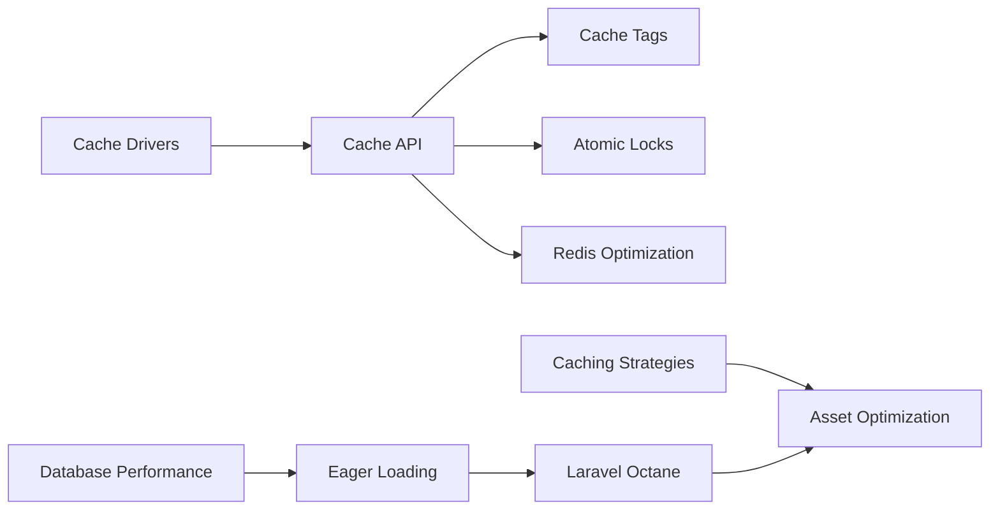

# Chapter 11: Caching, Performance & Octane
> **Previous:** [Testing, Debugging & Observability](./10-testing-observability) | **Next:** [Laravel AI SDK -- Agents, Prompting & Structured Output](./12-ai-sdk-agents)

---

## Learning Objectives

- Configure and select appropriate cache drivers for different environments
- Master the Cache API including tags, atomic locks, and TTL extension
- Optimize database queries using indexing strategies, eager loading, and chunking
- Implement caching strategies such as cache-aside, write-through, and write-behind
- Deploy and tune Laravel Octane with Swoole or RoadRunner
- Measure application performance using profiling and observability tools
## Chapter at a Glance

| Section | Key Topics |
|---------|-----------|
| Cache Drivers | File, database, redis, dynamodb, array |
| Cache API | put, remember, tags, atomic locks |
| Cache Tags | Grouped invalidation with Redis/Memcached |
| Atomic Locks | Distributed mutex, blocking locks |
| Redis Optimization | Commands, pub/sub, pipelines, sentinel |
| Database Performance | Indexing, N+1 detection, chunking |
| Eager Loading | Nested, lazy, default, constrained |
| Laravel Octane | Swoole/RoadRunner, state management |
| Caching Strategies | Cache-aside, write-through, write-behind |
| Asset Optimization | Vite splitting, CDN, image optimization |

## Chapter Roadmap


---

## Theory

> **One-Sentence Takeaway:** Laravel supports seven cache drivers and a comprehensive Cache API with tags, atomic locks, and TTL management.


### 11.1 Cache Drivers


> **One-Sentence Takeaway:** File is simplest for development, Redis is the production workhorse with tag support, and DynamoDB offers managed serverless caching on AWS.

Laravel provides a unified API for multiple cache backends. The active driver is configured in `.env` via `CACHE_STORE` (Laravel 11+) or `CACHE_DRIVER` (Laravel 10 and earlier).

#### File

Stores serialized cache entries as individual files in `storage/framework/cache/data/`.

```
CACHE_STORE=file
```

- **No external dependencies** → zero setup, works everywhere
- **Slow for large caches** → filesystem seeks degrade with thousands of entries
- **No tag support** → you cannot tag and flush groups of entries
- Best for **single-server development** and minimal deployments

#### Database

Stores cache entries in a database table.

```bash
php artisan cache:table
php artisan migrate
```

```
CACHE_STORE=database
```

- Useful when no Redis or Memcached is available
- Each cache hit requires a database query → slower than in-memory backends
- Supports **tags** only if you implement custom tag logic

#### Redis

The most popular production cache driver. Laravel supports both `predis` (PHP library) and `phpredis` (C extension).

```
CACHE_STORE=redis
REDIS_CLIENT=phpredis

> **Pro Tip:** Use `phpredis` over `predis` for production. phpredis is a C extension that uses less memory, supports more Redis features (like Sentinel and Cluster natively), and is significantly faster than the pure-PHP predis library.
```

```php
// config/database.php
'redis' => [
    'client' => env('REDIS_CLIENT', 'phpredis'),

    'options' => [
        'cluster' => env('REDIS_CLUSTER', 'redis'),
        'prefix' => env('REDIS_PREFIX', Str::slug(env('APP_NAME', 'laravel'), '_').'_database_'),
    ],

    'default' => [
        'url' => env('REDIS_URL'),
        'host' => env('REDIS_HOST', '127.0.0.1'),
        'username' => env('REDIS_USERNAME'),
        'password' => env('REDIS_PASSWORD'),
        'port' => env('REDIS_PORT', '6379'),
        'database' => env('REDIS_DB', '0'),
    ],

    'cache' => [
        'url' => env('REDIS_URL'),
        'host' => env('REDIS_HOST', '127.0.0.1'),
        'username' => env('REDIS_USERNAME'),
        'password' => env('REDIS_PASSWORD'),
        'port' => env('REDIS_PORT', '6379'),
        'database' => env('REDIS_CACHE_DB', '1'),
    ],
],
```

- In-memory, sub-millisecond reads
- Supports **tags**, **atomic locks**, **pub/sub**, **pipelines**
- Separate `cache` database (db 1) keeps volatile cache separate from persistent data
- **phpredis** is faster than predis; install it as a PHP extension

#### DynamoDB

Amazon DynamoDB-backed cache for AWS deployments.

```
CACHE_STORE=dynamodb
```

- Managed, serverless, auto-scaling
- Requires AWS SDK and an existing DynamoDB table
- Higher latency than Redis but zero operational overhead

#### Array

Stores cache in a PHP array for the current request only.

```
CACHE_STORE=array
```

- **Default for testing** → entries are lost after each request
- No serialization overhead
- Never use in production

#### Null

Disables caching entirely.

```
CACHE_STORE=null
```

- Every `Cache::get()` returns `null`
- Useful for disabling cache during development without code changes

---

### 11.2 Cache API


> **One-Sentence Takeaway:** The Cache facade provides put, remember, forever, pull, add, many, increment, decrement, and the new touch() method for TTL extension.

The `Cache` facade provides a comprehensive set of methods for storing and retrieving cached values.

```php
use Illuminate\Support\Facades\Cache;

// Store a value for 60 seconds
Cache::put('key', 'value', 60);

// Store indefinitely (never expires)
Cache::forever('key', 'value');

// Retrieve or store if missing
$value = Cache::remember('users.active', 3600, function () {
    return User::where('active', true)->get();
});

// Retrieve or store forever
$value = Cache::rememberForever('settings', function () {
    return Setting::pluck('value', 'key');
});

// Retrieve and delete
$value = Cache::pull('temporary_key');

// Store only if key does not exist
$added = Cache::add('unique_key', 'value', 60); // returns bool

// Add multiple at once
Cache::many([
    'key1' => 'value1',
    'key2' => 'value2',
]);

// Delete a key
Cache::forget('key');

// Delete everything
Cache::flush();

// Increment / Decrement
Cache::increment('visit_count');
Cache::increment('visit_count', 5);
Cache::decrement('stock_count');
Cache::decrement('stock_count', 2);
```

#### TTL Values

Laravel 11+ accepts `DateTimeInterface`, `DateInterval`, or seconds as integers.

```php
use Carbon\Carbon;

Cache::put('key', 'value', now()->addHours(2));
Cache::put('key', 'value', Carbon::tomorrow());
Cache::put('key', 'value', 3600); // 60 minutes in seconds
```

#### Cache::touch() → TTL Extension (Laravel 13)

Laravel 13 introduces `Cache::touch()`, which extends the TTL of an existing cache entry without retrieving and re-storing the value.

```php
// Extend the TTL by 3600 seconds from now
Cache::touch('session_token', 3600);

// Check if key exists and extend
if (Cache::has('user_123_profile')) {
    Cache::touch('user_123_profile', 1800);
}
```

Before `touch()`, extending TTL required a full read-write cycle:

```php
// Old approach → still works but less efficient
$profile = Cache::get('user_123_profile');
if ($profile !== null) {
    Cache::put('user_123_profile', $profile, 1800);
}
```

`touch()` is especially useful for session-like caches where activity should extend the expiry window. It issues a single Redis `EXPIRE` command instead of a `GET` + `SET`.

---

### 11.3 Cache Tags


> **One-Sentence Takeaway:** Cache tags group related entries for bulk invalidation; tags require Redis or Memcached and are the preferred pattern for grouped cache.

Cache tags group related entries so you can flush them as a unit.

```php
Cache::tags(['people', 'artists'])->put('John', $john, 3600);
Cache::tags(['people', 'authors'])->put('Anne', $anne, 3600);

$john = Cache::tags(['people', 'artists'])->get('John');

// Flush all entries tagged with 'people'
Cache::tags('people')->flush();

// Flush only the intersection
Cache::tags(['people', 'authors'])->flush();
```

**Tag support requirements:**

| Driver | Tags supported |
|---|---|
| Redis | Yes |
| Memcached | Yes |
| File | No |
| Database | No |
| DynamoDB | No |
| Array | No |

Attempting to use tags with a non-supported driver throws a `CacheException`.

#### Real-World Usage

```php
class PostController
{
    public function index(): View
    {
        $posts = Cache::tags(['posts', 'published'])
            ->remember('posts.all', 3600, function () {
                return Post::with('author')
                    ->where('published', true)
                    ->orderBy('published_at', 'desc')
                    ->paginate(20);
            });

        return view('posts.index', compact('posts'));
    }

    public function update(Request $request, Post $post): RedirectResponse
    {
        $post->update($request->validated());

        // Flush all post-related cache when any post changes
        Cache::tags('posts')->flush();

        return redirect()->route('posts.index');
    }
}
```

---

### 11.4 Atomic Locks


> **One-Sentence Takeaway:** Atomic locks provide distributed mutex across servers, supporting blocking locks, auto-release on exceptions, and cross-request locking.

Atomic locks provide mutex semantics across multiple servers using the cache backend.

```php
use Illuminate\Support\Facades\Cache;

$lock = Cache::lock('deploy', 10);

if ($lock->get()) {
    // Run deployment tasks
    Process::run('php artisan migrate');

    $lock->release();
}
```

#### Blocking Locks

```php
// Block for up to 5 seconds waiting for the lock
$lock = Cache::lock('report_generation', 30);

$lock->block(5, function () {
    // Generate the report → only one server at a time
    ReportGenerator::generate();
});
// Lock is automatically released after the callback
```

#### Lock Release on Exception

Locks must always be released. Use the callback form for automatic release:

```php
Cache::lock('processing', 10)->get(function () {
    // If this throws, the lock is released
    Process::run('long-running-job');
}); // released here
```

#### Cross-Request Locking

```php
// Prevent duplicate form submission
public function checkout(Request $request): JsonResponse
{
    $lock = Cache::lock('checkout_' . auth()->id(), 5);

    if (!$lock->get()) {
        return response()->json([
            'message' => 'A checkout is already in progress.',
        ], 429);
    }

    try {
        $order = $this->orders->place($request->all());
        return response()->json($order, 201);
    } finally {
        $lock->release();
    }
}
```

#### Lock Management

```php
// Force release (useful for stale locks)
Cache::lock('deploy')->forceRelease();

// Check lock status
$lock = Cache::lock('resource', 10);
if ($lock->get()) {
    // got the lock
}
```

Locks work with **Redis**, **Memcached**, **DynamoDB**, and **database** cache drivers. The `file` driver does not support atomic locks.

---

### 11.5 Redis Optimization


Redis is the most versatile cache and data-structure server in the Laravel ecosystem.

#### Redis Facade

```php
use Illuminate\Support\Facades\Redis;

// Default connection
Redis::set('key', 'value');
$value = Redis::get('key');

// Select specific connection
Redis::connection('cache')->set('key', 'value');

// Connection defined in config/database.php
'redis' => [
    'opcache' => [
        'host' => env('REDIS_OPCACHE_HOST', '127.0.0.1'),
        'port' => 6379,
        'database' => 2,
    ],
];
```

#### Redis Commands

```php
// Sets
Redis::sadd('online_users', $userId);
$isOnline = Redis::sismember('online_users', $userId);
$count = Redis::scard('online_users');

// Sorted sets → leaderboards
Redis::zadd('leaderboard', $score, $userId);
$top10 = Redis::zrevrange('leaderboard', 0, 9, 'WITHSCORES');
$rank = Redis::zrevrank('leaderboard', $userId);

// Hashes
Redis::hset('user:123', 'name', 'John');
Redis::hgetall('user:123');
Redis::hincrby('user:123', 'visits', 1);

// Expiry
Redis::expire('temp_data', 3600);
Redis::ttl('temp_data');
```

#### Publish / Subscribe

```php
// Publisher
Redis::publish('notifications', json_encode([
    'user_id' => 123,
    'message' => 'New comment on your post',
]));

// Subscriber (long-running process)
Redis::subscribe(['notifications'], function (string $message) {
    $data = json_decode($message, true);
    // Send push notification to $data['user_id']
});
```

#### Pipelines

```php
Redis::pipeline(function ($pipe) {
    for ($i = 0; $i < 1000; $i++) {
        $pipe->set("key:$i", "value:$i");
    }
});
// Sends all 1000 commands in one round trip
```

#### Redis for Queues

```
QUEUE_CONNECTION=redis
```

```php
// config/queue.php
'redis' => [
    'driver' => 'redis',
    'connection' => 'default',
    'queue' => env('REDIS_QUEUE', 'default'),
    'retry_after' => 90,
    'block_for' => null,
    'after_commit' => true,
],
```

Redis queues use **BLPOP** for blocking pops, achieving microsecond latency.

#### Redis for Sessions

```
SESSION_DRIVER=redis
```

```php
// config/session.php
'connection' => env('SESSION_CONNECTION'),
```

Shared session storage across multiple web servers with automatic expiry.

#### Redis Sentinel for High Availability

```
REDIS_SENTINEL_SERVICE=myprimary
REDIS_SENTINEL_HOSTS=10.0.0.1:26379,10.0.0.2:26379,10.0.0.3:26379
```

Laravel automatically discovers the current master from Sentinel and fails over.

#### Redis Cluster for Sharding

```
REDIS_CLUSTER=redis
REDIS_HOST=cluster1:6379,cluster2:6379,cluster3:6379
```

Keys are automatically distributed across shards. Only database 0 is available in cluster mode.

---

### 11.6 Database Performance


> **One-Sentence Takeaway:** Database optimization centers on composite indexing (equality columns first), N+1 prevention, chunking large datasets, and read/write connection separation.

#### Query Optimization

Use `DB::enableQueryLog()` or Telescope to capture and analyze queries.

```php
// Analyze a query
DB::enableQueryLog();

$users = User::where('active', true)
    ->where('plan', 'premium')
    ->orderBy('name')
    ->take(20)
    ->get();

dd(DB::getQueryLog());
```

**Indexing Strategies:**

```php
// Single column
Schema::table('users', function (Blueprint $table) {
    $table->index('email');
});

// Composite index → order matters!
Schema::table('posts', function (Blueprint $table) {
    // queries: WHERE status=? AND published_at BETWEEN ? AND ?
    //         WHERE status=?
    $table->index(['status', 'published_at']);
});

// Partial / conditional index (PostgreSQL)
DB::statement('CREATE INDEX idx_active_users ON users (created_at) WHERE active = true');

// Full-text index
Schema::table('posts', function (Blueprint $table) {
    $table->fullText(['title', 'body']);
});
```

**Composite index column order rule:** Place equality conditions first, range conditions second.

#### N+1 Detection

```php
// Problem: 1 query for posts + N queries for authors
$posts = Post::all();
foreach ($posts as $post) {
    echo $post->author->name; // N+1!
}

// Solution: eager load
$posts = Post::with('author')->get();
```

**Detection tools:**

- Laravel N+1 Detector package (`sburina/n-plus-one-detector`)
- Telescope's Queries tab flags N+1 patterns
- Debugbar's queries tab shows duplicate queries

```php
// Prevent lazy loading in non-production
use Illuminate\Database\Eloquent\Model;

Model::preventLazyLoading(! $this->app->isProduction());
// In production, log instead of throwing
Model::preventLazyLoading(false);
// Or log to a channel (Laravel 11+)
Model::handleLazyLoadingViolationUsing(function ($model, $relation) {

> **Warning:** Enable `Model::preventLazyLoading(!$this->app->isProduction())` in AppServiceProvider. In production, use `Model::handleLazyLoadingViolationUsing()` to log violations instead of throwing exceptions. The performance cost of lazy loading is often invisible until traffic spikes.
    Log::warning("Lazy loading {$relation} on " . get_class($model));
});
```

#### Chunking Results

```php
// chunk → loads batches of records
Post::chunk(200, function (Collection $posts) {
    foreach ($posts as $post) {
        $post->indexInSearchEngine();
    }
});

// chunkById → stable ordering for tables that change during chunking
Post::where('published', true)
    ->chunkById(200, function (Collection $posts) {
        foreach ($posts as $post) {
            $post->generateThumbnail();
            $post->increment('processed_count');
        }
    });

// lazy → returns LazyCollection, one record at a time
foreach (Post::lazy(100) as $post) {
    $post->process(); // memory-efficient
}

// cursor → uses yield, single query with cursor-based iteration
foreach (Post::where('published', true)->cursor() as $post) {
    $post->export();
}
```

| Method | Memory | DB queries | Write-safe |
|---|---|---|---|
| `chunk()` | Moderate | Multiple | No |
| `chunkById()` | Moderate | Multiple | Yes |
| `lazy()` | Low | Multiple | Yes |
| `cursor()` | Very low | 1 | No |

#### Read / Write Connections

```php
// config/database.php
'mysql' => [
    'read' => [
        'host' => [
            env('DB_READ_HOST_1', '192.168.1.1'),
            env('DB_READ_HOST_2', '192.168.1.2'),
        ],
    ],
    'write' => [
        'host' => [
            env('DB_WRITE_HOST', '196.168.1.10'),
        ],
    ],
    'sticky' => true, // read from write after writes during same request
    // ...
],
```

- `READ` queries (`SELECT`) go to read replicas
- `WRITE` queries (`INSERT`, `UPDATE`, `DELETE`) go to the primary
- `sticky: true` ensures that after a write, the next read within the same request hits the primary to avoid replication lag

---

### 11.7 Eager Loading Strategies


#### Nested Eager Loading

```php
// Load a chain of relations in one pass
$posts = Post::with('author.profile', 'comments.user')->get();

// Each dot-separated path is a separate JOIN
// SQL: 1 query for posts, 1 for authors+profiles, 1 for comments+users
```

#### Lazy Eager Loading

```php
$posts = Post::all();

if ($includeAuthor) {
    $posts->load('author');

    // Conditional nested
    $posts->load(['comments' => function ($query) {
        $query->where('approved', true)->orderBy('created_at');
    }]);
}
```

#### Default Eager Loading

```php
class Post extends Model
{
    protected $with = ['author'];

    public function author(): BelongsTo
    {
        return $this->belongsTo(User::class);
    }
}
```

Every `Post` query automatically eager loads `author`. Override with `without()`:

```php
$posts = Post::without('author')->get();
```

#### Global Scopes

```php
class PublishedScope implements Scope
{
    public function apply(Builder $builder, Model $model): void
    {
        $builder->where('published', true);
    }
}

class Post extends Model
{
    protected static function booted(): void
    {
        static::addGlobalScope(new PublishedScope);
    }
}
```

#### Constrain Eager Loads

```php
$users = User::with(['posts' => function ($query) {
    $query->where('published', true)
        ->orderBy('published_at', 'desc')
        ->limit(5);
}])->get();
```

---

### 11.8 Laravel Octane


> **One-Sentence Takeaway:** Octane eliminates framework boot overhead by keeping the application in memory, with Swoole and RoadRunner as the supported application servers.

Octane supercharges your application by keeping it in memory across multiple requests, eliminating framework boot time for every request.

#### Installation

```bash
composer require laravel/octane
php artisan octane:install
```

The installer prompts: Swoole or RoadRunner?

| Server | Runtime | Memory model |
|---|---|---|
| Swoole | PHP extension (`ext-swoole`) | Shared memory, coroutine-based |
| RoadRunner | Go binary + PHP | Process-per-worker, no shared memory |

#### Octane Configuration

```php
// config/octane.php
return [
    'server' => env('OCTANE_SERVER', 'roadrunner'),

    'https' => env('OCTANE_HTTPS', false),

    'max_execution_time' => 30,

    'max_requests' => 500, // restart worker after 500 requests

    'warm' => [
        ...Octane::defaultServicesToWarm(),
        App\Services\CacheWarmer::class,
    ],

    'listeners' => [
        RequestReceived::class => [
            LogRequest::class,
        ],
    ],

    'watch' => [
        'app',
        'config',
        'routes',
    ],
];
```

#### Starting Octane

```bash
# RoadRunner
php artisan octane:start --server=roadrunner --host=0.0.0.0 --port=8000

# Swoole
php artisan octane:start --server=swoole --host=0.0.0.0 --port=8000

# Watch for file changes (development)
php artisan octane:start --watch

# Worker count
php artisan octane:start --workers=4 --task-workers=2
```

#### Octane State

Octane retains application state in memory between requests. This changes how you think about static properties and singletons.

```php
// DANGER: state leaks between requests
class RequestCounter
{
    public static int $count = 0;
}

// Octane will corrupt this: each request increments the same static
```

**Safe patterns under Octane:**

```php
// Store state in the request
use Laravel\Octane\Facades\Octane;

Octane::set('counter', 0);
Octane::get('counter');

// Use the container for request-scoped bindings
App::scoped(ReportingService::class, function () {
    return new ReportingService(request()->user()->tenant_id);
});
```

**Services to warm at boot:**

```php
// config/octane.php
'warm' => [
    ...Octane::defaultServicesToWarm(),
    \App\Services\ConfigurationService::class,
    \App\Services\FeatureFlags::class,
],
```

Bootstrapped services are resolved once at worker start, not per-request.

#### Octane Cache

Use `octane:cache` to persist bootstrapped configuration across deployments:

```bash
php artisan octane:cache
php artisan octane:clear
```

#### Supervisord Configuration

```ini
[program:laravel-octane]
process_name=%(program_name)s_%(process_num)02d
command=php /var/www/html/artisan octane:start --server=roadrunner --port=8000
autostart=true
autorestart=true
user=www-data
numprocs=1
redirect_stderr=true
stdout_logfile=/var/www/html/storage/logs/octane.log
stopwaitsecs=360
```

#### Octane Events

```php
// Listen for Octane events
Event::listen(function (\Laravel\Octane\Events\WorkerStarting $event) {
    // Redis connection pool warmup
});

Event::listen(function (\Laravel\Octane\Events\RequestReceived $event) {
    // Sentry transaction start
});

Event::listen(function (\Laravel\Octane\Events\RequestTerminated $event) {
    // Request cleanup, metrics flush
});

Event::listen(function (\Laravel\Octane\Events\WorkerErrorOccurred $event) {
    // Worker restart logging
});
```

---

### 11.9 Performance Measurement


#### Laravel Debugbar

```bash
composer require barryvdh/laravel-debugbar --dev
```

In-browser toolbar with:

- Route, controller, middleware chain
- All executed queries with bindings, timing, and stack traces
- Memory usage breakdown
- View rendering time
- Session and request data
- Mail previews

#### Clockwork

```bash
composer require itsgoingd/clockwork
```

Chrome DevTools extension for server-side profiling. Shows timeline, queries, events, cache, Redis commands, and log entries in the browser's DevTools panel.

#### Telescope Performance Tab

Telescope's built-in performance viewer shows:

- Slowest requests with full SQL bindings
- Request duration histogram
- Route-level performance breakdown
- N+1 query detection

#### Laravel Pulse

Real-time production monitoring with cards for:

- Slow queries (top 20 by duration)
- Slow jobs (top 20 by processing time)
- Slow requests (top 20 by response time)
- Cache hit/miss ratio
- Exception frequency

#### Blackfire.io

Advanced PHP profiling with call-graph visualization:

```bash
composer require blackfire/player
```

- Function-level execution time
- Memory allocation traces
- I/O wait analysis
- Performance regression detection in CI

#### Xdebug Profiling

```ini
; php.ini
xdebug.mode=profile
xdebug.output_dir=/tmp/profiling
xdebug.profiler_output_name=cachegrind.out.%t.%p
```

Analyze with `KCacheGrind` or `QCacheGrind` for:

- Inclusive vs exclusive execution time
- Call counts per function
- Caller-callee relationship graphs

---

### 11.10 Caching Strategies


> **One-Sentence Takeaway:** Cache-aside is simplest, write-through keeps cache fresh but costs write latency, and write-behind absorbs traffic spikes at risk of data loss.

#### Cache-Aside (Lazy Loading)

The application checks the cache first. On a miss, it computes the value, stores it, and returns it.

```php
public function show(Post $post): JsonResponse
{
    $views = Cache::remember("post.{$post->id}.views", 3600, function () use ($post) {
        return $post->views()->count();
    });

    return response()->json(['views' => $views]);
}
```

- **Pros:** Simple, only caches what is requested
- **Cons:** Initial request pays the computation cost, cache stampede risk

#### Write-Through Cache

The application writes to the cache whenever it writes to the database.

```php
public function store(CreatePostRequest $request): JsonResponse
{
    $post = Post::create($request->validated());

    Cache::put("post.{$post->id}", $post, 3600);
    Cache::tags('posts')->flush();

    return response()->json($post, 201);
}
```

- **Pros:** Cache always contains fresh data; no miss penalty
- **Cons:** Writes are slower; caches data that may never be read

#### Write-Behind (Write-Back) Cache

Writes are queued and written to the database asynchronously.

```php
public function recordView(Post $post): void
{
    $cacheKey = "post.{$post->id}.view_count";

    Cache::increment($cacheKey);

    // Batch persist every N increments
    if (Cache::get($cacheKey) % 100 === 0) {
        dispatch(new PersistViewCount($post->id, Cache::get($cacheKey)));
    }
}
```

- **Pros:** Extremely fast writes, absorbs traffic spikes
- **Cons:** Data loss if cache goes down before persistence

#### Cache Stampede Protection

Cache stampede occurs when many requests simultaneously miss the cache and all recompute the value.

```php
// Use atomic lock to serialize recomputation
public function expensiveReport(): array
{
    $cacheKey = 'annual_report';

    $cached = Cache::get($cacheKey);
    if ($cached !== null) {
        return $cached;
    }

    // Only one process recomputes
    $lock = Cache::lock($cacheKey . '_lock', 10);

    try {
        if ($lock->get()) {
            $data = $this->generateReport(); // expensive
            Cache::put($cacheKey, $data, 3600);
            return $data;
        }

        // Wait for the leader to finish
        sleep(1);
        return Cache::get($cacheKey);
    } finally {
        $lock->release();
    }
}
```

Laravel 13's `Cache::remember()` also provides built-in stampede protection when using Redis or Memcached via the **cache stampede prevention** mechanism → only one process recomputes while others wait.

#### Cache Invalidation Patterns

```php
// 1. Tag-based invalidation (preferred for grouped cache)
Cache::tags('posts')->flush();

// 2. Key-pattern invalidation
$pattern = 'post.*';
// Requires custom iteration → not natively supported

// 3. Version-based invalidation
Cache::increment('cache_version');
$version = Cache::get('cache_version');
$posts = Cache::remember("posts.v{$version}", 3600, fn () => Post::all());

// 4. Time-based (TTL expiry)
// Simplest: cache expires after fixed time
// Not immediate → stale data served until TTL expires

// 5. Event-driven invalidation
class PostObserver
{
    public function saved(Post $post): void
    {
        Cache::tags(['posts', 'post.' . $post->id])->flush();
    }

    public function deleted(Post $post): void
    {
        Cache::forget('post.' . $post->id);
        Cache::tags('posts')->flush();
    }
}
```

#### Content Caching for Blade

```blade
@cache('sidebar.recent_posts', 3600)
    <div class="sidebar">
        <h3>Recent Posts</h3>
        <ul>
            @foreach (Cache::remember('posts.recent', 3600, fn () => Post::recent()->get()) as $post)
                <li>{{ $post->title }}</li>
            @endforeach
        </ul>
    </div>
@endcache
```

The `@cache` directive caches the rendered HTML output, not just the data. The cached fragment is served without executing any PHP.

---

### 11.11 CDN & Asset Optimization


#### Vite Bundle Splitting

```javascript
// vite.config.js
import { defineConfig } from 'vite';
import laravel from 'laravel-vite-plugin';

export default defineConfig({
    plugins: [
        laravel({
            input: [
                'resources/css/app.css',
                'resources/js/app.js',
                'resources/js/admin.js',
                'resources/js/vendor.js',
            ],
            refresh: true,
        }),
        {
            name: 'manual-chunks',
            transform(code, id) {
                if (id.includes('node_modules')) {
                    return { module: { type: 'module' } };
                }
            },
        },
    ],
    build: {
        rollupOptions: {
            output: {
                manualChunks(id) {
                    if (id.includes('node_modules/react')) {
                        return 'react-vendor';
                    }
                    if (id.includes('node_modules/lodash')) {
                        return 'lodash';
                    }
                },
            },
        },
    },
});
```

```blade
{{-- Load only what the page needs --}}
@vite(['resources/js/app.js', 'resources/js/pages/dashboard.js'])
```

#### CSS/JS Minification

Vite applies minification automatically in production builds (`npm run build`). Configure:

```javascript
// vite.config.js
build: {
    minify: 'esbuild', // default, fastest
    // or
    minify: 'terser',  // better compression, slower build
    cssMinify: 'lightningcss',
},
```

#### Image Optimization

```php
// Use Laravel image manipulation packages
composer require spatie/image-optimizer

use Spatie\ImageOptimizer\OptimizerChainFactory;

$optimizerChain = OptimizerChainFactory::create();
$optimizerChain->optimize($path);

// Or use responsive images with srcset
getFirstMediaUrl('cover', 'sm') }}"
    srcset="
        {{ $post->getFirstMediaUrl('cover', 'sm') }} 400w,
        {{ $post->getFirstMediaUrl('cover', 'md') }} 800w,
        {{ $post->getFirstMediaUrl('cover', 'lg') }} 1200w
    "
    sizes="(max-width: 768px) 100vw, 800px"
    loading="lazy"
    alt="{{ $post->title }}"
>
```

#### Font Subsetting

```php
// Use spatie/laravel-google-fonts for subset loading
composer require spatie/laravel-google-fonts

// config/google-fonts.php
return [
    'inter' => 'https://fonts.googleapis.com/css2?family=Inter:wght@400;600;700&subset=latin',
    // Subset to latin only → saves ~60% font file size
];
```

#### CDN for Static Assets

```php
// config/filesystems.php
'disks' => [
    'public' => [
        'driver' => 'local',
        'root' => storage_path('app/public'),
        'url' => env('APP_URL') . '/storage',
        'visibility' => 'public',
    ],

    'cdn' => [
        'driver' => 's3',
        'key' => env('CDN_KEY'),
        'secret' => env('CDN_SECRET'),
        'region' => env('CDN_REGION'),
        'bucket' => env('CDN_BUCKET'),
        'url' => env('CDN_URL'), // e.g. https://cdn.example.com
    ],
];
```

```blade
{{-- Serve assets from CDN in production --}}
@if(app()->environment('production'))
    <link rel="stylesheet" href="https://cdn.example.com/css/app.abc123.css">
@else
    @vite('resources/css/app.css')
@endif
```

---

### 11.12 Complete Example: Caching Strategy for an API


```php
<?php

namespace App\Http\Controllers\Api;

use App\Models\Post;
use App\Models\Tag;
use Illuminate\Http\JsonResponse;
use Illuminate\Http\Request;
use Illuminate\Support\Facades\Cache;
use Illuminate\Support\Facades\DB;

class PostController extends Controller
{
    public function index(Request $request): JsonResponse
    {
        $page = $request->get('page', 1);
        $perPage = $request->get('per_page', 20);

        $posts = Cache::tags(['posts', 'published'])
            ->remember("posts.index.page.{$page}", 3600, function () use ($perPage) {
                return Post::with('author:id,name')
                    ->select('id', 'title', 'slug', 'excerpt', 'published_at', 'user_id')
                    ->where('published', true)
                    ->orderBy('published_at', 'desc')
                    ->paginate($perPage);
            });

        return response()->json($posts);
    }

    public function show(string $slug): JsonResponse
    {
        $post = Cache::remember("post.slug.{$slug}", 3600, function () use ($slug) {
            return Post::with(['author', 'tags', 'comments.user'])
                ->where('slug', $slug)
                ->firstOrFail();
        });

        // Increment view count atomically
        $viewsKey = "post.{$post->id}.views";
        Cache::increment($viewsKey);

        // Batch persist every 50 views
        $views = Cache::get($viewsKey);
        if ($views % 50 === 0) {
            dispatch(function () use ($post, $views) {
                DB::transaction(function () use ($post, $views) {
                    $post->timestamps = false;
                    $post->increment('views', 50);
                    Cache::decrement("post.{$post->id}.views", 50);
                });
            });
        }

        return response()->json([
            'post' => $post,
            'views' => $views,
        ]);
    }

    public function store(CreatePostRequest $request): JsonResponse
    {
        $post = DB::transaction(function () use ($request) {
            $post = auth()->user()->posts()->create(
                $request->validated()
            );

            if ($request->tags) {
                $tags = Tag::findOrCreate($request->tags);
                $post->tags()->attach($tags);
            }

            return $post->load('tags');
        });

        // Write-through cache
        Cache::put("post.slug.{$post->slug}", $post, 3600);
        Cache::tags(['posts', 'published'])->flush();

> **Remember:** Cache tags only work with Redis and Memcached. Attempting to use tags with file, database, or DynamoDB drivers throws a CacheException. Always check your driver before relying on tag-based invalidation.

        return response()->json($post, 201);
    }

    public function update(UpdatePostRequest $request, Post $post): JsonResponse
    {
        $this->authorize('update', $post);

        $post->update($request->validated());

        if ($request->has('tags')) {
            $tags = Tag::findOrCreate($request->tags);
            $post->tags()->sync($tags);
        }

        $post->load('tags');

        // Flush both the individual post cache and the listing cache
        Cache::forget("post.slug.{$post->slug}");
        Cache::tags('posts')->flush();

        return response()->json($post);
    }

    public function destroy(Post $post): JsonResponse
    {
        $this->authorize('delete', $post);

        $post->delete();

        Cache::forget("post.slug.{$post->slug}");
        Cache::tags('posts')->flush();

        return response()->noContent();
    }
}
```

---


## Concept Comparison

| Strategy | Cache Hit | Cache Miss | Write Performance | Data Freshness |
|----------|-----------|------------|-------------------|---------------|
| Cache-Aside (Lazy) | Return cached | Compute + store | Fast | TTL-dependent |
| Write-Through | Return cached | — | Slower (dual write) | Always fresh |
| Write-Behind | Return cached | — | Fastest (async) | Risk of loss |

## Quick Reference — Cache Methods

| Method | Purpose |
|--------|---------|
| `Cache::put('key', $val, 3600)` | Store with TTL |
| `Cache::remember('key', 3600, fn)` | Get or store if missing |
| `Cache::tags(['posts'])->flush()` | Flush group by tag |
| `Cache::lock('key', 10)->get(fn)` | Atomic lock with auto-release |
| `Cache::touch('key', 3600)` | Extend TTL (Laravel 13) |
| `Cache::increment('counter')` | Atomic increment |

## Cross-Application Matrix

| Concept | Blog | E-Commerce | SaaS |
|---------|------|-----------|------|
| Cache-aside | Post queries | Product listing | Tenant config |
| Write-through | Post creation | Order placement | Subscription update |
| Write-behind | View counter | Inventory sync | Usage metrics |
| Tags | posts, categories | products, inventory, prices | tenants, plans, features |
| Octane | Not needed | Product browsing | API-heavy workloads |

## Chapter Quiz

**1. Which cache driver supports tags?**
- a) File
- b) Database
- c) Redis
- d) Array

**2. What does Cache::touch() do in Laravel 13?**
- a) Deletes a cache entry
- b) Extends TTL without read-write cycle
- c) Creates a new cache entry
- d) Checks if a key exists

**3. What is the cache stampede problem?**
- a) Too many cache keys
- b) Multiple requests simultaneously recomputing expired cache
- c) Cache memory overflow
- d) Slow cache writes

**4. Which Octane server runs as a Go binary?**
- a) Swoole
- b) RoadRunner
- c) FrankenPHP
- d) ReactPHP

**Answers: 1-c, 2-b, 3-b, 4-b**

## Summary

- Laravel supports seven cache drivers → file, database, redis, dynamodb, array, null → each suited to different environments and requirements.
- The Cache API provides `get`, `put`, `remember`, `rememberForever`, `pull`, `add`, `many`, `forget`, `flush`, `increment`, `decrement`, and the new `touch()` method for TTL extension without a read cycle.
- Cache tags enable grouped invalidation but require Redis or Memcached.
- Atomic locks provide distributed mutex semantics with blocking, auto-release, and cross-request locking capabilities.
- Redis serves multiple roles → cache, queue, session, pub/sub → with Sentinel for HA and Cluster for horizontal scaling.
- Database performance optimization centers on query analysis, composite indexing, N+1 prevention, chunking large datasets, and read/write connection separation.
- Laravel Octane eliminates framework boot overhead by keeping the application in memory, with configuration for workers, service warmup, and request lifecycle events.
- Eager loading strategies (nested, lazy, default, constrained) prevent the N+1 problem across relationship depths.
- Cache stampede protection can be achieved with atomic locks or built-in stampede prevention in Redis/Memcached backends.
- Performance measurement tools include Debugbar, Clockwork, Telescope, Pulse, Blackfire, and Xdebug profiles.
- Asset optimization through Vite bundle splitting, image optimization, font subsetting, and CDN distribution reduces client-side load times.

---

## Exercises

### Review Questions

1. Compare file, database, and Redis cache drivers across three dimensions: latency, tag support, and operational overhead. When would you choose each one?

2. Explain the cache stampede problem. Describe two strategies for preventing it and identify which cache drivers support each strategy.

3. What is the difference between `chunk()`, `chunkById()`, `lazy()`, and `cursor()` for processing large datasets? Which one is safe to use when the query conditions change as you iterate?

4. How does Octane change the way you should use static properties and singletons? What mechanisms does Octane provide for request-scoped state?

5. Describe the trade-offs between cache-aside, write-through, and write-behind caching strategies. Which one would you use for a leaderboard that must be accurate to within 5 seconds?

### Application Problems

1. **Design and implement a multi-tier caching system for a news aggregation API.** The API serves articles from multiple sources, ordered by publish date. Requirements:
   - Article list pages must render under 50ms (P95) with 100,000+ articles
   - New articles must appear within 30 seconds of publishing
   - Articles can be updated (title correction) → stale data accepted up to 5 minutes
   - Each source can be tagged and flushed independently
   - Popular articles (top 100 by views) should be cached with longer TTL
   - Implement using `Cache::tags()` with a fallback strategy for drivers that do not support tags
   - Write a custom cache warmer that pre-loads the top 10 pages on deployment

2. **Build a Redis-backed rate limiter with atomic locks for an image processing microservice.** The service:
   - Accepts image uploads and generates 3 sizes (thumb, medium, full)
   - Each user is limited to 10 uploads per minute
   - Each upload acquires a lock per user to prevent concurrent processing of the same image
   - Locks must auto-release after 30 seconds (process timeout)
   - Queue a WebP conversion job if the original was JPEG, using a lock to ensure only one conversion per image
   - Use Redis sorted sets for the rate limit window
   - Implement integer overflow protection for the increment counter

3. **Optimize a slow inventory report that queries 500K+ products across 50 warehouses.** The current query takes 45 seconds:
   ```sql
   SELECT p.*, w.name AS warehouse,
          (SELECT COUNT(*) FROM stock_movements sm WHERE sm.product_id = p.id) AS movement_count
   FROM products p
   JOIN warehouses w ON w.id = p.warehouse_id
   WHERE p.active = 1 AND p.stock_level < p.reorder_point
   ORDER BY p.stock_level ASC;
   ```
   Your tasks:
   - Add the correct composite indexes
   - Convert the correlated subquery to a join or a precomputed counter
   - Implement chunked export to CSV (10K rows per chunk) without consuming 2GB of memory
   - Add `Cache::remember()` with tag-based invalidation triggered by stock movements
   - Apply read/write connection separation: the report reads from a replica, stock movements write to the primary
   - Measure the final query time using Telescope

4. **Deploy Laravel Octane for a real-time collaboration platform.** The platform has:
   - WebSocket connections via Laravel Reverb
   - Document editing with auto-save every 5 seconds
   - Presence indicators (who is viewing each document)
   - Broadcast events on document changes
   
   Configuration tasks:
   - Install Octane with RoadRunner
   - Configure 4 request workers and 2 task workers
   - Move Reverb to a separate Octane instance
   - Implement `Octane::set()` for per-request state (current document, user session)
   - Warm the document permission service at boot
   - Configure supervisor to restart workers after 1000 requests
   - Write an Octane event listener that flushes the Reverb connection pool on `WorkerStarting`
   - Test that static state does NOT leak between requests by running 100 concurrent requests

### Challenge Problem

**Build and benchmark a fully cached e-commerce platform that handles 10,000 concurrent users.**

Your platform has: products (50K), categories (200), users (100K), orders (1M), inventory (500K stock entries), and a recommendation engine. Implement the entire caching and performance architecture:

1. **Cache Architecture:**
   - Implement a **three-tier cache**: L1 (array/request-scoped), L2 (Redis, 5-minute TTL), L3 (database, 30-minute TTL with stampede protection)
   - Use `Cache::tags()` with hierarchy: `products`, `products:{id}`, `categories`, `categories:{id}`, `inventory`
   - Implement **cache warming** via an Artisan command that loads the top 1,000 products by sales velocity, all categories, and the homepage hero section
   - Build a **stampede firewall** using atomic locks → when cache expires, only one process recomputes while others wait up to 2 seconds

2. **Database Performance:**
   - Create composite indexes for the 5 slowest queries identified by Telescope
   - Split read/write connections: product browsing reads from 3 replicas, order placement writes to the primary with `sticky: true`
   - Implement `chunkById` for the nightly order export (500K orders) that must not block writes
   - Prevent N+1: configure `Model::preventLazyLoading()` in production to log violations to a dedicated channel
   - Create a materialized view (PostgreSQL) for the product listing page that joins products, inventory, and average rating

3. **Octane Deployment:**
   - Deploy Octane with Swoole, 8 workers, 4 task workers
   - Configure 4 separate Octane instances: web, API, admin, websockets
   - Set `max_requests` to 1000 for web/API, 5000 for admin (less traffic, longer uptime)
   - Warm: config cache, route cache, view cache, service container, feature flags, pricing engine
   - Handle WebSocket connections via `laravel-reverb` on the websockets instance
   - Configure supervisord with `stopwaitsecs=360` for graceful shutdown
   - Write an Octane `RequestTerminated` listener that sends metrics (response time, memory, query count) to Prometheus

4. **Caching Strategy:**
   - **Product listing:** Cache-aside with tag-based invalidation on price change or stock update
   - **Search results:** Write-through → index updates trigger cache update; use Redisearch for full-text
   - **Cart:** Write-behind → cart updates hit Redis immediately; persist to MySQL every 60 seconds or 10 changes
   - **Inventory counts:** Cache-aside with atomic decrement on order placement; reconcile with database every 5 minutes
   - **Recommendations:** Pre-computed nightly, stored in Redis sorted sets (user-specific), refreshed lazily on page load if older than 1 hour
   - **Category tree:** Cached forever with event-driven invalidation when a category is created, updated, or deleted
   - **Pricing engine:** Atomic lock with 5-second hold; only one process computes prices for a product group at a time

5. **Performance Benchmarks:**
   - Write a benchmark script that simulates 10,000 concurrent users using `curl` or custom PHP script
   - Measure and report: p50, p95, p99 response time, throughput (req/s), memory per request, query count per request
   - Run the benchmark with caching ON and caching OFF; produce a comparison table
   - Identify the top 3 bottlenecks and document your optimization approach for each
   - Configure Pulse to show real-time metrics during the benchmark run
   - Generate a Flame graph using Xdebug profiling for the product listing page, identifying the slowest function calls

6. **Failover & Resilience:**
   - Configure Redis Sentinel for automatic failover when the primary Redis node goes down
   - Implement a **cache degradation** strategy: if Redis is unreachable, fall back to database reads with a 1-second TTL array cache (per-request dedup only)
   - Test: kill the Redis primary node and verify the application continues serving degraded responses
   - Implement cache warmup on Redis failover recovery → when Redis comes back, pre-load the top 100 hottest keys within 5 seconds
   - Log every cache degradation event to a dedicated Pulse entry type

7. **Documentation:**
   - Write a runbook for each caching layer including cache key naming conventions, TTL decisions, and invalidation triggers
   - Create a decision tree for developers: "Should I cache this?" with branches for data freshness requirements, access frequency, compute cost, and invalidation complexity
   - Draw a Mermaid architecture diagram showing the 3-tier cache, read/write DB split, Redis cluster, and Octane workers
   - Produce a report comparing pre-optimization vs post-optimization metrics (response time, throughput, query count, memory usage)