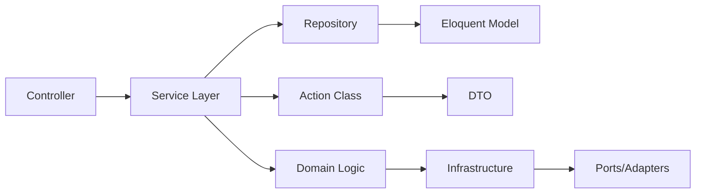

# Chapter 19: Laravel Application Architecture Patterns

> **Previous:** [Automation Patterns](./18-automation-patterns.md) | **Next:** [Scaling Laravel](./20-scaling-laravel.md)

---
## Learning Objectives
- Implement a service layer that separates business logic from HTTP concerns with constructor injection and single-responsibility services
- Design repository abstractions using interfaces and implementations that support swapping Eloquent, cache, and fake backends
- Build single-action classes with the `__invoke()` pattern and organize actions by feature or domain boundary
- Construct immutable Data Transfer Objects with typed properties, named arguments, and factory methods
- Apply Domain-Driven Design tactical patterns within Laravel including bounded contexts, aggregates, domain events, and value objects
- Architect hexagonal applications with ports and adapters, dependency inversion, and framework-independent core logic
- Evaluate and implement event sourcing with CQRS using event stores, projections, and separate read/write models
- Design multi-tenant applications using single-database, separate-database, and hybrid strategies
- Structure a modular monolith with self-contained modules that can later graduate to microservices
---

## Chapter at a Glance

| Topic | Key Insight | Practical Takeaway |
|-------|-------------|-------------------|
| Service Layer | Encapsulates business logic away from controllers | Create dedicated service classes for complex operations |
| Repository Pattern | Abstracts data access behind interfaces | Swap Eloquent for other data sources without changing business code |
| Action Classes | Single-purpose classes for specific operations | Use for one-action flows like registration or checkout |
| DTOs | Typed objects for data transfer between layers | Use readonly properties for immutable DTOs |
| DDD | Domain-driven design with entities, value objects, aggregates | Apply where business logic complexity justifies the overhead |
| Hexagonal Architecture | Separates core logic from infrastructure via ports/adapters | Adapters implement interfaces at the boundary |

## Chapter Roadmap



---

## Theory


### 1. The Service Layer Pattern


> **One-Sentence Takeaway:** The service layer extracts business logic from controllers into dedicated non-framework classes with constructor injection.

As Laravel applications grow, controllers accumulate business logic that belongs elsewhere. The service layer extracts this logic into dedicated classes, leaving controllers to handle only HTTP concerns — request validation, response transformation, and status codes.

#### Service Classes and Constructor Injection

A service class is a plain PHP class with no framework inheritance, grouped by domain concern:

```php
namespace App\Services;

use App\Models\Subscription;
use App\Repositories\SubscriptionRepository;
use App\Notifications\TrialExpiring;
use Illuminate\Support\Facades\Notification;

class SubscriptionService
{
    public function __construct(
        private SubscriptionRepository $subscriptions,
        private PaymentGateway $gateway
    ) {}

    public function startTrial(User $user, Plan $plan): Subscription
    {
        $subscription = $this->subscriptions->create([
            'user_id' => $user->id,
            'plan_id' => $plan->id,
            'status' => 'trialing',
            'trial_ends_at' => now()->addDays(14),
        ]);

        return $subscription;
    }

    public function cancel(Subscription $subscription): void
    {
        $subscription->update(['status' => 'canceled']);

        $this->gateway->cancelSubscription($subscription->gateway_id);

        $subscription->user->notify(
            new SubscriptionCanceled($subscription)
        );
    }

    public function handleExpiringTrials(): int
    {
        $expiring = $this->subscriptions
            ->getExpiringTrials(now()->addDays(1));

        foreach ($expiring as $subscription) {
            Notification::send(
                $subscription->user,
                new TrialExpiring($subscription)
            );
        }

        return $expiring->count();
    }
}
```

The controller becomes a thin adapter:

```php
namespace App\Http\Controllers\Api;

use App\Http\Controllers\Controller;
use App\Http\Requests\StartTrialRequest;
use App\Services\SubscriptionService;

class SubscriptionController extends Controller
{
    public function __construct(
        private SubscriptionService $subscriptions
    ) {}

    public function startTrial(StartTrialRequest $request)
    {
        $subscription = $this->subscriptions->startTrial(
            $request->user(),
            $request->getPlan()
        );

        return response()->json($subscription, 201);
    }

    public function cancel(Subscription $subscription)
    {
        $this->authorize('cancel', $subscription);

        $this->subscriptions->cancel($subscription);

        return response()->noContent();
    }
}
```

#### Single-Responsibility Services

Each service owns one domain concern. A violation — "God service" — looks like:

```php
// Anti-pattern: one service does everything
class GodService {
    public function createOrder() {}
    public function handlePayment() {}
    public function sendInvoice() {}
    public function generateReport() {}
    public function syncInventory() {}
}
```

Refactored to single-responsibility:

```php
namespace App\Services\Orders;

class OrderCreationService { /* creates orders */ }
class OrderPaymentService { /* processes payments */ }
class OrderFulfillmentService { /* inventory + shipping */ }
class OrderReportingService { /* analytics and exports */ }
```

| Principle | Benefit |
|-----------|---------|
| Constructor injection only | Dependencies visible, testable, swappable |
| No framework inheritance | Easy unit testing without Laravel setup |
| Single public method per operation | Low cognitive load, high cohesion |
| Domain terminology | Business experts understand the code |

#### Service Providers for Service Registration

Bind services in `AppServiceProvider` or dedicated providers:

```php
public function register(): void
{
    $this->app->singleton(SubscriptionService::class, function ($app) {
        return new SubscriptionService(
            $app->make(SubscriptionRepository::class),
            $app->make(PaymentGateway::class)
        );
    });
}
```

---


> **Pro Tip:** Inject services through the controller's constructor. This makes the dependency explicit and simplifies testing with mock services.

### 2. The Repository Pattern


> **One-Sentence Takeaway:** Repositories abstract data access behind interfaces, enabling backend swaps without changing business code.

The repository pattern introduces an abstraction between the data source and the business logic. Controllers and services depend on interfaces, not Eloquent models directly.

#### Repository Interface and Implementation

```php
namespace App\Repositories\Contracts;

use App\Models\Subscription;
use Illuminate\Support\Collection;

interface SubscriptionRepository
{
    public function find(int $id): ?Subscription;
    public function findByUser(int $userId): Collection;
    public function getExpiringTrials(\Carbon\Carbon $date): Collection;
    public function create(array $data): Subscription;
    public function update(int $id, array $data): bool;
    public function delete(int $id): bool;
}
```

Eloquent implementation:

```php
namespace App\Repositories\Eloquent;

use App\Models\Subscription;
use App\Repositories\Contracts\SubscriptionRepository;
use Illuminate\Support\Collection;

class EloquentSubscriptionRepository implements SubscriptionRepository
{
    public function find(int $id): ?Subscription
    {
        return Subscription::find($id);
    }

    public function findByUser(int $userId): Collection
    {
        return Subscription::where('user_id', $userId)->get();
    }

    public function getExpiringTrials(\Carbon\Carbon $date): Collection
    {
        return Subscription::where('status', 'trialing')
            ->where('trial_ends_at', '<=', $date)
            ->get();
    }

    public function create(array $data): Subscription
    {
        return Subscription::create($data);
    }

    public function update(int $id, array $data): bool
    {
        return Subscription::where('id', $id)->update($data);
    }

    public function delete(int $id): bool
    {
        return Subscription::destroy($id) > 0;
    }
}
```

Cache-backed implementation:

```php
namespace App\Repositories\Cached;

use App\Repositories\Contracts\SubscriptionRepository;
use Illuminate\Contracts\Cache\Repository as Cache;
use App\Models\Subscription;
use Illuminate\Support\Collection;

class CachedSubscriptionRepository implements SubscriptionRepository
{
    private const TTL = 3600;

    public function __construct(
        private SubscriptionRepository $inner,
        private Cache $cache
    ) {}

    public function find(int $id): ?Subscription
    {
        return $this->cache->remember("subscription.{$id}", self::TTL, function () use ($id) {
            return $this->inner->find($id);
        });
    }

    public function findByUser(int $userId): Collection
    {
        return $this->cache->remember("subscriptions.user.{$userId}", self::TTL, function () use ($userId) {
            return $this->inner->findByUser($userId);
        });
    }

    public function create(array $data): Subscription
    {
        $subscription = $this->inner->create($data);
        $this->cache->put("subscription.{$subscription->id}", $subscription, self::TTL);

        return $subscription;
    }

    public function update(int $id, array $data): bool
    {
        $result = $this->inner->update($id, $data);
        $this->cache->forget("subscription.{$id}");

        return $result;
    }

    public function delete(int $id): bool
    {
        $result = $this->inner->delete($id);
        $this->cache->forget("subscription.{$id}");

        return $result;
    }
}
```

#### Dependency Injection in Controllers

Bind the interface to the desired implementation in `AppServiceProvider`:

```php
public function register(): void
{
    $this->app->bind(
        SubscriptionRepository::class,
        EloquentSubscriptionRepository::class
    );
}

// Swap for cached version in production
public function register(): void
{
    $this->app->singleton(SubscriptionRepository::class, function ($app) {
        $eloquent = new EloquentSubscriptionRepository();

        if ($this->app->environment('production')) {
            return new CachedSubscriptionRepository(
                $eloquent,
                $app->make('cache.store')
            );
        }

        return $eloquent;
    });
}
```

Controllers then type-hint the interface:

```php
class SubscriptionController extends Controller
{
    public function __construct(
        private SubscriptionRepository $subscriptions
    ) {}
}
```

#### Repository Testing with Fakes

```php
namespace Tests\Fakes;

use App\Models\Subscription;
use App\Repositories\Contracts\SubscriptionRepository;
use Illuminate\Support\Collection;

class FakeSubscriptionRepository implements SubscriptionRepository
{
    private array $subscriptions = [];

    public function hydrate(array $data): void
    {
        foreach ($data as $attributes) {
            $subscription = new Subscription($attributes);
            $subscription->id = $attributes['id'] ?? array_key_last($this->subscriptions) + 1;
            $this->subscriptions[$subscription->id] = $subscription;
        }
    }

    public function find(int $id): ?Subscription
    {
        return $this->subscriptions[$id] ?? null;
    }

    public function findByUser(int $userId): Collection
    {
        return collect($this->subscriptions)
            ->where('user_id', $userId)
            ->values();
    }

    public function getExpiringTrials(\Carbon\Carbon $date): Collection
    {
        return collect($this->subscriptions)
            ->where('status', 'trialing')
            ->filter(fn ($s) => $s->trial_ends_at <= $date)
            ->values();
    }

    public function create(array $data): Subscription
    {
        $subscription = new Subscription($data);
        $subscription->id = count($this->subscriptions) + 1;
        $this->subscriptions[$subscription->id] = $subscription;

        return $subscription;
    }

    public function update(int $id, array $data): bool
    {
        if (!isset($this->subscriptions[$id])) {
            return false;
        }

        foreach ($data as $key => $value) {
            $this->subscriptions[$id]->$key = $value;
        }

        return true;
    }

    public function delete(int $id): bool
    {
        if (!isset($this->subscriptions[$id])) {
            return false;
        }

        unset($this->subscriptions[$id]);

        return true;
    }
}
```

```php
// In a test
use Tests\Fakes\FakeSubscriptionRepository;

class SubscriptionServiceTest extends TestCase
{
    private FakeSubscriptionRepository $repo;

    protected function setUp(): void
    {
        parent::setUp();

        $this->repo = new FakeSubscriptionRepository();
        $this->repo->hydrate([
            ['id' => 1, 'user_id' => 1, 'status' => 'trialing', 'trial_ends_at' => now()->addDays(1)],
            ['id' => 2, 'user_id' => 2, 'status' => 'active', 'trial_ends_at' => null],
        ]);

        $this->app->instance(SubscriptionRepository::class, $this->repo);
    }
}
```

| Pattern | Trade-off |
|---------|-----------|
| Interface + implementation | More files, clear boundaries, exchangeable backend |
| Direct Eloquent | Faster to write, coupled to ORM, hard to test |
| Cached decorator | Transparent caching, requires decorator discipline |
| Fake for tests | No database needed, fast, may drift from real behavior |

---

### 3. Action Classes


> **One-Sentence Takeaway:** Single-action classes with __invoke are ideal for registering a user, processing a payment, or any one-action flow.

An action class encapsulates a single use case behind an `__invoke()` method. This pattern works well for operations that don't fit neatly into CRUD.

#### Single-Action Classes

```php
namespace App\Actions\Subscriptions;

use App\Models\Subscription;
use App\Models\Plan;
use App\Models\User;
use App\Services\PaymentGateway;
use Illuminate\Support\Facades\DB;

class StartTrialAction
{
    public function __construct(
        private PaymentGateway $gateway
    ) {}

    public function __invoke(User $user, Plan $plan): Subscription
    {
        return DB::transaction(function () use ($user, $plan) {
            $customer = $this->gateway->createCustomer($user);
            $gatewaySubscription = $this->gateway->createTrial($customer, $plan);

            return Subscription::create([
                'user_id' => $user->id,
                'plan_id' => $plan->id,
                'gateway_id' => $gatewaySubscription->id,
                'status' => 'trialing',
                'trial_ends_at' => now()->addDays(14),
            ]);
        });
    }
}
```

Registered as a singleton and invoked from controllers:

```php
// Controller
public function startTrial(StartTrialRequest $request, StartTrialAction $action)
{
    $subscription = $action($request->user(), $request->getPlan());

    return response()->json($subscription, 201);
}
```

#### Command Bus Pattern

For operations with input/output separation, use a command class and a dedicated handler:

```php
namespace App\Commands\Subscriptions;

class StartTrialCommand
{
    public function __construct(
        public readonly User $user,
        public readonly Plan $plan,
        public readonly ?string $couponCode = null,
    ) {}
}
```

```php
namespace App\Commands\Subscriptions\Handlers;

use App\Actions\Subscriptions\StartTrialAction;
use App\Commands\Subscriptions\StartTrialCommand;

class StartTrialHandler
{
    public function __construct(
        private StartTrialAction $action
    ) {}

    public function handle(StartTrialCommand $command)
    {
        return $this->action($command->user, $command->plan);
    }
}
```

Dispatch via a simple bus:

```php
namespace App\Infrastructure\Bus;

class CommandBus
{
    private array $handlers = [];

    public function register(string $commandClass, string $handlerClass): void
    {
        $this->handlers[$commandClass] = $handlerClass;
    }

    public function dispatch(object $command): mixed
    {
        $handlerClass = $this->handlers[$command::class]
            ?? throw new \RuntimeException("No handler for " . $command::class);

        $handler = app($handlerClass);

        return $handler->handle($command);
    }
}
```

Registered in a service provider:

```php
public function boot(CommandBus $bus): void
{
    $bus->register(StartTrialCommand::class, StartTrialHandler::class);
    $bus->register(CancelSubscriptionCommand::class, CancelSubscriptionHandler::class);
}
```

#### Organizing Actions by Feature

```
app/Actions/
├── Auth/
│   ├── RegisterUserAction.php
│   ├── LoginAction.php
│   └── VerifyEmailAction.php
├── Subscriptions/
│   ├── StartTrialAction.php
│   ├── CancelSubscriptionAction.php
│   ├── UpgradePlanAction.php
│   └── HandleFailedPaymentAction.php
├── Orders/
│   ├── PlaceOrderAction.php
│   ├── CalculateShippingAction.php
│   └── ApplyDiscountAction.php
└── Reports/
    ├── GenerateRevenueReportAction.php
    └── ExportSubscribersAction.php
```

---

### 4. Data Transfer Objects (DTOs)


> **One-Sentence Takeaway:** Immutable DTOs with typed readonly properties enforce data contracts across application layers.

DTOs carry data between subsystems without exposing Eloquent models to contexts where they don't belong.

#### Immutable Value Objects

```php
namespace App\DTOs;

use Carbon\Carbon;

class SubscriptionData
{
    public function __construct(
        public readonly int $userId,
        public readonly int $planId,
        public readonly string $paymentMethodId,
        public readonly ?string $couponCode = null,
        public readonly ?Carbon $trialEndsAt = null,
    ) {}
}
```

PHP 8 named arguments make construction readable:

```php
$data = new SubscriptionData(
    userId: $user->id,
    planId: $plan->id,
    paymentMethodId: $request->input('payment_method_id'),
    couponCode: $request->input('coupon_code'),
);
```

#### fromArray() Factory

```php
class SubscriptionData
{
    // ... constructor same as above ...

    public static function fromArray(array $data): self
    {
        return new self(
            userId: (int) $data['user_id'],
            planId: (int) $data['plan_id'],
            paymentMethodId: (string) $data['payment_method_id'],
            couponCode: isset($data['coupon_code']) ? (string) $data['coupon_code'] : null,
            trialEndsAt: isset($data['trial_ends_at'])
                ? Carbon::parse($data['trial_ends_at'])
                : null,
        );
    }

    public function toArray(): array
    {
        return array_filter([
            'user_id' => $this->userId,
            'plan_id' => $this->planId,
            'payment_method_id' => $this->paymentMethodId,
            'coupon_code' => $this->couponCode,
            'trial_ends_at' => $this->trialEndsAt?->toDateTimeString(),
        ], fn ($value) => $value !== null);
    }
}
```

#### Spatie Data Package

For advanced DTO needs — validation, transformation, nesting:

```php
use Spatie\LaravelData\Data;
use Spatie\LaravelData\Attributes\Validation\Exists;
use Spatie\LaravelData\Attributes\Validation\IntegerType;
use Spatie\LaravelData\Optional;

class StartTrialData extends Data
{
    public function __construct(
        #[IntegerType, Exists('users', 'id')]
        public int $userId,

        #[IntegerType, Exists('plans', 'id')]
        public int $planId,

        public string $paymentMethodId,

        public string|Optional $couponCode,
    ) {}

    public static function fromRequest(StartTrialRequest $request): self
    {
        return new self(
            userId: $request->user()->id,
            planId: (int) $request->input('plan_id'),
            paymentMethodId: $request->input('payment_method_id'),
            couponCode: $request->input('coupon_code', Optional::create()),
        );
    }
}
```

```php
// Controller
public function startTrial(StartTrialRequest $request, StartTrialAction $action)
{
    $data = StartTrialData::fromRequest($request);

    $subscription = $action($data);

    return response()->json($subscription, 201);
}
```

| Approach | Lines | Validation | Serialization | Nesting |
|----------|-------|------------|---------------|---------|
| Plain readonly class | ~15 | Manual | Manual | Manual |
| `fromArray()` factory | ~35 | In factory | `toArray()` | Manual |
| Spatie Data | Full package | Attributes | `$dto->toArray()` | Built-in |

---

### 5. Domain-Driven Design in Laravel


> **One-Sentence Takeaway:** DDD tactical patterns include entities with identity, value objects, aggregates, domain events, and bounded contexts.

DDD tactical patterns map naturally to Laravel when you organize by bounded context rather than by technical layer.

#### Bounded Contexts as Module Directories

```
app/Domain/
├── Billing/
│   ├── Models/
│   │   ├── Subscription.php
│   │   ├── Invoice.php
│   │   └── PaymentMethod.php
│   ├── Actions/
│   │   ├── StartTrialAction.php
│   │   └── CancelSubscriptionAction.php
│   ├── DomainEvents/
│   │   ├── SubscriptionStarted.php
│   │   ├── SubscriptionCanceled.php
│   │   └── PaymentFailed.php
│   ├── Repositories/
│   │   ├── SubscriptionRepository.php (interface)
│   │   └── EloquentSubscriptionRepository.php
│   ├── ValueObjects/
│   │   ├── Money.php
│   │   ├── BillingPeriod.php
│   │   └── SubscriptionStatus.php
│   └── DomainServices/
│       ├── SubscriptionRenewalService.php
│       └── DunningService.php
├── Inventory/
│   ├── Models/
│   │   ├── Product.php
│   │   └── StockMovement.php
│   ├── Actions/
│   │   ├── ReserveStockAction.php
│   │   └── ReleaseStockAction.php
│   ├── DomainEvents/
│   │   └── StockDepleted.php
│   ├── Repositories/
│   │   └── ProductRepository.php
│   └── ValueObjects/
│       ├── SKU.php
│       └── StockQuantity.php
└── Shared/
    ├── ValueObjects/
    │   ├── Email.php
    │   └── Address.php
    └── Bus/
        └── DomainEventBus.php
```

#### Aggregates

An aggregate is a cluster of domain objects treated as a single unit:

```php
namespace App\Domain\Billing\Aggregates;

use App\Domain\Billing\Models\Subscription;
use App\Domain\Billing\Models\Invoice;
use App\Domain\Billing\ValueObjects\Money;
use App\Domain\Billing\DomainEvents\SubscriptionStarted;
use App\Domain\Billing\DomainEvents\PaymentReceived;
use Illuminate\Support\Collection;

class SubscriptionAggregate
{
    private Collection $recordedEvents;

    public function __construct(
        private Subscription $subscription,
        private Collection $invoices,
    ) {
        $this->recordedEvents = collect();
    }

    public static function start(
        int $userId,
        int $planId,
        Money $amount,
        \Carbon\Carbon $trialEndsAt
    ): self {
        $subscription = new Subscription([
            'user_id' => $userId,
            'plan_id' => $planId,
            'status' => 'trialing',
            'trial_ends_at' => $trialEndsAt,
        ]);

        $aggregate = new self($subscription, collect());
        $aggregate->recordThat(new SubscriptionStarted($subscription));

        return $aggregate;
    }

    public function recordPayment(Money $amount, string $gatewayTransactionId): void
    {
        $invoice = new Invoice([
            'subscription_id' => $this->subscription->id,
            'amount' => $amount->toCents(),
            'currency' => $amount->currency,
            'gateway_transaction_id' => $gatewayTransactionId,
            'status' => 'paid',
        ]);

        $this->invoices->push($invoice);
        $this->recordThat(new PaymentReceived($invoice));
    }

    private function recordThat(object $event): void
    {
        $this->recordedEvents->push($event);
    }

    public function releaseEvents(): Collection
    {
        $events = $this->recordedEvents;
        $this->recordedEvents = collect();

        return $events;
    }

    public function subscription(): Subscription
    {
        return $this->subscription;
    }
}
```

#### Domain Events

```php
namespace App\Domain\Billing\DomainEvents;

use App\Domain\Billing\Models\Subscription;

class SubscriptionStarted
{
    public function __construct(
        public readonly Subscription $subscription,
        public readonly \Carbon\Carbon $occurredAt,
    ) {
        $this->occurredAt = now();
    }
}
```

Dispatch and handle with Laravel's event system:

```php
use Illuminate\Foundation\Events\Dispatchable;

class SubscriptionStarted
{
    use Dispatchable;

    // ... constructor ...
}

// Listener
class SendWelcomeEmail
{
    public function handle(SubscriptionStarted $event): void
    {
        $event->subscription->user->notify(
            new WelcomeToPro($event->subscription)
        );
    }
}
```

#### Value Objects vs Eloquent Attributes

Eloquent models use accessors for value objects:

```php
namespace App\Domain\Billing\Models;

use App\Domain\Billing\ValueObjects\Money;
use Illuminate\Database\Eloquent\Model;

class Invoice extends Model
{
    protected $casts = [
        'paid_at' => 'datetime',
    ];

    public function amount(): Money
    {
        return new Money(
            (int) $this->amount_cents,
            $this->currency,
        );
    }

    public function setAmount(Money $money): void
    {
        $this->amount_cents = $money->toCents();
        $this->currency = $money->currency;
    }
}
```

---


> **Warning:** DDD adds significant overhead. Only apply it when the business logic is complex enough to justify bounded contexts, aggregates, and domain events.

### 6. Hexagonal Architecture (Ports and Adapters)


> **One-Sentence Takeaway:** Hexagonal architecture keeps core domain logic framework-independent by placing infrastructure at the boundary.

The hexagonal pattern places business logic at the center, with "ports" (interfaces) on the boundary and "adapters" (implementations) outside.

```
┌─────────────────────────────────────────┐
│           Application Core              │
│  ┌───────────────────────────────────┐   │
│  │         Domain Services           │   │
│  │  ┌─────┐  ┌─────┐  ┌─────┐      │   │
│  │  │Sub  │  │Ord  │  │Inv  │      │   │
│  │  │Svc  │  │Svc  │  │Svc  │      │   │
│  │  └──┬──┘  └──┬──┘  └──┬──┘      │   │
│  │     │         │        │         │   │
│  │  ┌──┴─────────┴────────┴──┐      │   │
│  │  │     Port Interfaces    │      │   │
│  │  │ (RepositoryInterface)  │      │   │
│  │  └───────────┬────────────┘      │   │
│  └──────────────│────────────────────┘   │
│                 │                        │
│  ┌──────────────│────────────────────┐   │
│  │    Adapters  │                    │   │
│  │         ┌────┴────┐              │   │
│  │         │ Eloquent│  ┌────────┐  │   │
│  │         │  Repo   │  │ Cache  │  │   │
│  │         └─────────┘  │ Adapter│  │   │
│  │                      └────────┘  │   │
│  │  ┌──────────┐  ┌──────────────┐  │   │
│  │  │ HTTP     │  │ CLI/Artisan  │  │   │
│  │  │ Controller│  │ Command      │  │   │
│  │  └──────────┘  └──────────────┘  │   │
│  └──────────────────────────────────┘   │
└─────────────────────────────────────────┘
```

#### Repository Interfaces as Ports

Port interfaces live in the domain, not in the infrastructure layer:

```php
namespace App\Domain\Billing\Ports;

use App\Domain\Billing\Models\Subscription;

interface SubscriptionRepositoryPort
{
    public function find(int $id): ?Subscription;
    public function findByUser(int $userId): array;
    public function save(Subscription $subscription): void;
    public function delete(int $id): void;
}
```

#### Adapters as Implementations

```php
namespace App\Infrastructure\Persistence\Eloquent;

use App\Domain\Billing\Models\Subscription;
use App\Domain\Billing\Ports\SubscriptionRepositoryPort;

class EloquentSubscriptionAdapter implements SubscriptionRepositoryPort
{
    public function find(int $id): ?Subscription
    {
        return Subscription::find($id);
    }

    public function findByUser(int $userId): array
    {
        return Subscription::where('user_id', $userId)->get()->all();
    }

    public function save(Subscription $subscription): void
    {
        $subscription->save();
    }

    public function delete(int $id): void
    {
        Subscription::destroy($id);
    }
}
```

#### Dependency Inversion

High-level modules (domain services) define the interfaces; low-level modules (infrastructure) implement them:

```php
// Domain service depends on the PORT interface
namespace App\Domain\Billing\Services;

use App\Domain\Billing\Ports\SubscriptionRepositoryPort;

class RenewalService
{
    public function __construct(
        private SubscriptionRepositoryPort $subscriptions
    ) {}
}
```

Bootstrap wiring:

```php
public function register(): void
{
    $this->app->bind(
        SubscriptionRepositoryPort::class,
        EloquentSubscriptionAdapter::class,
    );
}
```

| Aspect | Traditional Laravel | Hexagonal Laravel |
|--------|-------------------|-------------------|
| Repository location | `app/Repositories/` (infrastructure) | `app/Domain/*/Ports/` (domain) |
| Dependency direction | Controller → Repository | Domain defines port, infra implements |
| Framework coupling | High (extends Eloquent) | Low (plain PHP in domain) |
| Testability | Requires database setup | Fakes on port interface |

---

### 7. Event Sourcing & CQRS


> **One-Sentence Takeaway:** Event sourcing stores state changes as an append-only event log; CQRS separates read and write models.

Event sourcing stores state changes as an append-only log. CQRS separates read and write models.

#### Event Store Table Design

```php
use Illuminate\Database\Migrations\Migration;
use Illuminate\Database\Schema\Blueprint;
use Illuminate\Support\Facades\Schema;

return new class extends Migration
{
    public function up(): void
    {
        Schema::create('event_store', function (Blueprint $table) {
            $table->id();
            $table->string('aggregate_type', 100);
            $table->unsignedBigInteger('aggregate_id');
            $table->unsignedInteger('version');
            $table->string('event_type', 200);
            $table->json('event_data');
            $table->json('metadata')->nullable();
            $table->timestamp('occurred_at')->useCurrent();

            $table->unique(['aggregate_type', 'aggregate_id', 'version']);
            $table->index(['aggregate_type', 'aggregate_id']);
            $table->index('event_type');
        });
    }
};
```

#### AggregateRoot Trait

```php
namespace App\Domain\Common\Concerns;

use Illuminate\Support\Collection;
use Illuminate\Support\Facades\DB;

trait AggregateRoot
{
    private Collection $recordedEvents;
    private int $currentVersion = 0;

    public function initializeAggregateRoot(): void
    {
        $this->recordedEvents = collect();
    }

    protected function recordThat(object $event): void
    {
        $this->recordedEvents->push($event);
        $this->apply($event);
    }

    abstract protected function apply(object $event): void;

    public function getRecordedEvents(): Collection
    {
        return $this->recordedEvents;
    }

    public function persistToEventStore(string $aggregateType): void
    {
        $events = $this->recordedEvents->map(function ($event, $index) use ($aggregateType) {
            return [
                'aggregate_type' => $aggregateType,
                'aggregate_id' => $this->id,
                'version' => $this->currentVersion + $index + 1,
                'event_type' => get_class($event),
                'event_data' => json_encode($event),
                'occurred_at' => now(),
            ];
        });

        DB::table('event_store')->insert($events->all());
        $this->recordedEvents = collect();
    }

    public static function reconstituteFromEvents(string $aggregateType, int $aggregateId): static
    {
        $rows = DB::table('event_store')
            ->where('aggregate_type', $aggregateType)
            ->where('aggregate_id', $aggregateId)
            ->orderBy('version')
            ->get();

        $instance = new static();
        $instance->currentVersion = $rows->count();

        foreach ($rows as $row) {
            $event = unserialize($row->event_data);
            $instance->apply($event);
        }

        return $instance;
    }
}
```

#### Projecting Events to Read Models

```php
namespace App\Domain\Billing\Projectors;

use App\Domain\Billing\DomainEvents\SubscriptionStarted;
use App\Domain\Billing\DomainEvents\PaymentReceived;
use App\Domain\Billing\DomainEvents\SubscriptionCanceled;
use Illuminate\Support\Facades\DB;

class SubscriptionProjector
{
    public function onSubscriptionStarted(SubscriptionStarted $event): void
    {
        DB::table('subscription_read_model')->insert([
            'subscription_id' => $event->subscriptionId,
            'user_id' => $event->userId,
            'plan_id' => $event->planId,
            'status' => 'trialing',
            'total_paid_cents' => 0,
            'created_at' => $event->occurredAt,
            'updated_at' => $event->occurredAt,
        ]);
    }

    public function onPaymentReceived(PaymentReceived $event): void
    {
        DB::table('subscription_read_model')
            ->where('subscription_id', $event->subscriptionId)
            ->increment('total_paid_cents', $event->amountCents);
    }

    public function onSubscriptionCanceled(SubscriptionCanceled $event): void
    {
        DB::table('subscription_read_model')
            ->where('subscription_id', $event->subscriptionId)
            ->update([
                'status' => 'canceled',
                'canceled_at' => $event->occurredAt,
            ]);
    }
}
```

#### CQRS Command and Query Buses

```php
namespace App\Infrastructure\CQRS;

class CommandBus
{
    private array $handlers = [];

    public function register(string $command, string $handler): void
    {
        $this->handlers[$command] = $handler;
    }

    public function dispatch(object $command): mixed
    {
        $handler = app($this->handlers[$command::class]);
        return $handler->handle($command);
    }
}

class QueryBus
{
    private array $handlers = [];

    public function register(string $query, string $handler): void
    {
        $this->handlers[$query] = $handler;
    }

    public function ask(object $query): mixed
    {
        $handler = app($this->handlers[$query::class]);
        return $handler->handle($query);
    }
}
```

Separate read/write databases in configuration:

```php
// config/database.php
'connections' => [
    'mysql' => [
        'driver' => 'mysql',
        'host' => env('DB_HOST', '127.0.0.1'),
        'database' => env('DB_DATABASE', 'forge'),
        // ...
    ],
    'mysql_read' => [
        'driver' => 'mysql',
        'host' => env('DB_READ_HOST', env('DB_HOST', '127.0.0.1')),
        'database' => env('DB_DATABASE', 'forge'),
        // ...
    ],
],
```

```php
// Write model uses default connection
class Subscription extends Model
{
    protected $connection = 'mysql';
}

// Read model uses read connection
class SubscriptionReadModel extends Model
{
    protected $connection = 'mysql_read';
    protected $table = 'subscription_read_model';
    public $timestamps = false;
}
```

---

### 8. Multi-Tenancy


> **One-Sentence Takeaway:** Multi-tenancy strategies range from single-database with tenant_id to separate databases per tenant.

Laravel supports multiple multi-tenancy strategies depending on isolation requirements.

#### Single Database (Tenant ID Column)

```php
Schema::create('subscriptions', function (Blueprint $table) {
    $table->id();
    $table->foreignId('tenant_id')->constrained()->index();
    $table->foreignId('user_id');
    $table->string('plan');
    $table->string('status');
    $table->timestamps();

    $table->index(['tenant_id', 'status']);
});
```

Global scopes enforce isolation:

```php
namespace App\Models\Scopes;

use Illuminate\Database\Eloquent\Builder;
use Illuminate\Database\Eloquent\Model;
use Illuminate\Database\Eloquent\Scope;

class TenantScope implements Scope
{
    public function apply(Builder $builder, Model $model): void
    {
        $tenantId = tenant()->id;

        $builder->where('tenant_id', $tenantId);
    }
}
```

```php
namespace App\Models\Concerns;

trait BelongsToTenant
{
    public static function bootBelongsToTenant(): void
    {
        static::addGlobalScope(new TenantScope());

        static::creating(function ($model) {
            if (empty($model->tenant_id)) {
                $model->tenant_id = tenant()->id;
            }
        });
    }

    public function tenant()
    {
        return $this->belongsTo(Tenant::class);
    }
}
```

#### Separate Database per Tenant

Each tenant gets their own database with identical schema:

```php
namespace App\Providers;

use Illuminate\Support\ServiceProvider;
use Illuminate\Support\Facades\Config;
use Illuminate\Support\Facades\DB;

class TenancyServiceProvider extends ServiceProvider
{
    public function boot(): void
    {
        $this->app->singleton('tenant', function () {
            if ($tenantId = request()->header('X-Tenant-Id')) {
                return Tenant::findOrFail($tenantId);
            }
            return null;
        });
    }

    public static function configureForTenant(Tenant $tenant): void
    {
        Config::set('database.connections.tenant', [
            'driver' => 'mysql',
            'host' => $tenant->db_host ?? config('database.connections.mysql.host'),
            'port' => $tenant->db_port ?? config('database.connections.mysql.port'),
            'database' => "tenant_{$tenant->id}",
            'username' => $tenant->db_username ?? config('database.connections.mysql.username'),
            'password' => $tenant->db_password ?? config('database.connections.mysql.password'),
            'charset' => 'utf8mb4',
        ]);

        DB::purge('mysql');
        Config::set('database.default', 'tenant');
    }
}
```

#### Tenant-Aware Caching and Queues

```php
// Cache prefix per tenant
Cache::tags(["tenant_{$tenantId}"])->put($key, $value, $ttl);

// Queue per tenant
dispatch(new ProcessSubscription($subscription))
    ->onQueue("tenant_{$tenantId}");
```

#### Stancl Tenancy Package (Feature Summary)

| Feature | Implementation |
|---------|---------------|
| Domain identification | `mytenant.yourapp.com` → `Tenant` model lookup |
| Database isolation | Each tenant gets isolated database |
| Cache isolation | Prefixes all cache keys with tenant ID |
| File isolation | Separate storage directories per tenant |
| Queue isolation | Separate queue per tenant |
| Artisan commands | `php artisan tenants:run migrate` across all tenants |
| Data separation | Both row-level and database-level strategies |

---

### 9. The Modular Monolith


> **One-Sentence Takeaway:** Modular monoliths organize code into self-contained modules that can later graduate to microservices.

A modular monolith organizes code into modules that can later graduate to microservices. Each module is self-contained with its own routes, controllers, migrations, models, and tests.

#### Module Directory Structure

```
Modules/
├── Sales/
│   ├── app/
│   │   ├── Controllers/
│   │   │   ├── OrderController.php
│   │   │   └── InvoiceController.php
│   │   ├── Models/
│   │   │   ├── Order.php
│   │   │   └── Invoice.php
│   │   ├── Actions/
│   │   │   ├── PlaceOrderAction.php
│   │   │   └── GenerateInvoiceAction.php
│   │   ├── Events/
│   │   │   └── OrderPlaced.php
│   │   ├── Listeners/
│   │   │   └── NotifySalesTeam.php
│   │   └── Providers/
│   │       └── SalesServiceProvider.php
│   ├── database/
│   │   ├── migrations/
│   │   │   ├── 2025_01_01_000001_create_orders_table.php
│   │   │   └── 2025_01_01_000002_create_invoices_table.php
│   │   └── seeders/
│   │       └── SalesDatabaseSeeder.php
│   ├── routes/
│   │   └── api.php
│   └── tests/
│       ├── Feature/
│       ├── Unit/
│       └── PestTest.php
├── Inventory/
│   ├── app/
│   │   ├── Controllers/
│   │   │   └── ProductController.php
│   │   ├── Models/
│   │   │   └── Product.php
│   │   ├── Actions/
│   │   │   ├── ReserveStockAction.php
│   │   │   └── ReorderStockAction.php
│   │   ├── Events/
│   │   │   └── StockReserved.php
│   │   └── Providers/
│   │       └── InventoryServiceProvider.php
│   ├── database/
│   │   ├── migrations/
│   │   └── seeders/
│   ├── routes/
│   │   └── api.php
│   └── tests/
├── Billing/
│   ├── app/
│   │   ├── Controllers/
│   │   ├── Models/
│   │   ├── Actions/
│   │   ├── Events/
│   │   └── Providers/
│   ├── database/
│   ├── routes/
│   └── tests/
└── Notifications/
    ├── app/
    ├── database/
    ├── routes/
    └── tests/
```

#### Module Service Providers

Each module registers its own bindings, events, and routes:

```php
namespace Modules\Sales\Providers;

use Illuminate\Support\ServiceProvider;
use Illuminate\Support\Facades\Route;

class SalesServiceProvider extends ServiceProvider
{
    public function register(): void
    {
        // Module-specific bindings
        $this->app->bind(
            \Modules\Sales\Contracts\OrderRepository::class,
            \Modules\Sales\Repositories\EloquentOrderRepository::class
        );
    }

    public function boot(): void
    {
        $this->registerRoutes();
        $this->loadMigrationsFrom(__DIR__ . '/../../database/migrations');
    }

    protected function registerRoutes(): void
    {
        Route::prefix('api/sales')
            ->middleware('api')
            ->group(__DIR__ . '/../../routes/api.php');
    }
}
```

Register in `bootstrap/providers.php`:

```php
return [
    App\Providers\AppServiceProvider::class,
    Modules\Sales\Providers\SalesServiceProvider::class,
    Modules\Inventory\Providers\InventoryServiceProvider::class,
    Modules\Billing\Providers\BillingServiceProvider::class,
    Modules\Notifications\Providers\NotificationServiceProvider::class,
];
```

#### Inter-Module Communication

Modules communicate through contracts and events, never through direct class references:

```php
namespace Modules\Sales\Contracts;

interface StockService
{
    public function reserve(int $productId, int $quantity): bool;
    public function release(int $productId, int $quantity): void;
    public function isAvailable(int $productId, int $quantity): bool;
}
```

Inventory implements the contract:

```php
namespace Modules\Inventory\Services;

use Modules\Sales\Contracts\StockService;

class StockServiceImpl implements StockService
{
    public function reserve(int $productId, int $quantity): bool
    {
        return Product::where('id', $productId)
            ->where('stock', '>=', $quantity)
            ->decrement('stock', $quantity) > 0;
    }

    public function release(int $productId, int $quantity): void
    {
        Product::where('id', $productId)->increment('stock', $quantity);
    }

    public function isAvailable(int $productId, int $quantity): bool
    {
        return Product::where('id', $productId)
            ->where('stock', '>=', $quantity)
            ->exists();
    }
}
```

#### Modular vs Microservices Trade-off

| Factor | Modular Monolith | Microservices |
|--------|-----------------|---------------|
| Deployment | Single deploy | Independent deploys |
| Database | Shared (or per-module schema) | Per-service database |
| Inter-module calls | In-process method calls | Network RPC (HTTP/gRPC) |
| Testing | Single app bootstrap | Service contract tests + integration |
| Shared code | Direct class reuse | Shared libraries / packages |
| Team autonomy | Shared codebase | Per-team codebase |
| Operational complexity | Low | High (monitoring, tracing, CI/CD) |
| Scalability | Vertical + limited horizontal | Per-service horizontal |

The modular monolith is the recommended starting point. Extract to microservices only when team coordination or independent scaling demands it.

---

## Concept Comparison Table

| Pattern | Purpose | Key Benefit | Limitation |
|---------|---------|-------------|------------|
| Service Layer | Business logic encapsulation | Controllers stay thin | Extra class per domain concern |
| Repository | Data access abstraction | Swapable backends | Adds interface/impl boilerplate |
| Action Class | Single-use-case class | Zero decision, immediately clear | Proliferates for CRUD operations |
| DTO | Immutable data transfer | Type safety across layers | Boilerplate for simple transfers |
| DDD | Complex domain modeling | Ubiquitous language, bounded contexts | High overhead for CRUD apps |

## Quick Reference

| Pattern | Key Method/Tool | Use Case |
|---------|----------------|----------|
| Service Layer | App\Services\* | Business logic extraction |
| Repository | App\Repositories\* | Data access abstraction |
| Action Class | __invoke() | Single use case |
| DTO | 
eadonly properties | Cross-layer data transfer |
| DDD | AggregateRoot, ValueObject | Complex domain logic |

## Cross-Application Matrix

| Scenario | Pattern | Benefit | Trade-off |
|----------|---------|---------|-----------|
| Report generation | Service Layer | Testable without HTTP | Extra indirection |
| Multi-source data | Repository | Swap DB/cache/API | Interface per entity |
| User registration | Action Class | Single responsibility | Many small files |
| Payment processing | DTO | Immutable amount/currency | Mapping overhead |
| Billing domain | DDD | Ubiquitous language | Setup complexity |

## Chapter Quiz

1. What is the main purpose of the service layer pattern?
   - A) Handle HTTP requests
   - B) Encapsulate business logic away from controllers
   - C) Manage database connections
   - D) Render views
   <details><summary>Answer&lt;/summary&gt;**B)** The service layer extracts business logic from controllers, keeping HTTP concerns separate.</details>

2. Which of the following is a key characteristic of DTOs?
   - A) Mutable state
   - B) Framework inheritance
   - C) Immutable readonly properties
   - D) Database relationships
   <details><summary>Answer&lt;/summary&gt;**C)** DTOs are immutable objects with typed properties for safe cross-layer data transfer.</details>

3. When should you apply Domain-Driven Design in a Laravel application?
   - A) Always, for every project
   - B) Never, it is outdated
   - C) When business logic complexity justifies bounded contexts and aggregates
   - D) Only for API development
   <details><summary>Answer&lt;/summary&gt;**C)** DDD adds overhead. Apply it only when the domain is complex enough to warrant the tactical patterns.</details>

4. What is the recommended starting architecture for most Laravel applications?
   - A) Microservices
   - B) Modular monolith
   - C) Serverless functions
   - D) Hexagonal architecture from day one
   <details><summary>Answer&lt;/summary&gt;**B)** Start with a modular monolith. Extract microservices only when independent scaling or deployment needs arise.</details>

## Summary
- The service layer extracts business logic from controllers into dedicated, injectable classes with single-responsibility boundaries
- Repository interfaces decouple data access from business logic, supporting Eloquent, cache, and fake implementations that are swappable via Laravel's service container
- Action classes encapsulate single use cases behind `__invoke()`, and can be organized with a command bus for structured input/output handling
- DTOs provide immutable, typed data carriers that keep Eloquent models isolated from command handlers and HTTP contexts
- DDD tactical patterns — bounded contexts, aggregates, domain events, value objects — map naturally to Laravel's directory structure and service container
- Hexagonal architecture places domain ports at the center, with infrastructure adapters on the boundary, enforcing dependency inversion
- Event sourcing captures every state change as an append-only event, while CQRS separates read and write concerns for optimized query models
- Multi-tenancy strategies range from simple tenant_id column scoping to isolated databases per tenant, each with distinct trade-offs for isolation and complexity
- The modular monolith organizes code into self-contained feature modules that can graduate to microservices when operational demands justify the extraction
---
## Exercises


> **Remember:** Start with a modular monolith. Extract to microservices only when you have a clear bounded context with independent scaling or deployment requirements.

### Review Questions

1. Describe the difference between a service layer class and a repository class. When would you choose to use each pattern in a Laravel application?

2. Explain how the command bus pattern improves upon calling action classes directly from controllers. What are the trade-offs of introducing a bus abstraction?

3. Why should DTOs be immutable? Provide an example of a bug that could occur if a mutable data object is shared between multiple handlers.

4. Compare the single-database (tenant_id column) and separate-database multi-tenancy strategies in terms of isolation, performance, backup complexity, and cross-tenant queries.

5. How does a modular monolith differ from both a traditional Laravel application and a full microservices architecture? What criteria would justify graduating a module to a standalone service?

### Application Problems

1. **Refactor a fat controller**: Given a `SubscriptionController` with 250 lines containing billing logic, email notifications, inventory reservation, and audit logging, extract these concerns into a service layer, a repository, and appropriate action classes. Show the final controller, service, and at least one action class.

2. **Design a CQRS flow**: A reporting dashboard needs to show (a) total revenue per plan per month, (b) churn rate over time, and (c) active subscriber counts. Design an event-sourced write model and a projected read model. Include the event classes, the projector, and the read model table schema.

3. **Module boundaries exercise**: Given the following features — user authentication, product catalog, shopping cart, order management, payment processing, shipping, reviews, recommendations, and customer support tickets — draw the bounded context boundaries and write the contract interfaces for inter-module communication between at least three modules.

### Challenge Problem

Design a full hexagonal architecture for a loan application system. The system must:
- Receive loan applications from a web form, a mobile API, and a batch CSV import
- Run credit checks through two external providers (Experian and Equifax) with automatic failover
- Store applications in a PostgreSQL database with an audit trail of all status changes
- Notify applicants via email and SMS at each status milestone
- Expose a read-only API for internal dashboards with pre-computed aggregate statistics

Produce the port interfaces (directory structure and interface definitions), adapter implementations for at least two infrastructure concerns, the service container wiring, and demonstrate dependency inversion by writing a test that swaps the credit check adapter for a fake.

