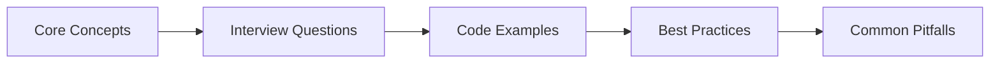

# Chapter 54: AI/ML Interview Q&A

> **Previous:** [JavaScript Interview Q&A](./53-interview-javascript.md) | **Next:** None


This chapter covers AI and machine learning interview questions for Laravel developers → from fundamental ML theory to production deployment with Laravel AI SDK. Each answer includes practical PHP code examples drawn from PHP-ML, Rubix ML, and the Laravel AI ecosystem.

---


<!-- Image Gallery -->
<section class="lesson-visuals" aria-label="Visual learning resources">
  <header><span>VISUAL LEARNING</span><h2>See it. Review it. Remember it.</h2></header>
  <a class="lesson-visual-card" href="../../assets/images/lessons/laravel/54-interview-ai-ml/handwritten-notes.png" target="_blank" rel="noopener">
    
    <span><strong>Handwritten notes</strong>Condensed notes for deliberate review.</span>
  </a>
  <a class="lesson-visual-card" href="../../assets/images/lessons/laravel/54-interview-ai-ml/sticky-notes.png" target="_blank" rel="noopener">
    
    <span><strong>Sticky-note revision</strong>Fast recall prompts for revision.</span>
  </a>
  <a class="lesson-visual-card" href="../../assets/images/lessons/laravel/54-interview-ai-ml/visual-explanation.png" target="_blank" rel="noopener">
    
    <span><strong>Visual concept guide</strong>A connected explanation of the key ideas.</span>
  </a>
</section>
<!-- End Image Gallery -->

## Chapter at a Glance

| Aspect | Details |
|--------|---------|
| **Scope** | AI/ML interview questions covering ML fundamentals, PHP-ML, Rubix ML, Laravel AI SDK, MLOps |
| **Key Concepts** | ML types, overfitting/underfitting, model evaluation, feature engineering, NLP, neural networks, deployment |
| **Learning Approach** | Q&A format with practical PHP and Laravel AI SDK examples |
| **Skills Required** | PHP, Laravel, ML fundamentals |

## Chapter Roadmap



## Machine Learning Fundamentals


### Q1: What is the difference between supervised, unsupervised, and reinforcement learning?

**Answer:** Supervised learning uses labeled data (input-output pairs) to learn a mapping function. Unsupervised learning finds hidden patterns in unlabeled data. Reinforcement learning learns through trial-and-error interaction with an environment, maximizing cumulative reward.

```php
// Supervised → labeled data
$samples = [[1400, 3], [1800, 4], [950, 2]];
$labels  = [320000, 410000, 210000]; // known answers

// Unsupervised → no labels
$customers = [[500, 3], [50, 10], [600, 2]]; // [spend, frequency]
// Clustering discovers segments without knowing what they are

// Reinforcement → reward signal
// Agent selects action → environment returns reward + next state
```

### Q2: Explain overfitting and underfitting. How do you detect and fix them?

**Answer:** Overfitting occurs when a model memorizes training data noise instead of learning the underlying pattern → high training accuracy, poor generalization. Underfitting happens when the model is too simple to capture the pattern → poor performance on both training and test sets.

**Detection:** Compare training vs. validation metrics. A large gap (e.g., 98% train, 72% val) signals overfitting. Both low signals underfitting.

**Fixes → overfitting:** reduce model complexity, add regularization (L1/L2), increase training data, use dropout, early stopping. **Fixes → underfitting:** increase model complexity, add features, reduce regularization, train longer.

```php
use Rubix\ML\Classifiers\ClassificationTree;
use Rubix\ML\Regressors\Ridge;
use Rubix\ML\CrossValidation\Metrics\Accuracy;

// Overfit-prone: deep tree with no pruning
$overfit = new ClassificationTree(100); // max depth = 100

// Regularized: Ridge regression with L2 penalty
$ridge = new Ridge(1.0); // alpha controls regularization strength
```

### Q3: What is the bias-variance tradeoff?

**Answer:** Bias is the error from incorrect assumptions in the learning algorithm (underfitting). Variance is the error from sensitivity to small fluctuations in the training set (overfitting). The tradeoff: increasing bias reduces variance and vice versa. The goal is to find the sweet spot where total error is minimized.

```
Total Error = Bias² + Variance + Irreducible Error

High Bias → underfit, simple model (linear regression on non-linear data)
High Variance → overfit, complex model (deep tree on small data)
```

### Q4: Walk through the main evaluation metrics for classification.

**Answer:** **Accuracy** = (TP+TN)/(TP+TN+FP+FN) → intuitive but misleading on imbalanced data. **Precision** = TP/(TP+FP) → of predicted positives, how many are correct. **Recall** = TP/(TP+FN) → of actual positives, how many were found. **F1-Score** = 2 * (Precision * Recall) / (Precision + Recall) → harmonic mean, good for imbalanced sets. **AUC-ROC** measures separability across thresholds.

```php
use Rubix\ML\CrossValidation\Metrics\Accuracy;
use Rubix\ML\CrossValidation\Metrics\F1Score;
use Rubix\ML\CrossValidation\Metrics\Informedness;

$metric = new F1Score();
$score = $metric->score($predictions, $labels); // 0.0 to 1.0

// Confusion matrix manually
$matrix = [
    [50, 5],   // TP: 50, FP: 5
    [3, 42],   // FN: 3, TN: 42
];
```

### Q5: Explain regression evaluation metrics.

**Answer:** **MSE** (Mean Squared Error) penalizes large errors more heavily. **RMSE** (Root MSE) is in the same units as the target. **MAE** (Mean Absolute Error) is less sensitive to outliers. **R²** (coefficient of determination) measures variance explained → 1.0 is perfect, 0.0 means no better than mean prediction.

```php
use Rubix\ML\CrossValidation\Metrics\RMSE;
use Rubix\ML\CrossValidation\Metrics\MAE;
use Rubix\ML\CrossValidation\Metrics\R2;

$predictions = [320000, 410000, 210000];
$actuals     = [315000, 405000, 220000];

$rmse = (new RMSE())->score($predictions, $actuals);
$r2   = (new R2())->score($predictions, $actuals);
```

### Q6: What is cross-validation and why use it?

**Answer:** Cross-validation splits data into multiple folds, trains on k-1 folds, and validates on the held-out fold → repeating k times. It gives a more reliable estimate of model performance than a single train-test split, especially on small datasets. k-fold (typically k=5 or 10) is the most common variant.

```php
use Rubix\ML\CrossValidation\KFold;
use Rubix\ML\CrossValidation\Metrics\Accuracy;

$validator = new KFold(5);
$score = $validator->test($estimator, $dataset, new Accuracy());
// Returns mean accuracy across all 5 folds
```

### Q7: What is the difference between L1 and L2 regularization?

**Answer:** L1 (Lasso) adds the absolute value of coefficients to the loss function, driving some weights to exactly zero → useful for feature selection. L2 (Ridge) adds the squared magnitude, shrinking weights proportionally but never to zero. Elastic Net combines both.

```php
use Rubix\ML\Regressors\Ridge;       // L2
use Rubix\ML\Regressors\Lasso;       // L1

$l2 = new Ridge(1.0);
$l1 = new Lasso(0.5);

// L1 pushes irrelevant feature coefficients to 0
// L2 distributes weight reduction across all features
```

### Q8: Explain the ROC curve and AUC.

**Answer:** The ROC curve plots True Positive Rate (Recall) against False Positive Rate at various classification thresholds. AUC (Area Under the Curve) quantifies the model's ability to distinguish classes. AUC = 1.0 is perfect; AUC = 0.5 is random guessing. ROC is useful for comparing models and selecting optimal thresholds.

### Q9: What is the curse of dimensionality?

**Answer:** As feature dimensions increase, data becomes sparse → distances between points grow, making clustering and nearest-neighbor methods unreliable. Volume grows exponentially; you need exponentially more samples to maintain statistical significance. Solutions: feature selection, dimensionality reduction (PCA), or embedding techniques.

```php
use Rubix\ML\Transformers\PCA;
use Rubix\ML\Transformers\TSNE;

// Reduce 100 features to 20
$pca = new PCA(20);
$dataset->apply($pca);

// t-SNE for visualization (2D/3D)
$tsne = new TSNE(2);
$embedded = $tsne->fitTransform($dataset);
```

### Q10: Compare parametric vs. non-parametric models.

**Answer:** Parametric models assume a fixed functional form (e.g., linear regression assumes linear relationship) and have a fixed number of parameters regardless of data size → fast to train but limited flexibility. Non-parametric models (k-NN, decision trees, SVMs) make no strong assumptions about data distribution → more flexible but computationally heavier at scale.

### Q11: What is gradient descent? Explain batch, stochastic, and mini-batch variants.

**Answer:** Gradient descent iteratively adjusts model parameters to minimize the loss function by moving in the direction of the negative gradient. **Batch GD** uses the entire dataset per step → accurate but slow. **Stochastic GD** (SGD) uses one sample per step → fast but noisy convergence. **Mini-batch GD** uses a subset (e.g., 32–256 samples) → best of both worlds.

```php
use Rubix\ML\NeuralNet\Optimizers\Adam;
use Rubix\ML\NeuralNet\Optimizers\Stochastic;

// Adam (adaptive moment estimation) is the default in most neural nets
$optimizer = new Adam(0.001); // learning rate

// SGD with momentum
$sgd = new Stochastic(0.01, 0.9); // lr, momentum
```

### Q12: Explain the confusion matrix components.

**Answer:** Four quadrants: **True Positives** (correctly predicted positive), **True Negatives** (correctly predicted negative), **False Positives** (Type I error → predicted positive, actually negative), **False Negatives** (Type II error → predicted negative, actually positive). In medical testing: FP causes unnecessary worry; FN misses a disease.

```
                Actual Positive    Actual Negative
Predicted Pos      TP                    FP
Predicted Neg      FN                    TN
```

### Q13: What is the difference between bagging and boosting?

**Answer:** Bagging (Random Forest) trains multiple models in parallel on bootstrapped subsets of data, averaging predictions to reduce variance. Boosting (XGBoost, AdaBoost) trains models sequentially, each focusing on the errors of the previous one, reducing bias. Bagging is great for high-variance models; boosting for high-bias.

```php
use Rubix\ML\Classifiers\RandomForest;
use Rubix\ML\Classifiers\ClassificationTree;
use Rubix\ML\Classifiers\AdaBoost;

// Bagging
$forest = new RandomForest(new ClassificationTree(10), 100);

// Boosting
$adaboost = new AdaBoost(new ClassificationTree(3), 50);
```

### Q14: What is the difference between generative and discriminative models?

**Answer:** Generative models learn the joint probability distribution P(X, Y) and can generate new data points → they model how data is produced (Naive Bayes, GANs, VAEs). Discriminative models learn the decision boundary P(Y|X) → they focus on separating classes (logistic regression, SVMs, neural networks). Generative models are more powerful for data synthesis; discriminative models often perform better at classification.

### Q15: Explain the concept of entropy and information gain in decision trees.

**Answer:** Entropy measures impurity or uncertainty in a dataset. Information gain measures how much a feature reduces entropy. Decision trees split on the feature with the highest information gain at each node.

```php
// Entropy = -Σ p(i) * log₂(p(i))
// For a 50/50 split: -(0.5*logâ‚‚(0.5) + 0.5*logâ‚‚(0.5)) = 1.0
// A pure node (all one class) has entropy = 0

use Rubix\ML\Classifiers\ClassificationTree;
// Default split criterion uses Gini impurity (similar to entropy)
$tree = new ClassificationTree(10, 10, 3.0);
```

### Q16: How do you handle imbalanced datasets?

**Answer:** Techniques include: **resampling** (oversample minority with SMOTE, undersample majority), **class weights** (penalize mistakes on minority class more), **anomaly detection** approach (treat minority as anomaly), **different metrics** (F1, precision-recall, AUC instead of accuracy), and **ensemble methods** (balanced random forest).

```php
use Rubix\ML\Transformers\SMOTESampler;

// Generate synthetic minority samples
$sampler = new SMOTESampler(2.0); // balance ratio
$dataset->apply($sampler);

// Or use class weights in a classifier
$classifier = new Rubix\ML\Classifiers\LogisticRegression(alpha: 0.5);
// Combine with SMOTE for best results
```

---

## Classical ML in PHP

### Q17: What libraries are available for machine learning in PHP?

**Answer:** The two main libraries: **PHP-ML** (`php-ai/php-ml`) → lightweight, covers classification, regression, clustering, association, and preprocessing. **Rubix ML** (`rubix/ml`) → more comprehensive, with pipelines, neural networks, cross-validation, transformers, and GPU support. For specialized tasks, **tensorflow/php** provides bindings, but most Laravel projects use Rubix ML or PHP-ML.

```bash
composer require rubix/ml
composer require php-ai/php-ml
```

### Q18: How do you train a linear regression model with Rubix ML?

**Answer:** Create a dataset from your samples and labels, instantiate the regressor, and call `train()`. The dataset must be a `Labeled` object combining samples (2D array) and labels (1D array).

```php
use Rubix\ML\Regressors\Ridge;
use Rubix\ML\Datasets\Labeled;

// Hours studied, prior GPA → exam score
$samples = [[40, 3.2], [25, 2.8], [55, 3.9], [30, 3.0]];
$labels  = [85, 72, 94, 78];

$dataset = Labeled::build($samples, $labels);
$model = new Ridge(1.0);
$model->train($dataset);

// Predict new student
$prediction = $model->predict([[45, 3.5]]);
// Returns [87.3]
```

### Q19: How do you classify data with logistic regression using PHP-ML?

**Answer:** PHP-ML provides a straightforward API with `train()` and `predict()`. Load your samples and labels, train the classifier, and predict.

```php
use Phpml\Classification\LogisticRegression;

$samples = [
    [0, 0], [1, 1], [2, 0], [1, 0],
    [10, 10], [11, 9], [12, 11], [9, 10]
];
$labels = ['fail', 'fail', 'fail', 'fail', 'pass', 'pass', 'pass', 'pass'];

$classifier = new LogisticRegression();
$classifier->train($samples, $labels);

$result = $classifier->predict([[3, 2]]); // 'fail'
$result = $classifier->predict([[8, 9]]); // 'pass'
```

### Q20: Explain Rubix ML pipelines and why they matter.

**Answer:** A pipeline chains preprocessing transformers with an estimator, ensuring transformations are fitted on training data and consistently applied during inference. This prevents data leakage and simplifies deployment.

```php
use Rubix\ML\Pipeline;
use Rubix\ML\Regressors\Ridge;
use Rubix\ML\Transformers\NumericStringConverter;
use Rubix\ML\Transformers\MinMaxNormalizer;
use Rubix\ML\Transformers\MissingDataImputer;

$pipeline = new Pipeline([
    new NumericStringConverter(),
    new MissingDataImputer(),
    new MinMaxNormalizer(-1.0, 1.0),
], new Ridge(1.0));

$pipeline->train($dataset);
$predictions = $pipeline->predict($newData);
// All transformations applied automatically in both phases
```

### Q21: How do you perform k-means clustering with PHP-ML?

**Answer:** K-means partitions data into k clusters where each point belongs to the cluster with the nearest centroid. PHP-ML's `KMeans` implements the algorithm directly.

```php
use Phpml\Clustering\KMeans;

$samples = [
    [1, 2], [2, 1], [1, 1],   // Cluster A
    [10, 12], [11, 11], [12, 10], // Cluster B
    [50, 52], [51, 51], [52, 50], // Cluster C
];

$kmeans = new KMeans(3); // 3 clusters
$clusters = $kmeans->cluster($samples);

// Returns [[1,2],[2,1],[1,1]], [[10,12],[11,11],[12,10]], [[50,52],[51,51],[52,50]]
// Each inner array is one cluster's members
$revenueCluster = $clusters[0]; // may reorder → check centroids
```

### Q22: How do you persist and load a trained model in Rubix ML?

**Answer:** Rubix ML models implement the `Persistable` interface. Use the `PersistentModel` decorator with a `Persister` (like `Filesystem`) to save and restore.

```php
use Rubix\ML\PersistentModel;
use Rubix\ML\Persisters\Filesystem;
use Rubix\ML\Regressors\Ridge;

// Train and save
$model = new PersistentModel(new Ridge(1.0), new Filesystem('models/exam.model'));
$model->train($dataset);
$model->save();

// Later → load and predict
$loaded = PersistentModel::load(new Filesystem('models/exam.model'));
$score = $loaded->predict([[45, 3.5]]);
```

### Q23: How do you build a decision tree classifier with Rubix ML?

**Answer:** Decision trees split data by asking questions about features. Rubix ML's `ClassificationTree` uses Gini impurity for splits. Parameters control max depth, min samples per leaf, and max features considered.

```php
use Rubix\ML\Classifiers\ClassificationTree;
use Rubix\ML\Datasets\Labeled;

$samples = [
    [0, 50], [0, 200], [1, 30], [1, 300],
    [0, 75], [1, 150], [0, 500], [1, 10],
];
$labels = ['ham', 'suspicious', 'ham', 'suspicious',
           'ham', 'suspicious', 'suspicious', 'ham'];

$dataset = Labeled::build($samples, $labels);
$tree = new ClassificationTree(5, 3); // max_depth=5, min_leaf=3
$tree->train($dataset);

$result = $tree->predict([[1, 80]]); // suspicious
```

### Q24: How do you implement k-nearest neighbors in PHP?

**Answer:** k-NN classifies a point by looking at the k closest labeled examples and taking a majority vote. Both PHP-ML and Rubix ML support it.

```php
use Phpml\Classification\KNearestNeighbors;

$samples = [[1, 1], [2, 1], [10, 10], [11, 9]];
$labels  = ['A', 'A', 'B', 'B'];

$knn = new KNearestNeighbors(3); // k = 3 neighbors
$knn->train($samples, $labels);

echo $knn->predict([[3, 2]]);  // 'A' (nearest 3: A, A, B → majority A)
echo $knn->predict([[9, 11]]); // 'B'
```

### Q25: How do you evaluate a model on a test set in Rubix ML?

**Answer:** Split the dataset into training and testing portions, train on the former, then use a `Metric` to compare predictions against the held-out labels.

```php
use Rubix\ML\Datasets\Labeled;
use Rubix\ML\Regressors\Ridge;
use Rubix\ML\CrossValidation\Metrics\RMSE;

// 80/20 split
$dataset = Labeled::build($samples, $labels);
[$train, $test] = $dataset->split(0.8);

$model = new Ridge(1.0);
$model->train($train);

$predictions = $model->predict($test);
$rmse = (new RMSE())->score($predictions, $test->labels());
```

### Q26: What is the difference between `Labeled` and `Unlabeled` datasets in Rubix ML?

**Answer:** `Labeled` datasets have both samples and target values → used for supervised learning (training and testing). `Unlabeled` datasets have only samples → used for predictions and clustering. Always use `Labeled` for training and `Unlabeled` when making predictions on production data.

```php
use Rubix\ML\Datasets\Labeled;
use Rubix\ML\Datasets\Unlabeled;

// Training → needs labels
$labeled = Labeled::build([[1,2], [3,4]], [10, 20]);
$model->train($labeled);

// Production → no labels needed
$new = new Unlabeled([[5, 6], [7, 8]]);
$predictions = $model->predict($new);
```

### Q27: How do you handle categorical features in Rubix ML?

**Answer:** Rubix ML requires numeric features. Use `NumericStringConverter` to encode strings as integers, or `OneHotEncoder` for categorical variables with no ordinal relationship. Always fit these transformers on the training set only.

```php
use Rubix\ML\Transformers\OneHotEncoder;
use Rubix\ML\Transformers\NumericStringConverter;
use Rubix\ML\Pipeline;

$pipeline = new Pipeline([
    new NumericStringConverter(),
    new OneHotEncoder(),
], new Ridge(1.0));

// Before: ['color' => 'red', 'size' => 'M']
// After: [0.0, 0.0, 1.0, 0.0, 1.0, 0.0] (one-hot: red, green, blue, S, M, L)
```

### Q28: How do you implement neural network classification in Rubix ML?

**Answer:** The `MultilayerPerceptron` classifier builds feedforward networks. Define the hidden layers with activations and the optimizer.

```php
use Rubix\ML\Classifiers\MultilayerPerceptron;
use Rubix\ML\NeuralNet\Layers\Dense;
use Rubix\ML\NeuralNet\Layers\Activation;
use Rubix\ML\NeuralNet\ActivationFunctions\ReLU;
use Rubix\ML\NeuralNet\ActivationFunctions\Softmax;

$mlp = new MultilayerPerceptron([
    new Dense(128),
    new Activation(new ReLU()),
    new Dense(64),
    new Activation(new ReLU()),
], [
    new Dense(3), // 3 output classes
    new Activation(new Softmax()),
]);

$mlp->train($dataset);
```

### Q29: How do you handle anomaly detection with Rubix ML?

**Answer:** Rubix ML provides `Isolation Forest`, `LOF` (Local Outlier Factor), and `OneClassSVM` for anomaly detection. These are unsupervised → they learn what "normal" looks like and flag deviations.

```php
use Rubix\ML\AnomalyDetectors\IsolationForest;
use Rubix\ML\Datasets\Unlabeled;

$detector = new IsolationForest(100, 0.3); // trees, contamination ratio
$detector->train($dataset); // dataset of normal behavior

// Returns 1 for anomaly, 0 for normal
$outliers = $detector->predict($transactions);
```

### Q30: How do you use Rubix ML from an Artisan command for batch predictions?

**Answer:** Wrap the ML workflow in an Artisan command for scheduled or batch processing. Read from CSV, predict, and persist results.

```php
// php artisan ml:predict-daily
namespace App\Console\Commands;

use Rubix\ML\PersistentModel;
use Rubix\ML\Persisters\Filesystem;
use Rubix\ML\Datasets\Unlabeled;
use Illuminate\Support\Facades\DB;

class PredictDaily extends Command
{
    protected $signature = 'ml:predict-daily';
    protected $description = 'Run daily batch predictions';

    public function handle(): int
    {
        $rows = DB::table('daily_metrics')->whereNull('score')->get();

        $samples = $rows->map(fn($r) => [$r->metric_a, $r->metric_b])->toArray();
        $dataset = new Unlabeled($samples);

        $model = PersistentModel::load(new Filesystem('models/daily.model'));
        $predictions = $model->predict($dataset);

        foreach ($rows as $i => $row) {
            DB::table('daily_metrics')
                ->where('id', $row->id)
                ->update(['score' => $predictions[$i]]);
        }

        $this->info("Predicted {$rows->count()} records");
        return Command::SUCCESS;
    }
}
```

### Q31: Compare PHP-ML vs Rubix ML → when to use which?

**Answer:** PHP-ML is simpler (no pipeline concept, no neural networks) and suitable for basic classification/regression. Rubix ML offers pipelines, neural networks, cross-validation, anomaly detection, transformers, and GPU support. Choose PHP-ML for lightweight tasks; Rubix ML for production-grade ML in Laravel.

```
| Feature              | PHP-ML     | Rubix ML          |
|----------------------|------------|-------------------|
| Learning curve       | Low        | Medium            |
| Pipelines            | No         | Yes               |
| Neural networks      | No         | Yes               |
| Cross-validation     | No         | Yes               |
| Model persistence    | Manual     | PersistentModel   |
| GPU support          | No         | Via TensorFlow    |
| Active development   | Slower     | Active            |
```

---

## NLP & Text Processing

### Q32: What is tokenization and how do you implement it in PHP?

**Answer:** Tokenization splits text into tokens (words, subwords, or characters). For Asian languages or complex cases, use a dedicated NLP library. In PHP, start with `str_word_count` or `explode`, but for production use `splitting` via a tokenizer class.

```php
// Basic tokenization
$text = "The quick brown fox jumps over the lazy dog.";
$tokens = str_word_count(strtolower($text), 1);
// ['the', 'quick', 'brown', 'fox', 'jumps', 'over', 'the', 'lazy', 'dog']

// Remove stop words
$stopWords = ['the', 'a', 'an', 'is', 'over'];
$filtered = array_diff($tokens, $stopWords);
```

### Q33: Explain TF-IDF vectorization and how to use it in Rubix ML.

**Answer:** TF-IDF weighs terms by their frequency in a document (TF) and inversely by their frequency across all documents (IDF). Common words like "the" get low weight; rare, meaningful terms get high weight. Rubix ML's `TfIdfTransformer` computes this.

```php
use Rubix\ML\Transformers\TfIdfTransformer;
use Rubix\ML\Transformers\WordCountVectorizer;

$pipeline = new Pipeline([
    new WordCountVectorizer(500), // vocabulary size
    new TfIdfTransformer(),       // weight by importance
], $classifier);

// Before TF-IDF: "the" appears 10 times in doc1
// After TF-IDF:  "the" weight ≈ 0.01 (appears in all docs)
//                "quantum" weight ≈ 0.85 (rare word, highly relevant)
```

### Q34: How do you build a text classification pipeline in Rubix ML?

**Answer:** Convert raw text to numeric vectors, then train a classifier. Use `WordCountVectorizer` to create a bag-of-words, then apply TF-IDF.

```php
use Rubix\ML\Pipeline;
use Rubix\ML\Classifiers\NaiveBayes;
use Rubix\ML\Transformers\WordCountVectorizer;
use Rubix\ML\Transformers\TfIdfTransformer;
use Rubix\ML\Datasets\Labeled;

$emails = [
    'Win a free iPhone now!!!', 'Meeting at 3pm tomorrow',
    'You won a lottery claim your prize', 'Lunch on Friday?',
];
$labels = ['spam', 'ham', 'spam', 'ham'];

$samples = array_map(fn($e) => [$e], $emails);
$dataset = Labeled::build($samples, $labels);

$pipeline = new Pipeline([
    new WordCountVectorizer(2000),
    new TfIdfTransformer(),
], new NaiveBayes());

$pipeline->train($dataset);
$result = $pipeline->predict([['Free money!!!']]); // 'spam'
```

### Q35: What are word embeddings and why are they better than bag-of-words?

**Answer:** Embeddings map words to dense vectors (e.g., 300 dimensions) where similar words have similar vectors. Unlike bag-of-words (sparse, loses semantics), embeddings capture analogy: `king - man + woman ≈ queen`. BoW is simple but loses context and order; embeddings capture semantic relationships. In Laravel, use external services (OpenAI, HuggingFace) for embeddings since PHP lacks native embedding models.

```php
use Illuminate\Support\Facades\Http;

// Get embeddings via API
$response = Http::withToken(config('services.openai.key'))
    ->post('https://api.openai.com/v1/embeddings', [
        'model' => 'text-embedding-3-small',
        'input' => 'The quick brown fox',
    ]);

$embedding = $response->json('data.0.embedding');
// Array of 1536 floats → dense vector representation
```

### Q36: How do you perform sentiment analysis in a Laravel application?

**Answer:** Build a text classifier with labeled sentiment data, or use an external API. For production, Rubix ML with a NaiveBayes classifier trained on sentiment-labeled text works well.

```php
use Rubix\ML\Pipeline;
use Rubix\ML\Classifiers\NaiveBayes;
use Rubix\ML\Transformers\WordCountVectorizer;
use Rubix\ML\Transformers\TfIdfTransformer;

// In a Laravel controller
class SentimentController extends Controller
{
    public function analyze(Request $request): JsonResponse
    {
        $validated = $request->validate(['text' => 'required|string']);

        $pipeline = PersistentModel::load(
            new Filesystem('models/sentiment.model')
        );

        $score = $pipeline->predict([[mb_strtolower($validated['text'])]]);

        return response()->json([
            'sentiment' => $score[0],  // 'positive', 'negative', 'neutral'
            'confidence' => $score[1],
        ]);
    }
}
```

### Q37: How do you clean and normalize text before feeding it to a model?

**Answer:** Text preprocessing pipeline: lowercase, remove URLs/mentions, expand contractions, strip punctuation, remove stop words, stem/lemmatize. Each step improves model performance by reducing noise.

```php
class TextPreprocessor
{
    public function clean(string $text): string
    {
        $text = mb_strtolower($text);
        $text = preg_replace('/https?:\/\/\S+/', '', $text);
        $text = preg_replace('/@\w+/', '', $text);
        $text = preg_replace('/[^\w\s]/', '', $text);
        $text = preg_replace('/\s+/', ' ', $text);

        return trim($text);
    }

    public function tokenize(string $text): array
    {
        $tokens = explode(' ', $this->clean($text));
        return array_diff($tokens, $this->stopWords());
    }

    private function stopWords(): array
    {
        return ['the', 'a', 'an', 'is', 'are', 'was', 'were',
                'in', 'on', 'at', 'to', 'for', 'of', 'and'];
    }
}
```

### Q38: How do you handle multilingual text in ML pipelines?

**Answer:** For multilingual support, use language detection (via Google Cloud Translation API or a library like `patrickschur/language-detection`), then route to language-specific models or use multilingual embeddings (like `text-embedding-3-small` which supports 100+ languages).

```php
use LanguageDetector\LanguageDetector;

$detector = new LanguageDetector();
$lang = $detector->evaluate('How are you?')->getCode(); // 'en'

// Different models per language
$models = [
    'en' => 'models/sentiment-en.model',
    'es' => 'models/sentiment-es.model',
    'fr' => 'models/sentiment-fr.model',
];

$model = PersistentModel::load(new Filesystem($models[$lang]));
```

### Q39: What is n-gram representation and when would you use it?

**Answer:** n-grams are contiguous sequences of n tokens from text. Unigrams (n=1) are individual words. Bigrams (n=2) capture two-word phrases. Trigrams (n=3) capture three-word phrases. n-grams capture phrase-level context that single words miss → "not bad" (bigram) has very different sentiment than "not" and "bad" separately.

```php
use Rubix\ML\Transformers\WordCountVectorizer;

// Capture unigrams and bigrams
$vectorizer = new WordCountVectorizer(5000, 1, 2);
// min_doc_frequency=1, max_ngram_size=2
```

### Q40: How do you extract keywords from text in PHP?

**Answer:** Use TF-IDF to score terms, then pick the highest-scoring ones. Alternatively, use RAKE (Rapid Automatic Keyword Extraction) or an external NLP API.

```php
use Rubix\ML\Transformers\WordCountVectorizer;
use Rubix\ML\Transformers\TfIdfTransformer;
use Rubix\ML\Datasets\Unlabeled;

$documents = [
    ['PHP machine learning library for classification'],
    ['Neural networks require large datasets'],
    ['Keyword extraction using TF-IDF vectorization'],
];

$dataset = new Unlabeled($documents);

$vectorizer = new WordCountVectorizer(100);
$tfidf = new TfIdfTransformer();

$dataset->apply($vectorizer);
$dataset->apply($tfidf);

// Terms with highest TF-IDF scores are keywords
```

### Q41: How do you handle out-of-vocabulary words at prediction time?

**Answer:** During vectorization, unknown words are ignored by default. Solutions: use subword tokenization (BPE, WordPiece), fall back to character n-grams, or use pre-trained embeddings that include OOV vectors. For Rubix ML, ensure your `WordCountVectorizer` max vocabulary is large enough to cover production text.

```php
// WordCountVectorizer assigns 0 for unknown words
// Better: use hashing trick to avoid fixed vocabulary
use Phpml\FeatureExtraction\TfIdfTransformer as PhpTfIdf;

$vectorizer = new Phpml\Tokenization\WhitespaceTokenizer();
// Hash-based approach handles arbitrary tokens
```

---

## Feature Engineering & Data Pipelines

### Q42: What is feature engineering and why is it important?

**Answer:** Feature engineering transforms raw data into features that better represent the underlying problem to a model. It's often the biggest driver of model performance → better features beat better algorithms. Examples: creating price-to-income ratio for loan prediction, extracting day-of-week from timestamps, or generating polynomial features.

```php
class FeatureEngineer
{
    public function engineerFeatures(array $row): array
    {
        return [
            $row['price'] / max($row['income'], 1),   // price-to-income
            (int) date('N', strtotime($row['date'])), // day of week (1-7)
            (int) date('H', strtotime($row['date'])), // hour of day
            strlen($row['description']),               // description length
            str_word_count($row['description']),       // word count
        ];
    }
}
```

### Q43: How do you handle missing data in a dataset?

**Answer:** Strategies: remove rows with missing values (if few), impute with mean/median/mode, use model-based imputation (k-NN), or create a "missing" indicator column. In Rubix ML, the `MissingDataImputer` handles this.

```php
use Rubix\ML\Transformers\MissingDataImputer;

$imputer = new MissingDataImputer('mean'); // mean, median, or mode

// Mean imputation: missing age → average age of dataset
// Median imputation: better for skewed distributions
// Separate category: missing → 'Unknown' as explicit category

$dataset->apply($imputer);
```

### Q44: What is feature scaling and what methods exist?

**Answer:** Feature scaling ensures features have similar ranges, preventing features with larger magnitudes from dominating. **Min-Max Normalization** scales to [0,1] or [-1,1]. **Standardization (Z-score)** centers at mean=0, std=1. **Robust Scaling** uses median and IQR → less sensitive to outliers.

```php
use Rubix\ML\Transformers\MinMaxNormalizer;
use Rubix\ML\Transformers\ZScaleStandardizer;
use Rubix\ML\Transformers\RobustStandardizer;

// Min-Max: values → [0, 1]
$normalizer = new MinMaxNormalizer(0.0, 1.0);

// Z-score: (x - mean) / std
$standardizer = new ZScaleStandardizer();

// Robust: (x - median) / IQR
$robust = new RobustStandardizer();
```

### Q45: How do you select the most important features?

**Answer:** Feature selection reduces dimensionality and improves performance. Methods: **filter** (correlation, chi-squared, mutual information), **wrapper** (recursive feature elimination), **embedded** (L1 regularization that drives coefficients to zero). Rubix ML provides `VarianceThreshold` and `SelectKBest`.

```php
use Rubix\ML\Transformers\VarianceThreshold;
use Rubix\ML\Transformers\SelectKBest;

// Remove low-variance features
$vt = new VarianceThreshold(0.01);
$dataset->apply($vt);

// Select k best features using ANOVA F-value
$selector = new SelectKBest(10); // keep top 10
$dataset->apply($selector);
```

### Q46: What is a feature store and how would you implement one in Laravel?

**Answer:** A feature store centralizes computed features so they're consistent across training and serving. In Laravel, implement it as a database table or Redis hash keyed by a unique entity identifier. This ensures training and production use identical feature values.

```php
// Migration for feature store
Schema::create('feature_store', function (Blueprint $table) {
    $table->id();
    $table->string('entity_type'); // user, order, product
    $table->unsignedBigInteger('entity_id');
    $table->json('features');      // {"spend_30d": 1500, "order_count": 12}
    $table->timestamp('computed_at');
    $table->unique(['entity_type', 'entity_id']);
});

// Feature Store Service
class FeatureStore
{
    public function getFeatures(string $type, int $id): array
    {
        return DB::table('feature_store')
            ->where('entity_type', $type)
            ->where('entity_id', $id)
            ->value('features') ?? [];
    }

    public function storeFeatures(string $type, int $id, array $features): void
    {
        DB::table('feature_store')->updateOrInsert(
            ['entity_type' => $type, 'entity_id' => $id],
            ['features' => json_encode($features), 'computed_at' => now()]
        );
    }
}
```

### Q47: How do you build a batch feature pipeline with Laravel queues?

**Answer:** Process features in batches using queued jobs. Each job handles a chunk of records, computes features, and stores them. The pipeline is scheduled to run daily.

```php
namespace App\Jobs;

use Illuminate\Bus\Batchable;
use Illuminate\Contracts\Queue\ShouldQueue;

class ComputeFeaturesBatch implements ShouldQueue
{
    use Batchable;

    public function __construct(
        private readonly string $entityType,
        private readonly array $ids
    ) {}

    public function handle(): void
    {
        $records = DB::table($this->entityType . 's')
            ->whereIn('id', $this->ids)
            ->get();

        foreach ($records as $record) {
            $features = (new FeatureEngineer())->engineerFeatures((array) $record);
            app(FeatureStore::class)->storeFeatures(
                $this->entityType, $record->id, $features
            );
        }
    }
}

// Dispatch batch
$batch = Bus::batch(
    collect(User::pluck('id'))->chunk(100)->map(fn($ids) =>
        new ComputeFeaturesBatch('user', $ids->toArray())
    )
)->dispatch();
```

### Q48: What is data leakage and how do you prevent it?

**Answer:** Data leakage occurs when information from the future or test set influences training. Examples: scaling on the entire dataset before splitting, using the target to create features, or including look-ahead time-series data. Prevent it by: splitting first, fitting transformers only on training data, and using pipelines.

```php
// WRONG → leaks test data into scaling
$scaler = new MinMaxNormalizer();
$dataset->apply($scaler); // uses all data including test
[$train, $test] = $dataset->split(0.8);

// CORRECT → fit only on training data
[$train, $test] = $dataset->split(0.8);
$scaler = new MinMaxNormalizer();
$train->apply($scaler); // fit on train only
$test->apply($scaler);  // transform using train's fitted params
```

### Q49: How do you create time-series features?

**Answer:** Lag features (value at t-1, t-7), rolling statistics (7-day moving average, standard deviation), time-based features (hour, day of week, month), and difference features (change from previous period). These capture temporal patterns.

```php
class TimeSeriesFeatures
{
    public function build(array $history): array
    {
        return [
            'value_lag_1'  => $history[count($history) - 2] ?? 0,
            'value_lag_7'  => $history[count($history) - 8] ?? 0,
            'rolling_avg_7' => array_sum(array_slice($history, -7)) / 7,
            'rolling_std_7' => $this->stdDev(array_slice($history, -7)),
            'diff_1'       => end($history) - prev($history),
            'hour'         => (int) now()->format('H'),
            'day_of_week'  => (int) now()->format('N'),
        ];
    }
}
```

### Q50: What is one-hot encoding and what are its alternatives?

**Answer:** One-hot encoding creates binary columns for each category. If "color" has values red, green, blue, it produces three columns with one 1 and the rest 0. Alternatives: **Label encoding** (red=1, green=2, blue=3 → implies ordinality), **Target encoding** (replace category with mean target value), or **Embeddings** (learned dense vectors for high-cardinality features). One-hot is safe for low-cardinality nominal features but explodes with 1000+ categories.

```php
use Rubix\ML\Transformers\OneHotEncoder;

$encoder = new OneHotEncoder();
// ['red', 'green', 'blue'] → [[1,0,0], [0,1,0], [0,0,1]]

// For high cardinality → use ordinal encoding + embedding
use Rubix\ML\Transformers\OrdinalEncoder;
$ordinal = new OrdinalEncoder();
// [zip: 94105, 10001, 60601] → [94105, 10001, 60601] (preserves values)
```

### Q51: How do you detect and handle outliers?

**Answer:** Detection methods: Z-score (points beyond 3σ), IQR (below Q1-1.5*IQR or above Q3+1.5*IQR), Isolation Forest, or domain-specific rules. Handling: remove (if measurement error), cap/winsorize (clamp to percentile), or transform (log scale reduces outlier impact).

```php
class OutlierDetector
{
    public function zScoreOutliers(array $values, float $threshold = 3.0): array
    {
        $mean = array_sum($values) / count($values);
        $std = sqrt(array_sum(array_map(
            fn($v) => ($v - $mean) ** 2, $values
        )) / count($values));

        $outliers = [];
        foreach ($values as $i => $v) {
            if (abs($v - $mean) / max($std, 0.0001) > $threshold) {
                $outliers[] = $i;
            }
        }
        return $outliers;
    }

    public function winsorize(array $values, float $limits = 0.05): array
    {
        sort($values);
        $lowIndex = (int) floor(count($values) * $limits);
        $highIndex = (int) ceil(count($values) * (1 - $limits));
        $lowValue = $values[$lowIndex];
        $highValue = $values[$highIndex];

        return array_map(fn($v) => max($lowValue, min($highValue, $v)), $values);
    }
}
```

### Q52: How do you build a feature pipeline that runs in production?

**Answer:** Online feature computation happens during the request lifecycle. Use Laravel's pipeline pattern to chain transformations, and cache results for performance. Feature computation must be deterministic → same input always produces same output.

```php
namespace App\ML;

use Illuminate\Pipeline\Pipeline as LaravelPipeline;

class FeaturePipeline
{
    public function compute(array $rawData): array
    {
        return app(LaravelPipeline::class)
            ->send($rawData)
            ->through([
                new CleanMissingValues(),
                new EngineerTimeFeatures(),
                new ScaleNumericFeatures(),
                new EncodeCategories(),
                new SelectRelevantFeatures(),
            ])
            ->then(fn($features) => $features);
    }
}

// Usage in controller
$features = (new FeaturePipeline())->compute($request->validated());
$prediction = $model->predict(new Unlabeled([$features]));
```

---

## Laravel AI SDK Integration

### Q53: How do you set up the Laravel AI SDK to call an LLM?

**Answer:** Install via Composer, configure your API key, and use the `AI::chat()` facade to send messages. The SDK supports OpenAI, Anthropic, Ollama, and other providers.

```bash
composer require laravel/ai
```

```php
// config/ai.php
return [
    'default' => 'openai',
    'providers' => [
        'openai' => [
            'api_key' => env('OPENAI_API_KEY'),
            'model' => 'gpt-4o',
        ],
        'anthropic' => [
            'api_key' => env('ANTHROPIC_API_KEY'),
            'model' => 'claude-sonnet-4-20250514',
        ],
    ],
];

use Illuminate\Support\Facades\AI;

$response = AI::chat()->create([
    'model' => 'gpt-4o',
    'messages' => [
        ['role' => 'system', 'content' => 'You are a helpful assistant.'],
        ['role' => 'user', 'content' => 'Explain overfitting in ML.'],
    ],
]);

echo $response->choices[0]->message->content;
```

### Q54: What are AI agents in the Laravel AI SDK and how do you define one?

**Answer:** Agents are autonomous LLM-powered systems that can use tools, maintain state, and execute multi-step tasks. The SDK uses `LLMAgent` with instructions, tools, and optional callbacks.

```php
use Laravel\AI\Agents\LLMAgent;

$agent = new LLMAgent(
    instructions: 'You are a data science assistant. Answer questions about ML models.',
    tools: [
        new AnalyzeDatasetTool(),
        new ExplainAlgorithmTool(),
    ],
);

$result = $agent->execute('What model should I use for predicting house prices?');
```

### Q55: How do you define custom tools for an AI agent?

**Answer:** Tools are classes with a `handle` method and a JSON schema describing their parameters. The LLM decides when to call them based on the conversation.

```php
use Laravel\AI\Tools\Tool;

class ProductPredictorTool extends Tool
{
    public function __construct(
        private readonly string $modelPath
    ) {}

    public function name(): string
    {
        return 'predict_product_demand';
    }

    public function description(): string
    {
        return 'Predict product demand for next month based on historical data.';
    }

    public function parameters(): array
    {
        return [
            'type' => 'object',
            'properties' => [
                'product_id' => ['type' => 'integer'],
                'days_history' => ['type' => 'integer', 'default' => 90],
            ],
            'required' => ['product_id'],
        ];
    }

    public function handle(array $params): string
    {
        $model = PersistentModel::load(
            new Filesystem($this->modelPath)
        );

        $history = Demand::where('product_id', $params['product_id'])
            ->orderBy('date')
            ->take($params['days_history'] ?? 90)
            ->get();

        $features = $this->engineerFeatures($history);
        $prediction = $model->predict(new Unlabeled([$features]))[0];

        return json_encode([
            'product_id' => $params['product_id'],
            'predicted_demand' => round($prediction, 2),
            'confidence_interval' => $this->getInterval($history),
        ]);
    }
}

// Register with agent
$agent = new LLMAgent(
    instructions: 'Predict product demand and explain results.',
    tools: [new ProductPredictorTool(storage_path('models/demand.model'))],
);
```

### Q56: How do you get structured output (JSON) from an LLM in Laravel AI SDK?

**Answer:** Use the `response_format` parameter to specify a JSON schema. The LLM will return valid JSON matching that schema → critical for type-safe downstream processing.

```php
$response = AI::chat()->create([
    'model' => 'gpt-4o',
    'messages' => [
        ['role' => 'user', 'content' => 'Extract entities from this text...'],
    ],
    'response_format' => [
        'type' => 'json_schema',
        'json_schema' => [
            'name' => 'entity_extraction',
            'strict' => true,
            'schema' => [
                'type' => 'object',
                'properties' => [
                    'people' => [
                        'type' => 'array',
                        'items' => ['type' => 'string'],
                    ],
                    'organizations' => [
                        'type' => 'array',
                        'items' => ['type' => 'string'],
                    ],
                    'dates' => [
                        'type' => 'array',
                        'items' => ['type' => 'string'],
                    ],
                ],
                'required' => ['people', 'organizations', 'dates'],
            ],
        ],
    ],
]);

$result = json_decode($response->choices[0]->message->content, true);
// ['people' => ['Alice'], 'organizations' => ['Acme Corp'], 'dates' => ['2025-01-15']]
```

### Q57: How do you stream an LLM response in Laravel?

**Answer:** Use Laravel's streaming responses or Server-Sent Events. The `stream()` method processes chunks as they arrive → useful for real-time UX.

```php
// Controller
public function chat(Request $request): StreamedResponse
{
    $validated = $request->validate(['message' => 'required|string']);

    return response()->stream(function () use ($validated) {
        $stream = AI::chat()->createStreamed([
            'model' => 'gpt-4o',
            'messages' => [
                ['role' => 'user', 'content' => $validated['message']],
            ],
        ]);

        foreach ($stream as $chunk) {
            $content = $chunk->choices[0]->delta->content ?? '';
            if ($content) {
                echo "data: " . json_encode(['text' => $content]) . "\n\n";
                ob_flush();
                flush();
            }
        }

        echo "data: [DONE]\n\n";
    }, 200, [
        'Content-Type' => 'text/event-stream',
        'Cache-Control' => 'no-cache',
        'X-Accel-Buffering' => 'no',
    ]);
}
```

### Q58: How do you combine ML predictions with LLM reasoning in a single agent tool?

**Answer:** The LLM calls an ML tool for the numeric prediction, then uses its own reasoning to explain the result in context. This hybrid approach gives you statistical rigor plus natural language explanation.

```php
class FraudScoreTool extends Tool
{
    public function handle(array $params): string
    {
        $features = $this->extractFeatures($params['transaction_id']);
        $score = $this->model->predict(new Unlabeled([$features]))[0];

        // Return raw data → LLM will interpret it
        return json_encode([
            'fraud_score' => $score,
            'features' => $features,
            'threshold' => 0.85,
        ]);
    }
}

// Agent combines prediction with reasoning
$agent = new LLMAgent(
    instructions: 'Analyze fraud predictions. If score > 0.85, explain why and suggest action.',
    tools: [new FraudScoreTool(storage_path('models/fraud.model'))],
);

$result = $agent->execute(
    'Check transaction #12345 and explain the risk.'
);
// "The fraud score is 0.92, primarily driven by..."
```

### Q59: How do you implement a RAG (Retrieval-Augmented Generation) pipeline in Laravel?

**Answer:** RAG retrieves relevant documents from a vector store, injects them into the LLM prompt, and generates a grounded answer. Laravel AI SDK supports vector stores and embedding-based retrieval.

```php
use Illuminate\Support\Facades\AI;

class RagController extends Controller
{
    public function ask(Request $request): JsonResponse
    {
        $query = $request->input('question');

        // 1. Embed the question
        $embedding = AI::embeddings()->create([
            'model' => 'text-embedding-3-small',
            'input' => $query,
        ]);

        // 2. Retrieve similar documents
        $vector = $embedding->embeddings[0]->embedding;
        $docs = DB::select(
            'SELECT content, 1 - (embedding <=> ?) AS distance
             FROM document_embeddings
             ORDER BY distance DESC
             LIMIT 5',
            [json_encode($vector)]
        );

        // 3. Ground the LLM response
        $context = collect($docs)->pluck('content')->implode("\n\n");

        $response = AI::chat()->create([
            'model' => 'gpt-4o',
            'messages' => [
                ['role' => 'system', 'content' =>
                    'Answer based only on the provided context.'],
                ['role' => 'user', 'content' =>
                    "Context:\n$context\n\nQuestion: $query"],
            ],
        ]);

        return response()->json([
            'answer' => $response->choices[0]->message->content,
            'sources' => count($docs),
        ]);
    }
}
```

### Q60: How do you handle rate limiting and retries with the AI SDK?

**Answer:** Wrap calls in a retry mechanism with exponential backoff. Use Laravel's built-in retry helper or a dedicated queue for resilience.

```php
use Illuminate\Support\Retry;

$response = Retry::retry(3, function () use ($messages) {
    return AI::chat()->create([
        'model' => 'gpt-4o',
        'messages' => $messages,
    ]);
}, 1000); // 1s, 2s, 4s backoff

// Or queue LLM calls for background processing
class ProcessAiRequest implements ShouldQueue
{
    public function handle(): void
    {
        try {
            $response = AI::chat()->create(['model' => 'gpt-4o', ...]);
            // handle success
        } catch (RateLimitException $e) {
            $this->release($e->retryAfter * 1000); // requeue with delay
        }
    }
}
```

### Q61: How do you test an AI agent in Laravel?

**Answer:** Mock the AI facade to return predictable responses. Test tool invocation and agent behavior without hitting real APIs.

```php
use Illuminate\Support\Facades\AI;

public function test_agent_predicts_demand(): void
{
    // Mock AI response
    AI::shouldReceive('chat->create')->once()->andReturn(
        (object) [
            'choices' => [
                (object) [
                    'message' => (object) [
                        'content' => '{"product_id": 1, "predicted_demand": 450}',
                        'tool_calls' => [[
                            'function' => (object) [
                                'name' => 'predict_product_demand',
                                'arguments' => '{"product_id": 1}',
                            ],
                        ]],
                    ],
                ],
            ],
        ]
    );

    $response = $this->postJson('/api/agent/predict', [
        'product_id' => 1,
    ]);

    $response->assertStatus(200);
    $response->assertJson(['predicted_demand' => 450]);
}
```

### Q62: How do you provide conversation history to maintain context in AI calls?

**Answer:** Store messages in session or database, then send the full history with each request. This gives the LLM conversational memory.

```php
class ChatController extends Controller
{
    public function message(Request $request): JsonResponse
    {
        $history = session()->get('chat_history', [
            ['role' => 'system', 'content' => 'You are a data science tutor.'],
        ]);

        $history[] = ['role' => 'user', 'content' => $request->input('text')];

        $response = AI::chat()->create([
            'model' => 'gpt-4o',
            'messages' => $history,
            'max_tokens' => 1024,
        ]);

        $reply = $response->choices[0]->message->content;
        $history[] = ['role' => 'assistant', 'content' => $reply];

        // Keep history manageable → last 20 messages
        session()->put('chat_history', array_slice($history, -20));

        return response()->json(['reply' => $reply]);
    }
}
```

### Q63: How do you use system prompts effectively for domain-specific tasks?

**Answer:** System prompts set the behavior and constraints of the LLM. Use them to define the persona, output format, rules, and domain knowledge.

```php
$systemPrompt = <<<PROMPT
You are a medical coding assistant for ICD-10 classification.

Rules:
- You must always cite the ICD-10 code with the patient's chart number.
- If a condition matches multiple codes, list all and explain why.
- Never invent codes → only use codes from the official ICD-10-CM standard.
- If unsure, say "Could not determine code" and explain the ambiguity.
- Format: **Code**: {code} → {description}

Examples:
- Diabetes type 2 → **E11.9** → Type 2 diabetes mellitus without complications
PROMPT;

$response = AI::chat()->create([
    'model' => 'gpt-4o',
    'messages' => [
        ['role' => 'system', 'content' => $systemPrompt],
        ['role' => 'user', 'content' => 'Patient presents with acute bronchitis.'],
    ],
]);
```

### Q64: How do you chain multiple AI calls where one depends on another?

**Answer:** Extract structured output from the first call, use it as input for the second. This sequential chaining enables complex multi-step reasoning.

```php
// Step 1: Classify intent
$intentResponse = AI::chat()->create([
    'model' => 'gpt-4o',
    'messages' => [['role' => 'user', 'content' => $query]],
    'response_format' => [
        'type' => 'json_schema',
        'json_schema' => [
            'name' => 'intent',
            'schema' => [
                'type' => 'object',
                'properties' => [
                    'intent' => ['type' => 'string', 'enum' => [
                        'product_question', 'order_status', 'return_request'
                    ]],
                    'entities' => ['type' => 'object'],
                ],
            ],
        ],
    ],
]);

$intent = json_decode($intentResponse->choices[0]->message->content, true);

// Step 2: Route to specialized handler
$context = match ($intent['intent']) {
    'product_question' => $this->getProductInfo($intent['entities']),
    'order_status' => $this->getOrderStatus($intent['entities']),
    'return_request' => $this->getReturnPolicy($intent['entities']),
};

// Step 3: Generate final response with context
$finalResponse = AI::chat()->create([
    'model' => 'gpt-4o',
    'messages' => [
        ['role' => 'system', 'content' => "Context:\n$context"],
        ['role' => 'user', 'content' => $query],
    ],
]);
```

### Q65: How do you consume streaming AI responses in a Livewire component?

**Answer:** Use Server-Sent Events and Livewire's `$js` or Alpine.js to display tokens as they arrive in real time.

```php
// Livewire Component
namespace App\Livewire;

use Livewire\Component;

class AiChat extends Component
{
    public string $message = '';
    public string $response = '';

    public function send(): void
    {
        $this->validate(['message' => 'required']);

        $this->response = '';
        $this->dispatch('stream-start');

        // Store message and get streaming URL
        session()->put('ai_query', $this->message);
    }

    public function render()
    {
        return view('livewire.ai-chat');
    }
}
```

```blade
{{-- livewire/ai-chat.blade.js --}}
<div>
    <textarea wire:model="message"></textarea>
    <button wire:click="send">Send</button>

    <div id="response" x-data="{
        init() {
            $wire.on('stream-start', () => {
                const source = new EventSource('/api/chat/stream');
                source.onmessage = (e) => {
                    if (e.data === '[DONE]') { source.close(); return; }
                    const data = JSON.parse(e.data);
                    $refs.output.innerText += data.text;
                };
            });
        }
    }">
        <pre x-ref="output"></pre>
    </div>
</div>
```

### Q66: How do you build a tool that calls a Rubix ML model from an agent?

**Answer:** Wrap model loading, prediction, and response formatting into a Tool class. The agent orchestrates when and how to call it.

```php
class DemandForecastTool extends Tool
{
    public function name(): string { return 'forecast_demand'; }

    public function description(): string
    {
        return 'Predict demand for a product category for the next 30 days.';
    }

    public function parameters(): array
    {
        return [
            'type' => 'object',
            'properties' => [
                'category_id' => ['type' => 'integer'],
                'include_seasonality' => ['type' => 'boolean', 'default' => true],
            ],
            'required' => ['category_id'],
        ];
    }

    public function handle(array $params): string
    {
        $model = PersistentModel::load(
            new Filesystem(storage_path('models/demand-forecast.model'))
        );

        $data = DB::table('daily_sales')
            ->where('category_id', $params['category_id'])
            ->orderBy('date', 'desc')
            ->limit(90)
            ->get();

        $features = [];
        foreach ($data as $day) {
            $features[] = [
                (int) date('N', strtotime($day->date)),
                (int) date('m', strtotime($day->date)),
                $day->sales,
                $day->promotions,
            ];
        }

        $predictions = $model->predict(new Unlabeled($features));

        return json_encode([
            'category_id' => $params['category_id'],
            'forecast' => array_map(fn($v) => round($v, 2), $predictions),
            'total' => round(array_sum($predictions), 2),
        ]);
    }
}
```

### Q67: How do you handle AI provider fallback in Laravel AI SDK?

**Answer:** Configure multiple providers and implement a fallback chain. If the primary provider fails, switch to the backup.

```php
class AiFallbackService
{
    private array $providers = ['openai', 'anthropic', 'ollama'];

    public function chat(array $messages): string
    {
        foreach ($this->providers as $provider) {
            try {
                config(['ai.default' => $provider]);

                $response = AI::chat()->create([
                    'model' => $this->getModel($provider),
                    'messages' => $messages,
                    'timeout' => 30,
                ]);

                return $response->choices[0]->message->content;

            } catch (Exception $e) {
                Log::warning("AI provider {$provider} failed: {$e->getMessage()}");
                continue;
            }
        }

        throw new \RuntimeException('All AI providers failed');
    }

    private function getModel(string $provider): string
    {
        return match ($provider) {
            'openai' => 'gpt-4o',
            'anthropic' => 'claude-sonnet-4-20250514',
            'ollama' => 'llama3',
        };
    }
}
```

### Q68: How do you incorporate vector similarity search into an AI agent tool?

**Answer:** Build a tool that performs semantic search over your vector store. The agent uses it to retrieve relevant knowledge on demand.

```php
class KnowledgeBaseSearchTool extends Tool
{
    public function name(): string { return 'search_knowledge_base'; }

    public function description(): string
    {
        return 'Search internal knowledge base for relevant documentation.';
    }

    public function parameters(): array
    {
        return [
            'type' => 'object',
            'properties' => [
                'query' => ['type' => 'string'],
                'limit' => ['type' => 'integer', 'default' => 5],
            ],
            'required' => ['query'],
        ];
    }

    public function handle(array $params): string
    {
        $embedding = AI::embeddings()->create([
            'model' => 'text-embedding-3-small',
            'input' => $params['query'],
        ]);

        $vector = $embedding->embeddings[0]->embedding;

        $results = DB::select(
            'SELECT title, content, 1 - (embedding <=> ?) AS similarity
             FROM knowledge_base
             ORDER BY similarity DESC
             LIMIT ?',
            [json_encode($vector), $params['limit'] ?? 5]
        );

        return json_encode($results);
    }
}
```

---

## MLOps & Production

### Q69: How do you deploy an ML model in a Laravel application?

**Answer:** Export the trained Rubix ML model as a `.model` file, commit it to storage (or an object store), and load it at runtime. Use a facade or singleton to avoid reloading on every request.

```php
// Service Provider boot → load once
public function boot(): void
{
    $this->app->singleton(FraudDetector::class, function () {
        return new FraudDetector(
            PersistentModel::load(
                new Filesystem(storage_path('models/fraud-v3.model'))
            )
        );
    });
}

// Controller
class FraudController extends Controller
{
    public function check(Request $request, FraudDetector $detector): JsonResponse
    {
        $features = $this->extractFeatures($request->validated());
        $score = $detector->predict($features);

        return response()->json([
            'fraud_score' => $score,
            'flagged' => $score > 0.85,
        ]);
    }
}
```

### Q70: How do you monitor model performance in production?

**Answer:** Log predictions alongside actual outcomes, then compute metrics over time windows. Alert on metric degradation (accuracy drop, drift). Use Laravel's logging or a dedicated metrics table.

```php
// Log predictions
class PredictionLogger
{
    public function log(
        string $modelVersion,
        array $features,
        float $prediction,
        ?float $actual = null
    ): void {
        DB::table('prediction_logs')->insert([
            'model_version' => $modelVersion,
            'features' => json_encode($features),
            'prediction' => $prediction,
            'actual' => $actual,
            'logged_at' => now(),
        ]);
    }

    public function getAccuracySince(string $modelVersion, Carbon $since): float
    {
        $rows = DB::table('prediction_logs')
            ->whereNotNull('actual')
            ->where('model_version', $modelVersion)
            ->where('logged_at', '>=', $since)
            ->get();

        if ($rows->isEmpty()) return 0.0;

        $correct = $rows->filter(fn($r) =>
            abs($r->prediction - $r->actual) < 0.1
        )->count();

        return $correct / $rows->count();
    }
}

// Scheduled monitoring
// app/Console/Kernel.php
$schedule->call(function () {
    $logger = app(PredictionLogger::class);
    $accuracy = $logger->getAccuracySince('fraud-v3', now()->subDay());

    if ($accuracy < 0.85) {
        Notification::route('slack', config('services.slack.webhook'))
            ->notify(new ModelDriftAlert('fraud-v3', $accuracy));
    }
})->daily();
```

### Q71: What is model drift and how do you detect it?

**Answer:** Model drift occurs when the statistical properties of the target variable or features change over time. **Data drift** → input distribution changes (e.g., new customer demographics). **Concept drift** → relationship between features and target changes (e.g., buying patterns shift post-pandemic). Detect by tracking feature distributions (Kolmogorov-Smirnov test) and prediction distributions over time.

```php
class DriftDetector
{
    public function detectDataDrift(string $modelVersion, array $newFeatures): float
    {
        $baseline = DB::table('feature_baselines')
            ->where('model_version', $modelVersion)
            ->first();

        // Kolmogorov-Smirnov statistic on each feature
        $driftScores = [];
        foreach ($newFeatures as $i => $value) {
            $baselineMean = json_decode($baseline->means)[$i] ?? 0;
            $baselineStd = json_decode($baseline->stds)[$i] ?? 1;
            $zScore = abs($value - $baselineMean) / max($baselineStd, 0.001);
            $driftScores[] = $zScore > 3.0 ? 1.0 : 0.0;
        }

        return count($driftScores) > 0
            ? array_sum($driftScores) / count($driftScores)
            : 0.0;
    }
}
```

### Q72: How do you implement A/B testing for ML models in Laravel?

**Answer:** Route a percentage of traffic to the new model (B) while the rest uses the current model (A). Log which model served each prediction and compare business metrics.

```php
class ModelRouter
{
    private const BUCKET_KEY = 'model_ab_test';

    public function route(int $userId): ModelVariant
    {
        $bucket = crc32((string) $userId) % 100;

        return match (true) {
            $bucket < 10 => ModelVariant::B,    // 10% to new model
            default      => ModelVariant::A,     // 90% to current
        };
    }
}

enum ModelVariant: string
{
    case A = 'fraud-v3';
    case B = 'fraud-v4-experimental';
}

class FraudController extends Controller
{
    public function check(Request $request, ModelRouter $router): JsonResponse
    {
        $variant = $router->route(auth()->id());
        $model = app(ModelRegistry::class)->get($variant->value);

        $features = $this->extractFeatures($request->validated());
        $score = $model->predict(new Unlabeled([$features]))[0];

        // Log variant for analysis
        DB::table('ab_test_log')->insert([
            'user_id' => auth()->id(),
            'variant' => $variant->value,
            'prediction' => $score,
            'created_at' => now(),
        ]);

        return response()->json(['fraud_score' => $score]);
    }
}
```

### Q73: How do you version ML models and manage a model registry?

**Answer:** Store models with semantic versioning in a model registry (database table or object store). Track metadata: training date, metrics, dataset hash, features used. Load by version or alias (production, staging).

```php
// Migration
Schema::create('model_registry', function (Blueprint $table) {
    $table->id();
    $table->string('name');
    $table->string('version');          // 1.2.3
    $table->string('status');           // staging, production, archived
    $table->string('path');             // models/fraud-1.2.3.model
    $table->json('metrics');            // {'accuracy': 0.97, 'f1': 0.94}
    $table->json('feature_columns');
    $table->string('training_dataset_hash');
    $table->timestamp('trained_at');
    $table->timestamps();
});

class ModelRegistry
{
    public function get(string $name, ?string $version = null): PersistentModel
    {
        $record = DB::table('model_registry')
            ->where('name', $name)
            ->when($version, fn($q) => $q->where('version', $version))
            ->when(!$version, fn($q) => $q->where('status', 'production'))
            ->firstOrFail();

        return PersistentModel::load(
            new Filesystem(storage_path($record->path))
        );
    }

    public function register(string $name, string $version, array $metrics): void
    {
        $path = "models/{$name}-{$version}.model";
        DB::table('model_registry')->insert([
            'name' => $name,
            'version' => $version,
            'status' => 'staging',
            'path' => $path,
            'metrics' => json_encode($metrics),
            'trained_at' => now(),
        ]);
    }

    public function promote(string $name, string $version): void
    {
        DB::table('model_registry')
            ->where('name', $name)
            ->update(['status' => 'archived']);

        DB::table('model_registry')
            ->where('name', $name)
            ->where('version', $version)
            ->update(['status' => 'production']);
    }
}
```

### Q74: How do you schedule model retraining in Laravel?

**Answer:** Use a queue job triggered by a scheduler. The job loads fresh data, retrains, evaluates against the current model, and promotes if better.

```php
namespace App\Jobs;

use Illuminate\Contracts\Queue\ShouldQueue;

class RetrainFraudModel implements ShouldQueue
{
    public function handle(ModelRegistry $registry): void
    {
        $newVersion = $this->bumpVersion(
            $registry->getCurrentVersion('fraud')
        );

        // 1. Load fresh training data
        $dataset = $this->loadTrainingData();

        // 2. Train new model
        $model = new Pipeline([
            new MissingDataImputer(),
            new MinMaxNormalizer(),
        ], new IsolationForest(100, 0.1));

        $model->train($dataset);

        // 3. Evaluate
        [$train, $test] = $dataset->split(0.8);
        $model->train($train);
        $predictions = $model->predict($test);
        $score = (new F1Score())->score($predictions, $test->labels());

        // 4. Save if better than current
        $current = $registry->getMetrics('fraud', 'production');
        if ($score > ($current['f1'] ?? 0)) {
            $model->save();
            $registry->register('fraud', $newVersion, ['f1' => $score]);
            $registry->promote('fraud', $newVersion);
        }
    }
}

// app/Console/Kernel.php
$schedule->job(new RetrainFraudModel())->weekly()->sundays()->at('02:00');
```

### Q75: How do you implement a rollback strategy for a bad model?

**Answer:** Keep the previous production model in the registry. If monitoring detects degradation, swap the `production` status back to the previous version.

```php
class ModelRollback
{
    public function rollback(string $modelName): void
    {
        $current = DB::table('model_registry')
            ->where('name', $modelName)
            ->where('status', 'production')
            ->firstOrFail();

        $previous = DB::table('model_registry')
            ->where('name', $modelName)
            ->where('version', '<', $current->version)
            ->where('status', 'archived')
            ->orderBy('version', 'desc')
            ->first();

        if (!$previous) {
            throw new \RuntimeException("No previous version to rollback to");
        }

        DB::transaction(function () use ($current, $previous) {
            DB::table('model_registry')
                ->where('id', $current->id)
                ->update(['status' => 'archived']);

            DB::table('model_registry')
                ->where('id', $previous->id)
                ->update(['status' => 'production']);
        });

        // Refresh singleton in container
        app()->forgetInstance($modelName . '_model');
        Log::warning("Rolled back {$modelName} from v{$current->version} to v{$previous->version}");
    }
}
```

### Q76: How do you optimize ML inference latency in Laravel?

**Answer:** Strategies: load model as a singleton (avoid filesystem reads per request), use eager-loading for feature data, batch predictions, cache feature engineering, and consider GPU acceleration or dedicated inference servers for high-throughput scenarios.

```php
// Cache feature engineering results
class CacheAwareFeaturePipeline
{
    public function compute(string $entityType, int $id): array
    {
        return Cache::remember(
            "features:{$entityType}:{$id}",
            3600, // 1 hour TTL
            fn() => $this->pipeline->compute(
                DB::table("{$entityType}s")->find($id)
            )
        );
    }
}

// Batch predictions in one model call
class BatchPredictor
{
    public function predictMany(array $features): array
    {
        $dataset = new Unlabeled($features);
        return $this->model->predict($dataset);
    }
}

// Use read replicas for feature queries
class FeatureRepository
{
    public function getFeatures(array $ids): array
    {
        return DB::connection('read-replica')
            ->table('feature_store')
            ->whereIn('entity_id', $ids)
            ->pluck('features', 'entity_id')
            ->toArray();
    }
}
```

### Q77: How do you implement canary deployments for ML models?

**Answer:** Deploy the new model to a small percentage of servers (canary group) first. Monitor metrics and gradually increase traffic if performance is stable.

```php
class CanaryRouter
{
    public function __construct(
        private readonly string $canaryInstance
    ) {}

    public function shouldUseCanary(): bool
    {
        // Only applies to this server instance
        return gethostname() === $this->canaryInstance;
    }

    public function predict(array $features): float
    {
        $model = $this->shouldUseCanary()
            ? app('model.fraud.canary')   // v3.1 experimental
            : app('model.fraud.production'); // v3.0 current

        return $model->predict(new Unlabeled([$features]))[0];
    }
}

// Deploy: update 1 of 5 servers with canary model
// Monitor: track comparison metrics between instances
// Promote: if canary shows >= 0% regression for 24h, roll to all servers
```

### Q78: How do you trace ML predictions for debugging?

**Answer:** Log the full prediction context: input features, model version, prediction, confidence, and timing. Use Laravel's logging or a structured observability tool.

```php
use Illuminate\Support\Facades\Log;

class TracedPredictor
{
    public function predict(string $modelName, array $features): array
    {
        $start = microtime(true);

        $model = app(ModelRegistry::class)->get($modelName);
        $prediction = $model->predict(new Unlabeled([$features]))[0];

        $duration = (microtime(true) - $start) * 1000;

        Log::channel('ml-predictions')->info('Prediction', [
            'model' => $modelName,
            'features' => $features,
            'prediction' => $prediction,
            'duration_ms' => round($duration, 2),
            'trace_id' => request()->header('X-Trace-ID'),
            'user_id' => auth()->id(),
        ]);

        return ['prediction' => $prediction, 'duration_ms' => $duration];
    }
}
```

---

## System Design with AI/ML

### Q79: Design a recommendation system in Laravel.

**Answer:** Hybrid approach combining collaborative filtering (users like you also liked) and content-based filtering (similar items). Use Rubix ML for training, Redis for serving, and queues for batch updates.

```php
// Offline training (scheduled job)
class TrainRecommendations implements ShouldQueue
{
    public function handle(): void
    {
        $interactions = DB::table('user_product_interactions')
            ->select('user_id', 'product_id', DB::raw('SUM(weight) as score'))
            ->groupBy('user_id', 'product_id')
            ->get();

        // Build user-product matrix
        $users = $interactions->groupBy('user_id');
        $samples = [];
        $labels = [];

        foreach ($users as $userId => $items) {
            $features = array_fill(0, 1000, 0);
            foreach ($items as $item) {
                $features[$item->product_id] = $item->score;
            }
            $samples[] = $features;
            $labels[] = $userId;
        }

        // Train collaborative filtering model
        $dataset = Labeled::build($samples, $labels);
        $model = new KMeans(20); // 20 product clusters
        $model->train($dataset);

        PersistentModel::save(
            $model,
            new Filesystem(storage_path('models/recommendations.model'))
        );
    }
}

// Online serving
class RecommendationController extends Controller
{
    public function recommend(Request $request): JsonResponse
    {
        $user = $request->user();
        $history = $user->purchases()
            ->select('product_id', DB::raw('COUNT(*) as count'))
            ->groupBy('product_id')
            ->pluck('count', 'product_id');

        // Get similar products based on purchase history
        $productIds = Product::query()
            ->whereIn('category_id', $user->purchases()->pluck('category_id'))
            ->whereNotIn('id', $history->keys())
            ->inRandomOrder()
            ->limit(10)
            ->pluck('id');

        return response()->json([
            'recommendations' => Product::whereIn('id', $productIds)->get(),
            'strategy' => 'collaborative_content_hybrid',
        ]);
    }
}
```

### Q80: Design a real-time fraud detection pipeline in Laravel.

**Answer:** Multi-stage pipeline: feature computation → ML prediction → rule override → action. Use queues for async scoring on high-volume events, sync scoring for user-facing checks.

```php
// Synchronous scoring (payment page)
class FraudMiddleware
{
    public function handle(Request $request, Closure $next): Response
    {
        if ($request->is('checkout/*')) {
            $features = $this->extractFeatures($request);

            $score = Cache::remember("fraud:{$request->ip()}", 60, function () use ($features) {
                return app(FraudDetector::class)->predict($features);
            });

            if ($score > 0.95) {
                return response()->json(['error' => 'Transaction blocked'], 403);
            }

            // High-risk flag for manual review
            if ($score > 0.80) {
                DB::table('fraud_reviews')->insert([
                    'transaction_id' => $request->input('transaction_id'),
                    'score' => $score,
                    'status' => 'pending_review',
                    'created_at' => now(),
                ]);
            }
        }

        return $next($request);
    }

    private function extractFeatures(Request $request): array
    {
        return [
            $request->input('amount'),
            (int) ($request->input('amount') > 1000),
            $this->isNewUser($request->user()),
            $this->isHighRiskCountry($request->ip()),
            $this->transactionCount24h($request->user()),
            $this->distanceFromHome($request->user(), $request->ip()),
            $this->deviceMatchesHistory($request->user(), $request->userAgent()),
        ];
    }
}

// Async scoring (background queue for non-blocking analysis)
class ScoreTransactionJob implements ShouldQueue
{
    public function __construct(private readonly array $transaction) {}

    public function handle(FraudDetector $detector): void
    {
        $features = $this->extractFeatures($this->transaction);
        $score = $detector->predict($features);

        DB::table('transaction_scores')->insert([
            'transaction_id' => $this->transaction['id'],
            'score' => $score,
            'features' => json_encode($features),
            'scored_at' => now(),
        ]);

        if ($score > 0.85) {
            Notification::route('slack', config('services.slack.webhook'))
                ->notify(new SuspiciousTransactionAlert($this->transaction));
        }
    }
}
```

### Q81: Design a RAG (Retrieval-Augmented Generation) architecture for a customer support system.

**Answer:** Ingest documentation into a vector store, retrieve relevant chunks at query time, and generate answers with the LLM. Include citation tracking for compliance.

```php
// Ingestion pipeline
class IngestDocument implements ShouldQueue
{
    public function handle(): void
    {
        $chunks = $this->chunkDocument($this->content);

        foreach ($chunks as $chunk) {
            $embedding = AI::embeddings()->create([
                'model' => 'text-embedding-3-small',
                'input' => $chunk['text'],
            ]);

            DB::table('document_chunks')->insert([
                'document_id' => $this->documentId,
                'content' => $chunk['text'],
                'embedding' => json_encode($embedding->embeddings[0]->embedding),
                'metadata' => json_encode([
                    'source' => $this->sourceUrl,
                    'page' => $chunk['page'],
                    'section' => $chunk['section'],
                ]),
            ]);
        }
    }

    private function chunkDocument(string $content, int $maxTokens = 500): array
    {
        $sentences = preg_split('/(?<=[.!?])\s+/', $content);
        $chunks = [];
        $current = '';

        foreach ($sentences as $sentence) {
            if (str_word_count($current . ' ' . $sentence) > $maxTokens) {
                $chunks[] = ['text' => trim($current)];
                $current = $sentence;
            } else {
                $current .= ' ' . $sentence;
            }
        }

        if (trim($current)) {
            $chunks[] = ['text' => trim($current)];
        }

        return $chunks;
    }
}

// Query service
class RagQueryService
{
    public function answer(string $question): array
    {
        // Embed question
        $embedding = AI::embeddings()->create([
            'model' => 'text-embedding-3-small',
            'input' => $question,
        ]);

        // Retrieve top-5 chunks
        $vector = json_encode($embedding->embeddings[0]->embedding);
        $chunks = DB::select(
            'SELECT content, metadata, 1 - (embedding <=> ?) AS similarity
             FROM document_chunks
             ORDER BY similarity DESC
             LIMIT 5',
            [$vector]
        );

        // Generate grounded answer
        $context = collect($chunks)->pluck('content')->implode("\n---\n");
        $sources = collect($chunks)->pluck('metadata')->map(fn($m) =>
            json_decode($m, true)['source']
        )->unique()->values();

        $response = AI::chat()->create([
            'model' => 'gpt-4o',
            'messages' => [
                ['role' => 'system', 'content' =>
                    'Answer based only on the provided context. Cite sources.'],
                ['role' => 'user', 'content' =>
                    "Context:\n{$context}\n\nQuestion: {$question}"],
            ],
        ]);

        return [
            'answer' => $response->choices[0]->message->content,
            'sources' => $sources,
            'chunks_retrieved' => count($chunks),
        ];
    }
}
```

### Q82: Design a system that scales ML predictions for millions of requests per day.

**Answer:** Three-layer architecture: **Edge/CDN** caches static predictions. **Laravel app** serves predictions via singleton-loaded models. **Dedicated inference workers** handle complex models via Horizon queues. Use read replicas for feature queries and Redis for hot feature cache.

```php
// config/ml-scaling.php
return [
    'prediction_cache_ttl' => env('PREDICTION_CACHE_TTL', 300),
    'batch_size' => env('ML_BATCH_SIZE', 100),
    'use_queue_for_async' => env('ML_ASYNC_QUEUE', true),
];

// High-throughput prediction endpoint
class FastPredictController extends Controller
{
    public function __construct(
        private readonly ModelRegistry $registry,
        private readonly CacheAwareFeaturePipeline $features
    ) {}

    public function predict(Request $request): JsonResponse
    {
        $cacheKey = "pred:{$request->input('entity_type')}:{$request->input('entity_id')}";

        $score = Cache::remember($cacheKey, 300, function () use ($request) {
            $features = $this->features->compute(
                $request->input('entity_type'),
                $request->input('entity_id')
            );

            $model = $this->registry->get($request->input('model_name'));
            return $model->predict(new Unlabeled([$features]))[0];
        });

        return response()->json(['score' => $score]);
    }
}

// Queue for batch prediction jobs (e.g., daily scoring of 1M users)
class BatchScoreAllUsers implements ShouldQueue
{
    public function handle(): void
    {
        User::query()->chunkById(1000, function ($users) {
            $features = collect($users)->map(fn($u) =>
                app(CacheAwareFeaturePipeline::class)->compute('user', $u->id)
            )->toArray();

            $scores = app(ModelRegistry::class)
                ->get('user-risk')
                ->predict(new Unlabeled($features));

            foreach ($users as $i => $user) {
                DB::table('user_risk_scores')->updateOrInsert(
                    ['user_id' => $user->id],
                    ['score' => $scores[$i], 'updated_at' => now()]
                );
            }
        });
    }
}
```

### Q83: Design a pipeline for real-time content moderation with AI.

**Answer:** Multi-layered moderation: ML classifier (toxic content probability) → LLM review (context-based judgment) → human-in-the-loop (edge cases). Use webhook/queue for async processing.

```php
class ContentModerationPipeline
{
    public function moderate(string $content, string $userId): ModerationResult
    {
        // Layer 1: ML toxicity classifier (fast, cheap)
        $toxicityScore = $this->toxicityModel->predict(
            new Unlabeled([[mb_strtolower($content)]])
        )[0];

        if ($toxicityScore < 0.3) {
            return ModerationResult::Approved;
        }

        // Layer 2: LLM contextual review (slower, nuanced)
        if ($toxicityScore < 0.8) {
            $llmVerdict = AI::chat()->create([
                'model' => 'gpt-4o-mini',
                'messages' => [
                    ['role' => 'system', 'content' =>
                        'Is this content a policy violation? Consider context. ' .
                        'Reply ONLY with "violation" or "allowed".'],
                    ['role' => 'user', 'content' => $content],
                ],
                'max_tokens' => 10,
            ]);

            $verdict = trim($llmVerdict->choices[0]->message->content);

            return match ($verdict) {
                'violation' => ModerationResult::Rejected,
                default => ModerationResult::Approved,
            };
        }

        // Layer 3: High-confidence toxicity → human review
        ModerateContentJob::dispatch($content, $userId, $toxicityScore);
        return ModerationResult::PendingReview;
    }
}

class ModerateContentJob implements ShouldQueue
{
    public function handle(): void
    {
        Notification::route('slack', config('services.slack.moderation_webhook'))
            ->notify(new ContentNeedsReview($this->content, $this->score));
    }
}
```

### Q84: Design a product categorization system using ML.

**Answer:** Use hierarchical classification. Train a text classifier on product titles and descriptions, then map predictions to a category tree.

```php
class ProductCategorizer
{
    private PersistentModel $model;

    public function __construct()
    {
        $this->model = PersistentModel::load(
            new Filesystem(storage_path('models/product-category.model'))
        );
    }

    public function categorize(array $productData): array
    {
        $features = [
            $productData['title'],
            $productData['description'] ?? '',
            $productData['brand'] ?? '',
            $productData['price_range'] ?? 'unknown',
        ];

        $text = mb_strtolower(implode(' ', $features));

        $dataset = new Unlabeled([[$text]]);
        $prediction = $this->model->predict($dataset)[0];

        // Map to category hierarchy
        return CategoryHierarchy::getPath($prediction);
    }
}

// Category hierarchy example
class CategoryHierarchy
{
    private static array $tree = [
        'electronics.phones.smartphones' => ['level1' => 'Electronics'],
        'electronics.phones.accessories' => ['level1' => 'Electronics'],
        'home.kitchen.small_appliances'  => ['level1' => 'Home'],
    ];

    public static function getPath(string $prediction): array
    {
        $segments = explode('.', $prediction);
        return [
            'l1' => $segments[0] ?? 'Uncategorized',
            'l2' => $segments[1] ?? null,
            'l3' => $segments[2] ?? null,
            'full_path' => $prediction,
        ];
    }
}

// Training command
// php artisan ml:train-categorizer
$products = DB::table('products')
    ->whereNotNull('category_path')
    ->get(['title', 'description', 'category_path']);

$samples = $products->map(fn($p) => [
    mb_strtolower("{$p->title} {$p->description}")
])->toArray();

$labels = $products->pluck('category_path')->toArray();

$dataset = Labeled::build($samples, $labels);
$pipeline = new Pipeline([
    new WordCountVectorizer(10000),
    new TfIdfTransformer(),
], new NaiveBayes());

$pipeline->train($dataset);
PersistentModel::save($pipeline, new Filesystem(storage_path('models/product-category.model')));
```

### Q85: Design a lead scoring system that combines ML and business rules.

**Answer:** ML predicts conversion probability; business rules adjust based on strategic priorities. The combined score determines sales routing.

```php
class LeadScoringService
{
    public function __construct(
        private readonly PersistentModel $mlModel
    ) {}

    public function score(array $lead): LeadScore
    {
        // Step 1: ML-based conversion probability
        $features = [
            (int) $lead['company_size'],
            $lead['industry_code'],
            $lead['website_traffic'],
            $lead['email_opens_last_30d'],
            $lead['demo_requests'],
            $lead['days_since_first_contact'],
            $lead['has_budget'] ? 1 : 0,
            $lead['has_timeline'] ? 1 : 0,
        ];

        $mlScore = $this->mlModel->predict(new Unlabeled([$features]))[0];

        // Step 2: Business rule adjustments
        $adjustment = 0.0;

        // Strategic account boost
        if (in_array($lead['domain'], config('ml.strategic_accounts'))) {
            $adjustment += 0.15;
        }

        // Recent engagement boost
        if ($lead['last_activity'] > now()->subDays(3)->timestamp) {
            $adjustment += 0.10;
        }

        // Cold lead penalty
        if ($lead['days_since_first_contact'] > 180) {
            $adjustment -= 0.20;
        }

        $finalScore = max(0.0, min(1.0, $mlScore + $adjustment));

        // Step 3: Routing decision
        return new LeadScore(
            score: $finalScore,
            tier: match (true) {
                $finalScore >= 0.8 => 'hot',
                $finalScore >= 0.5 => 'warm',
                default => 'cold',
            },
            mlScore: $mlScore,
            adjustments: $adjustment,
        );
    }
}

// Controller
class LeadController extends Controller
{
    public function route(LeadScoringService $scorer): JsonResponse
    {
        $leads = Lead::whereNull('routed_at')->limit(100)->get();
        $routed = [];

        foreach ($leads as $lead) {
            $score = $scorer->score($lead->toArray());

            $assignee = match ($score->tier) {
                'hot' => $this->findBestRep($lead),
                'warm' => $this->roundRobinRep(),
                'cold' => $this->nurtureCampaign(),
            };

            $lead->update([
                'score' => $score->score,
                'tier' => $score->tier,
                'assigned_to' => $assignee,
                'routed_at' => now(),
            ]);

            $routed[] = ['id' => $lead->id, 'tier' => $score->tier];
        }

        return response()->json(['routed' => count($routed), 'leads' => $routed]);
    }
}
```

### Q86: Design a multi-model ensemble system in Laravel.

**Answer:** Combine predictions from multiple models (e.g., Random Forest, Neural Net, XGBoost) via weighted averaging or a meta-model. This improves accuracy and robustness.

```php
class EnsemblePredictor
{
    private array $models;
    private array $weights;

    public function __construct()
    {
        $this->models = [
            'random_forest' => PersistentModel::load(
                new Filesystem(storage_path('models/ensemble/rf.model'))
            ),
            'neural_net' => PersistentModel::load(
                new Filesystem(storage_path('models/ensemble/nn.model'))
            ),
            'gradient_boost' => PersistentModel::load(
                new Filesystem(storage_path('models/ensemble/gb.model'))
            ),
        ];

        // Weights from validation performance
        $this->weights = [
            'random_forest' => 0.35,
            'neural_net' => 0.25,
            'gradient_boost' => 0.40,
        ];
    }

    public function predict(array $features): array
    {
        $dataset = new Unlabeled([$features]);
        $predictions = [];

        foreach ($this->models as $name => $model) {
            $predictions[$name] = $model->predict($dataset)[0];
        }

        // Weighted average
        $weightedSum = 0;
        foreach ($predictions as $name => $value) {
            $weightedSum += $value * ($this->weights[$name] ?? 0);
        }

        return [
            'ensemble_score' => $weightedSum,
            'individual_scores' => $predictions,
            'variance' => $this->variance($predictions),
        ];
    }

    private function variance(array $values): float
    {
        $mean = array_sum($values) / count($values);
        $squaredDiffs = array_map(fn($v) => ($v - $mean) ** 2, $values);
        return array_sum($squaredDiffs) / count($values);
    }
}
```

### Q87: How do you handle concurrent model updates without downtime?

**Answer:** Use a blue-green deployment pattern. Load the new model while the old one is still serving, then atomically swap the reference.

```php
class AtomicModelSwap
{
    private string $activeVersion = 'v1';
    private array $loadedModels = [];

    public function loadModel(string $name, string $version): void
    {
        $path = storage_path("models/{$name}-{$version}.model");
        $this->loadedModels["{$name}:{$version}"] = PersistentModel::load(
            new Filesystem($path)
        );
    }

    public function predict(string $name, array $features): float
    {
        $key = "{$name}:{$this->activeVersion}";

        if (!isset($this->loadedModels[$key])) {
            $this->loadModel($name, $this->activeVersion);
        }

        return $this->loadedModels[$key]->predict(
            new Unlabeled([$features])
        )[0];
    }

    public function swap(string $name, string $newVersion): void
    {
        // Pre-load new model
        $this->loadModel($name, $newVersion);

        // Atomic swap
        $oldVersion = $this->activeVersion;
        $this->activeVersion = $newVersion;

        // Clean up old model
        unset($this->loadedModels["{$name}:{$oldVersion}"]);
        gc_collect_cycles();
    }
}

// In deployment job
$swapper = app(AtomicModelSwap::class);
$swapper->loadModel('fraud', 'v4');
$swapper->swap('fraud', 'v4');
```

---

## Quick Reference

| Concept | Tool/Approach | When to Use |
|---------|--------------|-------------|
| Regression | Ridge, Lasso, SVR | Continuous target (price, demand) |
| Classification | NaiveBayes, RandomForest, MLP | Discrete labels (spam, fraud) |
| Clustering | KMeans, DBSCAN, GaussianMixture | Segment discovery (customers) |
| Anomaly Detection | IsolationForest, LOF | Outlier detection (fraud) |
| Text Classification | WordCountVectorizer + TF-IDF + NaiveBayes | Sentiment, topic labeling |
| Embeddings | OpenAI / HuggingFace API | Semantic search, RAG |
| Vector Storage | pgvector, Qdrant, Redis | Similarity search |
| LLM Integration | Laravel AI SDK | Reasoning, generation, agents |
| Model Persistence | PersistentModel + Filesystem | Save/load trained models |
| Pipeline | Pipeline + Transformers | Prevent data leakage |
| A/B Testing | Bucket routing | Compare model variants |
| Monitoring | Prediction logs + drift detection | Production quality assurance |
---

## Concept Comparison
> **One-Sentence Takeaway:** Compare key AI/ML concepts for interview preparation.

| Concept | Purpose | Key Feature |
|---------|---------|-------------|
| Supervised Learning | Learn from labeled data | Classification + regression |
| Unsupervised Learning | Find patterns in unlabeled data | Clustering + dimensionality reduction |
| Reinforcement Learning | Learn through environment interaction | Reward-based optimization |
| Overfitting | Model memorizes training data | High variance, poor generalization |
| Underfitting | Model too simple for pattern | High bias, poor performance |

---

## Quick Reference
> **One-Sentence Takeaway:** Quick reference for AI/ML interview topics.

| Topic | Key Point |
|-------|-----------|
| ML Types | Supervised, Unsupervised, Reinforcement, Semi-supervised |
| Evaluation Metrics | Accuracy, Precision, Recall, F1, RMSE, R-squared |
| PHP-ML | Classification, Regression, Clustering, Association |
| Rubix ML | Pipelines, Neural networks, Anomaly detection |
| Laravel AI SDK | Agents, Tools, Embeddings, RAG, MCP |

---

## Cross-Application Matrix

| Concept | Application Context | Trade-Off |
|---------|--------------------|-----------|
| Supervised Learning | Prediction tasks | Labeled data requirement vs accuracy |
| Unsupervised Learning | Pattern discovery | No labels needed vs evaluation difficulty |
| Feature Engineering | Model performance | Domain expertise vs automation |
| Model Selection | Algorithm choice | Accuracy vs interpretability |
| MLOps | Production ML | Automation vs infrastructure complexity |

---

## Chapter Quiz
> **One-Sentence Takeaway:** Test your AI/ML interview knowledge.

**Q1:** What is the difference between supervised and unsupervised learning?
- A) Supervised uses labeled data, unsupervised uses unlabeled
- B) They are the same
- C) Unsupervised is always better
- D) Supervised uses reinforcement

<details><summary>Answer&lt;/summary&gt;A) Supervised uses labeled data, unsupervised uses unlabeled&lt;/details&gt;

**Q2:** What indicates overfitting?
- A) Low training error, low test error
- B) High training accuracy, poor test performance
- C) Poor performance on both sets
- D) Identical train and test error

<details><summary>Answer&lt;/summary&gt;B) High training accuracy, poor test performance&lt;/details&gt;

**Q3:** Which PHP library provides ML pipelines and neural networks?
- A) PHP-ML
- B) Rubix ML
- C) Laravel AI SDK
- D) TensorFlow PHP

<details><summary>Answer&lt;/summary&gt;B) Rubix ML&lt;/details&gt;

**Q4:** What does Laravel AI SDK's RAG enable?
- A) Real-time analytics
- B) Retrieval-augmented generation with vector search
- C) Automated testing
- D) Database migrations

<details><summary>Answer&lt;/summary&gt;B) Retrieval-augmented generation with vector search&lt;/details&gt;
