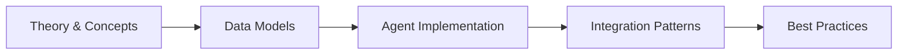

# CSS Fundamentals

## Learning Objectives


<!-- Image Gallery -->
<section class="lesson-visuals" aria-label="Visual learning resources">
  <header><span>VISUAL LEARNING</span><h2>See it. Review it. Remember it.</h2></header>
  <a class="lesson-visual-card" href="../../assets/images/lessons/laravel/css-basics/handwritten-notes.png" target="_blank" rel="noopener">
    
    <span><strong>Handwritten notes</strong>Condensed notes for deliberate review.</span>
  </a>
  <a class="lesson-visual-card" href="../../assets/images/lessons/laravel/css-basics/sticky-notes.png" target="_blank" rel="noopener">
    
    <span><strong>Sticky-note revision</strong>Fast recall prompts for revision.</span>
  </a>
  <a class="lesson-visual-card" href="../../assets/images/lessons/laravel/css-basics/visual-explanation.png" target="_blank" rel="noopener">
    
    <span><strong>Visual concept guide</strong>A connected explanation of the key ideas.</span>
  </a>
</section>
<!-- End Image Gallery -->

## Chapter at a Glance

| Aspect | Details |
|--------|---------|
| **Scope** | CSS fundamentals: selectors, box model, layout, responsive design, animations, Tailwind CSS, Laravel Vite integration |
| **Key Concepts** | Selectors & specificity, box model, Flexbox, Grid, responsive design, custom properties, animations, Tailwind CSS |
| **Learning Approach** | Theory, code examples, Laravel integration patterns |
| **Skills Required** | Basic HTML knowledge |

## Chapter Roadmap



## Chapter at a Glance

| Aspect | Details |
|--------|---------|
| **Scope** | CSS fundamentals: selectors, box model, layout, responsive design, animations, Tailwind CSS, Laravel Vite integration |
| **Key Concepts** | Selectors & specificity, box model, Flexbox, Grid, responsive design, custom properties, animations, Tailwind CSS |
| **Learning Approach** | Theory, code examples, Laravel integration patterns |
| **Skills Required** | Basic HTML knowledge |

## Chapter Roadmap


## Chapter at a Glance

| Aspect | Details |
|--------|---------|
| **Scope** | CSS fundamentals: selectors, box model, layout, responsive design, animations, Tailwind CSS, Laravel Vite integration |
| **Key Concepts** | Selectors & specificity, box model, Flexbox, Grid, responsive design, custom properties, animations, Tailwind CSS |
| **Learning Approach** | Theory, code examples, Laravel integration patterns |
| **Skills Required** | Basic HTML knowledge |

## Chapter Roadmap


## Chapter at a Glance

| Aspect | Details |
|--------|---------|
| **Scope** | CSS fundamentals: selectors, box model, layout, responsive design, animations, Tailwind CSS, Laravel Vite integration |
| **Key Concepts** | Selectors & specificity, box model, Flexbox, Grid, responsive design, custom properties, animations, Tailwind CSS |
| **Learning Approach** | Theory, code examples, Laravel integration patterns |
| **Skills Required** | Basic HTML knowledge |

## Chapter Roadmap


By the end of this chapter, you will be able to:

- Write valid CSS rules using element, class, ID, attribute, combinator, pseudo-class, and pseudo-element selectors
- Calculate selector specificity and predict which rule wins in a cascade conflict
- Explain and control the CSS box model including content-box vs border-box
- Use display and positioning properties to control layout flow
- Style web typography using font properties, web fonts, and Google Fonts
- Build flexible layouts with Flexbox and CSS Grid
- Create responsive designs using media queries, relative units, and responsive images
- Define and use CSS custom properties (variables) with fallbacks and scope
- Implement CSS transitions and keyframe animations
- Apply utility-first CSS with Tailwind CSS in a Laravel + Vite project
- Configure Vite, PostCSS, and Tailwind for a Laravel frontend build pipeline

## CSS Syntax and Selectors

Every CSS rule has two fundamental parts: a **selector** and a **declaration block**.

```css
selector {
  property: value;
  property: value;
}
```

The selector targets HTML elements; the declaration block sets visual properties.

### Element Selectors


```html
<!DOCTYPE html>
<html lang="en">
<head>
  <meta charset="UTF-8">
  <title>Element Selectors</title>
  <style>
    p {
      color: #334155;
      font-size: 1.125rem;
      line-height: 1.7;
    }
    h1 {
      color: #0f172a;
      font-size: 2.5rem;
      font-weight: 700;
      border-bottom: 3px solid #3b82f6;
      padding-bottom: 0.5rem;
    }
    a {
      color: #2563eb;
      text-decoration: underline;
    }
  </style>
</head>
<body>
  <h1>Element Selectors in Action</h1>
  <p>This paragraph is styled by an element selector.</p>
  <p>Every paragraph on the page receives the same rules.</p>
</body>
</html>
```

### Class Selectors


Class selectors target elements by their `class` attribute. A class can be reused on any number of elements.

```html
<!DOCTYPE html>
<html lang="en">
<head>
  <meta charset="UTF-8">
  <title>Class Selectors</title>
  <style>
    .card {
      background: #ffffff;
      border: 1px solid #e2e8f0;
      border-radius: 0.75rem;
      padding: 1.5rem;
      box-shadow: 0 1px 3px rgba(0, 0, 0, 0.08);
      margin-bottom: 1rem;
    }
    .card-title {
      font-size: 1.25rem;
      font-weight: 600;
      color: #0f172a;
      margin: 0 0 0.5rem 0;
    }
    .card-body {
      color: #475569;
      line-height: 1.6;
    }
    .highlight {
      background-color: #fef9c3;
      padding: 0.125rem 0.375rem;
      border-radius: 0.25rem;
    }
    .text-center {
      text-align: center;
    }
  </style>
</head>
<body>
  <div class="card">
    <h2 class="card-title">First Card</h2>
    <p class="card-body">Classes let you reuse styles across elements.</p>
  </div>
  <div class="card text-center">
    <h2 class="card-title">Centered Card</h2>
    <p class="card-body">Multiple classes: class="card text-center".</p>
  </div>
</body>
</html>
```

### ID Selectors


IDs are unique per page. Use them sparingly.

```html
<!DOCTYPE html>
<html lang="en">
<head>
  <meta charset="UTF-8">
  <title>ID Selectors</title>
  <style>
    #main-header {
      background: linear-gradient(135deg, #1e40af, #3b82f6);
      color: #ffffff;
      padding: 3rem 2rem;
      border-radius: 0.5rem;
      text-align: center;
    }
    #main-header h1 {
      font-size: 2.75rem;
      margin: 0 0 0.5rem 0;
    }
    #sidebar {
      width: 280px;
      background: #f8fafc;
      border: 1px solid #e2e8f0;
      padding: 1.5rem;
      border-radius: 0.5rem;
    }
    #sidebar h3 {
      font-size: 1.125rem;
      color: #0f172a;
      margin-top: 0;
    }
  </style>
</head>
<body>
  <header id="main-header">
    <h1>Welcome to the Textbook</h1>
    <p>Laravel 13 &mdash; CSS Fundamentals Chapter</p>
  </header>
  <aside id="sidebar">
    <h3>In This Chapter</h3>
    <ul>
      <li><a href="#">Selectors</a></li>
      <li><a href="#">Box Model</a></li>
    </ul>
  </aside>
</body>
</html>
```

### Attribute Selectors


Attribute selectors match elements based on the presence or value of attributes.

```html
<!DOCTYPE html>
<html lang="en">
<head>
  <meta charset="UTF-8">
  <title>Attribute Selectors</title>
  <style>
    [title] { cursor: help; border-bottom: 1px dashed #94a3b8; }
    a[target="_blank"]::after { content: " \2197"; font-size: 0.75em; }
    a[href^="https"] { color: #059669; }
    a[href$=".pdf"] { color: #dc2626; }
    a[href*="laravel"] { font-weight: 600; }
    input[type="email"] {
      border: 2px solid #cbd5e1;
      border-radius: 0.375rem;
      padding: 0.5rem 0.75rem;
      font-size: 1rem;
      width: 100%;
    }
    input[type="email"]:focus {
      border-color: #3b82f6;
      outline: none;
      box-shadow: 0 0 0 3px rgba(59, 130, 246, 0.25);
    }
    [data-status="active"] {
      background-color: #dcfce7;
      color: #166534;
      padding: 0.25rem 0.75rem;
      border-radius: 9999px;
      font-size: 0.875rem;
    }
  </style>
</head>
<body>
  <p title="Additional information">Hover for tooltip.</p>
  <p>
    <a href="https://laravel.com" target="_blank">Laravel Docs</a> |
    <a href="report.pdf">Download Report</a>
  </p>
  <p>
    <label for="email">Email:</label>
    <input type="email" id="email" placeholder="user@example.com">
  </p>
  <p>
    <span data-status="active">Active</span>
  </p>
</body>
</html>
```

| Pattern | Matches |
|---------|---------|
| `[attr]` | Element has the attribute |
| `[attr="val"]` | Exact value match |
| `[attr^="val"]` | Value starts with val |
| `[attr$="val"]` | Value ends with val |
| `[attr*="val"]` | Value contains val anywhere |
| `[attr~="val"]` | Whole word match in space-separated list |
| `[attr|="val"]` | Value is val or starts with val- |

### Combinator Selectors


Combinators describe relationships between elements.

```html
<!DOCTYPE html>
<html lang="en">
<head>
  <meta charset="UTF-8">
  <title>Combinator Selectors</title>
  <style>
    /* Descendant combinator: any em inside a p */
    p em { color: #7c3aed; font-style: italic; }
    /* Child combinator: direct children only */
    nav > ul {
      display: flex; gap: 1.5rem; list-style: none;
      background: #1e293b; padding: 1rem 1.5rem; border-radius: 0.5rem;
    }
    nav > ul > li > a { color: #e2e8f0; text-decoration: none; }
    nav > ul > li > a:hover { color: #60a5fa; }
    /* Adjacent sibling: h2 immediately after h1 */
    h1 + h2 { color: #64748b; font-size: 1.25rem; font-weight: 400; }
    /* General sibling: any p after h2 */
    h2 ~ p { border-left: 3px solid #3b82f6; padding-left: 1rem; }
  </style>
</head>
<body>
  <p>This has <em>emphasized text</em> via descendant combinator.</p>
  <nav>
    <ul>
      <li><a href="#">Home</a></li>
      <li><a href="#">About</a></li>
    </ul>
  </nav>
  <h1>Main Title</h1>
  <h2>Subtitle after h1</h2>
  <p>This gets the left border.</p>
</body>
</html>
```

### Pseudo-class Selectors


Pseudo-classes represent a **state** or **position** of an element.

```html
<!DOCTYPE html>
<html lang="en">
<head>
  <meta charset="UTF-8">
  <title>Pseudo-classes</title>
  <style>
    .btn {
      display: inline-block; padding: 0.75rem 1.5rem;
      background: #3b82f6; color: #fff; border: none;
      border-radius: 0.375rem; cursor: pointer;
      transition: background 0.2s, transform 0.15s;
    }
    .btn:hover { background: #2563eb; }
    .btn:active { transform: scale(0.97); }
    .btn:focus-visible { outline: 2px solid #60a5fa; outline-offset: 2px; }

    li:first-child { font-weight: 700; }
    li:last-child { border-bottom: none; }
    li { padding: 0.5rem 0; border-bottom: 1px solid #e2e8f0; }
    li:nth-child(even) { background: #f8fafc; }

    input:required { border-left: 3px solid #ef4444; }
    input:disabled { opacity: 0.5; cursor: not-allowed; }
    input:checked + label { color: #059669; font-weight: 600; }

    .menu-item:not(:last-child)::after { content: " | "; color: #cbd5e1; }
  </style>
</head>
<body>
  <button class="btn">Hover Me</button>
  <ul>
    <li>First &mdash; bold</li>
    <li>Second &mdash; even</li>
    <li>Third</li>
    <li>Last &mdash; no border</li>
  </ul>
  <form>
    <p><input type="text" required placeholder="Required"></p>
    <p><input type="checkbox" id="agree" checked> <label for="agree">I agree</label></p>
  </form>
</body>
</html>
```

### Pseudo-element Selectors


Pseudo-elements style a **part** of an element. They use double colons (`::`).

```html
<!DOCTYPE html>
<html lang="en">
<head>
  <meta charset="UTF-8">
  <title>Pseudo-elements</title>
  <style>
    .tooltip { position: relative; cursor: pointer; color: #2563eb; }
    .tooltip::after {
      content: attr(data-tip); position: absolute; bottom: 100%;
      left: 50%; transform: translateX(-50%);
      background: #1e293b; color: #f8fafc;
      padding: 0.375rem 0.75rem; border-radius: 0.25rem;
      font-size: 0.75rem; white-space: nowrap;
      opacity: 0; pointer-events: none;
      transition: opacity 0.2s;
    }
    .tooltip:hover::after { opacity: 1; }

    .drop-cap::first-letter {
      font-size: 3.5rem; font-weight: 700; color: #3b82f6;
      float: left; line-height: 1; margin-right: 0.5rem;
    }

    ::selection { background-color: #bfdbfe; color: #1e3a5f; }
    input::placeholder { color: #94a3b8; font-style: italic; }
    li::marker { color: #3b82f6; }
  </style>
</head>
<body>
  <p>Hover <span class="tooltip" data-tip="Tooltip text">this</span>.</p>
  <p class="drop-cap">This paragraph has a drop cap.</p>
  <p><input type="text" placeholder="Search..."></p>
</body>
</html>
```

### Specificity Calculation


When multiple CSS rules target the same element, specificity determines which applies. Specificity is a four-part value: **(inline, IDs, classes, elements)**.

```html
<!DOCTYPE html>
<html lang="en">
<head>
  <meta charset="UTF-8">
  <title>Specificity</title>
  <style>
    p { color: #64748b; font-size: 1rem; }
    .text { color: #7c3aed; }
    #unique-text { color: #dc2626; font-weight: 700; }
    div.card.highlight { border: 2px solid #f59e0b; }
    div.card { border: 1px solid #e2e8f0; padding: 1rem; }
    #container .card.featured { border-color: #3b82f6; }
  </style>
</head>
<body>
  <p>Plain paragraph.</p>
  <p class="text">Class overrides element.</p>
  <p id="unique-text" class="text">ID overrides class.</p>
  <p id="unique-text" class="text" style="color: #059669;">Inline wins all.</p>
  <div class="card highlight">Two classes.</div>
  <div id="container">
    <div class="card featured">ID + classes wins.</div>
  </div>
</body>
</html>
```

| Selector Pattern | Specificity |
|----------------|-------------|
| `*` | 0,0,0,0 |
| `p` | 0,0,0,1 |
| `.class` | 0,0,1,0 |
| `[attr]` | 0,0,1,0 |
| `:hover` | 0,0,1,0 |
| `#id` | 0,1,0,0 |
| `style=""` | 1,0,0,0 |
| `!important` | Wins all (avoid) |

### Cascade and Inheritance


The cascade resolves conflicts by: (1) origin and importance, (2) specificity, (3) order. **Inheritance** passes certain property values from parent to child. Font properties inherit; layout properties generally do not.

```html
<!DOCTYPE html>
<html lang="en">
<head>
  <meta charset="UTF-8">
  <title>Cascade and Inheritance</title>
  <style>
    .card-group {
      font-family: "Segoe UI", system-ui, sans-serif;
      color: #1e293b; font-size: 1rem; line-height: 1.6;
      border: 2px solid #e2e8f0; padding: 1.5rem; border-radius: 0.5rem;
    }
    .card-group h2 { font-size: 1.5rem; }
    .explicit-inherit { color: inherit; border: inherit; }
    .explicit-initial { color: initial; }
    :where(.any) p { color: #64748b; }
  </style>
</head>
<body>
  <div class="card-group">
    <h2>Inherits font-family, color, line-height</h2>
    <p>Inherits parent properties. Border and padding do NOT inherit.</p>
    <div class="explicit-inherit">Forces color and border inheritance.</div>
    <div class="explicit-initial">Resets to initial value.</div>
  </div>
</body>
</html>
```

---

## The Box Model

Every element in CSS is rendered as a rectangular box.

```html
<!DOCTYPE html>
<html lang="en">
<head>
  <meta charset="UTF-8">
  <title>CSS Box Model</title>
  <style>
    .box-model-demo {
      width: 320px; height: 200px;
      padding: 24px; border: 4px solid #3b82f6; margin: 32px;
      background: #eff6ff; font-family: system-ui, sans-serif;
    }
    .box-model-demo h3 { margin: 0 0 0.5rem 0; color: #1e40af; }
    .box-model-demo p { margin: 0; }
  </style>
</head>
<body>
  <h2>Box Model Anatomy</h2>
  <div class="box-model-demo">
    <h3>Content Box</h3>
    <p>Content width: 320px<br>
       Padding: 24px each side<br>
       Border: 4px each side<br>
       Margin: 32px each side<br>
       Total width: 320 + 48 + 8 = 376px</p>
  </div>
</body>
</html>
```

### Box Sizing


The `box-sizing` property changes how `width` and `height` are calculated.

```html
<!DOCTYPE html>
<html lang="en">
<head>
  <meta charset="UTF-8">
  <title>Box Sizing</title>
  <style>
    .content-box-example {
      width: 300px; height: 150px; padding: 24px; border: 6px solid #3b82f6;
      background: #eff6ff; box-sizing: content-box;
    }
    .border-box-example {
      width: 300px; height: 150px; padding: 24px; border: 6px solid #059669;
      background: #ecfdf5; box-sizing: border-box;
    }
  </style>
</head>
<body>
  <h2>content-box vs border-box</h2>
  <div class="content-box-example">
    content-box: rendered 360px (300 + 48 + 12)
  </div>
  <div class="border-box-example">
    border-box: rendered 300px (content shrinks to 240px)
  </div>
</body>
</html>
```

The universal reset:

```css
*, *::before, *::after {
  box-sizing: border-box;
}
```

### Margin, Padding, and Border Details


```html
<!DOCTYPE html>
<html lang="en">
<head>
  <meta charset="UTF-8">
  <title>Margin Padding Details</title>
  <style>
    *, *::before, *::after { box-sizing: border-box; }
    .margin-collapse-parent { background: #f1f5f9; padding: 1px; }
    .margin-box-a { margin-bottom: 32px; }
    .margin-box-b { margin-top: 24px; }
    .note { background: #fef9c3; border-left: 4px solid #f59e0b; padding: 0.75rem; }
    .outline-demo {
      padding: 1rem; margin: 0.5rem 0;
      border: 2px solid #3b82f6;
      outline: 3px dashed #f59e0b; outline-offset: 4px;
    }
  </style>
</head>
<body>
  <p><strong>Margin collapsing:</strong> vertical margins collapse to the larger value.</p>
  <div class="margin-collapse-parent">
    <div class="margin-box-a">margin-bottom: 32px</div>
    <div class="margin-box-b">margin-top: 24px</div>
  </div>
  <p>The gap is 32px (not 56px) &mdash; margins collapse vertically.</p>

  <p><strong>Outline</strong> does not affect layout:</p>
  <div class="outline-demo">
    Border (solid) + Outline (dashed) with offset.
  </div>
</body>
</html>
```

**Key box model rules:**
- Margins collapse vertically (not horizontally)
- Padding sits inside the border and respects background color
- Border sits between padding and margin
- Outline is outside the border and does NOT affect layout

---

## Display and Positioning

The `display` property controls how an element participates in flow layout.

### Display Values


```html
<!DOCTYPE html>
<html lang="en">
<head>
  <meta charset="UTF-8">
  <title>Display Values</title>
  <style>
    *, *::before, *::after { box-sizing: border-box; }
    .block-example { display: block; background: #eff6ff; padding: 0.5rem; }
    .inline-example { display: inline; background: #fef9c3; padding: 0.25rem; }
    .ib-example {
      display: inline-block; background: #ecfdf5;
      padding: 0.75rem; width: 140px; height: 80px;
    }
    .hidden-demo { padding: 0.75rem; background: #f1f5f9; }
    .display-none { display: none; }
    .visibility-hidden { visibility: hidden; }
  </style>
</head>
<body>
  <div class="block-example">Block &mdash; full width, new line.</div>
  <div class="block-example">Another block.</div>

  <p>Inline: <span class="inline-example">one</span>
  <span class="inline-example">two</span> &mdash; flows in text.</p>

  <p>Inline-block: respects width/height but sits inline:</p>
  <span class="ib-example">Box 1</span>
  <span class="ib-example">Box 2</span>

  <div class="hidden-demo">
    <span>Visible</span>
    <span class="display-none">Gone (no space)</span>
    <span class="visibility-hidden">Hidden (space remains)</span>
    <span>End</span>
  </div>
</body>
</html>
```

### Position Values


```html
<!DOCTYPE html>
<html lang="en">
<head>
  <meta charset="UTF-8">
  <title>CSS Positioning</title>
  <style>
    *, *::before, *::after { box-sizing: border-box; }
    .pos-static { position: static; background: #e2e8f0; padding: 0.75rem; }
    .pos-relative { position: relative; top: 20px; left: 20px; background: #eff6ff; padding: 0.75rem; }
    .pos-absolute-parent { position: relative; background: #f1f5f9; padding: 2rem; min-height: 100px; }
    .pos-absolute { position: absolute; top: 0; right: 0; background: #fef2f2; padding: 0.75rem; }
    .sticky-header { position: sticky; top: 0; background: #3b82f6; color: #fff; padding: 0.75rem; z-index: 50; }
    .z-demo { position: relative; height: 120px; }
    .z-box { position: absolute; width: 200px; height: 80px; padding: 0.5rem; color: #fff; display: flex; align-items: center; justify-content: center; }
    .z-box-1 { background: #3b82f6; top: 0; left: 40px; z-index: 1; }
    .z-box-2 { background: #059669; top: 20px; left: 80px; z-index: 2; }
    .z-box-3 { background: #dc2626; top: 40px; left: 120px; z-index: 3; }
    .overflow-box { width: 160px; height: 80px; background: #f1f5f9; border: 1px solid #cbd5e1; padding: 0.5rem; }
    .ov-visible { overflow: visible; }
    .ov-hidden { overflow: hidden; }
    .ov-scroll { overflow: scroll; }
    .ov-auto { overflow: auto; }
  </style>
</head>
<body>
  <div class="pos-static">Static (default).</div>
  <div class="pos-relative">Relative &mdash; offset 20px down and right.</div>
  <div class="pos-absolute-parent">
    Parent (relative)
    <div class="pos-absolute">Absolute &mdash; top-right of parent.</div>
  </div>

  <h3>Z-Index</h3>
  <div class="z-demo">
    <div class="z-box z-box-1">z-index: 1</div>
    <div class="z-box z-box-2">z-index: 2</div>
    <div class="z-box z-box-3">z-index: 3</div>
  </div>

  <h3>Overflow</h3>
  <div class="ov-box ov-visible">visible &mdash; content overflows visibly.</div>
  <div class="ov-box ov-hidden">hidden &mdash; content clipped.</div>
</body>
</html>
```

| Value | Behavior |
|-------|----------|
| `static` | Normal flow. Offset properties have no effect. |
| `relative` | Offset from normal position. Original space preserved. |
| `absolute` | Removed from flow. Relative to nearest positioned ancestor. |
| `fixed` | Removed from flow. Relative to viewport. Never scrolls. |
| `sticky` | Toggles relative/fixed based on scroll position. |

---

## Typography

CSS provides extensive control over font selection, sizing, spacing, and alignment.

### Font Properties


```html
<!DOCTYPE html>
<html lang="en">
<head>
  <meta charset="UTF-8">
  <title>CSS Typography</title>
  <style>
    body { font-family: system-ui, sans-serif; line-height: 1.6; max-width: 720px; margin: 0 auto; padding: 1rem; }
    .font-serif { font-family: Georgia, "Times New Roman", serif; }
    .font-mono { font-family: "Courier New", monospace; }
    .text-xs { font-size: 0.75rem; }
    .text-lg { font-size: 1.125rem; }
    .fw-light { font-weight: 300; }
    .fw-bold { font-weight: 700; }
    .fw-black { font-weight: 900; }
    .font-italic { font-style: italic; }
    .tracking-wide { letter-spacing: 0.05em; }
    .leading-tight { line-height: 1.25; }
    .leading-relaxed { line-height: 1.75; }
    .text-center { text-align: center; }
    .underline { text-decoration: underline; }
    .line-through { text-decoration: line-through; }
    .uppercase { text-transform: uppercase; }
    .truncate { white-space: nowrap; overflow: hidden; text-overflow: ellipsis; }
    .truncate-container { width: 250px; background: #f1f5f9; padding: 0.75rem; }
  </style>
</head>
<body>
  <h1>Typography</h1>
  <p class="font-serif">Serif font for long-form reading.</p>
  <p class="font-mono">Monospace for code.</p>
  <p><span class="fw-light">Light</span> <span class="fw-bold">Bold</span> <span class="fw-black">Black</span></p>
  <p class="text-xs">Small text (0.75rem)</p>
  <p class="text-lg">Large text (1.125rem)</p>
  <p class="font-italic">Italic text</p>
  <p class="tracking-wide">Wide letter spacing</p>
  <p class="uppercase">Uppercase text</p>
  <div class="truncate-container truncate">Long text truncated with ellipsis at the end of the line.</div>
</body>
</html>
```

### Web Fonts with @font-face


```html
<!DOCTYPE html>
<html lang="en">
<head>
  <meta charset="UTF-8">
  <title>@font-face</title>
  <style>
    @font-face {
      font-family: "Inter";
      src: url("/fonts/Inter-Regular.woff2") format("woff2");
      font-weight: 400;
      font-style: normal;
      font-display: swap;
    }
    body { font-family: "Inter", system-ui, sans-serif; }
  </style>
</head>
<body>
  <h1>Self-Hosted Web Font</h1>
  <p>Using Inter font loaded via @font-face with font-display: swap.</p>
</body>
</html>
```

### Google Fonts


```html
<!DOCTYPE html>
<html lang="en">
<head>
  <meta charset="UTF-8">
  <link rel="preconnect" href="https://fonts.googleapis.com">
  <link rel="preconnect" href="https://fonts.gstatic.com" crossorigin>
  <link href="https://fonts.googleapis.com/css2?family=Inter:wght@400;700&display=swap" rel="stylesheet">
  <style>
    body { font-family: "Inter", system-ui, sans-serif; }
  </style>
</head>
<body>
  <h1>Google Fonts</h1>
  <p>Always include <code>display=swap</code> and <code>preconnect</code> hints.</p>
</body>
</html>
```

---

## Flexbox

Flexbox is a one-dimensional layout model.

```html
<!DOCTYPE html>
<html lang="en">
<head>
  <meta charset="UTF-8">
  <title>Flexbox</title>
  <style>
    .flex-container { display: flex; background: #f1f5f9; padding: 1rem; gap: 0.75rem; }
    .flex-item { background: #3b82f6; color: #fff; padding: 0.75rem; border-radius: 0.375rem; }
    .flex-item:nth-child(2) { background: #059669; }
    .flex-item:nth-child(3) { background: #dc2626; }

    .jc-center { justify-content: center; }
    .jc-between { justify-content: space-between; }
    .jc-evenly { justify-content: space-evenly; }
    .items-center { align-items: center; }
    .flex-wrap { flex-wrap: wrap; }
    .flex-column { flex-direction: column; }

    .grow-demo .flex-item { flex: 1; }
    .grow-2 { flex: 2; }

    .order-demo .flex-item:nth-child(1) { order: 2; }
    .order-demo .flex-item:nth-child(2) { order: 1; }
    .order-demo .flex-item:nth-child(3) { order: 3; }

    .demo-box { height: 100px; }
    .nav { display: flex; justify-content: space-between; align-items: center; background: #1e293b; color: #fff; padding: 0.75rem 1.5rem; border-radius: 0.5rem; }
    .nav-links { display: flex; gap: 1.25rem; list-style: none; }
    .nav-links a { color: #e2e8f0; text-decoration: none; }
  </style>
</head>
<body>
  <h2>Flex Direction: Row (default)</h2>
  <div class="flex-container"><div class="flex-item">1</div><div class="flex-item">2</div><div class="flex-item">3</div></div>

  <h2>flex-direction: column</h2>
  <div class="flex-container flex-column"><div class="flex-item">1</div><div class="flex-item">2</div><div class="flex-item">3</div></div>

  <h2>justify-content: center</h2>
  <div class="flex-container jc-center"><div class="flex-item">1</div><div class="flex-item">2</div><div class="flex-item">3</div></div>

  <h2>justify-content: space-between</h2>
  <div class="flex-container jc-between"><div class="flex-item">1</div><div class="flex-item">2</div><div class="flex-item">3</div></div>

  <h2>align-items: center</h2>
  <div class="flex-container demo-box items-center"><div class="flex-item">1</div><div class="flex-item">2</div><div class="flex-item">3</div></div>

  <h2>flex-grow</h2>
  <div class="flex-container grow-demo"><div class="flex-item">1</div><div class="flex-item grow-2">flex: 2</div><div class="flex-item">1</div></div>

  <h2>order</h2>
  <div class="flex-container order-demo"><div class="flex-item">A (order 2)</div><div class="flex-item">B (order 1)</div><div class="flex-item">C (order 3)</div></div>

  <h2>Navbar Layout</h2>
  <nav class="nav">
    <strong>Logo</strong>
    <ul class="nav-links">
      <li><a href="#">Home</a></li>
      <li><a href="#">About</a></li>
    </ul>
  </nav>
</body>
</html>
```

Flex shorthand:

```css
flex: 1;        /* flex: 1 1 0% */
flex: auto;     /* flex: 1 1 auto */
flex: none;     /* flex: 0 0 auto */
flex: 0;        /* flex: 0 0 0% */
```

---

## CSS Grid

CSS Grid is a two-dimensional layout system.

```html
<!DOCTYPE html>
<html lang="en">
<head>
  <meta charset="UTF-8">
  <title>CSS Grid</title>
  <style>
    .grid { display: grid; background: #f1f5f9; padding: 1rem; gap: 0.75rem; margin-bottom: 1rem; }
    .item { background: #3b82f6; color: #fff; padding: 0.75rem; border-radius: 0.375rem; text-align: center; }
    .item:nth-child(2) { background: #059669; }
    .item:nth-child(3) { background: #dc2626; }

    .cols-fr { grid-template-columns: 1fr 2fr 1fr; }
    .cols-repeat { grid-template-columns: repeat(3, 1fr); }
    .cols-auto { grid-template-columns: repeat(auto-fill, minmax(150px, 1fr)); }
    .cols-rows { grid-template-columns: repeat(3, 1fr); grid-template-rows: 80px 120px; }

    .layout {
      grid-template-columns: 1fr 3fr;
      grid-template-areas:
        "header header"
        "sidebar content"
        "footer footer";
    }
    .layout .header { grid-area: header; background: #1e293b; color: #fff; padding: 1rem; }
    .layout .sidebar { grid-area: sidebar; background: #f8fafc; padding: 1rem; }
    .layout .content { grid-area: content; background: #fff; padding: 1rem; }
    .layout .footer { grid-area: footer; background: #1e293b; color: #fff; padding: 1rem; }

    .placement { grid-template-columns: repeat(4, 1fr); grid-template-rows: repeat(3, 60px); }
    .featured { grid-column: 1 / 3; grid-row: 1 / 3; background: #7c3aed; }
    .wide { grid-column: 3 / 5; }
    .full { grid-column: 1 / -1; }
  </style>
</head>
<body>
  <h2>1fr / 2fr / 1fr</h2>
  <div class="grid cols-fr"><div class="item">1fr</div><div class="item">2fr</div><div class="item">1fr</div></div>

  <h2>repeat(3, 1fr)</h2>
  <div class="grid cols-repeat"><div class="item">1</div><div class="item">2</div><div class="item">3</div></div>

  <h2>auto-fill + minmax</h2>
  <div class="grid cols-auto"><div class="item">1</div><div class="item">2</div><div class="item">3</div><div class="item">4</div><div class="item">5</div><div class="item">6</div></div>

  <h2>Named Areas</h2>
  <div class="grid layout" style="border: none;">
    <div class="header">Header</div>
    <div class="sidebar">Sidebar</div>
    <div class="content">Main Content</div>
    <div class="footer">Footer</div>
  </div>

  <h2>Item Placement</h2>
  <div class="grid placement">
    <div class="item">1</div>
    <div class="item">2</div>
    <div class="item item featured">Featured</div>
    <div class="item wide">Wide</div>
    <div class="item full">Full Width</div>
    <div class="item">5</div>
  </div>
</body>
</html>
```

Grid line syntax:

```css
grid-column: 1 / 3;      /* Lines 1 to 3 */
grid-column: 1 / -1;     /* All columns */
grid-column: span 2;     /* Span 2 tracks */
grid-row: 1 / 4;         /* Lines 1 to 4 */
grid-area: 1 / 1 / 3 / 3; /* row-start / col-start / row-end / col-end */
```

---

## Responsive Design

Responsive design ensures interfaces work across all screen sizes.

### Media Queries


```html
<!DOCTYPE html>
<html lang="en">
<head>
  <meta charset="UTF-8">
  <meta name="viewport" content="width=device-width, initial-scale=1.0">
  <title>Media Queries</title>
  <style>
    .grid { display: grid; gap: 1rem; }
    .card { background: #fff; border: 1px solid #e2e8f0; border-radius: 0.5rem; padding: 1.25rem; }
    .nav { display: flex; flex-direction: column; gap: 0.5rem; background: #1e293b; padding: 1rem; }
    .nav a { color: #e2e8f0; text-decoration: none; }

    @media (min-width: 640px) { .grid { grid-template-columns: repeat(2, 1fr); } }
    @media (min-width: 1024px) { .grid { grid-template-columns: repeat(3, 1fr); } }
    @media (min-width: 768px) { .nav { flex-direction: row; } }
    @media (prefers-reduced-motion: reduce) { *, *::before, *::after { animation-duration: 0.01ms !important; transition-duration: 0.01ms !important; } }
    @media (prefers-color-scheme: dark) { body { background: #0f172a; color: #e2e8f0; } .card { background: #1e293b; border-color: #334155; } }
  </style>
</head>
<body>
  <h1>Responsive Design</h1>
  <nav class="nav"><a href="#">Home</a><a href="#">About</a><a href="#">Contact</a></nav>
  <div class="grid">
    <div class="card"><h3>Card</h3><p>Resize to see columns change.</p></div>
    <div class="card"><h3>Card</h3><p>1 &rarr; 2 &rarr; 3 columns.</p></div>
    <div class="card"><h3>Card</h3><p>Mobile-first breakpoints.</p></div>
  </div>
</body>
</html>
```

### Relative Units


| Unit | Relative To |
|------|-------------|
| `rem` | Root font-size (default 16px) |
| `em` | Element's own font-size |
| `vw` | 1% of viewport width |
| `vh` | 1% of viewport height |
| `%` | Parent element's property |
| `ch` | Width of "0" character |

```html
<!DOCTYPE html>
<html lang="en">
<head>
  <meta charset="UTF-8">
  <title>Relative Units</title>
  <style>
    body { font-family: system-ui, sans-serif; }
    .rem-child { font-size: 1rem; }
    .ch-demo { width: 30ch; background: #f1f5f9; padding: 0.75rem; }
    .fluid { font-size: clamp(1rem, 3vw, 2rem); }
  </style>
</head>
<body>
  <p>1rem = 16px <span class="rem-child">(always relative to root)</span></p>
  <div class="ch-demo">30 characters wide using ch unit.</div>
  <p class="fluid">Fluid text with clamp().</p>
</body>
</html>
```

### Responsive Images


```html
<!DOCTYPE html>
<html lang="en">
<head>
  <meta charset="UTF-8">
  <meta name="viewport" content="width=device-width, initial-scale=1.0">
  <title>Responsive Images</title>
  <style>
    img { max-width: 100%; height: auto; }
    .cover { width: 300px; height: 200px; object-fit: cover; }
    .ar-box { aspect-ratio: 16 / 9; overflow: hidden; }
  </style>
</head>
<body>
  <h2>max-width: 100%</h2>
  

  <h2>object-fit: cover</h2>
  

  <h2>srcset example</h2>
  <pre>
&lt;img
  src="fallback.jpg"
  srcset="small.jpg 400w, medium.jpg 800w, large.jpg 1200w"
  sizes="(max-width: 640px) 100vw, (max-width: 1024px) 50vw, 33vw"
  alt="Responsive"&gt;
  </pre>

  <h2>picture element (art direction)</h2>
  <pre>
&lt;picture&gt;
  &lt;source media="(max-width: 640px)" srcset="mobile.jpg"&gt;
  &lt;source media="(max-width: 1024px)" srcset="tablet.jpg"&gt;
  &lt;img src="desktop.jpg" alt="Hero"&gt;
&lt;/picture&gt;
  </pre>
</body>
</html>
```

---

## CSS Custom Properties (Variables)

Custom properties store reusable values and enable dynamic theming.

```html
<!DOCTYPE html>
<html lang="en">
<head>
  <meta charset="UTF-8">
  <title>CSS Variables</title>
  <style>
    :root {
      --color-primary: #3b82f6;
      --color-danger: #dc2626;
      --color-text: #1e293b;
      --color-bg: #ffffff;
      --color-surface: #f8fafc;
      --color-border: #e2e8f0;
      --radius-sm: 0.25rem;
      --radius-md: 0.375rem;
      --radius-lg: 0.5rem;
      --shadow-sm: 0 1px 2px rgba(0,0,0,0.05);
      --font-sans: system-ui, sans-serif;
      --spacing-2: 0.5rem;
      --spacing-4: 1rem;
    }

    body {
      font-family: var(--font-sans);
      color: var(--color-text);
      background: var(--color-bg);
    }

    .card {
      background: var(--color-surface);
      border: 1px solid var(--color-border);
      border-radius: var(--radius-lg);
      padding: var(--spacing-4);
      box-shadow: var(--shadow-sm);
    }

    .btn {
      padding: var(--spacing-2) var(--spacing-4);
      border: none; border-radius: var(--radius-md);
    }

    .btn-primary { background: var(--color-primary); color: #fff; }
    .btn-danger { background: var(--color-danger); color: #fff; }

    .fallback {
      background: var(--color-undefined, #f1f5f9);
    }

    .calc-demo {
      --base: 1rem;
      --scale: 1.5;
      font-size: calc(var(--base) * var(--scale));
    }
  </style>
</head>
<body>
  <h1>CSS Custom Properties</h1>
  <div class="card">
    <p>
      <button class="btn btn-primary">Primary</button>
      <button class="btn btn-danger">Danger</button>
    </p>
    <div class="fallback">Fallback demo</div>
    <p class="calc-demo">Size: calc(1rem * 1.5)</p>
  </div>

  <h2>Dynamic updates with JavaScript</h2>
  <pre>
// Set a variable
document.documentElement.style.setProperty('--color-primary', '#7c3aed');

// Read a variable
getComputedStyle(document.documentElement).getPropertyValue('--color-primary');

// Scoped override
element.style.setProperty('--spacing-4', '2rem');
  </pre>
</body>
</html>
```

---

## Animations and Transitions

### CSS Transitions


```html
<!DOCTYPE html>
<html lang="en">
<head>
  <meta charset="UTF-8">
  <title>CSS Transitions</title>
  <style>
    .box {
      width: 150px; height: 150px; background: #3b82f6;
      color: #fff; display: flex; align-items: center; justify-content: center;
      border-radius: 0.5rem; cursor: pointer;
      transition: background 0.3s ease, transform 0.3s ease, border-radius 0.5s ease;
    }
    .box:hover {
      background: #7c3aed; transform: scale(1.1) rotate(5deg); border-radius: 50%;
    }

    .timing { display: flex; gap: 1rem; margin: 1rem 0; }
    .timing div {
      width: 120px; height: 50px; background: #3b82f6; color: #fff;
      display: flex; align-items: center; justify-content: center;
      font-size: 0.75rem; border-radius: 0.375rem; cursor: pointer;
      transition: transform 1s;
    }
    .timing div:hover { transform: translateX(80px); }
    .ease { transition-timing-function: ease; }
    .linear { transition-timing-function: linear; }
    .ease-in { transition-timing-function: ease-in; }
    .ease-out { transition-timing-function: ease-out; }
  </style>
</head>
<body>
  <h2>Transitions</h2>
  <div class="box">Hover me</div>

  <h3>Timing Functions</h3>
  <div class="timing">
    <div class="ease">ease</div>
    <div class="linear">linear</div>
    <div class="ease-in">ease-in</div>
    <div class="ease-out">ease-out</div>
  </div>

  <pre>
transition: property duration timing-function delay;
transition: background 0.3s ease, transform 0.3s ease;
  </pre>
</body>
</html>
```

### Keyframe Animations


```html
<!DOCTYPE html>
<html lang="en">
<head>
  <meta charset="UTF-8">
  <title>Keyframe Animations</title>
  <style>
    @keyframes bounce {
      0%, 100% { transform: translateY(0); }
      50% { transform: translateY(-30px); }
    }
    @keyframes pulse {
      0%, 100% { opacity: 1; }
      50% { opacity: 0.6; transform: scale(1.05); }
    }
    @keyframes slide-in {
      from { opacity: 0; transform: translateX(-50px); }
      to { opacity: 1; transform: translateX(0); }
    }
    @keyframes spin {
      from { transform: rotate(0deg); }
      to { transform: rotate(360deg); }
    }

    .bounce { width: 100px; height: 100px; background: #3b82f6; color: #fff; display: flex; align-items: center; justify-content: center; border-radius: 0.5rem; animation: bounce 1s ease infinite; }
    .pulse { width: 100px; height: 100px; background: #059669; color: #fff; display: flex; align-items: center; justify-content: center; border-radius: 50%; animation: pulse 2s ease infinite; }
    .slide { width: 180px; height: 60px; background: #7c3aed; color: #fff; display: flex; align-items: center; justify-content: center; border-radius: 0.5rem; animation: slide-in 0.6s ease-out forwards; }
    .spinner { width: 50px; height: 50px; border: 4px solid #e2e8f0; border-top-color: #3b82f6; border-radius: 50%; animation: spin 0.8s linear infinite; }

    .loading-bar { height: 10px; background: #e2e8f0; border-radius: 999px; overflow: hidden; margin: 1rem 0; }
    .loading-fill { height: 100%; background: #3b82f6; border-radius: 999px; animation: loading 2s ease infinite; }
    @keyframes loading {
      0% { width: 0%; }
      100% { width: 100%; }
    }
  </style>
</head>
<body>
  <h2>Keyframe Animations</h2>
  <div class="bounce">Bounce</div>
  <div class="pulse">Pulse</div>
  <div class="slide">Slide In</div>
  <div class="spinner"></div>

  <h3>Loading Bar</h3>
  <div class="loading-bar"><div class="loading-fill"></div></div>

  <pre>
animation: name duration timing-function delay iteration-count direction fill-mode play-state;

/* Single */
animation: bounce 1s ease infinite;

/* Multiple */
animation: slide-in 0.6s forwards, pulse 2s infinite 0.6s;

/* Individual properties */
animation-name: bounce;
animation-duration: 1s;
animation-timing-function: ease;
animation-iteration-count: infinite;
  </pre>

  <h3>Performance Tips</h3>
  <ul>
    <li>Animate only <code>transform</code> and <code>opacity</code> for GPU compositing</li>
    <li>Avoid animating width, height, margin, padding (triggers layout)</li>
    <li>Use <code>will-change: transform, opacity</code> to hint the browser</li>
    <li>Respect <code>prefers-reduced-motion: reduce</code></li>
  </ul>
</body>
</html>
```

---

## Tailwind CSS Overview

Tailwind CSS is a utility-first framework that provides low-level utility classes for building custom designs without writing custom CSS.

### Utility-First Approach


```html
<!-- Traditional: custom CSS -->
<div class="card">
  <h2 class="card-title">Hello</h2>
</div>

<!-- Tailwind: utilities directly in HTML -->
<div class="bg-white rounded-lg shadow-md p-6">
  <h2 class="text-xl font-semibold text-gray-900">Hello</h2>
</div>
```

### Configuration


Tailwind v4 uses CSS-first configuration:

```css
/* resources/css/app.css */
@import "tailwindcss";

@theme {
  --color-primary: #3b82f6;
  --color-primary-dark: #2563eb;
  --font-family-display: "Playfair Display", serif;
}
```

Tailwind v3 uses a JavaScript config file:

```js
// tailwind.config.js
export default {
  content: [
    "./resources/**/*.blade.php",
    "./resources/**/*.js",
    "./resources/**/*.vue",
  ],
  theme: {
    extend: {
      colors: {
        primary: { 50: "#eff6ff", 500: "#3b82f6", 700: "#1d4ed8" },
      },
      fontFamily: {
        display: ["Playfair Display", "serif"],
      },
    },
  },
};
```

### Responsive Prefixes


```html
<div class="grid grid-cols-1 sm:grid-cols-2 md:grid-cols-3 lg:grid-cols-4 gap-4">
  <div class="bg-white p-4 rounded">Card</div>
  <div class="bg-white p-4 rounded">Card</div>
  <div class="bg-white p-4 rounded">Card</div>
  <div class="bg-white p-4 rounded">Card</div>
</div>
```

| Prefix | Min Width |
|--------|-----------|
| `sm:` | 640px |
| `md:` | 768px |
| `lg:` | 1024px |
| `xl:` | 1280px |
| `2xl:` | 1536px |

### Dark Mode


```html
<!-- Enable via tailwind.config.js: darkMode: "class" -->
<div class="bg-white dark:bg-gray-800 text-gray-900 dark:text-gray-100 p-6">
  <h2>Dark Mode Ready</h2>
  <p class="text-gray-600 dark:text-gray-400">This adapts automatically.</p>
</div>
```

```js
// Toggle in JavaScript
document.documentElement.classList.toggle('dark');
```

### Custom Utilities


```css
/* Tailwind v4 */
@utility text-balance {
  text-wrap: balance;
}

@utility scrollbar-hide {
  -ms-overflow-style: none;
  scrollbar-width: none;
}
```

### Integration with Laravel + Vite


```js
// vite.config.js
import { defineConfig } from 'vite';
import laravel from 'laravel-vite-plugin';
import tailwindcss from '@tailwindcss/vite';

export default defineConfig({
  plugins: [
    laravel({
      input: ['resources/css/app.css', 'resources/js/app.js'],
      refresh: true,
    }),
    tailwindcss(),
  ],
});
```

```blade
<!DOCTYPE html>
<html lang="{{ str_replace('_', '-', app()->getLocale()) }}">
<head>
  <meta charset="utf-8">
  <meta name="viewport" content="width=device-width, initial-scale=1">
  <title>@yield('title', config('app.name'))</title>
  @vite(['resources/css/app.css', 'resources/js/app.js'])
</head>
<body class="bg-gray-50 text-gray-900 antialiased">
  <div class="min-h-screen">
    @yield('content')
  </div>
</body>
</html>
```

### Commands


```bash
# Development
php artisan serve
npm run dev

# Production build
npm run build

# Vite auto-versioned assets via @vite() directive
```

---

---

## Concept Comparison
> **One-Sentence Takeaway:** Compare key CSS concepts for web styling.

| Concept | Purpose | Key Feature |
|---------|---------|-------------|
| Selectors | Target HTML elements for styling | Element, class, ID, attribute, pseudo, combinator |
| Box Model | Element dimension calculation | content-box vs border-box |
| Flexbox | One-dimensional layout | justify-content, align-items, flex-wrap |
| CSS Grid | Two-dimensional layout | grid-template-columns, grid-template-rows |
| Custom Properties | Dynamic CSS variables | --var-name with fallback and scope |
| Tailwind CSS | Utility-first framework | Atomic classes, responsive prefixes, Vite build |

---


> **Pro Tip:** Use CSS custom properties (variables) for theme values. They cascade naturally and make dark mode switching trivial.

## Quick Reference
> **One-Sentence Takeaway:** Quick reference for CSS fundamentals.

| Topic | Key Point |
|-------|-----------|
| Specificity Order | !important > inline > ID > class > element |
| Box Model | content + padding + border + margin |
| Position Values | static, relative, absolute, fixed, sticky |
| Flex Properties | display: flex, flex-direction, justify-content, align-items, gap |
| Grid Properties | grid-template-columns, grid-gap, grid-area |
| Responsive | @media queries, relative units (rem, em, vw, vh) |
| Animations | transition and @keyframes + animation |
| Tailwind | utility classes, @apply, config customization, Vite + PostCSS |

---


> **Remember:** Use ox-sizing: border-box globally. It makes sizing predictable and is the single most impactful CSS declaration.

## Cross-Application Matrix

| Concept | Application Context | Trade-Off |
|---------|--------------------|-----------|
| Specificity | Rule conflict resolution | Predictability vs flexibility |
| Layout | Page structure | Flexbox (1D) vs Grid (2D) |
| Responsive Design | Multi-device support | Breakpoints vs fluid design |
| Custom Properties | Theming | Runtime flexibility vs browser support |
| Tailwind CSS | Rapid styling | Development speed vs HTML readability |

---


> **Warning:** Avoid !important in production CSS. It breaks the cascade and makes overrides unpredictable.

## Chapter Quiz
> **One-Sentence Takeaway:** Test your CSS fundamentals knowledge.

**Q1:** What is the box model composed of?
- A) Width, height, color
- B) Content, padding, border, margin
- C) Margin, border, outline
- D) Width, margin, padding

<details><summary>Answer&lt;/summary&gt;B) Content, padding, border, margin&lt;/details&gt;

**Q2:** When should CSS Grid be preferred over Flexbox?
- A) One-dimensional layouts
- B) Two-dimensional layouts with rows and columns
- C) Small UI elements
- D) Mobile layouts only

<details><summary>Answer&lt;/summary&gt;B) Two-dimensional layouts with rows and columns&lt;/details&gt;

**Q3:** What does CSS specificity determine?
- A) Which stylesheet loads first
- B) Which CSS rule takes precedence
- C) The order of properties
- D) The file size

<details><summary>Answer&lt;/summary&gt;B) Which CSS rule takes precedence&lt;/details&gt;

**Q4:** What is Tailwind CSS's primary approach?
- A) Component-based styling
- B) Utility-first atomic classes
- C) CSS-in-JS
- D) Preprocessor-based

<details><summary>Answer&lt;/summary&gt;B) Utility-first atomic classes&lt;/details&gt;

---

## Concept Comparison
> **One-Sentence Takeaway:** Compare key CSS concepts for web styling.

| Concept | Purpose | Key Feature |
|---------|---------|-------------|
| Selectors | Target HTML elements for styling | Element, class, ID, attribute, pseudo, combinator |
| Box Model | Element dimension calculation | content-box vs border-box |
| Flexbox | One-dimensional layout | justify-content, align-items, flex-wrap |
| CSS Grid | Two-dimensional layout | grid-template-columns, grid-template-rows |
| Custom Properties | Dynamic CSS variables | --var-name with fallback and scope |
| Tailwind CSS | Utility-first framework | Atomic classes, responsive prefixes, Vite build |

---

## Quick Reference
> **One-Sentence Takeaway:** Quick reference for CSS fundamentals.

| Topic | Key Point |
|-------|-----------|
| Specificity Order | !important > inline > ID > class > element |
| Box Model | content + padding + border + margin |
| Position Values | static, relative, absolute, fixed, sticky |
| Flex Properties | display: flex, flex-direction, justify-content, align-items, gap |
| Grid Properties | grid-template-columns, grid-gap, grid-area |
| Responsive | @media queries, relative units (rem, em, vw, vh) |
| Animations | transition and @keyframes + animation |
| Tailwind | utility classes, @apply, config customization, Vite + PostCSS |

---

## Cross-Application Matrix

| Concept | Application Context | Trade-Off |
|---------|--------------------|-----------|
| Specificity | Rule conflict resolution | Predictability vs flexibility |
| Layout | Page structure | Flexbox (1D) vs Grid (2D) |
| Responsive Design | Multi-device support | Breakpoints vs fluid design |
| Custom Properties | Theming | Runtime flexibility vs browser support |
| Tailwind CSS | Rapid styling | Development speed vs HTML readability |

---

## Chapter Quiz
> **One-Sentence Takeaway:** Test your CSS fundamentals knowledge.

**Q1:** What is the box model composed of?
- A) Width, height, color
- B) Content, padding, border, margin
- C) Margin, border, outline
- D) Width, margin, padding

<details><summary>Answer&lt;/summary&gt;B) Content, padding, border, margin&lt;/details&gt;

**Q2:** When should CSS Grid be preferred over Flexbox?
- A) One-dimensional layouts
- B) Two-dimensional layouts with rows and columns
- C) Small UI elements
- D) Mobile layouts only

<details><summary>Answer&lt;/summary&gt;B) Two-dimensional layouts with rows and columns&lt;/details&gt;

**Q3:** What does CSS specificity determine?
- A) Which stylesheet loads first
- B) Which CSS rule takes precedence
- C) The order of properties
- D) The file size

<details><summary>Answer&lt;/summary&gt;B) Which CSS rule takes precedence&lt;/details&gt;

**Q4:** What is Tailwind CSS's primary approach?
- A) Component-based styling
- B) Utility-first atomic classes
- C) CSS-in-JS
- D) Preprocessor-based

<details><summary>Answer&lt;/summary&gt;B) Utility-first atomic classes&lt;/details&gt;

---

## Concept Comparison
> **One-Sentence Takeaway:** Compare key CSS concepts for web styling.

| Concept | Purpose | Key Feature |
|---------|---------|-------------|
| Selectors | Target HTML elements for styling | Element, class, ID, attribute, pseudo, combinator |
| Box Model | Element dimension calculation | content-box vs border-box |
| Flexbox | One-dimensional layout | justify-content, align-items, flex-wrap |
| CSS Grid | Two-dimensional layout | grid-template-columns, grid-template-rows |
| Custom Properties | Dynamic CSS variables | --var-name with fallback and scope |
| Tailwind CSS | Utility-first framework | Atomic classes, responsive prefixes, Vite build |

---

## Quick Reference
> **One-Sentence Takeaway:** Quick reference for CSS fundamentals.

| Topic | Key Point |
|-------|-----------|
| Specificity Order | !important > inline > ID > class > element |
| Box Model | content + padding + border + margin |
| Position Values | static, relative, absolute, fixed, sticky |
| Flex Properties | display: flex, flex-direction, justify-content, align-items, gap |
| Grid Properties | grid-template-columns, grid-gap, grid-area |
| Responsive | @media queries, relative units (rem, em, vw, vh) |
| Animations | transition and @keyframes + animation |
| Tailwind | utility classes, @apply, config customization, Vite + PostCSS |

---

## Cross-Application Matrix

| Concept | Application Context | Trade-Off |
|---------|--------------------|-----------|
| Specificity | Rule conflict resolution | Predictability vs flexibility |
| Layout | Page structure | Flexbox (1D) vs Grid (2D) |
| Responsive Design | Multi-device support | Breakpoints vs fluid design |
| Custom Properties | Theming | Runtime flexibility vs browser support |
| Tailwind CSS | Rapid styling | Development speed vs HTML readability |

---

## Chapter Quiz
> **One-Sentence Takeaway:** Test your CSS fundamentals knowledge.

**Q1:** What is the box model composed of?
- A) Width, height, color
- B) Content, padding, border, margin
- C) Margin, border, outline
- D) Width, margin, padding

<details><summary>Answer&lt;/summary&gt;B) Content, padding, border, margin&lt;/details&gt;

**Q2:** When should CSS Grid be preferred over Flexbox?
- A) One-dimensional layouts
- B) Two-dimensional layouts with rows and columns
- C) Small UI elements
- D) Mobile layouts only

<details><summary>Answer&lt;/summary&gt;B) Two-dimensional layouts with rows and columns&lt;/details&gt;

**Q3:** What does CSS specificity determine?
- A) Which stylesheet loads first
- B) Which CSS rule takes precedence
- C) The order of properties
- D) The file size

<details><summary>Answer&lt;/summary&gt;B) Which CSS rule takes precedence&lt;/details&gt;

**Q4:** What is Tailwind CSS's primary approach?
- A) Component-based styling
- B) Utility-first atomic classes
- C) CSS-in-JS
- D) Preprocessor-based

<details><summary>Answer&lt;/summary&gt;B) Utility-first atomic classes&lt;/details&gt;

---

## Concept Comparison
> **One-Sentence Takeaway:** Compare key CSS concepts for web styling.

| Concept | Purpose | Key Feature |
|---------|---------|-------------|
| Selectors | Target HTML elements for styling | Element, class, ID, attribute, pseudo, combinator |
| Box Model | Element dimension calculation | content-box vs border-box |
| Flexbox | One-dimensional layout | justify-content, align-items, flex-wrap |
| CSS Grid | Two-dimensional layout | grid-template-columns, grid-template-rows |
| Custom Properties | Dynamic CSS variables | --var-name with fallback and scope |
| Tailwind CSS | Utility-first framework | Atomic classes, responsive prefixes, Vite build |

---

## Quick Reference
> **One-Sentence Takeaway:** Quick reference for CSS fundamentals.

| Topic | Key Point |
|-------|-----------|
| Specificity Order | !important > inline > ID > class > element |
| Box Model | content + padding + border + margin |
| Position Values | static, relative, absolute, fixed, sticky |
| Flex Properties | display: flex, flex-direction, justify-content, align-items, gap |
| Grid Properties | grid-template-columns, grid-gap, grid-area |
| Responsive | @media queries, relative units (rem, em, vw, vh) |
| Animations | transition and @keyframes + animation |
| Tailwind | utility classes, @apply, config customization, Vite + PostCSS |

---

## Cross-Application Matrix

| Concept | Application Context | Trade-Off |
|---------|--------------------|-----------|
| Specificity | Rule conflict resolution | Predictability vs flexibility |
| Layout | Page structure | Flexbox (1D) vs Grid (2D) |
| Responsive Design | Multi-device support | Breakpoints vs fluid design |
| Custom Properties | Theming | Runtime flexibility vs browser support |
| Tailwind CSS | Rapid styling | Development speed vs HTML readability |

---

## Chapter Quiz
> **One-Sentence Takeaway:** Test your CSS fundamentals knowledge.

**Q1:** What is the box model composed of?
- A) Width, height, color
- B) Content, padding, border, margin
- C) Margin, border, outline
- D) Width, margin, padding

<details><summary>Answer&lt;/summary&gt;B) Content, padding, border, margin&lt;/details&gt;

**Q2:** When should CSS Grid be preferred over Flexbox?
- A) One-dimensional layouts
- B) Two-dimensional layouts with rows and columns
- C) Small UI elements
- D) Mobile layouts only

<details><summary>Answer&lt;/summary&gt;B) Two-dimensional layouts with rows and columns&lt;/details&gt;

**Q3:** What does CSS specificity determine?
- A) Which stylesheet loads first
- B) Which CSS rule takes precedence
- C) The order of properties
- D) The file size

<details><summary>Answer&lt;/summary&gt;B) Which CSS rule takes precedence&lt;/details&gt;

**Q4:** What is Tailwind CSS's primary approach?
- A) Component-based styling
- B) Utility-first atomic classes
- C) CSS-in-JS
- D) Preprocessor-based

<details><summary>Answer&lt;/summary&gt;B) Utility-first atomic classes&lt;/details&gt;

## Summary

This chapter covered the complete landscape of CSS fundamentals essential for Laravel 13 development.

**Selectors** form the foundation: element, class, ID, attribute, combinator, pseudo-class, and pseudo-element selectors each serve different targeting needs. Specificity (inline > IDs > classes > elements) and the cascade determine which rule wins. Inheritance passes font-related properties from parent to child.

The **box model** governs element sizing. Every element has content, padding, border, and margin layers. The `box-sizing` property controls whether width includes padding and border. Always use `border-box` for predictable layouts.

**Display and positioning** control flow: block, inline, inline-block, and the position values (static, relative, absolute, fixed, sticky). `z-index` controls stacking; `overflow` manages clipped content.

**Typography** covers font selection, sizing with rem/em, font-weight, line-height, letter-spacing, text-decoration, and web fonts via `@font-face` and Google Fonts.

**Flexbox** provides one-dimensional layout along a main axis with properties like `justify-content` and `align-items`. Items can grow, shrink, wrap, and reorder.

**CSS Grid** delivers two-dimensional layout via `grid-template-columns/rows`, `grid-template-areas`, and `auto-fill`/`minmax` for responsive grids without media queries.

**Responsive design** uses media queries with mobile-first breakpoints, relative units (rem, em, vw, vh, %, ch), `clamp()` for fluid typography, and responsive images with `srcset`/`picture`.

**CSS custom properties** (`--name`) store reusable values with `var()` access, fallbacks, scoped overrides, and dynamic JavaScript updates.

**Animations** include transitions (property, duration, timing-function, delay) and keyframe animations. For performance, animate only `transform` and `opacity`.

**Tailwind CSS** provides utility-first classes with responsive prefixes, dark mode support, custom utilities, and deep integration with Laravel and Vite.

---

## Exercises

### Review Questions

1. What is the difference between a class selector (`.class`) and an ID selector (`#id`)?

2. Calculate the specificity of these selectors:
   - `div p.text`
   - `#sidebar .nav-link.active`
   - `style="color: red;"`
   - `ul > li:first-child a[href]`

3. Explain `content-box` versus `border-box`. Why is `border-box` recommended?

4. What is margin collapsing? When does it occur?

5. How does `display: none` differ from `visibility: hidden`?

6. How does `position: sticky` differ from `position: fixed`?

7. What is the difference between `rem` and `em` units?

8. When should you use Flexbox versus CSS Grid?

9. Write a media query for a 768px breakpoint that changes a 1-column grid to 2 columns.

10. What does `srcset` do on an `` element? How is it different from `<picture>`?

### Application Problems

11. Build a responsive card grid: 1 column on mobile, 2 on tablet (768px), 3 on desktop (1024px). Use CSS Grid with media queries.

12. Create a sticky footer using Flexbox that stays at the bottom even on short pages but moves down with long content.

13. Build a navbar: logo on the left, links in the center, login button on the right. Use Flexbox.

14. Style a form with a heading, field labels, inputs with focus states, and a submit button. Use proper typography and spacing.

15. Create a card with CSS custom properties for all theme colors. Add a dark mode by changing a parent class. Demonstrate inheritance and fallbacks.

### Challenge Problems

16. **Blog Layout**: Build a complete blog layout with a full-width hero, two-column content/sidebar area, featured posts grid (3 columns), sticky header, responsive to single column on mobile, and a dark mode toggle using CSS custom properties.

17. **CSS-Only Image Carousel**: Build a horizontal scrolling carousel with `scroll-snap`, navigation dots via pseudo-elements, responsive images with `srcset`, and smooth scroll behavior.

18. **Animated Pricing Table**: Create three pricing tiers with hover effects (scale, shadow changes), feature lists with `::before` checkmarks, animated CTA buttons, monthly/yearly toggle (CSS only), and responsive from 3 columns to stacked.

19. **Dashboard Layout**: Build a full dashboard with a collapsible sidebar, header with search, main content (stat cards, chart area, activity list), all using CSS Grid with named areas and responsive breakpoints for tablet and mobile.

20. **Component Library**: Design a documentation page using BEM naming, with a light/dark theme toggle, color palette system, buttons (primary, secondary, outline, ghost, danger) with all states, form elements with states, animated loading states (spinner, skeleton, progress bar), print styles, and `prefers-reduced-motion` support.