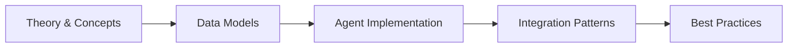

# HTML Fundamentals

HyperText Markup Language (HTML) is the foundational language of the World Wide Web. It provides the structural skeleton upon which every web page is built. Before any CSS styling is applied, before any JavaScript adds interactivity, and before any server-side framework like Laravel generates dynamic content, HTML defines what a page *is* — its headings, paragraphs, images, links, forms, and semantic regions. This chapter provides a rigorous, ground-up treatment of HTML5, the current living standard. You will learn correct document structure, semantic markup, embedded media, tabular data, form construction with validation, accessibility (a11y) best practices, search-engine optimization (SEO) fundamentals, browser APIs, and finally how all of these concepts integrate with Laravel's Blade templating engine. Every code example is a complete, self-contained HTML5 document that you can save, open in a browser, and experiment with immediately.

---

## Learning Objectives

<!-- Image Gallery -->
<section class="lesson-visuals" aria-label="Visual learning resources">
  <header><span>VISUAL LEARNING</span><h2>See it. Review it. Remember it.</h2></header>
  <a class="lesson-visual-card" href="../../assets/images/lessons/laravel/html-basics/handwritten-notes.png" target="_blank" rel="noopener">
    
    <span><strong>Handwritten notes</strong>Condensed notes for deliberate review.</span>
  </a>
  <a class="lesson-visual-card" href="../../assets/images/lessons/laravel/html-basics/sticky-notes.png" target="_blank" rel="noopener">
    
    <span><strong>Sticky-note revision</strong>Fast recall prompts for revision.</span>
  </a>
  <a class="lesson-visual-card" href="../../assets/images/lessons/laravel/html-basics/visual-explanation.png" target="_blank" rel="noopener">
    
    <span><strong>Visual concept guide</strong>A connected explanation of the key ideas.</span>
  </a>
</section>
<!-- End Image Gallery -->

## Chapter at a Glance

| Aspect | Details |
|--------|---------|
| **Scope** | HTML5 fundamentals: document structure, semantics, forms, accessibility, SEO, browser APIs, Laravel Blade integration |
| **Key Concepts** | Semantic elements, HTML forms, ARIA, SEO, multimedia, Canvas, Web Storage, Blade templates |
| **Learning Approach** | Theory, code examples, Laravel integration patterns |
| **Skills Required** | Basic web concepts |

## Chapter Roadmap



## Chapter at a Glance

| Aspect | Details |
|--------|---------|
| **Scope** | HTML5 fundamentals: document structure, semantics, forms, accessibility, SEO, browser APIs, Laravel Blade integration |
| **Key Concepts** | Semantic elements, HTML forms, ARIA, SEO, multimedia, Canvas, Web Storage, Blade templates |
| **Learning Approach** | Theory, code examples, Laravel integration patterns |
| **Skills Required** | Basic web concepts |

## Chapter Roadmap


## Chapter at a Glance

| Aspect | Details |
|--------|---------|
| **Scope** | HTML5 fundamentals: document structure, semantics, forms, accessibility, SEO, browser APIs, Laravel Blade integration |
| **Key Concepts** | Semantic elements, HTML forms, ARIA, SEO, multimedia, Canvas, Web Storage, Blade templates |
| **Learning Approach** | Theory, code examples, Laravel integration patterns |
| **Skills Required** | Basic web concepts |

## Chapter Roadmap


## Chapter at a Glance

| Aspect | Details |
|--------|---------|
| **Scope** | HTML5 fundamentals: document structure, semantics, forms, accessibility, SEO, browser APIs, Laravel Blade integration |
| **Key Concepts** | Semantic elements, HTML forms, ARIA, SEO, multimedia, Canvas, Web Storage, Blade templates |
| **Learning Approach** | Theory, code examples, Laravel integration patterns |
| **Skills Required** | Basic web concepts |

## Chapter Roadmap


By the end of this chapter you will be able to:

- Construct a valid HTML5 document with proper `DOCTYPE`, `html`, `head`, and `body` elements
- Configure essential metadata: character encoding, viewport, title, and description
- Choose and apply semantic HTML5 elements to convey content meaning, not just visual presentation
- Structure text content using headings, paragraphs, lists, quotations, and code blocks
- Create hyperlinks with absolute, relative, and fragment targets while controlling navigation behavior with `rel` attributes
- Embed images, video, and audio with fallback mechanisms and responsive resolution switching via the `picture` element
- Build complex data tables with header, body, footer sections and merged cells
- Design accessible forms covering every major input type with labels, grouping, and server-ready submission
- Implement client-side form validation using HTML5 attributes and the Constraint Validation API
- Apply ARIA roles and attributes to improve accessibility for assistive technology users
- Optimize pages for search engines and social-media previews using meta tags, Open Graph, Twitter Cards, and JSON-LD structured data
- Use browser-side APIs: Canvas, Drag-and-Drop, Web Storage, the History API, and Geolocation
- Integrate HTML forms with Laravel Blade, including CSRF protection, method spoofing, old input, error display, and model binding

---

## 1. HTML Document Structure

Every HTML document follows a mandatory outer structure that the browser uses to distinguish HTML from other file types and to prepare the rendering environment. The skeleton consists of exactly four required pieces: the `DOCTYPE` declaration, the `<html>` root element, the `<head>` container for metadata, and the `<body>` container for visible content.

### 1.1 The DOCTYPE Declaration

The `DOCTYPE` is not an HTML element but a *prolog* — an instruction that tells the browser to render the page in **standards mode** rather than quirks mode. In HTML5 the declaration is minimal:

```html
<!DOCTYPE html>
```

This single line activates the latest rendering engine in every modern browser. Omitting it triggers quirks mode, where browsers emulate the buggy layout of the 1990s, producing unpredictable results.

### 1.2 The `<html>` Element

The `<html>` element is the document's root. The `lang` attribute is **required** for accessibility and SEO; it tells screen readers which pronunciation rules to use and helps search engines serve the page to the correct language audience.

### 1.3 The `<head>` Element

The `<head>` contains metadata — data about the document that is not displayed as content. Critical children include:

- `<meta charset="utf-8">` — must be the first `<meta>` element; declares the character encoding
- `<meta name="viewport">` — controls layout on mobile viewports
- `<title>` — the only required element; sets the browser tab title and is the first line of most search-result snippets
- `<meta name="description">` — the page summary shown in search results
- `<link rel="icon">` — the favicon shown in the browser tab

### 1.4 The `<body>` Element

Everything visible to the user lives inside `<body>`: text, images, forms, media, and interactive widgets.

### Complete Minimal Document

```html
<!DOCTYPE html>
<html lang="en">
<head>
    <meta charset="UTF-8">
    <meta name="viewport" content="width=device-width, initial-scale=1.0">
    <meta name="description" content="A minimal valid HTML5 document demonstrating correct document structure.">
    <title>HTML5 Document Structure</title>
    <link rel="icon" href="data:image/svg+xml,<svg xmlns='http://www.w3.org/2000/svg' viewBox='0 0 100 100'><text y='.9em' font-size='90'>📄</text></svg>">
</head>
<body>
    <h1>Hello, HTML5</h1>
    <p>This document has a proper DOCTYPE, character encoding, viewport meta, title, description, and favicon. It is ready for production.</p>
</body>
</html>
```

### The Viewport Meta Tag in Detail

```html
<!DOCTYPE html>
<html lang="en">
<head>
    <meta charset="UTF-8">
    <meta name="viewport" content="width=device-width, initial-scale=1.0">
    <title>Viewport Behavior</title>
    <style>
        body { font-family: system-ui, sans-serif; margin: 2rem; }
        .card { background: #f0f4f8; border-radius: 8px; padding: 1rem; margin-bottom: 1rem; }
        .card code { background: #dbe4ee; padding: 0.2rem 0.4rem; border-radius: 4px; }
    </style>
</head>
<body>
    <h1>Viewport Meta Tag</h1>
    <div class="card">
        <p><code>width=device-width</code> sets the layout width to the device's physical width, eliminating horizontal scroll on mobile.</p>
    </div>
    <div class="card">
        <p><code>initial-scale=1.0</code> sets the zoom level to 1:1, preventing automatic zooming on orientation change.</p>
    </div>
    <div class="card">
        <p>Without this meta tag, mobile browsers render the page at a typical desktop width (980 px) and then shrink it, causing tiny, unreadable text.</p>
    </div>
</body>
</html>
```

---

## 2. Semantic HTML5

Semantic HTML means using elements that describe their **meaning** rather than their **appearance**. A `<div>` has no semantic value; an `<article>` explicitly says "this is a self-contained composition." Screen readers, search engines, and future developers all benefit from semantic markup.

### 2.1 Content Sectioning Elements

| Element    | Purpose                                                                 |
|------------|-------------------------------------------------------------------------|
| `<header>` | Introductory content or navigational aids for its nearest ancestor      |
| `<nav>`    | A section of navigation links                                           |
| `<main>`   | The dominant content of the document; use exactly once per page         |
| `<article>`| A self-contained composition that could be independently distributed    |
| `<section>`| A thematic grouping of content, typically with a heading                |
| `<aside>`  | Content tangentially related to the surrounding content (sidebars)      |
| `<footer>` | Footer for its nearest ancestor — author info, copyright, related links |

### 2.2 Inline Semantic Elements

| Element      | Purpose                                                      |
|--------------|--------------------------------------------------------------|
| `<figure>`   | Self-contained content like illustrations, diagrams, photos  |
| `<figcaption>`| Caption for the `<figure>` element                          |
| `<mark>`     | Highlighted text for reference or notation purposes           |
| `<time>`     | A machine-readable date or time                              |

### Complete Semantic Layout

```html
<!DOCTYPE html>
<html lang="en">
<head>
    <meta charset="UTF-8">
    <meta name="viewport" content="width=device-width, initial-scale=1.0">
    <title>Semantic HTML5 Layout</title>
    <style>
        * { margin: 0; padding: 0; box-sizing: border-box; }
        body { font-family: system-ui, sans-serif; line-height: 1.6; color: #1a1a2e; background: #f8f9fa; }
        .wrapper { max-width: 1000px; margin: 0 auto; padding: 1rem; }
        header { background: #16213e; color: #fff; padding: 2rem; border-radius: 12px 12px 0 0; }
        nav { background: #0f3460; padding: 0.75rem 2rem; }
        nav a { color: #e94560; margin-right: 1.5rem; text-decoration: none; font-weight: 600; }
        nav a:hover { text-decoration: underline; }
        .content-grid { display: grid; grid-template-columns: 2fr 1fr; gap: 1.5rem; margin: 1.5rem 0; }
        main { background: #fff; padding: 2rem; border-radius: 8px; }
        article { margin-bottom: 2rem; }
        article h2 { color: #16213e; margin-bottom: 0.5rem; }
        aside { background: #e9ecef; padding: 1.5rem; border-radius: 8px; }
        aside h3 { margin-bottom: 0.75rem; }
        figure { margin: 1.5rem 0; padding: 1rem; background: #f1f3f5; border-radius: 8px; text-align: center; }
        figcaption { margin-top: 0.5rem; font-style: italic; color: #555; }
        mark { background: #ffeaa7; padding: 0.1rem 0.3rem; border-radius: 3px; }
        time { font-weight: 600; color: #0f3460; }
        footer { background: #16213e; color: #aaa; padding: 1.5rem 2rem; border-radius: 0 0 12px 12px; text-align: center; font-size: 0.9rem; }
    </style>
</head>
<body>
    <div class="wrapper">
        <header>
            <h1>Understanding Semantic HTML5</h1>
            <p>Elements that carry meaning — not just presentation</p>
        </header>

        <nav>
            <a href="#overview">Overview</a>
            <a href="#elements">Key Elements</a>
            <a href="#examples">Examples</a>
            <a href="#resources">Resources</a>
        </nav>

        <div class="content-grid">
            <main>
                <article id="overview">
                    <h2>Why Semantics Matter</h2>
                    <p>
                        Semantic HTML is the practice of using elements that <mark>describe their purpose</mark>
                        rather than their appearance. Consider the difference between
                        <code>&lt;div class="header"&gt;</code> and <code>&lt;header&gt;</code>:
                        the latter tells the browser, screen reader, and search engine exactly what it is.
                    </p>
                    <p>
                        Published <time datetime="2026-06-11">June 11, 2026</time> by the Laravel 13 Textbook Team.
                    </p>
                </article>

                <article id="elements">
                    <h2>Key Semantic Elements</h2>
                    <p>The HTML5 specification introduced several landmark elements:</p>
                    <ul>
                        <li><code>&lt;header&gt;</code> — introductory content</li>
                        <li><code>&lt;nav&gt;</code> — navigation links</li>
                        <li><code>&lt;main&gt;</code> — primary content (one per page)</li>
                        <li><code>&lt;article&gt;</code> — self-contained composition</li>
                        <li><code>&lt;section&gt;</code> — thematic grouping</li>
                        <li><code>&lt;aside&gt;</code> — tangentially related content</li>
                        <li><code>&lt;footer&gt;</code> — closing information</li>
                    </ul>
                </article>

                <article id="examples">
                    <h2>Figure &amp; Figcaption</h2>
                    <figure>
                        
                        <figcaption>Figure 1: A typical semantic page layout with header, nav, main, aside, and footer regions.</figcaption>
                    </figure>
                    <p>
                        The <code>&lt;time&gt;</code> element makes dates and times machine-readable.
                        For example: <time datetime="2026-06-11T14:30:00Z">June 11, 2026 at 2:30 PM UTC</time>.
                    </p>
                </article>
            </main>

            <aside>
                <h3>Quick Reference</h3>
                <p><strong>Rule of thumb:</strong> If an element has a semantic equivalent, always use it over a <code>&lt;div&gt;</code> or <code>&lt;span&gt;</code>.</p>
                <ul>
                    <li>Navigation → <code>&lt;nav&gt;</code></li>
                    <li>Blog post → <code>&lt;article&gt;</code></li>
                    <li>Chapter → <code>&lt;section&gt;</code></li>
                    <li>Sidebar → <code>&lt;aside&gt;</code></li>
                </ul>
            </aside>
        </div>

        <footer>
            <p>&copy; 2026 Laravel 13 Textbook. All code examples are licensed under MIT.</p>
        </footer>
    </div>
</body>
</html>
```

---

## 3. Text Elements

HTML provides a rich vocabulary for marking up text. Choosing the correct element communicates hierarchy, emphasis, and structure to browsers, search engines, and assistive technologies.

### 3.1 Headings

Headings (`<h1>` through `<h6>`) define a six-level document hierarchy. A page should have exactly one `<h1>` — typically the page title — and headings should nest without skipping levels.

```html
<!DOCTYPE html>
<html lang="en">
<head>
    <meta charset="UTF-8">
    <meta name="viewport" content="width=device-width, initial-scale=1.0">
    <title>HTML Heading Hierarchy</title>
    <style>
        body { font-family: system-ui, sans-serif; max-width: 700px; margin: 2rem auto; padding: 0 1rem; }
        .level { margin-bottom: 1rem; padding: 0.75rem; border-left: 4px solid #0f3460; background: #f0f4f8; }
    </style>
</head>
<body>
    <h1>Laravel 13: The Full-Stack Framework</h1>
    <p>This is the single <code>&lt;h1&gt;</code> for the entire page — the top-level heading.</p>

    <div class="level">
        <h2>1. Getting Started</h2>
        <p>A second-level heading introduces a major section.</p>

        <h3>1.1 Installation</h3>
        <p>A third-level heading under "Getting Started."</p>

        <h4>1.1.1 System Requirements</h4>
        <p>A fourth-level heading provides further detail.</p>

        <h5>PHP Version</h5>
        <p>A fifth-level heading is rarely needed but available.</p>

        <h6>Extension Notes</h6>
        <p>The sixth level exists for deep technical appendices.</p>
    </div>

    <div class="level">
        <h2>2. Core Concepts</h2>
        <p>Always maintain a logical hierarchy. Never skip from <code>&lt;h2&gt;</code> to <code>&lt;h5&gt;</code>.</p>
    </div>
</body>
</html>
```

### 3.2 Paragraphs

The `<p>` element represents a paragraph — a block of text separated from adjacent blocks by spacing.

### 3.3 Lists

HTML supports three list types: unordered (`<ul>`), ordered (`<ol>`), and description (`<dl>`).

```html
<!DOCTYPE html>
<html lang="en">
<head>
    <meta charset="UTF-8">
    <meta name="viewport" content="width=device-width, initial-scale=1.0">
    <title>HTML List Types</title>
    <style>
        body { font-family: system-ui, sans-serif; max-width: 700px; margin: 2rem auto; padding: 0 1rem; line-height: 1.6; }
        section { margin-bottom: 2rem; padding: 1rem; background: #f8f9fa; border-radius: 8px; }
        h2 { color: #16213e; }
        ol, ul, dl { margin-left: 1.5rem; }
        dt { font-weight: 700; margin-top: 0.5rem; }
        dd { margin-left: 1.5rem; color: #555; }
    </style>
</head>
<body>
    <h1>HTML List Types</h1>

    <section>
        <h2>Unordered List — Grocery Items</h2>
        <ul>
            <li>Eggs</li>
            <li>Milk</li>
            <li>Bread</li>
            <li>Avocados</li>
            <li>Black beans</li>
        </ul>
    </section>

    <section>
        <h2>Ordered List — Recipe Steps</h2>
        <ol>
            <li>Heat olive oil in a pan over medium heat.</li>
            <li>Dice one onion and two cloves of garlic.</li>
            <li>Sauté the onion and garlic until translucent.</li>
            <li>Add 400 g of crushed tomatoes and simmer for 15 minutes.</li>
            <li>Season with salt, pepper, and fresh basil.</li>
        </ol>
    </section>

    <section>
        <h2>Nested List — Project Tree</h2>
        <ul>
            <li>app/
                <ul>
                    <li>Http/
                        <ul>
                            <li>Controllers/</li>
                            <li>Middleware/</li>
                            <li>Requests/</li>
                        </ul>
                    </li>
                    <li>Models/</li>
                    <li>Providers/</li>
                </ul>
            </li>
            <li>resources/
                <ul>
                    <li>views/</li>
                    <li>css/</li>
                    <li>js/</li>
                </ul>
            </li>
        </ul>
    </section>

    <section>
        <h2>Description List — Glossary</h2>
        <dl>
            <dt>HTML</dt>
            <dd>HyperText Markup Language — the standard language for creating web pages.</dd>

            <dt>CSS</dt>
            <dd>Cascading Style Sheets — a language for describing the presentation of a document.</dd>

            <dt>PHP</dt>
            <dd>A popular general-purpose scripting language especially suited to web development.</dd>
        </dl>
    </section>
</body>
</html>
```

### 3.4 Blockquotes, Preformatted Text, and Code

```html
<!DOCTYPE html>
<html lang="en">
<head>
    <meta charset="UTF-8">
    <meta name="viewport" content="width=device-width, initial-scale=1.0">
    <title>Blockquotes, Pre, and Code</title>
    <style>
        body { font-family: system-ui, sans-serif; max-width: 700px; margin: 2rem auto; padding: 0 1rem; line-height: 1.6; }
        blockquote { margin: 1.5rem 0; padding: 1rem 1.5rem; background: #f0f4f8; border-left: 5px solid #0f3460; border-radius: 0 8px 8px 0; }
        blockquote footer { margin-top: 0.5rem; font-style: italic; color: #555; }
        pre { background: #1e1e2e; color: #cdd6f4; padding: 1rem; border-radius: 8px; overflow-x: auto; font-size: 0.9rem; }
        code { background: #e9ecef; padding: 0.2rem 0.4rem; border-radius: 4px; font-size: 0.9em; }
        pre code { background: transparent; padding: 0; border-radius: 0; }
        p { margin: 1rem 0; }
    </style>
</head>
<body>
    <h1>Quotations, Code, and Preformatted Text</h1>

    <h2>Blockquote</h2>
    <blockquote cite="https://developer.mozilla.org/en-US/docs/Web/HTML/Element/blockquote">
        <p>The <strong>HTML <code>&lt;blockquote&gt;</code> Element</strong> indicates that the enclosed text is an extended quotation. Usually, this is rendered visually by indentation.</p>
        <footer>— MDN Web Docs</footer>
    </blockquote>

    <h2>Inline Code</h2>
    <p>Use the <code>&lt;code&gt;</code> element for inline code snippets like <code>echo "Hello, World!";</code> and the <code>&lt;kbd&gt;</code> element for keyboard input like <kbd>Ctrl+S</kbd>.</p>

    <h2>Preformatted Block</h2>
    <p>The <code>&lt;pre&gt;</code> element preserves whitespace and line breaks, making it ideal for displaying source code:</p>
    <pre><code>&lt;?php

namespace App\Models;

use Illuminate\Database\Eloquent\Model;

class Article extends Model
{
    protected $fillable = ['title', 'body', 'published_at'];

    public function author()
    {
        return $this-&gt;belongsTo(User::class, 'author_id');
    }
}
</code></pre>

    <h2>Combined: Code Inside Pre</h2>
    <p>Always wrap code blocks in <code>&lt;pre&gt;&lt;code&gt;...&lt;/code&gt;&lt;/pre&gt;</code> for semantic accuracy: <code>&lt;pre&gt;</code> preserves formatting and <code>&lt;code&gt;</code> marks the content as code.</p>
</body>
</html>
```

---

## 4. Links & Navigation

Hyperlinks are what make the web a *web* — interconnected documents reachable through a single click. The `<a>` element (anchor) creates a hyperlink.

### 4.1 Link Targets

The `href` attribute specifies the destination. The `target` attribute controls where the linked document opens.

```html
<!DOCTYPE html>
<html lang="en">
<head>
    <meta charset="UTF-8">
    <meta name="viewport" content="width=device-width, initial-scale=1.0">
    <title>Links and Navigation</title>
    <style>
        body { font-family: system-ui, sans-serif; max-width: 750px; margin: 2rem auto; padding: 0 1rem; line-height: 1.6; }
        nav { background: #16213e; padding: 1rem; border-radius: 8px; margin-bottom: 2rem; }
        nav a { color: #e94560; margin-right: 1rem; text-decoration: none; }
        nav a:hover { text-decoration: underline; }
        section { margin-bottom: 2rem; padding: 1rem; background: #f8f9fa; border-radius: 8px; }
        h2 { color: #16213e; margin-top: 0; }
        a.external::after { content: " \2197"; font-size: 0.8em; }
        .card { padding: 1rem; background: #fff; border: 1px solid #dee2e6; border-radius: 8px; margin-bottom: 1rem; }
        .card h3 { margin: 0 0 0.5rem 0; }
    </style>
</head>
<body>
    <h1>Links and Navigation</h1>

    <nav>
        <a href="#internal">Internal Links</a>
        <a href="#external">External Links</a>
        <a href="#anchors">Anchor Links</a>
        <a href="#rel-attr">Rel Attributes</a>
    </nav>

    <section id="internal">
        <h2>Internal (Relative) Links</h2>
        <p>Internal links point to pages within the same domain using relative paths:</p>
        <div class="card">
            <h3>Examples</h3>
            <ul>
                <li><a href="/">Home page</a> — <code>href="/"</code></li>
                <li><a href="/about">About us</a> — <code>href="/about"</code></li>
                <li><a href="../contact.html">Contact (parent directory)</a> — <code>href="../contact.html"</code></li>
                <li><a href="docs/guide.pdf">PDF guide</a> — <code>href="docs/guide.pdf"</code></li>
            </ul>
        </div>
    </section>

    <section id="external">
        <h2>External (Absolute) Links</h2>
        <p>External links point to other domains using full URLs. Use <code>target="_blank"</code> to open in a new tab and <code>rel="noopener noreferrer"</code> for security:</p>
        <div class="card">
            <h3>Examples</h3>
            <ul>
                <li><a href="https://laravel.com" target="_blank" rel="noopener noreferrer" class="external">Laravel Website</a></li>
                <li><a href="https://developer.mozilla.org" target="_blank" rel="noopener noreferrer" class="external">MDN Web Docs</a></li>
                <li><a href="https://github.com/laravel/laravel" target="_blank" rel="noopener noreferrer" class="external">Laravel on GitHub</a></li>
            </ul>
            <p><strong>Security note:</strong> Always add <code>rel="noopener noreferrer"</code> when using <code>target="_blank"</code> to prevent the new page from accessing <code>window.opener</code>.</p>
        </div>
    </section>

    <section id="anchors">
        <h2>Anchor (Fragment) Links</h2>
        <p>Anchor links jump to a specific element on the same page using the element's <code>id</code>:</p>
        <div class="card">
            <h3>Examples</h3>
            <ul>
                <li><a href="#internal">Jump to Internal Links</a> — <code>href="#internal"</code></li>
                <li><a href="#rel-attr">Jump to Rel Attributes</a> — <code>href="#rel-attr"</code></li>
                <!-- <li><a href="#top">Back to top</a> — <code>href="#top"</code></li> -->
            </ul>
        </div>
    </section>

    <section id="rel-attr">
        <h2>Rel Attributes</h2>
        <p>The <code>rel</code> attribute describes the relationship between the current page and the linked resource:</p>
        <table style="width:100%; border-collapse: collapse;">
            <thead>
                <tr style="background: #0f3460; color: #fff;">
                    <th style="padding: 0.5rem; text-align: left;">Attribute</th>
                    <th style="padding: 0.5rem; text-align: left;">Purpose</th>
                </tr>
            </thead>
            <tbody>
                <tr style="background: #f0f4f8;"><td style="padding: 0.5rem;"><code>rel="noopener"</code></td><td style="padding: 0.5rem;">Prevents new page from accessing <code>window.opener</code></td></tr>
                <tr><td style="padding: 0.5rem;"><code>rel="noreferrer"</code></td><td style="padding: 0.5rem;">Prevents the <code>Referer</code> header from being sent</td></tr>
                <tr style="background: #f0f4f8;"><td style="padding: 0.5rem;"><code>rel="nofollow"</code></td><td style="padding: 0.5rem;">Tells search engines not to pass link equity</td></tr>
                <tr><td style="padding: 0.5rem;"><code>rel="canonical"</code></td><td style="padding: 0.5rem;">Identifies the preferred URL when duplicates exist</td></tr>
                <tr style="background: #f0f4f8;"><td style="padding: 0.5rem;"><code>rel="prev"</code> / <code>rel="next"</code></td><td style="padding: 0.5rem;">Indicates pagination sequence</td></tr>
            </tbody>
        </table>
    </section>

    <footer>
        <p><a href="#top">Back to top</a></p>
    </footer>
</body>
</html>
```

### 4.2 Download Links and Email Links

```html
<!DOCTYPE html>
<html lang="en">
<head>
    <meta charset="UTF-8">
    <meta name="viewport" content="width=device-width, initial-scale=1.0">
    <title>Special Link Types</title>
    <style>
        body { font-family: system-ui, sans-serif; max-width: 700px; margin: 2rem auto; padding: 0 1rem; line-height: 1.6; }
        .card { padding: 1rem; background: #f8f9fa; border-radius: 8px; margin-bottom: 1rem; }
        h2 { color: #16213e; }
    </style>
</head>
<body>
    <h1>Special Link Types</h1>

    <div class="card">
        <h2>Download Link</h2>
        <p>The <code>download</code> attribute prompts the browser to download the linked file rather than navigating to it:</p>
        <p><a href="data:text/plain;charset=utf-8,Hello%20World" download="hello.txt">Download hello.txt</a></p>
        <p><a href="/docs/laravel-cheatsheet.pdf" download>Download Laravel Cheat Sheet</a></p>
    </div>

    <div class="card">
        <h2>Email Link</h2>
        <p>Using the <code>mailto:</code> scheme opens the user's default email client:</p>
        <p><a href="mailto:support@example.com">Send us an email (support@example.com)</a></p>
        <p>With subject and body pre-filled:</p>
        <p><a href="mailto:hello@example.com?subject=Inquiry%20from%20Website&body=Hello%2C%20I%20have%20a%20question%20about...">Contact with pre-filled subject</a></p>
    </div>

    <div class="card">
        <h2>Telephone Link</h2>
        <p>The <code>tel:</code> scheme initiates a phone call on mobile devices:</p>
        <p><a href="tel:+15551234567">Call (555) 123-4567</a></p>
    </div>

    <div class="card">
        <h2>JavaScript Link (use sparingly)</h2>
        <p>Use <code>javascript:void(0)</code> for placeholder links in prototypes:</p>
        <p><a href="javascript:void(0)" onclick="alert('Action triggered!')">Perform Action</a></p>
    </div>
</body>
</html>
```

---

## 5. Images & Media

### 5.1 The `` Element

The `` element embeds an image. The `alt` attribute is **mandatory** for accessibility — it provides a textual replacement when the image cannot be displayed or when the user relies on a screen reader.

### 5.2 Responsive Images with `<picture>`

The `<picture>` element allows you to serve different image files based on viewport size, screen density, or format support.

### 5.3 Video and Audio

```html
<!DOCTYPE html>
<html lang="en">
<head>
    <meta charset="UTF-8">
    <meta name="viewport" content="width=device-width, initial-scale=1.0">
    <title>Images and Media</title>
    <style>
        body { font-family: system-ui, sans-serif; max-width: 800px; margin: 2rem auto; padding: 0 1rem; line-height: 1.6; }
        section { margin-bottom: 2rem; padding: 1.5rem; background: #f8f9fa; border-radius: 8px; }
        h2 { color: #16213e; margin-top: 0; }
        img { max-width: 100%; height: auto; border-radius: 8px; }
        figure { margin: 1rem 0; }
        figcaption { font-style: italic; color: #555; text-align: center; margin-top: 0.5rem; }
        video, audio { width: 100%; border-radius: 8px; }
        .badge { display: inline-block; background: #0f3460; color: #fff; padding: 0.2rem 0.6rem; border-radius: 4px; font-size: 0.8rem; margin-right: 0.5rem; }
    </style>
</head>
<body>
    <h1>Images and Media</h1>

    <section>
        <h2>Basic Image</h2>
        <p>The <code>&lt;img&gt;</code> element is self-closing:</p>
        <figure>
            
            <figcaption>A placeholder hero image demonstrating the <code>&lt;img&gt;</code> element with <code>loading="lazy"</code> for deferred loading.</figcaption>
        </figure>
    </section>

    <section>
        <h2>Responsive Picture Element</h2>
        <p>The <code>&lt;picture&gt;</code> element lets you serve different sources for different conditions:</p>
        <picture>
            <source srcset="data:image/svg+xml,%3Csvg xmlns='http://www.w3.org/2000/svg' width='800' height='400' viewBox='0 0 800 400'%3E%3Crect width='800' height='400' fill='%23e94560'/%3E%3Ctext x='400' y='210' text-anchor='middle' fill='white' font-size='28' font-family='system-ui'%3EDesktop Image (≥ 768px)%3C/text%3E%3C/svg%3E"
                    media="(min-width: 768px)">
            <source srcset="data:image/svg+xml,%3Csvg xmlns='http://www.w3.org/2000/svg' width='400' height='300' viewBox='0 0 400 300'%3E%3Crect width='400' height='300' fill='%230f3460'/%3E%3Ctext x='200' y='160' text-anchor='middle' fill='white' font-size='20' font-family='system-ui'%3EMobile Image%3C/text%3E%3C/svg%3E"
                    media="(max-width: 767px)">
            
        </picture>
        <figcaption>The browser selects the first matching <code>&lt;source&gt;</code>; the <code>&lt;img&gt;</code> is the fallback for unsupported browsers.</figcaption>
    </section>

    <section>
        <h2>Video Element</h2>
        <p>The <code>&lt;video&gt;</code> element embeds video with multiple source formats for broad compatibility:</p>
        <video controls width="600" poster="data:image/svg+xml,%3Csvg xmlns='http://www.w3.org/2000/svg' width='600' height='338' viewBox='0 0 600 338'%3E%3Crect width='600' height='338' fill='%2316213e'/%3E%3Ctext x='300' y='180' text-anchor='middle' fill='white' font-size='20' font-family='system-ui'%3EVideo Poster Frame%3C/text%3E%3C/svg%3E">
            <source src="https://interactive-examples.mdn.mozilla.net/media/cc0-videos/flower.webm" type="video/webm">
            <source src="https://interactive-examples.mdn.mozilla.net/media/cc0-videos/flower.mp4" type="video/mp4">
            <p>Your browser does not support the video element. <a href="https://interactive-examples.mdn.mozilla.net/media/cc0-videos/flower.mp4">Download the video</a> instead.</p>
        </video>
        <p>
            <span class="badge">controls</span> Adds playback controls (play, pause, volume, fullscreen)
            <span class="badge">poster</span> Placeholder image displayed before playback
        </p>
    </section>

    <section>
        <h2>Audio Element</h2>
        <p>The <code>&lt;audio&gt;</code> element works identically to <code>&lt;video&gt;</code> but for sound:</p>
        <audio controls>
            <source src="https://interactive-examples.mdn.mozilla.net/media/cc0-audio/t-rex-roar.mp3" type="audio/mpeg">
            <source src="https://interactive-examples.mdn.mozilla.net/media/cc0-audio/t-rex-roar.wav" type="audio/wav">
            <p>Your browser does not support the audio element. <a href="https://interactive-examples.mdn.mozilla.net/media/cc0-audio/t-rex-roar.mp3">Download the audio</a> instead.</p>
        </audio>
        <p>Additional attributes: <code>autoplay</code>, <code>loop</code>, <code>muted</code>, <code>preload</code>.</p>
    </section>

    <section>
        <h2>Figure with Multiple Images</h2>
        <figure>
            
            
            
            <figcaption>Figure 2: A gallery of placeholder images wrapped in a single <code>&lt;figure&gt;</code> with a shared caption.</figcaption>
        </figure>
    </section>
</body>
</html>
```

---

## 6. Tables

HTML tables organize data into rows and columns. While tables should never be used for page layout (use CSS Grid or Flexbox instead), they are the correct and only semantic choice for tabular data.

### 6.1 Table Structure

A proper HTML table uses three structural sections:

- `<thead>` — groups the header rows
- `<tbody>` — groups the body (data) rows
- `<tfoot>` — groups footer rows (summary, totals)

Cell-merging attributes:
- `colspan` — merges cells horizontally
- `rowspan` — merges cells vertically

The `<caption>` element provides a title for the table, similar to `figcaption` for figures.

```html
<!DOCTYPE html>
<html lang="en">
<head>
    <meta charset="UTF-8">
    <meta name="viewport" content="width=device-width, initial-scale=1.0">
    <title>HTML Tables</title>
    <style>
        body { font-family: system-ui, sans-serif; max-width: 900px; margin: 2rem auto; padding: 0 1rem; line-height: 1.6; }
        table { width: 100%; border-collapse: collapse; margin: 1.5rem 0; }
        caption { font-weight: 700; font-size: 1.1rem; margin-bottom: 0.5rem; text-align: left; color: #16213e; }
        th, td { padding: 0.75rem; text-align: left; border: 1px solid #dee2e6; }
        th { background: #0f3460; color: #fff; font-weight: 600; }
        tr:nth-child(even) { background: #f0f4f8; }
        tr:hover { background: #e2e8f0; }
        tfoot th { background: #16213e; }
        .highlight { background: #ffeaa7 !important; }
        h2 { color: #16213e; margin-top: 2rem; }
        .note { background: #f8f9fa; padding: 1rem; border-left: 4px solid #e94560; border-radius: 4px; margin: 1rem 0; }
    </style>
</head>
<body>
    <h1>HTML Tables</h1>

    <section>
        <h2>Basic Table</h2>
        <table>
            <caption>Top 5 Most Popular PHP Frameworks in 2026</caption>
            <thead>
                <tr>
                    <th>Rank</th>
                    <th>Framework</th>
                    <th>GitHub Stars</th>
                    <th>Latest Version</th>
                    <th>Release Year</th>
                </tr>
            </thead>
            <tbody>
                <tr>
                    <td>1</td>
                    <td>Laravel</td>
                    <td>82,000+</td>
                    <td>13.x</td>
                    <td>2026</td>
                </tr>
                <tr>
                    <td>2</td>
                    <td>Symfony</td>
                    <td>29,000+</td>
                    <td>7.2</td>
                    <td>2025</td>
                </tr>
                <tr>
                    <td>3</td>
                    <td>CodeIgniter</td>
                    <td>18,000+</td>
                    <td>4.5</td>
                    <td>2025</td>
                </tr>
                <tr>
                    <td>4</td>
                    <td>Yii2</td>
                    <td>14,000+</td>
                    <td>2.0.51</td>
                    <td>2025</td>
                </tr>
                <tr>
                    <td>5</td>
                    <td>CakePHP</td>
                    <td>8,600+</td>
                    <td>5.1</td>
                    <td>2025</td>
                </tr>
            </tbody>
            <tfoot>
                <tr>
                    <th colspan="4">Total repositories represented</th>
                    <th>5</th>
                </tr>
            </tfoot>
        </table>
    </section>

    <section>
        <h2>Table with Colspan and Rowspan</h2>
        <table>
            <caption>Employee Work Schedule — Q3 2026</caption>
            <thead>
                <tr>
                    <th>Employee</th>
                    <th>Monday</th>
                    <th>Tuesday</th>
                    <th>Wednesday</th>
                    <th>Thursday</th>
                    <th>Friday</th>
                </tr>
            </thead>
            <tbody>
                <tr>
                    <td rowspan="2">Alice Chen</td>
                    <td>9 AM – 5 PM</td>
                    <td>9 AM – 5 PM</td>
                    <td>Off</td>
                    <td>9 AM – 5 PM</td>
                    <td>9 AM – 1 PM</td>
                </tr>
                <tr>
                    <td colspan="5" class="highlight">On-call weekend duty: Sep 12–13</td>
                </tr>
                <tr>
                    <td>Bob Martinez</td>
                    <td>Off</td>
                    <td>10 AM – 6 PM</td>
                    <td>10 AM – 6 PM</td>
                    <td>10 AM – 6 PM</td>
                    <td>Off</td>
                </tr>
                <tr>
                    <td>Carol Zhang</td>
                    <td>1 PM – 9 PM</td>
                    <td>1 PM – 9 PM</td>
                    <td>1 PM – 9 PM</td>
                    <td>Off</td>
                    <td>1 PM – 6 PM</td>
                </tr>
            </tbody>
            <tfoot>
                <tr>
                    <th>Weekly Total</th>
                    <th>3</th>
                    <th>3</th>
                    <th>2</th>
                    <th>2</th>
                    <th>3</th>
                </tr>
            </tfoot>
        </table>
        <div class="note">
            <strong>Key:</strong> <code>rowspan="2"</code> on "Alice Chen" makes the cell span two rows.
            <code>colspan="5"</code> on the on-call note merges five columns into one.
            The <code>&lt;tfoot&gt;</code> row spans full width for a summary.
        </div>
    </section>

    <section>
        <h2>Accessible Table with Scope</h2>
        <p>The <code>scope</code> attribute explicitly associates header cells with their direction:</p>
        <table>
            <caption>Monthly Expenses (USD)</caption>
            <thead>
                <tr>
                    <th scope="col">Category</th>
                    <th scope="col">Budget</th>
                    <th scope="col">Actual</th>
                    <th scope="col">Difference</th>
                </tr>
            </thead>
            <tbody>
                <tr>
                    <th scope="row">Housing</th>
                    <td>$1,500</td>
                    <td>$1,495</td>
                    <td>+$5</td>
                </tr>
                <tr>
                    <th scope="row">Food</th>
                    <td>$600</td>
                    <td>$723</td>
                    <td>−$123</td>
                </tr>
                <tr>
                    <th scope="row">Transport</th>
                    <td>$300</td>
                    <td>$278</td>
                    <td>+$22</td>
                </tr>
                <tr>
                    <th scope="row">Utilities</th>
                    <td>$200</td>
                    <td>$195</td>
                    <td>+$5</td>
                </tr>
            </tbody>
            <tfoot>
                <tr>
                    <th scope="row">Total</th>
                    <td>$2,600</td>
                    <td>$2,691</td>
                    <td>−$91</td>
                </tr>
            </tfoot>
        </table>
        <p>Use <code>scope="col"</code> for column headers and <code>scope="row"</code> for row headers. This helps screen readers announce the correct header when navigating cells.</p>
    </section>
</body>
</html>
```

---

## 7. Forms

HTML forms are the primary mechanism for collecting user input and sending it to a server. Laravel handles form submissions through its routing, validation, and request layers, but the front-end markup is pure HTML.

### 7.1 The `<form>` Element

The `action` attribute specifies the URL that receives the data. The `method` attribute is typically `GET` or `POST`.

### 7.2 Input Types and Elements

HTML5 defines over 20 input types. Each type triggers an appropriate on-screen keyboard on mobile devices and provides built-in browser validation.

### Complete Forms Example

```html
<!DOCTYPE html>
<html lang="en">
<head>
    <meta charset="UTF-8">
    <meta name="viewport" content="width=device-width, initial-scale=1.0">
    <title>HTML Forms</title>
    <style>
        * { box-sizing: border-box; }
        body { font-family: system-ui, sans-serif; max-width: 750px; margin: 2rem auto; padding: 0 1rem; line-height: 1.6; background: #f8f9fa; }
        h1 { color: #16213e; }
        form { background: #fff; padding: 2rem; border-radius: 12px; box-shadow: 0 2px 8px rgba(0,0,0,0.08); }
        fieldset { border: 2px solid #dee2e6; border-radius: 8px; padding: 1.5rem; margin-bottom: 1.5rem; }
        legend { font-weight: 700; font-size: 1.1rem; color: #16213e; padding: 0 0.5rem; }
        label { display: block; margin-bottom: 0.25rem; font-weight: 600; color: #333; }
        .inline-label { display: inline; font-weight: 400; margin-left: 0.25rem; }
        input, select, textarea { width: 100%; padding: 0.6rem 0.75rem; border: 2px solid #dee2e6; border-radius: 6px; font-size: 1rem; font-family: inherit; margin-bottom: 1rem; transition: border-color 0.2s; }
        input:focus, select:focus, textarea:focus { border-color: #0f3460; outline: none; box-shadow: 0 0 0 3px rgba(15,52,96,0.15); }
        input[type="checkbox"], input[type="radio"] { width: auto; margin-right: 0.25rem; }
        input[type="file"] { padding: 0.4rem; }
        input[type="submit"], button { background: #0f3460; color: #fff; border: none; padding: 0.75rem 2rem; border-radius: 6px; font-size: 1rem; font-weight: 600; cursor: pointer; transition: background 0.2s; }
        input[type="submit"]:hover, button:hover { background: #16213e; }
        input[type="reset"] { background: #e9ecef; color: #333; border: none; padding: 0.75rem 2rem; border-radius: 6px; font-size: 1rem; cursor: pointer; margin-left: 0.5rem; }
        .hint { font-size: 0.85rem; color: #666; margin-top: -0.75rem; margin-bottom: 1rem; }
        .row { display: flex; gap: 1rem; }
        .row > div { flex: 1; }
    </style>
</head>
<body>
    <h1>User Registration Form</h1>
    <p>This form demonstrates all major HTML5 input types, form controls, and best practices.</p>

    <form action="/register" method="POST" enctype="multipart/form-data" novalidate>
        <!-- CSRF token placeholder — in Laravel this would be @csrf -->
        <input type="hidden" name="_token" value="csrf-token-here">

        <fieldset>
            <legend>Personal Information</legend>

            <div class="row">
                <div>
                    <label for="first_name">First Name *</label>
                    <input type="text" id="first_name" name="first_name" placeholder="e.g. Jane" required autocomplete="given-name">
                </div>
                <div>
                    <label for="last_name">Last Name *</label>
                    <input type="text" id="last_name" name="last_name" placeholder="e.g. Doe" required autocomplete="family-name">
                </div>
            </div>

            <label for="email">Email Address *</label>
            <input type="email" id="email" name="email" placeholder="jane@example.com" required autocomplete="email">
            <p class="hint">We will never share your email. A verification message will be sent.</p>

            <label for="password">Password *</label>
            <input type="password" id="password" name="password" placeholder="At least 8 characters" minlength="8" required autocomplete="new-password">

            <label for="dob">Date of Birth</label>
            <input type="date" id="dob" name="dob" min="1920-01-01" max="2010-12-31">

            <label for="age">Age</label>
            <input type="number" id="age" name="age" min="13" max="120" step="1" placeholder="13–120">

            <label for="phone">Phone Number</label>
            <input type="tel" id="phone" name="phone" placeholder="(555) 123-4567" pattern="[\(]\d{3}[\)]\s?\d{3}-?\d{4}" autocomplete="tel">

            <label for="country">Country</label>
            <select id="country" name="country">
                <option value="">— Select a country —</option>
                <option value="US">United States</option>
                <option value="CA">Canada</option>
                <option value="UK">United Kingdom</option>
                <option value="AU">Australia</option>
                <option value="DE">Germany</option>
                <option value="JP">Japan</option>
                <option value="BR">Brazil</option>
                <option value="IN">India</option>
            </select>
        </fieldset>

        <fieldset>
            <legend>Preferences</legend>

            <label for="newsletter">
                <input type="checkbox" id="newsletter" name="newsletter" value="1" checked>
                <span class="inline-label">Subscribe to our newsletter</span>
            </label>

            <label for="terms">
                <input type="checkbox" id="terms" name="terms" value="1" required>
                <span class="inline-label">I agree to the <a href="/terms" target="_blank">Terms and Conditions</a> *</span>
            </label>

            <p style="margin-top: 1rem; font-weight: 600;">Preferred Contact Method:</p>
            <label for="contact_email">
                <input type="radio" id="contact_email" name="contact_method" value="email" checked>
                <span class="inline-label">Email</span>
            </label>
            <label for="contact_phone">
                <input type="radio" id="contact_phone" name="contact_method" value="phone">
                <span class="inline-label">Phone</span>
            </label>
            <label for="contact_mail">
                <input type="radio" id="contact_mail" name="contact_method" value="mail">
                <span class="inline-label">Postal Mail</span>
            </label>

            <label for="referrer" style="margin-top: 1rem;">How did you hear about us?</label>
            <select id="referrer" name="referrer">
                <option value="">— Please choose —</option>
                <option value="search">Search Engine</option>
                <option value="social">Social Media</option>
                <option value="friend">Friend or Colleague</option>
                <option value="blog">Blog or Article</option>
                <option value="conference">Conference or Meetup</option>
                <option value="other">Other</option>
            </select>

            <label for="bio">Short Biography</label>
            <textarea id="bio" name="bio" rows="4" placeholder="Tell us a little about yourself..." maxlength="500"></textarea>
            <p class="hint">Maximum 500 characters.</p>
        </fieldset>

        <fieldset>
            <legend>Additional Info</legend>

            <label for="avatar">Profile Picture</label>
            <input type="file" id="avatar" name="avatar" accept="image/png, image/jpeg, image/webp">

            <label for="start_date">Preferred Start Date</label>
            <input type="date" id="start_date" name="start_date">

            <label for="favorite_color">Favorite Color</label>
            <input type="color" id="favorite_color" name="favorite_color" value="#0f3460">

            <label for="website">Personal Website</label>
            <input type="url" id="website" name="website" placeholder="https://example.com">

            <label for="satisfaction">Satisfaction Level (1–10)</label>
            <input type="range" id="satisfaction" name="satisfaction" min="1" max="10" value="8">

            <input type="hidden" name="source" value="registration_form">
        </fieldset>

        <div style="display: flex; justify-content: space-between; align-items: center;">
            <div>
                <input type="submit" value="Create Account">
                <input type="reset" value="Clear All">
            </div>
            <p style="margin: 0; font-size: 0.85rem; color: #666;">* Required fields</p>
        </div>
    </form>
</body>
</html>
```

### 7.3 The `<fieldset>` and `<legend>` Elements

Grouping related form controls with `<fieldset>` and providing a label with `<legend>` improves both visual organization and accessibility. Screen readers announce the legend before each control inside the fieldset.

---

## 8. Form Validation

HTML5 provides built-in client-side validation through attributes and a JavaScript API for custom constraints.

### 8.1 Constraint Attributes

| Attribute    | Applies To                    | Behavior                                                  |
|-------------|-------------------------------|-----------------------------------------------------------|
| `required`  | Most input types, select, textarea | Prevents submission if the field is empty                 |
| `minlength` | text, search, url, tel, email, password, textarea | Minimum character count                                    |
| `maxlength` | text, search, url, tel, email, password, textarea | Maximum character count                                    |
| `min`       | number, range, date, datetime-local, month, time, week | Minimum numeric/date value                                 |
| `max`       | number, range, date, datetime-local, month, time, week | Maximum numeric/date value                                 |
| `step`      | number, range, date, datetime-local, month, time, week | Stepping interval                                          |
| `pattern`   | text, search, url, tel, email, password | Regular expression the value must match                    |
| `type`      | email, url, number, etc.     | Built-in format validation                                 |

### 8.2 Constraint Validation API

```html
<!DOCTYPE html>
<html lang="en">
<head>
    <meta charset="UTF-8">
    <meta name="viewport" content="width=device-width, initial-scale=1.0">
    <title>Form Validation API</title>
    <style>
        * { box-sizing: border-box; }
        body { font-family: system-ui, sans-serif; max-width: 600px; margin: 2rem auto; padding: 0 1rem; line-height: 1.6; }
        h1 { color: #16213e; }
        form { background: #fff; padding: 2rem; border-radius: 12px; box-shadow: 0 2px 8px rgba(0,0,0,0.08); }
        label { display: block; margin-bottom: 0.25rem; font-weight: 600; }
        input { width: 100%; padding: 0.6rem 0.75rem; border: 2px solid #dee2e6; border-radius: 6px; font-size: 1rem; font-family: inherit; margin-bottom: 0.25rem; transition: border-color 0.2s; }
        input:focus { border-color: #0f3460; outline: none; box-shadow: 0 0 0 3px rgba(15,52,96,0.15); }
        input.error { border-color: #e94560; }
        input.success { border-color: #2ecc71; }
        .error-message { color: #e94560; font-size: 0.85rem; margin-bottom: 1rem; min-height: 1.2em; display: none; }
        .error-message.visible { display: block; }
        button { background: #0f3460; color: #fff; border: none; padding: 0.75rem 2rem; border-radius: 6px; font-size: 1rem; font-weight: 600; cursor: pointer; }
        button:hover { background: #16213e; }
        .success-message { background: #d4edda; color: #155724; padding: 1rem; border-radius: 8px; margin-top: 1rem; display: none; }
        .success-message.visible { display: block; }
    </style>
</head>
<body>
    <h1>Constraint Validation API Demo</h1>
    <form id="validation-demo" novalidate>
        <label for="username">Username</label>
        <input type="text" id="username" name="username" placeholder="3–20 characters, letters and numbers only" required minlength="3" maxlength="20" pattern="[a-zA-Z0-9_]+">
        <div class="error-message" id="username-error"></div>

        <label for="email">Email Address</label>
        <input type="email" id="email" name="email" placeholder="you@example.com" required>
        <div class="error-message" id="email-error"></div>

        <label for="age">Age</label>
        <input type="number" id="age" name="age" placeholder="13–120" required min="13" max="120">
        <div class="error-message" id="age-error"></div>

        <label for="zip">Postal Code (US format)</label>
        <input type="text" id="zip" name="zip" placeholder="12345 or 12345-6789" pattern="^\d{5}(-\d{4})?$" required>
        <div class="error-message" id="zip-error"></div>

        <label for="password">Password</label>
        <input type="password" id="password" name="password" placeholder="Minimum 8 characters" required minlength="8">
        <div class="error-message" id="password-error"></div>

        <label for="confirm_password">Confirm Password</label>
        <input type="password" id="confirm_password" name="confirm_password" placeholder="Re-enter your password" required>
        <div class="error-message" id="confirm-error"></div>

        <button type="submit">Validate &amp; Submit</button>
        <div class="success-message" id="success-msg">✅ All validations passed! (Form not actually submitted — demo only)</div>
    </form>

    <script>
        const form = document.getElementById('validation-demo');

        function showError(inputId, message) {
            const input = document.getElementById(inputId);
            const errorDiv = document.getElementById(inputId + '-error');
            input.classList.add('error');
            input.classList.remove('success');
            errorDiv.textContent = message;
            errorDiv.classList.add('visible');
        }

        function clearError(inputId) {
            const input = document.getElementById(inputId);
            const errorDiv = document.getElementById(inputId + '-error');
            input.classList.remove('error');
            input.classList.add('success');
            errorDiv.textContent = '';
            errorDiv.classList.remove('visible');
        }

        function validateField(input) {
            const id = input.id;
            clearError(id);

            if (input.validity.valueMissing) {
                showError(id, 'This field is required.');
                return false;
            }
            if (input.validity.typeMismatch) {
                showError(id, 'Please enter a valid format.');
                return false;
            }
            if (input.validity.tooShort) {
                showError(id, `Minimum ${input.minLength} characters required.`);
                return false;
            }
            if (input.validity.tooLong) {
                showError(id, `Maximum ${input.maxLength} characters.`);
                return false;
            }
            if (input.validity.rangeUnderflow) {
                showError(id, `Minimum value is ${input.min}.`);
                return false;
            }
            if (input.validity.rangeOverflow) {
                showError(id, `Maximum value is ${input.max}.`);
                return false;
            }
            if (input.validity.patternMismatch) {
                showError(id, 'Please match the requested format.');
                return false;
            }

            // Custom validation: password match
            if (id === 'confirm_password') {
                const password = document.getElementById('password').value;
                if (input.value !== password) {
                    showError(id, 'Passwords do not match.');
                    return false;
                }
            }

            return true;
        }

        form.addEventListener('submit', function (e) {
            e.preventDefault();
            const inputs = form.querySelectorAll('input');
            let allValid = true;

            // Custom validation for password match using setCustomValidity
            const confirm = document.getElementById('confirm_password');
            const password = document.getElementById('password');
            if (confirm.value !== password.value) {
                confirm.setCustomValidity('Passwords must match');
            } else {
                confirm.setCustomValidity('');
            }

            inputs.forEach(function (input) {
                if (!validateField(input)) {
                    allValid = false;
                }
            });

            const successMsg = document.getElementById('success-msg');
            if (allValid) {
                successMsg.classList.add('visible');
            } else {
                successMsg.classList.remove('visible');
            }
        });

        // Real-time validation on blur
        form.querySelectorAll('input').forEach(function (input) {
            input.addEventListener('blur', function () {
                if (this.value) {
                    validateField(this);
                } else {
                    clearError(this.id);
                }
            });
        });
    </script>
</body>
</html>
```

---

## 9. Accessibility

Web accessibility (a11y) ensures that people with disabilities can perceive, understand, navigate, and interact with web content. In the United States, the Department of Justice has affirmed that public-facing websites must comply with WCAG 2.1 Level AA under the Americans with Disabilities Act.

### 9.1 ARIA Roles and Properties

ARIA (Accessible Rich Internet Applications) attributes supplement HTML semantics when native elements are insufficient. The golden rule: **do not use ARIA if a native HTML element already conveys the semantics you need.**

```html
<!DOCTYPE html>
<html lang="en">
<head>
    <meta charset="UTF-8">
    <meta name="viewport" content="width=device-width, initial-scale=1.0">
    <title>Accessibility with ARIA</title>
    <style>
        * { box-sizing: border-box; }
        body { font-family: system-ui, sans-serif; max-width: 800px; margin: 2rem auto; padding: 0 1rem; line-height: 1.6; }
        h1 { color: #16213e; }
        .skip-link { position: absolute; top: -100px; left: 0; background: #16213e; color: #fff; padding: 0.75rem 1.5rem; z-index: 1000; }
        .skip-link:focus { top: 0; }
        nav[aria-label="Main navigation"] { background: #16213e; padding: 1rem; border-radius: 8px; margin-bottom: 2rem; }
        nav a { color: #e94560; margin-right: 1rem; text-decoration: none; }
        nav a:hover { text-decoration: underline; }
        .card { background: #fff; padding: 1.5rem; border-radius: 8px; box-shadow: 0 1px 4px rgba(0,0,0,0.1); margin-bottom: 1.5rem; }
        .card h2 { margin-top: 0; color: #16213e; }
        .progress-bar { background: #e9ecef; border-radius: 20px; height: 24px; overflow: hidden; margin: 1rem 0; }
        .progress-fill { background: #0f3460; height: 100%; width: 0%; border-radius: 20px; display: flex; align-items: center; justify-content: center; color: #fff; font-size: 0.85rem; font-weight: 600; transition: width 0.5s; }
        .error-msg { color: #e94560; font-weight: 600; padding: 0.75rem; background: #ffe8e8; border-radius: 6px; margin: 1rem 0; }
        [role="alert"] { border-left: 4px solid #e94560; }
        .color-sample { display: inline-block; width: 20px; height: 20px; border-radius: 4px; vertical-align: middle; margin-right: 0.25rem; }
    </style>
</head>
<body>
    <!-- Skip Link — first focusable element on the page -->
    <a href="#main-content" class="skip-link">Skip to main content</a>

    <h1>Accessibility with ARIA</h1>

    <!-- Nav with explicit aria-label -->
    <nav aria-label="Main navigation">
        <a href="#landmarks">Landmarks</a>
        <a href="#aria-labels">ARIA Labels</a>
        <a href="#alerts">Live Regions</a>
        <a href="#contrast">Color Contrast</a>
    </nav>

    <!-- Main content landmark is implicit via <main> -->
    <main id="main-content">
        <div class="card" id="landmarks">
            <h2>1. Semantic Landmarks</h2>
            <p>HTML5 landmark elements map directly to ARIA roles:</p>
            <ul>
                <li><code>&lt;header&gt;</code> → <code>role="banner"</code></li>
                <li><code>&lt;nav&gt;</code> → <code>role="navigation"</code></li>
                <li><code>&lt;main&gt;</code> → <code>role="main"</code></li>
                <li><code>&lt;aside&gt;</code> → <code>role="complementary"</code></li>
                <li><code>&lt;footer&gt;</code> → <code>role="contentinfo"</code></li>
                <li><code>&lt;form&gt;</code> → <code>role="form"</code> (implicit when it has accessible name)</li>
            </ul>
        </div>

        <div class="card" id="aria-labels">
            <h2>2. ARIA Labels and Descriptions</h2>

            <h3><code>aria-label</code></h3>
            <p>Provides an invisible label for an element:</p>
            <button aria-label="Close dialog" style="background: #e94560; color: #fff; border: none; padding: 0.5rem 1rem; border-radius: 6px; cursor: pointer;">✕</button>
            <p style="margin-top: 0.5rem;"><em>The button above shows "✕" visually, but a screen reader announces "Close dialog."</em></p>

            <h3><code>aria-labelledby</code></h3>
            <p>References one or more IDs to form a label:</p>
            <div role="group" aria-labelledby="group-label">
                <p id="group-label">Shipping Address</p>
                <input type="text" placeholder="Street" aria-label="Street address">
                <input type="text" placeholder="City" aria-label="City">
            </div>

            <h3><code>aria-describedby</code></h3>
            <p>Provides extended description text:</p>
            <label for="pwd">Password</label>
            <input type="password" id="pwd" aria-describedby="pwd-hint">
            <p id="pwd-hint" style="font-size: 0.85rem; color: #666;">Must be at least 8 characters with one number and one symbol.</p>
        </div>

        <div class="card" id="alerts">
            <h2>3. Live Regions and Alerts</h2>
            <p>ARIA live regions announce dynamic content changes to screen readers:</p>

            <div role="alert" class="error-msg">
                ⚠️ Your session will expire in 5 minutes. Please save your work.
            </div>
            <p><code>role="alert"</code> automatically causes screen readers to announce the content when it appears.</p>

            <h3>Progress Bar with <code>aria-valuenow</code></h3>
            <div class="progress-bar" role="progressbar" aria-valuenow="65" aria-valuemin="0" aria-valuemax="100" aria-label="Course progress">
                <div class="progress-fill" style="width: 65%;">65%</div>
            </div>
        </div>

        <div class="card" id="contrast">
            <h2>4. Color Contrast</h2>
            <p>WCAG 2.1 Level AA requires a contrast ratio of at least <strong>4.5:1</strong> for normal text and <strong>3:1</strong> for large text (≥18px bold or ≥24px).</p>

            <table style="width: 100%; border-collapse: collapse;">
                <thead>
                    <tr style="background: #16213e; color: #fff;">
                        <th style="padding: 0.5rem;">Example</th>
                        <th style="padding: 0.5rem;">Ratio</th>
                        <th style="padding: 0.5rem;">Passes AA?</th>
                    </tr>
                </thead>
                <tbody>
                    <tr>
                        <td style="padding: 0.5rem;"><span class="color-sample" style="background: #16213e;"></span>#16213e on white</td>
                        <td style="padding: 0.5rem;">12.4:1</td>
                        <td style="padding: 0.5rem; color: #2ecc71;">✅ Yes</td>
                    </tr>
                    <tr>
                        <td style="padding: 0.5rem;"><span class="color-sample" style="background: #e94560;"></span>#e94560 on white</td>
                        <td style="padding: 0.5rem;">5.0:1</td>
                        <td style="padding: 0.5rem; color: #2ecc71;">✅ Yes</td>
                    </tr>
                    <tr>
                        <td style="padding: 0.5rem;"><span class="color-sample" style="background: #ccc;"></span>#ccc on white</td>
                        <td style="padding: 0.5rem;">1.7:1</td>
                        <td style="padding: 0.5rem; color: #e94560;">❌ No</td>
                    </tr>
                </tbody>
            </table>
        </div>

        <div class="card">
            <h2>5. Keyboard Navigation</h2>
            <p>Every interactive element must be keyboard-accessible:</p>
            <ul>
                <li><kbd>Tab</kbd> moves focus forward</li>
                <li><kbd>Shift+Tab</kbd> moves focus backward</li>
                <li><kbd>Enter</kbd> or <kbd>Space</kbd> activates buttons and links</li>
                <li><kbd>Escape</kbd> closes dialogs and menus</li>
                <li><kbd>Arrow keys</kbd> navigate within lists, tabs, and menus</li>
            </ul>
            <p style="margin-top: 1rem;">
                <button tabindex="0" style="background: #0f3460; color: #fff; border: none; padding: 0.5rem 1.5rem; border-radius: 6px; cursor: pointer; margin-right: 1rem;">Focusable Button</button>
                <a href="#" tabindex="0">Focusable Link</a>
            </p>
        </div>
    </main>

    <footer role="contentinfo" style="text-align: center; padding: 1rem; color: #666; font-size: 0.9rem;">
        <p>Accessibility is not a feature — it is a fundamental design constraint.</p>
    </footer>
</body>
</html>
```

---

## 10. SEO Basics

Search Engine Optimization (SEO) is the practice of improving a website's visibility in organic search results. While content quality and backlinks dominate rankings, HTML markup provides critical signals to search engines.

### 10.1 Essential Meta Tags

```html
<!DOCTYPE html>
<html lang="en">
<head>
    <meta charset="UTF-8">
    <meta name="viewport" content="width=device-width, initial-scale=1.0">

    <!-- Primary meta tags -->
    <title>Laravel 13: The Complete Guide for Modern PHP Developers</title>
    <meta name="description" content="Master Laravel 13 with this comprehensive textbook covering routing, Eloquent ORM, Blade templates, Livewire, security, and deployment.">
    <meta name="keywords" content="Laravel 13, PHP framework, web development, Eloquent, Blade, Livewire, full-stack">

    <!-- Canonical URL — prevents duplicate content issues -->
    <link rel="canonical" href="https://example.com/laravel-13-guide">

    <!-- Open Graph (Facebook, LinkedIn, Discord) -->
    <meta property="og:type" content="article">
    <meta property="og:title" content="Laravel 13: The Complete Guide for Modern PHP Developers">
    <meta property="og:description" content="Master Laravel 13 with this comprehensive textbook — routing, Eloquent ORM, Blade templates, Livewire, security, and deployment.">
    <meta property="og:url" content="https://example.com/laravel-13-guide">
    <meta property="og:image" content="https://example.com/images/laravel-13-og.png">
    <meta property="og:image:width" content="1200">
    <meta property="og:image:height" content="630">
    <meta property="og:locale" content="en_US">
    <meta property="og:site_name" content="Laravel Textbook">

    <!-- Twitter Cards -->
    <meta name="twitter:card" content="summary_large_image">
    <meta name="twitter:site" content="@laraveltextbook">
    <meta name="twitter:creator" content="@authorhandle">
    <meta name="twitter:title" content="Laravel 13: The Complete Guide for Modern PHP Developers">
    <meta name="twitter:description" content="Master Laravel 13 with this comprehensive textbook covering routing, Eloquent ORM, Blade templates, Livewire, and deployment.">
    <meta name="twitter:image" content="https://example.com/images/laravel-13-twitter.png">

    <!-- Robots — control indexing -->
    <meta name="robots" content="index, follow, max-snippet:-1, max-image-preview:large">

    <!-- Verification (Google Search Console, etc.) -->
    <meta name="google-site-verification" content="YOUR_VERIFICATION_CODE">
</head>
<body>
    <h1>SEO Fundamentals</h1>
    <p>View the page source to inspect all meta tags in the <code>&lt;head&gt;</code>. Every tag above serves a specific purpose in how search engines and social platforms interpret this page.</p>

    <table style="width:100%; border-collapse: collapse; margin-top: 1.5rem;">
        <thead>
            <tr style="background: #16213e; color: #fff;">
                <th style="padding: 0.75rem; text-align: left;">Tag</th>
                <th style="padding: 0.75rem; text-align: left;">Purpose</th>
            </tr>
        </thead>
        <tbody>
            <tr style="background: #f0f4f8;">
                <td style="padding: 0.75rem;"><code>&lt;title&gt;</code></td>
                <td style="padding: 0.75rem;">Primary ranking signal; appears as the clickable headline in search results</td>
            </tr>
            <tr>
                <td style="padding: 0.75rem;"><code>meta name="description"</code></td>
                <td style="padding: 0.75rem;">The snippet text below the title in search results (160–165 chars optimal)</td>
            </tr>
            <tr style="background: #f0f4f8;">
                <td style="padding: 0.75rem;"><code>link rel="canonical"</code></td>
                <td style="padding: 0.75rem;">Prevents duplicate content penalties by specifying the authoritative URL</td>
            </tr>
            <tr>
                <td style="padding: 0.75rem;"><code>meta property="og:*"</code></td>
                <td style="padding: 0.75rem;">Controls how content appears when shared on Facebook, LinkedIn, and Discord</td>
            </tr>
            <tr style="background: #f0f4f8;">
                <td style="padding: 0.75rem;"><code>meta name="twitter:*"</code></td>
                <td style="padding: 0.75rem;">Controls how content appears when shared on X (Twitter)</td>
            </tr>
            <tr>
                <td style="padding: 0.75rem;"><code>meta name="robots"</code></td>
                <td style="padding: 0.75rem;">Indexing directives: <code>index</code>, <code>noindex</code>, <code>follow</code>, <code>nofollow</code></td>
            </tr>
        </tbody>
    </table>
</body>
</html>
```

### 10.2 Structured Data with JSON-LD

JSON-LD (JavaScript Object Notation for Linked Data) is Google's recommended format for structured data. It helps search engines understand the content and enables rich results (star ratings, FAQ snippets, breadcrumbs, etc.).

```html
<!DOCTYPE html>
<html lang="en">
<head>
    <meta charset="UTF-8">
    <meta name="viewport" content="width=device-width, initial-scale=1.0">
    <title>Structured Data with JSON-LD</title>
    <meta name="description" content="Learn how to implement JSON-LD structured data for rich search results.">

    <!-- JSON-LD Structured Data: Article -->
    <script type="application/ld+json">
    {
        "@context": "https://schema.org",
        "@type": "Article",
        "headline": "HTML Fundamentals — A Comprehensive Textbook Chapter",
        "description": "A rigorous treatment of HTML5 covering document structure, semantic markup, forms, accessibility, SEO, and browser APIs.",
        "author": {
            "@type": "Organization",
            "name": "Laravel 13 Textbook Team"
        },
        "datePublished": "2026-06-11",
        "dateModified": "2026-06-11",
        "publisher": {
            "@type": "Organization",
            "name": "Laravel Textbook"
        },
        "mainEntityOfPage": {
            "@type": "WebPage",
            "@id": "https://example.com/laravel-13/html-fundamentals"
        },
        "image": "https://example.com/images/html-fundamentals-hero.png",
        "educationalLevel": "Beginner to Intermediate",
        "timeRequired": "PT180M"
    }
    </script>

    <!-- JSON-LD Structured Data: BreadcrumbList -->
    <script type="application/ld+json">
    {
        "@context": "https://schema.org",
        "@type": "BreadcrumbList",
        "itemListElement": [
            {
                "@type": "ListItem",
                "position": 1,
                "name": "Home",
                "item": "https://example.com"
            },
            {
                "@type": "ListItem",
                "position": 2,
                "name": "Laravel 13 Textbook",
                "item": "https://example.com/laravel-13"
            },
            {
                "@type": "ListItem",
                "position": 3,
                "name": "HTML Fundamentals",
                "item": "https://example.com/laravel-13/html-fundamentals"
            }
        ]
    }
    </script>

    <!-- JSON-LD Structured Data: Course -->
    <script type="application/ld+json">
    {
        "@context": "https://schema.org",
        "@type": "Course",
        "name": "Laravel 13: Full-Stack Web Development",
        "description": "A comprehensive university-level textbook course covering Laravel 13 from HTML fundamentals to advanced deployment.",
        "provider": {
            "@type": "Organization",
            "name": "Laravel Textbook",
            "sameAs": "https://example.com"
        },
        "educationalCredentialAwarded": "Certificate of Completion",
        "teaches": ["HTML5", "CSS3", "PHP", "Laravel 13", "JavaScript", "SQL"],
        "inLanguage": "en-US"
    }
    </script>

    <style>
        body { font-family: system-ui, sans-serif; max-width: 750px; margin: 2rem auto; padding: 0 1rem; line-height: 1.6; }
        h1 { color: #16213e; }
        pre { background: #1e1e2e; color: #cdd6f4; padding: 1rem; border-radius: 8px; overflow-x: auto; }
        code { background: #e9ecef; padding: 0.2rem 0.4rem; border-radius: 4px; }
        .card { background: #f8f9fa; padding: 1.5rem; border-radius: 8px; margin: 1rem 0; }
    </style>
</head>
<body>
    <h1>JSON-LD Structured Data</h1>
    <p>This page includes three JSON-LD blocks in the <code>&lt;head&gt;</code>:</p>

    <div class="card">
        <h2>1. Article Schema</h2>
        <p>Defines the page as a educational article with author, publisher, date, and image. Eligible for <strong>rich results</strong> including the article carousel in Google Search.</p>
    </div>

    <div class="card">
        <h2>2. BreadcrumbList Schema</h2>
        <p>Provides a structured breadcrumb path. Eligible for the <strong>breadcrumb rich result</strong> with clickable navigation in search snippets.</p>
    </div>

    <div class="card">
        <h2>3. Course Schema</h2>
        <p>Describes the textbook as a full course. May appear in Google's <strong>course listing</strong> rich results with provider information and a description.</p>
    </div>

    <div class="card">
        <h2>Testing Your Structured Data</h2>
        <p>Use Google's <strong>Rich Results Test</strong> (search for it) to validate your JSON-LD markup. Paste your URL or code snippet and check for errors or warnings. Always validate before deployment.</p>
    </div>

    <h2>JSON-LD Best Practices</h2>
    <ul>
        <li>Validate all JSON with a linter before embedding — malformed JSON breaks the entire block silently</li>
        <li>Use <code>@id</code> properties for cross-referencing entities within and across blocks</li>
        <li>Include human-readable <code>name</code>, <code>description</code>, and <code>image</code> in every entity</li>
        <li>Keep structured data in the <code>&lt;head&gt;</code>; Google also parses it from the <code>&lt;body&gt;</code></li>
        <li>Do not duplicate or inflate markup — Google penalizes spammy structured data</li>
    </ul>
</body>
</html>
```

---

## 11. HTML5 Browser APIs

HTML5 introduced a powerful set of APIs that run directly in the browser, reducing the need for third-party plugins and enabling rich, interactive web applications.

### 11.1 Canvas API

The Canvas API provides pixel-level drawing via a JavaScript context. Every shape, line, and text is imperatively drawn.

```html
<!DOCTYPE html>
<html lang="en">
<head>
    <meta charset="UTF-8">
    <meta name="viewport" content="width=device-width, initial-scale=1.0">
    <title>Canvas API</title>
    <style>
        body { font-family: system-ui, sans-serif; max-width: 800px; margin: 2rem auto; padding: 0 1rem; line-height: 1.6; text-align: center; }
        h1 { color: #16213e; }
        canvas { border: 2px solid #0f3460; border-radius: 8px; margin: 1rem auto; display: block; background: #fff; }
        .controls { margin: 1rem 0; }
        button { background: #0f3460; color: #fff; border: none; padding: 0.5rem 1.5rem; border-radius: 6px; cursor: pointer; margin: 0 0.25rem; font-size: 1rem; }
        button:hover { background: #16213e; }
    </style>
</head>
<body>
    <h1>Canvas API Demo</h1>
    <p>The Canvas API enables pixel-level drawing directly in the browser.</p>

    <canvas id="demo-canvas" width="600" height="400"></canvas>

    <div class="controls">
        <button onclick="drawShapes()">Draw Shapes</button>
        <button onclick="clearCanvas()">Clear</button>
    </div>

    <script>
        const canvas = document.getElementById('demo-canvas');
        const ctx = canvas.getContext('2d');

        function drawShapes() {
            clearCanvas();

            // Fill rectangle
            ctx.fillStyle = '#0f3460';
            ctx.fillRect(50, 50, 150, 100);

            // Stroke rectangle
            ctx.strokeStyle = '#e94560';
            ctx.lineWidth = 4;
            ctx.strokeRect(250, 50, 150, 100);

            // Circle (arc)
            ctx.beginPath();
            ctx.arc(525, 100, 50, 0, Math.PI * 2);
            ctx.fillStyle = '#2ecc71';
            ctx.fill();
            ctx.strokeStyle = '#27ae60';
            ctx.lineWidth = 3;
            ctx.stroke();

            // Line
            ctx.beginPath();
            ctx.moveTo(50, 200);
            ctx.lineTo(550, 200);
            ctx.strokeStyle = '#e94560';
            ctx.lineWidth = 3;
            ctx.stroke();

            // Text
            ctx.font = 'bold 24px system-ui';
            ctx.fillStyle = '#16213e';
            ctx.textAlign = 'center';
            ctx.fillText('Canvas Drawing Example', 300, 260);

            // Gradient
            const gradient = ctx.createLinearGradient(50, 300, 550, 350);
            gradient.addColorStop(0, '#0f3460');
            gradient.addColorStop(0.5, '#e94560');
            gradient.addColorStop(1, '#2ecc71');
            ctx.fillStyle = gradient;
            ctx.fillRect(50, 300, 500, 50);

            // Arc / pie
            ctx.beginPath();
            ctx.arc(300, 200, 80, 0, Math.PI * 1.5);
            ctx.strokeStyle = '#e94560';
            ctx.lineWidth = 6;
            ctx.stroke();
        }

        function clearCanvas() {
            ctx.clearRect(0, 0, canvas.width, canvas.height);
        }

        // Draw on load
        drawShapes();
    </script>
</body>
</html>
```

### 11.2 Drag and Drop API

```html
<!DOCTYPE html>
<html lang="en">
<head>
    <meta charset="UTF-8">
    <meta name="viewport" content="width=device-width, initial-scale=1.0">
    <title>Drag and Drop API</title>
    <style>
        body { font-family: system-ui, sans-serif; max-width: 700px; margin: 2rem auto; padding: 0 1rem; line-height: 1.6; text-align: center; }
        h1 { color: #16213e; }
        .container { display: flex; justify-content: center; gap: 2rem; margin: 2rem 0; }
        .task-list { background: #f0f4f8; border-radius: 8px; padding: 1rem; min-width: 200px; min-height: 300px; border: 2px dashed #ccc; }
        .task-list h2 { margin-top: 0; font-size: 1.1rem; color: #16213e; }
        .task { background: #fff; border: 2px solid #0f3460; border-radius: 6px; padding: 0.75rem 1rem; margin-bottom: 0.5rem; cursor: grab; user-select: none; font-weight: 500; }
        .task:active { cursor: grabbing; opacity: 0.6; }
        .task.dragging { opacity: 0.4; }
        .task-list.drag-over { border-color: #0f3460; background: #dbe4ee; }
        #result { margin-top: 1rem; font-weight: 600; color: #0f3460; }
    </style>
</head>
<body>
    <h1>Drag and Drop API</h1>
    <p>Drag tasks between columns using the HTML5 Drag and Drop API.</p>

    <div class="container">
        <div class="task-list" id="todo" ondragover="onDragOver(event)" ondrop="onDrop(event, 'todo')">
            <h2>To Do</h2>
            <div class="task" draggable="true" id="task-1" ondragstart="onDragStart(event)">Write chapter intro</div>
            <div class="task" draggable="true" id="task-2" ondragstart="onDragStart(event)">Add code examples</div>
            <div class="task" draggable="true" id="task-3" ondragstart="onDragStart(event)">Review exercises</div>
        </div>
        <div class="task-list" id="done" ondragover="onDragOver(event)" ondrop="onDrop(event, 'done')">
            <h2>Done</h2>
            <div class="task" draggable="true" id="task-4" ondragstart="onDragStart(event)">Set up project</div>
        </div>
    </div>

    <p id="result">Drag a task to move it between columns.</p>

    <script>
        function onDragStart(e) {
            e.dataTransfer.setData('text/plain', e.target.id);
            e.target.classList.add('dragging');
        }

        function onDragOver(e) {
            e.preventDefault();
            e.currentTarget.classList.add('drag-over');
        }

        function onDrop(e, listId) {
            e.preventDefault();
            e.currentTarget.classList.remove('drag-over');

            const id = e.dataTransfer.getData('text/plain');
            const task = document.getElementById(id);

            if (task) {
                const targetList = document.getElementById(listId);
                targetList.appendChild(task);
                document.getElementById('result').textContent = `Moved "${task.textContent.trim()}" to ${listId === 'todo' ? 'To Do' : 'Done'}.`;
            }
        }

        // Remove drag-over styling on drag leave
        document.querySelectorAll('.task-list').forEach(list => {
            list.addEventListener('dragleave', function () {
                this.classList.remove('drag-over');
            });
        });

        // Remove dragging class on drag end
        document.addEventListener('dragend', function (e) {
            if (e.target.classList) {
                e.target.classList.remove('dragging');
            }
        });
    </script>
</body>
</html>
```

### 11.3 Web Storage API

The Web Storage API provides two client-side key-value stores: `localStorage` (persists across sessions) and `sessionStorage` (cleared when the tab closes).

```html
<!DOCTYPE html>
<html lang="en">
<head>
    <meta charset="UTF-8">
    <meta name="viewport" content="width=device-width, initial-scale=1.0">
    <title>Web Storage API</title>
    <style>
        * { box-sizing: border-box; }
        body { font-family: system-ui, sans-serif; max-width: 600px; margin: 2rem auto; padding: 0 1rem; line-height: 1.6; }
        h1 { color: #16213e; }
        .card { background: #f8f9fa; padding: 1.5rem; border-radius: 8px; margin-bottom: 1rem; }
        .card h2 { margin: 0 0 0.75rem 0; color: #16213e; font-size: 1.1rem; }
        input { width: 100%; padding: 0.5rem 0.75rem; border: 2px solid #dee2e6; border-radius: 6px; font-size: 1rem; margin-bottom: 0.75rem; }
        button { background: #0f3460; color: #fff; border: none; padding: 0.5rem 1.5rem; border-radius: 6px; cursor: pointer; margin-right: 0.5rem; font-size: 0.9rem; }
        button:hover { background: #16213e; }
        button.danger { background: #e94560; }
        button.danger:hover { background: #c0392b; }
        ul { list-style: none; padding: 0; }
        li { padding: 0.5rem; background: #fff; border: 1px solid #dee2e6; border-radius: 4px; margin-bottom: 0.25rem; display: flex; justify-content: space-between; align-items: center; }
        li .delete-item { background: #e94560; color: #fff; border: none; padding: 0.2rem 0.6rem; border-radius: 4px; cursor: pointer; font-size: 0.8rem; }
        .badge { display: inline-block; background: #0f3460; color: #fff; padding: 0.15rem 0.5rem; border-radius: 4px; font-size: 0.75rem; margin-left: 0.5rem; }
    </style>
</head>
<body>
    <h1>Web Storage API</h1>

    <div class="card">
        <h2>localStorage <span class="badge">Survives browser restart</span></h2>
        <input type="text" id="note-input" placeholder="Enter a note..." maxlength="200">
        <div>
            <button onclick="saveNote()">Save Note</button>
            <button onclick="clearNotes()" class="danger">Clear All</button>
        </div>
        <ul id="note-list"></ul>
    </div>

    <div class="card">
        <h2>sessionStorage <span class="badge">Cleared on tab close</span></h2>
        <p id="visit-count">Visit count (this tab): <strong id="count-display">0</strong></p>
    </div>

    <script>
        // === localStorage: Notes App ===
        function loadNotes() {
            const notes = JSON.parse(localStorage.getItem('notes') || '[]');
            const list = document.getElementById('note-list');
            list.innerHTML = '';
            notes.forEach(function (text, index) {
                const li = document.createElement('li');
                li.textContent = text;
                const delBtn = document.createElement('button');
                delBtn.textContent = 'Delete';
                delBtn.className = 'delete-item';
                delBtn.onclick = function () {
                    deleteNote(index);
                };
                li.appendChild(delBtn);
                list.appendChild(li);
            });
        }

        function saveNote() {
            const input = document.getElementById('note-input');
            const text = input.value.trim();
            if (!text) return;
            const notes = JSON.parse(localStorage.getItem('notes') || '[]');
            notes.push(text);
            localStorage.setItem('notes', JSON.stringify(notes));
            input.value = '';
            loadNotes();
        }

        function deleteNote(index) {
            const notes = JSON.parse(localStorage.getItem('notes') || '[]');
            notes.splice(index, 1);
            localStorage.setItem('notes', JSON.stringify(notes));
            loadNotes();
        }

        function clearNotes() {
            if (confirm('Delete all notes?')) {
                localStorage.removeItem('notes');
                loadNotes();
            }
        }

        // === sessionStorage: Visit Counter ===
        function updateVisitCount() {
            let count = parseInt(sessionStorage.getItem('visitCount') || '0');
            count++;
            sessionStorage.setItem('visitCount', count);
            document.getElementById('count-display').textContent = count;
        }

        // Initialise
        loadNotes();
        updateVisitCount();
    </script>
</body>
</html>
```

### 11.4 History API

The History API allows you to manipulate the browser's session history — enabling modern single-page application navigation without full page reloads.

```html
<!DOCTYPE html>
<html lang="en">
<head>
    <meta charset="UTF-8">
    <meta name="viewport" content="width=device-width, initial-scale=1.0">
    <title>History API</title>
    <style>
        body { font-family: system-ui, sans-serif; max-width: 600px; margin: 2rem auto; padding: 0 1rem; line-height: 1.6; text-align: center; }
        h1 { color: #16213e; }
        .page { background: #f8f9fa; padding: 2rem; border-radius: 12px; margin: 1rem 0; }
        .page h2 { margin-top: 0; color: #0f3460; }
        .controls button { background: #0f3460; color: #fff; border: none; padding: 0.6rem 1.5rem; border-radius: 6px; margin: 0.25rem; cursor: pointer; font-size: 1rem; }
        .controls button:hover { background: #16213e; }
        #location { font-family: monospace; background: #e9ecef; padding: 0.5rem 1rem; border-radius: 6px; display: inline-block; margin: 0.5rem 0; }
    </style>
</head>
<body>
    <h1>History API</h1>
    <p>The History API enables SPA navigation by manipulating the browser's URL and history stack.</p>

    <div class="page" id="page-content">
        <h2 id="page-title">Home</h2>
        <p id="page-desc">You are on the home page. Use the buttons below to navigate without reloading.</p>
    </div>

    <div class="controls">
        <button onclick="navigate('home')">Home</button>
        <button onclick="navigate('about')">About</button>
        <button onclick="navigate('contact')">Contact</button>
        <button onclick="goBack()">← Back</button>
        <button onclick="goForward()">Forward →</button>
    </div>

    <p>Current URL: <span id="location">/</span></p>

    <script>
        const pages = {
            home: { title: 'Home', desc: 'Welcome to the Home page. This is the root view.' },
            about: { title: 'About', desc: 'The History API allows pushState and replaceState without page reloads.' },
            contact: { title: 'Contact', desc: 'Email us at hello@example.com or call (555) 123-4567.' }
        };

        function navigate(page) {
            const data = pages[page];
            if (!data) return;
            history.pushState({ page: page }, data.title, '/' + page);
            updateView(page);
        }

        function updateView(page) {
            const data = pages[page] || pages.home;
            document.getElementById('page-title').textContent = data.title;
            document.getElementById('page-desc').textContent = data.desc;
            document.getElementById('location').textContent = '/' + page;
        }

        function goBack() {
            history.back();
        }

        function goForward() {
            history.forward();
        }

        // Handle browser back/forward buttons
        window.addEventListener('popstate', function (e) {
            const page = (e.state && e.state.page) ? e.state.page : 'home';
            updateView(page);
        });

        // Initial state
        history.replaceState({ page: 'home' }, 'Home', '/');
    </script>
</body>
</html>
```

### 11.5 Geolocation API

The Geolocation API provides access to the user's geographical location (with their explicit permission).

```html
<!DOCTYPE html>
<html lang="en">
<head>
    <meta charset="UTF-8">
    <meta name="viewport" content="width=device-width, initial-scale=1.0">
    <title>Geolocation API</title>
    <style>
        body { font-family: system-ui, sans-serif; max-width: 600px; margin: 2rem auto; padding: 0 1rem; line-height: 1.6; text-align: center; }
        h1 { color: #16213e; }
        .card { background: #f8f9fa; padding: 1.5rem; border-radius: 12px; margin: 1rem 0; }
        #status { font-weight: 600; color: #0f3460; margin: 1rem 0; }
        #coordinates { font-family: monospace; background: #1e1e2e; color: #cdd6f4; padding: 1rem; border-radius: 8px; display: inline-block; margin: 0.5rem 0; }
        button { background: #0f3460; color: #fff; border: none; padding: 0.75rem 2rem; border-radius: 6px; cursor: pointer; font-size: 1rem; }
        button:hover { background: #16213e; }
        button:disabled { background: #ccc; cursor: not-allowed; }
        #map-link { display: inline-block; margin-top: 1rem; }
        .error { color: #e94560; }
        .success { color: #2ecc71; }
    </style>
</head>
<body>
    <h1>Geolocation API</h1>

    <div class="card">
        <p>The Geolocation API requests the user's location. Browsers always prompt for consent.</p>
        <button id="get-location" onclick="getLocation()">Get My Location</button>

        <div id="status">Click the button to retrieve your position.</div>
        <div id="coordinates"></div>
        <div id="map-link"></div>
        <div id="watch-status"></div>
    </div>

    <script>
        const statusEl = document.getElementById('status');
        const coordsEl = document.getElementById('coordinates');
        const mapLinkEl = document.getElementById('map-link');
        const watchStatusEl = document.getElementById('watch-status');
        let watchId = null;

        function getLocation() {
            if (!navigator.geolocation) {
                statusEl.textContent = 'Geolocation is not supported by your browser.';
                statusEl.className = 'error';
                return;
            }

            const btn = document.getElementById('get-location');
            btn.disabled = true;
            statusEl.textContent = 'Requesting location...';
            statusEl.className = '';

            navigator.geolocation.getCurrentPosition(
                // Success callback
                function (position) {
                    const lat = position.coords.latitude;
                    const lng = position.coords.longitude;
                    const accuracy = position.coords.accuracy;

                    statusEl.textContent = 'Location obtained successfully!';
                    statusEl.className = 'success';
                    coordsEl.innerHTML = `Latitude: <strong>${lat}</strong><br>Longitude: <strong>${lng}</strong><br>Accuracy: <strong>${accuracy.toFixed(0)} meters</strong>`;

                    const mapsUrl = `https://www.openstreetmap.org/?mlat=${lat}&mlon=${lng}&zoom=14`;
                    mapLinkEl.innerHTML = `<a href="${mapsUrl}" target="_blank" rel="noopener noreferrer">View on OpenStreetMap â†→</a>`;

                    btn.disabled = false;
                },
                // Error callback
                function (error) {
                    let msg = '';
                    switch (error.code) {
                        case error.PERMISSION_DENIED:
                            msg = 'User denied the request for Geolocation.';
                            break;
                        case error.POSITION_UNAVAILABLE:
                            msg = 'Location information is unavailable.';
                            break;
                        case error.TIMEOUT:
                            msg = 'The request to get user location timed out.';
                            break;
                        default:
                            msg = 'An unknown error occurred.';
                    }
                    statusEl.textContent = 'Error: ' + msg;
                    statusEl.className = 'error';
                    btn.disabled = false;
                },
                {
                    enableHighAccuracy: true,
                    timeout: 10000,
                    maximumAge: 0
                }
            );
        }

        // Optional: Watch position continuously
        function startWatching() {
            if (!navigator.geolocation) return;
            watchId = navigator.geolocation.watchPosition(
                function (position) {
                    watchStatusEl.textContent = `Updated: ${position.coords.latitude.toFixed(4)}, ${position.coords.longitude.toFixed(4)} (accuracy: ${position.coords.accuracy.toFixed(0)}m)`;
                },
                function () {
                    watchStatusEl.textContent = 'Watch failed.';
                },
                { enableHighAccuracy: true, timeout: 5000 }
            );
        }
    </script>
</body>
</html>
```

---

## 12. Forms in Laravel Blade

Now that you understand pure HTML forms, this section shows how Laravel's Blade templating engine enhances form development with automatic CSRF protection, method spoofing, old input repopulation, error display, and form model binding.

### 12.1 CSRF Protection

Every HTML form that sends a `POST`, `PUT`, `PATCH`, or `DELETE` request must include a CSRF token. In Blade, the `@csrf` directive generates the hidden input automatically.

```blade
<form method="POST" action="/posts">
    @csrf
    <!-- form fields... -->
</form>
```

This renders as:

```html
<form method="POST" action="https://example.com/posts">
    <input type="hidden" name="_token" value="random-token-string">
    <!-- form fields... -->
</form>
```

### 12.2 Method Spoofing

HTML forms only support `GET` and `POST` natively. Laravel's `@method` directive spoofs other HTTP verbs:

```blade
<form method="POST" action="/posts/42">
    @csrf
    @method('PUT')
    <!-- form fields... -->
</form>
```

This renders as:

```html
<form method="POST" action="https://example.com/posts/42">
    <input type="hidden" name="_token" value="random-token">
    <input type="hidden" name="_method" value="PUT">
    <!-- form fields... -->
</form>
```

### 12.3 Old Input and Error Display

When validation fails, Laravel redirects back with the user's input and error messages. The `old()` helper repopulates fields; the `$errors` variable provides per-field error messages.

### Complete Blade Form Example

```blade
{{-- resources/views/posts/create.blade.php --}}

<!DOCTYPE html>
<html lang="en">
<head>
    <meta charset="UTF-8">
    <meta name="viewport" content="width=device-width, initial-scale=1.0">
    <title>Create Post</title>
    <style>
        * { box-sizing: border-box; }
        body { font-family: system-ui, sans-serif; max-width: 700px; margin: 2rem auto; padding: 0 1rem; line-height: 1.6; background: #f8f9fa; }
        h1 { color: #16213e; }
        form { background: #fff; padding: 2rem; border-radius: 12px; box-shadow: 0 2px 8px rgba(0,0,0,0.08); }
        label { display: block; margin-bottom: 0.25rem; font-weight: 600; }
        input, textarea, select { width: 100%; padding: 0.6rem 0.75rem; border: 2px solid #dee2e6; border-radius: 6px; font-size: 1rem; font-family: inherit; margin-bottom: 0.25rem; transition: border-color 0.2s; }
        input:focus, textarea:focus { border-color: #0f3460; outline: none; box-shadow: 0 0 0 3px rgba(15,52,96,0.15); }
        input.is-invalid, textarea.is-invalid { border-color: #e94560; }
        .error-message { color: #e94560; font-size: 0.85rem; margin-bottom: 1rem; }
        button { background: #0f3460; color: #fff; border: none; padding: 0.75rem 2rem; border-radius: 6px; font-size: 1rem; font-weight: 600; cursor: pointer; }
        button:hover { background: #16213e; }
        .hint { font-size: 0.85rem; color: #666; margin-top: 0; margin-bottom: 1rem; }
        .success-message { background: #d4edda; color: #155724; padding: 1rem; border-radius: 8px; margin-bottom: 1rem; }
        hr { border: none; border-top: 1px solid #dee2e6; margin: 1.5rem 0; }
    </style>
</head>
<body>
    <h1>Create New Post</h1>

    {{-- Success flash message --}}
    @if (session('success'))
        <div class="success-message">{{ session('success') }}</div>
    @endif

    <form method="POST" action="/posts" enctype="multipart/form-data">
        @csrf

        {{-- Title --}}
        <label for="title">Post Title *</label>
        <input
            type="text"
            id="title"
            name="title"
            value="{{ old('title') }}"
            class="@error('title') is-invalid @enderror"
            required
            maxlength="255"
            autofocus
        >
        @error('title')
            <div class="error-message">{{ $message }}</div>
        @enderror

        {{-- Category --}}
        <label for="category">Category *</label>
        <select
            id="category"
            name="category"
            class="@error('category') is-invalid @enderror"
            required
        >
            <option value="">— Select a category —</option>
            @foreach (['Technology', 'Design', 'Business', 'Science', 'Health', 'Education'] as $cat)
                <option value="{{ $cat }}" {{ old('category') === $cat ? 'selected' : '' }}>
                    {{ $cat }}
                </option>
            @endforeach
        </select>
        @error('category')
            <div class="error-message">{{ $message }}</div>
        @enderror

        {{-- Content / Body --}}
        <label for="body">Content *</label>
        <textarea
            id="body"
            name="body"
            rows="6"
            class="@error('body') is-invalid @enderror"
            required
            minlength="50"
            placeholder="Write your post content (minimum 50 characters)..."
        >{{ old('body') }}</textarea>
        @error('body')
            <div class="error-message">{{ $message }}</div>
        @enderror

        {{-- Featured Image --}}
        <label for="featured_image">Featured Image</label>
        <input
            type="file"
            id="featured_image"
            name="featured_image"
            accept="image/png, image/jpeg, image/webp"
            class="@error('featured_image') is-invalid @enderror"
        >
        @error('featured_image')
            <div class="error-message">{{ $message }}</div>
        @enderror

        {{-- Published At --}}
        <label for="published_at">Publish Date</label>
        <input
            type="datetime-local"
            id="published_at"
            name="published_at"
            value="{{ old('published_at') }}"
            class="@error('published_at') is-invalid @enderror"
        >
        @error('published_at')
            <div class="error-message">{{ $message }}</div>
        @enderror

        {{-- Status --}}
        <label for="is_published">
            <input type="checkbox" id="is_published" name="is_published" value="1" {{ old('is_published') ? 'checked' : '' }}>
            <span class="inline-label" style="font-weight: 400;">Publish immediately</span>
        </label>

        <hr>

        <div style="display: flex; gap: 1rem; align-items: center;">
            <button type="submit">Save Post</button>
            <a href="/posts" style="color: #0f3460;">Cancel</a>
        </div>
    </form>

    <h2 style="margin-top: 2rem;">Form Model Binding Example</h2>
    <p>When editing an existing post, use <code>@model</code> to bind the model's data to the form fields. The <code>old()</code> values take precedence if they exist (from a failed validation).</p>

    {{--
    {{-- Edit form with model binding --}}
    <form method="POST" action="/posts/{{ $post->id }}">
        @csrf
        @method('PUT')

        <label for="edit-title">Title</label>
        <input
            type="text"
            id="edit-title"
            name="title"
            value="{{ old('title', $post->title) }}"
            class="@error('title') is-invalid @enderror"
        >
        @error('title')
            <div class="error-message">{{ $message }}</div>
        @enderror

        <label for="edit-category">Category</label>
        <select id="edit-category" name="category" class="@error('category') is-invalid @enderror">
            <option value="">— Select —</option>
            @foreach (['Technology', 'Design', 'Business'] as $cat)
                <option
                    value="{{ $cat }}"
                    {{ old('category', $post->category) === $cat ? 'selected' : '' }}
                >
                    {{ $cat }}
                </option>
            @endforeach
        </select>
        @error('category')
            <div class="error-message">{{ $message }}</div>
        @enderror

        <label for="edit-body">Body</label>
        <textarea
            id="edit-body"
            name="body"
            rows="6"
            class="@error('body') is-invalid @enderror"
        >{{ old('body', $post->body) }}</textarea>
        @error('body')
            <div class="error-message">{{ $message }}</div>
        @enderror

        <button type="submit">Update Post</button>
    </form>
    --}}
    <p><em>The commented-out section above shows the edit pattern. Uncomment and adapt for your actual controller.</em></p>
</body>
</html>
```

### 12.4 Blade Form Helper Reference

| Directive / Helper | Purpose |
|---|---|
| `@csrf` | Generates the CSRF token hidden input |
| `@method('PUT')` | Spoofs HTTP verbs (PUT, PATCH, DELETE) |
| `old('field')` | Repopulates field with previously submitted value |
| `@error('field')` | Checks if a validation error exists for the field |
| `$message` | Inside `@error`, holds the per-field error text |
| `$errors->has('field')` | Boolean check for error existence |
| `$errors->first('field')` | Returns the first error string for a field |
| `@selected(old(...))` | Blade directive for `<option selected>` (Laravel 9+) |
| `@checked(old(...))` | Blade directive for checkbox `checked` state (Laravel 9+) |
| `session('success')` | Flash message from the server |
| Form Model Binding | `old('field', $model->field)` — `old()` takes priority |

The key architectural insight: **Blade never replaces HTML**. Every Blade form is still a valid HTML form. The Blade directives simply handle the dynamic parts — security tokens, persisted input, error feedback — while the HTML specification governs everything else.

---

---

## Concept Comparison
> **One-Sentence Takeaway:** Compare key HTML concepts for web development.

| Concept | Purpose | Key Feature |
|---------|---------|-------------|
| Semantic HTML | Meaningful document structure | header, nav, main, article, section, footer |
| Forms & Validation | Collect and validate user input | Input types + Constraint Validation API |
| ARIA | Enhance accessibility | Roles, properties, states for assistive tech |
| Multimedia | Embed media content | video, audio, picture elements |
| Browser APIs | Client-side functionality | Canvas, Web Storage, Geolocation, History API |
| Blade Integration | Laravel template engine | @yield, @section, @extends, @include |

---

> **Pro Tip:** Use semantic HTML elements (header, nav, main, section, article, footer) for accessibility and SEO.

## Quick Reference
> **One-Sentence Takeaway:** Quick reference for HTML5 fundamentals.

| Topic | Key Point |
|-------|-----------|
| Document Structure | <!DOCTYPE html>, &lt;html&gt;, &lt;head&gt;, &lt;body&gt; |
| Semantic Elements | <header>, <nav>, <main>, <section>, <article>, <aside>, <footer> |
| Form Inputs | text, email, password, number, date, file, checkbox, radio, select, textarea |
| ARIA Roles | role="banner", "navigation", "main", "complementary", "contentinfo" |
| SEO Tags | <title>, <meta name="description">, Open Graph, JSON-LD |
| Laravel Blade | @extends, @section, @yield, @include, @csrf, @method |

---

> **Remember:** Always set lang attribute on the html element for screen readers and search engines.

## Cross-Application Matrix

| Concept | Application Context | Trade-Off |
|---------|--------------------|-----------|
| Semantic HTML | Document structure | Meaning vs visual flexibility |
| Forms | Data collection | UX vs data validation |
| ARIA | Accessibility | Inclusion vs implementation complexity |
| SEO | Search visibility | Metadata depth vs page speed |
| Blade | Laravel templating | Power vs complexity |

---

> **Warning:** Validate your HTML. A single unclosed tag can break the entire page layout unpredictably.

## Chapter Quiz
> **One-Sentence Takeaway:** Test your HTML5 fundamentals knowledge.

**Q1:** What is the purpose of semantic HTML elements?
- A) Add visual styling
- B) Convey meaning and structure of content
- C) Enable JavaScript
- D) Speed up page loading

<details><summary>Answer&lt;/summary&gt;B) Convey meaning and structure of content&lt;/details&gt;

**Q2:** Which HTML element embeds video content?
- A) &lt;media&gt;
- B) <video>
- C) &lt;movie&gt;
- D) &lt;film&gt;

<details><summary>Answer&lt;/summary&gt;B) <video>&lt;/details&gt;

**Q3:** What does the required attribute do on a form input?
- A) Makes the field mandatory before submission
- B) Requires the field to have a value
- C) Both A and B
- D) None of the above

<details><summary>Answer&lt;/summary&gt;C) Both A and B&lt;/details&gt;

**Q4:** What Blade directive is used for template inheritance?
- A) @include
- B) @extends
- C) @component
- D) @each

<details><summary>Answer&lt;/summary&gt;B) @extends&lt;/details&gt;

---

## Concept Comparison
> **One-Sentence Takeaway:** Compare key HTML concepts for web development.

| Concept | Purpose | Key Feature |
|---------|---------|-------------|
| Semantic HTML | Meaningful document structure | header, nav, main, article, section, footer |
| Forms & Validation | Collect and validate user input | Input types + Constraint Validation API |
| ARIA | Enhance accessibility | Roles, properties, states for assistive tech |
| Multimedia | Embed media content | video, audio, picture elements |
| Browser APIs | Client-side functionality | Canvas, Web Storage, Geolocation, History API |
| Blade Integration | Laravel template engine | @yield, @section, @extends, @include |

---

## Quick Reference
> **One-Sentence Takeaway:** Quick reference for HTML5 fundamentals.

| Topic | Key Point |
|-------|-----------|
| Document Structure | <!DOCTYPE html>, &lt;html&gt;, &lt;head&gt;, &lt;body&gt; |
| Semantic Elements | <header>, <nav>, <main>, <section>, <article>, <aside>, <footer> |
| Form Inputs | text, email, password, number, date, file, checkbox, radio, select, textarea |
| ARIA Roles | role="banner", "navigation", "main", "complementary", "contentinfo" |
| SEO Tags | <title>, <meta name="description">, Open Graph, JSON-LD |
| Laravel Blade | @extends, @section, @yield, @include, @csrf, @method |

---

## Cross-Application Matrix

| Concept | Application Context | Trade-Off |
|---------|--------------------|-----------|
| Semantic HTML | Document structure | Meaning vs visual flexibility |
| Forms | Data collection | UX vs data validation |
| ARIA | Accessibility | Inclusion vs implementation complexity |
| SEO | Search visibility | Metadata depth vs page speed |
| Blade | Laravel templating | Power vs complexity |

---

## Chapter Quiz
> **One-Sentence Takeaway:** Test your HTML5 fundamentals knowledge.

**Q1:** What is the purpose of semantic HTML elements?
- A) Add visual styling
- B) Convey meaning and structure of content
- C) Enable JavaScript
- D) Speed up page loading

<details><summary>Answer&lt;/summary&gt;B) Convey meaning and structure of content&lt;/details&gt;

**Q2:** Which HTML element embeds video content?
- A) &lt;media&gt;
- B) <video>
- C) &lt;movie&gt;
- D) &lt;film&gt;

<details><summary>Answer&lt;/summary&gt;B) <video>&lt;/details&gt;

**Q3:** What does the required attribute do on a form input?
- A) Makes the field mandatory before submission
- B) Requires the field to have a value
- C) Both A and B
- D) None of the above

<details><summary>Answer&lt;/summary&gt;C) Both A and B&lt;/details&gt;

**Q4:** What Blade directive is used for template inheritance?
- A) @include
- B) @extends
- C) @component
- D) @each

<details><summary>Answer&lt;/summary&gt;B) @extends&lt;/details&gt;

---

## Concept Comparison
> **One-Sentence Takeaway:** Compare key HTML concepts for web development.

| Concept | Purpose | Key Feature |
|---------|---------|-------------|
| Semantic HTML | Meaningful document structure | header, nav, main, article, section, footer |
| Forms & Validation | Collect and validate user input | Input types + Constraint Validation API |
| ARIA | Enhance accessibility | Roles, properties, states for assistive tech |
| Multimedia | Embed media content | video, audio, picture elements |
| Browser APIs | Client-side functionality | Canvas, Web Storage, Geolocation, History API |
| Blade Integration | Laravel template engine | @yield, @section, @extends, @include |

---

## Quick Reference
> **One-Sentence Takeaway:** Quick reference for HTML5 fundamentals.

| Topic | Key Point |
|-------|-----------|
| Document Structure | <!DOCTYPE html>, &lt;html&gt;, &lt;head&gt;, &lt;body&gt; |
| Semantic Elements | <header>, <nav>, <main>, <section>, <article>, <aside>, <footer> |
| Form Inputs | text, email, password, number, date, file, checkbox, radio, select, textarea |
| ARIA Roles | role="banner", "navigation", "main", "complementary", "contentinfo" |
| SEO Tags | <title>, <meta name="description">, Open Graph, JSON-LD |
| Laravel Blade | @extends, @section, @yield, @include, @csrf, @method |

---

## Cross-Application Matrix

| Concept | Application Context | Trade-Off |
|---------|--------------------|-----------|
| Semantic HTML | Document structure | Meaning vs visual flexibility |
| Forms | Data collection | UX vs data validation |
| ARIA | Accessibility | Inclusion vs implementation complexity |
| SEO | Search visibility | Metadata depth vs page speed |
| Blade | Laravel templating | Power vs complexity |

---

## Chapter Quiz
> **One-Sentence Takeaway:** Test your HTML5 fundamentals knowledge.

**Q1:** What is the purpose of semantic HTML elements?
- A) Add visual styling
- B) Convey meaning and structure of content
- C) Enable JavaScript
- D) Speed up page loading

<details><summary>Answer&lt;/summary&gt;B) Convey meaning and structure of content&lt;/details&gt;

**Q2:** Which HTML element embeds video content?
- A) &lt;media&gt;
- B) <video>
- C) &lt;movie&gt;
- D) &lt;film&gt;

<details><summary>Answer&lt;/summary&gt;B) <video>&lt;/details&gt;

**Q3:** What does the required attribute do on a form input?
- A) Makes the field mandatory before submission
- B) Requires the field to have a value
- C) Both A and B
- D) None of the above

<details><summary>Answer&lt;/summary&gt;C) Both A and B&lt;/details&gt;

**Q4:** What Blade directive is used for template inheritance?
- A) @include
- B) @extends
- C) @component
- D) @each

<details><summary>Answer&lt;/summary&gt;B) @extends&lt;/details&gt;

---

## Concept Comparison
> **One-Sentence Takeaway:** Compare key HTML concepts for web development.

| Concept | Purpose | Key Feature |
|---------|---------|-------------|
| Semantic HTML | Meaningful document structure | header, nav, main, article, section, footer |
| Forms & Validation | Collect and validate user input | Input types + Constraint Validation API |
| ARIA | Enhance accessibility | Roles, properties, states for assistive tech |
| Multimedia | Embed media content | video, audio, picture elements |
| Browser APIs | Client-side functionality | Canvas, Web Storage, Geolocation, History API |
| Blade Integration | Laravel template engine | @yield, @section, @extends, @include |

---

## Quick Reference
> **One-Sentence Takeaway:** Quick reference for HTML5 fundamentals.

| Topic | Key Point |
|-------|-----------|
| Document Structure | <!DOCTYPE html>, &lt;html&gt;, &lt;head&gt;, &lt;body&gt; |
| Semantic Elements | <header>, <nav>, <main>, <section>, <article>, <aside>, <footer> |
| Form Inputs | text, email, password, number, date, file, checkbox, radio, select, textarea |
| ARIA Roles | role="banner", "navigation", "main", "complementary", "contentinfo" |
| SEO Tags | <title>, <meta name="description">, Open Graph, JSON-LD |
| Laravel Blade | @extends, @section, @yield, @include, @csrf, @method |

---

## Cross-Application Matrix

| Concept | Application Context | Trade-Off |
|---------|--------------------|-----------|
| Semantic HTML | Document structure | Meaning vs visual flexibility |
| Forms | Data collection | UX vs data validation |
| ARIA | Accessibility | Inclusion vs implementation complexity |
| SEO | Search visibility | Metadata depth vs page speed |
| Blade | Laravel templating | Power vs complexity |

---

## Chapter Quiz
> **One-Sentence Takeaway:** Test your HTML5 fundamentals knowledge.

**Q1:** What is the purpose of semantic HTML elements?
- A) Add visual styling
- B) Convey meaning and structure of content
- C) Enable JavaScript
- D) Speed up page loading

<details><summary>Answer&lt;/summary&gt;B) Convey meaning and structure of content&lt;/details&gt;

**Q2:** Which HTML element embeds video content?
- A) &lt;media&gt;
- B) <video>
- C) &lt;movie&gt;
- D) &lt;film&gt;

<details><summary>Answer&lt;/summary&gt;B) <video>&lt;/details&gt;

**Q3:** What does the required attribute do on a form input?
- A) Makes the field mandatory before submission
- B) Requires the field to have a value
- C) Both A and B
- D) None of the above

<details><summary>Answer&lt;/summary&gt;C) Both A and B&lt;/details&gt;

**Q4:** What Blade directive is used for template inheritance?
- A) @include
- B) @extends
- C) @component
- D) @each

<details><summary>Answer&lt;/summary&gt;B) @extends&lt;/details&gt;

## Summary

This chapter covered the full spectrum of HTML fundamentals, from the minimal document skeleton to advanced browser APIs and Laravel integration. You should now understand:

- **Document structure**: Every valid HTML5 page begins with `<!DOCTYPE html>` and includes `<html>`, `<head>`, and `<body>`. The `<head>` holds metadata (charset, viewport, title, description), while the `<body>` holds all visible content.

- **Semantic markup**: Use elements like `<header>`, `<nav>`, `<main>`, `<article>`, `<section>`, `<aside>`, `<footer>`, `<figure>`, `<figcaption>`, `<mark>`, and `<time>` to describe content meaning rather than presentation. Semantic HTML is the foundation of accessibility and SEO.

- **Text and content**: Headings (`<h1>`–`<h6>`) define a strict hierarchy. Unordered lists (`<ul>`), ordered lists (`<ol>`), and description lists (`<dl>`) structure related items. Blockquotes, preformatted text, and code elements preserve formatting and attribution.

- **Links and navigation**: The `<a>` element creates hyperlinks with absolute, relative, and fragment targets. Always use `rel="noopener noreferrer"` with `target="_blank"`. Special schemes (`mailto:`, `tel:`, `download`) extend link functionality.

- **Images and media**: The `` element requires `alt` text. The `<picture>` element enables responsive image selection. `<video>` and `<audio>` embed media with multiple source formats for broad compatibility.

- **Tables**: Use `<thead>`, `<tbody>`, `<tfoot>`, and `scope` attributes for semantic, accessible data tables. `colspan` and `rowspan` merge cells. Never use tables for layout.

- **Forms**: HTML5 provides over 20 input types, each with specific keyboard and validation behavior. Group controls with `<fieldset>` and `<legend>`. Always associate `<label>` elements with controls.

- **Validation**: HTML5 constraint attributes (`required`, `pattern`, `min`, `max`, `minlength`) enforce rules without JavaScript. The Constraint Validation API provides programmatic control with methods like `setCustomValidity()` and properties like `validity.valid`.

- **Accessibility**: Use ARIA roles and properties sparingly — native HTML elements are always preferred. Implement skip links, semantic landmarks, proper color contrast (4.5:1 minimum), and full keyboard navigation.

- **SEO**: Every page needs a unique `<title>`, a compelling `<meta name="description">`, a canonical URL, Open Graph and Twitter Card meta tags, and JSON-LD structured data for rich results.

- **HTML5 APIs**: Canvas enables pixel-level drawing. Drag-and-Drop supports interactive reordering. Web Storage (localStorage and sessionStorage) provides client-side persistence. The History API enables SPA navigation. Geolocation accesses the user's physical location.

- **Laravel Blade integration**: `@csrf` protects against cross-site request forgery. `@method` spoofs PUT, PATCH, and DELETE. `old()` repopulates forms after validation failures. `@error` and `$message` display per-field errors. Form model binding combines `old()` with model data for edit forms.

HTML is not merely a notation — it is the contract between content and browser, between human and machine, between design and accessibility. Master it thoroughly, and every other layer of web development becomes clearer.

---

## Exercises

### Review Questions

1. What is the purpose of `<!DOCTYPE html>` and what happens if you omit it?
2. List five semantic HTML5 elements and explain what each one represents.
3. Why must every `` element have an `alt` attribute? Provide three distinct use cases.
4. Explain the difference between `localStorage` and `sessionStorage`. When would you choose one over the other?
5. What does `rel="noopener noreferrer"` do and why is it important for external links?
6. How does the `scope` attribute improve table accessibility?
7. Describe the relationship between `<fieldset>` and `<legend>` and why they matter for form accessibility.
8. What is the difference between `aria-label`, `aria-labelledby`, and `aria-describedby`?
9. Explain the purpose of JSON-LD structured data. What are three schema types useful for a blog post?
10. What does `@method('PUT')` do in a Laravel Blade form, and why is it necessary?

### Application Problems

11. **Build a complete HTML5 document** for a personal blog homepage that includes:
    - A `<header>` with a site title and `<nav>` with three links
    - A `<main>` section containing at least two `<article>` elements, each with a heading, paragraph, date, and an `` with `alt` text
    - An `<aside>` with a list of recent posts
    - A `<footer>` with copyright information

12. **Create a product comparison table** with the following requirements:
    - A `<caption>` describing the table
    - `<thead>` with column headers: Feature, Basic, Pro, Enterprise
    - At least six rows in `<tbody>` with features like Storage, Users, Support, API Access, Custom Branding, Analytics
    - Use `colspan` in `<tfoot>` for a promotional row

13. **Construct a registration form** that includes:
    - Fields: first name, last name, email, phone, password, confirm password, date of birth, country (select), biography (textarea), avatar (file upload), terms (checkbox)
    - All fields except biography and avatar must be `required`
    - Email must validate format; phone must use `pattern` for a specific format; password must have `minlength`
    - Every field must have an associated `<label>`
    - Group personal info and account details into separate `<fieldset>` elements

14. **Implement the Constraint Validation API** on the registration form from problem 13:
    - Show custom error messages for each validation failure
    - Highlight invalid fields with a red border
    - Add a real-time password strength indicator using `oninput`
    - Display a confirmation dialog before submission

15. **Build a drag-and-drop Kanban board** with three columns (To Do, In Progress, Done) using the HTML5 Drag and Drop API. Include at least three draggable cards per column. Persist the board state using `localStorage` so it survives page refreshes.

### Challenge Problems

16. **Single-Page Application Router**: Build a complete SPA navigation system using the History API. Create a page with four "sections" (Home, About, Portfolio, Contact). Each section must:
    - Update the browser URL using `history.pushState`
    - Update the page title and content dynamically
    - Handle the browser's back/forward buttons using `popstate`
    - Highlight the current navigation item
    - Include a page transition animation

17. **Accessibility Audit Tool**: Write an HTML document containing a form with at least 10 different input types. Then write a JavaScript function that:
    - Checks every form control for an associated `<label>` or `aria-label`
    - Checks that all images have non-empty `alt` text
    - Verifies that skip links are the first focusable elements
    - Generates a printed accessibility score and a list of violations
    - Display results in an accessible live region (`role="alert"` or `aria-live="polite"`)

18. **Canvas Drawing Application**: Build a full canvas-based drawing app with:
    - Freehand drawing with configurable stroke color and width
    - Shape tools: rectangle, circle, line
    - An undo/redo stack (use an array to store canvas snapshots)
    - A "Save as PNG" button that downloads the canvas content
    - Keyboard shortcuts: Ctrl+Z (undo), Ctrl+Y (redo), Ctrl+S (save)

19. **SEO-Optimized Landing Page**: Create a complete landing page for a Laravel 13 course that includes:
    - All essential meta tags (charset, viewport, title, description, canonical)
    - Complete Open Graph and Twitter Card tags with proper image dimensions
    - Three JSON-LD blocks: Course, Article, and BreadcrumbList schemas
    - Semantic HTML5 structure with proper heading hierarchy
    - A `<picture>` element serving different hero images for mobile and desktop
    - A registration `<form>` with CSRF and all validation attributes
    - ARIA landmarks and labels throughout
    - A `<footer>` with `rel="me"` social links

20. **Laravel Blade Form Integration**: Create a complete Blade view for editing a `User` model with these fields:
    - name (text), email (email), password (password, optional), bio (textarea), role (select), avatar (file upload), newsletter (checkbox), timezone (select with timezone list)
    - Use `@csrf`, `@method('PUT')`, and form model binding
    - Repopulate all fields with `old()` falling back to `$user->field`
    - Display per-field validation errors using `@error`
    - Style invalid fields with a red border
    - Include a "Delete Account" button that submits a `DELETE` request via a separate form
    - Write the corresponding Laravel controller `update()` method that validates the request using a Form Request