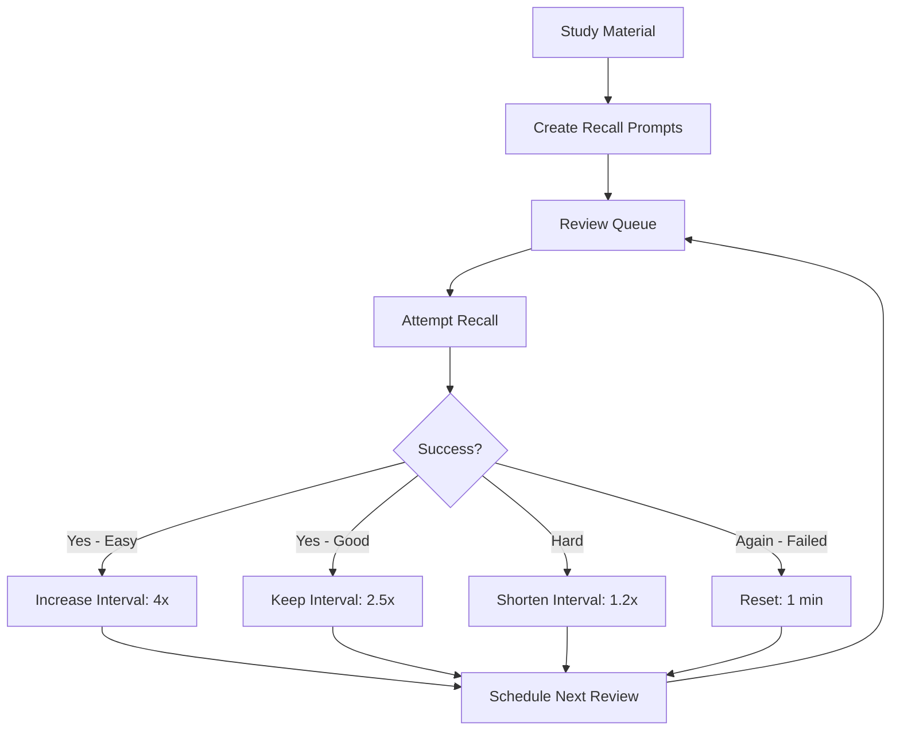
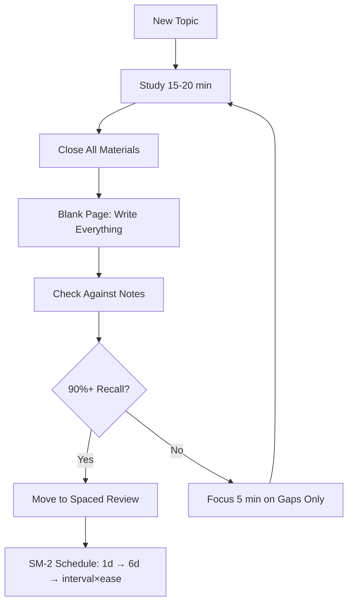

# Chapter 4: Active Recall & Spaced Repetition

> ⏱ **2.5 hours total** · 🎯 **Beginner** · 📋 **No prerequisites**

## Learning Objectives

After this chapter you will be able to:
- Implement active recall without any tools using the blank page method
- Build effective Anki cards that test understanding, not recognition
- Understand and implement the SM-2 spaced repetition algorithm
- Schedule reviews for optimal long-term retention
- Apply recall to any subject — history dates, math formulas, vocabulary, language learning, coding concepts

## Quick Start (10 min)

1. Read the "Why Active Recall Works" section in Theory (3 min)
2. Try the Blank Page method with any topic you studied today (5 min)
3. Create 3 physical flashcards using the Leitner box rule (2 min)
4. **Save for later:** SM-2 algorithm, TypeScript code, spaced repetition calculator

## Theory

### Why Active Recall Works

Active recall is the single most effective learning technique known to cognitive science. When you force your brain to retrieve information — rather than passively re-reading it — you strengthen the neural pathways that make future retrieval easier.



**Why re-reading fails:** Every time you re-read, your brain thinks "I've seen this before, I know this." This is an illusion of competence. The only reliable signal that you know something is being able to retrieve it from memory without cues.

**The testing effect:** Studies show that students who practice retrieval retain 50% more after one week compared to students who re-read. The effect is largest when the retrieval is effortful — if it's easy, it's not working.

**Recognition vs recall:** Multiple-choice questions test recognition (you just need to identify the correct answer from options). Open-ended questions test recall (you need to generate the answer from scratch). Recognition feels good but builds weak memory. Always convert recognition tasks to recall tasks.

### The Blank Page Method

This is active recall without any tools. No Anki, no apps, no cards.

1. Study a section of material (15-20 minutes)
2. Close the book or close the tab
3. On a blank page, write everything you remember about the topic
4. Don't look at your notes. Force your brain to retrieve
5. When you can't write more, check your notes for gaps
6. Focus your next study session on the gaps

The blank page method reveals exactly what you know and don't know. Most people are shocked at how little they retain after reading. That shock is valuable — it motivates real learning.

### SM-2 Algorithm Explained

The SM-2 algorithm, developed by Piotr Wozniak, is the engine behind Anki. It schedules reviews at optimal intervals based on your performance.

**Card fields:**
- `interval`: number of days until the next review
- `ease`: multiplier that controls how fast intervals grow (starts at 2.5)
- `dueDate`: when the card is due for review
- `lastReview`: when you last reviewed it

**After each review, rate quality (0-5):**

| Rating | Meaning | Action |
|--------|---------|--------|
| 0 | Complete blackout | Reset interval to 1. Set ease to 1.3 |
| 1 | Wrong, but remembered on seeing answer | Reset interval to 1. Set ease to 1.3 |
| 2 | Wrong, but answer felt familiar | Reset interval to 1. Reduce ease by 0.2 |
| 3 | Hard to recall, but correct | Keep interval same. Reduce ease by 0.15 |
| 4 | Correct after some hesitation | Multiply interval by ease. Keep ease same |
| 5 | Perfect recall, instant | Multiply interval by ease × 1.1. Increase ease by 0.1 |

**Minimum intervals:**
- First review: 1 day
- Second review (if passed): 6 days
- Subsequent reviews: interval × ease

If you fail a card (rating ≤ 3), it goes back to the 1-day queue. This ensures you see difficult cards more often.

### Anki Card Design Principles

A well-designed card tests one concept with minimal text. Follow these rules:

1. **Atomic:** One card = one concept. If your card contains "and," split it into two cards
2. **Cloze deletion:** For facts, use fill-in-the-blank. Example: "The CAP theorem states that a distributed system can only guarantee {{c1::two}} of the following three: consistency, availability, and {{c2::partition tolerance}}"
3. **Minimal text:** The shortest possible prompt. Your brain should work to retrieve the answer
4. **Tags for categorization:** Use tags like `dsa::arrays`, `system-design::caching`, `ml::loss-functions`
5. **Images for spatial memory:** Add diagrams when relevant. Visual + verbal = double encoding

**Bad card:**
```
Q: What is the CAP theorem and what are its tradeoffs?
A: The CAP theorem states that a distributed system can only guarantee two of: consistency, 
availability, and partition tolerance. It has tradeoffs in terms of latency, data freshness, 
and fault tolerance...
```

**Good cards (split into 3):**
```
Card 1: CAP theorem guarantees at most {{c1::two}} of three properties
Card 2: CAP theorem properties: {{c1::Consistency}}, {{c2::Availability}}, {{c3::Partition Tolerance}}
Card 3: In CAP, if you choose CP, what do you sacrifice? {{c1::Availability during partitions}}
```

### Beyond Flashcards
### Complete Anki Setup Guide

If you've never used Anki, here's how to set it up in 15 minutes:

1. Download Anki from https://apps.ankiweb.net (free, all platforms)
2. Create an account and sync (optional, keeps cards across devices)
3. Create a deck called "Learning How to Learn" (or your topic name)
4. Add your first card:
   - Click "Add" (or press A)
   - Type: "What is the testing effect?" in the Front field
   - Type: "Retrieving information from memory strengthens neural pathways more than passive re-reading" in the Back field
   - Click "Add"
5. Set daily review limit: Tools → Preferences → Review → Maximum reviews/day = 20
6. Start reviewing: Click "Study" → look at the question → think of the answer → click "Show Answer" → rate yourself

**Recommended add-ons:**
- Image Occlusion Enhanced: for diagram-based cards
- Heatmap: visualize your review streaks
- Review Heatmap: shows which days you reviewed

### Advanced Card Types

Beyond basic cards, use these formats:

**Cloze deletion (fill in the blank):**
```
The {{c1::testing effect}} states that {{c2::retrieving}} information from memory
strengthens {{c3::neural pathways}} more than passive re-reading.
```

**Type-in answer:**
```
Q: Implement the SM-2 ease update for a quality-5 response
A: ease = Math.min(3.0, card.ease + 0.1)
```

**Image occlusion:**
Upload a diagram. Cover key parts. Test yourself on labels, data flows, or component names.

**Template card (for code):**
```
Front: Implement [function name]
Back: [paste code]
```

### Common Mistakes and Fixes

| Mistake | Fix |
|---------|-----|
| Too many new cards per day | Set daily new cards to 10 max |
| Cards too long | Split any card with "and" |
| Rating all cards 3-4 | Be honest. Rating 3 means "struggled." |
| Not reviewing daily | Set a fixed time (morning coffee, evening wind-down) |
| Adding cards without understanding | Understand first, then card it. Don't card to understand |
| No tags | Add tags for topic, difficulty, date added |


Active recall works for more than facts. Apply it to these domains:

**For coding:** Close the solution. Trace through the function call by call from memory. If you get stuck, that's the gap you need to study.

**For system design:** Close the diagram. Draw the architecture from memory (components, data flow, tradeoffs). Compare with the reference.

**For behavioral interviews:** Close your notes. Tell your STAR story out loud from memory. Record yourself. Review for gaps and unclear transitions.

**Algorithm recall:** Close your reference. Implement the algorithm from scratch in a blank editor. Run it. If it fails, debug without looking. Only check the reference after you've tried.



## Examples

### 📝 Plain-Language Walkthrough

**Method 1: The Blank Page (No Tools Needed)**
1. Read a section of your textbook or notes (10 min)
2. Close everything. Write everything you remember on a blank page (5 min)
3. Check your notes. Mark what you missed in red
4. Repeat step 2-3 until you recall 90%+ of the key points

**Method 2: Leitner Box (Physical Flashcards)**
Create 5 boxes:
- Box 1: Review every day
- Box 2: Review every 2 days
- Box 3: Review every 4 days
- Box 4: Review every 8 days
- Box 5: Review every 16 days

Rules:
- New cards start in Box 1
- Correct answer → move to next box
- Wrong answer → move back to Box 1
- Review each box on its schedule

Example for SSC GK:
```
Card front: "Who founded the Maurya Empire?"
Card back: "Chandragupta Maurya (322 BCE)"
→ If correct: move to Box 2 (review in 2 days)
→ If wrong: keep in Box 1 (review tomorrow)
```

### 💻 TypeScript Implementation (Optional)

### Example 1: SM-2 Algorithm Implementation

```typescript
interface Card {
    id: string
    question: string
    answer: string
    interval: number       // days until next review
    ease: number           // multiplier (min 1.3, default 2.5)
    dueDate: Date
    lastReview: Date | null
    repetitions: number    // consecutive correct reviews
}

class SM2 {
    review(card: Card, quality: 0 | 1 | 2 | 3 | 4 | 5): Card {
        const now = new Date()

        if (quality < 3) {
            // Failed: reset interval
            return {
                ...card,
                interval: 1,
                ease: Math.max(1.3, quality === 3 ? card.ease - 0.15 : 1.3),
                dueDate: new Date(now.getTime() + 86400000),
                lastReview: now,
                repetitions: 0
            }
        }

        // Passed: increase interval
        let newInterval: number
        if (card.repetitions === 0) {
            newInterval = 1
        } else if (card.repetitions === 1) {
            newInterval = 6
        } else {
            newInterval = Math.round(card.interval * card.ease)
        }

        let newEase = card.ease
        if (quality === 5) {
            newEase = Math.min(3.0, card.ease + 0.1)
            newInterval = Math.round(newInterval * 1.1)
        } else if (quality === 4) {
            // keep ease
        } else if (quality === 3) {
            newEase = Math.max(1.3, card.ease - 0.15)
        }

        return {
            ...card,
            interval: newInterval,
            ease: newEase,
            dueDate: new Date(now.getTime() + newInterval * 86400000),
            lastReview: now,
            repetitions: card.repetitions + 1
        }
    }
}
```

### Example 2: Card Deck Manager

```typescript
class AnkiDeck {
    private cards: Card[] = []
    private algorithm = new SM2()

    addCard(question: string, answer: string): void {
        this.cards.push({
            id: crypto.randomUUID(),
            question,
            answer,
            interval: 0,
            ease: 2.5,
            dueDate: new Date(),
            lastReview: null,
            repetitions: 0
        })
    }

    getDueCards(): Card[] {
        const now = new Date()
        return this.cards.filter(c => c.dueDate <= now)
    }

    reviewCard(cardId: string, quality: 0 | 1 | 2 | 3 | 4 | 5): void {
        const index = this.cards.findIndex(c => c.id === cardId)
        if (index === -1) return
        this.cards[index] = this.algorithm.review(this.cards[index], quality)
    }

    getStats(): DeckStats {
        return {
            total: this.cards.length,
            due: this.getDueCards().length,
            mature: this.cards.filter(c => c.interval >= 21).length,
            learning: this.cards.filter(c => c.interval < 21 && c.interval > 0).length,
            new: this.cards.filter(c => c.interval === 0).length,
            averageEase: this.cards.reduce((s, c) => s + c.ease, 0) / this.cards.length
        }
    }

    searchByTag(tag: string): Card[] {
        return this.cards.filter(c => c.tags?.includes(tag))
    }
}

interface DeckStats {
    total: number
    due: number
    mature: number
    learning: number
    new: number
    averageEase: number
}
```

### Example 4: Leitner Box Manager

```typescript
interface LeitnerCard {
    id: string
    question: string
    answer: string
    box: 1 | 2 | 3 | 4 | 5
    lastReviewed: Date | null
}

class LeitnerBox {
    private cards: LeitnerCard[] = []
    private readonly BOX_INTERVALS: Record<number, number> = {
        1: 1,   // daily
        2: 2,   // every 2 days
        3: 4,   // every 4 days
        4: 8,   // every 8 days
        5: 16,  // every 16 days
    }

    addCard(question: string, answer: string): void {
        this.cards.push({
            id: crypto.randomUUID(),
            question,
            answer,
            box: 1,
            lastReviewed: null
        })
    }

    reviewCard(cardId: string, correct: boolean): void {
        const card = this.cards.find(c => c.id === cardId)
        if (!card) return

        if (correct && card.box < 5) {
            card.box = (card.box + 1) as LeitnerCard['box']
        } else if (!correct) {
            card.box = 1
        }
        card.lastReviewed = new Date()
    }

    getCardsForToday(): LeitnerCard[] {
        const now = new Date()
        return this.cards.filter(c => {
            if (!c.lastReviewed) return true
            const daysSinceReview = (now.getTime() - c.lastReviewed.getTime()) / 86400000
            return daysSinceReview >= this.BOX_INTERVALS[c.box]
        })
    }

    getStats(): { total: number; byBox: Record<number, number> } {
        const byBox: Record<number, number> = { 1: 0, 2: 0, 3: 0, 4: 0, 5: 0 }
        this.cards.forEach(c => byBox[c.box]++)
        return { total: this.cards.length, byBox }
    }
}
```

### Example 5: Spaced Review Calculator

```typescript
interface ReviewSchedule {
    studyDate: Date
    reviewDates: Date[]
    totalReviews: number
}

class SpacedReviewCalculator {
    calculate(studyDate: Date, intervals: number[] = [1, 3, 7, 14, 30]): ReviewSchedule {
        const reviewDates = intervals.map(days => {
            const date = new Date(studyDate)
            date.setDate(date.getDate() + days)
            return date
        })

        return {
            studyDate,
            reviewDates,
            totalReviews: intervals.length
        }
    }

    getRetentionProjection(quality: 'perfect' | 'good' | 'struggled'): { interval: number; retention: number }[] {
        const projections: { interval: number; retention: number }[] = []
        const baseRetention = quality === 'perfect' ? 0.95 : quality === 'good' ? 0.85 : 0.65
        const decayRate = quality === 'perfect' ? 0.03 : quality === 'good' ? 0.06 : 0.12

        for (let day = 0; day <= 30; day++) {
            projections.push({
                interval: day,
                retention: Math.max(0, baseRetention - decayRate * Math.sqrt(day))
            })
        }
        return projections
    }

    formatSchedule(schedule: ReviewSchedule): string {
        return [
            `Studied: ${schedule.studyDate.toLocaleDateString()}`,
            'Review schedule:',
            ...schedule.reviewDates.map((d, i) =>
                `  Review ${i + 1}: ${d.toLocaleDateString()} (${Math.round((d.getTime() - schedule.studyDate.getTime()) / 86400000)} days)`
            )
        ].join('\n')
    }
}
```

### Example 3: Recall Session Tracker

```typescript
interface RecallSession {
    topic: string
    duration: number  // minutes
    promptsAttempted: number
    promptsRecalled: number
    gapsIdentified: string[]
    date: Date
}

class RecallSessionTracker {
    private sessions: RecallSession[] = []

    log(session: RecallSession): void {
        this.sessions.push(session)
    }

    getRetentionRate(topic: string): number {
        const topicSessions = this.sessions.filter(s => s.topic === topic)
        if (topicSessions.length === 0) return 0
        const total = topicSessions.reduce((s, e) => s + e.promptsAttempted, 0)
        const recalled = topicSessions.reduce((s, e) => s + e.promptsRecalled, 0)
        return total > 0 ? recalled / total : 0
    }

    getWeakestTopics(): { topic: string; retention: number }[] {
        const topics = [...new Set(this.sessions.map(s => s.topic))]
        return topics
            .map(t => ({ topic: t, retention: this.getRetentionRate(t) }))
            .sort((a, b) => a.retention - b.retention)
            .slice(0, 3)
    }

    getGapFrequency(): Map<string, number> {
        const freq = new Map<string, number>()
        this.sessions.forEach(s => {
            s.gapsIdentified.forEach(g => {
                freq.set(g, (freq.get(g) ?? 0) + 1)
            })
        })
        return freq
    }
}
```

## Summary

- Active recall (retrieving from memory without cues) is 50% more effective than re-reading
- The SM-2 algorithm schedules reviews at optimal intervals based on your performance
- Cards should be atomic (one concept each), use cloze deletion, and have minimal text
- The blank page method requires no tools: study → close → write → check → focus on gaps
- Apply recall beyond flashcards: trace code, draw architectures, tell stories from memory

## Practical Takeaways

1. For every study session, spend 10 minutes doing the blank page method before moving on
2. Convert any concept card containing "and" into two separate cards
3. Never rate a card higher than 4 — rating 5 should mean "effortless instant recall"
4. If you can't explain a concept without looking, you don't know it yet
5. Use recall for code: close the solution and trace the function from memory

### Blank Page Method Protocol

Follow this exact protocol after every study session:

**Step 1: Study (20 min)**
Read or watch a section of material. Take notes if you want, but the real learning is in Step 2.

**Step 2: Close Everything (1 min)**
Close the book, the tab, the video. Put your notes face down. Take a blank page and a pen.

**Step 3: Write (10 min)**
Write everything you remember about the topic. Don't organize. Don't edit. Just dump everything.

**Step 4: Check (5 min)**
Open your notes. Compare with what you wrote. Mark:
- ✅ Correct and complete
- ⚠️ Partially correct or incomplete
- ❌ Wrong or missing entirely

**Step 5: Focus (5 min)**
Spend 5 minutes reviewing only the ⚠️ and ❌ items. These are your actual learning gaps.

Repeat this cycle 3 times:
- After first study session: identifies what you got wrong
- After second session: identifies what you're still missing
- After third session: confirms what you've mastered

After 3 cycles, most topics are at 80%+ retention.


## Common Mistakes

| Mistake | Why It Fails | Fix |
|---------|-------------|-----|
| Re-reading instead of recalling | Recognition creates illusion of competence | Close the book. Write everything you remember. Check gaps |
| Multi-concept flashcards | You half-know the card and rate it "good" | If a card contains "and", split it. One concept per card |
| Rating "good" when you almost failed | The algorithm thinks you know it → shows it too late | Be honest. If it was hard, rate it hard (quality 2-3) |
| No review of failed cards | Failed cards stay failed | Cards rated ≤3 reset to 1-day interval. Review them tomorrow |

## Chapter Quiz

<details>
<summary>1. What quality score resets the SM-2 interval to 1 day?</summary>
<p><strong>Correct answer:</strong> Quality ≤ 3 (ratings 0 through 3).</p>
<p><strong>Common wrong answer:</strong> "Quality ≤ 1". <em>Why it's wrong:</em> Ratings 2-3 also indicate poor recall (struggled or barely correct). Only ratings 4-5 count as passing and allow the interval to grow.</p>
</details>

<details>
<summary>2. What happens to the ease factor after a quality 5 rating?</summary>
<p><strong>Correct answer:</strong> It increases by 0.1, up to a maximum of 3.0.</p>
<p><strong>Common wrong answer:</strong> "It stays the same". <em>Why it's wrong:</em> Quality 5 is perfect recall, so the algorithm rewards the card by increasing ease, making intervals grow faster so you see mastered cards less often.</p>
</details>

<details>
<summary>3. What's the difference between recognition and recall?</summary>
<p><strong>Correct answer:</strong> Recognition identifies the correct answer from options; recall generates the answer from memory.</p>
<p><strong>Common wrong answer:</strong> "Recognition is harder than recall". <em>Why it's wrong:</em> The opposite is true — recognition feels easy because you only need to identify, not generate. Multiple-choice tests use recognition; blank-page tests use recall.</p>
</details>

<details>
<summary>4. What's the rule for splitting Anki cards?</summary>
<p><strong>Correct answer:</strong> If your card contains "and," split it into two cards.</p>
<p><strong>Common wrong answer:</strong> "Split cards if they have more than 10 words". <em>Why it's wrong:</em> Word count is not the issue — a short card can still test multiple concepts. The "and" test catches multi-concept cards reliably.</p>
</details>

<details>
<summary>5. What's the minimum SM-2 interval after a failed review?</summary>
<p><strong>Correct answer:</strong> 1 day.</p>
<p><strong>Common wrong answer:</strong> "7 days". <em>Why it's wrong:</em> A 7-day wait after failure means you forget the correction before seeing the card again. A 1-day reset ensures quick re-exposure to difficult material.</p>
</details>

## Exercises

1. **Blank page method (any subject):** After your next study session — whether it is history, math, vocabulary, or coding — close your book, open a blank page, and write everything you remember in 10 minutes. Check your notes and mark gaps in red. Repeat until you recall 90%+ of the key points
2. **Physical Leitner box:** Create 5 boxes using index cards or paper slips. Add 10 new facts or concepts from your current study topic. Review them daily per the Leitner schedule for one week
3. **Topic mapping:** Pick any topic you are studying. List 10 key facts, formulas, dates, or concepts. For each one, write a question on one side of an index card and the answer on the other. Review daily
4. **SM-2 implementation (bonus):** Write the full SM-2 `review()` function in TypeScript. Test it with a card that you review at quality 5, then again at quality 2
5. **Recall session tracker (bonus):** Use the RecallSessionTracker for 5 study sessions across any subjects. After 5 sessions, identify your weakest topics and study them

## Quick Reference

### Blank Page Method
1. Study (10 min) → 2. Close everything (1 min) → 3. Write all you remember (10 min) → 4. Check and mark gaps (5 min) → 5. Review gaps only (5 min)

### Leitner Box Schedule
| Box | Interval | Cards | Review |
|-----|----------|-------|--------|
| 1 | 1 day | New/failed | Daily |
| 2 | 2 days | Learning | Every 2 days |
| 3 | 4 days | Learning | Every 4 days |
| 4 | 8 days | Known | Weekly |
| 5 | 16 days | Mastered | Every 2 weeks |

### SM-2 Simplified
- Quality 4-5: Interval × 2.5. Ease +0.1
- Quality 3: Interval × 1.2. Ease unchanged
- Quality 0-2: Reset to 1 day. Ease -0.2

### Card Design Rule
If your card has "and", split it. One concept = one card.
