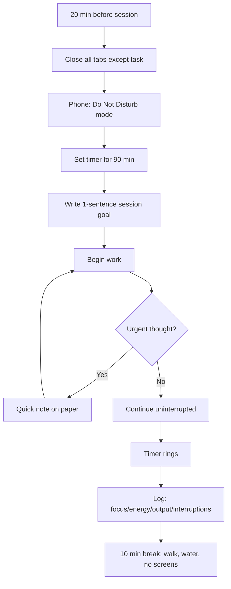
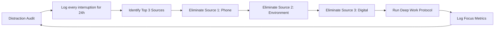

# Chapter 5: Deep Work & Focus

> ⏱ **2 hours total** · 🎯 **Beginner** · 📋 **No prerequisites**

## Learning Objectives

After this chapter you will be able to:
- Distinguish deep work from shallow work and allocate time to each deliberately
- Conduct a distraction audit and eliminate your top interruptions
- Understand attention residue and protect your focus from context switching
- Build a personal deep work protocol with specific time, place, and rules
- Measure and improve your focus session quality over time

## Quick Start (10 min)

1. Read the Deep Work Protocol in Theory (3 min)
2. Conduct a 1-day distraction audit — tally every interruption (4 min)
3. Write your deep work session goal for today (1 min)
4. Set a timer and do ONE 45-min focused session (2 min setup)
5. **Save for later:** Shallow vs deep work table, streak tracking, Common Mistakes

## Theory

### Deep Work vs Shallow Work

Deep work is professional activity performed in a state of distraction-free concentration that pushes your cognitive capabilities to their limit. Shallow work is non-cognitively demanding, logistical-style work often performed while distracted.



| Deep Work | Shallow Work |
|-----------|-------------|
| Solving a hard LeetCode problem | Watching a tutorial |
| Designing a system from scratch | Reorganizing notes |
| Implementing an algorithm without reference | Answering emails |
| Reading and understanding a research paper | Browsing tech news |
| Debugging a complex issue | Updating your resume |

Deep work is what actually moves the needle. Shallow work feels productive but produces little progress. Your goal is to maximize deep work and minimize shallow work.

### The Distraction Audit

Before you can fix distractions, you need to know what they are. Conduct a 24-hour audit:

1. Every time you get distracted, write down: time, source (phone, environment, internal), duration
2. At the end of 24 hours, categorize and count
3. Identify your top 3 distractions

**Common categories:**
- **Phone:** Notifications, social media, messaging apps
- **Environment:** Noise, people interrupting, messy desk
- **Internal:** Mind-wandering, urge to check something, hunger, fatigue
- **Digital:** Email tabs, multiple browser tabs, Slack/Teams notifications

After your audit, eliminate the top 3 before your next deep work session. Most people find that phone notifications account for 60%+ of all distractions.

### Attention Residue

When you switch from Task A to Task B, part of your attention remains on Task A. This is attention residue. It takes 20+ minutes for the residue to clear.

This means:
- Every context switch costs ~20 minutes of productive time
- Checking your phone for 30 seconds costs 20 minutes
- Answering one Slack message costs 20 minutes of lost focus
- 5 phone checks per day = nearly 2 hours of lost productivity

**The fix: Batch all shallow work into dedicated blocks.** Don't mix deep work with interruptions. Do deep work in the morning (when residue is lowest), shallow work in the afternoon.



### The Deep Work Protocol

A repeatable protocol that signals your brain: "It's time to focus."

1. **Time:** Same time every day. Train your brain to expect focus at this time
2. **Place:** Dedicated space. Ideally the same chair, same desk, same lighting
3. **Tools:** Only what you need for the task. A code editor. A blank page. A single browser tab
4. **Rules:** No phone. No notifications. No multitasking. If it's not the task, it doesn't exist
5. **Duration:** Minimum 90 minutes. The first 20 minutes is entering flow. Real deep work starts after that
6. **Shutdown:** When the timer rings, stop. Log your session. Take a real break. No half-measures

### Measuring Focus Quality
### The 4-Hour Deep Work Challenge

Try this 5-day challenge to build your deep work capacity:

**Rules:**
- 4 hours of deep work per day, split into 2 × 90-min blocks + 1 × 60-min block
- No phone during deep work blocks
- No social media or news during breaks (walk, stretch, water)
- Log every session with focus/energy/output ratings
- If you miss a day, restart the streak

**Progression:**
- Days 1-2: 2 × 45-min blocks (build the habit)
- Days 3-4: 1 × 90-min + 1 × 60-min blocks
- Day 5: 2 × 90-min blocks

**Success criteria:** By day 5, you should be able to sustain focus for 90 minutes without checking your phone or switching tasks.

### Environmental Deep Work Triggers

Train your brain to associate specific cues with deep work:

| Trigger | Example |
|---------|---------|
| Location | Same chair at the same desk |
| Time | Same start time every day |
| Sound | Same playlist (instrumental, no lyrics) |
| Scent | Same candle or essential oil |
| Clothing | Same "focus hoodie" or outfit |
| Ritual | Same 5-min startup sequence |

After 2 weeks of consistent triggers, your brain will start entering focus mode automatically when the trigger occurs. This makes starting deep work effortless.

### Digital Minimalism for Focus

Your phone is the single biggest threat to deep work. Here's how to neutralize it:

1. **Remove social media apps from your home screen.** Put them in a folder on page 3. The friction of finding them reduces checking frequency
2. **Turn off all notifications except:** Phone calls, calendar alerts, messages from 2 key contacts
3. **Use grayscale display.** Settings → Accessibility → Display → Color Filters → Grayscale. Colorful icons trigger dopamine; gray is boring
4. **Schedule phone check times.** 10 AM, 1 PM, 4 PM, 7 PM. 5 minutes each. Outside these times, phone is in another room
5. **Replace phone habits.** When you want to check your phone, do 10 pushups or drink water instead. Replace the cue with a different response

After 1 week of digital minimalism, most people report 2-3 additional hours of productive time per day.


Track these metrics after every deep work session:

| Metric | Scale | What It Tells You |
|--------|-------|-------------------|
| Focus | 1-5 | How well you maintained concentration |
| Energy | 1-5 | Your physical/mental energy during the session |
| Output | 1-5 | How much you accomplished |
| Interruptions | Count | How often you broke concentration |

After 10 sessions, look for patterns:
- If focus is consistently low, check sleep and exercise
- If interruptions are high, remove the source before sessions
- If output is low but focus is high, the task may be too hard — break it down

## Examples

### 📝 Plain-Language Walkthrough

**Scenario:** You need 2 hours of focused study after work but keep reaching for your phone.

**Step 1: Distraction Audit**
For 3 days, tally every interruption:
```
Day 1: Phone notifications (12), Social media (5), Family (3), Random thoughts (7)
Day 2: Phone notifications (8), Social media (3), Family (4), Random thoughts (5)
Day 3: Phone notifications (6), Social media (2), Family (2), Random thoughts (4)
```
Your top 3 distractions are your elimination targets.

**Step 2: Create Your Deep Work Protocol**
```
Before session (5 min):
1. Phone on Do Not Disturb, placed in another room
2. Close all browser tabs except study material
3. Write session goal: "Master 10 Algebra formulas"

During session (45-90 min):
4. Keep a "capture pad" nearby for random thoughts
5. If an urge arises (check phone, browse), note it on the pad
6. Return to work immediately

After session (5 min):
7. Rate focus 1-10, energy 1-10
8. Note what interrupted you
9. Decide tomorrow's session goal
```

**Step 3: Track Your Deep Work Streak**
Print a calendar. Mark an X for every day you completed one deep work session. Don't break the chain.

### 💻 TypeScript Implementation (Optional)

### Example 1: Focus Session Tracker

```typescript
interface FocusSession {
    id: string
    date: Date
    startTime: string
    duration: number       // minutes
    task: string
    focusRating: 1 | 2 | 3 | 4 | 5
    energyRating: 1 | 2 | 3 | 4 | 5
    outputRating: 1 | 2 | 3 | 4 | 5
    interruptionCount: number
    notes: string
}

class FocusTracker {
    private sessions: FocusSession[] = []

    startSession(task: string, duration: number = 90): FocusSession {
        const session: FocusSession = {
            id: crypto.randomUUID(),
            date: new Date(),
            startTime: new Date().toLocaleTimeString(),
            duration,
            task,
            focusRating: 3,
            energyRating: 3,
            outputRating: 3,
            interruptionCount: 0,
            notes: ''
        }
        console.log(`Session started: ${task} (${duration} min)`)
        return session
    }

    endSession(session: FocusSession, ratings: {
        focus: 1 | 2 | 3 | 4 | 5
        energy: 1 | 2 | 3 | 4 | 5
        output: 1 | 2 | 3 | 4 | 5
        interruptions: number
    }): FocusSession {
        session.focusRating = ratings.focus
        session.energyRating = ratings.energy
        session.outputRating = ratings.output
        session.interruptionCount = ratings.interruptions
        this.sessions.push(session)
        return session
    }

    getSessionReport(): FocusReport {
        if (this.sessions.length === 0) {
            return { avgFocus: 0, avgEnergy: 0, avgOutput: 0, totalInterruptions: 0, totalSessions: 0 }
        }

        return {
            avgFocus: this.average('focusRating'),
            avgEnergy: this.average('energyRating'),
            avgOutput: this.average('outputRating'),
            totalInterruptions: this.sessions.reduce((s, e) => s + e.interruptionCount, 0),
            totalSessions: this.sessions.length
        }
    }

    private average(field: 'focusRating' | 'energyRating' | 'outputRating'): number {
        return this.sessions.reduce((s, e) => s + e[field], 0) / this.sessions.length
    }
}

interface FocusReport {
    avgFocus: number
    avgEnergy: number
    avgOutput: number
    totalInterruptions: number
    totalSessions: number
}
```

### Example 2: Distraction Audit Logger

```typescript
type DistractionSource = 'phone' | 'environment' | 'internal' | 'digital'

interface Distraction {
    timestamp: Date
    source: DistractionSource
    description: string
    duration: number  // minutes
}

class DistractionAudit {
    private distractions: Distraction[] = []

    log(source: DistractionSource, description: string, duration: number): void {
        this.distractions.push({ timestamp: new Date(), source, description, duration })
    }

    getSummary(): AuditSummary {
        const bySource = new Map<DistractionSource, number>()
        this.distractions.forEach(d => {
            bySource.set(d.source, (bySource.get(d.source) ?? 0) + d.duration)
        })

        const totalLostMinutes = this.distractions.reduce((s, d) => s + d.duration, 0)

        return {
            totalDistractions: this.distractions.length,
            totalLostMinutes,
            topSources: [...bySource.entries()]
                .sort((a, b) => b[1] - a[1])
                .slice(0, 3)
                .map(([source, minutes]) => ({ source, minutes })),
            recommendations: this.generateRecommendations(bySource)
        }
    }

    private generateRecommendations(bySource: Map<DistractionSource, number>): string[] {
        const recs: string[] = []
        const phone = bySource.get('phone') ?? 0
        const env = bySource.get('environment') ?? 0
        const internal = bySource.get('internal') ?? 0
        const digital = bySource.get('digital') ?? 0

        if (phone > 30) recs.push('Put phone in another room during deep work')
        if (digital > 30) recs.push('Close all browser tabs except the task')
        if (internal > 30) recs.push('Check sleep, hunger, and caffeine before sessions')
        if (env > 30) recs.push('Use noise-cancelling headphones or find a quiet space')

        if (recs.length === 0) recs.push('Your distraction levels are manageable. Maintain current habits.')
        return recs
    }
}

interface AuditSummary {
    totalDistractions: number
    totalLostMinutes: number
    topSources: { source: DistractionSource; minutes: number }[]
    recommendations: string[]
}
```

### Example 4: Phone Detox Tracker

```typescript
interface PhoneCheck {
    timestamp: Date
    duration: number  // seconds
    trigger: 'notification' | 'boredom' | 'habit' | 'anxiety' | 'other'
}

class PhoneDetoxTracker {
    private checks: PhoneCheck[] = []

    logCheck(duration: number, trigger: PhoneCheck['trigger']): void {
        this.checks.push({ timestamp: new Date(), duration, trigger })
    }

    getStats(): { totalChecks: number; totalTimeLost: number; topTriggers: string[] } {
        const byTrigger = new Map<string, number>()
        this.checks.forEach(c => {
            byTrigger.set(c.trigger, (byTrigger.get(c.trigger) ?? 0) + 1)
        })

        return {
            totalChecks: this.checks.length,
            totalTimeLost: Math.round(this.checks.reduce((s, c) => s + c.duration, 0) / 60),
            topTriggers: [...byTrigger.entries()]
                .sort((a, b) => b[1] - a[1])
                .slice(0, 3)
                .map(([trigger]) => trigger)
        }
    }

    getRecommendation(): string {
        const triggers = this.getStats().topTriggers
        if (triggers.includes('notification')) return 'Turn off all non-call notifications. Phone in another room.'
        if (triggers.includes('boredom')) return 'Keep a capture pad nearby. When bored, draw or write instead.'
        if (triggers.includes('habit')) return 'Replace phone check with 10 pushups or drink water.'
        if (triggers.includes('anxiety')) return 'Set specific phone check times (10am, 1pm, 4pm, 7pm).'
        return 'Your phone habits are manageable. Maintain current protocol.'
    }
}
```

### Example 5: Focus Streak Tracker

```typescript
class FocusStreakTracker {
    private dailyLog: Map<string, { completed: boolean; minutes: number }> = new Map()

    logDay(date: string, minutesFocused: number, minimum: number): void {
        this.dailyLog.set(date, {
            completed: minutesFocused >= minimum,
            minutes: minutesFocused
        })
    }

    getCurrentStreak(): number {
        const sorted = [...this.dailyLog.entries()].sort((a, b) => b[0].localeCompare(a[0]))
        let streak = 0
        for (const [, entry] of sorted) {
            if (entry.completed) streak++
            else break
        }
        return streak
    }

    getBestStreak(): number {
        const sorted = [...this.dailyLog.entries()].sort((a, b) => a[0].localeCompare(b[0]))
        let currentStreak = 0
        let bestStreak = 0
        for (const [, entry] of sorted) {
            if (entry.completed) {
                currentStreak++
                bestStreak = Math.max(bestStreak, currentStreak)
            } else {
                currentStreak = 0
            }
        }
        return bestStreak
    }

    getWeeklyAdherence(): number {
        const week = [...this.dailyLog.entries()].slice(-7)
        const completed = week.filter(([, e]) => e.completed).length
        return week.length > 0 ? Math.round((completed / week.length) * 100) : 0
    }
}
```

### Example 3: Deep Work Protocol Generator

```typescript
interface Protocol {
    time: string
    place: string
    duration: number
    rules: string[]
    preparation: string[]
    shutdown: string[]
}

class DeepWorkProtocol {
    generate(preferences: {
        bestTime: string
        location: string
        commonDistractions: string[]
    }): Protocol {
        return {
            time: preferences.bestTime,
            place: preferences.location,
            duration: 90,
            rules: [
                'No phone in the room',
                'No browser tabs except the task',
                'No multitasking — one task only',
                'If interrupted, write it down and return within 10 seconds',
                'No breaks during the 90 minutes'
            ],
            preparation: [
                'Close all irrelevant browser tabs',
                'Put phone on Do Not Disturb in another room',
                'Prepare water and any tools needed',
                'Write session goal (1 sentence)',
                'Set 90-minute timer'
            ],
            shutdown: [
                `Stop when timer rings at ${90} minutes`,
                'Log focus, energy, output, and interruption count',
                'Take a 10-minute walk with no screens',
                'Review what was accomplished'
            ]
        }
    }
}
```

## Summary

- Deep work is high-cognitive-load concentration; shallow work is logistical. Prioritize deep work ruthlessly
- Conduct a 24-hour distraction audit before trying to fix anything — data beats guesses
- Every context switch costs 20 minutes of attention residue. Batch shallow work into dedicated blocks
- The deep work protocol: same time, same place, single task, no phone, 90-minute minimum
- Track focus/energy/output after every session. Look for patterns after 10 sessions

## Practical Takeaways

1. Conduct a 24-hour distraction audit starting now — capture every interruption
2. Remove your top 3 distractions before your next deep work session
3. Do one 90-minute deep work session daily for 5 consecutive days — no exceptions
4. Batch all shallow work (email, admin, organizing) into a single 30-minute afternoon block
5. After each session, log focus/energy/output/interruptions. Review after 10 sessions

### The Phone Protocol

Your phone is the #1 focus killer. Implement this protocol starting today:

**Before deep work:**
1. Phone on Do Not Disturb mode
2. Place phone in another room (not just face down)
3. If you need a timer, use a physical timer or your computer
4. If you need music, load it before putting the phone away

**During deep work:**
1. No phone checks. Period.
2. If you think of something you need to do, write it on paper and handle it during break
3. If someone calls, they'll leave a message. Check it during break

**After deep work:**
1. Check phone during break (10 min max)
2. Respond to urgent messages only
3. Set phone aside again for the next deep work block

**Phone detox progression:**
- Week 1: Phone in another room during deep work blocks
- Week 2: Phone in another room during all study time
- Week 3: Phone in another room from 8 AM to 6 PM
- Week 4: Phone in another room for full day except scheduled checks


## Common Mistakes

| Mistake | Why It Fails | Fix |
|---------|-------------|-----|
| Multitasking (tabs open, phone nearby) | Attention residue kills deep work | Close everything except the task. Phone in another room |
| Doing shallow work and calling it deep work | Checking email, organizing files, browsing — these don't build skill | Ask: "Would I pay someone else to do this?" If yes, it's shallow |
| Context switching every 5 minutes | Each switch costs 15+ minutes to regain focus | Set a 45-min timer. No switching until it rings |
| No capture pad for random thoughts | Urgent thoughts interrupt flow permanently | Keep a notepad beside you. Write the thought down, return to work |

## Chapter Quiz

<details>
<summary>1. What's the minimum deep work session length for meaningful progress?</summary>
<p>90 minutes. The first 15-20 minutes is entering flow. Real deep work starts after that. Sessions shorter than 45 minutes barely leave the shallow zone.</p>
</details>

<details>
<summary>2. How long does attention residue last after a context switch?</summary>
<p>Approximately 20 minutes. Every time you check your phone, switch tabs, or answer a message, you lose 20 minutes of productive focus time. This is why batching shallow work is essential.</p>
</details>

<details>
<summary>3. What should you log after each deep work session?</summary>
<p>Focus rating (1-5), Energy rating (1-5), Output rating (1-5), and Interruption count. After 10 sessions, review the data for patterns. Low focus? Check sleep. High interruptions? Remove the source.</p>
</details>

<details>
<summary>4. What's the first step of a distraction audit?</summary>
<p>Log every distraction for 24 hours. Before fixing anything, collect data. Write down the time, source (phone/environment/internal/digital), and duration. After 24 hours, categorize and eliminate the top 3.</p>
</details>

<details>
<summary>5. What's the recommended break activity after deep work?</summary>
<p>A walk with no screens. Walking improves blood flow to the brain, consolidates learning, and gives your default mode network time to process what you just studied. Water, stretch, or close your eyes are also good. No phone, no social media.</p>
</details>

## Exercises

1. **Distraction audit on paper:** For 3 days, keep a physical tally of every interruption. Categorize them (phone, environment, internal, digital). At the end, identify your top 3 distractions and create a plan to eliminate them — no app or code required
2. **Deep work protocol (no code):** Write your personal deep work protocol on paper: session time, location, duration, rules, preparation steps, and shutdown routine. Follow it for 5 consecutive days
3. **Streak tracking:** Print a calendar or use a notebook. Mark an X for every day you complete a focused study session of 45+ minutes. Aim for a 7-day streak
4. **Focus session tracker (bonus):** Use the FocusTracker for 5 deep work sessions. Log all ratings and review the patterns after session 5
5. **Protocol generator (bonus):** Use the DeepWorkProtocol generator to create your personal protocol. Follow it exactly for 5 sessions

## Quick Reference

### Deep Work Protocol
**Before (5 min):** Phone away → All tabs closed → Session goal written
**During (45-90 min):** Capture pad ready → No switching → Timer on
**After (5 min):** Log focus/energy/output → Note interruptions → Plan next session

### Distraction Audit (3-Day Tally)
| Category | Day 1 | Day 2 | Day 3 |
|----------|-------|-------|-------|
| Phone notifications | | | |
| Social media | | | |
| People interruptions | | | |
| Random thoughts | | | |

### Shallow vs Deep Work
| Deep Work | Shallow Work |
|-----------|-------------|
| Solving hard problems | Checking email |
| Writing an essay | Organizing files |
| Learning a new concept | Browsing social media |
| Practice with feedback | Reading without notes |
