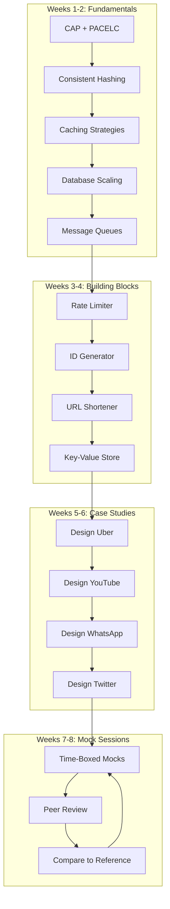
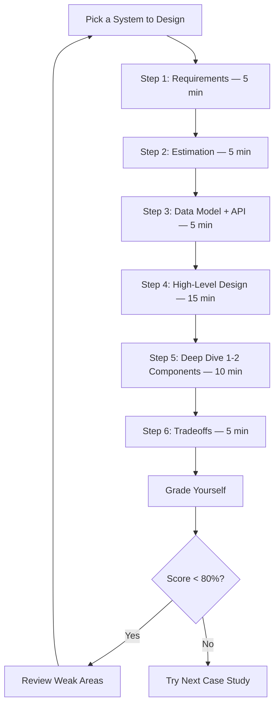

# Chapter 8: Study Plan for Any Exam

> ⏱ **2.5 hours total** · 🎯 **Intermediate** · 📋 **Recommended: Ch 1 (Goal Setting), Ch 2 (Sprint Planning)**

## Learning Objectives

After this chapter you will be able to:
- Create a study plan for any exam — SSC CGL, UPSC Prelims, GATE, FAANG interviews, professional certification
- Conduct a syllabus gap analysis to identify what you know vs what you need to learn
- Design a phased preparation timeline with milestones and checkpoints
- Build a mock test schedule that reveals weak areas before the real exam
- Adjust your plan based on performance data without panicking

## Quick Start (10 min)

1. Read the Syllabus Gap Analysis in Theory (3 min)
2. List every topic for your target exam and rate yourself 1-5 (4 min)
3. Circle your 3 lowest-rated topics — those are your priority (2 min)
4. Write down: "This week I will study ___ for ___ minutes" (1 min)
5. **Save for later:** Phased plan template, mock schedule, Common Mistakes

## Theory

### The Learning Graph

Any exam syllabus is not a list of topics to memorize — it's a graph of interconnected concepts. Learn them in dependency order. A good study plan maps the syllabus, identifies prerequisite chains, and schedules topics so that foundations come first.



### Core Building Blocks Explained

**Consistent Hashing:**
Distributes keys across servers with minimal rebalancing when servers are added or removed. Each server is mapped to multiple points on a hash ring (virtual nodes). A key is assigned to the nearest server clockwise. When a server goes down, only its keys are redistributed to the next server — not all keys.

**Caching Strategies:**
- Cache-aside: Application checks cache first. On miss, reads from DB and populates cache. Simple but can have stale data
- Read-through: Cache sits between app and DB. Cache handles the lookup. Consistent but more complex
- Write-through: Every write goes to cache first, then DB. Read is always fresh but writes are slower
- Write-back: Write to cache only. DB updated asynchronously. Fast writes but risk of data loss
- Eviction policies: LRU (remove least recently used), LFU (remove least frequently used), TTL (remove after time)

**Database Scaling:**
- Read replicas: Copy data to multiple servers. All writes go to primary, reads go to replicas. Good for read-heavy workloads
- Sharding: Split data across servers by a shard key. User ID, location, or hash of ID. Challenge: choosing the right key and handling rebalancing
- Partitioning: Split a table into smaller pieces. Can be horizontal (by rows) or vertical (by columns)
- Connection pooling: Reuse database connections instead of opening new ones for every request



### Case Study Methodology

To study any real-world system:

1. **Requirements (5 min):** Functional (what does it do?) and non-functional (how many users, latency, availability, durability)
2. **Estimation (5 min):** Back-of-envelope: QPS, storage needed, bandwidth, cache size
3. **Data model + API (5 min):** Core entities, relationships, API endpoints with request/response
4. **High-level design (10 min):** Draw the architecture: clients → load balancer → app servers → database. Add caching, queues, CDN where appropriate
5. **Deep dive (10 min):** Pick 1-2 components and detail them. How does the rate limiter work? How is data sharded?
6. **Tradeoffs (5 min):** What did you optimize for? What did you sacrifice? What would you do differently at 10x scale?

### Mock Design Session Format
### Building Block Reference Sheet

Keep this reference handy during mock sessions:

**Storage:**
- SQL: ACID, joins, structured data. Scale with read replicas + sharding
- NoSQL: flexible schema, horizontal scaling. Types: document (MongoDB), key-value (Redis), wide-column (Cassandra), graph (Neo4j)

**Caching:**
- Cache-aside: app checks cache first. Simple, can be stale
- Read-through: cache layer handles lookups. Consistent
- Write-through: every write goes to cache + DB. Fresh reads, slower writes
- Write-back: writes go to cache first, async to DB. Fast writes, risk of loss
- Eviction: LRU (most common), LFU, TTL-based

**Load balancing:**
- Round-robin: simple, doesn't account for server load
- Least connections: routes to least busy server
- IP hash: consistent routing by client IP
- Layer 4 (transport): faster, less intelligent
- Layer 7 (application): slower, understands HTTP

**Database scaling:**
- Read replicas: async copy for read-heavy workloads
- Sharding: split by key (user ID, location, hash). Rebalancing is hard
- Vertical: bigger machine. Simple, reaches limits
- Horizontal: more machines. Complex, scalable

**Message queues:**
- Kafka: high throughput, persistent, replayable. Good for event streaming
- RabbitMQ: flexible routing, reliable. Good for task queues
- SQS: fully managed AWS. Good for decoupling microservices

### Common System Design Prompt Solutions

**Design URL Shortener:**
- Core: 6-char base62 encoded ID (62^6 = 56B URLs)
- Write path: generate unique ID → store in DB → return short URL
- Read path: look up ID in cache → miss? check DB → redirect 301
- Scale: cache popular URLs, shard by ID prefix

**Design Chat System:**
- 1:1 chat: direct WebSocket connection or message queue
- Group chat: fan-out write (single copy + read indices) or fan-out read (copy to each member)
- Online presence: heartbeat (ping every X seconds) + last seen
- Scale: shard by conversation ID, use Redis for presence

**Design News Feed:**
- Write path: user posts → fan-out to followers' feed queues
- Read path: load feed from pre-computed cache → rank by time/relevance
- Scale: pull model on request (load from followers) or push model on write (pre-compute)
- Hybrid: push for active users, pull for inactive


Follow this structure for every mock session:

| Phase | Duration | Deliverable |
|-------|----------|-------------|
| Requirements | 5 min | List of functional + non-functional requirements |
| Estimation | 5 min | QPS, storage, bandwidth calculations |
| Data model + API | 5 min | Entities + endpoints |
| High-level design | 15 min | Architecture diagram |
| Deep dive | 10 min | 1-2 components detailed |
| Tradeoffs | 5 min | What you optimized, what you sacrificed |

After the session, grade yourself:
- Did I clarify requirements before designing? (Yes/No)
- Did I do back-of-envelope calculations? (Yes/No)
- Did I choose the right building blocks? (1-5)
- Did I discuss tradeoffs? (Yes/No)
- Did I handle failure scenarios? (1-5)
- Did I stay within the 45-minute time limit? (Yes/No)

## Examples

### 📝 Plain-Language Walkthrough

**Scenario:** You have 6 months to prepare for SSC CGL Tier 1 exam.

**Step 1: Syllabus Gap Analysis**
List all subjects and topics. Rate your current level (1-5):
```
Subject           Topics                     Current Level  Priority
Quantitative Apt  Number System, Algebra,    2/5            High
                  Geometry, Mensuration,
                  DI, Trigonometry
Reasoning         Verbal, Non-verbal,        3/5            Medium
                  Logical, Analytical
General Awaren    History, Polity, Geo,      2/5            High
                  Economy, Science, Current Affairs
English           Grammar, Vocab,            3/5            Medium
                  Comprehension
```

**Step 2: 6-Month Phased Plan**
```
Phase 1 (Months 1-2): Foundations
- Complete theory for Quant + Reasoning
- Read NCERTs for History, Polity, Geography
- Build vocabulary (10 words/day)

Phase 2 (Months 3-4): Practice
- Topic-wise practice tests for each subject
- Start full-length mocks (1 per week)
- Analyze every error. Create error log.

Phase 3 (Months 5-6): Mastery
- Full-length mocks (3 per week)
- Target weak areas from mock analysis
- Speed drills + revision of all formulas/concepts
- Final month: 1 mock every 2 days
```

**Step 3: Weekly Schedule Template**
```
Time          Mon         Tue         Wed         Thu         Fri         Sat         Sun
6-7 AM        Quant       Geog        Reasoning   Polity      Quant       Hist        Mock Test
7-8 PM        English     Reasoning   English     Quant       GA          Reasoning   Review
Weekend       -           -           -           -           -           -           Error analysis
```

### 💻 TypeScript Implementation (Optional)

### Example 1: Consistent Hash Ring
class ConsistentHashRing {
    private ring: Map<number, string> = new Map()  // hash → server
    private sortedKeys: number[] = []
    private readonly virtualNodes: number

    constructor(virtualNodes: number = 100) {
        this.virtualNodes = virtualNodes
    }

    addServer(server: string): void {
        for (let i = 0; i < this.virtualNodes; i++) {
            const hash = this.hash(`${server}:${i}`)
            this.ring.set(hash, server)
            this.sortedKeys.push(hash)
        }
        this.sortedKeys.sort((a, b) => a - b)
    }

    removeServer(server: string): void {
        for (let i = 0; i < this.virtualNodes; i++) {
            const hash = this.hash(`${server}:${i}`)
            this.ring.delete(hash)
        }
        this.sortedKeys = this.sortedKeys.filter(k => this.ring.has(k))
    }

    getServer(key: string): string | null {
        if (this.sortedKeys.length === 0) return null

        const hash = this.hash(key)
        const pos = this.findNearestServer(hash)
        return this.ring.get(this.sortedKeys[pos]) ?? null
    }

    getDistribution(): Map<string, number> {
        const distribution = new Map<string, number>()
        this.ring.forEach(server => {
            distribution.set(server, (distribution.get(server) ?? 0) + 1)
        })
        return distribution
    }

    private findNearestServer(hash: number): number {
        let lo = 0
        let hi = this.sortedKeys.length - 1

        while (lo < hi) {
            const mid = (lo + hi) >> 1
            if (this.sortedKeys[mid] < hash) {
                lo = mid + 1
            } else {
                hi = mid
            }
        }

        return this.sortedKeys[lo] >= hash ? lo : 0
    }

    private hash(key: string): number {
        let hash = 0
        for (let i = 0; i < key.length; i++) {
            hash = ((hash << 5) - hash) + key.charCodeAt(i)
            hash = hash & hash  // Convert to 32-bit integer
        }
        return Math.abs(hash)
    }
}
```

### Example 2: Load Balancer Strategies

```typescript
type LBStrategy = 'round-robin' | 'least-connections' | 'ip-hash'

interface ServerInstance {
    id: string
    host: string
    port: number
    connections: number
    healthy: boolean
}

class LoadBalancer {
    private servers: ServerInstance[] = []
    private currentIndex = 0

    addServer(host: string, port: number): void {
        this.servers.push({
            id: `${host}:${port}`,
            host,
            port,
            connections: 0,
            healthy: true
        })
    }

    markUnhealthy(serverId: string): void {
        const server = this.servers.find(s => s.id === serverId)
        if (server) server.healthy = false
    }

    getNextRequest(clientIp: string, strategy: LBStrategy): ServerInstance | null {
        const healthy = this.servers.filter(s => s.healthy)
        if (healthy.length === 0) return null

        switch (strategy) {
            case 'round-robin':
                return this.roundRobin(healthy)
            case 'least-connections':
                return this.leastConnections(healthy)
            case 'ip-hash':
                return this.ipHash(healthy, clientIp)
        }
    }

    private roundRobin(servers: ServerInstance[]): ServerInstance {
        const server = servers[this.currentIndex % servers.length]
        this.currentIndex++
        return server
    }

    private leastConnections(servers: ServerInstance[]): ServerInstance {
        return servers.reduce((min, s) =>
            s.connections < min.connections ? s : min
        )
    }

    private ipHash(servers: ServerInstance[], clientIp: string): ServerInstance {
        const hash = clientIp.split('')
            .reduce((h, c) => ((h << 5) - h) + c.charCodeAt(0), 0)
        return servers[Math.abs(hash) % servers.length]
    }
}
```

### Example 4: Cache Strategy Selector

```typescript
type CacheStrategy = 'cache-aside' | 'read-through' | 'write-through' | 'write-back'
type EvictionPolicy = 'LRU' | 'LFU' | 'TTL' | 'FIFO'

interface CacheRecommendation {
    strategy: CacheStrategy
    evictionPolicy: EvictionPolicy
    ttlSeconds: number
    reason: string
}

class CacheStrategySelector {
    recommend(
        readRatio: number,       // 0-1, what % of operations are reads
        consistencyRequired: boolean,
        writeLatencyTolerant: boolean,
        dataLossAcceptable: boolean
    ): CacheRecommendation {
        if (readRatio > 0.9 && consistencyRequired) {
            return {
                strategy: 'read-through',
                evictionPolicy: 'LRU',
                ttlSeconds: 3600,
                reason: 'Read-heavy with consistency needs. Read-through ensures cache is always fresh.'
            }
        }
        if (readRatio > 0.7 && !consistencyRequired) {
            return {
                strategy: 'cache-aside',
                evictionPolicy: 'LRU',
                ttlSeconds: 1800,
                reason: 'Read-heavy, stale data acceptable. Simple cache-aside with LRU eviction.'
            }
        }
        if (writeLatencyTolerant && dataLossAcceptable) {
            return {
                strategy: 'write-back',
                evictionPolicy: 'LFU',
                ttlSeconds: 300,
                reason: 'Write-heavy with tolerance for async writes. Write-back for fast writes.'
            }
        }
        return {
            strategy: 'write-through',
            evictionPolicy: 'LRU',
            ttlSeconds: 600,
            reason: 'Balance of read/write with consistency needs. Write-through for fresh reads.'
        }
    }

    estimateMemory(cacheSize: number, averageObjectSizeBytes: number): string {
        const totalBytes = cacheSize * averageObjectSizeBytes
        const totalMB = totalBytes / (1024 * 1024)
        if (totalMB > 1024) return `${(totalMB / 1024).toFixed(1)} GB`
        return `${Math.ceil(totalMB)} MB`
    }
}
```

### Example 5: Study Plan Phase Tracker

```typescript
interface Phase {
    name: 'foundations' | 'practice' | 'mastery'
    startWeek: number
    endWeek: number
    topics: string[]
    weeklyMocks: number
    targetAccuracy: number
    completed: boolean
}

class StudyPlanTracker {
    private phases: Phase[] = []
    private currentWeek = 1

    addPhase(phase: Phase): void {
        this.phases.push(phase)
    }

    setCurrentWeek(week: number): void {
        this.currentWeek = week
    }

    getCurrentPhase(): Phase | null {
        return this.phases.find(p => this.currentWeek >= p.startWeek && this.currentWeek <= p.endWeek) ?? null
    }

    getProgress(): { phase: string; week: number; completion: number }[] {
        return this.phases.map(p => {
            const phaseWeeks = p.endWeek - p.startWeek + 1
            const weeksElapsed = Math.max(0, Math.min(this.currentWeek - p.startWeek + 1, phaseWeeks))
            return {
                phase: p.name,
                week: weeksElapsed,
                completion: Math.round((weeksElapsed / phaseWeeks) * 100)
            }
        })
    }

    shouldTransition(accuracy: number): { transition: boolean; reason: string } {
        const current = this.getCurrentPhase()
        if (!current) return { transition: false, reason: 'No active phase' }

        if (accuracy >= current.targetAccuracy) {
            const nextPhaseIdx = this.phases.findIndex(p => p.name === current.name) + 1
            if (nextPhaseIdx < this.phases.length) {
                return {
                    transition: true,
                    reason: `Accuracy ${accuracy}% ≥ ${current.targetAccuracy}%. Move to ${this.phases[nextPhaseIdx].name}.`
                }
            }
            return { transition: true, reason: 'All phases complete. Begin maintenance mode.' }
        }

        return {
            transition: false,
            reason: `Accuracy ${accuracy}% < ${current.targetAccuracy}%. Stay in ${current.name}. Focus on weak topics.`
        }
    }
}
```

### Example 3: Design Evaluator

```typescript
interface DesignScore {
    requirementsClarity: 1 | 2 | 3 | 4 | 5
    estimationAccuracy: 1 | 2 | 3 | 4 | 5
    buildingBlocks: 1 | 2 | 3 | 4 | 5
    tradeoffAnalysis: 1 | 2 | 3 | 4 | 5
    failureHandling: 1 | 2 | 3 | 4 | 5
    timeManagement: boolean
}

interface DesignEvaluation {
    score: DesignScore
    strengths: string[]
    weaknesses: string[]
    recommendedStudy: string[]
    overall: number  // percentage
}

class DesignEvaluator {
    evaluate(design: DesignScore): DesignEvaluation {
        const weaknesses: string[] = []

        if (design.requirementsClarity < 4) {
            weaknesses.push('Clarify functional and non-functional requirements before designing')
        }
        if (design.estimationAccuracy < 3) {
            weaknesses.push('Practice back-of-envelope calculations (QPS, storage, bandwidth)')
        }
        if (design.buildingBlocks < 4) {
            weaknesses.push('Study building blocks: caching strategies, database scaling, message queues')
        }
        if (design.tradeoffAnalysis < 4) {
            weaknesses.push('Always discuss tradeoffs: what did you optimize? what did you sacrifice?')
        }
        if (design.failureHandling < 3) {
            weaknesses.push('Add failure scenarios: what happens when a component goes down?')
        }

        const scoreValues = [
            design.requirementsClarity,
            design.estimationAccuracy,
            design.buildingBlocks,
            design.tradeoffAnalysis,
            design.failureHandling
        ]
        const overall = (scoreValues.reduce((s, v) => s + v, 0) / 25) * 100

        return {
            score: design,
            strengths: scoreValues.filter(v => v >= 4).map(() => 'Good'),
            weaknesses,
            recommendedStudy: weaknesses.map(w => {
                if (w.includes('building blocks')) return 'Study: Consistent Hashing, Caching, DB Scaling'
                if (w.includes('tradeoffs')) return 'Study: CAP theorem, PACELC, design tradeoff patterns'
                if (w.includes('failure')) return 'Study: fault tolerance, replication, failover strategies'
                if (w.includes('estimation')) return 'Practice: back-of-envelope calculations'
                return 'Review fundamentals'
            }),
            overall: Math.round(overall)
        }
    }

    getImprovementPath(evaluations: DesignEvaluation[]): string[] {
        const allWeaknesses = evaluations.flatMap(e => e.weaknesses)
        const frequency = new Map<string, number>()
        allWeaknesses.forEach(w => frequency.set(w, (frequency.get(w) ?? 0) + 1))

        return [...frequency.entries()]
            .sort((a, b) => b[1] - a[1])
            .slice(0, 3)
            .map(([weakness]) => weakness)
    }
}
```

## Summary

- System design is a graph of interconnected concepts. Learn fundamentals before building blocks, building blocks before case studies
- Master the core building blocks first: consistent hashing, caching strategies, database scaling, message queues
- Study case studies systematically: requirements → estimation → data model → high-level design → deep dive → tradeoffs
- Mock design sessions should follow a strict 45-minute format. Grade yourself after every session
- The fastest way to improve is to compare your design to a reference architecture

## Practical Takeaways

1. Learn one fundamental per day for the first 2 weeks (CAP, consistent hashing, caching, DB scaling, queues)
2. For every case study, design the system yourself before looking at the reference architecture
3. Use consistent hashing as your go-to distribution strategy — it's the most FAANG-interviewed building block
4. Always spend 5 minutes clarifying requirements before drawing anything
5. Every design session must end with tradeoff analysis — "I optimized for X at the cost of Y"

## Common Mistakes

| Mistake | Why It Fails | Fix |
|---------|-------------|-----|
| Starting without a syllabus gap analysis | You study what you already know | List every topic. Rate 1-5. Study weakest first |
| Equal time to all subjects | Strong areas get better while weak areas stay weak | Spend 60% of time on weak areas, 40% on maintenance |
| Avoiding mocks until "ready" | You never feel ready. Mocks reveal blind spots | Take a diagnostic in Week 1. Repeat every 2 weeks |
| Not adjusting from mock data | Same mistakes in week 1 and week 12 | Track error types. If the same type appears 3 mocks in a row, change your approach |

## Chapter Quiz

<details>
<summary>1. What are the 4 core building blocks to learn first?</summary>
<p>Consistent hashing (key distribution), caching strategies (cache-aside, read-through, write-through, write-back), database scaling (read replicas, sharding, partitioning), and message queues (Kafka topics, RabbitMQ exchanges).</p>
</details>

<details>
<summary>2. How many weeks should you spend on fundamentals before case studies?</summary>
<p>2 weeks on fundamentals (CAP, hashing, caching, DB scaling, queues). Then 2 weeks on building blocks (rate limiter, ID generator, URL shortener, key-value store). Then 2 weeks on case studies.</p>
</details>

<details>
<summary>3. What's the first step in any mock design session?</summary>
<p>Clarify requirements (5 minutes). List functional requirements (what the system does) and non-functional requirements (latency, availability, durability, scale). Do not draw anything until requirements are clear.</p>
</details>

<details>
<summary>4. What's the purpose of virtual nodes in consistent hashing?</summary>
<p>Virtual nodes ensure even distribution of keys across servers. Without virtual nodes, if servers have different capacities or a server is added/removed, the distribution can become skewed. Virtual nodes spread each server across multiple points on the hash ring.</p>
</details>

<details>
<summary>5. What should you evaluate first when reviewing your own design?</summary>
<p>Did I clarify requirements before designing? This is the most common failure point. If you didn't spend 5 minutes on requirements, the rest of the design may be solving the wrong problem. Check this before evaluating technical choices.</p>
</details>

## Exercises

1. **Gap analysis for any exam:** Pick any exam syllabus (SSC CGL, UPSC, GATE, or a certification). List every subject and topic. Rate yourself 1-5 on each. Identify your top 3 priority topics. Write a 1-sentence reason for each priority
2. **Create a study plan:** Using the gap analysis from exercise 1, create a phased study plan. Divide your available time into 3 phases: Foundations, Practice, Mastery. Assign specific topics to each week. Include milestones (e.g., "Complete Algebra by Week 4")
3. **Mock test schedule:** Design a mock test schedule for the final 2 months before your exam. Include: frequency of mocks, which subjects to focus on between mocks, and a post-mock analysis template (error log, weak area identification, next-action items)
4. **Consistent Hash Ring (TypeScript):** Use the ConsistentHashRing class. Add 3 servers, distribute 1000 keys, check the distribution. Remove one server and see how many keys move
5. **Design Evaluator (TypeScript):** Do a 45-minute mock design session for URL Shortener. Use the DesignEvaluator to score yourself. Identify 2 areas to improve

## Quick Reference

### Syllabus Gap Analysis
| Subject | Topic | Current Level (1-5) | Priority | Study Hours Needed |
|---------|-------|-------------------|----------|-------------------|
| | | | | |

### 3-Phase Exam Plan
| Phase | Duration | Focus | Milestone |
|-------|----------|-------|-----------|
| Foundations | 33% of time | Theory + concepts | Complete all topics at level 3+ |
| Practice | 33% of time | Topic-wise tests + error analysis | 80%+ accuracy per topic |
| Mastery | 33% of time | Full mocks + speed drills | 90%+ in mock tests |

### Mock Test Cadence
- Phase 1: 1 diagnostic only
- Phase 2: 1 mock per week
- Phase 3: 3 mocks per week

### Priority Rule
60% of study time on weakest topics. 40% on maintenance (review + strong areas).
