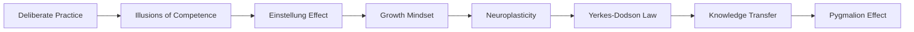
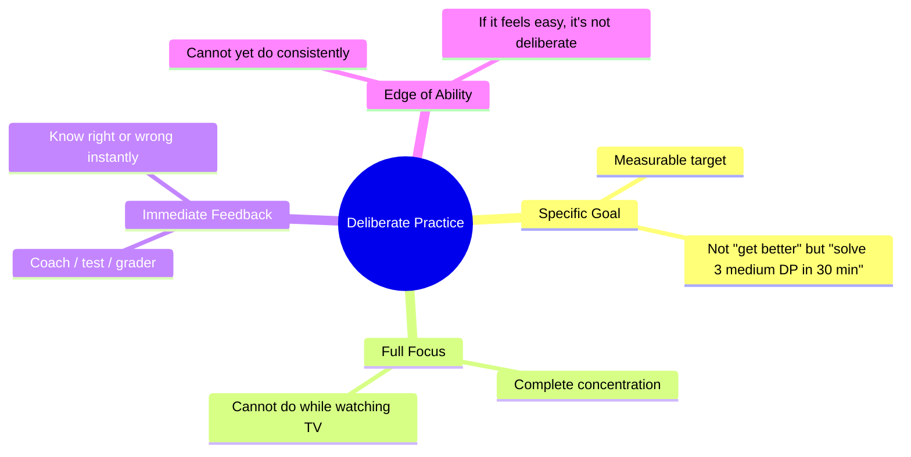
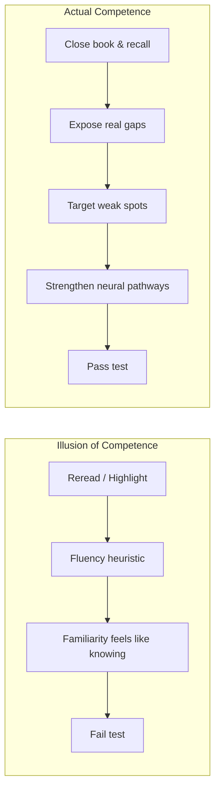
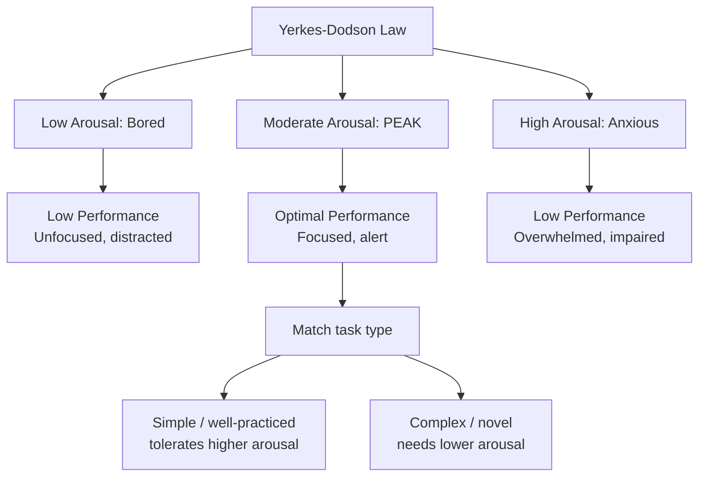
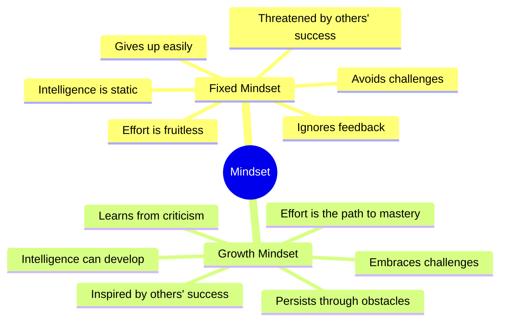

# Chapter 2: Practice, Mindset & Performance

> **Prerequisites:** [Chapter 1: How Your Brain Learns](./ch-01-how-your-brain-learns.md) — Understanding focused vs. diffuse modes and chunking.
> **Next:** [Chapter 3: Active Recall & Spaced Repetition](./ch-03-active-recall-spaced-repetition.md) — Master the two most powerful learning techniques in cognitive science.

> **Learning isn't just about technique — it's about what you believe, how you practice, and how you take care of your brain. This chapter tears down the illusions that waste your time and replaces them with evidence-based strategies that compound.**

The difference between learners who plateau and learners who keep improving isn't IQ — it's how they practice, what they believe about their own ability, and whether they understand the brain's hidden quirks. You'll learn why re-reading feels productive but isn't, why stress can help or destroy your performance, and why your brain is literally rewiring itself as you read this sentence. By the end, you'll have a practice framework rooted in cognitive science, not folklore.

---

## Learning Objectives

After completing this chapter, you will be able to:

<!-- Image Gallery -->
<section class="lesson-visuals" aria-label="Visual learning resources">
  <header><span>VISUAL LEARNING</span><h2>See it. Review it. Remember it.</h2></header>
  <a class="lesson-visual-card" href="../../assets/images/lessons/learning-how-to-learn/ch-02-practice-mindset/handwritten-notes.png" target="_blank" rel="noopener">
    
    <span><strong>Handwritten notes</strong>Condensed notes for deliberate review.</span>
  </a>
  <a class="lesson-visual-card" href="../../assets/images/lessons/learning-how-to-learn/ch-02-practice-mindset/sticky-notes.png" target="_blank" rel="noopener">
    
    <span><strong>Sticky-note revision</strong>Fast recall prompts for revision.</span>
  </a>
  <a class="lesson-visual-card" href="../../assets/images/lessons/learning-how-to-learn/ch-02-practice-mindset/visual-explanation.png" target="_blank" rel="noopener">
    
    <span><strong>Visual concept guide</strong>A connected explanation of the key ideas.</span>
  </a>
</section>
<!-- End Image Gallery -->


- Apply deliberate practice principles to any skill by identifying the performance edge, getting immediate feedback, and working with a coach or role model
- Recognize illusions of competence (familiarity vs. recall, fluency, re-reading) and replace them with production-based verification
- Distinguish recall tests from recognition tests and use both strategically for different learning goals
- Understand the Einstellung effect (mental set) and use interleaving, deliberate reset, and beginner's mind to break out of ruts
- Explain knowledge transfer (near vs. far) and design practice that generalizes beyond the training context
- Identify attention residue and structure context switches to minimize cognitive drag
- Apply the Yerkes-Dodson law to calibrate arousal for optimal performance in high-stakes situations
- Explain the growth mindset, distinguish it from false growth mindset, and apply process praise and failure reframing
- Understand neuroplasticity as the biological substrate of learning and apply it to recovery and skill acquisition at any age
- Critically evaluate the 10,000-hour rule and replace it with the more accurate concept of deliberate practice volume
- Describe the Pygmalion effect and leverage high expectations in mentorship, teaching, and self-talk
- Optimize brain health through sleep, exercise, nutrition, and stress management for sustained learning


---

### Chapter at a Glance

| Topic | Key Insight | Practical Takeaway |
|-------|-------------|-------------------|
| Deliberate Practice | Purposeful, feedback-driven practice at the edge of ability | Identify one specific skill gap and work on it with immediate feedback |
| Illusions of Competence | Re-reading and highlighting feel productive but aren't | Replace passive review with recall-based testing to verify learning |
| Einstellung Effect | Mental set traps you in familiar problem-solving patterns | Interleave topics and explain to novices to break out of ruts |
| Growth Mindset | Belief that ability is developed through effort and strategy | Praise process and strategy, not talent; reframe failures as learning data |
| Neuroplasticity | Brain rewires itself throughout life via new connections | Use deliberate practice to strengthen neural pathways at any age |
| Yerkes-Dodson Law | Optimal performance requires moderate arousal levels | Calibrate stress before high-stakes situations — too little or too much undermines results |
| Knowledge Transfer | Skills generalize when practiced across varied contexts | Design practice with explicit near and far transfer goals |
| Pygmalion Effect | High expectations from others drive higher performance | Set high expectations in mentorship, teaching, and self-talk |



---

## Q&A Content

### Q8: What is deliberate practice, and how is it different from regular practice?

**Answer:**

Deliberate practice is **structured, goal-directed practice with immediate feedback** at the edge of your current ability. It was codified by psychologist Anders Ericsson after decades studying expert performers — musicians, chess grandmasters, athletes, memory champions. Regular practice (naive practice) is just doing the thing. Deliberate practice is doing the thing with **intent, feedback, and progressive overload**.



**The four pillars of deliberate practice:**

1. **Specific goal.** Not "get better at coding" but "solve 3 medium-level LeetCode problems on dynamic programming within 30 minutes each."
2. **Focus.** Full concentration, not passive repetition. If you can do it while watching TV, it's not deliberate.
3. **Immediate feedback.** A coach, a test, a judge, an automated grader — something that tells you right away whether you got it right.
4. **Comfort-zone edge.** You're working on something you cannot yet do consistently. If it feels easy, you're not doing deliberate practice.

**Naive practice vs. deliberate practice:**

```java
// NAIVE PRACTICE: Same problem, same difficulty, no timer
public class NaivePractice {
    // Solves easy problems daily but never progresses in difficulty
    public int add(int a, int b) {
        return a + b;  // Already mastered — zero growth
    }
}

// DELIBERATE PRACTICE: Targets specific weakness with constraints
public class DeliberatePractice {
    // Goal: Master sliding window technique in 25 minutes
    // Feedback: Compare output against test cases immediately
    
    public int lengthOfLongestSubstring(String s) {
        int n = s.length();
        int maxLen = 0;
        int left = 0;
        int[] freq = new int[128];
        
        for (int right = 0; right < n; right++) {
            freq[s.charAt(right)]++;
            
            while (freq[s.charAt(right)] > 1) {
                freq[s.charAt(left)]--;
                left++;
            }
            
            maxLen = Math.max(maxLen, right - left + 1);
        }
        return maxLen;
    }
}
```

The first example adds nothing to your ability. The second — done under time pressure, with test feedback, after identifying sliding window as a weak area — is deliberate practice.


**Try This:** Pick one skill you're learning. Write down: (1) one specific, measurable goal for today's session, (2) how you'll get immediate feedback, (3) what makes this session harder than what you can already do. Do not start practicing until you've written all three.

> **Pro Tip:** Set a timer for each deliberate practice session. A goal without a time constraint lacks urgency. "Solve 2 medium DP problems in 40 minutes" is dramatically more effective than "work on DP problems."

**One-Sentence Takeaway:** Deliberate practice requires a specific goal, immediate feedback, and challenge just beyond your current ability — time alone does not build expertise.

---

### Q9: Why do re-reading and highlighting feel productive but aren't?

**Answer:**

Re-reading and highlighting create the **illusion of competence** — you mistake **familiarity** for **knowledge**. When you re-read a textbook passage, your brain processes it more fluently the second time. That fluency feels like understanding, but it's just perceptual priming. You're recognizing the words, not recalling the ideas.



**Why re-reading tricks you:**

1. **Fluency heuristic.** Your brain interprets "easy to process" as "well understood." The second read is smoother, so you feel smarter.
2. **No retrieval.** You never force your brain to reconstruct the idea from scratch. Retrieval is what strengthens neural pathways — re-reading is just passive input.
3. **False confidence.** Studies (Rohrer & Pashler, 2007) show that students who re-read predict higher test scores than those who do active recall — but actually score lower.


**The Java analogy:**

```java
// RE-READING (illusion of competence)
Reading a book about Streams API:
  "Stream.map transforms elements... Stream.filter selects elements..."
  Read twice → feels familiar → "I know streams!" → Fails coding test

// ACTIVE RECALL (actual competence)
Cover the book and write from memory:
  public List<Integer> doubleEvens(List<Integer> nums) {
      return nums.stream()
                 .filter(n -> n % 2 == 0)  // filter: did I remember the syntax?
                 .map(n -> n * 2)          // map: what's the method reference syntax?
                 .collect(Collectors.toList());
  }
  // Now check. Wrong? Good — that gap is where learning happens.
```

**Why highlighting is worse:**

Highlighting is **passive selection**, not **active processing**. Your hand moves, but your brain doesn't build a model. Worse, it creates an illusion of ownership — "I marked the important parts, therefore I know them." Multiple studies show highlighting has **zero or negative** correlation with learning outcomes.

**The replacement:**

- After one read, close the book. Write everything you remember (Blank Page Method).
- Use **recall-based note-taking**: read a section, look away, summarize in your own words.
- Never re-read as a study activity. Only re-read to verify gaps exposed by recall.

**Try This:** Take a page you read yesterday. Without looking, write down everything you remember from it. Now check. Rate your accuracy from 1–5. Do this for five different pages. If your average is below 4, your current study methods are giving you illusions.

> **Warning:** Highlighting is not just ineffective — it can be actively harmful. It creates "warmth" toward marked text that tricks you into skipping it during review, meaning you actually spend less time on the most important content. Use highlighting only as a signal for what to turn into recall questions later.

**One-Sentence Takeaway:** Re-reading and highlighting create illusions of competence through passive recognition — the only reliable way to know if you've learned something is to recall it from memory without looking.

---

### Q10: What is the difference between a recall test and a recognition test?

**Answer:**

A **recall test** requires you to retrieve information from memory with minimal cues. A **recognition test** requires you to identify whether you've seen something before. This distinction is critical because recall and recognition rely on different cognitive processes and produce different learning outcomes.

**Recall test (harder, better for long-term retention):**
- Open-ended: "Write the code for a binary search."
- **Cued recall:** "What's the time complexity of binary search?"
- **Free recall:** "Write everything you remember about binary search."
- Requires the brain to **reconstruct** the information. This reconstruction strengthens the neural pathways.

**Recognition test (easier, good for initial exposure):**
- Multiple choice: "Which of these is the binary search time complexity? A) O(n) B) O(log n) C) O(n²) D) O(1)"
- True/false: "Binary search requires the array to be sorted. True/False."
- Matching: Match algorithms to their time complexities.

**Java code to illustrate the cognitive difference:**

```java
// RECOGNITION (easy — your brain just needs to feel "I've seen this")
// Which of these is a correct binary search implementation?
// A) The one with while(left <= right) and mid = (left + right) / 2
// B) The one with for(int i = 0; i < n; i++)
// You can recognize A even if you can't write it from scratch.

// RECALL (hard — your brain must reconstruct from scratch)
public int binarySearch(int[] arr, int target) {
    int left = 0;
    int right = arr.length - 1;
    
    while (left <= right) {
        int mid = left + (right - left) / 2;  // Did I remember to avoid overflow?
        
        if (arr[mid] == target) return mid;
        if (arr[mid] < target) left = mid + 1;
        else right = mid - 1;
    }
    return -1;
}
```

Recognition tests are useful for **initial exposure** and for building confidence, but they systematically **overestimate** what you know. Recall tests (especially free recall) give you an honest assessment.

**How to use both strategically:**

| Phase | Test Type | Purpose |
|-------|-----------|---------|
| First exposure | Recognition | Build basic familiarity, learn terminology |
| After first recall failure | Recognition prompts | Give yourself hints to trigger the memory |
| Strengthening | Cued recall | Practice with minimal hints |
| Mastery verification | Free recall | Prove you can reconstruct the entire concept from scratch |
| Long-term maintenance | Spaced free recall | Schedule reviews that force full reconstruction |

**Try This:** Take a concept you think you know. First, write down everything about it from memory (free recall). Then look at a multiple-choice question on the same topic. Compare how you felt during each — the recognition probably felt easier, but the recall showed you your true gaps.

> **Pro Tip:** After any study session, spend 2 minutes writing a "recall summary" — close everything and write 3-5 bullet points of what you remember. This single habit separates students who retain knowledge from those who just feel like they do.

**One-Sentence Takeaway:** Free recall tests true knowledge by demanding reconstruction from scratch — never confuse recognizing an answer in multiple choice with being able to produce it from memory.

---

### Q11: What is the Einstellung effect and how do I avoid it?

**Answer:**

The **Einstellung effect** (German for "attitude" or "mental set") is the brain's tendency to reach for a familiar solution even when a better one exists. It's the cognitive equivalent of "when you have a hammer, everything looks like a nail." The more expertise you have in one approach, the harder it is to see alternatives.

**Classic demonstration (Luchins' water jug problem):**

```java
public class EinstellungEffect {
    // Given jugs of capacities A, B, C, measure exactly D.
    // Participants who solved problems like (21, 127, 3 → 100)
    // using formula (B - A - 2C) kept using that formula even
    // when a simpler solution existed.
    
    // PROBLEM: Jug A=21, Jug B=127, Jug C=3. Get D=100.
    // Complex solution: B - A - 2C = 127 - 21 - 6 = 100
    
    // Later problem: Jug A=23, Jug B=49, Jug C=3. Get D=20.
    // Experts kept doing: B - A - 2C = 49 - 23 - 6 = 20 (complex)
    // When simpler: A - C = 23 - 3 = 20 (obvious, once you see it)
```


**Why it matters for programming:**

The Einstellung effect is why experienced developers sometimes write worse code than beginners on certain problems. You've internalized patterns (singleton, factory, observer, etc.) and reach for them automatically — even when a simple function would do.

**Real-world Java example:**

```java
// EINSTELLUNG SOLUTION (reaching for familiar pattern)
// Problem: need to filter a list
// Developer trained in OOP reaches for Strategy Pattern

interface FilterStrategy {
    boolean apply(int value);
}

class EvenFilter implements FilterStrategy {
    public boolean apply(int value) { return value % 2 == 0; }
}

class FilterProcessor {
    private FilterStrategy strategy;
    public FilterProcessor(FilterStrategy s) { this.strategy = s; }
    
    public List<Integer> process(List<Integer> input) {
        List<Integer> result = new ArrayList<>();
        for (int x : input) {
            if (strategy.apply(x)) result.add(x);
        }
        return result;
    }
}
// 20 lines, 3 classes, 1 interface, over-engineered

// BETTER SOLUTION (breaking the mental set)
public List<Integer> getEvens(List<Integer> input) {
    return input.stream()
                .filter(x -> x % 2 == 0)
                .collect(Collectors.toList());
}
// 3 lines, no ceremony
```

**How to break the Einstellung effect:**

1. **Interleave practice.** Mix different problem types in the same session so your brain can't settle into one pattern.
2. **Deliberate reset.** After solving one problem, consciously ask: "If I'd never solved this kind of problem before, what would I try first?"
3. **Explain to a beginner.** Teaching forces you to question assumptions. A beginner's questions expose your mental set.
4. **Solve backward.** Start from the desired output and work backward. This breaks the forward-chaining mental set.
5. **Seek disconfirming evidence.** Explicitly ask: "What if my favorite approach doesn't work here? What would fail first?"

The Einstellung effect never disappears — even grandmasters fall into it. The skill is recognizing it faster.

**Try This:** Solve a LeetCode problem you've seen before using your usual approach. Now delete everything and solve it again using a completely different data structure or algorithm (if you used DP, try a greedy approach; if you used HashMap, try sorting). Compare the solutions.

> **Remember:** The goal isn't to find the "best" solution the second time. The goal is to notice that your brain automatically reached for the first solution — and that awareness is the first step to breaking any mental set.

**One-Sentence Takeaway:** The Einstellung effect traps your thinking into familiar patterns — actively generating alternative approaches breaks the mental set and builds flexible problem-solving.

---

### Q12: What is knowledge transfer, and how can I get better at it?

**Answer:**

**Knowledge transfer** is the ability to apply knowledge learned in one context to a different context. It's the holy grail of learning — what separates flexible expertise from brittle knowledge. There are two types:

**Near transfer:** Applying knowledge to a similar context.
- Learn binary search in an array → apply it to find a value in a rotated sorted array
- Learn Java Streams → apply it to Kotlin sequences

**Far transfer:** Applying knowledge to a very different context.
- Learn binary search → apply the same divide-and-conquer logic to debugging (bisect the codebase to find the buggy commit)
- Learn recursion → apply it to understanding directory tree traversal in your file system

**Why transfer is hard:**

```java
// NEAR TRANSFER (most learners can do this)
public class NearTransfer {
    // Learned: binary search in a sorted array
    public int binarySearch(int[] arr, int target) { /* ... */ }
    
    // Near transfer: binary search in a rotated sorted array
    public int searchRotated(int[] arr, int target) {
        // Same core concept, slightly different condition
        int left = 0, right = arr.length - 1;
        while (left <= right) {
            int mid = left + (right - left) / 2;
            if (arr[mid] == target) return mid;
            // Extra condition: check which half is sorted
            if (arr[left] <= arr[mid]) {  // Left half is sorted
                if (target >= arr[left] && target < arr[mid])
                    right = mid - 1;
                else left = mid + 1;
            } else {  // Right half is sorted
                if (target > arr[mid] && target <= arr[right])
                    left = mid + 1;
                else right = mid - 1;
            }
        }
        return -1;
    }
}

// FAR TRANSFER (few learners achieve this)
public class FarTransfer {
    // Application: git bisect uses binary search to find the commit
    // that introduced a bug. The "array" is the commit history.
    // The "sorted" property is time.
    // The "target" is the first commit that breaks the test.
    
    public Commit findBuggyCommit(List<Commit> history, 
                                   Function<Commit, Boolean> hasBug) {
        int left = 0, right = history.size() - 1;
        
        while (left < right) {
            int mid = left + (right - left) / 2;
            // Is the bug present at this commit?
            // If yes, search earlier commits to find the first occurrence
            if (hasBug.apply(history.get(mid))) {
                right = mid;  // Bug exists here, so origin is left
            } else {
                left = mid + 1;  // Bug doesn't exist here yet
            }
        }
        return history.get(left);
    }
}
```

**How to improve transfer:**

1. **Abstract the principle.** After solving a problem, write down the general principle in 1–2 sentences. Don't mention the specific domain.
2. **Generate your own examples.** Come up with 3 different contexts where the same principle applies. The act of generation builds flexible mental models.
3. **Varied practice.** Solve the same type of problem in different domains — DSA, system design, debugging, project management.
4. **Explanatory questioning.** Ask "why does this work?" and "when would this NOT work?" repeatedly.
5. **Contrasting cases.** Compare two solutions to the same problem and identify the common deep structure beneath their surface differences.

**Try This:** Take the concept of "caching" from computer science. Write down 3 completely different domains where caching applies (e.g., web browser caching, memoization in DP, CPU cache hierarchy, database query caching, DNS caching). For each one, write the core caching principle in a single sentence. If the sentence is the same for all three, you've achieved transfer.

> **Pro Tip:** When learning a new concept, actively ask "Where else have I seen this pattern?" before moving on. Forcing yourself to generate cross-domain examples in the moment strengthens the neural pathways that make far transfer possible later.

**One-Sentence Takeaway:** Knowledge transfer requires building abstract mental models through varied practice — actively seeking cross-domain connections trains your brain to apply concepts in new contexts.

---

### Q13: What is attention residue and why does context switching hurt productivity?

**Answer:**

**Attention residue** is the cognitive phenomenon where your brain remains partially focused on Task A after you've switched to Task B. The more complex or incomplete Task A was, the more attention residue lingers. Research by Sophie Leroy showed that attention residue reduces performance on Task B by up to 30-50%.

**Why it happens:**

Your brain doesn't instantly reallocate cognitive resources. The previous task's goals, context, and emotional state persist in working memory. Each switch costs not just the time of the switch itself (which is small — a few seconds) but the **resumption cost** (minutes to fully re-engage).

**Java analogy:**

```java
public class AttentionResidueSimulation {
    
    // Scenario: Student checks Instagram while studying
    
    public static void studySession() {
        // CODE REVIEW (Task A) — high complexity
        // Student is deep in understanding merge sort
        String[] code = {"int mid = left + (right - left) / 2;",
                         "mergeSort(arr, left, mid);",
                         "mergeSort(arr, mid + 1, right);"};
        
        // Student has arrays, recursion, divide-and-conquer in working memory
        // Working memory state: {left, right, mid, recursion stack...}
        
        // ATTENTION RESIDUE trigger: Switch to Instagram
        // New mental state: {photo, like count, comment, notification...}
        
        // Return to studying — ATTENTION RESIDUE persists
        // Working memory state: {left, right, mid, recursion stack, 
        //                       photo, like count, comment, notification} ← LOADED
        
        // Time to re-establish previous context: 15-20 minutes
        // Quality of work during that time: 50-70% of normal
    }
}
```

**The Pomodoro Technique addresses this directly:**

A 25-minute focus block limits attention residue because:
1. The block is short enough to sustain full focus
2. You know a break is coming, so you don't context-switch prematurely
3. The break provides a clean reset before the next focus block

**Java code: Pomodoro with attention residue management:**

```java
import java.util.Timer;
import java.util.TimerTask;

public class PomodoroWithContextSwitchManagement {
    
    public static class FocusBlock<T> {
        private final String taskName;
        private final int durationMinutes;
        
        public FocusBlock(String taskName, int minutes) {
            this.taskName = taskName;
            this.durationMinutes = minutes;
        }
        
        public T execute(Supplier<T> task) {
            System.out.println("=== START: " + taskName + " (" + durationMinutes + "min) ===");
            long start = System.currentTimeMillis();
            
            T result = task.get();
            
            long elapsed = System.currentTimeMillis() - start;
            System.out.println("=== END: " + taskName + " (" + (elapsed / 60000) + "min) ===");
            
            // Clean break: write progress note to minimize residue
            logProgress(taskName, result);
            
            // Transition ritual: stand up, stretch, deep breath
            System.out.println("Transition ritual: stand, stretch, breathe → clean slate");
            
            return result;
        }
        
        private void logProgress(String task, T result) {
            // Writing down where you are reduces rumination during next block
            System.out.println("[Residue Shield] " + task + " progress logged");
        }
    }
}
```

**Strategies to minimize attention residue:**

1. **Batched processing.** Group similar tasks into blocks. All emails at 10 AM, all coding at 2 PM.
2. **Transition rituals.** A consistent routine (stretch, deep breath, write a progress note) between tasks signals "done."
3. **Completion bias awareness.** Don't switch mid-stream unless absolutely necessary. Incomplete tasks create more residue.
4. **Digital boundaries.** Close all tabs and apps related to Task A before starting Task B. Visual cues maintain residue.
5. **The 2-minute capture.** Before switching, spend 2 minutes writing where you left off and what to do next. Clears closure-dependent residue.

**Try This:** For one day, whenever you switch tasks, do a "clean break" — write one sentence about where you left off and one sentence about what comes next. Then wait 60 seconds before starting the new task. Compare your focus quality to a normal day.

> **Warning:** Social media apps are designed to maximize attention residue. The infinite scroll creates incomplete tasks (there's always another post), which means maximum residue when you return to studying. If you must take a break, stand up and walk — don't open an app.

**One-Sentence Takeaway:** Attention residue from incomplete tasks fragments focus for 20+ minutes — written closure and clean breaks between tasks prevent cognitive carryover.

---

### Q14: How do arousal and stress affect learning and performance?

**Answer:**

The relationship between arousal (stress, anxiety, excitement) and performance follows the **Yerkes-Dodson law** — an inverted-U curve. Moderate arousal produces peak performance; too little makes you bored and unfocused; too much makes you anxious and impaired.



**The Yerkes-Dodson curve:**

```
Performance
    ↑
    |              .
    |           .     .
    |         .         .
    |       .    PEAK    .
    |     .                 .
    |   .                     .
    | .                         .
    +--------------------------------→ Arousal
    Bored    Optimal     Overwhelmed
```

**Different tasks need different arousal levels:**

| Task Type | Optimal Arousal | Example |
|-----------|-----------------|---------|
| Simple/well-practiced | High | Typing code you've written 100 times, public speaking of a rehearsed talk |
| Complex/novel | Low-Moderate | Learning a new framework, solving an unfamiliar problem, debugging a new codebase |
| Physical/endurance | High | Running a race, delivering a presentation, coding interview (after preparation) |
| Creative/insight | Low | Brainstorming, design thinking, exploring solution space |


**Java code example: The arousal-performance relationship:**

```java
public class YerkesDodsonLaw {

    public static double performance(double arousal, TaskComplexity complexity) {
        // Simplified inverted-U model: performance = -k(arousal - optimal)^2 + max
        double optimalArousal = switch (complexity) {
            case SIMPLE -> 0.8;    // High arousal works well
            case MODERATE -> 0.6;   // Moderate arousal
            case COMPLEX -> 0.4;    // Low arousal is better
            case CREATIVE -> 0.3;   // Very low for insight problems
        };
        
        return -2.0 * Math.pow(arousal - optimalArousal, 2) + 1.0;
    }
    
    public enum TaskComplexity { SIMPLE, MODERATE, COMPLEX, CREATIVE }
    
    public static void test() {
        // A coding interview (MODERATE complexity if prepared)
        double interviewArousal = 0.7;  // Nerves are helpful
        double interviewPerf = performance(interviewArousal, TaskComplexity.MODERATE);
        // Result: ~0.98 — near peak
        
        // Learning a new framework (COMPLEX)
        double learningArousal = 0.8;  // Too anxious to absorb
        double learningPerf = performance(learningArousal, TaskComplexity.COMPLEX);
        // Result: ~0.68 — impaired
        
        // Solution: Reduce arousal before complex learning
        // Deep breathing, walk, lower stakes framing
        double calmerArousal = 0.4;
        double calmerPerf = performance(calmerArousal, TaskComplexity.COMPLEX);
        // Result: ~1.0 — peak
    }
}
```

**Practical strategies by situation:**

| Situation | Problem | Strategy |
|-----------|---------|----------|
| Before a coding interview | Too anxious (high arousal) | Power pose, slow breathing (4-4-8 pattern), reframe as "detective solving a puzzle" |
| Before studying a hard topic | Too relaxed (low arousal) | Set a timer, stand up, create mild pressure with a commitment |
| After a bad performance review | Shame → high arousal → can't learn | Walk first, let the amygdala settle, then review systematically |
| Before a creative session | Need low arousal | Open-ended time, no deadline, ambient music, comfortable space |

**Try This:** Before your next study session, rate your arousal from 1 (asleep) to 10 (panicking). Identify the task complexity. If your arousal is far from optimal, spend 5 minutes adjusting it — either calming down (deep breathing) or ramping up (timer, stand up, caffeine). Note whether the session goes better than usual.

> **Pro Tip:** Keep an "arousal log" for one week. Rate your arousal (1-10) before each study session and note the task type. You'll quickly identify a pattern: your best sessions happen within a specific arousal range. Use that range as your target zone before every future session.

**One-Sentence Takeaway:** Performance follows an inverted-U curve relative to arousal — match your arousal level to task complexity for optimal learning outcomes.

---

### Q15: What is the growth mindset, and does it actually matter?

**Answer:**

**Growth mindset**, coined by Carol Dweck, is the belief that intelligence and ability can be developed through effort, learning, and persistence. The opposite — **fixed mindset** — is the belief that intelligence is static and talent is innate.



**Why it matters:**

Mindset isn't just feel-good psychology. Dweck's research shows it affects:
- **How you respond to failure:** Fixed mindset → "I'm not good at this" (identity threat). Growth mindset → "I need a better strategy" (process feedback).
- **Whether you seek challenges:** Fixed mindset → stick to what you're good at. Growth mindset → explore the edge of competence.
- **How you interpret effort:** Fixed mindset → "If I have to try hard, I must not be talented." Growth mindset → "Effort is how you grow."
- **Brain activity:** Fixed mindset shows more activity in emotional centers after failure. Growth mindset shows more activity in learning and error-correction centers.

**The false growth mindset trap:**

Many people claim a growth mindset but actually practice a **false growth mindset**:
- Praising effort alone, regardless of strategy or outcome
- Saying "you can do anything!" without acknowledging constraints
- Using growth-mindset language while still avoiding challenges

**Real growth mindset has three parts:**

```java
public class GrowthMindsetFramework {
    
    public static class Feedback {
        private final boolean isProcessBased;
        private final String message;
        
        // FIXED MINDSET PRAISE (harmful)
        static Feedback fixedPraise(String task) {
            return new Feedback(false, "You're so smart at " + task + "!");
            // Creates: "If I fail this, I'm not smart anymore" → avoidance
        }
        
        // FALSE GROWTH MINDSET PRAISE (also harmful)
        static Feedback falseGrowthPraise(String task) {
            return new Feedback(true, "Great effort on " + task + "!");
            // Creates: "If I tried hard and failed, I'm hopeless" or "I can slack and say I tried"
        }
        
        // REAL GROWTH MINDSET PRAISE (effective)
        static Feedback realGrowthPraise(String task, String strategy, String result) {
            return new Feedback(true, 
                "You used " + strategy + " on " + task + " and got " + result + 
                ". Let's look at why it worked and where we can improve the strategy.");
            // Creates: "Strategies produce outcomes → I can change strategies" → resilience
        }
    }
    
    // Real growth mindset: strategies + effort + reflection
    public void studySession() {
        String concept = "Dynamic Programming";
        String strategy = "State transition table + top-down memoization";
        boolean understood = false;
        
        // Fixed reaction: "I'm just not a DP person" → give up
        // False growth: "I tried really hard on DP" → no strategy change
        // Real growth: "My strategy didn't work for this pattern. 
        //                Let me try the bottom-up approach and study 
        //                the knapsack sub-pattern specifically."
        if (!understood) {
            // Change strategy, not just effort
            strategy = "Bottom-up tabulation + 5 easy knapsack problems first";
            studyWithStrategy(strategy);
        }
    }
    
    private void studyWithStrategy(String strategy) { }
}
```

**How to cultivate a real growth mindset:**

1. **Process praise (not person praise, not effort-only praise).** Praise strategies, persistence through difficulty, learning from mistakes, and seeking challenges.
2. **Reframe failure as data.** After every failure, ask: "What strategy did I use? What can I try differently?"
3. **Add the word "yet."** "I don't understand recursion yet." This small word opens the possibility of change.
4. **Watch your internal narrative.** Replace "I'm bad at this" with "I haven't mastered this approach."
5. **Value challenge-seeking behavior.** When you choose a harder problem over an easier one, that's a mindset win regardless of outcome.

**Try This:** Write down 3 things you believe you're "not good at." Next to each, add "yet" and write one specific strategy you could use to improve. Now go do the first practice session with that strategy. The change from identity to strategy is the growth mindset in action.

> **Remember:** Watch for "false growth mindset" — saying "I can do anything!" while refusing to change strategies. Real growth mindset says "I need a better approach," not "I just need to try harder." Effort without strategy change is just stubbornness.

**One-Sentence Takeaway:** Growth mindset means believing abilities can develop through better strategies — the real test is choosing harder challenges and changing approaches, not just affirming belief.

---

### Q16: What is neuroplasticity and why should I care about it as a learner?

**Answer:**

**Neuroplasticity** is your brain's ability to reorganize itself by forming new neural connections throughout life. It was once believed that the brain became fixed after childhood. We now know that every time you learn something, your brain physically changes — neurons grow new dendrites, strengthen synapses, and even generate new neurons (neurogenesis, in the hippocampus).

**Three key facts every learner must know:**

1. **Your brain is a muscle, not a container.** Every time you struggle through a difficult concept, your brain builds structure. Learning isn't filling a bucket — it's building a tree.
2. **Myelin matters.** Repeated practice wraps axons in myelin, insulating them and speeding up signal transmission by up to 100x. This is why deliberate practice makes skills not just known, but automatic.
3. **Use it or lose it.** Connections that aren't used are pruned (synaptic pruning). Your brain is constantly optimizing — strengthening what you use, eliminating what you don't.

**The Java analogy: Chunk formation**

```java
public class NeuroplasticityDemo {
    
    // BEFORE PRACTICE:
    // Writing a simple loop requires conscious attention
    // Neural pathway: thin, slow, fragile
    public int sumArrayBefore(int[] arr) {
        // Must think: "initialize i=0, check i < length, increment i"
        // Working memory almost full
        int sum = 0;
        for (int i = 0; i < arr.length; i++) {
            sum += arr[i];
        }
        return sum;
    }
    
    // AFTER 100 ITERATIONS (deliberate practice):
    // Writing a loop is automatic, effortless
    // Neural pathway: thick, fast, myelinated
    // Working memory freed for higher-level thinking
    public int sumArrayAfter(int[] arr) {
        int sum = 0;
        for (int v : arr) sum += v;  // Autopilot
        return sum;
        // Brain now works on: "Could I use reduce()? Is this parallelizable?"
    }
    
    // AFTER 1000 ITERATIONS:
    // The loop pattern is so deeply chunked that you compose at a higher level
    public int sumArrayMaster(int[] arr) {
        return Arrays.stream(arr).sum();
        // Brain works on: "Should I parallelize? What about overflow?"
    }
}
```

**Neuroplasticity and recovery:**

One of the most dramatic demonstrations of neuroplasticity comes from stroke recovery. Patients who lose function in one brain area can, through intensive practice, recruit neighboring areas to take over. The same principle applies to learning recovery — if you've struggled with math your whole life, your brain isn't "broken for math." It just hasn't developed the specific neural infrastructure yet.

**Practical implications:**

| Belief | Reality (Neuroplasticity) |
|--------|---------------------------|
| "I'm not a math person" | Your math circuits are underdeveloped, not absent |
| "I'm too old to learn programming" | Neuroplasticity continues into old age, though slower |
| "I've always been bad at memorization" | Memory is a skill; your hippocampus can grow new neurons |
| "I'll never understand recursion" | You haven't built the neural patterns yet — practice builds them |

**What optimizes neuroplasticity:**

1. **Sleep** — synaptic pruning and consolidation happen during deep sleep. Without sleep, plasticity is severely impaired.
2. **Attention** — neuroplastic change requires focused attention. Distracted practice doesn't rewire the brain.
3. **Challenge** — mild difficulty signals "this is important, allocate resources." Too easy = no plasticity signal.
4. **Repetition with variation** — repeating the same thing perfectly doesn't help. Repeating with slight variations builds robust patterns.
5. **Emotional engagement** — curiosity, interest, and mild stress all promote BDNF (brain-derived neurotrophic factor), which is the fertilizer for neural growth.

**Try This:** Pick one concept you've labeled yourself as "bad at." Commit to 20 minutes of deliberate practice on it every day for 2 weeks. Before starting, rate your understanding 1-10. After 2 weeks, rate it again. Track not just the rating but how the concept felt — did it change from "impossible" to "challenging but doable"? That's neuroplasticity in action.

> **Pro Tip:** Take before-and-after "proof" of your skill. Record yourself explaining the concept on day 1, then again on day 14. The difference in fluency, depth, and confidence is tangible evidence of your brain rewiring itself — useful motivation when progress feels slow.

**One-Sentence Takeaway:** Neuroplasticity is the biological basis of learning — every hour of deliberate practice physically strengthens neural pathways and your brain literally rewires itself.

---

### Q17: Is the 10,000-hour rule real? Do I need to practice for 10,000 hours to master something?

**Answer:**

The **10,000-hour rule** (popularized by Malcolm Gladwell in *Outliers*) is a simplification of Ericsson's research — and it's mostly wrong as popularly understood. The truth is more nuanced and more empowering.

**What the research actually says:**

Ericsson studied violinists at the Berlin Academy of Music. By age 20, the best performers had accumulated about 10,000 hours of **deliberate practice**. The average performers had about 8,000. Future music teachers had about 4,000. The correlation between deliberate practice hours and performance was strong — but it wasn't 1:1, and 10,000 wasn't a magic threshold.

**Key corrections to the rule:**

| Myth | Reality |
|------|---------|
| 10,000 hours is the magic number | Different skills need different amounts. Chess masters average ~5,000 hours. Some skills plateau earlier. |
| Any practice counts | Only **deliberate practice** counts. 10,000 hours of casual playing doesn't produce mastery. |
| 10,000 hours guarantees mastery | Many people with 10,000 hours never achieve elite performance. Genetics, opportunity, coaching, and teaching quality all matter. |
| You need 10,000 hours to be useful | You can become professionally competent (top 10-20%) in most skills with 500-1,000 hours of deliberate practice. Mastery is optional. |

**Java code: The ROI of deliberate practice hours**

```java
public class DeliberatePracticeROI {
    
    // The learning curve is NOT linear
    public static double competenceLevel(int deliberateHours) {
        // Simplified model based on Ericsson's findings
        // Returns competence on a 0-100 scale
        
        if (deliberateHours <= 100) {
            return deliberateHours * 0.3;  // Rapid initial gains
            // 100 hours → 30 competence (novice to basic competence)
        } else if (deliberateHours <= 500) {
            return 30 + (deliberateHours - 100) * 0.1;
            // 500 hours → 70 competence (professionally functional)
        } else if (deliberateHours <= 2000) {
            return 70 + (deliberateHours - 500) * 0.01;
            // 2000 hours → 85 competence (solid professional)
        } else if (deliberateHours <= 10000) {
            return 85 + (deliberateHours - 2000) * 0.001;
            // 10000 hours → 93 competence (elite)
        } else {
            return 93 + (deliberateHours - 10000) * 0.0003;
            // Diminishing returns even at the highest levels
        }
        // Key insight: First 500 hours give you 70% of practical ability.
        // The next 9,500 hours give you the last 23%.
    }
    
    public static void main(String[] args) {
        System.out.println("Deliberate Practice ROI:");
        System.out.println("100  hours → " + competenceLevel(100)  + "/100 (feels impossible)");
        System.out.println("500  hours → " + competenceLevel(500)  + "/100 (can build real things)");
        System.out.println("1000 hours → " + competenceLevel(1000) + "/100 (solid professional)");
        System.out.println("5000 hours → " + competenceLevel(5000) + "/100 (expert at niche)");
        System.out.println("10000 hours → " + competenceLevel(10000) + "/100 (world-class)");
    }
}
```

**What you should actually take away:**

1. **10,000 hours isn't a requirement.** You can become employable in most technical skills in 300-500 hours of deliberate practice. The bar for "good enough" is much lower than "mastery."
2. **Deliberate practice quality matters more than quantity.** 500 hours with a good coach is worth more than 5,000 hours doing the same easy problems.
3. **Different domains have different curves.** Public speaking, writing, and many software skills have faster initial curves than, say, concert violin.
4. **The rule's real value:** It kills the "talent myth." If even elite violinists need 10,000 hours, then your struggle with a new skill isn't a lack of talent — it's a lack of hours. Keep going.

**Try This:** Estimate how many hours of deliberate practice you've invested in your weakest technical skill. If it's under 100, your struggle isn't a talent problem — it's a volume problem. Commit to 100 hours of deliberate practice (1 hour/day for ~3 months) before reassessing your potential in that skill.

> **Remember:** The most dangerous part of the 10,000-hour myth is the discouragement it causes. If you believe you need 10,000 hours to be employable, you're less likely to start. The truth is that 300-500 deliberate hours makes you professionally functional. Start counting your deliberate hours — not your calendar time.

**One-Sentence Takeaway:** The 10,000-hour rule is a misinterpretation of research on elite performers — 300-500 hours of deliberate practice makes you professionally functional in most technical skills.

---

### Q18: What is the Pygmalion effect and how does it apply to learning?

**Answer:**

The **Pygmalion effect** (or Rosenthal effect) is the phenomenon where **higher expectations lead to higher performance**. When teachers, mentors, or even you yourself believe in your potential, that belief becomes a self-fulfilling prophecy. The opposite — the **Golem effect** — is when low expectations lead to low performance.

**The classic experiment (Rosenthal & Jacobson, 1968):**

Researchers told teachers that certain students (randomly selected) were "academic bloomers" who would show remarkable growth. By the end of the year, those randomly selected students actually performed better — because teachers unconsciously gave them more attention, more challenging work, more feedback, and warmer encouragement.

**How it works in practice:**

```
Higher expectations
    → More opportunities and challenges offered
    → More feedback and support provided
    → More effort invested by the learner
    → Higher performance
    → Expectations confirmed (self-fulfilling cycle)
```

**Java code: The mentor feedback loop**

```java
public class PygmalionEffect {
    
    // Two mentors, same student, different expectations
    
    static class Mentor {
        String name;
        boolean expectsGrowth;
        
        String giveFeedback(String submission) {
            if (expectsGrowth) {
                // Pygmalion: "You're capable of more — here's how"
                return "Good structure. Now let's look at the edge cases " +
                       "you missed. I know you can handle this — try " +
                       "refactoring with the Strategy pattern and see " +
                       "if it handles null inputs better.";
                // Student hears: "I'm capable → let me try harder"
            } else {
                // Golem: "This is adequate given your level"
                return "Good effort. The basic structure works. " +
                       "Null handling could be better but this is " +
                       "fine for now.";
                // Student hears: "This is my ceiling → why try harder?"
            }
        }
    }
    
    // Self-Pygmalion: Internalizing high expectations
    public static class SelfExpectation {
        // Fixed mindset narrative: "I always choke in coding interviews"
        // → underperform → "See, I told you" → reinforces belief
        
        // Growth narrative: "I haven't mastered coding interviews yet"
        // → practice systematically → improve → "My strategy worked" → reinforces belief
        
        public void beforeInterview() {
            String narrative = "I've prepared 200 problems. " +
                "My brain is going to work on this. " +
                "I expect to solve this, even if I need hints. " +
                "Struggling through is still progress.";
            // This expectation shifts your behavior:
            // You pause, think, draw diagrams, try approaches
            // — all because you expect to eventually get it.
        }
    }
}
```

**How to apply the Pygmalion effect to your learning:**

1. **Set high but specific expectations.** "I will understand this concept well enough to explain it to someone else" — not "I'll try my best."
2. **Surround yourself with people who expect more.** Join study groups, find mentors, participate in communities where excellence is the norm.
3. **Watch your self-talk about others.** When you think "they're just naturally talented," you rob them of the Pygmalion benefit. Assume effort + strategy is the cause of their success.
4. **Be a Pygmalion mentor.** When teaching someone, communicate genuine belief in their ability to learn the hard stuff. Your belief becomes their permission to struggle without shame.
5. **Avoid labeling.** "You're so smart" (fixed) → "You figured that out by persisting through the hard part" (growth + high expectation).

**The shadow side:**

The Pygmalion effect can be negative. If you believe you're bad at something, you unconsciously reduce effort, avoid challenges, and interpret struggle as confirmation. This is why the first step in learning any subject is checking your expectations — not just of the material, but of yourself.

**Try This:** Think of a topic you believe you're bad at. Write down exactly what you believe about your ability. Now ask: "If I believed I could master this with the right strategy, how would I approach today's study session differently?" Try that approach for one week and note what changes.

> **Pro Tip:** Be a Pygmalion mentor, not just a recipient. When you teach someone else and genuinely communicate "I believe you can get this," your own learning deepens — and you create the same self-fulfilling confidence cycle for them. Teaching is the fastest way to internalize high expectations.

**One-Sentence Takeaway:** The Pygmalion effect shows that higher expectations produce better performance — the beliefs you hold about your ability shape your effort, resilience, and results.

---

### Q19: How does brain health (sleep, exercise, nutrition) affect learning?

**Answer:**

Brain health is not optional for learning — it's the **infrastructure**. You can have perfect study techniques and a growth mindset, but if you're sleep-deprived, sedentary, and eating poorly, your brain cannot perform the physical work of learning. Neuroplasticity requires energy, raw materials, and cleanup time.

**Sleep — the non-negotiable:**

Sleep is when your brain **consolidates memories, prunes irrelevant connections, and clears metabolic waste**. It's not passive rest — it's active maintenance.

| Sleep Stage | Learning Function |
|-------------|-------------------|
| NREM (deep sleep) | Strengthens declarative memories (facts, concepts, vocabulary). Synaptic pruning — weak connections trimmed, strong ones reinforced. |
| REM sleep | Integrates new information with existing knowledge. Helps with creative problem-solving and pattern recognition. |
| NREM stage 2 | Motor skill consolidation (typing, playing an instrument, coding muscle memory). |

**What happens without enough sleep:**
- Hippocampus (memory encoding) activity drops by up to 40%
- Prefrontal cortex (executive function, focus) impaired
- Amygdala (emotional reactivity) becomes 60% more sensitive — you get frustrated faster
- Glymphatic system can't clear beta-amyloid and metabolic waste

**Java code: The well-rested vs. sleep-deprived learner:**

```java
public class BrainHealth {
    
    static class LearningSessionResult {
        double retentionRate;     // % of material remembered after 24h
        double problemSolvingScore; // % of novel problems solved
        String emotionalState;
    }
    
    public static LearningSessionResult studyWithSleep(int hours) {
        LearningSessionResult r = new LearningSessionResult();
        
        if (hours >= 7) {
            r.retentionRate = 0.85;        // Hippocampus fully functional
            r.problemSolvingScore = 0.82;  // PFC at peak
            r.emotionalState = "Focused, calm, persistent";
            
            // During deep sleep, the brain replays the day's learning:
            // "replay(hippocampus → neocortex);" → long-term storage
        } else if (hours >= 5) {
            r.retentionRate = 0.60;        // Reduced consolidation
            r.problemSolvingScore = 0.65;  // Impaired executive function
            r.emotionalState = "Easily frustrated, distracted";
        } else {
            r.retentionRate = 0.35;        // Minimal encoding
            r.problemSolvingScore = 0.40;  // Can't handle novel problems
            r.emotionalState = "Irritable, reactive, wants to quit";
            
            // Amygdala hyperactive: a hard problem feels like a threat
            // Prefrontal-amygdala disconnect: can't regulate frustration
        }
        return r;
    }
}
```

**Exercise — the brain booster:**

Aerobic exercise increases **BDNF** (brain-derived neurotrophic factor), which is essentially fertilizer for neurons. It also improves blood flow, reduces inflammation, and stimulates neurogenesis in the hippocampus.

| Exercise Amount | Learning Benefit |
|-----------------|------------------|
| 20 min walk before studying | Increases BDNF by 30-50%, improves encoding for the next ~2 hours |
| 30-45 min moderate cardio daily | Sustained BDNF elevation, improved working memory, better focus |
| High-intensity intervals 2-3x/week | Largest BDNF spikes, improved cognitive flexibility |
| Sitting > 60 min without movement | Reduced cerebral blood flow, decreased concentration |

**Nutrition — the fuel mix:**

Your brain consumes about 20% of your body's energy despite being only 2% of your body weight. What you fuel it with matters.

| Nutrient | Function | Sources |
|----------|----------|---------|
| Glucose | Primary brain fuel | Complex carbs (oats, quinoa, legumes) — steady release |
| Omega-3s (DHA) | Neuronal membrane structure, neuroplasticity | Fatty fish, walnuts, flaxseeds |
| B vitamins | Energy metabolism, neurotransmitter synthesis | Leafy greens, eggs, legumes |
| Antioxidants | Protect neurons from oxidative stress | Berries, dark chocolate, green tea |
| Water | Everything — brain is 75% water | Just water |

**Hydration effects on learning:**

```
2% dehydration → 
    → 10-15% reduction in concentration
    → Increased perceived difficulty of tasks
    → More mental fatigue during problem-solving
```

**The practical protocol:**

```java
public class BrainOptimizationProtocol {
    
    // MORNING
    void morningRoutine() {
        // 1. Hydrate (500ml water — brain has been dehydrating for 8 hours)
        drinkWater(500);
        
        // 2. Light movement (walk, stretch, yoga — wakes up the PFC)
        exercise(20, Intensity.LIGHT);
        
        // 3. Complex breakfast (oats + berries + eggs)
        eat(Breakfast.OPTIMAL);
        
        // 4. Deep work block (brain at peak for 2-3 hours after waking)
        focusBlock(90, Task.HARD);
    }
    
    // AFTERNOON
    void afternoonRoutine() {
        // 1. Walk after lunch (counters post-meal cognitive dip)
        exercise(15, Intensity.LIGHT);
        
        // 2. Lighter work or practice block
        focusBlock(45, Task.REVIEW);
        
        // 3. Hydrate (another 500ml)
        drinkWater(500);
        
        // 4. Short nap or meditation (10-20 min max — boosts consolidation)
        nap(15);
    }
    
    // EVENING
    void eveningRoutine() {
        // 1. Last heavy learning before 8 PM
        focusBlock(60, Task.NEW_CONCEPT);
        
        // 2. Wind down — reduce blue light, no hard problems 1h before bed
        prepareForSleep();
        
        // 3. 7-9 hours of sleep (this is when today's learning becomes permanent)
        sleep(480);  // 8 hours
    }
}
```

**Try This:** For one week, track: (1) hours of sleep per night, (2) minutes of exercise per day, (3) glasses of water per day, (4) your self-rated focus during study (1-10). At the end of the week, look for correlations. Most people find their focus tracks almost perfectly with sleep hours and water intake.

> **Warning:** A single night of 5 hours of sleep reduces your learning capacity by 30-40%, regardless of how motivated you are. If you're sacrificing sleep to study, you're working against your own brain. One hour of study after 7.5 hours of sleep is worth more than three hours of study after 5 hours of sleep.

**One-Sentence Takeaway:** Sleep, exercise, and nutrition directly determine your brain's learning capacity — a well-cared-for body is the prerequisite for an effective mind, not an optional bonus.

---

### Q20: What is the single most important framework from this chapter?

**Answer:**

If you take only one framework from this chapter, it's the **Practice-Mindset-Performance Triangle**. These three dimensions aren't separate — they reinforce each other. The best learners work all three simultaneously.

```
┌─────────────────────────────────────────────────────┐
│              PRACTICE-MINDSET-PERFORMANCE            │
│                      TRIANGLE                        │
│                                                      │
│               ┌─────────────────┐                    │
│               │                 │                    │
│               │   DELIBERATE    │                    │
│               │    PRACTICE     │                    │
│               │                 │                    │
│               ├─────────────────┤                    │
│               │ • Specific goal │                    │
│               │ • Full focus    │                    │
│               │ • Feedback      │                    │
│               │ • Edge of       │                    │
│               │   ability       │                    │
│               └────────┬────────┘                    │
│                        │                             │
│         ┌──────────────┼──────────────┐              │
│         │              │              │              │
│         ▼              ▼              ▼              │
│  ┌────────────┐  ┌────────────┐  ┌────────────┐     │
│  │  GROWTH    │  │  BRAIN     │  │  ENERGY    │     │
│  │  MINDSET   │  │  HEALTH    │  │  MGMT      │     │
│  ├────────────┤  ├────────────┤  ├────────────┤     │
│  │ • Process  │  │ • Sleep   │  │ • Arousal  │     │
│  │   praise   │  │ • Exercise│  │   calibr.  │     │
│  │ • Failure  │  │ • Nutrition│  │ • Pomodoro │     │
│  │   reframe  │  │ • Hydrate │  │ • Context  │     │
│  │ • High     │  │           │  │   switch   │     │
│  │   expect.  │  │           │  │   mgmt     │     │
│  └────────────┘  └────────────┘  └────────────┘     │
└─────────────────────────────────────────────────────┘
```

**How the dimensions interact:**

| Dimension | Interaction |
|-----------|-------------|
| **Growth Mindset → Deliberate Practice** | If you believe your ability can grow, you seek the discomfort of deliberate practice instead of avoiding it. |
| **Deliberate Practice → Growth Mindset** | Seeing yourself improve through effort strengthens your belief in growth. Evidence beats affirmations. |
| **Brain Health → Deliberate Practice** | Sleep and nutrition determine whether your brain can sustain the focus that deliberate practice requires. |
| **Growth Mindset → Brain Health** | If you believe your brain can grow, you treat it better — more sleep, less burnout, more recovery. |
| **Energy Management → Both** | You can't practice deliberately or maintain a growth mindset when exhausted. Energy is the meta-resource. |

**Your personal audit:**

```java
public class PracticeMindsetPerformanceTriangle {
    
    static class LearningAudit {
        String dimension;
        double score;  // 1-10
        String weakestLink;
        String nextAction;
    }
    
    public static LearningAudit[] runAudit() {
        return new LearningAudit[] {
        
            // PRACTICE DIMENSION
            new LearningAudit() {{
                dimension = "Deliberate Practice";
                score = 6;
                weakestLink = "No immediate feedback mechanism";
                nextAction = "Set up automated test runner for every practice session";
            }},
            
            // MINDSET DIMENSION
            new LearningAudit() {{
                dimension = "Growth Mindset";
                score = 8;
                weakestLink = "Still avoid the hardest 20% of topics";
                nextAction = "Each week, pick ONE topic that intimidates me and start it first";
            }},
            
            // BRAIN HEALTH DIMENSION
            new LearningAudit() {{
                dimension = "Brain Health";
                score = 5;
                weakestLink = "Average sleep is only 6 hours";
                nextAction = "Fix bedtime to get 7.5 hours for 2 weeks — nothing changes if sleep doesn't";
            }},
            
            // ENERGY MANAGEMENT
            new LearningAudit() {{
                dimension = "Energy Management";
                score = 7;
                weakestLink = "No structured breaks — study until exhausted";
                nextAction = "Pomodoro 25/5 for all sessions this week";
            }}
        };
    }
    
    public static void main(String[] args) {
        LearningAudit[] audit = runAudit();
        String weakestDimension = "";
        double minScore = 10;
        
        for (LearningAudit a : audit) {
            System.out.println(a.dimension + ": " + a.score + "/10");
            System.out.println("  Gap: " + a.weakestLink);
            System.out.println("  Action: " + a.nextAction);
            if (a.score < minScore) {
                minScore = a.score;
                weakestDimension = a.dimension;
            }
        }
        
        System.out.println("\n=== LOWEST SCORE: " + weakestDimension + " ===");
        System.out.println("Fix this first — it's holding everything else back.");
    }
}
```

**The master principle:**

> **Learning is not a talent. It's a set of behaviors, beliefs, and biological conditions that you can optimize. The framework above is your control panel. Run the audit. Find your weakest dimension. Fix it. Repeat.**

**Try This:** Copy the `runAudit()` method above mentally. Rate yourself 1-10 on each dimension. Identify your lowest score. For the next 2 weeks, take ONE action in only that dimension. Track whether your learning effectiveness improves — not just the dimension score, but how you feel across all four. The triangle is interconnected: fixing sleep (brain health) often improves mindset and practice quality without directly targeting them.

> **Pro Tip:** Paste the triangle audit into a note and revisit it every month. The dimension that was your weakest last month may have improved — but a different one may have slipped. The best learners don't just run the audit once; they track it as a living metric over time.

**One-Sentence Takeaway:** Learning is not a talent but a set of optimizable behaviors, beliefs, and biological conditions — the triangle of practice, mindset, and brain health is your control panel for growth.

---

### Self-Assessment Quiz

**1. Which of the following is NOT one of the four pillars of deliberate practice?**
a) Specific goal  b) Immediate feedback  c) Passive repetition  d) Working at the edge of your ability
**Answer:** C. Passive repetition is the hallmark of naive practice, not deliberate practice. The four pillars are specific goal, full focus, immediate feedback, and comfort-zone edge.

**2. Why does re-reading create an illusion of competence?**
a) It forces your brain to reconstruct information from scratch  b) The second read feels fluent, so your brain mistakes familiarity for understanding  c) It activates the same neural pathways as teaching  d) It produces measurable gains in long-term retention
**Answer:** B. The fluency heuristic makes your brain interpret "easy to process" as "well understood." Re-reading never forces retrieval — the actual mechanism that strengthens neural pathways.

**3. What is the key difference between a recall test and a recognition test?**
a) Recall tests are always multiple-choice  b) Recognition tests require reconstruction from memory  c) Recall tests require retrieval with minimal cues, while recognition tests only require identifying whether you've seen something before  d) Recognition tests produce better long-term retention
**Answer:** C. Recall tests (e.g., free recall, cued recall) force the brain to reconstruct information, which strengthens neural pathways. Recognition tests (e.g., multiple-choice, true/false) are easier but can overestimate what you actually know.

**4. A developer keeps applying the Strategy pattern to every problem even when a simple function would suffice. What cognitive bias are they experiencing?**
a) Confirmation bias  b) Dunning-Kruger effect  c) Einstellung effect (mental set)  d) Availability heuristic
**Answer:** C. The Einstellung effect is the brain's tendency to reach for a familiar solution even when a better one exists — "when you have a hammer, everything looks like a nail."

**5. Which technique best improves far transfer of knowledge?**
a) Re-reading the same examples multiple times  b) Abstracting the general principle and generating your own examples in different domains  c) Using only multiple-choice practice tests  d) Focusing on a single domain until you achieve perfect recall
**Answer:** B. Far transfer improves when you extract the abstract principle from a specific context and deliberately apply it to very different domains. Generation of your own examples builds flexible mental models.

**6. What is attention residue, and what is an effective strategy to minimize it?**
a) The ability to multitask effectively; use shorter work blocks  b) The lingering cognitive focus on a previous task after switching; use transition rituals like writing a progress note  c) The mental fatigue after a long study session; take longer breaks  d) The emotional attachment to completed work; avoid task-switching entirely
**Answer:** B. Attention residue is the cognitive phenomenon where your brain remains partially focused on Task A after switching to Task B. Transition rituals (writing progress notes, stretching) provide a clean break that reduces residue.

**7. According to the Yerkes-Dodson law, what arousal level is optimal for learning a complex new framework?**
a) High arousal (excited, slightly anxious)  b) Very high arousal (intense pressure)  c) Low to moderate arousal (calm, focused)  d) Arousal level doesn't affect complex learning
**Answer:** C. Complex and novel tasks require lower arousal for optimal performance. High arousal impairs learning complex material, while it helps with simple or well-practiced tasks.

**8. Which statement describes a genuine growth mindset?**
a) "I tried my best and that's what matters"  b) "I failed because I'm not smart enough for this"  c) "My strategy didn't work here — let me try a different approach and reflect on what went wrong"  d) "I can do anything I set my mind to, no matter the constraints"
**Answer:** C. Real growth mindset focuses on changing strategies, not just increasing effort. Option A is false growth mindset (effort-only praise), B is fixed mindset, and D ignores real constraints.

**9. What biological process makes deliberate practice physically change the brain over time?**
a) Neurogenesis in the prefrontal cortex only  b) Myelination — repeated practice wraps axons in myelin, speeding signal transmission by up to 100x  c) Expansion of the skull to accommodate new neurons  d) Increased blood flow that temporarily improves recall
**Answer:** B. Myelination insulates neural axons, dramatically speeding up signal transmission. This is the physical basis for why repeated deliberate practice makes skills automatic, freeing working memory for higher-level thinking.

**10. What is the most important correction to the 10,000-hour rule?**
a) You actually need 20,000 hours for true mastery  b) Only deliberate practice counts — 10,000 hours of casual practice doesn't produce expertise  c) The rule only applies to music and sports  d) 10,000 hours guarantees elite performance regardless of practice quality
**Answer:** B. The 10,000-hour finding was based on deliberate practice, not any practice. The quality of deliberate practice matters far more than the raw quantity, and you can become professionally competent in most skills with 500-1,000 hours of deliberate practice.

**11. How does aerobic exercise directly enhance learning?**
a) It builds muscle that protects the brain during impact  b) It increases BDNF (brain-derived neurotrophic factor), which acts as fertilizer for neurons and promotes neuroplasticity  c) It reduces the need for sleep, freeing more study time  d) It increases blood glucose, providing more energy for concentration
**Answer:** B. Aerobic exercise boosts BDNF, which supports neuronal health, neurogenesis in the hippocampus, and synaptic plasticity. A 20-minute walk before studying can increase BDNF by 30-50%.

**12. A student is stuck on a recursion problem and feels frustrated. Which reframe best applies the growth mindset?**
a) "I'm just not a recursion person"  b) "Recursion is useless anyway, I'll use iteration"  c) "I haven't mastered recursion yet — I need to try a different strategy, like tracing the call stack on paper"  d) "I should take a break and come back when I feel smarter"
**Answer:** C. The word "yet" opens the possibility of change, and pivoting to a specific strategy (tracing the call stack) is the hallmark of growth-mindset behavior — treating difficulty as a signal to change strategies, not as an identity verdict.

### Concept Comparison Table

| Concept | Definition | Signal to Use | Pitfall |
|---------|-----------|---------------|---------|
| Deliberate Practice | Focused practice with clear goals, immediate feedback, and challenge at the edge of ability | When progress has stalled despite accumulated hours | Mistaking naive practice (repetition without feedback) for deliberate practice |
| Illusions of Competence | False sense of mastery from familiarity rather than recall | When re-reading or highlighting feels productive | Trusting the feeling of fluency instead of verifying with production tests |
| Einstellung Effect | Mental set that locks you into familiar but suboptimal approaches | When you solve problems the same way every time or feel stuck | Assuming your first approach is your best approach |
| Growth Mindset | Belief that intelligence and ability grow through effort and strategy | When you catch yourself thinking "I can't do this" | Praising effort alone without also changing strategy (false growth mindset) |
| Neuroplasticity | Brain's lifelong ability to reorganize via new neural connections | When learning something outside your current expertise | Assuming age or lack of talent permanently limits ability |
| Yerkes-Dodson Law | Inverted-U curve relating arousal to performance | Before exams, presentations, or high-stakes performances | Believing more stress always leads to better performance |
| Knowledge Transfer | Application of learned concepts to novel contexts | When learning a skill you need beyond training scenarios | Assuming near transfer happens automatically without varied practice |
| Pygmalion Effect | Higher expectations from authority figures lead to higher performance | In mentoring, teaching, or coaching relationships | Setting unrealistically high expectations without providing scaffolding |


## Cross-Application Matrix

| Technique | DSA Prep | GATE/Theory | System Design | Coding Interviews |
|-----------|----------|-------------|---------------|-------------------|
| Deliberate Practice | Solve at edge of ability | Pick weak theorems first | Practice past known limits | Simulate real interview conditions |
| Illusions of Competence | Test recall not recognition | Verify by closed-book recall | Don't confuse reading with knowledge | Code without references |
| Einstellung Effect | Try alternate approaches per problem | Solve same theorem differently | Consider multiple architectures | Don't fixate on first approach |
| Growth Mindset | "Not yet" on unsolvable problems | Treat gaps as growth data | Believe design intuition improves | Reframe rejection as signal |
| Yerkes-Dodson Law | Calibrate pre-contest arousal | Manage exam anxiety | Stay calm before design reviews | Perform under interview pressure |
| Knowledge Transfer | Apply patterns across problem types | Link theory to coding concepts | Generalize designs across systems | Connect solutions across questions |

## Quick Reference

| Category | Key Points |
|----------|-----------|
| Deliberate Practice | - Set specific, measurable goals per session - Work at the edge of your ability - Get immediate feedback (coach, test, code review) - Avoid naive practice (mindless repetition) |
| Mindset | - Growth mindset: ability grows with effort + strategy - Use process praise not person praise - Reframe failures as learning data - Apply the Pygmalion effect in self-talk |
| Illusions of Competence | - Re-reading and highlighting feel productive but aren't - Recognition ≠ recall — test yourself by producing - Beware the Einstellung effect (getting stuck in one approach) - Use interleaving and beginner's mind to break ruts |
| Performance & Brain Health | - Yerkes-Dodson: calibrate arousal for optimal performance - Sleep 7+ hours for memory consolidation - Exercise boosts BDNF and cognitive function - Manage stress and nutrition for sustained learning |

---

## Chapter Summary

- **Deliberate practice** is the only practice that reliably produces expertise: specific goal + full focus + immediate feedback + edge of ability. Naive practice (repetition without intent) is a waste of time.
- **Illusions of competence** (re-reading, highlighting, fluency) feel productive but produce no durable learning. Replace them with active recall and production-based testing.
- **The Einstellung effect** (mental set) traps you in familiar patterns. Break it with interleaving, deliberate reset, and explaining to beginners.
- **Growth mindset** isn't about praising effort — it's about believing strategies can improve and seeking evidence that challenges your current approach.
- **Brain health is the infrastructure** for learning. Sleep (7-9 hours), exercise (20-30 min daily), nutrition (stable glucose, omega-3s, hydration), and stress management directly determine your brain's ability to change.

---

## Exercises

### Exercise 1: Personal Deliberate Practice Audit

Identify one skill you're currently learning. For your next practice session, write:
1. The specific, measurable goal
2. How you'll get immediate feedback
3. What makes this harder than what you've already mastered
4. A reflection (2 sentences) on whether the session felt different from naive practice

### Exercise 2: Illusion Buster

Take a topic you've studied recently. Without looking at any notes, write down everything you remember for 5 minutes. Then check your accuracy. For everything you missed or got wrong, create a single recall-based Anki card and test yourself on it 3 times over the next 24 hours.

### Exercise 3: Einstellung Break

Pick a LeetCode problem you've solved before. Solve it using your usual approach. Now solve it again using a **completely different** technique (HashMap → sorting, DP → greedy, BFS → iterative). Reflect on which approach felt more natural and which was actually better.

### Exercise 4: Growth Mindset Journaling

For one week, every time you catch yourself thinking "I'm not good at X" or "I can't do Y," write down:
- The exact thought
- The trigger (what happened right before)
- A reframe using "yet" + a specific strategy
- Whether the reframe changed your next action

### Exercise 5: Brain Health Experiment

Pick ONE brain health intervention and commit to it for 2 weeks:
- **Sleep:** 7.5+ hours every night (fix bedtime, no screens 1 hour before)
- **Exercise:** 20 minutes of aerobic exercise before your main study session
- **Hydration:** 2L of water per day, tracked hourly
- **Nutrition:** No sugar spikes during study hours (slow carbs + protein + fat)

Measure your self-rated focus (1-10) and retention (what % you remember 24 hours later) before and after the intervention.

### Exercise 6: Complete Triangle Audit

Run the full Practice-Mindset-Performance Triangle audit from Q20. Score yourself. Pick your lowest dimension. Design a 2-week intervention with exactly one action per day in that dimension. At the end of 2 weeks, re-audit and note which other dimensions also improved.

---

## Chapter Quiz

**Q1:** After spending 2 hours re-reading a textbook chapter, a student feels confident but scores only 40% on a practice test. What explains this gap?
- A) The test was unfair and covered untaught material
- B) Re-reading creates fluency, an illusion of competence that does not measure actual recall
- C) The student has a fixed mindset about the subject
- D) Two hours is insufficient study time for any topic

<details>
<summary>Answer&lt;/summary&gt;

**Answer:** B — Re-reading and highlighting produce a feeling of fluency (the material looks familiar) but do not engage the retrieval processes needed for durable learning. The student confused recognition with recall.
</details>

**Q2:** A student keeps solving linked-list problems with iteration even when a recursive approach would be cleaner. Which concept explains this pattern and what should they do?
- A) Yerkes-Dodson law — they need more arousal; listen to music
- B) Einstellung effect — they are stuck in a mental set; deliberately practice recursion on three easy problems
- C) Illusions of competence — they don't know they're doing it wrong; take a diagnostic test
- D) Knowledge transfer failure — they learned iteration poorly; re-study linked lists from scratch

<details>
<summary>Answer&lt;/summary&gt;

**Answer:** B — The Einstellung effect (mental set) traps learners in familiar approaches even when better alternatives exist. Deliberately practicing the alternative approach breaks the fixation.
</details>

**Q3:** A student fails a coding challenge and thinks "I'm just not a good programmer." According to the chapter, what is the correct reframe?
- A) "I need to practice more hours than everyone else"
- B) "I haven't mastered this yet — I need to change my strategy and seek feedback"
- C) "Programming clearly isn't for me; I should switch fields"
- D) "I should avoid hard problems until I build more confidence"

<details>
<summary>Answer&lt;/summary&gt;

**Answer:** B — The growth mindset reframe uses "yet" to open the possibility of improvement and pivots to a specific new strategy, treating failure as learning data rather than an identity verdict.
</details>

## Further Reading

- **Chapter 1: How Your Brain Learns** — Focused & diffuse modes, chunking, declarative vs. procedural knowledge, and why sleep is non-negotiable for memory consolidation
- **Chapter 3: Active Recall & Spaced Repetition** — Turn the recall test concept from this chapter into a complete spaced-repetition system with Anki

Cited research:
- Ericsson, K. A. et al. (1993). The role of deliberate practice in the acquisition of expert performance.
- Bjork, R. A. (1994). Memory and metamemory considerations in the training of human beings.
- Dweck, C. S. (2006). Mindset: The New Psychology of Success.
- Yerkes, R. M. & Dodson, J. D. (1908). The relation of strength of stimulus to rapidity of habit-formation.
- Rosenthal, R. & Jacobson, L. (1968). Pygmalion in the classroom.
- Walker, M. P. (2017). Why We Sleep.
- Ratey, J. J. (2008). Spark: The Revolutionary New Science of Exercise and the Brain.
