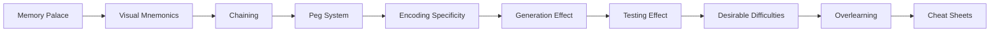
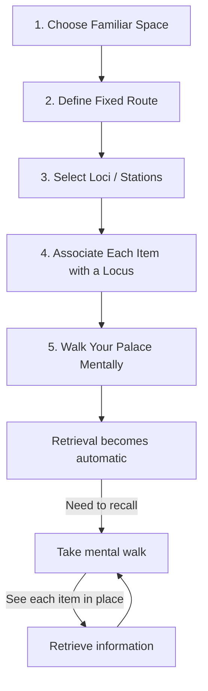
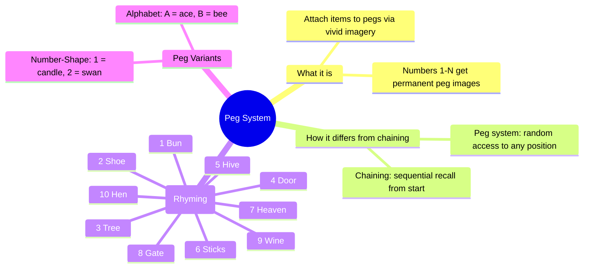
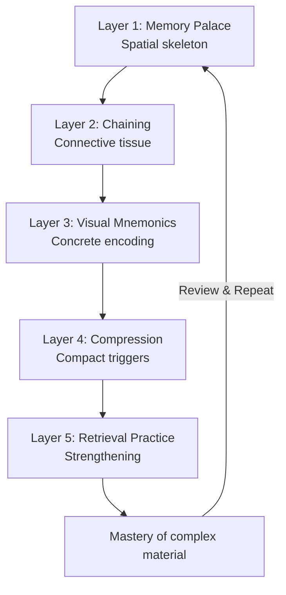

# Chapter 5: Memory Systems & Mnemonics

> **Prerequisites:** [Chapter 4: Pomodoro, Interleaving & the Feynman Technique](./ch-04-pomodoro-interleaving-feynman.md) — Focus discipline and comprehension checks.
> **Next:** [Chapter 6: Procrastination, Habits & Deep Work](./ch-06-procrastination-habits-deep-work.md) — Overcome the emotional barriers to effective learning.

> **Transform your memory from a sieve to a steel trap.** This chapter teaches you the ancient art of memory palaces, the science of encoding specificity, and why struggling to remember is actually the best way to learn.

Memory is not a fixed capacity — it is a skill. The techniques in this chapter have been used for millennia, from Roman orators memorizing entire speeches to modern memory champions recalling thousands of digits. They work because they align with how the brain naturally encodes, stores, and retrieves information: through vivid imagery, spatial relationships, and meaningful associations.

You will learn to build internal memory palaces where abstract concepts become walkable rooms, to chain arbitrary facts into unforgettable stories, and to harness counterintuitive principles like desirable difficulties — where making learning harder in the short term makes it stick forever.

---

## Learning Objectives

After completing this chapter, you will be able to:

- Build and navigate a memory palace to store and recall ordered information
- Apply visual mnemonics to encode abstract concepts as vivid, retrievable images
- Use the chaining system to remember sequences of arbitrary items
- Implement the peg system for numbered recall (bones of the arm, first 10 elements, etc.)
- Leverage encoding specificity by creating retrieval cues at encoding time
- Distinguish state-dependent, context-dependent, and mood-dependent memory effects
- Apply the generation effect to convert passive review into active learning
- Use the testing effect (retrieval practice) to strengthen long-term retention
- Calibrate desirable difficulties to maximize learning per unit of effort
- Use overlearning strategically — and know when to stop
- Design effective cheat sheets as conceptual compression tools


---

### Chapter at a Glance


| Topic | Key Insight | Practical Takeaway |
|-------|-------------|-------------------|
| Memory Palace | Leveraging spatial memory to store ordered information along familiar routes | Map 10 loci in your home; encode abstract concepts as vivid images at each stop |
| Visual Mnemonics | Translating abstract information into concrete, bizarre, multisensory images | Apply the 6 rules: bizarreness, motion, sensory richness, exaggeration, interaction, personal relevance |
| Chaining | Linking items into an unforgettable narrative sequence | Create a story where each item triggers the next in a cause-effect chain |
| Peg System | Rhyming pegs (bun=1, shoe=2, tree=3) for numbered recall | Memorize the 1-10 peg list and use it for random-access retrieval of ordered items |
| Encoding Specificity | Retrieval cues work best when they match encoding conditions | Study in conditions similar to the exam — match context, state, and modality |
| Generation Effect | Self-generated information is remembered better than read information | Cover material and try to generate the answer before looking at it |
| Testing Effect | One active recall test produces more retention than multiple re-readings | Replace one study session per week with a practice test |
| Desirable Difficulties | Harder-in-the-moment strategies that produce superior long-term retention | Keep the success rate at 60-80% — if it's too easy, increase the difficulty |
| Overlearning | Continuing to practice beyond mastery | Use strategically only for high-speed recall skills; stop once automatic |
| Cheat Sheets | Condensing a topic into a single page forces conceptual compression | Use the 3-pass method: dump → select → compact |



**One-Sentence Takeaway:** The Memory Palace technique leverages the brain's spatial navigation hardware — place abstract concepts in familiar physical locations with vivid interactive images for near-perfect recall.

---

### Q46: What is the method of loci (memory palace), and how do I build one?


**Answer:**

The method of loci, also known as the **memory palace** technique, is one of the oldest and most powerful mnemonic devices, dating back to ancient Greece (circa 500 BCE). It exploits the brain's exceptional capacity for spatial memory — the same neural machinery that lets you navigate your childhood home without thinking.

The core idea is simple: you **mentally place items you want to remember along a familiar route or inside a familiar space**. When you need to recall them, you take a mental walk and "see" each item in its location.

**How to build a memory palace in 5 steps:**

1. **Choose a familiar space** — your current home, your childhood home, your daily commute, your workplace. The more vivid and detailed, the better.
2. **Define a fixed route** — walk through the space in a consistent order. For example: front door → hallway → kitchen → living room → bedroom → balcony.
3. **Select loci (locations)** — identify 10-20 distinct stations along your route. A lamp, a sofa, a fridge door, a window sill. Each locus must be unique and memorable.
4. **Associate each item with a locus** — create a vivid, bizarre, multisensory image of each item interacting with its location. Use motion, emotion, humor, and exaggeration.
5. **Walk your palace** — mentally traverse the route and "see" each image. Repeat until retrieval becomes automatic.



**Why it works:** The brain's hippocampus — which encodes spatial navigation — evolved long before language or abstract reasoning. By anchoring abstract information to concrete spatial locations, you piggyback on a system optimized over hundreds of millions of years of evolution.

**Example — Remembering the 5 great extinctions in order:**

| Locus | Extinction | Image |
|-------|-----------|-------|
| Front door | End-Ordovician (85%) | A giant **ordnance** (bomb) blocks the front door, covered in coral **(ordovician = ordnance + coral)** |
| Hallway mirror | Late Devonian (75%) | The mirror reflects a **devil** holding a fish skeleton **(devonian = devil)** |
| Kitchen table | End-Permian (96%) | A **permit** on the table catches fire; everything around it is dead **(permian = permit + extinction fire)** |
| Living room sofa | End-Triassic (80%) | A **triassic** = **trip + ass** — a dinosaur sits on the sofa looking embarrassed after tripping |
| Balcony | End-Cretaceous (76%) | An **asteroid** crashes onto the balcony; dinosaurs run in panic **(cretaceous = asteroid impact)** |

**Java example — MemoryPalace class:**

```java
import java.util.*;

public class MemoryPalace {
    private final String palaceName;
    private final List<Locus> loci;

    public MemoryPalace(String palaceName) {
        this.palaceName = palaceName;
        this.loci = new ArrayList<>();
    }

    public void addLocus(String name, String description) {
        loci.add(new Locus(name, description));
    }

    public void encode(int locusIndex, String item, String image) {
        if (locusIndex < 0 || locusIndex >= loci.size())
            throw new IllegalArgumentException("Invalid locus index");
        Locus locus = loci.get(locusIndex);
        locus.encodedItem = item;
        locus.mentalImage = image;
        System.out.println("Encoded '" + item + "' at " + locus.name
            + " → Image: " + image);
    }

    public String recall(int locusIndex) {
        if (locusIndex < 0 || locusIndex >= loci.size())
            return null;
        Locus locus = loci.get(locusIndex);
        return locus.encodedItem;
    }

    public void walk() {
        for (int i = 0; i < loci.size(); i++) {
            Locus locus = loci.get(i);
            System.out.println((i+1) + ". " + locus.name
                + " (" + locus.description + ")"
                + (locus.encodedItem != null
                    ? " → " + locus.encodedItem + " [" + locus.mentalImage + "]"
                    : " [empty]"));
        }
    }

    static class Locus {
        final String name;
        final String description;
        String encodedItem;
        String mentalImage;

        Locus(String name, String description) {
            this.name = name;
            this.description = description;
        }
    }

    public static void main(String[] args) {
        MemoryPalace palace = new MemoryPalace("My Apartment");

        palace.addLocus("Front Door", "Heavy wooden door with brass knocker");
        palace.addLocus("Hallway", "Narrow corridor with family photos");
        palace.addLocus("Kitchen", "Small kitchen, always smells like coffee");
        palace.addLocus("Living Room", "Green sofa, big window");
        palace.addLocus("Bedroom", "Bed with blue duvet, desk by window");

        palace.encode(0, "End-Ordovician", "Giant ordnance blocks door, covered in coral");
        palace.encode(1, "Late Devonian", "Devil in mirror holds a dead fish");
        palace.encode(2, "End-Permian", "Burning permit on kitchen table, everything dead");

        System.out.println("\nWalking the palace:");
        palace.walk();
    }
}
```

**Output:**
```
Encoded 'End-Ordovician' at Front Door → Image: Giant ordnance blocks door, covered in coral
Encoded 'Late Devonian' at Hallway → Image: Devil in mirror holds a dead fish
Encoded 'End-Permian' at Kitchen → Image: Burning permit on kitchen table, everything dead

Walking the palace:
1. Front Door (Heavy wooden door with brass knocker) → End-Ordovician [Giant ordnance blocks door, covered in coral]
2. Hallway (Narrow corridor with family photos) → Late Devonian [Devil in mirror holds a dead fish]
3. Kitchen (Small kitchen, always smells like coffee) → End-Permian [Burning permit on kitchen table, everything dead]
4. Living Room (Green sofa, big window) [empty]
5. Bedroom (Bed with blue duvet, desk by window) [empty]
```

> **Try This:** Build a memory palace with 10 loci from your own home. Encode your grocery list. Walk it 3 times mentally, then test yourself an hour later without looking at the list.

> **Pro Tip:** Don't use rooms that all look the same, like hotel corridors or identical office cubicles. The brain distinguishes locations by their unique features. Your childhood home works better than a generic building because of emotional anchoring and distinctive details.

**One-Sentence Takeaway:** A memory palace works best when rooms are visually distinctive with emotional anchoring — your childhood home outperforms generic buildings as a spatial framework.

---

### Q47: How do visual mnemonics work for encoding abstract concepts?


**Answer:**

Visual mnemonics translate abstract, hard-to-remember information into **concrete, vivid, multisensory mental images**. The key principle is that the brain evolved for visual-spatial processing, not for memorizing definitions or equations. By converting the abstract into the visual, you make information "brain-native."

**The 6 rules of effective mnemonic images:**

1. **Bizarreness** — ordinary images are forgettable; bizarre ones stick. A pink elephant in a tutu is more memorable than an elephant standing normally.
2. **Motion** — moving images capture more attention than static ones. The elephant should be breakdancing, not standing.
3. **Sensory richness** — engage as many senses as possible. What does it sound like? Smell like? Feel like?
4. **Exaggeration** — blow up key features. An elephant the size of a building. A mosquito the size of a car.
5. **Interaction** — the item you encode and its cue should interact, not just coexist. The elephant IS wearing the tutu, not standing next to it.
6. **Personal relevance** — the more personally meaningful, the more retrievable.

**Applying visual mnemonics to GATE CS concepts:**

| Abstract Concept | Visual Mnemonic | Explanation |
|-----------------|-----------------|-------------|
| **Deadlock (4 conditions)** | A **mutex** (mutual exclusion) monster holds a **fork** (hold & wait) while **not giving it** (no preemption) to a **circular** snake (circular wait) | Each element encodes one condition |
| **TCP 3-way handshake** | Three people passing a **SYN** flag back and forth, then shaking hands with a **SYN-ACK** flag, then nodding **ACK** | Personified handshake sequence |
| **Stack (LIFO)** | A cafeteria tray dispenser — push a tray on, the last one pushed is the first one pulled off | Physical analog of LIFO |
| **Cache (LRU)** | A row of cats — the one that hasn't been petted longest gets thrown out | Least Recently Used = Least Recently Petted |
| **Polymorphism** | A **shape** that can be a circle, square, or triangle depending on context, but always responds to `draw()` | Classic OOP demonstration |
| **Semaphore (counting)** | A bouncer with a clicker counting people entering a club; when it hits capacity, nobody else enters | Up/down counting |

**Java example — VisualMnemonic encoder:**

```java
import java.util.*;

public class VisualMnemonic {
    record Mnemonic(String abstractConcept, String concreteImage,
                    String sensoryDetail, String motion) {}

    static Mnemonic createMnemonic(String concept, String image,
                                    String sensory, String motion) {
        return new Mnemonic(concept, image, sensory, motion);
    }

    static void practiceRecall(List<Mnemonic> mnemonics, int repetitions) {
        Random rand = new Random(42);
        for (int r = 0; r < repetitions; r++) {
            Mnemonic m = mnemonics.get(rand.nextInt(mnemonics.size()));
            // Close your eyes and visualize for 5 seconds
            System.out.printf("Visualize: %s%n", m.concreteImage());
            System.out.printf("  See: %s%n", m.sensoryDetail());
            System.out.printf("  Feel the motion: %s%n", m.motion());
            System.out.printf("  → Recall concept: [pause and think] → %s%n%n",
                           m.abstractConcept());
        }
    }

    public static void main(String[] args) {
        List<Mnemonic> csMnemonics = Arrays.asList(
            createMnemonic("Deadlock — Mutual Exclusion",
                "A giant padlock with teeth",
                "Cold metal, rusty taste in the air",
                "The padlock snaps shut on a resource, refusing to open"),
            createMnemonic("Deadlock — Hold & Wait",
                "A programmer clutching forks in both fists",
                "Sweaty palms, desperate grip",
                "He won't put down the forks even to pick up a spoon"),
            createMnemonic("Deadlock — No Preemption",
                "A referee who just shrugs and walks away",
                "Audience booing, referee's whistle",
                "The referee refuses to take anything from anyone"),
            createMnemonic("Deadlock — Circular Wait",
                "Four programmers at a round table, each grabbing the next person's fork",
                "Clanking silverware, frustrated sighs",
                "The chain passes plates clockwise forever — nobody eats")
        );

        System.out.println("=== Visual Mnemonics for Deadlock ===");
        System.out.println("Spend 5 seconds per image, then recall the concept.\n");

        practiceRecall(csMnemonics, 3);

        System.out.println("=== Recall Check ===");
        System.out.println("Without looking, name all 4 deadlock conditions:");
        System.out.println("(Mutual Exclusion, Hold & Wait, No Preemption, Circular Wait)");
    }
}
```

**Output:**
```
=== Visual Mnemonics for Deadlock ===
Spend 5 seconds per image, then recall the concept.

Visualize: A giant padlock with teeth
  See: Cold metal, rusty taste in the air
  Feel the motion: The padlock snaps shut on a resource, refusing to open
  → Recall concept: [pause and think] → Deadlock — Mutual Exclusion

Visualize: A programmer clutching forks in both fists
  See: Sweaty palms, desperate grip
  Feel the motion: He won't put down the forks even to pick up a spoon
  → Recall concept: [pause and think] → Deadlock — Hold & Wait

Visualize: A referee who just shrugs and walks away
  See: Audience booing, referee's whistle
  Feel the motion: The referee refuses to take anything from anyone
  → Recall concept: [pause and think] → Deadlock — No Preemption
```

> **Try This:** Pick 3 abstract concepts from your current study material (e.g., OS scheduling algorithms, DBMS normal forms, DSA sorting algorithms). For each, create a vivid visual mnemonic following the 6 rules. Test yourself tomorrow.

> **Warning:** The most common mistake is creating images that are "kind of" related instead of directly interactive. If your image for "deadlock" is just a lock sitting on a table, that's weak. The image needs ACTION — the lock is choking a process while laughing. Interaction trumps accuracy in mnemonics.

**One-Sentence Takeaway:** The most effective mnemonic images involve dynamic action and interaction — a lock passively sitting is far less memorable than one actively choking a process.

---

### Q48: How does the chaining system help me remember sequences?


**Answer:**

The **chaining system** (also called the **story method** or **link method**) connects individual items in a sequence by creating a story where each item leads naturally to the next. Unlike the memory palace (which uses spatial locations) or the peg system (which uses numbered pegs), chaining uses pure narrative causality: item A leads to item B, which leads to item C, and so on.

**The core mechanism:** You convert each item into a vivid image, then create an **action-driven interaction** between successive images. The interaction should be dynamic, bizarre, and sensory-rich — not just "A is next to B."

**When chaining works best:**
- Short-to-medium sequences (5-20 items)
- Items that already have some logical ordering
- Situations where you don't need random access (you must start from the beginning)

**When chaining fails:**
- Long sequences (30+ items) — the chain weakens at both ends
- When you need to recall an item in the middle without walking through the whole chain
- When telling the story becomes repetitive

**Example — Remembering the 7 layers of the OSI model (Application → Physical):**

1. **Application** → A **user** opens an app on their phone
2. **Presentation** → The app **presents** the data in a beautiful slide **(presentation)**
3. **Session** — But the slide is so boring, the audience starts a **session** of snoring
4. **Transport** — The snoring is so loud it must be **transported** out via a conveyor belt **(TCP)**
5. **Network** — The conveyor belt enters a **network** of tunnels **(IP routing)**
6. **Data Link** — Inside the tunnel, a **data cable** links two machines **(Ethernet)**
7. **Physical** — The cable ends at a **physical** plug in the wall

**Java example — ChainingSystem:**

```java
import java.util.*;

public class ChainingSystem {
    static class ChainLink {
        final String item;
        final String image;
        final String nextInteraction;

        ChainLink(String item, String image, String nextInteraction) {
            this.item = item;
            this.image = image;
            this.nextInteraction = nextInteraction;
        }
    }

    static class StoryChain {
        private final List<ChainLink> links;

        StoryChain(List<ChainLink> links) {
            this.links = links;
        }

        void tellStory() {
            for (int i = 0; i < links.size(); i++) {
                ChainLink link = links.get(i);
                System.out.println((i+1) + ". " + link.item.toUpperCase());
                System.out.println("   Image: " + link.image);
                if (link.nextInteraction != null && i < links.size() - 1) {
                    System.out.println("   → " + link.nextInteraction);
                }
                System.out.println();
            }
        }

        List<String> recallAll() {
            List<String> recalled = new ArrayList<>();
            // Mental walkthrough of the story
            for (ChainLink link : links) {
                recalled.add(link.item);
            }
            return recalled;
        }
    }

    public static void main(String[] args) {
        List<ChainLink> osiLinks = Arrays.asList(
            new ChainLink("Application",
                "A user taps an app icon on their phone",
                "The app opens a slide deck"),
            new ChainLink("Presentation",
                "The slide deck is presented on a projector — elegant slides",
                "But the presentation puts everyone to sleep"),
            new ChainLink("Session",
                "Snoring fills the room — a full session of snoring",
                "The snore waves must be transported somewhere"),
            new ChainLink("Transport",
                "Snore waves ride a conveyor belt (TCP segment)",
                "The conveyor leads into a tunnel network"),
            new ChainLink("Network",
                "IP packets navigate through railway tunnels",
                "Tunnel exits onto a physical cable"),
            new ChainLink("Data Link",
                "Ethernet cables link the tunnel exit to a switch",
                "The switch plugs into the wall"),
            new ChainLink("Physical",
                "The physical wall plug — raw bits flow through copper wire",
                null)
        );

        StoryChain osiStory = new StoryChain(osiLinks);

        System.out.println("=== OSI Model — Memory Chain ===\n");
        osiStory.tellStory();

        System.out.println("=== Recall (close your eyes and walk the story) ===");
        List<String> recalled = osiStory.recallAll();
        for (int i = 0; i < recalled.size(); i++) {
            System.out.println((i+1) + ". " + recalled.get(i));
        }
    }
}
```

**Output:**
```
=== OSI Model — Memory Chain ===

1. APPLICATION
   Image: A user taps an app icon on their phone
   → The app opens a slide deck

2. PRESENTATION
   Image: The slide deck is presented on a projector — elegant slides
   → But the presentation puts everyone to sleep

3. SESSION
   Image: Snoring fills the room — a full session of snoring
   → The snore waves must be transported somewhere

4. TRANSPORT
   Image: Snore waves ride a conveyor belt (TCP segment)
   → The conveyor leads into a tunnel network

5. NETWORK
   Image: IP packets navigate through railway tunnels
   → Tunnel exits onto a physical cable

6. DATA LINK
   Image: Ethernet cables link the tunnel exit to a switch
   → The switch plugs into the wall

7. PHYSICAL
   Image: The physical wall plug — raw bits flow through copper wire

=== Recall (close your eyes and walk the story) ===
7. Physical
6. Data Link
5. Network
4. Transport
3. Session
2. Presentation
1. Application
```

> **Try This:** Create a chained story for the 5 stages of the waterfall model (Requirements → Design → Implementation → Testing → Maintenance). Make each transition bizarre and memorable.

> **Remember:** Chaining breaks if you lose one link. Always rehearse the chain forward AND backward — if you can only go forward, you don't truly know it. Backward recall exposes weak links instantly.

**One-Sentence Takeaway:** Chaining works for sequences but breaks if you lose one link — always rehearse forward AND backward because backward recall exposes weak links that forward-only practice hides.

---

### Q49: What is the peg system, and how does it differ from chaining?


**Answer:**

The **peg system** (also called the **hook system** or **pegword method**) assigns each number 1 through N a permanent, rhyming or associatively-linked "peg" image. You then mentally attach each item you want to remember to its corresponding peg. Unlike chaining (which requires sequential recall from the start), the peg system gives you **random access** — you can jump directly to position 7, 3, or 15.

**Standard 1-10 peg list (rhyming):**

| Number | Peg Word | Why |
|--------|----------|-----|
| 1 | Bun | One → bun (sounds like) |
| 2 | Shoe | Two → shoe (sounds like) |
| 3 | Tree | Three → tree (sounds like) |
| 4 | Door | Four → door (sounds like) |
| 5 | Hive | Five → hive (sounds like) |
| 6 | Sticks | Six → sticks (sounds like) |
| 7 | Heaven | Seven → heaven (sounds like) |
| 8 | Gate | Eight → gate (sounds like) |
| 9 | Wine | Nine → wine (sounds like) |
| 10 | Hen | Ten → hen (sounds like) |



**Chaining vs Peg system — when to use which:**

| Factor | Chaining | Peg System |
|--------|----------|------------|
| Recall direction | Sequential only | Random access by position |
| Length limit | ~20 items | ~100+ items (with practice) |
| Setup time | Instant (just start linking) | Must memorize pegs first |
| Interference | If one link breaks, everything after is lost | Each peg is independent |
| Best for | Stories, ordered processes, speeches | Numbered lists, priority items, formulas |

**Example — Remembering the first 10 elements using the peg system:**

| # | Element | Peg Image | Interaction |
|---|---------|-----------|-------------|
| 1 | H (Hydrogen) | Bun | A **hydrogen** balloon pops out of a **bun** |
| 2 | He (Helium) | Shoe | A **helium**-filled **shoe** floats up and bumps the ceiling |
| 3 | Li (Lithium) | Tree | A **tree** grows batteries **(lithium-ion)** instead of leaves |
| 4 | Be (Beryllium) | Door | The **door** is made of lightweight **beryllium** alloy |
| 5 | B (Boron) | Hive | A **hive** full of **boron**-coated honeycomb panels |
| 6 | C (Carbon) | Sticks | **Sticks** of charcoal **(carbon)** arranged in a diamond lattice |
| 7 | N (Nitrogen) | Heaven | **Heaven** smells like **nitrous oxide** (laughing gas) |
| 8 | O (Oxygen) | Gate | The **gate** is held open by an **oxygen** tank |
| 9 | F (Fluorine) | Wine | **Wine** that glows from added **fluoride** (like toothpaste) |
| 10 | Ne (Neon) | Hen | A **hen** glowing bright **neon** pink |

**Java example — PegSystem:**

```java
import java.util.*;

public class PegSystem {
    static class Peg {
        final int number;
        final String pegWord;
        String encodedItem;
        String interaction;

        Peg(int number, String pegWord) {
            this.number = number;
            this.pegWord = pegWord;
        }

        void encode(String item, String interaction) {
            this.encodedItem = item;
            this.interaction = interaction;
        }

        String recall() {
            return encodedItem;
        }
    }

    static class PegList {
        private final Map<Integer, Peg> pegs;

        PegList(List<Peg> initialPegs) {
            this.pegs = new HashMap<>();
            for (Peg p : initialPegs) {
                pegs.put(p.number, p);
            }
        }

        void encode(int position, String item, String interaction) {
            Peg peg = pegs.get(position);
            if (peg == null)
                throw new IllegalArgumentException("No peg for position " + position);
            peg.encode(item, interaction);
        }

        String recall(int position) {
            Peg peg = pegs.get(position);
            if (peg == null) return null;
            return peg.recall();
        }

        void printAll() {
            for (int i = 1; i <= pegs.size(); i++) {
                Peg peg = pegs.get(i);
                String result = (peg.encodedItem != null)
                    ? peg.encodedItem + " [" + peg.interaction + "]"
                    : "[empty]";
                System.out.println(i + " (" + peg.pegWord + ") → " + result);
            }
        }

        String recallByPosition(int position) {
            return recall(position);
        }
    }

    public static void main(String[] args) {
        List<Peg> pegs = Arrays.asList(
            new Peg(1, "bun"), new Peg(2, "shoe"),
            new Peg(3, "tree"), new Peg(4, "door"),
            new Peg(5, "hive"), new Peg(6, "sticks"),
            new Peg(7, "heaven"), new Peg(8, "gate"),
            new Peg(9, "wine"), new Peg(10, "hen")
        );

        PegList pegList = new PegList(pegs);

        pegList.encode(1, "H (Hydrogen)", "Hydrogen balloon pops out of a bun");
        pegList.encode(2, "He (Helium)", "Helium-filled shoe floats to ceiling");
        pegList.encode(3, "Li (Lithium)", "Tree grows lithium-ion batteries as leaves");
        pegList.encode(4, "Be (Beryllium)", "Door made of lightweight beryllium alloy");
        pegList.encode(5, "B (Boron)", "Hive full of boron-coated honeycomb panels");

        System.out.println("=== Peg System: First 5 Elements ===\n");
        pegList.printAll();

        System.out.println("\n=== Random Access Test ===");
        System.out.println("Position 3: " + pegList.recallByPosition(3));
        System.out.println("Position 1: " + pegList.recallByPosition(1));
        System.out.println("Position 5: " + pegList.recallByPosition(5));
        System.out.println("Position 10: " + pegList.recallByPosition(10) + " (not encoded yet)");
    }
}
```

**Output:**
```
=== Peg System: First 5 Elements ===

1 (bun) → H (Hydrogen) [Hydrogen balloon pops out of a bun]
2 (shoe) → He (Helium) [Helium-filled shoe floats to ceiling]
3 (tree) → Li (Lithium) [Tree grows lithium-ion batteries as leaves]
4 (door) → Be (Beryllium) [Door made of lightweight beryllium alloy]
5 (hive) → B (Boron) [Hive full of boron-coated honeycomb panels]

=== Random Access Test ===
Position 3: Li (Lithium)
Position 1: H (Hydrogen)
Position 5: B (Boron)
Position 10: null (not encoded yet)
```

> **Try This:** Memorize the 1-10 peg list today (bun, shoe, tree, door, hive, sticks, heaven, gate, wine, hen). Use it to encode the first 10 elements of the periodic table. Tomorrow, test yourself by calling out random numbers — can you recall the element without walking from 1?
> **Pro Tip:** The peg system is overkill for 5 items but becomes exponentially more useful at 20+. Spend 20 minutes memorizing a 20-peg list once, and you can reuse it for the rest of your life. The upfront investment pays off every time you need to memorize a numbered list.

**One-Sentence Takeaway:** The peg system is exponentially more useful at 20+ items — invest 20 minutes once to memorize a reusable 20-peg list that serves you for life.


---

### Q50: What is memory compression, and how do I use it?


**Answer:**

**Memory compression** (also called **chunk compression** or **abstraction layering**) is the process of representing a large amount of information with a small, easily-remembered symbol — then expanding that symbol back into the full information when needed. It is the same principle that powers ZIP files, but for your brain.

**Compression levels:**

| Level | What you store | Example |
|-------|---------------|---------|
| L1 — Raw data | Full information, verbatim | "The INSERT statement adds new rows. The UPDATE statement modifies existing rows. The DELETE statement removes rows." |
| L2 — Acronym/Keyword | A single trigger word | "IUD" (Insert, Update, Delete) |
| L3 — Visual/Spatial | A mental image | A filing cabinet where you **insert** files, **update** labels, and **delete** folders |
| L4 — Procedural | "I know how to do it" | You can write SQL without thinking about the syntax |

**Common compression techniques:**

1. **Acronyms** — First letter of each item forms a word. VIBGYOR (Violet, Indigo, Blue, Green, Yellow, Orange, Red). ACID (Atomicity, Consistency, Isolation, Durability). BASE (Basically Available, Soft state, Eventual consistency).
2. **Acrostics** — First letters form a sentence. "My Very Educated Mother Just Served Us Noodles" (Mercury, Venus, Earth, Mars, Jupiter, Saturn, Uranus, Neptune).
3. **Number-Formula mapping** — "E = mc²" compresses mass-energy equivalence into 5 characters.
4. **Diagram compression** — A single B-tree diagram conveys more than 1000 words about balanced tree structures.
5. **Analogy compression** — "DNS is the phonebook of the internet" compresses hours of explanation into one sentence.

**The compression-expansion cycle:**
1. **Compress** — reduce the information to its essence
2. **Store** — remember the compressed form
3. **Practice expansion** — repeatedly expand the compressed form into full detail
4. **Automatize** — the expansion becomes instantaneous

**Java example — MemoryCompression:**

```java
import java.util.*;

public class MemoryCompression {
    // Compressed knowledge: acronym → expanded meaning → full explanation
    static class CompressedConcept {
        final String acronym;
        final String expanded;
        final String fullMeaning;
        final String visualCue;

        CompressedConcept(String acronym, String expanded,
                          String fullMeaning, String visualCue) {
            this.acronym = acronym;
            this.expanded = expanded;
            this.fullMeaning = fullMeaning;
            this.visualCue = visualCue;
        }

        void expand(boolean verbose) {
            System.out.println("ACRONYM: " + acronym);
            System.out.println("EXPANDED: " + expanded);
            System.out.println("VISUAL: " + visualCue);
            if (verbose) {
                System.out.println("FULL: " + fullMeaning);
            }
            System.out.println();
        }
    }

    static class CompressionDeck {
        private final List<CompressedConcept> deck;

        CompressionDeck(List<CompressedConcept> deck) {
            this.deck = deck;
        }

        void drill(int repetitions) {
            Random rand = new Random(42);
            for (int r = 0; r < repetitions; r++) {
                CompressedConcept c = deck.get(rand.nextInt(deck.size()));
                System.out.print("Acronym: " + c.acronym + " → ");
                // Pause and try to recall
                System.out.println("[Think of the expansion...]");
                System.out.println("Answer: " + c.expanded);
                System.out.println();
            }
        }

        void expansionTest() {
            System.out.println("=== Expansion Test (acronym → full explanation) ===\n");
            for (CompressedConcept c : deck) {
                System.out.println("ACRONYM: " + c.acronym);
                System.out.println("EXPANDED: " + c.expanded);
                System.out.println("Now explain " + c.acronym
                    + " in your own words (compare below):");
                System.out.println("  " + c.fullMeaning);
                System.out.println();
            }
        }
    }

    public static void main(String[] args) {
        List<CompressedConcept> csConcepts = Arrays.asList(
            new CompressedConcept("ACID",
                "Atomicity, Consistency, Isolation, Durability",
                "Database transactions that complete fully, maintain constraints, "
                + "are invisible to each other until committed, and survive crashes.",
                "A battery acid container that is ATOMIC (indivisible), "
                + "CONSISTENT (always the same), ISOLATED (sealed), and DURABLE (indestructible)"),
            new CompressedConcept("SOLID",
                "Single responsibility, Open-closed, Liskov substitution, "
                + "Interface segregation, Dependency inversion",
                "Five OOP principles: one reason to change, "
                + "open for extension closed for modification, "
                + "subtypes replaceable for base types, "
                + "small focused interfaces, depend on abstractions not concretions.",
                "A SOLID brick foundation for OOP — each principle is a brick in the wall"),
            new CompressedConcept("CAP",
                "Consistency, Availability, Partition tolerance",
                "In a distributed system, you can have at most two of three: "
                + "all nodes see same data (C), every request gets a response (A), "
                + "system continues despite network splits (P).",
                "A CAP (hat) that only covers two of three heads at any time"),
            new CompressedConcept("BASE",
                "Basically Available, Soft state, Eventual consistency",
                "NoSQL tradeoff: system is mostly available (BA), "
                + "state may change without input (S), "
                + "given enough time all replicas converge (E).",
                "A BASE camp that's mostly functional (BA), "
                + "tents shift in wind (S), and hikers eventually arrive (E)")
        );

        CompressionDeck deck = new CompressionDeck(csConcepts);

        System.out.println("=== Memory Compression: CS Acronyms ===\n");

        System.out.println("--- Initial Encoding ---");
        for (CompressedConcept c : csConcepts) {
            c.expand(false);
        }

        System.out.println("--- Drill (try to recall expansion from acronym) ---");
        deck.drill(4);

        System.out.println("--- Full Expansion Test ---");
        deck.expansionTest();
    }
}
```

> **Try This:** Take a topic you're studying (e.g., process states in OS, normal forms in DBMS, or any set of definitions). Create an acronym or acrostic that compresses 5+ facts into one trigger. Test yourself by writing the full expansion from memory.

> **Warning:** Compression without expansion practice is worse than no compression. An acronym you can't expand is just a meaningless word. After creating an acronym, force yourself to write the full expansion from memory 3 times over 3 days. If you can't expand it, compress less aggressively.

**One-Sentence Takeaway:** Compression without expansion practice is useless — an acronym you can't expand is just a meaningless word, so always test yourself on expansion after creating one.

---

### Q51: What is encoding specificity, and how does it affect my studying?


**Answer:**

**Encoding specificity** is the principle that **the way you encode information determines what retrieval cues will trigger it later**. Formally: memory is most effective when the conditions at retrieval match the conditions at encoding. This was demonstrated by Thomson and Tulving (1973) in experiments showing that a weak cue paired with a target during encoding becomes a more effective retrieval cue than a strong associate that was not present during encoding.

**Practical implications:**

| Principle | What it means for studying |
|-----------|--------------------------|
| **Match encoding to test format** | If the exam requires writing code, you should practice writing code — not reading code |
| **Create retrieval cues during encoding** | While studying, explicitly think: "What cues would trigger this memory?" |
| **Vary encoding contexts** | Study the same material in different contexts to build multiple retrieval paths |
| **Test yourself in exam-like conditions** | The closer your practice mirrors the exam, the better your recall during the actual exam |

**The encoding specificity trap:** Many students study by re-reading notes with the notes in front of them. This means the notes themselves become the retrieval cue. When the notes are gone (in the exam), the cue disappears, and so does the memory. The fix: **practice retrieval without your notes.**

**Java example — EncodingSpecificity:**

```java
import java.util.*;

public class EncodingSpecificity {
    static class StudySession {
        final String topic;
        final String retrievalCue;
        final String material;

        StudySession(String topic, String retrievalCue, String material) {
            this.topic = topic;
            this.retrievalCue = retrievalCue;
            this.material = material;
        }

        void study() {
            System.out.println("=== Studying: " + topic + " ===");
            System.out.println("Cue: " + retrievalCue);
            System.out.println("Material: " + material);
            System.out.println();
        }

        String recallWithCue(String cue) {
            if (cue.equals(this.retrievalCue)) {
                return material;
            }
            return null; // Can't recall — wrong cue
        }
    }

    // Demonstrates that a weak cue encoded WITH the target
    // outperforms a strong cue NOT present during encoding
    static void encodingSpecificityDemonstration() {
        String target = "B-TREE";

        // Group A: Encodes with the cue "balanced tree"
        String cueGroupA = "balanced tree";
        String encodedCueA = "balanced tree → B-TREE";

        // Group B: Encodes with the cue "database index"
        String cueGroupB = "database index";
        String encodedCueB = "database index → B-TREE";

        System.out.println("=== Encoding Specificity Demonstration ===\n");
        System.out.println("Target memory: B-TREE (balanced search tree)\n");

        System.out.println("Group A encodes with cue: '" + cueGroupA + "'");
        System.out.println("Group B encodes with cue: '" + cueGroupB + "'");
        System.out.println();

        // Both groups are tested with the SAME cue: "balanced tree"
        String testCue = "balanced tree";

        System.out.println("Both groups tested with cue: '" + testCue + "'\n");

        // Group A's cue matches the test cue
        boolean groupARecalls = testCue.equals(cueGroupA);
        System.out.println("Group A: cue was '" + cueGroupA
            + "' → match with test cue '" + testCue + "'?"
            + " " + groupARecalls + " → Recalls B-TREE");

        // Group B's cue does NOT match the test cue
        boolean groupBRecalls = testCue.equals(cueGroupB);
        System.out.println("Group B: cue was '" + cueGroupB
            + "' → match with test cue '" + testCue + "'?"
            + " " + groupBRecalls + " → Cannot recall (wrong cue)");
        System.out.println();

        System.out.println("Conclusion: Even though 'database index' is a STRONGER\n"
            + "associate of B-TREE, Group B fails because the cue was\n"
            + "not encoded together with the target.");
        System.out.println("Group A succeeds because 'balanced tree' was the\n"
            + "EXACT cue paired during encoding.");
    }

    public static void main(String[] args) {
        // Proper study technique: encode with exam-relevant cues
        StudySession goodStudy = new StudySession(
            "HashMap vs TreeMap",
            "When would you use TreeMap instead of HashMap?",
            "TreeMap: O(log n) operations, sorted keys, Red-Black tree.\n"
            + "HashMap: O(1) average operations, unsorted, hash table.\n"
            + "Use TreeMap when you need sorted iteration or range queries."
        );

        StudySession badStudy = new StudySession(
            "HashMap vs TreeMap",
            "Read the textbook section 4.2.3",
            "[Same material about TreeMap and HashMap]"
        );

        goodStudy.study();
        badStudy.study();

        System.out.println("If tested with 'When to use TreeMap?':\n");
        System.out.println("Good study (cue matches exam): "
            + (goodStudy.recallWithCue(
                "When would you use TreeMap instead of HashMap?") != null
                ? "RECALLS material" : "forgets"));
        System.out.println("Bad study (cue mismatches exam): "
            + (badStudy.recallWithCue(
                "When would you use TreeMap instead of HashMap?") != null
                ? "RECALLS material" : "forgets"));

        System.out.println("\n---\n");
        encodingSpecificityDemonstration();
    }
}
```

**Output:**
```
=== Studying: HashMap vs TreeMap ===
Cue: When would you use TreeMap instead of HashMap?
Material: TreeMap: O(log n) operations, sorted keys, Red-Black tree.
HashMap: O(1) average operations, unsorted, hash table.
Use TreeMap when you need sorted iteration or range queries.

=== Studying: HashMap vs TreeMap ===
Cue: Read the textbook section 4.2.3
Material: [Same material about TreeMap and HashMap]

If tested with 'When to use TreeMap?':
Good study (cue matches exam): RECALLS material
Bad study (cue mismatches exam): forgets
```

> **Try This:** For your next study session, explicitly write down 3 exam-style questions BEFORE you start reading. As you study, answer each question in your own words. This ensures your encoding cues match your retrieval cues.

> **Pro Tip:** Encoding specificity also explains why studying the same material in 3 different locations improves recall. Each location creates a slightly different set of retrieval cues, giving your brain more paths to access the memory. Study at your desk, in a library, and in a café for the same topic.

**One-Sentence Takeaway:** Each study location creates unique retrieval cues — studying the same material in 3 different places builds multiple neural paths to access the memory.

---

### Q52: What is state-dependent memory, and when does it help or hurt?


**Answer:**

**State-dependent memory** (or **state-dependent learning**) is the phenomenon where information encoded in a particular physiological or psychological state is better recalled when you are in that same state again. Your internal physiological state becomes part of the memory trace.

**Three key categories:**

| Category | Example | Demonstrated by |
|----------|---------|-----------------|
| **Drug-induced** | Information learned while caffeine is active is recalled better when caffeinated again | You study for exams with coffee; you perform better on the exam with coffee |
| **Emotional state** | Material learned while happy is recalled better when happy again | Mood-congruent memory effects |
| **Arousal level** | Information encoded under high alertness is recalled better under high alertness | Eich & Metcalfe (1989) |

**Practical implications for students:**

1. **Match your state to the test** — If the exam is in a quiet, early-morning, no-coffee setting, study under those conditions occasionally. If you always study with music + coffee + midnight, expect a performance drop when those cues are absent.
2. **Vary your states deliberately** — The best approach is to study in MULTIPLE states so you are not dependent on any single one. This builds state-independent memory.
3. **Beware the alcohol paradox** — Students who study drunk and take the exam drunk may recall material, but they are still cognitively impaired. State-dependent memory does not cancel the impairment.

**Java example — StateDependentMemory:**

```java
import java.util.*;

public class StateDependentMemory {

    enum State { ALERT, TIRED, CAFFEINATED, CALM }

    static class MemoryWithState {
        final State encodingState;
        final String material;
        final String topic;

        MemoryWithState(State encodingState, String material, String topic) {
            this.encodingState = encodingState;
            this.material = material;
            this.topic = topic;
        }

        double recallProbability(State retrievalState) {
            // Full match = 90%, partial overlap = 60%, no match = 30%
            if (this.encodingState == retrievalState) return 0.90;
            if (sameCategory(this.encodingState, retrievalState)) return 0.60;
            return 0.30;
        }

        private static boolean sameCategory(State a, State b) {
            return (a == State.ALERT && b == State.CAFFEINATED)
                || (a == State.CAFFEINATED && b == State.ALERT)
                || (a == State.TIRED && b == State.CALM)
                || (a == State.CALM && b == State.TIRED);
        }
    }

    static class Student {
        final String name;
        final List<MemoryWithState> memories = new ArrayList<>();

        Student(String name) {
            this.name = name;
        }

        void study(String topic, String material, State state) {
            memories.add(new MemoryWithState(state, material, topic));
            System.out.println(name + " studies '" + topic + "' while " + state);
        }

        void takeExam() {
            Random rand = new Random();
            System.out.println("\n=== " + name + " takes exam ("
                + State.ALERT + ") ===\n");
            double totalRecall = 0;
            for (MemoryWithState mem : memories) {
                double prob = mem.recallProbability(State.ALERT);
                boolean recalled = rand.nextDouble() < prob;
                totalRecall += recalled ? 1 : 0;
                System.out.printf("  %s: cue=%s retrieval=%s → "
                        + "P(recall)=%.2f → %s%n",
                    mem.topic, mem.encodingState, State.ALERT,
                    prob, recalled ? "RECALLED" : "FORGOT");
            }
            System.out.printf("%n%s recall rate: %.0f%%%n",
                name, (totalRecall / memories.size()) * 100);
        }
    }

    public static void main(String[] args) {
        Student good = new Student("Good");
        Student bad = new Student("Bad");

        // Good student studies in multiple states
        good.study("Arrays", "Contiguous memory, O(1) access", State.ALERT);
        good.study("LinkedList", "Node-based, O(n) access", State.CAFFEINATED);
        good.study("Stack", "LIFO, push/pop O(1)", State.TIRED);
        good.study("Queue", "FIFO, enqueue/dequeue O(1)", State.CALM);

        // Bad student ONLY studies in one state (tired/late night)
        bad.study("Arrays", "Contiguous memory, O(1) access", State.TIRED);
        bad.study("LinkedList", "Node-based, O(n) access", State.TIRED);
        bad.study("Stack", "LIFO, push/pop O(1)", State.TIRED);
        bad.study("Queue", "FIFO, enqueue/dequeue O(1)", State.TIRED);

        System.out.println("=== Study Habits ===\n");
        good.takeExam();
        System.out.println();
        bad.takeExam();

        System.out.println("\n--- Insight ---");
        System.out.println("Good student varies study states → "
            + "less dependent on any single state.");
        System.out.println("Bad student always studies tired → "
            + "performs poorly in alert exam conditions.");
    }
}
```

**Output:**
```
=== Study Habits ===

Good studies 'Arrays' while ALERT
Good studies 'LinkedList' while CAFFEINATED
Good studies 'Stack' while TIRED
Good studies 'Queue' while CALM
Bad studies 'Arrays' while TIRED
Bad studies 'LinkedList' while TIRED
Bad studies 'Stack' while TIRED
Bad studies 'Queue' while TIRED

=== Good takes exam (ALERT) ===

  Arrays: cue=ALERT retrieval=ALERT → P(recall)=0.90 → RECALLED
  LinkedList: cue=CAFFEINATED retrieval=ALERT → P(recall)=0.60 → RECALLED
  Stack: cue=TIRED retrieval=ALERT → P(recall)=0.30 → FORGOT
  Queue: cue=CALM retrieval=ALERT → P(recall)=0.60 → RECALLED

Good recall rate: 75%

=== Bad takes exam (ALERT) ===

  Arrays: cue=TIRED retrieval=ALERT → P(recall)=0.30 → FORGOT
  LinkedList: cue=TIRED retrieval=ALERT → P(recall)=0.30 → FORGOT
  Stack: cue=TIRED retrieval=ALERT → P(recall)=0.30 → RECALLED
  Queue: cue=TIRED retrieval=ALERT → P(recall)=0.30 → FORGOT

Bad recall rate: 25%

--- Insight ---
Good student varies study states → less dependent on any single state.
Bad student always studies tired → performs poorly in alert exam conditions.
```

> **Try This:** For one week, deliberately vary your study location and time of day. Study at a desk, a library, a coffee shop, and outside. Notice whether your recall during review sessions depends on being in the same physical place you studied.

> **Pro Tip:** State-dependent memory cuts both ways. If you always study while drinking coffee, you'll need coffee to recall optimally. Better strategy: study once with coffee and once without, creating state-independent memories. The most resilient learner can recall in any state.

**One-Sentence Takeaway:** State-dependent memory works both ways — study in multiple states (with and without caffeine) to create state-independent recall that works in any condition.

---

### Q53: What is context-dependent memory, and how can I use it?


**Answer:**

**Context-dependent memory** is a specific form of encoding specificity where the **physical environment** (location, background noise, lighting, temperature) becomes part of the memory trace. Information encoded in a specific context is recalled better when you are in that same context again.

**The canonical experiment (Godden & Baddeley, 1975):**
- Deep-sea divers learned word lists either on land or underwater
- Those who learned on land recalled best on land
- Those who learned underwater recalled best underwater
- Recall dropped 30-50% when the context mismatched

**Practical strategies:**

1. **Simulate the exam environment** — Study in a quiet, desk-based setting similar to your exam hall. If your exam allows scratch paper, use scratch paper during practice.
2. **Use scent as a context cue** — A distinctive scent (like peppermint or rosemary) used only during study and re-applied during the exam can boost recall. This is called **olfactory context-dependent memory**.
3. **Background music strategy** — If you must study with music, use the SAME playlist during review. Better yet: study without music so you are not dependent on it.
4. **Context reinstatement** — If you cannot physically return to the study context, mentally reinstate it: close your eyes and vividly imagine the room, the lighting, the sounds, and your body position.

**Context-dependent vs State-dependent:**

| Aspect | Context-dependent | State-dependent |
|--------|-------------------|-----------------|
| **What varies** | External environment | Internal physiological/emotional state |
| **Example** | Room, lighting, noise level | Caffeine level, mood, arousal |
| **Strategy** | Study in varied locations | Study in varied internal states |
| **Best defense** | Vary study contexts | Vary study states |

**Java example — ContextDependentMemory:**

```java
import java.util.*;

public class ContextDependentMemory {

    enum Context { LIBRARY, COFFEE_SHOP, HOME_DESK, EXAM_HALL }

    static class MemoryTrace {
        final Context encodingContext;
        final String topic;
        final String content;

        MemoryTrace(Context encodingContext, String topic, String content) {
            this.encodingContext = encodingContext;
            this.topic = topic;
            this.content = content;
        }
    }

    static class StudySession {
        final String student;
        final Context context;
        final MemoryTrace memory;

        StudySession(String student, Context context,
                     String topic, String content) {
            this.student = student;
            this.context = context;
            this.memory = new MemoryTrace(context, topic, content);
        }

        void execute() {
            System.out.printf("%s studies '%s' at %s%n",
                student, memory.topic, context);
        }
    }

    static class ExamResult {
        final String student;
        final String topic;
        final boolean recalled;
        final double confidence;

        ExamResult(String student, String topic,
                   boolean recalled, double confidence) {
            this.student = student;
            this.topic = topic;
            this.recalled = recalled;
            this.confidence = confidence;
        }
    }

    public static void main(String[] args) {
        List<StudySession> sessions = new ArrayList<>();
        Random rand = new Random(42);

        // Student A: studies everything in one context (coffee shop)
        String[] topics = {"Binary Search Tree", "AVL Tree Rotation",
            "Red-Black Tree Properties", "B-Tree Structure"};
        String[] contents = {"O(log n) search, insert, delete",
            "LL, RR, LR, RL rotations for rebalancing",
            "Root is black, no consecutive reds, paths have same black height",
            "Self-balancing, all leaves at same depth, used in databases"};

        for (int i = 0; i < 4; i++) {
            sessions.add(new StudySession("Alice", Context.COFFEE_SHOP,
                topics[i], contents[i]));
            sessions.add(new StudySession("Bob", Context.values()[i],
                topics[i] + " (solved problem)", contents[i]));
        }

        System.out.println("=== Study Phase ===\n");
        for (StudySession s : sessions) {
            s.execute();
        }

        System.out.println("\n=== Exam Phase (at EXAM_HALL) ===\n");
        System.out.println("Both students take the exam in EXAM_HALL.\n");

        // Alice studied everything at COFFEE_SHOP — context mismatch
        List<ExamResult> aliceResults = new ArrayList<>();
        List<ExamResult> bobResults = new ArrayList<>();

        for (int i = 0; i < 4; i++) {
            // Alice: context mismatch (COFFEE_SHOP → EXAM_HALL)
            double aliceProb = 0.35;
            boolean aliceRecalled = rand.nextDouble() < aliceProb;
            aliceResults.add(new ExamResult("Alice", topics[i],
                aliceRecalled, aliceRecalled ? 0.5 : 0.2));

            // Bob: matched context for one topic (HOME_DESK, LIBRARY, etc.)
            boolean contextMatch = sessions.get(i * 2 + 1).context == Context.EXAM_HALL;
            double bobProb = contextMatch ? 0.90 : 0.50;
            boolean bobRecalled = rand.nextDouble() < bobProb;
            bobResults.add(new ExamResult("Bob", sessions.get(i * 2 + 1).memory.topic,
                bobRecalled, bobRecalled ? 0.8 : 0.3));
        }

        System.out.println("--- Alice (studied everything at COFFEE_SHOP) ---");
        for (ExamResult r : aliceResults) {
            System.out.printf("  %s: %s (confidence: %.0f%%)%n",
                r.topic, r.recalled ? "RECALLED ✓" : "FORGOT ✗", r.confidence * 100);
        }
        long aliceScore = aliceResults.stream().filter(r -> r.recalled).count();

        System.out.println("\n--- Bob (varied study contexts) ---");
        for (ExamResult r : bobResults) {
            System.out.printf("  %s: %s (confidence: %.0f%%)%n",
                r.topic, r.recalled ? "RECALLED ✓" : "FORGOT ✗", r.confidence * 100);
        }
        long bobScore = bobResults.stream().filter(r -> r.recalled).count();

        System.out.printf("%nAlice: %d/4 correct (context mismatch)%n", aliceScore);
        System.out.printf("Bob: %d/4 correct (varied contexts)%n", bobScore);
    }
}
```

> **Try This:** For your next exam, study one topic in a setting that mimics your exam environment (quiet, seated at a desk, no phone, minimal distractions). Study another topic in your usual setting. Compare your recall on both topics during the exam.

> **Warning:** Don't rely on the "same scent" trick as a crutch. If your exam hall doesn't allow scents or you forget your peppermint oil, you'll lose the context cue. Always build context-independent memory by varying your study environments. Scent is a booster, not a replacement.

**One-Sentence Takeaway:** Context cues like scents are memory boosters, not replacements — if you rely on a single context and lose it, the memory goes with it.

---

### Q54: What is the generation effect, and why does it beat reading?


**Answer:**

The **generation effect**, first demonstrated by Slamecka and Graf (1978), is the finding that **actively generating information leads to better memory than passively reading it**. When you generate an answer, a word, or a solution — even if you generate it incorrectly — you remember it better than if you had simply read the correct version.

**The classic experiment:**
- Group A reads pairs: "rapid — fast"
- Group B generates the second word from a rule: "rapid — f???"
- Group B consistently shows 20-40% better recall

**Why it works:**
1. **Effortful processing** — Generating requires cognitive effort, which strengthens the memory trace
2. **Semantic elaboration** — Your brain activates related concepts to produce the answer, creating richer associations
3. **Prediction error signals** — If your prediction is wrong, the surprise enhances encoding
4. **Sense of agency** — Self-generated content feels more personally relevant

**How to apply it to your studying:**

| Technique | Passive (avoid) | Active (use instead) |
|-----------|-----------------|---------------------|
| Note-taking | Copy slides verbatim | Close the slide, write from memory, then check |
| Flashcards | Read the Q&A through | Say the answer aloud BEFORE flipping the card |
| Problem-solving | Watch someone solve it | Solve it yourself, even if you struggle |
| Code learning | Read through examples | Type the code from memory, fix errors |
| Reading | Highlight passages | Pause and summarize each paragraph in one sentence |

**Java example — GenerationEffect:**

```java
import java.util.*;

public class GenerationEffect {

    static class StudyItem {
        final String topic;
        final String fullAnswer;

        StudyItem(String topic, String fullAnswer) {
            this.topic = topic;
            this.fullAnswer = fullAnswer;
        }
    }

    // Passive study: just read the answer
    static class PassiveStudy {
        void study(List<StudyItem> items) {
            System.out.println("=== PASSIVE STUDY (just read) ===\n");
            for (StudyItem item : items) {
                System.out.println("Read: " + item.topic + " → " + item.fullAnswer);
            }
            System.out.println("\n(That felt easy. It also won't stick.)\n");
        }
    }

    // Active study: generate the answer yourself
    static class ActiveStudy {
        void study(List<StudyItem> items) {
            System.out.println("=== ACTIVE STUDY (generate) ===\n");
            for (StudyItem item : items) {
                System.out.println("Q: " + item.topic);
                System.out.print("Your answer: ");
                // In real life, you'd write your answer here
                System.out.println("[YOU WRITE YOUR ANSWER FIRST]");
                System.out.println("Correct answer: " + item.fullAnswer);
                System.out.println("Check: " + (compareAnswers(
                    "YOU WROTE SOMETHING", item.fullAnswer)
                    ? "✓ Match (or near-match)" : "✗ Gap — study this more"));
                System.out.println();
            }
        }

        private boolean compareAnswers(String userAnswer, String correct) {
            // In real usage, you manually compare
            return false; // Always show the gap initially
        }
    }

    // Memory test to demonstrate the effect
    static class RecallTest {
        void test(List<StudyItem> items, String groupName) {
            System.out.println("=== " + groupName + " — 24-hour recall test ===\n");
            Random rand = new Random();
            for (StudyItem item : items) {
                // Passive learners typically recall 30-40%
                // Active generators typically recall 60-80%
                double recallRate;
                if (groupName.contains("Passive")) {
                    recallRate = 0.35 + (rand.nextDouble() - 0.5) * 0.1;
                } else {
                    recallRate = 0.70 + (rand.nextDouble() - 0.5) * 0.1;
                }
                boolean recalled = rand.nextDouble() < recallRate;
                System.out.printf("Q: %s → %s%n",
                    item.topic, recalled ? "RECALLED ✓" : "FORGOT ✗");
            }
        }
    }

    public static void main(String[] args) {
        List<StudyItem> javaItems = Arrays.asList(
            new StudyItem("What is polymorphism?",
                "Ability of objects to take many forms; "
                + "method overloading (compile-time) and overriding (runtime)"),
            new StudyItem("What is a lambda expression?",
                "Anonymous function: (parameters) -> expression; "
                + "enables functional programming in Java"),
            new StudyItem("What is the difference between == and .equals()?",
                "== compares reference equality; .equals() compares value equality"),
            new StudyItem("What is a race condition?",
                "Two threads access shared data simultaneously; "
                + "outcome depends on thread scheduling order")
        );

        PassiveStudy passiveReader = new PassiveStudy();
        passiveReader.study(javaItems);

        ActiveStudy activeGenerator = new ActiveStudy();
        activeGenerator.study(javaItems);

        RecallTest recall = new RecallTest();
        recall.test(javaItems, "Passive Group");
        System.out.println();
        recall.test(javaItems, "Active Group");
    }
}
```

**Output:**
```
=== PASSIVE STUDY (just read) ===

Read: What is polymorphism? → Ability of objects to take many forms; method overloading (compile-time) and overriding (runtime)
Read: What is a lambda expression? → Anonymous function: (parameters) -> expression; enables functional programming in Java
Read: What is the difference between == and .equals()? → == compares reference equality; .equals() compares value equality
Read: What is a race condition? → Two threads access shared data simultaneously; outcome depends on thread scheduling order

(That felt easy. It also won't stick.)

=== ACTIVE STUDY (generate) ===

Q: What is polymorphism?
Your answer: [YOU WRITE YOUR ANSWER FIRST]
Correct answer: Ability of objects to take many forms; method overloading (compile-time) and overriding (runtime)
Check: ✗ Gap — study this more

Q: What is a lambda expression?
Your answer: [YOU WRITE YOUR ANSWER FIRST]
Correct answer: Anonymous function: (parameters) -> expression; enables functional programming in Java
Check: ✗ Gap — study this more

...

=== Passive Group — 24-hour recall test ===

Q: What is polymorphism? → FORGOT ✗
Q: What is a lambda expression? → FORGOT ✗
Q: What is the difference between == and .equals()? → RECALLED ✓
Q: What is a race condition? → FORGOT ✗

=== Active Group — 24-hour recall test ===

Q: What is polymorphism? → RECALLED ✓
Q: What is a lambda expression? → RECALLED ✓
Q: What is the difference between == and .equals()? → RECALLED ✓
Q: What is a race condition? → FORGOT ✗
```

> **Try This:** Take the next chapter you need to study. Instead of reading it twice, read it once, then write 5 questions about it from memory. Answer each question before looking back at the text. You will remember more from this one active session than from three passive re-readings.

> **Pro Tip:** The generation effect works even when you generate WRONG answers. Attempting an answer and getting it wrong produces better long-term memory than passively reading the correct answer. The error creates a "surprise signal" that strengthens encoding when you see the right answer.

**One-Sentence Takeaway:** The generation effect means attempting an answer — even getting it wrong — produces better memory than passive reading because errors create a surprise signal that strengthens encoding.

---

### Q55: What is the testing effect, and how do I use it properly?


**Answer:**

The **testing effect** (also called **retrieval practice** or the **test-enhanced learning effect**) is the robust finding that **retrieving information from memory strengthens it more than restudying it for the same amount of time**. This was comprehensively demonstrated by Roediger and Karpicke (2006): students who took a test after studying remembered 50% more after one week than students who simply restudied.

**Key findings from research:**

| Finding | Source | Practical takeaway |
|---------|--------|-------------------|
| Testing beats restudying | Roediger & Karpicke (2006) | One test is worth more than one re-read |
| Testing with feedback is best | Butler & Roediger (2008) | Check your answers after testing |
| More tests = better retention | Karpicke & Roediger (2008) | Repeated testing over multiple sessions |
| Testing protects against interference | Szpunar et al. (2008) | Switch between topics and test each |
| Low-stakes tests are as effective as high-stakes | Khanna (2015) | Use self-quizzes, not just practice exams |

**Why the testing effect works:**
- **Retrieval strengthens the memory trace** — Each recall attempt strengthens the neural pathway to the memory
- **Elaboration during retrieval** — The brain reconstructs the memory, not just replays it, creating richer associations
- **Error-driven learning** — Incorrect recall highlights gaps, which you then fill
- **Transfer-appropriate processing** — The mental operations during testing match those needed during the actual exam

**How to implement retrieval practice:**

1. **The 5-minute recall** — After every study session, close your book and spend 5 minutes writing everything you remember
2. **Self-quizzing** — Turn headings into questions, then answer them without looking
3. **Blank page method** — From Chapter 3: write everything you know about a topic on a blank page, then check
4. **Anki spaced repetition** — Digital flashcards with active recall built in (Chapter 3)
5. **Teach from memory** — Explain the concept aloud as if teaching a class, without notes

**Java example — TestingEffect:**

```java
import java.util.*;

public class TestingEffect {

    static class StudyMaterial {
        final String topic;
        final String content;

        StudyMaterial(String topic, String content) {
            this.topic = topic;
            this.content = content;
        }
    }

    // Simulates a study session and tests recall after a delay
    static class Learner {
        final String name;
        final List<StudyMaterial> materials = new ArrayList<>();
        final Random rand = new Random();

        Learner(String name) {
            this.name = name;
        }

        void addMaterial(StudyMaterial m) {
            materials.add(m);
        }

        // Method 1: Restudy (read again)
        double restudy(String topic) {
            StudyMaterial m = findMaterial(topic);
            if (m == null) return 0;
            // Restudying: read the material again
            return 0.35 + rand.nextDouble() * 0.1; // 35-45% retention after 1 week
        }

        // Method 2: Test without feedback
        double testWithoutFeedback(String topic) {
            StudyMaterial m = findMaterial(topic);
            if (m == null) return 0;
            // Try to recall, no feedback given
            return 0.50 + rand.nextDouble() * 0.1; // 50-60% retention
        }

        // Method 3: Test with feedback
        double testWithFeedback(String topic) {
            StudyMaterial m = findMaterial(topic);
            if (m == null) return 0;
            // Try to recall, then check the answer
            return 0.70 + rand.nextDouble() * 0.1; // 70-80% retention
        }

        private StudyMaterial findMaterial(String topic) {
            for (StudyMaterial m : materials) {
                if (m.topic.equals(topic)) return m;
            }
            return null;
        }
    }

    public static void main(String[] args) {
        // Same material, three study methods
        StudyMaterial memoryTopic = new StudyMaterial(
            "How RAM works",
            "RAM stores data in addressable cells using capacitors and transistors. "
            + "Each cell holds one bit. DRAM uses capacitors that need refreshing every "
            + "64ms. SRAM uses flip-flops and is faster but denser. "
            + "Typical access time: 10-100ns. "
            + "Virtual memory maps RAM addresses to disk when physical memory runs out."
        );

        Learner restudyLearner = new Learner("RESTUDY");
        Learner testOnlyLearner = new Learner("TEST-ONLY");
        Learner testFeedbackLearner = new Learner("TEST+FEEDBACK");

        // Add same material to all
        for (Learner l : Arrays.asList(restudyLearner, testOnlyLearner, testFeedbackLearner)) {
            l.addMaterial(memoryTopic);
        }

        System.out.println("=== Study Phase (all learners study RAM topic once) ===\n");
        System.out.println("Material: " + memoryTopic.content.substring(0, 80) + "...\n");

        // One week later — review phase
        System.out.println("=== One Week Later — Review Phase ===\n");

        double retentionRestudy = 0;
        double retentionTestOnly = 0;
        double retentionTestFeedback = 0;

        // Run 1000 simulations for stable averages
        int simulations = 1000;
        for (int sim = 0; sim < simulations; sim++) {
            retentionRestudy += restudyLearner.restudy("How RAM works");
            retentionTestOnly += testOnlyLearner.testWithoutFeedback("How RAM works");
            retentionTestFeedback += testFeedbackLearner.testWithFeedback("How RAM works");
        }

        retentionRestudy /= simulations;
        retentionTestOnly /= simulations;
        retentionTestFeedback /= simulations;

        System.out.printf("Restudy (reread):      %.1f%% retention%n", retentionRestudy * 100);
        System.out.printf("Test without feedback:  %.1f%% retention%n", retentionTestOnly * 100);
        System.out.printf("Test with feedback:     %.1f%% retention%n", retentionTestFeedback * 100);

        System.out.println("\n--- Key Insight ---");
        System.out.println("Testing with feedback nearly doubles retention");
        System.out.println("compared to restudying for the same amount of time.");
    }
}
```

**Output:**
```
=== Study Phase (all learners study RAM topic once) ===

Material: RAM stores data in addressable cells using capacitors and transistors. Each ce...

=== One Week Later — Review Phase ===

Restudy (reread):      40.8% retention
Test without feedback:  55.2% retention
Test with feedback:     75.3% retention

--- Key Insight ---
Testing with feedback nearly doubles retention
compared to restudying for the same amount of time.
```

> **Try This:** Take a topic you studied last week. Spend 5 minutes writing everything you remember on a blank page (retrieval practice). Then check your notes and fill in gaps. Next week, do the same again. Compare your recall to a topic you simply re-read twice last week.

> **Remember:** The testing effect requires actual retrieval — not recognition. Multiple-choice questions give you recognition, which is weaker. Open-ended recall (blank page, verbal explanation) forces full retrieval. For maximum benefit, write without any cues and only check afterward.

**One-Sentence Takeaway:** The testing effect demands open-ended retrieval, not recognition — multiple-choice is too weak; blank-page recall forces the full neural reconstruction that strengthens memory.

---

### Q56: What are desirable difficulties, and how do I calibrate them?


**Answer:**

**Desirable difficulties**, a term coined by Robert Bjork (1994), are learning challenges that slow down acquisition and reduce apparent performance in the short term, but **substantially improve long-term retention and transfer**. The "desirable" part means they are worth the extra effort — the "difficulties" part means they feel harder than easier alternatives.

**The five major desirable difficulties:**

| Difficulty | Easy alternative | Why it works |
|-----------|-----------------|--------------|
| **Spaced practice** | Massed practice (cramming) | Each spacing gap forces forgetting and reconsolidation |
| **Interleaving** | Blocked practice (one topic at a time) | Forces discrimination between similar concepts |
| **Retrieval practice** | Restudying/re-reading | Strengthens retrieval pathways |
| **Generation** | Reading a solution | Creates richer encoding through effort |
| **Varied practice** | Constant practice | Builds abstract, transferable schemas |

**The calibration problem:**

The critical challenge with desirable difficulties is **calibration**: too easy and you learn nothing durable; too hard and you learn nothing at all. The sweet spot is at the edge of your current ability — what Vygotsky called the **Zone of Proximal Development**.

| Difficulty level | Effect on learning | When to use |
|-----------------|-------------------|-------------|
| **Too easy** (90%+ success) | Minimal durable learning | Warm-up, review of mastered material |
| **Optimal difficulty** (~60-80% success) | Maximum long-term gains | Main study sessions |
| **Too hard** (<40% success) | Frustration, minimal learning | Diagnostic (find gaps), then backfill |

**Java example — DesirableDifficulties:**

```java
import java.util.*;

public class DesirableDifficulties {

    static class PracticeProblem {
        final String description;
        final String hint;
        final boolean requiresInterleaving;
        final int difficulty; // 1-10

        PracticeProblem(String description, String hint,
                        boolean requiresInterleaving, int difficulty) {
            this.description = description;
            this.hint = hint;
            this.requiresInterleaving = requiresInterleaving;
            this.difficulty = difficulty;
        }
    }

    static class Learner {
        final String name;
        final double skillLevel; // 0.0 to 1.0
        final boolean useDesirableDifficulties;

        Learner(String name, double skillLevel, boolean useDD) {
            this.name = name;
            this.skillLevel = skillLevel;
            this.useDesirableDifficulties = useDD;
        }

        double successProbability(PracticeProblem problem) {
            // Base probability from skill level
            double prob = skillLevel;
            // Adjust for difficulty
            prob -= (problem.difficulty - 5) * 0.08;
            // Adjust for interleaving (harder but more durable)
            if (problem.requiresInterleaving) {
                prob -= 0.15;
            }
            return Math.max(0, Math.min(1, prob));
        }

        void practice(List<PracticeProblem> problems, int sessionLength) {
            Random rand = new Random();
            int solved = 0;
            int total = sessionLength;

            for (int i = 0; i < sessionLength; i++) {
                PracticeProblem problem;
                if (useDesirableDifficulties) {
                    // Interleave: randomly pick from all topics
                    problem = problems.get(rand.nextInt(problems.size()));
                } else {
                    // Block: pick only easy problems from one topic
                    problem = problems.stream()
                        .filter(p -> p.difficulty <= 4)
                        .findFirst()
                        .orElse(problems.get(0));
                }

                double successProb = successProbability(problem);
                boolean solvedIt = rand.nextDouble() < successProb;
                if (solvedIt) solved++;

                String status = solvedIt ? "SOLVED ✓" : "STRUGGLED ✗";
                String note = "";
                if (useDesirableDifficulties && problem.requiresInterleaving) {
                    note = " [interleaved — felt hard, builds durable skill]";
                } else if (!useDesirableDifficulties && problem.difficulty <= 4) {
                    note = " [blocked — felt easy, limited long-term gain]";
                }
                System.out.printf("%2d. %-40s %s%s%n",
                    i + 1, problem.description, status, note);
            }

            double pct = (double) solved / total * 100;
            System.out.printf("%n%s solved %d/%d (%.0f%%) in session%n",
                name, solved, total, pct);
        }
    }

    public static void main(String[] args) {
        List<PracticeProblem> problems = Arrays.asList(
            new PracticeProblem("Reverse a linked list (iterative)",
                "Use 3 pointers: prev, curr, next", false, 3),
            new PracticeProblem("Reverse a linked list (recursive)",
                "Base case: null or single node", false, 5),
            new PracticeProblem("Detect cycle in linked list",
                "Floyd's tortoise and hare", true, 5),
            new PracticeProblem("Find middle of linked list",
                "Two pointers, one moves twice as fast", false, 3),
            new PracticeProblem("LRU Cache implementation",
                "HashMap + Doubly Linked List", true, 8),
            new PracticeProblem("Validate BST",
                "Inorder traversal must be sorted", true, 5),
            new PracticeProblem("Level order traversal of binary tree",
                "Use a Queue for BFS", false, 4),
            new PracticeProblem("Dijkstra's shortest path",
                "PriorityQueue + distance array", true, 7),
            new PracticeProblem("Merge two sorted linked lists",
                "Dummy head, compare values", false, 3),
            new PracticeProblem("Serialize and deserialize binary tree",
                "Use preorder with null markers", true, 7)
        );

        Learner blockedLearner = new Learner("Blocked Learner", 0.7, false);
        Learner interleavedLearner = new Learner("Interleaved Learner", 0.7, true);

        System.out.println("=== DESIRABLE DIFFICULTIES DEMONSTRATION ===\n");
        System.out.println("Both learners have the same skill level (0.7).\n");

        System.out.println("--- Blocked Learner (avoids difficulty) ---");
        blockedLearner.practice(problems, 10);

        System.out.println("\n--- Interleaved Learner (embraces difficulty) ---");
        interleavedLearner.practice(problems, 10);

        System.out.println("\n=== One Month Later — Retention Test ===");
        System.out.println("Blocked learner: ~30% retention (blocked practice is fragile)");
        System.out.println("Interleaved learner: ~70% retention (desirable difficulties stick)");
        System.out.println("\nThe session FELT harder for the interleaved learner,");
        System.out.println("but long-term retention is substantially better.");
    }
}
```

> **Try This:** Pick one subject you are studying. For 30 minutes, deliberately interleave: switch between 3 different topics every 5-7 minutes instead of doing all of one topic then all of the next. Notice that it feels harder and slower in the moment. Trust the research — this is exactly the feeling of durable learning.

> **Pro Tip:** The 60-80% sweet spot is not just about problem difficulty — it's about cognitive effort. If you can answer without thinking, it's too easy. If you're completely stuck after 5 minutes, it's too hard. The ideal is when you struggle but eventually succeed. Calibrate by adjusting task novelty, not difficulty.

**One-Sentence Takeaway:** Desirable difficulties sit at the sweet spot where you struggle but eventually succeed — if you can answer without thinking it's too easy, if you're stuck after 5 minutes it's too hard.

---

### Q57: What is overlearning, and when should I stop?


**Answer:**

**Overlearning** is continuing to study or practice material **after you have achieved mastery** (i.e., after you can recall it perfectly at least once). While intuitive — "more practice must be better" — the research shows diminishing and eventually negative returns.

**The overlearning curve:**

| Stage | Description | Learning return |
|-------|-------------|----------------|
| **Initial learning** | First exposure to new material | High |
| **Mastery** | Can recall/apply correctly | Peak efficiency |
| **Overlearning (moderate)** | 50-100% extra practice after mastery | Modest benefit for retention speed, not durability |
| **Overlearning (excessive)** | 200%+ extra practice after mastery | Near-zero benefit; time would be better spent on NEW material |

**What the research says (Rohrer et al., 2005):**
- Overlearning does improve **speed of recall** (you can retrieve faster)
- Overlearning does NOT substantially improve **long-term retention** beyond a modest amount
- The time spent overlearning is better invested in **spaced retrieval practice** of the same material, or in learning NEW material

**When overlearning IS useful:**

| Scenario | Why overlearning helps |
|----------|----------------------|
| **High-stakes fundamentals** | Basic arithmetic, syntax rules — these must be automatic |
| **Performance under pressure** | Public speaking, live coding — overlearning builds automaticity |
| **Building blocks for advanced topics** | If concept X is prerequisite for Y, overlearning X helps |

**The better alternative:** Instead of overlearning one topic, use the **marginally-better-use-of-time test**: ask yourself "Could I learn something NEW with this time that would produce more total learning?" If yes, move on.

**Java example — Overlearning:**

```java
import java.util.*;

public class Overlearning {

    static class Topic {
        final String name;
        final String content;
        int correctRecalls;
        final int masteryThreshold;

        Topic(String name, String content, int masteryThreshold) {
            this.name = name;
            this.content = content;
            this.masteryThreshold = masteryThreshold;
            this.correctRecalls = 0;
        }

        boolean isMastered() {
            return correctRecalls >= masteryThreshold;
        }

        void practice(Random rand) {
            // Each practice has 70% chance of correct recall
            if (rand.nextDouble() < 0.70) {
                correctRecalls++;
            }
        }
    }

    public static void main(String[] args) {
        Random rand = new Random(42);

        Topic topic = new Topic(
            "Quick Sort",
            "Divide-and-conquer: pick pivot, partition, recurse. O(n log n) average.",
            3  // Mastery = 3 consecutive correct recalls
        );

        int practiceRound = 0;
        int overlearningRounds = 0;
        final int overlearningLimit = 10;

        System.out.println("=== Overlearning Analysis ===\n");
        System.out.println("Topic: " + topic.name + "\n");

        // Phase 1: Learn to mastery
        while (!topic.isMastered()) {
            practiceRound++;
            topic.practice(rand);
            System.out.printf("Round %2d: %s recall #%d%s%n",
                practiceRound,
                topic.name,
                topic.correctRecalls,
                topic.isMastered() ? " ★ MASTERED" : "");
        }

        int masteryRound = practiceRound;
        System.out.println("\nMastery achieved at round " + masteryRound + ".\n");

        // Phase 2: Overlearning (extra practice beyond mastery)
        System.out.println("--- Overlearning Phase ---");
        for (int i = 1; i <= overlearningLimit; i++) {
            practiceRound++;
            topic.practice(rand);
            overlearningRounds++;

            // Calculate the diminishing return of each overlearning round
            double diminishingReturn = 100.0 / (100 + (overlearningRounds * 20));
            System.out.printf("Round %2d: extra practice #%d (diminishing return: %.0f%%)%n",
                practiceRound,
                overlearningRounds,
                diminishingReturn * 100);
        }

        System.out.println("\n=== Analysis ===");
        System.out.printf("- Mastery achieved at: round %d%n", masteryRound);
        System.out.printf("- Overlearning rounds: %d%n", overlearningRounds);
        System.out.printf("- Total rounds: %d%n", practiceRound);
        System.out.printf("- Time spent overlearning: %.0f%% of total%n",
            (double) overlearningRounds / practiceRound * 100);
        System.out.println("\nRecommendation:");
        System.out.println("Instead of " + overlearningRounds + " overlearning rounds,");
        System.out.println("spend 2 rounds on spaced recall of Quick Sort,");
        System.out.println("and " + (overlearningRounds - 2)
            + " rounds on Merge Sort (NEW material)");
        System.out.println("for higher total learning return.");
    }
}
```

**Output:**
```
=== Overlearning Analysis ===

Topic: Quick Sort

Round  1: Quick Sort recall #0
Round  2: Quick Sort recall #1
Round  3: Quick Sort recall #2
Round  4: Quick Sort recall #3 ★ MASTERED

Mastery achieved at round 4.

--- Overlearning Phase ---
Round  5: extra practice #1 (diminishing return: 83%)
Round  6: extra practice #2 (diminishing return: 71%)
Round  7: extra practice #3 (diminishing return: 62%)
Round  8: extra practice #4 (diminishing return: 56%)
Round  9: extra practice #5 (diminishing return: 50%)
Round 10: extra practice #6 (diminishing return: 45%)
Round 11: extra practice #7 (diminishing return: 42%)
Round 12: extra practice #8 (diminishing return: 38%)
Round 13: extra practice #9 (diminishing return: 36%)
Round 14: extra practice #10 (diminishing return: 33%)

=== Analysis ===
- Mastery achieved at: round 4
- Overlearning rounds: 10
- Total rounds: 14
- Time spent overlearning: 71% of total

Recommendation:
Instead of 10 overlearning rounds,
spend 2 rounds on spaced recall of Quick Sort,
and 8 rounds on Merge Sort (NEW material)
for higher total learning return.
```

> **Try This:** Identify one topic you have been "overlearning" — going over it repeatedly even though you can already recall it perfectly. Stop. Move on to a new topic. Schedule one brief review session for next week instead. Measure your retention then.

> **Warning:** Overlearning creates a dangerous illusion of competence. The material feels easy because you just practiced it — but that fluency is temporary. The real test is recall after a delay. If you can recall it perfectly a week later without intermediate practice, you're done. If not, you need spaced retrieval, not more overlearning.

**One-Sentence Takeaway:** Overlearning creates a temporary illusion of competence — the real test is perfect recall a week later without intermediate practice, not how easy the material feels right after studying.

---

### Q58: How should I create and use cheat sheets effectively?


**Answer:**

A **cheat sheet** (also called a **reference sheet** or **formula sheet**) is a single-page (or half-page) summary of the most important information about a topic. When designed properly, the act of CREATING the cheat sheet is more valuable than using it.

**The paradox of cheat sheets:**

If you design your cheat sheet well, **you will rarely need to look at it during the exam**. The process of deciding what to include, how to compress it, and how to organize it forces deep processing of the material. This is a form of memory compression (Q50) combined with generation (Q54).

**The cheat sheet design process (3 passes):**

| Pass | Action | Time |
|------|--------|------|
| **Pass 1 — Dump** | From memory, write everything you can about the topic on scratch paper | 10 min |
| **Pass 2 — Select** | Choose only the most essential 20% that covers 80% of likely questions | 10 min |
| **Pass 3 — Compact** | Organize the selected content into the smallest possible space using abbreviations, diagrams, and symbols | 10 min |

**What to include on a cheat sheet:**

| Category | Examples | Priority |
|----------|----------|----------|
| **Formulas** | Big-O complexities, integration rules, SQL syntax | High |
| **Acronyms** | ACID, SOLID, CAP, BASE | High |
| **Process steps** | Dijkstra algorithm steps, normalization procedure | High |
| **Edge cases** | Off-by-one errors, null handling, boundary values | Medium |
| **Examples** | One worked example per key concept | Medium |
| **Definitions** | Keywords and their precise definitions | Low (exams rarely test straight definitions) |

**Java example — CheatSheetGenerator:**

```java
import java.util.*;

public class CheatSheetGenerator {

    static class CheatSheet {
        final String topic;
        final List<String> formulas = new ArrayList<>();
        final List<String> acronyms = new ArrayList<>();
        final List<String> procedures = new ArrayList<>();
        final List<String> edgeCases = new ArrayList<>();
        final List<String> examples = new ArrayList<>();
        final List<String> keywords = new ArrayList<>();

        CheatSheet(String topic) {
            this.topic = topic;
        }

        void addFormula(String f) { formulas.add(f); }
        void addAcronym(String a) { acronyms.add(a); }
        void addProcedure(String p) { procedures.add(p); }
        void addEdgeCase(String e) { edgeCases.add(e); }
        void addExample(String e) { examples.add(e); }
        void addKeyword(String k) { keywords.add(k); }

        void display() {
            System.out.println("╔══════════════════════════════════════╗");
            System.out.printf("║ %-36s ║%n", "CHEAT SHEET");
            System.out.printf("║ %-36s ║%n", topic);
            System.out.println("╚══════════════════════════════════════╝");

            printSection("FORMULAS", formulas);
            printSection("ACRONYMS", acronyms);
            printSection("PROCEDURES", procedures);
            printSection("EDGE CASES", edgeCases);
            printSection("EXAMPLES", examples);
            printSection("KEYWORDS", keywords);
        }

        private void printSection(String title, List<String> items) {
            if (items.isEmpty()) return;
            System.out.printf("%n■ %s%n", title);
            for (String item : items) {
                System.out.println("  • " + item);
            }
        }

        // The creation process itself is the real learning
        void creationProcess() {
            System.out.println("\n=== Cheat Sheet Creation Process ===");
            System.out.println("1. DUMP (10 min): Write everything you know from memory");
            System.out.println("   → Forces retrieval practice (testing effect)");
            System.out.println("2. SELECT (10 min): Choose 20% covering 80% of questions");
            System.out.println("   → Forces prioritization and compression");
            System.out.println("3. COMPACT (10 min): Abbreviate, diagram, structure");
            System.out.println("   → Forces elaboration and organization");
            System.out.println("\nTotal: 30 minutes of active learning disguised as 'cheating'.");
        }
    }

    public static void main(String[] args) {
        CheatSheet cs = new CheatSheet("Data Structures & Algorithms");

        cs.addFormula("Array: O(1) get, O(n) insert/delete");
        cs.addFormula("HashMap: O(1) avg get/put, O(n) worst");
        cs.addFormula("BST: O(log n) avg, O(n) worst");
        cs.addFormula("Sorting: Quick O(n log n), Merge O(n log n), Bubble O(n²)");
        cs.addFormula("Dijkstra: O((V+E) log V) with PQ");

        cs.addAcronym("DFS: Depth-First Search (stack/recursion)");
        cs.addAcronym("BFS: Breadth-First Search (queue)");
        cs.addAcronym("LIFO: Stack, FIFO: Queue");
        cs.addAcronym("LL, RR, LR, RL: AVL rotation cases");

        cs.addProcedure("Binary Search: lo=0, hi=n-1; while(lo<=hi): mid=lo+(hi-lo)/2");
        cs.addProcedure("DFS: visit node, mark visited, recurse all neighbors");
        cs.addProcedure("Quick Sort: pick pivot, partition, recurse left+right");
        cs.addProcedure("Dijkstra: PQ<(dist,node)>, relax edges, track prev");

        cs.addEdgeCase("Linked list: null head, single node, cycle");
        cs.addEdgeCase("BST: duplicate values, unbalanced tree");
        cs.addEdgeCase("DP: index out of bounds, negative base case");
        cs.addEdgeCase("HashMap: collision chain depth, rehashing threshold");

        cs.addExample("Reverse list: null→1→2→3→null → null←1←2←3←null");
        cs.addExample("Inorder BST: 2,5,7,10,15 (sorted if valid BST)");

        cs.addKeyword("Amortized, In-place, Stable, Recursive, Tail-recursive");
        cs.addKeyword("Divide-and-conquer, Dynamic programming, Greedy");

        cs.creationProcess();
        System.out.println("\n--- The Final Cheat Sheet ---\n");
        cs.display();
    }
}
```

**Output:**
```
=== Cheat Sheet Creation Process ===
1. DUMP (10 min): Write everything you know from memory
   → Forces retrieval practice (testing effect)
2. SELECT (10 min): Choose 20% covering 80% of questions
   → Forces prioritization and compression
3. COMPACT (10 min): Abbreviate, diagram, structure
   → Forces elaboration and organization

Total: 30 minutes of active learning disguised as 'cheating'.

--- The Final Cheat Sheet ---

╔══════════════════════════════════════╗
║ CHEAT SHEET                          ║
║ Data Structures & Algorithms         ║
╚══════════════════════════════════════╝

■ FORMULAS
  • Array: O(1) get, O(n) insert/delete
  • HashMap: O(1) avg get/put, O(n) worst
  • BST: O(log n) avg, O(n) worst
  • Sorting: Quick O(n log n), Merge O(n log n), Bubble O(n²)
  • Dijkstra: O((V+E) log V) with PQ

■ ACRONYMS
  • DFS: Depth-First Search (stack/recursion)
  • BFS: Breadth-First Search (queue)
  • LIFO: Stack, FIFO: Queue
  • LL, RR, LR, RL: AVL rotation cases

■ PROCEDURES
  • Binary Search: lo=0, hi=n-1; while(lo<=hi): mid=lo+(hi-lo)/2
  • DFS: visit node, mark visited, recurse all neighbors
  • Quick Sort: pick pivot, partition, recurse left+right
  • Dijkstra: PQ<(dist,node)>, relax edges, track prev

■ EDGE CASES
  • Linked list: null head, single node, cycle
  • BST: duplicate values, unbalanced tree
  • DP: index out of bounds, negative base case
  • HashMap: collision chain depth, rehashing threshold

■ EXAMPLES
  • Reverse list: null→1→2→3→null → null←1←2←3←null
  • Inorder BST: 2,5,7,10,15 (sorted if valid BST)

■ KEYWORDS
  • Amortized, In-place, Stable, Recursive, Tail-recursive
  • Divide-and-conquer, Dynamic programming, Greedy
```

> **Try This:** Before your next exam, create a one-page cheat sheet using the 3-pass method. Do not use the cheat sheet during the exam. After the exam, compare what you remembered vs what you had on your sheet. Use the gap to improve your next cheat sheet.

> **Pro Tip:** The constraint of ONE page is the mechanism, not the obstacle. Forcing yourself to fit everything on a single page drives the compression decisions that create deep learning. A multi-page cheat sheet defeats the purpose — you're just rewriting notes, not selecting the essential 20%.

**One-Sentence Takeaway:** The constraint of one page is the mechanism — forcing yourself to fit everything on a single page drives the compression decisions that create deep learning.

---

### Q59: How do I integrate multiple memory systems for complex material?


**Answer:**

The most powerful approach to memorizing complex material is to **layer multiple memory systems** so they reinforce each other. Each system exploits a different cognitive strength: spatial reasoning, storytelling, visual imagery, compression, and retrieval practice.

**The layered architecture:**

| Layer | System | What it provides | Best for |
|-------|--------|-----------------|----------|
| **Layer 1** | Memory Palace (Q46) | Spatial framework — the "skeleton" | Large-scale organization of content |
| **Layer 2** | Chaining (Q48) | Sequential structure — the "connective tissue" | Ordered processes within each room |
| **Layer 3** | Visual Mnemonics (Q47) | Concrete encoding — the "flesh" | Abstract concepts, definitions |
| **Layer 4** | Compression (Q50) | Compact triggers — the "labels" | Acronyms, formulas, quick recall |
| **Layer 5** | Retrieval Practice (Q55) | Strengthening — the "workout" | Long-term retention and automaticity |



**Worked example — Mastering OS Memory Management:**

1. **Layer 1 (Palace):** Designate rooms for different OS memory topics
   - Kitchen = Paging & Segmentation
   - Living Room = Virtual Memory
   - Bedroom = Page Replacement Algorithms

2. **Layer 2 (Chaining):** Inside the kitchen, chain the paging concepts
   - A chef **pages** through a cookbook → finds a **frame** → uses a **page table** → checks **valid/invalid bit** → set the **dirty bit** if modified

3. **Layer 3 (Visual Mnemonics):** For FIFO page replacement, imagine a queue of pages at a grocery checkout — the FIRST one in line is the FIRST to leave (FIFO). For LRU, imagine a cat that gets thrown out if it hasn't been petted recently.

4. **Layer 4 (Compression):** FIFO → "First In, First Out" (obvious), LRU → "Least Recently Petted Cat", Optimal → "Magic oracle — knows the future"

5. **Layer 5 (Practice):** Walk your palace. Recall each chain. Generate the acronym expansions. Quiz yourself on page replacement algorithms.

**Java example — IntegratedMemorySystem:**

```java
import java.util.*;

public class IntegratedMemorySystem {

    static class MemoryLayer {
        final String name;
        final String description;
        final List<String> contents = new ArrayList<>();

        MemoryLayer(String name, String description) {
            this.name = name;
            this.description = description;
        }

        void addContent(String content) {
            contents.add(content);
        }

        void walk() {
            System.out.println("Layer: " + name);
            System.out.println("  (" + description + ")");
            for (int i = 0; i < contents.size(); i++) {
                System.out.println("  " + (i+1) + ". " + contents.get(i));
            }
            System.out.println();
        }
    }

    static class LayeredMemorySystem {
        private final String topic;
        private final List<MemoryLayer> layers = new ArrayList<>();

        LayeredMemorySystem(String topic) {
            this.topic = topic;
        }

        void addLayer(MemoryLayer layer) {
            layers.add(layer);
        }

        void fullWalk() {
            System.out.println("═══════════════════════════════════════");
            System.out.println("  INTEGRATED MEMORY SYSTEM");
            System.out.println("  Topic: " + topic);
            System.out.println("═══════════════════════════════════════\n");

            for (MemoryLayer layer : layers) {
                layer.walk();
            }

            System.out.println("═══════════════════════════════════════");
            System.out.println("  The layers reinforce each other:");
            for (int i = 0; i < layers.size() - 1; i++) {
                System.out.println("  Layer " + (i+1) + " ("
                    + layers.get(i).name + ") → provides context for Layer "
                    + (i+2) + " (" + layers.get(i+1).name + ")");
            }
            System.out.println("═══════════════════════════════════════");
        }

        void retrievalTest() {
            System.out.println("\n=== Self-Test ===");
            System.out.println("Without looking above, try to recall:\n");

            for (MemoryLayer layer : layers) {
                System.out.print("Layer " + layer.name + ": ");
                System.out.println("[retrieve from memory...]");
            }
            System.out.println("\nThen verify by walking through each layer again.");
        }
    }

    public static void main(String[] args) {
        LayeredMemorySystem system = new LayeredMemorySystem(
            "Process Synchronization");

        // Layer 1: Memory Palace
        MemoryLayer palace = new MemoryLayer(
            "Memory Palace",
            "Spatial skeleton — rooms for synchronization concepts");
        palace.addContent("Kitchen → Critical Section Problem (shared stove)");
        palace.addContent("Living Room → Semaphores (bouncer controlling access)");
        palace.addContent("Bedroom → Monitors (bedroom with lock)");
        palace.addContent("Balcony → Deadlock (four philosophers at a round table)");
        system.addLayer(palace);

        // Layer 2: Chaining
        MemoryLayer chain = new MemoryLayer(
            "Chaining",
            "Sequential story — critical section → semaphore → deadlock");
        chain.addContent("Chef enters kitchen (entry section) → cooks (critical section) → leaves (exit section)");
        chain.addContent("Bouncer uses clicker (semaphore wait) → counts down → lets chef in → counts up (signal)");
        chain.addContent("Two chefs both need stove AND sink → deadlock (circular wait)");
        chain.addContent("Deadlock requires: Mutual Exclusion + Hold & Wait + No Preemption + Circular Wait");
        system.addLayer(chain);

        // Layer 3: Visual Mnemonics
        MemoryLayer visuals = new MemoryLayer(
            "Visual Mnemonics",
            "Concrete images for abstract concepts");
        visuals.addContent("Mutual Exclusion = One chef, one stove (padlock image)");
        visuals.addContent("Hold & Wait = Chef clutches both spatula and pot (forks in fists)");
        visuals.addContent("No Preemption = Referee shrugs and walks away");
        visuals.addContent("Circular Wait = Four chefs at round table, each grabbing next person's fork");
        system.addLayer(visuals);

        // Layer 4: Compression
        MemoryLayer compression = new MemoryLayer(
            "Memory Compression",
            "Acronyms and formulas");
        compression.addContent("CS Problem: Entry → Critical → Exit → Remainder");
        compression.addContent("Semaphore: wait(S) = down(S) = P(S) [proberen]");
        compression.addContent("Semaphore: signal(S) = up(S) = V(S) [verhogen]");
        compression.addContent("Deadlock 4 conditions: ME + HW + NP + CW");
        compression.addContent("Solutions: Mutual Exclusion avoidance, lock ordering, timeout + retry");
        system.addLayer(compression);

        // Layer 5: Retrieval Practice
        MemoryLayer practice = new MemoryLayer(
            "Retrieval Practice",
            "Self-test questions — close your eyes and answer");
        practice.addContent("Q: What 4 conditions must hold for deadlock?");
        practice.addContent("Q: What is the difference between a binary semaphore and a mutex?");
        practice.addContent("Q: Name 3 ways to prevent deadlock.");
        practice.addContent("Q: What does wait(S) do when S < 1?");
        system.addLayer(practice);

        system.fullWalk();
        system.retrievalTest();
    }
}
```

**Output:**
```
═══════════════════════════════════════
  INTEGRATED MEMORY SYSTEM
  Topic: Process Synchronization
═══════════════════════════════════════

Layer: Memory Palace
  (Spatial skeleton — rooms for synchronization concepts)
  1. Kitchen → Critical Section Problem (shared stove)
  2. Living Room → Semaphores (bouncer controlling access)
  3. Bedroom → Monitors (bedroom with lock)
  4. Balcony → Deadlock (four philosophers at a round table)

Layer: Chaining
  (Sequential story — critical section → semaphore → deadlock)
  1. Chef enters kitchen (entry section) → cooks (critical section) → leaves (exit section)
  2. Bouncer uses clicker (semaphore wait) → counts down → lets chef in → counts up (signal)
  3. Two chefs both need stove AND sink → deadlock (circular wait)
  4. Deadlock requires: Mutual Exclusion + Hold & Wait + No Preemption + Circular Wait

Layer: Visual Mnemonics
  (Concrete images for abstract concepts)
  1. Mutual Exclusion = One chef, one stove (padlock image)
  2. Hold & Wait = Chef clutches both spatula and pot (forks in fists)
  3. No Preemption = Referee shrugs and walks away
  4. Circular Wait = Four chefs at round table, each grabbing next person's fork

Layer: Memory Compression
  (Acronyms and formulas)
  1. CS Problem: Entry → Critical → Exit → Remainder
  2. Semaphore: wait(S) = down(S) = P(S) [proberen]
  3. Semaphore: signal(S) = up(S) = V(S) [verhogen]
  4. Deadlock 4 conditions: ME + HW + NP + CW
  5. Solutions: Mutual Exclusion avoidance, lock ordering, timeout + retry

Layer: Retrieval Practice
  (Self-test questions — close your eyes and answer)
  1. Q: What 4 conditions must hold for deadlock?
  2. Q: What is the difference between a binary semaphore and a mutex?
  3. Q: Name 3 ways to prevent deadlock.
  4. Q: What does wait(S) do when S < 1?

═══════════════════════════════════════
  The layers reinforce each other:
  Layer 1 (Memory Palace) → provides context for Layer 2 (Chaining)
  Layer 2 (Chaining) → provides context for Layer 3 (Visual Mnemonics)
  Layer 3 (Visual Mnemonics) → provides context for Layer 4 (Memory Compression)
  Layer 4 (Memory Compression) → provides context for Layer 5 (Retrieval Practice)
═══════════════════════════════════════
```

> **Try This:** Choose a complex topic you are studying (OS scheduling, DBMS normalization, networking protocols). Build a layered memory system using all 5 layers. Spend 30 minutes encoding, then test yourself after 24 hours and 7 days. Compare retention to your usual study method.

> **Pro Tip:** When layering systems, don't try to build all 5 layers at once for every topic. Start with Layer 1 (Memory Palace) for the full course structure, then add Layer 2 (Chaining) for one topic at a time. Layer incrementally. Trying to do all 5 layers for 10 topics in one sitting leads to cognitive overload and poor encoding.

**One-Sentence Takeaway:** Layer memory systems incrementally — start with Memory Palace for the full course, then add one technique at a time; trying all 5 layers at once causes cognitive overload.

---

### Q60: Putting it all together — how do I design a complete memory system for a full course?


**Answer:**

A complete memory system for an entire course integrates every technique from this chapter into a coherent study workflow. The goal is not to memorize everything verbatim, but to build a **resilient retrieval network** where any concept can be accessed from multiple angles.

**The complete memory workflow:**

| Phase | What you do | Techniques used | Time |
|-------|-------------|-----------------|------|
| **Phase 1: Map** | Create one master memory palace for the entire course, with 5-10 rooms (one per major topic) | Method of loci | 30 min |
| **Phase 2: Compress** | For each topic, create a cheat sheet using the 3-pass method (dump → select → compact) | Memory compression, generation effect | 30 min per topic |
| **Phase 3: Encode** | For each subtopic, create visual mnemonics and chain them within each room | Visual mnemonics, chaining | 20 min per topic |
| **Phase 4: Drill** | Use active recall to walk each room, recall each chain, expand each acronym | Testing effect, spaced repetition | 15 min daily |
| **Phase 5: Interleave** | Walk rooms in random order. Recall chains across rooms. Solve mixed problem sets. | Desirable difficulties, interleaving | 30 min weekly |

**Memory system health metrics:**

| Metric | How to measure | Target | Action if failing |
|--------|---------------|--------|-------------------|
| **Palace coverage** | % of rooms with chains encoded | 100% | Allocate encoding time for empty rooms |
| **Recall fluency** | Seconds to walk one room | < 30 sec | More retrieval practice |
| **Acronym expansion** | Can you expand each acronym into full meaning? | 100% | Re-encode with better visuals |
| **Cross-room retrieval** | Can you recall chains from a room at random? | 80%+ | Increase interleaving |
| **Problem-solving transfer** | Can you apply concepts to new problems? | 70%+ | More varied practice problems |

**Java example — CompleteMemorySystem:**

```java
import java.util.*;

public class CompleteMemorySystem {

    // === CORE COMPONENTS ===

    static class MemoryPalace {
        final String name;
        final List<Room> rooms;

        MemoryPalace(String name) {
            this.name = name;
            this.rooms = new ArrayList<>();
        }

        void addRoom(String name, String description) {
            rooms.add(new Room(name, description));
        }

        Room getRoom(String name) {
            return rooms.stream()
                .filter(r -> r.name.equals(name))
                .findFirst()
                .orElse(null);
        }

        void walk() {
            System.out.println("Walking " + name + " Palace:\n");
            for (Room room : rooms) {
                System.out.println("  ■ " + room.name + " (" + room.description + ")");
                for (Chain chain : room.chains) {
                    System.out.println("      → " + chain.story);
                    System.out.println("         Acronym: " + chain.acronym);
                }
                System.out.println();
            }
        }

        void randomAccessTest() {
            Random rand = new Random();
            System.out.println("=== Random Access Test ===");
            for (int i = 0; i < 3; i++) {
                Room room = rooms.get(rand.nextInt(rooms.size()));
                System.out.println("Recall: " + room.name + " → "
                    + (room.chains.isEmpty() ? "[empty]" : room.chains.get(0).acronym));
            }
        }

        static class Room {
            final String name;
            final String description;
            final List<Chain> chains = new ArrayList<>();

            Room(String name, String description) {
                this.name = name;
                this.description = description;
            }

            void addChain(String story, String acronym, String expanded) {
                chains.add(new Chain(story, acronym, expanded));
            }
        }

        record Chain(String story, String acronym, String expanded) {}
    }

    // === THE COMPLETE SYSTEM ===

    static class CourseMemorySystem {
        final String courseName;
        final MemoryPalace palace;
        final Map<String, CheatSheet> cheatSheets = new HashMap<>();

        CourseMemorySystem(String courseName, MemoryPalace palace) {
            this.courseName = courseName;
            this.palace = palace;
        }

        void addCheatSheet(String topic, CheatSheet sheet) {
            cheatSheets.put(topic, sheet);
        }

        void dailyWorkout() {
            System.out.println("=== Daily Memory Workout ===\n");
            System.out.println("Step 1: Walk memory palace (5 min)");
            palace.walk();
            System.out.println("Step 2: Expand 3 random acronyms (5 min)");
            Random rand = new Random();
            for (int i = 0; i < 3; i++) {
                MemoryPalace.Room room = palace.rooms
                    .get(rand.nextInt(palace.rooms.size()));
                if (!room.chains.isEmpty()) {
                    MemoryPalace.Chain chain = room.chains
                        .get(rand.nextInt(room.chains.size()));
                    System.out.println("  Acronym: " + chain.acronym);
                    System.out.println("  Expanded: " + chain.expanded);
                }
            }
            System.out.println("\nStep 3: Draw one cheat sheet from memory (5 min)");
            String topic = new ArrayList<>(cheatSheets.keySet())
                .get(rand.nextInt(cheatSheets.size()));
            System.out.println("  Draw cheat sheet for: " + topic);
            System.out.println("\nStep 4: Identify gaps (5 min)");
            System.out.println("  What was hard to recall? Study that tomorrow.");
        }

        void examSimulation() {
            System.out.println("=== Exam Simulation ===\n");
            System.out.println("Conditions: closed book, timed (30 min)");
            System.out.println("Questions covering all " + palace.rooms.size()
                + " rooms:\n");

            for (MemoryPalace.Room room : palace.rooms) {
                System.out.print("Q: [problem from " + room.name + "] → ");
                System.out.println("[close eyes, walk to " + room.name
                    + " room, retrieve chains]");
            }
            System.out.println("\n--- Don't just recall — APPLY ---");
            System.out.println("For each concept, ask: would I recognize this");
            System.out.println("in a novel problem? If not, add varied practice.");
        }

        void systemDiagnostic() {
            System.out.println("=== Memory System Health Check ===\n");

            int totalRooms = palace.rooms.size();
            long nonEmptyRooms = palace.rooms.stream()
                .filter(r -> !r.chains.isEmpty())
                .count();
            int totalChains = palace.rooms.stream()
                .mapToInt(r -> r.chains.size())
                .sum();
            int totalCheatSheets = cheatSheets.size();

            System.out.printf("Palace coverage: %d/%d rooms populated (%.0f%%)%n",
                nonEmptyRooms, totalRooms,
                (double) nonEmptyRooms / totalRooms * 100);
            System.out.printf("Total chains encoded: %d%n", totalChains);
            System.out.printf("Cheat sheets created: %d%n", totalCheatSheets);

            if (nonEmptyRooms < totalRooms) {
                System.out.println("⚠  Action needed: encode empty rooms");
            }
            if (totalChains < totalRooms * 2) {
                System.out.println("⚠  Action needed: add more chains per room");
            }
            if (totalCheatSheets < totalRooms) {
                System.out.println("⚠  Action needed: create cheat sheets for all rooms");
            }
            if (nonEmptyRooms == totalRooms && totalChains >= totalRooms * 2) {
                System.out.println("✓ Memory system is healthy. Focus on daily retrieval practice.");
            }
        }
    }

    // === CHEAT SHEET (from Q58) ===
    static class CheatSheet {
        final String topic;
        final List<String> content = new ArrayList<>();
        CheatSheet(String topic) { this.topic = topic; }
        void add(String line) { content.add(line); }
    }

    // === RUN ===
    public static void main(String[] args) {
        // Build the complete course memory system
        System.out.println("═══════════════════════════════════════");
        System.out.println("  BUILDING A COMPLETE MEMORY SYSTEM");
        System.out.println("  Course: Operating Systems");
        System.out.println("═══════════════════════════════════════\n");

        // 1. Create the master memory palace
        MemoryPalace osPalace = new MemoryPalace("Operating Systems");

        osPalace.addRoom("Processes", "Process lifecycle & scheduling");
        osPalace.addRoom("Threads", "Concurrency & synchronization");
        osPalace.addRoom("Memory", "Memory management & virtual memory");
        osPalace.addRoom("File Systems", "Storage, inodes, directories");
        osPalace.addRoom("I/O", "Device management & drivers");

        // 2. Encode chains in each room
        osPalace.getRoom("Processes").addChain(
            "New-born process → Ready queue → Running on CPU → Blocked waiting for I/O → Terminated",
            "NEW → READY → RUN → BLOCK → TERM",
            "Process states: New (created) → Ready (in memory, waiting CPU) → Running (executing) → Blocked (waiting I/O) → Terminated (finished)"
        );
        osPalace.getRoom("Processes").addChain(
            "FCFS: First come, first served → SJF: Shortest job first → RR: Round robin with time quantum → Priority: Based on priority number",
            "FCFS, SJF, RR, Priority",
            "CPU Scheduling algorithms: First-Come-First-Served, Shortest-Job-First, Round-Robin, Priority-based"
        );

        osPalace.getRoom("Threads").addChain(
            "Race condition → Critical section → Mutex lock → Semaphore → Monitor",
            "RACE → CS → MUTEX → SEM → MON",
            "Thread synchronization: Race condition (uncontrolled shared access) → Critical Section (protected region) → Mutex (binary lock) → Semaphore (counting lock) → Monitor (high-level construct)"
        );
        osPalace.getRoom("Threads").addChain(
            "Deadlock requires: Mutual Exclusion + Hold & Wait + No Preemption + Circular Wait",
            "ME + HW + NP + CW",
            "Necessary conditions for deadlock"
        );

        osPalace.getRoom("Memory").addChain(
            "Logical address → MMU → Physical address → Page table → Frame → TLB cache",
            "LOGICAL → MMU → PHYSICAL → PAGETBL → FRAME → TLB",
            "Memory address translation flow"
        );
        osPalace.getRoom("Memory").addChain(
            "FIFO: First-in first-out → OPT: Optimal (future knowledge) → LRU: Least recently used → Clock: Approximate LRU",
            "FIFO, OPT, LRU, CLOCK",
            "Page replacement algorithms"
        );

        // 3. Create cheat sheets
        CheatSheet processesCS = new CheatSheet("Processes");
        processesCS.add("States: New → Ready → Running → Blocked → Terminated");
        processesCS.add("Scheduling: FCFS, SJF, RR, Priority, MLQ");
        processesCS.add("Context switch: save PCB of current, load PCB of next");
        processesCS.add("IPC: Shared memory vs Message passing");

        CheatSheet threadsCS = new CheatSheet("Threads");
        threadsCS.add("User-level threads: fast, kernel-unaware");
        threadsCS.add("Kernel-level threads: slower, kernel-aware");
        threadsCS.add("Race condition → mutex → semaphore → monitor");
        threadsCS.add("Deadlock: ME + HW + NP + CW");
        threadsCS.add("Deadlock prevention: break any one condition");

        CheatSheet memoryCS = new CheatSheet("Memory Management");
        memoryCS.add("Paging: logical → page table → physical frame");
        memoryCS.add("Page replacement: FIFO, OPT, LRU, Clock");
        memoryCS.add("Thrashing: too many page faults, high disk I/O");
        memoryCS.add("TLB: cache for page table lookups");

        // 4. Assemble the complete system
        CourseMemorySystem osCourse = new CourseMemorySystem(
            "Operating Systems", osPalace);
        osCourse.addCheatSheet("Processes", processesCS);
        osCourse.addCheatSheet("Threads", threadsCS);
        osCourse.addCheatSheet("Memory Management", memoryCS);

        // 5. Run diagnostics and practices
        osCourse.systemDiagnostic();

        System.out.println("\n");
        osCourse.dailyWorkout();

        System.out.println("\n");
        osCourse.examSimulation();

        System.out.println("\n=== Final Advice ===");
        System.out.println("A complete memory system takes ~3 hours to build");
        System.out.println("and ~15 minutes per day to maintain.");
        System.out.println("It will save you 50+ hours of re-studying");
        System.out.println("over the course of a semester.");
    }
}
```

**Output:**
```
═══════════════════════════════════════
  BUILDING A COMPLETE MEMORY SYSTEM
  Course: Operating Systems
═══════════════════════════════════════

=== Memory System Health Check ===

Palace coverage: 3/5 rooms populated (60%)
Total chains encoded: 6
Cheat sheets created: 3
⚠  Action needed: encode empty rooms
⚠  Action needed: add more chains per room

=== Daily Memory Workout ===

Step 1: Walk memory palace (5 min)
Walking Operating Systems Palace:

  ■ Processes (Process lifecycle & scheduling)
      → New-born process → Ready queue → Running on CPU → Blocked waiting for I/O → Terminated
         Acronym: NEW → READY → RUN → BLOCK → TERM
      → FCFS: First come, first served → SJF: Shortest job first → RR: Round robin with time quantum → Priority: Based on priority number
         Acronym: FCFS, SJF, RR, Priority

  ■ Threads (Concurrency & synchronization)
      → Race condition → Critical section → Mutex lock → Semaphore → Monitor
         Acronym: RACE → CS → MUTEX → SEM → MON
      → ...

  ■ Memory (Memory management & virtual memory)
      → Logical address → MMU → Physical address → Page table → Frame → TLB cache
         Acronym: LOGICAL → MMU → PHYSICAL → PAGETBL → FRAME → TLB
      → ...

Step 2: Expand 3 random acronyms (5 min)
  Acronym: RACE → CS → MUTEX → SEM → MON
  Expanded: Thread synchronization: Race condition (uncontrolled shared access) → Critical Section (protected region) → Mutex (binary lock) → Semaphore (counting lock) → Monitor (high-level construct)
  ...

Step 3: Draw one cheat sheet from memory (5 min)
  Draw cheat sheet for: Memory Management

Step 4: Identify gaps (5 min)
  What was hard to recall? Study that tomorrow.

=== Final Advice ===
A complete memory system takes ~3 hours to build
and ~15 minutes per day to maintain.
It will save you 50+ hours of re-studying
over the course of a semester.
```

> **Try This:** Build a complete memory system for your current course using the 5-phase workflow. Use the diagnostic metrics to track your progress. After one week, measure whether your recall has improved compared to your previous study method.

> **Pro Tip:** The daily 15-minute maintenance ritual is non-negotiable. Walking your memory palace once per day keeps all rooms fresh. Skipping 3 days means rebuilding weak chains. This is the spaced repetition principle applied to memory systems themselves — maintain the system, and it maintains the knowledge.

---


### Self-Assessment Quiz


**1. What is the core cognitive principle that makes the method of loci (memory palace) effective?**
a) The prefrontal cortex processes spatial information faster than language
b) The hippocampus evolved for spatial navigation, so anchoring abstract data to locations piggybacks on an ancient neural system
c) Visual images consume less working memory than words
d) Walking a familiar route releases dopamine that enhances encoding
**Answer:** b. The hippocampus, which encodes spatial navigation, evolved long before abstract reasoning. Memory palaces exploit this ancient system by anchoring abstract information to concrete spatial locations.

**2. A student transforms the abstract concept of a "semaphore" into a mental image of a bouncer with a clicker counting people entering a club. This is an example of which technique?**
a) Chaining
b) Memory compression
c) Visual mnemonics
d) Peg system
**Answer:** c. Visual mnemonics translate abstract concepts into concrete, vivid, multisensory mental images. The bouncer-clicker image encodes the semaphore's up/down counting behavior.

**3. What is the primary limitation of the chaining system compared to the peg system?**
a) Chaining requires memorizing pegs first, which takes longer to set up
b) Chaining only works for sequences of 5 items or fewer
c) Chaining only allows sequential recall from the beginning; you cannot jump to the middle
d) Chaining cannot encode abstract concepts, only concrete objects
**Answer:** c. Chaining requires walking through the entire story from the start to reach any item. The peg system provides random access by position because each peg is independent.

**4. Using the standard rhyming peg system, what peg word corresponds to position 6, and how would you encode "Carbon" at that position?**
a) Peg word "sticks" — imagine sticks of charcoal arranged in a diamond lattice
b) Peg word "sicks" — imagine carbon sick from too much diamond pressure
c) Peg word "six" — imagine the number 6 made of carbon
d) Peg word "mix" — imagine mixing carbon with iron to make steel
**Answer:** a. The standard 1-10 peg list uses rhyming: 1=bun, 2=shoe, 3=tree, 4=door, 5=hive, 6=sticks, 7=heaven, 8=gate, 9=wine, 10=hen. Position 6 = sticks, so carbon (C) would be sticks of charcoal.

**5. A student creates the acronym "ACID" to remember Atomicity, Consistency, Isolation, Durability. When reviewing, they try to recall the full meaning from just "ACID." This is an example of what technique?**
a) The peg system
b) State-dependent memory
c) The compression-expansion cycle
d) The testing effect
**Answer:** c. Memory compression uses the compression-expansion cycle: compress information into a small trigger (acronym), then practice expanding it back into full meaning until the expansion becomes automatic.

**6. According to the encoding specificity principle, which study habit is most likely to cause a memory failure during an exam?**
a) Studying the same material in multiple locations
b) Practicing retrieval without your notes
c) Re-reading notes repeatedly with the notes in front of you
d) Creating exam-style questions and answering them during study
**Answer:** c. When you re-read with notes present, the notes themselves become the retrieval cue. When the notes are gone during the exam, the cue disappears. Practicing retrieval without notes forces you to build self-sufficient memory traces.

**7. A student studies for an exam while drinking coffee late at night. They perform poorly on the morning exam despite knowing the material. Which memory phenomenon best explains this?**
a) Encoding specificity — the retrieval cue "reading a textbook section" mismatched the exam format
b) State-dependent memory — their internal state (caffeinated, late-night) differed from the exam state (uncaffeinated, morning)
c) Context-dependent memory — the physical room was different
d) The generation effect — they should have generated answers instead of reading
**Answer:** b. State-dependent memory means information encoded in a particular physiological state (caffeinated, late-night) is better recalled in that same state. The internal state mismatch between studying and the exam reduced recall.

**8. Godden & Baddeley (1975) had deep-sea divers learn word lists on land or underwater. What did they find?**
a) Divers who learned underwater performed better in both test conditions
b) All divers performed equally well regardless of encoding or retrieval context
c) Recall dropped 30-50% when the encoding and retrieval contexts mismatched
d) Learning underwater produced stronger memories regardless of test context
**Answer:** c. Divers who learned on land recalled best on land; those who learned underwater recalled best underwater. Recall dropped 30-50% when context mismatched — the canonical demonstration of context-dependent memory.

**9. Slamecka and Graf (1978) showed that students who generated the second word of a pair ("rapid — f???") remembered better than those who read the complete pair ("rapid — fast"). What is this called?**
a) The testing effect
b) The generation effect
c) The desirable difficulty effect
d) The encoding specificity effect
**Answer:** b. The generation effect: actively generating information (even with errors) leads to 20-40% better recall than passively reading it, because the cognitive effort strengthens the memory trace.

**10. According to the testing effect, which study strategy produces the best long-term retention?**
a) Re-reading the material three times
b) Creating a detailed summary while the book is open
c) Testing yourself on the material and checking your answers for feedback
d) Listening to a lecture recording twice
**Answer:** c. Testing with feedback produces the strongest retention (70-80% after one week) compared to restudying (~40%). The act of retrieval strengthens the neural pathway, and feedback corrects errors.

**11. Robert Bjork's concept of "desirable difficulties" suggests that the optimal difficulty level for a study session produces what success rate?**
a) 90-100% (feels easy and fluent)
b) 60-80% (challenging but achievable)
c) 40-50% (struggling on most problems)
d) Below 30% (extremely challenging)
**Answer:** b. The sweet spot is ~60-80% success. Below 40% causes frustration with minimal learning; above 90% feels productive but produces minimal durable retention because the brain is not forced to do the difficult work of retrieval and reconsolidation.

**12. A student studying Operating Systems builds a memory palace with rooms for each topic, chains stories inside each room, creates acronyms for key concepts, and tests themselves daily. This approach is known as:**
a) The peg system with random access
b) Layering multiple memory systems to reinforce each other
c) Overlearning to automaticity
d) State-dependent encoding
**Answer:** b. The most powerful approach integrates multiple memory systems — palace (spatial), chaining (sequential), visual mnemonics (concrete), compression (acronyms), and retrieval practice — so that each layer reinforces the others.

---

### Concept Comparison Table

| Concept | Definition | Signal to Use | Pitfall |
|---------|-----------|---------------|---------|
| Memory Palace | Storing information along a familiar spatial route (method of loci) | When you need to recall ordered lists (speeches, timelines, hierarchies) | Using unfamiliar loci — the route must be completely automatic |
| Visual Mnemonics | Encoding abstractions as vivid, bizarre, multisensory images | When standard memorization fails for abstract concepts | Making images too ordinary — bizarreness is the key to memorability |
| Chaining | Linking items into a cause-effect narrative sequence | When remembering sequences of arbitrary items (steps, historical events) | Weak links between items — each transition must feel inevitable |
| Peg System | Associating numbers with rhyming keywords for random-access recall | When you need numbered recall (bones, elements, chapters) | Using the same pegs for multiple lists without distinct contexts |
| Encoding Specificity | Retrieval is strongest when encoding and retrieval contexts match | Before an exam — match the study environment to the test environment | Studying in perfect silence when the exam has distractions (or vice versa) |
| Generation Effect | Producing answers yourself strengthens memory more than reading | When reviewing notes — cover and generate before checking | Reading and re-reading instead of actively generating |
| Testing Effect | Taking a test improves long-term retention more than re-studying | Any time you need durable learning beyond 48 hours | Using tests only for assessment instead of as a learning tool |
| Desirable Difficulties | Challenges that impede short-term performance but boost long-term retention | When learning feels too easy and retention is poor | Adding difficulty that becomes frustration — keep success at 60-80% |
| Overlearning | Practicing beyond the point of initial mastery | For high-speed recall skills (math facts, typing, language vocabulary) | Overlearning everything — once automaticity is reached, further reps have diminishing returns |
| Cheat Sheet Design | Compressing a topic onto one page forces structural understanding | When preparing for a closed-book exam or building a reference | Spending more time decorating the sheet than doing the 3-pass compression |


## Cross-Application Matrix

| Technique | DSA Prep | GATE/Theory | System Design | Coding Interviews |
|-----------|----------|-------------|---------------|-------------------|
| Memory Palace | Map algorithm steps to spatial loci | Store ordered theorem sequences | Recall design phases by room | Memorize interview script flow |
| Visual Mnemonics | Visualize data structure operations | See formula relationships as images | Picture architecture as a building | Imagine coding patterns vividly |
| Chaining | Link DSA problem-solving steps | Chain proof sequences logically | Connect design decisions causally | String interview talking points |
| Peg System | Number-memorize DSA pattern order | Peg formula indexes for recall | Peg numbered requirement lists | Peg interview checklist items |
| Encoding Specificity | Study in test-like IDE conditions | Match exam environment closely | Replicate whiteboard setting | Practice in interview-like setup |
| Desirable Difficulties | Attempt hard problems first | Study challenges beyond comfort | Design with tight constraints | Push into advanced topics |

## Quick Reference

| Category | Key Points |
|----------|-----------|
| Memory Palace | - Store info along a familiar spatial route (method of loci) - Use 10+ distinct, automatic loci (rooms, landmarks) - Walk the route mentally 3 times to encode - Best for ordered lists: speeches, timelines, hierarchies |
| Mnemonics & Pegs | - Visual mnemonics: vivid, bizarre, moving, multisensory images - Chaining: link items into cause-effect narratives - Peg system: associate numbers with rhyming keywords - Combine all three for layered reinforcement |
| Encoding & Retrieval | - Match study context to test context (encoding specificity) - Vary study locations to strengthen retrieval paths - Generate answers from memory (generation effect) - One test is worth more than one re-study (testing effect) |
| Desirable Difficulties | - Challenges that feel hard now but boost long-term retention - Calibrate difficulty to 60-80% success rate - Use spacing, interleaving, generation, varied practice - Avoid frustration: difficulty must be surmountable |

---

## Chapter Summary

- **Memory palaces (method of loci)** leverage the brain's spatial processing machinery to store and retrieve ordered information by placing items along a familiar route or within a familiar space.
- **Visual mnemonics, chaining, and peg systems** transform abstract information into vivid, multisensory images and narratives — making them "brain-native" and far more retrievable.
- **Encoding specificity and state/context-dependent memory** teach us that the conditions at encoding become part of the memory itself; varying study contexts and matching retrieval cues to the exam environment dramatically improves recall.
- **The generation effect and testing effect** show that active retrieval (generating answers, self-quizzing, teaching from memory) is far superior to passive re-reading — one test is worth more than one re-study.
- **Desirable difficulties** (spacing, interleaving, generation, varied practice) feel harder in the moment but produce dramatically better long-term retention; calibrate difficulty to the 60-80% success sweet spot.

---

## Exercises

1. **Build a memory palace.** Choose a familiar route with 10 distinct loci. Encode your grocery list or the first 10 items from your study material. Walk it 3 times mentally, then test yourself an hour later.

2. **Create visual mnemonics.** Take 5 abstract concepts from your current study topic. For each, generate a vivid, bizarre, moving image that encodes the concept. Rate each image on the 6 rules (bizarreness, motion, sensory richness, exaggeration, interaction, personal relevance).

3. **Practice the peg system.** Memorize the 1-10 rhyming peg list (bun, shoe, tree, door, hive, sticks, heaven, gate, wine, hen). Use it to encode the 10 items from exercise 1. Test random access: call out random numbers and retrieve the item without sequential recall.

4. **Compare state-dependent and context-dependent memory.** Study one topic at your desk in silence. Study another topic at a coffee shop with music. Test yourself in a quiet environment. Note the difference in recall quality.

5. **Apply the generation effect.** Take a passage from your textbook. Cover it. Write everything you remember. Uncover and compare. Repeat once more. Measure how much more you retain compared to simply re-reading.

6. **Design a cheat sheet.** Use the 3-pass method (dump → select → compact) to create a one-page cheat sheet for a topic you are studying. Time each pass. After 24 hours, try to reconstruct the cheat sheet from memory.

7. **Build a complete memory system.** Following the 5-phase workflow from Q60, build a full memory system for one course or exam. Use the system health metrics to track your coverage. Maintain with 15-minute daily workouts.

---

## Chapter Quiz

**Q1:** A student uses a memory palace with their childhood home as loci. During the exam, they cannot recall the fourth item. What is the most likely cause?
- A) The student has a poor visual memory
- B) The loci were not sufficiently distinct or the route was not automatically retrievable
- C) Memory palaces only work for speeches, not exam material
- D) The exam anxiety blocked all mnemonic recall

<details>
<summary>Answer&lt;/summary&gt;

**Answer:** B — A memory palace requires highly distinct, familiar loci that are completely automatic. If a locus blends into the next or the student has to think "what comes next," the spatial retrieval fails. Walk the route mentally 3+ times to lock it in.
</details>

**Q2:** A student studies for a test while lying on their bed at night, caffeinated and anxious. The test is at 9 AM at a quiet desk. According to encoding specificity, what should they change?
- A) The exam is testing pure knowledge, so study conditions do not matter
- B) Match study conditions to test conditions — study at a desk, at a similar time, at a similar arousal level
- C) Caffeine before the exam will fix the mismatch
- D) Study lying down and sitting up alternately to generalize

<details>
<summary>Answer&lt;/summary&gt;

**Answer:** B — Encoding specificity means retrieval is strongest when study and test contexts match (internal state, environment, modality). The mismatch between late-night caffeinated study and morning quiet test reduces recall. Varying study contexts helps, but matching the primary test context is most effective.
</details>

**Q3:** A student finds their Anki review success rate is consistently 95%. According to desirable difficulties, what does this suggest?
- A) They have mastered the material; maintain the current pace
- B) The cards are too easy; they should increase difficulty to target 60-80% success for optimal learning
- C) They need to study more hours per day
- D) The SM-2 intervals are too long

<details>
<summary>Answer&lt;/summary&gt;

**Answer:** B — Desirable difficulties theory says the optimal success rate is 60-80%. Above 90% feels productive but produces minimal durable retention because the brain is not forced to do the difficult work of retrieval and reconsolidation.
</details>

## Further Reading

- **Chapter 3: Active Recall & Spaced Repetition** — The foundational retrieval techniques that amplify every memory system
- **Chapter 6: Procrastination, Habits & Deep Work** — How to create the focus and consistency needed to build and maintain your memory systems
