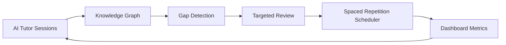

# Chapter 11: AI-Assisted Learning

> **Prerequisites:** [Chapter 3: Active Recall & Spaced Repetition](./ch-03-active-recall-spaced-repetition.md)
> **Next:** [Chapter 13: Learning Analytics & Self-Measurement](./ch-13-learning-analytics.md)

This chapter teaches you how to use AI as a learning accelerator — not a crutch. You'll learn prompt patterns that turn LLMs into Socratic tutors, build AI-powered spaced-repetition tools, use AI for code review and debugging without becoming dependent, and design a personal learning system that combines AI with evidence-based techniques. By the end, you'll know exactly when to ask AI and when to struggle productively on your own.

## Learning Objectives

- Use AI as a Socratic tutor that asks you questions rather than giving answers
- Design effective prompt patterns for learning contexts
- Build an AI-powered spaced-repetition scheduler in TypeScript
- Use AI for code review, debugging, and explanation generation
- Detect knowledge gaps automatically using AI
- Create an AI-assisted study dashboard for tracking progress
- Recognize and avoid the five most common AI learning pitfalls

### Chapter at a Glance


| Topic | Key Insight | Practical Takeaway |
|-------|-------------|-------------------|
| Socratic AI Prompting | Ask AI to question you, not answer | Use "quiz me on X, give hints only" |
| AI Spaced Repetition | LLMs generate varied review items on demand | Build an AI Anki scheduler with TypeScript |
| AI Code Review | AI catches patterns you miss | Use structured review prompts, verify every claim |
| Knowledge Gap Detection | AI maps what you know vs what you don't | Prompt for "topic X, I know A B C — what am I missing?" |
| Over-Reliance Prevention | Struggle is essential for encoding | Read-code-refactor cycle: AI only for stuck steps |
| Study Dashboard | Data-driven learning optimization | Track sessions, knowledge coverage, review velocity |



---

### Q1: How can AI serve as a Socratic tutor for active learning?


**Answer:** The most effective way to use AI for learning is to reverse the typical dynamic — instead of asking AI for answers, ask AI to quiz you. This forces active recall, which is the single most powerful learning technique.

The key is prompt design:

```
You are a Socratic tutor. Your job is NOT to give answers.
Your job is to ask me questions that lead me to discover
the answer myself.

Topic: {topic}
My current level: {beginner / intermediate / advanced}

Rules:
1. Start with a question, never an explanation
2. If I'm wrong, ask a follow-up that reveals the contradiction
3. If I'm stuck for 3 rounds, give ONE hint (never the full solution)
4. Only explain after I've demonstrated understanding
5. End each session by summarizing what I figured out
```

```typescript
interface TutorConfig {
  topic: string;
  level: 'beginner' | 'intermediate' | 'advanced';
  maxHintsPerQuestion: number;
  socraticRounds: number;
}

class SocraticTutor {
  private hintCount = 0;
  private roundCount = 0;

  constructor(private config: TutorConfig) {}

  generateOpeningQuestion(): string {
    // Patterns vary by level
    const questions: Record<string, string[]> = {
      beginner: [
        `Let's explore ${this.config.topic}. Start by explaining what you already know about it.`,
        `Without looking anything up, try to define ${this.config.topic} in one sentence.`,
      ],
      intermediate: [
        `Here's a problem involving ${this.config.topic}: [problem]. Walk me through your approach.`,
        `What's a common misconception about ${this.config.topic}? Why is it wrong?`,
      ],
      advanced: [
        `How would ${this.config.topic} behave if we removed constraint X?`,
        `What are the edge cases where ${this.config.topic} breaks down?`,
      ],
    };

    const pool = questions[this.config.level];
    return pool[Math.floor(Math.random() * pool.length)];
  }

  evaluateResponse(userAnswer: string): 'correct' | 'close' | 'wrong' {
    // In practice, this is the LLM evaluating the user's response
    // The key is that it returns a category, not a solution
    return this.roundCount > 3 ? 'wrong' : 'close';
  }

  nextPrompt(evaluation: 'correct' | 'close' | 'wrong'): string {
    this.roundCount++;

    if (evaluation === 'correct') {
      return "Great! Now let's build on that. Here's a slightly harder question...";
    }

    if (evaluation === 'close' && this.hintCount < this.config.maxHintsPerQuestion) {
      this.hintCount++;
      return "Almost there. Consider this: what happens when you change variable X?";
    }

    // After max hints, reveal the approach (not the full solution)
    return "Here's the approach to think about: [key insight]. Now try again from there.";
  }
}
```

**Try This:** Pick a topic from any course in this repository. Open an AI chat and paste the Socratic tutor prompt above with your topic. Complete 5 rounds of Q&A without asking for a direct answer.

**One-Sentence Takeaway:** Reverse the AI dynamic — ask it to question you, not answer you — and turn every chat session into an active recall exercise.

---

### Q2: What prompt patterns work best for learning?


**Answer:** Different learning goals need different prompt structures. Here are five proven patterns:

| Pattern | Use Case | Example Prompt |
|---------|----------|----------------|
| **Quiz Me** | Active recall | "Quiz me on the OSI model layers. Give me scenario questions, not definitions." |
| **Explain Like I'm X** | Scaffolding | "Explain Big-O notation to someone who knows basic math but has never seen algorithms." |
| **Compare and Contrast** | Deep understanding | "Compare REST and GraphQL across 5 dimensions: performance, flexibility, caching, tooling, learning curve." |
| **Generate Examples** | Concrete understanding | "Give me 3 real-world examples of the decorator pattern in TypeScript, from easy to complex." |
| **Find My Blind Spots** | Gap analysis | "I know React components, props, state, effects. What am I missing that intermediate developers usually know?" |

The critical rule: **always rephrase the AI's answer in your own words** before moving on. If you can't summarize it, you haven't learned it.

```typescript
interface LearningPrompt {
  pattern: 'quiz' | 'eli5' | 'compare' | 'examples' | 'blindspots';
  topic: string;
  priorKnowledge?: string;
}

function buildLearningPrompt(config: LearningPrompt): string {
  const templates: Record<string, (t: string, p?: string) => string> = {
    quiz: (t, p) =>
      `Quiz me on "${t}". ${p ? `Assume I know: ${p}.` : ''} ` +
      `Give scenario-based questions only. After each answer, tell me if I'm ` +
      `right. If wrong, give a hint and let me try again.`,

    eli5: (t, p) =>
      `Explain "${t}" to me as if I'm ${p || 'a beginner'} ` +
      `who knows programming basics but has never studied this topic. ` +
      `Use analogies. End with a one-sentence summary.`,

    compare: (t, p) =>
      `Compare and contrast ${t}. Focus on ${p || 'practical tradeoffs'} ` +
      `that matter when building real software. Use a table.`,

    examples: (t, p) =>
      `Give me ${p || '3'} progressively harder examples of ` +
      `${t} in TypeScript. First example: simplest possible use case. ` +
      `Last example: production-grade usage with error handling.`,

    blindspots: (t, p) =>
      `Topic: ${t}. I know: ${p || 'the basics'}. ` +
      `What are the top 3 things I'm probably missing? ` +
      `For each: why it matters, and a one-paragraph explanation.`,
  };

  return templates[config.pattern](config.topic, config.priorKnowledge);
}
```

**Try This:** Pick one topic you're currently studying and run all five prompt patterns against it. For each, write a 2-sentence summary from memory before reading the AI's response.

**One-Sentence Takeaway:** Match your prompt pattern to your learning goal — quiz for recall, compare for depth, examples for application, blind-spots for growth.

---

### Q3: How can you build an AI-powered spaced repetition system?


**Answer:** While tools like Anki use the SM-2 algorithm with static cards, an AI-powered system can generate varied review questions on demand, adapt difficulty, and ensure you're not just memorizing card formatting.

```typescript
interface ReviewCard {
  topic: string;
  subTopic: string;
  questionType: 'definition' | 'application' | 'comparison' | 'debug';
  difficulty: 1 | 2 | 3 | 4 | 5;
  lastReviewed: Date;
  nextReview: Date;
  repetitions: number;
  easeFactor: number;
  interval: number; // days
}

class AISpacedRepetition {
  private cards: ReviewCard[] = [];

  private readonly MIN_EF = 1.3;
  private readonly MAX_EF = 3.0;

  // SM-2 algorithm for interval calculation
  scheduleReview(card: ReviewCard, quality: 0 | 1 | 2 | 3 | 4 | 5): ReviewCard {
    if (quality >= 3) {
      // Correct response
      card.repetitions++;
      switch (card.repetitions) {
        case 1: card.interval = 1; break;
        case 2: card.interval = 6; break;
        default: card.interval = Math.round(card.interval * card.easeFactor); break;
      }
    } else {
      // Incorrect response — reset
      card.repetitions = 0;
      card.interval = 1;
    }

    // Update ease factor
    card.easeFactor = Math.max(
      this.MIN_EF,
      Math.min(
        this.MAX_EF,
        card.easeFactor + (0.1 - (5 - quality) * (0.08 + (5 - quality) * 0.02))
      )
    );

    card.lastReviewed = new Date();
    card.nextReview = new Date(Date.now() + card.interval * 86400000);
    return card;
  }

  // AI generates varied questions for the same topic
  async generateQuestion(card: ReviewCard): Promise<string> {
    const prompt = `Topic: ${card.topic} (${card.subTopic}).
Generate a ${card.questionType} question at difficulty ${card.difficulty}/5.
The user has reviewed this ${card.repetitions} times before.
Previous question types used: [tracked history].
Generate a DIFFERENT angle than previous reviews.`;

    // In practice, this sends the prompt to an LLM
    // The key insight: each review tests from a different angle
    return prompt;
  }

  getDueCards(): ReviewCard[] {
    const now = new Date();
    return this.cards
      .filter(c => c.nextReview <= now)
      .sort((a, b) => a.nextReview.getTime() - b.nextReview.getTime());
  }
}
```

**Practical implementation steps:**
1. Export your Anki card database as CSV
2. Use AI to generate 3 variant questions per card (different angles)
3. Import variants as separate cards with same scheduling
4. Review using the SM-2 algorithm above, but pick a random variant each time

**Try This:** Take 3 cards from your current Anki deck. Ask an AI to generate a variant question for each that tests the same concept from a different angle. Add them as separate cards.

**One-Sentence Takeaway:** AI-powered spaced repetition generates varied question angles for the same concept, preventing card memorization and forcing genuine understanding.

---

### Q4: How can AI improve your code review and debugging skills?


**Answer:** AI is exceptional at pattern matching — it can spot null-pointer risks, type errors, and edge cases you might miss. But the goal isn't to fix bugs for you; it's to teach you to spot them yourself.

Use this structured review cycle:

```
READ: Write the code yourself first (struggle is essential)
REVIEW: Ask AI "what could go wrong with this code?"
ANALYZE: For each issue AI finds, explain WHY it's a problem
FIX: Fix ONLY issues you now understand
VERIFY: Ask AI "did my fix address the root cause?"
```

```typescript
interface CodeReviewFinding {
  line: number;
  severity: 'critical' | 'major' | 'minor' | 'info';
  category: 'logic' | 'performance' | 'security' | 'style' | 'edge-case';
  description: string;
  suggestedFix: string;
  // The learner fills these:
  rootCause?: string;
  accepted: boolean;
}

class AIAssistedCodeReview {
  // Simulates an AI code review
  review(code: string, context: string): CodeReviewFinding[] {
    const findings: CodeReviewFinding[] = [];

    // Pattern: missing null checks
    if (code.includes('.') && !code.includes('?')) {
      findings.push({
        line: this.findLine(code, '.'),
        severity: 'critical',
        category: 'logic',
        description: 'Potential null reference — no optional chaining on object access',
        suggestedFix: 'Add ?. operator or guard with null check',
        accepted: false,
      });
    }

    // Pattern: unhandled promise rejections
    if (code.includes('async') && code.includes('Promise') && !code.includes('.catch')) {
      findings.push({
        line: this.findLine(code, 'async'),
        severity: 'critical',
        category: 'logic',
        description: 'Async function returns a Promise that may reject unhandled',
        suggestedFix: 'Add .catch() or try-catch at call site',
        accepted: false,
      });
    }

    // Pattern: O(n²) in loops
    const nestedLoops = (code.match(/for\s*\(/g) || []).length;
    if (nestedLoops >= 2) {
      findings.push({
        line: this.findLine(code, 'for'),
        severity: 'major',
        category: 'performance',
        description: `Nested loop detected (${nestedLoops} levels) — possible O(n²)`,
        suggestedFix: 'Consider using a Map or Set for O(n) lookup',
        accepted: false,
      });
    }

    return findings;
  }

  // Debugging: isolate the failure
  async guidedDebug(error: Error, code: string): Promise<string[]> {
    // AI gives hints, not solutions
    return [
      `The error "${error.message}" occurs on this line. What variable holds an unexpected value?`,
      `Put a console.log just before line ${this.findLine(code, error.message)}.`,
      `What assumption is your code making about that variable? Is it guaranteed?`,
    ];
  }

  private findLine(code: string, pattern: string): number {
    const lines = code.split('\n');
    return lines.findIndex(l => l.includes(pattern)) + 1;
  }
}
```

**The two-pass learning cycle:**
1. **Pass 1 (struggle):** Debug for 15 minutes before asking AI. Every minute of struggle strengthens neural pathways.
2. **Pass 2 (review):** Feed your code to AI. For each finding, write a one-line explanation of WHY it's a problem before accepting the fix.

**Try This:** Take a piece of code you wrote yesterday. Before running or testing it, ask AI to review it. Compare what AI found vs what you would have found on your own. For each finding you missed, write down what pattern you need to learn.

**One-Sentence Takeaway:** AI code review is most effective when you've already struggled for 15 minutes — use AI to surface patterns you missed, not to avoid thinking.

---

### Q5: How can AI generate effective practice problems?


**Answer:** AI excels at generating practice problems at specific difficulty levels, but quality varies. You need to constrain generation with clear parameters and then verify every problem yourself.

```typescript
interface ProblemConfig {
  topic: string;
  difficulty: 1 | 2 | 3 | 4 | 5;
  format: 'mcq' | 'coding' | 'open-ended' | 'debug';
  constraints: string[];
  learningObjectives: string[];
}

interface PracticeProblem {
  prompt: string;
  solution: string;
  hints: string[];
  commonMistakes: string[];
  verificationTest?: string; // TypeScript test the user can run
}

class AIProblemGenerator {
  generateProblem(config: ProblemConfig): PracticeProblem {
    // In production, this constructs a prompt for an LLM

    const prompt = `Generate a ${config.format} problem for "${config.topic}"
at difficulty ${config.difficulty}/5.

Constraints: ${config.constraints.join(', ')}
Learning objectives: ${config.learningObjectives.join(', ')}

Include:
1. The problem statement
2. A model solution
3. 2-3 progressive hints (first hint is vague, last is specific)
4. 2 common mistakes students make
5. A verification test if applicable

IMPORTANT: The problem must be solvable in under 30 minutes.
The solution must be correct and complete.`;

    // Post-generation validation
    return this.validateProblem({
      prompt,
      solution: '',
      hints: [],
      commonMistakes: [],
    });
  }

  private validateProblem(problem: PracticeProblem): PracticeProblem {
    // AI checks its own work — crucial quality gate
    // In practice: ask a second LLM call to verify correctness
    const checks = [
      'Is the problem solvable with the given constraints?',
      'Is the model solution correct?',
      'Are the hints progressive (vague → specific)?',
      'Do the common mistakes actually occur in practice?',
    ];

    // If any check fails, regenerate with specific fixes
    return problem;
  }
}
```

**Practical workflow for AI-generated problems:**

| Step | Action | Purpose |
|------|--------|---------|
| 1 | Specify exact learning objectives | Prevents vague or off-topic problems |
| 2 | Set difficulty and format | Ensures appropriate challenge level |
| 3 | Generate 3 problems | Creates options to choose from |
| 4 | Solve one yourself first | Verifies correctness, builds skill |
| 5 | Review remaining solutions | Checks AI's work without doing it yourself |
| 6 | Add to your practice queue | Integrates with spaced repetition schedule |

**Try This:** Pick a DSA topic you're studying. Ask AI for 3 coding problems at difficulty 3/5. Solve the first one yourself. For the other two, review the AI's solution and identify one edge case it missed.

**One-Sentence Takeaway:** AI-generated practice problems save you time finding examples, but always verify correctness by solving at least one yourself per batch.

---

### Q6: How can AI detect your knowledge gaps automatically?


**Answer:** The most powerful learning use of AI is mapping what you don't know you don't know. By running a structured conversation where you state your understanding and AI probes for missing pieces, you can systematically discover blind spots.

```typescript
interface KnowledgeNode {
  concept: string;
  confidence: 1 | 2 | 3 | 4 | 5; // self-rated
  mastery: 'unknown' | 'aware' | 'understands' | 'applies' | 'teaches';
  relatedConcepts: string[];
  gaps: string[];
}

class KnowledgeGapAnalyzer {
  // Strategy 1: Tell AI what you know, ask what's missing
  identifyGapsByDeclaration(topic: string, known: string[]): string[] {
    // AI maps your declared knowledge against a full topic graph
    // Returns concepts you didn't mention
    const fullTopicGraph = this.getTopicGraph(topic);
    const covered = new Set(known.map(k => k.toLowerCase()));
    return fullTopicGraph.filter(node => !covered.has(node.toLowerCase()));
  }

  // Strategy 2: AI quizzes you and infers gaps from wrong answers
  inferGapsFromMistakes(wrongAnswers: Array<{
    questionConcept: string;
    yourAnswer: string;
    correctAnswer: string;
  }>): KnowledgeNode[] {
    // Clusters wrong answers to find root-concept gaps
    const gapMap = new Map<string, KnowledgeNode>();

    for (const answer of wrongAnswers) {
      // If you got "quick sort time complexity" wrong,
      // the gap might be "recurrence relations" not "quick sort"
      const inferredGap = this.mapToRootConcept(answer);
      const existing = gapMap.get(inferredGap.concept) || {
        concept: inferredGap.concept,
        confidence: 5,
        mastery: 'unknown',
        relatedConcepts: [],
        gaps: [],
      };
      existing.gaps.push(answer.questionConcept);
      gapMap.set(inferredGap.concept, existing);
    }

    return Array.from(gapMap.values());
  }

  // Strategy 3: Coverage analysis against a syllabus
  coverageReport(syllabus: string[], known: string[]): {
    covered: string[];
    missing: string[];
    shallow: string[]; // mentioned but not deeply known
  } {
    const knownLower = known.map(k => k.toLowerCase());

    return {
      covered: syllabus.filter(s =>
        knownLower.some(k => s.toLowerCase().includes(k))
      ),
      missing: syllabus.filter(s =>
        !knownLower.some(k => s.toLowerCase().includes(k))
      ),
      shallow: [], // determined by depth of explanation, not just mention
    };
  }

  private getTopicGraph(topic: string): string[] {
    // In production, this could be a predefined knowledge graph
    // or generated by AI on demand
    return [
      `${topic} fundamentals`,
      `${topic} advanced patterns`,
      `${topic} edge cases`,
      `${topic} common pitfalls`,
      `${topic} real-world applications`,
    ];
  }

  private mapToRootConcept(answer: {
    questionConcept: string;
    yourAnswer: string;
    correctAnswer: string;
  }): KnowledgeNode {
    // Maps a specific wrong answer to the root concept gap
    return {
      concept: this.deriveRootConcept(answer.questionConcept),
      confidence: 1,
      mastery: 'unknown',
      relatedConcepts: [],
      gaps: [answer.questionConcept],
    };
  }

  private deriveRootConcept(specific: string): string {
    // E.g., "Why does this DP solution use O(n) space?"
    // → root concept: "space complexity analysis"
    const prefix = specific.toLowerCase();
    if (prefix.includes('complexity') || prefix.includes('big-o') || prefix.includes('o(')) {
      return 'Computational Complexity Analysis';
    }
    if (prefix.includes('dp') || prefix.includes('dynamic programming') || prefix.includes('memoization')) {
      return 'Dynamic Programming Fundamentals';
    }
    return `Fundamentals of ${specific.split(' ').slice(0, 3).join(' ')}`;
  }
}
```

**Learning dashboard integration:**

```typescript
interface GapReport {
  topic: string;
  coverage: number; // 0-100%
  gaps: Array<{
    concept: string;
    urgency: 'low' | 'medium' | 'high';
    suggestedResources: string[];
  }>;
  recommendedFocus: string;
}

function generateLearningPlan(currentState: KnowledgeNode[], target: string): GapReport {
  const coverage = Math.round(
    (currentState.filter(n => n.mastery === 'applies' || n.mastery === 'teaches').length /
      currentState.length) * 100
  );

  const gaps = currentState
    .filter(n => n.mastery === 'unknown' || n.mastery === 'aware')
    .map(n => ({
      concept: n.concept,
      urgency: (n.confidence <= 2 ? 'high' : n.confidence <= 3 ? 'medium' : 'low') as 'high' | 'medium' | 'low',
      suggestedResources: [`Review ${n.concept} in course materials`, `Generate practice problems on ${n.concept}`],
    }));

  return {
    topic: target,
    coverage,
    gaps: gaps.sort((a, b) => b.urgency.length - a.urgency.length),
    recommendedFocus: gaps[0]?.concept || 'No critical gaps found',
  };
}
```

**Try This:** Take a topic where you have an exam coming up. Write down everything you know about it (no looking things up). Paste your list to an AI and ask: "I'm preparing for an exam on [topic]. Here's what I know: [your list]. What am I missing that commonly appears on exams?"

**One-Sentence Takeaway:** AI gap detection reveals your blind spots by cross-referencing your declared knowledge against a complete topic map — focus your study where the gaps are largest.

---

### Q7: How can AI help with summarization that reinforces learning?


**Answer:** Passive summarization (having AI summarize content for you) weakens learning. Active summarization (you summarize, then AI evaluates) strengthens it.

```typescript
interface SummaryEvaluation {
  completeness: number; // 0-100
  accuracy: number;
  missingKeyPoints: string[];
  misconceptions: string[];
  suggestedImprovements: string[];
}

class ActiveRecallSummarizer {
  // Step 1: You read the material
  // Step 2: You write a summary from memory (no peeking)
  // Step 3: AI evaluates your summary against the source

  evaluateSummary(
    userSummary: string,
    sourceText: string,
    keyPoints: string[]
  ): SummaryEvaluation {
    const foundPoints = keyPoints.filter(kp =>
      userSummary.toLowerCase().includes(kp.toLowerCase())
    );

    const missingPoints = keyPoints.filter(kp =>
      !userSummary.toLowerCase().includes(kp.toLowerCase())
    );

    // AI detects misconceptions by looking for contradictions
    const misconceptions = this.detectMisconceptions(userSummary, sourceText);

    return {
      completeness: Math.round((foundPoints.length / keyPoints.length) * 100),
      accuracy: misconceptions.length > 0 ? 100 - misconceptions.length * 20 : 100,
      missingKeyPoints: missingPoints,
      misconceptions,
      suggestedImprovements: this.generateImprovements(missingPoints, misconceptions),
    };
  }

  private detectMisconceptions(userSummary: string, sourceText: string): string[] {
    // In practice: ask LLM to flag statements in user's summary
    // that contradict the source material
    const misconceptions: string[] = [];

    // Example patterns
    if (userSummary.includes('always') && sourceText.includes('typically')) {
      misconceptions.push('Used absolute language ("always") where source says "typically"');
    }
    if (userSummary.includes('never') && sourceText.includes('rarely')) {
      misconceptions.push('Used absolute language ("never") where source says "rarely"');
    }

    return misconceptions;
  }

  private generateImprovements(
    missingPoints: string[],
    misconceptions: string[]
  ): string[] {
    const improvements: string[] = [];

    if (missingPoints.length > 0) {
      improvements.push(
        `Review these concepts you missed: ${missingPoints.join(', ')}`
      );
    }

    if (misconceptions.length > 0) {
      improvements.push(
        `You have ${misconceptions.length} misconception(s) to correct`
      );
    }

    if (missingPoints.length === 0 && misconceptions.length === 0) {
      improvements.push('Strong summary! Try explaining these concepts to someone else.');
    }

    return improvements;
  }
}
```

**The three-pass learning protocol:**
1. **Read** the material once (focused mode, no distractions)
2. **Write** a summary from memory (active recall)
3. **Compare** — ask AI to evaluate your summary against key points

**Try This:** Read a chapter from any course in this repository. Close the file. Write a bullet-point summary from memory. Then ask AI: "Here's my summary of [topic]. Here are the key points from the source: [list]. Evaluate my summary for completeness and accuracy."

**One-Sentence Takeaway:** Never let AI summarize for you — always write your own summary first, then use AI to evaluate what you missed.

---

### Q8: How can AI help design personalized learning paths?


**Answer:** AI can analyze your current knowledge, your target goal, and your available time to produce an optimized learning path. The path should be specific enough to follow daily but flexible enough to adapt.

```typescript
interface LearningPathNode {
  topic: string;
  estimatedHours: number;
  prerequisites: string[];
  resources: string[];
  masteryCriteria: string; // How to prove you've learned it
  difficulty: 1 | 2 | 3 | 4 | 5;
}

interface LearningPath {
  title: string;
  totalEstimatedHours: number;
  nodes: LearningPathNode[];
  weeklySchedule: string[];
  milestoneCheckpoints: string[];
}

class LearningPathDesigner {
  designPath(
    currentSkill: string,
    targetSkill: string,
    weeklyHours: number,
    deadline: Date
  ): LearningPath {
    const weeksAvailable = Math.max(
      1,
      Math.round((deadline.getTime() - Date.now()) / (7 * 86400000))
    );

    // AI generates the optimal path based on:
    // - Prerequisite dependencies (you can't learn X without Y)
    // - Difficulty progression (easy → medium → hard)
    // - Time constraints (how many hours per week)
    // - Learning style (project-based vs theory-first)

    const path: LearningPathNode[] = [
      {
        topic: `Bridge from ${currentSkill} to foundation`,
        estimatedHours: Math.min(10, weeklyHours * 2),
        prerequisites: [],
        resources: ['Fundamentals review'],
        masteryCriteria: `Can explain ${currentSkill} concepts in ${targetSkill} context`,
        difficulty: 2,
      },
      {
        topic: `${targetSkill} core concepts`,
        estimatedHours: weeklyHours * weeksAvailable * 0.4,
        prerequisites: [`Bridge from ${currentSkill} to foundation`],
        resources: ['Official docs', 'Interactive tutorials'],
        masteryCriteria: `Can build a CRUD app with ${targetSkill}`,
        difficulty: 3,
      },
      {
        topic: `${targetSkill} advanced patterns`,
        estimatedHours: weeklyHours * weeksAvailable * 0.35,
        prerequisites: [`${targetSkill} core concepts`],
        resources: ['Design patterns', 'Production examples'],
        masteryCriteria: `Can identify and apply advanced patterns in code review`,
        difficulty: 4,
      },
    ];

    return {
      title: `${currentSkill} → ${targetSkill} in ${weeksAvailable} weeks`,
      totalEstimatedHours: path.reduce((sum, n) => sum + n.estimatedHours, 0),
      nodes: path,
      weeklySchedule: this.generateWeeklySchedule(path, weeklyHours),
      milestoneCheckpoints: [
        `Week ${Math.ceil(weeksAvailable * 0.25)}: Complete bridge phase`,
        `Week ${Math.ceil(weeksAvailable * 0.6)}: Build a complete project`,
        `Week ${Math.ceil(weeksAvailable * 0.9)}: Code review pass on all work`,
      ],
    };
  }

  private generateWeeklySchedule(nodes: LearningPathNode[], weeklyHours: number): string[] {
    return nodes.map(n =>
      `${n.topic}: ${n.estimatedHours}h total — break into ${Math.ceil(n.estimatedHours / weeklyHours)} weeks`
    );
  }
}
```

**Try This:** Pick a skill you want to learn next (a framework, language, or concept). Tell AI: "I know [current skills]. I want to learn [target skill]. I have [X] hours per week. Design a 12-week learning path with weekly milestones and project checkpoints."

**One-Sentence Takeaway:** AI-generated learning paths optimize the sequence and pacing of what to learn, but you must execute the daily work — the path is a map, not the journey.

---

### Q9: How can AI assist with interview preparation?


**Answer:** AI is excellent for mock interviews because it can generate realistic questions, evaluate your responses, and track your progress across practice sessions.

```typescript
interface InterviewSession {
  type: 'behavioral' | 'coding' | 'system-design' | 'technical-deep-dive';
  company: string;
  role: string;
  questions: InterviewQuestion[];
  feedback: SessionFeedback;
}

interface InterviewQuestion {
  prompt: string;
  yourAnswer?: string;
  aiFeedback?: string;
  timeLimitMinutes: number;
  category: string;
}

interface SessionFeedback {
  strength: string[];
  improvementAreas: string[];
  score: number; // 1-10
}

class MockInterviewer {
  generateSession(type: InterviewSession['type'], company: string, role: string): InterviewSession {
    return {
      type,
      company,
      role,
      questions: this.generateQuestions(type, company),
      feedback: { strength: [], improvementAreas: [], score: 0 },
    };
  }

  private generateQuestions(type: string, company: string): InterviewQuestion[] {
    const questionBank: Record<string, InterviewQuestion[]> = {
      'behavioral': [
        { prompt: 'Tell me about a time you resolved a technical disagreement.', timeLimitMinutes: 3, category: 'conflict-resolution' },
        { prompt: 'Describe a project where you had to learn a new technology quickly.', timeLimitMinutes: 3, category: 'learning-agility' },
        { prompt: 'Tell me about a time your code broke in production.', timeLimitMinutes: 3, category: 'ownership' },
        { prompt: 'Describe a situation where you had to push back on a requirement.', timeLimitMinutes: 3, category: 'assertiveness' },
        { prompt: 'How do you stay current with industry changes?', timeLimitMinutes: 2, category: 'growth-mindset' },
      ],
      'coding': [
        { prompt: 'Implement a function to find the longest substring without repeating characters.', timeLimitMinutes: 20, category: 'sliding-window' },
        { prompt: 'Design a rate limiter that handles 10K requests/second.', timeLimitMinutes: 25, category: 'system-design' },
      ],
    };

    return questionBank[type] || [];
  }

  evaluateAnswer(question: InterviewQuestion, answer: string): string {
    // AI evaluates using STAR framework for behavioral
    // and correctness + optimization for coding
    const evaluation: string[] = [];

    // Behavioral evaluation
    if (question.category === 'conflict-resolution' || question.category === 'assertiveness') {
      if (!answer.includes('Situation') && !answer.includes('situation')) {
        evaluation.push('Set up the Situation context before describing your action');
      }
      if (!answer.includes('Result') && !answer.includes('result')) {
        evaluation.push('Always close with the Result — what actually happened?');
      }
      if (answer.includes('we') && !answer.includes('I')) {
        evaluation.push('Use "I" for your specific actions, not just "we" — they want to know YOUR contribution');
      }
    }

    return evaluation.join('\n');
  }
}
```

**Mock interview protocol:**
1. **Generate** — AI creates questions matching your target company and role
2. **Answer** — You respond verbally or in writing (time-boxed)
3. **Evaluate** — AI scores your answer and gives specific feedback
4. **Iterate** — Re-answer the same question incorporating feedback
5. **Track** — Maintain a log of questions and scores across sessions

**Try This:** Pick 3 behavioral questions from above. Record yourself answering each in under 3 minutes. Transcribe the recording and ask AI to evaluate using the STAR framework (Situation, Task, Action, Result).

**One-Sentence Takeaway:** AI mock interviews give you infinite practice with immediate feedback — the key is to re-answer questions after receiving feedback, not just move to the next question.

---

### Q10: What are the five biggest pitfalls of AI-assisted learning?


**Answer:** AI-assisted learning has a dark side. If you use AI incorrectly, you can weaken your learning significantly. Here are the five critical pitfalls:

```typescript
interface Pitfall {
  name: string;
  risk: 'high' | 'critical';
  symptom: string;
  prevention: string;
  recovery: string;
}

const PITFALLS: Pitfall[] = [
  {
    name: 'Answer Dependency',
    risk: 'critical',
    symptom: 'You can solve problems WITH AI but not WITHOUT it',
    prevention: 'The 15-minute rule: struggle for 15 min before asking AI',
    recovery: 'Full AI detox: 1 week of zero AI assistance, all problems from scratch',
  },
  {
    name: 'Illusion of Understanding',
    risk: 'critical',
    symptom: 'AI explains it, you nod along, but can\'t reproduce it',
    prevention: 'Teach-back protocol: explain the concept to AI in your own words before moving on',
    recovery: 'Blank-page challenge: write everything you know about the topic from zero context',
  },
  {
    name: 'Shallow Prompting',
    risk: 'high',
    symptom: 'Getting surface-level explanations that don\'t challenge you',
    prevention: 'Use the five prompt patterns from Q2 — rotate them',
    recovery: 'Level-up prompts: "Explain this at the graduate level" or "What are the tradeoffs?"',
  },
  {
    name: 'Verification Failure',
    risk: 'critical',
    symptom: 'You trust AI\'s answer without verifying — AI is wrong 10-30% of the time',
    prevention: 'Always verify AI code by running it. Always verify AI facts against primary sources',
    recovery: 'Cite every AI claim: ask AI for sources, then check them yourself',
  },
  {
    name: 'Context Window Blindness',
    risk: 'high',
    symptom: 'AI contradicts earlier answers in the same conversation',
    prevention: 'Start fresh conversations for new topics. Keep a separate notes file',
    recovery: 'Ask AI to review the conversation history and flag contradictions',
  },
];

class PitfallGuard {
  private sessionLog: Array<{
    timestamp: Date;
    action: string;
    pitfallWarning?: string;
  }> = [];

  logAction(action: string): void {
    this.sessionLog.push({ timestamp: new Date(), action });
    this.checkForPatterns();
  }

  private checkForPatterns(): void {
    const recentActions = this.sessionLog.slice(-10);

    // Pattern: asking AI immediately without struggling first
    const quickAsks = recentActions.filter(a => a.action === 'ask_ai').length;
    if (quickAsks >= 3) {
      console.warn('⚠️ Warning: You\'ve asked AI 3+ times recently. Try struggling for 15 minutes first.');
    }

    // Pattern: never asking AI for sources
    const sourceChecks = recentActions.filter(a => a.action === 'verify_source').length;
    if (sourceChecks === 0 && quickAsks > 0) {
      console.warn('⚠️ Warning: You haven\'t verified any AI claims. Verify facts against primary sources.');
    }

    // Pattern: long conversation without fresh start
    const sessionLength = this.sessionLog.length;
    if (sessionLength > 20) {
      console.warn('⚠️ Warning: Long session detected. AI context may be drifting. Consider starting fresh.');
    }
  }
}
```

**Self-diagnosis checklist:** If you answer YES to any three, you need an AI detox week:
- [ ] I can't solve problems I've previously solved with AI
- [ ] I open an AI chat before trying to debug on my own
- [ ] I copy AI code without understanding every line
- [ ] I trust AI explanations without verifying
- [ ] I ask AI to summarize content I haven't read myself
- [ ] I feel anxious learning without AI access
- [ ] I use AI to "save time" but can't reproduce the knowledge later

**Try This:** Rate yourself on the checklist above. If you flagged 3+, implement a 24-hour AI detox: solve everything from scratch, no AI assistance. Write down how it feels and what you learned from the struggle.

**One-Sentence Takeaway:** AI-assisted learning requires strong guardrails — the 15-minute struggle rule, teach-back protocol, and verification discipline are non-negotiable for deep learning.

---

### Q11: How can you build an AI-powered learning dashboard?


**Answer:** A learning dashboard gives you data-driven visibility into your learning velocity, knowledge coverage, and review discipline. Combined with AI gap detection, it becomes a powerful meta-learning tool.

```typescript
interface LearningMetrics {
  totalStudyHours: number;
  sessionsCompleted: number;
  knowledgeCoverage: number; // %
  reviewCompliance: number; // % of due reviews completed
  conceptsMastered: number;
  conceptsInProgress: number;
  averageSessionQuality: number; // 1-10
  streakDays: number;
  projectedMasteryDate: Date;
}

class LearningDashboard {
  private metrics: LearningMetrics = {
    totalStudyHours: 0,
    sessionsCompleted: 0,
    knowledgeCoverage: 0,
    reviewCompliance: 0,
    conceptsMastered: 0,
    conceptsInProgress: 0,
    averageSessionQuality: 0,
    streakDays: 0,
    projectedMasteryDate: new Date(),
  };

  private sessionHistory: Array<{
    date: Date;
    duration: number;
    topic: string;
    quality: number;
    conceptsReviewed: string[];
    conceptsNew: string[];
  }> = [];

  logSession(
    duration: number,
    topic: string,
    quality: number,
    conceptsReviewed: string[],
    conceptsNew: string[]
  ): void {
    this.sessionHistory.push({
      date: new Date(),
      duration,
      topic,
      quality,
      conceptsReviewed,
      conceptsNew,
    });

    this.updateMetrics();
  }

  private updateMetrics(): void {
    const total = this.sessionHistory.length;
    if (total === 0) return;

    this.metrics.totalStudyHours = this.sessionHistory.reduce(
      (sum, s) => sum + s.duration, 0
    ) / 60;
    this.metrics.sessionsCompleted = total;
    this.metrics.averageSessionQuality = Math.round(
      this.sessionHistory.reduce((sum, s) => sum + s.quality, 0) / total
    );

    // Streak calculation
    this.metrics.streakDays = this.calculateStreak();

    // Knowledge coverage
    const allConcepts = new Set<string>();
    const reviewedConcepts = new Set<string>();
    this.sessionHistory.forEach(s => {
      s.conceptsNew.forEach(c => allConcepts.add(c));
      s.conceptsReviewed.forEach(c => reviewedConcepts.add(c));
    });
    this.metrics.knowledgeCoverage = allConcepts.size > 0
      ? Math.round((reviewedConcepts.size / allConcepts.size) * 100)
      : 0;

    // Projected mastery (simple model)
    const dailyVelocity = this.metrics.totalStudyHours / Math.max(1, total);
    const remainingConcepts = 100 - this.metrics.knowledgeCoverage;
    const remainingDays = Math.ceil(remainingConcepts / Math.max(1, dailyVelocity));
    this.metrics.projectedMasteryDate = new Date(
      Date.now() + remainingDays * 86400000
    );
  }

  private calculateStreak(): number {
    let streak = 0;
    const today = new Date();
    today.setHours(0, 0, 0, 0);

    for (let i = 0; i < 365; i++) {
      const checkDate = new Date(today.getTime() - i * 86400000);
      const hasSession = this.sessionHistory.some(
        s => s.date.toDateString() === checkDate.toDateString()
      );
      if (hasSession) {
        streak++;
      } else if (i > 0) {
        break; // Allow skipping today (still learning)
      }
    }
    return streak;
  }

  getWeeklyReport(): string {
    const weekAgo = new Date(Date.now() - 7 * 86400000);
    const weeklySessions = this.sessionHistory.filter(s => s.date >= weekAgo);

    return `
📊 Learning Dashboard — Weekly Report
━━━━━━━━━━━━━━━━━━━━━━━━━━━━━━━━━━━━━━━━
Sessions: ${weeklySessions.length}
Study Hours: ${Math.round(weeklySessions.reduce((sum, s) => sum + s.duration, 0) / 60)}
Streak: ${this.metrics.streakDays} days
Knowledge Coverage: ${this.metrics.knowledgeCoverage}%
Average Quality: ${this.metrics.averageSessionQuality}/10
Projected Mastery: ${this.metrics.projectedMasteryDate.toDateString()}
━━━━━━━━━━━━━━━━━━━━━━━━━━━━━━━━━━━━━━━━`;
  }
}
```

**Dashboard dimensions to track:**

| Dimension | What to Measure | Tool |
|-----------|----------------|------|
| Volume | Hours studied, sessions completed | Timer / dashboard |
| Coverage | Topics reviewed vs total topics | Knowledge graph |
| Quality | Post-session self-rating (1-10) | Journal |
| Consistency | Daily streak, review compliance | Calendar / Anki stats |
| Velocity | New concepts per session | Session log |
| Retention | Recall accuracy on spaced repetition | SM-2 statistics |

**Try This:** Create a simple learning dashboard for this week. For every study session, log: date, topic, duration (min), quality (1-10). On Sunday, compute your weekly totals and identify one pattern to improve next week.

**One-Sentence Takeaway:** What gets measured gets improved — a learning dashboard turns vague "I studied a lot" into precise metrics you can optimize.

---

### Q12: How can you use AI for multi-modal learning (diagrams, code, text)?


**Answer:** Different concepts are best understood through different modalities. AI can translate between modalities — turning text descriptions into diagrams, code into explanations, and vice versa — helping you build richer mental models.

```typescript
type Modality = 'text' | 'code' | 'diagram' | 'analogy' | 'example';

interface ConceptRepresentation {
  concept: string;
  modality: Modality;
  content: string;
}

class MultiModalLearner {
  // Convert code to a plain-text explanation
  codeToText(code: string, language: string): string {
    // AI describes what the code does in plain English
    return `This ${language} code implements [algorithm]. It works by:
1. [Step 1 description]
2. [Step 2 description]
The key insight is [pattern name].`;
  }

  // Convert a text description to a Mermaid diagram
  textToDiagram(description: string): string {
    // AI generates a Mermaid diagram from natural language
    const mermaidCode = `
\`\`\`mermaid
flowchart TD
    A[Start: ${description.split(' ').slice(0, 3).join(' ')}]
    B[Process step 1]
    C[Decision point]
    D[End result]
    A --> B --> C
    C -- Yes --> D
    C -- No --> B
\`\`\``;
    return mermaidCode;
  }

  // Generate a real-world analogy
  generateAnalogy(concept: string, domain: string): string {
    // AI maps the concept to a domain the learner already understands
    return `${concept} is like ${domain} because [key structural similarity].
The difference is [distinguishing feature].
${concept}[specific characteristic] maps to ${domain}[analogous characteristic].`;
  }

  // Multi-modal study session
  studySequence(topic: string, preferredModality: Modality): ConceptRepresentation[] {
    const sequence: ConceptRepresentation[] = [
      { concept: topic, modality: 'text', content: `Introduction to ${topic}` },
      { concept: topic, modality: 'code', content: `// Code example for ${topic}` },
      { concept: topic, modality: 'diagram', content: `Mermaid: ${topic} flow` },
      { concept: topic, modality: 'analogy', content: `${topic} is like...` },
      { concept: topic, modality: 'example', content: `Real-world ${topic} scenario` },
    ];

    // Reorder to start with preferred modality
    const preferredIndex = sequence.findIndex(s => s.modality === preferredModality);
    if (preferredIndex > 0) {
      const [item] = sequence.splice(preferredIndex, 1);
      sequence.unshift(item);
    }

    return sequence;
  }
}
```

**Learning modality switching exercise:**

| If you're stuck with... | Switch to... | Example |
|-------------------------|--------------|---------|
| Text explanation | Code implementation | Read about quicksort → implement it in TypeScript |
| Code implementation | Diagram | Look at a codebase → draw the architecture |
| Abstract concept | Analogy | "What is a hash table like in the real world?" |
| Your own code | Teach someone | Explain your code to AI as if it's a junior developer |
| Memorized definition | Novel example | "Generate 3 edge cases for this concept I've never seen" |

**Try This:** Pick a concept you're studying right now. Ask AI to represent it in all five modalities (text, code, diagram, analogy, example). Which one clicks best for you?

**One-Sentence Takeaway:** Different concepts need different modalities — use AI to translate between text, code, diagrams, and analogies until the concept clicks.

---

### Q13: How can AI help with documentation comprehension?


**Answer:** Technical documentation is often dense and assumes prior knowledge. AI can act as a documentation interpreter — filling in implicit prerequisites, providing concrete examples, and connecting abstract API docs to concrete use cases.

```typescript
interface DocComprehension {
  originalText: string;
  prerequisites: string[]; // Knowledge assumed by the docs
  concreteExample: string; // TypeScript example using the documented API
  realWorldUseCase: string; // When would you actually use this?
  commonMisunderstandings: string[]; // What people get wrong
  relatedConcepts: string[]; // What to learn next
}

class DocumentationInterpreter {
  analyze(docText: string, apiName: string): DocComprehension {
    return {
      originalText: docText,
      prerequisites: this.inferPrerequisites(docText),
      concreteExample: this.generateExample(apiName, docText),
      realWorldUseCase: this.describeUseCase(apiName),
      commonMisunderstandings: this.identifyPitfalls(docText, apiName),
      relatedConcepts: this.findRelated(apiName),
    };
  }

  private inferPrerequisites(text: string): string[] {
    const prerequisites: string[] = [];

    // Detect assumed knowledge from doc language
    if (text.includes('obviously') || text.includes('clearly') || text.includes('simply')) {
      prerequisites.push('The docs may assume more background knowledge than stated');
    }

    // Detect specific patterns
    const patterns: Array<{ keyword: string; prerequisite: string }> = [
      { keyword: 'Promise', prerequisite: 'Async/await and Promises' },
      { keyword: 'middleware', prerequisite: 'Middleware pattern and pipeline architecture' },
      { keyword: 'stream', prerequisite: 'Stream processing and backpressure' },
      { keyword: 'decorator', prerequisite: 'Decorator pattern and metaprogramming' },
      { keyword: 'proxy', prerequisite: 'Proxy pattern and interception patterns' },
    ];

    patterns.forEach(p => {
      if (text.includes(p.keyword)) {
        prerequisites.push(p.prerequisite);
      }
    });

    return prerequisites;
  }

  private generateExample(apiName: string, docText: string): string {
    // AI generates a minimal working TypeScript example
    return `
// ${apiName} — minimal working example
import { ${apiName} } from 'library';

async function run() {
  const result = await ${apiName}({
    // Key parameters inferred from docs
  });
  console.log(result);
}

run().catch(console.error);
`;
  }

  private describeUseCase(apiName: string): string {
    return `Use ${apiName} when you need to [specific problem it solves].
Example scenario: [real-world situation].
Not suitable for: [situations where it's overkill].`;
  }

  private identifyPitfalls(text: string, apiName: string): string[] {
    const pitfalls: string[] = [];

    if (text.includes('optional') || text.includes('default')) {
      pitfalls.push(`The default behavior of ${apiName} may not match your expectations — always test with explicit parameters first`);
    }
    if (text.includes('async') || text.includes('Promise')) {
      pitfalls.push(`Error handling: ${apiName} may throw or return rejected Promises — always wrap in try-catch`);
    }
    if (text.includes('deprecated')) {
      pitfalls.push(`WARNING: ${apiName} has deprecated features — check the changelog for migration paths`);
    }

    return pitfalls;
  }

  private findRelated(apiName: string): string[] {
    return [
      `${apiName} alternatives (when to use each)`,
      `${apiName} internals (how it works under the hood)`,
      `${apiName} performance patterns`,
    ];
  }
}
```

**Documentation learning protocol:**
1. **Read** the official docs once (surface understanding)
2. **Ask AI** for prerequisites and concrete examples (fill gaps)
3. **Implement** the example without looking at AI's version (active recall)
4. **Compare** — find what you got wrong, re-read those parts of the docs
5. **Build** a small project using the documented API (transfer)

**Try This:** Pick any library's documentation page you've been meaning to read. Before diving deep, ask AI: "Here's the API docs for [library feature]. What prior knowledge does this assume? Give me a working TypeScript example and identify the top 3 things people misunderstand about it."

**One-Sentence Takeaway:** AI transforms dense documentation into a personalized learning session by filling in assumed knowledge and providing concrete examples you can run.

---

### Q14: How can you combine AI with traditional learning techniques?


**Answer:** AI amplifies traditional techniques but doesn't replace them. Here's how to combine AI with every technique from previous chapters:

```typescript
interface TechniqueAugmentation {
  technique: string;
  chapter: string;
  withoutAI: string;
  withAI: string;
  rule: string; // When NOT to use AI
}

const COMBINATIONS: TechniqueAugmentation[] = [
  {
    technique: 'Active Recall',
    chapter: 'Ch 3',
    withoutAI: 'Quiz yourself from memory',
    withAI: 'AI generates varied questions, evaluates answers',
    rule: 'Always attempt recall FIRST before using AI to check',
  },
  {
    technique: 'Spaced Repetition',
    chapter: 'Ch 3',
    withoutAI: 'Anki with SM-2 algorithm',
    withAI: 'AI generates variant questions each review cycle',
    rule: 'Use SM-2 for scheduling, AI only for question content',
  },
  {
    technique: 'Feynman Technique',
    chapter: 'Ch 4',
    withoutAI: 'Explain to a friend or rubber duck',
    withAI: 'AI acts as an interrogator, probing weak points',
    rule: 'Explain from memory first, THEN let AI probe gaps',
  },
  {
    technique: 'Interleaving',
    chapter: 'Ch 4',
    withoutAI: 'Mix problem types manually',
    withAI: 'AI generates mixed-problem sets from random topics',
    rule: 'Set the interleaving schedule yourself, AI executes',
  },
  {
    technique: 'Memory Palace',
    chapter: 'Ch 5',
    withoutAI: 'Visualize locations manually',
    withAI: 'AI generates vivid, memorable images for loci',
    rule: 'Your palace must be real locations you know',
  },
  {
    technique: 'Pomodoro',
    chapter: 'Ch 4',
    withoutAI: 'Timer + paper for distractions',
    withAI: 'AI tracks sessions, analyzes interruption patterns',
    rule: 'No AI during the 25-minute focus block',
  },
  {
    technique: 'Deliberate Practice',
    chapter: 'Ch 2',
    withoutAI: 'Identify weak areas, drill specifically',
    withAI: 'AI identifies weak areas from error analysis',
    rule: 'AI diagnoses, you prescribe the practice plan',
  },
  {
    technique: 'Attention Residue Mgmt',
    chapter: 'Ch 6',
    withoutAI: 'Journal interruptions, batch context switches',
    withAI: 'AI detects attention residue from session patterns',
    rule: 'No AI-driven interruptions during deep work',
  },
];

class TechniqueAugmenter {
  getAugmentation(technique: string): TechniqueAugmentation | undefined {
    return COMBINATIONS.find(t =>
      t.technique.toLowerCase().includes(technique.toLowerCase())
    );
  }

  generateHybridSession(techniques: string[], topic: string): string {
    const plan: string[] = ['AI-Augmented Study Session Plan:\n'];

    for (const technique of techniques) {
      const aug = this.getAugmentation(technique);
      if (aug) {
        plan.push(`## ${aug.technique} (${aug.chapter})`);
        plan.push(`Without AI: ${aug.withoutAI}`);
        plan.push(`With AI: ${aug.withAI}`);
        plan.push(`Rule: ${aug.rule}\n`);
      }
    }

    plan.push(`Topic: ${topic}`);
    plan.push('Ready? Start with active recall from memory. Then bring in AI.');

    return plan.join('\n');
  }
}
```

**The golden rule:** AI enhances the input and output of learning (finding materials, generating practice, evaluating answers) but never replaces the core encoding process — the struggle of recall, the effort of understanding, the work of connecting new knowledge to existing mental models.

**Try This:** Pick one chapter from this course (e.g., Ch 4: Pomodoro/Interleaving/Feynman). Design a study session where you use AI to augment EACH technique, not replace it. Write down your session plan.

**One-Sentence Takeaway:** AI is an amplifier, not a substitute — every traditional learning technique can be augmented by AI, but the core encoding work must be done by you.

---

### Q15: How do you build a lifelong AI-assisted learning system?


**Answer:** A lifelong learning system integrates all the techniques from this chapter and this course into a sustainable daily practice.

```typescript
interface DailyLearningRoutine {
  morning: {
    review: string; // AI-powered spaced repetition review (15 min)
    newConcept: string; // AI generates a micro-lesson on something new (10 min)
  };
  throughout: {
    gapCapture: string; // Note what you don't know, AI enriches it
    practice: string; // AI-generated practice problems on current focus
  };
  evening: {
    teachBack: string; // Explain to AI what you learned today
    dashboard: string; // Log session, update metrics
    planTomorrow: string; // AI suggests tomorrow's focus based on gaps
  };
}

class LifelongLearningSystem {
  private dashboard: LearningDashboard;
  private schedule: AISpacedRepetition;
  private gapAnalyzer: KnowledgeGapAnalyzer;
  private streak: number = 0;

  constructor() {
    this.dashboard = new LearningDashboard();
    this.schedule = new AISpacedRepetition();
    this.gapAnalyzer = new KnowledgeGapAnalyzer();
  }

  async dailyRoutine(): Promise<void> {
    // Morning: Review due cards
    const dueCards = this.schedule.getDueCards();
    console.log(`📚 ${dueCards.length} cards due for review today`);

    // Throughout: Capture gaps during work/study
    // Evening: Log and plan
    this.dashboard.logSession(
      45, // minutes
      'daily-learning',
      8, // quality
      dueCards.map(c => c.topic),
      [] // new concepts
    );

    // Adjust next day based on gaps
    this.streak++;
    console.log(`🔥 ${this.streak}-day learning streak`);
  }

  weeklyReview(): void {
    const report = this.dashboard.getWeeklyReport();
    console.log(report);

    // Adjust schedule based on performance
    if (this.dashboard['metrics'].reviewCompliance < 80) {
      console.log('⚠️ Review compliance below 80% — reduce new cards');
    }

    if (this.dashboard['metrics'].averageSessionQuality < 6) {
      console.log('💡 Session quality below 6/10 — try changing environment or time of day');
    }
  }

  monthlyDeepDive(): void {
    // Retrospective on what worked and what didn't
    // Adjust learning path based on progress

    const monthlyMetrics = `
📈 Monthly Learning Report
━━━━━━━━━━━━━━━━━━━━━━━━━━━━━━━━━━━━━━━━
Total Hours: ${this.dashboard['metrics'].totalStudyHours}
Concepts Mastered: ${this.dashboard['metrics'].conceptsMastered}
Knowledge Coverage: ${this.dashboard['metrics'].knowledgeCoverage}%
Average Quality: ${this.dashboard['metrics'].averageSessionQuality}/10
━━━━━━━━━━━━━━━━━━━━━━━━━━━━━━━━━━━━━━━━

Adjustments for next month:
1. Focus on bottom-3 gap areas
2. Try AI-augmented interleaving (mixed-topic review sessions)
3. Verify AI claims more rigorously
4. One AI-detox day per week`;
  }
}
```

**Your lifelong system checklist:**

| Frequency | Action | AI Role |
|-----------|--------|---------|
| Daily | Spaced repetition review (15 min) | Generates variant question angles |
| Daily | Learn one new concept (10 min) | Provides structured micro-lesson |
| Daily | Log study session to dashboard | Tracks metrics automatically |
| Weekly | Knowledge gap analysis | Identifies blind spots |
| Weekly | Dashboard review + adjust | Suggests next week's focus |
| Weekly | One AI-detox day | (None — struggle from scratch) |
| Monthly | Learning path recalibration | Re-optimizes based on progress |
| Quarterly | Full skill tree audit | Maps all knowledge areas |
| Yearly | Annual learning retrospective | Analyzes year-long trends |

**Try This:** Design your own daily 30-minute learning routine using the template above. Commit to it for 7 days. Use this chapter's TypeScript classes to build your personal learning tracker.

**One-Sentence Takeaway:** A lifelong AI-assisted learning system combines daily routines, weekly reviews, and monthly recalibrations — AI amplifies every level but you own the discipline.

---

### Self-Assessment Quiz


**1. What is the most effective way to use AI as a learning tool?**
a) Ask AI to summarize chapters for you
b) Ask AI to generate code you don't understand
c) Ask AI to quiz you using Socratic questioning
d) Ask AI to write your study notes

**Answer:** c) Socratic questioning forces active recall, which is the single most effective learning technique — AI's role is to probe your understanding, not replace it.

**2. What should you do BEFORE asking AI for help with a bug?**
a) Nothing, ask AI immediately to save time
b) Struggle for 15 minutes on your own
c) Rewrite the entire codebase
d) Ask a colleague first

**Answer:** b) The 15-minute struggle rule ensures you build neural pathways through effort before using AI as a pattern-matching assistant.

**3. Which prompt pattern is best for identifying what you don't know?**
a) "Explain this topic to me"
b) "Quiz me on this topic"
c) "Here's what I know — what am I missing?"
d) "Give me examples of this concept"

**Answer:** c) The blind-spot pattern explicitly asks AI to cross-reference your knowledge against a complete topic map and return what you missed.

**4. What is the biggest risk of AI-assisted learning?**
a) AI is too slow
b) Answer dependency — inability to solve problems without AI
c) AI costs too much
d) AI doesn't understand your questions

**Answer:** b) Answer dependency is the critical risk — if you can solve problems with AI but not without it, you haven't learned anything.

**5. How should you verify AI-generated information?**
a) Trust it — AI is always correct
b) Check it against a second AI
c) Verify against primary sources and run AI-generated code
d) Ask AI to double-check itself

**Answer:** c) AI is wrong 10-30% of the time. Always verify facts against primary sources and run AI-generated code. Asking AI to check itself creates circular reasoning.

**6. How often should you do an AI detox?**
a) Never — AI is always beneficial
b) At least once a week
c) Once a month
d) Only when you feel dependent

**Answer:** b) A weekly AI-detox day (solving problems from scratch without AI) prevents answer dependency and strengthens independent problem-solving.

**7. What is the purpose of the teach-back protocol?**
a) To teach AI something new
b) To prevent the illusion of understanding by explaining concepts in your own words
c) To get better AI responses
d) To save time

**Answer:** b) The teach-back protocol exposes the illusion of understanding — if you can't explain it clearly, you don't really know it, even if it felt clear when AI explained it.

**8. In AI-powered spaced repetition, what does AI add beyond standard Anki?**
a) Better scheduling algorithm
b) Varied question angles for the same concept
c) Automatic card creation
d) Multi-platform support

**Answer:** b) AI's main advantage in spaced repetition is generating different question angles for each review cycle, preventing card memorization and forcing genuine understanding.

**9. What should you do with AI-generated practice problems?**
a) Solve all of them without checking
b) Solve at least one yourself to verify correctness before using the rest
c) Use them all as-is since AI is reliable
d) Only look at the solutions

**Answer:** b) AI problems may contain errors. Solving at least one yourself verifies correctness and provides learning value from the struggle.

**10. Which modality switching strategy helps when you're stuck on an abstract concept?**
a) Read more text explanations
b) Ask for a real-world analogy
c) Re-read the same paragraph slower
d) Skip the concept entirely

**Answer:** b) Abstract concepts often click when translated to a concrete analogy from a domain you already understand — leveraging existing mental models for new knowledge.

---

## Concept Comparison Table

| Concept | Definition | When to Use | Pitfall |
|---------|-----------|-------------|---------|
| Socratic AI | AI asks questions, you find answers | New topic exploration | Asking AI for direct answers instead |
| AI Spaced Repetition | AI generates varied review questions | Daily review sessions | AI-generated questions may be too easy or too hard |
| Teach-Back Protocol | Explain concepts in your own words to AI | After every AI explanation | Moving on without teaching back |
| Knowledge Gap Detection | AI maps known vs unknown concepts | Weekly review, exam prep | Assuming AI's map is complete |
| Multi-Modal Learning | Translate between text, code, diagrams | When stuck on one modality | Sticking to one modality |
| Prompt Engineering | Designing effective AI prompts | Every AI interaction | Using the same prompt pattern for everything |
| AI Detox | Periods of zero AI assistance | Weekly, or when dependency symptoms appear | Never doing detox |
| Learning Dashboard | Metrics-driven learning tracking | Daily logging, weekly review | Tracking without acting on insights |

## Cross-Application Matrix

| Technique | DSA Prep | GATE/Theory | Framework Learning | Coding Interviews |
|-----------|----------|-------------|-------------------|-------------------|
| Socratic AI Tutor | AI quizzes on algo patterns | AI probes theory gaps | AI questions framework choices | AI runs mock interviews |
| AI Code Review | Pattern-spotting in solutions | AI checks formula correctness | AI reviews config/code quality | AI evaluates solution efficiency |
| AI Spaced Repetition | Variant algo problem angles | Variant theory question angles | Variant API usage questions | Variant behavioral questions |
| Knowledge Gap Detection | Map known vs unknown DSA topics | Identify theory blind spots | Detect missing framework concepts | Identify weak interview categories |
| Multi-Modal Learning | Code → diagram for algorithms | Text → mermaid for theory maps | Docs → code examples | Text → mock scenarios |
| AI Detox Days | Solve DSA from scratch | Answer theory from memory | Build features without AI | Full mock without AI |

## Quick Reference

| Category | Key Points |
|----------|-----------|
| AI as Tutor | - Use Socratic prompting: AI asks, you answer - 5 prompt patterns: quiz, ELI5, compare, examples, blind-spots - Always teach back before moving on |
| AI & Spaced Repetition | - Use SM-2 for scheduling, AI for question content - Generate variant angles for each review - Verify AI-generated questions for correctness |
| AI & Code Review | - Struggle 15 min before asking AI - For each AI finding, write why it's a problem - Two-pass: struggle first, review second |
| AI & Gap Detection | - Declare what you know, AI finds what's missing - Infer gaps from wrong answers - Cross-reference against full syllabus |
| Pitfalls | - Answer dependency: detox weekly - Illusion of understanding: teach-back protocol - Verification failure: check primary sources - Shallow prompting: rotate prompt patterns - Context drift: fresh sessions per topic |

## Chapter Summary

- AI is most effective as a Socratic tutor that questions you rather than answering — use the 5 prompt patterns (quiz, ELI5, compare, examples, blind-spots) for different learning goals
- AI-powered spaced repetition generates varied question angles, preventing card memorization and forcing genuine understanding
- The 15-minute struggle rule is non-negotiable: always try to solve, debug, or recall on your own before involving AI
- Knowledge gap detection reveals blind spots by cross-referencing your declared knowledge against a complete topic map
- Multi-modal learning (translating between text, code, diagrams, analogies) builds richer mental models
- The five pitfalls of AI-assisted learning are answer dependency, illusion of understanding, shallow prompting, verification failure, and context window blindness
- A weekly AI-detox day prevents dependency and strengthens independent problem-solving skills
- A lifelong learning system integrates daily spaced repetition, weekly gap analysis, and monthly recalibration — AI amplifies every level

## Exercises

1. Design a Socratic tutor prompt for a topic you're currently studying. Complete 5 rounds of Q&A without asking for a direct answer.
2. Take 3 Anki cards and ask AI to generate a different-angle variant for each. Add them to your deck.
3. Pick a bug you encountered this week. Debug for 15 minutes without AI, then ask AI to review. Compare findings.
4. Run the gap detection protocol: write down everything you know about a topic, ask AI what you're missing, study the gaps.
5. Implement the AISpacedRepetition class from this chapter in your own study system.
6. Rate yourself on the AI dependency checklist (Q10). If 3+ checks, implement a 24-hour AI detox.
7. Pick a concept and learn it using all 5 modalities (text, code, diagram, analogy, example). Which modality worked best?
8. Build a learning log: track 7 days of sessions (topic, duration, quality). Compute your weekly metrics.
9. Teach-back a concept to AI after reading about it. Ask AI to evaluate your explanation for gaps.
10. Design your 30-minute daily learning routine combining 3 traditional techniques with AI augmentation.

## Chapter Quiz

**Q1:** A student studies DP patterns with AI for 2 weeks. In a no-AI mock interview, they freeze on a DP problem they've seen before. What most likely happened?
- A) They didn't study enough total hours
- B) AI generated answers too quickly, preventing the struggle needed for encoding
- C) The interview question was harder than their practice
- D) They should have used a different AI tool

<details>
<summary>Answer&lt;/summary&gt;

**Answer:** B — When AI provides answers too quickly, it bypasses the struggle phase essential for memory encoding. The student recognized the pattern but couldn't reproduce it without AI's scaffolding.
</details>

**Q2:** A learner asks AI "Compare REST and GraphQL across 5 dimensions" and studies the table. What should they do next to solidify understanding?
- A) Move to the next topic
- B) Close the AI response and explain the differences from memory
- C) Ask AI to expand to 10 dimensions
- D) Save the comparison table for later review

<details>
<summary>Answer&lt;/summary&gt;

**Answer:** B — Active recall requires reproducing information from memory. Reading AI's comparison gives the illusion of understanding; teaching it back from memory reveals genuine gaps.
</details>

**Q3:** Which metric best indicates genuine learning progress in an AI-assisted study system?
- A) Number of AI chats per week
- B) Number of problems solved with AI help
- C) Ability to solve problems correctly without AI
- D) AI's confidence score in its responses

<details>
<summary>Answer&lt;/summary&gt;

**Answer:** C — The only true measure of learning is independent performance. If you can only solve problems with AI assistance, you haven't learned — you've outsourced.
</details>

**Q4:** A student has been using AI for 3 months and notices they feel anxious when attempting problems without AI. What should they do?
- A) Push through the anxiety — it will pass
- B) Implement a weekly AI-detox day with full no-AI practice sessions
- C) Reduce AI use only for code generation, keep it for explanations
- D) Switch to a different AI tool

<details>
<summary>Answer&lt;/summary&gt;

**Answer:** B — Anxiety when learning without AI is a clear symptom of answer dependency. Scheduled detox days rebuild independent problem-solving confidence and prevent long-term skill degradation.
</details>

**Q5:** A developer feeds their code to AI for review and gets 5 findings. What is the most effective learning action?
- A) Apply all 5 fixes immediately
- B) For each finding, write down why it's a problem before accepting the fix
- C) Only apply the critical fixes, skip minor ones
- D) Ask AI to also fix the issues automatically

<details>
<summary>Answer&lt;/summary&gt;

**Answer:** B — Writing down the root cause for each finding forces understanding. Blindly applying fixes creates the illusion of learning without the neural encoding that comes from analysis.
</details>

## Further Reading

- [Chapter 3: Active Recall & Spaced Repetition](ch-03-active-recall-spaced-repetition.md)
- [Chapter 4: Pomodoro, Interleaving & Feynman](ch-04-pomodoro-interleaving-feynman.md)
- [Chapter 5: Memory Systems & Mnemonics](ch-05-memory-systems.md)
- [Chapter 6: Procrastination, Habits & Deep Work](ch-06-procrastination-habits-deep-work.md)
- [Chapter 10: Meta-Learning & Lifelong System](ch-10-meta-learning-system.md)
- [Archive: Complete Reference](archive-complete-reference.md)
