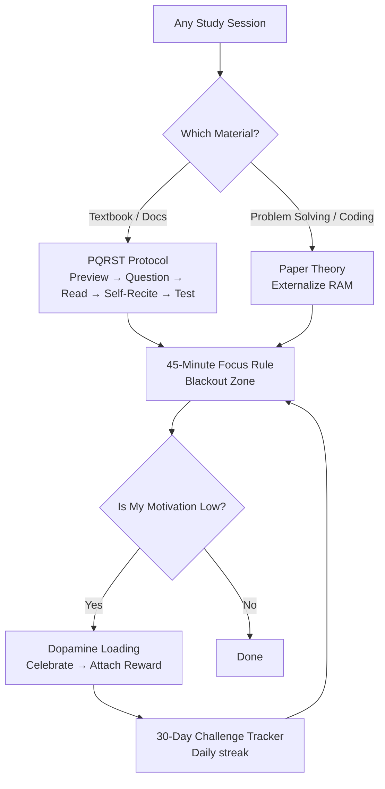
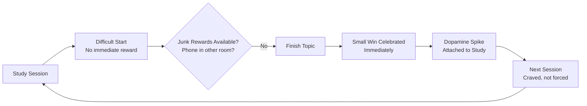
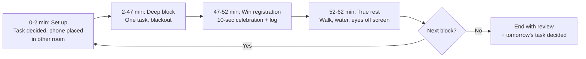

# Chapter 17: Study Protocols & Brain Hacks

> **Prerequisites:** [Chapter 16: Self-Assessment & Structured Preparation Strategy](./ch-16-self-assessment-strategy.md) — Knowing where you stand before optimizing how you learn.
> **Also see:** [Chapter 4: Pomodoro, Interleaving & Feynman](./ch-04-pomodoro-interleaving-feynman.md) — The core focus techniques this chapter extends.

> **The packaged, battle-tested study protocols: PQRST, the Paper Theory, Dopamine Loading, the 45-Minute Focus Rule, the 30-Day Fluency Challenge, brain exercises, and Japanese study techniques — turned into a single daily warrior protocol you can start today.**
> Covers Q291–Q318 — 28 Q&As

The science of learning (Chapters 1–6) tells you *what* works: active recall, spacing, testing, focus. But knowing the ingredients is not the same as having a recipe. This chapter packages the most effective ideas from research into **named, ready-to-run protocols** — the same ones toppers and high-performers use daily. Each protocol answers three questions: *What is it? Why does it work? How do I run it today?*

---

## Learning Objectives

After completing this chapter, you will be able to:

- Run the 5-phase PQRST study method on any textbook chapter or documentation
- Compare PQRST with SQ3R and Feynman, and pick the right method per study material
- Apply the Paper Theory to offload your working memory while studying and problem-solving
- Design a personal Dopamine Loading system that makes study a reward, not a punishment
- Structure study sessions using the 45-Minute Focus Rule with a real blackout zone
- Execute the 30-Day Fluency Challenge for any spoken-language or verbal skill goal
- Perform a 5-minute daily brain-exercise routine for memory and processing speed
- Apply the 5 Japanese study philosophies (Kaizen, Shoshin, Seijaku, Nemawashi, Kaikaku)
- Assemble all protocols into one daily Warrior Protocol schedule

---

### Chapter at a Glance

| Protocol | Key Insight | Practical Takeaway |
|----------|-------------|-------------------|
| PQRST | Reading passively is fake learning | Preview → Question → Read → Self-Recite → Test, every study session |
| Paper Theory | Your brain has limited RAM | Write to externalize working memory — think with the pen |
| Dopamine Loading | Motivation follows rewards, not the reverse | Design a celebration system that makes studying the source of dopamine |
| 45-Minute Focus Rule | Phone in another room = deeper focus | Single task, blackout zone, no notifications — 45 minutes |
| 30-Day Fluency Challenge | Fluency is a repetition habit, not a gift | 15 focused minutes daily, same time, tracked for 30 days |
| Brain Exercises | The brain is a muscle | 5 minutes daily of recall walks, dual n-back, and speed drills |
| Japanese Techniques | Culture has packaged wisdom | Kaizen (continuous), Shoshin (beginner's mind), Seijaku (stillness), Nemawashi (consensus planning), Kaikaku (radical change) |
| Vedic Habits | Ancient habits are packaged science | Brahma Muhurta, pranayama, Japa repetition, Ekagrata, gratitude ritual |
| 3 Mistakes | Fixing errors beats adding techniques | Passive learning, digital tethering, grind-without-rest |
| Diamond Mindset | Pressure is material, not enemy | Formed under pressure, polished daily, hard to break |
| Problem Reframe | Every problem is a data point | Name it → find the data → convert to action |
| Topper Habits | Systems beat motivation | Morning routine, planning, testing, phone discipline, evening review |



---

## Q291: What is the PQRST study method?

PQRST is a 5-phase structured reading method designed to prevent the biggest learning failure: **reading passively and believing you've learned**. It forces you to interact with the material *before, during, and after* reading.

### The 5 Phases

| Phase | Name | What You Do | Time Share |
|-------|------|-------------|------------|
| **P** | Preview | Skim headings, bold words, diagrams, summaries. Get the skeleton. | 5% |
| **Q** | Question | Convert headings into questions you must answer. | 5% |
| **R** | Read | Read actively, hunting for answers to your questions. | 60% |
| **S** | Self-Recite | Close the book. Recite/explain answers aloud or in writing. | 20% |
| **T** | Test | Answer questions, solve exercises, or take a mini-quiz. | 10% |

### Why It Works (The Science)

- **Preview** activates your prior knowledge (schema theory) — your brain files new info into existing mental folders instead of building new ones from scratch.
- **Question** converts passive reading into an information-search task. Your brain treats questions as goals: goal-directed attention is stronger than free-floating attention.
- **Self-Recite** is active recall with the book closed — the single strongest learning technique (Chapter 3). The 20% of time spent reciting produces more retention than the 60% spent reading.
- **Test** adds the testing effect (Chapter 5, Q59): retrieving strengthens memory more than re-exposure.

### The 60-Second Demo

Take any page you're about to read. Do this:

```
1. PREVIEW (30 sec):  Read every heading and bolded term on the page.
2. QUESTION (30 sec): Write 2-3 questions, one per heading:
                      "What is a deadlock?" "How do I prevent one?"
3. READ (5 min):      Read to answer YOUR questions, not just to read.
4. SELF-RECITE (2 min): Close the page. Answer aloud from memory.
                      Say it before you look — even if wrong.
5. TEST (1 min):      Solve the page's exercises or explain the concept
                      to an imaginary student (Feynman style).
```

**Try This:** Apply PQRST to your next chapter right now. Time the phases. Notice how much more you remember after the Test phase compared to your normal reading.

---

## Q292: How do I run the Preview and Question phases properly?

These two phases take under 5 minutes combined but decide whether the rest of the session is active or passive. They are the most-skipped and most-powerful phases of PQRST.

### Phase P: The 90-Second Preview Checklist

```
[ ] Scan the title and subtitle — what is this REALLY about?
[ ] Read every heading (H1, H2, H3) — this is the chapter's skeleton
[ ] Look at every diagram, table, and figure caption
[ ] Read the first sentence of each section
[ ] Skim bold, italic, and highlighted terms
[ ] Read the summary or key-takeaways box if present
[ ] Ask: "What do I already know about this?"
```

The preview builds a **mental map**. When you then read the full text, every detail snaps onto the map. Without preview, details float disconnected and are forgotten within hours.

### Phase Q: The Question Conversion Rule

Convert each heading into a question. This is a mechanical skill — here are the patterns:

| Heading | Converted Question |
|---------|-------------------|
| "TCP Handshake" | "How does the TCP handshake establish a connection?" |
| "B-Tree Insertion" | "What happens when I insert a key into a full B-Tree node?" |
| "Advantages of NoSQL" | "When is NoSQL better than SQL, and why?" |
| "Lombok @Data" | "What does @Data generate, and what does it NOT generate?" |

**Question quality rule:** Use *How / Why / Compare / What happens when* — not *What is*. "What is X" questions test recognition; "Why" questions build understanding.

**Try This:** Take the table of contents of any technical book. Convert 10 headings into questions in under 3 minutes. Store them in Anki as cards — you now have a ready-made question bank for this book.

---

## Q293: How do I perform the Read phase actively?

The Read phase is where most people zone out. PQRST's Read phase is different: you read **with a question in hand and a pen in your fist**.

### The 3-Read Layers (Not 3 Reads — 3 Layers in One Pass)

| Layer | What You Do |
|-------|-------------|
| **Answer layer** | Read to answer your Preview-Phase questions. Highlight ONLY the words that answer them. |
| **Structure layer** | Note how the section is organized: definition → example → edge cases → summary. This teaches you how experts structure explanations (a transferable skill). |
| **Skeptic layer** | Ask "Do I believe this?" Find a counterexample, a missing edge case, or a hole. Write it in the margin. |

### Active-Reading Rules

1. **No highlighting before Question phase** — highlight answers, not everything. If >20% of a page is highlighted, you're not selecting, you're coloring.
2. **Margin notes in your own words** — one line per paragraph. If you can't compress it, you haven't understood it.
3. **Stop when confused** — confusion is a signal to re-read *backwards* (start from the example, which grounds the theory). Never power through confusion.
4. **Time-box yourself** — a 20-page section gets 60 minutes max. Slow reading without a question is low-yield.

### A Read-Phase Tracking Card (copy into your notebook)

```
Section: ______________   Question: ______________
Answer found? [ ] Yes [ ] No — if No: re-read example first
Confusion logged: ______________
One-line summary: ______________
```

**Try This:** Read one section of this repository's course content with the 3 layers. Log each layer's notes in a card like the one above.

---

## Q294: How do I self-recite without it feeling fake?

Self-Recite (the S in PQRST) is the highest-value phase and the most uncomfortable — which is exactly why it works. Discomfort during recall is the *signal of memory strengthening*.

### The Recite Ladder (start at step 1, climb until you fail)

```
Step 1: Scan the headings and recite what each section was about
Step 2: Close the book — answer your Preview-Phase questions aloud
Step 3: Teach the section to an imaginary 10-year-old (no jargon)
Step 4: Draw the concept from memory (diagram, flowchart, or table)
Step 5: Write a 3-sentence summary from memory — no peeking
```

**The 60% Rule:** If you can't recall 60% of the section after reading, you haven't finished the Read phase — re-read the *skeleton* (headings + diagrams), not the whole text, then recite again.

### Anti-Fake Recite Guards

- **No peeking mid-recite.** If you peek, the entire exercise converts to recognition (weak) instead of recall (strong). Peeked? Restart the step.
- **Say it out loud** — silent thinking feels like recall but lets your brain cheat with vague familiarity. Your voice forces concrete sentences.
- **Use your own words** — parroting the book's phrasing is reproduction, not understanding. If you can't restate it, you don't own it yet.
- **Recite into a recording** — 60 seconds of voice memo. Play it back. The gap between what you *thought* you said and what you *actually* said is your gap analysis in real time.

**Try This:** Record a 60-second recitation of the last technical concept you learned. Play it back. List 3 things you said wrong or vaguely — those are your next Anki cards.

---

## Q295: How do I build the Test phase into PQRST?

The Test phase closes the loop: it converts PQRST from a reading method into a **self-assessment machine**. If Preview builds the map and Recite builds recall, Test builds *performance*.

### The Test Menu (pick 1–2 per study session)

| Test Type | How It Works | Best For |
|-----------|--------------|----------|
| **Question Bank** | Answer end-of-chapter questions, timed | Any subject |
| **Blank-Page Test** | Write everything you remember about a topic on a blank page | Exam subjects (Chapter 3) |
| **Anki Review** | The section's questions become Anki cards, reviewed tonight | Long-term retention |
| **Problem Set** | Solve exercises without looking at examples | Coding, math, physics |
| **Explanation Test** | Explain the section to a rubber duck / study partner | Conceptual subjects |
| **Flashcard Relay** | Cover the answers, go through the deck, sort into know/don't-know | Speed revision |

### The Test-Every-Time Rule

Test **every session**, even 5-minute ones. Testing after *every* study session produces dramatically higher retention than testing only before exams. This is the single biggest mistake students make: they separate "learning time" from "testing time" — but testing **is** learning.

### Score and Feed Back Into the System

```
After testing: grade yourself C (Correct) / M (Mistake) / E (Empty) / R (Random)
(from Chapter 15's C/M/E/R taxonomy)
C → move on
M → understand the mistake, add a card, re-test tomorrow
E → this topic was never learned — re-run PQRST on it this week
R → lucky guess — treat as E
```

**Try This:** Next study session, add a 5-minute Test phase with one of the six test types. Log your C/M/E/R scores. Within 2 weeks, you'll notice the sections you tested are the ones you remember.

---

## Q296: PQRST vs SQ3R vs Feynman — which do I use when?

You now have three packaged methods. They overlap — all three force active processing — but each has a sweet spot. Choosing the right one is a meta-skill worth more than mastering any single method.

### Comparison Table

| Aspect | PQRST | SQ3R | Feynman |
|--------|-------|------|---------|
| Full name | Preview, Question, Read, Self-Recite, Test | Survey, Question, Read, Recite, Review | Teach-to-a-child |
| Strength | Testing + self-assessment built in | Review built in (5th R) | Deepest understanding check |
| Weakness | Recite phase can feel artificial | Review phase often skipped | Needs a listener/recording to be honest |
| Best for | Exam-prep textbooks | Long docs, new subjects, first pass | Abstract concepts, debugging understanding |
| Time per section | 10–15 min | 15–20 min | 10 min + listener |
| Output | Test scores + question bank | Structured notes + review schedule | Plain-language explanation |

### Decision Flow

```
Is it exam-critical material?        → PQRST (you need the Test phase)
Is it a brand-new topic/field?       → SQ3R (Survey builds the map first)
Is it a concept you "sort of" get?   → Feynman (expose the gap)
Is it code you must write?           → Paper Theory (Q297-298) + code it
```

### SQ3R Quick Reference (for completeness)

```
S Survey:  Skim headings, summaries, diagrams — 5 min
Q Question: Convert headings to questions (same as PQRST's Q)
R Read:    Active reading, answer the questions
R Recite:  Close book, recall aloud (same as PQRST's S)
R Review:  Same-day + next-day review of your notes — the R PQRST lacks
```

**Key difference:** PQRST is test-forward (great for exam prep); SQ3R is review-forward (great for new subjects where spaced review matters more than immediate testing). PQRST is the one this chapter recommends for exam-driven learners; use SQ3R for exploratory learning.

**Try This:** Take one chapter of a subject you're studying for an exam → PQRST. Take a new topic you're curious about → SQ3R. Compare which felt more natural and which produced better recall after 48 hours.

---

## Q297: What is the Paper Theory?

The Paper Theory is deceptively simple: **your brain has limited working memory, and a piece of paper is an extension of it. Write everything down, continuously, while studying or solving problems.**

### The RAM Analogy

Your working memory holds roughly **4 chunks** (Chapter 1 — cognitive load). It's like a computer's RAM: tiny, fast, and wiped on reboot. When you hold "what is the algorithm doing," "what's the index value," "what's the edge case," and "what did the question ask" simultaneously — you've exhausted RAM and you *feel* it as mental fog.

A paper is your **external RAM**. Writing moves items out of working memory:

```
Working Memory (4 slots)           Paper (unlimited)
[algorithm step 1]          ──►    ├── Step 1: parse input
[algorithm step 2]          ──►    ├── Step 2: sort by score
[edge case: empty list]     ──►    └── Step 3: handle empty
[question constraint]       ──►
       ↑
  RAM now free for the ONE thing that matters: thinking
```

### Why Toppers Always Have Paper

- **Thinking with the pen is faster than thinking with the head** — the act of writing forces the thought into a concrete, linear form. Fuzzy intuition becomes visible logic.
- **Errors become visible** — a wrong step sits on the page, waiting to be inspected. In your head, the same error evaporates and repeats.
- **It's a memory aid for free** — the page you wrote is a built-in review note.

### The Rule

> If you're studying or solving a problem and your hand is not moving, you are likely thinking in circles.

**Try This:** Next time you solve a DSA problem, force yourself to write every intermediate step on paper — no thinking without writing. You'll find the "ah-ha" arrives at the moment the full picture is on the page, not before.

---

## Q298: How do I apply the Paper Theory in practice?

Application differs by activity. The Paper Theory is not "take notes" — it is a **continuous externalization habit**. Here are the concrete protocols for the three activities where it matters most.

### 1. Problem Solving (DSA / Math) — The 4-Column Sheet

```
┌─────────────┬────────────────┬──────────────────┬───────────────┐
│ GIVEN       │ SAMPLE RUN     │ APPROACH         │ EDGE CASES    │
│ What do I   │ Trace a small  │ Steps as you     │ Empty input,  │
│ have?       │ example by     │ write them, one  │ single item,  │
│ Constraints │ hand, one line │ per line          │ negative,     │
│             │ per operation  │                   │ max values    │
└─────────────┴────────────────┴──────────────────┴───────────────┘
```

Every DSA problem you solve gets one of these. The sample-run column is the anti-fog weapon: when you're stuck, you *re-trace* the sample on paper, and the bug becomes visible in one pass.

### 2. Theory Study — The Question-Sheet

When using PQRST, your paper looks like:

```
Q: How does a B-Tree split?
A: (written from memory in the Self-Recite phase)
   - node full → pick median key
   - median promoted to parent
   - node splits into two
   - parent may overflow → recurse
MISSED: "median chosen at split time, not pre-defined"
```

The missed-item line is gold: it's a pre-made Anki card and a targeted review target.

### 3. Code Reading — The Trace Paper

When reading unfamiliar code, rewrite the state of variables line by line on paper:

```typescript
// Given: quickSelect([3, 1, 4, 2], 2)  → kth = 2
const quickSelect = (arr: number[], k: number): number => {
  const pivot = arr[arr.length - 1];          // pivot = 2
  const left = arr.filter(x => x < pivot);    // left = [1]
  const right = arr.filter(x => x > pivot);   // right = [3, 4]
  const kth = left.length + 1;                // kth = 2
  if (k === kth) return pivot;                // 2 === 2 → return 2
  if (k < kth) return quickSelect(left, k);
  return quickSelect(right, k - kth);
};
```

Paper trace: `pivot=2, left=[1], right=[3,4], kth=2 → match → 2`. Ten seconds of writing that saves ten minutes of staring.

### The Anti-Patterns

| Anti-Pattern | Fix |
|--------------|-----|
| "I'll keep it in my head, it's simple" | The simple ones fail under pressure — write anyway |
| Typing instead of writing | Handwriting is slower = forces compression; type later |
| Writing too much (transcribing) | Write only: questions, answers, states, edge cases |
| Writing once, never reviewing | Your sheets ARE review material — file them, re-trace weekly |

**Try This:** Solve today's practice problem with the 4-column sheet. Then re-solve yesterday's problem using *only* the sheet you wrote — no code. If the sheet can't drive the solution, your sheet wasn't complete enough.

---

## Q299: What is Dopamine Loading?

Dopamine Loading is the practice of **deliberately attaching rewards and celebrations to study behavior so that your brain learns to crave studying** — turning motivation from a daily struggle into a self-sustaining loop.

### The Science (Dopamine 101)

Dopamine is not the "pleasure chemical" — it is the **anticipation and seeking chemical**. It spikes when your brain *predicts* a reward is coming. That spike is what drives motivation and action. Key facts:

- Dopamine spikes on **anticipation**, not consumption — which is why a notification buzz is addictive before you even open it.
- After repeated pairings, the **cue** alone (opening the study desk, seeing the Anki deck) triggers the dopamine spike — this is conditioning.
- Your current dopamine baseline is heavily taxed by **junk dopamine**: short-form video, gaming, social media. High-frequency, high-variance rewards train your brain to seek cheap spikes and *devalue* the slow, certain rewards of study.
- Study is a **delayed reward** (marks, interviews, skills). Evolution wired you for immediate rewards. Dopamine Loading re-wires the delay by injecting immediate micro-rewards into the study loop.

### Why "Get Addicted to Studying" Works

Toppers are not more disciplined than you — they have **conditioned their brain to associate study with reward**. Their celebration after a finished topic releases the same dopamine spike others get from scrolling. The difference is the *source* of the spike.



**Try This:** Identify your current junk-dopamine sources (the apps you open without thinking). List the top 3. One of them must move to *after-study-only* status starting today — this is step zero of Dopamine Loading.

---

## Q300: What is the 5-Step Dopamine Loading protocol?

Here is the complete, ready-to-run protocol. It combines the neuroscience of reward (Chapter 6's habit loop) with a concrete reward architecture.

### Step 1 — Define the Reward Menu

Not all rewards are equal. You need a tiered menu:

| Tier | Reward | Requires |
|------|--------|----------|
| Micro (every session) | Tea/coffee, 10 min walk, music, 15 min show | Completing 1 Pomodoro |
| Mini (every day) | 30 min gaming/scrolling, one movie episode | Completing the day's plan |
| Macro (every week) | Movie night, outing, favorite meal | Weekly review done + 5/7 days done |
| Mega (every month) | Big purchase, trip, full day off | Monthly review + streak maintained |

### Step 2 — Front-Load the Micro-Rewards

The 45-minute study block structure becomes:

```
0:00 - Reward prep: set up your drink/snack BEFORE starting
0:05 - Study block 1 (45 min focus rule — Q302)
0:50 - Micro-celebration: 10 min reward, actively enjoyed
1:00 - Study block 2
...
```

The anticipation of the micro-reward does the motivational heavy lifting. This is why toppers "can't stop studying" — the next reward is always 45 minutes away.

### Step 3 — The 10-Second Celebration

This is the most underrated step. After every completed topic, question set, or block, **pause for 10 seconds and register the win**:

```
1. Stop moving. Look at what you just finished.
2. Say it aloud: "I finished the B-Tree section." (Name it, don't just think it)
3. Feel the completion — 10 seconds of deliberate satisfaction.
4. Optionally: tick a checkbox / add a streak marker (visual tracking amplifies dopamine)
```

The 10-second celebration is what converts *finishing* into *reward*. Without it, you finish and immediately open a new distraction — the win never registers.

### Step 4 — Gamify With Streaks

- Track daily streaks (the repository's tracker already does this).
- Never break the chain: a 1-day streak kept is better than a 10-day streak lost.
- Missing a day? The rule is *never two in a row* — one slip, then immediate restart.

### Step 5 — The Phone Exchange (Reward Swap)

Dopamine Loading only works if study beats the competition. For every session:

```
Before study: phone → another room (mandatory, Q302)
After study:  phone → reward time (guilt-free, earned)
```

The phone becomes the *reward*, not the *escape*. This single swap converts the biggest study-killer into your biggest study-motivator.

**Try This:** Set up your 4-tier reward menu today. Add the 10-second celebration to your very next study session. Track both for one week.

---

## Q301: How do I design rewards that don't backfire?

Dopamine Loading has a failure mode: if rewards are too big, too random, or too junk-heavy, you condition your brain to crave *rewards*, not *study*. Here are the guardrails.

### The 5 Guardrails

| Guardrail | Rule | Why |
|-----------|------|-----|
| **Contingency** | Reward ONLY after completion. Never reward effort-without-output. | Random rewards train superstition, not study |
| **Proximity** | Reward within minutes of completion | The pairing needs temporal closeness to condition |
| **Proportionality** | Micro rewards stay micro | A 2-hour game after 45 min of study trains the *game* as the reward |
| **Fading** | As study becomes automatic, shrink the celebrations | You want the behavior on autopilot, not forever dependent on treats |
| **Variety** | Rotate rewards | Novelty keeps the dopamine prediction-error alive |

### The Prediction-Error Principle

Dopamine spikes hardest on **unexpected** rewards. So: keep the schedule predictable, but occasionally add a surprise (a bonus reward for a surprise quiz score, a random "reward day"). The unpredictable bonus re-spikes dopamine and keeps the loop fresh.

### Red Flags — You're Loading the Wrong Way

```
[ ] You find yourself studying 5 min and checking the clock for reward time
[ ] Your rewards are bigger than your study blocks
[ ] You skip the 10-second celebration (no win registration)
[ ] Your "reward" is also what you do INSTEAD of studying (no swap)
[ ] You reward the plan, not the outcome
```

If 2+ flags are ticked, shrink rewards, tighten contingency, and restart.

### The Detox Companion

Dopamine Loading is 10x more effective after a **junk-dopamine detox**: 7 days of drastically reduced social-media and short-video consumption. Your dopamine baseline recovers, and study rewards hit harder. Treat the detox as a prerequisite, not an optional extra.

**Try This:** Audit your current reward system against the 5 guardrails. Fix the weakest one this week. If you've never celebrated wins, start the 10-second celebration today.

---

## Q302: What is the 45-Minute Focus Rule?

The 45-Minute Focus Rule is a hardened version of the Pomodoro technique (Chapter 4), designed for deep study: **45 minutes of single-task study in a blackout zone, followed by 15 minutes of genuine rest.** The rule's power is not the 45 minutes — it's the *blackout zone*.

### The Rule in 3 Commands

```
1. PHONE IN ANOTHER ROOM — not on silent, not face-down, not in a bag.
   In a DIFFERENT ROOM. This alone is worth more than all other rules.
2. ONE TASK ONLY — decide the single task before you start.
   No "while I'm at it" — no tabs open, no notes app, one notebook.
3. BLACKOUT — no notifications, no music with lyrics, door closed,
   a "do not disturb" signal on the door if you live with others.
```

### Why Phone-in-Another-Room is Non-Negotiable

The research on attention residue (Chapter 2, Q19) shows your attention does not fully leave a task for minutes after you switch away. A phone in the same room — even on silent — keeps a *background attention loop* alive: part of your brain is monitoring it, so part of your focus is gone. A phone in another room physically removes the stimulus; your brain stops monitoring what it cannot perceive.

### The Session Structure



### Common Failure Modes

| Failure | Fix |
|---------|-----|
| "I'll just keep my phone for music/calculator" | Use an offline device for music; paper for calculations |
| "45 minutes is too long to start" | Build up: 25 → 30 → 35 → 45 over 2 weeks |
| "I take breaks by scrolling" | Scrolling is not rest — it loads dopamine and delays refocus |
| "One task is too boring" | That's the point — single-tasking is what produces depth |
| "I'll answer this one message" | That message costs ~20 minutes of focus residue. Write a reply timer for rest phase |

**Try This:** Tonight, put your phone in a different room for one 45-minute block. Time yourself. Most people find the first 10 minutes are the hardest — after that, focus arrives. Note how long it took to "lock in."

---

## Q303: What is the 30-Day Fluency Challenge?

The 30-Day Fluency Challenge is the packaged method for building any verbal skill — spoken English, presentation skills, interview articulation, even vocal DSA explanation — through **15 focused minutes daily for 30 days**. Fluency is a *repetition habit*, not a talent.

### The Core Structure

| Element | Specification |
|---------|---------------|
| Duration | 30 days, no exceptions (the streak is the mechanism) |
| Daily time | 15 minutes, fixed time slot (morning recommended) |
| Daily format | 10 min speaking + 5 min self-review |
| Tools | Phone recorder, mirror or camera, a daily topic list |
| Failure rule | Never 2 days in a row missed |

### The Daily 15-Minute Template

```
Minutes 1-2:  Choose today's topic (from the 30-topic list below)
Minutes 3-10: SPEAK. Record yourself speaking on the topic for 8 minutes.
              No stopping, no re-takes. Stammering is fine — keep talking.
Minutes 11-13: Listen back. Note 3 improvement points
               (vocabulary gaps, fillers, sentence construction, clarity)
Minutes 14-15: Repeat the 2 hardest sentences until they come out clean
```

### The 30-Topic List (Interview + Life Focused)

| Day | Topic | Day | Topic |
|-----|-------|-----|-------|
| 1 | Introduce yourself (60 sec) | 16 | Explain your favorite data structure |
| 2 | Your college project, in 3 minutes | 17 | Tell a story that shaped you |
| 3 | Why did you choose your field? | 18 | Explain a current AI trend simply |
| 4 | Your daily routine | 19 | Your 5-year plan |
| 5 | Strengths and weaknesses | 20 | Explain your study method |
| 6 | A recent book/article you read | 21 | Describe your best team experience |
| 7 | Why should a company hire you? | 22 | Explain what your course covers |
| 8 | Your favorite subject and why | 23 | Tell about a failure and lesson |
| 9 | Explain HTTP vs HTTPS | 24 | Your ideal workplace |
| 10 | Describe your hometown | 25 | Explain time management to a friend |
| 11 | Your biggest achievement | 26 | Introduce a technology to a beginner |
| 12 | Why do you want this job? | 27 | Talk about your family |
| 13 | Explain the internet to a 10-year-old | 28 | Your biggest strength, with proof |
| 14 | How do you handle stress? | 29 | Explain why consistency matters |
| 15 | Your hobbies and interests | 30 | Full mock self-interview (5 min) |

### Why 15 Minutes Works

- 15 minutes is small enough to never skip (activation energy beaten — Chapter 6's 2-minute rule scaled up).
- Recording forces **production**, not preparation — you can't write and read; you must think on your feet, which is what interviews test.
- Daily repetition for 30 days builds the *motor habit* of speaking — the mouth catches up with the brain.

### The Fluency Tracker (copy into your notebook or tracker)

```
Day | Topic          | Duration | 3 Improvement Points            | Sentences Re-drilled
1   | Introduction   | 8 min    | fillers "um" x12, no structure  | 2
2   | ...
```

**Try This:** Start today with Day 1 — the 60-second introduction. Record it, listen back, list your 3 improvement points. Tomorrow, Day 2. Do not skip two days in a row.

---

## Q304: What are the 5-minute daily brain exercises?

Brain exercises are short daily drills that target the three engines of learning: **working memory capacity, processing speed, and retrieval accuracy**. Five minutes daily beats an hour weekly — consistency and variety are the active ingredients.

### The 5-Minute Routine (rotate by day)

| Day | Exercise | What It Trains | How |
|-----|----------|----------------|-----|
| Mon | **Recall Walk** | Retrieval accuracy | Walk 5 min, recall yesterday's learned topics aloud or in your head; if stuck, look — then re-recall |
| Tue | **Speed Reading** | Processing speed | Read one page, time it; answer 3 questions about it from memory |
| Wed | **Dual N-Back** (app-based) | Working memory | 5 min of dual n-back (free apps available) — the most researched WM trainer |
| Thu | **Handwriting Recall** | Encoding depth | Write everything you remember about a topic on paper, 5 min, no notes |
| Fri | **Story Chain** | Association + memory | Take 5 random words, build one vivid story connecting them |
| Sat | **Calculation Sprint** | Processing speed | 5 min of mental math / quick arithmetic (or flashcards if the topic is CS theory) |
| Sun | **Rest + Plan** | Consolidation | 5 min review of the week's exercises + plan next week's study |

### The Rule of Thumb

- 5 minutes daily, *every day* — the streak matters more than the intensity.
- The exercises are **load-bearing practice** for learning: they increase the raw capacity you bring to every study session.
- Combine with physical exercise (Chapter 1): 20 minutes of cardio has a larger effect on learning than any brain app — brain exercises are the fine-tuning, not the engine.

### How This Fits Your Study Day

```
5 min brain exercise (morning)
→ 45-min study block (Q302)
→ 10-sec celebration (Q300)
→ 5 min brain exercise as break-rest alternative (walk-based)
→ 45-min study block
→ 5 min recall walk (evening)
```

**Try This:** This week, do the 5-minute routine for all 5 weekdays. Note your recall accuracy and speed at the end of the week. Small daily reps compound into noticeably faster learning within 2-3 weeks.

---

## Q305: What are the 5 Japanese study techniques?

Japanese culture has packaged wisdom into named principles. Five of them map directly onto study behavior — each is a philosophy, not a trick, and they work best as *mindset guardrails* around the protocols in this chapter.

### The Five

| Principle | Meaning | Study Application |
|-----------|---------|-------------------|
| **Kaizen** | Continuous improvement, small steps | Never skip a day; improve your system by 1% daily — the compound effect (Chapter 6) in action |
| **Shoshin** | Beginner's mind | Approach every topic as if you know nothing; experts stop learning because they stop being curious |
| **Seijaku** | Stillness, silence, focus | The 45-Minute Focus Rule's blackout zone is Seijaku: silence as a prerequisite for depth |
| **Nemawashi** | Building consensus, groundwork before decision | Prepare before doing: Preview phase (PQRST), topic maps, prerequisites — never start a session cold |
| **Kaikaku** | Radical change/transformation | When a method isn't working, don't tweak — replace it. The OODA loop's "Act" taken seriously |

### Why These Matter Beyond the Cute Names

- **Kaizen** kills the all-or-nothing mentality. "Study 5 minutes" is a Kaizen-compatible goal; "study 10 hours this week" is not.
- **Shoshin** is the antidote to the Dunning-Kruger peak (Chapter 10): the moment you think "I know this," you stop testing yourself. Beginner's mind keeps you testing.
- **Seijaku** directly contradicts the "study with background videos / music" habit. Stillness is not aesthetic — it's load management for attention.
- **Nemawashi** explains why toppers always seem "prepared": they do the invisible groundwork (previews, plans, prerequisite checks) before the visible work.
- **Kaikaku** is the permission to abandon sunk-cost study plans. Sticking to a broken plan because you invested in it is the sunk-cost fallacy.

### The 5-Minute Japanese Audit (weekly)

```
[ ] Kaizen:    Did I improve my system by even 1% this week?
[ ] Shoshin:   Did I test myself on something I "already knew"?
[ ] Seijaku:   How many of my study blocks had true silence?
[ ] Nemawashi: Did I preview before every major study session?
[ ] Kaikaku:   Is there a method I should retire this week?
```

**Try This:** Run the weekly audit for 2 weeks. Pick the single weakest principle and make it your one-line study mantra for the next week (e.g., "Seijaku: phone in another room, every block").

---

## Q306: How do I combine everything into one daily Warrior Protocol?

Each protocol works alone; together they form a complete daily system. This is the final assembly: the **Warrior Protocol** — a single-day template that combines PQRST, Paper Theory, Dopamine Loading, the 45-Minute Rule, brain exercises, and the fluency challenge.

### The Warrior Protocol — One Day

```
07:00  Wake + water + 5-min brain exercise (recall walk / sprint)
07:15  Nemawashi: preview today's topics (10 min) + decide the ONE main task
07:30  FLUENCY BLOCK (30-Day Challenge, 15 min) — record + review
07:45  Study Block 1 — 45-Minute Focus Rule (phone in another room)
       Study task: PQRST on today's chapter (Paper Theory sheet out)
08:30  10-sec celebration + micro-reward (15 min)
08:45  Study Block 2 — 45-Minute Focus Rule
09:30  Test phase (5 min) + log C/M/E/R + reward
       ...
12:00  Lunch + recall walk (5 min) — brain exercise #2
       ...
16:00  Practice block: 4-column paper sheet for DSA problems
17:00  POMODORO-STYLE break: guilt-free phone time (earned, not escape)
       ...
20:00  Daily review (10 min): what worked, what didn't (OODA lite)
20:10  Anki review (spaced repetition, Chapter 3)
20:20  Tomorrow's Nemawashi: 3 bullets of what to study tomorrow
20:30  Streak check-in + 10-sec celebration of the day
```

### The Rule Set (print this)

```
1.  Phone in another room for every 45-min block
2.  One task per block — decided BEFORE the block starts
3.  PQRST for reading, Paper Theory for problems
4.  Celebrate every completion (10 sec) — never skip the win
5.  Rewards are earned, tiered, and immediate
6.  Test after every study session (C/M/E/R log)
7.  15 min fluency recording daily (30-day challenge)
8.  5 min brain exercise daily
9.  Never two missed days in a row (any protocol)
10. Sunday: full review + Kaikaku (retire broken methods)
```

### The Weekly Assembly

```mermaid
flowchart TD
    A[Monday-Friday<br/>Full Warrior Protocol] --> B[Saturday<br/>Mock test + C/M/E/R analysis<br/>+ fluency mock interview]
    B --> C[Sunday<br/>Weekly review + reward (macro)<br/>+ Kaikaku decision + next week plan]
    C --> D{Plan works?}
    D -->|Yes| A
    D -->|No| E[Kaikaku: replace broken methods]
    E --> A
```

### What "Starting Today" Actually Means

Do NOT adopt all 10 rules at once — that's a recipe for quitting. Start with 3:

| Week | Add |
|------|-----|
| Week 1 | Phone-in-another-room (every block) + 10-sec celebration |
| Week 2 | PQRST on reading material + 15-min fluency recording |
| Week 3 | Paper Theory for problems + 5-min brain exercise |
| Week 4 | Full reward menu + weekly Kaikaku review |

**Try This:** Print the 10-rule sheet. Post it where you study. This week, adopt only Week-1 rules. Next week, add Week-2. In 4 weeks, you'll be running the full Warrior Protocol — and the "study" you used to dread will be a habit your brain has been conditioned to crave.

---

## Q307: What are the 5 Vedic study habits?

The Vedic tradition packaged thousands of years of learning wisdom into daily habits. Each one maps directly onto modern cognitive science — they work because they align study with the brain's natural rhythms, not because of mysticism.

### The 5 Vedic Habits

| Habit | What You Do | The Science Behind It |
|-------|-------------|-----------------------|
| **Brahma Muhurta** | Study during the early-morning window (~4–6 AM) | Circadian alignment (Chapter 1): cortisol rises before waking, which primes alertness; the world is quiet (Seijaku), so attention residue is zero |
| **Pranayama / Breathwork** | 5 minutes of slow breathing before study | Regulates arousal (Chapter 2): slow exhale activates the parasympathetic system — you enter study calm, not fight-or-flight |
| **Japa (Focused Repetition)** | Repeat one key formula/definition aloud 21 times | Retrieval + generation effect (Chapter 3, 5): repeated production cements the trace — the original spaced-repetition |
| **Ekagrata (Single-Pointed Attention)** | One task, one book, one topic until done | Focused mode (Chapter 1) + attention residue avoidance — the Vedic version of the 45-Minute Focus Rule |
| **Sandhya / Gratitude Ritual** | End the day by recalling what you learned and being grateful for it | The 10-second celebration (Q300) + memory consolidation during sleep: reviewing before sleep boosts overnight consolidation |

### Why Ancient Habits Beat Modern Hacks

Modern hacks optimize for *speed*; Vedic habits optimize for *sustainability*. The pattern in all five: **align with the body's rhythms, reduce noise, repeat deliberately, and register completion**. That is exactly what Chapters 1, 3, and 6 recommend — the Vedic habits are the packaged, ritualized version.

### The Vedic Habit Daily Sequence

```
4:30 AM  Wake (Brahma Muhurta window opens)
4:35 AM  5 min pranayama/breathwork (calm the system)
4:40 AM  Ekagrata: hardest subject first, 45-min blackout block
5:25 AM  10-sec celebration + morning routine
...
9:00 PM  21 repetitions of today's key formula (Japa)
9:10 PM  Recall-walk or written recall of the day (Sandhya review)
9:20 PM  Sleep (consolidation works while you sleep — Chapter 1)
```

**Try This:** This week, try one Vedic habit at a time. Start with the 21-repetition Japa after your evening review — it takes 2 minutes and directly boosts recall tomorrow. If early rising fits your schedule, add Brahma Muhurta next.

---

## Q308: What are the 3 study mistakes every student must avoid?

Most "study advice" tells you what to do. The channel's most-watched mistake videos flip it: fix the 3 mistakes and improvement is automatic. These are the three highest-leverage errors — every one is already covered in earlier chapters, but here they are as a named checklist.

### Mistake 1: Passive Learning (Reading and Highlighting)

| Symptom | Reality |
|---------|---------|
| "I read the chapter twice" | Re-reading creates familiarity, not memory (Chapter 2, Q19) |
| "I highlighted everything important" | Highlighting is recognition, not recall (Chapter 3) |
| "I understood it while reading" | Understanding while reading ≠ being able to produce it under exam pressure |

**Fix:** Replace every passive session with the Test phase (Q295). Never close a study session without retrieving.

### Mistake 2: Digital Tethering (Phone Within Reach)

| Symptom | Reality |
|---------|---------|
| "My phone is on silent" | Silent ≠ gone — attention residue keeps a monitoring loop alive (Q302) |
| "I'll just check one message" | Each check costs ~20 minutes of focus residue |
| "I study with the phone for music/timer" | The same device that entertains can never be a neutral study tool |

**Fix:** The phone goes to another room during every block. No exceptions. This one mistake costs more study time than any other.

### Mistake 3: Studying Without Rest (The Grind Mistake)

| Symptom | Reality |
|---------|---------|
| "More hours = more marks" | Beyond ~90 focused minutes per block, returns collapse |
| "I skip breaks to save time" | Without breaks, consolidation never happens — diffuse mode needs time (Chapter 1) |
| "I study until I burn out, then quit for a week" | Burnout cycles lose more time than disciplined rest ever does |

**Fix:** Work in 45-minute blocks with genuine rest between (Q302). Never study tired twice in a row — a missed day is recoverable, a missed week is not.

### The Mistake Audit (weekly, 2 minutes)

```
[ ] This week, how many sessions had the phone in another room?  ___/N
[ ] How many sessions ended with a test or recall (not just reading)?  ___/N
[ ] How many full rest breaks did I actually take?  ___/N
If any score is below 50%, that mistake is your #1 priority next week.
```

**Try This:** Pick the one mistake you committed most this week. Fix ONLY that one for 7 days. Measure your focus quality before and after — the difference will convince you to fix the other two.

---

## Q309: What is the Diamond Mindset?

A diamond forms under pressure, is polished daily, and is hard to break. The Diamond Mindset is the same three properties applied to a student's psychology: **pressure is a material, polish is a habit, and toughness is built, not born.**

### The Three Diamond Properties

| Property | Mindset Translation | Practice |
|----------|---------------------|----------|
| **Formed Under Pressure** | Exams and deadlines are the pressure that creates you — they are not obstacles, they are the furnace | Reframe every hard mock as "compression under pressure" (growth mindset, Chapter 2) |
| **Polished Daily** | Diamonds don't become brilliant in one day — consistent daily polish compounds | Your 10-sec celebrations + daily reviews ARE the polishing (Q300) |
| **Hard to Break** | Setbacks scratch but don't shatter; the diamond survives because its structure is stable | After every failure, run the OODA review (Chapter 16) instead of quitting |

### The Diamond Mindset Mantras

```
1. "Pressure is the material, not the enemy."
2. "I am being polished daily — one session at a time."
3. "A scratch is not a crack. Review, reframe, continue."
4. "My worth is my growth rate, not my last score."
```

### Where Diamonds Differ From Talent

The talent myth (Chapter 2) says ability is fixed. The Diamond Mindset is the opposite: the most unbreakable students are not the most talented — they are the ones who **kept their structure through repeated pressure** (mock failures, low scores, rejections) and kept polishing. Every topper story follows this shape: consistent pressure + daily polish = eventual brilliance.

**Try This:** Write your own 4 diamond mantras for your current challenge (exam, interview, or skill). Place them where you study. When the next setback comes, read them before reacting.

---

## Q310: How do I turn problems into opportunities?

"Turn Problems Into Opportunities" is the life-lesson video — but it's also a concrete learning protocol. Every problem you face while studying is a free data point. The skill is converting complaints into action.

### The Reframe Table

| Problem | Common Reaction | Opportunity Reframe |
|---------|-----------------|---------------------|
| Low mock score | "I'm not good enough" | "My error analysis just got 30 rows richer" (Chapter 15 C/M/E/R) |
| Failed to understand a topic | "This is too hard" | "This is a named gap — add it to Anki today" |
| Slow at problems | "I'm slow" | "Speed-accuracy curve data — drill speed now" (Chapter 15) |
| Missed a deadline | "I failed my plan" | "OODA feedback: my plan needs a Kaikaku change" (Q305) |
| Weak communication | "I can't speak well" | "Start the 30-Day Fluency Challenge" (Q303) |
| No community | "I'm alone" | "Join a study group — social learning compounds" (Chapter 14) |

### The 3-Step Problem-to-Opportunity Protocol

```
Step 1: NAME the problem in one sentence (no emotions, just facts)
        "I scored 18/50 on the DBMS mock."
Step 2: FIND the data inside it (what exactly failed?)
        "7 errors: 4 concept gaps, 2 silly mistakes, 1 time pressure."
Step 3: CONVERT each data point into one action item
        "Anki card for each concept gap → 4 cards today.
         Silly mistakes → read questions twice rule.
         Time pressure → speed drills Saturday."
```

The problem is not the obstacle — the *unanalyzed* problem is.

### The Exam Is Practice For Life

Every rejection, low score, and failed attempt is compressed practice for the next one. The person who analyzes 20 failures has more real-world data than the person who succeeded 20 times without reflection. Problems are the tuition; the opportunity is the lesson.

**Try This:** Take your single biggest current study problem. Run the 3-step protocol on it right now. Write the one-sentence name, the data inside, and the action items. This is the highest-ROI 10 minutes of your week.

---

## Q311: Top Students vs Average Students — the 5 habits that change your future

The channel's habit-comparison video breaks down the daily gap between top performers and average students. It's not talent — it's five observable daily behaviors.

### The 5-Habit Comparison

| Habit | Average Student | Top Student |
|-------|-----------------|-------------|
| **Start of day** | Wakes late, scrolls first, no plan | Morning routine: brain exercise, breathwork, one task decided (Q304, Q307) |
| **Planning** | "I'll study today" (vague) | Nemawashi: 10-min preview, tasks chosen the night before (Q305) |
| **Study method** | Re-reads and highlights (passive) | PQRST + test after every session (Q291, Q295) |
| **Phone** | In hand, silent mode, "just in case" | In another room during every block (Q302) |
| **End of day** | Sleeps late, no review, no celebration | Evening recall + 21-repetition + celebration (Q307) |

### Why Habits Beat Motivation

Average students rely on motivation ("I'll feel like studying tomorrow"). Top students rely on **systems** — the habits run on autopilot whether they feel like it or not. That's why consistency beats intensity (Chapter 6) and why the same student is "top" across different subjects: it's the system, not the subject.

### The Habit Adoption Rule

Don't adopt all 5 at once — that's the average student's trap (start strong, quit in a week). Adopt one per week:

```
Week 1:  Phone in another room (biggest single win)
Week 2:  Test after every session
Week 3:  Night-before planning (Nemawashi)
Week 4:  Morning routine (brain exercise + breathwork)
Week 5:  Evening review + celebration
```

**Try This:** Score yourself honestly on the 5 habits today (0–10 each). Total out of 50. Pick the single lowest-scoring habit as Week-1 target. Re-score monthly — top-student scores are 40+, and they're built one habit at a time.

---

## Q312: What are the 5 secret study ideas (and how do I start studying smarter in 2026)?

The "5 Secret Study Ideas" and "Study Smarter" shorts package the entire chapter into five memorable ideas and one starting checklist. This Q&A is your **Start Here page** for the whole Warrior Protocol.

### The 5 Secret Study Ideas

| # | Secret Idea | Where It Lives |
|---|-------------|----------------|
| 1 | **Study in 45-minute blocks, phone in another room** | Q302 — the blackout zone |
| 2 | **Teach to remember** (explain what you read to yourself, aloud) | Q294 (recite) + Feynman (Chapter 4) |
| 3 | **Test yourself every single session** — never end without a test | Q295 — testing effect |
| 4 | **Write everything down** (paper = external RAM) | Q297 — Paper Theory |
| 5 | **Celebrate every win** — make study the reward | Q300 — Dopamine Loading |

### The 2026 Start-Here Checklist (first 7 days)

```
DAY 1:   Phone in another room for ONE block. 10-sec celebration after.
DAY 2:   Add PQRST to one reading session.
DAY 3:   Add a 5-min Test phase (Anki or blank page).
DAY 4:   Add Paper Theory: solve one problem on the 4-column sheet.
DAY 5:   Start the 30-Day Fluency Challenge (Day 1: 60-sec intro).
DAY 6:   Add the 5-min brain exercise routine.
DAY 7:   Sunday review: score your 5 habits, plan next week.
```

### The 3 Brain Tricks Your Brain Loves (bonus)

```
1. The Hand-Over-Mouth Trick: Cover the answer, say it before looking
   (forces recall, not recognition — Q294)
2. The Change-of-Position Trick: Switch study location for different topics
   (state-dependent memory — Chapter 5)
3. The Rewrite-With-Eyes-Closed Trick: Write a formula/concept from memory
   without looking — then check (generation effect — Chapter 5)
```

**Try This:** Print the 7-day Start-Here checklist. Complete Day 1 today. In exactly 7 days, you will have run every protocol in this chapter at least once — and the ones that felt natural become your permanent system.

---

## Q313: What are the micro study rules — 50:10, 147, and the 2-minute start?

Beyond the big protocols, topper culture runs on small numbered rules for time and effort allocation. Three of the most popular are the **50:10 Rule**, the **147 Rule**, and the **2-Minute Start**. Each is a memory-friendly packaging of a principle you already know — the numbers are the hook that makes the habit stick.

### The 50:10 Rule (Study-Rest Ratio)

```
50 minutes of deep study → 10 minutes of genuine rest → repeat
```

This is Pomodoro's harder sibling (Chapter 4): 50 minutes is long enough to reach depth, and 10 minutes is short enough to stay in rhythm. The rule is used by students who find 25-minute pomodoros too choppy for problems and proofs.

| Aspect | Classic Pomodoro | 50:10 Rule |
|--------|------------------|------------|
| Study block | 25 min | 50 min |
| Break | 5 min | 10 min |
| Best for | Shallow tasks, revision, flashcards | Deep work, problems, reading-heavy subjects |
| Risk | Never reaching flow | Fatigue if breaks are skipped |

**The hidden rule:** the 10-minute break must be TRUE rest — walk, water, eyes off screens. A break spent scrolling is not rest; it reloads dopamine and delays refocus (Q302).

### The 147 Rule (Spaced Review Packaging)

The 147 Rule is a spaced-repetition schedule packaged as a number: **review a topic after 1 day, 4 days, then 7 days**.

```
DAY 1:  First study + initial recall the same evening
DAY 4:  Second recall (blank page or Anki — you've forgotten a lot; that's the point)
DAY 7:  Third recall + integration (link it to related topics)
```

This is the Ebbinghaus curve (Chapter 3, Q27) in daily-exam form: the forgetting curve is steepest in the first days, so reviews cluster early and relax later. The exact numbers are a mnemonic; the principle is *review early, review often, then relax the pace*.

### The 2-Minute Start (Beat The Resistance)

"Study for 2 minutes and your brain will do the rest" is the activation-energy hack (Chapter 6, Q62) in commercial form. When procrastination is heavy, commit ONLY to 2 minutes:

```
0:00  Set a timer for 2 minutes. Open the book, read the first paragraph.
2:00  Timer rings. You have permission to stop.
Reality: you will almost always continue — starting is the only barrier.
```

The 2-minute start works because the brain resists *starting*, not *studying*. Once the motor plan is running, momentum carries you. This is also why the 30-Day Fluency Challenge (Q303) and brain exercises (Q304) are built on tiny daily commitments.

### Which Rule When?

| Situation | Use |
|-----------|-----|
| Deep problem-solving day | 50:10 Rule |
| Revising a syllabus | 147 Rule |
| Paralysed by procrastination | 2-Minute Start |
| Exam week, low energy | 2-Minute Start + 50:10 when focused |

**Try This:** Tomorrow, use the 50:10 Rule for your main subject and the 147 Rule on one topic from this week. Log which felt natural. Test the 2-Minute Start the next time you can't begin.

---

## Q314: What are Tiger Strategy, the Mirror Technique, and the other productivity hacks?

Three more packaged hacks from the study-shorts scene: the **Tiger Strategy** for time management, the **2-Minute Mirror Technique**, and a set of **focus/anti-daydream hacks**. Each is a habit ritual built on a simple psychology principle.

### Tiger Strategy (Time Management)

Named for the tiger that hunts one target with total commitment, the strategy is: **pick ONE major goal per day and attack it with full focus before anything else**.

```
MORNING:  Identify your single "tiger" task (the one that matters most)
FIRST:    Do it before checking messages, social media, or easy tasks
HUNT:     One 50:10 block minimum — no interruptions
EVENING:  Review: did the tiger get hunted? If not, why?
```

The psychology: the Zeigarnik effect (Chapter 6) — unfinished tasks occupy mental RAM. An easy task done first still leaves the tiger hanging over your head; hunting the tiger first frees your mind for everything else.

### The 2-Minute Mirror Technique (Confidence + Self-Talk)

Stand before a mirror for 2 minutes each morning and deliver a short self-statement:

```
1. Make eye contact with yourself.
2. Say your goal aloud: "Today I will finish the recursion chapter."
3. Say one affirmation grounded in effort: "I study daily, so I am improving."
4. Smile briefly — the facial feedback effect (smiling sends a positive
   signal to your brain even when forced).
```

This is verbal priming + self-efficacy training (Chapter 2). It does NOT work if you chant vague magic ("I will top the exam"); it works when the statement is concrete and effort-based, because it primes behavior you control.

### Anti-Daydreaming Hacks (Focus While Studying)

| Hack | What You Do | Principle |
|------|-------------|-----------|
| **Narrate-Aloud** | Whisper what you're reading/doing as you do it | Sustains working-memory engagement, blocks mind-wandering |
| **Point-and-Trace** | Follow text/numbers with a pen or finger | Anchors visual attention (same mechanism as reading-with-a-pointer) |
| **Question-Snapshot** | Before each section, write the question you must answer | Gives wandering attention a target (PQRST's Q phase) |
| **Change-Position** | When daydreaming starts, stand up or change seats | Breaks the environmental cue that triggered the drift |

Daydreaming during study is often the brain flagging low cognitive engagement — the fix is to raise engagement, not to fight the daydream with willpower.

### The 1-Minute Demotivation Trick

When motivation collapses mid-session: set a 1-minute timer and do the smallest possible learning action (one flashcard, one line, one formula). The 1-minute win resets momentum the same way the 2-Minute Start does — and the effort-progress feedback (Chapter 10) re-engages the reward system.

**Try This:** Pick ONE hack for your weakest focus moment. Run the Tiger Strategy tomorrow morning — before touching your phone.

---

## Q315: What are the short-notes, memory-mudra, and Vivekananda-style memory methods?

The channel's memory short-videos package three distinct memory tools: **short notes strategy**, **mudra-based brain exercises**, and the **concentration-based memory method** attributed to Swami Vivekananda. All three supplement the memory systems of Chapter 5.

### Topper's Short Notes Strategy (Revision Engineering)

Short notes are not summary copying — they are a **compression exercise**:

```
STEP 1: After studying a topic, close the book.
STEP 2: Write the topic on ONE index card/rule (max 3 bullet points + 1 example).
STEP 3: First 3 days: review cards daily. Then weekly. Then monthly.
STEP 4: Sweep: any card you can recall INSTANTLY moves to a "mastered" pile;
        any card you hesitate on goes back to the active pile.
```

Why it works: writing from memory without the book is active recall (Chapter 3); the card limit forces compression — the act of compressing IS understanding. The review ladder is spaced repetition (Chapter 3). Handwritten cards beat digital notes for the *writing* step because motor encoding adds a memory layer (Chapter 5, generation effect).

### Brain Exercise Mudras (Hand-Gesture Routines)

Mudras are hand/finger postures used in Indian wellness traditions; student-mudra videos claim memory benefits. The evidence is thin, but the practice has two real cognitive effects:

1. **Ritual anchoring** — a fixed pre-study ritual reduces start-up resistance (same mechanism as the 2-Minute Start).
2. **Attention training** — holding a precise posture while reciting gives the restless mind a physical anchor.

**How to use it honestly:** pair a 2-minute mudra with the recall-walk (Q304) or the Japa 21-repetitions (Q307). Treat it as a focus ritual, not a superpower — the learning effect comes from the recall you attach to it.

### Vivekananda's Memory Secret (Concentration-Based Memory)

The method attributed to Swami Vivekananda for memorizing books: **read a passage once with full concentration, then close the book and recall** — repeat until the passage is perfect, then move on.

```
1. Read one paragraph with total attention (no re-reading, no notes).
2. Close the book. Recall it aloud or in writing.
3. Re-read ONLY the parts you missed. Recall again — full passage.
4. Repeat until the whole paragraph flows from memory.
5. Review the paragraph next morning (spaced repetition).
```

This is the **generation effect + hypercorrection effect** combined: producing from memory is stronger than re-exposure, and the errors you catch during recall get extra-strong encoding when you correct them. It is concentrated active recall — the most documented memory technique in this entire course (Chapter 3).

### Which Memory Tool for Which Task?

| Task | Tool |
|------|------|
| Revision before exams | Short Notes cards + sweep |
| New terminology / formulas | Japa 21-repetition or Vivekananda passage method |
| Start-up ritual | Mudra + recall-walk |
| Deep theory | PQRST + Test (Q291–295) |
| Abstract concepts | Loci + mnemonics (Chapter 5) |

**Try This:** Convert the topic you studied today into ONE index card using the 3 steps. Tomorrow, try the Vivekananda method on a one-page section — read once, close, recall, fix, recall again.

---

## Q316: What are the psychology-based mindset lessons — Kintsugi, Kobra Effect, Butterfly Effect?

The channel's mindset shorts are built on named psychological phenomena — each one is a memorable packaging of a principle the course covers more rigorously. Learning the *names* helps you recall the *principles*.

### Kintsugi (The Golden Repair)

Japanese art of repairing broken pottery with gold — the cracks become the beauty.

**Study application:** your failed mocks, rejections, and weak chapters are the cracks. The Kintsugi mindset (Q309's diamond cousin) says: repair with visible acknowledgement, don't hide the damage. Your error analysis (Chapter 15 C/M/E/R) is the gold — each documented mistake becomes a visible part of your stronger self.

```
Failed a subject? → Write the failure + 3 fixes on a card (the gold).
Never hide mistakes from your review log — they are the treasure.
```

### Kobra Effect (Perverse Incentives)

Named after a colonial-era bounty that backfired (people bred cobras to claim the reward): **well-meant incentive systems can create the opposite of their goal**.

**Study application:** any reward system can become a Kobra. If you reward *hours* logged, you get hours-watching-the-clock; if you reward *sessions completed*, you get tiny easy sessions. Fix: reward OUTCOMES you can verify — test scores, cards recalled, problems solved without hints. This is the contingency guardrail from Q301, now with a name.

```
Reward hours?      → you get fake hours (Kobra!)
Reward tests passed → you get real learning
```

### Butterfly Effect (Small Things, Big Results)

A tiny initial change can cascade into large outcomes. This is the compound effect (Chapter 6) in chaos-theory packaging.

**Study application:** one 45-minute block daily sounds too small to matter — but 365 blocks = 273 hours a year. One index card daily = 365 cards. The small action you dismiss as "not enough" is exactly the action that compounds. Kaizen (Q305) says the same thing in Japanese.

### Other Named Lessons From the Shorts

| Named Idea | Packaging | Core Principle In This Course |
|------------|-----------|-------------------------------|
| **Trapped Ant** | An ant stuck in a jar that keeps climbing after "failure" | Persistence under repeated failure — the OODA loop's Act phase (Chapter 16) |
| **Mind Experiment** | "Change how the mind frames a problem and results change" | Reframing = emotion regulation (Chapter 2); problem→opportunity (Q310) |
| **Failed Exam Message** | "One exam doesn't define you" | Growth mindset (Chapter 2); Dreyfus novice stage (Chapter 16) |
| **Rank 1 Built in Silence** | Hidden effort beats loud effort | Deep work (Chapter 6); high input-to-announcement ratio |
| **Power of Education** | Education changes life trajectories | The reason this course exists |
| **5 Life Laws** | Quick psychology facts | Micro-mentions of effort, consistency, and reward science |
| **Consistency Game** | "Students quit right before success" | The fading-streak trap — never two days in a row (Q306) |
| **"Clear Your Why"** | Motivation needs a reason | "Why" anchoring — the Mars/Venus of exam prep (Q305's Nemawashi cousin) |

### The Takeaway

Mindset videos feel like motivation, but the ones that last all encode a real mechanism. When you see a psychology-name short, ask: *Which principle of Chapters 1–16 is this packaging?* Naming the mechanism converts inspiration into a tool you can apply on demand.

**Try This:** Pick the one named lesson that hit you hardest (Kintsugi, Kobra, Butterfly, or another). Write it as a one-line mantra for your review page. This week, apply its mechanism — not its vibe — once per day.

---

## Q317: How do I study effectively at night, and does 3-2-1 memory training work?

Two more popular study-packagings: **night-study hacks** and the **3-2-1 memory technique**. Both need a reality check before you adopt them — one is sound with limits, the other is a re-branded spacing schedule.

### Night Study Hacks (When Morning Is Not an Option)

Many students are night owls by circumstance (jobs, college schedules, family routines). Night study is viable if you respect circadian hygiene (Chapter 1):

| Night-Study Rule | Why |
|------------------|-----|
| **Light matters more than time** | Bright daylight/white light in the day and dim warm light at night keeps melatonin on schedule |
| **Last heavy block ≥ 90 min before bed** | Study close to sleep prevents pre-sleep arousal and hurts consolidation |
| **No screens 30 min before bed** | Blue light suppresses melatonin; the last review should be paper or recall-walk |
| **Night = recall & practice, not new theory** | At 11 PM, your prefrontal cortex is slower — solve problems and review notes instead of learning novel concepts |
| **Keep wake time consistent** | A fixed wake time anchors the circadian clock even if sleep is late |
| **Beware the "night grind" trap** | Staying up late repeatedly trades tomorrow's consolidation for tonight's extra hour — a net loss over 7 days |

**The honest verdict:** if you can shift study to morning, morning wins (Brahma Muhurta, Q307). If you can't, these rules keep night study from destroying the next day.

### The 3-2-1 Memory Technique

The 3-2-1 technique is a spaced-recall ladder: **review a topic after 3 hours, then after 2 days, then after 1 week.**

```
LEARN  →  recall after 3 HOURS   (same-day consolidation)
       →  recall after 2 DAYS    (catches the steepest forget curve)
       →  recall after 1 WEEK    (moves it toward long-term memory)
```

Compare with the 147 Rule (Q313): 147 reviews at 1/4/7 *days*; 3-2-1 reviews at 3 *hours*/2/1. Both are the Ebbinghaus curve (Chapter 3) with different mnemonic numbers.

| Aspect | 3-2-1 | 147 Rule |
|--------|-------|----------|
| First review | Same day (3 h) | Next day |
| Total span | 1 week | 1 week |
| Best for | Material you must keep TODAY (formulas, definitions) | Syllabus spanning multiple chapters |
| Risk | Same-day review may be premature (too easy) | Longer gaps feel harder (that's the point) |

**Try This:** Split this week's topics: apply 3-2-1 to definitions/formulas and 147 to chapters. After day 7, compare recall — data beats opinion.

---

## Q318: Do study music and confidence hacks belong in a learning system?

The remaining shorts cover sound environments, confidence rituals, challenge formats, and nature-based resets. None of them are core learning techniques — but each has a small, honest role to play.

### Study Music: Yes, With Rules

Music's effect on learning is real but conditional:

| Sound Type | Effect | Verdict |
|------------|--------|---------|
| **Silence** | Zero distraction | Best for heavy reasoning (proofs, DP, debugging) |
| **Ambient / white noise** | Masks sudden noises; low interference | Good for reading and shallow tasks |
| **Instrumental (no lyrics)** | Pleasant mood, moderate interference | OK for revision, risky for novel reasoning |
| **Music with lyrics** | Compete with verbal working memory | Avoid — your brain routes the same word-processing circuit |
| **"Focus playlists" with bass drops** | High arousal variance spikes attention drift | Avoid during study; save for breaks |

**Rule:** lyrics = no; silence or ambient for depth; instrumental only for light revision. The channel's study-music shorts are fine as ambient options — not as study partners.

### Confidence Hacks (Gen-Z Series & Mirror Technique)

The Gen-Z confidence series packages the same science as the Mirror Technique (Q314): self-efficacy (Chapter 2) and state-dependent confidence. Five honest hacks:

1. **Posture 2-min hack** — sit/stand tall before a hard task; body feedback changes arousal interpretation
2. **Outfit for the role** — dressing like a student who passes changes self-perception (enclothed cognition)
3. **Preparation confession** — write 3 things you *did* prepare; confidence follows evidence, not affirmations
4. **Speed-talk practice** — 60 seconds of answering a mock question aloud daily (the fluency challenge's little brother)
5. **Social squash** — one genuine question asked in class/community per day builds the "I belong here" signal (Chapter 14)

None of these substitute for competence — they remove *performance anxiety* so competence shows. That's the correct order.

### Manifestation, Reframed As Goal Ritual

"Manifestation" videos claim the universe rewards belief. The honest mechanism: **goal priming** — vividly rehearsing outcomes raises motivation and primes recognition of opportunities (reticular activation effect). Use it as:

```
1. Close eyes, 60 seconds, see yourself EXPLAINING the topic
   (not just "passing" — the effort image primes behavior).
2. Say one concrete action: "Tonight I finish arrays."
3. Close the ritual and GO. Manifestation without action is daydreaming.
```

The trapped-ant, mind-experiment, and "failed exam" shorts all fold into this: imagery + effort + persistence. The course name for it: implementation intents (Chapter 6).

### Challenge Formats: 7-Day and 30-Day Ladders

The channel's *7 Days Study Challenge* and *30 Days, Zero Comfort, Full Focus* are streak containers — they add nothing new but make existing rules feel like a game:

```
7-Day Mini Challenge:  one new protocol per day (the Q312 Start-Here list)
30-Day Zero Comfort:   daily 90-min focus block + no phone-in-hand + evening recall
Both use:              the never-two-days-in-a-row rule (Q306) + daily checkbox
```

Adopt a challenge ONLY if it names measurable daily actions (what to do, how long). A challenge with no actions is just hype.

### Nature, Trees, and the Brain Reset

The "humans and trees are connected" short encodes a real effect: **nature exposure restores directed attention** (attention restoration theory). Ten minutes outside in greenery measurably recovers the attention you spent in deep work. Use it as a break activity: instead of scrolling in your 10-minute break (Q313), look at plants/trees or walk outside. Your 45-Second Exercise shorts (breathing + stretch) work the same way — micro-resets that keep the rest of the block productive.

### Where the Job-Alert Shorts Belong

The channel also posts exam/vacancy alerts (MP Police, Railway Group D, EMRS, etc.). Those are *placement logistics*, not learning science — in this repository they map to the placement hub (`docs/courses/ai-engineering-placement/`) and its mock-test/current-affairs sections. Track them there; keep this chapter for how you learn, not what you apply for.

**Try This:** This week, run one sound-environment experiment (silence vs ambient for 2 blocks), one 60-second speed-talk, and two nature breaks instead of scroll breaks. Log focus scores for each.

---

## Summary

1. **PQRST converts passive reading into an active learning machine** — Preview and Question build the map, Read fills it, Self-Recite and Test cement it. Test every session, not just before exams.
2. **The Paper Theory extends your working memory** — if your hand isn't moving while you study or solve problems, you're likely thinking in circles. Paper is external RAM.
3. **Dopamine Loading makes motivation automatic** — tiered rewards, the 10-second celebration, streaks, and the phone-exchange swap condition your brain to crave study.
4. **The 45-Minute Focus Rule works because of the blackout zone** — phone in another room is non-negotiable; attention residue silently costs focus otherwise.
5. **Fluency is a repetition habit** — the 30-Day Challenge (15 minutes daily, recorded, self-reviewed) builds speaking fluency through the streak, not talent.
6. **Five minutes of daily brain exercise** compounds into stronger working memory, speed, and retrieval — a fine-tuning layer on top of physical exercise.
7. **The Japanese five (Kaizen, Shoshin, Seijaku, Nemawashi, Kaikaku) are mindset guardrails** — continuous improvement, beginner's mind, stillness, groundwork, and the courage to replace broken methods.
8. **Protocols work together** — the Warrior Protocol assembles all of the above into a daily schedule you can adopt in 4 weekly phases, starting with just two rules.
9. **Vedic habits are packaged science** — early rising, breathwork, focused repetition, single-pointed attention, and gratitude rituals align study with the brain's natural rhythms.
10. **Fix mistakes before adding techniques** — passive learning, digital tethering, and grind-without-rest are the three highest-leverage errors.
11. **Mindset is trainable** — the Diamond Mindset (pressure is material, polish daily, tough structure) and problem-to-opportunity reframing convert setbacks into data.
12. **Toppers run on systems, not motivation** — the 5-habit gap (morning routine, planning, testing, phone discipline, evening review) is closed one habit per week.
13. **Numbered micro-rules make habits stick** — the 50:10 Rule (depth), 147 Rule (spaced review), and 2-Minute Start (activation energy) are memory-friendly packages of the course's core science.
14. **Productivity hacks are psychology in disguise** — the Tiger Strategy (one priority), Mirror Technique (self-efficacy), and anti-daydreaming hacks raise cognitive engagement instead of fighting the brain.
15. **Memory tools come in many packages** — Short Notes compression, the Vivekananda passage method, and ritual mudras all reduce to recall + spacing + generation effects.
16. **Named mindset ideas are named mechanisms** — Kintsugi, Kobra Effect, and Butterfly Effect each encode an error-analysis, incentive-design, or compounding principle you can apply on demand.
17. **Night study works only with circadian hygiene** — last heavy block 90 min before bed, recall instead of new theory at night, fixed wake time; morning still wins when possible.
18. **Memory ladders are interchangeable numbers** — 3-2-1 (3h/2d/1w) and 147 (1/4/7 days) are the same Ebbinghaus spacing in different mnemonics.
19. **Sound, confidence, and nature are support systems** — lyrics-free ambient for light work, evidence-based confidence, and nature breaks restore attention; they never replace the core protocols.
20. **Challenges and manifestation are containers, not content** — use them only when they name measurable daily actions; job alerts belong to the placement hub, not this chapter.

---

## Chapter Quiz

1. What is the purpose of the Question (Q) phase in PQRST?
   - A) To test yourself with exam questions
   - B) To convert headings into questions that guide active reading
   - C) To take notes in your own words
   - D) To preview the diagrams in the chapter

<details>
<summary>Show Answer</summary>
**Answer:** B) The Question phase converts headings into questions, turning passive reading into an information-search task that guides the Read phase.
</details>

2. What does the Paper Theory claim about writing while studying?
   - A) Writing is only needed for formulas
   - B) Paper acts as external RAM that frees working memory for thinking
   - C) Typing notes is always better than handwriting
   - D) Writing slows down problem-solving

<details>
<summary>Show Answer</summary>
**Answer:** B) Paper extends limited working memory (the RAM analogy) — writing moves items out of working memory so the brain can focus on actual thinking.
</details>

3. In the Dopamine Loading protocol, what is the purpose of the 10-second celebration?
   - A) To take a break between study blocks
   - B) To register the win so completion itself becomes the reward
   - C) To check social media notifications
   - D) To review your study schedule

<details>
<summary>Show Answer</summary>
**Answer:** B) The 10-second celebration converts finishing a task into a registered reward, conditioning the brain to associate completion with dopamine.
</details>

4. Why is "phone in another room" the core of the 45-Minute Focus Rule?
   - A) Because it prevents battery drain
   - B) Because a visible phone keeps an attention loop alive even when silent
   - C) Because notifications are disabled anyway
   - D) Because study apps are distracting

<details>
<summary>Show Answer</summary>
**Answer:** B) Even a silent phone in the same room maintains background attention residue — part of your focus is always monitoring it. A phone in another room removes the stimulus entirely.
</details>

5. Which of the following describes the "Never two days in a row" failure rule?
   - A) Study must never exceed two days without review
   - B) If you miss a day of any protocol, you must not miss the next day
   - C) Rewards must be taken at most two days a week
   - D) Brain exercises must be done two days in a row minimum

<details>
<summary>Show Answer</summary>
**Answer:** B) One missed day is recoverable; a second consecutive miss breaks the streak habit. The rule is: one slip, then immediate restart.
</details>

---

## Practical Takeaways

| Concept | Action This Week | Time Required |
|---------|------------------|---------------|
| PQRST | Apply all 5 phases to one textbook chapter | 45 min |
| Paper Theory | Solve 3 problems with the 4-column sheet | 1 hour |
| Dopamine Loading | Build your 4-tier reward menu + start 10-sec celebrations | 30 min |
| 45-Minute Focus Rule | Run 3 blackout blocks with phone in another room | 2 hours |
| 30-Day Fluency Challenge | Record Day 1 (60-sec introduction) and Day 2 | 30 min |
| Brain Exercises | Do the 5-min routine 5 days this week | 25 min |
| Japanese Techniques | Run the 5-minute Japanese audit once | 5 min |
| Vedic Habits | Try the 21-repetition evening Japa | 2 min |
| Mistake Audit | Score your 3 mistakes weekly | 2 min |
| Diamond Mindset | Write your 4 diamond mantras | 10 min |
| Problem Reframe | Run the 3-step protocol on your biggest problem | 10 min |
| Topper Habits | Score yourself 0-10 on the 5 habits | 5 min |
| Micro Rules | Try the 50:10 Rule + 147 Rule on 2 subjects | 2 blocks |
| Tiger Strategy | Pick one "tiger" task and hunt it first tomorrow | 1 block |
| Mirror Technique | 2-minute mirror self-statement daily | 2 min/day |
| Short Notes | Compress today's topic into 1 index card | 5 min |
| Vivekananda Method | Read-once-close-recall one section | 10 min |
| Mindset Names | Map 1 named idea to its mechanism | 5 min |
| Night Study Audit | Check your last-block and screen timing | 5 min |
| 3-2-1 vs 147 Split | Run both ladders on different topics for a week | 30 min total |
| Sound Experiment | Test silence vs ambient on 2 blocks | 2 blocks |
| Confidence Hack | 60-sec speed-talk + 3 prepared-thing list | 10 min |
| Challenge Ladder | Run one 7-day protocol challenge | 7 days |
| Start-Here | Complete Day 1 of the 7-day checklist | 1 block |
| Warrior Protocol | Adopt Week-1 rules (phone rule + celebration) | Immediate |

---

## Exercises

1. **PQRST Run:** Take one chapter from a subject course in this repository. Run all 5 phases. Log the time per phase and your C/M/E/R test scores. Compare with a chapter you read normally last week.

2. **Question Bank Builder:** Convert 20 headings from a book's table of contents into Anki cards using the question conversion patterns. Use them as your review deck.

3. **Paper Theory Challenge:** For one full day, no problem-solving without paper. Every DSA problem, every theory question, every code read gets a sheet. At day's end, note what changed in your clarity.

4. **Reward Menu Design:** Write your 4-tier reward menu (micro/mini/macro/mega) with specific rewards. Add the contingency rule next to each tier. Post it at your study desk.

5. **10-Second Celebration Log:** For one week, log every celebration you perform (task, duration, how it felt). Identify tasks you forgot to celebrate — those are the ones your brain didn't register as wins.

6. **Blackout Block Experiment:** This week, run 3 blocks with the full blackout zone (phone in another room, single task, silence). Time how long until "lock-in" each time. Graph the three data points.

7. **Fluency Challenge Start:** Write your own 30-topic list tailored to your interview goals (or use the table above). Complete Days 1–7 with recordings. Review your Week-1 improvement points list.

8. **Japanese Audit:** For 2 weeks, run the 5-question Japanese audit every Sunday. Write one-line mantras for your weakest principle and keep them visible.

9. **Warrior Protocol Assembly:** Build your personal daily Warrior Protocol schedule with your actual times (use the template from Q306). Adopt only the Week-1 rules for the first 7 days.

10. **Streak Tracker Setup:** Add a "Protocol Streaks" section to your existing tracker with rows for: study blocks, fluency, brain exercises, celebrations. Keep all four streaks alive — never two days in a row missed.

11. **Vedic Week:** Run the 5 Vedic habits for one week (Brahma Muhurta window if possible, pranayama before study, 21-repetition Japa after evening review, Ekagrata blocks, gratitude ritual). Log which habits stuck and which need redesign.

12. **Mistake Fix:** Run the weekly mistake audit (Q308) for 3 weeks. Each week, fix only the lowest-scoring mistake. Measure your focus quality before and after each week.

13. **Diamond Mantras:** Write your 4 personal diamond mantras for your current challenge. Use them for one month. Log each time a setback occurred and how the mantra changed your reaction.

14. **Problem Reframe Log:** Keep a problem-to-opportunity journal for 2 weeks. For every problem, run the 3-step protocol (name → data → action). Count how many "opportunities" you generated.

15. **Habit Score Reset:** Score yourself 0-10 on the 5 topper habits today, then re-score monthly. Target: 40+/50 within 3 months. Document what moved your score each month.

16. **7-Day Start-Here Sprint:** Follow the 7-day checklist from Q312 exactly. On Day 7, write a one-page review of which protocols you'll keep permanently and which need adjustment.

17. **Micro-Rule Week:** Run the 50:10 Rule for one full day of deep work, the 147 Rule on one topic, and the 2-Minute Start whenever you stall. Log which rule felt natural and which felt forced.

18. **Tiger Hunt:** For 5 days, nominate one "tiger" task each morning and complete it before any phone/general browsing. Track how often your most important task got done before noon.

19. **Mirror Challenge:** Perform the 2-minute mirror self-statement for 7 consecutive mornings. Keep the statement concrete and effort-based. Log how your start-of-day energy changed.

20. **Short Notes Portfolio:** Build 10 index cards for the topics you studied this week (compression + sweep). Re-sweep after 3 days and after 7 days; count how many cards moved to the "mastered" pile each time.

21. **Vivekananda Pass:** Use the read-once-close-recall method on a 2-page section. Compare your next-day recall against a section you read normally. Note the difference.

22. **Mindset Mechanism Hunt:** Take the 8 named ideas from Q316's table. For each, write which concrete course principle it packages and one action that applies it. Add your favorite as a mantra.

23. **Night Study Experiment:** For one week, run 2 night sessions following all the night-study rules (Q317). Log: your next-morning alertness, the quality of evening recall vs morning recall, and whether screens were avoided before bed.

24. **3-2-1 vs 147 Showdown:** Split one week's material into two halves. Apply the 3-2-1 ladder to half and the 147 ladder to the other half. On day 7, self-test both halves and compare recall scores.

25. **Sound Environment Journal:** Test silence, ambient noise, and instrumental music on 2 study blocks each (6 blocks total). Rank your focus and retention by condition. Keep your winner.

26. **Confidence Protocol:** For 5 days: 1 minute of tall posture before your main block, a 3-item "what I prepared" list, and a 60-second speed-talk on yesterday's topic. Note any change in anxiety or start-up time.

27. **Nature Reset Week:** Replace every screen-based break with a nature-based break (window view, plants, outdoor walk) for one week — at least 2 per day. Compare your focus in block 2 vs the previous week.

28. **Challenge Design:** Design your own 7-day challenge with 7 measurable daily actions (one per day from this chapter's protocols). Include the never-two-days-in-a-row rule and a daily checkbox. Run it.

---

## Further Reading

- **Chapter 3:** [Active Recall & Spaced Repetition](./ch-03-active-recall-spaced-repetition.md) — The testing effect that powers PQRST's Test phase
- **Chapter 4:** [Pomodoro, Interleaving & Feynman](./ch-04-pomodoro-interleaving-feynman.md) — The focus techniques the 45-Minute Rule extends
- **Chapter 6:** [Procrastination, Habits & Deep Work](./ch-06-procrastination-habits-deep-work.md) — Habit loops and activation energy that underpin Dopamine Loading
- **Chapter 15:** [Exam Cracking Mastery](./ch-15-exam-cracking-mastery.md) — C/M/E/R taxonomy for scoring your test phases
- **Chapter 16:** [Self-Assessment & Strategy](./ch-16-self-assessment-strategy.md) — Where the Warrior Protocol's weekly review plugs in
- **Learning Methods (playground):** `sq3r.md`, `feynman.md`, `pomodoro.md` — companion tools in the learning-playground repository
