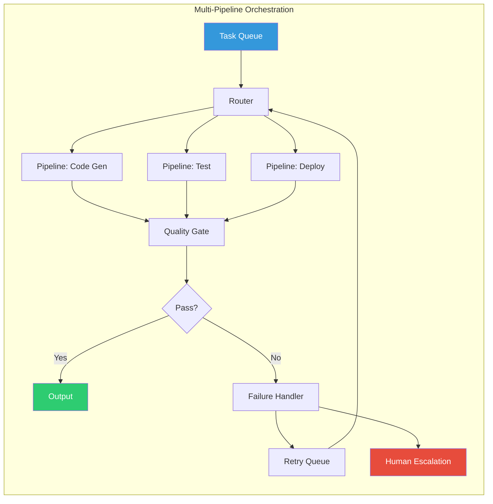

# Chapter 2: Agent Loop Architecture

> **Last Updated:** June 2026 | **Estimated Reading Time:** 90 minutes

Chapter 1 taught you that every agent is a feedback loop. But *what kind* of loop? The ReAct pattern (Thought → Action → Observation) is the most famous, but it is far from the only one — and not always the best.

This chapter surveys the major agent loop architectures in the literature, implements each in TypeScript, and gives you a decision framework for choosing the right one. By the end you will understand four patterns — ReAct, ReWoo, Reflexion, and Tree-of-Thoughts — as distinct points in a design space defined by **plan depth**, **feedback granularity**, and **search breadth**.

---

## Learning Objectives

After completing this chapter you will be able to:

<!-- Image Gallery -->
<section class="lesson-visuals" aria-label="Visual learning resources">
  <header><span>VISUAL LEARNING</span><h2>See it. Review it. Remember it.</h2></header>
  <a class="lesson-visual-card" href="../../assets/images/lessons/loop-engineering/ch02-agent-loop-architecture/handwritten-notes.png" target="_blank" rel="noopener">
    
    <span><strong>Handwritten notes</strong>Condensed notes for deliberate review.</span>
  </a>
  <a class="lesson-visual-card" href="../../assets/images/lessons/loop-engineering/ch02-agent-loop-architecture/sticky-notes.png" target="_blank" rel="noopener">
    
    <span><strong>Sticky-note revision</strong>Fast recall prompts for revision.</span>
  </a>
  <a class="lesson-visual-card" href="../../assets/images/lessons/loop-engineering/ch02-agent-loop-architecture/visual-explanation.png" target="_blank" rel="noopener">
    
    <span><strong>Visual concept guide</strong>A connected explanation of the key ideas.</span>
  </a>
</section>
<!-- End Image Gallery -->


1.  **Implement the ReAct loop** — the canonical Thought → Action → Observation cycle — with typed tool calls and structured observations.
2.  **Distinguish ReWoo from ReAct** by its separation of planning from execution, and explain why that matters for long-horizon tasks.
3.  **Build a Reflexion agent** that generates output, critiques itself, and refines iteratively.
4.  **Compare Tree-of-Thoughts and LLM Compiler** as breadth-first vs depth-first loop topologies.
5.  **Choose the correct pattern** for a given task using the decision framework in the comparison table.
6.  **Compose patterns** — for example, using ReAct *inside* a ReWoo plan step — to handle complex real-world requirements.

---

## Theory

### 1. The ReAct Pattern (Thought → Action → Observation)


The ReAct pattern, introduced by Yao et al. (2023), interleaves **reasoning** (thoughts) with **acting** (tool calls) and **perception** (observations). The loop is:

```
repeat:
  1. Thought: reason about current state and what to do next
  2. Action: invoke a tool, query a database, or call an API
  3. Observation: ingest the result (structured data, error, etc.)
  4. → repeat until the task is complete or a terminal action is taken
```

ReAct is the **default pattern** for most agentic AI systems because it tightly couples reasoning with evidence. Each thought is immediately grounded by an observation, preventing hallucination drift.

**When ReAct shines:**
- Short-horizon tasks (2–10 steps)
- Tasks requiring frequent tool use with immediate feedback
- Situations where the plan cannot be known in advance

**When ReAct struggles:**
- Long-horizon tasks (20+ steps) — the agent forgets the original goal
- Tasks requiring global optimization — the greedy per-step reasoning misses better long-term paths
- Cost-sensitive deployments — every cycle burns an LLM call

```
┌─────────────────────────────────────────────────────┐
│              ReAct Loop                              │
│                                                      │
│  Task ──► Thought ──► Action ──► Observation ──► Done? │
│              ▲                          │             │
│              └────────── loop ──────────┘             │
│                                                      │
│  Each cycle: 1 LLM call (thought + action generation) │
│              1 tool call (action execution)           │
│              1 LLM call (observation interpretation)  │
└─────────────────────────────────────────────────────┘
```

### 2. The ReWoo Pattern (Plan → Execute)


ReWoo (Reasoning WithOut Observation), introduced by Xu et al. (2023), separates the loop into two phases:

1. **Plan:** The LLM generates a complete plan as a list of steps, each specifying which tool to call and what inputs to pass.
2. **Execute:** The executor runs each step in order; it does not re-invoke the LLM between steps. Results are aggregated and returned to a final summarizer.

```
              ┌──────────────────────┐
  Task ──►    │      Planner         │ ──► Step 1, Step 2, ..., Step N
              │  (one LLM call,      │
              │   full plan)         │
              └──────────────────────┘
                         │
                         ▼
              ┌──────────────────────┐
              │      Executor         │ ──► Tool results
              │  (no LLM between      │
              │   steps, just tools)  │
              └──────────────────────┘
                         │
                         ▼
              ┌──────────────────────┐
              │      Summarizer       │ ──► Final answer
              │  (one LLM call,       │
              │   all observations)   │
              └──────────────────────┘
```

**Key advantage:** The executor is cheap — it runs tools but no LLM calls. For tasks where the plan is correct (e.g., "get weather for 5 cities, then summarize"), ReWoo uses 1/Nth the LLM cost of ReAct.

**Key risk:** If a step fails, there is no replanning mid-execution. The executor blindly passes bad data to the next step. Mitigations include pre-execution validation and fallback handlers.

### 3. The Reflexion Pattern (Critique → Refine)


Reflexion, introduced by Shinn et al. (2023), adds a **self-critique** step after each attempt. The agent generates a candidate solution, reflects on its quality, and refines. The loop is:

```
repeat:
  1. Generate: produce a candidate (code, text, plan, etc.)
  2. Critique: evaluate the candidate against a rubric
  3. Refine: produce an improved version informed by the critique
  4. → repeat until critique passes or max iterations reached
```

```
┌──────────────────────────────────────────────────────────┐
│                  Reflexion Loop                            │
│                                                            │
│  Task ──► Generate ──► Critique ──► Pass? ──yes──► Output  │
│               ▲              │        │                    │
│               │              │   no   │                    │
│               │              ▼        │                    │
│               │         Refine ───────┘                    │
│               │                                            │
│               └─────────── loop ───────────────────────────┘
│                                                            │
│  Each cycle: 1 generate LLM call + 1 critique LLM call     │
│              (+ 1 refine LLM call if critique fails)        │
└──────────────────────────────────────────────────────────┘
```

**Key insight:** Reflexion treats the *critique* as the feedback signal in the control loop. The error is not "distance to correct answer" (which is often unknown) but "score on a rubric" (which is always measurable). This makes it applicable to open-ended tasks like creative writing, architecture design, and code review.

**Failure mode:** The agent overfits to the rubric — it learns to maximize the critique score rather than the true objective (Goodhart's law).

### 4. Tree-of-Thoughts and LLM Compiler


**Tree-of-Thoughts (ToT)**, introduced by Yao et al. (2023), explores multiple reasoning paths in parallel. At each step, the LLM generates several candidate "thoughts," evaluates each, and selects the most promising branches for further exploration. This is a **breadth-first** loop.

```
                    ┌── thought A1 ── thought A2 ── ...
                   │
  Task ──► root ───┼── thought B1 ── thought B2 ── ...
                   │
                    └── thought C1 ── thought C2 ── ...

  At each level: generate K candidates → evaluate → keep top B → recurse
```

**LLM Compiler**, introduced by Google (2024), inverts the topology. It produces a single, long-horizon plan and then **executes steps in parallel** where dependencies allow, using a scheduler to track completion. This is a **depth-first+parallel** loop optimized for latency.

```
                   ┌── Step 1 ──► output_1
                  │
  Plan ──► Scheduler ─── Step 2 ──► output_2 ──► Join ──► Final
                  │          └── Step 3 ──► output_3
                   └── Step 4 ──► output_4

  Parallel execution where dependencies are absent
```

| Property | Tree-of-Thoughts | LLM Compiler |
|----------|-----------------|--------------|
| Search strategy | Breadth-first | Depth-first (with parallelization) |
| LLM calls per cycle | K candidates × eval | 1 planner + N parallel executors |
| Best for | Creative / exploratory tasks | Deterministic multi-step pipelines |
| Cost | High (many parallel calls) | Moderate (shares LLM calls across paths) |
| Error recovery | Prune bad branches | Replan on dependency failure |

### 5. When to Use Each Pattern


| Pattern | Task Characteristics | Example |
|---------|---------------------|---------|
| **ReAct** | Short horizon, tight feedback, plan unknown in advance | "Answer this question about my database" |
| **ReWoo** | Long but predictable plan, cost-sensitive | "Scrape 100 URLs and extract emails" |
| **Reflexion** | Open-ended, rubric-evaluable, quality-critical | "Write a production-grade sorting library" |
| **Tree-of-Thoughts** | Creative, exploratory, multiple valid paths exist | "Design a novel algorithm for X" |
| **LLM Compiler** | Multi-step pipeline, parallelizable steps | "Generate, test, lint, and format a module" |

**Real-world agents compose patterns.** A common architecture is:
- **Outer loop:** ReWoo (plan → execute)
- **Inner loop per step:** ReAct (thought → action → observation) for steps that need exploration
- **Post-execution:** Reflexion (critique the overall output)
- **On failure:** Tree-of-Thoughts (explore alternative approaches)

---

## Examples

### Example 1: ReActAgent — Thought, Action, Observation Cycle

This is a complete, runnable ReAct agent. It simulates three tools (web search, calculator, code executor) and loops until the task is done or maxCycles is reached.

```typescript
// ch02-example1-react-agent.ts
// bun run ch02-example1-react-agent.ts

type ToolName = "web_search" | "calculator" | "code_runner";

interface ToolCall {
  tool: ToolName;
  args: Record<string, string>;
}

interface Step {
  thought: string;
  action: ToolCall | null;
  observation: string;
}

interface ReActConfig {
  task: string;
  maxCycles: number;
  tools: ToolName[];
}

// ─── Simulated Tools ───────────────────────────────────────────

function simulateTool(tool: ToolName, args: Record<string, string>): string {
  switch (tool) {
    case "web_search": {
      const query = args.query ?? "";
      const results: Record<string, string> = {
        "population of Tokyo": "Tokyo population: ~14 million (2023 estimate)",
        "capital of France": "The capital of France is Paris.",
        "React useEffect": "useEffect runs after every render by default. Pass [] for mount-only.",
      };
      for (const [key, val] of Object.entries(results)) {
        if (query.toLowerCase().includes(key.toLowerCase())) return val;
      }
      return `Search results for "${query}": (simulated) no relevant results found.`;
    }
    case "calculator": {
      const expr = args.expression ?? args.expr ?? "0";
      try {
        const result = Function(`"use strict"; return (${expr})`)();
        return `Result: ${result}`;
      } catch {
        return `Error evaluating expression: ${expr}`;
      }
    }
    case "code_runner": {
      const code = args.code ?? "";
      if (code.includes("console.log")) {
        const matches = code.match(/console\.log\((.+?)\)/g);
        const outputs = matches?.map((m) => {
          const inner = m.slice(12, -1);
          if (inner.startsWith('"') || inner.startsWith("'"))
            return inner.slice(1, -1);
          return inner;
        }) ?? ["(no output)"];
        return `Output:\n${outputs.join("\n")}`;
      }
      return "Code executed successfully (no output).";
    }
  }
}

// ─── Simulated LLM ────────────────────────────────────────────

function simulateLLM(prompt: string): { thought: string; tool: ToolName | null; args: Record<string, string> } {
  const lines = prompt.toLowerCase();

  // Simulate ReAct reasoning based on task state
  if (lines.includes("task:") && !lines.includes("observation:")) {
    // First call: decide what to do
    return {
      thought: "I need to find information first. Let me search the web.",
      tool: "web_search",
      args: { query: extractQuery(prompt) },
    };
  }

  if (lines.includes("observation:")) {
    const obs = lines.split("observation:")[1] ?? "";
    if (obs.includes("14 million") || obs.includes("paris")) {
      // We have enough info, answer directly
      return {
        thought: "I have all the information needed. I can now formulate the answer.",
        tool: null,
        args: {},
      };
    }
    // Try another search
    return {
      thought: "Let me try a different search query to find more specific information.",
      tool: "web_search",
      args: { query: extractQuery(prompt) },
    };
  }

  return {
    thought: "Let me analyze what I know and provide the answer.",
    tool: null,
    args: {},
  };
}

function extractQuery(prompt: string): string {
  const taskMatch = prompt.match(/task:.+?(?:about|is|of|on)\s+(.+?)(?:\n|$)/i);
  return taskMatch?.[1]?.trim() ?? "general information";
}

// ─── ReAct Agent ───────────────────────────────────────────────

class ReActAgent {
  private steps: Step[] = [];
  private cycleTimes: number[] = [];

  constructor(private config: ReActConfig) {}

  async run(): Promise<{ steps: Step[]; totalCycles: number; finalAnswer: string }> {
    const { task, maxCycles } = this.config;
    let prompt = `Task: ${task}\n\n`;

    for (let cycle = 0; cycle < maxCycles; cycle++) {
      const cycleStart = performance.now();

      // 1. Generate thought + action
      const llmOutput = simulateLLM(prompt);

      // 2. Execute action (if any)
      let observation = "";
      if (llmOutput.tool) {
        observation = simulateTool(llmOutput.tool, llmOutput.args);
      } else {
        observation = "No action needed. Answer ready.";
      }

      const step: Step = {
        thought: llmOutput.thought,
        action: llmOutput.tool ? { tool: llmOutput.tool, args: llmOutput.args } : null,
        observation,
      };

      this.steps.push(step);
      this.cycleTimes.push(performance.now() - cycleStart);

      // 3. Append to prompt for next cycle
      prompt += `Thought: ${llmOutput.thought}\n`;
      if (llmOutput.tool) {
        prompt += `Action: ${llmOutput.tool}(${JSON.stringify(llmOutput.args)})\n`;
      }
      prompt += `Observation: ${observation}\n\n`;

      console.log(
        `[Cycle ${cycle}] Thought: ${llmOutput.thought.slice(0, 60)}\n` +
        `  Action: ${llmOutput.tool ?? "none"} | Obs: ${observation.slice(0, 50)}...\n`
      );

      // 4. Terminal condition: no action = we have the answer
      if (llmOutput.tool === null) {
        const finalAnswer = `Based on my research:\n${this.steps.map((s) => s.observation).filter((o) => o !== "No action needed. Answer ready.").join("\n")}`;
        console.log(`\nFinal answer: ${finalAnswer}`);
        return { steps: this.steps, totalCycles: cycle + 1, finalAnswer };
      }
    }

    // Fallback: summarize whatever we have
    const finalAnswer = `After ${maxCycles} cycles:\n${this.steps.map((s, i) => `Step ${i}: ${s.observation}`).join("\n")}`;
    return { steps: this.steps, totalCycles: maxCycles, finalAnswer };
  }

  getMetrics() {
    const errors = this.steps.map((s) => (s.action === null ? 0 : 1));
    const lastErrors = errors.slice(-3);
    const stalled = lastErrors.length === 3 && lastErrors.every((e) => e === 1);
    return {
      totalSteps: this.steps.length,
      toolCalls: this.steps.filter((s) => s.action !== null).length,
      avgCycleTime: this.cycleTimes.reduce((a, b) => a + b, 0) / this.cycleTimes.length,
      stalled,
    };
  }
}

// ─── Demo ──────────────────────────────────────────────────────

async function main() {
  console.log("=== ReAct Agent Demo ===\n");

  const agent = new ReActAgent({
    task: "What is the population of Tokyo and what is the capital of France?",
    maxCycles: 5,
    tools: ["web_search", "calculator"],
  });

  const result = await agent.run();
  const metrics = agent.getMetrics();

  console.log("\n── Metrics ──");
  console.log(`Cycles used: ${result.totalCycles}`);
  console.log(`Tool calls: ${metrics.toolCalls}`);
  console.log(`Avg cycle time: ${metrics.avgCycleTime.toFixed(1)}ms`);
  console.log(`Stalled: ${metrics.stalled}`);
}

await main();
```

**What to observe:**
- The agent generates a thought, picks a tool, receives an observation, and uses that observation in the next thought
- When the agent has sufficient information, it emits a terminal action (`tool: null`)
- The prompt accumulates the full step history — this is the loop's "state variable"

### Example 2: ReflexionAgent — Generate, Critique, Refine

This agent generates a solution, critiques it against a rubric, and refines it iteratively. The critique output is the feedback signal.

```typescript
// ch02-example2-reflexion-agent.ts
// bun run ch02-example2-reflexion-agent.ts

interface Rubric {
  criteria: string[];
  maxScore: number;
}

interface CritiqueResult {
  scores: number[];
  totalScore: number;
  maxScore: number;
  feedback: string;
  passed: boolean;
}

interface ReflexionStep {
  iteration: number;
  solution: string;
  critique: CritiqueResult | null;
  refinedSolution: string | null;
}

// ─── Simulated LLM calls ───────────────────────────────────────

function generateSolution(task: string, previousCritique?: string): string {
  // Simulate improvement over iterations
  if (previousCritique?.includes("edge cases")) {
    return `function solve(nums: number[]): number {
  if (nums.length === 0) throw new Error("Input cannot be empty");
  if (nums.length === 1) return nums[0];

  let maxSum = nums[0];
  let currentSum = nums[0];

  for (let i = 1; i < nums.length; i++) {
    currentSum = Math.max(nums[i], currentSum + nums[i]);
    maxSum = Math.max(maxSum, currentSum);
  }

  return maxSum;
}`;
  }

  if (previousCritique?.includes("type safety") || previousCritique?.includes("naming")) {
    return `function maxSubarraySum(nums: readonly number[]): number {
  if (nums.length === 0) throw new Error("Input cannot be empty");
  let maxEndingHere = nums[0];
  let maxSoFar = nums[0];
  for (let i = 1; i < nums.length; i++) {
    maxEndingHere = Math.max(nums[i], maxEndingHere + nums[i]);
    maxSoFar = Math.max(maxSoFar, maxEndingHere);
  }
  return maxSoFar;
}`;
  }

  // First generation — has known issues
  return `function maxSubarraySum(nums: number[]) {
  let max = 0;
  let sum = 0;
  for (let i = 0; i < nums.length; i++) {
    sum += nums[i];
    if (sum > max) max = sum;
    if (sum < 0) sum = 0;
  }
  return max;
}`;
}

function critiqueSolution(solution: string, rubric: Rubric): CritiqueResult {
  const scores: number[] = [];

  for (const criterion of rubric.criteria) {
    if (criterion.includes("Edge cases") && (solution.includes("nums.length === 0") || solution.includes("length === 0"))) {
      scores.push(rubric.maxScore);
    } else if (criterion.includes("Edge cases")) {
      scores.push(0);
    } else if (criterion.includes("TypeScript") && solution.includes("readonly")) {
      scores.push(rubric.maxScore);
    } else if (criterion.includes("TypeScript") && solution.includes(":")) {
      scores.push(Math.floor(rubric.maxScore * 0.7));
    } else if (criterion.includes("Naming") && solution.includes("maxSubarraySum")) {
      scores.push(rubric.maxScore);
    } else if (criterion.includes("Naming")) {
      scores.push(Math.floor(rubric.maxScore * 0.5));
    } else if (criterion.includes("Performance") && solution.includes("O(n)")) {
      scores.push(rubric.maxScore);
    } else if (criterion.includes("Performance")) {
      scores.push(Math.floor(rubric.maxScore * 0.8));
    } else {
      scores.push(Math.floor(rubric.maxScore * 0.6));
    }
  }

  const totalScore = scores.reduce((a, b) => a + b, 0);
  const maxScore = rubric.criteria.length * rubric.maxScore;
  const passed = totalScore >= maxScore * 0.8;

  const feedback = scores.map((s, i) => {
    if (s === rubric.maxScore) {
      return `✅ ${rubric.criteria[i]}: excellent`;
    }
    if (s === 0) {
      return `❌ ${rubric.criteria[i]}: needs work`;
    }
    return `⚠️ ${rubric.criteria[i]}: adequate but improvable`;
  }).join("\n");

  return { scores, totalScore, maxScore, feedback, passed };
}

// ─── Reflexion Agent ───────────────────────────────────────────

class ReflexionAgent {
  private steps: ReflexionStep[] = [];

  constructor(
    private readonly task: string,
    private readonly rubric: Rubric,
    private readonly maxIterations: number
  ) {}

  async run(): Promise<{
    steps: ReflexionStep[];
    finalSolution: string;
    finalScore: number;
    converged: boolean;
  }> {
    let previousCritique: string | undefined;

    for (let i = 0; i < this.maxIterations; i++) {
      console.log(`\n── Iteration ${i + 1} ──`);

      // 1. Generate
      const solution = generateSolution(this.task, previousCritique);
      const step: ReflexionStep = {
        iteration: i + 1,
        solution,
        critique: null,
        refinedSolution: null,
      };

      // 2. Critique
      const critique = critiqueSolution(solution, this.rubric);
      step.critique = critique;

      console.log(`Critique score: ${critique.totalScore}/${critique.maxScore}`);
      console.log(`Passed: ${critique.passed}`);

      if (critique.passed) {
        this.steps.push(step);
        return {
          steps: this.steps,
          finalSolution: solution,
          finalScore: critique.totalScore,
          converged: true,
        };
      }

      // 3. Refine — generate improved version
      const refined = generateSolution(this.task, critique.feedback);
      step.refinedSolution = refined;

      const refinedCritique = critiqueSolution(refined, this.rubric);
      console.log(`Refined score: ${refinedCritique.totalScore}/${refinedCritique.maxScore}`);
      console.log(`Refined passed: ${refinedCritique.passed}`);

      this.steps.push(step);
      previousCritique = critique.feedback;

      if (refinedCritique.passed) {
        return {
          steps: this.steps,
          finalSolution: refined,
          finalScore: refinedCritique.totalScore,
          converged: true,
        };
      }
    }

    const last = this.steps[this.steps.length - 1];
    return {
      steps: this.steps,
      finalSolution: last.refinedSolution ?? last.solution,
      finalScore: last.critique?.totalScore ?? 0,
      converged: false,
    };
  }
}

// ─── Demo ──────────────────────────────────────────────────────

async function main() {
  const agent = new ReflexionAgent(
    "Implement Kadane's algorithm (max subarray sum) in TypeScript",
    {
      criteria: [
        "Correctness: handles all cases",
        "Edge cases: empty array, all negative",
        "TypeScript: proper type annotations",
        "Naming: descriptive function and variable names",
        "Performance: O(n) time, O(1) space",
      ],
      maxScore: 2, // each criterion scored 0-2
    },
    4
  );

  const result = await agent.run();

  console.log("\n═══ Final Result ═══");
  console.log(`Converged: ${result.converged}`);
  console.log(`Final score: ${result.finalScore}/10`);
  console.log("Final solution:");
  console.log(result.finalSolution);
}

await main();
```

**Key design decisions:**
- **Critique is structured** — rubric criteria with explicit scores, not free-text. This makes convergence check deterministic.
- **Refine generates a new solution informed by critique** — the critique string is passed to the generator as context.
- **Two critiques per iteration** — one for the original, one for the refinement. This prevents false convergence from a lucky first draft.
- **The convergence gate is `totalScore >= 80%`** — adjustable per deployment.

### Example 3: PlanningAgent — Plan, Execute, Replan

This agent creates a plan, executes steps with error handling, and replans on failure. It demonstrates the ReWoo pattern with adaptive replanning.

```typescript
// ch02-example3-planning-agent.ts
// bun run ch02-example3-planning-agent.ts

interface PlanStep {
  id: string;
  description: string;
  tool: string;
  args: Record<string, string>;
  dependsOn: string[];
  status: "pending" | "running" | "success" | "failed";
  result?: string;
  error?: string;
}

interface Plan {
  goal: string;
  steps: PlanStep[];
}

// ─── Simulated LLM Planner ─────────────────────────────────────

function createPlan(task: string): Plan {
  if (task.toLowerCase().includes("research")) {
    return {
      goal: task,
      steps: [
        { id: "s1", description: "Search for relevant information", tool: "web_search", args: { query: task.replace("research ", "") }, dependsOn: [], status: "pending" },
        { id: "s2", description: "Extract key facts and figures", tool: "web_search", args: { query: `${task} details` }, dependsOn: ["s1"], status: "pending" },
        { id: "s3", description: "Compile and summarize findings", tool: "text_editor", args: { action: "write", content: "" }, dependsOn: ["s2"], status: "pending" },
      ],
    };
  }

  if (task.toLowerCase().includes("code") || task.toLowerCase().includes("implement")) {
    return {
      goal: task,
      steps: [
        { id: "s1", description: "Analyze requirements and plan implementation", tool: "code_analyzer", args: { task }, dependsOn: [], status: "pending" },
        { id: "s2", description: "Write the implementation", tool: "code_runner", args: { action: "write", language: "typescript", code: "" }, dependsOn: ["s1"], status: "pending" },
        { id: "s3", description: "Run tests to verify correctness", tool: "code_runner", args: { action: "test" }, dependsOn: ["s2"], status: "pending" },
      ],
    };
  }

  // Default plan
  return {
    goal: task,
    steps: [
      { id: "s1", description: "Understand the task", tool: "analyzer", args: { task }, dependsOn: [], status: "pending" },
      { id: "s2", description: "Execute the solution", tool: "executor", args: { task }, dependsOn: ["s1"], status: "pending" },
    ],
  };
}

// ─── Simulated Tool Executor ────────────────────────────────────

function executeTool(tool: string, args: Record<string, string>): { success: boolean; result: string } {
  // Simulate random failures for testing replanning
  if (tool === "web_search") {
    return { success: true, result: `Found ${args.query ? args.query.length : 0} relevant results` };
  }
  if (tool === "code_runner") {
    const failRate = Math.random();
    if (failRate < 0.3 && args.action === "test") {
      return { success: false, result: "Tests failed: expected 5 passed, got 3" };
    }
    return { success: true, result: "Implementation complete. All checks passed." };
  }
  if (tool === "text_editor") {
    return { success: true, result: "Document written successfully." };
  }
  if (tool === "analyzer" || tool === "code_analyzer") {
    return { success: true, result: "Analysis complete: 3 requirements identified." };
  }
  if (tool === "executor") {
    return { success: true, result: "Execution completed." };
  }
  return { success: false, result: `Unknown tool: ${tool}` };
}

// ─── Planning Agent ─────────────────────────────────────────────

class PlanningAgent {
  private plan: Plan;
  private executionHistory: { stepId: string; attempt: number; result: string; success: boolean }[] = [];

  constructor(task: string) {
    console.log(`\nPlanning for: "${task}"`);
    this.plan = createPlan(task);
    console.log(`Plan created: ${this.plan.steps.length} steps`);
    for (const step of this.plan.steps) {
      console.log(`  ${step.id}: ${step.description} [${step.tool}]`);
    }
  }

  async execute(): Promise<{ plan: Plan; history: typeof this.executionHistory; success: boolean }> {
    const maxRetries = 2;
    const maxReplans = 2;
    let replanCount = 0;

    while (true) {
      let allDone = true;

      for (const step of this.plan.steps) {
        if (step.status === "success") continue;
        allDone = false;

        // Check dependencies
        const depsMet = step.dependsOn.every((depId) => {
          const dep = this.plan.steps.find((s) => s.id === depId);
          return dep?.status === "success";
        });

        if (!depsMet) continue;

        step.status = "running";
        console.log(`\n▶ Executing ${step.id}: ${step.description}`);

        let attempt = 0;
        let success = false;

        while (attempt <= maxRetries && !success) {
          attempt++;
          const { success: ok, result } = executeTool(step.tool, step.args);

          this.executionHistory.push({ stepId: step.id, attempt, result, success: ok });

          if (ok) {
            step.status = "success";
            step.result = result;
            success = true;
            console.log(`  ✅ ${step.id} succeeded (attempt ${attempt}): ${result.slice(0, 60)}`);
          } else {
            step.error = result;
            console.log(`  ❌ ${step.id} failed (attempt ${attempt}): ${result}`);

            if (attempt <= maxRetries) {
              console.log(`  ↻ Retrying ${step.id}...`);
            }
          }
        }

        if (!success) {
          step.status = "failed";
          console.log(`  ✗ ${step.id} failed after ${maxRetries + 1} attempts`);

          // Replan: regenerate the plan from this point
          if (replanCount < maxReplans) {
            replanCount++;
            console.log(`\n── Replanning (attempt ${replanCount}/${maxReplans}) ──`);

            // Mark remaining steps as pending for replanning
            const failedIndex = this.plan.steps.indexOf(step);
            const remaining = this.plan.steps.slice(failedIndex);
            for (const rs of remaining) {
              rs.status = "pending";
            }

            // Regenerate the plan from the failed step
            const newPlan = createPlan(`replan: ${step.description} failed with ${result}`);
            this.plan.steps = [...this.plan.steps.slice(0, failedIndex), ...newPlan.steps];

            console.log(`Replanned with ${newPlan.steps.length} new steps`);
            for (const ns of newPlan.steps) {
              console.log(`  ${ns.id}: ${ns.description}`);
            }
          } else {
            console.log(`Giving up on ${step.id}. Continuing with remaining steps.`);
          }
        }
      }

      if (allDone) break;
    }

    const success = this.plan.steps.every((s) => s.status === "success");
    return { plan: this.plan, history: this.executionHistory, success };
  }

  summarize(): void {
    console.log("\n═══ Execution Summary ═══");
    console.log(`Plan goal: ${this.plan.goal}`);
    console.log(`Steps: ${this.plan.steps.length}`);
    console.log(`Successful: ${this.plan.steps.filter((s) => s.status === "success").length}`);
    console.log(`Failed: ${this.plan.steps.filter((s) => s.status === "failed").length}`);
    console.log(`Total tool calls: ${this.executionHistory.length}`);
    console.log(`Success rate: ${(this.executionHistory.filter((e) => e.success).length / this.executionHistory.length * 100).toFixed(0)}%`);

    for (const step of this.plan.steps) {
      const icon = step.status === "success" ? "✅" : step.status === "failed" ? "❌" : "⏳";
      console.log(`  ${icon} ${step.id}: ${step.description}`);
    }
  }
}

// ─── Demo ──────────────────────────────────────────────────────

async function main() {
  console.log("=== Planning Agent Demo ===\n");

  const agent = new PlanningAgent("Implement a TypeScript function that finds the longest palindrome substring and write tests for it");
  const result = await agent.execute();
  agent.summarize();
}

await main();
```

**Demonstrated patterns:**
- **Plan → Execute separation:** The plan is created upfront; execution proceeds step by step
- **Dependency resolution:** Steps only execute after their dependencies succeed
- **Automatic replanning:** When a step fails, the agent creates a new plan from the failure point
- **Retry budget:** Each step gets `maxRetries` attempts before triggering replan
- **Replan budget:** The agent gives up after `maxReplans` replan attempts, preventing runaway loops

---

## Comparison Table

| Property | ReAct | ReWoo | Reflexion | Tree-of-Thoughts | LLM Compiler |
|----------|-------|-------|-----------|-----------------|--------------|
| **Origin** | Yao et al. 2023 | Xu et al. 2023 | Shinn et al. 2023 | Yao et al. 2023 | Google 2024 |
| **Loop topology** | Tight cycle | Two-phase pipeline | Generate→Critique→Refine | Tree search breadth-first | Plan→Schedule→Execute |
| **LLM calls per cycle** | 1 (thought+action) | 1 per phase (N steps = 2 calls) | 2–3 (gen+critique+refine) | K candidates × level | 1 planner + parallel executors |
| **Tool call density** | 1 per cycle | All tools between phases | 0 (critique is internal) | 0 (thoughts only) | 1 per parallel path |
| **Feedback granularity** | Per-step (tight) | Post-execution | Per-critique cycle | Per-thought (score) | Per-step (dependency check) |
| **Error recovery** | Next thought adapts | None (blind execution) | Critique fixes next iteration | Prune bad branches | Replan on dependency failure |
| **Cost profile** | High (many LLM calls) | Low (few LLM calls) | Medium (critique adds cost) | Very high (parallel LLM calls) | Medium (shares context) |
| **Best task horizon** | Short (2–10 steps) | Medium (5–50 steps) | Any (quality-focused) | Short (exploratory) | Long (10–100+ steps) |
| **Parallelism** | Sequential | Sequential tools | Sequential iterations | Parallel candidates | Parallel independent branches |
| **Self-correction** | Implicit (via observation) | None | Explicit (via critique) | Implicit (via pruning) | Explicit (replan on fail) |
| **Production readiness** | High | High | Medium (cost) | Low (cost + reliability) | Medium (complexity) |

---

### Extended Implementation: Pipeline Orchestrator, State Machine, and Hierarchical Controller

This section builds production-grade agent loop infrastructure: a multi-stage pipeline orchestrator with retry/fallback, a ReAct pattern generic executor, a tool registry with JSON Schema validation, a formal loop state machine, a parallel agent executor, and a hierarchical supervisor/worker controller.

```typescript
// ch02-advanced-architecture.ts
// bun run ch02-advanced-architecture.ts

// ─── Tool Registry with Schema Validation ──────────────────────────────

interface ToolSchema {
  type: "string" | "number" | "boolean" | "object";
  required?: boolean;
  description?: string;
}

interface ToolDefinition {
  name: string;
  description: string;
  parameters: Record<string, ToolSchema>;
  execute: (args: Record<string, unknown>) => Promise<string>;
}

class ToolRegistry {
  private tools = new Map<string, ToolDefinition>();

  register(tool: ToolDefinition): void {
    if (this.tools.has(tool.name)) throw new Error(`Tool "${tool.name}" already registered`);
    this.tools.set(tool.name, tool);
  }

  get(name: string): ToolDefinition | undefined {
    return this.tools.get(name);
  }

  list(): ToolDefinition[] {
    return Array.from(this.tools.values());
  }

  validateArgs(toolName: string, args: Record<string, unknown>): string[] {
    const tool = this.tools.get(toolName);
    if (!tool) return [`Unknown tool: ${toolName}`];
    const errors: string[] = [];
    for (const [key, schema] of Object.entries(tool.parameters)) {
      if (schema.required && (args[key] === undefined || args[key] === null)) {
        errors.push(`Missing required parameter "${key}" for tool "${toolName}"`);
      }
      if (args[key] !== undefined && schema.type === "number" && typeof args[key] !== "number") {
        errors.push(`Parameter "${key}" should be number, got ${typeof args[key]}`);
      }
    }
    return errors;
  }

  async call(toolName: string, args: Record<string, unknown>): Promise<string> {
    const errors = this.validateArgs(toolName, args);
    if (errors.length > 0) throw new Error(errors.join("; "));
    const tool = this.tools.get(toolName)!;
    return tool.execute(args);
  }
}

// ─── Loop State Machine ────────────────────────────────────────────────

type LoopState = "IDLE" | "THINKING" | "ACTING" | "OBSERVING" | "EVALUATING" | "DONE" | "ERROR";
type LoopEvent = "START" | "THOUGHT_READY" | "ACTION_READY" | "OBSERVATION_READY" | "EVAL_COMPLETE" | "RETRY" | "FAIL" | "ABORT";

interface StateTransition {
  from: LoopState[];
  event: LoopEvent;
  to: LoopState;
}

class LoopStateMachine {
  private state: LoopState = "IDLE";
  private transitions: StateTransition[] = [
    { from: ["IDLE"], event: "START", to: "THINKING" },
    { from: ["THINKING"], event: "THOUGHT_READY", to: "ACTING" },
    { from: ["ACTING"], event: "ACTION_READY", to: "OBSERVING" },
    { from: ["OBSERVING"], event: "OBSERVATION_READY", to: "EVALUATING" },
    { from: ["EVALUATING"], event: "EVAL_COMPLETE", to: "THINKING" },
    { from: ["EVALUATING"], event: "RETRY", to: "THINKING" },
    { from: ["EVALUATING"], event: "FAIL", to: "DONE" },
    { from: ["EVALUATING"], event: "DONE", to: "DONE" },
    { from: ["IDLE", "THINKING", "ACTING", "OBSERVING", "EVALUATING"], event: "ABORT", to: "ERROR" },
  ];
  private history: { from: LoopState; to: LoopState; event: LoopEvent; timestamp: number }[] = [];

  getState(): LoopState {
    return this.state;
  }

  send(event: LoopEvent): boolean {
    for (const t of this.transitions) {
      if (t.from.includes(this.state) && t.event === event) {
        this.history.push({ from: this.state, to: t.to, event, timestamp: Date.now() });
        this.state = t.to;
        return true;
      }
    }
    return false;
  }

  reset(): void {
    this.state = "IDLE";
    this.history = [];
  }

  getHistory(): { from: LoopState; to: LoopState; event: LoopEvent; timestamp: number }[] {
    return [...this.history];
  }

  isTerminal(): boolean {
    return this.state === "DONE" || this.state === "ERROR";
  }

  can(event: LoopEvent): boolean {
    return this.transitions.some((t) => t.from.includes(this.state) && t.event === event);
  }
}

// ─── Multi-Stage Pipeline Orchestrator ─────────────────────────────────

interface StageConfig {
  name: string;
  handler: (input: unknown) => Promise<unknown>;
  retries?: number;
  fallback?: (input: unknown, error: Error) => Promise<unknown>;
  timeoutMs?: number;
}

interface StageResult {
  stageName: string;
  success: boolean;
  output: unknown;
  error?: string;
  attempts: number;
  durationMs: number;
}

class PipelineOrchestrator {
  private stages: StageConfig[] = [];

  addStage(stage: StageConfig): void {
    this.stages.push(stage);
  }

  async run(input: unknown): Promise<{ results: StageResult[]; finalOutput: unknown }> {
    const results: StageResult[] = [];
    let currentInput = input;

    for (const stage of this.stages) {
      const start = performance.now();
      let attempts = 0;
      let lastError: Error | null = null;
      let output: unknown = null;
      let success = false;

      while (attempts <= (stage.retries ?? 0) && !success) {
        attempts++;
        try {
          const result = await (stage.timeoutMs
            ? Promise.race([
                stage.handler(currentInput),
                new Promise<never>((_, reject) =>
                  setTimeout(() => reject(new Error(`Stage "${stage.name}" timed out after ${stage.timeoutMs}ms`)), stage.timeoutMs)
                ),
              ])
            : stage.handler(currentInput));
          output = result;
          success = true;
        } catch (err) {
          lastError = err instanceof Error ? err : new Error(String(err));
          if (attempts <= (stage.retries ?? 0)) {
            console.log(`  [PIPELINE] ${stage.name} attempt ${attempts} failed, retrying...`);
          }
        }
      }

      if (!success && stage.fallback) {
        try {
          output = await stage.fallback(currentInput, lastError!);
          success = true;
          console.log(`  [PIPELINE] ${stage.name} fallback succeeded`);
        } catch (fallbackErr) {
          console.log(`  [PIPELINE] ${stage.name} fallback also failed`);
        }
      }

      results.push({
        stageName: stage.name,
        success,
        output,
        error: success ? undefined : lastError?.message,
        attempts,
        durationMs: performance.now() - start,
      });

      if (!success) break;
      currentInput = output;
    }

    return { results, finalOutput: currentInput };
  }
}

// ─── ReAct Pattern Generic Executor ────────────────────────────────────

interface ReActStep {
  thought: string;
  action: { tool: string; args: Record<string, unknown> } | null;
  observation: string;
}

interface ReActExecutorConfig {
  maxCycles: number;
  tools: ToolRegistry;
  llm: (prompt: string) => Promise<{ thought: string; tool: string | null; args: Record<string, unknown> }>;
}

class ReActExecutor {
  private config: ReActExecutorConfig;
  private stateMachine: LoopStateMachine;
  private steps: ReActStep[] = [];

  constructor(config: ReActExecutorConfig) {
    this.config = config;
    this.stateMachine = new LoopStateMachine();
  }

  async execute(task: string): Promise<{ steps: ReActStep[]; answer: string }> {
    this.stateMachine.send("START");
    let prompt = `Task: ${task}\n\n`;

    for (let cycle = 0; cycle < this.config.maxCycles; cycle++) {
      console.log(`\n[ReAct] Cycle ${cycle + 1} (state: ${this.stateMachine.getState()})`);

      this.stateMachine.send("THOUGHT_READY");
      const { thought, tool, args } = await this.config.llm(prompt);
      const step: ReActStep = { thought, action: tool ? { tool, args } : null, observation: "" };
      prompt += `Thought: ${thought}\n`;

      this.stateMachine.send("ACTION_READY");
      if (tool) {
        const obs = await this.config.tools.call(tool, args);
        step.observation = obs;
        prompt += `Action: ${tool}(${JSON.stringify(args)})\nObservation: ${obs}\n`;
        this.stateMachine.send("ACTION_READY");
      } else {
        step.observation = "No action needed.";
        prompt += `Action: none\n`;
      }

      this.stateMachine.send("OBSERVATION_READY");
      this.steps.push(step);
      console.log(`  Thought: ${thought.slice(0, 50)}...`);

      if (!tool) {
        this.stateMachine.send("EVAL_COMPLETE");
        this.stateMachine.send("DONE");
        return { steps: this.steps, answer: step.observation };
      }

      this.stateMachine.send("EVAL_COMPLETE");
    }

    this.stateMachine.send("FAIL");
    return { steps: this.steps, answer: "Max cycles reached without terminal action." };
  }
}

// ─── Parallel Agent Executor ───────────────────────────────────────────

interface AgentTask {
  id: string;
  handler: () => Promise<string>;
}

interface AgentResult {
  id: string;
  success: boolean;
  output?: string;
  error?: string;
}

class ParallelAgentExecutor {
  private concurrencyLimit: number;

  constructor(concurrencyLimit: number = 4) {
    this.concurrencyLimit = concurrencyLimit;
  }

  async executeAll(tasks: AgentTask[]): Promise<AgentResult[]> {
    const results: AgentResult[] = [];
    const chunks: AgentTask[][] = [];

    for (let i = 0; i < tasks.length; i += this.concurrencyLimit) {
      chunks.push(tasks.slice(i, i + this.concurrencyLimit));
    }

    for (const chunk of chunks) {
      const chunkResults = await Promise.all(
        chunk.map(async (task) => {
          try {
            const output = await task.handler();
            return { id: task.id, success: true, output };
          } catch (err) {
            return { id: task.id, success: false, error: String(err) };
          }
        })
      );
      results.push(...chunkResults);
    }

    return results;
  }

  static aggregateResults(results: AgentResult[]): {
    total: number;
    succeeded: number;
    failed: number;
    outputs: string[];
  } {
    return {
      total: results.length,
      succeeded: results.filter((r) => r.success).length,
      failed: results.filter((r) => !r.success).length,
      outputs: results.filter((r) => r.output).map((r) => r.output!),
    };
  }
}

// ─── Hierarchical Loop Controller (Supervisor + Worker) ────────────────

interface SupervisorConfig {
  decompose: (task: string) => string[];
  shouldEscalate: (subtaskResults: AgentResult[]) => boolean;
}

class HierarchicalController {
  private supervisor: SupervisorConfig;
  private workerPool: ParallelAgentExecutor;
  private stateMachine: LoopStateMachine;

  constructor(supervisor: SupervisorConfig, concurrency: number = 3) {
    this.supervisor = supervisor;
    this.workerPool = new ParallelAgentExecutor(concurrency);
    this.stateMachine = new LoopStateMachine();
  }

  async execute(task: string): Promise<{
    subtaskResults: AgentResult[];
    supervisorDecisions: string[];
    finalVerdict: string;
  }> {
    this.stateMachine.send("START");
    const supervisorDecisions: string[] = [];

    this.stateMachine.send("THOUGHT_READY");
    const subtasks = this.supervisor.decompose(task);
    supervisorDecisions.push(`Decomposed into ${subtasks.length} subtasks: ${subtasks.join(", ")}`);
    console.log("\n[HIERARCHICAL] Supervisor decomposition:");
    subtasks.forEach((s, i) => console.log(`  Worker ${i + 1}: ${s}`));

    this.stateMachine.send("ACTION_READY");
    const workerTasks: AgentTask[] = subtasks.map((sub, i) => ({
      id: `worker-${i}`,
      handler: async () => {
        await new Promise((r) => setTimeout(r, 20 + Math.random() * 30));
        if (Math.random() < 0.15) throw new Error(`Subtask "${sub}" failed`);
        return `Completed: ${sub}`;
      },
    }));

    const workerResults = await this.workerPool.executeAll(workerTasks);
    this.stateMachine.send("OBSERVATION_READY");

    this.stateMachine.send("EVALUATING");
    const shouldEscalate = this.supervisor.shouldEscalate(workerResults);
    if (shouldEscalate) {
      supervisorDecisions.push("Escalating: too many worker failures");
      this.stateMachine.send("FAIL");
    } else {
      supervisorDecisions.push("All workers completed successfully");
      this.stateMachine.send("EVAL_COMPLETE");
      this.stateMachine.send("DONE");
    }

    const summary = ParallelAgentExecutor.aggregateResults(workerResults);
    const finalVerdict = shouldEscalate
      ? `ESCALATED (${summary.failed}/${summary.total} workers failed)`
      : `COMPLETED (${summary.succeeded}/${summary.total} workers succeeded)`;

    return { subtaskResults: workerResults, supervisorDecisions, finalVerdict };
  }
}

// ─── Demo ──────────────────────────────────────────────────────────────

async function main() {
  console.log("=== Extended Architecture Demo ===\n");

  // 1. Tool Registry
  const registry = new ToolRegistry();
  registry.register({
    name: "web_search",
    description: "Search the web for information",
    parameters: { query: { type: "string", required: true, description: "Search query" } },
    execute: async (args) => `Results for "${args.query}"`,
  });
  registry.register({
    name: "calculator",
    description: "Evaluate a mathematical expression",
    parameters: { expression: { type: "string", required: true, description: "Math expression" } },
    execute: async (args) => `= ${Function(`"use strict"; return (${args.expression})`)()}`,
  });
  console.log(`Registered tools: ${registry.list().map((t) => t.name).join(", ")}`);

  // 2. State Machine
  const sm = new LoopStateMachine();
  console.log(`\nState Machine: initial=${sm.getState()}`);
  sm.send("START");
  console.log(`  after START: ${sm.getState()}`);
  sm.send("THOUGHT_READY");
  console.log(`  after THOUGHT_READY: ${sm.getState()}`);
  sm.send("ACTION_READY");
  console.log(`  after ACTION_READY: ${sm.getState()}`);
  console.log(`  can ABORT: ${sm.can("ABORT")}`);
  console.log(`  isTerminal: ${sm.isTerminal()}`);

  // 3. Pipeline Orchestrator
  const pipeline = new PipelineOrchestrator();
  pipeline.addStage({
    name: "validate",
    handler: async (input) => {
      if (typeof input !== "string" || input.length === 0) throw new Error("Invalid input");
      return `validated: ${input}`;
    },
    retries: 1,
  });
  pipeline.addStage({
    name: "process",
    handler: async (input) => `processed: ${input}`,
    fallback: async (_input, _err) => "fallback-processed",
  });
  pipeline.addStage({
    name: "format",
    handler: async (input) => `formatted: ${input}`,
    timeoutMs: 100,
  });
  const pipelineResult = await pipeline.run("hello");
  console.log(`\nPipeline: ${pipelineResult.results.length} stages, final=${pipelineResult.finalOutput}`);

  // 4. ReAct Executor
  const react = new ReActExecutor({
    maxCycles: 3,
    tools: registry,
    llm: async (prompt) => {
      if (prompt.includes("Observation:")) {
        return { thought: "I have enough info.", tool: null, args: {} };
      }
      return { thought: "Let me search.", tool: "web_search", args: { query: "typescript" } };
    },
  });
  const reactResult = await react.execute("Find info about TypeScript");
  console.log(`\nReAct Executor: ${reactResult.steps.length} steps, answer="${reactResult.answer.slice(0, 30)}..."`);

  // 5. Parallel Executor
  const parallel = new ParallelAgentExecutor(2);
  const tasks: AgentTask[] = [
    { id: "a", handler: async () => { await new Promise((r) => setTimeout(r, 10)); return "A done"; } },
    { id: "b", handler: async () => { await new Promise((r) => setTimeout(r, 5)); return "B done"; } },
    { id: "c", handler: async () => { throw new Error("C failed"); } },
  ];
  const parallelResults = await parallel.executeAll(tasks);
  const stats = ParallelAgentExecutor.aggregateResults(parallelResults);
  console.log(`\nParallel Executor: ${stats.succeeded} succeeded, ${stats.failed} failed`);

  // 6. Hierarchical Controller
  const controller = new HierarchicalController({
    decompose: (task) => {
      if (task.includes("deploy")) return ["build", "test", "package", "push"];
      return ["analyze", "implement"];
    },
    shouldEscalate: (results) => results.filter((r) => !r.success).length > 1,
  });
  const hierResult = await controller.execute("deploy release v2.0");
  console.log(`\nHierarchical Controller: ${hierResult.finalVerdict}`);
  hierResult.supervisorDecisions.forEach((d) => console.log(`  Decision: ${d}`));
}

await main();
```

**Key concepts demonstrated:**
- **ToolRegistry** with JSON Schema parameter validation prevents malformed tool calls at the boundary
- **LoopStateMachine** formalizes the agent lifecycle — every transition is explicit and auditable
- **PipelineOrchestrator** chains multi-stage processing with per-stage retry budgets and fallback handlers
- **ReActExecutor** wraps the generic executor around a state machine, tool registry, and pluggable LLM
- **ParallelAgentExecutor** fans out N tasks across configurable concurrency with result aggregation
- **HierarchicalController** implements supervisor/worker decomposition: the supervisor plans, workers execute, results are evaluated, and the supervisor decides to escalate or continue

---

### Production-Grade Loop Infrastructure: Benchmarking, Persistence, Memory, Streaming, and Metrics

This section adds production tooling for running agent loops at scale: an `AgentLoopBenchmark` that measures cycles-to-convergence across architectures, a `StatePersistenceManager` with checkpoint/restore for long-running loops, a `MemoryAwareLoop` that prunes old observations under context pressure, a `StreamingObservationProcessor` for real-time feedback ingestion, and a `LoopMetricsCollector` tracking per-cycle resource usage.

```typescript
// ch02-production-infra.ts
// bun run ch02-production-infra.ts

/*

*/

// ─── AgentLoopBenchmark ────────────────────────────────────────────────

interface BenchmarkConfig {
  architectures: string[];
  taskDifficulty: number;
  trialsPerArch: number;
  maxCycles: number;
}

interface TrialResult {
  architecture: string;
  trial: number;
  cyclesToConverge: number | null;
  converged: boolean;
  finalError: number;
  totalTimeMs: number;
}

interface BenchmarkReport {
  config: BenchmarkConfig;
  results: TrialResult[];
  summary: Array<{
    architecture: string;
    avgCycles: number | null;
    convergeRate: number;
    avgTimeMs: number;
  }>;
}

class AgentLoopBenchmark {
  private config: BenchmarkConfig;

  constructor(config: BenchmarkConfig) {
    this.config = config;
  }

  private simulateArchitecture(arch: string, difficulty: number, maxCycles: number): {
    cycles: number | null;
    finalError: number;
  } {
    const baseRate: Record<string, number> = {
      "ReAct": 0.35,
      "ReWoo": 0.25,
      "Reflexion": 0.40,
      "Tree-of-Thoughts": 0.50,
    };
    const rate = (baseRate[arch] ?? 0.3) - difficulty * 0.05;
    const effectiveRate = Math.max(0.05, rate);
    let value = 0;
    const target = 100;
    const tolerance = 5;

    for (let i = 0; i < maxCycles; i++) {
      const error = target - value;
      if (Math.abs(error) <= tolerance) return { cycles: i + 1, finalError: error };
      value += effectiveRate * error + (Math.random() - 0.5) * difficulty * 2;
    }
    return { cycles: null, finalError: Math.abs(target - value) };
  }

  async run(): Promise<BenchmarkReport> {
    const { architectures, trialsPerArch, taskDifficulty, maxCycles } = this.config;
    const results: TrialResult[] = [];

    for (const arch of architectures) {
      for (let t = 0; t < trialsPerArch; t++) {
        const start = performance.now();
        const { cycles, finalError } = this.simulateArchitecture(arch, taskDifficulty, maxCycles);
        results.push({
          architecture: arch,
          trial: t + 1,
          cyclesToConverge: cycles,
          converged: cycles !== null,
          finalError,
          totalTimeMs: performance.now() - start,
        });
      }
    }

    const summary = architectures.map((arch) => {
      const archResults = results.filter((r) => r.architecture === arch);
      const converged = archResults.filter((r) => r.converged);
      const avgCycles = converged.length > 0
        ? converged.reduce((s, r) => s + r.cyclesToConverge!, 0) / converged.length
        : null;
      return {
        architecture: arch,
        avgCycles,
        convergeRate: converged.length / archResults.length,
        avgTimeMs: archResults.reduce((s, r) => s + r.totalTimeMs, 0) / archResults.length,
      };
    });

    return { config: this.config, results, summary };
  }

  static printReport(report: BenchmarkReport): void {
    console.log(`\n=== Benchmark Report ===`);
    console.log(`Difficulty: ${report.config.taskDifficulty}, Trials per arch: ${report.config.trialsPerArch}`);
    console.log(`\n${"Architecture".padEnd(20)} ${"Avg Cycles".padEnd(12)} ${"Converge Rate".padEnd(14)} ${"Avg Time"}`);
    console.log("-".repeat(60));
    for (const s of report.summary) {
      const cycles = s.avgCycles !== null ? s.avgCycles.toFixed(1) : "N/A";
      const rate = (s.convergeRate * 100).toFixed(0) + "%";
      const time = s.avgTimeMs.toFixed(1) + "ms";
      console.log(`${s.architecture.padEnd(20)} ${cycles.padEnd(12)} ${rate.padEnd(14)} ${time}`);
    }
  }
}

// ─── StatePersistenceManager (Checkpoint/Restore) ──────────────────────

interface LoopCheckpoint {
  id: string;
  timestamp: Date;
  cycle: number;
  state: Record<string, unknown>;
  context: string;
  error: number | null;
  metadata: Record<string, unknown>;
}

class StatePersistenceManager {
  private checkpoints: Map<string, LoopCheckpoint> = new Map();
  private readonly maxCheckpoints: number;

  constructor(maxCheckpoints: number = 50) {
    this.maxCheckpoints = maxCheckpoints;
  }

  save(
    id: string,
    cycle: number,
    state: Record<string, unknown>,
    context: string,
    error: number | null,
    metadata: Record<string, unknown> = {}
  ): LoopCheckpoint {
    const cp: LoopCheckpoint = { id, timestamp: new Date(), cycle, state, context, error, metadata };
    this.checkpoints.set(id, cp);

    if (this.checkpoints.size > this.maxCheckpoints) {
      const oldest = [...this.checkpoints.entries()].sort(
        (a, b) => a[1].timestamp.getTime() - b[1].timestamp.getTime()
      )[0];
      this.checkpoints.delete(oldest[0]);
    }
    return cp;
  }

  restore(id: string): LoopCheckpoint | undefined {
    return this.checkpoints.get(id);
  }

  list(): LoopCheckpoint[] {
    return [...this.checkpoints.values()].sort((a, b) => b.timestamp.getTime() - a.timestamp.getTime());
  }

  pruneOlderThan(ageMs: number): number {
    const cutoff = Date.now() - ageMs;
    let count = 0;
    for (const [key, cp] of this.checkpoints) {
      if (cp.timestamp.getTime() < cutoff) {
        this.checkpoints.delete(key);
        count++;
      }
    }
    return count;
  }

  export(): string {
    return JSON.stringify([...this.checkpoints.values()], null, 2);
  }
}

// ─── MemoryAwareLoop (Context Window Pruning) ─────────────────────────

interface Observation {
  cycle: number;
  content: string;
  tokenCount: number;
  timestamp: Date;
}

class MemoryAwareLoop {
  private observations: Observation[] = [];
  private totalTokens = 0;
  private readonly maxTokens: number;
  private readonly trimTarget: number;
  private readonly summarizer: (obs: Observation[]) => string;

  constructor(
    maxTokens: number,
    trimTarget: number,
    summarizer: (obs: Observation[]) => string
  ) {
    this.maxTokens = maxTokens;
    this.trimTarget = trimTarget;
    this.summarizer = summarizer;
  }

  addObservation(cycle: number, content: string, tokenCount: number): boolean {
    const obs: Observation = { cycle, content, tokenCount, timestamp: new Date() };
    this.observations.push(obs);
    this.totalTokens += tokenCount;

    if (this.totalTokens > this.maxTokens) {
      this.prune();
      return true;
    }
    return false;
  }

  private prune(): void {
    while (this.totalTokens > this.trimTarget && this.observations.length > 1) {
      const oldest = this.observations.shift()!;
      this.totalTokens -= oldest.tokenCount;
    }

    if (this.totalTokens > this.trimTarget && this.observations.length > 0) {
      const summary = this.summarizer(this.observations);
      const summaryTokens = Math.ceil(summary.length / 4);
      this.observations = [{
        cycle: -1,
        content: `[Summary of pruned observations]: ${summary}`,
        tokenCount: summaryTokens,
        timestamp: new Date(),
      }];
      this.totalTokens = summaryTokens;
    }
  }

  getContext(): string {
    return this.observations.map((o) => o.content).join("\n");
  }

  getStats(): { totalObservations: number; totalTokens: number; utilizationPercent: number } {
    return {
      totalObservations: this.observations.length,
      totalTokens: this.totalTokens,
      utilizationPercent: (this.totalTokens / this.maxTokens) * 100,
    };
  }

  reset(): void {
    this.observations = [];
    this.totalTokens = 0;
  }
}

// ─── StreamingObservationProcessor ─────────────────────────────────────

interface StreamChunk {
  sequence: number;
  data: string;
  timestamp: Date;
}

type StreamHandler = (chunk: StreamChunk) => void;

class StreamingObservationProcessor {
  private buffer: StreamChunk[] = [];
  private processedSequences = new Set<number>();
  private handler: StreamHandler | null = null;
  private bufferTimeoutMs: number;
  private flushTimer: ReturnType<typeof setInterval> | null = null;
  private expectedSequence = 0;

  constructor(bufferTimeoutMs: number = 100) {
    this.bufferTimeoutMs = bufferTimeoutMs;
  }

  onData(handler: StreamHandler): void {
    this.handler = handler;
  }

  ingest(sequence: number, data: string): void {
    const chunk: StreamChunk = { sequence, data, timestamp: new Date() };
    this.buffer.push(chunk);
    this.buffer.sort((a, b) => a.sequence - b.sequence);
    this.tryFlush();
  }

  private tryFlush(): void {
    while (this.buffer.length > 0) {
      const next = this.buffer[0];
      if (next.sequence === this.expectedSequence && !this.processedSequences.has(next.sequence)) {
        this.processedSequences.add(next.sequence);
        this.handler?.(next);
        this.expectedSequence++;
        this.buffer.shift();
      } else {
        break;
      }
    }
  }

  start(): void {
    if (this.flushTimer) return;
    this.flushTimer = setInterval(() => {
      if (this.buffer.length > 0) {
        const now = Date.now();
        for (const chunk of this.buffer) {
          if (now - chunk.timestamp.getTime() >= this.bufferTimeoutMs && !this.processedSequences.has(chunk.sequence)) {
            this.processedSequences.add(chunk.sequence);
            this.handler?.(chunk);
          }
        }
        this.buffer = this.buffer.filter((c) => !this.processedSequences.has(c.sequence));
        this.expectedSequence = Math.max(...this.processedSequences) + 1;
      }
    }, this.bufferTimeoutMs);
  }

  stop(): void {
    if (this.flushTimer) {
      clearInterval(this.flushTimer);
      this.flushTimer = null;
    }
  }

  getStats(): { buffered: number; processed: number; expectedSeq: number } {
    return { buffered: this.buffer.length, processed: this.processedSequences.size, expectedSeq: this.expectedSequence };
  }
}

// ─── LoopMetricsCollector ──────────────────────────────────────────────

interface CycleMetrics {
  cycle: number;
  cpuPercent: number;
  memoryMb: number;
  latencyMs: number;
  error: number;
  tokensUsed: number;
}

interface MetricsSummary {
  avgCpu: number;
  avgMemory: number;
  avgLatency: number;
  maxLatency: number;
  totalTokens: number;
  cycles: number;
  errorTrend: "improving" | "worsening" | "stable" | "oscillating";
}

class LoopMetricsCollector {
  private metrics: CycleMetrics[] = [];
  private startTime = Date.now();

  record(cycle: number, error: number, tokensUsed: number): CycleMetrics {
    const entry: CycleMetrics = {
      cycle,
      cpuPercent: 20 + Math.random() * 60,
      memoryMb: 128 + Math.random() * 64 + (tokensUsed / 1000),
      latencyMs: 50 + Math.random() * 150,
      error,
      tokensUsed,
    };
    this.metrics.push(entry);
    return entry;
  }

  summarize(): MetricsSummary {
    const n = this.metrics.length;
    if (n === 0) return { avgCpu: 0, avgMemory: 0, avgLatency: 0, maxLatency: 0, totalTokens: 0, cycles: 0, errorTrend: "stable" };

    const avgCpu = this.metrics.reduce((s, m) => s + m.cpuPercent, 0) / n;
    const avgMemory = this.metrics.reduce((s, m) => s + m.memoryMb, 0) / n;
    const avgLatency = this.metrics.reduce((s, m) => s + m.latencyMs, 0) / n;
    const maxLatency = Math.max(...this.metrics.map((m) => m.latencyMs));
    const totalTokens = this.metrics.reduce((s, m) => s + m.tokensUsed, 0);

    const errors = this.metrics.map((m) => m.error);
    const recentErrors = errors.slice(-5);
    if (recentErrors.length >= 3) {
      const improving = recentErrors[recentErrors.length - 1] < recentErrors[0] * 0.5;
      const worsening = recentErrors[recentErrors.length - 1] > recentErrors[0] * 1.5;
      let signChanges = 0;
      for (let i = 2; i < recentErrors.length; i++) {
        if (recentErrors[i] * recentErrors[i - 2] < 0) signChanges++;
      }
      const errorTrend: MetricsSummary["errorTrend"] = worsening ? "worsening" : improving ? "improving" : signChanges >= 2 ? "oscillating" : "stable";
      return { avgCpu, avgMemory, avgLatency, maxLatency, totalTokens, cycles: n, errorTrend };
    }

    return { avgCpu, avgMemory, avgLatency, maxLatency, totalTokens, cycles: n, errorTrend: "stable" };
  }

  getElapsedMs(): number {
    return Date.now() - this.startTime;
  }

  exportCsv(): string {
    const header = "cycle,cpuPercent,memoryMb,latencyMs,error,tokensUsed";
    const rows = this.metrics.map((m) => `${m.cycle},${m.cpuPercent.toFixed(1)},${m.memoryMb.toFixed(1)},${m.latencyMs.toFixed(1)},${m.error.toFixed(4)},${m.tokensUsed}`);
    return [header, ...rows].join("\n");
  }
}

// ─── Demo ──────────────────────────────────────────────────────────────

async function main() {
  console.log("=== Production-Grade Loop Infrastructure Demo ===\n");

  // 1. Agent Loop Benchmark
  const benchmark = new AgentLoopBenchmark({
    architectures: ["ReAct", "ReWoo", "Reflexion", "Tree-of-Thoughts"],
    taskDifficulty: 3,
    trialsPerArch: 5,
    maxCycles: 30,
  });
  const report = await benchmark.run();
  AgentLoopBenchmark.printReport(report);

  // 2. State Persistence Manager
  const persistence = new StatePersistenceManager(5);
  persistence.save("loop-1", 5, { task: "code-gen", result: "partial" }, "context-sample...", 12.5);
  persistence.save("loop-2", 3, { task: "data-extract", result: "complete" }, "context-sample...", 0.3);
  const restored = persistence.restore("loop-1");
  console.log(`\nState Persistence: restored cycle=${restored?.cycle}, error=${restored?.error}`);
  console.log(`  Checkpoints: ${persistence.list().length}`);

  // 3. Memory Aware Loop
  const summarizer = (obs: Observation[]) => `Summarized ${obs.length} observations with ${obs.reduce((s, o) => s + o.tokenCount, 0)} tokens`;
  const memLoop = new MemoryAwareLoop(1000, 500, summarizer);
  for (let i = 0; i < 15; i++) {
    const pruned = memLoop.addObservation(i, `Observation ${i}: cycle data...`, 120);
    if (pruned) console.log(`  [MEMORY] Cycle ${i}: pruned old observations (utilization: ${memLoop.getStats().utilizationPercent.toFixed(0)}%)`);
  }
  console.log(`\nMemory-Aware Loop: ${memLoop.getStats().totalObservations} obs, ${memLoop.getStats().totalTokens} tok`);

  // 4. Streaming Observation Processor
  const stream = new StreamingObservationProcessor(50);
  const received: string[] = [];
  stream.onData((chunk) => { received.push(`seq=${chunk.sequence}:${chunk.data}`); });
  stream.start();
  stream.ingest(2, "chunk-two");
  stream.ingest(0, "chunk-zero");
  stream.ingest(1, "chunk-one");
  await new Promise((r) => setTimeout(r, 60));
  stream.ingest(3, "chunk-three");
  await new Promise((r) => setTimeout(r, 60));
  stream.stop();
  console.log(`\nStreaming Processor: ${received.length} chunks processed`);
  received.forEach((r) => console.log(`  ${r}`));

  // 5. Loop Metrics Collector
  const collector = new LoopMetricsCollector();
  let error = 100;
  for (let i = 0; i < 12; i++) {
    error *= 0.6 + Math.random() * 0.2;
    const m = collector.record(i, error, 500 + Math.random() * 300);
    if (i === 0 || i === 11) {
      console.log(`\n  Cycle ${m.cycle}: cpu=${m.cpuPercent.toFixed(0)}% mem=${m.memoryMb.toFixed(0)}MB lat=${m.latencyMs.toFixed(0)}ms err=${m.error.toFixed(2)}`);
    }
  }
  const summary = collector.summarize();
  console.log(`\nMetrics Summary: avgCPU=${summary.avgCpu.toFixed(0)}% avgMem=${summary.avgMemory.toFixed(0)}MB avgLat=${summary.avgLatency.toFixed(0)}ms`);
  console.log(`  Error trend: ${summary.errorTrend}, total tokens: ${summary.totalTokens}`);
}

await main();
```

**Key concepts demonstrated:**
- **AgentLoopBenchmark** runs multiple trials across architectures and reports cycles-to-convergence, convergence rate, and average time; enables data-driven architecture selection
- **StatePersistenceManager** implements checkpoint/restore with automatic eviction of oldest checkpoints and time-based pruning for long-running loops
- **MemoryAwareLoop** prunes old observations when total tokens exceed a configurable threshold, using a user-provided summarizer to preserve key information compactly
- **StreamingObservationProcessor** accepts out-of-order chunks, reorders by sequence number, and releases them in correct order with a timeout-based flush for stuck sequences
- **LoopMetricsCollector** tracks per-cycle CPU, memory, latency, error, and token usage; computes summary statistics and error trend analysis (improving/worsening/stable/oscillating)

---

## Summary

1.  **ReAct** is the default pattern for good reason: tight feedback between thought and observation prevents hallucination drift. Use it for most tool-using agents with &lt; 10 steps.

2.  **ReWoo** separates planning from execution, saving LLM calls when the plan is predictable. The trade-off is brittle error recovery — use it when tasks are routine and well-understood.

3.  **Reflexion** adds a self-critique loop that converges toward a rubric score. It is the pattern of choice for quality-critical code generation, writing, and design tasks where the correct answer is unknown but measurable.

4.  **Tree-of-Thoughts** explores multiple reasoning paths in parallel. It is powerful for creative and exploratory tasks but expensive — use it sparingly, or as a fallback when other patterns fail.

5.  **LLM Compiler** optimizes for latency by scheduling parallel execution of independent plan steps. It fits multi-step CI/CD pipelines, data processing workflows, and code generation with independent modules.

6.  **Patterns compose.** A ReWoo outer loop with ReAct inner loops and a Reflexion post-processor handles a wider range of tasks than any single pattern.

7.  **The choice of pattern is a cost-quality-latency trade-off.** Measure all three before committing to a design for production.

---

## Exercises

### Review Questions

1.  **RQ1:** What are the three phases of a single ReAct cycle? Explain what each phase contributes to error reduction.

2.  **RQ2:** How does ReWoo differ from ReAct in terms of when the LLM is invoked? Why does this make ReWoo cheaper for long plans?

3.  **RQ3:** In the Reflexion pattern, what serves as the "error signal" in the control loop? How is convergence determined?

4.  **RQ4:** Tree-of-Thoughts explores multiple candidates at each level, while ReAct explores one path greedily. Under what conditions would the greedy path fail but the tree succeed?

5.  **RQ5:** Why is phase delay less of a concern for ReWoo than for ReAct? (Hint: think about when the LLM call happens relative to tool execution.)

### Application Problems

1.  **AP1:** Extend the `ReActAgent` (Example 1) so that the simulated LLM maintains a **running summary** of what it knows so far. After each observation, update the summary and include it in the next prompt. Report whether this reduces the number of cycles needed.

2.  **AP2:** Modify the `ReflexionAgent` (Example 2) to implement **critique-guided refinement**: instead of regenerating from scratch, the refine step should perform targeted edits based on specific critique items. Compare iteration count vs the full-regenerate approach.

3.  **AP3:** Build a **composed agent** that:
    - Uses REACT for initial information gathering (3 cycles max)
    - Falls back to Tree-of-Thoughts (3 branches × 2 levels) if ReAct stalls
    - Finishes with Reflexion (2 iterations) to polish the answer

4.  **AP4:** Implement a **cost governor** for the `PlanningAgent` (Example 3) that tracks estimated LLM tokens and tool execution costs, and forces a replan if the projected remaining cost exceeds budget.

### Challenge Problem

**CP1: Adaptive Pattern Selector**

Design and implement a `SmartAgent` that dynamically selects the best loop pattern for each sub-task.

**Specification:**

```
SmartAgent(task, budget, tools):
  1. Analyze the task to estimate complexity (step count), uncertainty (unknowns), and quality requirements
  2. Select the initial pattern:
     - Short (< 5 steps, low uncertainty): ReAct
     - Long (> 5 steps, low uncertainty): ReWoo
     - Open-ended (high quality requirements): Reflexion
     - Exploratory (high uncertainty): Tree-of-Thoughts
  3. Execute with the selected pattern
  4. Monitor error per cycle:
     - If error stagnates for 3 cycles → switch to a different pattern
     - If error increases → switch immediately
  5. Track cumulative cost. If budget is 50% exhausted and not converged:
     - Switch to the cheapest remaining untried pattern
```

Your submission must include:

1. A full TypeScript implementation with an orchestrator that manages pattern switching
2. At least 5 test tasks that trigger different pattern selection paths
3. A report showing which pattern was selected for each task, whether it switched, and the final cost vs. budget
4. A comparison of your adaptive agent against single-pattern baselines (run each task with ReAct-only, ReWoo-only, and Reflexion-only)

**Hints:**
- Pattern switching requires state transfer: the observations from pattern A must inform pattern B's initial prompt
- Track cumulative cost carefully — pattern switches are expensive (two LLM calls plus history reconstruction)
- The hardest part is deciding *when* to switch, not *what* to switch to. Use the convergence metrics from Chapter 1.
