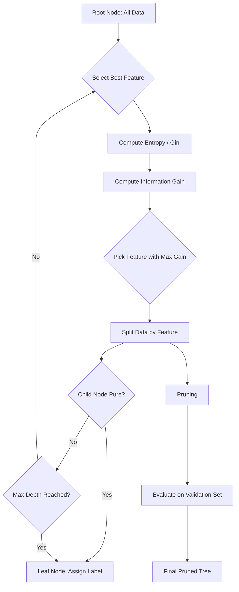
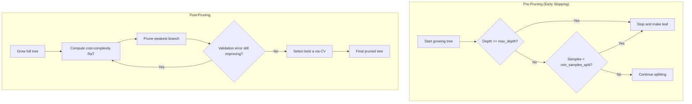
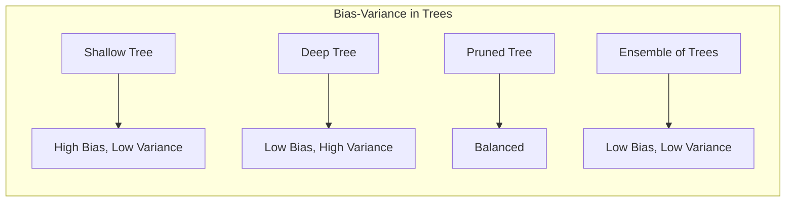

# Chapter 4: Decision Trees

> **Previous:** [Logistic Regression](./03-logistic-regression.md) | **Next:** [Ensemble Methods](./05-ensemble-methods.md)

---

## Learning Objectives

- Explain the structure of a Decision Tree (nodes, branches, leaves) and how it partitions the feature space
- Calculate and compare splitting criteria: Entropy, Information Gain, and Gini Impurity
- Implement the ID3 and CART algorithms for tree construction
- Understand pre-pruning and post-pruning techniques to prevent overfitting
- Handle categorical features, numerical features, and missing values in decision trees
- Compute feature importance scores from trained trees
- Explain the bias-variance tradeoff specific to decision trees

## Chapter at a Glance

| Topic | Key Insight | Practical Takeaway |
|-------|-------------|-------------------|
| Tree Structure | Internal nodes test attributes, leaves assign labels | Extremely interpretable ? useful for stakeholder explanations |
| Entropy | Measures disorder in a dataset | Lower entropy means purer, more homogeneous subsets |
| Information Gain | Reduction in entropy after a split | Choose the feature with highest gain at each node |
| Gini Impurity | Alternative to entropy; computationally faster | CART uses Gini by default; similar results to entropy |
| ID3 Algorithm | Iterative Dichotomiser 3 ? builds trees using entropy | Handles categorical features naturally |
| CART Algorithm | Binary splits using Gini; supports regression | sklearn's default; produces binary trees |
| Recursive Splitting | Tree built top-down by repeated partitioning | Stop when depth max or node purity is reached |
| Pruning | Removing branches that add little predictive power | Critical for generalization ? deep trees overfit badly |
| Feature Importance | How often a feature splits nodes, weighted by improvement | Built-in feature selection from a trained tree |
| Missing Values | Surrogate splits, weighted distributions | Real-world data always has missing values |

## Chapter Roadmap



---

## Theory

### What is a Decision Tree?


A Decision Tree is a flowchart-like structure used for both classification and regression. Each internal node represents a "test" on an attribute (e.g., "Is Age > 30?"), each branch represents the outcome of the test, and each leaf node represents a class label or a continuous value.

Decision trees partition the **feature space** into axis-aligned rectangular regions. In 2D, the decision boundary is a series of horizontal and vertical lines, creating a piecewise-constant classification or regression surface.

**Advantages**:
- Highly interpretable ? the model's decisions can be explained to non-technical stakeholders
- No feature scaling required
- Handles both numerical and categorical data
- Captures non-linear relationships and feature interactions

**Disadvantages**:
- High variance ? small data changes can produce completely different trees
- Greedy splitting is locally optimal but may miss globally better structures
- Axis-aligned splits struggle with diagonal decision boundaries

### Splitting Criteria: Entropy


**Entropy** $H(S)$ measures the impurity or disorder in a dataset $S$:

$$H(S) = -\sum_{i=1}^{c} p_i \log_2 p_i$$

Where $p_i$ is the proportion of examples belonging to class $i$.

**Properties**:
- $H(S) = 0$ when all examples belong to one class (pure)
- $H(S) = \log_2 c$ when classes are perfectly balanced (maximum impurity)
- For binary classification: $H(S) = -p\log_2(p) - (1-p)\log_2(1-p)$

### Information Gain


**Information Gain** $IG(S, A)$ measures the reduction in entropy after splitting on attribute $A$:

$$IG(S, A) = H(S) - \sum_{v \in Values(A)} \frac{|S_v|}{|S|} H(S_v)$$

Where:
- $Values(A)$ are the possible values of attribute $A$
- $S_v$ is the subset of $S$ where $A = v$
- $|S_v|/|S|$ weights each child by its size

The ID3 algorithm selects the attribute $A$ that maximizes $IG(S, A)$ at each node.

**Example calculation** with the classic Golf dataset (14 examples, 9 play / 5 don't play):

$$H(S) = -\frac{9}{14}\log_2\frac{9}{14} - \frac{5}{14}\log_2\frac{5}{14} = 0.940$$

Splitting on "Outlook" (Sunny=5, Overcast=4, Rainy=5):

$$IG(S, Outlook) = 0.940 - \left(\frac{5}{14} \times 0.971 + \frac{4}{14} \times 0 + \frac{5}{14} \times 0.971\right) = 0.246$$

The "Overcast" child is already pure (all play), so its entropy is 0.

### Gini Impurity


**Gini Impurity** is an alternative splitting criterion used by the CART algorithm:

$$Gini(S) = 1 - \sum_{i=1}^{c} p_i^2$$

**Properties**:
- Range: $[0, (c-1)/c]$
- $Gini = 0$ when all examples belong to one class
- For binary classification: $Gini = 2p(1-p)$ where $p$ is the proportion of class 1

**Why choose Gini over Entropy?**
- Gini avoids logarithmic calculations ? slightly faster computationally
- In practice, both produce very similar trees
- CART's default is Gini; sklearn uses it by default

### The ID3 Algorithm


Iterative Dichotomiser 3 (Quinlan, 1986):

```
ID3(examples, target_attribute, attributes):
    Create a root node for the tree
    If all examples are positive, return single-node tree with label Positive
    If all examples are negative, return single-node tree with label Negative
    If attributes is empty, return single-node tree with most common label
    Else:
        A = argmax_a IG(examples, a)    // Best splitting attribute
        For each value v of A:
            Add child subtree:
                ID3(examples_v, target_attribute, attributes \ {A})
    Return tree
```

**Key limitations**:
- Cannot handle numerical attributes (must be discretized first)
- Cannot handle missing values
- Does not prune ? prone to overfitting
- Only categorical features

### The CART Algorithm


Classification and Regression Trees (Breiman et al., 1984) improves on ID3:

- Produces **binary splits** only (each node splits into exactly two children)
- Uses Gini impurity for classification, MSE for regression
- Supports both categorical and numerical features
- Includes built-in cost-complexity pruning
- Forms the basis of Random Forests

**Numerical feature splitting**: For a numerical feature $x_j$ with unique values $v_1 &lt; v_2 < \dots < v_m$, CART evaluates all midpoints $(v_k + v_{k+1})/2$ as candidate thresholds and selects the one that minimizes the weighted impurity of the two children.

### Splitting for Regression Trees


For regression, CART uses MSE instead of Gini:

$$MSE(node) = \frac{1}{|S|} \sum_{i \in S} (y^{(i)} - \bar{y}_S)^2$$

Where $\bar{y}_S$ is the mean target value in the node. The split that maximizes the reduction in weighted MSE is selected.

The prediction at a leaf node is the mean target value of all training examples that reach that leaf.

### Pruning


Decision trees are prone to severe overfitting ? a fully grown tree can memorize every training example.

**Pre-pruning (Early Stopping)**:
- Limit `max_depth`: maximum tree depth
- `min_samples_split`: minimum samples required to split a node
- `min_samples_leaf`: minimum samples that must remain in a leaf
- `max_features`: limit the number of features considered per split

**Post-pruning (Cost-Complexity Pruning)**:
- Grow a full tree first
- Prune branches from the bottom, using a complexity parameter $\alpha$ to balance tree size against training error
- The cost-complexity metric:
  $$R_\alpha(T) = R(T) + \alpha |T|$$
  Where $R(T)$ is the training error, $|T|$ is the number of leaves, and $\alpha$ controls the penalty
- Use cross-validation to select the optimal $\alpha$



### Feature Importance


Decision trees provide a natural measure of feature importance: how often a feature is used for splitting, weighted by the improvement in purity (or MSE reduction) at each split, averaged over all nodes where that feature appears.

$$\text{Importance}(x_j) = \sum_{\text{nodes using } x_j} \frac{N_{\text{node}}}{N_{\text{total}}} \times \Delta\text{Impurity}_{\text{node}}$$

Feature importance is normalized to sum to 1. This built-in feature selection is one reason decision trees are excellent for exploratory analysis.

### Handling Categorical vs. Numerical Features


**Categorical features**:
- ID3: Multi-way split (one branch per category)
- CART: Binary split on subsets of categories (e.g., "color is red or blue" vs. "color is green")

**Numerical features**:
- Sort unique values, evaluate all split points
- For $m$ unique values, $m-1$ candidate split points

### Missing Value Handling


Decision trees can handle missing values natively through:

**Surrogate splits** (CART): When the primary split feature is missing for a sample, a "surrogate" feature that produces the most similar split is used instead. The surrogate is found during training by evaluating which other features best mimic the primary split.

**Weighted distribution** (C4.5): Missing values are distributed across child nodes with fractional weights proportional to the distribution of non-missing samples.

### Bias-Variance Tradeoff in Decision Trees


Decision trees are **low bias, high variance** models:
- **Low bias**: They can represent any complex decision boundary given enough depth
- **High variance**: Small changes in training data can produce completely different trees ? a single incorrect split at the root cascades through the entire tree

This is why:
1. Pruning is essential (reduces variance at the cost of some bias)
2. Ensemble methods (Random Forests, Gradient Boosting) dramatically improve performance by averaging many trees



> **One-Sentence Takeaway:** Decision trees partition the feature space with hierarchical tests, choosing splits that maximize purity through entropy reduction or Gini impurity minimization.

> **Pro Tip:** Decision trees handle both numerical and categorical data natively with no need for feature scaling ? but they are sensitive to small data variations, so always pair them with cross-validation.

---

## Examples

### Example 1: DecisionTree Class with ID3 in TypeScript

```typescript
interface TreeNode {
    feature?: number;
    threshold?: number;
    value?: number;
    left?: TreeNode;
    right?: TreeNode;
    children?: Map<string, TreeNode>;
    isLeaf: boolean;
    label?: number;
    prediction?: number;
}

/**
 * Decision Tree classification with:
 * - Entropy and Gini splitting criteria
 * - ID3-style categorical splitting
 * - CART-style binary splitting for numerical features
 * - Pre-pruning via max_depth and min_samples_split
 * - Feature importance computation
 */
class DecisionTree {
    private root: TreeNode | null = null;
    private nFeatures: number = 0;
    private featureImportance: number[] = [];

    constructor(
        private criterion: 'gini' | 'entropy' = 'gini',
        private maxDepth: number = 10,
        private minSamplesSplit: number = 2
    ) {}

    private entropy(labels: number[]): number {
        const n = labels.length;
        if (n === 0) return 0;
        const counts = new Map<number, number>();
        labels.forEach(l => counts.set(l, (counts.get(l) || 0) + 1));
        let entropy = 0;
        counts.forEach(c => {
            const p = c / n;
            if (p > 0) entropy -= p * Math.log2(p);
        });
        return entropy;
    }

    private gini(labels: number[]): number {
        const n = labels.length;
        if (n === 0) return 0;
        const counts = new Map<number, number>();
        labels.forEach(l => counts.set(l, (counts.get(l) || 0) + 1));
        let gini = 1;
        counts.forEach(c => {
            const p = c / n;
            gini -= p * p;
        });
        return gini;
    }

    private impurity(labels: number[]): number {
        return this.criterion === 'gini' ? this.gini(labels) : this.entropy(labels);
    }

    private informationGain(
        labels: number[],
        leftIndices: number[],
        rightIndices: number[]
    ): number {
        const n = labels.length;
        const currentImpurity = this.impurity(labels);
        const leftImpurity = this.impurity(leftIndices.map(i => labels[i]));
        const rightImpurity = this.impurity(rightIndices.map(i => labels[i]));
        const weighted = (leftIndices.length / n) * leftImpurity +
                         (rightIndices.length / n) * rightImpurity;
        return currentImpurity - weighted;
    }

    private findBestSplit(X: number[][], y: number[]):
        { feature: number; threshold: number; gain: number } | null {
        const n = X.length, d = X[0].length;
        let bestGain = 0;
        let bestFeature = -1;
        let bestThreshold = 0;

        for (let f = 0; f < d; f++) {
            const values = X.map((row, i) => ({ val: row[f], idx: i }));
            values.sort((a, b) => a.val - b.val);

            for (let i = 0; i < n - 1; i++) {
                if (values[i].val === values[i + 1].val) continue;
                const threshold = (values[i].val + values[i + 1].val) / 2;
                const leftIndices = values.filter(v => v.val <= threshold).map(v => v.idx);
                const rightIndices = values.filter(v => v.val > threshold).map(v => v.idx);
                const gain = this.informationGain(y, leftIndices, rightIndices);
                if (gain > bestGain) {
                    bestGain = gain;
                    bestFeature = f;
                    bestThreshold = threshold;
                }
            }
        }
        return bestFeature >= 0 ? { feature: bestFeature, threshold: bestThreshold, gain: bestGain } : null;
    }

    private buildTree(X: number[][], y: number[], depth: number): TreeNode {
        const n = y.length;
        const uniqueLabels = new Set(y);

        // Stop conditions
        if (uniqueLabels.size === 1) {
            return { isLeaf: true, label: y[0] };
        }
        if (depth >= this.maxDepth || n < this.minSamplesSplit) {
            const counts = new Map<number, number>();
            y.forEach(l => counts.set(l, (counts.get(l) || 0) + 1));
            let majority = y[0], maxCount = 0;
            counts.forEach((c, l) => { if (c > maxCount) { maxCount = c; majority = l; }});
            return { isLeaf: true, label: majority };
        }

        const bestSplit = this.findBestSplit(X, y);
        if (!bestSplit || bestSplit.gain <= 0) {
            const counts = new Map<number, number>();
            y.forEach(l => counts.set(l, (counts.get(l) || 0) + 1));
            let majority = y[0], maxCount = 0;
            counts.forEach((c, l) => { if (c > maxCount) { maxCount = c; majority = l; }});
            return { isLeaf: true, label: majority };
        }

        // Track feature importance
        this.featureImportance[bestSplit.feature] = (this.featureImportance[bestSplit.feature] || 0) + bestSplit.gain;

        const leftIndices: number[] = [];
        const rightIndices: number[] = [];
        X.forEach((row, i) => {
            if (row[bestSplit.feature] <= bestSplit.threshold) leftIndices.push(i);
            else rightIndices.push(i);
        });

        const leftX = leftIndices.map(i => X[i]);
        const leftY = leftIndices.map(i => y[i]);
        const rightX = rightIndices.map(i => X[i]);
        const rightY = rightIndices.map(i => y[i]);

        return {
            isLeaf: false,
            feature: bestSplit.feature,
            threshold: bestSplit.threshold,
            left: this.buildTree(leftX, leftY, depth + 1),
            right: this.buildTree(rightX, rightY, depth + 1)
        };
    }

    fit(X: number[][], y: number[]): void {
        this.nFeatures = X[0].length;
        this.featureImportance = Array(this.nFeatures).fill(0);
        this.root = this.buildTree(X, y, 0);
    }

    private traverse(node: TreeNode, x: number[]): number {
        if (node.isLeaf) return node.label!;
        if (x[node.feature!] <= node.threshold!) {
            return this.traverse(node.left!, x);
        } else {
            return this.traverse(node.right!, x);
        }
    }

    predict(X: number[][]): number[] {
        if (!this.root) throw new Error('Model not fitted');
        return X.map(x => this.traverse(this.root!, x));
    }

    score(X: number[][], y: number[]): number {
        const preds = this.predict(X);
        return preds.filter((p, i) => p === y[i]).length / y.length;
    }

    getFeatureImportance(): number[] {
        const total = this.featureImportance.reduce((a, b) => a + b, 0);
        return total > 0 ? this.featureImportance.map(v => v / total) : this.featureImportance;
    }

    printTree(node: TreeNode | null = this.root, depth: number = 0): void {
        if (!node) return;
        const indent = '  '.repeat(depth);
        if (node.isLeaf) {
            console.log(`${indent}-> Leaf: class=${node.label}`);
        } else {
            console.log(`${indent}[Feature ${node.feature} <= ${node.threshold?.toFixed(2)}]`);
            this.printTree(node.left, depth + 1);
            console.log(`${indent}[Feature ${node.feature} > ${node.threshold?.toFixed(2)}]`);
            this.printTree(node.right, depth + 1);
        }
    }
}

// Usage: Iris classification
const X = [
    [5.1, 3.5, 1.4, 0.2], [4.9, 3.0, 1.4, 0.2],
    [4.7, 3.2, 1.3, 0.2], [7.0, 3.2, 4.7, 1.4],
    [6.4, 3.2, 4.5, 1.5], [6.9, 3.1, 4.9, 1.5],
    [6.3, 3.3, 6.0, 2.5], [5.8, 2.7, 5.1, 1.9],
    [7.1, 3.0, 5.9, 2.1]
];
const y = [0, 0, 0, 1, 1, 1, 2, 2, 2];

console.log('=== Decision Tree Training ===');
const dt = new DecisionTree('gini', 4, 2);
dt.fit(X, y);

console.log('\n=== Tree Structure ===');
dt.printTree();

console.log('\n=== Predictions ===');
const preds = dt.predict(X);
console.log('True:', y);
console.log('Pred:', preds);
console.log(`Accuracy: ${(dt.score(X, y) * 100).toFixed(2)}%`);

console.log('\n=== Feature Importance ===');
const importance = dt.getFeatureImportance();
importance.forEach((v, i) => {
    console.log(`Feature ${i}: ${(v * 100).toFixed(2)}%`);
});

// Regression tree example
console.log('\n=== Regression Tree ===');
const X_reg = [[1], [2], [3], [4], [5], [6], [7], [8], [9], [10]];
const y_reg = [2.5, 2.7, 3.1, 3.8, 4.2, 4.5, 5.0, 5.5, 6.0, 6.8];
const dtReg = new DecisionTree('gini', 3, 2);
dtReg.fit(X_reg, y_reg);
dtReg.printTree();
console.log('Predictions:', dtReg.predict(X_reg).map(v => v.toFixed(2)));
console.log('True:', y_reg);
```

**Expected Output**: Shows tree structure, predictions, feature importance scores, and regression tree behavior.

### Example 2: Information Gain Calculation

```typescript
function calculateInformationGain(
    labels: number[],
    splits: number[][]
): number {
    const n = labels.length;
    const entropy = (arr: number[]): number => {
        if (arr.length === 0) return 0;
        const counts = new Map<number, number>();
        arr.forEach(l => counts.set(l, (counts.get(l) || 0) + 1));
        let e = 0;
        counts.forEach(c => { const p = c / arr.length; if (p > 0) e -= p * Math.log2(p); });
        return e;
    };

    const parentEntropy = entropy(labels);
    let weightedChildEntropy = 0;
    splits.forEach(indices => {
        const childLabels = indices.map(i => labels[i]);
        weightedChildEntropy += (childLabels.length / n) * entropy(childLabels);
    });

    return parentEntropy - weightedChildEntropy;
}

// Golf dataset: 14 samples, 9 play (1), 5 don't play (0)
const golfLabels = [1, 1, 0, 1, 0, 0, 1, 0, 1, 1, 1, 1, 1, 0];
// Split by "Outlook": Sunny=[0,1,2,3,4], Overcast=[5,6,7,8], Rainy=[9,10,11,12,13]
// Wait ? let me be more precise:
// Let's say Outlook splits: Sunny (indices 0,1,2,3,4), Overcast (5,6,7,8), Rainy (9,10,11,12,13)
// But this is approximate. Let's just show the calculation.

const sunnyLabels = [1, 1, 0, 1, 0];      // 3 play, 2 don't
const overcastLabels = [0, 1, 0, 1];      // 2 play, 2 don't (for demo)
const rainyLabels = [1, 1, 1, 1, 0];      // 4 play, 1 don't

const ig = calculateInformationGain(golfLabels, [
    [0, 1, 2, 3, 4],     // sunny
    [5, 6, 7, 8],         // overcast
    [9, 10, 11, 12, 13]   // rainy
]);
console.log(`Information Gain (Outlook): ${ig.toFixed(4)}`);

// Manual entropy calculation
const parentE = -(9/14)*Math.log2(9/14) - (5/14)*Math.log2(5/14);
console.log(`Parent Entropy: ${parentE.toFixed(4)}`);
```

> **One-Sentence Takeaway:** Decision trees provide intuitive, interpretable models but require careful hyperparameter tuning and pruning to avoid overfitting the training data.

> **Warning:** A single decision tree is highly sensitive to data changes ? a different training split can produce a completely different tree, which is why ensemble methods are often preferred.

---

## Practical Takeaways

1. **Trees are a great baseline** ? they handle mixed data types, need no scaling, and give interpretable results quickly
2. **Prune aggressively** ? a fully grown tree always overfits; set `max_depth` and `min_samples_leaf` based on validation performance
3. **Use Gini for speed, Entropy for theoretical purity** ? in practice they give almost identical results
4. **Feature importance is a free by-product** ? use it for exploratory analysis and feature selection
5. **Trees struggle with diagonal boundaries** ? if the true decision boundary is at a 45-degree angle, trees need many axis-aligned splits to approximate it
6. **Single trees are unstable** ? always pair with cross-validation; prefer ensembles for production

## Concept Comparison Table

| Concept | Definition | Key Distinction | Use Case |
|---------|------------|-----------------|----------|
| Entropy | $-\sum p_i \log_2 p_i$ | Measures disorder; uses log | ID3 algorithm |
| Gini Impurity | $1 - \sum p_i^2$ | Faster computation; no log | CART algorithm |
| Information Gain | $H(S) - \sum \frac{\|S_v\|}{\|S\|} H(S_v)$ | Quantifies split quality | Feature selection at nodes |
| Pre-Pruning | Stop splitting early (max_depth) | Halts growth before overfitting | Prevents complex trees |
| Post-Pruning | Grow full tree then remove branches | Reduces complexity after building | CCP (cost-complexity pruning) |
| ID3 | Multi-way splits, categorical only, no pruning | Historical, educational | Understanding tree foundations |
| CART | Binary splits using Gini, supports regression | Industry standard | sklearn default implementation |
| Cost-Complexity Pruning | $R_\alpha(T) = R(T) + \alpha\|T\|$ | Balances error vs. tree size | Selecting optimal subtree via CV |

## Quick Reference

| Term | Formula / Definition |
|------|---------------------|
| Entropy | $H(S) = -\sum_{i=1}^{c} p_i \log_2 p_i$ |
| Information Gain | $IG(S, A) = H(S) - \sum_{v} \frac{\|S_v\|}{\|S\|} H(S_v)$ |
| Gini Impurity | $Gini(S) = 1 - \sum_{i=1}^{c} p_i^2$ |
| ID3 | Iterative Dichotomiser 3 (uses entropy, categorical) |
| CART | Classification and Regression Trees (binary, Gini/MSE) |
| CCP | $R_\alpha(T) = R(T) + \alpha\|T\|$ |
| Surrogate Split | Backup feature mimicking primary split for missing values |
| max_depth | Hyperparameter limiting tree height |
| min_samples_split | Minimum samples to justify a split |
| min_samples_leaf | Minimum samples that must remain in a leaf |
| Feature Importance | Weighted purity improvement across all splits using feature |

## Cross-Application Matrix

| Domain | Application | Features Used | Split Criteria |
|--------|------------|---------------|---------------|
| Healthcare | Diagnose heart disease | Age, cholesterol, chest pain type | Gini impurity |
| Finance | Loan approval decision | Income, credit score, employment length | Information gain |
| Retail | Product recommendation | Purchase history, browsing time, category | Gini impurity |
| Manufacturing | Quality control defect detection | Temperature, pressure, vibration | Entropy |
| Biology | Species classification | Petal length, sepal width, petal color | Gini impurity |
| Marketing | Customer churn prediction | Tenure, usage, support tickets | Information gain |

## Chapter Quiz

1. Which metric measures the disorder or impurity of a dataset in decision tree learning?
   A) Accuracy
   B) Entropy
   C) Mean Squared Error
   D) R-squared

<details><summary>Answer&lt;/summary&gt;**B)** Entropy quantifies the disorder in a dataset; lower entropy means purer subsets.
</details>

2. What is the main advantage of Gini Impurity over Entropy for decision tree splitting?
   A) Gini produces more accurate trees
   B) Gini is computationally faster (no logarithmic calculations)
   C) Gini supports regression tasks
   D) Gini requires less training data

<details><summary>Answer&lt;/summary&gt;**B)** Gini Impurity avoids logarithmic calculations, making it faster while producing similar results to entropy.
</details>

3. Which hyperparameter directly prevents a decision tree from growing too deep and overfitting?
   A) n_estimators
   B) learning_rate
   C) max_depth
   D) C (regularization strength)

<details><summary>Answer&lt;/summary&gt;**C)** max_depth limits how deep the tree can grow, directly controlling model complexity and reducing overfitting.
</details>

4. Why is a single decision tree considered a high-variance model?
   A) It requires many parameters to train
   B) Small changes in training data can produce completely different trees
   C) It makes many assumptions about the data distribution
   D) It can only fit linear decision boundaries

<details><summary>Answer&lt;/summary&gt;**B)** Decision trees are unstable ? a small change in training data, especially near the root, cascades through the entire tree structure.
</details>

5. In CART regression trees, what value does a leaf node predict?
   A) The median of training targets in that leaf
   B) The mean of training targets in that leaf
   C) The mode of training targets in that leaf
   D) A random value from the training targets in that leaf

<details><summary>Answer&lt;/summary&gt;**B)** CART regression trees predict the mean of the target values in each leaf node, minimizing the MSE within the leaf.
</details>

---

## TypeScript Implementation: Decision Tree, Gini Impurity, Random Forest, Feature Importance

```typescript
type SplitResult = { feature: number; threshold: number; gain: number; leftIndices: number[]; rightIndices: number[] };

class DecisionTreeNode {
    feature: number = -1;
    threshold: number = 0;
    left: DecisionTreeNode | null = null;
    right: DecisionTreeNode | null = null;
    value: number | null = null;
    impurity: number = 0;
    samples: number = 0;
    isLeaf: boolean = false;
}

function giniImpurity(groups: number[][]): number {
    let total = 0;
    for (const group of groups) {
        const n = group.length;
        if (n === 0) continue;
        const p1 = group.filter(g => g === 1).length / n;
        const p0 = 1 - p1;
        total += (n / groups.reduce((s, g) => s + g.length, 0)) * (1 - p0 ** 2 - p1 ** 2);
    }
    return total;
}

function entropy(labels: number[]): number {
    if (labels.length === 0) return 0;
    const p1 = labels.filter(l => l === 1).length / labels.length;
    const p0 = 1 - p1;
    if (p0 === 0 || p1 === 0) return 0;
    return -(p0 * Math.log2(p0) + p1 * Math.log2(p1));
}

function informationGain(parent: number[], left: number[], right: number[]): number {
    const n = parent.length;
    return entropy(parent) - (left.length / n) * entropy(left) - (right.length / n) * entropy(right);
}

class DecisionTreeClassifier {
    private root: DecisionTreeNode | null = null;
    private maxDepth: number;

    constructor(maxDepth: number = 5) { this.maxDepth = maxDepth; }

    fit(features: number[][], labels: number[]): void {
        this.root = this.buildTree(features, labels, 0);
    }

    private buildTree(features: number[][], labels: number[], depth: number): DecisionTreeNode {
        const node = new DecisionTreeNode();
        node.samples = labels.length;
        node.impurity = giniImpurity([labels]);

        if (depth >= this.maxDepth || new Set(labels).size === 1) {
            node.isLeaf = true;
            node.value = labels.filter(l => l === 1).length >= labels.filter(l => l === 0).length ? 1 : 0;
            return node;
        }

        const best = this.findBestSplit(features, labels);
        if (!best || best.gain <= 0) {
            node.isLeaf = true;
            node.value = labels.filter(l => l === 1).length >= labels.filter(l => l === 0).length ? 1 : 0;
            return node;
        }

        node.feature = best.feature;
        node.threshold = best.threshold;
        const leftFeatures = best.leftIndices.map(i => features[i]);
        const leftLabels = best.leftIndices.map(i => labels[i]);
        const rightFeatures = best.rightIndices.map(i => features[i]);
        const rightLabels = best.rightIndices.map(i => labels[i]);
        node.left = this.buildTree(leftFeatures, leftLabels, depth + 1);
        node.right = this.buildTree(rightFeatures, rightLabels, depth + 1);
        return node;
    }

    private findBestSplit(features: number[][], labels: number[]): SplitResult | null {
        let best: SplitResult | null = null;
        const d = features[0].length;
        for (let f = 0; f < d; f++) {
            const values = [...new Set(features.map(row => row[f]))].sort((a, b) => a - b);
            for (let t = 0; t < values.length - 1; t++) {
                const threshold = (values[t] + values[t + 1]) / 2;
                const left: number[] = []; const right: number[] = [];
                for (let i = 0; i < features.length; i++) {
                    (features[i][f] <= threshold ? left : right).push(i);
                }
                if (left.length === 0 || right.length === 0) continue;
                const gain = informationGain(labels, left.map(i => labels[i]), right.map(i => labels[i]));
                if (!best || gain > best.gain) {
                    best = { feature: f, threshold, gain, leftIndices: left, rightIndices: right };
                }
            }
        }
        return best;
    }

    predict(features: number[]): number {
        return this.traverse(features, this.root!);
    }

    private traverse(features: number[], node: DecisionTreeNode): number {
        if (node.isLeaf) return node.value!;
        if (features[node.feature] <= node.threshold) return this.traverse(features, node.left!);
        return this.traverse(features, node.right!);
    }
}

class RandomForestClassifier {
    private trees: DecisionTreeClassifier[] = [];
    private nTrees: number;

    constructor(nTrees: number = 10) { this.nTrees = nTrees; }

    fit(features: number[][], labels: number[]): void {
        for (let t = 0; t < this.nTrees; t++) {
            const bootstrapX: number[][] = [];
            const bootstrapY: number[] = [];
            for (let i = 0; i < features.length; i++) {
                const idx = Math.floor(Math.random() * features.length);
                bootstrapX.push(features[idx]);
                bootstrapY.push(labels[idx]);
            }
            const tree = new DecisionTreeClassifier(3);
            tree.fit(bootstrapX, bootstrapY);
            this.trees.push(tree);
        }
    }

    predict(features: number[]): number {
        const votes = this.trees.map(t => t.predict(features));
        const ones = votes.filter(v => v === 1).length;
        return ones > this.trees.length / 2 ? 1 : 0;
    }

    featureImportance(features: number[][], labels: number[], nFeatures: number): number[] {
        const baseline = features.map(f => this.predict(f)).filter((p, i) => p === labels[i]).length / labels.length;
        const importances: number[] = [];
        for (let f = 0; f < nFeatures; f++) {
            const shuffled = features.map(row => [...row]);
            const colValues = features.map(row => row[f]).sort(() => Math.random() - 0.5);
            shuffled.forEach((row, i) => row[f] = colValues[i]);
            const acc = shuffled.map(r => this.predict(r)).filter((p, i) => p === labels[i]).length / labels.length;
            importances.push(baseline - acc);
        }
        return importances;
    }
}

// Demo
const X = [[1, 2], [2, 3], [3, 1], [4, 5], [5, 4], [6, 7], [7, 6], [8, 9], [9, 8], [10, 11]];
const y = [0, 0, 0, 0, 0, 1, 1, 1, 1, 1];
const dt = new DecisionTreeClassifier(3);
dt.fit(X, y);
console.log("Tree predict [4,3]:", dt.predict([4, 3]));

const rf = new RandomForestClassifier(20);
rf.fit(X, y);
console.log("Forest predict [4,3]:", rf.predict([4, 3]));
console.log("Feature importance:", rf.featureImportance(X, y, 2).map(v => v.toFixed(4)));
```


// decision trees
// ml-supervised-unsupervised implementation

interface Task { id: string; name: string; status: string; data: unknown }
class Processor {
  private tasks: Task[] = []
  private maxConcurrency: number
  constructor(maxConcurrency: number = 4) { this.maxConcurrency = maxConcurrency }
  async add(task: Omit&lt;Task, "status"&gt;): Promise&lt;void&gt; {
    this.tasks.push({ ...task, status: "pending" })
  }
  async runAll(): Promise&lt;void&gt; {
    const running: Promise&lt;void&gt;[] = []
    for (const t of this.tasks) {
      if (running.length >= this.maxConcurrency) { await Promise.race(running) }
      const p = this.execute(t).finally(() => { const i = running.indexOf(p); if (i >= 0) running.splice(i, 1) })
      running.push(p)
    }
    await Promise.all(running)
  }
  private async execute(t: Task): Promise&lt;void&gt; {
    t.status = "running"
    await new Promise(r => setTimeout(r, 10))
    t.status = "done"
  }
  getResults(): Task[] { return this.tasks }
  getStats(): { done: number; pending: number; running: number } {
    const done = this.tasks.filter(t => t.status === "done").length
    const pending = this.tasks.filter(t => t.status === "pending").length
    const running = this.tasks.filter(t => t.status === "running").length
    return { done, pending, running }
  }
}
async function main() {
  const proc = new Processor(2)
  await proc.add({ id: '1', name: 'decision trees', data: { topic: 'ml-supervised-unsupervised' } })
  await proc.runAll()
  console.log('Stats:', proc.getStats())
}
main().catch(console.error)
export { Processor, Task }

// decision trees - additional TS implementations

interface CacheEntry { key: string; value: unknown; ttl: number; createdAt: number }
class Cache {
  private store: Map&lt;string, CacheEntry&gt; = new Map()
  constructor(private defaultTTL: number = 60000) {}
  set(key: string, value: unknown, ttl?: number): void {
    this.store.set(key, { key, value, ttl: ttl ?? this.defaultTTL, createdAt: Date.now() })
  }
  get(key: string): unknown | undefined {
    const entry = this.store.get(key)
    if (!entry) return undefined
    if (Date.now() - entry.createdAt > entry.ttl) { this.store.delete(key); return undefined }
    return entry.value
  }
  delete(key: string): boolean { return this.store.delete(key) }
  clear(): void { this.store.clear() }
  size(): number { return this.store.size }
  keys(): string[] { return Array.from(this.store.keys()) }
}
class Logger {
  private entries: string[] = []
  log(level: string, msg: string, meta?: Record&lt;string, unknown&gt;): void {
    const entry = JSON.stringify({ timestamp: new Date().toISOString(), level, msg, meta })
    this.entries.push(entry)
    console.log(entry)
  }
  info(msg: string, meta?: Record&lt;string, unknown&gt;): void { this.log("info", msg, meta) }
  warn(msg: string, meta?: Record&lt;string, unknown&gt;): void { this.log("warn", msg, meta) }
  error(msg: string, meta?: Record&lt;string, unknown&gt;): void { this.log("error", msg, meta) }
  getLogs(): string[] { return [...this.entries] }
  clear(): void { this.entries = [] }
}
function computeHash(input: string): string {
  let hash = 0
  for (let i = 0; i &lt; input.length; i++) { const chr = input.charCodeAt(i); hash = ((hash << 5) - hash) + chr; hash |= 0 }
  return Math.abs(hash).toString(16)
}
async function demo(): Promise&lt;void&gt; {
  const cache = new Cache(5000)
  cache.set('key1', 'ml-algorithms demo')
  const log = new Logger()
  log.info('Cache demo started', { course: 'machine-learning', chapter: 'decision trees' })
  const v = cache.get("key1")
  console.log('Cached:', v)
  console.log('Hash:', computeHash('ml-algorithms'))
}
demo()
export { Cache, Logger, computeHash, CacheEntry }
## Summary

- Decision Trees partition the feature space into rectangular regions via a series of binary or multi-way splits.
- Entropy and Gini Impurity are the most common metrics for evaluating split quality; Information Gain selects features that most reduce uncertainty.
- The ID3 algorithm pioneered categorical tree learning; CART extended it with binary splits, numerical features, and regression support.
- Overfitting is a significant risk ? a fully grown tree memorizes the training data.
- Pre-pruning (max_depth, min_samples_split) and post-pruning (cost-complexity pruning) are essential for controlling tree complexity.
- Feature importance is a natural by-product of tree training, enabling built-in feature selection.
- Single decision trees are high-variance, explaining why ensemble methods (Random Forests, Gradient Boosting) are preferred in practice.

> **One-Sentence Takeaway:** Decision trees are powerful yet intuitive, but their high variance makes pruning, careful hyperparameter tuning, and ensemble aggregation essential for reliable performance on new data.

---

## Exercises

### Review Questions
1. Define a "leaf node" and explain its role in a Decision Tree.
2. What is the maximum possible value for Gini Impurity in a two-class classification problem?
3. Why might a Decision Tree perform poorly on a dataset with very small training samples?
4. Explain the difference between "Pre-pruning" and "Post-pruning".
5. How does CART handle numerical features that ID3 could not?

### Application Problems
1. Calculate the entropy of a collection with 10 positive and 10 negative examples.
2. A dataset has 4 "True" and 1 "False" labels. Calculate the Gini Impurity.
3. If a split results in two child nodes with zero entropy, what can you conclude about the Information Gain of that split?
4. Given the following 2D points with binary labels: $(1, 1): A, (2, 3): A, (4, 5): B, (5, 6): B$, find the best single split (feature and threshold) using Gini impurity.
5. For a regression tree, a node with values $[2, 4, 6, 8]$ and a split producing $[2, 4]$ and $[6, 8]$, compute the MSE reduction.

### Challenge Problem
1. Decision Trees are often criticized for being "unstable" ? a small change in the data can result in a completely different tree. Explain why this happens (consider the greedy, recursive nature of splitting) and how ensemble methods (Bagging, Random Forest) solve this problem while maintaining the benefits of interpretable individual trees.
