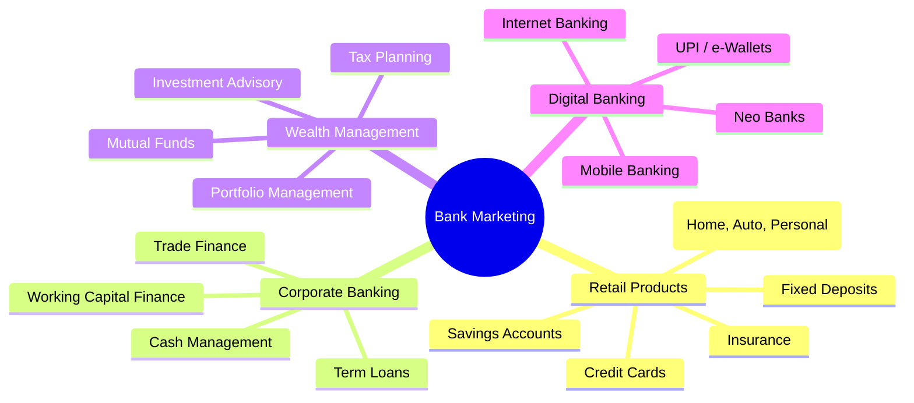
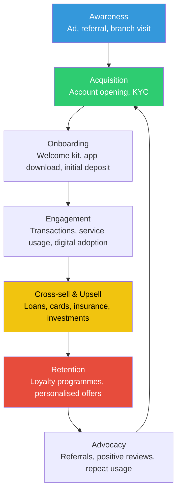
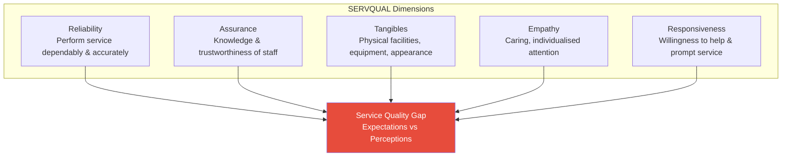
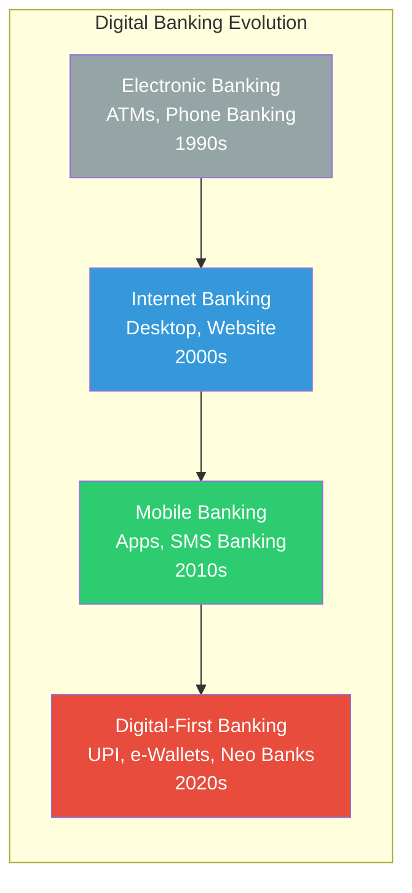
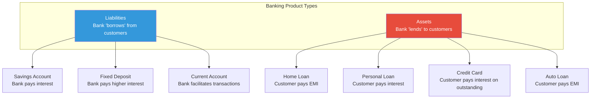
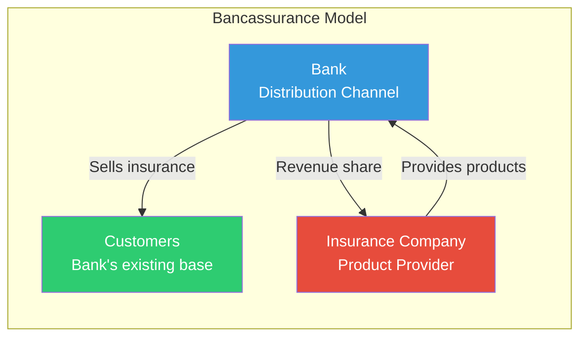

# Chapter 4: Marketing in Banking Sector

## Learning Objectives

By the end of this chapter, you will be able to:
- Identify retail banking products and their marketing strategies
- Describe corporate banking and wealth management marketing approaches
- Explain customer acquisition and retention strategies in banking
- Apply cross-selling and upselling techniques in a banking context
- Evaluate service quality using the SERVQUAL model
- Analyse RBI guidelines on marketing of financial products
- Understand digital banking adoption and its marketing implications

<!-- Image Gallery -->
<section class="lesson-visuals" aria-label="Visual learning resources">
  <header><span>VISUAL LEARNING</span><h2>See it. Review it. Remember it.</h2></header>
  <a class="lesson-visual-card" href="../../assets/images/lessons/marketing-aptitude/04-banking-marketing/handwritten-notes.png" target="_blank" rel="noopener">
    
    <span><strong>Handwritten notes</strong>Condensed notes for deliberate review.</span>
  </a>
  <a class="lesson-visual-card" href="../../assets/images/lessons/marketing-aptitude/04-banking-marketing/sticky-notes.png" target="_blank" rel="noopener">
    
    <span><strong>Sticky-note revision</strong>Fast recall prompts for revision.</span>
  </a>
  <a class="lesson-visual-card" href="../../assets/images/lessons/marketing-aptitude/04-banking-marketing/visual-explanation.png" target="_blank" rel="noopener">
    
    <span><strong>Visual concept guide</strong>A connected explanation of the key ideas.</span>
  </a>
</section>
<!-- End Image Gallery -->

---

## Theory

### 4.1 Introduction to Banking Marketing

Banking marketing applies marketing principles to financial services. Unlike product marketing, banking marketing must address the unique characteristics of services — intangibility, inseparability, variability, and perishability.

**Why banking marketing is different:**
- **Intangibility** — Cannot be displayed or demonstrated before purchase
- **Trust-based** — Customers must trust the institution with their money
- **Regulatory constraints** — RBI heavily regulates marketing communications
- **Long-term relationships** — Customer relationships span years and decades
- **Risk involvement** — Financial products carry inherent risk



### 4.2 Retail Banking Products

Retail banking (also called personal or consumer banking) serves individual customers.

#### Product Categories

| Product Category | Products | Target Customer | Marketing Approach |
|-----------------|----------|-----------------|-------------------|
| **Deposit Accounts** | Savings account, Current account, Fixed Deposit, Recurring Deposit | Mass market, salaried individuals | Convenience, safety, interest rates |
| **Loan Products** | Home loan, Auto loan, Personal loan, Education loan, Gold loan | Diverse segments based on need | Interest rate, processing speed, EMI flexibility |
| **Cards** | Credit cards, Debit cards, Prepaid cards | Spenders, travellers, online shoppers | Rewards, lifestyle benefits, acceptance |
| **Insurance** | Life insurance, Health insurance, General insurance | Risk-averse individuals | Protection, tax benefits, family security |
| **Investment Products** | Mutual funds, SIP, IPO, Bonds | Investors, savers | Returns, diversification, expert management |

#### Savings Account Marketing

Key differentiators banks use for savings accounts:
- Interest rate (currently 2.5%–7% p.a.)
- Minimum balance requirement (₹0 to ₹10,000)
- Free transactions, ATM withdrawals, cheque books
- Digital banking features (mobile app, UPI)
- Insurance covers (accidental, life)

### 4.3 Corporate Banking

Corporate banking (business banking) serves companies, from SMEs to large corporations.

| Service | Description | Marketing Angle |
|---------|-------------|-----------------|
| **Working Capital Finance** | Short-term loans for daily operations | Cash flow management, flexible limits |
| **Term Loans** | Long-term funding for capex | Lower rates, longer tenure |
| **Cash Management** | Collections, payments, liquidity management | Efficiency, centralised control |
| **Trade Finance** | Letters of credit, bank guarantees | Risk mitigation, global reach |
| **Treasury Services** | Forex, derivatives, hedging | Risk management expertise |
| **Corporate Cards** | Business credit/expense cards | Expense control, rewards |

### 4.4 Wealth Management

Wealth management provides high-net-worth individuals (HNIs) with comprehensive financial services.

**Services offered:**
- Portfolio management and advisory
- Tax planning and estate planning
- Mutual fund and alternative investments
- Insurance and retirement planning
- Trust and succession planning

**Segmenting wealth management clients:**

| Segment | Investible Assets | Service Approach |
|---------|------------------|------------------|
| **Mass Affluent** | ₹10–50 lakh | Standard advisory, robo-advisory |
| **High Net Worth (HNI)** | ₹50 lakh–₹5 crore | Dedicated relationship manager |
| **Ultra HNI** | ₹5 crore+ | Family office, bespoke solutions |

### 4.5 Customer Lifecycle in Banking



| Stage | Objective | Key Activities |
|-------|-----------|----------------|
| **Awareness** | Create visibility | Advertising, branch signage, online presence, referrals |
| **Acquisition** | Convert to customer | Easy account opening, instant KYC (Aadhaar-based), zero-balance options |
| **Onboarding** | Activate and educate | Welcome kit, app download guidance, first transaction incentive |
| **Engagement** | Deepen relationship | Regular transactions, salary credit, bill payments |
| **Cross-sell/Upsell** | Increase wallet share | Offer loans, credit cards, insurance, mutual funds |
| **Retention** | Reduce churn | Loyalty programmes, fee waivers, personalised service |
| **Advocacy** | Generate referrals | Referral bonuses, customer testimonials, community events |

### 4.6 Customer Acquisition in Banking

**Acquisition channels:**

| Channel | Description | Cost | Conversion |
|---------|-------------|------|------------|
| **Branch walk-in** | Customer visits branch | Low | High (high intent) |
| **Direct sales agents** | Field sales force | High | Moderate |
| **Digital acquisition** | Website, app, online ads | Low–Moderate | Low–Moderate |
| **Referral programmes** | Existing customers refer | Low | Very high |
| **Partnerships** | Corporate salary accounts, co-branded cards | Moderate | High |
| **Events** | Financial literacy camps, seminars | Moderate | Moderate |

**KYC (Know Your Customer)** is a regulatory requirement for customer acquisition in banking:
- Aadhaar-based e-KYC for instant verification
- Video KYC allows remote account opening
- In-person verification for high-risk accounts
- RBI mandates periodic KYC updation

### 4.7 Cross-Selling and Upselling

**Cross-selling** — Selling additional, related products to existing customers.
**Upselling** — Selling a higher-value version of the same product.

```typescript
// TypeScript: Bank Cross-Sell Recommender Engine
interface CustomerProfile {
  age: number;
  income: number; // annual in lakhs
  hasSavings: boolean;
  hasHomeLoan: boolean;
  hasCreditCard: boolean;
  hasInsurance: boolean;
  hasMutualFund: boolean;
  averageBalance: number;
}

interface Recommendation {
  product: string;
  reason: string;
  priority: number; // 1 = highest
}

class CrossSellEngine {
  static recommend(customer: CustomerProfile): Recommendation[] {
    const recommendations: Recommendation[] = [];

    if (customer.hasSavings && !customer.hasCreditCard && customer.income > 5) {
      recommendations.push({
        product: "Platinum Credit Card",
        reason: "High-income savings customer — eligible for premium card with travel benefits",
        priority: 1,
      });
    }

    if (customer.hasHomeLoan && !customer.hasInsurance) {
      recommendations.push({
        product: "Term Life Insurance",
        reason: "Home loan customer needs life cover to protect family from debt burden",
        priority: 1,
      });
    }

    if (customer.hasSavings && !customer.hasMutualFund && customer.averageBalance > 50000) {
      recommendations.push({
        product: "Systematic Investment Plan (SIP)",
        reason: "High balance savings customer can earn better returns through mutual funds",
        priority: 2,
      });
    }

    if (customer.hasCreditCard && !customer.hasHomeLoan && customer.income > 8) {
      recommendations.push({
        product: "Home Loan Pre-Approval",
        reason: "Credit card customer with good repayment history qualifies for pre-approved home loan",
        priority: 3,
      });
    }

    if (!customer.hasSavings) {
      recommendations.push({
        product: "Premium Savings Account",
        reason: "Basic banking relationship needed for all other products",
        priority: 1,
      });
    }

    return recommendations.sort((a, b) => a.priority - b.priority);
  }
}

const customer: CustomerProfile = {
  age: 35, income: 12, hasSavings: true, hasHomeLoan: true,
  hasCreditCard: false, hasInsurance: false, hasMutualFund: false, averageBalance: 75000,
};

console.log(CrossSellEngine.recommend(customer));
// Recommendations for credit card and insurance (priority 1)
```

#### Cross-Selling Success Metrics

| Metric | Definition | Target |
|--------|------------|--------|
| **Cross-sell ratio** | Products per customer | 3–5 per customer (industry avg: 2–3) |
| **Penetration rate** | % of eligible customers who bought the product | > 30% |
| **Conversion rate** | % of offers accepted | > 15% |
| **Time to cross-sell** | Days from account opening to first cross-sell | < 90 days |

### 4.8 Service Quality in Banking: SERVQUAL Model

The SERVQUAL model measures service quality by comparing customer expectations with actual service performance across five dimensions.



| Dimension | Definition | Banking Example |
|-----------|------------|-----------------|
| **Reliability** | Ability to perform the promised service dependably and accurately | Correct transactions, error-free statements, honoured commitments |
| **Responsiveness** | Willingness to help customers and provide prompt service | Fast counter service, quick query resolution, short call wait times |
| **Assurance** | Employee knowledge, courtesy, and ability to inspire trust | Professional staff, clear product explanations, data protection |
| **Empathy** | Caring, individualised attention | Personalised offers, remembering customer preferences, proactive advice |
| **Tangibles** | Physical facilities, equipment, and personnel appearance | Clean branch, modern ATMs, professional dress, user-friendly app |

**Gap Model of Service Quality:**
- **Gap 1:** Consumer expectation vs management perception
- **Gap 2:** Management perception vs service quality specification
- **Gap 3:** Service quality specifications vs service delivery
- **Gap 4:** Service delivery vs external communications
- **Gap 5:** Expected service vs perceived service (overall gap)

### 4.9 Customer Satisfaction in Banking

**Key drivers of customer satisfaction in banking:**

| Factor | Importance | Description |
|--------|------------|-------------|
| **Service quality** | Very High | Error-free, timely, polite service |
| **Convenience** | High | Branch location, ATM network, digital access |
| **Interest rates & fees** | High | Competitive rates, transparent charges |
| **Product range** | Moderate | One-stop shop for financial needs |
| **Problem resolution** | Very High | Quick, fair complaint handling |
| **Technology** | High | App usability, digital features, security |

**Net Promoter Score (NPS) in banking:**
- **Promoters (9–10):** Loyal, enthusiastic customers who recommend
- **Passives (7–8):** Satisfied but unenthusiastic
- **Detractors (0–6):** Unhappy customers who may spread negative word-of-mouth

NPS = % Promoters − % Detractors

```typescript
// TypeScript: Banking NPS Calculator
interface NPSSurvey {
  responses: number[]; // 0-10 scale
}

function calculateNPS(survey: NPSSurvey): { nps: number; promoters: number; passives: number; detractors: number } {
  const promoters = survey.responses.filter(r => r >= 9).length;
  const passives = survey.responses.filter(r => r >= 7 && r <= 8).length;
  const detractors = survey.responses.filter(r => r <= 6).length;
  const total = survey.responses.length;

  return {
    nps: Math.round(((promoters - detractors) / total) * 100),
    promoters: Math.round((promoters / total) * 100),
    passives: Math.round((passives / total) * 100),
    detractors: Math.round((detractors / total) * 100),
  };
}

const branchSurvey: NPSSurvey = {
  responses: [10, 9, 8, 7, 6, 9, 10, 8, 5, 9, 7, 10, 4, 8, 9, 6, 7, 10, 9, 8],
};
console.log(calculateNPS(branchSurvey));
// Example: { nps: 35, promoters: 40, passives: 35, detractors: 25 }
```

### 4.10 Digital Banking Adoption

Digital banking refers to the digitisation of all traditional banking activities, moving them online.



**Factors driving digital banking adoption:**
1. Smartphone penetration (over 80% in urban India)
2. Affordable mobile data (India has the cheapest data globally)
3. UPI ecosystem (BHIM, Google Pay, PhonePe, Paytm)
4. Government initiatives (Digital India, Jan Dhan)
5. COVID-19 accelerated shift to contactless banking
6. Improved cybersecurity and fraud prevention

**Marketing digital banking products:**

| Product | Marketing Strategy | Key Message |
|---------|-------------------|-------------|
| **Mobile Banking App** | In-branch promotion, SMS/email campaigns, app store optimisation | "Bank anytime, anywhere" |
| **UPI Payments** | Merchant partnerships, cashback offers, QR code campaigns | "Pay instantly" |
| **Digital Savings Account** | Paperless onboarding, video KYC, instant activation | "Open in 5 minutes" |
| **Digital Loans** | Pre-approved offers, instant disbursement, minimal documents | "Loan in minutes, not days" |

#### Neo Banks and Fintech

Neo banks are digital-only banks without physical branches (e.g., Jupiter, Niyo, Fi).

| Feature | Traditional Bank | Neo Bank |
|---------|----------------|----------|
| **Branch presence** | Extensive physical network | No branches |
| **Account opening** | In-person or video KYC | Fully digital (5 minutes) |
| **Product range** | Comprehensive (loans, cards, investments) | Limited, focused on savings/spending |
| **Customer service** | Branch + call centre | Chatbot + in-app chat |
| **Target segment** | Mass market | Millennials, tech-savvy |
| **Revenue model** | Interest spread + fees | Subscription + interchange fees |

### 4.11 RBI Guidelines on Marketing of Financial Products

The Reserve Bank of India regulates marketing practices of banks and financial institutions.

**Key regulatory requirements:**

| Guideline | Requirement |
|-----------|-------------|
| **Fair Practices Code** | Banks must disclose all terms, interest rates, and charges transparently |
| **Advertising Code** | Ads must not be misleading, exaggerated, or suppress material information |
| **KYC Norms** | Mandatory identity verification for all account relationships |
| **Data Protection** | Customer information must not be shared without consent |
| **Customer Grievance Redressal** | Banks must have a structured complaint resolution mechanism |
| **Telemarketing Guidelines** | Do-Not-Disturb (DND) registry must be respected; calls only between 9 AM–9 PM |
| **Code of Bank's Commitment to Customers** | Published standards of service, including turnaround times |

**Prohibited marketing practices:**
- Misleading claims about interest rates or returns
- Unsolicited credit card issuance
- Aggressive recovery practices
- Sharing customer data with third parties without consent
- Tying (forcing customers to buy one product to get another)

#### Customer Protection in Banking

```typescript
// TypeScript: Marketing Compliance Checker
interface MarketingMaterial {
  content: string;
  mentionsInterestRate: boolean;
  mentionsRisks: boolean;
  hasDisclaimers: boolean;
  targetSegment: "general" | "senior" | "hni" | "student";
}

class MarketingCompliance {
  static readonly RBI_RULES = {
    MISLEADING_CONTENT: ["guaranteed returns", "no risk", "zero charges", "risk-free"],
    REQUIRED_DISCLAIMERS: ["Mutual fund investments are subject to market risks"],
    RESTRICTED_HOURS: { start: 9, end: 21 }, // telemarketing hours
  };

  static checkCompliance(material: MarketingMaterial): { pass: boolean; issues: string[] } {
    const issues: string[] = [];

    // Check for misleading content
    const contentLower = material.content.toLowerCase();
    for (const phrase of this.RBI_RULES.MISLEADING_CONTENT) {
      if (contentLower.includes(phrase)) {
        issues.push(`Contains prohibited phrase: "${phrase}"`);
      }
    }

    // Interest rate claims must include risks if applicable
    if (material.mentionsInterestRate && !material.mentionsRisks) {
      issues.push("Interest rate claims must be accompanied by risk disclosure");
    }

    // Disclaimers check
    if (material.mentionsInterestRate && !material.hasDisclaimers) {
      issues.push("Standard disclaimers are required for financial product marketing");
    }

    // Senior citizen protections
    if (material.targetSegment === "senior" && !material.hasDisclaimers) {
      issues.push("Senior citizen marketing requires additional safeguards");
    }

    return {
      pass: issues.length === 0,
      issues,
    };
  }
}

const ad = {
  content: "Earn 8% returns on our new Fixed Deposit — guaranteed returns with zero risk!",
  mentionsInterestRate: true,
  mentionsRisks: false,
  hasDisclaimers: false,
  targetSegment: "general" as const,
};
console.log(MarketingCompliance.checkCompliance(ad));
// { pass: false, issues: ["Contains prohibited phrase...", "Interest rate claims must...", ...] }
```

### 4.12 Marketing Metrics for Banking

| Metric | Formula | Target (Retail Banking) |
|--------|---------|------------------------|
| **Customer Acquisition Cost (CAC)** | Total marketing spend / New customers | ₹200–₹500 per account |
| **Cost-to-Income Ratio** | Operating expenses / Operating income | 40–50% |
| **Cross-sell Ratio** | Total products / Total customers | 3+ per customer |
| **Customer Churn Rate** | Customers lost / Total customers | < 5% annually |
| **Net Interest Margin (NIM)** | (Interest earned − Interest paid) / Assets | 2.5–4% |
| **Share of Wallet** | Business with us / Total customer financial business | 40%+ |
| **Digital Adoption Rate** | Digital active customers / Total customers | 60%+ |
| **Branch Productivity** | Revenue per branch | ₹2–5 crore per branch |

### 4.13 Liability vs Asset Marketing in Banking

Banks market two fundamentally different types of products: liabilities (where customers lend money to the bank) and assets (where the bank lends money to customers).



| Aspect | Liability Products | Asset Products |
|--------|-------------------|----------------|
| **Nature** | Customer deposits money | Bank lends money |
| **Bank's cost/income** | Bank pays interest (cost) | Bank earns interest (income) |
| **Examples** | Savings account, FD, RD, Current account | Home loan, Personal loan, Auto loan, Credit card |
| **Marketing focus** | Safety, returns, convenience | Low rates, quick approval, flexibility |
| **Target segment** | Mass market, savers | Borrowers, home buyers, spenders |
| **Cross-sell opportunity** | Sell loans to depositors | Sell insurance to borrowers |
| **Profitability** | Low margin per account | High margin per loan |

**NIM (Net Interest Margin)** = (Interest earned on assets − Interest paid on liabilities) / Total assets

### 4.14 Bancassurance

Bancassurance is the partnership between a bank and an insurance company to sell insurance products to the bank's customers.



| Aspect | Description |
|--------|-------------|
| **Definition** | Bank sells insurance products to its customers using its branch network |
| **Products sold** | Life insurance, health insurance, general insurance, ULIPs |
| **Benefits for bank** | Fee income without credit risk, deeper customer relationships |
| **Benefits for insurer** | Access to bank's large customer base at lower acquisition cost |
| **Benefits for customer** | Convenience — one-stop shop for banking and insurance |
| **Regulation** | IRDAI regulates bancassurance partnerships; banks can partner with up to 3 insurers |
| **Key metric** | Cross-sell ratio, bancassurance penetration rate |

### 4.15 Customer Segmentation in Banking

```typescript
// TypeScript: Bank Customer Segmentation Engine
type Segment = "Mass" | "Mass Affluent" | "HNI" | "Ultra HNI" | "SME" | "Corporate";

interface BankCustomer {
  id: string;
  age: number;
  annualIncome: number;      // in lakhs
  investibleAssets: number;  // in lakhs
  avgMonthlyBalance: number; // in thousands
  hasBusiness: boolean;
  businessTurnover?: number; // in lakhs
  productsHeld: number;
  tenure: number;            // years with bank
}

interface SegmentProfile {
  segment: Segment;
  minIncome: number;
  minAssets: number;
  minBalance: number;
  description: string;
  serviceModel: string;
}

const SEGMENT_DEFINITIONS: SegmentProfile[] = [
  { segment: "Ultra HNI", minIncome: 200, minAssets: 500, minBalance: 500, description: "Family office, bespoke solutions", serviceModel: "Dedicated RM + Wealth Advisor" },
  { segment: "HNI", minIncome: 50, minAssets: 50, minBalance: 100, description: "Priority banking, investment advisory", serviceModel: "Dedicated Relationship Manager" },
  { segment: "Mass Affluent", minIncome: 15, minAssets: 10, minBalance: 25, description: "Premium products, robo-advisory", serviceModel: "Shared RM + Digital" },
  { segment: "Mass", minIncome: 3, minAssets: 1, minBalance: 5, description: "Standard banking products", serviceModel: "Digital-first, branch support" },
  { segment: "SME", minIncome: 0, minAssets: 0, minBalance: 0, description: "Business banking for small businesses", serviceModel: "Business RM" },
  { segment: "Corporate", minIncome: 0, minAssets: 0, minBalance: 0, description: "Large enterprise banking", serviceModel: "Corporate RM Team" },
];

function segmentCustomer(customer: BankCustomer): Segment {
  if (customer.hasBusiness && (customer.businessTurnover ?? 0) > 500) return "Corporate";
  if (customer.hasBusiness && (customer.businessTurnover ?? 0) > 50) return "SME";
  if (customer.investibleAssets >= 500) return "Ultra HNI";
  if (customer.investibleAssets >= 50 || customer.annualIncome >= 50) return "HNI";
  if (customer.annualIncome >= 15 || customer.avgMonthlyBalance >= 25) return "Mass Affluent";
  return "Mass";
}

const customer1: BankCustomer = {
  id: "C001", age: 45, annualIncome: 60, investibleAssets: 80,
  avgMonthlyBalance: 150, hasBusiness: false, productsHeld: 4, tenure: 8,
};
console.log("Segment for C001:", segmentCustomer(customer1)); // HNI

const customer2: BankCustomer = {
  id: "C002", age: 28, annualIncome: 6, investibleAssets: 2,
  avgMonthlyBalance: 12, hasBusiness: false, productsHeld: 2, tenure: 2,
};
console.log("Segment for C002:", segmentCustomer(customer2)); // Mass
```

### 4.16 Comparison Tables

#### Traditional Banking vs Neo Bank Marketing

| Dimension | Traditional Bank | Neo Bank |
|-----------|----------------|----------|
| **Customer acquisition** | Branch walk-ins, DSA, referrals | Digital ads, influencer marketing, app store optimisation |
| **Brand trust** | High (decades of presence) | Low to moderate (new entrant) |
| **Product complexity** | High (full suite of products) | Low (focused, simple products) |
| **Customer service** | Branch + Call centre + App | Chatbot + In-app chat + Email |
| **Cost structure** | High fixed cost (branches, staff) | Low fixed cost (technology-only) |
| **Marketing message** | "Trust us with your life savings" | "Banking made simple and smart" |
| **Target audience** | All segments (mass to HNI) | Millennials, tech-savvy, urban |
| **Example** | SBI, HDFC, ICICI | Jupiter, Fi, Niyo, Open |

#### Retail vs Corporate vs Wealth Management Marketing

| Dimension | Retail Banking | Corporate Banking | Wealth Management |
|-----------|---------------|-------------------|-------------------|
| **Target** | Individual consumers | Businesses (SME to large) | High Net Worth Individuals |
| **Products** | Savings, loans, cards, insurance | Working capital, trade finance, cash management | Portfolio management, tax planning, estate planning |
| **Decision maker** | Individual or family | CFO, Finance team | Individual (HNI) + family |
| **Relationship** | Transactional to moderate | Deep, long-term | Very deep, personal |
| **Marketing channel** | Mass media, digital, branch | Relationship managers, events | Relationship managers, exclusive events |
| **Key metric** | Cross-sell ratio, NPS | Share of wallet, relationship value | AUM (Assets Under Management) |
| **Service model** | Standardised | Customised | Bespoke |

---

## Examples: 30 Solved MCQs

### Example 1: Retail Banking Products

**Q1.** Which of the following is NOT a retail banking product?

a) Savings account
b) Home loan
c) Working capital finance
d) Credit card

<details>
<summary>Answer</summary>
**c) Working capital finance.** Working capital finance is a corporate banking product (serves businesses). Savings accounts, home loans, and credit cards are retail banking products for individual consumers.
</details>

---

**Q2.** The primary target segment for a platinum credit card with high annual fees is:

a) Students
b) Mass market
c) High-net-worth individuals
d) Rural customers

<details>
<summary>Answer</summary>
**c) High-net-worth individuals (HNI).** Premium credit cards with high fees offer lifestyle benefits (airport lounge, concierge, travel insurance) targeting high-income individuals who will spend enough to justify the fee.
</details>

---

### Example 2: Customer Lifecycle

**Q3.** The stage where a bank offers a pre-approved personal loan to a salary account customer is:

a) Acquisition
b) Onboarding
c) Cross-sell
d) Advocacy

<details>
<summary>Answer</summary>
**c) Cross-sell.** Offering a personal loan to an existing salary account customer is cross-selling — selling additional products to existing customers. Pre-approved offers leverage the existing relationship to reduce risk.
</details>

---

**Q4.** Which customer lifecycle stage focuses on moving a customer from being a passive user to a brand advocate?

a) Acquisition
b) Onboarding
c) Retention
d) Advocacy

<details>
<summary>Answer</summary>
**d) Advocacy.** The advocacy stage aims to turn satisfied customers into promoters who refer others, leave positive reviews, and actively recommend the bank. Referral programmes are a key tactic.
</details>

---

### Example 3: Cross-Selling and Upselling

**Q5.** A bank offers a customer with a ₹30 lakh home loan an upgrade to a ₹50 lakh loan. This is:

a) Cross-selling
b) Upselling
c) Bundling
d) Tying

<details>
<summary>Answer</summary>
**b) Upselling.** Upselling is selling a higher-value version of the same product. Cross-selling would be selling a different product (e.g., insurance along with the home loan). Bundling offers products together; tying forces purchase of one to get another.
</details>

---

**Q6.** Which of the following is the best example of cross-selling in banking?

a) Increasing a customer's credit card limit
b) Selling a term insurance plan to a home loan customer
c) Renewing a fixed deposit
d) Reducing interest rates

<details>
<summary>Answer</summary>
**b) Selling a term insurance plan to a home loan customer.** This is cross-selling — the home loan and insurance are different products. Increasing credit limit is upselling; renewal is retention; reducing rates is retention/pricing.
</details>

---

### Example 4: Financial Inclusion

**Q7.** Pradhan Mantri Jan Dhan Yojana (PMJDY) is primarily aimed at:

a) Wealth management for rich customers
b) Financial inclusion for the unbanked
c) Corporate lending
d) International banking

<details>
<summary>Answer</summary>
**b) Financial inclusion for the unbanked.** PMJDY is India's flagship financial inclusion programme, offering zero-balance accounts, RuPay debit cards, and accidental insurance to bring the unbanked population into the formal banking system.
</details>

---

**Q8.** The minimum balance requirement for a PMJDY account is:

a) ₹1,000
b) ₹500
c) ₹100
d) Zero

<details>
<summary>Answer</summary>
**d) Zero.** Jan Dhan accounts have zero minimum balance requirement. This is a key feature to make banking accessible to the poorest households.
</details>

---

### Example 5: Digital Banking

**Q9.** Which UPI-based payment system allows users to create a virtual payment address linked to their bank account?

a) NEFT
b) RTGS
c) BHIM
d) IMPS

<details>
<summary>Answer</summary>
**c) BHIM (Bharat Interface for Money).** BHIM is a UPI-based payment app developed by NPCI that lets users create a virtual payment address (VPآ) to send and receive money directly from bank accounts without entering account numbers.
</details>

---

**Q10.** A neo bank differs from a traditional bank primarily because:

a) It charges higher fees
b) It operates without physical branches
c) It does not accept deposits
d) It is not regulated

<details>
<summary>Answer</summary>
**b) It operates without physical branches.** Neo banks are digital-only banks without branch networks. However, in India most neo banks partner with traditional banks for the banking license — they are not unregulated.
</details>

---

### Example 6: SERVQUAL Model

**Q11.** Which SERVQUAL dimension measures "the ability to perform the promised service dependably and accurately"?

a) Tangibles
b) Reliability
c) Responsiveness
d) Empathy

<details>
<summary>Answer</summary>
**b) Reliability.** Reliability is the most important SERVQUAL dimension — doing what you promised, accurately. In banking, this means correct transactions, error-free statements, and honoured commitments.
</details>

---

**Q12.** A bank renovates its branch with modern interiors, comfortable seating, and digital kiosks. This improves which SERVQUAL dimension?

a) Reliability
b) Responsiveness
c) Tangibles
d) Assurance

<details>
<summary>Answer</summary>
**c) Tangibles.** Tangibles cover physical facilities, equipment, and appearance of personnel. Branch renovation directly improves this dimension. While it may indirectly improve other dimensions, the primary impact is on tangibles.
</details>

---

**Q13.** A bank employee remembers a regular customer's name and asks about their family. This reflects which SERVQUAL dimension?

a) Assurance
b) Empathy
c) Reliability
d) Responsiveness

<details>
<summary>Answer</summary>
**b) Empathy.** Empathy means caring, individualised attention. Remembering personal details and showing genuine care for customers demonstrates empathy. Assurance is about knowledge and trust; responsiveness is about promptness.
</details>

---

### Example 7: RBI Guidelines

**Q14.** As per RBI guidelines, unsolicited credit card issuance is:

a) Allowed with customer consent
b) Prohibited
c) Allowed for premium customers
d) Allowed if the card has no annual fee

<details>
<summary>Answer</summary>
**b) Prohibited.** RBI strictly prohibits unsolicited issuance of credit cards. Banks must obtain explicit customer consent before issuing any credit card. If an unsolicited card is issued and activated without consent, the bank bears all losses.
</details>

---

**Q15.** According to RBI's telemarketing guidelines, calls to customers registered on the DND (Do Not Disturb) registry are:

a) Allowed between 9 AM and 9 PM
b) Allowed only for existing customers
c) Prohibited
d) Allowed with prior written consent

<details>
<summary>Answer</summary>
**c) Prohibited.** Telemarketing calls to numbers registered on the TRAI DND registry are prohibited. Banks must scrub their calling lists against the DND registry before making marketing calls.
</details>

---

**Q16.** "Tying" in banking refers to:

a) Bundling products at a discount
b) Forcing a customer to buy one product to get another
c) Linking accounts for net banking
d) Connecting branches via network

<details>
<summary>Answer</summary>
**b) Forcing a customer to buy one product to get another.** Tying is an anti-competitive practice where a bank makes the sale of one product conditional on the purchase of another (e.g., requiring a savings account to get a home loan). RBI prohibits unfair tying.
</details>

---

### Example 8: Customer Satisfaction

**Q17.** A customer who rates their bank 9 or 10 on the NPS scale is classified as:

a) Detractor
b) Passive
c) Promoter
d) Neutral

<details>
<summary>Answer</summary>
**c) Promoter.** On the 0–10 NPS scale, promoters (9–10) are loyal enthusiasts who will keep buying and refer others. Passives (7–8) are satisfied but vulnerable to competition. Detractors (0–6) are unhappy customers.
</details>

---

**Q18.** The Gap 5 in the SERVQUAL gap model measures:

a) Management perception vs service specification
b) Service delivery vs external communication
c) Expected service vs perceived service
d) Consumer expectation vs management perception

<details>
<summary>Answer</summary>
**c) Expected service vs perceived service.** Gap 5 is the overall service quality gap — the discrepancy between what customers expect and what they perceive they received. All other gaps contribute to Gap 5.
</details>

---

### Example 9: Wealth Management

**Q19.** A dedicated relationship manager is typically assigned to which wealth management segment?

a) Mass market
b) Mass affluent
c) High Net Worth (HNI)
d) Students

<details>
<summary>Answer</summary>
**c) High Net Worth (HNI).** HNIs (investible assets ₹50 lakh+) typically receive a dedicated relationship manager who provides personalised financial advice, portfolio management, and priority service. Mass affluent may get robo-advisory or shared RM.
</details>

---

### Example 10: Banking Metrics

**Q20.** A bank's cross-sell ratio of 2.5 means:

a) 2.5% of customers have multiple products
b) On average, each customer holds 2.5 products
c) 2.5 new products were sold last month
d) 2.5% revenue came from cross-selling

```typescript
// TypeScript: Cross-Sell Ratio Calculator
interface BankingRelationship {
  customerId: string;
  products: string[];
}

function calculateCrossSellRatio(relationships: BankingRelationship[]): number {
  const totalProducts = relationships.reduce((sum, r) => sum + r.products.length, 0);
  return totalProducts / relationships.length;
}

const customers: BankingRelationship[] = [
  { customerId: "C001", products: ["Savings", "FD"] },
  { customerId: "C002", products: ["Savings", "Credit Card", "Mutual Fund", "Insurance"] },
  { customerId: "C003", products: ["Current", "Home Loan"] },
  { customerId: "C004", products: ["Savings"] },
];

console.log("Cross-sell ratio:", calculateCrossSellRatio(customers)); // 2.5
```

<details>
<summary>Answer</summary>
**b) On average, each customer holds 2.5 products.** Cross-sell ratio = Total products / Total customers. A ratio of 2.5 indicates the average product holding per customer. The industry benchmark for Indian banks is 2–3 products per customer.
</details>

---

### Example 11: Liability vs Asset Marketing (Q21–Q23)

**Q21.** A bank's Net Interest Margin (NIM) is calculated as:

a) Total deposits / Total loans
b) (Interest earned − Interest paid) / Total assets
c) Total income / Total expenses
d) Loan disbursements / Deposit mobilisation

<details>
<summary>Answer</summary>
**b) (Interest earned − Interest paid) / Total assets.** NIM measures the difference between what a bank earns on its assets (loans, investments) and what it pays on its liabilities (deposits), expressed as a percentage of total assets. It is a key measure of banking profitability.
</details>

---

**Q22.** A Fixed Deposit (FD) is classified as which type of banking product?

a) Asset product
b) Liability product
c) Fee-based product
d) Off-balance sheet product

<details>
<summary>Answer</summary>
**b) Liability product.** Fixed Deposits are liability products because the bank "borrows" money from the customer and pays interest on it. The money is a liability on the bank's balance sheet. Home loans and credit cards are asset products for the bank.
</details>

---

**Q23.** Which banking product generates the highest Net Interest Margin for a bank?

a) Savings account
b) Fixed Deposit
c) Personal Loan
d) Current Account

<details>
<summary>Answer</summary>
**c) Personal Loan.** Personal loans have the highest interest rates (10–24% p.a.) among common banking products, generating the highest NIM. Savings accounts pay low interest (2.5–4%), while FDs cost the bank 5–8%. The spread (loan rate minus deposit rate) is highest for personal loans.
</details>

---

### Example 12: Bancassurance (Q24–Q25)

**Q24.** Bancassurance refers to:

a) Banks issuing their own insurance policies
b) Banks distributing insurance products of partner companies
c) Insurance companies opening bank branches
d) Customers buying insurance directly from IRDAI

<details>
<summary>Answer</summary>
**b) Banks distributing insurance products of partner companies.** Bancassurance is a partnership between a bank and an insurance company where the bank sells the insurer's products to its existing customers through its branch network. The bank earns commission income without taking underwriting risk.
</details>

---

**Q25.** Which of the following is a key benefit of bancassurance for the insurance company?

a) Higher underwriting profits
b) Access to the bank's existing customer base at lower acquisition cost
c) Ability to set premium rates
d) Exemption from IRDAI regulations

<details>
<summary>Answer</summary>
**b) Access to the bank's existing customer base at lower acquisition cost.** For insurance companies, bancassurance provides access to a large, pre-qualified customer base at a fraction of the cost of acquiring customers directly. The bank's trust factor also improves insurance conversion rates.
</details>

---

### Example 13: Customer Segmentation (Q26–Q27)

**Q26.** A customer with investible assets of ₹2 crore should be classified as which segment for wealth management?

a) Mass market
b) Mass affluent
c) HNI
d) Ultra HNI

<details>
<summary>Answer</summary>
**d) Ultra HNI.** Ultra HNI segment typically includes customers with investible assets of ₹5 crore or more (some banks use ₹2 crore+). They receive family office services, bespoke investment solutions, and a dedicated team of relationship managers and wealth advisors.
</details>

---

**Q27.** A bank offers robo-advisory services and digital-only relationship management to which segment?

a) Mass market
b) Mass affluent
c) HNI
d) Ultra HNI

<details>
<summary>Answer</summary>
**b) Mass affluent.** Mass affluent customers (₹10–50 lakh investible assets) may receive robo-advisory services and digital-first relationship management. While they have higher potential than mass market customers, their profitability does not justify a dedicated relationship manager.
</details>

---

### Example 14: Traditional vs Neo Bank (Q28–Q30)

**Q28.** Which of the following is a characteristic of a neo bank?

a) Extensive branch network
b) Physical cheque books
c) Digital-only operations
d) In-person KYC

<details>
<summary>Answer</summary>
**c) Digital-only operations.** Neo banks operate entirely through digital channels (mobile app, website) without physical branches. Account opening is fully digital (video KYC), and customer service is through chatbots and in-app chat. Examples: Jupiter, Fi, Niyo.
</details>

---

**Q29.** The main challenge faced by neo banks in customer acquisition is:

a) High operational costs
b) Low brand trust compared to traditional banks
c) Limited product range
d) Regulatory hurdles

<details>
<summary>Answer</summary>
**b) Low brand trust compared to traditional banks.** Neo banks, being relatively new entrants, lack the trust and credibility that traditional banks have built over decades. Customers are often reluctant to trust their savings to a digital-only entity without a physical branch presence or long track record.
</details>

---

**Q30.** A traditional bank's key competitive advantage over a neo bank is:

a) Better mobile app design
b) Faster account opening
c) Trust and extensive branch network
d) Lower fees

<details>
<summary>Answer</summary>
**c) Trust and extensive branch network.** Traditional banks have decades of trust, regulatory compliance history, and extensive branch/ATM networks. While neo banks offer better UX and faster processes, traditional banks leverage their trust and reach, especially in semi-urban and rural markets.
</details>

---

## Summary

- **Banking marketing** differs from product marketing due to intangibility, trust requirements, regulatory constraints, and long-term relationships
- **Retail banking products** include savings accounts, loans, cards, insurance, and investments, each with distinct marketing approaches
- **Corporate banking** serves businesses with working capital, trade finance, cash management, and treasury services
- **Wealth management** segments clients into mass affluent, HNI, and ultra HNI with escalating service levels
- The **customer lifecycle** spans awareness → acquisition → onboarding → engagement → cross-sell → retention → advocacy
- **Cross-selling** and **upselling** increase wallet share; a good cross-sell ratio is 3+ products per customer
- The **SERVQUAL model** measures service quality across five dimensions: Reliability, Responsiveness, Assurance, Empathy, Tangibles
- **Digital banking** has evolved from ATMs and internet banking to UPI, mobile apps, and neo banks
- **RBI regulations** require transparent marketing, fair practices, data protection, and compliance with telemarketing and advertising codes
- **NPS** measures customer loyalty; **cross-sell ratio** measures relationship depth

## Practical Takeaways

1. **For exams**: Remember the five SERVQUAL dimensions (RATER: Reliability, Assurance, Tangibles, Empathy, Responsiveness) and the customer lifecycle stages
2. **For interviews**: Be prepared to explain how you would cross-sell a specific product to a banking customer
3. **For banking professionals**: Always lead with customer need analysis before product recommendation — trust is the most valuable asset
4. **For digital strategy**: Push digital adoption among existing customers through targeted campaigns; digital customers are 2–3× more profitable
5. **For compliance**: Every marketing communication in banking must be reviewed for regulatory compliance — no "guaranteed returns" or "zero risk" claims

## Chapter Quiz

1. Which of the following is NOT a SERVQUAL dimension?
   - A) Reliability
   - B) Responsiveness
   - C) Recognition
   - D) Tangibles

<details>
<summary>Answer</summary>
**C) Recognition.** The five SERVQUAL dimensions are Reliability, Assurance, Tangibles, Empathy, and Responsiveness (RATER). Recognition is not a SERVQUAL dimension.
</details>

2. A bank offering a pre-approved car loan to an existing savings account customer is an example of:
   - A) Customer acquisition
   - B) Cross-selling
   - C) Upselling
   - D) Onboarding

<details>
<summary>Answer</summary>
**B) Cross-selling.** Selling a different product (car loan) to an existing customer (savings account holder) is cross-selling. Upselling would be increasing the loan amount.
</details>

3. As per RBI guidelines, telemarketing calls are permitted only between:
   - A) 8 AM–8 PM
   - B) 9 AM–9 PM
   - C) 10 AM–6 PM
   - D) 24 hours with consent

<details>
<summary>Answer</summary>
**B) 9 AM–9 PM.** RBI telemarketing guidelines restrict calls to between 9:00 AM and 9:00 PM. Calls outside these hours are prohibited.
</details>

4. Gap 5 in the SERVQUAL gap model is the gap between:
   - A) Service delivery and external communication
   - B) Expected service and perceived service
   - C) Management perception and service specification
   - D) Consumer expectation and management perception

<details>
<summary>Answer</summary>
**B) Expected service and perceived service.** Gap 5 is the overall service quality gap — what customers expect vs what they actually experience.
</details>

5. A neo bank differs from a traditional bank primarily because it:
   - A) Charges lower interest rates
   - B) Has no physical branches
   - C) Offers all products for free
   - D) Is not regulated by RBI

<details>
<summary>Answer</summary>
**B) Has no physical branches.** Neo banks are digital-first, branchless banks. They still need to partner with licensed banks for the banking charter and are regulated.
</details>

## Exercises

### Section A: Conceptual Questions (Q1–Q10)

1. Explain the key differences between marketing banking products and marketing physical consumer goods.
2. What are the stages of a banking customer lifecycle? Explain each stage with marketing activities.
3. Define cross-selling and upselling in the banking context. Give two examples of each.
4. List and explain the five SERVQUAL dimensions with banking examples.
5. What are the key regulatory restrictions on marketing of financial products in India?
6. What is NPS and how is it calculated? Why is it important for banks?
7. Explain the concept of financial inclusion and the role of PMJDY.
8. Distinguish between retail banking, corporate banking, and wealth management.
9. What is the role of digital banking in customer acquisition and retention?
10. Explain the RBI's Fair Practices Code for banks.

### Section B: Application Problems (Q11–Q20)

11. A bank wants to cross-sell insurance products to its home loan customers. Design a marketing campaign including targeting criteria and messaging.
12. Calculate NPS for a branch with the following survey responses: 10, 9, 8, 6, 9, 10, 4, 7, 9, 8, 5, 10, 8, 7, 9.
13. A savings account customer has ₹5 lakh average balance but uses only the savings account. Recommend three cross-selling opportunities.
14. A rural bank branch has high footfall but low digital adoption. Suggest a strategy to increase digital banking usage.
15. A customer complains that the bank's app crashes repeatedly. Which SERVQUAL dimension(s) are affected? Suggest improvements.
16. A bank launches a new credit card targeting young professionals. Design the marketing mix (7Ps).
17. Compare the customer acquisition cost and lifetime value for a branch-acquired customer versus a digitally acquired customer.
18. A bank has a cross-sell ratio of 1.8. Set a target and suggest a three-step plan to improve it.
19. Analyse the marketing implications of RBI's guidelines on "misleading advertisements" for a bank launching a new FD product.
20. A wealth management firm wants to segment its clients. Create a segmentation framework and marketing strategy for each segment.

### Section C: Advanced Questions (Q21–Q30)

21. "Trust is the most important currency in banking marketing." Discuss with reference to customer acquisition and retention.
22. How has UPI transformed banking marketing in India? Analyse from a customer engagement perspective.
23. Design a complete customer retention programme for a bank experiencing 8% annual customer churn.
24. Compare the marketing strategy of a traditional bank (SBI) with a neo bank (Jupiter). Which is more effective and why?
25. How do banks use data analytics for personalised marketing? Explain with three use cases.
26. A bank faces a service quality crisis due to long wait times. Use the SERVQUAL gap model to diagnose and propose a solution.
27. Evaluate the role of relationship managers in wealth management marketing. How can technology augment their effectiveness?
28. A fintech startup wants to partner with a bank to offer digital loans. What marketing considerations should both parties address?
29. Explain the concept of "share of wallet" in banking. How can banks increase their share of wallet through targeted marketing?
30. A bank's marketing team proposes an ad claiming "India's highest FD interest rate — 9% guaranteed returns." Evaluate its compliance with RBI guidelines.

### Answer Key

| Q | Ans | Key Explanation |
|---|-----|-----------------|
| 1 | Banking: intangible, trust-based, regulated, long-term; Goods: tangible, less regulated, transactional | Services marketing principles applied to banking |
| 2 | Awareness → Acquisition → Onboarding → Engagement → Cross-sell → Retention → Advocacy | Full lifecycle |
| 3 | Cross-sell: insurance to loan customer; Upsell: higher credit card limit | Different products vs same product upgrade |
| 4 | Reliability (correct transactions), Assurance (trust), Tangibles (branch), Empathy (care), Responsiveness (prompt) | RATER acronym |
| 5 | Fair Practices Code, Advertising Code, DND registry, data protection, KYC norms | RBI regulatory framework |
| 6 | NPS = %Promoters − %Detractors; measures loyalty and willingness to recommend | Leading indicator of growth |
| 7 | Financial inclusion = access to formal banking for all; PMJDY = zero-balance accounts for unbanked | Government's flagship programme |
| 8 | Retail = individuals; Corporate = businesses; Wealth = HNI clients | Different segments, different strategies |
| 9 | Digital = lower cost, higher engagement, 24×7 access, data for personalisation | Key growth driver |
| 10 | Transparency in rates, fair treatment, grievance redressal, no forced bundling | Customer protection |
| 11 | Target: home loan customers with EMI > ₹20K; Message: "Protect your home, protect your family"; Channel: SMS, RM call | Cross-sell campaign design |
| 12 | Promoters = 7 (47%), Detractors = 3 (20%), Passives = 5 (33%). NPS = 47 − 20 = 27 | Calculation and interpretation |
| 13 | Mutual Funds (SIP), Fixed Deposit (better rate), Credit Card (spending needs) | Identify unmet needs |
| 14 | Digital literacy camps, incentivise first digital transaction, install user-friendly kiosks with assistance | Rural digital adoption |
| 15 | Reliability (app crash = service failure), Responsiveness (how quickly fixed); invest in app stability | Technology as service quality |
| 16 | Product (rewards), Price (fee + interest), Place (app + branch), Promotion (social media, referrals), People (support), Process (instant approval), Physical Evidence (card design, app) | 7Ps for credit card launch |
| 17 | Branch: CAC ₹500, CLV ₹8,000; Digital: CAC ₹200, CLV ₹6,000 | Digital has lower cost but lower initial CLV |
| 18 | Target: 2.5 in 1 year. Plan: (1) Analyse product gaps, (2) Train RMs on cross-sell, (3) Launch targeted offers | Cross-sell improvement plan |
| 19 | Cannot claim "highest" without proof; must disclose that rates are subject to change; T&C must be visible | Compliance checklist |
| 20 | Segment by assets: Mass Affluent (robo-advisory, digital-first), HNI (dedicated RM), Ultra HNI (family office) | Wealth management segmentation |
| 21 | Trust reduces perceived risk; customers choose banks they trust even with lower rates | Trust as competitive advantage |
| 22 | UPI created brand visibility, transaction data, and engagement opportunities for banks | Transformative impact |
| 23 | Personalised offers, priority service, loyalty points, surprise benefits, loyalty manager | Retention programme design |
| 24 | SBI: trust, reach, security; Jupiter: UX, speed, features; both effective for different segments | Incumbent vs disruptor |
| 25 | (1) Spending pattern analysis for card offers, (2) Life event triggers for loans, (3) Savings behaviour for investment products | Data-driven personalisation |
| 26 | Gap 3 (service delivery) — poor queue management. Solution: appointment system, digital queue, more tellers during peak | Gap model application |
| 27 | RMs provide personalised advice; technology (CRM, robo-advisory) augments their effectiveness for scale | Human + technology |
| 28 | Brand trust (bank), speed + UX (fintech); joint marketing should emphasise both | Partnership marketing |
| 29 | Share of wallet = % of customer's financial business held by the bank. Increase through product bundling, personalised offers | Wallet expansion strategy |
| 30 | Non-compliant: "guaranteed" is misleading, "highest" needs substantiation. Must add "subject to change", risks, T&C | Regulatory evaluation |

### Additional Exam-Oriented MCQs (IBPS SO / SBI / RBI Pattern)

**31.** As per RBI guidelines, a bank's advertisement claiming "guaranteed returns" on a mutual fund investment is:
   - a) Acceptable if the fund has performed well historically
   - b) Prohibited — mutual funds are subject to market risks
   - c) Allowed only for senior citizens
   - d) Allowed if approved by the bank's board

<details>
<summary>Answer</summary>
**b) Prohibited — mutual funds are subject to market risks.** RBI and SEBI regulations strictly prohibit "guaranteed returns" claims for market-linked products like mutual funds. All mutual fund ads must include the disclaimer "Mutual fund investments are subject to market risks, read all scheme-related documents carefully."
</details>

**32.** Which of the following is NOT a liability product for a bank?
   - a) Savings account
   - b) Fixed deposit
   - c) Home loan
   - d) Recurring deposit

<details>
<summary>Answer</summary>
**c) Home loan.** A home loan is an asset product for the bank — the bank lends money to the customer and earns interest. Savings accounts, fixed deposits, and recurring deposits are liability products where the bank borrows from customers and pays interest.
</details>

**33.** Pradhan Mantri Jan Dhan Yojana (PMJDY) accounts come with which of the following benefits?
   - a) Overdraft facility of ₹10,000
   - b) Free credit card
   - c) International banking access
   - d) Fixed deposit at 8% interest

<details>
<summary>Answer</summary>
**a) Overdraft facility of ₹10,000.** PMJDY accounts offer an overdraft facility of up to ₹10,000 (after satisfactory operation of the account for 6 months), along with zero balance requirement, RuPay debit card, and accidental insurance cover of ₹1–2 lakh.
</details>

**34.** Under the RBI's Fair Practices Code, banks are required to:
   - a) Charge the lowest interest rates possible
   - b) Disclose all terms and conditions transparently
   - c) Approve all loan applications
   - d) Provide free locker facilities

<details>
<summary>Answer</summary>
**b) Disclose all terms and conditions transparently.** The Fair Practices Code requires banks to disclose all terms, interest rates, charges, and conditions related to products and services in a transparent manner. This includes clear communication about penal charges, prepayment options, and grievance redressal mechanisms.
</details>

**35.** A bank's decision to offer a higher FD rate to senior citizens is an example of:
   - a) Demographic segmentation
   - b) Geographic segmentation
   - c) Behavioural segmentation
   - d) Psychographic segmentation

<details>
<summary>Answer</summary>
**a) Demographic segmentation.** Segmenting customers by age (senior citizens) is demographic segmentation. Banks offer senior citizens 25–50 basis points higher interest rates on FDs as a social responsibility and because seniors have a higher propensity to save.
</details>

**36.** What is the primary purpose of Aadhaar-based e-KYC in banking customer acquisition?
   - a) Reduce paperwork and enable instant account opening
   - b) Increase bank charges
   - c) Replace all other forms of identification
   - d) Track customer spending habits

<details>
<summary>Answer</summary>
**a) Reduce paperwork and enable instant account opening.** Aadhaar-based e-KYC allows banks to verify customer identity electronically and instantly, reducing account opening time from days to minutes. It eliminates physical document submission and verification, making customer acquisition faster and cheaper.
</details>

**37.** In the SERVQUAL model, which gap is considered the overall service quality gap?
   - a) Gap 1
   - b) Gap 3
   - c) Gap 4
   - d) Gap 5

<details>
<summary>Answer</summary>
**d) Gap 5.** Gap 5 is the difference between expected service and perceived service — the overall service quality gap. All other gaps (Gap 1–4) contribute to Gap 5. Closing Gap 5 requires closing all underlying gaps in the service delivery process.
</details>

**38.** "Share of Wallet" in banking marketing refers to:
   - a) The bank's market share in the industry
   - b) The percentage of a customer's total financial business held by the bank
   - c) The amount of cash in the bank's vaults
   - d) The bank's spending on advertising

<details>
<summary>Answer</summary>
**b) The percentage of a customer's total financial business held by the bank.** Share of wallet measures how much of a customer's total financial activities (savings, loans, investments, insurance) are conducted with the bank. A high share of wallet indicates deep customer relationships and higher profitability.
</details>

**39.** A digital savings account that can be opened in 5 minutes with video KYC is primarily targeting which customer pain point?
   - a) High interest rates
   - b) Convenience and speed
   - c) Branch proximity
   - d) Product variety

<details>
<summary>Answer</summary>
**b) Convenience and speed.** The key value proposition of digital savings accounts is convenience — opening an account from home, anytime, with instant activation. The messaging focuses on saving the customer's time and effort, not necessarily on higher returns or product variety.
</details>

**40.** The "Cost-to-Income Ratio" for a well-managed retail bank should ideally be:
   - a) Below 20%
   - b) Between 40–50%
   - c) Between 70–80%
   - d) Above 100%

<details>
<summary>Answer</summary>
**b) Between 40–50%.** Cost-to-Income Ratio = Operating Expenses / Operating Income. A ratio of 40–50% is considered healthy for retail banks. Lower is better, indicating the bank is efficiently converting expenses into income. Ratios above 60% indicate inefficiency.
</details>

### Section D: Exam-Oriented Questions (Q31–Q40)

31. "Digital banking is not just about technology — it is about changing customer behaviour." Discuss this statement with reference to marketing strategies for digital adoption.
32. A public sector bank wants to increase its share of wallet among existing customers. Design a comprehensive cross-selling strategy.
33. Compare the liability-side and asset-side marketing strategies for a retail bank. Why must both be balanced?
34. How has the Pradhan Mantri Jan Dhan Yojana (PMJDY) changed the marketing approach for banks in rural India?
35. A private bank experiences 10% customer churn annually. Analyse the financial impact and design a retention programme using CRM tools.
36. "Bancassurance is a win-win-win for banks, insurers, and customers." Explain each stakeholder's perspective.
37. A bank wants to target the affluent millennial segment (25–35 years, ₹15–50 lakh income). Design a customised product bundle and marketing campaign.
38. Evaluate the role of video KYC in transforming customer acquisition for Indian banks. What marketing opportunities does it create?
39. A bank's customer satisfaction scores have declined due to long branch wait times. Use the SERVQUAL gap model to diagnose and propose solutions across all five gaps.
40. "Neo banks will eventually replace traditional banks." Critically analyse this statement with reference to marketing advantages and limitations of each model.
