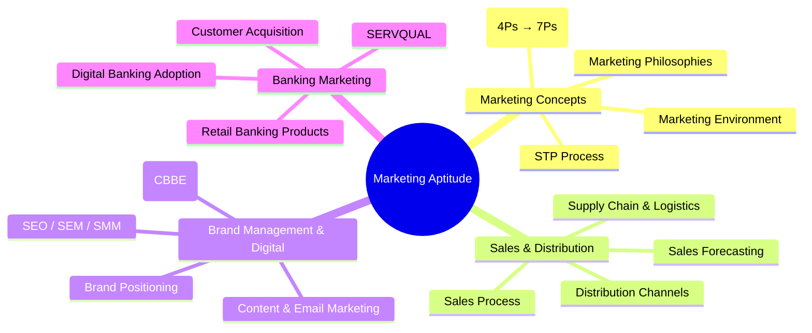

# Marketing Aptitude — Complete Course

> A comprehensive guide to marketing concepts, sales & distribution, brand management, digital marketing, and banking marketing for competitive exams (IBPS SO, SBI PO, RBI Grade B, NABARD).

## Chapters

| #  | Chapter | Topics |
|----|---------|--------|
| 01 | Marketing Concepts | Definitions, 4Ps→7Ps, microenvironment/macroenvironment, STP process, marketing philosophies |
| 02 | Sales & Distribution | Sales process, forecasting, quotas, distribution channels, supply chain, D2C models |
| 03 | Brand Management & Digital | Brand equity (CBBE), positioning, SEO/SEM, social media, content marketing, CRM |
| 04 | Banking Marketing | Retail banking products, customer lifecycle, SERVQUAL, cross-selling, digital banking, RBI guidelines |

## Exam Weightage

| Exam | Expected Questions | Difficulty |
|------|-------------------|------------|
| IBPS SO (Marketing Officer) | 15–20 | Moderate |
| SBI PO (Mains) | 8–10 | Moderate |
| RBI Grade B (Phase 2) | 5–8 | Difficult |
| NABARD Grade A | 8–10 | Moderate |

## How to Use This Course

1. Read each chapter sequentially — concepts build upon previous chapters
2. Attempt the **20 solved MCQs** in Examples after finishing Theory
3. Take the **5-question Chapter Quiz** to self-assess
4. Solve the **30 Exercises** at the end for thorough revision
5. Run the **TypeScript code** in a Node.js environment to see marketing calculations in action

> **Total: 4 chapters** covering the complete Marketing Aptitude syllabus.
