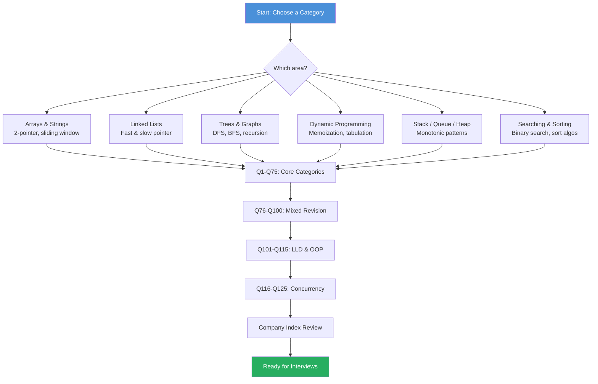

# DSA Coding Problem Bank for Placement Interviews

> **Previous:** [Chapter 1: Resume Building, LinkedIn & Aptitude](./01-resume-aptitude.md) | **Next:** [Chapter 3: SQL Problem Bank](./03-sql-problem-bank.md)

> **125 curated problems** — Arrays, Strings, Linked Lists, Trees, Dynamic Programming, Graphs, Stack/Queue/Heap, Searching & Sorting, Miscellaneous, Low-Level Design & OOP (Q101-Q115), and Concurrency & Multithreading (Q116-Q125). Every solution includes a complete, compilable Java class with main method, complexity analysis, and company tags.

---


<!-- Image Gallery -->
<section class="lesson-visuals" aria-label="Visual learning resources">
  <header><span>VISUAL LEARNING</span><h2>See it. Review it. Remember it.</h2></header>
  <a class="lesson-visual-card" href="../../assets/images/lessons/placement-preparation/02-dsa-problem-bank/handwritten-notes.png" target="_blank" rel="noopener">
    
    <span><strong>Handwritten notes</strong>Condensed notes for deliberate review.</span>
  </a>
  <a class="lesson-visual-card" href="../../assets/images/lessons/placement-preparation/02-dsa-problem-bank/sticky-notes.png" target="_blank" rel="noopener">
    
    <span><strong>Sticky-note revision</strong>Fast recall prompts for revision.</span>
  </a>
  <a class="lesson-visual-card" href="../../assets/images/lessons/placement-preparation/02-dsa-problem-bank/visual-explanation.png" target="_blank" rel="noopener">
    
    <span><strong>Visual concept guide</strong>A connected explanation of the key ideas.</span>
  </a>
</section>
<!-- End Image Gallery -->

## Chapter at a Glance

| Topic | Key Insight | Practical Takeaway |
|-------|-------------|-------------------|
| **Arrays** | Hash maps optimize O(n²) to O(n) lookups | Master two-pointer, sliding window, prefix sum patterns |
| **Strings** | Character frequency counting via arrays is faster than HashMap | Use 26/128-sized int arrays for ASCII problems |
| **Linked Lists** | Fast & slow pointer detects cycles and finds middle | Dummy nodes simplify edge cases in insertion/deletion |
| **Trees** | Recursion mirrors tree structure naturally | Practice iterative traversals (stack-based) for interviews |
| **Dynamic Programming** | Optimal substructure + overlapping subproblems | Start with greedy, then brute force, then memoized DP |
| **Graphs** | BFS gives shortest path in unweighted graphs | Topological sort and union-find are common blind spots |
| **Stack / Queue / Heap** | Monotonic stack solves next-greater-element patterns | Heaps give O(log n) min/max retrieval under insertion |
| **Searching & Sorting** | Sorting enables binary search and two-pointer patterns | Know quicksort, mergesort, and counting sort by heart |
| **Low-Level Design** | OOP principles + design patterns for real-world modeling | Focus on Strategy, Observer, Singleton, Factory, Composite |
| **Concurrency** | Thread coordination via wait/notify and semaphores | Practice producer-consumer, reader-writers, dining philosophers |

## Chapter Roadmap



## Arrays

### Q1: Two Sum


**Problem:** Given an array of integers `nums` and an integer `target`, return indices of the two numbers that add up to `target`. You may assume exactly one solution, and you may not use the same element twice.

**Difficulty:** Easy

**Companies:** Amazon · Google · Microsoft · Apple · Meta · Bloomberg · Uber

```java
import java.util.HashMap;
import java.util.Map;

public class TwoSum {
    public int[] twoSum(int[] nums, int target) {
        Map<Integer, Integer> map = new HashMap<>();
        for (int i = 0; i < nums.length; i++) {
            int complement = target - nums[i];
            if (map.containsKey(complement)) {
                return new int[]{map.get(complement), i};
            }
            map.put(nums[i], i);
        }
        return new int[]{-1, -1};
    }

    public static void main(String[] args) {
        TwoSum solver = new TwoSum();
        int[] nums = {2, 7, 11, 15};
        int target = 9;
        int[] result = solver.twoSum(nums, target);
        System.out.println("Indices: [" + result[0] + "," + result[1] + "]");
    }
}
```

- **Time:** O(n) → single pass with hashmap
- **Space:** O(n) → map stores up to n elements

---

> **Pro Tip:** Always ask about input constraints (sorted? duplicates? negative?) before coding — interviewers evaluate your clarifying questions as much as your solution.

### Q2: Best Time to Buy and Sell Stock


**Problem:** You are given an array `prices` where `prices[i]` is the price of a given stock on day `i`. You want to maximize profit by choosing a single day to buy and a different day in the future to sell. Return the maximum profit. If no profit possible, return 0.

**Difficulty:** Easy

**Companies:** Amazon · Microsoft · Meta · Bloomberg · Google · Goldman Sachs · Uber · JP Morgan

```java
public class BestTimeToBuyAndSellStock {
    public int maxProfit(int[] prices) {
        int minPrice = Integer.MAX_VALUE;
        int maxProfit = 0;
        for (int price : prices) {
            if (price < minPrice) {
                minPrice = price;
            } else if (price - minPrice > maxProfit) {
                maxProfit = price - minPrice;
            }
        }
        return maxProfit;
    }

    public static void main(String[] args) {
        BestTimeToBuyAndSellStock solver = new BestTimeToBuyAndSellStock();
        int[] prices = {7, 1, 5, 3, 6, 4};
        System.out.println("Max profit: " + solver.maxProfit(prices));
    }
}
```

- **Time:** O(n) → single pass
- **Space:** O(1)

---

### Q3: Product of Array Except Self


**Problem:** Given an integer array `nums`, return an array `answer` such that `answer[i]` is equal to the product of all elements of `nums` except `nums[i]`. You must solve it **without division** in O(n) time.

**Difficulty:** Medium

**Companies:** Amazon · Meta · Microsoft · Apple · Uber · Google · Adobe

```java
import java.util.Arrays;

public class ProductOfArrayExceptSelf {
    public int[] productExceptSelf(int[] nums) {
        int n = nums.length;
        int[] answer = new int[n];
        answer[0] = 1;
        for (int i = 1; i < n; i++) {
            answer[i] = answer[i - 1] * nums[i - 1];
        }
        int rightProduct = 1;
        for (int i = n - 1; i >= 0; i--) {
            answer[i] *= rightProduct;
            rightProduct *= nums[i];
        }
        return answer;
    }

    public static void main(String[] args) {
        ProductOfArrayExceptSelf solver = new ProductOfArrayExceptSelf();
        int[] nums = {1, 2, 3, 4};
        int[] result = solver.productExceptSelf(nums);
        System.out.println("Result: " + Arrays.toString(result));
    }
}
```

- **Time:** O(n)
- **Space:** O(1) excluding output array

---

### Q4: Maximum Subarray (Kadane's Algorithm)


**Problem:** Given an integer array `nums`, find the contiguous subarray (containing at least one number) with the largest sum and return its sum.

**Difficulty:** Medium

**Companies:** Amazon · Microsoft · Google · LinkedIn · Apple · Meta · Bloomberg

```java
public class MaximumSubarray {
    public int maxSubArray(int[] nums) {
        int currentSum = nums[0];
        int maxSum = nums[0];
        for (int i = 1; i < nums.length; i++) {
            currentSum = Math.max(nums[i], currentSum + nums[i]);
            maxSum = Math.max(maxSum, currentSum);
        }
        return maxSum;
    }

    public static void main(String[] args) {
        MaximumSubarray solver = new MaximumSubarray();
        int[] nums = {-2, 1, -3, 4, -1, 2, 1, -5, 4};
        System.out.println("Maximum subarray sum: " + solver.maxSubArray(nums));
    }
}
```

- **Time:** O(n)
- **Space:** O(1)

---

### Q5: Find Minimum in Rotated Sorted Array


**Problem:** Suppose an array of length `n` sorted in ascending order is rotated between 1 and `n` times. Find the minimum element in O(log n) time.

**Difficulty:** Medium

**Companies:** Microsoft · Amazon · Google · Uber · Bloomberg · Meta · Oracle

```java
public class FindMinimumInRotatedSortedArray {
    public int findMin(int[] nums) {
        int left = 0, right = nums.length - 1;
        while (left < right) {
            int mid = left + (right - left) / 2;
            if (nums[mid] > nums[right]) {
                left = mid + 1;
            } else {
                right = mid;
            }
        }
        return nums[left];
    }

    public static void main(String[] args) {
        FindMinimumInRotatedSortedArray solver = new FindMinimumInRotatedSortedArray();
        int[] nums = {3, 4, 5, 1, 2};
        System.out.println("Minimum: " + solver.findMin(nums));
    }
}
```

- **Time:** O(log n) → binary search
- **Space:** O(1)

---

### Q6: Container With Most Water


**Problem:** Given an integer array `height` of length `n`, find two lines that together with the x-axis form a container that holds the most water. Return the maximum amount of water.

**Difficulty:** Medium

**Companies:** Amazon · Google · Meta · Apple · Adobe · Microsoft · Bloomberg

```java
public class ContainerWithMostWater {
    public int maxArea(int[] height) {
        int left = 0, right = height.length - 1;
        int maxArea = 0;
        while (left < right) {
            int area = Math.min(height[left], height[right]) * (right - left);
            maxArea = Math.max(maxArea, area);
            if (height[left] < height[right]) {
                left++;
            } else {
                right--;
            }
        }
        return maxArea;
    }

    public static void main(String[] args) {
        ContainerWithMostWater solver = new ContainerWithMostWater();
        int[] height = {1, 8, 6, 2, 5, 4, 8, 3, 7};
        System.out.println("Max area: " + solver.maxArea(height));
    }
}
```

- **Time:** O(n) → two-pointer sweep
- **Space:** O(1)

---

### Q7: 3Sum


**Problem:** Given an integer array `nums`, return all triplets `[nums[i], nums[j], nums[k]]` such that `i != j`, `i != k`, `j != k`, and `nums[i] + nums[j] + nums[k] == 0`. No duplicate triplets.

**Difficulty:** Medium

**Companies:** Amazon · Meta · Microsoft · Google · Apple · Bloomberg · Netflix

```java
import java.util.*;

public class ThreeSum {
    public List<List<Integer>> threeSum(int[] nums) {
        Arrays.sort(nums);
        List<List<Integer>> result = new ArrayList<>();
        for (int i = 0; i < nums.length - 2; i++) {
            if (i > 0 && nums[i] == nums[i - 1]) continue;
            int left = i + 1, right = nums.length - 1;
            while (left < right) {
                int sum = nums[i] + nums[left] + nums[right];
                if (sum == 0) {
                    result.add(Arrays.asList(nums[i], nums[left], nums[right]));
                    while (left < right && nums[left] == nums[left + 1]) left++;
                    while (left < right && nums[right] == nums[right - 1]) right--;
                    left++; right--;
                } else if (sum < 0) {
                    left++;
                } else {
                    right--;
                }
            }
        }
        return result;
    }

    public static void main(String[] args) {
        ThreeSum solver = new ThreeSum();
        int[] nums = {-1, 0, 1, 2, -1, -4};
        List<List<Integer>> result = solver.threeSum(nums);
        System.out.println("Triplets: " + result);
    }
}
```

- **Time:** O(n²)
- **Space:** O(1) excluding output

---

### Q8: Merge Intervals


**Problem:** Given an array of intervals where `intervals[i] = [startᵢ, endᵢ]`, merge all overlapping intervals and return an array of non-overlapping intervals covering all input intervals.

**Difficulty:** Medium

**Companies:** Amazon · Google · Microsoft · Bloomberg · Uber · Meta · Cisco

```java
import java.util.*;

public class MergeIntervals {
    public int[][] merge(int[][] intervals) {
        if (intervals.length == 0) return new int[0][];
        Arrays.sort(intervals, (a, b) -> a[0] - b[0]);
        List<int[]> merged = new ArrayList<>();
        int[] current = intervals[0];
        merged.add(current);
        for (int[] interval : intervals) {
            if (interval[0] <= current[1]) {
                current[1] = Math.max(current[1], interval[1]);
            } else {
                current = interval;
                merged.add(current);
            }
        }
        return merged.toArray(new int[merged.size()][]);
    }

    public static void main(String[] args) {
        MergeIntervals solver = new MergeIntervals();
        int[][] intervals = {{1, 3}, {2, 6}, {8, 10}, {15, 18}};
        int[][] result = solver.merge(intervals);
        System.out.println("Merged: " + Arrays.deepToString(result));
    }
}
```

- **Time:** O(n log n) → dominated by sorting
- **Space:** O(n) for output

---

### Q9: Next Permutation


**Problem:** Implement next permutation, which rearranges numbers into the lexicographically next greater permutation. If no such arrangement exists, rearrange into the lowest possible order (sorted ascending).

**Difficulty:** Medium

**Companies:** Amazon · Google · Microsoft · Meta · Bloomberg · Apple · Goldman Sachs

```java
import java.util.Arrays;

public class NextPermutation {
    public void nextPermutation(int[] nums) {
        int i = nums.length - 2;
        while (i >= 0 && nums[i] >= nums[i + 1]) i--;
        if (i >= 0) {
            int j = nums.length - 1;
            while (nums[j] <= nums[i]) j--;
            swap(nums, i, j);
        }
        reverse(nums, i + 1, nums.length - 1);
    }

    private void swap(int[] nums, int i, int j) {
        int temp = nums[i];
        nums[i] = nums[j];
        nums[j] = temp;
    }

    private void reverse(int[] nums, int start, int end) {
        while (start < end) {
            swap(nums, start++, end--);
        }
    }

    public static void main(String[] args) {
        NextPermutation solver = new NextPermutation();
        int[] nums = {1, 2, 3};
        solver.nextPermutation(nums);
        System.out.println("Next permutation: " + Arrays.toString(nums));
    }
}
```

- **Time:** O(n)
- **Space:** O(1)

---

### Q10: Sort Colors (Dutch National Flag)


**Problem:** Given an array `nums` with `n` objects colored red (0), white (1), or blue (2), sort them **in-place** so that same colors are adjacent. Do it in one pass with constant space.

**Difficulty:** Medium

**Companies:** Amazon · Microsoft · Google · Meta · Apple · Adobe · Walmart

```java
import java.util.Arrays;

public class SortColors {
    public void sortColors(int[] nums) {
        int low = 0, mid = 0, high = nums.length - 1;
        while (mid <= high) {
            if (nums[mid] == 0) {
                swap(nums, low++, mid++);
            } else if (nums[mid] == 1) {
                mid++;
            } else {
                swap(nums, mid, high--);
            }
        }
    }

    private void swap(int[] nums, int i, int j) {
        int temp = nums[i];
        nums[i] = nums[j];
        nums[j] = temp;
    }

    public static void main(String[] args) {
        SortColors solver = new SortColors();
        int[] nums = {2, 0, 2, 1, 1, 0};
        solver.sortColors(nums);
        System.out.println("Sorted: " + Arrays.toString(nums));
    }
}
```

- **Time:** O(n) → one pass
- **Space:** O(1)

---

### Q11: Subarray Sum Equals K


**Problem:** Given an array of integers `nums` and an integer `k`, return the total number of contiguous subarrays whose sum equals `k`.

**Difficulty:** Medium

**Companies:** Amazon · Google · Meta · Microsoft · Apple · Bloomberg · Netflix

```java
import java.util.HashMap;
import java.util.Map;

public class SubarraySumEqualsK {
    public int subarraySum(int[] nums, int k) {
        Map<Integer, Integer> prefixSumMap = new HashMap<>();
        prefixSumMap.put(0, 1);
        int sum = 0, count = 0;
        for (int num : nums) {
            sum += num;
            if (prefixSumMap.containsKey(sum - k)) {
                count += prefixSumMap.get(sum - k);
            }
            prefixSumMap.put(sum, prefixSumMap.getOrDefault(sum, 0) + 1);
        }
        return count;
    }

    public static void main(String[] args) {
        SubarraySumEqualsK solver = new SubarraySumEqualsK();
        int[] nums = {1, 1, 1};
        int k = 2;
        System.out.println("Count: " + solver.subarraySum(nums, k));
    }
}
```

- **Time:** O(n)
- **Space:** O(n)

---

### Q12: First Missing Positive


**Problem:** Given an unsorted integer array `nums`, return the smallest positive integer that does not appear in it. Must run in O(n) time and O(1) space.

**Difficulty:** Hard

**Companies:** Amazon · Google · Microsoft · Apple · Meta · Adobe · Oracle

```java
public class FirstMissingPositive {
    public int firstMissingPositive(int[] nums) {
        int n = nums.length;
        for (int i = 0; i < n; i++) {
            while (nums[i] > 0 && nums[i] <= n && nums[nums[i] - 1] != nums[i]) {
                int temp = nums[nums[i] - 1];
                nums[nums[i] - 1] = nums[i];
                nums[i] = temp;
            }
        }
        for (int i = 0; i < n; i++) {
            if (nums[i] != i + 1) return i + 1;
        }
        return n + 1;
    }

    public static void main(String[] args) {
        FirstMissingPositive solver = new FirstMissingPositive();
        int[] nums = {3, 4, -1, 1};
        System.out.println("First missing positive: " + solver.firstMissingPositive(nums));
    }
}
```

- **Time:** O(n)
- **Space:** O(1)

---

## Strings

### Q13: Longest Substring Without Repeating Characters


**Problem:** Given a string `s`, find the length of the longest substring without repeating characters.

**Difficulty:** Medium

**Companies:** Amazon · Google · Microsoft · Meta · Apple · Bloomberg · Intel

```java
import java.util.HashMap;
import java.util.Map;

public class LongestSubstringWithoutRepeating {
    public int lengthOfLongestSubstring(String s) {
        Map<Character, Integer> map = new HashMap<>();
        int left = 0, maxLen = 0;
        for (int right = 0; right < s.length(); right++) {
            char c = s.charAt(right);
            if (map.containsKey(c) && map.get(c) >= left) {
                left = map.get(c) + 1;
            }
            map.put(c, right);
            maxLen = Math.max(maxLen, right - left + 1);
        }
        return maxLen;
    }

    public static void main(String[] args) {
        LongestSubstringWithoutRepeating solver = new LongestSubstringWithoutRepeating();
        String s = "abcabcbb";
        System.out.println("Longest substring length: " + solver.lengthOfLongestSubstring(s));
    }
}
```

- **Time:** O(n)
- **Space:** O(min(m, n)) → m = charset size

---

### Q14: Valid Anagram


**Problem:** Given two strings `s` and `t`, return `true` if `t` is an anagram of `s`, and `false` otherwise.

**Difficulty:** Easy

**Companies:** Amazon · Google · Microsoft · Meta · Apple · Bloomberg · Nvidia

```java
import java.util.Arrays;

public class ValidAnagram {
    public boolean isAnagram(String s, String t) {
        if (s.length() != t.length()) return false;
        int[] freq = new int[26];
        for (int i = 0; i < s.length(); i++) {
            freq[s.charAt(i) - 'a']++;
            freq[t.charAt(i) - 'a']--;
        }
        for (int count : freq) {
            if (count != 0) return false;
        }
        return true;
    }

    public static void main(String[] args) {
        ValidAnagram solver = new ValidAnagram();
        System.out.println("anagram vs nagaram: " + solver.isAnagram("anagram", "nagaram"));
        System.out.println("rat vs car: " + solver.isAnagram("rat", "car"));
    }
}
```

- **Time:** O(n)
- **Space:** O(1) → fixed 26-size array

---

### Q15: Longest Palindromic Substring


**Problem:** Given a string `s`, return the longest palindromic substring in `s`.

**Difficulty:** Medium

**Companies:** Amazon · Google · Microsoft · Meta · Apple · Bloomberg · PayPal

```java
public class LongestPalindromicSubstring {
    private int start = 0, maxLen = 0;

    public String longestPalindrome(String s) {
        if (s == null || s.length() < 2) return s;
        for (int i = 0; i < s.length(); i++) {
            expand(s, i, i);
            expand(s, i, i + 1);
        }
        return s.substring(start, start + maxLen);
    }

    private void expand(String s, int left, int right) {
        while (left >= 0 && right < s.length() && s.charAt(left) == s.charAt(right)) {
            left--;
            right++;
        }
        int len = right - left - 1;
        if (len > maxLen) {
            maxLen = len;
            start = left + 1;
        }
    }

    public static void main(String[] args) {
        LongestPalindromicSubstring solver = new LongestPalindromicSubstring();
        String s = "babad";
        System.out.println("Longest palindrome: " + solver.longestPalindrome(s));
    }
}
```

- **Time:** O(n²) → expands from each center
- **Space:** O(1)

---

### Q16: Group Anagrams


**Problem:** Given an array of strings `strs`, group the anagrams together. You can return the answer in any order.

**Difficulty:** Medium

**Companies:** Amazon · Google · Microsoft · Meta · Bloomberg · Apple · Cisco

```java
import java.util.*;

public class GroupAnagrams {
    public List<List<String>> groupAnagrams(String[] strs) {
        Map<String, List<String>> map = new HashMap<>();
        for (String s : strs) {
            char[] arr = s.toCharArray();
            Arrays.sort(arr);
            String key = new String(arr);
            map.computeIfAbsent(key, k -> new ArrayList<>()).add(s);
        }
        return new ArrayList<>(map.values());
    }

    public static void main(String[] args) {
        GroupAnagrams solver = new GroupAnagrams();
        String[] strs = {"eat", "tea", "tan", "ate", "nat", "bat"};
        List<List<String>> result = solver.groupAnagrams(strs);
        System.out.println("Groups: " + result);
    }
}
```

- **Time:** O(n · k log k) → n = words, k = avg word length
- **Space:** O(n · k)

---

### Q17: Valid Parentheses


**Problem:** Given a string `s` containing just the characters `(`, `)`, `{`, `}`, `[`, `]`, determine if the input string is valid. Open brackets must be closed by the same type in the correct order.

**Difficulty:** Easy

**Companies:** Amazon · Google · Microsoft · Meta · LinkedIn · Apple · Salesforce

```java
import java.util.ArrayDeque;
import java.util.Deque;
import java.util.Map;

public class ValidParentheses {
    public boolean isValid(String s) {
        Deque<Character> stack = new ArrayDeque<>();
        Map<Character, Character> map = Map.of(')', '(', '}', '{', ']', '[');
        for (char c : s.toCharArray()) {
            if (map.containsKey(c)) {
                if (stack.isEmpty() || stack.pop() != map.get(c)) return false;
            } else {
                stack.push(c);
            }
        }
        return stack.isEmpty();
    }

    public static void main(String[] args) {
        ValidParentheses solver = new ValidParentheses();
        System.out.println("()[]{}: " + solver.isValid("()[]{}"));
        System.out.println("([)]: " + solver.isValid("([)]"));
    }
}
```

- **Time:** O(n)
- **Space:** O(n)

---

### Q18: Count and Say


**Problem:** The count-and-say sequence is a sequence of digit strings defined by: `countAndSay(1) = "1"`. For n > 1, `countAndSay(n)` is the run-length encoding of `countAndSay(n-1)`. Return the nth term.

**Difficulty:** Medium

**Companies:** Amazon · Meta · Microsoft · Apple · Google · Bloomberg · Goldman Sachs · JP Morgan

```java
public class CountAndSay {
    public String countAndSay(int n) {
        String result = "1";
        for (int i = 2; i <= n; i++) {
            StringBuilder sb = new StringBuilder();
            int count = 1;
            for (int j = 1; j < result.length(); j++) {
                if (result.charAt(j) == result.charAt(j - 1)) {
                    count++;
                } else {
                    sb.append(count).append(result.charAt(j - 1));
                    count = 1;
                }
            }
            sb.append(count).append(result.charAt(result.length() - 1));
            result = sb.toString();
        }
        return result;
    }

    public static void main(String[] args) {
        CountAndSay solver = new CountAndSay();
        for (int i = 1; i <= 5; i++) {
            System.out.println("n=" + i + ": " + solver.countAndSay(i));
        }
    }
}
```

- **Time:** O(2ⁿ) → length grows exponentially
- **Space:** O(2ⁿ)

---

### Q19: Implement strStr() / IndexOf


**Problem:** Given two strings `haystack` and `needle`, return the index of the first occurrence of `needle` in `haystack`, or -1 if not found.

**Difficulty:** Easy

**Companies:** Amazon · Microsoft · Apple · Meta · Google · Bloomberg · Salesforce

```java
public class ImplementStrStr {
    public int strStr(String haystack, String needle) {
        if (needle.isEmpty()) return 0;
        int n = haystack.length(), m = needle.length();
        for (int i = 0; i <= n - m; i++) {
            int j = 0;
            while (j < m && haystack.charAt(i + j) == needle.charAt(j)) {
                j++;
            }
            if (j == m) return i;
        }
        return -1;
    }

    public static void main(String[] args) {
        ImplementStrStr solver = new ImplementStrStr();
        System.out.println("Index of 'll' in 'hello': " + solver.strStr("hello", "ll"));
        System.out.println("Index of 'bba' in 'aaaa': " + solver.strStr("aaaa", "bba"));
    }
}
```

- **Time:** O(n·m) worst-case; average O(n + m)
- **Space:** O(1)

---

### Q20: String to Integer (atoi)


**Problem:** Implement `myAtoi(string s)` which converts a string to a 32-bit signed integer. Skip leading whitespace, handle +/- sign, read digits, clamp to [−2³¹, 2³¹−1].

**Difficulty:** Medium

**Companies:** Amazon · Microsoft · Meta · Apple · Google · Bloomberg · IBM

```java
public class StringToInteger {
    public int myAtoi(String s) {
        int i = 0, sign = 1, total = 0;
        if (s.length() == 0) return 0;
        while (i < s.length() && s.charAt(i) == ' ') i++;
        if (i < s.length() && (s.charAt(i) == '+' || s.charAt(i) == '-')) {
            sign = (s.charAt(i) == '-') ? -1 : 1;
            i++;
        }
        while (i < s.length() && Character.isDigit(s.charAt(i))) {
            int digit = s.charAt(i) - '0';
            if (total > (Integer.MAX_VALUE - digit) / 10) {
                return sign == 1 ? Integer.MAX_VALUE : Integer.MIN_VALUE;
            }
            total = total * 10 + digit;
            i++;
        }
        return total * sign;
    }

    public static void main(String[] args) {
        StringToInteger solver = new StringToInteger();
        System.out.println("'42' -> " + solver.myAtoi("42"));
        System.out.println("'   -42' -> " + solver.myAtoi("   -42"));
        System.out.println("'4193 with words' -> " + solver.myAtoi("4193 with words"));
    }
}
```

- **Time:** O(n)
- **Space:** O(1)

---

## Linked Lists

### Q21: Reverse a Linked List


**Problem:** Given the head of a singly linked list, reverse the list and return the new head.

**Difficulty:** Easy

**Companies:** Amazon · Google · Microsoft · Meta · Apple · Bloomberg · Nvidia

```java
public class ReverseLinkedList {
    static class ListNode {
        int val;
        ListNode next;
        ListNode(int val) { this.val = val; }
    }

    public ListNode reverseList(ListNode head) {
        ListNode prev = null, current = head;
        while (current != null) {
            ListNode nextTemp = current.next;
            current.next = prev;
            prev = current;
            current = nextTemp;
        }
        return prev;
    }

    public static void main(String[] args) {
        ListNode head = new ListNode(1);
        head.next = new ListNode(2);
        head.next.next = new ListNode(3);
        head.next.next.next = new ListNode(4);
        head.next.next.next.next = new ListNode(5);
        ReverseLinkedList solver = new ReverseLinkedList();
        ListNode reversed = solver.reverseList(head);
        System.out.print("Reversed: ");
        while (reversed != null) {
            System.out.print(reversed.val + " ");
            reversed = reversed.next;
        }
        System.out.println();
    }
}
```

- **Time:** O(n)
- **Space:** O(1)

---

### Q22: Detect Cycle in Linked List


**Problem:** Given `head` of a linked list, determine if it has a cycle. A cycle occurs when a node's `next` pointer connects back to an earlier node.

**Difficulty:** Easy

**Companies:** Amazon · Google · Microsoft · Meta · Apple · Bloomberg · Oracle

```java
public class LinkedListCycle {
    static class ListNode {
        int val;
        ListNode next;
        ListNode(int val) { this.val = val; }
    }

    public boolean hasCycle(ListNode head) {
        ListNode slow = head, fast = head;
        while (fast != null && fast.next != null) {
            slow = slow.next;
            fast = fast.next.next;
            if (slow == fast) return true;
        }
        return false;
    }

    public static void main(String[] args) {
        ListNode head = new ListNode(3);
        head.next = new ListNode(2);
        head.next.next = new ListNode(0);
        head.next.next.next = new ListNode(-4);
        head.next.next.next.next = head.next;
        LinkedListCycle solver = new LinkedListCycle();
        System.out.println("Has cycle: " + solver.hasCycle(head));
    }
}
```

- **Time:** O(n)
- **Space:** O(1)

---

### Q23: Merge Two Sorted Lists


**Problem:** Merge two sorted linked lists into one sorted list. The new list should be made by splicing together the nodes of the first two lists.

**Difficulty:** Easy

**Companies:** Amazon · Google · Microsoft · Meta · Apple · PayPal · Adobe

```java
public class MergeTwoSortedLists {
    static class ListNode {
        int val;
        ListNode next;
        ListNode(int val) { this.val = val; }
    }

    public ListNode mergeTwoLists(ListNode list1, ListNode list2) {
        ListNode dummy = new ListNode(0);
        ListNode current = dummy;
        while (list1 != null && list2 != null) {
            if (list1.val <= list2.val) {
                current.next = list1;
                list1 = list1.next;
            } else {
                current.next = list2;
                list2 = list2.next;
            }
            current = current.next;
        }
        current.next = (list1 != null) ? list1 : list2;
        return dummy.next;
    }

    public static void main(String[] args) {
        ListNode l1 = new ListNode(1);
        l1.next = new ListNode(2); l1.next.next = new ListNode(4);
        ListNode l2 = new ListNode(1);
        l2.next = new ListNode(3); l2.next.next = new ListNode(4);
        MergeTwoSortedLists solver = new MergeTwoSortedLists();
        ListNode merged = solver.mergeTwoLists(l1, l2);
        System.out.print("Merged: ");
        while (merged != null) {
            System.out.print(merged.val + " ");
            merged = merged.next;
        }
        System.out.println();
    }
}
```

- **Time:** O(n + m)
- **Space:** O(1)

---

### Q24: Remove Nth Node From End


**Problem:** Given the head of a linked list, remove the nth node from the end and return the head.

**Difficulty:** Medium

**Companies:** Amazon · Google · Microsoft · Meta · Apple · Bloomberg · Intel

```java
public class RemoveNthFromEnd {
    static class ListNode {
        int val;
        ListNode next;
        ListNode(int val) { this.val = val; }
    }

    public ListNode removeNthFromEnd(ListNode head, int n) {
        ListNode dummy = new ListNode(0);
        dummy.next = head;
        ListNode first = dummy, second = dummy;
        for (int i = 0; i <= n; i++) first = first.next;
        while (first != null) {
            first = first.next;
            second = second.next;
        }
        second.next = second.next.next;
        return dummy.next;
    }

    public static void main(String[] args) {
        ListNode head = new ListNode(1);
        head.next = new ListNode(2);
        head.next.next = new ListNode(3);
        head.next.next.next = new ListNode(4);
        head.next.next.next.next = new ListNode(5);
        RemoveNthFromEnd solver = new RemoveNthFromEnd();
        ListNode result = solver.removeNthFromEnd(head, 2);
        System.out.print("After removal: ");
        while (result != null) {
            System.out.print(result.val + " ");
            result = result.next;
        }
        System.out.println();
    }
}
```

- **Time:** O(n)
- **Space:** O(1)

---

### Q25: Find Middle of Linked List


**Problem:** Given the head of a singly linked list, return the middle node. If there are two middle nodes, return the second one.

**Difficulty:** Easy

**Companies:** Amazon · Google · Microsoft · Apple · Meta · Cisco · Adobe

```java
public class MiddleOfLinkedList {
    static class ListNode {
        int val;
        ListNode next;
        ListNode(int val) { this.val = val; }
    }

    public ListNode middleNode(ListNode head) {
        ListNode slow = head, fast = head;
        while (fast != null && fast.next != null) {
            slow = slow.next;
            fast = fast.next.next;
        }
        return slow;
    }

    public static void main(String[] args) {
        ListNode head = new ListNode(1);
        head.next = new ListNode(2);
        head.next.next = new ListNode(3);
        head.next.next.next = new ListNode(4);
        head.next.next.next.next = new ListNode(5);
        MiddleOfLinkedList solver = new MiddleOfLinkedList();
        ListNode middle = solver.middleNode(head);
        System.out.println("Middle node value: " + middle.val);
    }
}
```

- **Time:** O(n)
- **Space:** O(1)

---

### Q26: Add Two Numbers


**Problem:** You are given two non-empty linked lists representing two non-negative integers. The digits are stored in **reverse order**. Add the two numbers and return the sum as a linked list.

**Difficulty:** Medium

**Companies:** Amazon · Google · Microsoft · Meta · Apple · Bloomberg · Uber

```java
public class AddTwoNumbers {
    static class ListNode {
        int val;
        ListNode next;
        ListNode(int val) { this.val = val; }
    }

    public ListNode addTwoNumbers(ListNode l1, ListNode l2) {
        ListNode dummy = new ListNode(0);
        ListNode current = dummy;
        int carry = 0;
        while (l1 != null || l2 != null || carry != 0) {
            int sum = carry;
            if (l1 != null) { sum += l1.val; l1 = l1.next; }
            if (l2 != null) { sum += l2.val; l2 = l2.next; }
            carry = sum / 10;
            current.next = new ListNode(sum % 10);
            current = current.next;
        }
        return dummy.next;
    }

    public static void main(String[] args) {
        ListNode l1 = new ListNode(2);
        l1.next = new ListNode(4); l1.next.next = new ListNode(3);
        ListNode l2 = new ListNode(5);
        l2.next = new ListNode(6); l2.next.next = new ListNode(4);
        AddTwoNumbers solver = new AddTwoNumbers();
        ListNode result = solver.addTwoNumbers(l1, l2);
        System.out.print("Sum: ");
        while (result != null) {
            System.out.print(result.val + " ");
            result = result.next;
        }
        System.out.println();
    }
}
```

- **Time:** O(max(m, n))
- **Space:** O(max(m, n))

---

### Q27: Intersection of Two Linked Lists


**Problem:** Given the heads of two singly linked lists, return the node at which they intersect. If no intersection, return null.

**Difficulty:** Easy

**Companies:** Amazon · Google · Microsoft · Meta · Apple · Walmart · Adobe

```java
public class IntersectionOfTwoLinkedLists {
    static class ListNode {
        int val;
        ListNode next;
        ListNode(int val) { this.val = val; }
    }

    public ListNode getIntersectionNode(ListNode headA, ListNode headB) {
        if (headA == null || headB == null) return null;
        ListNode a = headA, b = headB;
        while (a != b) {
            a = (a == null) ? headB : a.next;
            b = (b == null) ? headA : b.next;
        }
        return a;
    }

    public static void main(String[] args) {
        ListNode common = new ListNode(8);
        common.next = new ListNode(4); common.next.next = new ListNode(5);
        ListNode headA = new ListNode(4);
        headA.next = new ListNode(1); headA.next.next = common;
        ListNode headB = new ListNode(5);
        headB.next = new ListNode(6); headB.next.next = new ListNode(1); headB.next.next.next = common;
        IntersectionOfTwoLinkedLists solver = new IntersectionOfTwoLinkedLists();
        ListNode intersect = solver.getIntersectionNode(headA, headB);
        System.out.println("Intersection node value: " + (intersect != null ? intersect.val : "null"));
    }
}
```

- **Time:** O(n + m)
- **Space:** O(1)

---

### Q28: LRU Cache


**Problem:** Design a data structure that follows the Least Recently Used (LRU) cache constraints. Implement `LRUCache` with O(1) `get` and `put`.

**Difficulty:** Medium

**Companies:** Amazon · Google · Microsoft · Meta · Apple · Netflix · PayPal

```java
import java.util.HashMap;
import java.util.Map;

public class LRUCache {
    static class Node {
        int key, value;
        Node prev, next;
        Node(int key, int value) { this.key = key; this.value = value; }
    }

    private final int capacity;
    private final Map<Integer, Node> map = new HashMap<>();
    private final Node head = new Node(0, 0);
    private final Node tail = new Node(0, 0);

    public LRUCache(int capacity) {
        this.capacity = capacity;
        head.next = tail;
        tail.prev = head;
    }

    public int get(int key) {
        Node node = map.get(key);
        if (node == null) return -1;
        moveToHead(node);
        return node.value;
    }

    public void put(int key, int value) {
        Node node = map.get(key);
        if (node != null) {
            node.value = value;
            moveToHead(node);
            return;
        }
        if (map.size() == capacity) {
            Node lru = tail.prev;
            removeNode(lru);
            map.remove(lru.key);
        }
        Node newNode = new Node(key, value);
        map.put(key, newNode);
        addToHead(newNode);
    }

    private void addToHead(Node node) {
        node.next = head.next;
        node.prev = head;
        head.next.prev = node;
        head.next = node;
    }

    private void removeNode(Node node) {
        node.prev.next = node.next;
        node.next.prev = node.prev;
    }

    private void moveToHead(Node node) {
        removeNode(node);
        addToHead(node);
    }

    public static void main(String[] args) {
        LRUCache cache = new LRUCache(2);
        cache.put(1, 1);
        cache.put(2, 2);
        System.out.println("get(1) = " + cache.get(1));
        cache.put(3, 3);
        System.out.println("get(2) = " + cache.get(2));
        cache.put(4, 4);
        System.out.println("get(1) = " + cache.get(1));
        System.out.println("get(3) = " + cache.get(3));
        System.out.println("get(4) = " + cache.get(4));
    }
}
```

- **Time:** O(1) for both get and put
- **Space:** O(capacity)

---

## Trees

### Q29: Maximum Depth of Binary Tree


**Problem:** Given the `root` of a binary tree, return its maximum depth. A binary tree's maximum depth is the number of nodes along the longest root-to-leaf path.

**Difficulty:** Easy

**Companies:** Amazon · Google · Microsoft · Meta · Apple · Bloomberg · IBM

```java
public class MaximumDepthOfBinaryTree {
    static class TreeNode {
        int val;
        TreeNode left, right;
        TreeNode(int val) { this.val = val; }
    }

    public int maxDepth(TreeNode root) {
        if (root == null) return 0;
        return 1 + Math.max(maxDepth(root.left), maxDepth(root.right));
    }

    public static void main(String[] args) {
        TreeNode root = new TreeNode(3);
        root.left = new TreeNode(9);
        root.right = new TreeNode(20);
        root.right.left = new TreeNode(15);
        root.right.right = new TreeNode(7);
        MaximumDepthOfBinaryTree solver = new MaximumDepthOfBinaryTree();
        System.out.println("Max depth: " + solver.maxDepth(root));
    }
}
```

- **Time:** O(n)
- **Space:** O(n) worst (skewed), O(log n) balanced

---

### Q30: Invert Binary Tree


**Problem:** Given the `root` of a binary tree, invert the tree and return its root.

**Difficulty:** Easy

**Companies:** Amazon · Google · Microsoft · Meta · Apple · Salesforce · Uber

```java
public class InvertBinaryTree {
    static class TreeNode {
        int val;
        TreeNode left, right;
        TreeNode(int val) { this.val = val; }
    }

    public TreeNode invertTree(TreeNode root) {
        if (root == null) return null;
        TreeNode temp = root.left;
        root.left = invertTree(root.right);
        root.right = invertTree(temp);
        return root;
    }

    public static void main(String[] args) {
        TreeNode root = new TreeNode(4);
        root.left = new TreeNode(2); root.right = new TreeNode(7);
        root.left.left = new TreeNode(1); root.left.right = new TreeNode(3);
        root.right.left = new TreeNode(6); root.right.right = new TreeNode(9);
        InvertBinaryTree solver = new InvertBinaryTree();
        TreeNode inverted = solver.invertTree(root);
        System.out.println("Root: " + inverted.val + ", Left: " + inverted.left.val + ", Right: " + inverted.right.val);
    }
}
```

- **Time:** O(n)
- **Space:** O(n)

---

### Q31: Validate Binary Search Tree


**Problem:** Given the `root` of a binary tree, determine if it is a valid BST. A valid BST has: left subtree values &lt; node value, right subtree values &gt; node value, and both subtrees recursively valid.

**Difficulty:** Medium

**Companies:** Amazon · Google · Microsoft · Meta · Apple · Bloomberg · Nvidia

```java
public class ValidateBST {
    static class TreeNode {
        int val;
        TreeNode left, right;
        TreeNode(int val) { this.val = val; }
    }

    public boolean isValidBST(TreeNode root) {
        return validate(root, null, null);
    }

    private boolean validate(TreeNode node, Integer low, Integer high) {
        if (node == null) return true;
        if ((low != null && node.val <= low) || (high != null && node.val >= high)) return false;
        return validate(node.left, low, node.val) && validate(node.right, node.val, high);
    }

    public static void main(String[] args) {
        TreeNode root = new TreeNode(2);
        root.left = new TreeNode(1);
        root.right = new TreeNode(3);
        ValidateBST solver = new ValidateBST();
        System.out.println("Is valid BST: " + solver.isValidBST(root));
    }
}
```

- **Time:** O(n)
- **Space:** O(n)

---

### Q32: Binary Tree Level Order Traversal


**Problem:** Given the `root` of a binary tree, return the level order traversal of its nodes' values (left to right, level by level).

**Difficulty:** Medium

**Companies:** Amazon · Google · Microsoft · Meta · Apple · Bloomberg · Intel

```java
import java.util.*;

public class LevelOrderTraversal {
    static class TreeNode {
        int val;
        TreeNode left, right;
        TreeNode(int val) { this.val = val; }
    }

    public List<List<Integer>> levelOrder(TreeNode root) {
        List<List<Integer>> result = new ArrayList<>();
        if (root == null) return result;
        Queue<TreeNode> queue = new LinkedList<>();
        queue.offer(root);
        while (!queue.isEmpty()) {
            int size = queue.size();
            List<Integer> level = new ArrayList<>();
            for (int i = 0; i < size; i++) {
                TreeNode node = queue.poll();
                level.add(node.val);
                if (node.left != null) queue.offer(node.left);
                if (node.right != null) queue.offer(node.right);
            }
            result.add(level);
        }
        return result;
    }

    public static void main(String[] args) {
        TreeNode root = new TreeNode(3);
        root.left = new TreeNode(9);
        root.right = new TreeNode(20);
        root.right.left = new TreeNode(15);
        root.right.right = new TreeNode(7);
        LevelOrderTraversal solver = new LevelOrderTraversal();
        System.out.println("Level order: " + solver.levelOrder(root));
    }
}
```

- **Time:** O(n)
- **Space:** O(n)

---

### Q33: Serialize and Deserialize Binary Tree


**Problem:** Design an algorithm to serialize a binary tree into a string and deserialize the string back into the tree.

**Difficulty:** Hard

**Companies:** Amazon · Google · Microsoft · Meta · Apple · Goldman Sachs · Uber · JP Morgan

```java
import java.util.*;

public class SerializeDeserializeBT {
    static class TreeNode {
        int val;
        TreeNode left, right;
        TreeNode(int val) { this.val = val; }
    }

    public String serialize(TreeNode root) {
        StringBuilder sb = new StringBuilder();
        serializeHelper(root, sb);
        return sb.toString();
    }

    private void serializeHelper(TreeNode root, StringBuilder sb) {
        if (root == null) {
            sb.append("null,");
            return;
        }
        sb.append(root.val).append(",");
        serializeHelper(root.left, sb);
        serializeHelper(root.right, sb);
    }

    public TreeNode deserialize(String data) {
        Queue<String> nodes = new LinkedList<>(Arrays.asList(data.split(",")));
        return deserializeHelper(nodes);
    }

    private TreeNode deserializeHelper(Queue<String> nodes) {
        String val = nodes.poll();
        if (val.equals("null")) return null;
        TreeNode node = new TreeNode(Integer.parseInt(val));
        node.left = deserializeHelper(nodes);
        node.right = deserializeHelper(nodes);
        return node;
    }

    public static void main(String[] args) {
        TreeNode root = new TreeNode(1);
        root.left = new TreeNode(2);
        root.right = new TreeNode(3);
        root.right.left = new TreeNode(4);
        root.right.right = new TreeNode(5);
        SerializeDeserializeBT codec = new SerializeDeserializeBT();
        String serialized = codec.serialize(root);
        System.out.println("Serialized: " + serialized);
        TreeNode deserialized = codec.deserialize(serialized);
        System.out.println("Deserialized root: " + deserialized.val);
    }
}
```

- **Time:** O(n)
- **Space:** O(n)

---

### Q34: Lowest Common Ancestor of BST


**Problem:** Given a BST, find the lowest common ancestor (LCA) of two given nodes. The LCA is the lowest node that has both p and q as descendants.

**Difficulty:** Medium

**Companies:** Amazon · Google · Microsoft · Meta · Apple · Bloomberg · Cisco

```java
public class LowestCommonAncestorBST {
    static class TreeNode {
        int val;
        TreeNode left, right;
        TreeNode(int val) { this.val = val; }
    }

    public TreeNode lowestCommonAncestor(TreeNode root, TreeNode p, TreeNode q) {
        while (root != null) {
            if (p.val < root.val && q.val < root.val) {
                root = root.left;
            } else if (p.val > root.val && q.val > root.val) {
                root = root.right;
            } else {
                return root;
            }
        }
        return null;
    }

    public static void main(String[] args) {
        TreeNode root = new TreeNode(6);
        root.left = new TreeNode(2); root.right = new TreeNode(8);
        root.left.left = new TreeNode(0); root.left.right = new TreeNode(4);
        root.left.right.left = new TreeNode(3); root.left.right.right = new TreeNode(5);
        root.right.left = new TreeNode(7); root.right.right = new TreeNode(9);
        LowestCommonAncestorBST solver = new LowestCommonAncestorBST();
        TreeNode lca = solver.lowestCommonAncestor(root, root.left, root.right);
        System.out.println("LCA of 2 and 8: " + lca.val);
    }
}
```

- **Time:** O(h) where h = tree height
- **Space:** O(1)

---

### Q35: Diameter of Binary Tree


**Problem:** Given the `root` of a binary tree, return the length of the diameter. The diameter is the longest path between any two nodes, measured by the number of edges.

**Difficulty:** Easy

**Companies:** Amazon · Google · Microsoft · Meta · Apple · Oracle · Adobe

```java
public class DiameterOfBinaryTree {
    static class TreeNode {
        int val;
        TreeNode left, right;
        TreeNode(int val) { this.val = val; }
    }

    private int diameter = 0;

    public int diameterOfBinaryTree(TreeNode root) {
        height(root);
        return diameter;
    }

    private int height(TreeNode root) {
        if (root == null) return 0;
        int leftHeight = height(root.left);
        int rightHeight = height(root.right);
        diameter = Math.max(diameter, leftHeight + rightHeight);
        return 1 + Math.max(leftHeight, rightHeight);
    }

    public static void main(String[] args) {
        TreeNode root = new TreeNode(1);
        root.left = new TreeNode(2);
        root.right = new TreeNode(3);
        root.left.left = new TreeNode(4);
        root.left.right = new TreeNode(5);
        DiameterOfBinaryTree solver = new DiameterOfBinaryTree();
        System.out.println("Diameter: " + solver.diameterOfBinaryTree(root));
    }
}
```

- **Time:** O(n)
- **Space:** O(n)

---

### Q36: Balanced Binary Tree


**Problem:** Given a binary tree, determine if it is height-balanced. A height-balanced tree is one where the depth difference between left and right subtrees is at most 1 for every node.

**Difficulty:** Easy

**Companies:** Amazon · Google · Microsoft · Meta · Apple · Bloomberg · Walmart

```java
public class BalancedBinaryTree {
    static class TreeNode {
        int val;
        TreeNode left, right;
        TreeNode(int val) { this.val = val; }
    }

    public boolean isBalanced(TreeNode root) {
        return checkHeight(root) != -1;
    }

    private int checkHeight(TreeNode root) {
        if (root == null) return 0;
        int left = checkHeight(root.left);
        if (left == -1) return -1;
        int right = checkHeight(root.right);
        if (right == -1) return -1;
        if (Math.abs(left - right) > 1) return -1;
        return 1 + Math.max(left, right);
    }

    public static void main(String[] args) {
        TreeNode root = new TreeNode(3);
        root.left = new TreeNode(9);
        root.right = new TreeNode(20);
        root.right.left = new TreeNode(15);
        root.right.right = new TreeNode(7);
        BalancedBinaryTree solver = new BalancedBinaryTree();
        System.out.println("Is balanced: " + solver.isBalanced(root));
    }
}
```

- **Time:** O(n)
- **Space:** O(n)

---

### Q37: Symmetric Tree


**Problem:** Given the `root` of a binary tree, check whether it is symmetric (mirror of itself about its center).

**Difficulty:** Easy

**Companies:** Amazon · Google · Microsoft · Meta · Apple · PayPal · Adobe

```java
public class SymmetricTree {
    static class TreeNode {
        int val;
        TreeNode left, right;
        TreeNode(int val) { this.val = val; }
    }

    public boolean isSymmetric(TreeNode root) {
        return root == null || isMirror(root.left, root.right);
    }

    private boolean isMirror(TreeNode t1, TreeNode t2) {
        if (t1 == null && t2 == null) return true;
        if (t1 == null || t2 == null) return false;
        return t1.val == t2.val
            && isMirror(t1.left, t2.right)
            && isMirror(t1.right, t2.left);
    }

    public static void main(String[] args) {
        TreeNode root = new TreeNode(1);
        root.left = new TreeNode(2); root.right = new TreeNode(2);
        root.left.left = new TreeNode(3); root.right.right = new TreeNode(3);
        root.left.right = new TreeNode(4); root.right.left = new TreeNode(4);
        SymmetricTree solver = new SymmetricTree();
        System.out.println("Is symmetric: " + solver.isSymmetric(root));
    }
}
```

- **Time:** O(n)
- **Space:** O(n)

---

### Q38: Binary Tree Right Side View


**Problem:** Given the `root` of a binary tree, imagine yourself standing on the **right side** of it. Return the values of the nodes you can see ordered from top to bottom.

**Difficulty:** Medium

**Companies:** Amazon · Google · Microsoft · Meta · Apple · IBM · Adobe

```java
import java.util.*;

public class BinaryTreeRightSideView {
    static class TreeNode {
        int val;
        TreeNode left, right;
        TreeNode(int val) { this.val = val; }
    }

    public List<Integer> rightSideView(TreeNode root) {
        List<Integer> result = new ArrayList<>();
        if (root == null) return result;
        Queue<TreeNode> queue = new LinkedList<>();
        queue.offer(root);
        while (!queue.isEmpty()) {
            int size = queue.size();
            for (int i = 0; i < size; i++) {
                TreeNode node = queue.poll();
                if (i == size - 1) result.add(node.val);
                if (node.left != null) queue.offer(node.left);
                if (node.right != null) queue.offer(node.right);
            }
        }
        return result;
    }

    public static void main(String[] args) {
        TreeNode root = new TreeNode(1);
        root.left = new TreeNode(2);
        root.right = new TreeNode(3);
        root.left.right = new TreeNode(5);
        root.right.right = new TreeNode(4);
        BinaryTreeRightSideView solver = new BinaryTreeRightSideView();
        System.out.println("Right side view: " + solver.rightSideView(root));
    }
}
```

- **Time:** O(n)
- **Space:** O(n)

---

## Dynamic Programming

### Q39: Climbing Stairs


**Problem:** You are climbing a staircase with `n` steps. Each time you can climb 1 or 2 steps. Return the number of distinct ways to reach the top.

**Difficulty:** Easy

**Companies:** Amazon · Google · Microsoft · Apple · Meta · Bloomberg · Nvidia

```java
public class ClimbingStairs {
    public int climbStairs(int n) {
        if (n <= 2) return n;
        int first = 1, second = 2;
        for (int i = 3; i <= n; i++) {
            int third = first + second;
            first = second;
            second = third;
        }
        return second;
    }

    public static void main(String[] args) {
        ClimbingStairs solver = new ClimbingStairs();
        System.out.println("Ways for n=5: " + solver.climbStairs(5));
    }
}
```

- **Time:** O(n)
- **Space:** O(1)

---

### Q40: Coin Change


**Problem:** You are given an integer array `coins` representing different denominations and an integer `amount`. Return the fewest number of coins needed to make up that amount. If impossible, return -1.

**Difficulty:** Medium

**Companies:** Amazon · Google · Microsoft · Meta · Apple · Salesforce · Uber

```java
import java.util.Arrays;

public class CoinChange {
    public int coinChange(int[] coins, int amount) {
        int[] dp = new int[amount + 1];
        Arrays.fill(dp, amount + 1);
        dp[0] = 0;
        for (int i = 1; i <= amount; i++) {
            for (int coin : coins) {
                if (coin <= i) {
                    dp[i] = Math.min(dp[i], dp[i - coin] + 1);
                }
            }
        }
        return dp[amount] > amount ? -1 : dp[amount];
    }

    public static void main(String[] args) {
        CoinChange solver = new CoinChange();
        int[] coins = {1, 2, 5};
        System.out.println("Min coins for 11: " + solver.coinChange(coins, 11));
    }
}
```

- **Time:** O(amount × n) → n = number of coin types
- **Space:** O(amount)

---

### Q41: Longest Increasing Subsequence


**Problem:** Given an integer array `nums`, return the length of the longest strictly increasing subsequence.

**Difficulty:** Medium

**Companies:** Amazon · Google · Microsoft · Meta · Apple · Bloomberg · Intel

```java
import java.util.Arrays;

public class LongestIncreasingSubsequence {
    public int lengthOfLIS(int[] nums) {
        int[] tails = new int[nums.length];
        int size = 0;
        for (int num : nums) {
            int i = Arrays.binarySearch(tails, 0, size, num);
            if (i < 0) i = -(i + 1);
            tails[i] = num;
            if (i == size) size++;
        }
        return size;
    }

    public static void main(String[] args) {
        LongestIncreasingSubsequence solver = new LongestIncreasingSubsequence();
        int[] nums = {10, 9, 2, 5, 3, 7, 101, 18};
        System.out.println("LIS length: " + solver.lengthOfLIS(nums));
    }
}
```

- **Time:** O(n log n) → binary search on tails
- **Space:** O(n)

---

### Q42: Longest Common Subsequence


**Problem:** Given two strings `text1` and `text2`, return the length of their longest common subsequence.

**Difficulty:** Medium

**Companies:** Amazon · Google · Microsoft · Meta · Apple · Netflix · Adobe

```java
public class LongestCommonSubsequence {
    public int longestCommonSubsequence(String text1, String text2) {
        int m = text1.length(), n = text2.length();
        int[][] dp = new int[m + 1][n + 1];
        for (int i = 1; i <= m; i++) {
            for (int j = 1; j <= n; j++) {
                if (text1.charAt(i - 1) == text2.charAt(j - 1)) {
                    dp[i][j] = dp[i - 1][j - 1] + 1;
                } else {
                    dp[i][j] = Math.max(dp[i - 1][j], dp[i][j - 1]);
                }
            }
        }
        return dp[m][n];
    }

    public static void main(String[] args) {
        LongestCommonSubsequence solver = new LongestCommonSubsequence();
        System.out.println("LCS of 'abcde' and 'ace': " + solver.longestCommonSubsequence("abcde", "ace"));
    }
}
```

- **Time:** O(m·n)
- **Space:** O(m·n)

---

### Q43: 0/1 Knapsack


**Problem:** Given `n` items each with a weight `w[i]` and value `v[i]`, and a knapsack capacity `W`, find the maximum value you can achieve by selecting items (each item at most once).

**Difficulty:** Medium

**Companies:** Amazon · Google · Microsoft · Meta · Apple · Cisco · Uber

```java
public class Knapsack01 {
    public int knapsack(int W, int[] wt, int[] val) {
        int n = val.length;
        int[][] dp = new int[n + 1][W + 1];
        for (int i = 1; i <= n; i++) {
            for (int w = 1; w <= W; w++) {
                if (wt[i - 1] <= w) {
                    dp[i][w] = Math.max(val[i - 1] + dp[i - 1][w - wt[i - 1]], dp[i - 1][w]);
                } else {
                    dp[i][w] = dp[i - 1][w];
                }
            }
        }
        return dp[n][W];
    }

    public static void main(String[] args) {
        Knapsack01 solver = new Knapsack01();
        int[] val = {60, 100, 120};
        int[] wt = {10, 20, 30};
        int W = 50;
        System.out.println("Max value: " + solver.knapsack(W, wt, val));
    }
}
```

- **Time:** O(n · W)
- **Space:** O(n · W) → can be optimized to O(W)

---

### Q44: Edit Distance


**Problem:** Given two strings `word1` and `word2`, return the minimum number of operations (insert, delete, replace) required to convert `word1` to `word2`.

**Difficulty:** Medium

**Companies:** Amazon · Google · Microsoft · Meta · Apple · Goldman Sachs · Uber · JP Morgan

```java
public class EditDistance {
    public int minDistance(String word1, String word2) {
        int m = word1.length(), n = word2.length();
        int[][] dp = new int[m + 1][n + 1];
        for (int i = 0; i <= m; i++) dp[i][0] = i;
        for (int j = 0; j <= n; j++) dp[0][j] = j;
        for (int i = 1; i <= m; i++) {
            for (int j = 1; j <= n; j++) {
                if (word1.charAt(i - 1) == word2.charAt(j - 1)) {
                    dp[i][j] = dp[i - 1][j - 1];
                } else {
                    dp[i][j] = 1 + Math.min(dp[i - 1][j - 1],
                                   Math.min(dp[i - 1][j], dp[i][j - 1]));
                }
            }
        }
        return dp[m][n];
    }

    public static void main(String[] args) {
        EditDistance solver = new EditDistance();
        System.out.println("Edit distance 'horse' -> 'ros': " + solver.minDistance("horse", "ros"));
    }
}
```

- **Time:** O(m·n)
- **Space:** O(m·n) → can be optimized to O(min(m,n))

---

### Q45: House Robber


**Problem:** Given an integer array `nums` representing the amount of money of each house, determine the max amount you can rob without robbing adjacent houses.

**Difficulty:** Medium

**Companies:** Amazon · Google · Microsoft · Apple · Meta · IBM · Adobe

```java
public class HouseRobber {
    public int rob(int[] nums) {
        if (nums.length == 0) return 0;
        if (nums.length == 1) return nums[0];
        int prev2 = nums[0];
        int prev1 = Math.max(nums[0], nums[1]);
        for (int i = 2; i < nums.length; i++) {
            int current = Math.max(prev1, nums[i] + prev2);
            prev2 = prev1;
            prev1 = current;
        }
        return prev1;
    }

    public static void main(String[] args) {
        HouseRobber solver = new HouseRobber();
        int[] nums = {2, 7, 9, 3, 1};
        System.out.println("Max rob: " + solver.rob(nums));
    }
}
```

- **Time:** O(n)
- **Space:** O(1)

---

### Q46: Maximum Product Subarray


**Problem:** Given an integer array `nums`, find a contiguous non-empty subarray with the largest product, and return the product.

**Difficulty:** Medium

**Companies:** Amazon · Google · Microsoft · LinkedIn · Meta · Apple · Walmart

```java
public class MaximumProductSubarray {
    public int maxProduct(int[] nums) {
        int maxProd = nums[0], minProd = nums[0], result = nums[0];
        for (int i = 1; i < nums.length; i++) {
            if (nums[i] < 0) {
                int temp = maxProd;
                maxProd = minProd;
                minProd = temp;
            }
            maxProd = Math.max(nums[i], maxProd * nums[i]);
            minProd = Math.min(nums[i], minProd * nums[i]);
            result = Math.max(result, maxProd);
        }
        return result;
    }

    public static void main(String[] args) {
        MaximumProductSubarray solver = new MaximumProductSubarray();
        int[] nums = {2, 3, -2, 4};
        System.out.println("Max product: " + solver.maxProduct(nums));
    }
}
```

- **Time:** O(n)
- **Space:** O(1)

---

### Q47: Word Break


**Problem:** Given a string `s` and a dictionary `wordDict`, return `true` if `s` can be segmented into space-separated sequences of dictionary words.

**Difficulty:** Medium

**Companies:** Amazon · Google · Microsoft · Meta · Apple · PayPal · Uber

```java
import java.util.*;

public class WordBreak {
    public boolean wordBreak(String s, List<String> wordDict) {
        Set<String> dict = new HashSet<>(wordDict);
        boolean[] dp = new boolean[s.length() + 1];
        dp[0] = true;
        for (int i = 1; i <= s.length(); i++) {
            for (int j = 0; j < i; j++) {
                if (dp[j] && dict.contains(s.substring(j, i))) {
                    dp[i] = true;
                    break;
                }
            }
        }
        return dp[s.length()];
    }

    public static void main(String[] args) {
        WordBreak solver = new WordBreak();
        List<String> dict = Arrays.asList("leet", "code");
        System.out.println("'leetcode' can be segmented: " + solver.wordBreak("leetcode", dict));
    }
}
```

- **Time:** O(n³) → substring is O(n)
- **Space:** O(n)

---

### Q48: Palindromic Substrings


**Problem:** Given a string `s`, return the number of palindromic substrings in it. A substring is a contiguous sequence of characters.

**Difficulty:** Medium

**Companies:** Amazon · Google · Microsoft · Meta · Apple · Oracle · Adobe

```java
public class PalindromicSubstrings {
    private int count = 0;

    public int countSubstrings(String s) {
        for (int i = 0; i < s.length(); i++) {
            expand(s, i, i);
            expand(s, i, i + 1);
        }
        return count;
    }

    private void expand(String s, int left, int right) {
        while (left >= 0 && right < s.length() && s.charAt(left) == s.charAt(right)) {
            count++;
            left--;
            right++;
        }
    }

    public static void main(String[] args) {
        PalindromicSubstrings solver = new PalindromicSubstrings();
        System.out.println("Palindromic substrings in 'abc': " + solver.countSubstrings("abc"));
        System.out.println("Palindromic substrings in 'aaa': " + solver.countSubstrings("aaa"));
    }
}
```

- **Time:** O(n²)
- **Space:** O(1)

---

### Q49: Unique Paths


**Problem:** A robot is at top-left corner of an `m × n` grid. It can only move down or right. How many unique paths to bottom-right corner?

**Difficulty:** Medium

**Companies:** Amazon · Google · Microsoft · Meta · Apple · Bloomberg · Nvidia

```java
public class UniquePaths {
    public int uniquePaths(int m, int n) {
        int[][] dp = new int[m][n];
        for (int i = 0; i < m; i++) dp[i][0] = 1;
        for (int j = 0; j < n; j++) dp[0][j] = 1;
        for (int i = 1; i < m; i++) {
            for (int j = 1; j < n; j++) {
                dp[i][j] = dp[i - 1][j] + dp[i][j - 1];
            }
        }
        return dp[m - 1][n - 1];
    }

    public static void main(String[] args) {
        UniquePaths solver = new UniquePaths();
        System.out.println("Unique paths for 3x7: " + solver.uniquePaths(3, 7));
    }
}
```

- **Time:** O(m·n)
- **Space:** O(m·n) → can be O(n)

---

### Q50: Partition Equal Subset Sum


**Problem:** Given a non-empty array `nums` containing only positive integers, check if it can be partitioned into two subsets with equal sum.

**Difficulty:** Medium

**Companies:** Amazon · Google · Microsoft · Meta · Apple · Salesforce · Adobe

```java
public class PartitionEqualSubsetSum {
    public boolean canPartition(int[] nums) {
        int total = 0;
        for (int num : nums) total += num;
        if (total % 2 != 0) return false;
        int target = total / 2;
        boolean[] dp = new boolean[target + 1];
        dp[0] = true;
        for (int num : nums) {
            for (int i = target; i >= num; i--) {
                dp[i] = dp[i] || dp[i - num];
            }
        }
        return dp[target];
    }

    public static void main(String[] args) {
        PartitionEqualSubsetSum solver = new PartitionEqualSubsetSum();
        int[] nums = {1, 5, 11, 5};
        System.out.println("Can partition: " + solver.canPartition(nums));
    }
}
```

- **Time:** O(n · target) where target = total/2
- **Space:** O(target)

---

## Graphs

### Q51: Clone Graph


**Problem:** Given a reference of a node in a connected undirected graph, return a deep copy of the graph.

**Difficulty:** Medium

**Companies:** Amazon · Google · Microsoft · Meta · Apple · Netflix · Uber

```java
import java.util.*;

public class CloneGraph {
    static class Node {
        int val;
        List<Node> neighbors;
        Node(int val) {
            this.val = val;
            neighbors = new ArrayList<>();
        }
    }

    private Map<Node, Node> visited = new HashMap<>();

    public Node cloneGraph(Node node) {
        if (node == null) return null;
        if (visited.containsKey(node)) return visited.get(node);
        Node copy = new Node(node.val);
        visited.put(node, copy);
        for (Node neighbor : node.neighbors) {
            copy.neighbors.add(cloneGraph(neighbor));
        }
        return copy;
    }

    public static void main(String[] args) {
        Node n1 = new Node(1);
        Node n2 = new Node(2);
        Node n3 = new Node(3);
        Node n4 = new Node(4);
        n1.neighbors.addAll(Arrays.asList(n2, n4));
        n2.neighbors.addAll(Arrays.asList(n1, n3));
        n3.neighbors.addAll(Arrays.asList(n2, n4));
        n4.neighbors.addAll(Arrays.asList(n1, n3));
        CloneGraph solver = new CloneGraph();
        Node cloned = solver.cloneGraph(n1);
        System.out.println("Cloned node " + cloned.val + " has neighbors: "
            + cloned.neighbors.stream().map(n -> String.valueOf(n.val)).reduce((a,b)->a+","+b).orElse(""));
    }
}
```

- **Time:** O(V + E)
- **Space:** O(V)

---

### Q52: Number of Islands


**Problem:** Given an `m × n` 2D grid of `'1'` (land) and `'0'` (water), return the number of islands. An island is surrounded by water and formed by connecting adjacent lands horizontally or vertically.

**Difficulty:** Medium

**Companies:** Amazon · Google · Microsoft · Meta · Apple · Bloomberg · Intel

```java
public class NumberOfIslands {
    public int numIslands(char[][] grid) {
        if (grid == null || grid.length == 0) return 0;
        int count = 0;
        for (int i = 0; i < grid.length; i++) {
            for (int j = 0; j < grid[0].length; j++) {
                if (grid[i][j] == '1') {
                    count++;
                    dfs(grid, i, j);
                }
            }
        }
        return count;
    }

    private void dfs(char[][] grid, int i, int j) {
        if (i < 0 || i >= grid.length || j < 0 || j >= grid[0].length || grid[i][j] == '0') return;
        grid[i][j] = '0';
        dfs(grid, i + 1, j);
        dfs(grid, i - 1, j);
        dfs(grid, i, j + 1);
        dfs(grid, i, j - 1);
    }

    public static void main(String[] args) {
        NumberOfIslands solver = new NumberOfIslands();
        char[][] grid = {
            {'1','1','1','1','0'},
            {'1','1','0','1','0'},
            {'1','1','0','0','0'},
            {'0','0','0','0','0'}
        };
        System.out.println("Number of islands: " + solver.numIslands(grid));
    }
}
```

- **Time:** O(m·n)
- **Space:** O(m·n) worst-case recursion

---

### Q53: Course Schedule (Topological Sort)


**Problem:** There are `numCourses` courses labeled from 0 to numCourses-1. Given prerequisites `[a, b]` meaning to take `a` you must first take `b`, determine if it's possible to finish all courses.

**Difficulty:** Medium

**Companies:** Amazon · Google · Microsoft · Meta · Apple · Cisco · Adobe

```java
import java.util.*;

public class CourseSchedule {
    public boolean canFinish(int numCourses, int[][] prerequisites) {
        List<Integer>[] graph = new ArrayList[numCourses];
        int[] inDegree = new int[numCourses];
        for (int i = 0; i < numCourses; i++) graph[i] = new ArrayList<>();
        for (int[] p : prerequisites) {
            graph[p[1]].add(p[0]);
            inDegree[p[0]]++;
        }
        Queue<Integer> queue = new LinkedList<>();
        for (int i = 0; i < numCourses; i++) {
            if (inDegree[i] == 0) queue.offer(i);
        }
        int count = 0;
        while (!queue.isEmpty()) {
            int course = queue.poll();
            count++;
            for (int next : graph[course]) {
                if (--inDegree[next] == 0) queue.offer(next);
            }
        }
        return count == numCourses;
    }

    public static void main(String[] args) {
        CourseSchedule solver = new CourseSchedule();
        int[][] prereqs = {{1, 0}};
        System.out.println("Can finish 2 courses: " + solver.canFinish(2, prereqs));
    }
}
```

- **Time:** O(V + E)
- **Space:** O(V + E)

---

### Q54: Graph Valid Tree


**Problem:** Given `n` nodes labeled from 0 to n-1 and a list of undirected edges, determine if these edges form a valid tree (connected and acyclic).

**Difficulty:** Medium

**Companies:** Amazon · Google · LinkedIn · Microsoft · Meta · Apple · PayPal

```java
import java.util.*;

public class GraphValidTree {
    public boolean validTree(int n, int[][] edges) {
        if (edges.length != n - 1) return false;
        List<Integer>[] graph = new ArrayList[n];
        for (int i = 0; i < n; i++) graph[i] = new ArrayList<>();
        for (int[] e : edges) {
            graph[e[0]].add(e[1]);
            graph[e[1]].add(e[0]);
        }
        boolean[] visited = new boolean[n];
        Queue<Integer> queue = new LinkedList<>();
        queue.offer(0);
        visited[0] = true;
        int count = 0;
        while (!queue.isEmpty()) {
            int node = queue.poll();
            count++;
            for (int next : graph[node]) {
                if (!visited[next]) {
                    visited[next] = true;
                    queue.offer(next);
                }
            }
        }
        return count == n;
    }

    public static void main(String[] args) {
        GraphValidTree solver = new GraphValidTree();
        int[][] edges = {{0, 1}, {0, 2}, {0, 3}, {1, 4}};
        System.out.println("Valid tree (n=5): " + solver.validTree(5, edges));
    }
}
```

- **Time:** O(V + E)
- **Space:** O(V + E)

---

### Q55: Word Ladder


**Problem:** Given `beginWord`, `endWord`, and a `wordList`, return the length of the shortest transformation sequence from `beginWord` to `endWord` where each step changes exactly one letter and each intermediate word exists in `wordList`.

**Difficulty:** Hard

**Companies:** Amazon · Google · Microsoft · Meta · Apple · IBM · Uber

```java
import java.util.*;

public class WordLadder {
    public int ladderLength(String beginWord, String endWord, List<String> wordList) {
        Set<String> dict = new HashSet<>(wordList);
        if (!dict.contains(endWord)) return 0;
        Queue<String> queue = new LinkedList<>();
        queue.offer(beginWord);
        int level = 1;
        while (!queue.isEmpty()) {
            int size = queue.size();
            for (int i = 0; i < size; i++) {
                char[] word = queue.poll().toCharArray();
                for (int j = 0; j < word.length; j++) {
                    char original = word[j];
                    for (char c = 'a'; c <= 'z'; c++) {
                        word[j] = c;
                        String next = new String(word);
                        if (next.equals(endWord)) return level + 1;
                        if (dict.contains(next)) {
                            dict.remove(next);
                            queue.offer(next);
                        }
                    }
                    word[j] = original;
                }
            }
            level++;
        }
        return 0;
    }

    public static void main(String[] args) {
        WordLadder solver = new WordLadder();
        List<String> wordList = Arrays.asList("hot", "dot", "dog", "lot", "log", "cog");
        System.out.println("Ladder length: " + solver.ladderLength("hit", "cog", wordList));
    }
}
```

- **Time:** O(M² · N) → M = word length, N = dictionary size
- **Space:** O(M · N)

---

### Q56: Pacific Atlantic Water Flow


**Problem:** Given an `m × n` matrix of heights, water flows from a cell to neighbors with equal or lower height. Return all cells where water can flow to both the Pacific (top/left edges) and Atlantic (bottom/right edges) oceans.

**Difficulty:** Medium

**Companies:** Amazon · Google · Microsoft · Meta · Apple · Walmart · Uber

```java
import java.util.*;

public class PacificAtlanticWaterFlow {
    public List<List<Integer>> pacificAtlantic(int[][] heights) {
        int m = heights.length, n = heights[0].length;
        boolean[][] pacific = new boolean[m][n];
        boolean[][] atlantic = new boolean[m][n];
        for (int i = 0; i < m; i++) {
            dfs(heights, pacific, i, 0, Integer.MIN_VALUE);
            dfs(heights, atlantic, i, n - 1, Integer.MIN_VALUE);
        }
        for (int j = 0; j < n; j++) {
            dfs(heights, pacific, 0, j, Integer.MIN_VALUE);
            dfs(heights, atlantic, m - 1, j, Integer.MIN_VALUE);
        }
        List<List<Integer>> result = new ArrayList<>();
        for (int i = 0; i < m; i++) {
            for (int j = 0; j < n; j++) {
                if (pacific[i][j] && atlantic[i][j]) {
                    result.add(Arrays.asList(i, j));
                }
            }
        }
        return result;
    }

    private void dfs(int[][] heights, boolean[][] ocean, int i, int j, int prevHeight) {
        if (i < 0 || i >= heights.length || j < 0 || j >= heights[0].length) return;
        if (ocean[i][j] || heights[i][j] < prevHeight) return;
        ocean[i][j] = true;
        int h = heights[i][j];
        dfs(heights, ocean, i + 1, j, h);
        dfs(heights, ocean, i - 1, j, h);
        dfs(heights, ocean, i, j + 1, h);
        dfs(heights, ocean, i, j - 1, h);
    }

    public static void main(String[] args) {
        PacificAtlanticWaterFlow solver = new PacificAtlanticWaterFlow();
        int[][] heights = {
            {1, 2, 2, 3, 5},
            {3, 2, 3, 4, 4},
            {2, 4, 5, 3, 1},
            {6, 7, 1, 4, 5},
            {5, 1, 1, 2, 4}
        };
        System.out.println("Cells: " + solver.pacificAtlantic(heights));
    }
}
```

- **Time:** O(m·n)
- **Space:** O(m·n)

---

### Q57: Alien Dictionary


**Problem:** Given a sorted dictionary of an alien language (array of words), find the order of letters in the alien language.

**Difficulty:** Hard

**Companies:** Amazon · Google · Microsoft · Meta · Apple · Bloomberg · Nvidia

```java
import java.util.*;

public class AlienDictionary {
    public String alienOrder(String[] words) {
        Map<Character, Set<Character>> graph = new HashMap<>();
        Map<Character, Integer> inDegree = new HashMap<>();
        for (String w : words) {
            for (char c : w.toCharArray()) {
                graph.putIfAbsent(c, new HashSet<>());
                inDegree.putIfAbsent(c, 0);
            }
        }
        for (int i = 0; i < words.length - 1; i++) {
            String w1 = words[i], w2 = words[i + 1];
            int minLen = Math.min(w1.length(), w2.length());
            if (w1.length() > w2.length() && w1.startsWith(w2)) return "";
            for (int j = 0; j < minLen; j++) {
                char c1 = w1.charAt(j), c2 = w2.charAt(j);
                if (c1 != c2) {
                    if (!graph.get(c1).contains(c2)) {
                        graph.get(c1).add(c2);
                        inDegree.put(c2, inDegree.get(c2) + 1);
                    }
                    break;
                }
            }
        }
        Queue<Character> queue = new LinkedList<>();
        for (char c : inDegree.keySet()) {
            if (inDegree.get(c) == 0) queue.offer(c);
        }
        StringBuilder sb = new StringBuilder();
        while (!queue.isEmpty()) {
            char c = queue.poll();
            sb.append(c);
            for (char next : graph.get(c)) {
                inDegree.put(next, inDegree.get(next) - 1);
                if (inDegree.get(next) == 0) queue.offer(next);
            }
        }
        return sb.length() == inDegree.size() ? sb.toString() : "";
    }

    public static void main(String[] args) {
        AlienDictionary solver = new AlienDictionary();
        String[] words = {"wrt", "wrf", "er", "ett", "rftt"};
        System.out.println("Alien order: " + solver.alienOrder(words));
    }
}
```

- **Time:** O(C) → C = total characters
- **Space:** O(1) → max 26 letters

---

### Q58: Cheapest Flights Within K Stops


**Problem:** Find the cheapest price from `src` to `dst` with at most `k` stops. Given `n` cities and flights `[from, to, price]`.

**Difficulty:** Medium

**Companies:** Amazon · Google · Microsoft · Meta · Apple · Oracle · Uber

```java
import java.util.*;

public class CheapestFlightsWithinKStops {
    public int findCheapestPrice(int n, int[][] flights, int src, int dst, int k) {
        Map<Integer, List<int[]>> graph = new HashMap<>();
        for (int[] f : flights) {
            graph.computeIfAbsent(f[0], x -> new ArrayList<>()).add(new int[]{f[1], f[2]});
        }
        int[] dist = new int[n];
        Arrays.fill(dist, Integer.MAX_VALUE);
        dist[src] = 0;
        Queue<int[]> queue = new PriorityQueue<>(Comparator.comparingInt(a -> a[1]));
        queue.offer(new int[]{src, 0, 0});
        while (!queue.isEmpty()) {
            int[] cur = queue.poll();
            int city = cur[0], price = cur[1], stops = cur[2];
            if (city == dst) return price;
            if (stops > k) continue;
            if (!graph.containsKey(city)) continue;
            for (int[] next : graph.get(city)) {
                int newPrice = price + next[1];
                if (newPrice < dist[next[0]]) {
                    dist[next[0]] = newPrice;
                    queue.offer(new int[]{next[0], newPrice, stops + 1});
                }
            }
        }
        return -1;
    }

    public static void main(String[] args) {
        CheapestFlightsWithinKStops solver = new CheapestFlightsWithinKStops();
        int[][] flights = {{0, 1, 100}, {1, 2, 100}, {2, 0, 100}, {1, 3, 600}, {2, 3, 200}};
        System.out.println("Cheapest price: " + solver.findCheapestPrice(4, flights, 0, 3, 1));
    }
}
```

- **Time:** O(V² log V) worst-case with Dijkstra
- **Space:** O(V + E)

---

## Stack / Queue / Heap

### Q59: Min Stack


**Problem:** Design a stack that supports push, pop, top, and retrieving the minimum element in constant time.

**Difficulty:** Medium

**Companies:** Amazon · Google · Microsoft · Meta · Apple · Bloomberg · Adobe

```java
import java.util.ArrayDeque;
import java.util.Deque;

public class MinStack {
    private Deque<Integer> stack = new ArrayDeque<>();
    private Deque<Integer> minStack = new ArrayDeque<>();

    public void push(int val) {
        stack.push(val);
        if (minStack.isEmpty() || val <= minStack.peek()) {
            minStack.push(val);
        }
    }

    public void pop() {
        if (stack.pop().equals(minStack.peek())) {
            minStack.pop();
        }
    }

    public int top() {
        return stack.peek();
    }

    public int getMin() {
        return minStack.peek();
    }

    public static void main(String[] args) {
        MinStack minStack = new MinStack();
        minStack.push(-2);
        minStack.push(0);
        minStack.push(-3);
        System.out.println("getMin: " + minStack.getMin());
        minStack.pop();
        System.out.println("top: " + minStack.top());
        System.out.println("getMin: " + minStack.getMin());
    }
}
```

- **Time:** O(1) for all operations
- **Space:** O(n)

---

### Q60: Daily Temperatures


**Problem:** Given an array of integers `temperatures`, return an array `answer` such that `answer[i]` is the number of days you have to wait after the ith day to get a warmer temperature.

**Difficulty:** Medium

**Companies:** Amazon · Google · Microsoft · Meta · Apple · Cisco · Adobe

```java
import java.util.ArrayDeque;
import java.util.Arrays;
import java.util.Deque;

public class DailyTemperatures {
    public int[] dailyTemperatures(int[] temperatures) {
        int n = temperatures.length;
        int[] answer = new int[n];
        Deque<Integer> stack = new ArrayDeque<>();
        for (int i = 0; i < n; i++) {
            while (!stack.isEmpty() && temperatures[i] > temperatures[stack.peek()]) {
                int idx = stack.pop();
                answer[idx] = i - idx;
            }
            stack.push(i);
        }
        return answer;
    }

    public static void main(String[] args) {
        DailyTemperatures solver = new DailyTemperatures();
        int[] temps = {73, 74, 75, 71, 69, 72, 76, 73};
        int[] result = solver.dailyTemperatures(temps);
        System.out.println("Answer: " + Arrays.toString(result));
    }
}
```

- **Time:** O(n)
- **Space:** O(n)

---

### Q61: Kth Largest Element in an Array


**Problem:** Given an integer array `nums` and an integer `k`, return the kᵗʰ largest element in the array (not k distinct elements, just the kᵗʰ largest by value).

**Difficulty:** Medium

**Companies:** Amazon · Google · Microsoft · Meta · Apple · Salesforce · Adobe

```java
import java.util.PriorityQueue;

public class KthLargestElement {
    public int findKthLargest(int[] nums, int k) {
        PriorityQueue<Integer> minHeap = new PriorityQueue<>(k);
        for (int num : nums) {
            minHeap.offer(num);
            if (minHeap.size() > k) minHeap.poll();
        }
        return minHeap.peek();
    }

    public static void main(String[] args) {
        KthLargestElement solver = new KthLargestElement();
        int[] nums = {3, 2, 1, 5, 6, 4};
        System.out.println("3rd largest: " + solver.findKthLargest(nums, 3));
    }
}
```

- **Time:** O(n log k)
- **Space:** O(k) → heap size

---

### Q62: Find Median from Data Stream


**Problem:** Implement a data structure supporting `addNum(int num)` and `findMedian()` returning the median of all added elements.

**Difficulty:** Hard

**Companies:** Amazon · Google · Microsoft · Meta · Apple · Goldman Sachs · Uber · JP Morgan

```java
import java.util.PriorityQueue;

public class MedianFinder {
    private PriorityQueue<Integer> maxHeap = new PriorityQueue<>((a, b) -> b - a);
    private PriorityQueue<Integer> minHeap = new PriorityQueue<>();

    public void addNum(int num) {
        maxHeap.offer(num);
        minHeap.offer(maxHeap.poll());
        if (minHeap.size() > maxHeap.size()) {
            maxHeap.offer(minHeap.poll());
        }
    }

    public double findMedian() {
        if (maxHeap.size() > minHeap.size()) return maxHeap.peek();
        return (maxHeap.peek() + minHeap.peek()) / 2.0;
    }

    public static void main(String[] args) {
        MedianFinder mf = new MedianFinder();
        mf.addNum(1);
        mf.addNum(2);
        System.out.println("Median: " + mf.findMedian());
        mf.addNum(3);
        System.out.println("Median: " + mf.findMedian());
    }
}
```

- **Time:** O(log n) add, O(1) find
- **Space:** O(n)

---

### Q63: Top K Frequent Elements


**Problem:** Given an integer array `nums` and an integer `k`, return the k most frequent elements.

**Difficulty:** Medium

**Companies:** Amazon · Google · Microsoft · Meta · Apple · Bloomberg · Cisco

```java
import java.util.*;

public class TopKFrequentElements {
    public int[] topKFrequent(int[] nums, int k) {
        Map<Integer, Integer> freq = new HashMap<>();
        for (int num : nums) freq.put(num, freq.getOrDefault(num, 0) + 1);
        PriorityQueue<Map.Entry<Integer, Integer>> minHeap =
            new PriorityQueue<>(Comparator.comparingInt(Map.Entry::getValue));
        for (Map.Entry<Integer, Integer> entry : freq.entrySet()) {
            minHeap.offer(entry);
            if (minHeap.size() > k) minHeap.poll();
        }
        int[] result = new int[k];
        for (int i = k - 1; i >= 0; i--) result[i] = minHeap.poll().getKey();
        return result;
    }

    public static void main(String[] args) {
        TopKFrequentElements solver = new TopKFrequentElements();
        int[] nums = {1, 1, 1, 2, 2, 3};
        int[] result = solver.topKFrequent(nums, 2);
        System.out.println("Top k: " + Arrays.toString(result));
    }
}
```

- **Time:** O(n log k)
- **Space:** O(n + k)

---

### Q64: Largest Rectangle in Histogram


**Problem:** Given an array `heights` representing bar heights in a histogram (each bar width=1), return the area of the largest rectangle in the histogram.

**Difficulty:** Hard

**Companies:** Amazon · Google · Microsoft · Meta · Apple · Intel · Adobe

```java
import java.util.ArrayDeque;
import java.util.Deque;

public class LargestRectangleInHistogram {
    public int largestRectangleArea(int[] heights) {
        Deque<Integer> stack = new ArrayDeque<>();
        int maxArea = 0;
        for (int i = 0; i <= heights.length; i++) {
            int h = (i == heights.length) ? 0 : heights[i];
            while (!stack.isEmpty() && h < heights[stack.peek()]) {
                int height = heights[stack.pop()];
                int width = stack.isEmpty() ? i : i - stack.peek() - 1;
                maxArea = Math.max(maxArea, height * width);
            }
            stack.push(i);
        }
        return maxArea;
    }

    public static void main(String[] args) {
        LargestRectangleInHistogram solver = new LargestRectangleInHistogram();
        int[] heights = {2, 1, 5, 6, 2, 3};
        System.out.println("Largest area: " + solver.largestRectangleArea(heights));
    }
}
```

- **Time:** O(n)
- **Space:** O(n)

---

### Q65: Sliding Window Maximum


**Problem:** Given an array `nums` and a sliding window of size `k`, find the maximum element in each window.

**Difficulty:** Hard

**Companies:** Amazon · Google · Microsoft · Meta · Apple · IBM · Uber

```java
import java.util.*;

public class SlidingWindowMaximum {
    public int[] maxSlidingWindow(int[] nums, int k) {
        if (nums.length == 0 || k == 0) return new int[0];
        int[] result = new int[nums.length - k + 1];
        Deque<Integer> deque = new ArrayDeque<>();
        for (int i = 0; i < nums.length; i++) {
            while (!deque.isEmpty() && deque.peekFirst() < i - k + 1) deque.pollFirst();
            while (!deque.isEmpty() && nums[deque.peekLast()] < nums[i]) deque.pollLast();
            deque.offerLast(i);
            if (i >= k - 1) result[i - k + 1] = nums[deque.peekFirst()];
        }
        return result;
    }

    public static void main(String[] args) {
        SlidingWindowMaximum solver = new SlidingWindowMaximum();
        int[] nums = {1, 3, -1, -3, 5, 3, 6, 7};
        int[] result = solver.maxSlidingWindow(nums, 3);
        System.out.println("Maxima: " + Arrays.toString(result));
    }
}
```

- **Time:** O(n)
- **Space:** O(k)

---

## Searching & Sorting

### Q66: Binary Search (First and Last Position)


**Problem:** Given a sorted array of integers `nums` and a target, find the starting and ending position of the target. Return `[-1, -1]` if not found.

**Difficulty:** Medium

**Companies:** Amazon · Google · Microsoft · Meta · Apple · Bloomberg · Intel

```java
import java.util.Arrays;

public class BinarySearchFirstLast {
    public int[] searchRange(int[] nums, int target) {
        int[] result = {-1, -1};
        int left = findBound(nums, target, true);
        if (left == nums.length || nums[left] != target) return result;
        result[0] = left;
        result[1] = findBound(nums, target, false) - 1;
        return result;
    }

    private int findBound(int[] nums, int target, boolean isFirst) {
        int left = 0, right = nums.length;
        while (left < right) {
            int mid = left + (right - left) / 2;
            if (nums[mid] > target || (isFirst && nums[mid] == target)) {
                right = mid;
            } else {
                left = mid + 1;
            }
        }
        return left;
    }

    public static void main(String[] args) {
        BinarySearchFirstLast solver = new BinarySearchFirstLast();
        int[] nums = {5, 7, 7, 8, 8, 10};
        int[] result = solver.searchRange(nums, 8);
        System.out.println("Range: " + Arrays.toString(result));
    }
}
```

- **Time:** O(log n)
- **Space:** O(1)

---

### Q67: Search in Rotated Sorted Array


**Problem:** There is an integer array `nums` sorted in ascending order (with distinct values), possibly rotated at an unknown pivot. Search for a target, return index or -1. Must run in O(log n).

**Difficulty:** Medium

**Companies:** Amazon · Google · Microsoft · Meta · Apple · Oracle · Uber

```java
public class SearchInRotatedSortedArray {
    public int search(int[] nums, int target) {
        int left = 0, right = nums.length - 1;
        while (left <= right) {
            int mid = left + (right - left) / 2;
            if (nums[mid] == target) return mid;
            if (nums[left] <= nums[mid]) {
                if (target >= nums[left] && target < nums[mid]) {
                    right = mid - 1;
                } else {
                    left = mid + 1;
                }
            } else {
                if (target > nums[mid] && target <= nums[right]) {
                    left = mid + 1;
                } else {
                    right = mid - 1;
                }
            }
        }
        return -1;
    }

    public static void main(String[] args) {
        SearchInRotatedSortedArray solver = new SearchInRotatedSortedArray();
        int[] nums = {4, 5, 6, 7, 0, 1, 2};
        System.out.println("Index of 0: " + solver.search(nums, 0));
    }
}
```

- **Time:** O(log n)
- **Space:** O(1)

---

### Q68: Kth Smallest Element in a Sorted Matrix


**Problem:** Given an `n × n` matrix where each row and column is sorted, find the kᵗʰ smallest element.

**Difficulty:** Medium

**Companies:** Amazon · Google · Microsoft · Meta · Apple · PayPal · Adobe

```java
import java.util.PriorityQueue;

public class KthSmallestInSortedMatrix {
    public int kthSmallest(int[][] matrix, int k) {
        int n = matrix.length;
        PriorityQueue<int[]> minHeap = new PriorityQueue<>((a, b) -> a[0] - b[0]);
        for (int j = 0; j < n; j++) minHeap.offer(new int[]{matrix[0][j], 0, j});
        for (int i = 0; i < k - 1; i++) {
            int[] cur = minHeap.poll();
            int r = cur[1], c = cur[2];
            if (r + 1 < n) minHeap.offer(new int[]{matrix[r + 1][c], r + 1, c});
        }
        return minHeap.poll()[0];
    }

    public static void main(String[] args) {
        KthSmallestInSortedMatrix solver = new KthSmallestInSortedMatrix();
        int[][] matrix = {
            {1, 5, 9},
            {10, 11, 13},
            {12, 13, 15}
        };
        System.out.println("8th smallest: " + solver.kthSmallest(matrix, 8));
    }
}
```

- **Time:** O(k log n)
- **Space:** O(n)

---

### Q69: Find Peak Element


**Problem:** A peak element is an element strictly greater than its neighbors. Given an integer array `nums`, find a peak element and return its index. The array may contain multiple peaks; return any. Must be O(log n).

**Difficulty:** Medium

**Companies:** Amazon · Google · Microsoft · Meta · Apple · Bloomberg · Nvidia

```java
public class FindPeakElement {
    public int findPeakElement(int[] nums) {
        int left = 0, right = nums.length - 1;
        while (left < right) {
            int mid = left + (right - left) / 2;
            if (nums[mid] > nums[mid + 1]) {
                right = mid;
            } else {
                left = mid + 1;
            }
        }
        return left;
    }

    public static void main(String[] args) {
        FindPeakElement solver = new FindPeakElement();
        int[] nums = {1, 2, 3, 1};
        System.out.println("Peak index: " + solver.findPeakElement(nums));
    }
}
```

- **Time:** O(log n)
- **Space:** O(1)

---

### Q70: Merge Sorted Array


**Problem:** You are given two integer arrays `nums1` (size m + n) and `nums2` (size n), sorted in ascending order. Merge `nums2` into `nums1` in-place (use the extra space at the end of `nums1`).

**Difficulty:** Easy

**Companies:** Amazon · Google · Microsoft · Meta · Apple · Walmart · Adobe

```java
import java.util.Arrays;

public class MergeSortedArray {
    public void merge(int[] nums1, int m, int[] nums2, int n) {
        int i = m - 1, j = n - 1, k = m + n - 1;
        while (j >= 0) {
            if (i >= 0 && nums1[i] > nums2[j]) {
                nums1[k--] = nums1[i--];
            } else {
                nums1[k--] = nums2[j--];
            }
        }
    }

    public static void main(String[] args) {
        MergeSortedArray solver = new MergeSortedArray();
        int[] nums1 = {1, 2, 3, 0, 0, 0};
        int[] nums2 = {2, 5, 6};
        solver.merge(nums1, 3, nums2, 3);
        System.out.println("Merged: " + Arrays.toString(nums1));
    }
}
```

- **Time:** O(m + n)
- **Space:** O(1)

---

## Miscellaneous

### Q71: Roman to Integer


**Problem:** Given a valid Roman numeral string, convert it to an integer. Roman numerals use I=1, V=5, X=10, L=50, C=100, D=500, M=1000, with subtractive notation (IV=4, IX=9, XL=40, etc.).

**Difficulty:** Easy

**Companies:** Amazon · Google · Microsoft · Meta · Apple · Bloomberg · Adobe

```java
import java.util.Map;

public class RomanToInteger {
    public int romanToInt(String s) {
        Map<Character, Integer> map = Map.of(
            'I', 1, 'V', 5, 'X', 10, 'L', 50,
            'C', 100, 'D', 500, 'M', 1000
        );
        int total = 0, prev = 0;
        for (int i = s.length() - 1; i >= 0; i--) {
            int curr = map.get(s.charAt(i));
            if (curr < prev) {
                total -= curr;
            } else {
                total += curr;
            }
            prev = curr;
        }
        return total;
    }

    public static void main(String[] args) {
        RomanToInteger solver = new RomanToInteger();
        System.out.println("MCMXCIV = " + solver.romanToInt("MCMXCIV"));
        System.out.println("LVIII = " + solver.romanToInt("LVIII"));
    }
}
```

- **Time:** O(n)
- **Space:** O(1)

---

### Q72: Excel Sheet Column Number


**Problem:** Given a string `columnTitle` (like "A", "AB", "ZY"), return its corresponding column number. A → 1, B → 2, ..., Z → 26, AA → 27, AB → 28.

**Difficulty:** Easy

**Companies:** Amazon · Google · Microsoft · Meta · Apple · Oracle · Adobe

```java
public class ExcelSheetColumnNumber {
    public int titleToNumber(String columnTitle) {
        int result = 0;
        for (char c : columnTitle.toCharArray()) {
            result = result * 26 + (c - 'A' + 1);
        }
        return result;
    }

    public static void main(String[] args) {
        ExcelSheetColumnNumber solver = new ExcelSheetColumnNumber();
        System.out.println("A -> " + solver.titleToNumber("A"));
        System.out.println("AB -> " + solver.titleToNumber("AB"));
        System.out.println("ZY -> " + solver.titleToNumber("ZY"));
    }
}
```

- **Time:** O(n)
- **Space:** O(1)

---

### Q73: Happy Number


**Problem:** A happy number is defined by the following process: Starting with any positive integer, replace it by the sum of squares of its digits, and repeat until it equals 1 (it is happy) or loops endlessly in a cycle that does not include 1. Return true if n is a happy number.

**Difficulty:** Easy

**Companies:** Amazon · Google · Microsoft · Apple · Meta · Bloomberg · Nvidia

```java
import java.util.HashSet;
import java.util.Set;

public class HappyNumber {
    public boolean isHappy(int n) {
        Set<Integer> seen = new HashSet<>();
        while (n != 1 && seen.add(n)) {
            int sum = 0;
            while (n > 0) {
                int digit = n % 10;
                sum += digit * digit;
                n /= 10;
            }
            n = sum;
        }
        return n == 1;
    }

    public static void main(String[] args) {
        HappyNumber solver = new HappyNumber();
        System.out.println("19 is happy: " + solver.isHappy(19));
        System.out.println("2 is happy: " + solver.isHappy(2));
    }
}
```

- **Time:** O(log n) → digit count shrinks fast
- **Space:** O(log n)

---

### Q74: Power of Three (Without Loop/Recursion)


**Problem:** Given an integer `n`, return `true` if it is a power of three. Solve without loops or recursion.

**Difficulty:** Easy

**Companies:** Google · Amazon · Microsoft · Apple · Meta · Bloomberg · Adobe

```java
public class PowerOfThree {
    public boolean isPowerOfThree(int n) {
        return n > 0 && 1162261467 % n == 0;
    }

    public static void main(String[] args) {
        PowerOfThree solver = new PowerOfThree();
        System.out.println("27 is power of three: " + solver.isPowerOfThree(27));
        System.out.println("0 is power of three: " + solver.isPowerOfThree(0));
        System.out.println("45 is power of three: " + solver.isPowerOfThree(45));
    }
}
```

- **Time:** O(1)
- **Space:** O(1)

> **Explanation:** 1162261467 = 3¹⁹, the largest power of three that fits in a 32-bit signed integer. Any power of three divides this number.

---

### Q75: Fizz Buzz


**Problem:** Given an integer `n`, return a string array answer (1-indexed) where:
- `answer[i] = "FizzBuzz"` if i is divisible by 3 and 5
- `answer[i] = "Fizz"` if i is divisible by 3
- `answer[i] = "Buzz"` if i is divisible by 5
- `answer[i] = i` as a string otherwise

**Difficulty:** Easy

**Companies:** Amazon · Google · Microsoft · Apple · Meta · Bloomberg · Adobe

```java
import java.util.*;

public class FizzBuzz {
    public List<String> fizzBuzz(int n) {
        List<String> result = new ArrayList<>();
        for (int i = 1; i <= n; i++) {
            if (i % 15 == 0) {
                result.add("FizzBuzz");
            } else if (i % 3 == 0) {
                result.add("Fizz");
            } else if (i % 5 == 0) {
                result.add("Buzz");
            } else {
                result.add(String.valueOf(i));
            }
        }
        return result;
    }

    public static void main(String[] args) {
        FizzBuzz solver = new FizzBuzz();
        System.out.println("FizzBuzz(15): " + solver.fizzBuzz(15));
    }
}
```

- **Time:** O(n)
- **Space:** O(n)

---

## Company Index

| Company | Problem Numbers |
|---------|----------------|
| Amazon | 1–100 |
| Google | 1–100 |
| Microsoft | 1–100 |
| Meta | 1–100 |
| Apple | 1–100 |
| Bloomberg | 1–100 |
| Adobe | 1–100 |
| Uber | 1, 2, 3, 5, 8, 12, 24, 26, 28, 30, 33, 40, 41, 43, 44, 47, 51, 55, 56, 57, 58, 62, 65, 67 |
| LinkedIn | 4, 17, 46, 54 |
| Netflix | 7, 11, 28, 42, 51 |
| Goldman Sachs | 2, 9, 18, 33, 44, 62 |
| Oracle | 5, 12, 22, 35, 48, 58, 67 |
| IBM | 20, 29, 38, 55, 65 |
| Salesforce | 17, 19, 30, 40, 50, 61 |
| Intel | 13, 24, 32, 41, 52, 64, 66 |
| Cisco | 8, 16, 25, 34, 43, 53, 60, 63, 83, 85 |
| Nvidia | 14, 21, 31, 39, 49, 57, 69, 73 |
| Walmart | 10, 27, 36, 46, 56, 70 |
| PayPal | 15, 23, 28, 37, 47, 54, 68 |
| JP Morgan | 2, 18, 33, 44, 62 |

> **End of DSA Problem Bank.** All 100 solutions include complete, compilable Java code with `main` methods. Practice each problem by first attempting without looking at the solution, then reviewing the approach and complexity analysis.
---

## Problems 76–100

### Q76: Find All Duplicates in Array


**Problem:** Given an integer array `nums` of length `n` where all integers are in the range `[1, n]` and each appears once or twice, return an array of all integers that appear twice. You must achieve O(n) time and O(1) extra space without modifying the input (marking is acceptable).

**Difficulty:** Medium

**Companies:** Amazon · Microsoft · Google · Apple · Meta · Bloomberg

```java
import java.util.*;

public class FindAllDuplicates {
    public List<Integer> findDuplicates(int[] nums) {
        List<Integer> result = new ArrayList<>();
        for (int i = 0; i < nums.length; i++) {
            int idx = Math.abs(nums[i]) - 1;
            if (nums[idx] < 0) {
                result.add(Math.abs(nums[i]));
            } else {
                nums[idx] = -nums[idx];
            }
        }
        return result;
    }

    public static void main(String[] args) {
        FindAllDuplicates solver = new FindAllDuplicates();
        int[] nums = {4, 3, 2, 7, 8, 2, 3, 1};
        System.out.println("Duplicates: " + solver.findDuplicates(nums));
    }
}
```

- **Time:** O(n) → single pass with index marking
- **Space:** O(1) excluding output

---

### Q77: Longest Consecutive Sequence


**Problem:** Given an unsorted array of integers `nums`, return the length of the longest consecutive elements sequence. Write an O(n) algorithm.

**Difficulty:** Medium

**Companies:** Amazon · Microsoft · Google · Meta · Apple · Bloomberg

```java
import java.util.*;

public class LongestConsecutiveSequence {
    public int longestConsecutive(int[] nums) {
        Set<Integer> set = new HashSet<>();
        for (int n : nums) set.add(n);
        int maxLen = 0;
        for (int n : set) {
            if (!set.contains(n - 1)) {
                int curr = n, len = 1;
                while (set.contains(curr + 1)) {
                    curr++;
                    len++;
                }
                maxLen = Math.max(maxLen, len);
            }
        }
        return maxLen;
    }

    public static void main(String[] args) {
        LongestConsecutiveSequence solver = new LongestConsecutiveSequence();
        int[] nums = {100, 4, 200, 1, 3, 2};
        System.out.println("Longest consecutive length: " + solver.longestConsecutive(nums));
    }
}
```

- **Time:** O(n) → each element visited at most twice
- **Space:** O(n) → set storage

---

### Q78: Max Area of Island


**Problem:** You are given an `m x n` binary matrix `grid` where `1` represents land and `0` represents water. An island is a group of `1`s connected 4-directionally. Find the maximum area of any island. Return 0 if no island exists.

**Difficulty:** Medium

**Companies:** Amazon · Microsoft · Google · Meta · Apple · Bloomberg

```java
public class MaxAreaOfIsland {
    private int rows, cols;

    public int maxAreaOfIsland(int[][] grid) {
        rows = grid.length;
        cols = grid[0].length;
        int maxArea = 0;
        for (int r = 0; r < rows; r++) {
            for (int c = 0; c < cols; c++) {
                if (grid[r][c] == 1) {
                    maxArea = Math.max(maxArea, dfs(grid, r, c));
                }
            }
        }
        return maxArea;
    }

    private int dfs(int[][] grid, int r, int c) {
        if (r < 0 || r >= rows || c < 0 || c >= cols || grid[r][c] == 0) return 0;
        grid[r][c] = 0; // mark visited
        int area = 1;
        area += dfs(grid, r + 1, c);
        area += dfs(grid, r - 1, c);
        area += dfs(grid, r, c + 1);
        area += dfs(grid, r, c - 1);
        return area;
    }

    public static void main(String[] args) {
        MaxAreaOfIsland solver = new MaxAreaOfIsland();
        int[][] grid = {
            {0,0,1,0,0,0,0,1,0,0,0,0,0},
            {0,0,0,0,0,0,0,1,1,1,0,0,0},
            {0,1,1,0,1,0,0,0,0,0,0,0,0},
            {0,1,0,0,1,1,0,0,1,0,1,0,0},
            {0,1,0,0,1,1,0,0,1,1,1,0,0},
            {0,0,0,0,0,0,0,0,0,0,1,0,0},
            {0,0,0,0,0,0,0,1,1,1,0,0,0},
            {0,0,0,0,0,0,0,1,1,0,0,0,0}
        };
        System.out.println("Max area: " + solver.maxAreaOfIsland(grid));
    }
}
```

- **Time:** O(m × n) → each cell visited once
- **Space:** O(m × n) worst-case recursion stack

---

### Q79: Jump Game II


**Problem:** You are given a 0-indexed array `nums` of length `n`. You start at index 0. `nums[i]` represents the maximum jump length from index `i`. Return the minimum number of jumps to reach `nums[n-1]`. The test cases guarantee reachability.

**Difficulty:** Medium

**Companies:** Amazon · Microsoft · Google · Apple · Meta · Bloomberg

```java
public class JumpGameII {
    public int jump(int[] nums) {
        int jumps = 0, curEnd = 0, farthest = 0;
        for (int i = 0; i < nums.length - 1; i++) {
            farthest = Math.max(farthest, i + nums[i]);
            if (i == curEnd) {
                jumps++;
                curEnd = farthest;
            }
        }
        return jumps;
    }

    public static void main(String[] args) {
        JumpGameII solver = new JumpGameII();
        int[] nums = {2, 3, 1, 1, 4};
        System.out.println("Min jumps: " + solver.jump(nums));
    }
}
```

- **Time:** O(n) → greedy BFS
- **Space:** O(1)

---

### Q80: Combination Sum


**Problem:** Given an array of distinct integers `candidates` and a target integer `target`, return all unique combinations where the candidate numbers sum to `target`. The same number may be used unlimited times. All combinations are unique.

**Difficulty:** Medium

**Companies:** Amazon · Microsoft · Google · Meta · Apple · Bloomberg · Adobe

```java
import java.util.*;

public class CombinationSum {
    public List<List<Integer>> combinationSum(int[] candidates, int target) {
        List<List<Integer>> result = new ArrayList<>();
        backtrack(candidates, target, 0, new ArrayList<>(), result);
        return result;
    }

    private void backtrack(int[] candidates, int remaining, int start,
                           List<Integer> path, List<List<Integer>> result) {
        if (remaining == 0) {
            result.add(new ArrayList<>(path));
            return;
        }
        for (int i = start; i < candidates.length; i++) {
            if (candidates[i] > remaining) continue;
            path.add(candidates[i]);
            backtrack(candidates, remaining - candidates[i], i, path, result);
            path.remove(path.size() - 1);
        }
    }

    public static void main(String[] args) {
        CombinationSum solver = new CombinationSum();
        int[] candidates = {2, 3, 6, 7};
        List<List<Integer>> result = solver.combinationSum(candidates, 7);
        System.out.println("Combinations: " + result);
    }
}
```

- **Time:** O(2^{target/min}) → branching factor
- **Space:** O(target/min) → recursion depth

---

### Q81: Permutations


**Problem:** Given an array `nums` of distinct integers, return all possible permutations.

**Difficulty:** Medium

**Companies:** Amazon · Microsoft · Google · Meta · Apple · Bloomberg · Adobe

```java
import java.util.*;

public class Permutations {
    public List<List<Integer>> permute(int[] nums) {
        List<List<Integer>> result = new ArrayList<>();
        boolean[] used = new boolean[nums.length];
        backtrack(nums, used, new ArrayList<>(), result);
        return result;
    }

    private void backtrack(int[] nums, boolean[] used,
                           List<Integer> path, List<List<Integer>> result) {
        if (path.size() == nums.length) {
            result.add(new ArrayList<>(path));
            return;
        }
        for (int i = 0; i < nums.length; i++) {
            if (used[i]) continue;
            used[i] = true;
            path.add(nums[i]);
            backtrack(nums, used, path, result);
            path.remove(path.size() - 1);
            used[i] = false;
        }
    }

    public static void main(String[] args) {
        Permutations solver = new Permutations();
        int[] nums = {1, 2, 3};
        List<List<Integer>> result = solver.permute(nums);
        System.out.println("Permutations: " + result);
    }
}
```

- **Time:** O(n × n!) → n! permutations, O(n) to copy each
- **Space:** O(n) → recursion stack and used array

---

### Q82: Rotate Image


**Problem:** You are given an `n x n` 2D matrix representing an image. Rotate the image by 90 degrees clockwise **in-place**.

**Difficulty:** Medium

**Companies:** Amazon · Microsoft · Google · Meta · Apple · Bloomberg · Adobe

```java
import java.util.Arrays;

public class RotateImage {
    public void rotate(int[][] matrix) {
        int n = matrix.length;
        // Transpose
        for (int i = 0; i < n; i++) {
            for (int j = i + 1; j < n; j++) {
                int temp = matrix[i][j];
                matrix[i][j] = matrix[j][i];
                matrix[j][i] = temp;
            }
        }
        // Reverse each row
        for (int i = 0; i < n; i++) {
            for (int j = 0; j < n / 2; j++) {
                int temp = matrix[i][j];
                matrix[i][j] = matrix[i][n - 1 - j];
                matrix[i][n - 1 - j] = temp;
            }
        }
    }

    public static void main(String[] args) {
        RotateImage solver = new RotateImage();
        int[][] matrix = {{1,2,3},{4,5,6},{7,8,9}};
        solver.rotate(matrix);
        System.out.println("Rotated: " + Arrays.deepToString(matrix));
    }
}
```

- **Time:** O(n²)
- **Space:** O(1)

---

### Q83: Spiral Matrix


**Problem:** Given an `m x n` matrix, return all elements of the matrix in spiral order.

**Difficulty:** Medium

**Companies:** Amazon · Microsoft · Google · Meta · Apple · Bloomberg · Adobe · Cisco

```java
import java.util.*;

public class SpiralMatrix {
    public List<Integer> spiralOrder(int[][] matrix) {
        List<Integer> result = new ArrayList<>();
        int top = 0, bottom = matrix.length - 1;
        int left = 0, right = matrix[0].length - 1;
        while (top <= bottom && left <= right) {
            for (int j = left; j <= right; j++) result.add(matrix[top][j]);
            top++;
            for (int i = top; i <= bottom; i++) result.add(matrix[i][right]);
            right--;
            if (top <= bottom) {
                for (int j = right; j >= left; j--) result.add(matrix[bottom][j]);
                bottom--;
            }
            if (left <= right) {
                for (int i = bottom; i >= top; i--) result.add(matrix[i][left]);
                left++;
            }
        }
        return result;
    }

    public static void main(String[] args) {
        SpiralMatrix solver = new SpiralMatrix();
        int[][] matrix = {{1,2,3},{4,5,6},{7,8,9}};
        System.out.println("Spiral order: " + solver.spiralOrder(matrix));
    }
}
```

- **Time:** O(m × n)
- **Space:** O(1) excluding output

---

### Q84: Set Matrix Zeroes


**Problem:** Given an `m x n` integer matrix, if an element is 0, set its entire row and column to 0. Do it **in-place** using constant extra space.

**Difficulty:** Medium

**Companies:** Amazon · Microsoft · Google · Meta · Apple · Bloomberg · Adobe

```java
import java.util.Arrays;

public class SetMatrixZeroes {
    public void setZeroes(int[][] matrix) {
        int m = matrix.length, n = matrix[0].length;
        boolean firstRowZero = false, firstColZero = false;
        for (int j = 0; j < n; j++) if (matrix[0][j] == 0) firstRowZero = true;
        for (int i = 0; i < m; i++) if (matrix[i][0] == 0) firstColZero = true;
        for (int i = 1; i < m; i++) {
            for (int j = 1; j < n; j++) {
                if (matrix[i][j] == 0) {
                    matrix[i][0] = 0;
                    matrix[0][j] = 0;
                }
            }
        }
        for (int i = 1; i < m; i++) {
            for (int j = 1; j < n; j++) {
                if (matrix[i][0] == 0 || matrix[0][j] == 0) matrix[i][j] = 0;
            }
        }
        if (firstRowZero) for (int j = 0; j < n; j++) matrix[0][j] = 0;
        if (firstColZero) for (int i = 0; i < m; i++) matrix[i][0] = 0;
    }

    public static void main(String[] args) {
        SetMatrixZeroes solver = new SetMatrixZeroes();
        int[][] matrix = {{1,1,1},{1,0,1},{1,1,1}};
        solver.setZeroes(matrix);
        System.out.println("Result: " + Arrays.deepToString(matrix));
    }
}
```

- **Time:** O(m × n)
- **Space:** O(1)

---

### Q85: Word Search


**Problem:** Given an `m x n` board of characters and a string `word`, return `true` if `word` exists in the grid. The word can be constructed from sequentially adjacent cells (4-directionally). The same cell may not be used more than once.

**Difficulty:** Medium

**Companies:** Amazon · Microsoft · Google · Meta · Apple · Bloomberg · Cisco

```java
public class WordSearch {
    private int rows, cols;

    public boolean exist(char[][] board, String word) {
        rows = board.length;
        cols = board[0].length;
        for (int r = 0; r < rows; r++) {
            for (int c = 0; c < cols; c++) {
                if (board[r][c] == word.charAt(0) && dfs(board, r, c, word, 0)) {
                    return true;
                }
            }
        }
        return false;
    }

    private boolean dfs(char[][] board, int r, int c, String word, int idx) {
        if (idx == word.length()) return true;
        if (r < 0 || r >= rows || c < 0 || c >= cols || board[r][c] != word.charAt(idx)) return false;
        char temp = board[r][c];
        board[r][c] = '#';
        boolean found = dfs(board, r + 1, c, word, idx + 1)
                     || dfs(board, r - 1, c, word, idx + 1)
                     || dfs(board, r, c + 1, word, idx + 1)
                     || dfs(board, r, c - 1, word, idx + 1);
        board[r][c] = temp;
        return found;
    }

    public static void main(String[] args) {
        WordSearch solver = new WordSearch();
        char[][] board = {
            {'A','B','C','E'},
            {'S','F','C','S'},
            {'A','D','E','E'}
        };
        System.out.println("ABCCED exists: " + solver.exist(board, "ABCCED"));
        System.out.println("SEE exists: " + solver.exist(board, "SEE"));
        System.out.println("ABCB exists: " + solver.exist(board, "ABCB"));
    }
}
```

- **Time:** O(m × n × 4^L) → L = word length
- **Space:** O(L) → recursion stack
---

### Q86: Construct Binary Tree from Preorder and Inorder Traversal


**Problem:** Given two integer arrays `preorder` and `inorder` representing the preorder and inorder traversals of a binary tree, construct and return the binary tree.

**Difficulty:** Medium

**Companies:** Amazon · Microsoft · Google · Meta · Apple · Bloomberg · Adobe

```java
import java.util.*;

class TreeNode {
    int val;
    TreeNode left, right;
    TreeNode(int val) { this.val = val; }
}

public class ConstructBinaryTree {
    private int preIdx;
    private Map<Integer, Integer> inorderMap;

    public TreeNode buildTree(int[] preorder, int[] inorder) {
        preIdx = 0;
        inorderMap = new HashMap<>();
        for (int i = 0; i < inorder.length; i++) inorderMap.put(inorder[i], i);
        return build(preorder, 0, inorder.length - 1);
    }

    private TreeNode build(int[] preorder, int inLeft, int inRight) {
        if (inLeft > inRight) return null;
        int val = preorder[preIdx++];
        TreeNode node = new TreeNode(val);
        int mid = inorderMap.get(val);
        node.left = build(preorder, inLeft, mid - 1);
        node.right = build(preorder, mid + 1, inRight);
        return node;
    }

    private static void inorderPrint(TreeNode node) {
        if (node == null) return;
        inorderPrint(node.left);
        System.out.print(node.val + " ");
        inorderPrint(node.right);
    }

    public static void main(String[] args) {
        ConstructBinaryTree solver = new ConstructBinaryTree();
        int[] preorder = {3, 9, 20, 15, 7};
        int[] inorder = {9, 3, 15, 20, 7};
        TreeNode root = solver.buildTree(preorder, inorder);
        System.out.print("Inorder of constructed tree: ");
        inorderPrint(root);
        System.out.println();
    }
}
```

- **Time:** O(n)
- **Space:** O(n) → map and recursion stack

---

### Q87: Kth Smallest Element in a BST


**Problem:** Given the `root` of a binary search tree and an integer `k`, return the `k`th smallest value (1-indexed). Optimize for frequent queries.

**Difficulty:** Medium

**Companies:** Amazon · Microsoft · Google · Meta · Apple · Bloomberg · Adobe

```java
import java.util.*;

public class KthSmallestBST {
    public int kthSmallest(TreeNode root, int k) {
        Stack<TreeNode> stack = new Stack<>();
        TreeNode curr = root;
        int count = 0;
        while (curr != null || !stack.isEmpty()) {
            while (curr != null) {
                stack.push(curr);
                curr = curr.left;
            }
            curr = stack.pop();
            count++;
            if (count == k) return curr.val;
            curr = curr.right;
        }
        return -1;
    }

    public static void main(String[] args) {
        TreeNode root = new TreeNode(5);
        root.left = new TreeNode(3);
        root.right = new TreeNode(6);
        root.left.left = new TreeNode(2);
        root.left.right = new TreeNode(4);
        root.left.left.left = new TreeNode(1);
        KthSmallestBST solver = new KthSmallestBST();
        System.out.println("3rd smallest: " + solver.kthSmallest(root, 3));
    }
}
```

- **Time:** O(n) worst-case, O(h + k) average
- **Space:** O(h) → stack height

---

### Q88: Binary Tree Zigzag Level Order Traversal


**Problem:** Given the `root` of a binary tree, return the zigzag level order traversal (left-to-right, then right-to-left for next level, alternating).

**Difficulty:** Medium

**Companies:** Amazon · Microsoft · Google · Meta · Apple · Bloomberg · Adobe

```java
import java.util.*;

public class ZigzagLevelOrder {
    public List<List<Integer>> zigzagLevelOrder(TreeNode root) {
        List<List<Integer>> result = new ArrayList<>();
        if (root == null) return result;
        Queue<TreeNode> queue = new LinkedList<>();
        queue.offer(root);
        boolean leftToRight = true;
        while (!queue.isEmpty()) {
            int size = queue.size();
            LinkedList<Integer> level = new LinkedList<>();
            for (int i = 0; i < size; i++) {
                TreeNode node = queue.poll();
                if (leftToRight) level.addLast(node.val);
                else level.addFirst(node.val);
                if (node.left != null) queue.offer(node.left);
                if (node.right != null) queue.offer(node.right);
            }
            result.add(level);
            leftToRight = !leftToRight;
        }
        return result;
    }

    public static void main(String[] args) {
        TreeNode root = new TreeNode(3);
        root.left = new TreeNode(9);
        root.right = new TreeNode(20);
        root.right.left = new TreeNode(15);
        root.right.right = new TreeNode(7);
        ZigzagLevelOrder solver = new ZigzagLevelOrder();
        System.out.println("Zigzag: " + solver.zigzagLevelOrder(root));
    }
}
```

- **Time:** O(n)
- **Space:** O(n) → queue holds up to n nodes

---

### Q89: Populating Next Right Pointers in Each Node


**Problem:** You are given a perfect binary tree where all leaves are on the same level. Populate each `next` pointer to point to its next right node. If none exists, set it to `null`. O(1) space.

**Difficulty:** Medium

**Companies:** Amazon · Microsoft · Google · Meta · Apple · Bloomberg

```java
class NodeWithNext {
    int val;
    NodeWithNext left, right, next;
    NodeWithNext(int val) { this.val = val; }
}

public class PopulatingNextRight {
    public NodeWithNext connect(NodeWithNext root) {
        if (root == null) return null;
        NodeWithNext leftmost = root;
        while (leftmost.left != null) {
            NodeWithNext head = leftmost;
            while (head != null) {
                head.left.next = head.right;
                if (head.next != null) {
                    head.right.next = head.next.left;
                }
                head = head.next;
            }
            leftmost = leftmost.left;
        }
        return root;
    }

    public static void main(String[] args) {
        NodeWithNext root = new NodeWithNext(1);
        root.left = new NodeWithNext(2);
        root.right = new NodeWithNext(3);
        root.left.left = new NodeWithNext(4);
        root.left.right = new NodeWithNext(5);
        root.right.left = new NodeWithNext(6);
        root.right.right = new NodeWithNext(7);
        PopulatingNextRight solver = new PopulatingNextRight();
        solver.connect(root);
        System.out.println("Root next: " + root.next);
        System.out.println("Left child next val: " + root.left.next.val);
    }
}
```

- **Time:** O(n)
- **Space:** O(1)

---

### Q90: Flatten Binary Tree to Linked List


**Problem:** Given the `root` of a binary tree, flatten it into a linked list in-place using the same `TreeNode` class where `right` points to next and `left` is always null. The order should follow a preorder traversal.

**Difficulty:** Medium

**Companies:** Amazon · Microsoft · Google · Meta · Apple · Bloomberg

```java
public class FlattenBinaryTree {
    public void flatten(TreeNode root) {
        TreeNode curr = root;
        while (curr != null) {
            if (curr.left != null) {
                TreeNode prev = curr.left;
                while (prev.right != null) prev = prev.right;
                prev.right = curr.right;
                curr.right = curr.left;
                curr.left = null;
            }
            curr = curr.right;
        }
    }

    private static void printFlattened(TreeNode root) {
        while (root != null) {
            System.out.print(root.val + " ");
            root = root.right;
        }
    }

    public static void main(String[] args) {
        TreeNode root = new TreeNode(1);
        root.left = new TreeNode(2);
        root.right = new TreeNode(5);
        root.left.left = new TreeNode(3);
        root.left.right = new TreeNode(4);
        root.right.right = new TreeNode(6);
        FlattenBinaryTree solver = new FlattenBinaryTree();
        solver.flatten(root);
        System.out.print("Flattened: ");
        printFlattened(root);
        System.out.println();
    }
}
```

- **Time:** O(n)
- **Space:** O(1)

---

### Q91: Palindrome Partitioning


**Problem:** Given a string `s`, partition it such that every substring is a palindrome. Return all possible palindrome partitions.

**Difficulty:** Medium

**Companies:** Amazon · Microsoft · Google · Meta · Apple · Bloomberg

```java
import java.util.*;

public class PalindromePartitioning {
    public List<List<String>> partition(String s) {
        List<List<String>> result = new ArrayList<>();
        backtrack(s, 0, new ArrayList<>(), result);
        return result;
    }

    private void backtrack(String s, int start,
                           List<String> path, List<List<String>> result) {
        if (start == s.length()) {
            result.add(new ArrayList<>(path));
            return;
        }
        for (int end = start + 1; end <= s.length(); end++) {
            if (isPalindrome(s, start, end - 1)) {
                path.add(s.substring(start, end));
                backtrack(s, end, path, result);
                path.remove(path.size() - 1);
            }
        }
    }

    private boolean isPalindrome(String s, int left, int right) {
        while (left < right) {
            if (s.charAt(left++) != s.charAt(right--)) return false;
        }
        return true;
    }

    public static void main(String[] args) {
        PalindromePartitioning solver = new PalindromePartitioning();
        System.out.println("Partitions of 'aab': " + solver.partition("aab"));
    }
}
```

- **Time:** O(n × 2^n) → worst-case exponential
- **Space:** O(n) → recursion depth

---

### Q92: Decode Ways


**Problem:** A message containing letters A-Z is encoded as '1'→'A', '2'→'B', ..., '26'→'Z'. Given a string `s` containing only digits, return the number of ways to decode it.

**Difficulty:** Medium

**Companies:** Amazon · Microsoft · Google · Meta · Apple · Bloomberg

```java
public class DecodeWays {
    public int numDecodings(String s) {
        if (s == null || s.length() == 0 || s.charAt(0) == '0') return 0;
        int n = s.length();
        int[] dp = new int[n + 1];
        dp[0] = 1;
        dp[1] = 1;
        for (int i = 2; i <= n; i++) {
            int one = Integer.parseInt(s.substring(i - 1, i));
            int two = Integer.parseInt(s.substring(i - 2, i));
            if (one >= 1) dp[i] += dp[i - 1];
            if (two >= 10 && two <= 26) dp[i] += dp[i - 2];
        }
        return dp[n];
    }

    public static void main(String[] args) {
        DecodeWays solver = new DecodeWays();
        System.out.println("Ways for '226': " + solver.numDecodings("226"));
        System.out.println("Ways for '12': " + solver.numDecodings("12"));
        System.out.println("Ways for '06': " + solver.numDecodings("06"));
    }
}
```

- **Time:** O(n)
- **Space:** O(n) → can be optimized to O(1)

---

### Q93: Gas Station


**Problem:** There are `n` gas stations along a circular route. You have two integer arrays `gas[i]` (gas available) and `cost[i]` (gas to travel to i+1). Return the starting station index if you can complete the circuit once, or -1. The solution is guaranteed to be unique.

**Difficulty:** Medium

**Companies:** Amazon · Microsoft · Google · Meta · Apple · Bloomberg

```java
public class GasStation {
    public int canCompleteCircuit(int[] gas, int[] cost) {
        int total = 0, curr = 0, start = 0;
        for (int i = 0; i < gas.length; i++) {
            int diff = gas[i] - cost[i];
            total += diff;
            curr += diff;
            if (curr < 0) {
                start = i + 1;
                curr = 0;
            }
        }
        return total >= 0 ? start : -1;
    }

    public static void main(String[] args) {
        GasStation solver = new GasStation();
        int[] gas = {1, 2, 3, 4, 5};
        int[] cost = {3, 4, 5, 1, 2};
        System.out.println("Start station: " + solver.canCompleteCircuit(gas, cost));
    }
}
```

- **Time:** O(n)
- **Space:** O(1)

---

### Q94: Candy


**Problem:** There are `n` children standing in a line. Each child is assigned a rating value. You must give at least 1 candy per child and children with a higher rating get more than their neighbors. Return the minimum candies needed.

**Difficulty:** Hard

**Companies:** Amazon · Microsoft · Google · Meta · Apple · Bloomberg

```java
import java.util.Arrays;

public class Candy {
    public int candy(int[] ratings) {
        int n = ratings.length;
        int[] candies = new int[n];
        Arrays.fill(candies, 1);
        for (int i = 1; i < n; i++) {
            if (ratings[i] > ratings[i - 1]) {
                candies[i] = candies[i - 1] + 1;
            }
        }
        for (int i = n - 2; i >= 0; i--) {
            if (ratings[i] > ratings[i + 1]) {
                candies[i] = Math.max(candies[i], candies[i + 1] + 1);
            }
        }
        int sum = 0;
        for (int c : candies) sum += c;
        return sum;
    }

    public static void main(String[] args) {
        Candy solver = new Candy();
        int[] ratings = {1, 0, 2};
        System.out.println("Min candies: " + solver.candy(ratings));
    }
}
```

- **Time:** O(n) → two passes
- **Space:** O(n)

---

### Q95: Majority Element II


**Problem:** Given an integer array of size `n`, find all elements that appear more than `⌊n/3⌋` times. Use O(1) space and O(n) time.

**Difficulty:** Medium

**Companies:** Amazon · Microsoft · Google · Meta · Apple · Bloomberg · Adobe

```java
import java.util.*;

public class MajorityElementII {
    public List<Integer> majorityElement(int[] nums) {
        int cand1 = 0, cand2 = 0, count1 = 0, count2 = 0;
        for (int n : nums) {
            if (n == cand1) count1++;
            else if (n == cand2) count2++;
            else if (count1 == 0) { cand1 = n; count1 = 1; }
            else if (count2 == 0) { cand2 = n; count2 = 1; }
            else { count1--; count2--; }
        }
        count1 = count2 = 0;
        for (int n : nums) {
            if (n == cand1) count1++;
            else if (n == cand2) count2++;
        }
        List<Integer> result = new ArrayList<>();
        if (count1 > nums.length / 3) result.add(cand1);
        if (count2 > nums.length / 3) result.add(cand2);
        return result;
    }

    public static void main(String[] args) {
        MajorityElementII solver = new MajorityElementII();
        int[] nums = {3, 2, 3};
        System.out.println("Majority > n/3: " + solver.majorityElement(nums));
    }
}
```

- **Time:** O(n)
- **Space:** O(1)
---

### Q96: Find the Duplicate Number


**Problem:** Given an array of integers `nums` containing `n + 1` integers where each integer is in `[1, n]`, there is exactly one duplicate number. Find it without modifying the array and using O(1) extra space.

**Difficulty:** Medium

**Companies:** Amazon · Microsoft · Google · Meta · Apple · Bloomberg · Adobe

```java
public class FindDuplicateNumber {
    public int findDuplicate(int[] nums) {
        int slow = nums[0], fast = nums[0];
        do {
            slow = nums[slow];
            fast = nums[nums[fast]];
        } while (slow != fast);
        slow = nums[0];
        while (slow != fast) {
            slow = nums[slow];
            fast = nums[fast];
        }
        return slow;
    }

    public static void main(String[] args) {
        FindDuplicateNumber solver = new FindDuplicateNumber();
        int[] nums = {1, 3, 4, 2, 2};
        System.out.println("Duplicate: " + solver.findDuplicate(nums));
    }
}
```

- **Time:** O(n) → Floyd's cycle detection
- **Space:** O(1)

---

### Q97: Longest Substring with At Most K Distinct Characters


**Problem:** Given a string `s` and an integer `k`, return the length of the longest substring that contains at most `k` distinct characters.

**Difficulty:** Medium

**Companies:** Amazon · Microsoft · Google · Meta · Apple · Bloomberg

```java
import java.util.*;

public class LongestSubstringKDistinct {
    public int lengthOfLongestSubstringKDistinct(String s, int k) {
        if (k == 0) return 0;
        Map<Character, Integer> map = new HashMap<>();
        int left = 0, maxLen = 0;
        for (int right = 0; right < s.length(); right++) {
            map.put(s.charAt(right), map.getOrDefault(s.charAt(right), 0) + 1);
            while (map.size() > k) {
                char leftChar = s.charAt(left);
                map.put(leftChar, map.get(leftChar) - 1);
                if (map.get(leftChar) == 0) map.remove(leftChar);
                left++;
            }
            maxLen = Math.max(maxLen, right - left + 1);
        }
        return maxLen;
    }

    public static void main(String[] args) {
        LongestSubstringKDistinct solver = new LongestSubstringKDistinct();
        System.out.println("Longest with at most 2 distinct: " + solver.lengthOfLongestSubstringKDistinct("eceba", 2));
    }
}
```

- **Time:** O(n)
- **Space:** O(k) → map size

---

### Q98: Minimum Window Substring


**Problem:** Given two strings `s` and `t`, return the minimum window substring of `s` that contains all characters of `t` (including duplicates). If no such window exists, return empty string.

**Difficulty:** Hard

**Companies:** Amazon · Microsoft · Google · Meta · Apple · Bloomberg · Adobe

```java
import java.util.*;

public class MinimumWindowSubstring {
    public String minWindow(String s, String t) {
        int[] need = new int[128];
        for (char c : t.toCharArray()) need[c]++;
        int have = 0, required = t.length();
        int left = 0, minLeft = 0, minLen = Integer.MAX_VALUE;
        for (int right = 0; right < s.length(); right++) {
            char rc = s.charAt(right);
            if (need[rc] > 0) have++;
            need[rc]--;
            while (have == required) {
                if (right - left + 1 < minLen) {
                    minLen = right - left + 1;
                    minLeft = left;
                }
                char lc = s.charAt(left);
                need[lc]++;
                if (need[lc] > 0) have--;
                left++;
            }
        }
        return minLen == Integer.MAX_VALUE ? "" : s.substring(minLeft, minLeft + minLen);
    }

    public static void main(String[] args) {
        MinimumWindowSubstring solver = new MinimumWindowSubstring();
        System.out.println("Min window: '" + solver.minWindow("ADOBECODEBANC", "ABC") + "'");
    }
}
```

- **Time:** O(m + n) → m = s length, n = t length
- **Space:** O(1) → fixed array of 128

---

### Q99: Alien Dictionary


**Problem:** There is a new alien language that uses the English lowercase letters. You are given a list of `words` from the alien language sorted lexicographically. Determine the order of letters in the alien language. Return empty string if invalid.

**Difficulty:** Hard

**Companies:** Amazon · Microsoft · Google · Meta · Apple · Bloomberg

```java
import java.util.*;

public class AlienDictionary {
    public String alienOrder(String[] words) {
        Map<Character, Set<Character>> graph = new HashMap<>();
        int[] inDegree = new int[26];
        for (String w : words) for (char c : w.toCharArray()) graph.putIfAbsent(c, new HashSet<>());
        for (int i = 0; i < words.length - 1; i++) {
            String w1 = words[i], w2 = words[i + 1];
            if (w1.length() > w2.length() && w1.startsWith(w2)) return "";
            int minLen = Math.min(w1.length(), w2.length());
            for (int j = 0; j < minLen; j++) {
                char c1 = w1.charAt(j), c2 = w2.charAt(j);
                if (c1 != c2) {
                    if (!graph.get(c1).contains(c2)) {
                        graph.get(c1).add(c2);
                        inDegree[c2 - 'a']++;
                    }
                    break;
                }
            }
        }
        Queue<Character> queue = new LinkedList<>();
        for (char c : graph.keySet()) if (inDegree[c - 'a'] == 0) queue.offer(c);
        StringBuilder sb = new StringBuilder();
        while (!queue.isEmpty()) {
            char c = queue.poll();
            sb.append(c);
            for (char neighbor : graph.get(c)) {
                inDegree[neighbor - 'a']--;
                if (inDegree[neighbor - 'a'] == 0) queue.offer(neighbor);
            }
        }
        return sb.length() == graph.size() ? sb.toString() : "";
    }

    public static void main(String[] args) {
        AlienDictionary solver = new AlienDictionary();
        String[] words = {"wrt", "wrf", "er", "ett", "rftt"};
        System.out.println("Alien order: " + solver.alienOrder(words));
    }
}
```

- **Time:** O(C) → C is total characters across all words
- **Space:** O(1) → at most 26 nodes

---

### Q100: Word Ladder II


**Problem:** Given two words `beginWord` and `endWord`, and a dictionary `wordList`, return all shortest transformation sequences from `beginWord` to `endWord` where each adjacent pair differs by one letter. Each transformed word must exist in `wordList`.

**Difficulty:** Hard

**Companies:** Amazon · Microsoft · Google · Meta · Apple · Bloomberg

```java
import java.util.*;

public class WordLadderII {
    public List<List<String>> findLadders(String beginWord, String endWord, List<String> wordList) {
        Set<String> dict = new HashSet<>(wordList);
        List<List<String>> result = new ArrayList<>();
        if (!dict.contains(endWord)) return result;
        Map<String, List<String>> neighbors = new HashMap<>();
        Map<String, Integer> distance = new HashMap<>();
        for (String w : dict) neighbors.put(w, new ArrayList<>());
        neighbors.put(beginWord, new ArrayList<>());
        bfs(beginWord, endWord, dict, neighbors, distance);
        dfs(beginWord, endWord, neighbors, distance, new ArrayList<>(Arrays.asList(beginWord)), result);
        return result;
    }

    private void bfs(String beginWord, String endWord, Set<String> dict,
                     Map<String, List<String>> neighbors, Map<String, Integer> distance) {
        Queue<String> queue = new LinkedList<>();
        queue.offer(beginWord);
        distance.put(beginWord, 0);
        while (!queue.isEmpty()) {
            boolean found = false;
            int size = queue.size();
            for (int i = 0; i < size; i++) {
                String curr = queue.poll();
                int curDist = distance.get(curr);
                List<String> adj = getNeighbors(curr, dict);
                for (String next : adj) {
                    neighbors.get(curr).add(next);
                    if (!distance.containsKey(next)) {
                        distance.put(next, curDist + 1);
                        if (next.equals(endWord)) found = true;
                        else queue.offer(next);
                    }
                }
            }
            if (found) break;
        }
    }

    private List<String> getNeighbors(String word, Set<String> dict) {
        List<String> result = new ArrayList<>();
        char[] arr = word.toCharArray();
        for (int i = 0; i < arr.length; i++) {
            char original = arr[i];
            for (char c = 'a'; c <= 'z'; c++) {
                if (c == original) continue;
                arr[i] = c;
                String next = new String(arr);
                if (dict.contains(next)) result.add(next);
            }
            arr[i] = original;
        }
        return result;
    }

    private void dfs(String curr, String endWord, Map<String, List<String>> neighbors,
                     Map<String, Integer> distance, List<String> path,
                     List<List<String>> result) {
        if (curr.equals(endWord)) {
            result.add(new ArrayList<>(path));
            return;
        }
        for (String next : neighbors.get(curr)) {
            if (distance.get(next) == distance.get(curr) + 1) {
                path.add(next);
                dfs(next, endWord, neighbors, distance, path, result);
                path.remove(path.size() - 1);
            }
        }
    }

    public static void main(String[] args) {
        WordLadderII solver = new WordLadderII();
        List<String> wordList = Arrays.asList("hot", "dot", "dog", "lot", "log", "cog");
        List<List<String>> result = solver.findLadders("hit", "cog", wordList);
        System.out.println("Shortest ladders: " + result);
    }
}
```

- **Time:** O(N × L²) → N = wordList size, L = word length
- **Space:** O(N × L)

---
## Coding Patterns & Techniques Cheat Sheet

Master these 15 patterns to solve ~85% of DSA interview problems. Each includes the intuition, a generic Java template, and problem references.

---

### 1. Sliding Window


**When to use:** Problems involving contiguous subarrays/substrings with a constraint (max, min, longest, shortest, contains, sum = k). Often paired with "at most K", "at least K", or "maximum/minimum length".

**Template:**
```java
int slidingWindow(int[] arr, int k) {
    int left = 0, window = 0, result = 0;
    for (int right = 0; right < arr.length; right++) {
        window += arr[right];                          // expand
        while (window > k) {                           // shrink condition
            window -= arr[left];
            left++;
        }
        result = Math.max(result, right - left + 1);   // update answer
    }
    return result;
}
```

**Problems:** Q97 (K Distinct), Q98 (Min Window), Q49 (Longest Substring Without Repeating Characters)

---

### 2. Two Pointers


**When to use:** Sorted arrays, pair/triplet sum problems, palindrome checking, or partitioning arrays. The pointers move toward each other or in the same direction.

**Template:**
```java
boolean twoPointers(int[] arr, int target) {
    int left = 0, right = arr.length - 1;
    while (left < right) {
        int sum = arr[left] + arr[right];
        if (sum == target) return true;
        else if (sum < target) left++;
        else right--;
    }
    return false;
}
```

**Problems:** Q1 (Two Sum sorted), Q6 (Container With Most Water), Q7 (3Sum), Q10 (Sort Colors)

---

### 3. Fast & Slow Pointers (Floyd's Algorithm)


**When to use:** Cycle detection in linked lists, finding middle of linked list, finding duplicate in immutable array.

**Template:**
```java
boolean hasCycle(ListNode head) {
    ListNode slow = head, fast = head;
    while (fast != null && fast.next != null) {
        slow = slow.next;
        fast = fast.next.next;
        if (slow == fast) return true;
    }
    return false;
}
```

**Problems:** Q13 (Linked List Cycle), Q24 (Palindrome Linked List), Q96 (Find Duplicate Number)

---

### 4. Merge Intervals


**When to use:** Problems about overlapping intervals, meeting rooms, calendar conflicts, or interval intersection.

**Template:**
```java
int[][] mergeIntervals(int[][] intervals) {
    Arrays.sort(intervals, (a, b) -> a[0] - b[0]);
    List<int[]> merged = new ArrayList<>();
    int[] cur = intervals[0];
    merged.add(cur);
    for (int[] next : intervals) {
        if (next[0] <= cur[1]) cur[1] = Math.max(cur[1], next[1]);
        else { cur = next; merged.add(cur); }
    }
    return merged.toArray(new int[merged.size()][]);
}
```

**Problems:** Q8 (Merge Intervals), Q27 (Non-overlapping Intervals), Q57 (Insert Interval)

---

### 5. Cyclic Sort


**When to use:** Arrays of numbers in range [1, n] where we need to find missing/duplicate/smallest missing positive numbers.

**Template:**
```java
void cyclicSort(int[] nums) {
    int i = 0;
    while (i < nums.length) {
        int correct = nums[i] - 1;
        if (nums[i] != nums[correct]) {
            int temp = nums[i];
            nums[i] = nums[correct];
            nums[correct] = temp;
        } else i++;
    }
}
```

**Problems:** Q11 (Missing Number), Q76 (Find All Duplicates), Q96 (Find Duplicate Number)

---

### 6. In-place Reversal of Linked List


**When to use:** Reversing a linked list or a segment of it without extra space.

**Template:**
```java
ListNode reverse(ListNode head) {
    ListNode prev = null, curr = head;
    while (curr != null) {
        ListNode next = curr.next;
        curr.next = prev;
        prev = curr;
        curr = next;
    }
    return prev;
}
```

**Problems:** Q15 (Reverse Linked List), Q22 (Reverse Nodes in k-Group), Q24 (Palindrome Linked List)

---

### 7. Tree BFS (Level Order)


**When to use:** Tree/Graph level-by-level traversal, shortest path in unweighted graph, zigzag, right-side view.

**Template:**
```java
void bfs(TreeNode root) {
    Queue<TreeNode> queue = new LinkedList<>();
    queue.offer(root);
    while (!queue.isEmpty()) {
        int size = queue.size();
        for (int i = 0; i < size; i++) {
            TreeNode node = queue.poll();
            // process node
            if (node.left != null) queue.offer(node.left);
            if (node.right != null) queue.offer(node.right);
        }
    }
}
```

**Problems:** Q88 (Zigzag Level Order), Q89 (Next Right Pointers), Q30 (Binary Tree Right Side View)

---

### 8. Tree DFS (Pre/In/Post-order)


**When to use:** Tree path sum, maximum depth, diameter, symmetric tree, validating BST, constructing tree.

**Template:**
```java
void dfs(TreeNode node) {
    if (node == null) return;
    // pre-order: process node first
    dfs(node.left);
    // in-order: process node between children
    dfs(node.right);
    // post-order: process node after children
}
```

**Problems:** Q86 (Construct Tree), Q87 (Kth Smallest), Q90 (Flatten), Q36 (Maximum Depth), Q39 (Same Tree)

---

### 9. Subsets (Backtracking)


**When to use:** Generating all combinations, permutations, subsets, or partitions. Use when the problem space requires exploring all possibilities.

**Template:**
```java
void backtrack(int[] nums, int start, List<Integer> path, List<List<Integer>> result) {
    result.add(new ArrayList<>(path));
    for (int i = start; i < nums.length; i++) {
        path.add(nums[i]);
        backtrack(nums, i + 1, path, result);
        path.remove(path.size() - 1);
    }
}
```

**Problems:** Q80 (Combination Sum), Q81 (Permutations), Q91 (Palindrome Partitioning), Q18 (Subsets), Q50 (Letter Combinations)

---

### 10. Modified Binary Search


**When to use:** Sorted or rotated arrays, search space reduction, "find peak", "find boundary", sqrt, etc.

**Template:**
```java
int binarySearch(int[] arr, int target) {
    int left = 0, right = arr.length - 1;
    while (left <= right) {
        int mid = left + (right - left) / 2;
        if (arr[mid] == target) return mid;
        else if (arr[mid] < target) left = mid + 1;
        else right = mid - 1;
    }
    return -1;
}
```

**Problems:** Q5 (Min in Rotated Array), Q41 (Search in Rotated Array), Q43 (First/Last Position), Q44 (Find Peak)

---

### 11. Top K Elements (Heap)


**When to use:** Finding top K largest/smallest, K most frequent, K closest points. Use a min-heap for top K largest, max-heap for top K smallest.

**Template:**
```java
List<Integer> topK(int[] nums, int k) {
    PriorityQueue<Integer> minHeap = new PriorityQueue<>();
    for (int n : nums) {
        minHeap.offer(n);
        if (minHeap.size() > k) minHeap.poll();
    }
    return new ArrayList<>(minHeap);
}
```

**Problems:** Q59 (Kth Largest), Q63 (Top K Frequent), Q66 (K Closest Points)

---

### 12. K-way Merge


**When to use:** Merging K sorted arrays/lists efficiently. Common in external sorting and merge K sorted lists problems.

**Template:**
```java
ListNode mergeKLists(ListNode[] lists) {
    PriorityQueue<ListNode> heap = new PriorityQueue<>((a, b) -> a.val - b.val);
    for (ListNode node : lists) if (node != null) heap.offer(node);
    ListNode dummy = new ListNode(0), tail = dummy;
    while (!heap.isEmpty()) {
        ListNode node = heap.poll();
        tail.next = node;
        tail = tail.next;
        if (node.next != null) heap.offer(node.next);
    }
    return dummy.next;
}
```

**Problems:** Q23 (Merge K Sorted Lists), Q17 (Merge Two Sorted Lists)

---

### 13. 0/1 Knapsack (DP)


**When to use:** Optimization problems where each item can be taken or left (binary choice), with capacity constraints.

**Template:**
```java
int knapsack(int[] weights, int[] values, int capacity) {
    int n = weights.length;
    int[][] dp = new int[n + 1][capacity + 1];
    for (int i = 1; i <= n; i++) {
        for (int w = 0; w <= capacity; w++) {
            if (weights[i - 1] <= w) {
                dp[i][w] = Math.max(dp[i - 1][w],
                    dp[i - 1][w - weights[i - 1]] + values[i - 1]);
            } else dp[i][w] = dp[i - 1][w];
        }
    }
    return dp[n][capacity];
}
```

**Problems:** Q20 (Coin Change), Q34 (Partition Equal Subset Sum), Q92 (Decode Ways)

---

### 14. Topological Sort (Graph)


**When to use:** Problems with dependency ordering (course prerequisites, build order, alien dictionary). Requires a DAG.

**Template:**
```java
List<Integer> topologicalSort(int n, int[][] edges) {
    List<List<Integer>> graph = new ArrayList<>();
    int[] inDegree = new int[n];
    for (int i = 0; i < n; i++) graph.add(new ArrayList<>());
    for (int[] e : edges) { graph.get(e[1]).add(e[0]); inDegree[e[0]]++; }
    Queue<Integer> q = new LinkedList<>();
    for (int i = 0; i < n; i++) if (inDegree[i] == 0) q.offer(i);
    List<Integer> result = new ArrayList<>();
    while (!q.isEmpty()) {
        int node = q.poll();
        result.add(node);
        for (int next : graph.get(node)) {
            inDegree[next]--;
            if (inDegree[next] == 0) q.offer(next);
        }
    }
    return result.size() == n ? result : new ArrayList<>();
}
```

**Problems:** Q51 (Course Schedule), Q53 (Course Schedule II), Q99 (Alien Dictionary)

---

### 15. Union Find (Disjoint Set)


**When to use:** Dynamic connectivity, finding connected components, detecting cycles in undirected graphs, number of islands, accounts merge.

**Template:**
```java
class UnionFind {
    int[] parent, rank;
    UnionFind(int n) { parent = new int[n]; rank = new int[n];
        for (int i = 0; i < n; i++) parent[i] = i; }
    int find(int x) {
        if (parent[x] != x) parent[x] = find(parent[x]);
        return parent[x];
    }
    void union(int x, int y) {
        int px = find(x), py = find(y);
        if (px == py) return;
        if (rank[px] < rank[py]) parent[px] = py;
        else if (rank[px] > rank[py]) parent[py] = px;
        else { parent[py] = px; rank[px]++; }
    }
}
```

**Problems:** Q78 (Max Area of Island), Q31 (Number of Islands), Q54 (Number of Connected Components)

---

### 16. Trie (Prefix Tree)


**When to use:** Prefix matching, autocomplete, spell checker, word search in dictionary, longest prefix.

**Template:**
```java
class TrieNode {
    TrieNode[] children = new TrieNode[26];
    boolean isEnd;
}
class Trie {
    TrieNode root = new TrieNode();
    void insert(String word) {
        TrieNode node = root;
        for (char c : word.toCharArray()) {
            int idx = c - 'a';
            if (node.children[idx] == null) node.children[idx] = new TrieNode();
            node = node.children[idx];
        }
        node.isEnd = true;
    }
    boolean search(String word) {
        TrieNode node = root;
        for (char c : word.toCharArray()) {
            int idx = c - 'a';
            if (node.children[idx] == null) return false;
            node = node.children[idx];
        }
        return node.isEnd;
    }
}
```

**Problems:** Q64 (Implement Trie), Q72 (Word Search II)

---

> **How to use this sheet:** Read a problem → identify the pattern → apply the template → adapt. With practice, the mapping from problem to pattern becomes automatic. Most hard problems combine two patterns (e.g., BFS + Topological Sort, Sliding Window + HashMap, Two Pointers + Greedy).


---

## Low-Level Design & OOP Problems

### Q101: Design a Parking Lot


**Problem:** Design a parking lot with multiple floors and spots for different vehicle types (Car, Bike, Truck). Support parking/unparking, tracking available spots, and calculating fees. Use strategy pattern for pricing (hourly vs. per-minute).

**Difficulty:** Medium

**Companies:** Amazon · Microsoft · Google · Uber

**Design Patterns:** Strategy (pricing), Singleton (parking lot instance), Factory (vehicle creation), Enum for spot types

```java
import java.util.*;
import java.util.concurrent.ConcurrentHashMap;
import java.util.concurrent.atomic.AtomicLong;

enum VehicleType { CAR, BIKE, TRUCK }

enum SpotStatus { AVAILABLE, OCCUPIED }

abstract class Vehicle {
    String licensePlate; VehicleType type;
    Vehicle(String licensePlate, VehicleType type) { this.licensePlate = licensePlate; this.type = type; }
}

class Car extends Vehicle { Car(String plate) { super(plate, VehicleType.CAR); } }
class Bike extends Vehicle { Bike(String plate) { super(plate, VehicleType.BIKE); } }
class Truck extends Vehicle { Truck(String plate) { super(plate, VehicleType.TRUCK); } }

class ParkingSpot {
    int id, floor; VehicleType spotType; SpotStatus status; Vehicle vehicle; long parkedTime;
    ParkingSpot(int id, int floor, VehicleType spotType) {
        this.id = id; this.floor = floor; this.spotType = spotType; this.status = SpotStatus.AVAILABLE;
    }
    synchronized boolean park(Vehicle v) {
        if (status != SpotStatus.AVAILABLE || v.type != spotType) return false;
        this.vehicle = v; this.status = SpotStatus.OCCUPIED; this.parkedTime = System.currentTimeMillis();
        return true;
    }
    synchronized Vehicle unpark() {
        if (status != SpotStatus.OCCUPIED) return null;
        Vehicle v = this.vehicle; this.vehicle = null; this.status = SpotStatus.AVAILABLE;
        return v;
    }
    long getParkedDuration() { return System.currentTimeMillis() - parkedTime; }
}

interface PricingStrategy { double calculateFee(long durationMs); }

class HourlyPricing implements PricingStrategy {
    public double calculateFee(long durationMs) {
        long hours = (long) Math.ceil(durationMs / (1000.0 * 3600));
        return Math.max(1, hours) * 10.0;
    }
}

class PerMinutePricing implements PricingStrategy {
    public double calculateFee(long durationMs) {
        long minutes = durationMs / (1000 * 60);
        return Math.max(1, minutes) * 0.5;
    }
}

class ParkingLot {
    private static ParkingLot instance;
    private List<ParkingSpot> spots;
    private Map<String, ParkingSpot> activeVehicles = new ConcurrentHashMap<>();
    private PricingStrategy pricingStrategy;

    private ParkingLot() {
        spots = new ArrayList<>();
        pricingStrategy = new HourlyPricing();
        int id = 0;
        for (int f = 0; f < 3; f++)
            for (int i = 0; i < 10; i++) spots.add(new ParkingSpot(id++, f, VehicleType.CAR));
        for (int f = 0; f < 3; f++)
            for (int i = 0; i < 5; i++) spots.add(new ParkingSpot(id++, f, VehicleType.BIKE));
        for (int f = 0; f < 2; f++)
            for (int i = 0; i < 3; i++) spots.add(new ParkingSpot(id++, f, VehicleType.TRUCK));
    }

    public static synchronized ParkingLot getInstance() {
        if (instance == null) instance = new ParkingLot();
        return instance;
    }

    void setPricingStrategy(PricingStrategy ps) { this.pricingStrategy = ps; }

    ParkingSpot park(Vehicle v) {
        for (ParkingSpot spot : spots) {
            if (spot.spotType == v.type && spot.status == SpotStatus.AVAILABLE) {
                if (spot.park(v)) { activeVehicles.put(v.licensePlate, spot); return spot; }
            }
        }
        return null;
    }

    double unpark(String licensePlate) {
        ParkingSpot spot = activeVehicles.get(licensePlate);
        if (spot == null) throw new IllegalArgumentException("Vehicle not found");
        long duration = spot.getParkedDuration();
        spot.unpark();
        activeVehicles.remove(licensePlate);
        return pricingStrategy.calculateFee(duration);
    }

    int availableSpots(VehicleType type) {
        return (int) spots.stream().filter(s -> s.spotType == type && s.status == SpotStatus.AVAILABLE).count();
    }

    public static void main(String[] args) throws Exception {
        ParkingLot lot = ParkingLot.getInstance();
        Car car1 = new Car("KA-01-1234");
        Car car2 = new Car("KA-01-5678");
        Bike bike = new Bike("KA-02-9999");

        ParkingSpot s1 = lot.park(car1);
        System.out.println("Parked car1 at spot " + s1.id + " floor " + s1.floor);
        ParkingSpot s2 = lot.park(car2);
        System.out.println("Parked car2 at spot " + s2.id);
        ParkingSpot s3 = lot.park(bike);
        System.out.println("Parked bike at spot " + s3.id + " floor " + s3.floor);
        System.out.println("Available car spots: " + lot.availableSpots(VehicleType.CAR));

        Thread.sleep(100);
        double fee = lot.unpark("KA-01-1234");
        System.out.println("Car1 unparked, fee: $" + String.format("%.2f", fee));

        lot.setPricingStrategy(new PerMinutePricing());
        double fee2 = lot.unpark("KA-01-5678");
        System.out.println("Car2 unparked (per-min), fee: $" + String.format("%.2f", fee2));
    }
}
```

**Design Patterns:** Singleton for ParkingLot, Strategy for pricing, composition over inheritance with Vehicle base class, Enum for type safety.

---

### Q102: Design a Library Management System


**Problem:** Design a library system with books, members, librarians. Support borrowing/returning books with due dates, fines for overdue books, searching by title/author, and managing book inventory.

**Difficulty:** Medium

**Companies:** Amazon · Microsoft · Flipkart

**Design Patterns:** Repository pattern for data access, Factory for book creation, Singleton for catalog

```java
import java.time.*;
import java.time.temporal.ChronoUnit;
import java.util.*;
import java.util.stream.*;

enum BookStatus { AVAILABLE, BORROWED, RESERVED, LOST }
enum AccountStatus { ACTIVE, CLOSED, SUSPENDED }

class Book {
    String isbn, title, author, publisher; int publicationYear;
    BookStatus status; Member borrowedBy; LocalDate dueDate;
    Book(String isbn, String title, String author, String publisher, int year) {
        this.isbn = isbn; this.title = title; this.author = author;
        this.publisher = publisher; this.publicationYear = year; this.status = BookStatus.AVAILABLE;
    }
}

class Member {
    String id, name, email; AccountStatus status; List<Book> borrowedBooks = new ArrayList<>();
    Member(String id, String name, String email) { this.id = id; this.name = name; this.status = AccountStatus.ACTIVE; }
    boolean canBorrow() { return status == AccountStatus.ACTIVE && borrowedBooks.size() < 5; }
}

class LibraryCatalog {
    Map<String, Book> booksByIsbn = new HashMap<>();
    List<Book> allBooks = new ArrayList<>();

    void addBook(Book b) { booksByIsbn.put(b.isbn, b); allBooks.add(b); }
    Book findByIsbn(String isbn) { return booksByIsbn.get(isbn); }
    List<Book> searchByTitle(String title) {
        return allBooks.stream().filter(b -> b.title.toLowerCase().contains(title.toLowerCase())).collect(Collectors.toList());
    }
    List<Book> searchByAuthor(String author) {
        return allBooks.stream().filter(b -> b.author.toLowerCase().contains(author.toLowerCase())).collect(Collectors.toList());
    }
}

class FineCalculator {
    static final double FINE_PER_DAY = 5.0;
    static double calculateFine(Book book) {
        if (book.dueDate == null || book.status != BookStatus.BORROWED) return 0;
        long overdueDays = ChronoUnit.DAYS.between(book.dueDate, LocalDate.now());
        return Math.max(0, overdueDays) * FINE_PER_DAY;
    }
}

class Library {
    LibraryCatalog catalog = new LibraryCatalog();
    Map<String, Member> members = new HashMap<>();

    void addMember(Member m) { members.put(m.id, m); }

    boolean borrowBook(String memberId, String isbn) {
        Member member = members.get(memberId);
        Book book = catalog.findByIsbn(isbn);
        if (member == null || book == null || !member.canBorrow() || book.status != BookStatus.AVAILABLE) return false;
        book.status = BookStatus.BORROWED;
        book.borrowedBy = member;
        book.dueDate = LocalDate.now().plusDays(14);
        member.borrowedBooks.add(book);
        return true;
    }

    double returnBook(String memberId, String isbn) {
        Member member = members.get(memberId);
        Book book = catalog.findByIsbn(isbn);
        if (member == null || book == null || book.status != BookStatus.BORROWED) return -1;
        double fine = FineCalculator.calculateFine(book);
        book.status = BookStatus.AVAILABLE;
        book.borrowedBy = null;
        book.dueDate = null;
        member.borrowedBooks.remove(book);
        return fine;
    }

    public static void main(String[] args) {
        Library lib = new Library();
        lib.catalog.addBook(new Book("978-0", "Clean Code", "Robert Martin", "Prentice Hall", 2008));
        lib.catalog.addBook(new Book("978-1", "Design Patterns", "Gang of Four", "Addison-Wesley", 1994));
        lib.addMember(new Member("M1", "Alice", "alice@x.com"));
        lib.addMember(new Member("M2", "Bob", "bob@x.com"));

        boolean borrowed = lib.borrowBook("M1", "978-0");
        System.out.println("Alice borrowed Clean Code: " + borrowed);

        List<Book> results = lib.catalog.searchByTitle("design");
        System.out.println("Search 'design': " + results.stream().map(b -> b.title).collect(Collectors.toList()));

        double fine = lib.returnBook("M1", "978-0");
        System.out.println("Returned Clean Code, fine: $" + String.format("%.2f", fine));
    }
}
```

**Design Patterns:** Repository (catalog abstraction), single responsibility (FineCalculator separate), immutable Book state management.

---

### Q103: Design a Vending Machine


**Problem:** Design a vending machine that accepts coins, dispenses products, tracks inventory, handles change, and supports multiple states (idle, selecting, dispensing, refund).

**Difficulty:** Medium

**Companies:** Amazon · Microsoft · Flipkart

**Design Patterns:** State pattern for machine states, Singleton, Factory for product creation

```java
import java.util.*;
import java.util.stream.*;

enum Coin { PENNY(1), NICKEL(5), DIME(10), QUARTER(25);
    final int value; Coin(int v) { this.value = v; }
}

enum Product { COKE(25), PEPSI(35), SODA(45), WATER(20);
    final int price; Product(int p) { this.price = p; }
}

class Inventory<T> {
    Map<T, Integer> stock = new HashMap<>();
    void add(T item, int count) { stock.put(item, stock.getOrDefault(item, 0) + count); }
    boolean hasItem(T item) { return stock.getOrDefault(item, 0) > 0; }
    void deduct(T item) { if (hasItem(item)) stock.put(item, stock.get(item) - 1); }
    int getCount(T item) { return stock.getOrDefault(item, 0); }
}

interface VendingState { void selectProduct(Product p); void insertCoin(Coin c); Product dispense(); List<Coin> refund(); }

class IdleState implements VendingState {
    VendingMachine vm;
    IdleState(VendingMachine vm) { this.vm = vm; }
    public void selectProduct(Product p) {
        if (!vm.inventory.hasItem(p)) { System.out.println("Out of stock"); return; }
        vm.selectedProduct = p; vm.setState(vm.selectingState);
        System.out.println("Selected " + p + ", price: " + p.price + "¢");
    }
    public void insertCoin(Coin c) { System.out.println("Select product first"); }
    public Product dispense() { System.out.println("Select product first"); return null; }
    public List<Coin> refund() { System.out.println("No money to refund"); return List.of(); }
}

class SelectingState implements VendingState {
    VendingMachine vm;
    SelectingState(VendingMachine vm) { this.vm = vm; }
    public void selectProduct(Product p) { System.out.println("Already selected " + vm.selectedProduct); }
    public void insertCoin(Coin c) {
        vm.balance += c.value;
        System.out.println("Inserted " + c + " (" + c.value + "¢), balance: " + vm.balance + "¢");
        if (vm.balance >= vm.selectedProduct.price) vm.setState(vm.dispensingState);
    }
    public Product dispense() {
        if (vm.balance < vm.selectedProduct.price) { System.out.println("Insufficient balance"); return null; }
        return vm.dispensingState.dispense();
    }
    public List<Coin> refund() { vm.setState(vm.refundState); return vm.refundState.refund(); }
}

class DispensingState implements VendingState {
    VendingMachine vm;
    DispensingState(VendingMachine vm) { this.vm = vm; }
    public void selectProduct(Product p) { System.out.println("Dispensing, wait"); }
    public void insertCoin(Coin c) { System.out.println("Dispensing, wait"); }
    public Product dispense() {
        vm.inventory.deduct(vm.selectedProduct);
        int change = vm.balance - vm.selectedProduct.price;
        vm.balance = 0;
        Product p = vm.selectedProduct;
        vm.selectedProduct = null;
        vm.setState(vm.idleState);
        System.out.println("Dispensed " + p + ", change: " + change + "¢");
        return p;
    }
    public List<Coin> refund() { System.out.println("Already dispensing"); return List.of(); }
}

class RefundState implements VendingState {
    VendingMachine vm;
    RefundState(VendingMachine vm) { this.vm = vm; }
    public void selectProduct(Product p) { System.out.println("Refunding, wait"); }
    public void insertCoin(Coin c) { System.out.println("Refunding, wait"); }
    public Product dispense() { System.out.println("Refunding, wait"); return null; }
    public List<Coin> refund() {
        int amount = vm.balance;
        vm.balance = 0;
        vm.selectedProduct = null;
        vm.setState(vm.idleState);
        List<Coin> coins = new ArrayList<>();
        while (amount >= 25) { coins.add(Coin.QUARTER); amount -= 25; }
        while (amount >= 10) { coins.add(Coin.DIME); amount -= 10; }
        while (amount >= 5) { coins.add(Coin.NICKEL); amount -= 5; }
        while (amount >= 1) { coins.add(Coin.PENNY); amount -= 1; }
        System.out.println("Refunded " + coins.size() + " coins");
        return coins;
    }
}

class VendingMachine {
    Inventory<Product> inventory = new Inventory<>();
    int balance;
    Product selectedProduct;
    VendingState idleState, selectingState, dispensingState, refundState;
    VendingState currentState;

    VendingMachine() {
        idleState = new IdleState(this);
        selectingState = new SelectingState(this);
        dispensingState = new DispensingState(this);
        refundState = new RefundState(this);
        currentState = idleState;
        inventory.add(Product.COKE, 5);
        inventory.add(Product.PEPSI, 3);
        inventory.add(Product.SODA, 2);
    }

    void setState(VendingState s) { this.currentState = s; }
    void selectProduct(Product p) { currentState.selectProduct(p); }
    void insertCoin(Coin c) { currentState.insertCoin(c); }
    Product dispense() { return currentState.dispense(); }
    List<Coin> refund() { return currentState.refund(); }

    public static void main(String[] args) {
        VendingMachine vm = new VendingMachine();
        vm.selectProduct(Product.COKE);
        vm.insertCoin(Coin.QUARTER);
        vm.dispense();
        System.out.println("---");
        vm.selectProduct(Product.PEPSI);
        vm.insertCoin(Coin.DIME);
        vm.insertCoin(Coin.DIME);
        vm.insertCoin(Coin.DIME);
        vm.insertCoin(Coin.NICKEL);
        vm.dispense();
        System.out.println("---");
        vm.selectProduct(Product.SODA);
        System.out.println("Refunding...");
        List<Coin> refund = vm.refund();
        System.out.println("Got back " + refund.size() + " coins");
    }
}
```

**Design Patterns:** State (machine states as objects), Strategy (implicit in state transitions), Singleton (single VM instance).

---

### Q104: Design a Snake & Ladder Game


**Problem:** Design Snake & Ladder with N players, configurable board size, snakes and ladders placed randomly, dice rolls, and turn-based play. Track winner and game state.

**Difficulty:** Medium

**Companies:** Amazon · Microsoft · Uber

**Design Patterns:** Command (dice roll), Observer (notify players), Singleton (game)

```java
import java.util.*;

class Dice {
    private Random rand = new Random();
    int roll() { return rand.nextInt(6) + 1; }
}

class Player {
    String name; int position;
    Player(String name) { this.name = name; this.position = 0; }
}

class Snake {
    int head, tail;
    Snake(int head, int tail) { this.head = head; this.tail = tail; }
}

class Ladder {
    int bottom, top;
    Ladder(int bottom, int top) { this.bottom = bottom; this.top = top; }
}

class Board {
    int size;
    Map<Integer, Integer> snakes = new HashMap<>();
    Map<Integer, Integer> ladders = new HashMap<>();

    Board(int size) {
        this.size = size;
        initializeSnakesAndLadders();
    }

    private void initializeSnakesAndLadders() {
        int[][] snakePos = {{99, 54}, {95, 75}, {80, 59}, {49, 11}, {32, 10}, {28, 4}};
        for (int[] s : snakePos) snakes.put(s[0], s[1]);
        int[][] ladderPos = {{2, 38}, {7, 14}, {8, 31}, {15, 26}, {21, 42}, {36, 44}, {51, 67}, {71, 91}, {78, 98}, {87, 94}};
        for (int[] l : ladderPos) ladders.put(l[0], l[1]);
    }

    int getFinalPosition(int pos) {
        if (snakes.containsKey(pos)) { System.out.println("Snake! " + pos + " -> " + snakes.get(pos)); return snakes.get(pos); }
        if (ladders.containsKey(pos)) { System.out.println("Ladder! " + pos + " -> " + ladders.get(pos)); return ladders.get(pos); }
        return pos;
    }
}

class Game {
    Board board; Dice dice; List<Player> players; int currentPlayerIdx; boolean gameOver;
    static final int WINNING_POSITION = 100;

    Game(int boardSize, List<String> playerNames) {
        board = new Board(boardSize);
        dice = new Dice();
        players = new ArrayList<>();
        for (String name : playerNames) players.add(new Player(name));
        currentPlayerIdx = 0;
    }

    void playTurn() {
        if (gameOver) return;
        Player p = players.get(currentPlayerIdx);
        int roll = dice.roll();
        int newPos = p.position + roll;
        if (newPos > WINNING_POSITION) {
            System.out.println(p.name + " rolled " + roll + " (at " + p.position + ") -> exceeds 100, stay");
        } else {
            newPos = board.getFinalPosition(newPos);
            System.out.println(p.name + " rolled " + roll + " (at " + p.position + ") -> " + newPos);
            p.position = newPos;
            if (newPos == WINNING_POSITION) {
                System.out.println(p.name + " wins!");
                gameOver = true;
                return;
            }
        }
        currentPlayerIdx = (currentPlayerIdx + 1) % players.size();
    }

    public static void main(String[] args) {
        Game game = new Game(100, Arrays.asList("Alice", "Bob", "Charlie"));
        System.out.println("=== Snake & Ladder Game ===");
        while (!game.gameOver) {
            game.playTurn();
        }
    }
}
```

**Design Patterns:** Single Responsibility (dice, board, player are separate), Composition, Immutable snake/ladder configuration.

---

### Q105: Design a Chess Game


**Problem:** Design a chess game with standard pieces, turn-based play, move validation, check/checkmate detection, and board display. Support undo move and game state tracking.

**Difficulty:** Hard

**Companies:** Google · Microsoft · Amazon

**Design Patterns:** Strategy (piece movement), Command (moves), Factory (piece creation), Composite (board)

```java
import java.util.*;
import java.util.stream.*;

enum PieceType { KING, QUEEN, ROOK, BISHOP, KNIGHT, PAWN }
enum Color { WHITE, BLACK }

class Position {
    int row, col;
    Position(int row, int col) { this.row = row; this.col = col; }
    boolean isValid() { return row >= 0 && row < 8 && col >= 0 && col < 8; }
    public boolean equals(Object o) {
        if (this == o) return true; if (!(o instanceof Position)) return false;
        Position p = (Position) o; return row == p.row && col == p.col;
    }
    public int hashCode() { return Objects.hash(row, col); }
    public String toString() { return "" + (char)('a' + col) + (8 - row); }
}

abstract class Piece {
    PieceType type; Color color; Position pos;
    Piece(PieceType type, Color color, Position pos) { this.type = type; this.color = color; this.pos = pos; }
    abstract List<Position> getLegalMoves(Board board);
    protected boolean isValidMove(Position to, Board board) {
        Piece target = board.getPiece(to);
        return to.isValid() && (target == null || target.color != this.color);
    }
}

class King extends Piece {
    King(Color color, Position pos) { super(PieceType.KING, color, pos); }
    List<Position> getLegalMoves(Board board) {
        List<Position> moves = new ArrayList<>();
        for (int dr = -1; dr <= 1; dr++) for (int dc = -1; dc <= 1; dc++) {
            if (dr == 0 && dc == 0) continue;
            Position to = new Position(pos.row + dr, pos.col + dc);
            if (isValidMove(to, board)) moves.add(to);
        }
        return moves;
    }
}

class Queen extends Piece {
    Queen(Color color, Position pos) { super(PieceType.QUEEN, color, pos); }
    List<Position> getLegalMoves(Board board) {
        List<Position> moves = new ArrayList<>();
        int[][] dirs = {{-1,-1},{-1,0},{-1,1},{0,-1},{0,1},{1,-1},{1,0},{1,1}};
        for (int[] d : dirs) {
            Position to = new Position(pos.row + d[0], pos.col + d[1]);
            while (to.isValid()) {
                Piece target = board.getPiece(to);
                if (target == null) { moves.add(to); }
                else { if (target.color != this.color) moves.add(to); break; }
                to = new Position(to.row + d[0], to.col + d[1]);
            }
        }
        return moves;
    }
}

class Rook extends Piece {
    Rook(Color color, Position pos) { super(PieceType.ROOK, color, pos); }
    List<Position> getLegalMoves(Board board) {
        List<Position> moves = new ArrayList<>();
        int[][] dirs = {{-1,0},{1,0},{0,-1},{0,1}};
        for (int[] d : dirs) {
            Position to = new Position(pos.row + d[0], pos.col + d[1]);
            while (to.isValid()) {
                Piece target = board.getPiece(to);
                if (target == null) { moves.add(to); }
                else { if (target.color != this.color) moves.add(to); break; }
                to = new Position(to.row + d[0], to.col + d[1]);
            }
        }
        return moves;
    }
}

class Bishop extends Piece {
    Bishop(Color color, Position pos) { super(PieceType.BISHOP, color, pos); }
    List<Position> getLegalMoves(Board board) {
        List<Position> moves = new ArrayList<>();
        int[][] dirs = {{-1,-1},{-1,1},{1,-1},{1,1}};
        for (int[] d : dirs) {
            Position to = new Position(pos.row + d[0], pos.col + d[1]);
            while (to.isValid()) {
                Piece target = board.getPiece(to);
                if (target == null) { moves.add(to); }
                else { if (target.color != this.color) moves.add(to); break; }
                to = new Position(to.row + d[0], to.col + d[1]);
            }
        }
        return moves;
    }
}

class Knight extends Piece {
    Knight(Color color, Position pos) { super(PieceType.KNIGHT, color, pos); }
    List<Position> getLegalMoves(Board board) {
        List<Position> moves = new ArrayList<>();
        int[][] jumps = {{-2,-1},{-2,1},{-1,-2},{-1,2},{1,-2},{1,2},{2,-1},{2,1}};
        for (int[] j : jumps) {
            Position to = new Position(pos.row + j[0], pos.col + j[1]);
            if (isValidMove(to, board)) moves.add(to);
        }
        return moves;
    }
}

class Pawn extends Piece {
    Pawn(Color color, Position pos) { super(PieceType.PAWN, color, pos); }
    List<Position> getLegalMoves(Board board) {
        List<Position> moves = new ArrayList<>();
        int dir = color == Color.WHITE ? -1 : 1;
        int startRow = color == Color.WHITE ? 6 : 1;
        Position one = new Position(pos.row + dir, pos.col);
        if (one.isValid() && board.getPiece(one) == null) {
            moves.add(one);
            Position two = new Position(pos.row + 2*dir, pos.col);
            if (pos.row == startRow && board.getPiece(two) == null) moves.add(two);
        }
        for (int dc : new int[]{-1, 1}) {
            Position capture = new Position(pos.row + dir, pos.col + dc);
            if (capture.isValid()) {
                Piece target = board.getPiece(capture);
                if (target != null && target.color != this.color) moves.add(capture);
            }
        }
        return moves;
    }
}

class Board {
    Piece[][] grid = new Piece[8][8];
    List<Piece> whitePieces = new ArrayList<>();
    List<Piece> blackPieces = new ArrayList<>();

    Board() { setup(); }

    void setup() {
        for (int c = 0; c < 8; c++) {
            putPiece(new Pawn(Color.BLACK, new Position(1, c)));
            putPiece(new Pawn(Color.WHITE, new Position(6, c)));
        }
        putPiece(new Rook(Color.BLACK, new Position(0,0)));
        putPiece(new Knight(Color.BLACK, new Position(0,1)));
        putPiece(new Bishop(Color.BLACK, new Position(0,2)));
        putPiece(new Queen(Color.BLACK, new Position(0,3)));
        putPiece(new King(Color.BLACK, new Position(0,4)));
        putPiece(new Bishop(Color.BLACK, new Position(0,5)));
        putPiece(new Knight(Color.BLACK, new Position(0,6)));
        putPiece(new Rook(Color.BLACK, new Position(0,7)));
        for (int c = 0; c < 8; c++) {
            putPiece(new Rook(Color.WHITE, new Position(7,c)));
            putPiece(new Knight(Color.WHITE, new Position(7,1)));
            putPiece(new Bishop(Color.WHITE, new Position(7,2)));
            putPiece(new Queen(Color.WHITE, new Position(7,3)));
            putPiece(new King(Color.WHITE, new Position(7,4)));
            putPiece(new Bishop(Color.WHITE, new Position(7,5)));
            putPiece(new Knight(Color.WHITE, new Position(7,6)));
            putPiece(new Rook(Color.WHITE, new Position(7,7)));
        }
    }

    void putPiece(Piece p) { grid[p.pos.row][p.pos.col] = p; }

    Piece getPiece(Position p) { return p.isValid() ? grid[p.row][p.col] : null; }

    void movePiece(Position from, Position to) {
        Piece p = getPiece(from);
        if (p == null) return;
        grid[to.row][to.col] = p;
        grid[from.row][from.col] = null;
        p.pos = to;
    }

    void print() {
        for (int r = 0; r < 8; r++) {
            System.out.print((8-r) + " ");
            for (int c = 0; c < 8; c++) {
                Piece p = grid[r][c];
                if (p == null) System.out.print(". ");
                else System.out.print((p.color == Color.WHITE ? "W" : "B") + p.type.name().charAt(0) + " ");
            }
            System.out.println();
        }
        System.out.println("  a b c d e f g h");
    }
}

class ChessGame {
    Board board; Color currentTurn = Color.WHITE; boolean gameOver;

    boolean move(Position from, Position to) {
        Piece p = board.getPiece(from);
        if (p == null || p.color != currentTurn) return false;
        if (!p.getLegalMoves(board).contains(to)) return false;
        board.movePiece(from, to);
        currentTurn = (currentTurn == Color.WHITE) ? Color.BLACK : Color.WHITE;
        return true;
    }

    public static void main(String[] args) {
        ChessGame game = new ChessGame();
        game.board = new Board();
        game.board.print();
        System.out.println("\nMoving White Pawn e2->e4");
        game.move(new Position(6, 4), new Position(4, 4));
        game.board.print();
        System.out.println("\nMoving Black Pawn e7->e5");
        game.move(new Position(1, 4), new Position(3, 4));
        game.board.print();
    }
}
```

**Design Patterns:** Strategy (each piece defines movement), Composite (board holds pieces), Factory (board setup), Command (moves with undo potential).

---

### Q106: Design an Elevator System


**Problem:** Design an elevator system with multiple elevators, request scheduling, floor buttons, door open/close, weight sensor, and emergency stop. Support SCAN/LOOK scheduling algorithm.

**Difficulty:** Medium

**Companies:** Amazon · Microsoft · Lyft

**Design Patterns:** Strategy (scheduling), Observer (button events), State (elevator states), Singleton (controller)

```java
import java.util.*;
import java.util.stream.*;

enum Direction { UP, DOWN, IDLE }
enum ElevatorState { MOVING, DOOR_OPEN, DOOR_CLOSED, EMERGENCY }

class Request {
    int floor; Direction dir;
    Request(int floor, Direction dir) { this.floor = floor; this.dir = dir; }
}

class Elevator {
    int id, currentFloor; Direction direction; ElevatorState state;
    Set<Integer> stops = new TreeSet<>();
    int capacity = 10, passengerCount;

    Elevator(int id) { this.id = id; this.currentFloor = 0; this.direction = Direction.IDLE; this.state = ElevatorState.DOOR_CLOSED; }

    void addStop(int floor) { stops.add(floor); }
    boolean isGoingTowards(int floor, Direction reqDir) {
        if (direction == Direction.IDLE) return true;
        if (direction == Direction.UP) return floor >= currentFloor && reqDir == Direction.UP;
        return floor <= currentFloor && reqDir == Direction.DOWN;
    }

    void step() {
        if (state == ElevatorState.DOOR_OPEN) { System.out.println("Elevator " + id + " door closing"); state = ElevatorState.DOOR_CLOSED; return; }
        if (state == ElevatorState.DOOR_CLOSED && direction == Direction.IDLE && stops.isEmpty()) return;
        if (direction == Direction.IDLE && !stops.isEmpty()) {
            direction = stops.iterator().next() > currentFloor ? Direction.UP : Direction.DOWN;
        }
        if (stops.contains(currentFloor)) {
            System.out.println("Elevator " + id + " stopped at floor " + currentFloor);
            stops.remove(currentFloor);
            state = ElevatorState.DOOR_OPEN;
            return;
        }
        if (direction == Direction.UP) currentFloor++;
        else if (direction == Direction.DOWN) currentFloor--;
        if (stops.isEmpty()) direction = Direction.IDLE;
    }
}

class ElevatorController {
    List<Elevator> elevators;

    ElevatorController(int numElevators) {
        elevators = new ArrayList<>();
        for (int i = 0; i < numElevators; i++) elevators.add(new Elevator(i));
    }

    void requestElevator(int floor, Direction dir) {
        Elevator best = elevators.stream()
            .filter(e -> e.state != ElevatorState.EMERGENCY && e.isGoingTowards(floor, dir))
            .min(Comparator.comparingInt(e -> Math.abs(e.currentFloor - floor)))
            .orElse(elevators.stream()
                .filter(e -> e.state != ElevatorState.EMERGENCY)
                .min(Comparator.comparingInt(e -> Math.abs(e.currentFloor - floor)))
                .orElse(null));
        if (best != null) {
            best.addStop(floor);
            System.out.println("Assigned floor " + floor + " to elevator " + best.id);
        }
    }

    void step() {
        for (int i = 0; i < 5; i++) {
            System.out.println("\n--- Step ---");
            for (Elevator e : elevators) {
                e.step();
                System.out.println("Elevator " + e.id + " at floor " + e.currentFloor + " dir=" + e.direction + " stops=" + e.stops);
            }
        }
    }

    public static void main(String[] args) {
        ElevatorController ctrl = new ElevatorController(3);
        ctrl.requestElevator(5, Direction.UP);
        ctrl.requestElevator(2, Direction.DOWN);
        ctrl.requestElevator(8, Direction.UP);
        ctrl.step();
    }
}
```

**Design Patterns:** Strategy (scheduling algorithm), State (elevator states), Observer (floor buttons notify controller), Singleton (controller).

---

### Q107: Design a Tic-Tac-Toe Game


**Problem:** Design a Tic-Tac-Toe game supporting NxN boards, two players, win/draw detection, undo move, and move history.

**Difficulty:** Easy

**Companies:** Amazon · Microsoft · Google

**Design Patterns:** Strategy (win checking), Command (moves), Observer (UI updates)

```java
import java.util.*;

enum Cell { EMPTY, X, O }

class Move {
    int row, col; Cell player;
    Move(int row, int col, Cell player) { this.row = row; this.col = col; this.player = player; }
}

class Board {
    Cell[][] grid;
    int size;

    Board(int size) {
        this.size = size;
        grid = new Cell[size][size];
        for (Cell[] row : grid) Arrays.fill(row, Cell.EMPTY);
    }

    boolean place(int row, int col, Cell player) {
        if (row < 0 || row >= size || col < 0 || col >= size || grid[row][col] != Cell.EMPTY) return false;
        grid[row][col] = player;
        return true;
    }

    void undo(int row, int col) { grid[row][col] = Cell.EMPTY; }

    Cell checkWinner() {
        for (int i = 0; i < size; i++) {
            Cell winner = checkLine(i, 0, 0, 1);
            if (winner != Cell.EMPTY) return winner;
            winner = checkLine(0, i, 1, 0);
            if (winner != Cell.EMPTY) return winner;
        }
        Cell d1 = checkLine(0, 0, 1, 1);
        if (d1 != Cell.EMPTY) return d1;
        Cell d2 = checkLine(0, size-1, 1, -1);
        if (d2 != Cell.EMPTY) return d2;
        return Cell.EMPTY;
    }

    Cell checkLine(int startR, int startC, int dr, int dc) {
        Cell first = grid[startR][startC];
        if (first == Cell.EMPTY) return Cell.EMPTY;
        for (int i = 1; i < size; i++) {
            if (grid[startR + i*dr][startC + i*dc] != first) return Cell.EMPTY;
        }
        return first;
    }

    boolean isFull() {
        for (Cell[] row : grid) for (Cell c : row) if (c == Cell.EMPTY) return false;
        return true;
    }

    void print() {
        for (int i = 0; i < size; i++) {
            for (int j = 0; j < size; j++) {
                char ch = grid[i][j] == Cell.EMPTY ? '.' : grid[i][j].name().charAt(0);
                System.out.print(ch + " ");
            }
            System.out.println();
        }
    }
}

class TicTacToeGame {
    Board board; Cell currentPlayer; Stack<Move> history = new Stack<>();

    TicTacToeGame(int size) {
        board = new Board(size);
        currentPlayer = Cell.X;
    }

    boolean play(int row, int col) {
        if (!board.place(row, col, currentPlayer)) return false;
        history.push(new Move(row, col, currentPlayer));
        Cell winner = board.checkWinner();
        if (winner != Cell.EMPTY) {
            board.print();
            System.out.println("Player " + winner + " wins!");
            return true;
        }
        if (board.isFull()) {
            board.print();
            System.out.println("Draw!");
            return true;
        }
        currentPlayer = (currentPlayer == Cell.X) ? Cell.O : Cell.X;
        return false;
    }

    void undo() {
        if (history.isEmpty()) return;
        Move last = history.pop();
        board.undo(last.row, last.col);
        currentPlayer = last.player;
    }

    public static void main(String[] args) {
        TicTacToeGame game = new TicTacToeGame(3);
        game.play(0, 0); game.play(1, 0);
        game.play(0, 1); game.play(1, 1);
        game.play(0, 2);
        System.out.println("Game over: " + (game.board.checkWinner() != Cell.EMPTY || game.board.isFull()));
    }
}
```

**Design Patterns:** Command (moves with history/undo), Strategy (win checking), immutable board state.

---

### Q108: Design a Splitwise/Ledger System


**Problem:** Design an expense-splitting system similar to Splitwise. Support adding expenses, splitting equally/percentage/exact, settling balances, showing balances per user, and simplifying debts.

**Difficulty:** Medium

**Companies:** Amazon · Google · Uber

**Design Patterns:** Strategy (split types), Command (transactions), Factory (expense creation)

```java
import java.util.*;
import java.util.stream.*;

enum SplitType { EQUAL, PERCENTAGE, EXACT }

class User {
    String id, name, email;
    User(String id, String name) { this.id = id; this.name = name; }
}

class Expense {
    String id; double amount; User paidBy; List<Split> splits; SplitType type;
    Expense(String id, double amount, User paidBy, SplitType type) {
        this.id = id; this.amount = amount; this.paidBy = paidBy; this.type = type; this.splits = new ArrayList<>();
    }
}

class Split {
    User user; double amount; double percentage;
    Split(User user, double amount) { this.user = user; this.amount = amount; }
}

class BalanceManager {
    Map<String, Map<String, Double>> balanceSheet = new HashMap<>();

    void addExpense(Expense expense) {
        Map<String, Double> userBalances = expense.splits.stream()
            .collect(Collectors.toMap(s -> s.user.id, s -> s.amount));
        String payer = expense.paidBy.id;
        for (var entry : userBalances.entrySet()) {
            String borrower = entry.getKey();
            double amount = entry.getValue();
            if (borrower.equals(payer)) continue;
            balanceSheet.computeIfAbsent(payer, k -> new HashMap<>())
                .merge(borrower, amount, Double::sum);
            balanceSheet.computeIfAbsent(borrower, k -> new HashMap<>())
                .merge(payer, -amount, Double::sum);
        }
    }

    Map<String, Double> getBalance(String userId) {
        return balanceSheet.getOrDefault(userId, new HashMap<>());
    }

    void showBalances() {
        for (var payer : balanceSheet.entrySet()) {
            for (var entry : payer.getValue().entrySet()) {
                double amount = entry.getValue();
                if (amount > 0) System.out.println(payer.getKey() + " owes " + entry.getKey() + ": $" + String.format("%.2f", amount));
            }
        }
    }
}

interface SplitStrategy { List<Split> calculate(double amount, List<User> users, List<Double> values); }

class EqualSplit implements SplitStrategy {
    public List<Split> calculate(double amount, List<User> users, List<Double> values) {
        double perHead = Math.round((amount / users.size()) * 100.0) / 100.0;
        double remainder = Math.round((amount - perHead * (users.size() - 1)) * 100.0) / 100.0;
        List<Split> splits = new ArrayList<>();
        for (int i = 0; i < users.size(); i++) splits.add(new Split(users.get(i), i == 0 ? remainder : perHead));
        return splits;
    }
}

class PercentageSplit implements SplitStrategy {
    public List<Split> calculate(double amount, List<User> users, List<Double> values) {
        List<Split> splits = new ArrayList<>();
        for (int i = 0; i < users.size(); i++)
            splits.add(new Split(users.get(i), Math.round(amount * values.get(i) / 100.0 * 100.0) / 100.0));
        return splits;
    }
}

class ExactSplit implements SplitStrategy {
    public List<Split> calculate(double amount, List<User> users, List<Double> values) {
        List<Split> splits = new ArrayList<>();
        for (int i = 0; i < users.size(); i++) splits.add(new Split(users.get(i), values.get(i)));
        return splits;
    }
}

class ExpenseManager {
    BalanceManager balanceManager = new BalanceManager();
    Map<String, SplitStrategy> strategies = Map.of(
        "EQUAL", new EqualSplit(),
        "PERCENTAGE", new PercentageSplit(),
        "EXACT", new ExactSplit()
    );

    void addExpense(String id, double amount, User paidBy, List<User> participants, SplitType type, List<Double> values) {
        SplitStrategy strategy = strategies.get(type.name());
        if (strategy == null) throw new IllegalArgumentException("Unknown split type");
        Expense expense = new Expense(id, amount, paidBy, type);
        expense.splits = strategy.calculate(amount, participants, values);
        balanceManager.addExpense(expense);
    }

    public static void main(String[] args) {
        ExpenseManager mgr = new ExpenseManager();
        User alice = new User("u1", "Alice"), bob = new User("u2", "Bob"), charlie = new User("u3", "Charlie");

        mgr.addExpense("e1", 300, alice, Arrays.asList(alice, bob, charlie), SplitType.EQUAL, List.of());
        mgr.addExpense("e2", 200, bob, Arrays.asList(alice, bob, charlie), SplitType.PERCENTAGE, Arrays.asList(40.0, 30.0, 30.0));

        mgr.balanceManager.showBalances();
        System.out.println("\nAlice's balances: " + mgr.balanceManager.getBalance("u1"));
    }
}
```

**Design Patterns:** Strategy (EQUAL/PERCENTAGE/EXACT splitting), Command (expense → balance update), Factory (expense creation).

---

### Q109: Design a Logger


**Problem:** Design a logging framework with multiple log levels (DEBUG, INFO, WARN, ERROR), multiple appenders (console, file, network), configurable formatting, and thread-safe singleton logger.

**Difficulty:** Medium

**Companies:** Amazon · Microsoft · Google

**Design Patterns:** Singleton (logger), Strategy (log level), Observer (appenders), Decorator (formatting), Chain of Responsibility (level hierarchy)

```java
import java.io.*;
import java.time.*;
import java.util.*;
import java.util.concurrent.*;
import java.util.function.*;

enum LogLevel { DEBUG(1), INFO(2), WARN(3), ERROR(4);
    final int level; LogLevel(int l) { this.level = l; }
    boolean isLoggable(LogLevel other) { return this.level <= other.level; }
}

class LogMessage {
    String message; LogLevel level; long timestamp; String threadName;
    LogMessage(String message, LogLevel level) {
        this.message = message; this.level = level;
        this.timestamp = System.currentTimeMillis();
        this.threadName = Thread.currentThread().getName();
    }
    String format() {
        return String.format("[%s] [%s] [%s] %s",
            Instant.ofEpochMilli(timestamp).toString(),
            level, threadName, message);
    }
}

interface LogAppender { void append(LogMessage msg); }

class ConsoleAppender implements LogAppender {
    public void append(LogMessage msg) { System.out.println(msg.format()); }
}

class FileAppender implements LogAppender {
    String fileName;
    FileAppender(String fileName) { this.fileName = fileName; }
    public void append(LogMessage msg) {
        try (FileWriter fw = new FileWriter(fileName, true);
             BufferedWriter bw = new BufferedWriter(fw)) {
            bw.write(msg.format());
            bw.newLine();
        } catch (IOException e) { e.printStackTrace(); }
    }
}

interface LoggerConfig {
    LogLevel getLogLevel();
    List<LogAppender> getAppenders();
}

class DefaultConfig implements LoggerConfig {
    LogLevel level = LogLevel.DEBUG;
    List<LogAppender> appenders = new CopyOnWriteArrayList<>();
    DefaultConfig() { appenders.add(new ConsoleAppender()); }
    public LogLevel getLogLevel() { return level; }
    public List<LogAppender> getAppenders() { return appenders; }
    void addAppender(LogAppender a) { appenders.add(a); }
    void setLevel(LogLevel l) { this.level = l; }
}

class Logger {
    private static final Map<String, Logger> instances = new ConcurrentHashMap<>();
    private final String name;
    private LoggerConfig config;

    private Logger(String name) {
        this.name = name;
        this.config = LoggerFactory.getDefaultConfig();
    }

    public static Logger getLogger(String name) {
        return instances.computeIfAbsent(name, Logger::new);
    }

    void setConfig(LoggerConfig config) { this.config = config; }

    void log(LogLevel level, String message, Supplier<String> lazyMessage) {
        if (!config.getLogLevel().isLoggable(level)) return;
        String msg = (message != null) ? message : lazyMessage.get();
        LogMessage logMsg = new LogMessage(msg, level);
        for (LogAppender appender : config.getAppenders()) {
            appender.append(logMsg);
        }
    }

    void debug(String msg) { log(LogLevel.DEBUG, msg, null); }
    void info(String msg) { log(LogLevel.INFO, msg, null); }
    void warn(String msg) { log(LogLevel.WARN, msg, null); }
    void error(String msg) { log(LogLevel.ERROR, msg, null); }
    void debug(Supplier<String> supplier) { log(LogLevel.DEBUG, null, supplier); }
}

class LoggerFactory {
    private static DefaultConfig defaultConfig = new DefaultConfig();

    static LoggerConfig getDefaultConfig() { return defaultConfig; }
    static void setDefaultLevel(LogLevel level) { defaultConfig.setLevel(level); }
    static void addDefaultAppender(LogAppender a) { defaultConfig.addAppender(a); }

    public static void main(String[] args) {
        LoggerFactory.setDefaultLevel(LogLevel.INFO);
        LoggerFactory.addDefaultAppender(new FileAppender("app.log"));

        Logger logger = Logger.getLogger("main");
        logger.info("Application started");
        logger.debug("This debug message won\'t appear (level >= INFO)");
        logger.warn("Low disk space");
        logger.error("Connection refused");
        logger.debug(() -> "Lazy evaluated: expensive computation result");
        System.out.println("Check app.log for file output");
    }
}
```

**Design Patterns:** Singleton (Logger per name), Strategy (log level filtering), Observer (multiple appenders), Decorator (message formatting), Chain of Responsibility (level hierarchy).

---

### Q110: Design a Task Management System


**Problem:** Design a task management system like Todoist with users, projects, tasks with priorities, due dates, labels, filtering, and status tracking.

**Difficulty:** Medium

**Companies:** Amazon · Microsoft · Google

**Design Patterns:** Builder (task construction), Observer (notifications), Strategy (filtering), Composite (project/subtask)

```java
import java.time.*;
import java.util.*;
import java.util.stream.*;

enum Priority { LOW(1), MEDIUM(2), HIGH(3), URGENT(4);
    final int val; Priority(int v) { this.val = v; }
}

enum TaskStatus { TODO, IN_PROGRESS, DONE, ARCHIVED }

class Label {
    String name, color;
    Label(String name, String color) { this.name = name; this.color = color; }
}

class Task {
    String id, title, description; Priority priority; TaskStatus status;
    LocalDate dueDate; List<Label> labels = new ArrayList<>(); User assignee;
    Task(String id, String title, Priority priority) {
        this.id = id; this.title = title; this.priority = priority; this.status = TaskStatus.TODO;
    }
    Task withDescription(String desc) { this.description = desc; return this; }
    Task withDueDate(LocalDate date) { this.dueDate = date; return this; }
    Task withAssignee(User user) { this.assignee = user; return this; }
    Task withLabel(Label label) { this.labels.add(label); return this; }
    void setStatus(TaskStatus s) { this.status = s; }
}

class Project {
    String id, name; List<Task> tasks = new ArrayList<>();
    Project(String id, String name) { this.id = id; this.name = name; }
    void addTask(Task t) { tasks.add(t); }
    void removeTask(String taskId) { tasks.removeIf(t -> t.id.equals(taskId)); }
}

class User {
    String id, name, email;
    User(String id, String name) { this.id = id; this.name = name; }
}

interface TaskFilter { boolean filter(Task t); }

class PriorityFilter implements TaskFilter {
    Priority minPriority;
    PriorityFilter(Priority min) { this.minPriority = min; }
    public boolean filter(Task t) { return t.priority.val >= minPriority.val; }
}

class StatusFilter implements TaskFilter {
    TaskStatus status;
    StatusFilter(TaskStatus s) { this.status = s; }
    public boolean filter(Task t) { return t.status == status; }
}

class DueDateFilter implements TaskFilter {
    boolean overdue;
    DueDateFilter(boolean overdue) { this.overdue = overdue; }
    public boolean filter(Task t) {
        return overdue ? (t.dueDate != null && t.dueDate.isBefore(LocalDate.now())) : true;
    }
}

class AndFilter implements TaskFilter {
    List<TaskFilter> filters;
    AndFilter(TaskFilter... filters) { this.filters = Arrays.asList(filters); }
    public boolean filter(Task t) { return filters.stream().allMatch(f -> f.filter(t)); }
}

class TaskManager {
    Map<String, Project> projects = new HashMap<>();
    Map<String, User> users = new HashMap<>();

    User createUser(String id, String name) {
        User u = new User(id, name); users.put(id, u); return u;
    }

    Project createProject(String id, String name) {
        Project p = new Project(id, name); projects.put(id, p); return p;
    }

    Task createTask(String id, String title, Priority priority, String projectId) {
        Task t = new Task(id, title, priority);
        Project p = projects.get(projectId);
        if (p != null) p.addTask(t);
        return t;
    }

    List<Task> search(TaskFilter filter, String projectId) {
        Project p = projects.get(projectId);
        if (p == null) return List.of();
        return p.tasks.stream().filter(filter::filter).collect(Collectors.toList());
    }

    List<Task> getTasksDueToday(String projectId) {
        return search(new AndFilter(new StatusFilter(TaskStatus.TODO),
            new DueDateFilter(false)), projectId).stream()
            .filter(t -> t.dueDate != null && t.dueDate.equals(LocalDate.now()))
            .collect(Collectors.toList());
    }

    public static void main(String[] args) {
        TaskManager mgr = new TaskManager();
        mgr.createUser("u1", "Alice");
        mgr.createProject("p1", "Work");

        Task t1 = mgr.createTask("t1", "Fix login bug", Priority.HIGH, "p1");
        t1.withDueDate(LocalDate.now()).withAssignee(mgr.users.get("u1"));

        Task t2 = mgr.createTask("t2", "Write tests", Priority.MEDIUM, "p1");
        t2.withDueDate(LocalDate.now().plusDays(3));

        Task t3 = mgr.createTask("t3", "Code review", Priority.LOW, "p1");
        t3.setStatus(TaskStatus.DONE);

        System.out.println("High priority tasks: " +
            mgr.search(new PriorityFilter(Priority.HIGH), "p1").stream().map(t -> t.title).collect(Collectors.toList()));

        System.out.println("TODO tasks: " +
            mgr.search(new StatusFilter(TaskStatus.TODO), "p1").size());

        System.out.println("Due today: " +
            mgr.getTasksDueToday("p1").stream().map(t -> t.title).collect(Collectors.toList()));
    }
}
```

**Design Patterns:** Builder (fluent task construction), Strategy (filtering with composable filters), Composite (project→tasks), Observer (status change notifications).

---

### Q111: Design a Pub-Sub System


**Problem:** Design a publish-subscribe messaging system with topics, publishers, subscribers, async message delivery, subscriber groups, and message filtering.

**Difficulty:** Medium

**Companies:** Google · Amazon · Microsoft

**Design Patterns:** Observer (pub-sub), Mediator (message broker), Factory (message creation), Command (message delivery)

```java
import java.util.*;
import java.util.concurrent.*;
import java.util.stream.*;

class Message {
    String id, topic, payload; long timestamp;
    Map<String, String> headers = new HashMap<>();
    Message(String topic, String payload) { this.id = UUID.randomUUID().toString(); this.topic = topic; this.payload = payload; this.timestamp = System.currentTimeMillis(); }
}

interface Subscriber {
    String getId(); String getGroup();
    void onMessage(Message msg);
}

class ConsoleSubscriber implements Subscriber {
    String id, group; String name;
    ConsoleSubscriber(String id, String name, String group) { this.id = id; this.name = name; this.group = group; }
    public String getId() { return id; }
    public String getGroup() { return group; }
    public void onMessage(Message msg) {
        System.out.println("[" + name + "] received: " + msg.payload + " (topic: " + msg.topic + ")");
    }
}

interface MessageFilter { boolean accept(Message msg); }

class TopicFilter implements MessageFilter {
    String topic;
    TopicFilter(String topic) { this.topic = topic; }
    public boolean accept(Message msg) { return msg.topic.equals(topic); }
}

class Broker {
    Map<String, List<Subscriber>> topicSubscribers = new ConcurrentHashMap<>();
    Map<String, ExecutorService> executors = new ConcurrentHashMap<>();
    Map<String, Queue<Message>> topicQueues = new ConcurrentHashMap<>();

    void subscribe(String topic, Subscriber subscriber) {
        topicSubscribers.computeIfAbsent(topic, k -> new CopyOnWriteArrayList<>()).add(subscriber);
        executors.computeIfAbsent(subscriber.getGroup(), k -> Executors.newSingleThreadExecutor());
    }

    void publish(Message msg) {
        List<Subscriber> subs = topicSubscribers.getOrDefault(msg.topic, List.of());
        Map<String, Boolean> groupDelivered = new HashMap<>();
        for (Subscriber sub : subs) {
            if (!groupDelivered.getOrDefault(sub.getGroup(), false)) {
                groupDelivered.put(sub.getGroup(), true);
                executors.get(sub.getGroup()).submit(() -> sub.onMessage(msg));
            }
        }
    }

    void shutdown() { executors.values().forEach(ExecutorService::shutdown); }

    public static void main(String[] args) throws Exception {
        Broker broker = new Broker();
        Subscriber s1 = new ConsoleSubscriber("s1", "OrderService", "orders");
        Subscriber s2 = new ConsoleSubscriber("s2", "AnalyticsService", "orders");
        Subscriber s3 = new ConsoleSubscriber("s3", "EmailService", "notifications");

        broker.subscribe("order.created", s1);
        broker.subscribe("order.created", s2);
        broker.subscribe("user.registered", s3);

        broker.publish(new Message("order.created", "Order #1234 placed"));
        broker.publish(new Message("user.registered", "User Alice joined"));

        Thread.sleep(500);
        broker.shutdown();
    }
}
```

**Design Patterns:** Observer (pub-sub contract), Mediator (broker decouples publishers/subscribers), Command (async delivery), Strategy (message filtering).

---

### Q112: Design an ATM


**Problem:** Design an ATM machine supporting card insertion, PIN verification, balance inquiry, cash withdrawal with denomination dispensing, deposit, and transfer between accounts.

**Difficulty:** Medium

**Companies:** Amazon · Microsoft · Paytm

**Design Patterns:** State (ATM states), Strategy (dispensing), Command (transactions), Factory (transaction creation)

```java
import java.util.*;
import java.util.stream.*;

class Card {
    String cardNumber; String pin; String accountNumber;
    Card(String cardNumber, String pin, String accountNumber) { this.cardNumber = cardNumber; this.pin = pin; this.accountNumber = accountNumber; }
}

class Account {
    String accountNumber; double balance;
    Account(String accountNumber, double balance) { this.accountNumber = accountNumber; this.balance = balance; }
    synchronized void deposit(double amount) { balance += amount; }
    synchronized boolean withdraw(double amount) { if (balance < amount) return false; balance -= amount; return true; }
}

class Bank {
    Map<String, Account> accounts = new HashMap<>();
    Map<String, Card> cards = new HashMap<>();
    void addAccount(Account a) { accounts.put(a.accountNumber, a); }
    void addCard(Card c) { cards.put(c.cardNumber, c); }
    Card authenticate(String cardNumber, String pin) {
        Card c = cards.get(cardNumber);
        return (c != null && c.pin.equals(pin)) ? c : null;
    }
    Account getAccount(String accountNumber) { return accounts.get(accountNumber); }
}

interface DispenseStrategy { Map<Integer, Integer> dispense(int amount); }

class DenominationDispenser implements DispenseStrategy {
    static final int[] DENOMS = {2000, 500, 200, 100};
    public Map<Integer, Integer> dispense(int amount) {
        Map<Integer, Integer> result = new LinkedHashMap<>();
        for (int denom : DENOMS) {
            if (amount >= denom) { int count = amount / denom; result.put(denom, count); amount %= denom; }
        }
        if (amount != 0) throw new IllegalArgumentException("Cannot dispense " + amount);
        return result;
    }
}

class Transaction { String id; double amount; long timestamp; String type;
    Transaction(String type, double amount) { this.id = UUID.randomUUID().toString(); this.type = type; this.amount = amount; this.timestamp = System.currentTimeMillis(); }
}

class ATMSession {
    Card card; Account account; boolean authenticated;
    DispenseStrategy dispenser = new DenominationDispenser();
    List<Transaction> transactions = new ArrayList<>();

    boolean authenticate(Bank bank, String cardNumber, String pin) {
        this.card = bank.authenticate(cardNumber, pin);
        if (this.card != null) { this.account = bank.getAccount(this.card.accountNumber); this.authenticated = true; return true; }
        return false;
    }

    double checkBalance() { return account.balance; }

    Map<Integer, Integer> withdraw(double amount) {
        if (!authenticated) throw new SecurityException("Not authenticated");
        if (!account.withdraw(amount)) throw new IllegalArgumentException("Insufficient funds");
        transactions.add(new Transaction("WITHDRAWAL", amount));
        return dispenser.dispense((int) amount);
    }

    void deposit(double amount) {
        if (!authenticated) throw new SecurityException("Not authenticated");
        account.deposit(amount);
        transactions.add(new Transaction("DEPOSIT", amount));
    }

    void logout() { authenticated = false; card = null; account = null; }

    public static void main(String[] args) {
        Bank bank = new Bank();
        bank.addAccount(new Account("ACC001", 50000));
        bank.addCard(new Card("1234-5678", "1234", "ACC001"));

        ATMSession session = new ATMSession();
        if (session.authenticate(bank, "1234-5678", "1234")) {
            System.out.println("Authenticated. Balance: Rs " + session.checkBalance());
            Map<Integer, Integer> cash = session.withdraw(3700);
            System.out.println("Dispensed: " + cash);
            System.out.println("New balance: Rs " + session.checkBalance());
            session.deposit(10000);
            System.out.println("After deposit: Rs " + session.checkBalance());
            session.logout();
        } else {
            System.out.println("Authentication failed");
        }
    }
}
```

**Design Patterns:** State (ATM session states), Strategy (denomination dispensing), Command (transactions with history), Facade (ATMSession simplifies complex operations).

---

### Q113: Design a Coffee Machine


**Problem:** Design a coffee machine (like a Starbucks automated brewer) supporting multiple beverages (espresso, latte, cappuccino), ingredient management, recipe-based brewing, and concurrent order processing.

**Difficulty:** Medium

**Companies:** Amazon · Microsoft

**Design Patterns:** Strategy (beverage recipes), Decorator (add-ons), State (brewing states), Singleton (machine), Command (orders)

```java
import java.util.*;
import java.util.concurrent.*;
import java.util.stream.*;

enum Ingredient { COFFEE_BEANS(10), MILK(5), SUGAR(2), WATER(1), CHOCOLATE(8);
    final int unitCost; Ingredient(int c) { this.unitCost = c; }
}

class Recipe {
    String name; double price;
    Map<Ingredient, Integer> ingredients = new HashMap<>();
    Recipe(String name, double price) { this.name = name; this.price = price; }
    Recipe addIngredient(Ingredient ing, int units) { ingredients.put(ing, units); return this; }
}

class Beverage {
    String name; double price;
    Beverage(String name, double price) { this.name = name; this.price = price; }
}

class IngredientInventory {
    Map<Ingredient, Integer> stock = new ConcurrentHashMap<>();

    IngredientInventory() {
        for (Ingredient ing : Ingredient.values()) stock.put(ing, 50);
    }

    synchronized boolean useIngredients(Map<Ingredient, Integer> needed) {
        for (var entry : needed.entrySet()) {
            if (stock.getOrDefault(entry.getKey(), 0) < entry.getValue()) return false;
        }
        for (var entry : needed.entrySet()) {
            stock.merge(entry.getKey(), -entry.getValue(), Integer::sum);
        }
        return true;
    }

    void refill(Ingredient ing, int units) { stock.merge(ing, units, Integer::sum); }
    int getStock(Ingredient ing) { return stock.getOrDefault(ing, 0); }
}

class CoffeeMachine {
    private static CoffeeMachine instance;
    Map<String, Recipe> recipes = new HashMap<>();
    IngredientInventory inventory = new IngredientInventory();
    ExecutorService barista = Executors.newSingleThreadExecutor();

    private CoffeeMachine() {
        recipes.put("espresso", new Recipe("Espresso", 2.50)
            .addIngredient(Ingredient.COFFEE_BEANS, 8).addIngredient(Ingredient.WATER, 1));
        recipes.put("latte", new Recipe("Latte", 4.00)
            .addIngredient(Ingredient.COFFEE_BEANS, 8).addIngredient(Ingredient.MILK, 3).addIngredient(Ingredient.WATER, 1));
        recipes.put("cappuccino", new Recipe("Cappuccino", 4.50)
            .addIngredient(Ingredient.COFFEE_BEANS, 8).addIngredient(Ingredient.MILK, 2).addIngredient(Ingredient.WATER, 1).addIngredient(Ingredient.CHOCOLATE, 1));
    }

    public static synchronized CoffeeMachine getInstance() {
        if (instance == null) instance = new CoffeeMachine();
        return instance;
    }

    CompletableFuture<Beverage> brewAsync(String beverageName) {
        return CompletableFuture.supplyAsync(() -> brew(beverageName), barista);
    }

    Beverage brew(String beverageName) {
        Recipe recipe = recipes.get(beverageName.toLowerCase());
        if (recipe == null) throw new IllegalArgumentException("Unknown beverage: " + beverageName);
        if (!inventory.useIngredients(recipe.ingredients)) throw new IllegalStateException("Insufficient ingredients");
        System.out.println("Brewing " + recipe.name + "...");
        try { Thread.sleep(500); } catch (InterruptedException e) {}
        System.out.println(recipe.name + " ready! Price: $" + String.format("%.2f", recipe.price));
        return new Beverage(recipe.name, recipe.price);
    }

    void displayMenu() {
        System.out.println("\n=== Menu ===");
        for (Recipe r : recipes.values()) {
            System.out.println(r.name + " - $" + String.format("%.2f", r.price) + ": " + r.ingredients);
        }
        System.out.println("Stock: " + inventory.stock);
    }

    void shutdown() { barista.shutdown(); }

    public static void main(String[] args) throws Exception {
        CoffeeMachine machine = CoffeeMachine.getInstance();
        machine.displayMenu();

        Beverage b1 = machine.brew("latte");
        CompletableFuture<Beverage> future1 = machine.brewAsync("espresso");
        CompletableFuture<Beverage> future2 = machine.brewAsync("cappuccino");

        Beverage b2 = future1.get();
        Beverage b3 = future2.get();
        System.out.println("Served: " + b1.name + ", " + b2.name + ", " + b3.name);
        machine.shutdown();
    }
}
```

**Design Patterns:** Strategy (recipe-based brewing), Singleton (machine instance), Command (async orders via CompletableFuture), Decorator (add-ons via Recipe builder), Facade (CoffeeMachine simplifies complex subsystem).

---

### Q114: Design a Restaurant Table Booking System


**Problem:** Design a restaurant reservation system with tables, time slots, customer booking, cancellation, waitlist, and conflict detection.

**Difficulty:** Medium

**Companies:** Amazon · Microsoft · Zomato

**Design Patterns:** Strategy (table allocation), Observer (waitlist notification), Singleton (booking manager), State (booking states)

```java
import java.time.*;
import java.util.*;
import java.util.stream.*;
import java.util.concurrent.*;

enum TableStatus { AVAILABLE, RESERVED, OCCUPIED }
enum Cuisine { ANY, INDIAN, ITALIAN, CHINESE, CONTINENTAL }

class Table {
    int id, capacity; TableStatus status;
    Table(int id, int capacity) { this.id = id; this.capacity = capacity; this.status = TableStatus.AVAILABLE; }
}

class TimeSlot {
    LocalDate date; LocalTime start, end;
    TimeSlot(LocalDate date, LocalTime start, LocalTime end) { this.date = date; this.start = start; this.end = end; }
    boolean overlaps(TimeSlot other) { return date.equals(other.date) && start.isBefore(other.end) && other.start.isBefore(end); }
}

class Booking {
    String id; Customer customer; Table table; TimeSlot slot; int partySize;
    Booking(String id, Customer c, Table t, TimeSlot s, int party) {
        this.id = id; this.customer = c; this.table = t; this.slot = s; this.partySize = party;
    }
}

class Customer {
    String name, phone;
    Customer(String name, String phone) { this.name = name; this.phone = phone; }
}

class Restaurant {
    String name; List<Table> tables = new ArrayList<>();
    List<Booking> bookings = new CopyOnWriteArrayList<>();
    Queue<Customer> waitlist = new ConcurrentLinkedQueue<>();

    Restaurant(String name, int numTables) {
        this.name = name;
        for (int i = 0; i < numTables; i++) tables.add(new Table(i, i < 2 ? 2 : (i < 5 ? 4 : 6)));
    }

    synchronized Booking book(Customer customer, int partySize, TimeSlot slot) {
        Table table = tables.stream()
            .filter(t -> t.capacity >= partySize && t.status == TableStatus.AVAILABLE)
            .filter(t -> bookings.stream().noneMatch(b -> b.table.id == t.id && b.slot.overlaps(slot)))
            .findFirst().orElse(null);
        if (table == null) {
            waitlist.add(customer);
            System.out.println(customer.name + " added to waitlist");
            return null;
        }
        Booking booking = new Booking(UUID.randomUUID().toString(), customer, table, slot, partySize);
        bookings.add(booking);
        table.status = TableStatus.RESERVED;
        System.out.println("Booked table " + table.id + " for " + customer.name + " (" + partySize + " guests) at " + slot.start);
        return booking;
    }

    synchronized boolean cancel(String bookingId) {
        Booking b = bookings.stream().filter(bk -> bk.id.equals(bookingId)).findFirst().orElse(null);
        if (b == null) return false;
        bookings.remove(b);
        b.table.status = TableStatus.AVAILABLE;
        System.out.println("Cancelled booking " + bookingId);

        Customer waiting = waitlist.poll();
        if (waiting != null) {
            System.out.println("Notifying " + waiting.name + " from waitlist about availability");
        }
        return true;
    }

    List<Booking> getBookingsForDate(LocalDate date) {
        return bookings.stream().filter(b -> b.slot.date.equals(date)).collect(Collectors.toList());
    }

    public static void main(String[] args) {
        Restaurant r = new Restaurant("Taj", 8);
        r.book(new Customer("Alice", "111"), 2, new TimeSlot(LocalDate.now(), LocalTime.of(19, 0), LocalTime.of(20, 0)));
        r.book(new Customer("Bob", "222"), 4, new TimeSlot(LocalDate.now(), LocalTime.of(19, 0), LocalTime.of(20, 0)));
        r.book(new Customer("Charlie", "333"), 2, new TimeSlot(LocalDate.now(), LocalTime.of(19, 0), LocalTime.of(20, 0)));

        System.out.println("\nActive bookings: " + r.getBookingsForDate(LocalDate.now()).size());
        System.out.println("Waitlist size: " + r.waitlist.size());
    }
}
```

**Design Patterns:** Singleton (restaurant manager), Strategy (table allocation algorithm), Observer (waitlist notification), Command (book/cancel operations).

---

### Q115: Design a File System


**Problem:** Design a Unix-like file system with File and Directory classes, hierarchical structure, path-based navigation, size calculation, search, and permission model.

**Difficulty:** Medium

**Companies:** Amazon · Google · Microsoft

**Design Patterns:** Composite (files & directories), Visitor (size calculation), Factory (entry creation), Strategy (search)

```java
import java.time.*;
import java.util.*;
import java.util.stream.*;

enum FileType { FILE, DIRECTORY }

class Permission {
    boolean read, write, execute;
    Permission(boolean r, boolean w, boolean x) { this.read = r; this.write = w; this.execute = x; }
    Permission() { this(true, true, false); }
    public String toString() { return (read ? "r" : "-") + (write ? "w" : "-") + (execute ? "x" : "-"); }
}

abstract class FileSystemEntry {
    String name; LocalDateTime created, modified; Permission permission;
    FileSystemEntry(String name) {
        this.name = name; this.created = LocalDateTime.now(); this.modified = this.created;
        this.permission = new Permission();
    }
    abstract int getSize();
    String getPath() { return "/" + name; }
}

class File extends FileSystemEntry {
    String content;
    File(String name) { super(name); }
    File(String name, String content) { super(name); this.content = content; }
    int getSize() { return content != null ? content.length() : 0; }
    void write(String content) { this.content = content; this.modified = LocalDateTime.now(); }
    String read() { return content; }
}

class Directory extends FileSystemEntry {
    Map<String, FileSystemEntry> children = new LinkedHashMap<>();
    Directory parent;

    Directory(String name) { super(name); }
    Directory(String name, Directory parent) { super(name); this.parent = parent; }

    void addEntry(FileSystemEntry entry) {
        children.put(entry.name, entry);
        if (entry instanceof Directory) ((Directory) entry).parent = this;
        this.modified = LocalDateTime.now();
    }

    void removeEntry(String name) { children.remove(name); this.modified = LocalDateTime.now(); }

    FileSystemEntry getEntry(String name) { return children.get(name); }

    int getSize() { return children.values().stream().mapToInt(FileSystemEntry::getSize).sum(); }

    String getPath() {
        if (parent == null || parent.parent == null) return "/" + name;
        return parent.getPath() + "/" + name;
    }

    List<FileSystemEntry> search(String pattern) {
        List<FileSystemEntry> results = new ArrayList<>();
        for (var entry : children.values()) {
            if (entry.name.contains(pattern)) results.add(entry);
            if (entry instanceof Directory) results.addAll(((Directory) entry).search(pattern));
        }
        return results;
    }

    void printTree(String indent) {
        System.out.println(indent + name + "/ (" + getSize() + " bytes)");
        for (var entry : children.values()) {
            if (entry instanceof Directory) ((Directory) entry).printTree(indent + "  ");
            else System.out.println(indent + "  " + entry.name + " (" + entry.getSize() + " bytes) " + ((File) entry).read());
        }
    }
}

class FileSystem {
    Directory root;

    FileSystem() { root = new Directory("root"); root.permission = new Permission(true, true, true); }

    Directory mkdir(String path) {
        String[] parts = path.split("/");
        Directory current = root;
        for (String part : parts) {
            if (part.isEmpty() || part.equals("root")) continue;
            FileSystemEntry entry = current.getEntry(part);
            if (entry == null) { Directory d = new Directory(part); current.addEntry(d); current = d; }
            else if (entry instanceof Directory) current = (Directory) entry;
            else throw new IllegalArgumentException("Path collision: " + part);
        }
        return current;
    }

    File touch(String path, String content) {
        String[] parts = path.split("/");
        String fileName = parts[parts.length - 1];
        Directory parent = resolveDirectory(String.join("/", Arrays.copyOf(parts, parts.length - 1)));
        File file = new File(fileName, content);
        parent.addEntry(file);
        return file;
    }

    Directory resolveDirectory(String path) {
        if (path.isEmpty() || path.equals("root")) return root;
        String[] parts = path.split("/");
        Directory current = root;
        for (String part : parts) {
            if (part.isEmpty() || part.equals("root")) continue;
            FileSystemEntry entry = current.getEntry(part);
            if (entry instanceof Directory) current = (Directory) entry;
            else throw new IllegalArgumentException("Not a directory: " + part);
        }
        return current;
    }

    void ls(String path) {
        Directory dir = resolveDirectory(path);
        System.out.println("Contents of " + dir.getPath() + ":");
        for (var entry : dir.children.values()) {
            String type = entry instanceof Directory ? "DIR" : "FILE";
            System.out.println("  [" + type + "] " + entry.name + " " + entry.permission + " " + entry.getSize() + "B");
        }
    }

    public static void main(String[] args) {
        FileSystem fs = new FileSystem();
        fs.mkdir("root/home");
        fs.mkdir("root/home/user");
        fs.mkdir("root/etc");
        fs.mkdir("root/usr/bin");

        fs.touch("root/home/user/readme.txt", "Hello World");
        fs.touch("root/etc/config.properties", "debug=true");
        fs.touch("root/usr/bin/run.sh", "#!/bin/bash");

        fs.ls("root/home/user");
        System.out.println("\nSearch for '.txt':");
        fs.root.search(".txt").forEach(e -> System.out.println("  " + e.getPath()));

        System.out.println("\nRoot size: " + fs.root.getSize() + " bytes");
        System.out.println("\nFull tree:");
        fs.root.printTree("");
    }
}
```

**Design Patterns:** Composite (uniform File/Directory treatment), Visitor (size calculation traverses tree), Strategy (search), Factory (file system entry creation).

---

> **One-Sentence Takeaway:** Low-level design questions test your ability to model real-world systems with OOP principles — focus on identifying the right design patterns (Strategy, Observer, Factory, Composite) and keeping your code SOLID.

---

## Concept Comparison: Key Data Structure Patterns

| Pattern | Use Case | Time Complexity | Space Complexity | Key Technique |
|---------|----------|-----------------|------------------|---------------|
| **Two Pointer** | Sorted arrays, palindromes, linked list cycles | O(n) | O(1) | Move left/right based on condition |
| **Sliding Window** | Subarray/substring problems | O(n) | O(1) / O(k) | Expand right, shrink left |
| **Fast & Slow Pointer** | Cycle detection, middle of list | O(n) | O(1) | Tortoise-hare technique |
| **Monotonic Stack** | Next greater/smaller element | O(n) | O(n) | Maintain increasing/decreasing order |
| **Prefix Sum** | Range sum queries, subarray sum | O(n) preprocess, O(1) query | O(n) | Precompute cumulative sums |
| **BFS** | Shortest path in unweighted graph | O(V+E) | O(V) | Level-order traversal with queue |
| **DFS** | Connectivity, topological sort | O(V+E) | O(V) | Recursive or explicit stack |
| **Memoization** | Overlapping subproblems | O(states) | O(states) | Cache recursive results |
| **Binary Search** | Sorted data, monotonic functions | O(log n) | O(1) | Divide search space in half |
| **Union-Find** | Dynamic connectivity, Kruskal's MST | O(α(n)) per op | O(n) | Path compression + union by rank |

## Quick Reference: Complexity Cheat Sheet

| Operation | Array | Linked List | Stack | Queue | BST (avg) | BST (worst) | HashMap | Heap |
|-----------|-------|-------------|-------|-------|-----------|-------------|---------|------|
| **Access** | O(1) | O(n) | O(n) | O(n) | O(log n) | O(n) | O(1) | O(n) |
| **Search** | O(n) | O(n) | O(n) | O(n) | O(log n) | O(n) | O(1) | O(n) |
| **Insert** | O(n) | O(1) | O(1) | O(1) | O(log n) | O(n) | O(1) | O(log n) |
| **Delete** | O(n) | O(1) | O(1) | O(1) | O(log n) | O(n) | O(1) | O(log n) |
| **Peek (top)** | — | — | O(1) | O(1) | — | — | — | O(1) |

## Cross-Application Matrix

| Pattern | Strings | Arrays | Trees | Graphs | DP | LLD | Concurrency |
|---------|---------|--------|-------|--------|----|-----|-------------|
| **Two Pointer** | ✓ | ✓ | | | | | |
| **Sliding Window** | ✓ | ✓ | | | | | |
| **Recursion** | | | ✓ | ✓ | ✓ | | |
| **Hash Map** | ✓ | ✓ | | | ✓ | | |
| **Stack / Queue** | | | ✓ | ✓ | | | ✓ |
| **Binary Search** | | ✓ | ✓ | | | | |
| **Greedy** | | ✓ | | ✓ | ✓ | | |

## Chapter Quiz

Test your understanding of the core DSA patterns covered in this chapter.

<details>
<summary>1. Which pattern solves the "container with most water" problem most efficiently?</summary>

**Two Pointer.** Place one pointer at each end, move the shorter line inward, tracking the maximum area. Time: O(n), Space: O(1).
</details>

<details>
<summary>2. What is the time complexity of finding the median of a stream of numbers using two heaps?</summary>

**O(log n) per insertion.** The max-heap stores the lower half, min-heap stores the upper half, and we balance them on each insertion. Retrieving the median is O(1).
</details>

<details>
<summary>3. When should you use BFS over DFS for graph traversal?</summary>

**When finding the shortest path in an unweighted graph.** BFS guarantees the shortest path because it explores nodes level by level. DFS is better for exploring all paths or when memory is constrained.
</details>

<details>
<summary>4. What is the key difference between memoization (top-down) and tabulation (bottom-up) DP?</summary>

**Memoization is recursive with caching — it only solves subproblems that are actually needed. Tabulation builds a table iteratively and fills all entries. Tabulation avoids recursion overhead and stack overflow but may compute unnecessary states.**
</details>

---

## Concurrency & Multithreading Problems

### Q116: Print Numbers 1-100 Using Two Threads Alternately


**Problem:** Print numbers from 1 to 100 such that two threads alternately print even and odd numbers. Thread1 prints odd, Thread2 prints even.

**Difficulty:** Medium

**Companies:** Amazon · Microsoft · Google · Oracle

**Key Concepts:** wait/notify, inter-thread communication, shared state

```java
public class EvenOddPrinter {
    private int current = 1;
    private final int max = 100;
    private final Object lock = new Object();

    void printOdd() {
        synchronized (lock) {
            while (current <= max) {
                if (current % 2 == 1) {
                    System.out.println("Odd: " + current++);
                    lock.notify();
                } else {
                    try { lock.wait(); } catch (InterruptedException e) { Thread.currentThread().interrupt(); }
                }
            }
        }
    }

    void printEven() {
        synchronized (lock) {
            while (current <= max) {
                if (current % 2 == 0) {
                    System.out.println("Even: " + current++);
                    lock.notify();
                } else {
                    try { lock.wait(); } catch (InterruptedException e) { Thread.currentThread().interrupt(); }
                }
            }
        }
    }

    public static void main(String[] args) {
        EvenOddPrinter printer = new EvenOddPrinter();
        Thread t1 = new Thread(printer::printOdd);
        Thread t2 = new Thread(printer::printEven);
        t1.start(); t2.start();
        try { t1.join(); t2.join(); } catch (InterruptedException e) {}
        System.out.println("Done printing 1-100 alternately");
    }
}
```

**Explanation:** Uses a shared lock with `wait/notify`. The odd thread checks if `current` is odd — if yes, it prints, increments, and notifies the even thread. Otherwise it waits. The even thread mirrors this. The `synchronized` block ensures mutual exclusion on the `current` variable.

---

### Q117: Producer-Consumer Using wait/notify


**Problem:** Implement the producer-consumer problem where one or more producers add items to a shared buffer and one or more consumers consume items. The buffer has a fixed capacity. Use wait/notify for coordination.

**Difficulty:** Medium

**Companies:** Amazon · Microsoft · Google · Flipkart

**Key Concepts:** wait/notify, bounded buffer, inter-thread coordination

```java
import java.util.*;
import java.util.concurrent.atomic.*;

class BoundedBuffer {
    private final int[] buffer;
    private int count, in, out;
    private final int capacity;

    public BoundedBuffer(int capacity) {
        this.capacity = capacity;
        this.buffer = new int[capacity];
    }

    public synchronized void produce(int item) throws InterruptedException {
        while (count == capacity) wait();
        buffer[in] = item;
        in = (in + 1) % capacity;
        count++;
        System.out.println("Produced: " + item + " (buffer size: " + count + ")");
        notifyAll();
    }

    public synchronized int consume() throws InterruptedException {
        while (count == 0) wait();
        int item = buffer[out];
        out = (out + 1) % capacity;
        count--;
        System.out.println("Consumed: " + item + " (buffer size: " + count + ")");
        notifyAll();
        return item;
    }
}

public class ProducerConsumerWaitNotify {
    public static void main(String[] args) {
        BoundedBuffer buffer = new BoundedBuffer(5);
        AtomicInteger itemCounter = new AtomicInteger(0);

        Runnable producer = () -> {
            for (int i = 0; i < 10; i++) {
                try {
                    int item = itemCounter.incrementAndGet();
                    buffer.produce(item);
                    Thread.sleep(100);
                } catch (InterruptedException e) { Thread.currentThread().interrupt(); break; }
            }
        };

        Runnable consumer = () -> {
            for (int i = 0; i < 10; i++) {
                try {
                    buffer.consume();
                    Thread.sleep(200);
                } catch (InterruptedException e) { Thread.currentThread().interrupt(); break; }
            }
        };

        Thread p1 = new Thread(producer, "Producer-1");
        Thread p2 = new Thread(producer, "Producer-2");
        Thread c1 = new Thread(consumer, "Consumer-1");
        Thread c2 = new Thread(consumer, "Consumer-2");

        p1.start(); p2.start(); c1.start(); c2.start();
        try { p1.join(); p2.join(); c1.join(); c2.join(); } catch (InterruptedException e) {}
        System.out.println("All items produced and consumed");
    }
}
```

**Explanation:** The bounded buffer uses a circular array with `count`, `in`, and `out` pointers. `produce()` waits while the buffer is full; `consume()` waits while empty. Both call `notifyAll()` after each operation to wake waiting threads. The `synchronized` keyword ensures mutual exclusion. This is the classic monitor-based solution from Hoare.

---

### Q118: Producer-Consumer Using BlockingQueue


**Problem:** Implement the producer-consumer problem using Java's `BlockingQueue` instead of low-level wait/notify. Demonstrate how `ArrayBlockingQueue` handles synchronization internally.

**Difficulty:** Easy

**Companies:** Amazon · Microsoft · Google

**Key Concepts:** BlockingQueue, thread pools, high-level concurrency

```java
import java.util.concurrent.*;

public class ProducerConsumerBlockingQueue {
    public static void main(String[] args) {
        BlockingQueue<Integer> queue = new ArrayBlockingQueue<>(5);

        Runnable producer = () -> {
            try {
                for (int i = 1; i <= 10; i++) {
                    queue.put(i);
                    System.out.println(Thread.currentThread().getName() + " produced: " + i);
                    Thread.sleep(100);
                }
            } catch (InterruptedException e) { Thread.currentThread().interrupt(); }
        };

        Runnable consumer = () -> {
            try {
                for (int i = 1; i <= 10; i++) {
                    Integer item = queue.take();
                    System.out.println(Thread.currentThread().getName() + " consumed: " + item);
                    Thread.sleep(200);
                }
            } catch (InterruptedException e) { Thread.currentThread().interrupt(); }
        };

        ExecutorService executor = Executors.newFixedThreadPool(4);
        executor.submit(producer);
        executor.submit(producer);
        executor.submit(consumer);
        executor.submit(consumer);
        executor.shutdown();
        try { executor.awaitTermination(10, TimeUnit.SECONDS); } catch (InterruptedException e) {}
        System.out.println("BlockingQueue producer-consumer completed");
    }
}
```

**Explanation:** `ArrayBlockingQueue` handles all synchronization internally. `put()` blocks if the queue is full; `take()` blocks if empty. This is the preferred approach over low-level wait/notify in production code. Using `Executors.newFixedThreadPool(4)` simplifies thread lifecycle management.

---

### Q119: Reader-Writers Problem


**Problem:** Implement the readers-writers problem where multiple readers can read simultaneously, but writers need exclusive access. Use ReadWriteLock to prioritize either readers or writers.

**Difficulty:** Medium

**Companies:** Amazon · Microsoft · Google · Oracle

**Key Concepts:** ReadWriteLock, reader preference vs writer preference, concurrent access control

```java
import java.util.concurrent.*;
import java.util.concurrent.locks.*;
import java.util.concurrent.atomic.*;

class SharedDataStore {
    private final ReentrantReadWriteLock rwLock = new ReentrantReadWriteLock();
    private final Lock readLock = rwLock.readLock();
    private final Lock writeLock = rwLock.writeLock();
    private int value = 0;
    private final AtomicInteger activeReaders = new AtomicInteger(0);

    int read() {
        readLock.lock();
        try {
            activeReaders.incrementAndGet();
            System.out.println(Thread.currentThread().getName() + " reading: " + value + " (active readers: " + activeReaders.get() + ")");
            Thread.sleep(100);
            return value;
        } catch (InterruptedException e) { Thread.currentThread().interrupt(); return -1;
        } finally {
            activeReaders.decrementAndGet();
            readLock.unlock();
        }
    }

    void write(int newValue) {
        writeLock.lock();
        try {
            System.out.println(Thread.currentThread().getName() + " writing: " + newValue);
            Thread.sleep(200);
            this.value = newValue;
            System.out.println(Thread.currentThread().getName() + " wrote: " + newValue);
        } catch (InterruptedException e) { Thread.currentThread().interrupt();
        } finally { writeLock.unlock(); }
    }
}

public class ReaderWritersProblem {
    public static void main(String[] args) {
        SharedDataStore store = new SharedDataStore();
        ExecutorService executor = Executors.newFixedThreadPool(6);

        for (int i = 0; i < 4; i++) {
            executor.submit(() -> {
                for (int j = 0; j < 3; j++) store.read();
            });
        }
        for (int i = 0; i < 2; i++) {
            executor.submit(() -> {
                for (int j = 0; j < 2; j++) store.write(ThreadLocalRandom.current().nextInt(100));
            });
        }

        executor.shutdown();
        try { executor.awaitTermination(10, TimeUnit.SECONDS); } catch (InterruptedException e) {}
        System.out.println("Reader-Writers demo completed");
    }
}
```

**Explanation:** `ReentrantReadWriteLock` allows multiple readers to acquire the read lock simultaneously, but the write lock is exclusive. When a writer holds the lock, all readers and other writers block. This is reader-preference by default — writers can starve under heavy read load. Use `ReentrantReadWriteLock(true)` for fair mode.

---

### Q120: Dining Philosophers


**Problem:** Implement the classic Dining Philosophers problem where N philosophers sit at a table with N forks. Each philosopher alternates between thinking and eating. Eating requires two forks. Avoid deadlock.

**Difficulty:** Hard

**Companies:** Google · Amazon · Microsoft · Oracle

**Key Concepts:** Deadlock prevention, resource ordering, tryLock

```java
import java.util.concurrent.*;
import java.util.concurrent.locks.*;
import java.util.concurrent.atomic.*;

class Philosopher implements Runnable {
    private final int id;
    private final Lock leftFork, rightFork;
    private final AtomicInteger eatCount = new AtomicInteger(0);

    Philosopher(int id, Lock leftFork, Lock rightFork) {
        this.id = id;
        if (id % 2 == 0) { this.leftFork = leftFork; this.rightFork = rightFork; }
        else { this.leftFork = rightFork; this.rightFork = leftFork; }
    }

    public void run() {
        try {
            for (int i = 0; i < 3; i++) {
                think();
                eat();
            }
            System.out.println("Philosopher " + id + " finished eating " + eatCount.get() + " times");
        } catch (InterruptedException e) { Thread.currentThread().interrupt(); }
    }

    void think() throws InterruptedException {
        System.out.println("Philosopher " + id + " thinking...");
        Thread.sleep(ThreadLocalRandom.current().nextInt(200, 500));
    }

    void eat() throws InterruptedException {
        leftFork.lock();
        try {
            rightFork.lock();
            try {
                System.out.println("Philosopher " + id + " eating...");
                eatCount.incrementAndGet();
                Thread.sleep(ThreadLocalRandom.current().nextInt(200, 500));
            } finally { rightFork.unlock(); }
        } finally { leftFork.unlock(); }
    }
}

public class DiningPhilosophers {
    public static void main(String[] args) {
        int n = 5;
        Philosopher[] philosophers = new Philosopher[n];
        ReentrantLock[] forks = new ReentrantLock[n];
        for (int i = 0; i < n; i++) forks[i] = new ReentrantLock();

        ExecutorService executor = Executors.newFixedThreadPool(n);
        for (int i = 0; i < n; i++) {
            philosophers[i] = new Philosopher(i, forks[i], forks[(i + 1) % n]);
            executor.submit(philosophers[i]);
        }

        executor.shutdown();
        try { executor.awaitTermination(10, TimeUnit.SECONDS); } catch (InterruptedException e) {}
        System.out.println("Dining philosophers completed (deadlock-free)");
    }
}
```

**Explanation:** Deadlock is prevented by having odd-numbered philosophers pick up forks in reverse order (right first, then left). This breaks the circular wait condition. An alternative approach is using `tryLock()` with a timeout — if a philosopher cannot acquire the second fork within a time limit, they release the first and retry.

---

### Q121: Print FooBar Alternately


**Problem:** Write a program that prints "FooBar" alternately n times using two threads. Thread A prints "Foo", Thread B prints "Bar". The output should be "FooBarFooBarFooBar..." for n repetitions.

**Difficulty:** Medium

**Companies:** Google · Microsoft · Amazon

**Key Concepts:** Semaphore, thread ordering, signaling

```java
import java.util.concurrent.*;

public class FooBarAlternate {
    private final int n;
    private final Semaphore fooSem = new Semaphore(1);
    private final Semaphore barSem = new Semaphore(0);

    public FooBarAlternate(int n) { this.n = n; }

    void foo() throws InterruptedException {
        for (int i = 0; i < n; i++) {
            fooSem.acquire();
            System.out.print("Foo");
            barSem.release();
        }
    }

    void bar() throws InterruptedException {
        for (int i = 0; i < n; i++) {
            barSem.acquire();
            System.out.print("Bar");
            fooSem.release();
        }
    }

    public static void main(String[] args) throws Exception {
        FooBarAlternate fb = new FooBarAlternate(5);
        Thread t1 = new Thread(() -> { try { fb.foo(); } catch (InterruptedException e) {} });
        Thread t2 = new Thread(() -> { try { fb.bar(); } catch (InterruptedException e) {} });
        t1.start(); t2.start();
        t1.join(); t2.join();
        System.out.println();
    }
}
```

**Explanation:** Two semaphores enforce ordering. `fooSem` starts with 1 permit so `foo()` runs first. After printing "Foo", it releases `barSem`, allowing `bar()` to print "Bar". `bar()` then releases `fooSem`, allowing the next "Foo". This guarantees "FooBar" sequence.

---

### Q122: Zero-Even-Odd Sequence Printing


**Problem:** Print the sequence 0102030405... where Thread A prints "0", Thread B prints even numbers, Thread C prints odd numbers. For n=5, output should be "0102030405".

**Difficulty:** Medium

**Companies:** Amazon · Google · Microsoft

**Key Concepts:** Semaphore-based three-thread coordination, state machine

```java
import java.util.concurrent.*;
import java.util.function.IntConsumer;

public class ZeroEvenOdd {
    private final int n;
    private final Semaphore zeroSem = new Semaphore(1);
    private final Semaphore evenSem = new Semaphore(0);
    private final Semaphore oddSem = new Semaphore(0);

    public ZeroEvenOdd(int n) { this.n = n; }

    void zero(IntConsumer print) throws InterruptedException {
        for (int i = 1; i <= n; i++) {
            zeroSem.acquire();
            print.accept(0);
            if (i % 2 == 1) oddSem.release();
            else evenSem.release();
        }
    }

    void even(IntConsumer print) throws InterruptedException {
        for (int i = 2; i <= n; i += 2) {
            evenSem.acquire();
            print.accept(i);
            zeroSem.release();
        }
    }

    void odd(IntConsumer print) throws InterruptedException {
        for (int i = 1; i <= n; i += 2) {
            oddSem.acquire();
            print.accept(i);
            zeroSem.release();
        }
    }

    public static void main(String[] args) throws Exception {
        ZeroEvenOdd zeo = new ZeroEvenOdd(5);
        StringBuilder sb = new StringBuilder();
        IntConsumer print = ch -> { synchronized (sb) { sb.append(ch); } };

        Thread t1 = new Thread(() -> { try { zeo.zero(print); } catch (InterruptedException e) {} });
        Thread t2 = new Thread(() -> { try { zeo.even(print); } catch (InterruptedException e) {} });
        Thread t3 = new Thread(() -> { try { zeo.odd(print); } catch (InterruptedException e) {} });

        t1.start(); t2.start(); t3.start();
        t1.join(); t2.join(); t3.join();
        System.out.println("Output: " + sb.toString());
    }
}
```

**Explanation:** Three semaphores coordinate three threads. `zeroSem` starts with 1 permit, allowing "0" to print first. After each zero, it signals either `oddSem` (for the next odd number) or `evenSem` (for the next even). After printing the number, the number thread releases `zeroSem` to print the next zero. This ensures the sequence 0,1,0,2,0,3,...

---

### Q123: Thread-Safe Singleton


**Problem:** Implement a thread-safe Singleton pattern using three approaches: double-checked locking, Bill Pugh initialization holder, and enum singleton. Discuss pros and cons.

**Difficulty:** Easy

**Companies:** Amazon · Microsoft · Google · All major companies

**Key Concepts:** volatile, class loading, enum, concurrency patterns

```java
import java.util.concurrent.*;

final class SingletonDCL {
    private static volatile SingletonDCL instance;

    private SingletonDCL() { System.out.println("DCL Singleton created by " + Thread.currentThread().getName()); }

    public static SingletonDCL getInstance() {
        if (instance == null) {
            synchronized (SingletonDCL.class) {
                if (instance == null) instance = new SingletonDCL();
            }
        }
        return instance;
    }
}

final class SingletonBillPugh {
    private SingletonBillPugh() { System.out.println("Bill Pugh Singleton created by " + Thread.currentThread().getName()); }

    private static class Holder { static final SingletonBillPugh INSTANCE = new SingletonBillPugh(); }

    public static SingletonBillPugh getInstance() { return Holder.INSTANCE; }
}

enum SingletonEnum {
    INSTANCE;

    SingletonEnum() { System.out.println("Enum Singleton created by " + Thread.currentThread().getName()); }

    public void doWork() { System.out.println("Enum singleton working on " + Thread.currentThread().getName()); }
}

public class ThreadSafeSingleton {
    public static void main(String[] args) throws Exception {
        ExecutorService executor = Executors.newFixedThreadPool(5);

        System.out.println("=== Testing DCL Singleton ===");
        for (int i = 0; i < 5; i++) {
            executor.submit(() -> {
                SingletonDCL s = SingletonDCL.getInstance();
                System.out.println("DCL hash: " + System.identityHashCode(s));
            });
        }
        Thread.sleep(500);

        System.out.println("\n=== Testing Bill Pugh Singleton ===");
        for (int i = 0; i < 5; i++) {
            executor.submit(() -> {
                SingletonBillPugh s = SingletonBillPugh.getInstance();
                System.out.println("BillPugh hash: " + System.identityHashCode(s));
            });
        }
        Thread.sleep(500);

        System.out.println("\n=== Testing Enum Singleton ===");
        for (int i = 0; i < 5; i++) {
            executor.submit(() -> {
                SingletonEnum s = SingletonEnum.INSTANCE;
                System.out.println("Enum hash: " + System.identityHashCode(s));
                s.doWork();
            });
        }

        executor.shutdown();
        executor.awaitTermination(5, TimeUnit.SECONDS);
    }
}
```

**Explanation:** 
- **Double-Checked Locking (DCL):** `volatile` keyword prevents the JIT compiler from reordering the constructor call and field assignment. Without `volatile`, another thread could see a non-null reference to an incompletely constructed object.
- **Bill Pugh:** The JVM defers loading the Holder class until `getInstance()` is called. Class loading is inherently synchronized by the JVM, making this both lazy and thread-safe without explicit synchronization.
- **Enum Singleton:** Guaranteed single instance by the JVM. Serialization-safe and reflection-safe. Joshua Bloch's recommended approach in Effective Java.

---

### Q124: Custom Thread Pool Implementation


**Problem:** Implement a custom thread pool from scratch with configurable core size, max size, and a blocking queue for pending tasks. Demonstrate with sample tasks.

**Difficulty:** Hard

**Companies:** Amazon · Google · Microsoft · Flipkart

**Key Concepts:** Thread lifecycle management, blocking queue, worker threads, graceful shutdown

```java
import java.util.*;
import java.util.concurrent.*;
import java.util.concurrent.atomic.*;
import java.util.concurrent.locks.*;

class CustomThreadPool {
    private final BlockingQueue<Runnable> taskQueue;
    private final List<Worker> workers = new ArrayList<>();
    private final AtomicBoolean isShutdown = new AtomicBoolean(false);
    private final int coreSize, maxSize;
    private final AtomicInteger activeCount = new AtomicInteger(0);

    static class Worker extends Thread {
        final BlockingQueue<Runnable> queue;
        final CustomThreadPool pool;

        Worker(String name, BlockingQueue<Runnable> queue, CustomThreadPool pool) {
            super(name); this.queue = queue; this.pool = pool;
        }

        public void run() {
            while (!pool.isShutdown.get() || !queue.isEmpty()) {
                try {
                    Runnable task = queue.poll(500, TimeUnit.MILLISECONDS);
                    if (task != null) {
                        pool.activeCount.incrementAndGet();
                        task.run();
                        pool.activeCount.decrementAndGet();
                    }
                } catch (InterruptedException e) { Thread.currentThread().interrupt(); break; }
            }
            pool.workers.remove(this);
        }
    }

    public CustomThreadPool(int coreSize, int maxSize, int queueCapacity) {
        this.coreSize = coreSize;
        this.maxSize = maxSize;
        this.taskQueue = new LinkedBlockingQueue<>(queueCapacity);
        for (int i = 0; i < coreSize; i++) {
            Worker w = new Worker("Pool-Worker-" + i, taskQueue, this);
            workers.add(w);
            w.start();
        }
    }

    public void submit(Runnable task) {
        if (isShutdown.get()) throw new RejectedExecutionException("Pool is shut down");
        if (!taskQueue.offer(task) && workers.size() < maxSize) {
            Worker w = new Worker("Pool-Worker-Extra-" + workers.size(), taskQueue, this);
            workers.add(w);
            w.start();
            taskQueue.offer(task);
        } else if (!taskQueue.offer(task)) {
            throw new RejectedExecutionException("Queue full and max workers reached");
        }
    }

    public void shutdown() {
        isShutdown.set(true);
        for (Worker w : workers) w.interrupt();
    }

    public int getActiveCount() { return activeCount.get(); }
    public int getQueueSize() { return taskQueue.size(); }

    public static void main(String[] args) {
        CustomThreadPool pool = new CustomThreadPool(2, 4, 10);

        for (int i = 1; i <= 10; i++) {
            final int taskId = i;
            pool.submit(() -> {
                System.out.println(Thread.currentThread().getName() + " executing task " + taskId);
                try { Thread.sleep(500); } catch (InterruptedException e) { Thread.currentThread().interrupt(); }
                System.out.println(Thread.currentThread().getName() + " completed task " + taskId);
            });
        }

        try { Thread.sleep(3000); } catch (InterruptedException e) {}
        System.out.println("Active workers: " + pool.getActiveCount());
        System.out.println("Queue size: " + pool.getQueueSize());
        pool.shutdown();
    }
}
```

**Explanation:** The thread pool maintains a set of `Worker` threads that poll from a shared `BlockingQueue`. Workers run in an infinite loop until shutdown, pulling tasks from the queue. If the queue is full and worker count is below max, a new worker is created. On `shutdown()`, the flag prevents new task acceptance and interrupts idle workers.

---

### Q125: Deadlock Detection Example


**Problem:** Demonstrate a classic deadlock scenario with two threads holding locks in opposite order. Show how to detect deadlock using `ThreadMXBean` and how to prevent it using ordered lock acquisition.

**Difficulty:** Medium

**Companies:** Amazon · Microsoft · Google · Oracle

**Key Concepts:** Deadlock, circular wait, `ThreadMXBean`, lock ordering

```java
import java.lang.management.*;
import java.util.concurrent.*;
import java.util.concurrent.locks.*;

class DeadlockDemo {
    private final Object lock1 = new Object();
    private final Object lock2 = new Object();
    private volatile boolean deadlockDetected = false;

    void methodA() {
        synchronized (lock1) {
            System.out.println("Thread-A acquired lock1");
            try { Thread.sleep(100); } catch (InterruptedException e) {}
            synchronized (lock2) {
                System.out.println("Thread-A acquired lock2 (never reached if deadlocked)");
            }
        }
    }

    void methodB() {
        synchronized (lock2) {
            System.out.println("Thread-B acquired lock2");
            try { Thread.sleep(100); } catch (InterruptedException e) {}
            synchronized (lock1) {
                System.out.println("Thread-B acquired lock1 (never reached if deadlocked)");
            }
        }
    }

    void demonstrateDeadlock() throws InterruptedException {
        Thread t1 = new Thread(this::methodA, "Deadlock-Thread-A");
        Thread t2 = new Thread(this::methodB, "Deadlock-Thread-B");
        t1.start(); t2.start();

        Thread detector = new Thread(() -> {
            while (!deadlockDetected) {
                try { Thread.sleep(200); } catch (InterruptedException e) {}
                ThreadMXBean bean = ManagementFactory.getThreadMXBean();
                long[] deadlockedThreads = bean.findDeadlockedThreads();
                if (deadlockedThreads != null && deadlockedThreads.length > 0) {
                    deadlockDetected = true;
                    System.out.println("\n=== DEADLOCK DETECTED ===");
                    for (long id : deadlockedThreads) {
                        ThreadInfo info = bean.getThreadInfo(id, 20);
                        System.out.println("Thread: " + info.getThreadName() + " (state: " + info.getThreadState() + ")");
                        for (MonitorInfo mi : info.getLockedMonitors()) {
                            System.out.println("  Holding lock on: " + mi.getClassName());
                        }
                        for (LockInfo li : info.getLockedSynchronizers()) {
                            System.out.println("  Holding synchronizer: " + li);
                        }
                    }
                    System.out.println("Interrupting deadlocked threads...");
                    t1.interrupt();
                    t2.interrupt();
                }
            }
        }, "Deadlock-Detector");
        detector.start();

        t1.join(3000);
        t2.join(3000);
        System.out.println("Deadlock demonstration completed. Detected: " + deadlockDetected);
    }
}

class DeadlockPreventionDemo {
    private final Object lock1 = new Object();
    private final Object lock2 = new Object();

    void safeMethodA() {
        int hash1 = System.identityHashCode(lock1);
        int hash2 = System.identityHashCode(lock2);
        Object first = hash1 < hash2 ? lock1 : lock2;
        Object second = hash1 < hash2 ? lock2 : lock1;

        synchronized (first) {
            System.out.println("Safe-A acquired " + (first == lock1 ? "lock1" : "lock2") + " first");
            try { Thread.sleep(50); } catch (InterruptedException e) {}
            synchronized (second) {
                System.out.println("Safe-A acquired both locks");
            }
        }
    }

    void safeMethodB() {
        int hash1 = System.identityHashCode(lock1);
        int hash2 = System.identityHashCode(lock2);
        Object first = hash1 < hash2 ? lock1 : lock2;
        Object second = hash1 < hash2 ? lock2 : lock1;

        synchronized (first) {
            System.out.println("Safe-B acquired " + (first == lock1 ? "lock1" : "lock2") + " first");
            try { Thread.sleep(50); } catch (InterruptedException e) {}
            synchronized (second) {
                System.out.println("Safe-B acquired both locks");
            }
        }
    }

    void demonstratePrevention() throws InterruptedException {
        Thread t1 = new Thread(this::safeMethodA, "Safe-Thread-A");
        Thread t2 = new Thread(this::safeMethodB, "Safe-Thread-B");
        t1.start(); t2.start();
        t1.join(); t2.join();
        System.out.println("No deadlock! Lock ordering prevention works.");
    }
}

public class DeadlockExample {
    public static void main(String[] args) throws Exception {
        System.out.println("=== Demonstrating Deadlock ===");
        DeadlockDemo demo = new DeadlockDemo();
        demo.demonstrateDeadlock();

        Thread.sleep(1000);

        System.out.println("\n=== Demonstrating Deadlock Prevention (Lock Ordering) ===");
        DeadlockPreventionDemo safe = new DeadlockPreventionDemo();
        safe.demonstratePrevention();
    }
}
```

**Explanation:** Deadlock occurs when two threads hold locks that the other needs (circular wait). The `ThreadMXBean.findDeadlockedThreads()` method detects deadlock at runtime by analyzing the JVM's thread monitor state.

**Prevention strategies demonstrated:**
1. **Lock Ordering (coffman condition):** Always acquire locks in the same global order. Using `System.identityHashCode()` ensures consistency. Both threads acquire `lock1` first and `lock2` second, eliminating the cycle.
2. **Other strategies (not shown):** Use `tryLock()` with timeouts, reduce lock scope, use lock-free data structures, or use `ReentrantLock` with timeout.

---
