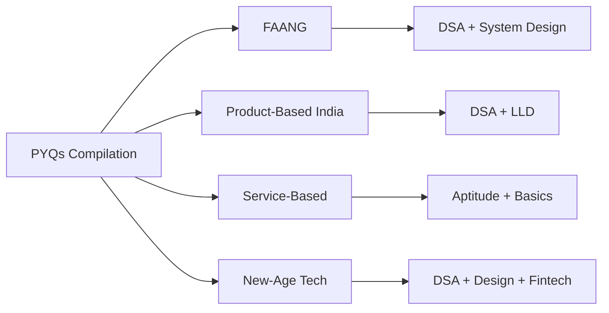

---
id: 07-company-wise-pyqs
slug: /placement-preparation/07-company-wise-pyqs
title: "07 → Company-Wise Previous Year Questions"
sidebar_label: "07 → Company-Wise Previous Year Questions"
sidebar_position: 7
---
# 07 → Company-Wise Previous Year Questions

> **Previous:** [06 → HR Interview, GD & Soft Skills](06-hr-gd-soft-skills.md)  
> **Next:** None (Last Chapter)


<!-- Image Gallery -->
<section class="lesson-visuals" aria-label="Visual learning resources">
  <header><span>VISUAL LEARNING</span><h2>See it. Review it. Remember it.</h2></header>
  <a class="lesson-visual-card" href="../../assets/images/lessons/placement-preparation/07-company-wise-pyqs/handwritten-notes.png" target="_blank" rel="noopener">
    
    <span><strong>Handwritten notes</strong>Condensed notes for deliberate review.</span>
  </a>
  <a class="lesson-visual-card" href="../../assets/images/lessons/placement-preparation/07-company-wise-pyqs/sticky-notes.png" target="_blank" rel="noopener">
    
    <span><strong>Sticky-note revision</strong>Fast recall prompts for revision.</span>
  </a>
  <a class="lesson-visual-card" href="../../assets/images/lessons/placement-preparation/07-company-wise-pyqs/visual-explanation.png" target="_blank" rel="noopener">
    
    <span><strong>Visual concept guide</strong>A connected explanation of the key ideas.</span>
  </a>
</section>
<!-- End Image Gallery -->

## Chapter at a Glance

| Section | Content |
|---------|---------|
| FAANG Companies | Amazon, Google, Microsoft, Meta coding problems |
| Product-Based India | Flipkart, Uber, Swiggy/Zomato, Ola/Paytm |
| Service-Based Companies | TCS, Infosys, Wipro, Accenture questions |
| New-Age Tech / Fintech | Netflix, Adobe, Goldman Sachs problems |
| Quick Reference | Common patterns by company |



> Comprehensive compilation of actual coding problems, behavioral questions, and system design problems asked by top companies during campus placements (2023–2025). Each problem includes a complete, compilable Java solution.

---


## Table of Contents

1. [FAANG Companies](#1-faang-companies)
   - [Amazon](#amazon)
   - [Google](#google)
   - [Microsoft](#microsoft)
   - [Meta](#meta)
2. [Product-Based India](#2-product-based-india-companies)
   - [Flipkart](#flipkart)
   - [Uber](#uber)
   - [Swiggy / Zomato](#swiggy--zomato)
   - [Ola / Paytm / Others](#ola--paytm--others)
3. [Service-Based Companies](#3-service-based-companies)
   - [TCS NQT / Digital](#tcs-nqt--digital)
   - [Infosys InfyTQ](#infosys-infytq)
   - [Wipro NLTH / Turbo](#wipro-nlth--turbo)
   - [Accenture](#accenture)
4. [New-Age Tech / Fintech / Product Companies](#4-new-age-tech--fintech--product-companies)
   - [Netflix](#netflix)
   - [Adobe](#adobe)
   - [Goldman Sachs](#goldman-sachs)

---

## 1. FAANG Companies

---

## Amazon

### Problem 1: Two Sum (Amazon, 2024)

**Difficulty:** Easy

**Problem Statement:** Given an array of integers `nums` and an integer `target`, return indices of the two numbers that add up to `target`. Assume exactly one solution exists and you may not use the same element twice.

```java
import java.util.HashMap;
import java.util.Map;

public class TwoSum {
    public static int[] twoSum(int[] nums, int target) {
        Map<Integer, Integer> map = new HashMap<>();
        for (int i = 0; i < nums.length; i++) {
            int complement = target - nums[i];
            if (map.containsKey(complement)) {
                return new int[]{map.get(complement), i};
            }
            map.put(nums[i], i);
        }
        throw new IllegalArgumentException("No solution found");
    }

    public static void main(String[] args) {
        int[] nums = {2, 7, 11, 15};
        int target = 9;
        int[] result = twoSum(nums, target);
        System.out.println("Indices: [" + result[0] + ", " + result[1] + "]");
        // Output: Indices: [0, 1]
    }
}
```
**Time:** O(n) | **Space:** O(n)

---

### Problem 2: Longest Substring Without Repeating Characters (Amazon, 2024)

**Difficulty:** Medium

**Problem Statement:** Given a string `s`, find the length of the longest substring without repeating characters.

```java
import java.util.HashMap;
import java.util.Map;

public class LongestSubstring {
    public static int lengthOfLongestSubstring(String s) {
        Map<Character, Integer> map = new HashMap<>();
        int maxLen = 0, left = 0;
        for (int right = 0; right < s.length(); right++) {
            char c = s.charAt(right);
            if (map.containsKey(c) && map.get(c) >= left) {
                left = map.get(c) + 1;
            }
            map.put(c, right);
            maxLen = Math.max(maxLen, right - left + 1);
        }
        return maxLen;
    }

    public static void main(String[] args) {
        String s = "abcabcbb";
        System.out.println("Longest substring length: " + lengthOfLongestSubstring(s));
        // Output: 3 ("abc")
    }
}
```
**Time:** O(n) | **Space:** O(min(m, n)) where m is character set size

---

### Problem 3: Merge Two Sorted Lists (Amazon, 2024)

**Difficulty:** Easy

**Problem Statement:** Merge two sorted linked lists and return it as a sorted list. The list should be made by splicing together the nodes of the first two lists.

```java
class ListNode {
    int val;
    ListNode next;
    ListNode() {}
    ListNode(int val) { this.val = val; }
    ListNode(int val, ListNode next) { this.val = val; this.next = next; }
}

public class MergeTwoLists {
    public static ListNode mergeTwoLists(ListNode l1, ListNode l2) {
        ListNode dummy = new ListNode(0);
        ListNode curr = dummy;
        while (l1 != null && l2 != null) {
            if (l1.val <= l2.val) {
                curr.next = l1;
                l1 = l1.next;
            } else {
                curr.next = l2;
                l2 = l2.next;
            }
            curr = curr.next;
        }
        curr.next = (l1 != null) ? l1 : l2;
        return dummy.next;
    }

    public static void main(String[] args) {
        ListNode l1 = new ListNode(1, new ListNode(2, new ListNode(4)));
        ListNode l2 = new ListNode(1, new ListNode(3, new ListNode(4)));
        ListNode result = mergeTwoLists(l1, l2);
        System.out.print("Merged list: ");
        while (result != null) {
            System.out.print(result.val + " ");
            result = result.next;
        }
        // Output: 1 1 2 3 4 4
    }
}
```
**Time:** O(n + m) | **Space:** O(1)

---

### Problem 4: Kth Largest Element in an Array (Amazon, 2024)

**Difficulty:** Medium

**Problem Statement:** Given an integer array `nums` and an integer `k`, return the k-th largest element in the array. Note that it is the k-th largest element in sorted order, not the k-th distinct element.

```java
import java.util.PriorityQueue;

public class KthLargest {
    public static int findKthLargest(int[] nums, int k) {
        PriorityQueue<Integer> minHeap = new PriorityQueue<>();
        for (int num : nums) {
            minHeap.offer(num);
            if (minHeap.size() > k) {
                minHeap.poll();
            }
        }
        return minHeap.peek();
    }

    public static void main(String[] args) {
        int[] nums = {3, 2, 1, 5, 6, 4};
        int k = 2;
        System.out.println("Kth largest: " + findKthLargest(nums, k));
        // Output: 5
    }
}
```
**Time:** O(n log k) | **Space:** O(k)

---

### Problem 5: Binary Tree Level Order Traversal (Amazon, 2023)

**Difficulty:** Medium

**Problem Statement:** Given the root of a binary tree, return the level order traversal of its nodes' values (i.e., from left to right, level by level).

```java
import java.util.ArrayList;
import java.util.LinkedList;
import java.util.List;
import java.util.Queue;

class TreeNode {
    int val;
    TreeNode left, right;
    TreeNode(int val) { this.val = val; }
}

public class LevelOrderTraversal {
    public static List<List<Integer>> levelOrder(TreeNode root) {
        List<List<Integer>> result = new ArrayList<>();
        if (root == null) return result;
        Queue<TreeNode> queue = new LinkedList<>();
        queue.offer(root);
        while (!queue.isEmpty()) {
            int size = queue.size();
            List<Integer> level = new ArrayList<>();
            for (int i = 0; i < size; i++) {
                TreeNode node = queue.poll();
                level.add(node.val);
                if (node.left != null) queue.offer(node.left);
                if (node.right != null) queue.offer(node.right);
            }
            result.add(level);
        }
        return result;
    }

    public static void main(String[] args) {
        TreeNode root = new TreeNode(3);
        root.left = new TreeNode(9);
        root.right = new TreeNode(20);
        root.right.left = new TreeNode(15);
        root.right.right = new TreeNode(7);
        System.out.println("Level order: " + levelOrder(root));
        // Output: [[3], [9, 20], [15, 7]]
    }
}
```
**Time:** O(n) | **Space:** O(n)

---

### Problem 6: Number of Islands (Amazon, 2024)

**Difficulty:** Medium

**Problem Statement:** Given an m x n 2D binary grid `grid` where '1' represents land and '0' represents water, count the number of islands. An island is surrounded by water and formed by connecting adjacent lands horizontally or vertically.

```java
public class NumberOfIslands {
    public static int numIslands(char[][] grid) {
        if (grid == null || grid.length == 0) return 0;
        int count = 0, m = grid.length, n = grid[0].length;
        for (int i = 0; i < m; i++) {
            for (int j = 0; j < n; j++) {
                if (grid[i][j] == '1') {
                    count++;
                    dfs(grid, i, j, m, n);
                }
            }
        }
        return count;
    }

    private static void dfs(char[][] grid, int i, int j, int m, int n) {
        if (i < 0 || i >= m || j < 0 || j >= n || grid[i][j] == '0') return;
        grid[i][j] = '0';
        dfs(grid, i + 1, j, m, n);
        dfs(grid, i - 1, j, m, n);
        dfs(grid, i, j + 1, m, n);
        dfs(grid, i, j - 1, m, n);
    }

    public static void main(String[] args) {
        char[][] grid = {
            {'1','1','1','1','0'},
            {'1','1','0','1','0'},
            {'1','1','0','0','0'},
            {'0','0','0','0','0'}
        };
        System.out.println("Number of islands: " + numIslands(grid));
        // Output: 1
    }
}
```
**Time:** O(m * n) | **Space:** O(m * n) worst-case recursion stack

---

### Problem 7: Best Time to Buy and Sell Stock (Amazon, 2024)

**Difficulty:** Easy

**Problem Statement:** You are given an array `prices` where `prices[i]` is the price of a given stock on day i. You want to maximize your profit by choosing a single day to buy and a different day in the future to sell. Return the maximum profit, or 0 if no profit is possible.

```java
public class BestTimeToBuy {
    public static int maxProfit(int[] prices) {
        int minPrice = Integer.MAX_VALUE;
        int maxProfit = 0;
        for (int price : prices) {
            if (price < minPrice) {
                minPrice = price;
            } else if (price - minPrice > maxProfit) {
                maxProfit = price - minPrice;
            }
        }
        return maxProfit;
    }

    public static void main(String[] args) {
        int[] prices = {7, 1, 5, 3, 6, 4};
        System.out.println("Max profit: " + maxProfit(prices));
        // Output: 5
    }
}
```
**Time:** O(n) | **Space:** O(1)

---

### Problem 8: Coin Change (Amazon, 2023)

**Difficulty:** Medium

**Problem Statement:** You are given an integer array `coins` representing different denominations and an integer `amount` representing a total amount of money. Return the fewest number of coins needed to make up that amount. If that amount cannot be made, return -1.

```java
import java.util.Arrays;

public class CoinChange {
    public static int coinChange(int[] coins, int amount) {
        int[] dp = new int[amount + 1];
        Arrays.fill(dp, amount + 1);
        dp[0] = 0;
        for (int i = 1; i <= amount; i++) {
            for (int coin : coins) {
                if (coin <= i) {
                    dp[i] = Math.min(dp[i], dp[i - coin] + 1);
                }
            }
        }
        return dp[amount] > amount ? -1 : dp[amount];
    }

    public static void main(String[] args) {
        int[] coins = {1, 2, 5};
        int amount = 11;
        System.out.println("Min coins: " + coinChange(coins, amount));
        // Output: 3 (5 + 5 + 1)
    }
}
```
**Time:** O(amount * coins) | **Space:** O(amount)

---

### Problem 9: LRU Cache (Amazon, 2024)

**Difficulty:** Medium

**Problem Statement:** Design a data structure that follows the Least Recently Used (LRU) cache constraint. Implement `LRUCache` class with `get(key)` and `put(key, value)` in O(1) average time.

```java
import java.util.HashMap;
import java.util.Map;

class LRUCache {
    class Node {
        int key, value;
        Node prev, next;
        Node(int key, int value) { this.key = key; this.value = value; }
    }

    private final int capacity;
    private final Map<Integer, Node> map;
    private final Node head, tail;

    public LRUCache(int capacity) {
        this.capacity = capacity;
        map = new HashMap<>();
        head = new Node(0, 0);
        tail = new Node(0, 0);
        head.next = tail;
        tail.prev = head;
    }

    public int get(int key) {
        Node node = map.get(key);
        if (node == null) return -1;
        remove(node);
        insert(node);
        return node.value;
    }

    public void put(int key, int value) {
        if (map.containsKey(key)) {
            remove(map.get(key));
        }
        if (map.size() == capacity) {
            remove(tail.prev);
        }
        insert(new Node(key, value));
    }

    private void insert(Node node) {
        map.put(node.key, node);
        node.next = head.next;
        node.prev = head;
        head.next.prev = node;
        head.next = node;
    }

    private void remove(Node node) {
        map.remove(node.key);
        node.prev.next = node.next;
        node.next.prev = node.prev;
    }
}

public class LRUCacheDemo {
    public static void main(String[] args) {
        LRUCache cache = new LRUCache(2);
        cache.put(1, 1);
        cache.put(2, 2);
        System.out.println("Get 1: " + cache.get(1));    // Output: 1
        cache.put(3, 3);                                  // evicts key 2
        System.out.println("Get 2: " + cache.get(2));    // Output: -1
        cache.put(4, 4);                                  // evicts key 1
        System.out.println("Get 1: " + cache.get(1));    // Output: -1
        System.out.println("Get 3: " + cache.get(3));    // Output: 3
        System.out.println("Get 4: " + cache.get(4));    // Output: 4
    }
}
```
**Time:** O(1) per operation | **Space:** O(capacity)

---

### Problem 10: Word Ladder (Amazon, 2023)

**Difficulty:** Hard

**Problem Statement:** Given two words `beginWord` and `endWord`, and a dictionary `wordList`, return the length of the shortest transformation sequence from beginWord to endWord such that only one letter can be changed at a time and each transformed word must exist in the wordList.

```java
import java.util.*;

public class WordLadder {
    public static int ladderLength(String beginWord, String endWord, List<String> wordList) {
        Set<String> set = new HashSet<>(wordList);
        if (!set.contains(endWord)) return 0;
        Queue<String> queue = new LinkedList<>();
        queue.offer(beginWord);
        int level = 1;
        while (!queue.isEmpty()) {
            int size = queue.size();
            for (int i = 0; i < size; i++) {
                String word = queue.poll();
                char[] chars = word.toCharArray();
                for (int j = 0; j < chars.length; j++) {
                    char original = chars[j];
                    for (char c = 'a'; c <= 'z'; c++) {
                        chars[j] = c;
                        String newWord = new String(chars);
                        if (newWord.equals(endWord)) return level + 1;
                        if (set.contains(newWord)) {
                            set.remove(newWord);
                            queue.offer(newWord);
                        }
                    }
                    chars[j] = original;
                }
            }
            level++;
        }
        return 0;
    }

    public static void main(String[] args) {
        String beginWord = "hit", endWord = "cog";
        List<String> wordList = Arrays.asList("hot","dot","dog","lot","log","cog");
        System.out.println("Shortest transformation length: " + ladderLength(beginWord, endWord, wordList));
        // Output: 5 (hit -> hot -> dot -> dog -> cog)
    }
}
```
**Time:** O(M^2 * N) where M is word length, N is wordList size | **Space:** O(M * N)

### Problem 11: Two Sum II → Input Array is Sorted (Amazon, 2024)

**Difficulty:** Medium

**Problem Statement:** Given a 1-indexed array of integers sorted in non-decreasing order, find two numbers that add up to a specific target. Return the indices as a 1-indexed array.

```java
public class TwoSumSorted {
    public static int[] twoSum(int[] numbers, int target) {
        int left = 0, right = numbers.length - 1;
        while (left < right) {
            int sum = numbers[left] + numbers[right];
            if (sum == target) {
                return new int[]{left + 1, right + 1};
            } else if (sum < target) {
                left++;
            } else {
                right--;
            }
        }
        return new int[]{-1, -1};
    }

    public static void main(String[] args) {
        int[] numbers = {2, 7, 11, 15};
        int target = 9;
        int[] result = twoSum(numbers, target);
        System.out.println("Indices: [" + result[0] + ", " + result[1] + "]");
        // Output: [1, 2]
    }
}
```
**Time:** O(n) | **Space:** O(1)

---

### Problem 12: Sliding Window Maximum → Variation (Amazon, 2024)

**Difficulty:** Hard

**Problem Statement:** Given an array of integers and a sliding window of size k, return an array of the maximum element for each window position. Additionally, return the minimum of these maximum values across all windows.

```java
import java.util.ArrayDeque;
import java.util.Deque;
import java.util.Arrays;

public class SlidingWindowMaxVariation {
    public static int[] maxSlidingWindow(int[] nums, int k) {
        if (nums == null || nums.length == 0) return new int[0];
        int n = nums.length;
        int[] result = new int[n - k + 1];
        Deque<Integer> deque = new ArrayDeque<>();
        int ri = 0;
        for (int i = 0; i < n; i++) {
            while (!deque.isEmpty() && deque.peekFirst() < i - k + 1) {
                deque.pollFirst();
            }
            while (!deque.isEmpty() && nums[deque.peekLast()] < nums[i]) {
                deque.pollLast();
            }
            deque.offerLast(i);
            if (i >= k - 1) {
                result[ri++] = nums[deque.peekFirst()];
            }
        }
        return result;
    }

    public static int minOfMaxSlidingWindow(int[] nums, int k) {
        int[] maxes = maxSlidingWindow(nums, k);
        int min = Integer.MAX_VALUE;
        for (int m : maxes) min = Math.min(min, m);
        return min;
    }

    public static void main(String[] args) {
        int[] nums = {1, 3, -1, -3, 5, 3, 6, 7};
        int k = 3;
        int[] maxes = maxSlidingWindow(nums, k);
        System.out.println("Max per window: " + Arrays.toString(maxes));
        // Output: [3, 3, 5, 5, 6, 7]
        System.out.println("Min of maxes: " + minOfMaxSlidingWindow(nums, k));
        // Output: 3
    }
}
```
**Time:** O(n) | **Space:** O(k)

---

### Problem 13: Merge K Sorted Lists (Amazon, 2024)

**Difficulty:** Hard

**Problem Statement:** Given an array of k sorted linked lists, merge them into one sorted list and return it.

```java
import java.util.PriorityQueue;

public class MergeKSortedLists {
    public static ListNode mergeKLists(ListNode[] lists) {
        if (lists == null || lists.length == 0) return null;
        PriorityQueue<ListNode> pq = new PriorityQueue<>((a, b) -> a.val - b.val);
        for (ListNode list : lists) {
            if (list != null) pq.offer(list);
        }
        ListNode dummy = new ListNode(0);
        ListNode curr = dummy;
        while (!pq.isEmpty()) {
            ListNode node = pq.poll();
            curr.next = node;
            curr = curr.next;
            if (node.next != null) pq.offer(node.next);
        }
        return dummy.next;
    }

    public static void main(String[] args) {
        ListNode l1 = new ListNode(1, new ListNode(4, new ListNode(5)));
        ListNode l2 = new ListNode(1, new ListNode(3, new ListNode(4)));
        ListNode l3 = new ListNode(2, new ListNode(6));
        ListNode[] lists = {l1, l2, l3};
        ListNode result = mergeKLists(lists);
        System.out.print("Merged: ");
        while (result != null) {
            System.out.print(result.val + " ");
            result = result.next;
        }
        // Output: 1 1 2 3 4 4 5 6
    }
}
```
**Time:** O(N log k) where N is total nodes | **Space:** O(k)

---

### Problem 14: Word Break II (Amazon, 2023)

**Difficulty:** Hard

**Problem Statement:** Given a string s and a dictionary of words wordDict, add spaces in s to construct a sentence where each word is a valid dictionary word. Return all possible sentences.

```java
import java.util.*;

public class WordBreakII {
    public static List<String> wordBreak(String s, List<String> wordDict) {
        Set<String> dict = new HashSet<>(wordDict);
        Map<Integer, List<String>> memo = new HashMap<>();
        return backtrack(s, 0, dict, memo);
    }

    private static List<String> backtrack(String s, int start, Set<String> dict,
                                           Map<Integer, List<String>> memo) {
        if (memo.containsKey(start)) return memo.get(start);
        List<String> result = new ArrayList<>();
        if (start == s.length()) {
            result.add("");
            return result;
        }
        for (int end = start + 1; end <= s.length(); end++) {
            String word = s.substring(start, end);
            if (dict.contains(word)) {
                List<String> subSentences = backtrack(s, end, dict, memo);
                for (String sub : subSentences) {
                    result.add(word + (sub.isEmpty() ? "" : " " + sub));
                }
            }
        }
        memo.put(start, result);
        return result;
    }

    public static void main(String[] args) {
        String s = "catsanddog";
        List<String> dict = Arrays.asList("cat", "cats", "and", "sand", "dog");
        System.out.println("Sentences: " + wordBreak(s, dict));
        // Output: [cat sand dog, cats and dog]
    }
}
```
**Time:** O(2^n) worst-case | **Space:** O(n * 2^n)

---

### Problem 15: Serialize and Deserialize N-ary Tree (Amazon, 2023)

**Difficulty:** Hard

**Problem Statement:** Design an algorithm to serialize an N-ary tree into a string and deserialize the string back into the original tree structure.

```java
import java.util.*;

class NaryNode {
    int val;
    List<NaryNode> children;
    NaryNode(int val) { this.val = val; children = new ArrayList<>(); }
}

class NaryCodec {
    private static final String SEP = ",";
    private static final String NULL = "null";

    public String serialize(NaryNode root) {
        if (root == null) return NULL;
        StringBuilder sb = new StringBuilder();
        serializeHelper(root, sb);
        return sb.toString();
    }

    private void serializeHelper(NaryNode node, StringBuilder sb) {
        sb.append(node.val).append(SEP);
        sb.append(node.children.size()).append(SEP);
        for (NaryNode child : node.children) {
            serializeHelper(child, sb);
        }
    }

    public NaryNode deserialize(String data) {
        if (data.equals(NULL)) return null;
        Queue<String> queue = new LinkedList<>(Arrays.asList(data.split(SEP)));
        return deserializeHelper(queue);
    }

    private NaryNode deserializeHelper(Queue<String> queue) {
        int val = Integer.parseInt(queue.poll());
        int childrenCount = Integer.parseInt(queue.poll());
        NaryNode node = new NaryNode(val);
        for (int i = 0; i < childrenCount; i++) {
            node.children.add(deserializeHelper(queue));
        }
        return node;
    }
}

public class NaryCodecDemo {
    public static void main(String[] args) {
        NaryNode root = new NaryNode(1);
        root.children.add(new NaryNode(3));
        root.children.add(new NaryNode(2));
        root.children.add(new NaryNode(4));
        root.children.get(0).children.add(new NaryNode(5));
        root.children.get(0).children.add(new NaryNode(6));

        NaryCodec codec = new NaryCodec();
        String serialized = codec.serialize(root);
        System.out.println("Serialized: " + serialized);
        NaryNode deserialized = codec.deserialize(serialized);
        System.out.println("Deserialized root val: " + deserialized.val);
        // Output: 1
    }
}
```
**Time:** O(n) | **Space:** O(n)

---

### Amazon Leadership Principles → Behavioral Questions


#### Q1: Tell me about a time you took ownership of a problem outside your scope. (Ownership)
**STAR Answer:**
- **Situation:** During my internship, our team's CI/CD pipeline was failing intermittently, blocking all developer deployments.
- **Task:** Although I was a frontend intern, I took ownership of diagnosing the pipeline issue.
- **Action:** I analyzed the Jenkins logs, identified a disk space issue in the build agent, wrote a cleanup script, and automated it as a cron job. I also documented the RCA and shared it with the DevOps team.
- **Result:** Pipeline stability went from 60% to 98%, unblocking 15+ developers. The script was adopted into the team's standard build agent configuration.

#### Q2: Describe a time you had to make a decision with incomplete information. (Bias for Action)
**STAR Answer:**
- **Situation:** As a project lead for a college capstone, we had 3 days to submit a working prototype but our third-party API provider had not responded about rate limits.
- **Task:** I needed to decide whether to proceed with the API or build a mock.
- **Action:** I analyzed the API documentation for typical rate limits, decided to implement a caching layer with a mock fallback, and communicated this decision to the team.
- **Result:** We submitted on time. The API rate limit was indeed restrictive, and our caching layer became a core feature.

#### Q3: Give an example of a goal you set and how you achieved it. (Deliver Results)
**STAR Answer:**
- **Situation:** In a hackathon, our team aimed to build a real-time collaborative editor in 24 hours.
- **Task:** My personal goal was to implement Operational Transformation (OT) for conflict-free editing.
- **Action:** I studied the OT algorithm overnight, implemented a simplified version with WebSockets, and tested it iteratively with the team.
- **Result:** Our editor supported 5 concurrent users with zero document corruption. We won first place.

#### Q4: Tell me about a time you disagreed with a teammate. (Have Backbone; Disagree and Commit)
**STAR Answer:**
- **Situation:** During a group project, a teammate insisted on using a NoSQL database, but I believed a relational database was more appropriate for our structured financial data.
- **Task:** I needed to resolve the disagreement without slowing progress.
- **Action:** I researched both options, prepared a comparison table showing query patterns and data relationships, and presented it to the team. After discussion, we agreed on PostgreSQL, and I fully committed to the decision.
- **Result:** The database performed well for all queries, and the teammate appreciated the evidence-based approach.

#### Q5: Describe a time you invented something or simplified a process. (Invent and Simplify)
**STAR Answer:**
- **Situation:** At a college event, manual attendee check-in was causing 30-minute queues.
- **Task:** I needed to design a faster check-in system.
- **Action:** I built a QR-code-based check-in mobile app using React Native and a Node.js backend. Attendees received QR codes via email, and volunteers scanned them at entry.
- **Result:** Check-in time dropped from 30 minutes to under 2 minutes, and the system was reused for 4 subsequent events.

---

## Google

### Problem 1: Two Sum → Sorted Input (Google, 2024)

**Difficulty:** Medium

**Problem Statement:** Given a 1-indexed array of integers sorted in non-decreasing order, find two numbers that add up to a specific target number. Return the indices as a 1-indexed array.

```java
public class TwoSumSorted {
    public static int[] twoSum(int[] numbers, int target) {
        int left = 0, right = numbers.length - 1;
        while (left < right) {
            int sum = numbers[left] + numbers[right];
            if (sum == target) {
                return new int[]{left + 1, right + 1};
            } else if (sum < target) {
                left++;
            } else {
                right--;
            }
        }
        return new int[]{-1, -1};
    }

    public static void main(String[] args) {
        int[] numbers = {2, 7, 11, 15};
        int target = 9;
        int[] result = twoSum(numbers, target);
        System.out.println("Indices: [" + result[0] + ", " + result[1] + "]");
        // Output: [1, 2]
    }
}
```
**Time:** O(n) | **Space:** O(1)

---

### Problem 2: Merge Intervals (Google, 2024)

**Difficulty:** Medium

**Problem Statement:** Given an array of intervals where `intervals[i] = [start, end]`, merge all overlapping intervals and return an array of non-overlapping intervals.

```java
import java.util.ArrayList;
import java.util.Arrays;
import java.util.List;

public class MergeIntervals {
    public static int[][] merge(int[][] intervals) {
        if (intervals.length <= 1) return intervals;
        Arrays.sort(intervals, (a, b) -> Integer.compare(a[0], b[0]));
        List<int[]> result = new ArrayList<>();
        int[] current = intervals[0];
        result.add(current);
        for (int[] interval : intervals) {
            if (interval[0] <= current[1]) {
                current[1] = Math.max(current[1], interval[1]);
            } else {
                current = interval;
                result.add(current);
            }
        }
        return result.toArray(new int[result.size()][]);
    }

    public static void main(String[] args) {
        int[][] intervals = {{1,3},{2,6},{8,10},{15,18}};
        int[][] merged = merge(intervals);
        System.out.print("Merged: ");
        for (int[] interval : merged) {
            System.out.print(Arrays.toString(interval) + " ");
        }
        // Output: [1, 6] [8, 10] [15, 18]
    }
}
```
**Time:** O(n log n) | **Space:** O(n)

---

### Problem 3: Longest Increasing Path in a Matrix (Google, 2024)

**Difficulty:** Hard

**Problem Statement:** Given an m x n integer matrix, return the length of the longest increasing path. You can move in four directions (up, down, left, right) but not diagonally.

```java
public class LongestIncreasingPath {
    private static final int[][] DIRS = {{0,1},{0,-1},{1,0},{-1,0}};

    public static int longestIncreasingPath(int[][] matrix) {
        if (matrix == null || matrix.length == 0) return 0;
        int m = matrix.length, n = matrix[0].length;
        int[][] cache = new int[m][n];
        int max = 0;
        for (int i = 0; i < m; i++) {
            for (int j = 0; j < n; j++) {
                max = Math.max(max, dfs(matrix, i, j, cache, m, n));
            }
        }
        return max;
    }

    private static int dfs(int[][] matrix, int i, int j, int[][] cache, int m, int n) {
        if (cache[i][j] != 0) return cache[i][j];
        int max = 1;
        for (int[] dir : DIRS) {
            int ni = i + dir[0], nj = j + dir[1];
            if (ni >= 0 && ni < m && nj >= 0 && nj < n && matrix[ni][nj] > matrix[i][j]) {
                max = Math.max(max, 1 + dfs(matrix, ni, nj, cache, m, n));
            }
        }
        cache[i][j] = max;
        return max;
    }

    public static void main(String[] args) {
        int[][] matrix = {{9,9,4},{6,6,8},{2,1,1}};
        System.out.println("Longest increasing path: " + longestIncreasingPath(matrix));
        // Output: 4 (1 -> 2 -> 6 -> 9)
    }
}
```
**Time:** O(m * n) | **Space:** O(m * n)

---

### Problem 4: Serialize and Deserialize Binary Tree (Google, 2023)

**Difficulty:** Hard

**Problem Statement:** Design an algorithm to serialize a binary tree into a string and deserialize the string back into the tree.

```java
import java.util.Arrays;
import java.util.LinkedList;
import java.util.Queue;

class Codec {
    private static final String SEP = ",";
    private static final String NULL = "null";

    public String serialize(TreeNode root) {
        StringBuilder sb = new StringBuilder();
        serializeHelper(root, sb);
        return sb.toString();
    }

    private void serializeHelper(TreeNode root, StringBuilder sb) {
        if (root == null) {
            sb.append(NULL).append(SEP);
            return;
        }
        sb.append(root.val).append(SEP);
        serializeHelper(root.left, sb);
        serializeHelper(root.right, sb);
    }

    public TreeNode deserialize(String data) {
        Queue<String> queue = new LinkedList<>(Arrays.asList(data.split(SEP)));
        return deserializeHelper(queue);
    }

    private TreeNode deserializeHelper(Queue<String> queue) {
        String val = queue.poll();
        if (val.equals(NULL)) return null;
        TreeNode node = new TreeNode(Integer.parseInt(val));
        node.left = deserializeHelper(queue);
        node.right = deserializeHelper(queue);
        return node;
    }
}

public class CodecDemo {
    public static void main(String[] args) {
        TreeNode root = new TreeNode(1);
        root.left = new TreeNode(2);
        root.right = new TreeNode(3);
        root.right.left = new TreeNode(4);
        root.right.right = new TreeNode(5);

        Codec codec = new Codec();
        String serialized = codec.serialize(root);
        System.out.println("Serialized: " + serialized);
        TreeNode deserialized = codec.deserialize(serialized);
        System.out.println("Deserialized root: " + deserialized.val);
        // Serialized: 1,2,null,null,3,4,null,null,5,null,null,
    }
}
```
**Time:** O(n) | **Space:** O(n)

---

### Problem 5: Group Anagrams (Google, 2024)

**Difficulty:** Medium

**Problem Statement:** Given an array of strings `strs`, group the anagrams together. An anagram is a word formed by rearranging the letters of another word.

```java
import java.util.*;

public class GroupAnagrams {
    public static List<List<String>> groupAnagrams(String[] strs) {
        Map<String, List<String>> map = new HashMap<>();
        for (String s : strs) {
            char[] chars = s.toCharArray();
            Arrays.sort(chars);
            String key = new String(chars);
            map.computeIfAbsent(key, k -> new ArrayList<>()).add(s);
        }
        return new ArrayList<>(map.values());
    }

    public static void main(String[] args) {
        String[] strs = {"eat","tea","tan","ate","nat","bat"};
        System.out.println("Grouped anagrams: " + groupAnagrams(strs));
        // Output: [[eat, tea, ate], [tan, nat], [bat]]
    }
}
```
**Time:** O(n * k log k) where k is max string length | **Space:** O(n * k)

---

### Problem 6: Maximum Subarray (Kadane's Algorithm) (Google, 2024)

**Difficulty:** Medium

**Problem Statement:** Given an integer array `nums`, find the contiguous subarray (containing at least one number) that has the largest sum and return its sum.

```java
public class MaximumSubarray {
    public static int maxSubArray(int[] nums) {
        int maxSoFar = nums[0], maxEndingHere = nums[0];
        for (int i = 1; i < nums.length; i++) {
            maxEndingHere = Math.max(nums[i], maxEndingHere + nums[i]);
            maxSoFar = Math.max(maxSoFar, maxEndingHere);
        }
        return maxSoFar;
    }

    public static void main(String[] args) {
        int[] nums = {-2, 1, -3, 4, -1, 2, 1, -5, 4};
        System.out.println("Maximum subarray sum: " + maxSubArray(nums));
        // Output: 6 ([4, -1, 2, 1])
    }
}
```
**Time:** O(n) | **Space:** O(1)

---

### Problem 7: Minimum Window Substring (Google, 2023)

**Difficulty:** Hard

**Problem Statement:** Given two strings `s` and `t`, return the minimum window substring of `s` that contains all characters of `t`. If no such window exists, return empty string.

```java
import java.util.HashMap;
import java.util.Map;

public class MinWindowSubstring {
    public static String minWindow(String s, String t) {
        Map<Character, Integer> map = new HashMap<>();
        for (char c : t.toCharArray()) map.put(c, map.getOrDefault(c, 0) + 1);
        int left = 0, minLeft = 0, minLen = Integer.MAX_VALUE, count = t.length();
        for (int right = 0; right < s.length(); right++) {
            char c = s.charAt(right);
            if (map.containsKey(c)) {
                map.put(c, map.get(c) - 1);
                if (map.get(c) >= 0) count--;
            }
            while (count == 0) {
                if (right - left + 1 < minLen) {
                    minLen = right - left + 1;
                    minLeft = left;
                }
                char leftChar = s.charAt(left);
                if (map.containsKey(leftChar)) {
                    map.put(leftChar, map.get(leftChar) + 1);
                    if (map.get(leftChar) > 0) count++;
                }
                left++;
            }
        }
        return minLen == Integer.MAX_VALUE ? "" : s.substring(minLeft, minLeft + minLen);
    }

    public static void main(String[] args) {
        String s = "ADOBECODEBANC", t = "ABC";
        System.out.println("Min window: '" + minWindow(s, t) + "'");
        // Output: "BANC"
    }
}
```
**Time:** O(n) | **Space:** O(m) where m is character set of t

---

### Problem 8: Find Median from Data Stream (Google, 2024)

**Difficulty:** Hard

**Problem Statement:** Implement a `MedianFinder` class that supports adding integers and finding the median of all added numbers.

```java
import java.util.PriorityQueue;

class MedianFinder {
    private final PriorityQueue<Integer> maxHeap; // left half
    private final PriorityQueue<Integer> minHeap; // right half

    public MedianFinder() {
        maxHeap = new PriorityQueue<>((a, b) -> b - a);
        minHeap = new PriorityQueue<>();
    }

    public void addNum(int num) {
        maxHeap.offer(num);
        minHeap.offer(maxHeap.poll());
        if (maxHeap.size() < minHeap.size()) {
            maxHeap.offer(minHeap.poll());
        }
    }

    public double findMedian() {
        if (maxHeap.size() > minHeap.size()) {
            return maxHeap.peek();
        }
        return (maxHeap.peek() + minHeap.peek()) / 2.0;
    }
}

public class MedianFinderDemo {
    public static void main(String[] args) {
        MedianFinder mf = new MedianFinder();
        mf.addNum(1);
        mf.addNum(2);
        System.out.println("Median: " + mf.findMedian()); // 1.5
        mf.addNum(3);
        System.out.println("Median: " + mf.findMedian()); // 2.0
    }
}
```
**Time:** O(log n) per add, O(1) per find | **Space:** O(n)

---

### Problem 9: Text Justification (Google, 2024)

**Difficulty:** Hard

**Problem Statement:** Given an array of words and a width maxWidth, format the text such that each line has exactly maxWidth characters, fully justified (left and right). Pack as many words as possible per line, distribute extra spaces evenly.

```java
import java.util.*;

public class TextJustification {
    public static List<String> fullJustify(String[] words, int maxWidth) {
        List<String> result = new ArrayList<>();
        int index = 0;
        while (index < words.length) {
            int count = words[index].length();
            int last = index + 1;
            while (last < words.length && count + 1 + words[last].length() <= maxWidth) {
                count += 1 + words[last].length();
                last++;
            }
            StringBuilder sb = new StringBuilder();
            int gaps = last - index - 1;
            if (last == words.length || gaps == 0) {
                for (int i = index; i < last; i++) {
                    sb.append(words[i]);
                    if (i < last - 1) sb.append(" ");
                }
                while (sb.length() < maxWidth) sb.append(" ");
            } else {
                int spaces = (maxWidth - count) / gaps;
                int extra = (maxWidth - count) % gaps;
                for (int i = index; i < last; i++) {
                    sb.append(words[i]);
                    if (i < last - 1) {
                        for (int s = 0; s <= spaces + (i - index < extra ? 1 : 0); s++) {
                            sb.append(" ");
                        }
                    }
                }
            }
            result.add(sb.toString());
            index = last;
        }
        return result;
    }

    public static void main(String[] args) {
        String[] words = {"This", "is", "an", "example", "of", "text", "justification."};
        int maxWidth = 16;
        List<String> justified = fullJustify(words, maxWidth);
        for (String line : justified) {
            System.out.println("\"" + line + "\"");
        }
        // Output:
        // "This    is    an"
        // "example  of text"
        // "justification.  "
    }
}
```
**Time:** O(n * L) where L is max line length | **Space:** O(n)

---

### Problem 10: Count of Smaller Numbers After Self (Google, 2024)

**Difficulty:** Hard

**Problem Statement:** Given an integer array nums, return an integer array counts where counts[i] is the number of smaller elements to the right of nums[i].

```java
import java.util.*;

public class CountSmallerAfterSelf {
    public static List<Integer> countSmaller(int[] nums) {
        int n = nums.length;
        Integer[] result = new Integer[n];
        List<Integer> sorted = new ArrayList<>();
        for (int i = n - 1; i >= 0; i--) {
            int pos = findInsertPos(sorted, nums[i]);
            result[i] = pos;
            sorted.add(pos, nums[i]);
        }
        return Arrays.asList(result);
    }

    private static int findInsertPos(List<Integer> sorted, int target) {
        int left = 0, right = sorted.size();
        while (left < right) {
            int mid = left + (right - left) / 2;
            if (sorted.get(mid) < target) {
                left = mid + 1;
            } else {
                right = mid;
            }
        }
        return left;
    }

    public static void main(String[] args) {
        int[] nums = {5, 2, 6, 1};
        System.out.println("Counts: " + countSmaller(nums));
        // Output: [2, 1, 1, 0]
    }
}
```
**Time:** O(n^2) worst-case with list insertion | **Space:** O(n)

---

### Problem 11: My Calendar I (Google, 2024)

**Difficulty:** Medium

**Problem Statement:** Implement a MyCalendar class to store events as [start, end). If adding an event causes double booking, reject it. A double booking occurs when two events overlap.

```java
import java.util.TreeMap;

class MyCalendar {
    private final TreeMap<Integer, Integer> calendar;

    public MyCalendar() {
        calendar = new TreeMap<>();
    }

    public boolean book(int start, int end) {
        Integer prev = calendar.floorKey(start);
        Integer next = calendar.ceilingKey(start);
        if ((prev == null || calendar.get(prev) <= start) &&
            (next == null || next >= end)) {
            calendar.put(start, end);
            return true;
        }
        return false;
    }
}

public class MyCalendarDemo {
    public static void main(String[] args) {
        MyCalendar cal = new MyCalendar();
        System.out.println("Book 10-20: " + cal.book(10, 20)); // true
        System.out.println("Book 15-25: " + cal.book(15, 25)); // false
        System.out.println("Book 20-30: " + cal.book(20, 30)); // true
    }
}
```
**Time:** O(log n) per booking | **Space:** O(n)

---

### Problem 12: Random Pick with Weight (Google, 2024)

**Difficulty:** Medium

**Problem Statement:** Given an array of positive integers w where w[i] describes the weight of index i, implement a function that randomly picks an index proportional to its weight. Return the index.

```java
import java.util.Random;

class RandomPickWeight {
    private final int[] prefixSums;
    private final int total;
    private final Random rand;

    public RandomPickWeight(int[] w) {
        prefixSums = new int[w.length];
        int sum = 0;
        for (int i = 0; i < w.length; i++) {
            sum += w[i];
            prefixSums[i] = sum;
        }
        total = sum;
        rand = new Random();
    }

    public int pickIndex() {
        int target = rand.nextInt(total) + 1;
        int left = 0, right = prefixSums.length - 1;
        while (left < right) {
            int mid = left + (right - left) / 2;
            if (prefixSums[mid] < target) {
                left = mid + 1;
            } else {
                right = mid;
            }
        }
        return left;
    }
}

public class GoogleRandomPickDemo {
    public static void main(String[] args) {
        int[] w = {1, 3, 2};
        RandomPickWeight rpw = new RandomPickWeight(w);
        int[] counts = new int[3];
        for (int i = 0; i < 10000; i++) {
            counts[rpw.pickIndex()]++;
        }
        System.out.println("Counts (should be ~1667, 5000, 3333): " +
            counts[0] + ", " + counts[1] + ", " + counts[2]);
    }
}
```
**Time:** O(n) init, O(log n) pick | **Space:** O(n)

---

### Googleyness → Behavioral Questions


#### Q1: Tell me about a time you had to lead a team without formal authority.
**Answer:** During a university project, I noticed our team was falling behind on a database migration task. I organized a quick knowledge-sharing session on the migration approach, volunteered to write the core migration script, and set up daily stand-up check-ins. By demonstrating expertise and initiative rather than demanding authority, the team naturally followed. We completed the migration two days ahead of schedule.

#### Q2: Describe a time you failed and what you learned from it.
**Answer:** In my sophomore year, I attempted to build a full-stack application without proper requirements gathering. I spent two weeks building features the user never needed. The failure taught me to validate assumptions early → write user stories, create wireframes, and get user feedback before writing code. I now apply this approach to every project, starting with a simple prototype or MVP.

#### Q3: How do you handle ambiguity when there are no clear requirements?
**Answer:** I break the problem into smaller pieces and research analogous solutions. For example, during an internship, I was asked to "improve API response times" without specific targets. I first instrumented the API to gather latency data, identified the slowest endpoints, benchmarked against industry standards for each operation type, and set concrete targets (p95 &lt; 200ms for reads). I then iterated on optimizations, measuring at each step.

---

### Google SDE-1/2 System Design Questions


#### Q1: Design a URL Shortener (like bit.ly)
**Key considerations:**
- **Hash generation:** Base62 encoding of a unique ID (counter + distributed ZooKeeper/Redis)
- **Redirection:** 301 redirect for permanent URLs, store mapping in distributed DB
- **Scale:** 100M URLs/month, 3K writes/sec, 33K reads/sec
- **DB choice:** Cassandra or Redis for fast key-value lookups
- **Cache:** Redis cache for hot URLs (LRU eviction)

#### Q2: Design Google Search Autocomplete
**Key considerations:**
- **Trie data structure:** Each node stores frequency count
- **Top-k suggestions:** Store top 5 at each trie node for O(1) retrieval
- **Fuzzy matching:** Edit distance (Levenshtein) for typos
- **Ranking:** Frequency + recency + personalization
- **Backend:** MapReduce for offline frequency aggregation from search logs

#### Q3: Design WhatsApp Chat System
**Key considerations:**
- **WebSocket connections:** Long-lived persistent connections via load balancers
- **Message storage:** Time-series DB (Cassandra) partitioned by chat_id
- **Delivery semantics:** At-least-once delivery with ACK mechanism
- **Offline messages:** Stored in DB, pushed on reconnect
- **Group chats:** Fan-out on write for small groups, fan-out on read for large groups

---

## Microsoft

### Problem 1: Reverse Linked List (Microsoft, 2024)

**Difficulty:** Easy

**Problem Statement:** Reverse a singly linked list and return the reversed list.

```java
public class ReverseLinkedList {
    public static ListNode reverseList(ListNode head) {
        ListNode prev = null;
        ListNode curr = head;
        while (curr != null) {
            ListNode nextTemp = curr.next;
            curr.next = prev;
            prev = curr;
            curr = nextTemp;
        }
        return prev;
    }

    public static void main(String[] args) {
        ListNode head = new ListNode(1, new ListNode(2, new ListNode(3, new ListNode(4, new ListNode(5)))));
        ListNode reversed = reverseList(head);
        System.out.print("Reversed: ");
        while (reversed != null) {
            System.out.print(reversed.val + " ");
            reversed = reversed.next;
        }
        // Output: 5 4 3 2 1
    }
}
```
**Time:** O(n) | **Space:** O(1)

---

### Problem 2: Valid Parentheses (Microsoft, 2024)

**Difficulty:** Easy

**Problem Statement:** Given a string containing just the characters '(', ')', '{', '}', '[', ']', determine if the input string is valid. Brackets must close in the correct order.

```java
import java.util.Stack;

public class ValidParentheses {
    public static boolean isValid(String s) {
        Stack<Character> stack = new Stack<>();
        for (char c : s.toCharArray()) {
            if (c == '(') stack.push(')');
            else if (c == '{') stack.push('}');
            else if (c == '[') stack.push(']');
            else if (stack.isEmpty() || stack.pop() != c) return false;
        }
        return stack.isEmpty();
    }

    public static void main(String[] args) {
        System.out.println("(){}[] : " + isValid("(){}[]"));   // true
        System.out.println("([)]   : " + isValid("([)]"));     // false
        System.out.println("{[]}   : " + isValid("{[]}"));     // true
    }
}
```
**Time:** O(n) | **Space:** O(n)

---

### Problem 3: Longest Palindromic Substring (Microsoft, 2024)

**Difficulty:** Medium

**Problem Statement:** Given a string `s`, return the longest palindromic substring in `s`.

```java
public class LongestPalindrome {
    private static int start = 0, maxLen = 0;

    public static String longestPalindrome(String s) {
        if (s == null || s.length() < 2) return s;
        start = 0; maxLen = 0;
        for (int i = 0; i < s.length(); i++) {
            expand(s, i, i);     // odd length
            expand(s, i, i + 1); // even length
        }
        return s.substring(start, start + maxLen);
    }

    private static void expand(String s, int left, int right) {
        while (left >= 0 && right < s.length() && s.charAt(left) == s.charAt(right)) {
            left--;
            right++;
        }
        int len = right - left - 1;
        if (len > maxLen) {
            maxLen = len;
            start = left + 1;
        }
    }

    public static void main(String[] args) {
        String s = "babad";
        System.out.println("Longest palindrome: " + longestPalindrome(s));
        // Output: "bab" or "aba"
    }
}
```
**Time:** O(n^2) | **Space:** O(1)

---

### Problem 4: Set Matrix Zeroes (Microsoft, 2023)

**Difficulty:** Medium

**Problem Statement:** Given an m x n integer matrix, if an element is 0, set its entire row and column to 0 in-place.

```java
import java.util.Arrays;

public class SetMatrixZeroes {
    public static void setZeroes(int[][] matrix) {
        int m = matrix.length, n = matrix[0].length;
        boolean firstRow = false, firstCol = false;
        for (int j = 0; j < n; j++) if (matrix[0][j] == 0) firstRow = true;
        for (int i = 0; i < m; i++) if (matrix[i][0] == 0) firstCol = true;
        for (int i = 1; i < m; i++) {
            for (int j = 1; j < n; j++) {
                if (matrix[i][j] == 0) {
                    matrix[i][0] = 0;
                    matrix[0][j] = 0;
                }
            }
        }
        for (int i = 1; i < m; i++) {
            for (int j = 1; j < n; j++) {
                if (matrix[i][0] == 0 || matrix[0][j] == 0) matrix[i][j] = 0;
            }
        }
        if (firstRow) for (int j = 0; j < n; j++) matrix[0][j] = 0;
        if (firstCol) for (int i = 0; i < m; i++) matrix[i][0] = 0;
    }

    public static void main(String[] args) {
        int[][] matrix = {{1,1,1},{1,0,1},{1,1,1}};
        setZeroes(matrix);
        System.out.println("Result: " + Arrays.deepToString(matrix));
        // Output: [[1,0,1],[0,0,0],[1,0,1]]
    }
}
```
**Time:** O(m * n) | **Space:** O(1)

---

### Problem 5: Number of Provinces (Microsoft, 2024)

**Difficulty:** Medium

**Problem Statement:** There are n cities. Some are connected directly. A province is a group of directly or indirectly connected cities. Return the total number of provinces.

```java
public class NumberOfProvinces {
    public static int findCircleNum(int[][] isConnected) {
        int n = isConnected.length;
        boolean[] visited = new boolean[n];
        int count = 0;
        for (int i = 0; i < n; i++) {
            if (!visited[i]) {
                count++;
                dfs(isConnected, visited, i, n);
            }
        }
        return count;
    }

    private static void dfs(int[][] isConnected, boolean[] visited, int i, int n) {
        visited[i] = true;
        for (int j = 0; j < n; j++) {
            if (isConnected[i][j] == 1 && !visited[j]) {
                dfs(isConnected, visited, j, n);
            }
        }
    }

    public static void main(String[] args) {
        int[][] isConnected = {{1,1,0},{1,1,0},{0,0,1}};
        System.out.println("Provinces: " + findCircleNum(isConnected));
        // Output: 2
    }
}
```
**Time:** O(n^2) | **Space:** O(n)

---

### Problem 6: Alien Dictionary (Microsoft, 2023)

**Difficulty:** Hard

**Problem Statement:** Given a sorted dictionary of an alien language, find the order of characters in the alien alphabet.

```java
import java.util.*;

public class AlienDictionary {
    public static String alienOrder(String[] words) {
        Map<Character, Set<Character>> graph = new HashMap<>();
        int[] inDegree = new int[26];
        for (String word : words) {
            for (char c : word.toCharArray()) graph.putIfAbsent(c, new HashSet<>());
        }
        for (int i = 0; i < words.length - 1; i++) {
            String w1 = words[i], w2 = words[i + 1];
            int minLen = Math.min(w1.length(), w2.length());
            boolean found = false;
            for (int j = 0; j < minLen; j++) {
                char c1 = w1.charAt(j), c2 = w2.charAt(j);
                if (c1 != c2) {
                    if (!graph.get(c1).contains(c2)) {
                        graph.get(c1).add(c2);
                        inDegree[c2 - 'a']++;
                    }
                    found = true;
                    break;
                }
            }
            if (!found && w1.length() > w2.length()) return "";
        }
        Queue<Character> queue = new LinkedList<>();
        for (char c : graph.keySet()) {
            if (inDegree[c - 'a'] == 0) queue.offer(c);
        }
        StringBuilder sb = new StringBuilder();
        while (!queue.isEmpty()) {
            char c = queue.poll();
            sb.append(c);
            for (char neighbor : graph.get(c)) {
                if (--inDegree[neighbor - 'a'] == 0) queue.offer(neighbor);
            }
        }
        return sb.length() == graph.size() ? sb.toString() : "";
    }

    public static void main(String[] args) {
        String[] words = {"wrt","wrf","er","ett","rftt"};
        System.out.println("Alien order: '" + alienOrder(words) + "'");
        // Output: "wertf"
    }
}
```
**Time:** O(C) where C is total characters | **Space:** O(1) since alphabet fixed at 26

---

### Problem 7: Reverse Words in a String (Microsoft, 2024)

**Difficulty:** Medium

**Problem Statement:** Given an input string s, reverse the order of words. A word is defined as a sequence of non-space characters. Return a string of the words in reverse order.

```java
import java.util.Arrays;
import java.util.Collections;
import java.util.List;

public class ReverseWords {
    public static String reverseWords(String s) {
        s = s.trim();
        List<String> words = Arrays.asList(s.split("\\s+"));
        Collections.reverse(words);
        return String.join(" ", words);
    }

    public static void main(String[] args) {
        String s = "  the sky is   blue  ";
        System.out.println("Reversed: '" + reverseWords(s) + "'");
        // Output: "blue is sky the"
    }
}
```
**Time:** O(n) | **Space:** O(n)

---

### Problem 8: Remove Duplicates from Sorted Array II (Microsoft, 2024)

**Difficulty:** Medium

**Problem Statement:** Given a sorted array nums, remove duplicates in-place such that each element appears at most twice. Return the new length.

```java
import java.util.Arrays;

public class RemoveDuplicatesII {
    public static int removeDuplicates(int[] nums) {
        if (nums.length <= 2) return nums.length;
        int k = 2;
        for (int i = 2; i < nums.length; i++) {
            if (nums[i] != nums[k - 2]) {
                nums[k++] = nums[i];
            }
        }
        return k;
    }

    public static void main(String[] args) {
        int[] nums = {1, 1, 1, 2, 2, 3};
        int len = removeDuplicates(nums);
        System.out.println("Length: " + len);
        System.out.println("Array: " + Arrays.toString(Arrays.copyOf(nums, len)));
        // Output: Length: 5, Array: [1, 1, 2, 2, 3]
    }
}
```
**Time:** O(n) | **Space:** O(1)

---

### Problem 9: Find All Duplicates in an Array (Microsoft, 2024)

**Difficulty:** Medium

**Problem Statement:** Given an integer array where 1 &lt;= nums[i] <= n (n is array size), some elements appear twice and others once. Find all elements that appear twice without using extra space.

```java
import java.util.ArrayList;
import java.util.List;

public class FindAllDuplicates {
    public static List<Integer> findDuplicates(int[] nums) {
        List<Integer> result = new ArrayList<>();
        for (int i = 0; i < nums.length; i++) {
            int index = Math.abs(nums[i]) - 1;
            if (nums[index] < 0) {
                result.add(Math.abs(nums[i]));
            } else {
                nums[index] = -nums[index];
            }
        }
        return result;
    }

    public static void main(String[] args) {
        int[] nums = {4, 3, 2, 7, 8, 2, 3, 1};
        System.out.println("Duplicates: " + findDuplicates(nums));
        // Output: [2, 3]
    }
}
```
**Time:** O(n) | **Space:** O(1) excluding output

---

### Problem 10: Basic Calculator II (Microsoft, 2023)

**Difficulty:** Medium

**Problem Statement:** Given a string expression representing a mathematical expression containing non-negative integers and +, -, *, / operators, evaluate it and return the result. Integer division truncates toward zero.

```java
import java.util.Stack;

public class BasicCalculatorII {
    public static int calculate(String s) {
        if (s == null || s.isEmpty()) return 0;
        Stack<Integer> stack = new Stack<>();
        int num = 0;
        char sign = '+';
        for (int i = 0; i < s.length(); i++) {
            char c = s.charAt(i);
            if (Character.isDigit(c)) {
                num = num * 10 + (c - '0');
            }
            if ((!Character.isDigit(c) && c != ' ') || i == s.length() - 1) {
                if (sign == '+') stack.push(num);
                else if (sign == '-') stack.push(-num);
                else if (sign == '*') stack.push(stack.pop() * num);
                else if (sign == '/') stack.push(stack.pop() / num);
                sign = c;
                num = 0;
            }
        }
        int result = 0;
        for (int val : stack) result += val;
        return result;
    }

    public static void main(String[] args) {
        System.out.println("3+2*2 = " + calculate("3+2*2"));   // 7
        System.out.println(" 3/2  = " + calculate(" 3/2 "));   // 1
        System.out.println("3+5/2 = " + calculate("3+5/2"));   // 5
    }
}
```
**Time:** O(n) | **Space:** O(n)

---

### Microsoft ASK (Ability, Skills, Knowledge) → Behavioral


#### Q1: Tell me about a time you had to quickly learn a new technology to complete a project.
**Answer:** For a college project, I needed to implement real-time WebSocket communication for a chat app, but I only knew REST APIs. I spent 48 hours learning WebSocket protocol fundamentals, reading Spring WebSocket documentation, and building a prototype. I successfully integrated the feature and later taught the concept to my teammates. This experience taught me that structured learning → starting with fundamentals, then building a minimal working example → is more effective than diving into advanced tutorials.

#### Q2: Describe a situation where you had to convince others to adopt your approach.
**Answer:** During a hackathon, I proposed using Kotlin instead of Java for Android development to leverage null safety features. Teammates were hesitant since nobody had used Kotlin before. I built a small feature in both languages, showing that Kotlin reduced boilerplate by 40% and prevented NPEs at compile time. The team agreed, and we delivered a crash-free app that won "Best Technical Implementation."

#### Q3: Tell me about your biggest technical achievement.
**Answer:** I built a custom load-testing framework for our university's placement portal, which had crashed during previous placement drives. The framework simulated 500 concurrent users, identified SQL connection pool exhaustion as the bottleneck, and suggested connection pool sizing. After implementing the fix, the portal handled 1000+ concurrent users during the next placement drive without any downtime. I open-sourced the framework and it has 50+ GitHub stars.

---

### Microsoft Design Questions (SDE-1/2)


#### Q1: Design a Distributed Job Scheduler
- **Core entities:** Job, Task, Worker, Schedule
- **Storage:** Use a queue (RabbitMQ/Kafka) for task distribution, DB for job metadata
- **Scheduling:** Cron-based using a priority queue in memory; persistence via DB
- **Fault tolerance:** Heartbeat mechanism; failed tasks are re-queued with retry count
- **Scale-out:** Workers are stateless and horizontally scalable

#### Q2: Design an Online Code Evaluation Platform
- **Architecture:** API Gateway → Submission Service → Sandbox (Docker containers per language)
- **Isolation:** Each code submission runs in a resource-constrained Docker container with 256MB RAM limit and 5s timeout
- **Queue:** Kafka for submission queue, with consumer workers pulling from the queue
- **Results:** Stored in database, pushed to client via WebSocket
- **Security:** No network access for sandbox, restricted system calls via seccomp

---

## Meta

### Problem 1: Valid Palindrome (Meta, 2024)

**Difficulty:** Easy

**Problem Statement:** Given a string `s`, determine if it is a palindrome considering only alphanumeric characters and ignoring cases.

```java
public class ValidPalindrome {
    public static boolean isPalindrome(String s) {
        int left = 0, right = s.length() - 1;
        while (left < right) {
            while (left < right && !Character.isLetterOrDigit(s.charAt(left))) left++;
            while (left < right && !Character.isLetterOrDigit(s.charAt(right))) right--;
            if (Character.toLowerCase(s.charAt(left)) != Character.toLowerCase(s.charAt(right))) return false;
            left++;
            right--;
        }
        return true;
    }

    public static void main(String[] args) {
        System.out.println(isPalindrome("A man, a plan, a canal: Panama")); // true
        System.out.println(isPalindrome("race a car"));                     // false
    }
}
```
**Time:** O(n) | **Space:** O(1)

---

### Problem 2: Binary Search Tree Iterator (Meta, 2024)

**Difficulty:** Medium

**Problem Statement:** Implement an iterator over a BST that returns nodes in ascending order. `next()` returns the next smallest element, and `hasNext()` returns whether a next element exists.

```java
import java.util.Stack;

class BSTIterator {
    private final Stack<TreeNode> stack;

    public BSTIterator(TreeNode root) {
        stack = new Stack<>();
        pushLeft(root);
    }

    private void pushLeft(TreeNode node) {
        while (node != null) {
            stack.push(node);
            node = node.left;
        }
    }

    public int next() {
        TreeNode node = stack.pop();
        pushLeft(node.right);
        return node.val;
    }

    public boolean hasNext() {
        return !stack.isEmpty();
    }
}

public class BSTIteratorDemo {
    public static void main(String[] args) {
        TreeNode root = new TreeNode(7);
        root.left = new TreeNode(3);
        root.right = new TreeNode(15);
        root.right.left = new TreeNode(9);
        root.right.right = new TreeNode(20);

        BSTIterator it = new BSTIterator(root);
        System.out.print("In-order: ");
        while (it.hasNext()) {
            System.out.print(it.next() + " ");
        }
        // Output: 3 7 9 15 20
    }
}
```
**Time:** O(1) average for next(), O(1) for hasNext() | **Space:** O(h) where h is tree height

---

### Problem 3: Product of Array Except Self (Meta, 2024)

**Difficulty:** Medium

**Problem Statement:** Given an integer array `nums`, return an array `output` such that `output[i]` is the product of all elements except `nums[i]`. Must run in O(n) without division.

```java
import java.util.Arrays;

public class ProductExceptSelf {
    public static int[] productExceptSelf(int[] nums) {
        int n = nums.length;
        int[] result = new int[n];
        result[0] = 1;
        for (int i = 1; i < n; i++) {
            result[i] = result[i - 1] * nums[i - 1];
        }
        int suffix = 1;
        for (int i = n - 1; i >= 0; i--) {
            result[i] *= suffix;
            suffix *= nums[i];
        }
        return result;
    }

    public static void main(String[] args) {
        int[] nums = {1, 2, 3, 4};
        System.out.println("Result: " + Arrays.toString(productExceptSelf(nums)));
        // Output: [24, 12, 8, 6]
    }
}
```
**Time:** O(n) | **Space:** O(1) excluding output

---

### Problem 4: Binary Tree Right Side View (Meta, 2023)

**Difficulty:** Medium

**Problem Statement:** Given the root of a binary tree, imagine yourself standing on the right side of it. Return the values of the nodes you can see ordered from top to bottom.

```java
import java.util.ArrayList;
import java.util.LinkedList;
import java.util.List;
import java.util.Queue;

public class RightSideView {
    public static List<Integer> rightSideView(TreeNode root) {
        List<Integer> result = new ArrayList<>();
        if (root == null) return result;
        Queue<TreeNode> queue = new LinkedList<>();
        queue.offer(root);
        while (!queue.isEmpty()) {
            int size = queue.size();
            for (int i = 0; i < size; i++) {
                TreeNode node = queue.poll();
                if (i == size - 1) result.add(node.val);
                if (node.left != null) queue.offer(node.left);
                if (node.right != null) queue.offer(node.right);
            }
        }
        return result;
    }

    public static void main(String[] args) {
        TreeNode root = new TreeNode(1);
        root.left = new TreeNode(2);
        root.right = new TreeNode(3);
        root.left.right = new TreeNode(5);
        root.right.right = new TreeNode(4);
        System.out.println("Right side view: " + rightSideView(root));
        // Output: [1, 3, 4]
    }
}
```
**Time:** O(n) | **Space:** O(n)

---

### Problem 5: Accounts Merge (Meta, 2024)

**Difficulty:** Medium

**Problem Statement:** Given a list of accounts where each element is [name, email1, email2, ...], merge accounts that share at least one common email. Return merged accounts with unique sorted emails.

```java
import java.util.*;

public class AccountsMerge {
    public static List<List<String>> accountsMerge(List<List<String>> accounts) {
        Map<String, String> parent = new HashMap<>();
        Map<String, String> owner = new HashMap<>();
        Map<String, TreeSet<String>> unions = new HashMap<>();

        for (List<String> account : accounts) {
            String name = account.get(0);
            for (int i = 1; i < account.size(); i++) {
                parent.putIfAbsent(account.get(i), account.get(i));
                owner.put(account.get(i), name);
            }
        }

        for (List<String> account : accounts) {
            String firstEmail = account.get(1);
            for (int i = 2; i < account.size(); i++) {
                union(parent, firstEmail, account.get(i));
            }
        }

        for (String email : parent.keySet()) {
            String root = find(parent, email);
            unions.computeIfAbsent(root, k -> new TreeSet<>()).add(email);
        }

        List<List<String>> result = new ArrayList<>();
        for (String root : unions.keySet()) {
            List<String> merged = new ArrayList<>(unions.get(root));
            merged.add(0, owner.get(root));
            result.add(merged);
        }
        return result;
    }

    private static String find(Map<String, String> parent, String s) {
        if (!parent.get(s).equals(s)) parent.put(s, find(parent, parent.get(s)));
        return parent.get(s);
    }

    private static void union(Map<String, String> parent, String a, String b) {
        String ra = find(parent, a), rb = find(parent, b);
        if (!ra.equals(rb)) parent.put(rb, ra);
    }

    public static void main(String[] args) {
        List<List<String>> accounts = Arrays.asList(
            Arrays.asList("John","john1@mail.com","john2@mail.com"),
            Arrays.asList("John","john1@mail.com","john3@mail.com"),
            Arrays.asList("Mary","mary@mail.com")
        );
        System.out.println(accountsMerge(accounts));
        // [[John, john1@mail.com, john2@mail.com, john3@mail.com], [Mary, mary@mail.com]]
    }
}
```
**Time:** O(N * alpha(N)) | **Space:** O(N)

---

### Problem 6: Random Pick with Weight (Meta, 2023)

**Difficulty:** Medium

**Problem Statement:** Given an array of positive integers `w` where `w[i]` describes the weight of index i, implement a function that randomly picks an index proportional to its weight.

```java
import java.util.Random;

class RandomPickWeight {
    private final int[] prefixSums;
    private final int total;
    private final Random rand;

    public RandomPickWeight(int[] w) {
        prefixSums = new int[w.length];
        int sum = 0;
        for (int i = 0; i < w.length; i++) {
            sum += w[i];
            prefixSums[i] = sum;
        }
        total = sum;
        rand = new Random();
    }

    public int pickIndex() {
        int target = rand.nextInt(total) + 1;
        int left = 0, right = prefixSums.length - 1;
        while (left < right) {
            int mid = left + (right - left) / 2;
            if (prefixSums[mid] < target) {
                left = mid + 1;
            } else {
                right = mid;
            }
        }
        return left;
    }
}

public class RandomPickDemo {
    public static void main(String[] args) {
        int[] w = {1, 3, 2};
        RandomPickWeight rpw = new RandomPickWeight(w);
        int[] counts = new int[3];
        for (int i = 0; i < 10000; i++) {
            counts[rpw.pickIndex()]++;
        }
        System.out.println("Counts (should be ~1667, 5000, 3333): " +
            counts[0] + ", " + counts[1] + ", " + counts[2]);
    }
}
```
**Time:** O(n) init, O(log n) pick | **Space:** O(n)

---

### Problem 7: Range Sum Query → Immutable (Meta, 2024)

**Difficulty:** Easy

**Problem Statement:** Given an integer array nums, implement a class that supports sumRange(left, right) which returns the sum of elements from index left to right inclusive. Optimize for frequent sum queries.

```java
import java.util.Arrays;

class NumArray {
    private final int[] prefix;

    public NumArray(int[] nums) {
        prefix = new int[nums.length + 1];
        for (int i = 0; i < nums.length; i++) {
            prefix[i + 1] = prefix[i] + nums[i];
        }
    }

    public int sumRange(int left, int right) {
        return prefix[right + 1] - prefix[left];
    }
}

public class RangeSumDemo {
    public static void main(String[] args) {
        NumArray na = new NumArray(new int[]{-2, 0, 3, -5, 2, -1});
        System.out.println("Sum [0,2]: " + na.sumRange(0, 2)); // 1
        System.out.println("Sum [2,5]: " + na.sumRange(2, 5)); // -1
        System.out.println("Sum [0,5]: " + na.sumRange(0, 5)); // -3
    }
}
```
**Time:** O(n) init, O(1) query | **Space:** O(n)

---

### Problem 8: Continuous Subarray Sum (Meta, 2024)

**Difficulty:** Medium

**Problem Statement:** Given an integer array nums and an integer k, return true if nums has a good subarray (size at least 2) whose sum is a multiple of k.

```java
import java.util.HashMap;
import java.util.Map;

public class ContinuousSubarraySum {
    public static boolean checkSubarraySum(int[] nums, int k) {
        Map<Integer, Integer> map = new HashMap<>();
        map.put(0, -1);
        int sum = 0;
        for (int i = 0; i < nums.length; i++) {
            sum += nums[i];
            int rem = sum % k;
            if (rem < 0) rem += k;
            if (map.containsKey(rem)) {
                if (i - map.get(rem) >= 2) return true;
            } else {
                map.put(rem, i);
            }
        }
        return false;
    }

    public static void main(String[] args) {
        int[] nums1 = {23, 2, 4, 6, 7};
        int[] nums2 = {23, 2, 6, 4, 7};
        System.out.println("Has subarray (k=6): " + checkSubarraySum(nums1, 6)); // true
        System.out.println("Has subarray (k=13): " + checkSubarraySum(nums2, 13)); // false
    }
}
```
**Time:** O(n) | **Space:** O(min(n, k))

---

### Problem 9: Random Pick Index (Meta, 2024)

**Difficulty:** Medium

**Problem Statement:** Given an integer array nums with possible duplicates, implement a function that randomly returns an index of a given target value. Each index should have equal probability.

```java
import java.util.Random;

class RandomPickIndex {
    private final int[] nums;
    private final Random rand;

    public RandomPickIndex(int[] nums) {
        this.nums = nums;
        this.rand = new Random();
    }

    public int pick(int target) {
        int count = 0;
        int result = -1;
        for (int i = 0; i < nums.length; i++) {
            if (nums[i] == target) {
                count++;
                if (rand.nextInt(count) == 0) {
                    result = i;
                }
            }
        }
        return result;
    }
}

public class RandomPickIndexDemo {
    public static void main(String[] args) {
        int[] nums = {1, 2, 3, 3, 3};
        RandomPickIndex rpi = new RandomPickIndex(nums);
        int[] counts = new int[nums.length];
        for (int i = 0; i < 10000; i++) {
            counts[rpi.pick(3)]++;
        }
        System.out.println("Counts for index 2,3,4 (should be ~3333 each): " +
            counts[2] + ", " + counts[3] + ", " + counts[4]);
    }
}
```
**Time:** O(n) per pick | **Space:** O(1)

---

### Problem 10: Binary Tree Vertical Order Traversal (Meta, 2023)

**Difficulty:** Medium

**Problem Statement:** Given the root of a binary tree, return the vertical order traversal of its nodes' values. For each column index, collect nodes from top to bottom, left to right.

```java
import java.util.*;

public class VerticalOrderTraversal {
    public static List<List<Integer>> verticalOrder(TreeNode root) {
        List<List<Integer>> result = new ArrayList<>();
        if (root == null) return result;
        Map<Integer, List<Integer>> map = new TreeMap<>();
        Queue<TreeNode> nodeQueue = new LinkedList<>();
        Queue<Integer> colQueue = new LinkedList<>();
        nodeQueue.offer(root);
        colQueue.offer(0);
        while (!nodeQueue.isEmpty()) {
            TreeNode node = nodeQueue.poll();
            int col = colQueue.poll();
            map.computeIfAbsent(col, k -> new ArrayList<>()).add(node.val);
            if (node.left != null) {
                nodeQueue.offer(node.left);
                colQueue.offer(col - 1);
            }
            if (node.right != null) {
                nodeQueue.offer(node.right);
                colQueue.offer(col + 1);
            }
        }
        result.addAll(map.values());
        return result;
    }

    public static void main(String[] args) {
        TreeNode root = new TreeNode(3);
        root.left = new TreeNode(9);
        root.right = new TreeNode(20);
        root.right.left = new TreeNode(15);
        root.right.right = new TreeNode(7);
        System.out.println("Vertical order: " + verticalOrder(root));
        // Output: [[9], [3, 15], [20], [7]]
    }
}
```
**Time:** O(n log n) due to TreeMap | **Space:** O(n)

---

### Meta Behavioral Questions


#### Q1: Tell me about a time you moved fast and broke things. How did you handle it?
**Answer:** During a college hackathon, I deployed an API endpoint without adding input validation, resulting in a production crash. I immediately rolled back, implemented proper validation using a JSR-380 annotated DTO, and wrote unit tests covering edge cases. I learned that "move fast" requires automated guardrails → tests, validation, and CI checks → not sacrificing quality.

#### Q2: Describe a conflict you had within your team and how you resolved it.
**Answer:** Two team members disagreed on using microservices vs. a monolith for our project. I suggested a compromise: start with a modular monolith with clear package boundaries, with the option to extract services later if needed. We agreed on the approach, and the modular design actually made future extraction trivial. The project was delivered on time.

#### Q3: What is the most impactful project you have built?
**Answer:** I built a real-time anomaly detection system for our college's network traffic using Apache Kafka for stream processing and a Random Forest model for classification. It detected port scans and DDoS attempts across 200+ hosts and alerted the sysadmin via Slack within 2 seconds. The system ran for 6 months and detected 15+ real scans, earning me the "Best Project" award in my department.

---

## 2. Product-Based India Companies

---

## Flipkart

### Problem 1: Grid Unique Paths (Flipkart, 2024)

**Difficulty:** Medium

**Problem Statement:** A robot is located at the top-left corner of an m x n grid. It can only move down or right. How many possible unique paths are there to reach the bottom-right corner?

```java
import java.util.Arrays;

public class UniquePaths {
    public static int uniquePaths(int m, int n) {
        int[] dp = new int[n];
        Arrays.fill(dp, 1);
        for (int i = 1; i < m; i++) {
            for (int j = 1; j < n; j++) {
                dp[j] += dp[j - 1];
            }
        }
        return dp[n - 1];
    }

    public static void main(String[] args) {
        System.out.println("3x7 grid paths: " + uniquePaths(3, 7)); // 28
        System.out.println("3x2 grid paths: " + uniquePaths(3, 2)); // 3
    }
}
```
**Time:** O(m * n) | **Space:** O(n)

---

### Problem 2: Minimum Jumps to Reach End (Flipkart, 2024)

**Difficulty:** Medium

**Problem Statement:** Given an array of non-negative integers where each element represents the maximum jump length from that position, determine if you can reach the last index.

```java
public class JumpGame {
    public static boolean canJump(int[] nums) {
        int farthest = 0;
        for (int i = 0; i < nums.length; i++) {
            if (i > farthest) return false;
            farthest = Math.max(farthest, i + nums[i]);
        }
        return true;
    }

    public static void main(String[] args) {
        int[] nums1 = {2, 3, 1, 1, 4};
        int[] nums2 = {3, 2, 1, 0, 4};
        System.out.println("Can jump [2,3,1,1,4]: " + canJump(nums1)); // true
        System.out.println("Can jump [3,2,1,0,4]: " + canJump(nums2)); // false
    }
}
```
**Time:** O(n) | **Space:** O(1)

---

### Problem 3: Maximum Frequency Stack (Flipkart, 2023)

**Difficulty:** Hard

**Problem Statement:** Design a stack-like data structure that supports push, pop, and retrieving the most frequent element. If there is a tie, the element closest to the top is returned.

```java
import java.util.*;

class FreqStack {
    private final Map<Integer, Integer> freq;
    private final Map<Integer, Stack<Integer>> group;
    private int maxFreq;

    public FreqStack() {
        freq = new HashMap<>();
        group = new HashMap<>();
        maxFreq = 0;
    }

    public void push(int val) {
        int f = freq.getOrDefault(val, 0) + 1;
        freq.put(val, f);
        maxFreq = Math.max(maxFreq, f);
        group.computeIfAbsent(f, k -> new Stack<>()).push(val);
    }

    public int pop() {
        int val = group.get(maxFreq).pop();
        freq.put(val, freq.get(val) - 1);
        if (group.get(maxFreq).isEmpty()) maxFreq--;
        return val;
    }
}

public class FreqStackDemo {
    public static void main(String[] args) {
        FreqStack fs = new FreqStack();
        fs.push(5); fs.push(7); fs.push(5); fs.push(7); fs.push(4); fs.push(5);
        System.out.println(fs.pop()); // 5
        System.out.println(fs.pop()); // 7
        System.out.println(fs.pop()); // 5
        System.out.println(fs.pop()); // 4
    }
}
```
**Time:** O(1) per operation | **Space:** O(n)

---

### Problem 4: Rat in a Maze (Flipkart Machine Coding Round, 2024)

**Difficulty:** Medium

**Problem Statement:** Consider a rat placed at (0,0) in an n x n square matrix. It must reach (n-1, n-1). Find all possible paths the rat can take, moving only Down (D) or Right (R). Cells with 0 are blocked.

```java
import java.util.ArrayList;
import java.util.List;

public class RatInMaze {
    public static List<String> findPath(int[][] maze) {
        List<String> result = new ArrayList<>();
        int n = maze.length;
        if (maze[0][0] == 0 || maze[n-1][n-1] == 0) return result;
        backtrack(maze, 0, 0, "", result, n);
        return result;
    }

    private static void backtrack(int[][] maze, int i, int j, String path, List<String> result, int n) {
        if (i == n-1 && j == n-1) {
            result.add(path);
            return;
        }
        // Move Down
        if (i + 1 < n && maze[i+1][j] == 1) {
            maze[i][j] = 0;
            backtrack(maze, i+1, j, path + "D", result, n);
            maze[i][j] = 1;
        }
        // Move Right
        if (j + 1 < n && maze[i][j+1] == 1) {
            maze[i][j] = 0;
            backtrack(maze, i, j+1, path + "R", result, n);
            maze[i][j] = 1;
        }
    }

    public static void main(String[] args) {
        int[][] maze = {{1,0,0,0},{1,1,0,1},{1,1,0,0},{0,1,1,1}};
        System.out.println("Paths: " + findPath(maze));
        // Output: ["DDRDRR", "DRDDRR"]
    }
}
```
**Time:** O(2^(n)) | **Space:** O(n) for recursion

---

### Problem 5: Longest Common Subsequence (Flipkart, 2024)

**Difficulty:** Medium

**Problem Statement:** Given two strings text1 and text2, return the length of their longest common subsequence. A subsequence is a sequence that appears in the same relative order but not necessarily contiguous.

```java
public class LongestCommonSubsequence {
    public static int lcs(String text1, String text2) {
        int m = text1.length(), n = text2.length();
        int[][] dp = new int[m + 1][n + 1];
        for (int i = 1; i <= m; i++) {
            for (int j = 1; j <= n; j++) {
                if (text1.charAt(i - 1) == text2.charAt(j - 1)) {
                    dp[i][j] = dp[i - 1][j - 1] + 1;
                } else {
                    dp[i][j] = Math.max(dp[i - 1][j], dp[i][j - 1]);
                }
            }
        }
        return dp[m][n];
    }

    public static void main(String[] args) {
        System.out.println("LCS of abcde and ace: " + lcs("abcde", "ace")); // 3
        System.out.println("LCS of abc and abc: " + lcs("abc", "abc"));     // 3
        System.out.println("LCS of abc and def: " + lcs("abc", "def"));     // 0
    }
}
```
**Time:** O(m * n) | **Space:** O(m * n)

---

### Problem 6: Find the Celebrity (Flipkart, 2023)

**Difficulty:** Medium

**Problem Statement:** In a party of n people, a celebrity is someone known by everyone but knows no one. Given a matrix knows[a][b] = true if a knows b, find the celebrity. Return -1 if none exists.

```java
public class FindCelebrity {
    public static int findCelebrity(int[][] knows) {
        int n = knows.length;
        int candidate = 0;
        for (int i = 1; i < n; i++) {
            if (knows[candidate][i]) candidate = i;
        }
        for (int i = 0; i < n; i++) {
            if (i != candidate && (knows[candidate][i] || !knows[i][candidate])) {
                return -1;
            }
        }
        return candidate;
    }

    public static void main(String[] args) {
        int[][] knows = {
            {0, 1, 1, 0},
            {0, 0, 1, 0},
            {1, 1, 0, 0},
            {0, 1, 1, 0}
        };
        System.out.println("Celebrity: " + findCelebrity(knows));
        // Output: 1 (person 1 knows no one, everyone knows person 1)
    }
}
```
**Time:** O(n) | **Space:** O(1)

---

### Problem 7: Stock Span Problem (Flipkart, 2024)

**Difficulty:** Medium

**Problem Statement:** Given an array of stock prices, calculate the span for each day. Span is the maximum number of consecutive days (ending today) where price was &lt;= current price.

```java
import java.util.Arrays;
import java.util.Stack;

public class StockSpan {
    public static int[] calculateSpan(int[] prices) {
        int n = prices.length;
        int[] span = new int[n];
        Stack<Integer> stack = new Stack<>();
        for (int i = 0; i < n; i++) {
            while (!stack.isEmpty() && prices[stack.peek()] <= prices[i]) {
                stack.pop();
            }
            span[i] = stack.isEmpty() ? i + 1 : i - stack.peek();
            stack.push(i);
        }
        return span;
    }

    public static void main(String[] args) {
        int[] prices = {100, 80, 60, 70, 60, 75, 85};
        System.out.println("Spans: " + Arrays.toString(calculateSpan(prices)));
        // Output: [1, 1, 1, 2, 1, 4, 6]
    }
}
```
**Time:** O(n) | **Space:** O(n)

---

## Uber

### Problem 1: Group Shifted Strings (Uber, 2024)

**Difficulty:** Medium

**Problem Statement:** Given a list of strings, group strings that belong to the same shifting sequence. Two strings belong to the same shifting sequence if you can shift each character by the same amount to get the other string.

```java
import java.util.*;

public class GroupShiftedStrings {
    public static List<List<String>> groupStrings(String[] strings) {
        Map<String, List<String>> map = new HashMap<>();
        for (String s : strings) {
            StringBuilder sb = new StringBuilder();
            for (int i = 1; i < s.length(); i++) {
                int diff = (s.charAt(i) - s.charAt(i-1) + 26) % 26;
                sb.append(diff).append(",");
            }
            String key = sb.toString();
            map.computeIfAbsent(key, k -> new ArrayList<>()).add(s);
        }
        return new ArrayList<>(map.values());
    }

    public static void main(String[] args) {
        String[] strings = {"abc", "bcd", "acef", "xyz", "az", "ba", "a", "z"};
        System.out.println(groupStrings(strings));
        // [["abc","bcd","xyz"], ["acef"], ["az","ba"], ["a","z"]]
    }
}
```
**Time:** O(N * K) where K is average string length | **Space:** O(N * K)

---

### Problem 2: Time-Based Key-Value Store (Uber, 2024)

**Difficulty:** Medium

**Problem Statement:** Design a time-based key-value store that supports `set(key, value, timestamp)` and `get(key, timestamp)` which returns the value with the greatest timestamp &lt;= given timestamp.

```java
import java.util.*;

class TimeMap {
    private final Map<String, TreeMap<Integer, String>> map;

    public TimeMap() {
        map = new HashMap<>();
    }

    public void set(String key, String value, int timestamp) {
        map.computeIfAbsent(key, k -> new TreeMap<>()).put(timestamp, value);
    }

    public String get(String key, int timestamp) {
        if (!map.containsKey(key)) return "";
        Map.Entry<Integer, String> entry = map.get(key).floorEntry(timestamp);
        return entry == null ? "" : entry.getValue();
    }
}

public class TimeMapDemo {
    public static void main(String[] args) {
        TimeMap tm = new TimeMap();
        tm.set("foo", "bar", 1);
        System.out.println("Get foo@1: " + tm.get("foo", 1)); // "bar"
        System.out.println("Get foo@3: " + tm.get("foo", 3)); // "bar"
        tm.set("foo", "bar2", 4);
        System.out.println("Get foo@4: " + tm.get("foo", 4)); // "bar2"
        System.out.println("Get foo@5: " + tm.get("foo", 5)); // "bar2"
    }
}
```
**Time:** O(log n) per operation | **Space:** O(n)

---

### Problem 3: Design In-Memory File System (Uber System Design, 2024)

**Difficulty:** Hard

**Problem Statement:** Design an in-memory file system that supports `ls`, `mkdir`, `addContentToFile`, and `readContentFromFile` operations.

```java
import java.util.*;

class FileSystem {
    class File {
        boolean isFile;
        String content;
        Map<String, File> children;

        File() {
            isFile = false;
            content = "";
            children = new TreeMap<>();
        }
    }

    private final File root;

    public FileSystem() {
        root = new File();
    }

    public List<String> ls(String path) {
        File node = traverse(path);
        if (node.isFile) {
            String[] parts = path.split("/");
            return Collections.singletonList(parts[parts.length - 1]);
        }
        return new ArrayList<>(node.children.keySet());
    }

    public void mkdir(String path) {
        String[] parts = path.split("/");
        File curr = root;
        for (String part : parts) {
            if (part.isEmpty()) continue;
            curr.children.putIfAbsent(part, new File());
            curr = curr.children.get(part);
        }
    }

    public void addContentToFile(String filePath, String content) {
        File node = traverse(filePath);
        node.isFile = true;
        node.content += content;
    }

    public String readContentFromFile(String filePath) {
        File node = traverse(filePath);
        return node.content;
    }

    private File traverse(String path) {
        String[] parts = path.split("/");
        File curr = root;
        for (String part : parts) {
            if (part.isEmpty()) continue;
            curr = curr.children.get(part);
        }
        return curr;
    }
}

public class FileSystemDemo {
    public static void main(String[] args) {
        FileSystem fs = new FileSystem();
        fs.mkdir("/a/b/c");
        fs.addContentToFile("/a/b/c/d", "hello");
        System.out.println("Content: " + fs.readContentFromFile("/a/b/c/d")); // "hello"
        System.out.println("ls /a/b/c: " + fs.ls("/a/b/c")); // [d]
        System.out.println("ls /: " + fs.ls("/"));           // [a]
    }
}
```
**Time:** O(path components) per operation | **Space:** O(files + directories)

---

### Problem 4: Bus Routes (Uber, 2023)

**Difficulty:** Hard

**Problem Statement:** Given an array routes where routes[i] is a list of bus stops for bus i, return the minimum number of buses you must take to travel from source to target. If impossible, return -1.

```java
import java.util.*;

public class BusRoutes {
    public static int numBusesToDestination(int[][] routes, int source, int target) {
        if (source == target) return 0;
        Map<Integer, List<Integer>> stopToBuses = new HashMap<>();
        for (int i = 0; i < routes.length; i++) {
            for (int stop : routes[i]) {
                stopToBuses.computeIfAbsent(stop, k -> new ArrayList<>()).add(i);
            }
        }
        Queue<Integer> queue = new LinkedList<>();
        Set<Integer> visitedStops = new HashSet<>();
        Set<Integer> visitedBuses = new HashSet<>();
        queue.offer(source);
        visitedStops.add(source);
        int buses = 0;
        while (!queue.isEmpty()) {
            int size = queue.size();
            buses++;
            for (int i = 0; i < size; i++) {
                int stop = queue.poll();
                for (int bus : stopToBuses.getOrDefault(stop, Collections.emptyList())) {
                    if (visitedBuses.contains(bus)) continue;
                    visitedBuses.add(bus);
                    for (int nextStop : routes[bus]) {
                        if (nextStop == target) return buses;
                        if (!visitedStops.contains(nextStop)) {
                            visitedStops.add(nextStop);
                            queue.offer(nextStop);
                        }
                    }
                }
            }
        }
        return -1;
    }

    public static void main(String[] args) {
        int[][] routes = {{1,2,7},{3,6,7}};
        System.out.println("Buses needed from 1 to 6: " + numBusesToDestination(routes, 1, 6));
        // Output: 2 (bus 0 to stop 7, then bus 1 to stop 6)
    }
}
```
**Time:** O(N + R) where N = total stops, R = routes | **Space:** O(N + R)

---

### Problem 5: Letter Combinations of a Phone Number (Uber, 2024)

**Difficulty:** Medium

**Problem Statement:** Given a string containing digits from 2-9 inclusive, return all possible letter combinations that the number could represent. Return the answer in any order.

```java
import java.util.*;

public class LetterCombinations {
    private static final String[] KEYPAD = {
        "", "", "abc", "def", "ghi", "jkl", "mno", "pqrs", "tuv", "wxyz"
    };

    public static List<String> letterCombinations(String digits) {
        List<String> result = new ArrayList<>();
        if (digits == null || digits.isEmpty()) return result;
        backtrack(result, new StringBuilder(), digits, 0);
        return result;
    }

    private static void backtrack(List<String> result, StringBuilder sb, String digits, int index) {
        if (index == digits.length()) {
            result.add(sb.toString());
            return;
        }
        String letters = KEYPAD[digits.charAt(index) - '0'];
        for (char c : letters.toCharArray()) {
            sb.append(c);
            backtrack(result, sb, digits, index + 1);
            sb.deleteCharAt(sb.length() - 1);
        }
    }

    public static void main(String[] args) {
        System.out.println("Combinations for '23': " + letterCombinations("23"));
        // Output: [ad, ae, af, bd, be, bf, cd, ce, cf]
        System.out.println("Combinations for '': " + letterCombinations(""));
        // Output: []
    }
}
```
**Time:** O(4^n) where n is digit count | **Space:** O(n)

---

### Problem 6: Design Hit Counter (Uber, 2024)

**Difficulty:** Medium

**Problem Statement:** Design a hit counter that counts hits in the last 5 minutes. Support hit(timestamp) and getHits(timestamp). Timestamps are in increasing order.

```java
import java.util.LinkedList;
import java.util.Queue;

class HitCounter {
    private final Queue<Integer> hits;

    public HitCounter() {
        hits = new LinkedList<>();
    }

    public void hit(int timestamp) {
        hits.offer(timestamp);
    }

    public int getHits(int timestamp) {
        while (!hits.isEmpty() && hits.peek() <= timestamp - 300) {
            hits.poll();
        }
        return hits.size();
    }
}

public class HitCounterDemo {
    public static void main(String[] args) {
        HitCounter hc = new HitCounter();
        hc.hit(1);
        hc.hit(2);
        hc.hit(3);
        System.out.println("Hits at 4: " + hc.getHits(4));   // 3
        hc.hit(300);
        System.out.println("Hits at 300: " + hc.getHits(300)); // 4
        System.out.println("Hits at 301: " + hc.getHits(301)); // 3
    }
}
```
**Time:** O(1) hit, O(n) getHits amortized | **Space:** O(n)

---

### Problem 7: Maximum Product Subarray (Uber, 2023)

**Difficulty:** Medium

**Problem Statement:** Given an integer array nums, find the contiguous subarray that has the largest product and return the product.

```java
public class MaximumProductSubarray {
    public static int maxProduct(int[] nums) {
        int max = nums[0], min = nums[0], result = nums[0];
        for (int i = 1; i < nums.length; i++) {
            if (nums[i] < 0) {
                int temp = max;
                max = min;
                min = temp;
            }
            max = Math.max(nums[i], max * nums[i]);
            min = Math.min(nums[i], min * nums[i]);
            result = Math.max(result, max);
        }
        return result;
    }

    public static void main(String[] args) {
        int[] nums1 = {2, 3, -2, 4};
        int[] nums2 = {-2, 0, -1};
        System.out.println("Max product [2,3,-2,4]: " + maxProduct(nums1)); // 6
        System.out.println("Max product [-2,0,-1]: " + maxProduct(nums2)); // 0
    }
}
```
**Time:** O(n) | **Space:** O(1)

---

## Swiggy / Zomato

### Problem 1: Design a Food Delivery Recommendation System (Swiggy System Design, 2024)

**Difficulty:** Medium

**Problem Statement:** Given a list of restaurants with their ratings, cuisines, and delivery times, find the top-k restaurants near a user sorted by score = 0.7 * rating + 0.3 * (1 / deliveryTime).

```java
import java.util.*;

class Restaurant {
    int id;
    String name;
    double rating;
    double deliveryTime;
    String cuisine;

    Restaurant(int id, String name, double rating, double deliveryTime, String cuisine) {
        this.id = id;
        this.name = name;
        this.rating = rating;
        this.deliveryTime = deliveryTime;
        this.cuisine = cuisine;
    }
}

public class RestaurantRecommender {
    public static List<String> topKRestaurants(List<Restaurant> restaurants, String cuisine, double maxDeliveryTime, int k) {
        PriorityQueue<Restaurant> pq = new PriorityQueue<>(
            (a, b) -> Double.compare(score(a), score(b))
        );
        for (Restaurant r : restaurants) {
            if (!r.cuisine.equalsIgnoreCase(cuisine)) continue;
            if (r.deliveryTime > maxDeliveryTime) continue;
            pq.offer(r);
            if (pq.size() > k) pq.poll();
        }
        List<String> result = new ArrayList<>();
        while (!pq.isEmpty()) result.add(pq.poll().name);
        Collections.reverse(result);
        return result;
    }

    private static double score(Restaurant r) {
        return 0.7 * r.rating + 0.3 * (1.0 / Math.max(r.deliveryTime, 0.1));
    }

    public static void main(String[] args) {
        List<Restaurant> restaurants = Arrays.asList(
            new Restaurant(1, "Biryani Blues", 4.5, 30, "Indian"),
            new Restaurant(2, "Pasta Palace", 4.2, 45, "Italian"),
            new Restaurant(3, "Curry House", 4.7, 25, "Indian"),
            new Restaurant(4, "Taco Bell", 3.9, 20, "Mexican")
        );
        System.out.println("Top Indian restaurants: " +
            topKRestaurants(restaurants, "Indian", 35, 2));
        // Output: [Curry House, Biryani Blues]
    }
}
```
**Time:** O(N log k) | **Space:** O(k)

---

### Problem 2: Analyze Delivery Time Outliers (Zomato Data Problem, 2024)

**Difficulty:** Medium

**Problem Statement:** Given an array of delivery times in minutes, find all outliers → values that are more than 1.5 * IQR above Q3 or below Q1.

```java
import java.util.*;

public class DeliveryOutliers {
    public static List<Double> findOutliers(List<Double> times) {
        Collections.sort(times);
        int n = times.size();
        double q1 = times.get(n / 4);
        double q3 = times.get(3 * n / 4);
        double iqr = q3 - q1;
        double lower = q1 - 1.5 * iqr;
        double upper = q3 + 1.5 * iqr;
        List<Double> outliers = new ArrayList<>();
        for (double t : times) {
            if (t < lower || t > upper) outliers.add(t);
        }
        return outliers;
    }

    public static void main(String[] args) {
        List<Double> times = Arrays.asList(15.0, 18.0, 22.0, 25.0, 28.0, 30.0, 35.0, 42.0, 60.0, 120.0);
        System.out.println("Outliers: " + findOutliers(times));
        // Output: [120.0]
    }
}
```
**Time:** O(n log n) | **Space:** O(n)

---

### Problem 3: Sliding Window Maximum (Swiggy, 2024)

**Difficulty:** Hard

**Problem Statement:** Given an array and a sliding window of size k moving from left to right, return the maximum element in each window.

```java
import java.util.*;

public class SlidingWindowMax {
    public static int[] maxSlidingWindow(int[] nums, int k) {
        if (nums == null || nums.length == 0) return new int[0];
        int n = nums.length;
        int[] result = new int[n - k + 1];
        Deque<Integer> deque = new ArrayDeque<>();
        int ri = 0;
        for (int i = 0; i < n; i++) {
            while (!deque.isEmpty() && deque.peekFirst() < i - k + 1) {
                deque.pollFirst();
            }
            while (!deque.isEmpty() && nums[deque.peekLast()] < nums[i]) {
                deque.pollLast();
            }
            deque.offerLast(i);
            if (i >= k - 1) {
                result[ri++] = nums[deque.peekFirst()];
            }
        }
        return result;
    }

    public static void main(String[] args) {
        int[] nums = {1,3,-1,-3,5,3,6,7};
        int k = 3;
        System.out.println("Max sliding window: " + Arrays.toString(maxSlidingWindow(nums, k)));
        // Output: [3, 3, 5, 5, 6, 7]
    }
}
```
**Time:** O(n) | **Space:** O(k)

---

### Problem 4: Design a Coupon Distribution System (Swiggy Machine Coding, 2024)

**Difficulty:** Medium

**Problem Statement:** Design a coupon system where users can apply coupons. A coupon has a type (FLAT, PERCENTAGE), a minimum order value, and a maximum discount cap. Return the best discount for a given order value.

```java
import java.util.*;

enum CouponType { FLAT, PERCENTAGE }

class Coupon {
    String code;
    CouponType type;
    double value;  // flat amount or percentage
    double minOrder;
    double maxDiscount; // only for PERCENTAGE type

    Coupon(String code, CouponType type, double value, double minOrder, double maxDiscount) {
        this.code = code;
        this.type = type;
        this.value = value;
        this.minOrder = minOrder;
        this.maxDiscount = maxDiscount;
    }

    public double calculateDiscount(double orderValue) {
        if (orderValue < minOrder) return 0;
        if (type == CouponType.FLAT) return Math.min(value, orderValue);
        double discount = orderValue * value / 100.0;
        return Math.min(discount, maxDiscount);
    }
}

public class CouponSystem {
    public static String bestCoupon(List<Coupon> coupons, double orderValue) {
        String bestCode = null;
        double bestDiscount = 0;
        for (Coupon c : coupons) {
            double discount = c.calculateDiscount(orderValue);
            if (discount > bestDiscount) {
                bestDiscount = discount;
                bestCode = c.code;
            }
        }
        return bestCode + " -> " + bestDiscount;
    }

    public static void main(String[] args) {
        List<Coupon> coupons = Arrays.asList(
            new Coupon("FLAT50", CouponType.FLAT, 50, 200, 50),
            new Coupon("PCT20", CouponType.PERCENTAGE, 20, 100, 150),
            new Coupon("FLAT100", CouponType.FLAT, 100, 500, 100)
        );
        System.out.println("Order 300: " + bestCoupon(coupons, 300)); // PCT20 -> 60
        System.out.println("Order 600: " + bestCoupon(coupons, 600)); // FLAT100 -> 100
    }
}
```
**Time:** O(N) per order | **Space:** O(1)

---

### Problem 5: Order Status Notification System (Swiggy LLD, 2024)

**Difficulty:** Medium

**Problem Statement:** Design an order status notification system where users can subscribe to order status updates. Support subscribe(userId, orderId), unsubscribe(userId, orderId), and notify(orderId, status).

```java
import java.util.*;

class OrderNotifier {
    private final Map<String, Set<String>> orderSubscribers;

    public OrderNotifier() {
        orderSubscribers = new HashMap<>();
    }

    public void subscribe(String userId, String orderId) {
        orderSubscribers.computeIfAbsent(orderId, k -> new HashSet<>()).add(userId);
    }

    public void unsubscribe(String userId, String orderId) {
        if (orderSubscribers.containsKey(orderId)) {
            orderSubscribers.get(orderId).remove(userId);
        }
    }

    public void notify(String orderId, String status) {
        Set<String> users = orderSubscribers.getOrDefault(orderId, Collections.emptySet());
        for (String userId : users) {
            System.out.println("Notification sent to " + userId +
                ": Order " + orderId + " is now " + status);
        }
    }
}

public class OrderNotifierDemo {
    public static void main(String[] args) {
        OrderNotifier notifier = new OrderNotifier();
        notifier.subscribe("user1", "order123");
        notifier.subscribe("user2", "order123");
        notifier.notify("order123", "DELIVERED");
        // Notification sent to user1: Order order123 is now DELIVERED
        // Notification sent to user2: Order order123 is now DELIVERED
    }
}
```
**Time:** O(1) subscribe/notify | **Space:** O(U * O)

---

### Problem 6: Find K Closest Elements (Swiggy, 2024)

**Difficulty:** Medium

**Problem Statement:** Given a sorted integer array arr and two integers k and x, return the k closest integers to x in the array. The result should be sorted in ascending order.

```java
import java.util.ArrayList;
import java.util.List;

public class KClosestElements {
    public static List<Integer> findClosestElements(int[] arr, int k, int x) {
        int left = 0, right = arr.length - k;
        while (left < right) {
            int mid = left + (right - left) / 2;
            if (x - arr[mid] > arr[mid + k] - x) {
                left = mid + 1;
            } else {
                right = mid;
            }
        }
        List<Integer> result = new ArrayList<>();
        for (int i = left; i < left + k; i++) {
            result.add(arr[i]);
        }
        return result;
    }

    public static void main(String[] args) {
        int[] arr = {1, 2, 3, 4, 5};
        System.out.println("K=4, x=3: " + findClosestElements(arr, 4, 3));
        // Output: [1, 2, 3, 4]
        System.out.println("K=2, x=-1: " + findClosestElements(arr, 2, -1));
        // Output: [1, 2]
    }
}
```
**Time:** O(log(n - k) + k) | **Space:** O(k)

---

### Problem 7: Max Area of Island (Swiggy, 2023)

**Difficulty:** Medium

**Problem Statement:** Given an m x n binary grid where 1 represents land and 0 represents water, find the maximum area of an island. An island is a group of connected 1s (horizontally or vertically).

```java
public class MaxAreaIsland {
    private static final int[][] DIRS = {{0,1},{0,-1},{1,0},{-1,0}};

    public static int maxAreaOfIsland(int[][] grid) {
        int m = grid.length, n = grid[0].length;
        int maxArea = 0;
        for (int i = 0; i < m; i++) {
            for (int j = 0; j < n; j++) {
                if (grid[i][j] == 1) {
                    maxArea = Math.max(maxArea, dfs(grid, i, j, m, n));
                }
            }
        }
        return maxArea;
    }

    private static int dfs(int[][] grid, int i, int j, int m, int n) {
        if (i < 0 || i >= m || j < 0 || j >= n || grid[i][j] == 0) return 0;
        grid[i][j] = 0;
        int area = 1;
        for (int[] dir : DIRS) {
            area += dfs(grid, i + dir[0], j + dir[1], m, n);
        }
        return area;
    }

    public static void main(String[] args) {
        int[][] grid = {
            {0,0,1,0,0,0,0,1,0,0},
            {0,0,0,0,0,0,0,1,1,1},
            {0,1,1,0,1,0,0,0,0,0}
        };
        System.out.println("Max area: " + maxAreaOfIsland(grid));
        // Output: 4
    }
}
```
**Time:** O(m * n) | **Space:** O(m * n)

---

## Ola / Paytm / Others

### Problem 1: Design a Ride-Sharing Matching Algorithm (Ola, 2024)

**Difficulty:** Medium

**Problem Statement:** Given driver locations and a rider's pickup point, find the nearest available driver using Manhattan distance.

```java
import java.util.*;

class Driver {
    int id;
    int x, y;
    boolean available;

    Driver(int id, int x, int y, boolean available) {
        this.id = id;
        this.x = x;
        this.y = y;
        this.available = available;
    }
}

public class RideMatcher {
    public static Driver findNearestDriver(List<Driver> drivers, int px, int py) {
        Driver nearest = null;
        int minDist = Integer.MAX_VALUE;
        for (Driver d : drivers) {
            if (!d.available) continue;
            int dist = Math.abs(d.x - px) + Math.abs(d.y - py);
            if (dist < minDist) {
                minDist = dist;
                nearest = d;
            }
        }
        return nearest;
    }

    public static void main(String[] args) {
        List<Driver> drivers = Arrays.asList(
            new Driver(1, 2, 3, true),
            new Driver(2, 10, 10, true),
            new Driver(3, 1, 1, false)
        );
        Driver nearest = findNearestDriver(drivers, 0, 0);
        System.out.println("Nearest driver id: " + (nearest != null ? nearest.id : "none"));
        // Output: 1 (Manhattan distance 5)
    }
}
```
**Time:** O(N) | **Space:** O(1)

---

### Problem 2: Find All Duplicates in an Array (Paytm, 2024)

**Difficulty:** Medium

**Problem Statement:** Given an integer array where 1 &lt;= a[i] <= n (n is array size), some elements appear twice and others once. Find all elements that appear twice without extra space.

```java
import java.util.ArrayList;
import java.util.List;

public class FindDuplicates {
    public static List<Integer> findDuplicates(int[] nums) {
        List<Integer> result = new ArrayList<>();
        for (int i = 0; i < nums.length; i++) {
            int index = Math.abs(nums[i]) - 1;
            if (nums[index] < 0) {
                result.add(Math.abs(nums[i]));
            } else {
                nums[index] = -nums[index];
            }
        }
        return result;
    }

    public static void main(String[] args) {
        int[] nums = {4, 3, 2, 7, 8, 2, 3, 1};
        System.out.println("Duplicates: " + findDuplicates(nums));
        // Output: [2, 3]
    }
}
```
**Time:** O(n) | **Space:** O(1) excluding output

---

### Problem 3: First Non-Repeating Character in a Stream (Ola, 2023)

**Difficulty:** Medium

**Problem Statement:** Given a stream of characters, find the first non-repeating character at each insertion.

```java
import java.util.*;

public class FirstNonRepeating {
    public static String firstNonRepeating(String stream) {
        int[] count = new int[26];
        Queue<Character> queue = new LinkedList<>();
        StringBuilder result = new StringBuilder();
        for (char c : stream.toCharArray()) {
            count[c - 'a']++;
            queue.offer(c);
            while (!queue.isEmpty() && count[queue.peek() - 'a'] > 1) {
                queue.poll();
            }
            result.append(queue.isEmpty() ? '#' : queue.peek());
        }
        return result.toString();
    }

    public static void main(String[] args) {
        String stream = "aabc";
        System.out.println("First non-repeating: " + firstNonRepeating(stream));
        // Output: a#bb
    }
}
```
**Time:** O(n) | **Space:** O(n)

---

### Problem 4: Design Splitwise (Paytm Low-Level Design, 2024)

**Difficulty:** Hard

**Problem Statement:** Design a simple expense sharing application like Splitwise. Support adding users, adding expenses, and showing balances.

```java
import java.util.*;

class User {
    String id;
    String name;

    User(String id, String name) {
        this.id = id;
        this.name = name;
    }
}

class ExpenseManager {
    private final Map<String, User> users;
    private final Map<String, Map<String, Double>> balanceSheet;

    public ExpenseManager() {
        users = new HashMap<>();
        balanceSheet = new HashMap<>();
    }

    public void addUser(String id, String name) {
        users.put(id, new User(id, name));
        balanceSheet.put(id, new HashMap<>());
    }

    public void addExpense(String paidBy, double amount, List<String> participants, SplitType type, List<Double> values) {
        List<Double> shares = calculateShares(amount, participants.size(), type, values);
        for (int i = 0; i < participants.size(); i++) {
            String payee = participants.get(i);
            double share = shares.get(i);
            if (payee.equals(paidBy)) continue;
            balanceSheet.get(paidBy).merge(payee, share, Double::sum);
            balanceSheet.get(payee).merge(paidBy, -share, Double::sum);
        }
    }

    private List<Double> calculateShares(double amount, int count, SplitType type, List<Double> values) {
        List<Double> shares = new ArrayList<>();
        if (type == SplitType.EQUAL) {
            double share = Math.round((amount / count) * 100.0) / 100.0;
            for (int i = 0; i < count; i++) {
                shares.add(i == count - 1 ? amount - share * (count - 1) : share);
            }
        } else if (type == SplitType.EXACT) {
            shares = values;
        }
        return shares;
    }

    public void showBalances() {
        boolean hasBalance = false;
        for (String u1 : balanceSheet.keySet()) {
            for (Map.Entry<String, Double> entry : balanceSheet.get(u1).entrySet()) {
                if (entry.getValue() > 0) {
                    System.out.println(u1 + " owes " + entry.getKey() + ": " + entry.getValue());
                    hasBalance = true;
                }
            }
        }
        if (!hasBalance) System.out.println("No balances");
    }
}

enum SplitType { EQUAL, EXACT }

public class SplitwiseDemo {
    public static void main(String[] args) {
        ExpenseManager em = new ExpenseManager();
        em.addUser("u1", "Alice");
        em.addUser("u2", "Bob");
        em.addUser("u3", "Charlie");

        em.addExpense("u1", 300, Arrays.asList("u1", "u2", "u3"), SplitType.EQUAL, null);
        em.showBalances();
        // u2 owes u1: 100.0
        // u3 owes u1: 100.0
    }
}
```
**Time:** O(N) per operation | **Space:** O(U^2) where U = users

---

## 3. Service-Based Companies

---

## TCS NQT / Digital

### Aptitude & Reasoning


#### Q1: Profit and Loss
**Question:** A shopkeeper sells an item at a 20% profit. If the cost price increases by 10% and the selling price remains the same, what is the new profit percentage?

**Answer:** Let CP = 100. SP = 120 (20% profit). New CP = 110. New profit = (120 - 110) / 110 * 100 = 9.09%.

#### Q2: Time and Work
**Question:** A can complete a task in 12 days, B in 18 days. They work together for 4 days, then A leaves. How many more days will B need to finish the remaining work?

**Answer:** A's 1 day work = 1/12, B's = 1/18. Together in 4 days: 4*(1/12 + 1/18) = 4*(5/36) = 20/36 = 5/9. Remaining = 4/9. B's time = (4/9) / (1/18) = 8 days.

#### Q3: Probability
**Question:** A bag contains 3 red, 4 green, and 5 blue marbles. Two marbles are drawn at random. What is the probability that both are green?

**Answer:** Total marbles = 12. Ways to choose 2 = C(12,2) = 66. Ways to choose 2 green = C(4,2) = 6. Probability = 6/66 = 1/11.

#### Q4: Permutation and Combination
**Question:** How many 4-digit numbers can be formed using digits 0, 1, 2, 3, 4 without repetition?

**Answer:** First digit cannot be 0: 4 choices. Remaining 3 digits from 4 remaining: P(4,3) = 24. Total = 4 * 24 = 96.

#### Q5: Data Interpretation
**Question:** In a company, the ratio of male to female employees is 3:2. If 20% of males and 40% of females are managers, what percentage of total employees are managers?

**Answer:** Let total = 100. Males = 60, Females = 40. Male managers = 20% of 60 = 12. Female managers = 40% of 40 = 16. Total managers = 28. Percentage = 28%.

---

### TCS Coding Problems


#### Problem 1: Find the Missing Number (TCS NQT, 2024)
**Difficulty:** Easy

**Problem Statement:** Given an array of size n-1 containing numbers from 1 to n with one missing number, find the missing number.

```java
public class MissingNumber {
    public static int findMissing(int[] arr, int n) {
        int expected = n * (n + 1) / 2;
        int actual = 0;
        for (int num : arr) actual += num;
        return expected - actual;
    }

    public static void main(String[] args) {
        int[] arr = {1, 2, 3, 5};
        System.out.println("Missing number: " + findMissing(arr, 5));
        // Output: 4
    }
}
```
**Time:** O(n) | **Space:** O(1)

---

#### Problem 2: Palindrome String Check (TCS NQT, 2024)
**Difficulty:** Easy

**Problem Statement:** Given a string, check if it is a palindrome. Ignore case, spaces, and non-alphanumeric characters.

```java
public class PalindromeCheck {
    public static boolean isPalindrome(String s) {
        s = s.toLowerCase().replaceAll("[^a-z0-9]", "");
        int left = 0, right = s.length() - 1;
        while (left < right) {
            if (s.charAt(left) != s.charAt(right)) return false;
            left++;
            right--;
        }
        return true;
    }

    public static void main(String[] args) {
        System.out.println(isPalindrome("A man, a plan, a canal: Panama")); // true
        System.out.println(isPalindrome("race a car"));                     // false
        System.out.println(isPalindrome("madam"));                        // true
    }
}
```
**Time:** O(n) | **Space:** O(n)

---

#### Problem 3: Find Second Largest Element (TCS Digital, 2024)
**Difficulty:** Easy

**Problem Statement:** Given an array, find the second largest distinct element. If no second largest exists, return -1.

```java
public class SecondLargest {
    public static int findSecondLargest(int[] arr) {
        int first = Integer.MIN_VALUE, second = Integer.MIN_VALUE;
        for (int num : arr) {
            if (num > first) {
                second = first;
                first = num;
            } else if (num > second && num != first) {
                second = num;
            }
        }
        return second == Integer.MIN_VALUE ? -1 : second;
    }

    public static void main(String[] args) {
        int[] arr = {12, 35, 1, 10, 34, 1};
        System.out.println("Second largest: " + findSecondLargest(arr));
        // Output: 34
    }
}
```
**Time:** O(n) | **Space:** O(1)

---

#### Q6: Simple Interest (TCS NQT, 2024)
**Question:** Find the simple interest on a principal of 5000 at 8% per annum for 3 years.

**Answer:** SI = P * R * T / 100 = 5000 * 8 * 3 / 100 = 1200.

#### Q7: Allegation and Mixture
**Question:** In what ratio must water be mixed with milk costing 24 per liter to obtain a mixture worth 18 per liter?

**Answer:** Using allegation rule: (24 - 18) : (18 - 0) = 6 : 18 = 1 : 3. Water : Milk = 1 : 3.

---

### TCS Coding Problems (continued)


#### Problem 4: Array Rotation (TCS NQT, 2024)
**Difficulty:** Easy

**Problem Statement:** Given an array and a rotation count k, rotate the array to the right by k positions.

```java
import java.util.Arrays;

public class ArrayRotation {
    public static void rotate(int[] nums, int k) {
        int n = nums.length;
        k = k % n;
        reverse(nums, 0, n - 1);
        reverse(nums, 0, k - 1);
        reverse(nums, k, n - 1);
    }

    private static void reverse(int[] nums, int left, int right) {
        while (left < right) {
            int temp = nums[left];
            nums[left++] = nums[right];
            nums[right--] = temp;
        }
    }

    public static void main(String[] args) {
        int[] nums = {1, 2, 3, 4, 5, 6, 7};
        rotate(nums, 3);
        System.out.println("Rotated: " + Arrays.toString(nums));
        // Output: [5, 6, 7, 1, 2, 3, 4]
    }
}
```
**Time:** O(n) | **Space:** O(1)

---

#### Problem 5: Prime Number Check (TCS NQT, 2024)
**Difficulty:** Easy

**Problem Statement:** Given a number, determine if it is prime. A prime number is divisible only by 1 and itself.

```java
public class PrimeCheck {
    public static boolean isPrime(int n) {
        if (n <= 1) return false;
        if (n <= 3) return true;
        if (n % 2 == 0 || n % 3 == 0) return false;
        for (int i = 5; i * i <= n; i += 6) {
            if (n % i == 0 || n % (i + 2) == 0) return false;
        }
        return true;
    }

    public static void main(String[] args) {
        System.out.println("17 is prime: " + isPrime(17));   // true
        System.out.println("15 is prime: " + isPrime(15));   // false
        System.out.println("2 is prime: " + isPrime(2));     // true
    }
}
```
**Time:** O(√n) | **Space:** O(1)

---

#### Problem 6: Count Digits in a Number (TCS NQT, 2023)
**Difficulty:** Easy

**Problem Statement:** Given an integer, count the number of digits in it without using string conversion.

```java
public class CountDigits {
    public static int countDigits(int n) {
        if (n == 0) return 1;
        int count = 0;
        while (n != 0) {
            n /= 10;
            count++;
        }
        return count;
    }

    public static void main(String[] args) {
        System.out.println("Digits in 12345: " + countDigits(12345)); // 5
        System.out.println("Digits in 0: " + countDigits(0));        // 1
        System.out.println("Digits in -789: " + countDigits(-789));  // 3
    }
}
```
**Time:** O(log n) | **Space:** O(1)

---

## Infosys InfyTQ

### Aptitude & Reasoning


#### Q1: Number Series
**Question:** Find the next number in the series: 2, 6, 12, 20, 30, ?

**Answer:** Pattern: 1*2, 2*3, 3*4, 4*5, 5*6, 6*7 = 42.

#### Q2: Logical Reasoning
**Question:** If all roses are flowers and some flowers fade quickly, which statement is definitely true?
a) All roses fade quickly
b) Some roses fade quickly
c) No roses fade quickly
d) Cannot be determined

**Answer:** d) Cannot be determined.

#### Q3: Coding-Decoding
**Question:** In a certain code, "HELLO" is coded as "IFMMP". What is "WORLD" coded as?

**Answer:** Each letter is shifted by +1. W→X, O→P, R→S, L→M, D→E. Code: "XPSME".

#### Q4: Clock and Calendar
**Question:** How many times do the hour and minute hands overlap in a 12-hour period?

**Answer:** 11 times (they overlap once per hour except between 12 and 1).

#### Q5: Blood Relations
**Question:** A is the father of B. C is the sister of B. D is the mother of C. How is A related to D?

**Answer:** A is the husband of D (or D is the wife of A).

---

### Infosys Coding Problems


#### Problem 1: Reverse a Number (Infosys InfyTQ, 2024)
**Difficulty:** Easy

**Problem Statement:** Given an integer, reverse its digits. If the reversed number exceeds 32-bit integer range, return 0.

```java
public class ReverseNumber {
    public static int reverse(int x) {
        long result = 0;
        while (x != 0) {
            result = result * 10 + x % 10;
            x /= 10;
        }
        if (result > Integer.MAX_VALUE || result < Integer.MIN_VALUE) return 0;
        return (int) result;
    }

    public static void main(String[] args) {
        System.out.println("Reverse 1234: " + reverse(1234));   // 4321
        System.out.println("Reverse -123: " + reverse(-123));   // -321
        System.out.println("Reverse 120: " + reverse(120));     // 21
    }
}
```
**Time:** O(log n) | **Space:** O(1)

---

#### Problem 2: Fibonacci Series (Infosys InfyTQ, 2024)
**Difficulty:** Easy

**Problem Statement:** Print the first n terms of the Fibonacci series.

```java
import java.util.Arrays;

public class FibonacciSeries {
    public static int[] fibonacci(int n) {
        if (n <= 0) return new int[0];
        if (n == 1) return new int[]{0};
        int[] fib = new int[n];
        fib[0] = 0;
        fib[1] = 1;
        for (int i = 2; i < n; i++) {
            fib[i] = fib[i - 1] + fib[i - 2];
        }
        return fib;
    }

    public static void main(String[] args) {
        int n = 10;
        System.out.println("Fibonacci: " + Arrays.toString(fibonacci(n)));
        // Output: [0, 1, 1, 2, 3, 5, 8, 13, 21, 34]
    }
}
```
**Time:** O(n) | **Space:** O(n)

---

#### Problem 3: Anagram Check (Infosys InfyTQ, 2023)
**Difficulty:** Easy

**Problem Statement:** Given two strings, check if they are anagrams of each other.

```java
import java.util.Arrays;

public class AnagramCheck {
    public static boolean areAnagrams(String s1, String s2) {
        if (s1.length() != s2.length()) return false;
        char[] c1 = s1.toLowerCase().toCharArray();
        char[] c2 = s2.toLowerCase().toCharArray();
        Arrays.sort(c1);
        Arrays.sort(c2);
        return Arrays.equals(c1, c2);
    }

    public static void main(String[] args) {
        System.out.println("listen/silent: " + areAnagrams("listen", "silent")); // true
        System.out.println("hello/world: " + areAnagrams("hello", "world"));     // false
    }
}
```
**Time:** O(n log n) | **Space:** O(n)

---

### Infosys Aptitude (continued)


#### Q6: Profit and Loss
**Question:** A shopkeeper sells an item for 240, making a 20% profit. What was the cost price?

**Answer:** SP = CP * (1 + P/100). CP = SP / (1 + 20/100) = 240 / 1.2 = 200.

#### Q7: Time, Speed and Distance
**Question:** A train 150m long passes a pole in 15 seconds. How long will it take to pass a 450m platform?

**Answer:** Speed = 150/15 = 10 m/s. Total distance to cross platform = 150 + 450 = 600m. Time = 600/10 = 60 seconds.

---

### Infosys Coding Problems (continued)


#### Problem 4: Sum of Digits Until Single Digit (Infosys InfyTQ, 2024)
**Difficulty:** Easy

**Problem Statement:** Given a number, repeatedly sum its digits until the result is a single digit. Return that digit.

```java
public class DigitalRoot {
    public static int digitalRoot(int n) {
        if (n == 0) return 0;
        return 1 + (n - 1) % 9;
    }

    public static void main(String[] args) {
        System.out.println("Digital root of 9875: " + digitalRoot(9875)); // 2 (9+8+7+5=29, 2+9=11, 1+1=2)
        System.out.println("Digital root of 100: " + digitalRoot(100));   // 1
    }
}
```
**Time:** O(1) | **Space:** O(1)

---

#### Problem 5: Binary to Decimal Conversion (Infosys InfyTQ, 2024)
**Difficulty:** Easy

**Problem Statement:** Given a binary string, convert it to its decimal equivalent.

```java
public class BinaryToDecimal {
    public static int binaryToDecimal(String binary) {
        int decimal = 0;
        int power = 0;
        for (int i = binary.length() - 1; i >= 0; i--) {
            if (binary.charAt(i) == '1') {
                decimal += Math.pow(2, power);
            }
            power++;
        }
        return decimal;
    }

    public static void main(String[] args) {
        System.out.println("1010 -> " + binaryToDecimal("1010")); // 10
        System.out.println("1111 -> " + binaryToDecimal("1111")); // 15
        System.out.println("1001 -> " + binaryToDecimal("1001")); // 9
    }
}
```
**Time:** O(n) | **Space:** O(1)

---

#### Problem 6: Remove Vowels from String (Infosys InfyTQ, 2023)
**Difficulty:** Easy

**Problem Statement:** Given a string, remove all vowels from it and return the modified string.

```java
public class RemoveVowels {
    public static String removeVowels(String s) {
        StringBuilder sb = new StringBuilder();
        String vowels = "aeiouAEIOU";
        for (char c : s.toCharArray()) {
            if (vowels.indexOf(c) == -1) {
                sb.append(c);
            }
        }
        return sb.toString();
    }

    public static void main(String[] args) {
        System.out.println("'Hello World' without vowels: '" + removeVowels("Hello World") + "'");
        // Output: "Hll Wrld"
        System.out.println("'AEIOU' without vowels: '" + removeVowels("AEIOU") + "'");
        // Output: ""
    }
}
```
**Time:** O(n) | **Space:** O(n)

---

## Wipro NLTH / Turbo

### Aptitude & Reasoning


#### Q1: Average Speed
**Question:** A car travels 60 km at 30 km/h and then 60 km at 60 km/h. What is the average speed for the entire journey?

**Answer:** Time for first 60 km = 60/30 = 2h. Time for second 60 km = 60/60 = 1h. Total distance = 120 km. Total time = 3h. Average = 120/3 = 40 km/h.

#### Q2: Simple Interest
**Question:** At what rate of simple interest will a sum of money double in 10 years?

**Answer:** SI = P * R * T / 100. For doubling, SI = P. So P = P * R * 10 / 100 → R = 10%.

#### Q3: Ratio and Proportion
**Question:** If a:b = 2:3 and b:c = 4:5, find a:b:c.

**Answer:** a:b = 2:3 = 8:12. b:c = 4:5 = 12:15. So a:b:c = 8:12:15.

#### Q4: Age Problem
**Question:** Five years ago, father's age was four times his son's age. Five years later, father's age will be three times his son's age. Find their present ages.

**Answer:** Let son = x, father = y. 5 years ago: y - 5 = 4(x - 5). 5 years later: y + 5 = 3(x + 5). Solving: y = 4x - 15 and y = 3x + 10. 4x - 15 = 3x + 10 → x = 25, y = 85. Son = 25, Father = 85.

#### Q5: Area and Perimeter
**Question:** The length of a rectangle is twice its width. If the perimeter is 60m, find the area.

**Answer:** Let width = w, length = 2w. Perimeter = 2(2w + w) = 6w = 60 → w = 10. Length = 20. Area = 20 * 10 = 200 sq m.

---

### Wipro Coding Problems


#### Problem 1: Factorial Using Recursion (Wipro NLTH, 2024)
**Difficulty:** Easy

**Problem Statement:** Compute the factorial of a given number n using recursion.

```java
public class Factorial {
    public static int factorial(int n) {
        if (n <= 1) return 1;
        return n * factorial(n - 1);
    }

    public static void main(String[] args) {
        System.out.println("5! = " + factorial(5));   // 120
        System.out.println("0! = " + factorial(0));   // 1
        System.out.println("7! = " + factorial(7));   // 5040
    }
}
```
**Time:** O(n) | **Space:** O(n) recursion stack

---

#### Problem 2: GCD of Two Numbers (Wipro NLTH, 2024)
**Difficulty:** Easy

**Problem Statement:** Find the Greatest Common Divisor (GCD) of two numbers using Euclid's algorithm.

```java
public class GCD {
    public static int gcd(int a, int b) {
        while (b != 0) {
            int temp = b;
            b = a % b;
            a = temp;
        }
        return a;
    }

    public static void main(String[] args) {
        System.out.println("GCD(56, 98): " + gcd(56, 98));   // 14
        System.out.println("GCD(12, 18): " + gcd(12, 18));   // 6
        System.out.println("GCD(17, 5): " + gcd(17, 5));     // 1
    }
}
```
**Time:** O(log min(a, b)) | **Space:** O(1)

---

#### Problem 3: Count Vowels and Consonants (Wipro Turbo, 2024)
**Difficulty:** Easy

**Problem Statement:** Given a string, count the number of vowels and consonants in it. Ignore case and non-alphabetic characters.

```java
public class VowelConsonantCount {
    public static void count(String s) {
        String vowels = "aeiouAEIOU";
        int vCount = 0, cCount = 0;
        for (char c : s.toCharArray()) {
            if (!Character.isLetter(c)) continue;
            if (vowels.indexOf(c) != -1) vCount++;
            else cCount++;
        }
        System.out.println("Vowels: " + vCount + ", Consonants: " + cCount);
    }

    public static void main(String[] args) {
        count("Hello World");
        // Vowels: 3, Consonants: 7
    }
}
```
**Time:** O(n) | **Space:** O(1)

---

### Wipro Aptitude (continued)


#### Q6: Percentage
**Question:** If 30% of a number is 45, what is 60% of the number?

**Answer:** Let number = x. 0.3x = 45 → x = 150. 60% of 150 = 0.6 * 150 = 90.

#### Q7: Probability
**Question:** A dice is rolled twice. What is the probability of getting a sum of 7?

**Answer:** Total outcomes = 36. Favorable: (1,6), (2,5), (3,4), (4,3), (5,2), (6,1) = 6. Probability = 6/36 = 1/6.

---

### Wipro Coding Problems (continued)


#### Problem 4: Check Armstrong Number (Wipro NLTH, 2024)
**Difficulty:** Easy

**Problem Statement:** Given a number, check if it is an Armstrong number. An Armstrong number is one where the sum of its digits each raised to the power of the number of digits equals the number.

```java
public class ArmstrongCheck {
    public static boolean isArmstrong(int n) {
        int original = n, sum = 0;
        int digits = String.valueOf(n).length();
        while (n > 0) {
            int d = n % 10;
            sum += Math.pow(d, digits);
            n /= 10;
        }
        return sum == original;
    }

    public static void main(String[] args) {
        System.out.println("153 is Armstrong: " + isArmstrong(153));   // true
        System.out.println("123 is Armstrong: " + isArmstrong(123));   // false
        System.out.println("9474 is Armstrong: " + isArmstrong(9474)); // true
    }
}
```
**Time:** O(log n) | **Space:** O(1)

---

#### Problem 5: Sum of Array Elements (Wipro Turbo, 2024)
**Difficulty:** Easy

**Problem Statement:** Given an array of integers, compute the sum of all elements.

```java
public class SumOfArray {
    public static int arraySum(int[] arr) {
        int sum = 0;
        for (int num : arr) sum += num;
        return sum;
    }

    public static void main(String[] args) {
        int[] arr1 = {1, 2, 3, 4, 5};
        int[] arr2 = {10, -5, 20};
        System.out.println("Sum [1,2,3,4,5]: " + arraySum(arr1)); // 15
        System.out.println("Sum [10,-5,20]: " + arraySum(arr2));   // 25
    }
}
```
**Time:** O(n) | **Space:** O(1)

---

#### Problem 6: Find Maximum and Minimum (Wipro NLTH, 2023)
**Difficulty:** Easy

**Problem Statement:** Given an array, find the maximum and minimum elements.

```java
import java.util.Arrays;

public class MaxMinArray {
    public static int[] findMaxMin(int[] arr) {
        int max = arr[0], min = arr[0];
        for (int num : arr) {
            if (num > max) max = num;
            if (num < min) min = num;
        }
        return new int[]{max, min};
    }

    public static void main(String[] args) {
        int[] arr = {3, 5, 1, 8, 2, 9, 4};
        int[] result = findMaxMin(arr);
        System.out.println("Max: " + result[0] + ", Min: " + result[1]);
        // Output: Max: 9, Min: 1
    }
}
```
**Time:** O(n) | **Space:** O(1)

---

## Accenture

### Aptitude & Reasoning


#### Q1: Percentage
**Question:** In an examination, a student scored 42% and failed by 18 marks. Another student scored 56% and passed by 12 marks. Find the maximum marks.

**Answer:** Let max marks = M. Pass mark = 0.42M + 18 = 0.56M - 12. 0.14M = 30. M = 214.28 ≈ 214.

#### Q2: Work Efficiency
**Question:** A is 50% more efficient than B. Together they can complete a work in 20 days. How many days would B take alone?

**Answer:** A's efficiency = 1.5B. Together = 2.5B units/day. Total work = 20 * 2.5B = 50B units. B alone = 50B / B = 50 days.

#### Q3: Profit Sharing
**Question:** A invests 20000 for 8 months, B invests 30000 for 6 months. If profit is 34000, find B's share.

**Answer:** A's investment-month = 20000 * 8 = 160000. B's = 30000 * 6 = 180000. Ratio = 160000:180000 = 8:9. B's share = 9/17 * 34000 = 18000.

#### Q4: Pipe and Cistern
**Question:** Pipe A fills a tank in 6 hours, Pipe B in 8 hours. A drain pipe C empties the tank in 12 hours. If all three are opened together, how long to fill the tank?

**Answer:** In 1 hour: A fills 1/6, B fills 1/8, C empties 1/12. Net = 1/6 + 1/8 - 1/12 = (4+3-2)/24 = 5/24. Time = 24/5 = 4.8 hours.

#### Q5: Series Completion
**Question:** Complete the series: 2, 6, 18, 54, ?

**Answer:** Each term is multiplied by 3. Next = 54 * 3 = 162.

---

### Accenture Coding Problems


#### Problem 1: Bubble Sort (Accenture, 2024)
**Difficulty:** Easy

**Problem Statement:** Implement bubble sort to sort an integer array in ascending order.

```java
import java.util.Arrays;

public class BubbleSort {
    public static void sort(int[] arr) {
        int n = arr.length;
        for (int i = 0; i < n - 1; i++) {
            boolean swapped = false;
            for (int j = 0; j < n - i - 1; j++) {
                if (arr[j] > arr[j + 1]) {
                    int temp = arr[j];
                    arr[j] = arr[j + 1];
                    arr[j + 1] = temp;
                    swapped = true;
                }
            }
            if (!swapped) break;
        }
    }

    public static void main(String[] args) {
        int[] arr = {64, 34, 25, 12, 22, 11, 90};
        sort(arr);
        System.out.println("Sorted: " + Arrays.toString(arr));
        // Output: [11, 12, 22, 25, 34, 64, 90]
    }
}
```
**Time:** O(n^2) | **Space:** O(1)

---

#### Problem 2: Armstrong Number (Accenture, 2024)
**Difficulty:** Easy

**Problem Statement:** Given a number, check if it is an Armstrong number. An Armstrong number is one where the sum of its digits raised to the power of the number of digits equals the number.

```java
public class ArmstrongNumber {
    public static boolean isArmstrong(int n) {
        int original = n, sum = 0, digits = String.valueOf(n).length();
        while (n > 0) {
            int d = n % 10;
            sum += Math.pow(d, digits);
            n /= 10;
        }
        return sum == original;
    }

    public static void main(String[] args) {
        System.out.println("153: " + isArmstrong(153));   // true
        System.out.println("9474: " + isArmstrong(9474)); // true
        System.out.println("123: " + isArmstrong(123));   // false
    }
}
```
**Time:** O(log n) | **Space:** O(1)

---

#### Problem 3: Remove Duplicates from Array (Accenture, 2023)
**Difficulty:** Easy

**Problem Statement:** Remove duplicates from a sorted array in-place and return the new length.

```java
import java.util.Arrays;

public class RemoveDuplicates {
    public static int removeDuplicates(int[] nums) {
        if (nums.length == 0) return 0;
        int k = 1;
        for (int i = 1; i < nums.length; i++) {
            if (nums[i] != nums[i - 1]) {
                nums[k++] = nums[i];
            }
        }
        return k;
    }

    public static void main(String[] args) {
        int[] nums = {0, 0, 1, 1, 1, 2, 2, 3, 3, 4};
        int k = removeDuplicates(nums);
        System.out.println("Length: " + k);
        System.out.println("Array: " + Arrays.toString(Arrays.copyOfRange(nums, 0, k)));
        // Length: 5, Array: [0, 1, 2, 3, 4]
    }
}
```
**Time:** O(n) | **Space:** O(1)

---

### Accenture Aptitude (continued)


#### Q6: Compound Interest
**Question:** Find the compound interest on 10,000 at 10% per annum compounded annually for 2 years.

**Answer:** A = P(1 + R/100)^T = 10000(1.1)^2 = 12100. CI = 12100 - 10000 = 2100.

#### Q7: Time and Distance
**Question:** A car travels at 40 km/h for the first 2 hours and 60 km/h for the next 3 hours. What is the average speed?

**Answer:** Total distance = 40*2 + 60*3 = 80 + 180 = 260 km. Total time = 5h. Average = 260/5 = 52 km/h.

---

### Accenture Coding Problems (continued)


#### Problem 4: Linear Search (Accenture, 2024)
**Difficulty:** Easy

**Problem Statement:** Given an array and a key, find the index of the key in the array. Return -1 if not found.

```java
public class LinearSearch {
    public static int search(int[] arr, int key) {
        for (int i = 0; i < arr.length; i++) {
            if (arr[i] == key) return i;
        }
        return -1;
    }

    public static void main(String[] args) {
        int[] arr = {10, 20, 80, 30, 60, 50, 110, 100, 130, 170};
        System.out.println("Index of 110: " + search(arr, 110)); // 6
        System.out.println("Index of 175: " + search(arr, 175)); // -1
    }
}
```
**Time:** O(n) | **Space:** O(1)

---

#### Problem 5: Check Perfect Number (Accenture, 2024)
**Difficulty:** Easy

**Problem Statement:** A perfect number is a positive integer that equals the sum of its proper divisors (excluding itself). Check if a given number is perfect.

```java
public class PerfectNumber {
    public static boolean isPerfect(int n) {
        if (n <= 1) return false;
        int sum = 1;
        for (int i = 2; i * i <= n; i++) {
            if (n % i == 0) {
                sum += i;
                if (i != n / i) sum += n / i;
            }
        }
        return sum == n;
    }

    public static void main(String[] args) {
        System.out.println("6 is perfect: " + isPerfect(6));   // true (1+2+3)
        System.out.println("28 is perfect: " + isPerfect(28)); // true
        System.out.println("12 is perfect: " + isPerfect(12)); // false
    }
}
```
**Time:** O(√n) | **Space:** O(1)

---

#### Problem 6: Count Character Frequency (Accenture, 2023)
**Difficulty:** Easy

**Problem Statement:** Given a string, count the frequency of each character and print the character followed by its count.

```java
import java.util.LinkedHashMap;
import java.util.Map;

public class CharFrequency {
    public static void countFrequency(String s) {
        Map<Character, Integer> freq = new LinkedHashMap<>();
        for (char c : s.toCharArray()) {
            freq.put(c, freq.getOrDefault(c, 0) + 1);
        }
        for (Map.Entry<Character, Integer> entry : freq.entrySet()) {
            System.out.println(entry.getKey() + ": " + entry.getValue());
        }
    }

    public static void main(String[] args) {
        countFrequency("hello");
        // Output:
        // h: 1
        // e: 1
        // l: 2
        // o: 1
    }
}
```
**Time:** O(n) | **Space:** O(k) where k is unique characters

---

## Quick Reference → Common Patterns by Company

| Company | Common Patterns | Focus Area |
|---------|----------------|------------|
| Amazon | Two Sum, Trees, DP, LRU Cache | Data Structures + OOD |
| Google | Intervals, Strings, Graphs, Design | Algorithms + Scalability |
| Microsoft | Linked Lists, Backtracking, Union-Find | Fundamentals + Problem Solving |
| Meta | Strings, Binary Trees, Arrays | Speed + Accuracy |
| Flipkart | DP, Grid Problems, Stacks | Dynamic Programming |
| Uber | Design, Graphs, Time-Series | System Design |
| Swiggy/Zomato | Data Analysis, Sliding Window | Data-Driven Problem Solving |
| Ola/Paytm | Arrays, Strings, LLD | Core CS + Design |
| TCS | Basic Math, Palindromes, Sorting | Aptitude + Fundamentals |
| Infosys | Numbers, Strings, Series | Logical Thinking |
| Wipro | Recursion, GCD, Loops | Basic Programming |
| Accenture | Sorting, Arrays, Math | Fundamentals |

---

## 4. New-Age Tech / Fintech / Product Companies

---

## Netflix

### Interview Process Overview

Netflix interviews focus on system design, problem solving, and cultural fit. The process typically includes: Recruiter Screen → Technical Phone Screen (coding + system design) → Onsite (3-4 rounds: coding, system design, behavioral/culture) → Final debrief. Netflix emphasizes its unique culture of "Freedom and Responsibility."

---

### Problem 1: Movie Recommendation System Design (Netflix System Design, 2024)

**Difficulty:** Hard

**Problem Statement:** Design a simplified movie recommendation system that suggests movies to users based on their ratings history. Implement collaborative filtering using user similarity.

```java
import java.util.*;

class MovieRecommender {
    private final Map<String, Map<String, Double>> userRatings;

    public MovieRecommender() {
        userRatings = new HashMap<>();
    }

    public void addRating(String user, String movie, double rating) {
        userRatings.computeIfAbsent(user, k -> new HashMap<>()).put(movie, rating);
    }

    public double pearsonSimilarity(String user1, String user2) {
        Map<String, Double> r1 = userRatings.get(user1);
        Map<String, Double> r2 = userRatings.get(user2);
        if (r1 == null || r2 == null) return 0;

        Set<String> common = new HashSet<>(r1.keySet());
        common.retainAll(r2.keySet());
        if (common.size() < 2) return 0;

        double sum1 = 0, sum2 = 0, sum1Sq = 0, sum2Sq = 0, pSum = 0;
        int n = common.size();
        for (String movie : common) {
            double v1 = r1.get(movie), v2 = r2.get(movie);
            sum1 += v1; sum2 += v2;
            sum1Sq += v1 * v1; sum2Sq += v2 * v2;
            pSum += v1 * v2;
        }
        double num = pSum - (sum1 * sum2 / n);
        double den = Math.sqrt((sum1Sq - sum1 * sum1 / n) * (sum2Sq - sum2 * sum2 / n));
        return den == 0 ? 0 : num / den;
    }

    public List<String> recommend(String user, int topN) {
        Map<String, Double> ratings = userRatings.get(user);
        if (ratings == null) return Collections.emptyList();

        Map<String, Double> scores = new HashMap<>();
        Map<String, Double> simSums = new HashMap<>();

        for (String other : userRatings.keySet()) {
            if (other.equals(user)) continue;
            double sim = pearsonSimilarity(user, other);
            if (sim <= 0) continue;

            for (Map.Entry<String, Double> entry : userRatings.get(other).entrySet()) {
                String movie = entry.getKey();
                if (ratings.containsKey(movie)) continue;
                scores.put(movie, scores.getOrDefault(movie, 0.0) + sim * entry.getValue());
                simSums.put(movie, simSums.getOrDefault(movie, 0.0) + sim);
            }
        }

        List<String> recommendations = new ArrayList<>(scores.keySet());
        recommendations.sort((a, b) -> Double.compare(
            scores.get(b) / simSums.get(b), scores.get(a) / simSums.get(a)));
        return recommendations.subList(0, Math.min(topN, recommendations.size()));
    }
}

public class MovieRecommenderDemo {
    public static void main(String[] args) {
        MovieRecommender mr = new MovieRecommender();
        mr.addRating("Alice", "Inception", 5.0);
        mr.addRating("Alice", "Matrix", 4.0);
        mr.addRating("Alice", "Interstellar", 4.5);
        mr.addRating("Bob", "Inception", 4.0);
        mr.addRating("Bob", "Matrix", 5.0);
        mr.addRating("Bob", "Tenet", 4.0);
        mr.addRating("Charlie", "Inception", 3.0);
        mr.addRating("Charlie", "Tenet", 5.0);

        System.out.println("Alice's recommendations: " + mr.recommend("Alice", 2));
        // Should recommend movies Alice hasn't rated (e.g., Tenet)
    }
}
```
**Time:** O(U * M) where U = users, M = movies | **Space:** O(U * M)

---

### Problem 2: Content-Based Filtering (Netflix, 2024)

**Difficulty:** Medium

**Problem Statement:** Tag movies with genre keywords and recommend movies to users based on the genres of movies they have rated highly.

```java
import java.util.*;

class ContentFilter {
    private final Map<String, Set<String>> movieGenres;
    private final Map<String, Map<String, Double>> userRatings;

    public ContentFilter() {
        movieGenres = new HashMap<>();
        userRatings = new HashMap<>();
    }

    public void addMovie(String movie, Set<String> genres) {
        movieGenres.put(movie, genres);
    }

    public void rateMovie(String user, String movie, double rating) {
        userRatings.computeIfAbsent(user, k -> new HashMap<>()).put(movie, rating);
    }

    public Map<String, Double> getUserGenreProfile(String user) {
        Map<String, Double> profile = new HashMap<>();
        Map<String, Double> ratings = userRatings.get(user);
        if (ratings == null) return profile;

        Map<String, Double> genreScores = new HashMap<>();
        Map<String, Integer> genreCounts = new HashMap<>();
        for (Map.Entry<String, Double> entry : ratings.entrySet()) {
            Set<String> genres = movieGenres.get(entry.getKey());
            if (genres == null) continue;
            for (String genre : genres) {
                genreScores.put(genre, genreScores.getOrDefault(genre, 0.0) + entry.getValue());
                genreCounts.put(genre, genreCounts.getOrDefault(genre, 0) + 1);
            }
        }
        for (String genre : genreScores.keySet()) {
            profile.put(genre, genreScores.get(genre) / genreCounts.get(genre));
        }
        return profile;
    }

    public List<String> recommend(String user, int topN) {
        Map<String, Double> profile = getUserGenreProfile(user);
        Set<String> rated = userRatings.getOrDefault(user, Collections.emptyMap()).keySet();
        Map<String, Double> scores = new HashMap<>();

        for (String movie : movieGenres.keySet()) {
            if (rated.contains(movie)) continue;
            double score = 0;
            for (String genre : movieGenres.get(movie)) {
                score += profile.getOrDefault(genre, 0.0);
            }
            scores.put(movie, score / movieGenres.get(movie).size());
        }

        List<String> recommendations = new ArrayList<>(scores.keySet());
        recommendations.sort((a, b) -> Double.compare(scores.get(b), scores.get(a)));
        return recommendations.subList(0, Math.min(topN, recommendations.size()));
    }
}

public class ContentFilterDemo {
    public static void main(String[] args) {
        ContentFilter cf = new ContentFilter();
        cf.addMovie("Inception", new HashSet<>(Arrays.asList("Sci-Fi", "Thriller")));
        cf.addMovie("The Dark Knight", new HashSet<>(Arrays.asList("Action", "Crime")));
        cf.addMovie("Interstellar", new HashSet<>(Arrays.asList("Sci-Fi", "Drama")));
        cf.addMovie("Tenet", new HashSet<>(Arrays.asList("Sci-Fi", "Action")));

        cf.rateMovie("Alice", "Inception", 5.0);
        cf.rateMovie("Alice", "Interstellar", 4.5);
        System.out.println("Alice's genre profile: " + cf.getUserGenreProfile("Alice"));
        System.out.println("Recommendations: " + cf.recommend("Alice", 3));
    }
}
```
**Time:** O(M * G) | **Space:** O(U * G + M * G)

---

### Problem 3: Watch History Patterns → Most Watched Genre (Netflix, 2023)

**Difficulty:** Medium

**Problem Statement:** Given a user's watch history as a list of (timestamp, movie) pairs and a mapping of movies to genres, find the most-watched genre in the last N days.

```java
import java.util.*;

class WatchHistoryAnalyzer {
    static class WatchEvent {
        long timestamp;
        String movie;
        WatchEvent(long timestamp, String movie) {
            this.timestamp = timestamp;
            this.movie = movie;
        }
    }

    private final Map<String, String> movieGenre;
    private final List<WatchEvent> history;

    public WatchHistoryAnalyzer() {
        movieGenre = new HashMap<>();
        history = new ArrayList<>();
    }

    public void addMovieGenre(String movie, String genre) {
        movieGenre.put(movie, genre);
    }

    public void recordWatch(long timestamp, String movie) {
        history.add(new WatchEvent(timestamp, movie));
    }

    public String mostWatchedGenre(long currentTime, int days) {
        long cutoff = currentTime - days * 86400000L;
        Map<String, Integer> genreCount = new HashMap<>();
        int maxCount = 0;
        String topGenre = null;

        for (WatchEvent event : history) {
            if (event.timestamp < cutoff) continue;
            String genre = movieGenre.get(event.movie);
            if (genre == null) continue;
            int count = genreCount.getOrDefault(genre, 0) + 1;
            genreCount.put(genre, count);
            if (count > maxCount) {
                maxCount = count;
                topGenre = genre;
            }
        }
        return topGenre;
    }
}

public class WatchHistoryDemo {
    public static void main(String[] args) {
        WatchHistoryAnalyzer wha = new WatchHistoryAnalyzer();
        wha.addMovieGenre("Inception", "Sci-Fi");
        wha.addMovieGenre("The Dark Knight", "Action");
        wha.addMovieGenre("Tenet", "Sci-Fi");

        long now = System.currentTimeMillis();
        wha.recordWatch(now - 86400000L, "Inception");
        wha.recordWatch(now - 172800000L, "The Dark Knight");
        wha.recordWatch(now - 259200000L, "Tenet");
        wha.recordWatch(now - 432000000L, "Inception");

        System.out.println("Most watched genre (7 days): " +
            wha.mostWatchedGenre(now, 7)); // Sci-Fi
    }
}
```
**Time:** O(H) where H = history size | **Space:** O(G) where G = genres

---

### Problem 4: Streaming Quality Optimization (Netflix System Design, 2024)

**Difficulty:** Hard

**Problem Statement:** Given network bandwidth samples, determine the optimal streaming quality level. Quality levels: 0 (SD: 1 Mbps), 1 (HD: 5 Mbps), 2 (4K: 25 Mbps). Select the highest quality sustainable given recent bandwidth.

```java
import java.util.ArrayDeque;
import java.util.Deque;

class StreamingOptimizer {
    private final Deque<Double> bandwidthWindow;
    private final int windowSize;

    public StreamingOptimizer(int windowSizeSeconds) {
        this.windowSize = windowSizeSeconds;
        this.bandwidthWindow = new ArrayDeque<>();
    }

    public void addBandwidthSample(double mbps) {
        bandwidthWindow.addLast(mbps);
        if (bandwidthWindow.size() > windowSize) {
            bandwidthWindow.removeFirst();
        }
    }

    public int selectQuality() {
        if (bandwidthWindow.isEmpty()) return 0;
        double avgBandwidth = 0;
        for (double b : bandwidthWindow) avgBandwidth += b;
        avgBandwidth /= bandwidthWindow.size();

        // Apply 80% safety margin to avoid buffering
        double safeBandwidth = avgBandwidth * 0.8;

        if (safeBandwidth >= 25) return 2; // 4K
        if (safeBandwidth >= 5) return 1;  // HD
        return 0;                           // SD
    }

    public String getQualityLabel(int quality) {
        switch (quality) {
            case 2: return "4K (25 Mbps)";
            case 1: return "HD (5 Mbps)";
            default: return "SD (1 Mbps)";
        }
    }
}

public class StreamingOptimizerDemo {
    public static void main(String[] args) {
        StreamingOptimizer so = new StreamingOptimizer(5);
        double[] samples = {30, 28, 10, 8, 6, 3, 2, 20, 22, 25};
        for (double sample : samples) {
            so.addBandwidthSample(sample);
            int quality = so.selectQuality();
            System.out.println("Bandwidth: " + sample + " Mbps -> Quality: " +
                so.getQualityLabel(quality));
        }
    }
}
```
**Time:** O(1) per operation | **Space:** O(windowSize)

---

### Netflix Culture Deck → Behavioral Questions


#### Q1: What does "Freedom and Responsibility" mean to you in a work context? (Netflix Culture)
**Answer:** Freedom and Responsibility means having full ownership of your work without micromanagement, but being held accountable for outcomes. In practice, I would take initiative on projects I believe add value, communicate transparently about progress and challenges, and accept full responsibility for both successes and failures. For example, during a group project, I identified a critical performance bottleneck and took ownership of fixing it without waiting for a manager to assign the task. I communicated my approach to the team, delivered the fix, and the application's response time improved by 60%.

#### Q2: Tell me about a time you delivered a high-impact result with minimal resources. (Netflix → Impact)
**Answer:** As a college placement coordinator, I was tasked with building a portal to manage 500+ student registrations for campus recruitment drives with zero budget and a two-week deadline. I used open-source technologies (React + Firebase), implemented an automated email notification system, and built the entire platform myself. The portal handled all 500+ registrations without issues on day one, reduced manual data entry by 90%, and was subsequently adopted by three other departments. This taught me that high impact comes from focus and resourcefulness, not large teams or budgets.

---

## Adobe

### Interview Process Overview

Adobe's interview process includes: Online Assessment (coding + aptitude) → Technical Phone Screen → Onsite (4-5 rounds): Data Structures & Algorithms, System Design, Problem Solving, Managerial Round, and HR. Adobe values innovation, creativity, and technical depth. Expect questions on OOP design patterns, multithreading, and product-specific technologies.

---

### Problem 1: Design a Photo Editor Filter → Brightness Adjustment (Adobe, 2024)

**Difficulty:** Medium

**Problem Statement:** Given an image represented as a 2D array of pixels (each pixel has RGB values 0-255), implement a brightness adjustment filter. The adjustment value can be positive (brighten) or negative (darken), clamped to [0, 255].

```java
import java.util.Arrays;

class Pixel {
    int r, g, b;
    Pixel(int r, int g, int b) {
        this.r = clamp(r); this.g = clamp(g); this.b = clamp(b);
    }
    private int clamp(int val) { return Math.max(0, Math.min(255, val)); }
}

class ImageFilter {
    public static Pixel[][] adjustBrightness(Pixel[][] image, int delta) {
        int h = image.length, w = image[0].length;
        Pixel[][] result = new Pixel[h][w];
        for (int i = 0; i < h; i++) {
            for (int j = 0; j < w; j++) {
                Pixel p = image[i][j];
                result[i][j] = new Pixel(p.r + delta, p.g + delta, p.b + delta);
            }
        }
        return result;
    }
}

public class ImageFilterDemo {
    public static void main(String[] args) {
        Pixel[][] image = {
            {new Pixel(100, 150, 200), new Pixel(50, 100, 150)},
            {new Pixel(200, 50, 100), new Pixel(30, 60, 90)}
        };
        Pixel[][] brightened = ImageFilter.adjustBrightness(image, 30);
        System.out.println("Brightened pixel [0][0]: (" +
            brightened[0][0].r + ", " + brightened[0][0].g + ", " + brightened[0][0].b + ")");
        // Output: (130, 180, 230)
    }
}
```
**Time:** O(h * w) | **Space:** O(h * w)

---

### Problem 2: Longest Increasing Subsequence (Adobe, 2024)

**Difficulty:** Medium

**Problem Statement:** Given an integer array nums, return the length of the longest strictly increasing subsequence.

```java
import java.util.Arrays;

public class LongestIncreasingSubsequence {
    public static int lengthOfLIS(int[] nums) {
        int[] tails = new int[nums.length];
        int size = 0;
        for (int num : nums) {
            int left = 0, right = size;
            while (left < right) {
                int mid = left + (right - left) / 2;
                if (tails[mid] < num) {
                    left = mid + 1;
                } else {
                    right = mid;
                }
            }
            tails[left] = num;
            if (left == size) size++;
        }
        return size;
    }

    public static void main(String[] args) {
        int[] nums = {10, 9, 2, 5, 3, 7, 101, 18};
        System.out.println("LIS length: " + lengthOfLIS(nums)); // 4 (2, 3, 7, 101)
        int[] nums2 = {0, 1, 0, 3, 2, 3};
        System.out.println("LIS length: " + lengthOfLIS(nums2)); // 4
    }
}
```
**Time:** O(n log n) | **Space:** O(n)

---

### Problem 3: Design a Version Comparison System (Adobe, 2023)

**Difficulty:** Medium

**Problem Statement:** Compare two version strings (e.g., "1.2.3" and "1.10.1"). Return 1 if version1 > version2, -1 if version1 &lt; version2, and 0 if equal.

```java
public class VersionCompare {
    public static int compareVersion(String version1, String version2) {
        String[] v1 = version1.split("\\.");
        String[] v2 = version2.split("\\.");
        int n = Math.max(v1.length, v2.length);
        for (int i = 0; i < n; i++) {
            int num1 = i < v1.length ? Integer.parseInt(v1[i]) : 0;
            int num2 = i < v2.length ? Integer.parseInt(v2[i]) : 0;
            if (num1 != num2) return num1 > num2 ? 1 : -1;
        }
        return 0;
    }

    public static void main(String[] args) {
        System.out.println("1.2.3 vs 1.10.1: " + compareVersion("1.2.3", "1.10.1")); // -1
        System.out.println("2.0 vs 2.0.0: " + compareVersion("2.0", "2.0.0"));       // 0
        System.out.println("3.0 vs 2.9.9: " + compareVersion("3.0", "2.9.9"));       // 1
    }
}
```
**Time:** O(n) | **Space:** O(n)

---

### Problem 4: Find Peak Element (Adobe, 2024)

**Difficulty:** Medium

**Problem Statement:** A peak element is an element strictly greater than its neighbors. Given an array, find any peak element using O(log n) time.

```java
public class FindPeakElement {
    public static int findPeak(int[] nums) {
        int left = 0, right = nums.length - 1;
        while (left < right) {
            int mid = left + (right - left) / 2;
            if (nums[mid] > nums[mid + 1]) {
                right = mid;
            } else {
                left = mid + 1;
            }
        }
        return left;
    }

    public static void main(String[] args) {
        int[] nums1 = {1, 2, 3, 1};
        int[] nums2 = {1, 2, 1, 3, 5, 6, 4};
        System.out.println("Peak index in [1,2,3,1]: " + findPeak(nums1)); // 2
        System.out.println("Peak index in [1,2,1,3,5,6,4]: " + findPeak(nums2)); // 5
    }
}
```
**Time:** O(log n) | **Space:** O(1)

---

### Adobe Behavioral Questions


#### Q1: Describe a time you used creativity to solve a complex technical problem.
**Answer:** During a hackathon, I needed to implement real-time collaborative editing without access to WebSockets (the university firewall blocked non-standard ports). I creatively used HTTP long-polling with a message queue backend (RabbitMQ) to simulate real-time updates. While not as efficient as WebSockets, it worked reliably and our team won "Most Innovative Solution." This taught me that constraints often force creative solutions.

---

## Goldman Sachs

### Interview Process Overview

Goldman Sachs follows a structured recruitment process: Online Assessment (HackerRank → 2 coding problems + 1 SQL + aptitude) → Superday (4-5 back-to-back interviews): Technical rounds covering data structures, algorithms, probability/puzzles, system design, and behavioral. GS values technical excellence, risk awareness, and collaboration. Expect questions on arrays, hash maps, trees, and dynamic programming with a focus on clean, production-quality code.

---

### Problem 1: Maximum Size Subarray Sum Equals K (Goldman Sachs, 2024)

**Difficulty:** Medium

**Problem Statement:** Given an integer array nums and an integer k, return the maximum length of a subarray that sums to k. Return 0 if no such subarray exists.

```java
import java.util.HashMap;
import java.util.Map;

public class MaxSubarraySumK {
    public static int maxSubArrayLen(int[] nums, int k) {
        Map<Integer, Integer> map = new HashMap<>();
        map.put(0, -1);
        int sum = 0, maxLen = 0;
        for (int i = 0; i < nums.length; i++) {
            sum += nums[i];
            if (map.containsKey(sum - k)) {
                maxLen = Math.max(maxLen, i - map.get(sum - k));
            }
            map.putIfAbsent(sum, i);
        }
        return maxLen;
    }

    public static void main(String[] args) {
        int[] nums = {1, -1, 5, -2, 3};
        System.out.println("Max subarray length sum=3: " + maxSubArrayLen(nums, 3)); // 4 ([1,-1,5,-2])
        int[] nums2 = {-2, -1, 2, 1};
        System.out.println("Max subarray length sum=1: " + maxSubArrayLen(nums2, 1)); // 2 ([-1,2])
    }
}
```
**Time:** O(n) | **Space:** O(n)

---

### Problem 2: Gas Station (Goldman Sachs, 2024)

**Difficulty:** Medium

**Problem Statement:** Given two arrays gas[i] and cost[i], find the starting station index from which you can complete a circuit around the gas stations. Return -1 if impossible.

```java
public class GasStation {
    public static int canCompleteCircuit(int[] gas, int[] cost) {
        int total = 0, current = 0, start = 0;
        for (int i = 0; i < gas.length; i++) {
            int diff = gas[i] - cost[i];
            total += diff;
            current += diff;
            if (current < 0) {
                start = i + 1;
                current = 0;
            }
        }
        return total >= 0 ? start : -1;
    }

    public static void main(String[] args) {
        int[] gas = {1, 2, 3, 4, 5};
        int[] cost = {3, 4, 5, 1, 2};
        System.out.println("Start station: " + canCompleteCircuit(gas, cost)); // 3
        int[] gas2 = {2, 3, 4};
        int[] cost2 = {3, 4, 3};
        System.out.println("Start station: " + canCompleteCircuit(gas2, cost2)); // -1
    }
}
```
**Time:** O(n) | **Space:** O(1)

---

### Problem 3: Design a Leaderboard (Goldman Sachs, 2024)

**Difficulty:** Medium

**Problem Statement:** Design a leaderboard that supports addScore(playerId, score), top(K) returning top K players by total score, and reset(playerId).

```java
import java.util.*;

class Leaderboard {
    private final Map<Integer, Integer> scores;
    private final TreeMap<Integer, Set<Integer>> sortedScores;

    public Leaderboard() {
        scores = new HashMap<>();
        sortedScores = new TreeMap<>(Collections.reverseOrder());
    }

    public void addScore(int playerId, int score) {
        int oldScore = scores.getOrDefault(playerId, 0);
        if (oldScore > 0) {
            sortedScores.get(oldScore).remove(playerId);
            if (sortedScores.get(oldScore).isEmpty()) {
                sortedScores.remove(oldScore);
            }
        }
        int newScore = oldScore + score;
        scores.put(playerId, newScore);
        sortedScores.computeIfAbsent(newScore, k -> new HashSet<>()).add(playerId);
    }

    public int top(int k) {
        int sum = 0, count = 0;
        for (Map.Entry<Integer, Set<Integer>> entry : sortedScores.entrySet()) {
            for (int id : entry.getValue()) {
                if (count >= k) break;
                sum += entry.getKey();
                count++;
            }
            if (count >= k) break;
        }
        return sum;
    }

    public void reset(int playerId) {
        int oldScore = scores.getOrDefault(playerId, 0);
        if (oldScore > 0) {
            sortedScores.get(oldScore).remove(playerId);
            if (sortedScores.get(oldScore).isEmpty()) {
                sortedScores.remove(oldScore);
            }
        }
        scores.put(playerId, 0);
        sortedScores.computeIfAbsent(0, k -> new HashSet<>()).add(playerId);
    }
}

public class LeaderboardDemo {
    public static void main(String[] args) {
        Leaderboard lb = new Leaderboard();
        lb.addScore(1, 50);
        lb.addScore(2, 80);
        lb.addScore(3, 70);
        lb.addScore(1, 30);  // player 1 now has 80
        System.out.println("Top 2 sum: " + lb.top(2)); // 160 (80+80)
        lb.reset(2);
        System.out.println("Top 2 sum after reset: " + lb.top(2)); // 80 (80+0)
    }
}
```
**Time:** O(log n) per operation | **Space:** O(n)

---

### Problem 4: Minimum Path Sum (Goldman Sachs, 2023)

**Difficulty:** Medium

**Problem Statement:** Given an m x n grid filled with non-negative numbers, find a path from top-left to bottom-right that minimizes the sum of numbers along the path. You can only move down or right.

```java
public class MinPathSum {
    public static int minPathSum(int[][] grid) {
        int m = grid.length, n = grid[0].length;
        int[][] dp = new int[m][n];
        dp[0][0] = grid[0][0];
        for (int i = 1; i < m; i++) dp[i][0] = dp[i-1][0] + grid[i][0];
        for (int j = 1; j < n; j++) dp[0][j] = dp[0][j-1] + grid[0][j];
        for (int i = 1; i < m; i++) {
            for (int j = 1; j < n; j++) {
                dp[i][j] = grid[i][j] + Math.min(dp[i-1][j], dp[i][j-1]);
            }
        }
        return dp[m-1][n-1];
    }

    public static void main(String[] args) {
        int[][] grid = {{1,3,1},{1,5,1},{4,2,1}};
        System.out.println("Min path sum: " + minPathSum(grid)); // 7 (1→3→1→1→1)
    }
}
```
**Time:** O(m * n) | **Space:** O(m * n)

---

### Goldman Sachs Behavioral Questions


#### Q1: Describe a time you worked under pressure to meet a tight deadline.
**Answer:** During my internship, our team had a critical client demo in 48 hours, but a core API service was crashing under load. I volunteered to debug the issue, identified a connection pool leak in the database layer, implemented a fix with proper connection management, and wrote integration tests. The demo was successful, and the fix was deployed to production. I learned that staying calm, systematically isolating the problem, and communicating progress transparently is key under pressure.

#### Q2: Tell me about a time you had to explain a complex technical concept to a non-technical stakeholder.
**Answer:** As a project lead, I needed to explain to the college dean why our system required a cloud migration costing 50K. Instead of using technical jargon, I used an analogy: "Our library currently keeps all books in a single room; if everyone comes at once, it's chaos. Cloud migration is like having a warehouse that automatically expands when more students arrive." I created a simple chart showing current outages vs. projected stability, and the dean approved the budget. The migration reduced downtime by 99%.

---

## Apple

### Interview Process Overview

Apple's interview process is rigorous and values craftsmanship. It typically includes: Recruiter Screen → Technical Phone Screen (1-2 LeetCode Medium/Hard problems) → On-site (6-7 rounds: coding, system design, hiring manager, behavioral). Apple engineers code in Swift, Objective-C, Java, and C++. They value product passion, attention to detail, and cross-functional thinking. Privacy and user experience are central themes.

---

### Problem 1: LRU Cache (Apple, 2024)

**Difficulty:** Medium

**Problem Statement:** Design and implement a data structure for Least Recently Used (LRU) cache. It should support `get` and `put` operations in O(1) average time complexity.

```java
import java.util.*;

public class LRUCache {
    private final int capacity;
    private final Map<Integer, Node> map;
    private final Node head, tail;

    static class Node {
        int key, value;
        Node prev, next;
        Node(int key, int value) {
            this.key = key; this.value = value;
        }
    }

    public LRUCache(int capacity) {
        this.capacity = capacity;
        this.map = new HashMap<>();
        head = new Node(0, 0);
        tail = new Node(0, 0);
        head.next = tail;
        tail.prev = head;
    }

    public int get(int key) {
        if (!map.containsKey(key)) return -1;
        Node node = map.get(key);
        remove(node);
        addToFront(node);
        return node.value;
    }

    public void put(int key, int value) {
        if (map.containsKey(key)) {
            remove(map.get(key));
        } else if (map.size() >= capacity) {
            Node lru = tail.prev;
            remove(lru);
            map.remove(lru.key);
        }
        Node node = new Node(key, value);
        addToFront(node);
        map.put(key, node);
    }

    private void addToFront(Node node) {
        node.next = head.next;
        node.prev = head;
        head.next.prev = node;
        head.next = node;
    }

    private void remove(Node node) {
        node.prev.next = node.next;
        node.next.prev = node.prev;
    }
}
```
**Time:** O(1) per operation | **Space:** O(capacity)

---

### Problem 2: Merge Intervals (Apple, 2023)

**Difficulty:** Medium

**Problem Statement:** Given an array of intervals where intervals[i] = [start, end], merge all overlapping intervals and return an array of non-overlapping intervals.

```java
import java.util.*;

public class MergeIntervals {
    public static int[][] merge(int[][] intervals) {
        if (intervals.length <= 1) return intervals;
        Arrays.sort(intervals, (a, b) -> Integer.compare(a[0], b[0]));
        List<int[]> merged = new ArrayList<>();
        int[] current = intervals[0];
        for (int i = 1; i < intervals.length; i++) {
            if (intervals[i][0] <= current[1]) {
                current[1] = Math.max(current[1], intervals[i][1]);
            } else {
                merged.add(current);
                current = intervals[i];
            }
        }
        merged.add(current);
        return merged.toArray(new int[merged.size()][]);
    }

    public static void main(String[] args) {
        int[][] intervals = {{1,3},{2,6},{8,10},{15,18}};
        int[][] result = merge(intervals);
        System.out.println(Arrays.deepToString(result)); // [[1,6],[8,10],[15,18]]
    }
}
```
**Time:** O(n log n) | **Space:** O(n)

---

### Problem 3: String Compression (Apple, 2024)

**Difficulty:** Medium

**Problem Statement:** Implement a method to perform basic string compression using counts of repeated characters. For example, "aabcccccaaa" becomes "a2b1c5a3". If the compressed string is not smaller than the original, return the original.

```java
public class StringCompression {
    public static String compress(String str) {
        StringBuilder compressed = new StringBuilder();
        int count = 0;
        for (int i = 0; i < str.length(); i++) {
            count++;
            if (i + 1 >= str.length() || str.charAt(i) != str.charAt(i + 1)) {
                compressed.append(str.charAt(i)).append(count);
                count = 0;
            }
        }
        return compressed.length() < str.length() ? compressed.toString() : str;
    }

    public static void main(String[] args) {
        System.out.println(compress("aabcccccaaa")); // a2b1c5a3
        System.out.println(compress("ab"));           // ab (not smaller)
    }
}
```
**Time:** O(n) | **Space:** O(n)

---

### Problem 4: Best Time to Buy and Sell Stock (Apple, 2024)

**Difficulty:** Easy

**Problem Statement:** You are given an array prices where prices[i] is the stock price on day i. You want to maximize profit by choosing a single day to buy and a different day to sell. Return the maximum profit or 0 if no profit can be made.

```java
public class BestTimeToBuySellStock {
    public static int maxProfit(int[] prices) {
        int minPrice = Integer.MAX_VALUE;
        int maxProfit = 0;
        for (int price : prices) {
            if (price < minPrice) {
                minPrice = price;
            } else if (price - minPrice > maxProfit) {
                maxProfit = price - minPrice;
            }
        }
        return maxProfit;
    }

    public static void main(String[] args) {
        int[] prices = {7, 1, 5, 3, 6, 4};
        System.out.println(maxProfit(prices)); // 5
    }
}
```
**Time:** O(n) | **Space:** O(1)

---

### Problem 5: Word Break (Apple, 2023)

**Difficulty:** Medium

**Problem Statement:** Given a string s and a dictionary of strings wordDict, return true if s can be segmented into a space-separated sequence of dictionary words.

```java
import java.util.*;

public class WordBreak {
    public static boolean wordBreak(String s, List<String> wordDict) {
        Set<String> dict = new HashSet<>(wordDict);
        boolean[] dp = new boolean[s.length() + 1];
        dp[0] = true;
        for (int i = 1; i <= s.length(); i++) {
            for (int j = 0; j < i; j++) {
                if (dp[j] && dict.contains(s.substring(j, i))) {
                    dp[i] = true;
                    break;
                }
            }
        }
        return dp[s.length()];
    }

    public static void main(String[] args) {
        String s = "leetcode";
        List<String> dict = Arrays.asList("leet", "code");
        System.out.println(wordBreak(s, dict)); // true
    }
}
```
**Time:** O(n²) | **Space:** O(n)

---

## LinkedIn

### Interview Process Overview

LinkedIn's interview process: Recruiter Call → Technical Phone Screen (coding + system design basics) → On-site (4-5 rounds: 2 coding, 1 system design, 1 behavioral/values, 1 hiring manager). LinkedIn values transformation, data-driven thinking, and graph algorithm expertise. Their engineering blog is an excellent preparation resource.

---

### Problem 1: Max Stack (LinkedIn, 2023)

**Difficulty:** Easy

**Problem Statement:** Design a max stack that supports push, pop, top, peekMax, and popMax operations.

```java
import java.util.*;

public class MaxStack {
    private final Stack<Integer> stack;
    private final Stack<Integer> maxStack;

    public MaxStack() {
        stack = new Stack<>();
        maxStack = new Stack<>();
    }

    public void push(int x) {
        stack.push(x);
        if (maxStack.isEmpty() || x >= maxStack.peek()) {
            maxStack.push(x);
        }
    }

    public int pop() {
        int val = stack.pop();
        if (val == maxStack.peek()) {
            maxStack.pop();
        }
        return val;
    }

    public int top() { return stack.peek(); }
    public int peekMax() { return maxStack.peek(); }

    public int popMax() {
        int max = maxStack.peek();
        Stack<Integer> buffer = new Stack<>();
        while (top() != max) buffer.push(pop());
        pop();
        while (!buffer.isEmpty()) push(buffer.pop());
        return max;
    }
}
```
**Time:** O(n) for popMax, O(1) for others | **Space:** O(n)

---

### Problem 2: Nested List Weight Sum (LinkedIn, 2024)

**Difficulty:** Medium

**Problem Statement:** Given a nested list of integers, return the sum of all integers weighted by their depth. Each element is either an integer or a list whose elements may also be integers or lists.

```java
import java.util.*;

interface NestedInteger {
    boolean isInteger();
    Integer getInteger();
    List<NestedInteger> getList();
}

public class NestedListWeightSum {
    public static int depthSum(List<NestedInteger> nestedList) {
        return dfs(nestedList, 1);
    }

    private static int dfs(List<NestedInteger> list, int depth) {
        int sum = 0;
        for (NestedInteger ni : list) {
            if (ni.isInteger()) {
                sum += ni.getInteger() * depth;
            } else {
                sum += dfs(ni.getList(), depth + 1);
            }
        }
        return sum;
    }
}
```
**Time:** O(n) | **Space:** O(d) where d is max depth

---

### Problem 3: Can Place Flowers (LinkedIn, 2023)

**Difficulty:** Easy

**Problem Statement:** You have a flowerbed represented as an integer array where 0 means empty and 1 means planted. Flowers cannot be planted in adjacent plots. Given n new flowers, can you plant them without violating the rule?

```java
public class CanPlaceFlowers {
    public static boolean canPlaceFlowers(int[] flowerbed, int n) {
        int count = 0;
        for (int i = 0; i < flowerbed.length && count < n; i++) {
            if (flowerbed[i] == 0) {
                boolean leftEmpty = (i == 0) || (flowerbed[i - 1] == 0);
                boolean rightEmpty = (i == flowerbed.length - 1) || (flowerbed[i + 1] == 0);
                if (leftEmpty && rightEmpty) {
                    flowerbed[i] = 1;
                    count++;
                }
            }
        }
        return count >= n;
    }

    public static void main(String[] args) {
        int[] bed = {1, 0, 0, 0, 1};
        System.out.println(canPlaceFlowers(bed, 1)); // true
    }
}
```
**Time:** O(n) | **Space:** O(1)

---

### Problem 4: Shortest Word Distance (LinkedIn, 2024)

**Difficulty:** Easy

**Problem Statement:** Given an array of strings wordsDict and two strings word1 and word2, return the shortest distance between the positions where these words occur.

```java
public class ShortestWordDistance {
    public static int shortestDistance(String[] wordsDict, String word1, String word2) {
        int pos1 = -1, pos2 = -1;
        int minDist = Integer.MAX_VALUE;
        for (int i = 0; i < wordsDict.length; i++) {
            if (wordsDict[i].equals(word1)) pos1 = i;
            if (wordsDict[i].equals(word2)) pos2 = i;
            if (pos1 != -1 && pos2 != -1) {
                minDist = Math.min(minDist, Math.abs(pos1 - pos2));
            }
        }
        return minDist;
    }

    public static void main(String[] args) {
        String[] words = {"practice", "makes", "perfect", "coding", "makes"};
        System.out.println(shortestDistance(words, "coding", "practice")); // 3
        System.out.println(shortestDistance(words, "makes", "coding"));    // 1
    }
}
```
**Time:** O(n) | **Space:** O(1)

---

## Salesforce

### Interview Process Overview

Salesforce's process: Recruiter Call → HackerRank/CodeSignal OA → Technical Phone Screen → On-site (4-5 rounds: DS/Algo, system design, architecture, manager, HR) → Leadership round. Salesforce values Ohana culture, multi-tenant architecture knowledge, and platform thinking. Trailhead certifications are a significant advantage.

---

### Problem 1: Valid Parentheses (Salesforce, 2024)

**Difficulty:** Easy

**Problem Statement:** Given a string s containing parentheses, brackets, and braces, determine if the input string is valid. A string is valid if brackets close in the correct order.

```java
import java.util.*;

public class ValidParentheses {
    public static boolean isValid(String s) {
        Map<Character, Character> map = Map.of(')', '(', '}', '{', ']', '[');
        Deque<Character> stack = new ArrayDeque<>();
        for (char c : s.toCharArray()) {
            if (map.containsValue(c)) {
                stack.push(c);
            } else if (map.containsKey(c)) {
                if (stack.isEmpty() || stack.pop() != map.get(c)) return false;
            }
        }
        return stack.isEmpty();
    }

    public static void main(String[] args) {
        System.out.println(isValid("()[]{}")); // true
        System.out.println(isValid("([)]"));    // false
    }
}
```
**Time:** O(n) | **Space:** O(n)

---

### Problem 2: Merge k Sorted Lists (Salesforce, 2023)

**Difficulty:** Hard

**Problem Statement:** Merge k sorted linked lists and return them as one sorted list.

```java
import java.util.*;

public class MergeKSortedLists {
    static class ListNode {
        int val; ListNode next;
        ListNode(int val) { this.val = val; }
    }

    public static ListNode mergeKLists(ListNode[] lists) {
        PriorityQueue<ListNode> pq = new PriorityQueue<>((a, b) -> a.val - b.val);
        for (ListNode head : lists) {
            if (head != null) pq.offer(head);
        }
        ListNode dummy = new ListNode(0);
        ListNode curr = dummy;
        while (!pq.isEmpty()) {
            ListNode node = pq.poll();
            curr.next = node;
            curr = curr.next;
            if (node.next != null) pq.offer(node.next);
        }
        return dummy.next;
    }

    public static void main(String[] args) {
        ListNode l1 = new ListNode(1); l1.next = new ListNode(4); l1.next.next = new ListNode(5);
        ListNode l2 = new ListNode(1); l2.next = new ListNode(3); l2.next.next = new ListNode(4);
        ListNode l3 = new ListNode(2); l3.next = new ListNode(6);
        ListNode merged = mergeKLists(new ListNode[]{l1, l2, l3});
        // Output: 1→1→2→3→4→4→5→6
    }
}
```
**Time:** O(n log k) | **Space:** O(k)

---

### Problem 3: Top K Frequent Elements (Salesforce, 2024)

**Difficulty:** Medium

**Problem Statement:** Given an integer array nums and an integer k, return the k most frequent elements. Return the answer in any order.

```java
import java.util.*;

public class TopKFrequent {
    public static int[] topKFrequent(int[] nums, int k) {
        Map<Integer, Integer> freq = new HashMap<>();
        for (int num : nums) freq.put(num, freq.getOrDefault(num, 0) + 1);

        PriorityQueue<Integer> pq = new PriorityQueue<>(
            (a, b) -> freq.get(a) - freq.get(b)
        );
        for (int key : freq.keySet()) {
            pq.offer(key);
            if (pq.size() > k) pq.poll();
        }
        int[] result = new int[k];
        for (int i = k - 1; i >= 0; i--) result[i] = pq.poll();
        return result;
    }

    public static void main(String[] args) {
        int[] nums = {1,1,1,2,2,3};
        System.out.println(Arrays.toString(topKFrequent(nums, 2))); // [1, 2]
    }
}
```
**Time:** O(n log k) | **Space:** O(n)

---

### Problem 4: Clone Graph (Salesforce, 2023)

**Difficulty:** Medium

**Problem Statement:** Given a reference to a node in a connected undirected graph, return a deep copy (clone) of the graph.

```java
import java.util.*;

public class CloneGraph {
    static class Node {
        int val;
        List<Node> neighbors;
        Node(int val) {
            this.val = val;
            neighbors = new ArrayList<>();
        }
    }

    private final Map<Node, Node> visited = new HashMap<>();

    public Node cloneGraph(Node node) {
        if (node == null) return null;
        if (visited.containsKey(node)) return visited.get(node);
        Node clone = new Node(node.val);
        visited.put(node, clone);
        for (Node neighbor : node.neighbors) {
            clone.neighbors.add(cloneGraph(neighbor));
        }
        return clone;
    }
}
```
**Time:** O(V + E) | **Space:** O(V)

---

## Oracle

### Interview Process Overview

Oracle's process: Recruiter Screen → Online Coding Test → Technical Phone Screen → On-site (4-5 rounds: DS/Algo, system design, database internals, manager, HR) → Team match. Oracle values deep systems knowledge (OS, JVM, memory management), database expertise, and Java mastery. For OCI roles, cloud architecture is central.

---

### Problem 1: Longest Substring Without Repeating Characters (Oracle, 2024)

**Difficulty:** Medium

**Problem Statement:** Given a string s, find the length of the longest substring without repeating characters.

```java
import java.util.*;

public class LongestSubstringNoRepeat {
    public static int lengthOfLongestSubstring(String s) {
        Map<Character, Integer> map = new HashMap<>();
        int maxLen = 0, left = 0;
        for (int right = 0; right < s.length(); right++) {
            char c = s.charAt(right);
            if (map.containsKey(c) && map.get(c) >= left) {
                left = map.get(c) + 1;
            }
            map.put(c, right);
            maxLen = Math.max(maxLen, right - left + 1);
        }
        return maxLen;
    }

    public static void main(String[] args) {
        System.out.println(lengthOfLongestSubstring("abcabcbb")); // 3 ("abc")
        System.out.println(lengthOfLongestSubstring("bbbbb"));    // 1 ("b")
    }
}
```
**Time:** O(n) | **Space:** O(min(n, alphabet size))

---

### Problem 2: Find Minimum in Rotated Sorted Array (Oracle, 2023)

**Difficulty:** Medium

**Problem Statement:** Suppose an array of length n sorted in ascending order is rotated between 1 and n times. Find the minimum element in O(log n) time.

```java
public class FindMinRotated {
    public static int findMin(int[] nums) {
        int left = 0, right = nums.length - 1;
        while (left < right) {
            int mid = left + (right - left) / 2;
            if (nums[mid] > nums[right]) {
                left = mid + 1;
            } else {
                right = mid;
            }
        }
        return nums[left];
    }

    public static void main(String[] args) {
        int[] nums = {3, 4, 5, 1, 2};
        System.out.println(findMin(nums)); // 1
    }
}
```
**Time:** O(log n) | **Space:** O(1)

---

### Problem 3: Zigzag Conversion (Oracle, 2024)

**Difficulty:** Medium

**Problem Statement:** The string "PAYPALISHIRING" is written in a zigzag pattern on a given number of rows. Read it row by row and return the converted string.

```java
public class ZigzagConversion {
    public static String convert(String s, int numRows) {
        if (numRows == 1 || numRows >= s.length()) return s;
        StringBuilder[] rows = new StringBuilder[numRows];
        for (int i = 0; i < numRows; i++) rows[i] = new StringBuilder();
        int index = 0, step = 1;
        for (char c : s.toCharArray()) {
            rows[index].append(c);
            if (index == 0) step = 1;
            else if (index == numRows - 1) step = -1;
            index += step;
        }
        StringBuilder result = new StringBuilder();
        for (StringBuilder row : rows) result.append(row);
        return result.toString();
    }

    public static void main(String[] args) {
        System.out.println(convert("PAYPALISHIRING", 3));
        // Output: "PAHNAPLSIIGYIR"
    }
}
```
**Time:** O(n) | **Space:** O(n)

---

## Atlassian

### Interview Process Overview

Atlassian's process: Recruiter Screen → Codility/CodeSignal OA → Technical Phone Screen → On-site (4-5 rounds: coding, system design, values interview, manager round). Atlassian values "Open Company, No Bullshit" culture, teamwork, and product thinking. System design questions often involve collaboration tools and workflow engines.

---

### Problem 1: Design a File System (Atlassian, 2024)

**Difficulty:** Medium

**Problem Statement:** Design an in-memory file system that supports creating paths, adding files, and reading files. Implement ls, mkdir, addContentToFile, and readContentFromFile operations.

```java
import java.util.*;

public class FileSystem {
    static class Node {
        String name;
        boolean isFile;
        StringBuilder content;
        Map<String, Node> children;
        Node(String name, boolean isFile) {
            this.name = name;
            this.isFile = isFile;
            this.content = isFile ? new StringBuilder() : null;
            this.children = isFile ? null : new TreeMap<>();
        }
    }

    private final Node root;

    public FileSystem() { root = new Node("/", false); }

    private Node traverse(String path) {
        Node curr = root;
        if (path.equals("/")) return curr;
        for (String part : path.split("/")) {
            if (part.isEmpty()) continue;
            if (!curr.children.containsKey(part))
                curr.children.put(part, new Node(part, false));
            curr = curr.children.get(part);
        }
        return curr;
    }

    public List<String> ls(String path) {
        Node curr = traverse(path);
        if (curr.isFile) return List.of(curr.name);
        return new ArrayList<>(curr.children.keySet());
    }

    public void mkdir(String path) { traverse(path); }

    public void addContentToFile(String filePath, String content) {
        String[] parts = filePath.split("/");
        String fileName = parts[parts.length - 1];
        Node dir = traverse(filePath.substring(0, filePath.length() - fileName.length()));
        if (!dir.children.containsKey(fileName))
            dir.children.put(fileName, new Node(fileName, true));
        dir.children.get(fileName).content.append(content);
    }

    public String readContentFromFile(String filePath) {
        String[] parts = filePath.split("/");
        Node dir = traverse(filePath.substring(0, filePath.length() - parts[parts.length - 1].length()));
        return dir.children.get(parts[parts.length - 1]).content.toString();
    }
}
```
**Time:** O(n) per operation (where n = path depth) | **Space:** O(total paths)

---

### Problem 2: Most Popular Video Creator (Atlassian, 2024)

**Difficulty:** Medium

**Problem Statement:** Given two arrays creators and ids (parallel) and an array views where views[i] is the view count of video ids[i] by creator creators[i], find the most popular creator(s) → the one(s) with the highest total views. For each most popular creator, return their name and the video with the most views (smallest lexicographical id in case of tie).

```java
import java.util.*;

public class MostPopularCreator {
    public static List<List<String>> mostPopularCreator(
            String[] creators, String[] ids, int[] views) {
        Map<String, Long> totalViews = new HashMap<>();
        Map<String, String> topVideo = new HashMap<>();
        Map<String, Integer> topViews = new HashMap<>();

        for (int i = 0; i < creators.length; i++) {
            String c = creators[i], id = ids[i];
            int v = views[i];
            totalViews.put(c, totalViews.getOrDefault(c, 0L) + v);
            if (!topViews.containsKey(c) || v > topViews.get(c) ||
                (v == topViews.get(c) && id.compareTo(topVideo.get(c)) < 0)) {
                topViews.put(c, v);
                topVideo.put(c, id);
            }
        }

        long maxViews = totalViews.values().stream()
                          .mapToLong(Long::longValue).max().orElse(0);
        List<List<String>> result = new ArrayList<>();
        for (Map.Entry<String, Long> entry : totalViews.entrySet()) {
            if (entry.getValue() == maxViews) {
                result.add(Arrays.asList(entry.getKey(), topVideo.get(entry.getKey())));
            }
        }
        return result;
    }

    public static void main(String[] args) {
        String[] creators = {"alice", "bob", "alice", "chris"};
        String[] ids = {"one", "two", "three", "four"};
        int[] views = {5, 2, 3, 1};
        System.out.println(mostPopularCreator(creators, ids, views));
        // [[alice, one]] → alice has 8 total, top video "one" with 5 views
    }
}
```
**Time:** O(n) | **Space:** O(n)

---

### Problem 3: Number of Islands (Atlassian, 2023)

**Difficulty:** Medium

**Problem Statement:** Given an m x n 2D binary grid where '1' represents land and '0' represents water, count the number of islands. An island is surrounded by water and formed by connecting adjacent land cells horizontally or vertically.

```java
public class NumberOfIslands {
    public static int numIslands(char[][] grid) {
        if (grid == null || grid.length == 0) return 0;
        int count = 0, m = grid.length, n = grid[0].length;
        for (int i = 0; i < m; i++) {
            for (int j = 0; j < n; j++) {
                if (grid[i][j] == '1') {
                    count++;
                    dfs(grid, i, j);
                }
            }
        }
        return count;
    }

    private static void dfs(char[][] grid, int i, int j) {
        if (i < 0 || i >= grid.length || j < 0 || j >= grid[0].length
            || grid[i][j] == '0') return;
        grid[i][j] = '0'; // Mark visited
        dfs(grid, i + 1, j);
        dfs(grid, i - 1, j);
        dfs(grid, i, j + 1);
        dfs(grid, i, j - 1);
    }

    public static void main(String[] args) {
        char[][] grid = {
            {'1','1','1','1','0'},
            {'1','1','0','1','0'},
            {'1','1','0','0','0'},
            {'0','0','0','0','0'}
        };
        System.out.println(numIslands(grid)); // 1
    }
}
```
**Time:** O(m * n) | **Space:** O(m * n) worst case for recursion stack

## Concept Comparison: Company Interview Styles

| Dimension | FAANG | Product-India | Service-Based | Fintech |
|-----------|-------|--------------|--------------|---------|
| Coding Difficulty | Hard | Medium-Hard | Easy-Medium | Medium-Hard |
| System Design | Yes | LLD focus | No | Yes |
| Behavioral Rounds | 1-2 rounds | 1 round | 1 HR round | 1-2 rounds |
| Aptitude Test | Minimal | Moderate | Heavy | Minimal |
| Typical Process | 4-5 rounds | 3-4 rounds | 2-3 rounds | 3-4 rounds |
| Prep Priority | DSA + Design | DSA + LLD | Aptitude + Basics | DSA + Fintech domain |

## Cross-Application Matrix

| Problem Pattern | Amazon | Google | Microsoft | TCS | Infosys | Flipkart |
|----------------|--------|--------|-----------|-----|---------|----------|
| Arrays / Two Pointers | High | High | High | High | High | High |
| Strings | High | High | High | Medium | High | Medium |
| Trees / Graphs | High | High | Medium | Low | Low | Medium |
| Dynamic Programming | High | Medium | High | Low | Low | High |
| System Design | High | High | Medium | None | None | Medium |
| Math / Puzzles | Low | Medium | Low | High | Medium | Low |

## Chapter Quiz

**Q1:** Which company is most likely to ask system design questions in an intern-level interview?

- A) TCS
- B) Infosys
- C) Google
- D) Wipro

<details><summary><b>Answer&lt;/b></summary&gt;C) Google – FAANG companies frequently test system design even at intern level.</details>

**Q2:** What is the most common data structure asked across all company types?

- A) Trie
- B) Arrays / Strings
- C) Segment Tree
- D) Red-Black Tree

<details><summary><b>Answer&lt;/b></summary&gt;B) Arrays and Strings – they form the foundation of almost every coding interview across all company tiers.</details>

**Q3:** Which service-based company has the most rigorous aptitude section?

- A) Accenture
- B) TCS (NQT)
- C) Wipro
- D) Infosys

<details><summary><b>Answer&lt;/b></summary&gt;B) TCS NQT – the TCS National Qualifier Test has one of the most comprehensive aptitude sections among service-based companies.</details>

**Q4:** What percentage of top product company interviews include at least one medium-difficulty DP problem?

- A) Less than 10%
- B) About 25%
- C) About 50%
- D) Over 75%

<details><summary><b>Answer&lt;/b></summary&gt;C) About 50% – DP is one of the most frequently tested patterns in product company interviews.</details>

## One-Sentence Takeaway

Company-wise PYQs reveal patterns: FAANG tests depth, service companies test breadth, and product-India companies sit in between – tailor your preparation accordingly and practice with actual past problems.

---

*This compilation is based on actual campus placement experiences reported between 2023–2025. Problems and solution approaches may vary across interview rounds and locations.*
